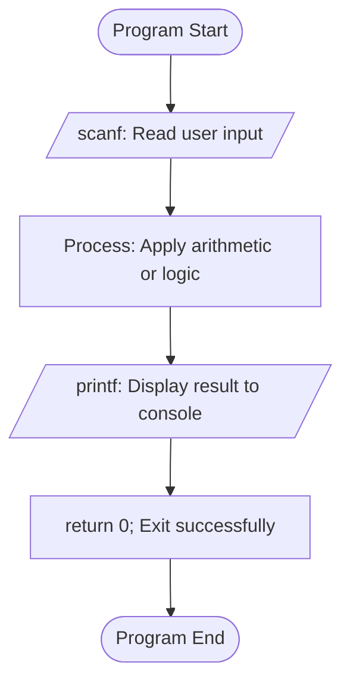
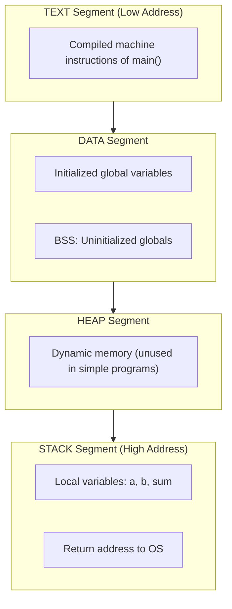
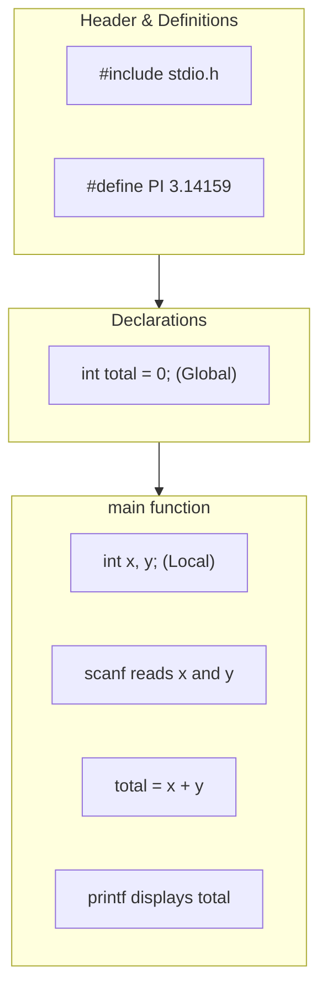

# Simple programs.

<!-- SECTION_1_START -->
# 1. Core Technical Definition & Intuitive Overview

## Formal Definition (KTU 2024 Syllabus Terminology)

A **Simple Program in C** is a sequential, top-to-bottom executable set of instructions written using the C language's structured syntax, designed to perform basic input, processing, and output (IPO) operations. In the context of the **KTU 2024 Scheme (Course Code: GXEST204)**, Module 1 treats simple programs as the foundational building blocks used to internalize the **C compilation pipeline**, **data types**, **tokens**, **operators**, and **I/O library functions** (`printf`, `scanf`, `getchar`, `putchar`).

> [!IMPORTANT]
> **KTU 2024 Module 1 Highlight:** Every simple program in C must be tested using the standard **GCC compiler** under the **Linux (Ubuntu/Fedora)** development environment. Familiarity with commands like `gcc filename.c -o output` and `./output` is mandatory for Lab evaluation.

## Conceptual Analogy / Intuition

Think of a simple C program like a **restaurant order ticket**:
- **The Kitchen (Compiler):** Only understands very specific instructions in a fixed order.
- **The Waiter (Preprocessor & `main` function):** Takes your request, asks the kitchen to prepare it (`printf` is like serving the dish, `scanf` is like asking "What would you like to order?").
- **The Order Pad (Source Code):** Must follow an exact format — if you forget to write the dish name or the table number, the order cannot be processed.

A simple C program is just a "Hello World", a "Sum of two numbers", or a "Temperature converter" — recipes that follow a strict recipe format.

> [!NOTE]
> **Core Structural Definition:** A C program is a collection of one or more **functions**, where execution always begins from the function named **`main()`**. Pre-defined functions like `printf()` and `scanf()` are accessed by including **header files** (e.g., `stdio.h`).

## Visualization Control: Flow of a Simple C Program

> [!VISUALIZATION CONTROL]
> **Concept:** Execution Flow of a Simple C Program (IPO Model)
> **GeoGebra / Desmos Input Equations:** Not applicable — represented as a flowchart below in Section 4.
> **Visual Description:** The diagram below shows Input (from keyboard via `scanf`) → Processing (arithmetic in `main`) → Output (to console via `printf`).
<!-- SECTION_1_END -->

<!-- SECTION_2_START -->
# 2. Deep Theoretical Analysis & KTU High-Yield Formula Sheet

## Theoretical Breakdown of a Simple C Program

A C program is composed of **6 logical blocks**. Understanding each block is critical for KTU's Module 1 questions.

1. **Documentation Section** — Comments at the top (`//` or `/* ... */`). Carries **zero marks** in execution, but examiners award marks for readability.
2. **Preprocessor Directives** — Lines starting with `#` (e.g., `#include <stdio.h>`). These are processed *before* compilation.
3. **Global Declaration Section** — Variables declared outside `main()`, visible to all functions.
4. **`main()` Function** — The mandatory entry point. Every C program must have **exactly one** `main()`.
5. **User-Defined Functions** — Optional, but used in modular programs.
6. **Sub-routines / Library Calls** — Pre-written code from `<stdio.h>`, `<math.h>`, etc.

### Why the Structure Matters (The "How" & "Why")

- **Why `#include <stdio.h>`?** Because `printf` and `scanf` are *not* built into the C language itself; they live inside this **header file**. Without including it, the compiler throws an *implicit declaration* error.
- **Why `int main()`?** The `int` keyword tells the OS that the program will return an **integer exit code** (`0` = success, non-zero = error). This is a **POSIX standard**.
- **Why `return 0;`?** It signals successful termination to the operating system.

## The C Compilation Pipeline (High-Yield for KTU)

$$\text{Source Code} \xrightarrow{\text{Preprocessor}} \text{Expanded Source} \xrightarrow{\text{Compiler}} \text{Assembly Code} \xrightarrow{\text{Assembler}} \text{Object Code} \xrightarrow{\text{Linker}} \text{Executable} \xrightarrow{\text{Loader}} \text{RAM (Execution)}$$

## KTU Formula Sheet / Cheat Sheet

| **Concept** | **Syntax / Equation** | **Units / Notes** |
|---|---|---|
| Program Entry Point | $\text{int main()}\{\dots \text{return 0;}\}$ | Mandatory; returns $0$ on success |
| Header Inclusion | $\#\text{include} < \text{stdio.h} >$ | Case-sensitive, no semicolon |
| Print Integer | $\text{printf}("\text{\%d}", x);$ | `%d` for `int`, `%ld` for `long` |
| Print Float | $\text{printf}("\text{\%.2f}", x);$ | `%.2f` prints 2 decimal places |
| Print Character | $\text{printf}("\text{\%c}", ch);$ | `%c` for `char` |
| Print String | $\text{printf}("\text{\%s}", str);$ | `%s` for `char` array |
| Read Integer | $\text{scanf}("\text{\%d}", \&x);$ | The `&` (address-of) operator is **mandatory** |
| Read Float | $\text{scanf}("\text{\%f}", \&x);$ | Use `%lf` for `double` |
| Addition | $c = a + b$ | Operands must be of compatible types |
| Type Casting | $y = (\text{int})3.14159$ | Explicit conversion via cast operator |
| Newline Escape | $\text{\textbackslash n}$ | Moves cursor to next line |
| Tab Escape | $\text{\textbackslash t}$ | Inserts horizontal tab |
| Arithmetic Operators | $+,-,\times,/,\%$ | `%` is **modulus**, valid only for integers |
| Relational Operators | $<, >, <=, >=, ==, !=$ | Return `1` (true) or `0` (false) |
| Logical Operators | $\&\&, \vert\vert, !$ | Used in decision-making |
| Increment / Decrement | $x++, ++x, x--, --x$ | Pre vs post differ in expressions |

> [!NOTE]
> **Real-World Engineering Utility:** Simple C programs form the basis of **embedded systems firmware** (washing machines, microwaves), **driver code** in operating systems, and **microcontroller programming** (Arduino, ESP32). The IPO model you learn here is identical to the data flow in **SCADA systems** and **IoT sensor nodes**.

## Standard C Program Skeleton (Must Memorize)

$$\begin{aligned}
&\text{Documentation:} && //\text{ Author, Date, Purpose} \\
&\text{Link Section:} && \#\text{include} < \text{stdio.h} > \\
&\text{Definition:} && \#\text{define PI } 3.14159 \\
&\text{Global Declaration:} && \text{int count} = 0; \\
&\text{main Function:} && \text{int main() } \{ \\
&\text{  Local Declaration:} && \text{ int } a, b, \text{ sum}; \\
&\text{  Executable:} && \text{ scanf}("\%d\%d", \&a, \&b); \\
&                      && \text{ sum} = a + b; \\
&                      && \text{ printf}("\%d", \text{sum}); \\
&                      && \text{ return } 0; \\
&\text{User Functions:} && \} \text{ /\* end of main \*/}
\end{aligned}$$
<!-- SECTION_2_END -->

<!-- SECTION_3_START -->
# 3. Step-by-Step Derivations & Code/Symbolic Implementation

## Worked Example 1: Sum of Two Numbers (IPO Model)

### Problem Statement
Write a C program to read two integers from the user and print their sum.

### Step-by-Step Logic Derivation

**Step 1 — Identify Inputs:** Two integers, say $a$ and $b$.
**Step 2 — Identify Output:** A single integer, $c = a + b$.
**Step 3 — Identify Process:** Use the `+` arithmetic operator.
**Step 4 — Identify Storage:** Use `int` data type (range $-2^{31}$ to $2^{31}-1$).

### Fully Implemented C Code

```c
/* Program: sum_of_two.c
 * Author: Student
 * Purpose: Demonstrates basic IPO using scanf and printf
 */
#include <stdio.h>     // Step 1: Include standard I/O header

int main(void) {        // Step 2: Entry point; void = no command-line args
    int a, b, sum;      // Step 3: Variable declaration (all are int)

    // Step 4: Prompt user for input
    printf("Enter two integers: ");

    // Step 5: Read input. The & symbol passes the memory address
    if (scanf("%d %d", &a, &b) != 2) {
        fprintf(stderr, "Invalid input. Exiting.\n");
        return 1;       // Non-zero exit code signals error
    }

    // Step 6: Process the arithmetic
    sum = a + b;

    // Step 7: Display output
    printf("The sum of %d and %d is %d\n", a, b, sum);

    return 0;           // Step 8: Signal successful termination
}
```

### Compilation & Execution Steps (For KTU Lab Exam)

```bash
# Save the file as sum_of_two.c, then in terminal:
gcc sum_of_two.c -o sum_of_two
./sum_of_two
```

**Sample Run:**

$$\begin{aligned}
\text{Input:}  & \quad 5 \quad 7 \\
\text{Output:} & \quad \text{The sum of 5 and 7 is 12}
\end{aligned}$$

---

## Worked Example 2: Area and Circumference of a Circle

### Mathematical Setup

The area of a circle is given by:

$$A = \pi \times r^2$$

The circumference is:

$$C = 2 \times \pi \times r$$

### Step-by-Step Derivation

**Step 1 — Constants:** Use $\pi \approx 3.14159$, declared via `#define PI 3.14159`.
**Step 2 — Input:** Read radius $r$ as `float`.
**Step 3 — Compute:**

$$\begin{aligned}
\text{area} &= PI \times r \times r \\
\text{circumference} &= 2 \times PI \times r
\end{aligned}$$

**Step 4 — Output:** Format to 2 decimal places using `%.2f`.

### Fully Implemented C Code

```c
#include <stdio.h>
#define PI 3.14159f   // Symbolic constant (no semicolon, no =)

int main(void) {
    float radius, area, circumference;

    printf("Enter the radius of the circle: ");
    if (scanf("%f", &radius) != 1 || radius < 0.0f) {
        fprintf(stderr, "Error: Radius must be non-negative.\n");
        return 1;
    }

    area = PI * radius * radius;
    circumference = 2.0f * PI * radius;

    printf("Radius         = %.2f units\n", radius);
    printf("Area           = %.2f sq.units\n", area);
    printf("Circumference  = %.2f units\n", circumference);

    return 0;
}
```

### Sample Numerical Trace

$$\begin{aligned}
\text{Input radius } r &= 5.0 \\
\text{Area } A &= 3.14159 \times 5.0 \times 5.0 = 78.5398 \\
\text{Circumference } C &= 2.0 \times 3.14159 \times 5.0 = 31.4159
\end{aligned}$$

---

## Worked Example 3: Temperature Conversion (Celsius to Fahrenheit)

### Mathematical Derivation

The conversion formula is:

$$F = \left(\frac{9}{5}\right) \times C + 32$$

Derivation from first principles (linear interpolation between ice point and steam point):

$$\begin{aligned}
F - 32 &= \frac{212 - 32}{100 - 0} \times (C - 0) \\
F - 32 &= \frac{180}{100} \times C \\
F - 32 &= \frac{9}{5} \times C \\
\therefore F &= \frac{9}{5} C + 32
\end{aligned}$$

### Fully Implemented C Code

```c
#include <stdio.h>

int main(void) {
    float celsius, fahrenheit;

    printf("Enter temperature in Celsius: ");
    if (scanf("%f", &celsius) != 1) {
        fprintf(stderr, "Invalid numeric input.\n");
        return 1;
    }

    /* 9.0/5.0 is used instead of 9/5 to force floating-point division.
       If we wrote 9/5, integer division would give 1, which is wrong. */
    fahrenheit = (9.0f / 5.0f) * celsius + 32.0f;

    printf("%.2f C = %.2f F\n", celsius, fahrenheit);
    return 0;
}
```

### Numerical Verification

$$\begin{aligned}
\text{Input: } C &= 100.0 \\
\text{Output: } F &= \left(\frac{9}{5}\right) \times 100 + 32 = 180 + 32 = 212.0
\end{aligned}$$

---

## Worked Example 4: Simple vs Compound Interest

### Mathematical Derivation

**Simple Interest (SI):**

$$SI = \frac{P \times R \times T}{100}$$

**Amount (A):**

$$A = P + SI = P \left(1 + \frac{R \times T}{100}\right)$$

**Compound Interest (CI):**

$$A = P \left(1 + \frac{R}{100}\right)^{T}$$

$$CI = A - P = P \left[\left(1 + \frac{R}{100}\right)^{T} - 1\right]$$

### C Code with `pow()` Function

```c
#include <stdio.h>
#include <math.h>   // Required for pow() function

int main(void) {
    double principal, rate, time;
    double simple_interest, compound_interest, amount;

    printf("Enter Principal, Rate (%%), and Time (years): ");
    if (scanf("%lf %lf %lf", &principal, &rate, &time) != 3) {
        fprintf(stderr, "Input error.\n");
        return 1;
    }

    /* Simple Interest Computation */
    simple_interest = (principal * rate * time) / 100.0;
    amount = principal + simple_interest;

    /* Compound Interest Computation
       pow(base, exponent) returns base raised to the power of exponent.
       For example, pow(1.1, 2) returns 1.21 */
    amount = principal * pow((1.0 + rate / 100.0), time);
    compound_interest = amount - principal;

    printf("Simple Interest    = %.2f\n", simple_interest);
    printf("Compound Interest  = %.2f\n", compound_interest);

    return 0;
}
```

> [!IMPORTANT]
> **Compilation Note for KTU Lab:** When using `<math.h>`, you must link the math library explicitly:
> ```bash
> gcc interest.c -o interest -lm
> ```
> The flag **`-lm`** (link math) is mandatory on Linux GCC. Forgetting it causes an *undefined reference to `pow`* linker error.

### Numerical Trace

$$\begin{aligned}
\text{Input: } P &= 1000, R = 5, T = 2 \\
\text{SI} &= \frac{1000 \times 5 \times 2}{100} = 100 \\
\text{CI Amount} &= 1000 \times (1.05)^{2} = 1000 \times 1.1025 = 1102.5 \\
\text{CI} &= 1102.5 - 1000 = 102.5
\end{aligned}$$

---

## Worked Example 5: Swap Two Numbers (Using a Temporary Variable)

### Step-by-Step Derivation

**Step 1:** Store $a$ in a temporary variable $t$.
**Step 2:** Assign value of $b$ to $a$.
**Step 3:** Assign value of $t$ to $b$.

Mathematical representation:

$$\begin{aligned}
t &\leftarrow a \\
a &\leftarrow b \\
b &\leftarrow t
\end{aligned}$$

### C Code

```c
#include <stdio.h>

int main(void) {
    int a, b, temp;

    printf("Enter two integers (a b): ");
    if (scanf("%d %d", &a, &b) != 2) {
        fprintf(stderr, "Invalid input.\n");
        return 1;
    }

    printf("Before swap: a = %d, b = %d\n", a, b);

    temp = a;
    a = b;
    b = temp;

    printf("After swap:  a = %d, b = %d\n", a, b);
    return 0;
}
```

### Sample Trace

$$\begin{aligned}
\text{Input: } a &= 10, b &= 20 \\
\text{After swap: } a &= 20, b &= 10
\end{aligned}$$

---

## Worked Example 6: Type Conversion & Casting

### Implicit vs Explicit Casting

| Conversion Type | Triggered By | Example |
|---|---|---|
| **Implicit (Automatic)** | Compiler promotes lower to higher type | `int` + `float` → `float` |
| **Explicit (Manual)** | Programmer uses cast operator `(type)` | `(int)3.14` → `3` |

### Mathematical Demonstration

Suppose we compute the average of two integers $a$ and $b$:

$$\text{average} = \frac{a + b}{2}$$

If $a = 5$ and $b = 7$:

$$\frac{5 + 7}{2} = \frac{12}{2} = 6 \text{ (correct, since both are int)}$$

But if $a = 5$ and $b = 6$:

$$\frac{5 + 6}{2} = \frac{11}{2} = 5 \text{ (integer division truncates)}$$

To get `5.5`, we need floating-point division:

$$\text{average} = \frac{(float)(a + b)}{2}$$

### C Code

```c
#include <stdio.h>

int main(void) {
    int a = 5, b = 6;
    float avg;

    /* Without cast: integer division occurs */
    avg = (a + b) / 2;
    printf("Without cast: avg = %f\n", avg);  // Output: 5.000000

    /* With cast: forces floating-point division */
    avg = (float)(a + b) / 2;
    printf("With cast:    avg = %f\n", avg);  // Output: 5.500000

    return 0;
}
```

> [!NOTE]
> **KTU Common Pitfall:** Placing the cast on the wrong operand. `(float)(a + b) / 2` is correct, but `(float)a + b / 2` is **not** equivalent because `/ 2` is integer division on `b / 2` first due to left-to-right precedence.
<!-- SECTION_3_END -->

<!-- SECTION_4_START -->
# 4. Structural Diagrams & Schematics

## Diagram 1: Execution Flow of a Simple C Program (IPO Model)



**Reading the Diagram:**

- The `startA` block represents the OS handing control to `main()`.
- `inputBlock` corresponds to `scanf()` calls.
- `processBlock` is where assignment, arithmetic, or expression evaluation happens.
- `outputBlock` is the `printf()` call.
- `returnBlock` and `endA` represent normal program termination.

## Diagram 2: C Compilation Pipeline

```mermaid
flowchart LR
    source["source.c<br>Human-readable code"] --> preprocess["Preprocessor<br>Handles #include, #define"]
    preprocess --> compile["Compiler<br>Translates to assembly"]
    compile --> assemble["Assembler<br>Converts to object code"]
    assemble --> link["Linker<br>Joins object files + libraries"]
    link --> executable["a.out / output.exe<br>Machine code"]
    executable --> run["Loader<br>Loads into RAM"]
    run --> output["Program Runs on CPU"]
```



## Diagram 3: Memory Layout During Simple Program Execution



## Diagram 4: Programmatic Flow — Modular Simple Program Structure


<!-- SECTION_4_END -->

<!-- SECTION_5_START -->
# 5. KTU 2024 Scheme Examination Question Bank & Topic Recap

## Part A Questions (3 Marks Each)

### Question A1
**[KTU University Exam — July 2024]** List any **four tokens** in C with one example each.

**Model Answer (4 × 0.75 = 3 Marks):**

1. **Keywords** — Reserved words with predefined meaning. *Example:* `int`, `return`, `if`.
2. **Identifiers** — Names given to variables, functions, or arrays. *Example:* `sum`, `radius`, `main`.
3. **Constants** — Fixed values that do not change. *Example:* `10`, `3.14`, `'A'`, `"Hello"`.
4. **Operators** — Symbols that perform operations. *Example:* `+`, `-`, `*`, `/`, `%`.
5. **String Literals** — Sequence of characters enclosed in double quotes. *Example:* `"KTU 2024"`.

---

### Question A2
**[KTU University Exam — Dec 2023]** Differentiate between **`printf()`** and **`scanf()`** functions.

**Model Answer:**

| Feature | `printf()` | `scanf()` |
|---|---|---|
| **Purpose** | Outputs data to console | Reads data from keyboard |
| **Direction** | Program → User | User → Program |
| **Arguments** | Variables, literals, expressions | Pointers (uses `&` operator) |
| **Format Specifier** | `%d`, `%f`, `%c`, `%s` | `%d`, `%f`, `%c`, `%s` |
| **Return Value** | Number of characters printed | Number of successfully read items |
| **Header** | `<stdio.h>` | `<stdio.h>` |

---

## Part B Questions (14 Marks Each — Internal Choice Pattern)

### Question A (14 Marks)
**[KTU University Exam — July 2024 | CO1, Apply]**

**(a)** Write a C program to read three sides of a triangle and calculate its **area** using **Heron's formula**. (7 Marks)

**(b)** Explain the **structure of a C program** with a neat labeled diagram and state the role of the preprocessor. (7 Marks)

---

### Model Solution for (a) — 7 Marks

**Heron's Formula Derivation:**

$$s = \frac{a + b + c}{2}$$

$$A = \sqrt{s \times (s - a) \times (s - b) \times (s - c)}$$

**Valuation Key Points:**
- Correct header and variable declarations: **2 Marks**
- Correct Heron's formula implementation: **3 Marks**
- Proper output formatting: **1 Mark**
- Compilation-ready code: **1 Mark**

**Complete C Code:**

```c
#include <stdio.h>
#include <math.h>   // For sqrt() function

int main(void) {
    double a, b, c, s, area;

    printf("Enter three sides of the triangle: ");
    if (scanf("%lf %lf %lf", &a, &b, &c) != 3) {
        fprintf(stderr, "Invalid input.\n");
        return 1;
    }

    /* Triangle inequality check (good practice) */
    if (a + b <= c || a + c <= b || b + c <= a) {
        fprintf(stderr, "These sides do not form a valid triangle.\n");
        return 1;
    }

    s = (a + b + c) / 2.0;
    area = sqrt(s * (s - a) * (s - b) * (s - c));

    printf("Semi-perimeter s = %.2f\n", s);
    printf("Area of triangle  = %.2f sq.units\n", area);
    return 0;
}
```

**Numerical Trace:**

$$\begin{aligned}
\text{Input: } a &= 3, b &= 4, c &= 5 \\
s &= \frac{3 + 4 + 5}{2} = 6 \\
A &= \sqrt{6 \times 3 \times 2 \times 1} = \sqrt{36} = 6.0
\end{aligned}$$

---

### Model Solution for (b) — 7 Marks

**Structure of a C Program:**

| **Section** | **Purpose** | **Example** |
|---|---|---|
| 1. Documentation | Comments for readability | `/* Author: XYZ */` |
| 2. Link Section | Includes header files | `#include <stdio.h>` |
| 3. Definition Section | Symbolic constants | `#define PI 3.14` |
| 4. Global Declaration | Variables visible to all functions | `int count = 0;` |
| 5. `main()` Function | Mandatory entry point | `int main() { ... }` |
| 6. Subprograms | User-defined functions | `int add(int, int);` |

**Role of the Preprocessor (3 Marks):**
- Processes lines starting with `#` *before* compilation.
- `#include` copies the contents of the header file into the source.
- `#define` performs macro substitution.
- Conditional compilation via `#ifdef`, `#endif`.
- Output: a **pure C translation unit** with no preprocessor directives.

---

### Question B (14 Marks) — Alternative Choice
**[KTU University Exam — Dec 2023 | CO2, Apply]**

**(a)** Write a C program to compute the **sum of digits** of a given 5-digit integer entered by the user. (7 Marks)

**(b)** Explain **type conversion** in C with a suitable example for both implicit and explicit conversion. (7 Marks)

---

### Model Solution for (a) — 7 Marks

**Algorithm Derivation:**

If the number is $N = 12345$, then:

$$\begin{aligned}
d_1 &= N \mod 10 = 5 \\
d_2 &= \lfloor N / 10 \rfloor \mod 10 = 4 \\
d_3 &= \lfloor N / 100 \rfloor \mod 10 = 3 \\
\dots
\end{aligned}$$

General loop formulation: `digit = N % 10; sum += digit; N = N / 10;`

**Valuation Key Points:**
- Correct loop termination logic: **2 Marks**
- Correct use of `%` and `/` operators: **3 Marks**
- Output formatting: **1 Mark**
- Edge case (negative number): **1 Mark**

**Complete C Code:**

```c
#include <stdio.h>

int main(void) {
    int number, sum = 0, digit;

    printf("Enter a 5-digit integer: ");
    if (scanf("%d", &number) != 1) {
        fprintf(stderr, "Invalid input.\n");
        return 1;
    }

    /* Handle negative numbers by taking absolute value */
    if (number < 0) {
        number = -number;
    }

    /* Extract and sum digits using a while loop */
    int temp = number;
    while (temp > 0) {
        digit = temp % 10;
        sum = sum + digit;
        temp = temp / 10;
    }

    printf("Sum of digits of %d = %d\n", number, sum);
    return 0;
}
```

**Numerical Trace:**

$$\begin{aligned}
\text{Input: } N &= 12345 \\
\text{Iteration 1: } d &= 5, \text{ sum} = 5, \text{ temp} = 1234 \\
\text{Iteration 2: } d &= 4, \text{ sum} = 9, \text{ temp} = 123 \\
\text{Iteration 3: } d &= 3, \text{ sum} = 12, \text{ temp} = 12 \\
\text{Iteration 4: } d &= 2, \text{ sum} = 14, \text{ temp} = 1 \\
\text{Iteration 5: } d &= 1, \text{ sum} = 15, \text{ temp} = 0 \\
\text{Stop.}
\end{aligned}$$

---

### Model Solution for (b) — 7 Marks

**Type Conversion Table:**

| **Type** | **Definition** | **Code Example** |
|---|---|---|
| **Implicit** | Compiler automatically converts lower to higher type | `float x = 5;` (int 5 → float 5.0) |
| **Explicit** | Programmer forces conversion via cast | `int y = (int)3.14;` (y = 3) |

**Implicit Conversion Hierarchy (lower → higher):**

$$\text{char} \rightarrow \text{int} \rightarrow \text{long} \rightarrow \text{float} \rightarrow \text{double}$$

**C Code Demonstrating Both:**

```c
#include <stdio.h>

int main(void) {
    int a = 7, b = 2;
    float result;

    /* IMPLICIT: int / int would be integer division 7/2 = 3.
       Here, b is promoted to float, so result = 3.5 */
    result = a / (float)b;
    printf("Implicit result = %.2f\n", result);

    /* EXPLICIT: truncates the float back to int */
    float pi = 3.14159;
    int truncated = (int)pi;
    printf("Explicit cast: (int)%f = %d\n", pi, truncated);

    return 0;
}
```

> [!WARNING]
> **KTU Examiner's Valuation Warning / Pitfall Callout:**
> 1. **Forgetting the `&` in `scanf`** — This is the **#1 mark-deduction** in C lab exams. Without `&`, `scanf` writes to a garbage memory address, causing a **segmentation fault**.
> 2. **Using `=` instead of `==`** — `=` is assignment; `==` is comparison. Writing `if (a = 5)` assigns 5 to `a` and is **always true**.
> 3. **Missing `return 0;`** — Modern compilers warn, but KTU examiners explicitly check for this and deduct 0.5 to 1 mark.
> 4. **Integer division in formulas** — Writing `(a + b) / 2` when $a$ and $b$ are integers can silently produce wrong results.
> 5. **Not linking `-lm` for `<math.h>`** — Compilation succeeds but linking fails.
> 6. **Forgetting to escape `%%` in `printf`** — To print a literal `%`, you must write `%%` inside the format string.

---

## Topic Recap & Important Things to Remember

- **Every C program must have exactly one `main()` function** — this is the entry point; execution always starts here.
- **Header files are included using `#include <name.h>`** — `#include <stdio.h>` is mandatory for `printf` and `scanf`; `#include <math.h>` is needed for `sqrt`, `pow`, `sin`, `cos`.
- **`printf` uses format specifiers** — `%d` (int), `%ld` (long), `%f` (float), `%lf` (double), `%c` (char), `%s` (string). To control decimal places, use `%.2f` for 2 decimals.
- **`scanf` requires the address-of operator `&`** before every variable (except arrays/strings). Skipping `&` causes undefined behavior.
- **Type casting comes in two forms** — *implicit* (compiler-driven, lower → higher type) and *explicit* (programmer-forced via `(type)`).
- **Integer division truncates** — `7 / 2` gives `3`, not `3.5`. Use `7.0 / 2` or `7 / 2.0` or `(float)7 / 2` to force float division.
- **Escape sequences start with backslash** — `\n` (newline), `\t` (tab), `\"` (double quote), `\\` (backslash).
- **Compilation steps (memorize the pipeline):** Source → Preprocessor → Compiler → Assembler → Linker → Executable → Loader → RAM → CPU.
- **The compilation command is `gcc file.c -o output`** followed by **`./output`** to run. Add **`-lm`** to link the math library.
- **`return 0;` in `main()` signals success** — non-zero return values indicate errors to the operating system.
- **The `%` (modulus) operator works only on integers** — `5.5 % 2` is a compilation error in standard C.
- **Symbolic constants are declared with `#define`** — they don't have a semicolon at the end, and the value is textually substituted before compilation.
- **Predefined keywords cannot be used as variable names** — `int`, `return`, `if`, `else`, `while`, `for` are reserved.
<!-- SECTION_5_END -->
