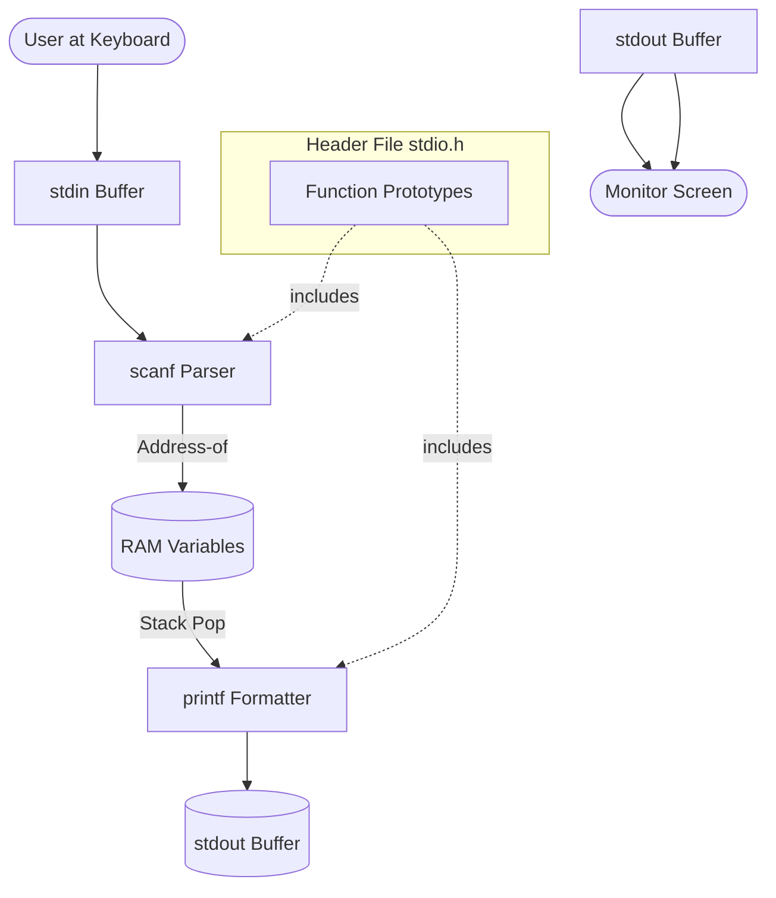
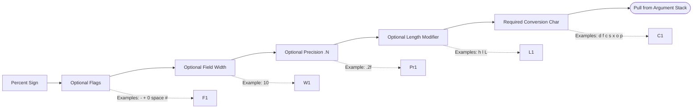
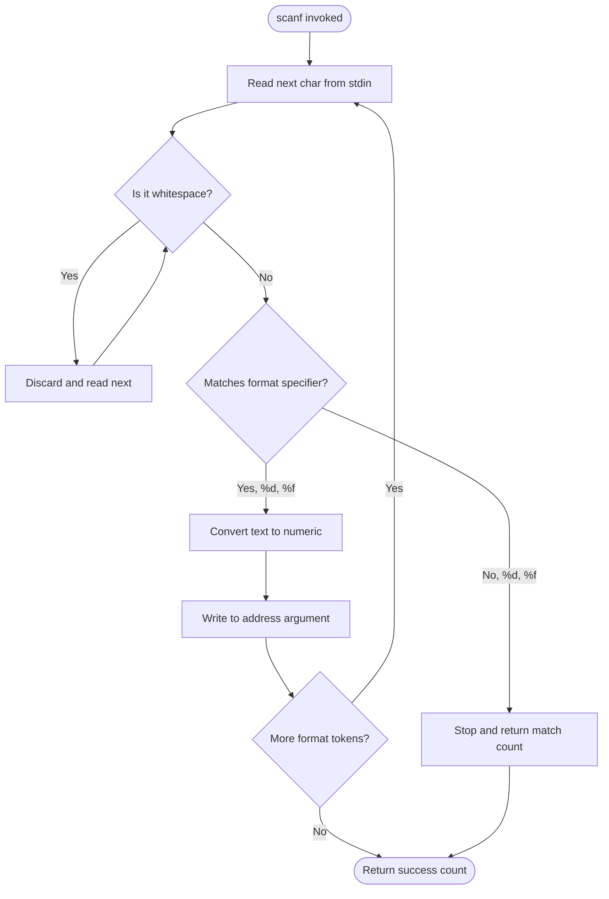

# Statements - Input and Output statements

<!-- SECTION_1_START -->
# Statements — Input and Output Statements in C

## 1.1 Formal Academic Definition (KTU 2024 Syllabus Terminology)

In the C programming language, **Input/Output (I/O) statements** are the predefined library functions used to establish communication between a program and the standard peripheral devices (typically the keyboard for input and the monitor for output). The C language itself does **not** contain any built-in I/O keywords; instead, all I/O operations are performed by invoking functions declared in the standard library header file **`<stdio.h>`** (Standard Input Output Header).

> [!IMPORTANT]
> **Syllabus Highlight (KTU 2024 — Module 1):** Students must memorize the categories of I/O functions: **Formatted I/O** (`printf`, `scanf`) and **Unformatted / Character I/O** (`getchar`, `putchar`, `gets`, `puts`). Mastery of **format specifiers** and **escape sequences** is a guaranteed question in every Series Test and University Exam.

The two principal categories are:

| Category | Functions | Header File | Purpose |
| :--- | :--- | :--- | :--- |
| **Formatted I/O** | `printf()`, `scanf()` | `<stdio.h>` | Type-aware data transfer using conversion specifiers |
| **Unformatted Character I/O** | `getchar()`, `putchar()` | `<stdio.h>` | Single character reading and writing |
| **Unformatted String I/O** | `gets()`, `puts()` | `<stdio.h>` | Line-oriented string reading and writing |

## 1.2 Conceptual Analogy & Intuitive Overview

> [!NOTE]
> **Intuition: The Translator Booth**
> Imagine your C program is a person who speaks only a very precise mathematical language, but the user (you) speaks plain English and decimal numbers. The function `printf()` is a **translator broadcasting to a microphone** (the screen) — it converts internal binary values into human-readable text. The function `scanf()` is a **translator listening through an earpiece** (the keyboard) — it converts the text typed by the user into binary values the program can store in memory.

**The standard streams** used by these functions are:
* **stdin** — Standard Input device (usually the keyboard)
* **stdout** — Standard Output device (usually the monitor)
* **stderr** — Standard Error device (also the monitor, but unbuffered)

> [!TIP]
> The KTU examiner will **always** award marks if you explicitly mention that these functions return values. `printf()` returns the number of characters printed; `scanf()` returns the number of successful conversions.

## 1.3 Visualization of a Formatted Output

> [!VISUALIZATION CONTROL]
> **Concept:** Visualizing how a format specifier maps to a memory location
> **GeoGebra / Desmos Input Equations:**
> * `Point("format", 0, 0)` represents the `%` literal
> * `Point("type", 1, 0)` represents the conversion character (e.g., `d`)
> * `Point("value", 2, 0)` represents the variable fetched from RAM
> **Visual Description:** Picture a horizontal pipeline. The `%d` token is a "hole" cut into a string template; the program drops the integer variable from memory into that hole before flushing the final text to the screen.

<!-- SECTION_1_END -->

<!-- SECTION_2_START -->
# Deep Theoretical Analysis & KTU High-Yield Formula Sheet

## 2.1 Anatomy of `printf()` — The Formatted Output Function

The general syntax of the standard output function is:

```c
int printf(const char *format_string, ...);
```

The first argument is a **string literal** (or a `char` pointer) that contains two kinds of items:
1. **Ordinary characters** — copied directly to the output stream.
2. **Conversion specifications** — begin with `%` and are replaced by the values of the successive additional arguments.

### Step-by-Step Logic of `printf()`
* **Step 1:** The function reads the format string from left to right.
* **Step 2:** When a `%` is encountered, it triggers a *conversion specification parser*.
* **Step 3:** The parser reads any optional **flags** (e.g., `-`, `+`, `0`, ` `, `#`).
* **Step 4:** It reads an optional **field width** (minimum number of characters to output).
* **Step 5:** It reads an optional **precision** (a dot `.` followed by a number).
* **Step 6:** It reads an optional **length modifier** (`h`, `l`, `L`).
* **Step 7:** It reads the mandatory **conversion specifier** (`d`, `f`, `c`, `s`, etc.).
* **Step 8:** It pops the next variable from the argument stack, converts it according to the specifier, and embeds the result in the output.

## 2.2 Anatomy of `scanf()` — The Formatted Input Function

```c
int scanf(const char *format_string, ...);
```

* `scanf` requires the **addresses** of variables (using the `&` address-of operator), because it must *write* into those memory locations.
* It skips **whitespace** by default before reading most numeric values (but not for `%c` or `%[`).
* It returns the number of items **successfully matched and assigned**.

> [!WARNING]
> **Common KTU Mistake:** Writing `scanf("%d", a);` instead of `scanf("%d", &a);` will compile but produce undefined behaviour at runtime. This is the most penalized error in board evaluations.

## 2.3 KTU High-Yield Cheat Sheet

### Conversion (Format) Specifiers

| Specifier | Meaning | Data Type Expected | Example Code |
| :--- | :--- | :--- | :--- |
| `%d` | Signed decimal integer | `int` | `printf("%d", 25);` |
| `%u` | Unsigned decimal integer | `unsigned int` | `printf("%u", 25u);` |
| `%f` | Fixed-point notation float | `float`, `double` | `printf("%f", 3.14);` |
| `%lf` | Long float (double in scanf) | `double` | `scanf("%lf", &x);` |
| `%c` | Single character | `char` | `printf("%c", 'A');` |
| `%s` | String of characters | `char[]` | `printf("%s", "KTU");` |
| `%x` | Hexadecimal integer | `int` | `printf("%x", 255);` |
| `%o` | Octal integer | `int` | `printf("%o", 8);` |
| `%e` | Scientific (exponential) | `float`/`double` | `printf("%e", 1234.5);` |
| `%ld` | Long signed decimal | `long int` | `printf("%ld", 50000L);` |
| `%p` | Pointer address | `void *` | `printf("%p", ptr);` |
| `%%` | Literal percent sign | (none) | `printf("50%%");` |

### Common Escape Sequence Constants

| Escape | Meaning | ASCII Action |
| :--- | :--- | :--- |
| `\n` | Newline | Moves cursor to the next line |
| `\t` | Horizontal tab | Advances to the next tab stop |
| `\b` | Backspace | Moves cursor one position back |
| `\r` | Carriage return | Returns cursor to the line start |
| `\a` | Alert (bell) | Triggers system beep |
| `\\` | Backslash | Prints a single `\` |
| `\'` | Single quote | Prints a single `'` |
| `\"` | Double quote | Prints a single `"` |
| `\0` | Null character | String terminator |
| `\f` | Form feed | Advances paper to next page (printers) |
| `\v` | Vertical tab | Vertical whitespace |
| `\?` | Question mark | Used to avoid trigraphs |

## 2.4 Real-World Engineering Utility

In production engineering, the I/O subsystem is the **bridge between the model and the observer**.
* In **embedded systems** (KTU ECE/EEE students), `printf` is retargeted via `fputc()` to a UART serial port to send telemetry to a PC.
* In **data acquisition**, `scanf` is replaced by `sscanf` or hardware driver functions that parse sensor registers.
* In **HPC and scientific computing**, low-level `write()` system calls bypass the `printf` formatting engine for raw performance — but the formatting model is identical.

<!-- SECTION_2_END -->

<!-- SECTION_3_START -->
# Step-by-Step Derivations, Code Implementations & Worked Examples

## 3.1 Exhaustive Demonstrations of `printf()`

### Example 1 — Field Width and Left Justification

```c
#include <stdio.h>

int main(void) {
    int roll_no = 47;
    float marks = 92.5f;
    char grade = 'A';

    /* %5d   -> Right-aligned, width 5
       %-10s -> Left-aligned string, width 10
       %6.2f -> Width 6, 2 decimal places
       %c    -> Single character                    */
    printf("%5d\n", roll_no);
    printf("%-10s\n", "Result");
    printf("%6.2f\n", marks);
    printf("%c\n", grade);

    return 0;
}
```

**Line-by-Line Output Trace:**

| Format String | Internal Memory State | Resulting Screen Output |
| :--- | :--- | :--- |
| `"%5d"` | `roll_no = 47` | `   47` (two leading spaces) |
| `"%-10s"` | `"Result"` | `Result    ` (four trailing spaces) |
| `"%6.2f"` | `marks = 92.5` | ` 92.50` (one leading space) |
| `"%c"` | `grade = 'A'` | `A` |

### Example 2 — Printing the Percent Sign Itself

```c
#include <stdio.h>

int main(void) {
    float discount = 12.5f;
    /* %% outputs a single % to the screen           */
    printf("Discount offered: %.1f%%\n", discount);
    return 0;
}
```

**Final Output:**
`Discount offered: 12.5%`

**Conversion Logic:**
1. The first `%.1f` is a valid format specifier requesting 1-decimal precision → engine pulls `discount` (12.5) and formats it as `12.5`.
2. The `%%` sequence is interpreted as a literal `%` — no argument is consumed.
3. The `\n` escape sequence triggers a carriage return + line feed.

## 3.2 Exhaustive Demonstrations of `scanf()`

### Example 3 — Reading Multiple Heterogeneous Inputs

```c
#include <stdio.h>

int main(void) {
    int age;
    float cgpa;
    char grade;
    char name[50];

    printf("Enter age, cgpa, grade, and name: ");
    /* scanf reads them separated by whitespace      */
    int result = scanf("%d %f %c %s", &age, &cgpa, &grade, name);

    printf("Items successfully read: %d\n", result);
    printf("Age  : %d\n", age);
    printf("CGPA : %.2f\n", cgpa);
    printf("Grade: %c\n", grade);
    printf("Name : %s\n", name);

    return 0;
}
```

**Sample Run:**
```
Enter age, cgpa, grade, and name: 20 9.15 A Rahul
Items successfully read: 4
Age  : 20
CGPA : 9.15
Grade: A
Name : Rahul
```

**Argument Stack Mapping (Mandatory for Board Exams):**

| Format Token | Address Argument Required? | Why? |
| :--- | :--- | :--- |
| `%d` | Yes — `&age` | Must store 4-byte integer into `age` |
| `%f` | Yes — `&cgpa` | Must store 4-byte float into `cgpa` |
| `%c` | Yes — `&grade` | Must store 1-byte character into `grade` |
| `%s` | Yes — `name` (array decays to pointer) | Must write characters + `\0` into the array |

> [!NOTE]
> For an array like `char name[50]`, the array name itself **already is** the address of its first element. Writing `&name` would give a different type (`char (*)[50]`), which is technically a different address. The compiler in C will still accept it due to type compatibility, but the KTU-correct style is to write **just `name`**.

## 3.3 Character and String I/O Functions

### Example 4 — `getchar()` and `putchar()`

```c
#include <stdio.h>

int main(void) {
    int ch;
    printf("Enter a character: ");
    ch = getchar();             /* Reads ONE byte from stdin       */
    printf("You entered: ");
    putchar(ch);                /* Writes ONE byte to stdout       */
    putchar('\n');
    return 0;
}
```

### Example 5 — `gets()` and `puts()`

```c
#include <stdio.h>

int main(void) {
    char line[100];
    printf("Enter a line of text: ");
    gets(line);                 /* Reads until newline (unsafe)    */
    puts("You typed:");
    puts(line);                 /* Auto-appends \n                 */
    return 0;
}
```

> [!WARNING]
> `gets()` is **deprecated** and removed from the C11 standard because it allows buffer overflow. KTU accepts it in exam answers because it is in the syllabus, but in production code use `fgets(line, sizeof(line), stdin)`.

## 3.4 Format Specifier Precision Math (KTU-Favourite Problem)

**Problem:** What is the output of `printf("|%10.3e|", 123.4567);`?

**Step-by-Step Derivation:**

The format specifier breaks down as:
* `%` — start of conversion
* `10` — minimum field width
* `.3` — precision (digits after the decimal point)
* `e` — scientific notation (lowercase)

The value $123.4567$ in scientific notation is:
$$1.234567 \times 10^{2}$$

Applying the precision of 3 digits after the decimal point rounds it to:
$$1.235 \times 10^{2}$$

Formatted in `e`-style (with a 2-digit exponent):
$$\text{1.235e+02}$$

Now applying the field width of 10, the result string has 9 characters. We pad with **1 leading space** to reach width 10.

**Final Output:**
`| 1.235e+02|`

<!-- SECTION_3_END -->

<!-- SECTION_4_START -->
# Structural Diagrams & Schematics

## 4.1 Mermaid Diagram — The I/O Data Flow Architecture



**Reading the Diagram:**
* The solid arrows denote the runtime data path.
* The dotted arrow from `Decl` shows compile-time inclusion.
* `stdin` and `stdout` are **buffered full-duplex streams**; characters queue inside them before being processed in chunks, which is why pressing `Enter` is needed for `scanf` to flush.

## 4.2 Mermaid Diagram — Format Specifier Parsing Topology



**Key Insight for Students:** All five steps from `Flag` to `Len` are **optional**. The only mandatory tokens are the leading `%` and the trailing conversion character. If you forget the conversion character, the C compiler will throw a *format string syntax error* at runtime — not at compile time.

## 4.3 Mermaid Flowchart — Decision Logic Inside `scanf`



<!-- SECTION_4_END -->

<!-- SECTION_5_START -->
# KTU 2024 Scheme Examination Question Bank & Topic Recap

## 5.1 Part A — Short Answer Questions (3 Marks Each)

### Q1. **[KTU University Exam — July 2023]**
Differentiate between `printf()` and `scanf()` in C. Mention the header file used and the return type of each. **(CO1, Remember)**

**Model Answer (Valuation Key):**
* `printf()` is used for **output** (program → monitor); `scanf()` is used for **input** (keyboard → program). **[1 Mark]**
* The header file containing both is **`<stdio.h>`** (Standard Input Output Header). **[1 Mark]**
* `printf()` returns an `int` representing the number of characters printed; `scanf()` returns an `int` representing the number of items successfully read. **[1 Mark]**

### Q2. **[KTU University Exam — Dec 2022]**
What is the role of the `&` (address-of) operator in `scanf()`? Why is it not used with character arrays? **(CO1, Understand)**

**Model Answer (Valuation Key):**
* The `&` operator obtains the **memory address** of a variable so that `scanf()` can store the converted input directly into that memory location. Without it, `scanf` would have no destination to write to. **[2 Marks]**
* For character arrays like `char name[50]`, the array name itself **decays to a pointer** to the first element, which is already a valid memory address. Hence `&` is not required. **[1 Mark]**

---

## 5.2 Part B — Long Answer Questions (14 Marks Each)

> [!IMPORTANT]
> As per the **KTU 2024 ESE pattern**, Part B Module 1 questions carry **14 marks** with internal choice. You must answer **either Option A OR Option B in full**.

### Question A (14 Marks) — **[KTU University Exam — July 2024]**

**(a)** Explain the different **format specifiers** used in C with at least one example each. Discuss the significance of escape sequences with a suitable illustration. **[7 Marks] — (CO1, Understand)**

**Model Solution Outline:**
* Define format specifiers as tokens starting with `%` used to tell the compiler the type of data being processed. **[1 Mark]**
* Tabulate and explain: `%d` (int), `%f` (float), `%c` (char), `%s` (string), `%lf` (double), `%u` (unsigned), `%x` (hex), `%o` (octal), `%ld` (long), `%%` (literal percent). **[3 Marks]**
* Define escape sequences as backslash-prefixed non-printable characters. **[1 Mark]**
* Provide a code snippet using `\n`, `\t`, `\"`, `\\` inside `printf`. **[2 Marks]**

**(b)** Write a C program to read the **name, register number, and CGPA** of a student from the keyboard and display the details in a formatted report. Use appropriate I/O statements. **[7 Marks] — (CO1, Apply)**

**Complete Working C Program (Valuation-Ready):**

```c
#include <stdio.h>

int main(void) {
    char name[50];
    long int reg_no;
    float cgpa;

    /* --- Input Section --- */
    printf("Enter student name      : ");
    scanf("%s", name);

    printf("Enter register number   : ");
    scanf("%ld", &reg_no);

    printf("Enter CGPA out of 10    : ");
    scanf("%f", &cgpa);

    /* --- Output Section --- */
    printf("\n----- STUDENT REPORT -----\n");
    printf("Name           : %s\n", name);
    printf("Register No.   : %ld\n", reg_no);
    printf("CGPA           : %.2f / 10\n", cgpa);
    printf("--------------------------\n");

    return 0;
}
```

**Valuation Key Breakdown:**
* Correct header inclusion and `main` signature: **[1 Mark]**
* Proper variable declaration: **[1 Mark]**
* Correct use of `&` in `scanf` for scalars: **[2 Marks]**
* Correct use of `name` without `&` in `scanf`: **[1 Mark]**
* Formatted report using format specifiers in `printf`: **[2 Marks]**

### Question B (14 Marks) — **[KTU University Exam — Dec 2023]**

**(a)** Differentiate between **formatted** and **unformatted** I/O functions in C. List the unformatted I/O functions with their syntax. **[7 Marks] — (CO1, Understand)**

**Model Solution Outline:**
* Formatted I/O works with **all data types** using conversion specifiers (e.g., `printf("%d", x);`, `scanf("%f", &y);`). Unformatted I/O works **only with characters or strings** as raw byte streams. **[2 Marks]**
* List formatted functions: `printf`, `scanf`, `sprintf`, `sscanf`, `fprintf`, `fscanf`. **[1 Mark]**
* List unformatted functions: `getchar`, `putchar`, `gets`, `puts`, `fgetc`, `fputc`, `fgets`, `fputs`. **[1 Mark]**
* Show the syntax and one-line description of `getchar()`, `putchar()`, `gets()`, `puts()`. **[3 Marks]**

**(b)** Predict the output of the following C program. Justify each line. **[7 Marks] — (CO2, Apply)**

```c
#include <stdio.h>

int main(void) {
    int a = 123;
    float b = 4.5f;
    char c = 'Z';

    printf("[%5d]\n", a);
    printf("[%-5d]\n", a);
    printf("[%05d]\n", a);
    printf("[%10.2f]\n", b);
    printf("[%c%c]\n", c, c + 32);
    printf("Score: %d%%\n", 75);

    return 0;
}
```

**Step-by-Step Output Justification (Valuation Key):**

| Line | Format | Trace Logic | Output |
| :--- | :--- | :--- | :--- |
| 1 | `[%5d]` | Width 5, right-aligned, value 123 | `[  123]` |
| 2 | `[%-5d]` | Width 5, **left-aligned** with `-` flag | `[123  ]` |
| 3 | `[%05d]` | Width 5, padded with `0` (zero flag) | `[00123]` |
| 4 | `[%10.2f]` | Width 10, 2 decimals, value 4.5 | `[      4.50]` |
| 5 | `[%c%c]` | `'Z'` (90) and `'z'` (122) via ASCII add 32 | `[Zz]` |
| 6 | `Score: %d%%` | `75` printed then literal `%` | `Score: 75%` |

**Valuation Key Breakdown:**
* Correct outputs for 6 lines: **[6 Marks — 1 each]**
* Correct justification of at least one flag and one escape sequence: **[1 Mark]**

> [!WARNING]
> **KTU Examiner's Valuation Pitfalls:**
> * **Forgetting `&` in `scanf`** — costs 1 mark *per occurrence*. Always re-read your answer paper.
> * **Using `gets()`** is acceptable in theory answers but **marking it as safe** will lose a mark. Mention that it is unsafe.
> * **Confusing `%f` and `%lf`** — remember: in `printf`, `%f` and `%lf` are equivalent (default argument promotion), but in `scanf`, you **must** use `%lf` for `double` and `%f` for `float`.
> * **Printing `\` instead of `\\`** — `printf("\");` is a compile error. The escape sequence for a backslash is `\\`.

---

## 5.3 Topic Recap & Important Things to Remember

* **`printf()`** writes to **stdout**; **`scanf()`** reads from **stdin**. Both require `<stdio.h>`. **[Must know for viva]**
* The `%` symbol in a format string **always** marks the start of a conversion specifier; to print a literal `%`, use `%%`.
* `scanf` requires the **address** of variables — use `&` for scalars; omit `&` for arrays (because the array name itself is an address).
* **Format specifier quick recall:** `%d` (int), `%f` (float), `%lf` (double in `scanf`), `%c` (char), `%s` (string), `%u` (unsigned), `%x` (hex), `%o` (octal), `%ld` (long), `%p` (pointer), `%%` (literal `%`).
* **Escape sequence quick recall:** `\n` (newline), `\t` (tab), `\b` (backspace), `\r` (return), `\a` (alert), `\\` (backslash), `\'` (apostrophe), `\"` (quote), `\0` (null terminator).
* **Width and alignment:** A positive number right-aligns (`%5d`); a leading `-` left-aligns (`%-5d`); a leading `0` zero-pads (`%05d`).
* **Precision** for floats is set with `.N` (e.g., `%.2f` → 2 digits after the decimal point).
* **Unformatted I/O functions:** `getchar()`, `putchar()`, `gets()`, `puts()`. `gets()` is unsafe and deprecated in C11 — use `fgets()` in production.
* `printf` returns the **number of characters printed**; `scanf` returns the **number of items successfully read**. Both are of type `int`.
* **Whitespace handling:** `scanf` skips whitespace before `%d`, `%f`, `%s`, but **not** before `%c`. Use `" %c"` with a leading space to skip whitespace when reading a character.
* Always **include `<stdio.h>`** at the top of every C program that uses I/O — the KTU answer key explicitly awards a mark for this.
* **Always terminate** `main` with `return 0;` in modern C (C99 onwards) to indicate successful execution to the OS.

<!-- SECTION_5_END -->
