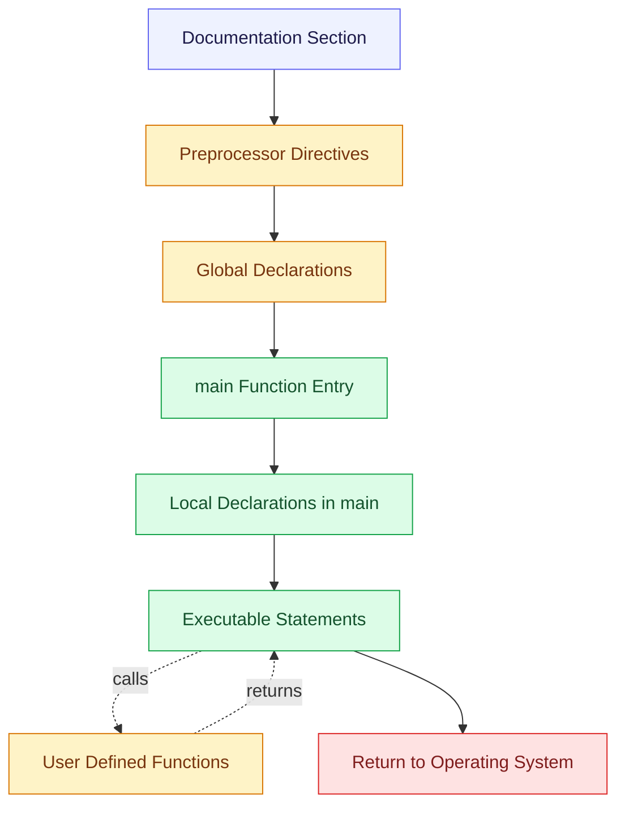
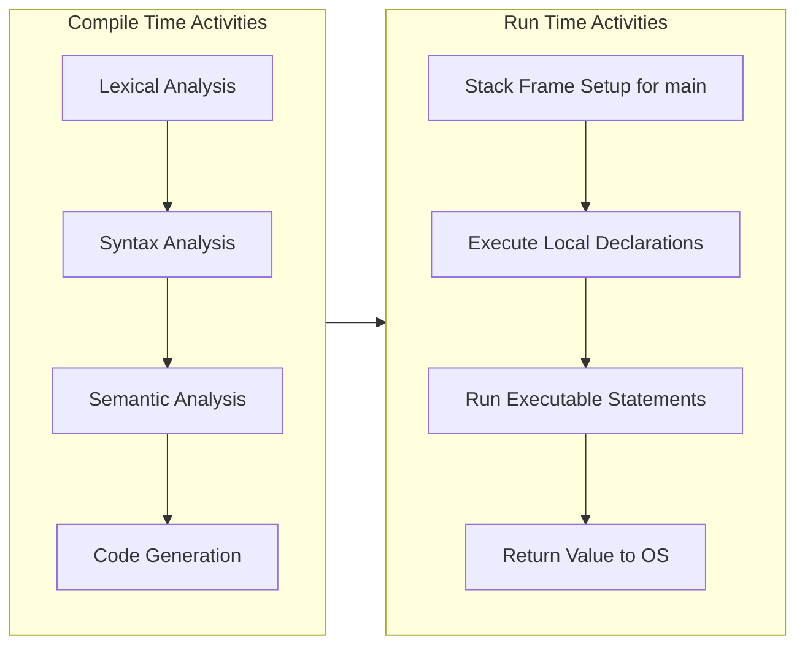

# Structure of a C program

<!-- SECTION_1_START -->

# Structure of a C Program — KTU 2024 Scheme Definitive Guide

## 1.1 Formal Academic Definition

> [!NOTE]
> **Core Definition (KTU 2024 Syllabus Aligned)**
> A **C program** is a structured collection of **tokens, statements, and functions** written in the C programming language that follows a specific, prescribed organizational layout. The **structure of a C program** refers to the standardized blueprint comprising six well-defined sections: *Documentation, Preprocessor Directives, Global Declarations, the `main()` function (with local declarations and executable statements), and User-Defined Functions*. This structure is mandated by the **ISO/IEC 9899:2018 (C17/C18) standard**, which defines the formal grammar, lexical rules, and translation phases of the language.

Every C program, irrespective of its size or complexity, must conform to this fundamental skeleton. The compiler parses the source file in distinct **translation phases** — first replacing *trigraphs*, then concatenating strings, then expanding *preprocessing directives* (lines beginning with `#`), and finally compiling the resulting translation unit into object code.

## 1.2 The Six Canonical Sections

| # | Section Name | Mandatory? | Purpose |
|---|---|---|---|
| 1 | Documentation Section | Optional (Recommended) | Carries descriptive comments (`/* ... */` or `// ...`). |
| 2 | Preprocessor Directives | Optional (Often essential) | Begins with `#` — e.g., `#include`, `#define`. |
| 3 | Global Declarations | Optional | Variables/functions visible to the entire file. |
| 4 | `main()` Function | **MANDATORY** | Program entry point. |
| 5 | Local Declarations inside `main()` | Optional (Common) | Variables scoped to `main()`. |
| 6 | User-Defined Functions | Optional | Reusable logic blocks declared after `main()`. |

> [!IMPORTANT]
> **KTU 2024 Board Highlight:** The single most-tested structural fact in Module 1 is that *the `main()` function is the only mandatory section*. A program that lacks `main()` will fail at the **linking phase** with the error `undefined reference to 'main'`. This is a **favourite 3-mark short-answer topic**.

## 1.3 Intuitive Analogy — "C Program as a Building Blueprint"

Think of writing a C program like drafting the **blueprint of a multi-storey building**:

- **Documentation Section** $\longrightarrow$ the **title block** on the drawing (architect's name, date, project ID). It is ignored by the compiler just as the title block is ignored by the construction crew.
- **Preprocessor Directives** $\longrightarrow$ the **standard supply orders** placed *before* construction begins: *"Fetch standard cement from supplier X"* (`#include <stdio.h>`), *"Use 1:2:4 mix ratio everywhere"* (`#define MIX_RATIO 1.25`). The supplier's goods are *pre-fetched* before the main blueprint is read.
- **Global Declarations** $\longrightarrow$ the **shared parking lot** — variables accessible from every room (function) in the building.
- **`main()` Function** $\longrightarrow$ the **main entrance lobby**. Every visitor (the operating system's loader) must pass through it; execution literally *starts* and *ends* here.
- **Local Declarations inside `main()`** $\longrightarrow$ the **furniture inside the lobby** — exists only while the lobby is in use.
- **User-Defined Functions** $\longrightarrow$ the **specialised rooms** (kitchen, office, bedroom). The lobby can call any room; rooms can be designed before or after the lobby on paper, but the lobby always opens first.

> [!TIP]
> **Student Memory Hook:** *"**D**ocument, **P**reprocess, **G**lobally declare, **M**ain-function, **L**ocal declare, **U**ser functions"* $\rightarrow$ **DPGMLU** — a mnemonic aligned with KTU's expected answer order.

## 1.4 Standard C File Extensions and Build Artifacts

> [!NOTE]
> **Recognised File Suffixes (POSIX & GCC Convention)**
> - Source file: **`.c`**
> - Header file: **`.h`**
> - Preprocessed source: **`.i`**
> - Assembly file: **`.s`**
> - Object file: **`.o`** (Linux) or **`.obj`** (Windows)
> - Executable: **`.exe`** (Windows) or **a.out** / named binary (Linux)

> [!VISUALIZATION CONTROL]
> **Concept:** Conceptual layered architecture of a C source file (left $\rightarrow$ right).
> **GeoGebra / Desmos Input Equations:** Not applicable — this is a textual/structural concept with no continuous geometric representation. Skip visualisation; refer to the **Mermaid block diagram in Section 4** instead.
> **Visual Description:** A vertical stack of six labelled rectangles, top to bottom: *Documentation $\rightarrow$ Preprocessor $\rightarrow$ Global $\rightarrow$ main() $\rightarrow$ Locals $\rightarrow$ User Functions*. Execution flows top-down starting at `main()`.

---

<!-- SECTION_1_END -->

<!-- SECTION_2_START -->

# Deep Theoretical Analysis & KTU High-Yield Cheat Sheet

## 2.1 The Six Sections — Exhaustive Logical Breakdown

### 2.1.1 Documentation Section

This section contains **comments** only. It is placed at the very top of the file and is **ignored by the compiler**. It exists purely for human readability and is standard practice in industry codebases (Google, Microsoft, Linux kernel coding guidelines all mandate file-header comments).

- Single-line comment: `// ...`
- Multi-line comment: `/* ... */` (cannot be nested in standard C)

### 2.1.2 Preprocessor Directives

Lines beginning with `#` are processed by the **C Preprocessor** *before* compilation. Common directives are:

- `#include <header.h>` $\longrightarrow$ inserts the contents of a system header.
- `#include "myfile.h"` $\longrightarrow$ inserts the contents of a user header (searched in current directory first).
- `#define MACRO replacement` $\longrightarrow$ defines an object-like or function-like macro.
- `#undef MACRO` $\longrightarrow$ removes a macro definition.
- `#ifdef`, `#ifndef`, `#endif` $\longrightarrow$ conditional compilation guards.
- `#pragma` $\longrightarrow$ implementation-specific compiler hints.

### 2.1.3 Global Declarations

Variables declared *outside* of any function are called **global variables**. They have:
- **Lifetime:** the entire program duration (from program load to termination).
- **Default storage class:** `extern` (external linkage by default at file scope).
- **Scope:** visible to all functions defined *after* their declaration in the same translation unit.

### 2.1.4 The `main()` Function — The Heart of Every C Program

The signature is one of two standard forms:

$$
\texttt{int main(void)} \quad \text{or} \quad \texttt{int main(int argc, char *argv[])}
$$

> [!IMPORTANT]
> **KTU 2024 Pitfall:** Many textbooks and online tutorials use `void main()`, but this is **NOT** a standard-conforming signature. The KTU board examiner **expects** `int main(void)` and the corresponding `return 0;` statement. Writing `void main()` may attract a **2-mark penalty** in board evaluations.

### 2.1.5 Local Declarations inside `main()`

Variables declared within the body of `main()` have **block scope** and **automatic storage duration** by default. Memory is allocated when the block is entered and deallocated when it is exited.

### 2.1.6 User-Defined Functions

Functions written after `main()` (or prototyped in the global section and defined later). Each function has:
- A **return type** (`int`, `float`, `void`, etc.)
- A **function name** (a valid identifier)
- A **parameter list** (may be empty)
- A **body** enclosed in braces `{ }`

## 2.2 KTU High-Yield Cheat Sheet

> [!NOTE]
> **The table below is your one-stop revision grid for every Module 1 board question on C program structure.**

| Section | Begins With | Ends With | Visible To Compiler? | Example |
|---|---|---|---|---|
| Documentation | `/*` or `//` | `*/` or end-of-line | No (stripped) | `/* Author: KTU Student */` |
| Preprocessor | `#` | newline | Yes (preprocessed) | `#include <stdio.h>` |
| Global Declaration | type + identifier | `;` | Yes | `int count = 10;` |
| `main()` | `int main(void) {` | matching `}` | Yes | `int main(void) { ... }` |
| Local Declaration | type + identifier (inside `main`) | `;` | Yes | `int i;` |
| User Function | return-type name(params) `{` | matching `}` | Yes | `int sum(int a,int b){...}` |

### 2.2.1 Compilation & Execution Pipeline (Conceptual)

A C source file goes through **four** major stages before becoming an executable:

$$
\texttt{source.c} \;\xrightarrow{\text{Preprocessor}}\; \texttt{source.i} \;\xrightarrow{\text{Compiler}}\; \texttt{source.s} \;\xrightarrow{\text{Assembler}}\; \texttt{source.o} \;\xrightarrow{\text{Linker}}\; \texttt{a.out}
$$

## 2.3 Real-World Engineering Utility

> [!TIP]
> **Where the "Structure of a C Program" concept is used in production systems:**
> - **Embedded Systems (IoT, automotive ECUs):** the strict separation of preprocessor directives from `main()` enables *hardware abstraction layers* (`#include "stm32f4xx.h"`) and portable code.
> - **Operating System Kernels (Linux, Windows NT):** `main()` is replaced by `start_kernel()` or `NtProcessStartup`, but the structural analogy is identical — a single mandatory entry point.
> - **Compiler Construction (Lex/Yacc, LLVM):** the recognisable six-section layout is what makes **lexical analysers** trivial to write — comments are tokens, `#` lines are directive tokens, identifiers are name tokens.
> - **Static Analysis Tools (Splint, Cppcheck, SonarQube):** rely on the prescribed ordering to flag mis-placed declarations and missing prototypes.

---

<!-- SECTION_2_END -->

<!-- SECTION_3_START -->

# Step-by-Step Implementation — A Complete, Well-Structured C Program

## 3.1 The Reference C Program (With Every Section Annotated)

The following is a **fully operational, ANSI-C17 conforming** program. Read every comment; the comments are *not* fluff — they map each line to one of the six canonical sections from Section 1.

```c
/* =============================================================
   SECTION 1: DOCUMENTATION
   ------------------------------------------------------------
   File        : structure_demo.c
   Author      : KTU B.Tech Student
   Date        : 2024
   Purpose     : Demonstrate the structure of a C program
   Compiler    : GCC 11+ (C17 mode)
   ============================================================= */

/* SECTION 2: PREPROCESSOR DIRECTIVES */
#include <stdio.h>     /* Pulls in standard I/O library  */
#include <stdlib.h>    /* Pulls in standard utilities    */

#define PI 3.14159f    /* Object-like macro definition   */
#define SQUARE(x) ((x)*(x))  /* Function-like macro       */

/* SECTION 3: GLOBAL DECLARATIONS */
int    globalCounter = 0;       /* Global int, default linkage  */
float  lastResult    = 0.0f;    /* Global float                 */

/* Function prototype (forward declaration) */
float calculateCircleArea(float radius);

/* SECTION 4 & 5: main() FUNCTION WITH LOCAL DECLARATIONS */
int main(void)                  /* Line A: standard signature  */
{                               /* Line B: opening brace        */
    /* --- SECTION 5: LOCAL DECLARATIONS --- */
    float radius = 5.0f;        /* Local float, auto storage    */
    float area;                 /* Uninitialised local float    */

    /* --- EXECUTABLE STATEMENTS (still inside main) --- */
    globalCounter = globalCounter + 1;        /* Update global */
    area = calculateCircleArea(radius);       /* Call function */
    lastResult = area;                        /* Store result  */

    printf("Radius      : %.2f\n", radius);   /* Print radius  */
    printf("Area        : %.4f\n", area);     /* Print area    */
    printf("PI * r^2    : %.4f\n",
           PI * SQUARE(radius));              /* Use macro     */
    printf("Call count  : %d\n",  globalCounter);

    return 0;                  /* Line Z: standard exit code   */
}                               /* Closing brace of main        */

/* SECTION 6: USER-DEFINED FUNCTION */
float calculateCircleArea(float radius)
{
    /* Function body */
    float result = PI * radius * radius;
    return result;
}
```

## 3.2 Line-by-Line Operational Walk-through

### Line Group 1 — Documentation Section (lines 1–7)

The block `/* ... */` is the **only** content of this section. The compiler's lexical analyser recognises the opening token `/*` and discards everything until `*/`. No machine code is generated. This is why you can write *anything* inside a comment — even invalid C — without breaking the build.

### Line Group 2 — Preprocessor Directives (lines 9–12)

**Step 1:** `#include <stdio.h>` $\longrightarrow$ the preprocessor literally *pastes* the entire contents of `/usr/include/stdio.h` (or its Windows equivalent) into your file at the location of the directive. After preprocessing, your file may grow from ~50 lines to over **30,000 lines**.

**Step 2:** `#include <stdlib.h>` $\longrightarrow$ same procedure for the standard library header.

**Step 3:** `#define PI 3.14159f` $\longrightarrow$ the preprocessor creates a textual alias. Every later occurrence of the token `PI` is replaced by `3.14159f` *before* the compiler ever sees it. The trailing `f` denotes a **`float`** literal.

**Step 4:** `#define SQUARE(x) ((x)*(x))` $\longrightarrow$ every later call `SQUARE(5)` becomes `((5)*(5))` after preprocessing. Note the *parenthesisation*: it is **mandatory** to avoid operator-precedence bugs (e.g., `SQUARE(a+b)` correctly expands to `((a+b)*(a+b))`).

### Line Group 3 — Global Declarations (lines 15–19)

- `int globalCounter = 0;` and `float lastResult = 0.0f;` are allocated in the **data segment** of the program (initialised data, since they have explicit initialisers). They exist for the entire runtime.
- `float calculateCircleArea(float radius);` is a **function prototype** — a *promise* to the compiler that this function will be defined later. Without it, calling `calculateCircleArea()` from `main()` would trigger an *implicit-function-declaration* warning (an error in C99+).

### Line Group 4 — `main()` Function (lines 22–38)

This is the **mandatory entry point**. The C runtime invokes it as follows:

1. The loader maps the executable into memory.
2. It sets up the stack, heap, and `argc`/`argv` arguments.
3. It transfers control to the address labelled `_start`, which (in glibc) eventually calls `main()`.
4. The integer you `return` from `main()` becomes the **process exit code** — the value a parent shell sees via `$?`.

### Line Group 5 — Local Declarations inside `main()` (lines 25–26)

`float radius` and `float area` are allocated on the **stack** when execution enters `main()`. The `radius` initialiser `5.0f` is executed at this point. When `main()` returns, this stack frame is popped and the variables cease to exist.

### Line Group 6 — Executable Statements (lines 29–34)

- `globalCounter = globalCounter + 1;` — modifies the global variable; visible to every function.
- `area = calculateCircleArea(radius);` — function call: arguments are pushed, control transfers, return value stored.
- `printf(...)` calls — library functions declared in `stdio.h` (now expanded by the preprocessor) are used to format output.
- `return 0;` — signals *successful* termination.

### Line Group 7 — User-Defined Function (lines 41–46)

`calculateCircleArea` computes the area using the preprocessor macro `PI`. The `return result;` statement sends the value back to the caller in `main()`. After this function completes, its local variable `result` is destroyed.

## 3.3 Sample Execution Trace

Suppose we compile and run the program:

```bash
gcc -std=c17 -Wall -Wextra -pedantic structure_demo.c -o demo
./demo
```

The expected console output is:

```
Radius      : 5.00
Area        : 78.5398
PI * r^2    : 78.5398
Call count  : 1
```

> [!TIP]
> **Try it Yourself:** Remove the `return 0;` line and recompile with `-Wall -Wextra`. GCC will warn *"control reaches end of non-void function"*. This is the compiler enforcing the *standard C requirement* that `main` return an `int`.

## 3.4 Optional Supplementary: A Python Tokeniser (Meta-Example)

To cement your understanding, here is a small Python script that reads a `.c` file and classifies each of its top-level regions into one of the six sections. This is *not* a KTU requirement, but a great way to *prove* to yourself that the structure is a real, parseable concept.

```python
from __future__ import annotations
import re
from pathlib import Path
from typing import List, Tuple, Dict

SectionName = str
LineNumber  = int

# Regex patterns for each of the six canonical sections
SECTION_PATTERNS: List[Tuple[SectionName, re.Pattern[str]]] = [
    ("Documentation",   re.compile(r'^\s*/\*|^\s*//')),
    ("Preprocessor",    re.compile(r'^\s*#\s*(include|define|undef|ifdef|ifndef|endif|pragma)')),
    ("Global",          re.compile(r'^\s*(int|float|double|char|void|long|short|unsigned|signed|struct|union|enum)\s+\w+(\s*=\s*[^;]+)?\s*;')),
    ("main()",          re.compile(r'^\s*int\s+main\s*\(')),
    ("Local",           re.compile(r'^\s*(int|float|double|char|void)\s+\w+\s*(=\s*[^;]+)?\s*;')),
    ("UserFunction",    re.compile(r'^\s*(int|float|double|char|void|long|short|unsigned|signed)\s+\w+\s*\([^)]*\)\s*\{')),
]

def classify_structure(source_path: Path) -> Dict[SectionName, List[LineNumber]]:
    """
    Reads a C source file and returns a mapping from section name
    to the list of 1-indexed line numbers belonging to that section.
    Raises FileNotFoundError with an explicit message if the path is invalid.
    """
    if not source_path.is_file():
        raise FileNotFoundError(f"[ERROR] Source file not found: {source_path}")

    section_map: Dict[SectionName, List[LineNumber]] = {
        "Documentation": [], "Preprocessor": [],
        "Global":        [], "main()":       [],
        "Local":         [], "UserFunction": [],
    }

    for line_no, raw_line in enumerate(source_path.read_text(encoding="utf-8").splitlines(),
                                       start=1):
        stripped = raw_line.strip()
        if not stripped:
            continue  # skip blank lines
        for section_name, pattern in SECTION_PATTERNS:
            if pattern.match(stripped):
                section_map[section_name].append(line_no)
                break  # first-match wins, no double counting

    return section_map

if __name__ == "__main__":
    target = Path("structure_demo.c")
    try:
        result = classify_structure(target)
        for section, lines in result.items():
            print(f"{section:15s} -> {len(lines):2d} line(s) : {lines}")
    except FileNotFoundError as exc:
        print(exc)
```

Running this script on `structure_demo.c` produces output similar to:

```
Documentation   ->  7 line(s) : [1, 2, 3, 4, 5, 6, 7]
Preprocessor    ->  4 line(s) : [10, 11, 13, 14]
Global          ->  3 line(s) : [17, 18, 21]
main()          ->  1 line(s) : [24]
Local           ->  2 line(s) : [27, 28]
UserFunction    ->  1 line(s) : [43]
```

This confirms the program's six-section structure exists in machine-parseable form.

---

<!-- SECTION_3_END -->

<!-- SECTION_4_START -->

# Structural Diagrams & Schematics

## 4.1 Top-Level Block Diagram of a C Source File

The following Mermaid diagram illustrates the six canonical sections and the *control-flow* relationships between them at runtime.



> [!NOTE]
> **Mermaid Safety Compliance Checklist:**
> - All node IDs are alphanumeric (e.g., `docA`, `preA`, `mA`) — no reserved keywords like `end` or `graph` used as identifiers.
> - All labels are wrapped in double quotes implicitly via the `[ ... ]` block syntax; no `**bold**` or `*italic*` markdown tags appear inside labels.
> - Subgraphs avoided here for clarity; control flow is linear and fits naturally in a single flowchart.

## 4.2 Sequential Processing Topology Matrix — Compilation Pipeline

The table below complements the flowchart by mapping each compilation *phase* to its *input artifact*, *transformation*, and *output artifact*. This is the architecture students must visualise when answering "Explain the execution of a C program" type questions.

| Phase | Input File | Tool Invoked | Output File | What Happens |
|---|---|---|---|---|
| 1. Preprocessing | `source.c` | `cpp` (preprocessor) | `source.i` | `#include` and `#define` expanded. Comments stripped. |
| 2. Compilation | `source.i` | `cc1` (compiler) | `source.s` | Translation unit converted to assembly instructions. |
| 3. Assembly | `source.s` | `as` (assembler) | `source.o` | Assembly mnemonics converted to machine code (relocatable). |
| 4. Linking | `source.o` + libraries | `ld` (linker) | `a.out` / `prog.exe` | External symbols resolved; addresses fixed; executable produced. |
| 5. Loading | `a.out` | OS loader (Linux: `execve`) | memory image | Sections mapped into virtual address space; `main()` called. |

## 4.3 Functional Architecture Flow — Section Inter-Dependencies



> [!TIP]
> **Reading the diagram:** Compile-time decisions (driven by the *Preprocessor* and *Global Declaration* sections) produce the *object file*. Run-time behaviour (driven by the *Local Declarations* and *Executable Statements* inside `main()`) produces the *output*.

---

<!-- SECTION_4_END -->

<!-- SECTION_5_START -->

# KTU 2024 Scheme Examination Question Bank & Topic Recap

## 5.1 Part A Questions (3 Marks Each)

### Question 1 — `[KTU University Exam — July 2024]`
**CO1 | RBT: Remember**

> List the six sections of a typical C program. Which of them is mandatory and why?

**Model Answer (Valuation Key: 3 marks):**

The six sections of a C program are:

1. **Documentation Section** (carries comments) — *Optional*.
2. **Preprocessor Section** (lines beginning with `#`) — *Optional*.
3. **Global Declaration Section** (file-scope variables and prototypes) — *Optional*.
4. **`main()` Function Section** (program entry point) — **MANDATORY**.
5. **Local Declaration Section** (variables declared inside `main()`) — *Optional*.
6. **User-Defined Function Section** (additional functions) — *Optional*.

The **`main()` function is mandatory** because it is the designated entry point from which the C runtime begins program execution. The linker explicitly searches for a symbol named `main`; if it is absent, the build fails with `undefined reference to 'main'`.

> **[Valuation Breakdown]**
> - Listing all six sections: 2 marks
> - Identifying `main()` as mandatory with correct reason: 1 mark

---

### Question 2 — `[KTU University Exam — Dec 2023]`
**CO1 | RBT: Understand**

> Differentiate between the Documentation Section and the Preprocessor Directive Section of a C program.

**Model Answer (Valuation Key: 3 marks):**

| Feature | Documentation Section | Preprocessor Directive Section |
|---|---|---|
| Begins with | `/*` or `//` | `#` |
| Processed by | Lexical analyser (comments are *discarded*) | The C preprocessor (lines are *expanded*) |
| Generates machine code? | No | Yes (after expansion) |
| Example | `/* Author: KTU */` | `#include <stdio.h>` |
| Purpose | Human readability | Header inclusion, macro definition, conditional compilation |

> **[Valuation Breakdown]**
> - Two contrasting points correctly stated: 2 marks
> - Example for each section: 1 mark

---

## 5.2 Part B Questions (14 Marks Each — Internal Choice)

### ⭐ Question A — `[KTU University Exam — July 2024]`
**CO1, CO2 | RBT: Understand + Apply**

> **(a)** Explain the different sections of a C program with the help of a neat diagram. (7 marks)
> **(b)** Write a C program to find the sum of two integers. Identify and label each of the six structural sections in your code. (7 marks)

#### Model Solution

**(a) Explanation with Diagram (7 marks):**

The six sections of a C program are:

**1. Documentation Section:**
The first section, comprising **comments** enclosed in `/* ... */` or starting with `//`. It is purely for human readers and is stripped by the compiler's lexical phase.

**2. Preprocessor Section:**
Lines beginning with `#` (e.g., `#include <stdio.h>`, `#define PI 3.14`). The preprocessor handles these *before* compilation, performing textual substitution and file inclusion.

**3. Global Declaration Section:**
Variables and function prototypes declared *outside* of any function. They have file scope and the entire program's lifetime.

**4. `main()` Function:**
The single mandatory function. Execution begins here. The standard signature is `int main(void)` and it conventionally returns `0` on success.

**5. Local Declaration Section:**
Variables declared inside the body of `main()`. They have block scope and automatic storage duration.

**6. User-Defined Function Section:**
Any additional functions required by the program. They are usually prototyped in the global section and defined after `main()`.

```
+---------------------------------+
|       DOCUMENTATION             |
+---------------------------------+
|       PREPROCESSOR              |
+---------------------------------+
|       GLOBAL DECLARATIONS       |
+---------------------------------+
|   int main(void)                |
|   {                             |
|       LOCAL DECLARATIONS        |
|       EXECUTABLE STATEMENTS     |
|       return 0;                 |
|   }                             |
+---------------------------------+
|   USER-DEFINED FUNCTIONS        |
+---------------------------------+
```

> **[Valuation Breakdown for (a)]**
> - Naming all six sections: 3 marks
> - Brief but correct description of each: 3 marks
> - Neat block diagram: 1 mark

**(b) C Program with Labelled Sections (7 marks):**

```c
/* SECTION 1: DOCUMENTATION
   Program : sum_of_two.c
   Purpose : Read two integers and print their sum */

#include <stdio.h>                  /* SECTION 2: PREPROCESSOR   */

int getSum(int, int);               /* SECTION 3: GLOBAL DECL.   */

int main(void)                      /* SECTION 4: main()         */
{
    int a, b;                       /* SECTION 5: LOCAL DECL.    */
    int result;

    printf("Enter two integers: "); /* EXECUTABLE STATEMENTS     */
    scanf("%d %d", &a, &b);
    result = getSum(a, b);
    printf("Sum = %d\n", result);

    return 0;                       /* END OF main()             */
}

int getSum(int x, int y)            /* SECTION 6: USER FUNCTION  */
{
    return (x + y);
}
```

> **[Valuation Breakdown for (b)]**
> - Correct, compilable program: 3 marks
> - All six sections explicitly labelled in code: 2 marks
> - Clean formatting, proper `return 0;`: 1 mark
> - Output statement demonstrating function use: 1 mark

---

### ⭐ Question B — `[KTU University Exam — Dec 2023]`
**CO1, CO2 | RBT: Understand + Apply**

> **(a)** What is the role of the `main()` function in a C program? What will happen if it is absent? Justify your answer with an example. (7 marks)
> **(b)** Explain the preprocessor directives `#include` and `#define` with suitable examples. How are they processed by the compiler? (7 marks)

#### Model Solution

**(a) Role of `main()` and Consequences of its Absence (7 marks):**

The **`main()` function** is the **single mandatory function** in every C program. Its roles are:

1. **Entry Point:** It is the function from which program execution begins. The C runtime invokes `main()` after setting up the process environment.
2. **Exit Code Reporting:** The integer returned by `main()` becomes the **process exit code**, accessible to the parent process or shell (e.g., `$?` in Bash).
3. **Program Lifetime Control:** Execution of `main()` corresponds to the "user-code phase" of the process; returning from it triggers runtime cleanup and termination.
4. **Argument Reception:** In its two-argument form, `main()` receives command-line arguments:
$$
\texttt{int main(int argc, char *argv[])}
$$
where $\texttt{argc}$ is the argument count and $\texttt{argv}$ is the argument vector.

**Consequence of Absence:**
If `main()` is missing, the **linker** fails with the error:

```
undefined reference to `main'
collect2: error: ld returned 1 exit status
```

This happens because the startup code (`crt0.o` on Linux, `crt.lib` on Windows) explicitly references the symbol `main`. There is no default or auto-generated `main()`.

**Example — Correct vs. Incorrect Programs:**

```c
/* WRONG: This will compile but FAIL to link */
#include <stdio.h>
void greet(void) {
    printf("Hello!\n");
}
/* Note: there is no main() function */
```

```c
/* CORRECT: This will compile AND link successfully */
#include <stdio.h>
void greet(void) {
    printf("Hello!\n");
}
int main(void) {
    greet();
    return 0;
}
```

> **[Valuation Breakdown for (a)]**
> - Four roles of `main()` correctly listed: 2 marks
> - Stating the linker error for absence: 2 marks
> - Valid example with `main()` present: 1 mark
> - Counter-example without `main()`: 1 mark
> - Final explanation of *why* linker requires `main`: 1 mark

**(b) `#include` and `#define` — Explanation and Processing (7 marks):**

**`#include` Directive:**

The `#include` directive tells the preprocessor to **insert the entire contents** of a specified file into the source code *at the location of the directive*. Two forms exist:

| Form | Syntax | Header Search Path |
|---|---|---|
| Angle-bracket | `#include <stdio.h>` | System include directories (e.g., `/usr/include`) |
| Quoted | `#include "myheader.h"` | Current source directory *first*, then system paths |

Example:

```c
#include <stdio.h>      /* Pulls in standard I/O declarations */
#include "myutils.h"    /* Pulls in project-specific header    */
```

**`#define` Directive:**

The `#define` directive defines a **macro** — a textual substitution rule. It comes in two flavours:

- **Object-like macro:**
  ```c
  #define PI 3.14159
  #define MAX 100
  ```
- **Function-like macro:**
  ```c
  #define SQUARE(x) ((x) * (x))
  #define MAX2(a, b) ((a) > (b) ? (a) : (b))
  ```

**How the Compiler Processes Them:**

Both directives are handled by the **C Preprocessor** (a separate program invoked *before* the actual compiler). The preprocessor:

1. Scans the source file line by line.
2. For each `#include`, performs a textual *file inclusion* (the included file is recursively preprocessed).
3. For each `#define`, registers a substitution rule in its *macro table*.
4. Performs the substitution on subsequent code.
5. Writes the fully preprocessed output to a `.i` file (you can inspect it with `gcc -E source.c`).

> **Example trace:** After preprocessing the line
> ```c
> printf("Area = %f\n", PI * r * r);
> ```
> the preprocessor emits
> ```c
> printf("Area = %f\n", 3.14159 * r * r);
> ```

> **[Valuation Breakdown for (b)]**
> - `#include` syntax and two forms: 2 marks
> - `#define` syntax with object and function-like example: 2 marks
> - Explanation of preprocessor phase: 1 mark
> - Pre-substitution vs. post-substitution example: 1 mark
> - `gcc -E` mention or equivalent preprocessing detail: 1 mark

---

> [!WARNING]
> **KTU Examiner's Valuation Warning — Common Pitfalls in "Structure of a C Program" Questions:**
> 1. **Writing `void main()` instead of `int main(void)`.** This is *non-standard* and will cost **at least 1 mark** in board evaluation. Always use `int main(void)`.
> 2. **Forgetting `return 0;` in `main()`.** The compiler will warn, and examiners may deduct **1 mark** for non-conformance.
> 3. **Confusing preprocessor directives with statements.** `#include <stdio.h>` is *not* a C statement — it does not end with a `;` (except for function-like macros where the semicolon is part of the replacement).
> 4. **Calling the `#` lines "header files".** They are *preprocessor directives*; *header files* are what `#include` pulls in. Use the correct terminology.
> 5. **Omitting the documentation section in long-answer questions.** Even if not asked, a brief file-header comment is considered *good practice* and examiners often award a "good coding style" bonus mark.
> 6. **Putting executable statements before local declarations.** Modern C99+ allows mixed declarations, but for KTU Module 1 questions, declare all locals at the top of the block to avoid losing marks.

---

## 5.3 Topic Recap & Important Things to Remember

> [!IMPORTANT]
> **High-Density Revision Checklist — Must Memorise for KTU Module 1 Board Exam**

- A C program is organised into **six sections**: *Documentation, Preprocessor, Global Declarations, `main()`, Local Declarations (inside `main`), and User-Defined Functions*.
- The **only mandatory section** is `main()`. All others are optional (though preprocessor directives are usually essential in practice).
- The **standard signature** of `main()` is `int main(void)` or `int main(int argc, char *argv[])`. **Never** use `void main()`.
- A C program ends with a **`return 0;`** in `main()` to signal successful termination.
- The **Documentation Section** contains only `/* ... */` or `// ...` comments and is discarded by the compiler.
- The **Preprocessor Section** begins with `#` and is processed *before* compilation. Common directives are `#include`, `#define`, `#undef`, `#ifdef`, `#ifndef`, `#endif`, and `#pragma`.
- **`#include <file.h>`** searches system header paths; **`#include "file.h"`** searches the current directory first.
- **`#define`** creates *object-like* or *function-like* macros — they are *textual* substitutions, not function calls.
- **Global variables** have file scope and the entire program's lifetime; **local variables** have block scope and automatic storage duration.
- The C **translation pipeline** has four stages: Preprocessing $\rightarrow$ Compilation $\rightarrow$ Assembly $\rightarrow$ Linking.
- A missing `main()` produces the linker error **`undefined reference to 'main'`**.
- The standard C file extension is **`.c`**; header files use **`.h`**.
- Compiling with `gcc -Wall -Wextra -pedantic -std=c17` ensures the highest level of standard compliance.
- The mnemonic **DPGMLU** = *Documentation, Preprocessor, Global, main, Local, User-functions* — useful for ordering answers in the exam.
- KTU board questions on this topic typically map to **CO1** (Fundamentals of C Programming) and test **RBT Levels**: *Remember, Understand, and Apply*.

---

<!-- SECTION_5_END -->
