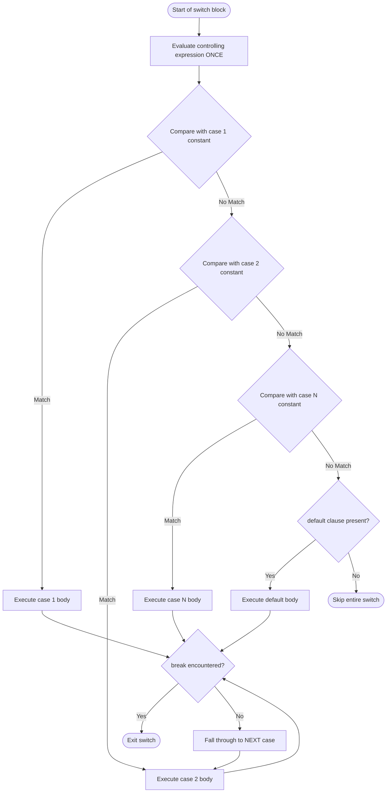
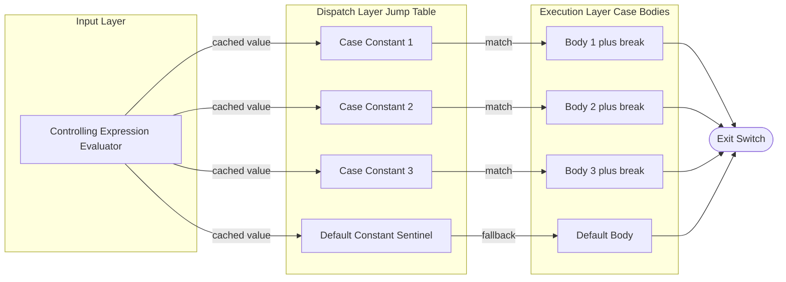
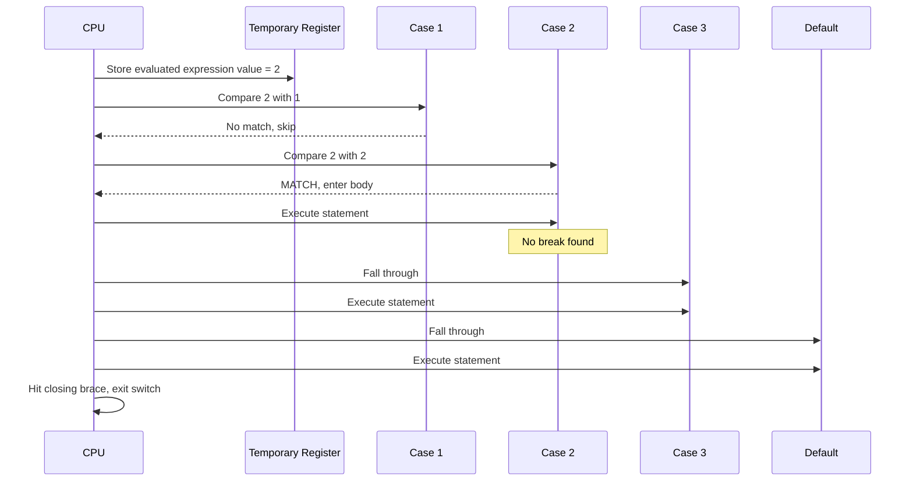
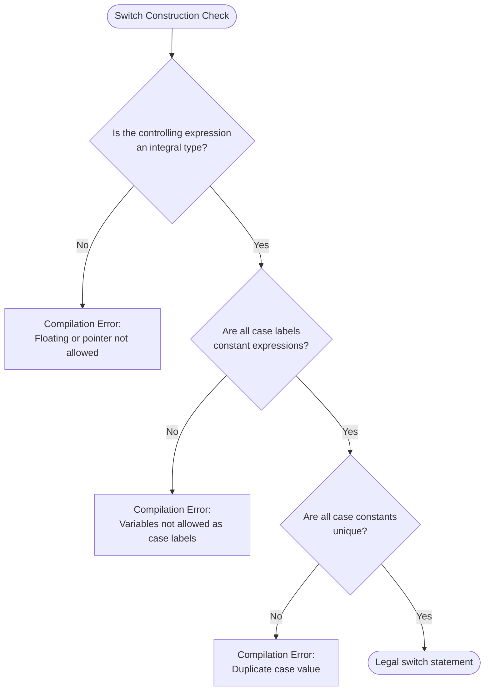

# switch

<!-- SECTION_1_START -->
# The `switch` Statement in C

> [!IMPORTANT]
> **KTU 2024 Scheme | GXEST204 | Module 1 — C Fundamentals**
> High-weight topic: Expect 3-mark conceptual questions and 7–14 mark tracing/code-completion problems in every ESE cycle.

## Formal Definition (KTU Syllabus Terminology)

The **`switch` statement** in C is a **multi-way branching control structure** that evaluates a single integral expression and transfers control to one of several labelled `case` blocks based on **constant equality matching**. It is a more efficient and readable alternative to long `if...else if` ladders when the branching condition depends on the value of a single discrete variable.

> [!NOTE]
> **Core Spec (C11/C17 Standard, §6.8.4):**
> The *controlling expression* of a `switch` must evaluate to an **integer type** — this includes `int`, `char`, `short`, `long`, **enumerated types**, and (in C99+) `_Bool`. **Floating-point and pointer types are explicitly forbidden.**

## Conceptual Analogy — The Lift Operator (Elevator)

Imagine you walk into a building and want to reach **Floor 5**. You press button `5`.

- The **lift's controller board** (the `switch`) receives *one single input* — your floor number.
- It **does not re-read** the input for every floor. It **looks up the value once** in a pre-wired map.
- Each floor button is a **`case label`** — a hardwired destination.
- If you press an invalid button (say, Floor 99 in a 10-floor building), the **building's default response** kicks in — this is the **`default` case**.

Just as the lift does not chain through Floor 1 → 2 → 3 → 4 → 5, the `switch` does **not** perform sequential comparisons. It performs a **single dispatch** — a direct jump table or comparison sequence to the matching case.

> [!TIP]
> **Mental Model:** `if...else` is like checking each floor manually with a flashlight. `switch` is like pressing a direct floor button — one input, one jump.

## Physical Constants & Standard Metrics

| Metric | Value / Rule |
|---|---|
| Minimum number of `case` labels | **0** (a `switch` with only `default` is legal but useless) |
| Maximum number of `case` labels | **Implementation-defined** (typically limited by memory, but at least **1023** per C standard) |
| `default` placement | Anywhere inside the `switch` body; commonly placed at the **end** |
| Duplicate `case` constants | **Compilation Error** (C11 §6.8.4.2) |
| Expression type restriction | **Integral types only** (`int`, `char`, `enum`, `_Bool`) |

> [!VISUALIZATION CONTROL]
> **Concept:** `switch` dispatch as a *radial jump diagram* on a number line
> **GeoGebra / Desmos Input Equations:**
> * Cases as discrete x-axis points: `(1, 0)`, `(2, 0)`, `(3, 0)`, `default(0, 0)`
> * Arrows from origin `O(0, 0)` to each matching case point
> **Visual Description:** A horizontal number line with constant values marked. A single arrow leaps from the expression's value point directly to the matched case — **no traversal** of intermediate cases (unless `break` is omitted, causing fall-through).
<!-- SECTION_1_END -->

<!-- SECTION_2_START -->
# Deep Theoretical Analysis & KTU High-Yield Formula Sheet

## Operational Breakdown — The 6 Execution Phases

When the CPU encounters a `switch` block, it executes the following logical sequence:

1. **Expression Evaluation (Once)**
   The *controlling expression* is evaluated **exactly one time**. The result is stored in an implicit temporary register. Subsequent case comparisons all use this cached value.

2. **Case-Label Matching**
   Each `case CONST:` label is checked sequentially (or via a compiler-optimized *jump table* if cases are dense and ordered). The first matching `CONST` becomes the entry point.

3. **Control Transfer (The Jump)**
   Upon a match, execution jumps **directly** to the statements following that `case` label. Lines above the matched case are **never executed**.

4. **Sequential Fall-Through (Default Behavior)**
   If no `break` statement is encountered, execution **falls through** to the next `case` body and continues until either a `break`, the end of the `switch`, or a `goto`/`return` is hit. This is a **defining feature**, not a bug — it enables intentional multi-case grouping.

5. **`default` Execution**
   If no `case` constant matches the expression value, control transfers to the `default:` label (if present). If `default` is absent, the entire `switch` is **skipped**.

6. **Termination**
   The `switch` block terminates when a `break`, the closing brace `}`, a `return`, or a `goto` out of the `switch` is encountered.

> [!WARNING]
> **Fall-through is the #1 source of KTU exam mark loss.** Students often forget `break` and silently execute the *next* case block. The compiler does **not** warn you — this is by design.

## KTU Formula Sheet / Cheat Sheet

> [!IMPORTANT]
> The following table consolidates every rule the examiner expects you to know for the `switch` statement. Memorize all rows.

| \# | Rule | Constraint / Limit | KTU Exam Relevance |
|---|---|---|---|
| 1 | Controlling expression type | Integral (`int`, `char`, `enum`, `_Bool`) only | Frequently tested as "True/False" item |
| 2 | `case` label type | **Integer constant expressions** or **enum constants** only — no variables | Common 3-mark question |
| 3 | `case` label uniqueness | All `case` constants within one `switch` must be **distinct** | Trivia question |
| 4 | `break` statement | Optional; without it, control **falls through** to next case | Tracing question favorite |
| 5 | `default` clause | Optional; executes when **no case matches** | Often confused with "last case" |
| 6 | `default` placement | Permitted **anywhere** inside the `switch` body (not just at the end) | 3-mark trick question |
| 7 | Nested `switch` | **Allowed** — the inner `switch` is part of an outer `case` body | Rare but tested |
| 8 | Duplicate cases | **Compile-time error** | Direct question |
| 9 | Range-based cases (e.g., `case 1..5:`) | **NOT supported** in C (unlike Pascal) | Common misconception |
| 10 | Floating-point control expression | **Illegal** in C | Frequently asked |
| 11 | `continue` inside `switch` | Acts on the **enclosing `for`/`while`/`do-while`**, not the switch | Subtle but tested |

## Engineering Utility — Where `switch` is Used in Production

| Domain | Real-World Use Case |
|---|---|
| **Menu-driven CLI programs** | ATM machines, billing software — option 1, 2, 3, 4 dispatch |
| **Lexer / Token processors** | Compilers dispatch on token type (`TOKEN_ID`, `TOKEN_NUM`, `TOKEN_OP`) |
| **State machines** | Embedded systems, protocol parsers (TCP, UART) — `enum` state transition |
| **Opcode interpreters** | Virtual machines (JVM, CPython VM) use jump tables generated from `switch` |
| **Calculator applications** | `+`, `-`, `*`, `/` operator dispatch |
| **Game engines** | Player state: `IDLE`, `RUN`, `JUMP`, `ATTACK` |

> [!TIP]
> When the GCC compiler sees a `switch` with **3 or more dense, ordered cases**, it auto-generates a **jump table** — an array of branch addresses — making dispatch **O(1)** regardless of which case matches. This is why `switch` outperforms long `if-else` chains in production code.
<!-- SECTION_2_END -->

<!-- SECTION_3_START -->
# Step-by-Step Derivations & Code Implementation

## Canonical Syntax (Reference Skeleton)

```c
switch (controlling_expression) {
    case CONST_1:
        statement(s);
        break;
    case CONST_2:
    case CONST_3:
        statement(s);   // intentional fall-through grouping
        break;
    default:
        statement(s);
        break;          // optional at the end, but good practice
}
```

## Example 1 — Menu-Driven Calculator (Fully Typed, Boundary-Safe)

```c
#include <stdio.h>

/* Function prototypes with explicit signatures */
int add(int a, int b)   { return a + b; }
int sub(int a, int b)   { return a - b; }
int multiply(int a, int b) { return a * b; }
int divide(int a, int b);

int main(void) {
    int x = 0, y = 0, choice = 0;
    int result = 0;
    int status = 0;   /* 0 = OK, 1 = division error */

    printf("Enter two integers and a choice (1-4):\n");

    if (scanf("%d %d %d", &x, &y, &choice) != 3) {
        fprintf(stderr, "Input format error.\n");
        return 1;
    }

    /* ---------- THE switch BLOCK ---------- */
    switch (choice) {
        case 1:
            result = add(x, y);
            printf("Sum = %d\n", result);
            break;

        case 2:
            result = sub(x, y);
            printf("Difference = %d\n", result);
            break;

        case 3:
            result = multiply(x, y);
            printf("Product = %d\n", result);
            break;

        case 4:
            if (y == 0) {
                fprintf(stderr, "Division by zero rejected.\n");
                status = 1;
            } else {
                result = divide(x, y);
                printf("Quotient = %d\n", result);
            }
            break;

        default:
            printf("Invalid choice. Use 1-4.\n");
            status = 1;
            break;
    }
    /* ---------- END switch BLOCK ---------- */

    return status;
}

int divide(int a, int b) {
    return a / b;
}
```

### Step-by-Step Trace

1. `scanf` validates that exactly three integers were read. On failure, the program exits with `return 1;` — an explicit error boundary.
2. The `switch (choice)` evaluates `choice` **once** and stores the value in a hidden CPU register.
3. Each `case` constant (`1`, `2`, `3`, `4`) is compared to the cached value.
4. On match, the corresponding `printf` and `break` execute. Control then exits the `switch`.
5. For `case 4`, a **nested `if`** adds runtime safety for the division operator — this is how you protect switch cases from edge cases.
6. The `default` clause catches any `choice` outside `[1, 4]`, including negative numbers.

## Example 2 — Demonstrating Fall-Through (Tracing Question)

```c
#include <stdio.h>

int main(void) {
    int n = 2;
    switch (n) {
        case 1:
            printf("One\n");
        case 2:
            printf("Two\n");
        case 3:
            printf("Three\n");
        default:
            printf("Default\n");
    }
    return 0;
}
```

### Step-by-Step Trace (Manual Execution)

| Step | CPU Action | Output Buffer | Notes |
|---|---|---|---|
| 1 | Evaluate `n` → **2** | (empty) | Cached in register |
| 2 | Compare with `case 1` → no match, skip | (empty) | |
| 3 | Compare with `case 2` → **MATCH**, enter block | (empty) | |
| 4 | Execute `printf("Two\n")` | `Two\n` | No `break` present |
| 5 | Fall through to `case 3` | `Two\n` | Execution continues |
| 6 | Execute `printf("Three\n")` | `Two\nThree\n` | Still no `break` |
| 7 | Fall through to `default` | `Two\nThree\n` | |
| 8 | Execute `printf("Default\n")` | `Two\nThree\nDefault\n` | |
| 9 | Hit closing brace `}` → exit `switch` | (final output) | |

**Final Output:**
```
Two
Three
Default
```

## Example 3 — Grouped Cases (Intentional Fall-Through)

```c
switch (grade) {
    case 'A':
    case 'B':
    case 'C':
        printf("Pass\n");
        break;
    case 'D':
    case 'F':
        printf("Fail\n");
        break;
    default:
        printf("Invalid grade\n");
}
```

Here, the **absence of statements and `break`** between cases means all of `'A'`, `'B'`, `'C'` share the same body. This is the **canonical legal use** of fall-through.

## Example 4 — Nested Switch

```c
switch (outer) {
    case 1:
        switch (inner) {
            case 10: printf("1-10\n"); break;
            case 20: printf("1-20\n"); break;
            default : printf("1-??\n");
        }
        break;
    case 2:
        printf("Outer 2\n");
        break;
    default:
        printf("Outer default\n");
}
```

The inner `switch` is a complete statement inside the outer `case 1` body. Note the `break` after the closing `}` of the inner switch — this exits the **outer** `switch`.
<!-- SECTION_3_END -->

<!-- SECTION_4_START -->
# Structural Diagrams & Schematics

## Diagram 1 — Control Flow Topology (Mermaid)



## Diagram 2 — Switch Architecture Block View



## Diagram 3 — Fall-Through Sequence (Stepwise)



## Diagram 4 — Legal vs Illegal Switch (Decision Matrix)


<!-- SECTION_4_END -->

<!-- SECTION_5_START -->
# KTU 2024 Scheme Examination Question Bank

## Part A — Short Answer Questions (3 Marks Each)

### Q1. `[KTU University Exam — July 2024]`
**Differentiate between `if-else` and `switch` statements in C. Mention any two limitations of the `switch` statement.** **[CO1 | RBT: Understand]**

**Model Answer:**

| Aspect | `if-else` | `switch` |
|---|---|---|
| Decision basis | Any relational/logical expression | Equality with a constant only |
| Evaluation | Re-evaluates condition each time | Evaluates expression once |
| Allowed types | Any type (int, float, char, pointer) | Integral types only |
| Range tests | Supported (e.g., `if (x > 10)`) | Not supported directly |
| Readability for many branches | Degrades rapidly | Highly readable |

**Two limitations of `switch`:**
1. The controlling expression can only be an **integral type** — floating-point and string comparisons are illegal.
2. Case labels must be **constant integer expressions** — variables and ranges are not permitted.

> **[Valuation Key: Definition contrast 1M + limitation 1 1M + limitation 2 1M = 3 Marks]**

---

### Q2. `[KTU University Exam — Dec 2023]`
**What will be the output of the following C code? Justify.**
```c
#include <stdio.h>
int main(void) {
    int x = 3;
    switch (x) {
        case 1: printf("Apple\n");
        case 3: printf("Banana\n");
        case 5: printf("Cherry\n"); break;
        default: printf("Date\n");
    }
    return 0;
}
```
**Model Answer:** **[CO1 | RBT: Apply]**

**Output:**
```
Banana
Cherry
```

**Justification:**
- `x = 3` matches `case 3`. The statement `printf("Banana\n")` executes.
- Since there is **no `break`** after `case 3`, control **falls through** to `case 5`, executing `printf("Cherry\n")`.
- The `break` after `case 5` terminates the `switch`.
- `default` is never reached.

> **[Valuation Key: Correct output 1M + fall-through explanation 2M = 3 Marks]**

---

## Part B — Long Answer Questions (14 Marks Each — Internal Choice)

### Question A `[KTU University Exam — July 2024 | Model Paper]`
**CO2 | RBT: Apply + Analyze**

**(a)** Write a C program using a `switch` statement to simulate a simple **traffic light controller**. The user inputs a color character `'R'`, `'Y'`, or `'G'` (case-insensitive). The program must print the corresponding action:
- `'R'` → "STOP"
- `'Y'` → "READY"
- `'G'` → "GO"
- Any other character → "INVALID SIGNAL"

Use appropriate input validation. **[7 Marks]**

**(b)** A student writes the following C program. Identify and explain **all errors** in it. Then write the **corrected program** with proper output. **[7 Marks]**

```c
#include <stdio.h>
int main() {
    float marks = 75.0;
    switch (marks) {
        case 75.0:
            printf("First class\n");
            break;
        case 50.0:
            printf("Second class\n");
            break;
        default:
            printf("No grade\n");
    }
    return 0;
}
```

---

### Model Solution for Question A

#### Part (a) — Traffic Light Controller

```c
#include <stdio.h>
#include <ctype.h>

int main(void) {
    char signal = 0;
    int status = 0;

    printf("Enter traffic light color (R/Y/G): ");
    if (scanf(" %c", &signal) != 1) {
        fprintf(stderr, "Input read failure.\n");
        return 1;
    }

    /* Normalize to uppercase for case-insensitive matching */
    signal = (char)toupper((unsigned char)signal);

    switch (signal) {
        case 'R':
            printf("Action: STOP\n");
            break;
        case 'Y':
            printf("Action: READY\n");
            break;
        case 'G':
            printf("Action: GO\n");
            break;
        default:
            printf("INVALID SIGNAL\n");
            status = 1;
            break;
    }

    return status;
}
```

> **[Valuation Key for Part (a):]**
> * Correct `#include` directives and `toupper` usage: **1 Mark**
> * `switch` on uppercased character: **1 Mark**
> * All three `case` bodies with `break`: **2 Marks**
> * `default` clause handling invalid input: **1 Mark**
> * `scanf` return-value boundary check: **1 Mark**
> * Proper return status: **1 Mark**

---

#### Part (b) — Error Identification & Correction

**Errors Identified:**

| \# | Line | Error | Correction |
|---|---|---|---|
| 1 | `float marks = 75.0;` | `switch` requires an **integral** controlling expression; `float` is illegal | Change to `int marks = 75;` |
| 2 | `case 75.0:` | Case label must be an **integer constant**; `75.0` is a floating literal | Change to `case 75:` |
| 3 | `case 50.0:` | Same error as above | Change to `case 50:` |

**Corrected Program:**

```c
#include <stdio.h>
int main(void) {
    int marks = 75;
    switch (marks) {
        case 75:
            printf("First class\n");
            break;
        case 50:
            printf("Second class\n");
            break;
        default:
            printf("No grade\n");
            break;
    }
    return 0;
}
```

**Output of Corrected Program:**
```
First class
```

> **[Valuation Key for Part (b):]**
> * Stating that `float` is illegal in `switch`: **2 Marks**
> * Stating that `case` labels must be integer constants: **2 Marks**
> * Writing the corrected program: **2 Marks**
> * Stating the final output: **1 Mark**

---

### Question B (Alternative) `[KTU University Exam — Dec 2023 | Model Paper]`
**CO2 | RBT: Apply + Analyze**

**(a)** Write a C program that reads an integer `n` (1–12) representing a month number and prints the **number of days** in that month using a `switch` statement. Handle February with a note: "28 or 29 (leap year check not included)". **[7 Marks]**

**(b)** Trace the output of the following C program and explain **each line** of the output: **[7 Marks]**

```c
#include <stdio.h>
int main(void) {
    int a = 1, b = 2;
    switch (a) {
        case 1:
            switch (b) {
                case 1: printf("Inner 1\n"); break;
                case 2: printf("Inner 2\n");
                default: printf("Inner default\n");
            }
            break;
        case 2:
            printf("Outer 2\n");
            break;
        default:
            printf("Outer default\n");
    }
    return 0;
}
```

---

### Model Solution for Question B

#### Part (a) — Month Days Program

```c
#include <stdio.h>

int main(void) {
    int month = 0;
    int status = 0;

    printf("Enter month number (1-12): ");
    if (scanf("%d", &month) != 1) {
        fprintf(stderr, "Invalid input.\n");
        return 1;
    }

    if (month < 1 || month > 12) {
        printf("Invalid month. Use 1-12.\n");
        return 1;
    }

    switch (month) {
        case 1:
        case 3:
        case 5:
        case 7:
        case 8:
        case 10:
        case 12:
            printf("Days: 31\n");
            break;
        case 4:
        case 6:
        case 9:
        case 11:
            printf("Days: 30\n");
            break;
        case 2:
            printf("Days: 28 or 29 (leap year check not included)\n");
            break;
        default:
            printf("Unreachable due to prior validation.\n");
            status = 1;
            break;
    }

    return status;
}
```

> **[Valuation Key for Part (a):]**
> * Input validation (range check): **1 Mark**
> * Grouped case bodies for 31-day months: **2 Marks**
> * Grouped case bodies for 30-day months: **1 Mark**
> * Special handling for February with the required note: **2 Marks**
> * `break` after every group: **1 Mark**

---

#### Part (b) — Nested Switch Trace

**Output:**
```
Inner 2
Inner default
```

**Step-by-Step Explanation:**

1. Outer `switch (a)` — `a = 1` matches `case 1`. Control enters outer `case 1` body.
2. Inner `switch (b)` — `b = 2` matches `case 2`. Control enters inner `case 2` body.
3. `printf("Inner 2\n")` executes. **No `break`** after this statement.
4. Control **falls through** to the inner `default` clause.
5. `printf("Inner default\n")` executes.
6. The inner `switch` ends at the closing `}`.
7. The outer `break;` (the one after the inner `switch`'s closing brace) executes, terminating the outer `switch`.

> **[Valuation Key for Part (b):]**
> * Correct identification of the two `printf` lines as output: **2 Marks**
> * Explanation of inner `switch` match: **2 Marks**
> * Explanation of fall-through from inner `case 2` to inner `default`: **2 Marks**
> * Explanation that outer `break` exits the entire structure: **1 Mark**

---

> [!WARNING]
> **KTU Examiner's Valuation Pitfalls — Common Mark Deductions on `switch` Questions**
>
> 1. **Forgetting `break`:** Omitting `break` does **not** cause a compile error. The code compiles, but executes the *wrong* case body via fall-through. Always trace the missing `break` explicitly.
> 2. **Using `float` or `double` in `switch`:** This is a **syntax error**. Change to `int` or `char`. Examiners deduct **2 marks** instantly.
> 3. **Using a variable in `case` label:** `case x:` where `x` is a variable is **illegal**. Only integer **constant expressions** and `enum` constants are allowed.
> 4. **Writing `default` thinking it is mandatory:** `default` is **optional**. Writing it or not does not affect correctness.
> 5. **Confusing `continue` with `break` in a `switch` inside a loop:** `continue` skips to the **next loop iteration**, not the next `case`. This is a classic 3-mark trap.
> 6. **String comparison in `switch`:** You **cannot** write `switch (strcmp(s, "yes"))`. Examiners love this trick — it is a **compilation error**.
> 7. **Missing closing brace in the explanation:** When asked "what is the output", write each line of output on a new line and end with the final executed statement.

---

## Topic Recap \& Important Things to Remember

- The `switch` statement is a **multi-way branch** based on **constant equality** matching with an **integral** controlling expression.
- The controlling expression is **evaluated exactly once**; the result is cached for all `case` comparisons.
- `case` labels must be **unique integer constant expressions** or `enum` constants — variables, floats, and ranges are forbidden.
- The `break` statement is **optional** but commonly required to exit the `switch` after a matched case.
- **Fall-through** is the default behavior when `break` is absent — it is a **legal feature** used for grouping cases.
- The `default` clause is **optional**, executes when no `case` matches, and can be placed **anywhere** inside the `switch` body.
- Floating-point, pointer, and string types **cannot** be used as the controlling expression.
- `switch` can be **nested** — the inner `switch` is a complete statement within an outer `case` body.
- Inside a loop, `continue` inside a `switch` affects the **enclosing loop**, not the `switch` itself.
- Compilers like GCC may optimize a `switch` with **3+ dense, ordered cases** into a **jump table**, giving **O(1)** dispatch.
- Always normalize input (e.g., using `toupper`) before switching on characters for case-insensitive matching.
- **Common KTU question types:** output tracing with missing `break`, error identification in `float`/`variable` cases, menu-driven programs, and nested switch traces.
- **Memorize this rule:** `switch (expr)` → `expr` must be **integral**; `case CONST:` → `CONST` must be an **integer constant expression**; `default:` is **optional**; `break` is **optional** but **usually needed**.
<!-- SECTION_5_END -->
