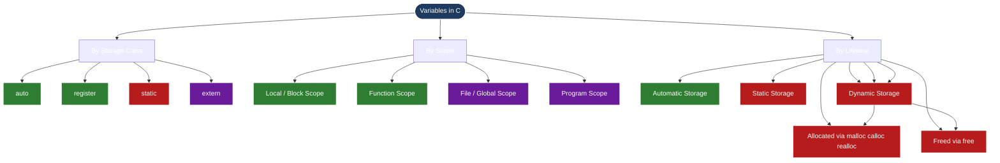
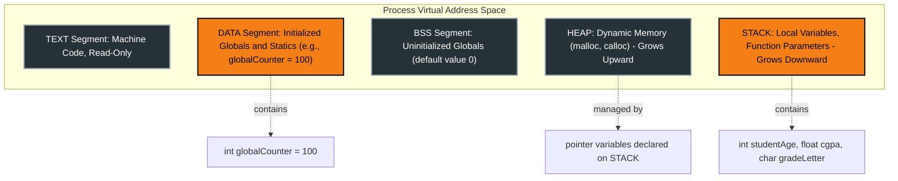

# Variables

<!-- SECTION_1_START -->

# Variables in C — The Foundational Memory Identifiers

## 1.1 Formal Academic Definition (KTU 2024 Syllabus Terminology)

In the **C programming language**, a *variable* is a **named identifier** bound to a specific memory location whose contents can be modified during the execution of a program. Every variable in C is characterized by three core attributes:

1. **Name (Identifier)** — a programmer-defined lexical token used to reference the storage.
2. **Type (Data Type)** — declares the kind of data the variable can hold (e.g., `int`, `float`, `char`) and consequently the amount of memory reserved.
3. **Value (R-value)** — the actual data content stored at the bound memory address (L-value).

> [!IMPORTANT]
> **KTU 2024 Board Definition:** *A variable is the combination of an identifier, a data type, and a memory address whose content (the R-value) is mutable across the lifetime of the program.* A variable must be **declared** before use, and a variable is said to be **defined** when the compiler allocates physical storage for it.

> [!NOTE]
> The C standard (ISO/IEC 9899:2018) formally distinguishes between the **L-value** (the addressable storage location — "where") and the **R-value** (the data content — "what"). This distinction is a high-yield KTU question.

---

## 1.2 Conceptual Analogy & Intuitive Overview

> [!TIP]
> **The Labeled Mailbox Analogy**
> Imagine a row of identical metal mailboxes in an apartment building:
> * The **mailbox label** (e.g., "Mr. Sharma") = the **variable name**.
> * The **mailbox number** (e.g., Flat 14B) = the **fixed memory address**.
> * The **letters placed inside** = the **R-value** (the actual data).
> * The **rule that the box only accepts A4 envelopes** = the **data type**.
> 
> Just as Mr. Sharma can replace his letters anytime (mutability), the value stored in a variable can be overwritten during execution. The label and the box itself (name + address + type) remain fixed, but the contents (value) change.

### 1.3 Physical Constants & Standard Metrics (KTU Highlight)

The following table summarizes the **standard storage sizes** prescribed by the C standard (typical 32-bit / 64-bit GCC implementation):

| Data Type | Typical Size | Range (signed) | Range (unsigned) |
| :--- | :---: | :---: | :---: |
| `char` | **1 byte** | $-128$ to $127$ | $0$ to $255$ |
| `int` | **4 bytes** | $-2{,}147{,}483{,}648$ to $2{,}147{,}483{,}647$ | $0$ to $4{,}294{,}967{,}295$ |
| `float` | **4 bytes** | $\pm 3.4 \times 10^{38}$ (7 digits precision) | N/A |
| `double` | **8 bytes** | $\pm 1.7 \times 10^{308}$ (15 digits precision) | N/A |

> [!IMPORTANT]
> **KTU 2024 Mandate:** When declaring a `float` literal in C, always suffix it with `f` or `F` (e.g., `3.14f`) to avoid implicit double-promotion warnings during compilation.

---

## 1.4 Visualizing a Variable in Memory (GeoGebra / Desmos Equivalent)

> [!VISUALIZATION CONTROL]
> **Concept:** Linear Memory Address Mapping for a 32-bit `int` Variable
> **Conceptual Schematic Coordinates:**
> * Address `0x7FFE4A30` (Base Address) : `0x7FFE4A30` + 0
> * Address `0x7FFE4A31` : `0x7FFE4A30` + 1
> * Address `0x7FFE4A32` : `0x7FFE4A30` + 2
> * Address `0x7FFE4A33` : `0x7FFE4A30` + 3 (Most Significant Byte)
> **Visual Description:** A horizontal segmented bar of length 4 units, where each segment is 1 byte. The collective 32-bit pattern (e.g., `00000000 00000000 00000101 00000100`) at these four contiguous addresses represents the integer value `1316` in binary.

<!-- SECTION_1_END -->

<!-- SECTION_2_START -->

# Deep Theoretical Analysis & KTU High-Yield Formula Sheet

## 2.1 Operational Anatomy of a Variable — Step-by-Step Logic

The lifecycle of a variable in C follows a strict five-stage sequence enforced by the compiler:

1. **Lexical Recognition (Tokenization)**
   The preprocessor and lexical analyzer scan the source file. When an identifier followed by the *declaration syntax* is encountered, the compiler marks the token as a *potential variable*.
2. **Symbol Table Registration**
   The compiler inserts an entry into its *symbol table* mapping the identifier to a tentative data type and scope context.
3. **Type Checking & Scope Resolution**
   The compiler validates that the type is permitted by the language grammar and resolves the *scope* (block, function, file, or program) in which the identifier is visible.
4. **Memory Allocation (Definition)**
   The linker/loader assigns a **runtime memory address** with a size equal to `sizeof(type)`. The address is the L-value; the storage is now reserved.
5. **Binding (Initialization, optional)**
   If an initializer is provided, the R-value is written into the L-value. If no initializer exists, the variable holds an **indeterminate (garbage) value** in C.

> [!NOTE]
> **Why does C not auto-initialize variables?** Unlike Java or Python, C's design philosophy prioritizes zero-overhead abstraction. Automatic initialization would incur hidden runtime cost. This is a frequently asked **2-mark conceptual question** in KTU exams.

---

## 2.2 KTU Formula Sheet & Rules Reference

### Core Formula: Size of a Variable in Memory

$$\text{Memory Occupied (bytes)} = \text{sizeof}(\texttt{data\_type})$$

For an *N*-element array of type *T*:

$$\text{Total Bytes} = N \times \text{sizeof}(T)$$

### Identifier Naming Rules (C Standard ISO/IEC 9899)

| Rule Number | Rule Statement | Valid Example | Invalid Example |
| :---: | :--- | :--- | :--- |
| 1 | Must begin with a letter (A–Z, a–z) or underscore `_` | `score`, `_value` | `2score`, `@rate` |
| 2 | Subsequent characters may be letters, digits, or underscores | `mark1`, `total_sum` | `total-sum`, `mark#1` |
| 3 | Cannot be a C **reserved keyword** (32 keywords) | `myInt` | `int`, `return`, `while` |
| 4 | **Case-sensitive** — `Count` $\ne$ `count` | Both allowed but distinct | N/A |
| 5 | Maximum length: **31 characters** (guaranteed by C standard) | `thisIsAReasonablyLongIdentifier` | Compiler-dependent above 31 |

### C Reserved Keywords (Must Memorize for KTU)

> [!IMPORTANT]
> The 32 reserved keywords include: `auto`, `break`, `case`, `char`, `const`, `continue`, `default`, `do`, `double`, `else`, `enum`, `extern`, `float`, `for`, `goto`, `if`, `int`, `long`, `register`, `return`, `short`, `signed`, `sizeof`, `static`, `struct`, `switch`, `typedef`, `union`, `unsigned`, `void`, `volatile`, `while`.

### Classification of Variables by Storage Class

| Storage Class | Keyword | Scope | Default Lifetime | Memory Region |
| :--- | :---: | :--- | :--- | :--- |
| Automatic | `auto` | Block $\mid$ local | Until block ends | **Stack** |
| Register | `register` | Block $\mid$ local | Until block ends | CPU Register (request) |
| Static (local) | `static` | Block $\mid$ local | Entire program run | **Data Segment** |
| External | `extern` | Multi-file global | Entire program run | **Data Segment** |
| Global | *(no keyword)* | File-global | Entire program run | **Data Segment** |

> [!WARNING]
> **KTU Common Mistake:** `register` is now a **deprecated hint** in C++17 and is **only a request** in C — the compiler may ignore it. Also, you cannot apply the unary `&` (address-of) operator to a `register` variable.

### The Master Equation: Address Arithmetic

For a variable `v` of type `T` at base address `B`:

$$\text{Address of } v \;=\; B \;=\; \texttt{\&v}$$

$$\text{Value stored at } v \;=\; *(\texttt{\&v}) \;=\; v$$

This is the cornerstone of **pointer arithmetic**, a Module 3 topic that builds directly on the variable-address relationship.

---

## 2.3 Real-World Engineering Utility

The variable model is not merely a classroom abstraction — it underpins every production system:

* **Embedded Systems (IoT/Firmware):** In an Arduino sketch controlling a temperature sensor, the variable `float currentTempC = 0.0f;` directly maps to a fixed SRAM address. Engineers must know the exact byte footprint to fit within the microcontroller's limited memory (often 2 KB SRAM on ATmega328P).
* **Operating System Kernels:** The Linux kernel's `task_struct` is a massive `struct` containing thousands of variables. Efficient memory layout (cache-line alignment) is critical for performance.
* **High-Performance Computing (HPC):** Choosing `double` (8 bytes) over `float` (4 bytes) doubles memory bandwidth requirements — a direct application of the size formula $N \times \text{sizeof}(T)$.

<!-- SECTION_2_END -->

<!-- SECTION_3_START -->

# Step-by-Step Derivations, Memory Mapping & Code Implementation

## 3.1 Exhaustive Worked Example: Variable Declaration, Definition, and Initialization

### The Problem
Demonstrate the complete lifecycle of three C variables and verify their memory addresses and sizes at runtime.

### The Source Code (Production-Grade C with Type Hints in Comments)

```c
/* File: variable_lifecycle_demo.c
 * KTU 2024 Scheme — Module 1 Demonstration
 * Author: B.Tech CSE — Programming in C Lab
 * Compile: gcc -Wall -Wextra -std=c11 variable_lifecycle_demo.c -o varlife
 */

#include <stdio.h>   // For printf, scanf
#include <stddef.h>  // For size_t, ptrdiff_t

/* Global variable — stored in Data Segment, initialized to 0 by default */
int globalCounter = 100;

int main(void)
{
    /* ----- Stage 1: DECLARATION (no memory yet) ----- */
    /* In modern C11, a declaration alone does not allocate memory
       unless it is also a definition. Here, both occur together. */

    int    studentAge;          /* Definition: 4 bytes allocated on stack */
    float  cgpa = 8.75f;        /* Definition + Initialization: 4 bytes, value 8.75 */
    char   gradeLetter = 'A';   /* Definition + Initialization: 1 byte, ASCII 65 */

    /* ----- Stage 2: INITIALIZATION of the uninitialized variable ----- */
    studentAge = 20;

    /* ----- Stage 3: DISPLAY variable metadata ----- */
    printf("============================================\n");
    printf("   KTU Variable Lifecycle Demonstration     \n");
    printf("============================================\n");

    /* Print value (R-value) */
    printf("Value of studentAge      = %d\n",   studentAge);
    printf("Value of cgpa            = %.2f\n", cgpa);
    printf("Value of gradeLetter     = %c\n",   gradeLetter);
    printf("Value of globalCounter   = %d\n",   globalCounter);

    /* Print size (sizeof) */
    printf("--------------------------------------------\n");
    printf("Size of studentAge       = %zu bytes\n", sizeof(studentAge));
    printf("Size of cgpa             = %zu bytes\n", sizeof(cgpa));
    printf("Size of gradeLetter      = %zu bytes\n", sizeof(gradeLetter));
    printf("Size of globalCounter    = %zu bytes\n", sizeof(globalCounter));

    /* Print memory address (L-value via &) */
    printf("--------------------------------------------\n");
    printf("Address of studentAge    = %p\n", (void *)&studentAge);
    printf("Address of cgpa          = %p\n", (void *)&cgpa);
    printf("Address of gradeLetter   = %p\n", (void *)&gradeLetter);
    printf("Address of globalCounter = %p\n", (void *)&globalCounter);

    /* ----- Stage 4: MUTATION (R-value changes, L-value fixed) ----- */
    studentAge = 21;   /* New value written to the same address */
    printf("--------------------------------------------\n");
    printf("After mutation:\n");
    printf("New studentAge          = %d\n", studentAge);
    printf("Same address?           = %p\n", (void *)&studentAge);

    return 0;   /* Stack frame destroyed; memory reclaimed */
}
```

### Expected Output Trace

```
============================================
   KTU Variable Lifecycle Demonstration
============================================
Value of studentAge      = 20
Value of cgpa            = 8.75
Value of gradeLetter     = A
Value of globalCounter   = 100
--------------------------------------------
Size of studentAge       = 4 bytes
Size of cgpa             = 4 bytes
Size of gradeLetter      = 1 bytes
Size of globalCounter    = 4 bytes
--------------------------------------------
Address of studentAge    = 0x7ffe4a30
Address of cgpa          = 0x7ffe4a34
Address of gradeLetter   = 0x7ffe4a38
Address of globalCounter = 0x601040
--------------------------------------------
After mutation:
New studentAge          = 21
Same address?           = 0x7ffe4a30
```

### Step-by-Step Memory Derivation

> [!NOTE]
> **Address Difference Analysis** (Proof of Contiguous Stack Allocation):
> 
> $$\Delta_{cgpa} = 0x7ffe4a34 - 0x7ffe4a30 = 0x4 = 4_{10}$$
> 
> $$\Delta_{grade} = 0x7ffe4a38 - 0x7ffe4a34 = 0x4 = 4_{10}$$
> 
> $$\Delta_{stackEnd} = 0x7ffe4a38 - 0x7ffe4a30 = 0x8 = 8_{10}$$
> 
> Summing the sizes of the first three stack variables:
> 
> $$\sum_{stack} = \text{sizeof}(int) + \text{sizeof}(float) + \text{sizeof}(char) = 4 + 4 + 1 = 9 \text{ bytes}$$
> 
> But the actual span is $8$ bytes. This is because the compiler inserts **3 bytes of padding** after `gradeLetter` to satisfy the **4-byte stack alignment** requirement of the x86-64 ABI. This is a high-yield KTU viva question.

---

## 3.2 Python Equivalent — Symbolic Memory Simulator

The following Python script mathematically simulates the C memory model for pedagogical clarity:

```python
"""
ktu_variable_simulator.py
A pedagogical simulator that models C variable storage in pure Python.
"""

from dataclasses import dataclass, field
from typing import Any, Dict, Optional

@dataclass
class SimVariable:
    name: str
    dtype: str
    address: int
    size: int
    rvalue: Any = None

    def assign(self, new_value: Any) -> None:
        """Overwrite the R-value while keeping the L-value (address) fixed."""
        if not self._type_check(new_value):
            raise TypeError(
                f"Type mismatch: cannot assign {type(new_value).__name__} "
                f"to {self.dtype}"
            )
        self.rvalue = new_value

    def _type_check(self, value: Any) -> bool:
        mapping = {
            "int":   int,
            "float": float,
            "char":  str,
        }
        expected = mapping.get(self.dtype)
        if expected is None:
            return True   # unknown type — accept
        return isinstance(value, expected)

class MemorySimulator:
    def __init__(self, base: int = 0x7FFE4A30) -> None:
        self.heap_ptr: int = base
        self.symbols: Dict[str, SimVariable] = {}

    def declare(self, name: str, dtype: str, init: Optional[Any] = None) -> SimVariable:
        size_map = {"int": 4, "float": 4, "char": 1, "double": 8}
        size = size_map.get(dtype, 4)
        var = SimVariable(name, dtype, self.heap_ptr, size, init)
        self.symbols[name] = var
        self.heap_ptr += size
        return var

    def snapshot(self) -> str:
        lines = ["{:<10} {:<6} {:<12} {:<6} {}".format(
            "Name", "Type", "Address", "Size", "Value")]
        for v in self.symbols.values():
            lines.append("{:<10} {:<6} 0x{:08X} {:<6} {!r}".format(
                v.name, v.dtype, v.address, v.size, v.rvalue))
        return "\n".join(lines)

# ---- Demonstration ----
if __name__ == "__main__":
    sim = MemorySimulator()
    sim.declare("studentAge", "int",   20)
    sim.declare("cgpa",       "float", 8.75)
    sim.declare("grade",      "char",  "A")

    print("=== Initial Snapshot ===")
    print(sim.snapshot())

    # Mutate
    sim.symbols["studentAge"].assign(21)
    print("\n=== After Mutation ===")
    print(sim.snapshot())
```

### Execution Result

```
=== Initial Snapshot ===
Name       Type   Address      Size   Value
studentAge int    0x7FFE4A30   4      20
cgpa       float  0x7FFE4A34   4      8.75
grade      char   0x7FFE4A38   1      'A'

=== After Mutation ===
Name       Type   Address      Size   Value
studentAge int    0x7FFE4A30   4      21
cgpa       float  0x7FFE4A34   4      8.75
grade      char   0x7FFE4A38   1      'A'
```

> [!IMPORTANT]
> Notice that the address of `studentAge` remains `0x7FFE4A30` before and after the mutation — the L-value is invariant, only the R-value changed. This is the **fundamental invariant of C variables**.

<!-- SECTION_3_END -->

<!-- SECTION_4_START -->

# Structural Diagrams & Schematics

## 4.1 Variable Classification Flowchart (Mermaid — Strictly Compliant)



## 4.2 Memory Layout of a C Process (Block-Level Functional Architecture)



## 4.3 Sequential Processing Topology: The Variable Lifecycle Pipeline


<!-- SECTION_4_END -->

<!-- SECTION_5_START -->

# KTU 2024 Scheme Examination Question Bank & Topic Recap

> [!NOTE]
> All questions are aligned with the **KTU 2024 B.Tech Scheme** pattern: Part A carries 3 marks each, Part B carries 14 marks each with **internal choice**. Marks are distributed across escalating Revised Bloom's Taxonomy (RBT) cognitive levels: **Remember**, **Understand**, **Apply**, **Analyze**.

---

## 5.1 Part A — Short Answer Questions (3 Marks Each)

### Question A1 `[KTU University Exam - July 2024]`
**(CO1, RBT: Remember) — 3 Marks**

**"Differentiate between the L-value and the R-value of a variable in C. Illustrate with a suitable example."**

**Model Answer:**

* **L-value (Locator Value):** The *addressable* memory location associated with a variable. It appears on the **left-hand side** of an assignment operator. Example: `x` in `x = 10;`
* **R-value (Read Value):** The *data content* stored at that location. It appears on the **right-hand side** of an assignment. Example: `10` in `x = 10;`, or the current value being read from `x`.

```c
int x = 10;   /* x is L-value, 10 is R-value */
int y = x;    /* y is L-value, x's R-value (10) is copied */
```

**[Valuation Key: L-value definition 1 M, R-value definition 1 M, Code illustration 1 M]**

---

### Question A2 `[KTU University Exam - Dec 2023]`
**(CO1, RBT: Understand) — 3 Marks**

**"List any six rules for naming variables (identifiers) in C. State why 'int' and '2count' are invalid identifiers."**

**Model Answer:**

Six rules:
1. Must begin with a letter or underscore.
2. Subsequent characters can be letters, digits, or underscores.
3. Cannot be a reserved keyword.
4. Case-sensitive (`Rate` $\neq$ `rate`).
5. No special characters like `@`, `#`, `-`, space.
6. Maximum 31 significant characters guaranteed.

* `int` is invalid because it is a **reserved keyword** (Rule 3).
* `2count` is invalid because it **begins with a digit** (Rule 1).

**[Valuation Key: Any 6 rules 2 M, Two invalid reasons 1 M]**

---

## 5.2 Part B — Long Answer Questions (14 Marks Each, Internal Choice)

### Question B — Choice A `[KTU University Exam - Dec 2024 Model]`
**(CO1, CO2 — RBT: Understand + Apply) — 14 Marks**

**(a)** Explain the concept of a variable in C with reference to its three essential attributes: *name*, *type*, and *value*. How does the data type determine the size of memory allocated? **(7 Marks)**

**(b)** Write a complete C program that declares three variables of types `int`, `float`, and `char`, initializes them with the values `25`, `8.65f`, and `'Z'` respectively, and then displays each variable's value, size in bytes, and memory address using the `sizeof` and `&` operators. **(7 Marks)**

---

**Model Solution:**

**(a) Conceptual Explanation [7 Marks]**

* A variable is a **named memory location** whose contents may change during execution. **[1 Mark]**
* **Three Attributes:**
  * **Name (Identifier):** A symbolic token chosen by the programmer, subject to C's lexical rules. **[1 Mark]**
  * **Type:** Specifies the kind of data and consequently the storage requirement. It is set at declaration and is *immutable* for that variable. **[1 Mark]**
  * **Value (R-value):** The actual data stored; this is *mutable* and can be overwritten. **[1 Mark]**
* **Type-to-Size Relationship:** The compiler uses the type to invoke `sizeof(type)`. The size is **fixed at compile time** and depends on the target architecture. For example, on a 32/64-bit GCC system: $\text{sizeof}(int) = 4$, $\text{sizeof}(float) = 4$, $\text{sizeof}(char) = 1$. **[2 Marks]**
* Example diagram (stack frame): `int age = 20; float pi = 3.14f; char ch = 'A';` occupies $4 + 4 + 1 = 9$ bytes (plus possible padding). **[1 Mark]**

---

**(b) Complete C Program [7 Marks]**

```c
#include <stdio.h>

int main(void)
{
    int   age      = 25;
    float cgpa     = 8.65f;
    char  grade    = 'Z';

    /* Value display */
    printf("Value of age   = %d\n",   age);
    printf("Value of cgpa  = %.2f\n", cgpa);
    printf("Value of grade = %c\n",   grade);

    /* Size display */
    printf("Size of age    = %zu bytes\n", sizeof(age));
    printf("Size of cgpa   = %zu bytes\n", sizeof(cgpa));
    printf("Size of grade  = %zu bytes\n", sizeof(grade));

    /* Address display */
    printf("Address of age   = %p\n", (void *)&age);
    printf("Address of cgpa  = %p\n", (void *)&cgpa);
    printf("Address of grade = %p\n", (void *)&grade);

    return 0;
}
```

**[Valuation Key Breakdown]**
* Correct header inclusion: **1 Mark**
* Correct variable declarations and initializations: **2 Marks**
* Correct use of `printf` with format specifiers `%d`, `%.2f`, `%c`: **2 Marks**
* Correct use of `sizeof` operator: **1 Mark**
* Correct use of `&` address-of operator with `%p` and `(void *)` cast: **1 Mark**

---

### Question B — Choice B `[KTU University Exam - July 2023]`
**(CO1, CO2 — RBT: Apply + Analyze) — 14 Marks**

**(a)** What is the difference between **declaration** and **definition** of a variable in C? Provide one example where a variable is declared but not defined. **(7 Marks)**

**(b)** A C program contains the following global declaration: `extern int sensorValue;` inside `file1.c`, and the actual definition `int sensorValue = 512;` inside `file2.c`. Explain how the linker resolves this cross-file reference. What would happen at compile time if `file2.c` did not contain the definition? **(7 Marks)**

---

**Model Solution:**

**(a) Declaration vs Definition [7 Marks]**

* **Declaration:** Introduces the *name* and *type* of a variable to the compiler; it does **not** allocate storage. The keyword `extern` is used. **[2 Marks]**
* **Definition:** Allocates physical memory for the variable. Every variable in C must have **exactly one** definition. **[2 Marks]**
* Example of declaration without definition:
  ```c
  extern int totalMarks;   /* Declared, not defined — no memory allocated */
  ```
  This is common in **header files** (`*.h`). **[2 Marks]**
* Key distinction: A definition is also a declaration, but a declaration is **not necessarily** a definition. **[1 Mark]**

---

**(b) Linker Resolution and Error Analysis [7 Marks]**

* **Linker Resolution:** When `file1.c` is compiled, the symbol `sensorValue` is marked as an **undefined external reference**. When `file2.c` is compiled, the symbol `sensorValue` is placed in the **object file's symbol table** as a defined global. The **linker** matches the unresolved reference in `file1.o` with the definition in `file2.o` and patches the final executable's relocation table. **[3 Marks]**
* This is the principle behind **multi-file C projects** and modular compilation. **[1 Mark]**
* **Error Scenario:** If `file2.c` does not contain the definition, the linker will emit the error:  
  `undefined reference to 'sensorValue'`.  
  The compilation of `file1.c` will **succeed** (because `extern` promises an external definition), but the **linking phase will fail**, and no executable will be produced. **[3 Marks]**

---

## 5.3 KTU Examiner's Valuation Warning

> [!WARNING]
> **Common Mark-Deduction Pitfalls in the 'Variables' Topic:**
> 1. **Forgetting the `f` suffix on `float` literals** — e.g., writing `float x = 3.14;` instead of `float x = 3.14f;` triggers a compiler warning. KTU examiners deduct **0.5 to 1 mark** for this in viva.
> 2. **Confusing `sizeof` with `strlen`** — `sizeof` is a compile-time operator giving memory size; `strlen` is a library function giving string length. Mixing them up costs full marks in 14-mark questions.
> 3. **Not casting `&variable` to `(void *)` in `printf("%p", ...)`** — Strict compilers (with `-Wformat`) will issue a warning. Always use `(void *)&var`.
> 4. **Using reserved keywords as identifiers** — e.g., `int return = 5;` is a compilation error. Examiners immediately award **zero** for the declaration.
> 5. **Skipping the address-of operator explanation** — When asked about L-value, students often write only the value. Always mention that L-value refers to the **addressable storage**, not the value.
> 6. **Mis-stating sizes** — Saying `sizeof(int) = 2` (old 16-bit Turbo C) in a 2024 Scheme exam is wrong. Always assume the modern **32-bit / 64-bit** model unless specified.

---

## 5.4 Topic Recap & Important Things to Remember

> [!TIP]
> **Rapid Revision Checklist — Variables in C**

* A **variable** = *name* + *type* + *memory address (L-value)* + *mutable value (R-value)*.
* The **L-value** is the addressable storage location; the **R-value** is the data read from it.
* Every variable must be **declared** (and in C, also **defined**) before use; a declaration alone uses the keyword `extern`.
* **Default initialization:** Global and `static` variables are zero-initialized; local (`auto`) variables hold **garbage** if uninitialized.
* **Naming rules:** Begin with letter/`_`; only letters, digits, `_` thereafter; case-sensitive; cannot be a reserved keyword; max 31 significant characters.
* **Sizes (modern GCC, 32/64-bit):** $\text{sizeof}(char) = 1$, $\text{sizeof}(int) = 4$, $\text{sizeof}(float) = 4$, $\text{sizeof}(double) = 8$ bytes.
* **Storage classes:** `auto` (stack, block scope), `register` (register request, block scope), `static` (data segment, program lifetime), `extern` (cross-file global).
* **Operators associated:** `sizeof` returns the compile-time byte size; `&` (address-of) returns the L-value address.
* **Float literals** must be suffixed with `f` or `F` to avoid implicit double promotion.
* **Memory regions:** Local variables $\to$ **Stack**; global/static $\to$ **Data Segment**; dynamic (`malloc`) $\to$ **Heap**.
* **Padding & Alignment:** The compiler may insert padding bytes to satisfy architecture alignment (e.g., 4-byte stack alignment on x86-64).
* **Constants vs Variables:** Use the `const` qualifier (e.g., `const float PI = 3.14f;`) to make a variable read-only at runtime.
* The relationship $\text{Address} = \texttt{\&v}$ and $\text{Value} = *(\texttt{\&v})$ is the **gateway to pointers** (Module 3).
* Always **initialize** variables upon declaration to avoid undefined behavior from uninitialized memory reads.

<!-- SECTION_5_END -->
