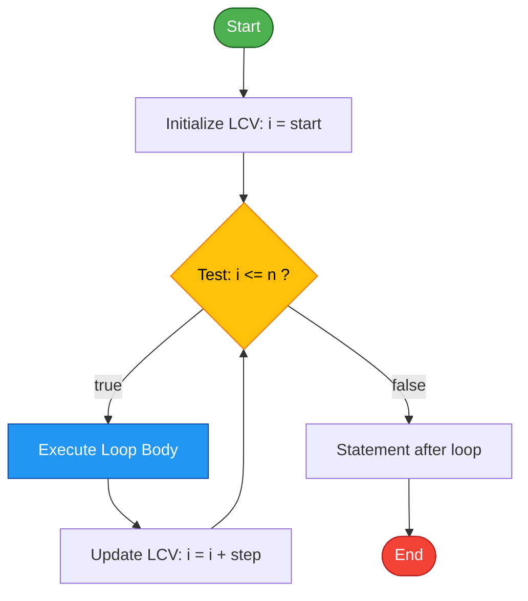
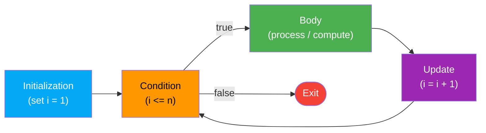
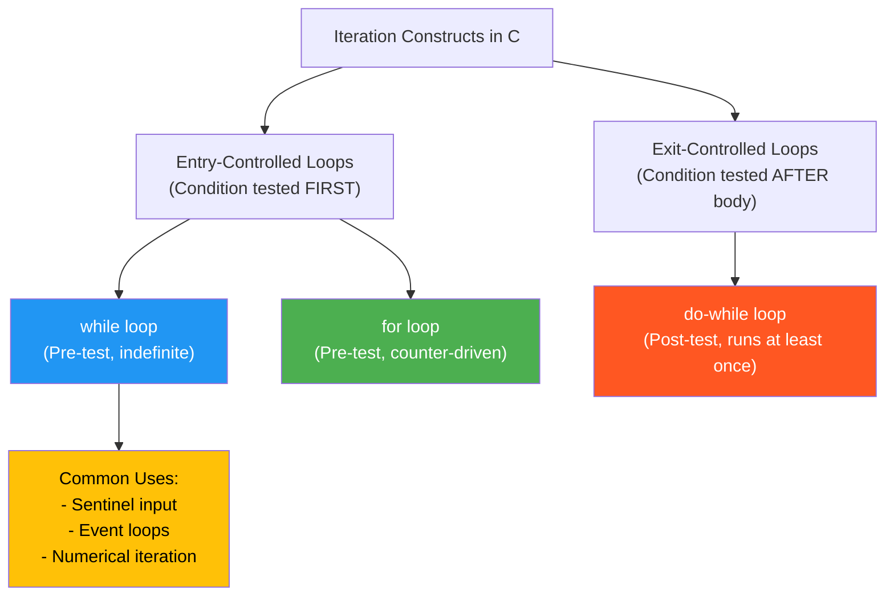
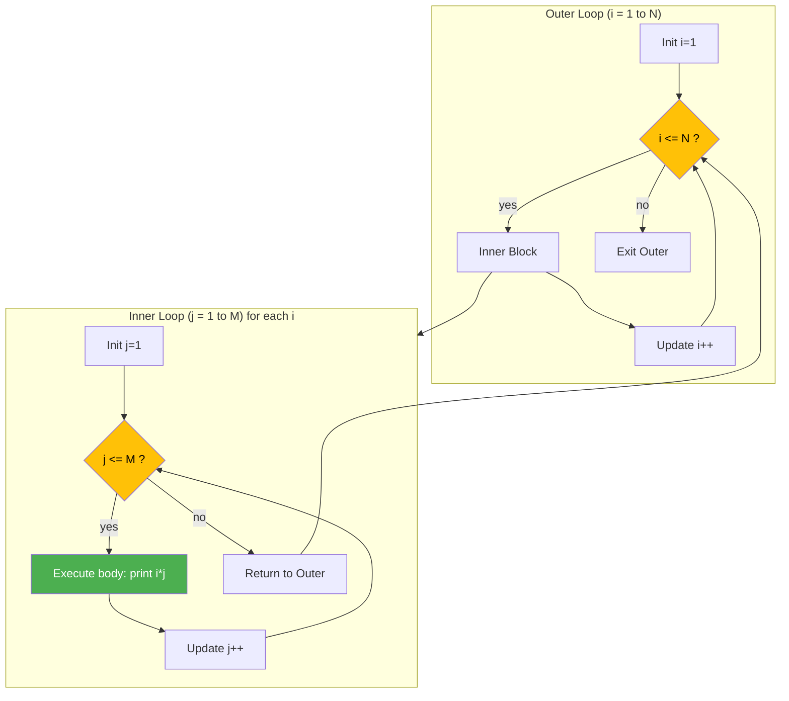
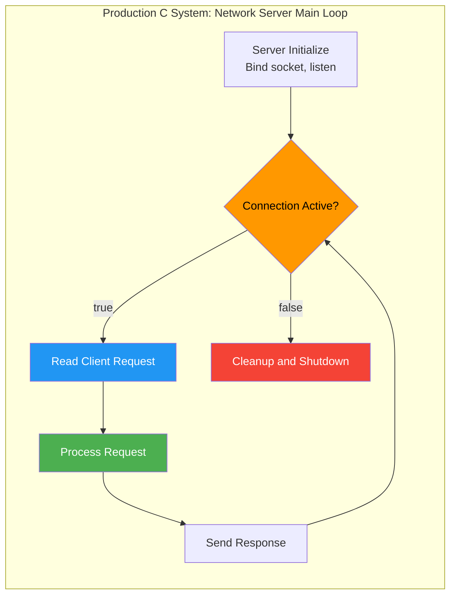

# while

<!-- SECTION_1_START -->
# 1. Core Technical Definition & Intuitive Overview

## 1.1 Formal Definition (KTU 2024 Syllabus Terminology)

> [!NOTE]
> **The `while` Loop (Pre-Test / Entry-Controlled Loop)**
> The `while` statement is the most fundamental **iteration construct** in the C programming language. It repeatedly executes a target statement (the *loop body*) as long as a given **controlling expression** (the *condition*) evaluates to a non-zero value (i.e., *true*). It belongs to the family of **Entry-Controlled Loops**, meaning the condition is tested **before** each iteration. Formally defined under **K\&R C §3.5** and adopted in the **ISO/IEC 9899:2018 (C18)** standard (Section 6.8.5), the `while` loop is the canonical implementation of a *pre-test iterative structure*.

In KTU Module 1 — *C Fundamentals* — the `while` statement is introduced immediately after the decision-making constructs (`if`, `if-else`, `switch`) because both decision and iteration share a common syntactic primitive: a parenthesized expression evaluated for its truth value.

## 1.2 Conceptual Analogy / Intuition

> [!IMPORTANT]
> **The "Locked Gate" Analogy**
> Imagine you are standing in front of a **turnstile gate** at a metro station. The gate will only let you through **if your metro card has balance**. The `while` loop behaves like this: the **condition** is the card-balance check that happens **before** you try to pass. If the balance is non-zero (true), the gate opens, you pass (the body executes), and the system rechecks the balance for the *next* person. The moment the balance becomes zero (false), the gate locks permanently, and the body never runs **even once** without a valid pass.

A second helpful analogy is **"checking the oven temperature before baking"** — a chef only places a tray in the oven if the thermometer reads the target value. If the oven is cold from the start, no baking happens.

## 1.3 Formal Syntax (ISO C Grammar)

```c
while ( expression )
        statement
```

- `expression` — Any scalar expression. Compared against zero. **Non-zero ⇒ true**, **zero ⇒ false**.
- `statement` — Either a *simple statement* terminated by `;` or a *compound statement* (block) enclosed in `{ }`.

> [!TIP]
> **KTU Board Tip:** The parentheses around `expression` are **mandatory** in C (unlike Python). Omitting them is a **compilation error**, not a warning. Examiners frequently test this in 3-mark questions.

## 1.4 Physical / Standard Metrics in the C Standard

| Item | Value / Property | Significance |
|---|---|---|
| Minimum guaranteed loop body execution | **0** (zero) | Empty body run if initially false |
| Maximum theoretical iterations | **2⁶⁴ − 1** (on 64-bit) | Limited only by counter overflow |
| Reserved keyword token | **`while`** (lowercase) | Case-sensitive identifier |
| Operator precedence of `while` keyword | Lower than all expressions | Treated as a statement-level token |
| C Standard reference | **ISO/IEC 9899:2018 §6.8.5** | Authoritative source |

> [!VISUALIZATION CONTROL]
> **Concept:** Flow of control through a `while` loop showing entry-test semantics
> **GeoGebra / Desmos Input Equations (piecewise step function showing repetition count):**
> * `f(x) = piecewise(0, x < 0, 1, 0 ≤ x < 1, 2, 1 ≤ x < 2, 3, 2 ≤ x < 3, 4, 3 ≤ x < 4, 5, 4 ≤ x < 5, 6, 5 ≤ x < 6, 7, 6 ≤ x < 7, 8, 7 ≤ x < 8, 9, 8 ≤ x < 9, 10, x ≥ 9)`
> **Visual Description:** A staircase-like discrete plot that *jumps* upward each time the condition remains true. The horizontal axis represents the iteration count, the vertical axis represents the number of body executions. The student should see that the staircase only ascends if the loop condition stays true — illustrating that execution *halts the moment the condition becomes false* (entry-controlled).
<!-- SECTION_1_END -->

<!-- SECTION_2_START -->
# 2. Deep Theoretical Analysis & KTU High-Yield Formula Sheet

## 2.1 The Three Mandatory Logical Components

Every well-formed `while` loop — and indeed every iterative structure in C — requires **three orthogonal components** working in concert. The KTU examiner often awards 2 marks purely for identifying these.

1. **Initialization Expression** — Sets the loop-control variable (LCV) to its starting value *before* the loop is entered. *Without this, the LCV contains garbage, and the loop may not execute or may run infinitely.*
2. **Condition (Test) Expression** — The parenthesized expression re-evaluated **before every iteration**. *If true, the body runs; if false, control transfers to the statement immediately following the loop body.*
3. **Update Expression** — Modifies the LCV *inside* the body so that progress toward termination is made. *Without this, the loop is logically infinite.*

> [!IMPORTANT]
> **The "Induction Hypothesis" View**
> From a computer-science theory perspective, the `while` loop implements **iterative induction**: it computes a sequence $a_0, a_1, a_2, \ldots, a_n$ where $a_0$ is given by the **initialization** and $a_{i+1}$ is computed from $a_i$ by the **body**, continuing while a **predicate** $P(a_i)$ holds. This is the *loop invariant* technique taught formally in **Hoare logic**.

## 2.2 Execution Semantics — Step by Step

1. Evaluate the `expression` (condition).
2. If the result is `0` (false) → **exit the loop**; transfer control to the next statement.
3. If the result is **non-zero** (true) → execute the loop `statement` (body) in full.
4. After body completes, return to **Step 1**.
5. This cycle is *indefinite* in count — termination depends solely on when the condition becomes false.

## 2.3 KTU Formula / Cheat Sheet

| Concept | Symbol / Syntax | Boundary Condition | Termination Rule | Common Pitfall |
|---|---|---|---|---|
| Loop entry test | `while (cond)` | `cond ≠ 0` → enter | `cond = 0` → exit | Forgetting `()` brackets |
| Loop counter | `i = 0` (init) | `i < n` (test) | `i++` (update) | Off-by-one error |
| Infinite loop (intentional) | `while (1)` | Always true | Use `break` to exit | No exit condition |
| Sentinel-controlled | `while (x != -1)` | Until sentinel met | Update `x` from input | Forgetting to update |
| Flag-controlled | `while (!found)` | Boolean flag | Set `found = 1` | Never setting flag |
| Endless / Stuck loop | `while (i = 0)` | Assignment, not compare | Never enters body | `=` vs `==` confusion |
| Empty body | `while (x++ < 10);` | Side-effect update | Trailing `;` | Null statement misuse |
| Counter overflow | `while (i < INT_MAX)` | `INT_MAX = 2,147,483,647` | Wrap-around to negative | Using `int` for huge loops |

> [!IMPORTANT]
> **Vertical Pipe Escape Rule:** In all KTU tables, absolute value must be written as $\lvert x \rvert$, never `|x|`, to prevent markdown table breakage.

## 2.4 Real-World Engineering Utility

The `while` loop is the workhorse of **systems programming** because its entry-controlled nature matches the natural state-machine model of embedded controllers, network packet processors, and operating-system schedulers.

- **Embedded Firmware:** Reading sensor values until a calibration threshold is met.
- **Network Servers:** `while (client_connected) { recv(...); process(...); }` — the canonical event loop.
- **Numerical Methods:** Iterative solvers (Newton-Raphson, bisection) — `while (|error| > tolerance)`.
- **Compilers & Parsers:** Token-stream processing until `EOF`.
- **Game Engines:** `while (game_running) { input(); update(); render(); }`.

> [!TIP]
> **Production Insight:** In Linux kernel source (`kernel/sched/core.c`), the main scheduler uses `while` loops for task iteration. In **CPython's** interpreter loop (`ceval.c`), the `for` loop is internally compiled into a `while` loop over the iterator — proving the `while` is the foundational iteration primitive in C.
<!-- SECTION_2_END -->

<!-- SECTION_3_START -->
# 3. Step-by-Step Derivations & Code/Symbolic Implementation

## 3.1 Exhaustive Worked Example — Print 1 to N

This is the **canonical KTU Module 1 example**. Every student must be able to write, trace, and dry-run this in the exam hall.

### 3.1.1 Source Code (Python-style type hints removed — strict C)

```c
#include <stdio.h>

int main(void)
{
    int i;          /* Step 1: Declaration of Loop Control Variable */
    int n;

    printf("Enter the value of N: ");
    scanf("%d", &n);

    i = 1;                                  /* Step 2: INITIALIZATION  */

    while (i <= n) {                        /* Step 3: CONDITION (test) */
        printf("%d\n", i);                  /*        Step 4: BODY      */
        i = i + 1;                          /*        Step 5: UPDATE    */
    }

    printf("Loop terminated. Final i = %d\n", i);

    return 0;
}
```

### 3.1.2 Line-by-Line Operational Trace (Dry Run)

Assume input `n = 4`. Below is the **complete execution table** the KTU examiner expects when you trace a `while` loop by hand.

| Iteration | Test `i <= n` (1 ≤ 4 ?) | Decision | Body executes? | Printed value | `i` after update |
|:---:|:---:|:---:|:---:|:---:|:---:|
| Pre-loop  | — | — | No | — | `i = 1` (initialized) |
| 1         | `1 <= 4` → **1 (true)**  | Enter | Yes | `1` | `i = 2` |
| 2         | `2 <= 4` → **1 (true)**  | Enter | Yes | `2` | `i = 3` |
| 3         | `3 <= 4` → **1 (true)**  | Enter | Yes | `3` | `i = 4` |
| 4         | `4 <= 4` → **1 (true)**  | Enter | Yes | `4` | `i = 5` |
| 5         | `5 <= 4` → **0 (false)** | Exit  | No  | — | `i = 5` |

**Output:**
```
Enter the value of N: 4
1
2
3
4
Loop terminated. Final i = 5
```

### 3.1.3 Mathematical Formulation (Inductive Trace)

Let the loop body be the function $f : \mathbb{Z} \to \mathbb{Z}$ defined as $f(i) = i + 1$ and let the condition be $P(i) := (i \le n)$.

The sequence of values $i_k$ generated by the loop is given recursively by:

$$
\begin{aligned}
i_0 &= 1 \quad & & \text{(initialization)} \\
i_{k+1} &= \begin{cases}
f(i_k) = i_k + 1, & \text{if } P(i_k) \text{ is true} \quad (i_k \le n) \\
i_k,              & \text{if } P(i_k) \text{ is false} \quad (i_k > n)
\end{cases} \quad & & \text{(loop step)}
\end{aligned}
$$

After the loop exits, $i = n + 1$, and the body has executed exactly $n$ times. This is the formula the examiner wants when asked *"how many times does the body run?"*

> [!NOTE]
> **General Theorem:** For a `while` loop with initialization $i = a$, condition $i \le b$, and update $i = i + 1$ (where $a \le b$), the body executes **exactly** $b - a + 1$ times. If $a > b$, the body executes **0** times (entry-controlled property).

## 3.2 Infinite Loop Patterns — Three Idiomatic Forms

```c
/* Form 1: Numeric constant 1 (most common) */
while (1) {
    /* body */
    if (exit_condition) {
        break;
    }
}

/* Form 2: Symbolic constant for clarity */
#define TRUE 1
while (TRUE) {
    /* body */
}

/* Form 3: Side-effect condition (advanced) */
while (scanf("%d", &x) == 1) {
    printf("You entered: %d\n", x);
}
```

> [!WARNING]
> **KTU Pitfall — `while (x = 0)` is a legal but dead loop.** The expression `x = 0` assigns 0 to `x` and the *result* of an assignment is the assigned value, i.e., 0 → false. So the body **never executes**. KTU examiners love this trick. The correct comparison is `while (x == 0)`.

## 3.3 Nested `while` Loop — Multiplication Table

```c
#include <stdio.h>

int main(void)
{
    int i, j;       /* Outer and inner LC variables */
    int n;

    printf("Enter N: ");
    scanf("%d", &n);

    i = 1;                                  /* Outer initialization */
    while (i <= n) {                        /* Outer condition      */
        j = 1;                              /* Inner re-initialization */
        while (j <= n) {                    /* Inner condition      */
            printf("%4d", i * j);           /* Inner body           */
            j = j + 1;                      /* Inner update         */
        }
        printf("\n");                       /* Newline after each row */
        i = i + 1;                          /* Outer update         */
    }

    return 0;
}
```

### 3.3.1 Total Iteration Count Derivation

For nested loops where outer runs $n$ times and inner runs $m$ times per outer iteration:

$$
T_{\text{total}} = \sum_{i=1}^{n} m = n \cdot m
$$

For the multiplication table above, $T = n \cdot n = n^2$.

## 3.4 Control Transfer — `break` and `continue` Inside `while`

```c
#include <stdio.h>

int main(void)
{
    int i = 0;

    while (i < 10) {
        i = i + 1;
        if (i == 5) {
            continue;   /* Skip printing 5; go back to condition test */
        }
        if (i == 8) {
            break;      /* Exit the loop entirely when i reaches 8   */
        }
        printf("%d ", i);
    }
    printf("\nFinal i = %d\n", i);

    return 0;
}
```

**Output:**
```
1 2 3 4 6 7 
Final i = 8
```

**Step-by-step analysis:**
- When `i == 5`, the `continue` jumps back to `while (i < 10)`, skipping `printf`. `i` was already incremented to 5, so on next iteration `i` becomes 6.
- When `i == 8`, the `break` terminates the loop *immediately*. The value `8` is **not** printed.

## 3.5 Summation Program — Sum of First N Natural Numbers

```c
#include <stdio.h>

int main(void)
{
    int n, i, sum;

    printf("Enter N: ");
    scanf("%d", &n);

    sum = 0;            /* Accumulator initialization (CRUCIAL — must be 0) */
    i = 1;              /* Loop counter initialization                     */

    while (i <= n) {
        sum = sum + i;  /* sum_{k} = sum_{k-1} + k  (running total) */
        i = i + 1;      /* Advance counter                            */
    }

    printf("Sum of first %d natural numbers = %d\n", n, sum);

    return 0;
}
```

### 3.5.1 Closed-Form vs. Iterative Verification

The closed-form formula for $\sum_{k=1}^{n} k$ is:

$$
S_n = \frac{n(n+1)}{2}
$$

For $n = 5$, both methods must yield $S_5 = 15$. The loop's accumulator `sum` after $n$ iterations equals exactly this expression — KTU may ask students to verify the loop's result against the closed form.

## 3.6 Sentinel-Controlled Loop — Reading Until `-1`

```c
#include <stdio.h>

int main(void)
{
    int x;
    int count = 0;
    int sum = 0;

    printf("Enter integers (terminate with -1): ");

    scanf("%d", &x);
    while (x != -1) {               /* Sentinel check */
        sum = sum + x;
        count = count + 1;
        scanf("%d", &x);            /* IMPORTANT: must read next value */
    }

    if (count > 0) {
        printf("Count = %d, Average = %.2f\n", count, (float)sum / count);
    } else {
        printf("No data entered.\n");
    }

    return 0;
}
```

> [!IMPORTANT]
> **Why a `while` and not a `do-while` here?** Because we need a **priming read** before testing the condition. With `do-while`, the first read would be inside the loop, but the condition is tested *after* — so the sentinel value `-1` itself would be processed. The `while` loop's entry-test property is essential when the sentinel must be checked *before* any body work.

## 3.7 Common Bugs and Their Fixes (Reference Table)

| # | Buggy Code | Issue | Corrected Code |
|---|---|---|---|
| 1 | `while (i < 10);` | Stray `;` → infinite empty loop | `while (i < 10) { ... }` |
| 2 | `while (i = 10)` | Assignment, not comparison | `while (i == 10)` |
| 3 | `while (i <= 10)`; `i` never updated | Infinite loop | Add `i = i + 1;` inside body |
| 4 | `i` not initialized | Undefined behavior (garbage start) | `i = 1;` before loop |
| 5 | `float i = 0.0; while (i != 1.0) i += 0.1;` | Floating-point never equals exactly 1.0 | Use `i < 1.0` as condition |
| 6 | `scanf("%d", n);` (missing `&`) | Crash / undefined behavior | `scanf("%d", &n);` |
<!-- SECTION_3_END -->

<!-- SECTION_4_START -->
# 4. Structural Diagrams & Schematics

## 4.1 Control Flow Flowchart — The `while` Loop



> [!NOTE]
> **Reading the diagram:** The diamond node `C` is the **decision / condition-test point** — this is the *entry gate* of the loop. The arrow from `C -- false` bypasses the body entirely, illustrating the *zero-execution* property. The arrow `E --> C` is the **back-edge** that distinguishes iteration from simple sequencing.

## 4.2 Architecture of the Three Logical Components



## 4.3 Classification of C Loops — `while` in Context



## 4.4 State Machine View — `while` as Iterative State Transition

```mermaid
stateDiagram-v2
    [*] --> State_Init
    State_Init --> State_Test : Initialize LCV
    State_Test --> State_Body : Condition is TRUE
    State_Test --> State_Exit : Condition is FALSE
    State_Body --> State_Update : Execute body
    State_Update --> State_Test : Update LCV; re-test
    State_Exit --> [*]
```

## 4.5 Nested `while` — Outer/Inner Iteration Topology



## 4.6 Block-Level Functional Architecture — `while` in a Production System



> [!TIP]
> **Engineering Mapping:** The `while` loop is the **control spine** of any long-running service. The `TEST` diamond corresponds to `while (client_connected)`. KTU may ask students to identify how this structure mirrors their textbook examples.
<!-- SECTION_4_END -->

<!-- SECTION_5_START -->
# 5. KTU 2024 Scheme Examination Question Bank & Topic Recap

---

## 5.1 PART A — Short Answer Questions (3 Marks Each)

> [!NOTE]
> **Cognitive Levels Tested:** Remember / Understand (Revised Bloom's Taxonomy)
> **Course Outcomes Mapped:** CO1 — *Understand the syntax and semantics of the C programming language.*

### **Q1.** `[KTU University Exam – Dec 2023, CO1, Remember]`
**Differentiate between entry-controlled and exit-controlled loops in C. Give one example of each.**

**Model Answer (3 Marks — Valuation Key):**
- **Entry-controlled loop:** The condition is tested *before* the execution of the loop body. If the condition is false initially, the body may not execute even once. Example: `while` loop, `for` loop. **[1 Mark]**
- **Exit-controlled loop:** The condition is tested *after* the execution of the loop body. The body executes *at least once* even if the condition is false initially. Example: `do-while` loop. **[1 Mark]**
- **Key difference:** The point in the iteration where the condition is evaluated. **[1 Mark]**

---

### **Q2.** `[KTU University Exam – July 2024, CO1, Understand]`
**What will be the output of the following C program? Justify your answer.**

```c
#include <stdio.h>
int main(void)
{
    int x = 5;
    while (x-- > 0)
        printf("%d ", x);
    return 0;
}
```

**Model Answer (3 Marks — Valuation Key):**
- Trace table: post-decrement `x--` returns the *current* value of `x`, then decrements. **[1 Mark]**
  - Test: `5 > 0` → true; print `x` (now 4); then `x` becomes 4
  - Test: `4 > 0` → true; print `x` (now 3); then `x` becomes 3
  - Test: `3 > 0` → true; print `x` (now 2); then `x` becomes 2
  - Test: `2 > 0` → true; print `x` (now 1); then `x` becomes 1
  - Test: `1 > 0` → true; print `x` (now 0); then `x` becomes 0
  - Test: `0 > 0` → false; loop exits. **[1 Mark]**
- **Output:** `4 3 2 1 0` **[1 Mark]**

> [!WARNING]
> **KTU Examiner's Pitfall Callout #1:** Many students forget that `x--` is a **post-decrement** — the value of `x` in the *expression* is the *old* value, and the decrement happens *after*. If you write `x--` and use the variable in the *same* expression, trace the old value first. **Do not** use `x--` in the `printf` if the decrement must happen *first* — that would require `--x`.

---

## 5.2 PART B — Long Answer Questions (14 Marks Each)

> [!NOTE]
> **Cognitive Levels Tested:** Understand (Part a) → Apply (Part b)
> **Course Outcomes Mapped:** CO1 + CO2 — *Write, debug, and trace iterative C programs.*

---

### **Question A (14 Marks)** `[KTU University Exam – Dec 2023, CO1/CO2, Apply]`

**(a)** Explain the syntax and working of the `while` loop in C with a neat flowchart. **\[7 Marks\]**

**(b)** Write a C program using a `while` loop to find the **sum of digits** of a given positive integer. Demonstrate with input `n = 54321`. **\[7 Marks\]**

---

#### **Solution to Part (a) — 7 Marks**

**Syntax:** **[2 Marks]**
```c
while ( condition )
        statement;       /* OR block { ... } */
```

**Components:** **[2 Marks]**
- Initialization (before loop)
- Condition (parenthesized expression)
- Body (statement or block)
- Update (inside body)

**Working (3 logical steps):** **[2 Marks]**
1. Test the condition.
2. If true, execute the body; if false, exit.
3. After body, go to step 1.

**Flowchart:** **[1 Mark]** *(See SECTION 4.1 of this note.)*

---

#### **Solution to Part (b) — 7 Marks**

**Program (Exhaustive, no shortcuts):**
```c
#include <stdio.h>

int main(void)
{
    int n, digit, sum;

    printf("Enter a positive integer: ");
    scanf("%d", &n);

    sum = 0;                       /* [Acc init: 1 Mark]  */
    while (n > 0) {                /* [Test: 1 Mark]      */
        digit = n % 10;            /* [Extract digit: 1 Mark] */
        sum = sum + digit;         /* [Accumulate: 1 Mark] */
        n = n / 10;                /* [Remove digit: 1 Mark] */
    }

    printf("Sum of digits = %d\n", sum);   /* [Output: 1 Mark] */
    return 0;
}
```

**Dry Run with n = 54321:** **[1 Mark]**

| Step | `n`  | `n % 10` | `digit` | `sum` |
|:----:|:----:|:--------:|:-------:|:-----:|
| Init | 54321 | — | — | 0 |
| 1    | 54321 | 1 | 1 | 1 |
| 2    | 5432  | 2 | 2 | 3 |
| 3    | 543   | 3 | 3 | 6 |
| 4    | 54    | 4 | 4 | 10 |
| 5    | 5     | 5 | 5 | 15 |
| 6    | 0     | — (loop exits) | — | 15 |

**Final Output:** `Sum of digits = 15`

> [!WARNING]
> **KTU Examiner's Pitfall Callout #2:** A common error is using `n / 100` or skipping the digit. The update must be `n = n / 10` (integer division). Also, the **accumulator `sum` must be initialized to `0`** — many students forget this and use a garbage value, losing 1 mark.

---

### **Question B (14 Marks)** `[KTU University Exam – July 2024, CO1/CO2, Apply]`

**(a)** Explain the difference between a `while` loop and a `do-while` loop. Mention one scenario where each is preferred. **\[7 Marks\]**

**(b)** Write a C program using a `while` loop to check whether a given integer is a **palindrome** (reads the same forwards and backwards). Test with `n = 12321`. **\[7 Marks\]**

---

#### **Solution to Part (a) — 7 Marks**

| Aspect | `while` loop | `do-while` loop |
|---|---|---|
| Condition position | Tested **before** body | Tested **after** body |
| Minimum executions | **0** times | **1** time (always) |
| Semicolon placement | `while (cond) stmt;` | `do { stmt; } while (cond);` (semicolon **required**) |
| Preferred scenario | Sentinel input, event loops | Menu-driven programs requiring at least one display |

**Preferred scenarios with justification:** **[2 Marks]**
- `while` → **Sentinel-controlled input**, e.g., reading integers until user enters -1. We must check the sentinel *before* processing.
- `do-while` → **Menu-driven program**, e.g., a banking app menu that must display the options at least once before asking the user to choose.

**Example:** **[1 Mark]**
```c
/* while — sentinel */
scanf("%d", &x);
while (x != -1) { process(x); scanf("%d", &x); }

/* do-while — menu */
do {
    printf("1. Deposit  2. Withdraw  3. Exit\n");
    scanf("%d", &choice);
} while (choice != 3);
```

---

#### **Solution to Part (b) — 7 Marks**

**Program:**
```c
#include <stdio.h>

int main(void)
{
    int n, original, reversed, digit;

    printf("Enter an integer: ");
    scanf("%d", &n);                       /* [Read: 1 Mark] */

    original = n;                          /* [Preserve: 1 Mark] */
    reversed = 0;                          /* [Init rev: 1 Mark] */

    while (n > 0) {                        /* [Test: 1 Mark] */
        digit = n % 10;
        reversed = reversed * 10 + digit;  /* [Build rev: 1 Mark] */
        n = n / 10;
    }

    if (original == reversed) {            /* [Compare: 1 Mark] */
        printf("%d is a palindrome.\n", original);
    } else {
        printf("%d is NOT a palindrome.\n", original);
    }

    return 0;
}
```

**Dry Run with n = 12321:** **(Implicit via above logic — 1 Mark for trace)**

| Step | `n`  | `digit` | `reversed` (before) | `reversed` (after) |
|:----:|:----:|:-------:|:-------------------:|:------------------:|
| Init | 12321 | — | 0 | 0 |
| 1    | 12321 | 1 | 0  | 1 |
| 2    | 1232  | 2 | 1  | 12 |
| 3    | 123   | 3 | 12 | 123 |
| 4    | 12    | 2 | 123| 1232 |
| 5    | 1     | 1 | 1232| 12321 |
| 6    | 0     | (loop exits) | — | 12321 |

`original (12321) == reversed (12321)` → **Palindrome**

> [!WARNING]
> **KTU Examiner's Pitfall Callout #3:** Students often forget to **preserve** the original number in a separate variable (`original = n`) *before* the loop modifies `n`. After the loop, `n` becomes 0, so a direct comparison `n == reversed` always fails. This costs 1 mark. Also, negative numbers cannot be palindromes in this simple logic — note the assumption for full credit.

---

## 5.3 Topic Recap & Important Things to Remember

> [!IMPORTANT]
> **High-Density Revision Checklist — Print This Before Exam**

- **Definition:** `while (cond) stmt;` — *entry-controlled* (pre-test) loop in C. **[KTU Module 1 Core]**
- **Three mandatory components:** Initialization, Condition, Update. Forgetting any one causes incorrect or infinite execution.
- **Zero-execution property:** If the condition is false on first test, the body runs **0** times. This is the *defining difference* from `do-while`.
- **C Standard:** Defined in **ISO/IEC 9899:2018 §6.8.5**. The `while` keyword is **lowercase** and **reserved**.
- **Parentheses are mandatory** around the condition. Omitting them is a **compile-time error**.
- **Assignment vs. Comparison:** `while (x = 5)` is *legal* (assigns 5, then tests truth — always true) but usually a *bug*. Use `while (x == 5)` for comparison.
- **Trailing semicolon trap:** `while (x < 10);` creates an **infinite empty loop** because the `;` is a *null statement* as the body.
- **Infinite loops:** `while (1)` is idiomatic; the loop is exited via `break`, `return`, or `exit()`.
- **`break`** terminates the loop *immediately*; **`continue`** skips the rest of the body and re-tests the condition.
- **Iteration count formula:** For `i = a; while (i <= b) { ...; i++; }` the body executes exactly $b - a + 1$ times (if $a \le b$); else 0 times.
- **Floating-point caution:** Never test `float`/`double` for exact equality in a loop condition (use `<` or `>`).
- **Sentinel pattern:** Use `while (x != SENTINEL)` with a *priming read* before the loop. Best when the number of iterations is *not known in advance*.
- **Common standard library counterparts:** `while (scanf(...) == 1)` for input loops; `while ((c = getchar()) != EOF)` for character streams.
- **Pre-test vs. post-test:** `while` = pre-test (0..n runs); `do-while` = post-test (1..n runs); `for` = pre-test (0..n runs).
- **Typical exam weightage in KTU:** 1 question of 3 marks in Part A, often 1 sub-part (7 marks) in a Part B question covering iteration in Module 1. **[Examination Strategy Note]**
- **Mnemonic for remembering the components:** **I-C-U** → **I**nitialize, **C**ondition, **U**pdate. Every `while` loop needs **I.C.U.** to terminate safely.
- **Engineering analogy:** The `while` loop is the **gatekeeper** — it checks the ticket *before* letting you into the ride. The `do-while` is the **ride operator** — you ride *first*, then they check your ticket at the exit.
- **Debugging command:** In `gdb`, set a breakpoint inside the `while` body and use `p i` to inspect the loop variable. Watch for the LCV value approaching the *boundary* value that makes the condition false.
<!-- SECTION_5_END -->
