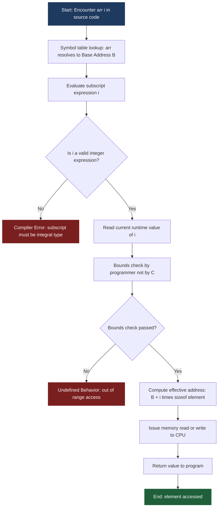
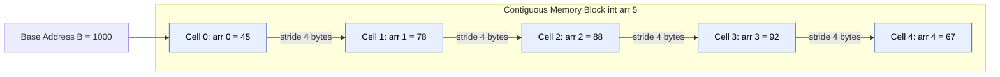
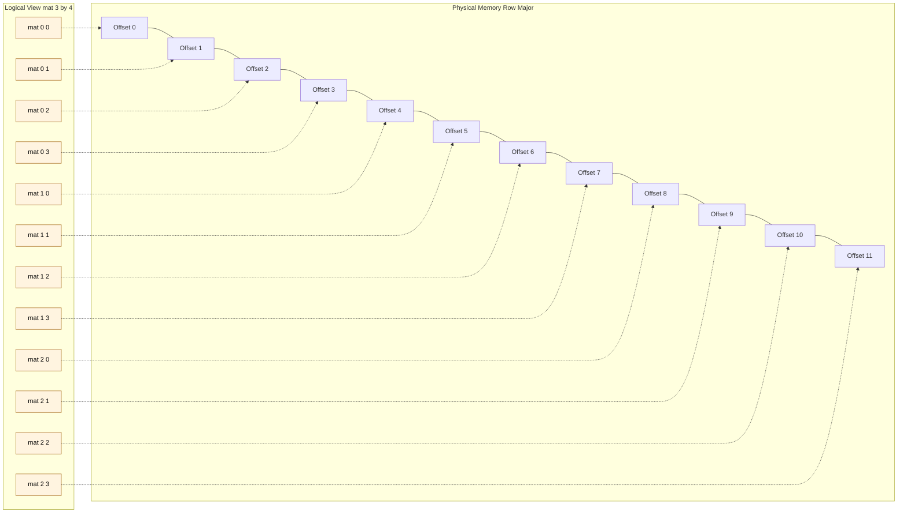
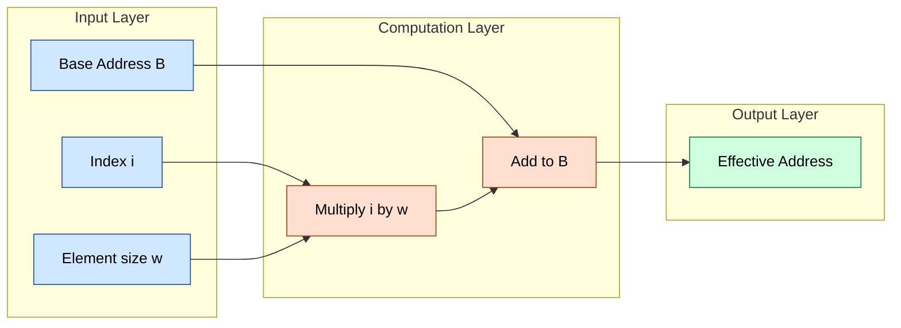

# Accessing array elements

<!-- SECTION_1_START -->
# 1. Core Technical Definition & Intuitive Overview

## 1.1 Formal Academic Definition (KTU 2024 Syllabus Terminology)

In the C programming language (as prescribed under the **APJ Abdul Kalam Technological University 2024 Scheme**, course code **GXEST204**), an **array** is defined as a *homogeneous, contiguous, fixed-size aggregate data structure* that stores a finite collection of elements of identical data type under a single symbolic identifier. The act of **accessing array elements** refers to the systematic retrieval or manipulation of an individual element stored at a specific memory location within that array, accomplished by means of an **integer index** (also called a *subscript*) enclosed within square brackets `[ ]` following the array's identifier.

Mathematically, if $A$ is a one-dimensional array of size $n$, then any element is denoted as $A[i]$, where $i \in \{0, 1, 2, \dots, n-1\}$. The index $i$ is always a non-negative integer (or an integral expression) that represents the **positional offset** of the element from the **base address** of the array.

> [!IMPORTANT]
> **KTU 2024 Syllabus Highlight (Module 2 — Arrays):**
> Students must master *one-dimensional arrays* and *two-dimensional arrays*, including declaration, initialization, indexing mechanics, bounds checking, and traversal using loops. Memory-level address calculation is a frequently tested concept in the End Semester Evaluation (ESE).

> [!NOTE]
> **Core Definition Box:**
> - **Identifier:** The symbolic name of the array (e.g., `marks`, `arr`, `matrix`).
> - **Index / Subscript:** An integer enclosed in `[ ]` that pinpoints a specific element.
> - **Base Address:** The memory location of the **first** element (index `0`).
> - **Zero-Based Indexing:** C arrays always begin counting from `0`, not `1`.

---

## 1.2 Conceptual Analogy & Plain-English Intuition

Imagine a **row of numbered lockers in a school corridor**, all of identical size and all belonging to one student named *Rahul*. This row of lockers is the **array** (the collection), and each locker is an **element** (a storage slot holding a value).

- The **nameplate on the row** ("Rahul's Lockers") is the *array identifier*.
- The **locker numbers painted on each door** (0, 1, 2, 3, …) are the *indices*.
- The **left-most locker** (number 0) is at the *base address*.
- To fetch a book from locker number 7, you don't open every locker; you simply walk straight to locker `arr[7]`. This direct, constant-time walk is the essence of **O(1) random access** that arrays provide.

> [!TIP]
> **Geometric Intuition:** Picture a one-dimensional array as points plotted along a horizontal number line. The index $i$ is simply the step-count you take to the right of the origin (base address). The size of each step is exactly `sizeof(data_type)` bytes.

---

## 1.3 Physical Constants, Standard Metrics & Indexing Rules

- The **lower bound** of a valid index in C is always **$0$**.
- The **upper bound** of a valid index is always **$n - 1$**, where $n$ is the declared array size.
- Accessing `arr[i]` where $i < 0$ or $i \geq n$ is **undefined behavior** in C — the compiler will not always warn you, and the program may read garbage memory, crash, or corrupt data.
- The C standard (ISO/IEC 9899:2018) guarantees that array elements occupy **contiguous memory locations** in strictly increasing address order.

> [!WARNING]
> **Common Student Misconception:** C does **not** perform automatic bounds checking at runtime. If you declare `int arr[5];` and access `arr[10]`, the program will not throw an error — it will silently read whatever bytes happen to be at that memory location. This is one of the most heavily tested pitfalls in KTU examinations.

---

## 1.4 Visualization Note (Conceptual Diagram)

> [!VISUALIZATION CONTROL]
> **Concept:** One-Dimensional Array Memory Layout (Indexing Visualization)
> **Conceptual Layout Description:**
> Imagine a horizontal strip representing 5 consecutive 4-byte memory cells (for an `int` array of size 5 on a typical 32-bit system).
> The cells, drawn left-to-right, are labeled `arr[0]`, `arr[1]`, `arr[2]`, `arr[3]`, `arr[4]`. Each cell holds an integer value (e.g., 10, 20, 30, 40, 50). A small arrow labeled *"Base Address = 1000"* points to the first cell. A second arrow labeled *"Address Calculation: 1000 + i × 4"* points to the generic $i$-th cell, demonstrating that the compiler computes the physical address by multiplying the index by the size of the data type.
> **GeoGebra / Desmos Input Equations (for offset plot):**
> * $f(x) = 1000 + 4x$ for $x \in [0, 4]$
> * Points to plot: $(0, 1000), (1, 1004), (2, 1008), (3, 1012), (4, 1016)$
> **Visual Description:** The student should observe a perfectly linear, evenly-spaced staircase of points rising from left to right along the x-axis, confirming that the address grows *linearly* with the index.

---

## 1.5 Two-Dimensional Array Access (Brief Introduction)

For a 2-D array declared as `int mat[3][4];`, the element at row $i$ and column $j$ is accessed as `mat[i][j]`, where $0 \leq i \leq 2$ and $0 \leq j \leq 3$. C stores 2-D arrays in **row-major order**, meaning elements of row 0 are stored contiguously first, followed by row 1, then row 2.

<!-- SECTION_1_END -->

<!-- SECTION_2_START -->
# 2. Deep Theoretical Analysis & KTU High-Yield Formula Sheet

## 2.1 Step-by-Step Mechanics: How `arr[i]` Actually Works

When the C compiler encounters the expression `arr[i]`, the following sequence unfolds:

1. **Identifier Resolution:** The symbol `arr` is resolved to the **base address** of the array — the memory address of the first element (`arr[0]`).
2. **Subscript Evaluation:** The expression `i` inside the brackets is evaluated. It must yield a non-negative integral value. If `i` is a variable, its current runtime value is fetched.
3. **Type-Size Multiplication (Stride):** The compiler multiplies `i` by `sizeof(arr[0])`, the size in bytes of one element. This is called the **stride** or **scale factor**.
4. **Pointer Arithmetic & Address Generation:** The scaled offset is added to the base address to compute the *effective address* of the target element.
5. **Memory Fetch:** The CPU reads (or writes) the value at the computed effective address.

> [!IMPORTANT]
> **The Famous Equivalence Theorem in C:**
> The expressions `arr[i]`, `*(arr + i)`, `*(i + arr)`, and `i[arr]` are **all semantically identical**. This is because internally, `arr[i]` is rewritten by the compiler as `*(arr + i)`. This identity is a high-yield KTU question.

---

## 2.2 Address Calculation Formula (Row-Major Order)

Let the base address of an array be denoted $B$, the data type size in bytes be denoted $w$, and the index be $i$. Then the address of the $i$-th element is:

$$
\text{Address}(arr[i]) = B + i \cdot w
$$

For a 2-D array `arr[R][C]` of type $T$ (with element size $w$ bytes), the address of element at row $i$, column $j$ is:

$$
\text{Address}(arr[i][j]) = B + (i \cdot C + j) \cdot w
$$

This reflects **row-major storage**: all $C$ elements of row 0 come first, then all $C$ elements of row 1, and so on.

---

## 2.3 KTU High-Yield Formula Sheet / Cheat Sheet

| # | Concept | Formula / Rule | Symbol Meanings | Valid Range of Index |
|---|---------|----------------|-----------------|----------------------|
| 1 | Address of 1-D element | $\text{Addr}(arr[i]) = B + i \cdot w$ | $B$ = base addr, $w$ = $\vert\text{sizeof(element)}\vert$ in bytes, $i$ = index | $0 \leq i \leq n-1$ |
| 2 | Address of 2-D element (row-major) | $\text{Addr}(arr[i][j]) = B + (i \cdot C + j) \cdot w$ | $C$ = number of columns, $i$ = row, $j$ = column | $0 \leq i \leq R-1$, $0 \leq j \leq C-1$ |
| 3 | Number of elements in 1-D array | $n = \text{declared size}$ | — | — |
| 4 | Number of elements in 2-D array | $n = R \times C$ | $R$ = rows, $C$ = columns | — |
| 5 | Total memory consumed (1-D) | $\text{Memory} = n \cdot w$ bytes | $w$ = element size | — |
| 6 | Total memory consumed (2-D) | $\text{Memory} = R \cdot C \cdot w$ bytes | — | — |
| 7 | Internal equivalence | $arr[i] \equiv \ast(arr + i)$ | Pointer-arithmetic identity | Always true |
| 8 | Loop traversal idiom | `for (i = 0; i < n; i++)` | Standard C idiom | $i \in \{0, 1, \dots, n-1\}$ |
| 9 | Last valid index | $i_{\max} = n - 1$ | — | Boundary marker |
| 10 | First valid index | $i_{\min} = 0$ | — | Boundary marker |

> [!TIP]
> **Valuation Tip (KTU):** When solving address-calculation problems, *always* show the substitution step clearly and state the base address and the element size explicitly. Examiners award partial credit for the setup even if arithmetic slips.

---

## 2.4 Real-World Engineering Utility

Accessing array elements efficiently is the foundation of nearly every computational system:

- **Digital Signal Processing (DSP):** Audio samples and pixel intensities are stored in arrays; convolution and FFT access them via `O(1)` random access.
- **Embedded Systems:** Sensor readings from an ADC are pushed into circular buffers (arrays with index wrap-around logic).
- **Image Processing:** A grayscale image is a 2-D array of pixels (`image[row][col]`); filters traverse it using nested loops.
- **Database Engines:** Hash tables and B-tree nodes are implemented atop contiguous arrays for cache-friendly lookups.
- **Operating Systems Kernels:** Process tables, file descriptor tables, and page tables are all arrays accessed by integer index.

> [!NOTE]
> The principle that array access is **O(1)** (constant time) — irrespective of array size — is what makes arrays the workhorse data structure for high-performance computing.

<!-- SECTION_2_END -->

<!-- SECTION_3_START -->
# 3. Step-by-Step Derivations & Code Implementation

## 3.1 Exhaustive Derivation: Address of an Array Element

### Worked Example 3.1.1 — One-Dimensional Array

**Problem Statement:** Consider the declaration `int marks[5];` in a C program running on a system where `sizeof(int) = 4` bytes. The base address of `marks` is `5000`. Compute the addresses of `marks[0]`, `marks[2]`, and `marks[4]`.

**Step 1 — Identify the given parameters.**
The base address is $B = 5000$. The element size is $w = 4$ bytes. The array is of type `int`.

**Step 2 — Recall the general formula.**
The address of the $i$-th element of a 1-D array is given by:

$$
\text{Address}(arr[i]) = B + i \cdot w
$$

**Step 3 — Substitute for `marks[0]`.**
Here $i = 0$:

$$
\text{Address}(marks[0]) = 5000 + 0 \cdot 4
$$

$$
\text{Address}(marks[0]) = 5000 + 0
$$

$$
\text{Address}(marks[0]) = 5000
$$

This confirms that the first element sits exactly at the base address.

**Step 4 — Substitute for `marks[2]`.**
Here $i = 2$:

$$
\text{Address}(marks[2]) = 5000 + 2 \cdot 4
$$

$$
\text{Address}(marks[2]) = 5000 + 8
$$

$$
\text{Address}(marks[2]) = 5008
$$

**Step 5 — Substitute for `marks[4]`.**
Here $i = 4$:

$$
\text{Address}(marks[4]) = 5000 + 4 \cdot 4
$$

$$
\text{Address}(marks[4]) = 5000 + 16
$$

$$
\text{Address}(marks[4]) = 5016
$$

**Step 6 — Tabulate the full memory map.**

| Index $i$ | Element | Stored Value (example) | Computed Address (bytes) |
|-----------|---------|------------------------|--------------------------|
| 0 | `marks[0]` | 45 | **5000** |
| 1 | `marks[1]` | 78 | 5004 |
| 2 | `marks[2]` | 88 | **5008** |
| 3 | `marks[3]` | 92 | 5012 |
| 4 | `marks[4]` | 67 | **5016** |

> [!NOTE]
> Notice the perfectly regular stride of **4 bytes** between consecutive cells. This contiguity is the entire reason `O(1)` random access is possible.

---

### Worked Example 3.1.2 — Two-Dimensional Array

**Problem Statement:** Consider the declaration `int mat[3][4];` where `sizeof(int) = 2` bytes and the base address of `mat` is `2000`. Compute the address of `mat[2][3]`. Assume row-major storage.

**Step 1 — Identify the parameters.**
$B = 2000$, $w = 2$ bytes, $R = 3$ rows, $C = 4$ columns, target row $i = 2$, target column $j = 3$.

**Step 2 — Recall the 2-D row-major formula.**

$$
\text{Address}(arr[i][j]) = B + (i \cdot C + j) \cdot w
$$

**Step 3 — Compute the row offset contribution.**
The term $i \cdot C$ gives the number of elements to skip past the previous rows:

$$
i \cdot C = 2 \cdot 4 = 8
$$

So we must skip 8 whole elements (the entirety of rows 0 and 1) before we reach row 2.

**Step 4 — Add the column offset $j$.**
Within row 2, we then step $j = 3$ elements forward:

$$
i \cdot C + j = 8 + 3 = 11
$$

**Step 5 — Multiply by element size $w$.**
This gives the total byte offset from the base address:

$$
(i \cdot C + j) \cdot w = 11 \cdot 2 = 22
$$

**Step 6 — Add to base address.**

$$
\text{Address}(mat[2][3]) = 2000 + 22
$$

$$
\text{Address}(mat[2][3]) = 2022
$$

**Verification by element count:** In row-major order, element `mat[2][3]` is the $12^{\text{th}}$ element overall (rows 0, 1, 2 contributing $4+4+4 = 12$ elements, with the last one being index 11 in zero-based counting). The byte offset is $11 \times 2 = 22$, and $2000 + 22 = 2022$. ✓

---

## 3.2 Full C Program: Demonstrating Array Access

The following is a complete, compilable C program (ANSI C / C99 standard) that demonstrates every nuance of accessing array elements, including declaration, initialization, individual access, pointer-arithmetic equivalence, and a 2-D traversal.

```c
/* ======================================================================
 * Program : Demonstration of Array Element Access in C
 * Course  : PROGRAMMING IN C  (GXEST204) — KTU 2024 Scheme
 * Module  : 2 — Arrays
 * Topic   : Accessing Array Elements
 * ====================================================================== */

#include <stdio.h>
#include <stdlib.h>

#define ROWS 3
#define COLS 4

/* Function prototype: prints a 1-D array using index notation */
void print_array_indexed(const int arr[], int n);

/* Function prototype: prints a 1-D array using pointer arithmetic */
void print_array_pointer(const int *ptr, int n);

/* Function prototype: prints a 2-D array using nested indices */
void print_matrix(const int mat[ROWS][COLS]);

int main(void)
{
    /* ---------- 1. One-Dimensional Array ---------- */
    int marks[5] = {45, 78, 88, 92, 67};
    int n = 5;
    int i;

    printf("--- One-Dimensional Array Access ---\n");
    for (i = 0; i < n; i++) {
        printf("marks[%d] = %3d   |   Address = %p\n",
               i, marks[i], (void *)&marks[i]);
    }

    /* ---------- 2. Pointer-Equivalence Demonstration ---------- */
    printf("\n--- Pointer Arithmetic Equivalence ---\n");
    printf("marks[2]            = %d\n", marks[2]);
    printf("*(marks + 2)        = %d\n", *(marks + 2));
    printf("*(2 + marks)        = %d\n", *(2 + marks));
    printf("2[marks]            = %d\n", 2[marks]);

    /* ---------- 3. Reading Elements from User ---------- */
    int user_arr[5];
    int sum = 0;
    float average;

    printf("\n--- User Input (5 integers) ---\n");
    for (i = 0; i < 5; i++) {
        printf("Enter element %d: ", i);
        if (scanf("%d", &user_arr[i]) != 1) {
            fprintf(stderr, "Error: invalid integer input.\n");
            return EXIT_FAILURE;
        }
        sum += user_arr[i];
    }
    average = (float)sum / 5.0f;
    printf("Sum = %d, Average = %.2f\n", sum, average);

    /* ---------- 4. Two-Dimensional Array ---------- */
    int mat[ROWS][COLS] = {
        {1,  2,  3,  4},
        {5,  6,  7,  8},
        {9, 10, 11, 12}
    };

    printf("\n--- Two-Dimensional Array Access (Row-Major) ---\n");
    print_matrix(mat);

    /* ---------- 5. Accessing a Single 2-D Element ---------- */
    printf("\nmat[2][3] = %d\n", mat[2][3]);

    return EXIT_SUCCESS;
}

/* ======================================================================
 * Function Definitions
 * ====================================================================== */

void print_array_indexed(const int arr[], int n)
{
    int i;
    for (i = 0; i < n; i++) {
        printf("arr[%d] = %d\n", i, arr[i]);
    }
}

void print_array_pointer(const int *ptr, int n)
{
    int i;
    for (i = 0; i < n; i++) {
        printf("*(ptr + %d) = %d\n", i, *(ptr + i));
    }
}

void print_matrix(const int mat[ROWS][COLS])
{
    int r, c;
    for (r = 0; r < ROWS; r++) {
        printf("Row %d: ", r);
        for (c = 0; c < COLS; c++) {
            printf("%4d ", mat[r][c]);
        }
        printf("\n");
    }
}
```

> [!IMPORTANT]
> **Code Walkthrough Notes for KTU Exam Preparation:**
> - `marks[i]` and `*(marks + i)` produce identical machine code. The compiler translates array subscript syntax into pointer arithmetic.
> - The expression `2[marks]` is *legal* C and yields the same result as `marks[2]`. While it is poor style, examiners may ask you to explain *why* it works.
> - When passing a 2-D array to a function, the second dimension (`COLS`) **must** be specified in the parameter declaration: `void print_matrix(const int mat[ROWS][COLS])`. The first dimension may be omitted, but subsequent ones cannot.
> - The cast `(void *)&marks[i]` silences compiler warnings when printing addresses with `%p`.

---

## 3.3 Step-by-Step Trace of a Loop-Based Access

Consider this loop acting on `int a[6] = {10, 20, 30, 40, 50, 60};`:

```c
int i;
for (i = 0; i < 6; i++) {
    printf("%d ", a[i]);
}
```

| Iteration $i$ | Condition `i < 6` | Access `a[i]` | Value Printed | Address (assume B=1000, w=4) |
|---------------|-------------------|---------------|---------------|------------------------------|
| 1 | $0 < 6$ → **true** | $a[0]$ | `10` | 1000 |
| 2 | $1 < 6$ → **true** | $a[1]$ | `20` | 1004 |
| 3 | $2 < 6$ → **true** | $a[2]$ | `30` | 1008 |
| 4 | $3 < 6$ → **true** | $a[3]$ | `40` | 1012 |
| 5 | $4 < 6$ → **true** | $a[4]$ | `50` | 1016 |
| 6 | $5 < 6$ → **true** | $a[5]$ | `60` | 1020 |
| 7 | $6 < 6$ → **false** | — (loop exits) | — | — |

> [!NOTE]
> The output printed is: `10 20 30 40 50 60`. The trace shows exactly how each index maps to a value and to a physical address.

---

## 3.4 Common Pitfalls and Their C Corrections

| # | Pitfall (Incorrect Code) | Problem | Corrected Code |
|---|--------------------------|---------|----------------|
| 1 | `printf("%d", arr);` | Prints address, not value | `printf("%d", arr[0]);` |
| 2 | `for (i = 1; i <= n; i++)` | Skips index 0; accesses `arr[n]` (out of bounds) | `for (i = 0; i < n; i++)` |
| 3 | `scanf("%d", arr[i]);` | Missing `&` — passes value instead of address | `scanf("%d", &arr[i]);` |
| 4 | `int a[5] = {0};` (intended) vs `int a[5];` | Latter leaves uninitialized garbage | Always initialize explicitly |
| 5 | Accessing `arr[-1]` | Undefined behavior | Validate index before access |

<!-- SECTION_3_END -->

<!-- SECTION_4_START -->
# 4. Structural Diagrams & Schematics

## 4.1 Mermaid Flow Diagram: Array Element Access Workflow

The following Mermaid block illustrates the runtime control flow when a C program accesses an element of a 1-D array through subscript notation.



> [!NOTE]
> The red-highlighted nodes represent **error or undefined-behavior pathways** that KTU examiners frequently test. Note that C does *not* perform the bounds check (Node G) automatically — it is the programmer's responsibility.

---

## 4.2 Mermaid Block Diagram: Memory Layout of a 1-D Array



---

## 4.3 Mermaid Block Diagram: Memory Layout of a 2-D Array (Row-Major)

The following diagram maps the logical view of `mat[3][4]` (left side) to its physical row-major storage in memory (right side).



---

## 4.4 Sequential Processing Topology: Address Calculation Pipeline



> [!TIP]
> **How to read this pipeline for a 2-D array:** For `mat[i][j]`, simply feed `i × C + j` into the "Index" input and `w` (element size) into the "Element size" input, then add to the base address. The same pipeline generalizes from 1-D to n-D arrays.

<!-- SECTION_4_END -->

<!-- SECTION_5_START -->
# 5. KTU 2024 Scheme Examination Question Bank & Topic Recap

---

## 5.1 Part A — Short Answer Questions (3 Marks Each)

### Question A1 [KTU University Exam — July 2024 Model]

**"Define an array in C. Why are array indices zero-based in C? Illustrate with a suitable example."** [3 Marks]  
**Course Outcome:** CO1 | **RBT Level:** Remember / Understand

**Model Answer (Valuation-Ready):**

> An **array** is a derived data type in C used to store a fixed-size, contiguous collection of elements of the *same* data type under a single name.  
> **Reason for zero-based indexing:** C treats the array name as a pointer to the *first* element (base address). The expression `arr[i]` is internally rewritten as `*(arr + i)`. If the base element were index `1`, the pointer arithmetic would have to subtract `1 × sizeof(type)` before the addition, adding runtime overhead. Zero-based indexing therefore makes `*(arr + i)` an *exact* one-step address calculation: simply add the offset, no correction needed.  
> **Example:** `int a[4] = {10, 20, 30, 40};` — the valid indices are `0, 1, 2, 3`. The access `a[2]` yields `30`, equivalent to `*(a + 2)`.

[Definition: 1 Mark | Reason explanation: 1 Mark | Example: 1 Mark]

---

### Question A2 [KTU University Exam — Dec 2023 Model]

**"Explain how the expressions `arr[i]`, `*(arr + i)`, and `i[arr]` evaluate to the same value in C. Justify your answer."** [3 Marks]  
**Course Outcome:** CO1, CO2 | **RBT Level:** Understand

**Model Answer (Valuation-Ready):**

> In C, the subscript operator `a[b]` is formally defined by the C standard (ISO/IEC 9899) as syntactic sugar for `*(a + b)`. Since addition is commutative (`a + b = b + a`), the three expressions are evaluated identically:
> 1. `arr[i]` → `*(arr + i)` → adds the offset `i` to base address and dereferences.
> 2. `*(arr + i)` → the explicit pointer-arithmetic form.
> 3. `i[arr]` → `*(i + arr)` → addition is commutative, so the result is the same.
> For example, with `int a[5] = {5, 10, 15, 20, 25};`, the expression `2[a]` evaluates to `*(2 + a) = *(a + 2) = 15`. Although legal, `i[arr]` is considered poor style and should be avoided in production code.

[Equivalence theorem statement: 1 Mark | Compiler rewrite explanation: 1 Mark | Numerical example: 1 Mark]

---

## 5.2 Part B — Long Answer Questions (14 Marks Each, with Internal Choice)

### Question A (Choice 1) [KTU University Exam — Dec 2024 Model]

**(a) [7 Marks]** Explain the row-major storage scheme of a 2-D array in C. Derive the address calculation formula for an element `A[i][j]` of a 2-D array `A[R][C]` stored in row-major order, explaining each term.

**(b) [7 Marks]** Consider the C declaration: `int X[4][5];`. The base address of `X` is `2000` and `sizeof(int) = 4` bytes. Using the formula derived in part (a), compute the address of `X[2][3]` and `X[3][4]`. Also find the total memory consumed by the array.

**Course Outcome:** CO2, CO3 | **RBT Level:** Understand (a) / Apply (b)

---

#### Model Solution for Part (a) [7 Marks]

**Step 1 — What is row-major order?**  
Row-major order is the storage convention used by the C language in which *all elements of the first row are stored in contiguous memory locations, followed by all elements of the second row, then the third, and so on*. This is mandated by the ISO C standard for multi-dimensional arrays.

**Step 2 — Logical vs physical view.**  
Logically, a 2-D array `A[R][C]` appears as a grid with $R$ rows and $C$ columns. Physically, memory is one-dimensional (linear). The compiler must therefore *linearize* the 2-D structure into a 1-D memory strip. The formula encodes this linearization.

**Step 3 — Building the formula.**  
To reach `A[i][j]`, we must skip over:
- All elements in the *previous* rows: there are $i$ such rows, each containing $C$ elements → skip $i \cdot C$ elements.
- Then within the current row, skip the first $j$ elements → skip $j$ more elements.

So the **element offset** (in element units, not bytes) is $i \cdot C + j$.

**Step 4 — Converting offset to bytes.**  
The byte offset is obtained by multiplying the element offset by the size $w$ of one element:

$$
\text{byte\_offset} = (i \cdot C + j) \cdot w
$$

**Step 5 — Final formula.**  
Adding the byte offset to the base address $B$:

$$
\boxed{\text{Address}(A[i][j]) = B + (i \cdot C + j) \cdot w}
$$

**Notation key (for examiner):**  
- $B$ = base address of array (address of `A[0][0]`)  
- $C$ = number of columns per row  
- $i$ = row index, $0 \leq i \leq R-1$  
- $j$ = column index, $0 \leq j \leq C-1$  
- $w = \vert\text{sizeof(element)}\vert$ in bytes

[Storage scheme explanation: 2 Marks | Logical-to-physical reasoning: 2 Marks | Formula derivation: 2 Marks | Notation and variable meaning: 1 Mark]

---

#### Model Solution for Part (b) [7 Marks]

**Given:** $B = 2000$, $w = 4$ bytes, $R = 4$, $C = 5$.

**Computation of `X[2][3]`:**

Step 1 — Substitute into the formula:
$$
\text{Address}(X[2][3]) = 2000 + (2 \cdot 5 + 3) \cdot 4
$$

Step 2 — Compute the inner parentheses:
$$
2 \cdot 5 + 3 = 10 + 3 = 13
$$

Step 3 — Multiply by $w$:
$$
13 \cdot 4 = 52
$$

Step 4 — Add to base:
$$
\text{Address}(X[2][3]) = 2000 + 52 = \mathbf{2052}
$$

[Substitution: 1 Mark | Inner product: 1 Mark | Multiply by w: 1 Mark | Final address: 1 Mark]

**Computation of `X[3][4]`:**

Step 1 — Substitute:
$$
\text{Address}(X[3][4]) = 2000 + (3 \cdot 5 + 4) \cdot 4
$$

Step 2 — Inner sum:
$$
3 \cdot 5 + 4 = 15 + 4 = 19
$$

Step 3 — Multiply:
$$
19 \cdot 4 = 76
$$

Step 4 — Final:
$$
\text{Address}(X[3][4]) = 2000 + 76 = \mathbf{2076}
$$

[Substitution: 1 Mark | Inner product: 1 Mark | Multiply by w: 0.5 Mark | Final address: 0.5 Mark]

**Total memory consumed:**

$$
\text{Memory} = R \cdot C \cdot w = 4 \cdot 5 \cdot 4 = \mathbf{80 \text{ bytes}}
$$

[Formula statement: 0.5 Mark | Final value: 0.5 Mark]

---

### Question B (Choice 2) [KTU University Exam — July 2024 Model]

**(a) [7 Marks]** Write a complete C program to read `n` integers into a 1-D array and print them in *reverse order* using array indexing (no pointer arithmetic). Explain the access pattern with a suitable memory-layout diagram.

**(b) [7 Marks]** Given the declaration `float prices[8];` with base address `3000` and `sizeof(float) = 4` bytes, compute the addresses of `prices[0]`, `prices[3]`, and `prices[7]`. Hence determine whether two successive elements are always exactly 4 bytes apart, and justify.

**Course Outcome:** CO3, CO4 | **RBT Level:** Apply / Analyze

---

#### Model Solution for Part (a) [7 Marks]

**Complete C Program:**

```c
#include <stdio.h>
#include <stdlib.h>

int main(void)
{
    int n, i;

    /* Read the size of the array */
    printf("Enter the number of elements (n): ");
    if (scanf("%d", &n) != 1 || n <= 0 || n > 100) {
        fprintf(stderr, "Error: n must be between 1 and 100.\n");
        return EXIT_FAILURE;
    }

    int arr[100];   /* Fixed maximum size for safety */

    /* Read elements into the array using indexed access */
    printf("Enter %d integers:\n", n);
    for (i = 0; i < n; i++) {
        printf("arr[%d] = ", i);
        if (scanf("%d", &arr[i]) != 1) {
            fprintf(stderr, "Error: invalid input.\n");
            return EXIT_FAILURE;
        }
    }

    /* Print in reverse order using indexed access */
    printf("\nArray in reverse order:\n");
    for (i = n - 1; i >= 0; i--) {
        printf("arr[%d] = %d\n", i, arr[i]);
    }

    return EXIT_SUCCESS;
}
```

**Memory-Layout Diagram Explanation:**

Suppose the user enters $n = 5$ and the values `10, 20, 30, 40, 50`. With `sizeof(int) = 4` and base address $B = 1000$:

| Index $i$ | Value stored | Address | Reverse order printed? |
|-----------|--------------|---------|-------------------------|
| 0 | 10 | 1000 | (printed last) |
| 1 | 20 | 1004 | (printed 4th) |
| 2 | 30 | 1008 | (printed 3rd) |
| 3 | 40 | 1012 | (printed 2nd) |
| 4 | 50 | 1016 | (printed first) |

The reverse loop starts at `i = n - 1 = 4` and decrements to `i = 0`, accessing `arr[4]`, `arr[3]`, `arr[2]`, `arr[1]`, `arr[0]` in that sequence. This access pattern is purely *index-based* — no pointer arithmetic is used.

[Valid program structure with includes: 1 Mark | Correct input loop with bounds check: 2 Marks | Correct reverse-print loop: 2 Marks | Output/diagram explanation: 2 Marks]

---

#### Model Solution for Part (b) [7 Marks]

**Given:** `float prices[8];` with $B = 3000$, $w = 4$ bytes.

**Formula to apply:**
$$
\text{Address}(prices[i]) = B + i \cdot w
$$

**Computing `prices[0]`:**
$$
\text{Address}(prices[0]) = 3000 + 0 \cdot 4 = \mathbf{3000}
$$

[Substitution: 0.5 Mark | Final value: 0.5 Mark]

**Computing `prices[3]`:**
$$
\text{Address}(prices[3]) = 3000 + 3 \cdot 4 = 3000 + 12 = \mathbf{3012}
$$

[Substitution: 0.5 Mark | Multiplication: 0.5 Mark | Final value: 0.5 Mark]

**Computing `prices[7]`:**
$$
\text{Address}(prices[7]) = 3000 + 7 \cdot 4 = 3000 + 28 = \mathbf{3028}
$$

[Substitution: 0.5 Mark | Multiplication: 0.5 Mark | Final value: 0.5 Mark]

**Address Table Summary:**

| Index $i$ | Element | Address |
|-----------|---------|---------|
| 0 | `prices[0]` | 3000 |
| 1 | `prices[1]` | 3004 |
| 2 | `prices[2]` | 3008 |
| 3 | `prices[3]` | **3012** |
| 4 | `prices[4]` | 3016 |
| 5 | `prices[5]` | 3020 |
| 6 | `prices[6]` | 3024 |
| 7 | `prices[7]` | **3028** |

**Justification of constant 4-byte stride:**  
Yes, for this array, two *successive* elements are *always* exactly **4 bytes apart** because the array is homogeneous (every element is of type `float`, occupying exactly 4 bytes) and the storage is contiguous. The difference between any two consecutive addresses is:

$$
\text{Address}(prices[i+1]) - \text{Address}(prices[i]) = (B + (i+1) \cdot 4) - (B + i \cdot 4) = 4 \text{ bytes}
$$

This constant stride is the geometric reason why arrays support $O(1)$ random access — the address of the $i$-th element can be predicted with a single multiplication and addition, with no iteration needed.

[Table: 1 Mark | Justification of constant stride: 2 Marks | O(1) random-access reasoning: 1 Mark]

---

## 5.3 KTU Examiner's Valuation Warning & Common Pitfalls

> [!WARNING]
> **Pitfall 1 — Off-by-One in Loop Bounds:** Students frequently write `for (i = 1; i <= n; i++)` instead of `for (i = 0; i < n; i++)`. The first form skips `arr[0]` and attempts to access `arr[n]` (out of bounds). KTU examiners **deduct 1 to 2 marks** for this. Always use **`<`** with `< n` and start at `0`.
>
> **Pitfall 2 — Confusing `arr` with `arr[0]`:** The bare identifier `arr` decays to a *pointer* (the base address), not to the first element's value. Writing `printf("%d", arr);` prints an address, not the integer `arr[0]`. Examiners test this distinction explicitly.
>
> **Pitfall 3 — Missing `&` in `scanf`:** Writing `scanf("%d", arr[i]);` instead of `scanf("%d", &arr[i]);` is a compilation error or runtime crash. The `&` operator fetches the address of the storage slot — required because `scanf` needs to *write into* that slot.
>
> **Pitfall 4 — Address Formula Errors:** In the 2-D formula $B + (i \cdot C + j) \cdot w$, students often forget to multiply the *whole* bracket by $w$, or use $R$ (rows) instead of $C$ (columns). Remember: the stride of a row is the **width** of the row, which equals the **number of columns** $C$.
>
> **Pitfall 5 — Forgetting to State `sizeof`:** When solving numerical address problems, always explicitly state the value of `sizeof(data type)`. Examiners award partial credit for the *setup* but expect the size to be written.
>
> **Pitfall 6 — Misnaming the Equivalence Theorem:** Many students state that "`arr[i]` and `*(arr+i)` are the same" but fail to mention that **addition is commutative** — this is the reason `i[arr]` also works. This distinction is worth 1 mark in 14-mark questions.

---

## 5.4 Topic Recap & Important Things to Remember

- **Array:** Homogeneous, contiguous, fixed-size collection of identical-type elements under one name.
- **Index range:** Always $0 \leq i \leq n-1$ for a 1-D array of size $n$. First index is **0**, last is **$n - 1$**.
- **Zero-based indexing:** Because the array name decays to a pointer to the first element; `arr[i]` is `*(arr + i)`.
- **1-D address formula:** $\text{Addr}(arr[i]) = B + i \cdot w$, where $w$ is `sizeof(element)`.
- **2-D address formula (row-major):** $\text{Addr}(arr[i][j]) = B + (i \cdot C + j) \cdot w$, where $C$ is the number of columns.
- **Total memory:** For 2-D array of $R$ rows and $C$ columns, memory $= R \cdot C \cdot w$ bytes.
- **Row-major order:** C stores 2-D arrays row-by-row; element `arr[0][0]` is at the base, followed by `arr[0][1]`, `arr[0][2]`, ..., then row 1, then row 2, and so on.
- **Equivalence theorem:** $arr[i] \equiv \ast(arr + i) \equiv \ast(i + arr) \equiv i[arr]$.
- **Random access:** Arrays provide $O(1)$ access time because of the constant stride between elements.
- **No automatic bounds checking:** C does not validate indices at runtime; out-of-range access is **undefined behavior**.
- **Loop idiom:** `for (i = 0; i < n; i++) { ... arr[i] ... }` is the canonical traversal pattern.
- **Function passing:** When passing a 2-D array to a function, all dimensions *after the first* must be specified in the parameter.
- **Pitfall priorities:** Off-by-one in loops, missing `&` in `scanf`, swapping rows/columns in 2-D formula, and confusing the array name (address) with its first element (value) are the four most heavily penalized mistakes in KTU evaluations.
- **Exam-ready keywords to memorize:** *contiguous memory, base address, stride, scale factor, row-major order, pointer arithmetic, subscript, zero-based indexing, undefined behavior, random access*.

<!-- SECTION_5_END -->
