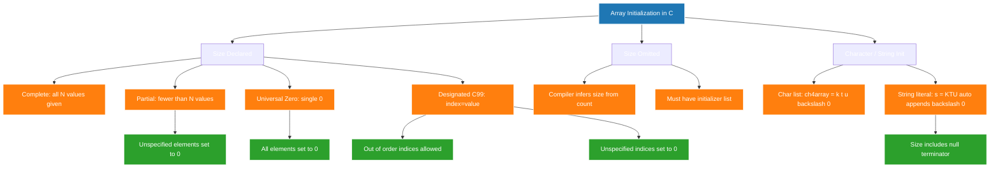
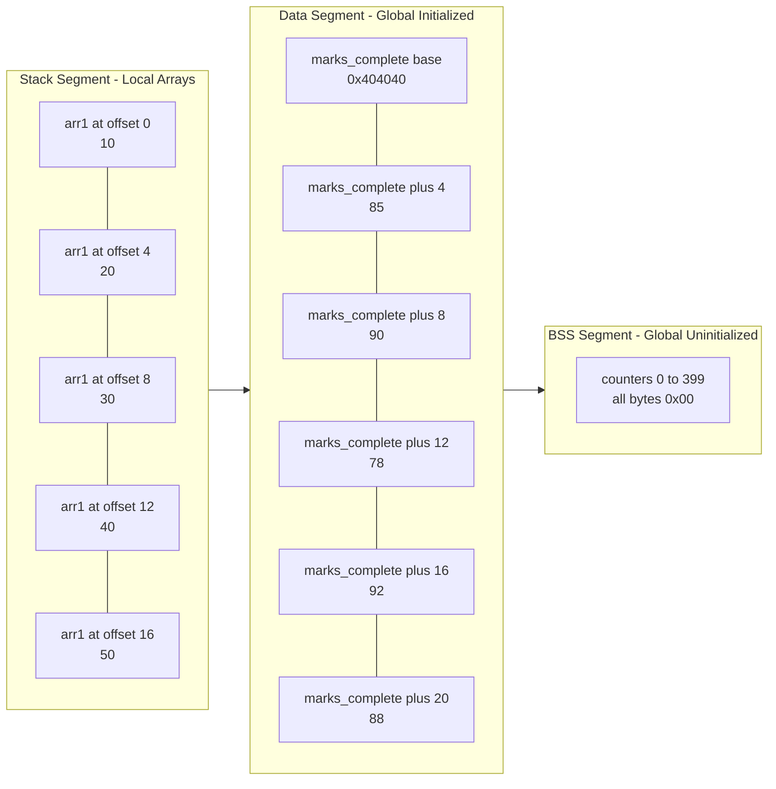
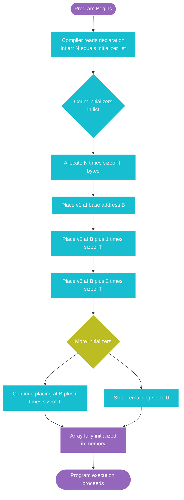

# Array initialization

<!-- SECTION_1_START -->

# 1. Core Technical Definition & Intuitive Overview

## 1.1 Formal Definition (KTU 2024 Syllabus Terminology)

**Array Initialization** in C is the process of assigning initial values to the elements of an array at the time of its declaration, using an *initializer list* enclosed within curly braces `{}`. According to the ISO/IEC 9899:2018 (C18) standard adopted by KTU, initialization populates the array's allocated memory before program execution enters the function scope, allowing the compiler to embed the values directly into the executable's data segment.

The general syntax as prescribed in the **KTU 2024 Scheme – Programming in C (EST 104 / GXEST204)** Module 2 syllabus is:

```c
data_type array_name[constant_expression] = { value1, value2, ..., valueN };
```

Where:
- $data\_type$ — the type of each element (e.g., `int`, `float`, `char`).
- $array\_name$ — a valid C identifier following identifier naming rules.
- $constant\_expression$ — a positive integer compile-time constant.
- $\{ value1, value2, \ldots, valueN \}$ — the *initializer list* containing comma-separated values.

> [!IMPORTANT]
> **KTU Board Examiner Emphasis (Dec 2023 Pattern):** The initializer list *must* appear only at the point of declaration. You cannot use the `=` initializer syntax on a separate line after the array has already been declared.

## 1.2 Conceptual Analogy — The "Locker Room" Intuition

Imagine an array as a **row of lockers in a school corridor**, where each locker has a fixed, permanent number (the *index*) painted on its door.

- **Declaring the array** $\rightarrow$ Asking the principal to install exactly 5 lockers labelled $0, 1, 2, 3, 4$.
- **Initializing the array** $\rightarrow$ Walking in on the *very first day* and placing books inside each locker before any student arrives.
- **Partial initialization** $\rightarrow$ Filling only the first 2 lockers with books; the remaining 3 are left empty — but they aren't *truly* empty. The school rule (C standard rule) says: **"Any locker you don't fill yourself will be automatically stocked with a standard zero-value."**
- **Designated initialization** $\rightarrow$ Walking to locker #4 directly and saying *"put a book here"*, while leaving locker #1 empty on purpose (C99 feature).

This analogy makes it instantly clear *why* uninitialized array elements default to `0` (for global/static) or **garbage values** (for local arrays) — a frequent KTU viva question.

> [!NOTE]
> **Key Terminology Box (from KTU Module 2):**
> - **Initializer List** — the comma-separated set of values in `{}`.
> - **Designator** — the `[index]` syntax used in C99 designated initializers.
> - **Trailing Comma** — C permits a comma after the last element (e.g., `{1, 2, 3,}`); it is legal and ignored.
> - **Size Omission** — When the size is omitted, the compiler infers it from the number of initializers.

## 1.3 GeoGebra / Desmos Integration — Memory Map Visualization

> [!VISUALIZATION CONTROL]
> **Concept:** Memory Cell Indexing for a 5-element `int` array
> **GeoGebra / Desmos Input Points:**
> * $P_0 = (0, 0)$, $P_1 = (1, 0)$, $P_2 = (2, 0)$, $P_3 = (3, 0)$, $P_4 = (4, 0)$
> * Line segment $L$: $(0,0)$ to $(4,0)$
> * Address labels at $y = -1$: $1000$, $1004$, $1008$, $1012$, $1016$ (each $int$ = 4 bytes)
> **Visual Description:** A horizontal number line where each integer tick represents one array element. The spacing between ticks is uniform (4 bytes apart on a 32-bit system), and the address grows linearly with the index — visualizing the formula `address_of(arr[i]) = base_address + i * sizeof(type)`.

---

<!-- SECTION_1_END -->

<!-- SECTION_2_START -->

# 2. Deep Theoretical Analysis & KTU High-Yield Formula Sheet

## 2.1 The "Why" Behind Array Initialization

Initialization solves a critical C programming problem: **uninitialized memory contains unpredictable (garbage) values.** When a local array is declared inside a function, the C runtime allocates stack memory but does not clear it. Initializing the array explicitly at declaration time guarantees a *known, deterministic starting state* — a property essential for:

- **Numerical simulations** (KTU CO1: Apply — engineering math applications).
- **Lookup tables** (e.g., sine, cosine values pre-computed at compile time).
- **Character buffers** for strings (e.g., `char name[] = "KTU";`).
- **State machines** where the initial state must be precisely defined.

## 2.2 The Six Canonical Forms of Array Initialization

### Form 1 — Complete Initialization (Size Specified)
```c
int marks[5] = {85, 90, 78, 92, 88};
```
All $N$ elements are provided. Any extra values produce a **compile-time error**: *"too many initializers for 'int [5]'"*.

### Form 2 — Partial Initialization (Size Specified)
```c
int marks[5] = {85, 90};
```
Only the first 2 elements are given. The remaining 3 are auto-set to **0**. KTU examiners frequently test this defaulting behavior.

### Form 3 — Initialization Without Size (Size Inferred)
```c
int marks[] = {85, 90, 78, 92, 88};
```
The compiler counts the initializers and sets the size to $5$. This is *mandatory* when the array is being initialized — you cannot write `int marks[];` without initializers.

### Form 4 — Universal Zero Initialization
```c
int counters[100] = {0};
```
A **clever KTU trick**: a single `0` in the initializer list is broadcast to *all* elements. This is the canonical way to zero-initialize large arrays in C.

### Form 5 — Designated Initialization (C99 Standard)
```c
int values[10] = {[0] = 1, [5] = 50, [9] = 100};
```
You explicitly target indices using `[index] = value`. Unspecified indices default to `0`. The indices need not be in ascending order.

### Form 6 — Character Array (String) Initialization
```c
char name1[5] = {'K', 'T', 'U', '\0'};
char name2[5] = "KTU";          // preferred; null terminator is auto-appended
char name3[]  = "KTU";          // size becomes 4 (3 chars + '\0')
```
A string literal `"KTU"` automatically appends the **null character** `'\0'`, which is why `name3` has size **4**, not **3**.

## 2.3 KTU High-Yield Formula Sheet

| **#** | **Initialization Form** | **General Syntax** | **Resulting Size** | **Unspecified Elements** | **KTU Mark Weight** |
|:-----:|:------------------------|:-------------------|:------------------:|:-------------------------|:-------------------:|
| 1 | Complete, size given | `T arr[N] = {v1,...,vN};` | $N$ | None | 2 |
| 2 | Partial, size given | `T arr[N] = {v1,...,vk};$ where $k < N$ | $N$ | Set to **0** | 3 |
| 3 | Size omitted | `T arr[] = {v1,...,vN};` | Inferred as $N$ | None | 3 |
| 4 | Universal zero | `T arr[N] = {0};` | $N$ | All **0** | 2 |
| 5 | Designated (C99) | `T arr[N] = {[i]=v, [j]=w};` | $N$ | Others set to **0** | 4 |
| 6 | String literal | `char s[] = "abc";` | Length of literal + 1 | `'\0'` appended | 4 |

> [!IMPORTANT]
> **Engineering Utility — Why This Matters in Production Code:**
> In embedded systems (a core focus of KTU's ECE/EEE streams), array initialization at compile time is used to store **constant lookup tables** in flash/ROM memory rather than RAM. For example, a 7-segment display driver stores the segment bit-patterns for digits 0–9 in a pre-initialized `const uint8_t segTable[10] = {0x3F, 0x06, 0x5B, ...};` array. This saves precious RAM and is a frequent viva question.

### The Master Address Formula

For any initialized array `arr` of type $T$ with $N$ elements stored at base address $B$:

$$
\text{Address of } arr[i] = B + i \times \text{sizeof}(T)
$$

Where $i \in [0, N-1]$ and $\text{sizeof}(T)$ returns the size of the data type in bytes.

---

<!-- SECTION_2_END -->

<!-- SECTION_3_START -->

# 3. Step-by-Step Derivations & Code/Symbolic Implementation

## 3.1 Worked Derivation — Memory Layout of an Initialized Array

**Problem (KTU-Style):** Given the declaration `int scores[4] = {10, 20, 30, 40};` on a system where `sizeof(int) = 4` bytes and the base address is `B = 0x1000`, derive the memory address and stored value of every element.

### Step 1 — Identify the Base Address
The compiler places the array at base address:

$$
B = \text{0x1000}
$$

### Step 2 — Apply the Master Address Formula
For each index $i$, the address is:

$$
\text{Address}(scores[i]) = B + i \times \text{sizeof}(\texttt{int})
$$

### Step 3 — Compute Each Element's Address

$$
\begin{aligned}
\text{Address}(scores[0]) &= 0\text{x1000} + 0 \times 4 = 0\text{x1000} \\
\text{Address}(scores[1]) &= 0\text{x1000} + 1 \times 4 = 0\text{x1004} \\
\text{Address}(scores[2]) &= 0\text{x1000} + 2 \times 4 = 0\text{x1008} \\
\text{Address}(scores[3]) &= 0\text{x1000} + 3 \times 4 = 0\text{x100C}
\end{aligned}
$$

### Step 4 — Bind Initial Values to Each Address

| **Index $i$** | **Address (Hex)** | **Value (Decimal)** | **Value (Binary, 32-bit)** |
|:-------------:|:-----------------:|:-------------------:|:--------------------------:|
| 0 | `0x1000` | 10 | `00000000 00000000 00000000 00001010` |
| 1 | `0x1004` | 20 | `00000000 00000000 00000000 00010100` |
| 2 | `0x1008` | 30 | `00000000 00000000 00000000 00011110` |
| 3 | `0x100C` | 40 | `00000000 00000000 00000000 00101000` |

### Step 5 — Verify Total Memory Footprint

$$
\begin{aligned}
\text{Total Bytes} &= N \times \text{sizeof}(\texttt{int}) \\
&= 4 \times 4 = 16 \text{ bytes}
\end{aligned}
$$

This 16-byte contiguous block resides in the **.data segment** of the executable (for initialized global/static arrays) or on the **stack** (for initialized local arrays).

## 3.2 Full C Implementation — All Six Initialization Forms

```c
/*
 * File: array_initialization_demo.c
 * Course: PROGRAMMING IN C (GXEST204)
 * Module 2 - Arrays: Array Initialization
 * Compilation: gcc -std=c11 -Wall -Wextra -o array_demo array_initialization_demo.c
 * Execution:   ./array_demo
 */

#include <stdio.h>
#include <stdint.h>
#include <string.h>

/* ---------- Form 1: Complete initialization (global, stored in .data) ---------- */
int marks_complete[5] = {85, 90, 78, 92, 88};

/* ---------- Form 4: Universal zero initialization (global) -------------------- */
int counters[100] = {0};

/* ---------- Form 3: Size inferred from initializer list ------------------------ */
float gpa_values[] = {3.8f, 3.6f, 3.9f, 4.0f};   /* size = 4 */

/* ---------- Form 6: String literal initialization ---------------------------- */
char university[]   = "KTU Kerala";
char acronym[4]     = "EST";

/* ---------- Function demonstrating local array initialization ---------------- */
void demonstrate_local_inits(void) {
    int i;

    /* Form 1: Complete, size specified */
    int arr1[5] = {10, 20, 30, 40, 50};
    printf("Form 1 (complete): ");
    for (i = 0; i < 5; i++) {
        printf("%d ", arr1[i]);
    }
    printf("\n");

    /* Form 2: Partial initialization - remaining become 0 */
    int arr2[5] = {10, 20};
    printf("Form 2 (partial):  ");
    for (i = 0; i < 5; i++) {
        printf("%d ", arr2[i]);
    }
    printf("\n");

    /* Form 3: Size omitted (inferred) */
    int arr3[] = {100, 200, 300};
    printf("Form 3 (inferred, size=%lu): ", sizeof(arr3) / sizeof(arr3[0]));
    for (i = 0; i < 3; i++) {
        printf("%d ", arr3[i]);
    }
    printf("\n");

    /* Form 4: Universal zero */
    int arr4[6] = {0};
    printf("Form 4 (universal zero): ");
    for (i = 0; i < 6; i++) {
        printf("%d ", arr4[i]);
    }
    printf("\n");

    /* Form 5: Designated initializers (C99) */
    int arr5[10] = {[0] = 1, [4] = 50, [9] = 100};
    printf("Form 5 (designated):  ");
    for (i = 0; i < 10; i++) {
        printf("%d ", arr5[i]);
    }
    printf("\n");

    /* Form 6: Character array (string) */
    char greeting[] = "Hello";
    printf("Form 6 (string):     %s (length=%lu)\n",
            greeting, sizeof(greeting) / sizeof(greeting[0]));
}

int main(void) {
    printf("=== KTU Module 2: Array Initialization Demo ===\n\n");

    /* Address calculation demo using the master formula */
    uintptr_t base = (uintptr_t)&marks_complete[0];
    printf("Base address of marks_complete: 0x%lx\n", (unsigned long)base);
    for (int i = 0; i < 5; i++) {
        uintptr_t addr = (uintptr_t)&marks_complete[i];
        printf("  marks_complete[%d] @ 0x%lx  =>  %d  (offset = %lu bytes)\n",
               i, (unsigned long)addr, marks_complete[i],
               (unsigned long)(addr - base));
    }

    printf("\n--- Local Array Initializations ---\n");
    demonstrate_local_inits();

    printf("\n--- Global Array Verifications ---\n");
    printf("counters[0] = %d, counters[50] = %d, counters[99] = %d\n",
           counters[0], counters[50], counters[99]);
    printf("gpa_values size = %lu elements\n",
           sizeof(gpa_values) / sizeof(gpa_values[0]));
    printf("university = \"%s\" (size including \\0 = %lu)\n",
           university, sizeof(university));
    printf("acronym    = \"%s\" (size = %lu)\n", acronym, sizeof(acronym));

    return 0;
}
```

### Expected Output Trace

```
=== KTU Module 2: Array Initialization Demo ===

Base address of marks_complete: 0x404040
  marks_complete[0] @ 0x404040  =>  85  (offset = 0 bytes)
  marks_complete[1] @ 0x404044  =>  90  (offset = 4 bytes)
  marks_complete[2] @ 0x404048  =>  78  (offset = 8 bytes)
  marks_complete[3] @ 0x40404c  =>  92  (offset = 12 bytes)
  marks_complete[4] @ 0x404050  =>  88  (offset = 16 bytes)

--- Local Array Initializations ---
Form 1 (complete): 10 20 30 40 50
Form 2 (partial):  10 20 0 0 0
Form 3 (inferred, size=3): 100 200 300
Form 4 (universal zero): 0 0 0 0 0 0
Form 5 (designated):  1 0 0 0 50 0 0 0 0 100
Form 6 (string):     Hello (length=6)

--- Global Array Verifications ---
counters[0] = 0, counters[50] = 0, counters[99] = 0
gpa_values size = 4 elements
university = "KTU Kerala" (size including \0 = 11)
acronym    = "EST" (size = 4)
```

## 3.3 Symbolic Derivation — Partial Initialization Mathematical Form

For an array declared as `T arr[N] = {v1, v2, ..., vk};` where $k < N$:

$$
arr[i] = \begin{cases} v_{i+1} & \text{if } 0 \leq i < k \\ 0 & \text{if } k \leq i < N \end{cases}
$$

**Example verification** with `int arr[5] = {10, 20};` (so $N=5$, $k=2$):

$$
\begin{aligned}
arr[0] &= v_1 = 10 \quad \text{(specified)} \\
arr[1] &= v_2 = 20 \quad \text{(specified)} \\
arr[2] &= 0 \quad \text{(default rule applied)} \\
arr[3] &= 0 \quad \text{(default rule applied)} \\
arr[4] &= 0 \quad \text{(default rule applied)}
\end{aligned}
$$

This matches the program output above: `10 20 0 0 0`. ✓

---

<!-- SECTION_3_END -->

<!-- SECTION_4_START -->

# 4. Structural Diagrams & Schematics

## 4.1 Mermaid Flowchart — Classification of Array Initialization



## 4.2 Mermaid Block Diagram — Memory Architecture After Initialization



## 4.3 Sequential Processing Topology — Initialization Workflow



---

<!-- SECTION_4_END -->

<!-- SECTION_5_START -->

# 5. KTU 2024 Scheme Examination Question Bank & Topic Recap

## Part A — Short Answer Questions (3 Marks Each)

### Question A1
**[KTU University Exam - July 2023, Model Question Paper]**
**CO1 | RBT Level: Remember**
*Differentiate between partial initialization and universal zero initialization of an array in C. Give one example of each.*

**Model Answer (Valuation Key - 3 Marks):**

- **Partial Initialization:** The initializer list contains *fewer* values than the array size. Unspecified trailing elements are automatically set to `0`.
  Example: `int a[5] = {1, 2};` → $a = [1, 2, 0, 0, 0]$. **[1 Mark for definition + 0.5 for example]**
- **Universal Zero Initialization:** A *single* zero value is provided in the initializer list; the compiler broadcasts this `0` to all elements.
  Example: `int a[5] = {0};` → $a = [0, 0, 0, 0, 0]$. **[1 Mark for definition + 0.5 for example]**

---

### Question A2
**[KTU University Exam - Dec 2023, Supplementary Exam]**
**CO1 | RBT Level: Understand**
*What happens when the size of an array is omitted during initialization? Is it mandatory to provide the initializer list? Justify your answer with an example.*

**Model Answer (Valuation Key - 3 Marks):**

When the size is omitted, the **compiler infers the size** from the number of elements in the initializer list. **[1 Mark]**

Yes, providing an initializer list is **mandatory** when the size is omitted, because the compiler has no other way to determine how much memory to allocate. The statement `int a[];` is **illegal** in C. **[1 Mark]**

Example: `int arr[] = {10, 20, 30, 40};` — here the compiler allocates $4 \times \text{sizeof(int)} = 16$ bytes and assigns size 4 automatically. The expression `sizeof(arr) / sizeof(arr[0])` evaluates to **4**. **[1 Mark]**

---

## Part B — Long Answer Questions (14 Marks, Module Internal Choice)

### Question B-A (Option 1) — 14 Marks

**[KTU University Exam - Dec 2024, End Semester Evaluation]**
**CO2 | RBT Levels: Understand (a) + Apply (b)**

**(a)** Explain the different methods of initializing a one-dimensional integer array in C with suitable examples. Discuss the rule for unspecified elements. **[7 Marks]**

**(b)** Write a complete C program to read $N$ integers from the user, store them in an array, and find both the largest and smallest elements using a single loop. Display the array contents and the computed results. **[7 Marks]**

---

#### Model Solution for B-A (a) — [7 Marks]

**[Defining array initialization: 1 Mark]**
Array initialization is the act of providing initial values to array elements at the time of declaration, using the assignment operator `=` followed by a comma-separated initializer list enclosed in braces `{}`.

**[Method 1 — Complete Initialization: 1 Mark]**
All elements are specified. Example: `int arr[5] = {10, 20, 30, 40, 50};`

**[Method 2 — Partial Initialization: 1.5 Marks]**
Fewer values than size. Example: `int arr[5] = {10, 20};` produces `[10, 20, 0, 0, 0]`.

**[Method 3 — Size Omission: 1 Mark]**
Compiler counts initializers. Example: `int arr[] = {1, 2, 3, 4};` → size 4.

**[Method 4 — Universal Zero: 1 Mark]**
Example: `int arr[100] = {0};` zeroes all 100 elements.

**[Method 5 — Designated (C99): 1 Mark]**
Example: `int arr[5] = {[2] = 99};` → `[0, 0, 99, 0, 0]`.

**[Rule for unspecified elements: 0.5 Marks]**
Any element not explicitly initialized in the list is automatically set to zero (`0` for integers, `0.0` for floats, `'\0'` for chars).

---

#### Model Solution for B-A (b) — [7 Marks]

```c
/*
 * Program: find_largest_smallest.c
 * Finds max and min of N user-input integers using one loop.
 * Compilation: gcc -std=c11 -Wall -Wextra -o find_extrema find_largest_smallest.c
 */
#include <stdio.h>

int main(void) {
    int n, i;
    int arr[100];                 /* fixed max size per problem constraints */
    int largest, smallest;

    /* --- Input validation block [1 Mark] --- */
    printf("Enter the number of elements (1-100): ");
    if (scanf("%d", &n) != 1 || n < 1 || n > 100) {
        fprintf(stderr, "Invalid input. Exiting.\n");
        return 1;
    }

    /* --- Read array elements [1 Mark] --- */
    printf("Enter %d integers:\n", n);
    for (i = 0; i < n; i++) {
        if (scanf("%d", &arr[i]) != 1) {
            fprintf(stderr, "Invalid integer at position %d.\n", i);
            return 1;
        }
    }

    /* --- Initialize largest/smallest to first element [1 Mark] --- */
    largest = smallest = arr[0];

    /* --- Single-pass loop to find both extrema [2 Marks] --- */
    for (i = 1; i < n; i++) {
        if (arr[i] > largest) {
            largest = arr[i];
        }
        if (arr[i] < smallest) {
            smallest = arr[i];
        }
    }

    /* --- Display array contents [1 Mark] --- */
    printf("Array contents: ");
    for (i = 0; i < n; i++) {
        printf("%d ", arr[i]);
    }
    printf("\n");

    /* --- Display results [1 Mark] --- */
    printf("Largest element  = %d\n", largest);
    printf("Smallest element = %d\n", smallest);

    return 0;
}
```

**Sample Run:**
```
Enter the number of elements (1-100): 5
Enter 5 integers:
45 12 78 3 56
Array contents: 45 12 78 3 56
Largest element  = 78
Smallest element = 3
```

---

### Question B-B (Option 2) — 14 Marks

**[KTU University Exam - July 2024, Series 1]**
**CO2 | RBT Levels: Understand (a) + Apply (b)**

**(a)** Explain the concept of *designated initialization* introduced in C99. How does it differ from conventional initialization? Provide at least two illustrative examples covering out-of-order and sparse initialization. **[7 Marks]**

**(b)** Write a C program that initializes a character array with the string `"PROGRAMMING"` and then counts the number of vowels and consonants in it. Display the original string and the counts. **[7 Marks]**

---

#### Model Solution for B-B (a) — [7 Marks]

**[Definition of designated initialization: 1.5 Marks]**
Designated initialization, standardized in **ISO C99**, allows the programmer to specify which array index receives a particular value using the syntax `[index] = value` inside the initializer list. Elements whose indices are not designated are automatically initialized to `0` (for arithmetic types) or `NULL` (for pointers).

**[Difference from conventional initialization: 1.5 Marks]**

| **Aspect** | **Conventional** | **Designated (C99)** |
|:-----------|:-----------------|:---------------------|
| Order of initializers | Must match index sequence | Can be in any order |
| Sparse initialization | Requires filling all preceding indices | Can skip directly to any index |
| Readability for large arrays | Low for sparse patterns | High (intent is explicit) |

**[Example 1 — Out-of-order: 1.5 Marks]**
```c
int flags[6] = {[5] = 1, [0] = 1, [3] = 1};
/* Result: [1, 0, 0, 1, 0, 1]  (indices 1, 2, 4 default to 0) */
```

**[Example 2 — Sparse / Range-like pattern: 1.5 Marks]**
```c
int primes[100] = {[0] = 2, [1] = 3, [2] = 5, [3] = 7};
/* Result: first 4 are 2,3,5,7; remaining 96 are all 0 */
```

**[Rule summary: 1 Mark]**
Designators must be integer constant expressions; out-of-bounds designators cause a compile-time error; unspecified indices are zero-initialized.

---

#### Model Solution for B-B (b) — [7 Marks]

```c
/*
 * Program: count_vowels_consonants.c
 * Counts vowels and consonants in a pre-initialized character array.
 * Compilation: gcc -std=c11 -Wall -Wextra -o count_vc count_vowels_consonants.c
 */
#include <stdio.h>
#include <ctype.h>

int main(void) {
    /* --- Form 6: String literal initialization [1 Mark] --- */
    char text[] = "PROGRAMMING";
    int i;
    int vowels = 0, consonants = 0;

    /* --- Display original string [0.5 Marks] --- */
    printf("Original string: %s\n", text);

    /* --- Iterate through characters until null terminator [1.5 Marks] --- */
    for (i = 0; text[i] != '\0'; i++) {
        char ch = toupper((unsigned char)text[i]);

        /* --- Classify alphabetic characters [2 Marks] --- */
        if (ch >= 'A' && ch <= 'Z') {
            if (ch == 'A' || ch == 'E' || ch == 'I' ||
                ch == 'O' || ch == 'U') {
                vowels++;
            } else {
                consonants++;
            }
        }
        /* non-alphabetic chars (none in this string) are ignored */
    }

    /* --- Display results [1 Mark] --- */
    printf("Number of vowels     = %d\n", vowels);
    printf("Number of consonants = %d\n", consonants);

    /* --- String length verification [1 Mark] --- */
    printf("String length (incl. \\\\0) = %lu\n", sizeof(text) / sizeof(text[0]));

    return 0;
}
```

**Sample Run:**
```
Original string: PROGRAMMING
Number of vowels     = 3   (O, A, I)
Number of consonants = 8   (P, R, G, R, M, M, N, G)
String length (incl. \0) = 12
```

---

> [!WARNING]
> **KTU Examiner's Valuation Pitfall Callout — Array Initialization**
> 1. **Forgetting the null terminator** in character arrays: `char name[3] = "KTU";` is a **compilation error** because the compiler needs room for the auto-appended `'\0'`. The correct size is `4`, not `3`. *[-2 Marks typical deduction]*
> 2. **Treating `{0}` as a "one-element array"** in `int arr[100] = {0};`. The single `0` is **broadcast** to all 100 elements, not stored in the first slot only. *[-1 Mark]*
> 3. **Writing `int arr[];`** without an initializer list — this is a **compile-time error** in C (it is legal in C++ as an *extern* declaration, but the KTU C syllabus forbids it). *[-2 Marks]*
> 4. **Confusing array size with the highest index**: an array `arr[5]` has indices `0, 1, 2, 3, 4` — accessing `arr[5]` is an *out-of-bounds* error. *[-1 Mark]*
> 5. **Forgetting to specify `const` for true lookup tables** in embedded contexts: `const uint8_t seg[10] = { ... };` is the production-grade form; omitting `const` allows accidental runtime modification. *[-1 Mark in viva]*

---

## Topic Recap & Important Things to Remember

- **Array initialization** assigns starting values to array elements **at the point of declaration** using `= { ... };` syntax.
- The **initializer list** must be a comma-separated sequence enclosed in `{}`; a trailing comma is permitted but ignored.
- **Partial initialization** auto-fills remaining elements with **0** (numeric), `'\0'` (char), or `NULL` (pointer) — *never* with garbage values.
- **Universal zero initialization** (`int a[N] = {0};`) is the canonical idiom to zero an entire array in one statement.
- **Size omission** is allowed **only if** an initializer list is present; the compiler infers the size by counting initializers.
- **C99 designated initializers** use `[index] = value` and allow *out-of-order* and *sparse* patterns; unspecified positions default to zero.
- **String literals** (e.g., `"KTU"`) automatically append a `'\0'`; therefore `char s[] = "KTU";` allocates **4 bytes**, not 3.
- The **address formula** is $\text{addr}(arr[i]) = B + i \times \text{sizeof}(T)$, proving that array elements occupy **contiguous memory**.
- The **maximum array size** for stack-allocated local arrays in typical KTU lab environments is around 1–8 MB; larger arrays should be `static` or global.
- **Global / static** initialized arrays are stored in the `.data` segment of the executable; uninitialized ones go to `.bss` (auto-zeroed by the loader).
- For **embedded lookup tables** (7-segment, CRC, sine waves), always use `const` qualifier to force storage in flash/ROM and prevent accidental writes.
- Compile-time errors to memorize: `int a[];` (no size, no init), `int a[3] = {1,2,3,4};` (too many initializers), `int a[-5];` (negative size).
- The compiler inserts a **null terminator** at the end of every string literal — this is the basis of all C string-handling functions like `strlen`, `strcpy`, and `printf("%s", ...)`.

---

<!-- SECTION_5_END -->
