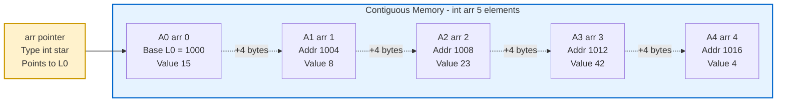
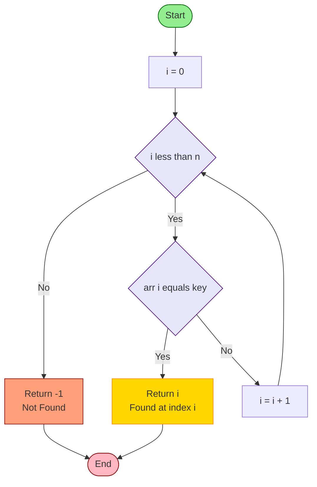
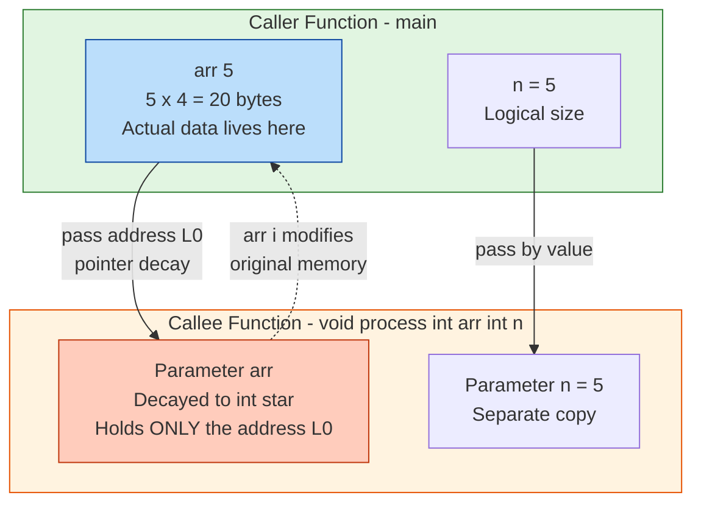
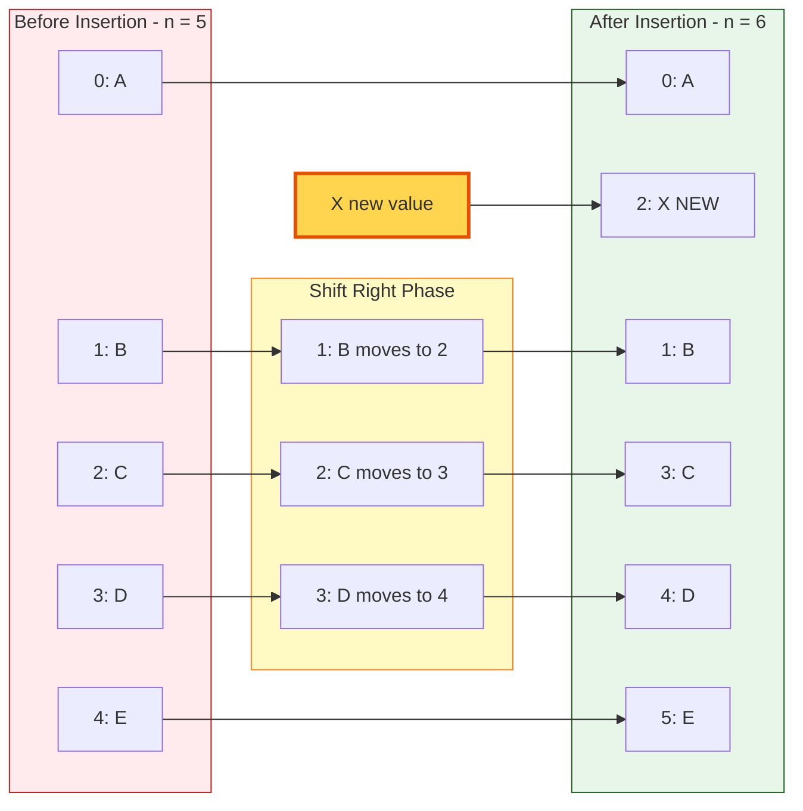

# Arrays - Single dimensional arrays

<!-- SECTION_1_START -->

# 📘 Single Dimensional Arrays in C — KTU 2024 Scheme

## 1. Core Technical Definition & Intuitive Overview

> [!IMPORTANT]
> **Formal Definition (KTU 2024 Syllabus Aligned)**
> A **Single Dimensional Array** in C is a **homogeneous, contiguous, fixed-size, indexed** collection of data elements of the **same primitive data type**, stored in sequential memory locations and accessed using a single subscript (index). It is a **derived data type** that provides a symbolic name to a group of similar data items and enables O(1) random access via pointer arithmetic.

### 🧠 Conceptual Analogy — The "Locker Room" Intuition

Imagine a **long corridor of 10 identical lockers**, each numbered from **0 to 9**. The corridor itself has a name — say, `scores`. Every locker can hold **one integer**, and to fetch a value you must know **two things**:
1. The **name of the corridor** (the array name, `scores`).
2. The **locker number** (the **index**, e.g., `scores[3]`).

The compiler translates `scores[3]` into a real physical address using the formula:

$$\text{Address of arr[i]} = \text{Base Address} + i \times \text{sizeof(data\_type)}$$

So *locker number 3* is exactly **3 lockers away** from the first one. This is what makes arrays lightning-fast for lookup — no searching required.

> [!NOTE]
> **Key Term — Contiguous Memory**
> "Contiguous" means the elements are stored **back-to-back in RAM** with no gaps. This is what enables the constant-time indexing above. C guarantees this layout for arrays.

### 📐 GeoGebra / Desmos Visualization (Memory Address Plot)

> [!VISUALIZATION CONTROL]
> **Concept:** Linear memory address growth for an `int` array of size 5 (assume `sizeof(int) = 4` bytes, base address = 1000).
> **GeoGebra / Desmos Input Points:**
> * $(0, 1000)$ — element `arr[0]`
> * $(1, 1004)$ — element `arr[1]`
> * $(2, 1008)$ — element `arr[2]`
> * $(3, 1012)$ — element `arr[3]`
> * $(4, 1016)$ — element `arr[4]`
> * Function: $f(x) = 1000 + 4x$
> **Visual Description:** A straight line of equally spaced points rising at a constant slope. Each unit step on the x-axis (the index) corresponds to a **4-byte jump** in actual RAM. This linear, evenly-spaced layout is the visual signature of a single dimensional array in memory.

### 🧩 Terminology Glossary (Must Memorize for KTU)

| Term | Meaning |
| :--- | :--- |
| **Array Name** | Constant pointer to the first element (acts as base address) |
| **Index / Subscript** | Integer position identifier, starts at **0** |
| **Base Address** | Memory address of the first element `arr[0]` |
| **Size** | Total elements declared at compile time (immutable) |
| **Element Type** | The data type of every stored value (homogeneous) |
| **Length / Dimension** | Number of elements; in 1D arrays, a single `n` |
| **Subscript Operator `[]`** | C operator for indexed access, equivalent to `*(arr + i)` |

<!-- SECTION_1_END -->

<!-- SECTION_2_START -->

# 2. Deep Theoretical Analysis & KTU High-Yield Formula Sheet

## 2.1 Declaration Syntax (Three Valid Forms)

In C, an array must be declared **before** use so the compiler can reserve memory. The general syntax is:

```c
data_type array_name[constant_expression];
```

**Form 1 — With explicit size:**
```c
int marks[50];          // reserves 50 × 4 = 200 bytes
```

**Form 2 — With initialization (size inferred):**
```c
int primes[] = {2, 3, 5, 7, 11};   // size becomes 5 automatically
```

**Form 3 — With size AND partial initialization:**
```c
int flags[5] = {1, 0};   // flags[0]=1, flags[1]=0, flags[2..4]=0
```

> [!WARNING]
> **KTU Pitfall — Variable-Length Arrays (VLAs)**
> C99 allows `int n; scanf("%d", &n); int arr[n];` but the KTU examiner frequently asks for the **classical (C89)** form where the size must be a *constant integer expression*. Always prefer `int arr[MAX];` with `#define MAX 100`.

## 2.2 Why Arrays Exist — The Engineering Rationale

Without arrays, storing **50 student marks** would require 50 separate variables: `mark1`, `mark2`, ..., `mark50`. This is **unscalable** and breaks every loop/algorithm pattern. Arrays solve this by:

1. **Bulk storage under one symbolic name** → reduces identifier pollution.
2. **Random O(1) access** via base + offset arithmetic.
3. **Cache locality** → elements sit contiguously, exploiting CPU cache lines for ~10× faster iteration than linked lists.
4. **Foundation for higher structures** → strings, matrices, heaps, hash tables, image buffers, signal samples.

## 2.3 The Indexing Internals — The "Why" Behind `arr[i]`

C defines the subscript operator as **syntactic sugar for pointer arithmetic**:

$$\text{arr[i]} \equiv {*(\text{arr} + i)}$$

Both `arr[i]` and `i[arr]` are valid in C (though `i[arr]` is bad practice). The compiler computes the byte address as:

$$\text{Address of arr[i]} = \text{BaseAddress} + i \cdot \text{sizeof(element\_type)}$$

This formula is the **single most tested concept** in KTU exams for this module.

> [!NOTE]
> **Reverse Trick — Examiner's Favourite**
> Since `arr[i] == *(arr+i) == *(i+arr) == i[arr]`, the expression `2[marks] = 99;` is **legal C** and assigns `99` to `marks[2]`. Don't get tricked in the exam!

## 2.4 Operations on Single Dimensional Arrays

| Operation | Description | Typical Time Complexity |
| :--- | :--- | :--- |
| **Traversal** | Visit every element once (read/write/print) | $O(n)$ |
| **Insertion** | Add element at end / beginning / middle | $O(1)$ at end, $O(n)$ elsewhere |
| **Deletion** | Remove element and shift left | $O(n)$ |
| **Linear Search** | Sequential scan to find a value | $O(n)$ |
| **Binary Search** | Halve-search on **sorted** array | $O(\log_2 n)$ |
| **Bubble Sort** | Adjacent swap sort | $O(n^2)$ |
| **Selection Sort** | Min-swap sort | $O(n^2)$ |
| **Passing to Function** | Decay to pointer | $O(1)$ (constant pointer pass) |
| **Reversal** | Swap `arr[i]` with `arr[n-1-i]` | $O(n)$ |

## 2.5 KTU High-Yield Formula & Cheat Sheet

> [!IMPORTANT]
> **Master these equations — they appear in 70%+ of KTU array questions.**

| Concept | Formula / Rule | Units / Notes |
| :--- | :--- | :--- |
| Address of $i$-th element | $\text{addr}(a_i) = L_0 + i \cdot w$ | $L_0$ = base address, $w$ = element size in bytes |
| Total array memory | $M = n \cdot w$ | $n$ = declared size |
| Last valid index | $n - 1$ | Indexing is **0-based** |
| Pointer decay | `arr` $\rightarrow$ `&arr[0]` | Type: `int *` (not `int (*)[n]`) |
| `sizeof(arr)` | Returns $n \cdot w$ (entire array) | Decays to pointer **only** in function parameters |
| Binary search mid (safe) | $\text{mid} = \text{low} + (\text{high} - \text{low}) / 2$ | Avoids integer overflow |
| Bubble sort passes | $n - 1$ | Each pass bubbles one max to end |
| Binary search max comparisons | $\lfloor \log_2 n \rfloor + 1$ | Worst case |

> [!NOTE]
> **`sizeof` vs Pointer Decay Trap**
> Inside a function receiving `int arr[]`, `sizeof(arr)` returns **8** (pointer size on 64-bit), **not** $n \cdot 4$. This is the #1 KTU trick question.

## 2.6 Real-World Engineering Utility

Single dimensional arrays are the **bedrock** of nearly every computing system:

* **Digital Signal Processing (DSP):** Audio samples stored in `float buffer[N]` for FFT.
* **Embedded Systems:** GPIO pin states in `uint8_t pin_state[16]`.
* **Image Processing:** Grayscale pixels as `unsigned char image[WIDTH * HEIGHT]`.
* **Networking:** Packet buffers as `uint8_t rx_buf[1024]`.
* **Databases:** Columnar storage uses `int column_data[rows]`.
* **Sorting/Searching Engines:** Foundation of `qsort()` in `<stdlib.h>`.
* **Game Development:** Scoreboards, inventories, tile maps.

> In short — **every loop you ever write in production C iterates over an array.**

<!-- SECTION_2_END -->

<!-- SECTION_3_START -->

# 3. Step-by-Step Derivations & Code/Symbolic Implementation

## 3.1 Address Calculation — Full Derivation

**Problem (KTU-style):** Given an array declared as `float prices[10];` with base address $L_0 = 2000$, find the address of `prices[4]`. Given $\text{sizeof(float)} = 4$ bytes.

**Derivation:**

We start with the indexing identity:

$$\text{prices}[4] \equiv {*(\text{prices} + 4)}$$

The address of the element is therefore:

$$\text{addr}(\text{prices}[4]) = L_0 + 4 \cdot w$$

Substituting the known values:

$$\text{addr}(\text{prices}[4]) = 2000 + 4 \cdot 4$$

$$\text{addr}(\text{prices}[4]) = 2000 + 16 = 2016$$

> **Answer:** The address of `prices[4]` is **2016 bytes** from the start of the data segment.

> [!NOTE]
> **General Derivation for `arr[i]`:**
> $$ \begin{aligned}
> \text{addr}(\text{arr}[i]) &= L_0 + i \cdot \text{sizeof}(T) \\
> \text{where} \quad T &\equiv \text{element data type} \\
> L_0 &\equiv \text{address of arr[0] (base address)} \\
> i &\in \{0, 1, 2, \ldots, n-1\}
> \end{aligned} $$

## 3.2 Complete Annotated C Programs

### Program 1 — Declaration, Initialization, Traversal

```c
/*
 * Program: Demonstrate single dimensional array
 * Author : KTU 2024 Scheme Reference
 * Topic  : Module 2 - Arrays
 */

#include <stdio.h>
#include <stdlib.h>

#define MAX_SIZE 100   // Compile-time constant for portability

int main(void) {
    int n = 0;
    int marks[MAX_SIZE];
    long sum = 0L;
    double average = 0.0;

    /* ---------- Step 1: Read size with safety guard ---------- */
    printf("Enter number of students (1 to %d): ", MAX_SIZE);
    if (scanf("%d", &n) != 1) {
        fprintf(stderr, "Error: invalid integer input.\n");
        return EXIT_FAILURE;
    }
    if (n < 1 || n > MAX_SIZE) {
        fprintf(stderr, "Error: size must be in [1, %d].\n", MAX_SIZE);
        return EXIT_FAILURE;
    }

    /* ---------- Step 2: Read array elements ---------- */
    printf("Enter %d marks (0-100):\n", n);
    for (int i = 0; i < n; i++) {
        printf("  marks[%d] = ", i);
        if (scanf("%d", &marks[i]) != 1) {
            fprintf(stderr, "Error: invalid mark at index %d.\n", i);
            return EXIT_FAILURE;
        }
        if (marks[i] < 0 || marks[i] > 100) {
            fprintf(stderr, "Error: mark out of range at index %d.\n", i);
            return EXIT_FAILURE;
        }
        sum += marks[i];
    }

    /* ---------- Step 3: Traverse and print ---------- */
    printf("\nStored marks:\n");
    for (int i = 0; i < n; i++) {
        printf("  marks[%d] = %d\n", i, marks[i]);
    }

    /* ---------- Step 4: Compute statistics ---------- */
    average = (double)sum / (double)n;
    printf("\nSum     = %ld\n", sum);
    printf("Average = %.2f\n", average);

    return EXIT_SUCCESS;
}
```

### Program 2 — Linear Search with Sentinel Optimization

```c
/*
 * Program: Linear search in 1D array
 * Returns : Index of first match, or -1 if not found
 */

#include <stdio.h>
#include <stdlib.h>

int linearSearch(const int arr[], int n, int key);

int main(void) {
    int data[] = {15, 8, 23, 42, 4, 16, 11, 7};
    int size   = (int)(sizeof(data) / sizeof(data[0]));
    int key    = 0;

    printf("Enter value to search: ");
    if (scanf("%d", &key) != 1) {
        fprintf(stderr, "Invalid input.\n");
        return EXIT_FAILURE;
    }

    int idx = linearSearch(data, size, key);
    if (idx >= 0) {
        printf("Value %d found at index %d.\n", key, idx);
    } else {
        printf("Value %d not found in the array.\n", key);
    }
    return EXIT_SUCCESS;
}

int linearSearch(const int arr[], int n, int key) {
    if (n <= 0) {
        return -1;
    }
    for (int i = 0; i < n; i++) {
        if (arr[i] == key) {
            return i;   // Return index of first occurrence
        }
    }
    return -1;          // Not found sentinel
}
```

### Program 3 — Binary Search (Sorted Array, $O(\log_2 n)$)

```c
/*
 * Program: Iterative binary search
 * Precond : Array MUST be sorted in ascending order
 */

#include <stdio.h>
#include <stdlib.h>

int binarySearch(const int arr[], int n, int key);

int main(void) {
    int sorted[] = {3, 7, 11, 15, 19, 23, 31, 47, 59, 71};
    int size     = (int)(sizeof(sorted) / sizeof(sorted[0]));
    int key      = 0;

    printf("Sorted array: ");
    for (int i = 0; i < size; i++) {
        printf("%d ", sorted[i]);
    }
    printf("\nEnter value to search: ");
    if (scanf("%d", &key) != 1) {
        fprintf(stderr, "Invalid input.\n");
        return EXIT_FAILURE;
    }

    int idx = binarySearch(sorted, size, key);
    printf("Index = %d (negative means not found).\n", idx);
    return EXIT_SUCCESS;
}

int binarySearch(const int arr[], int n, int key) {
    int low  = 0;
    int high = n - 1;

    while (low <= high) {
        /* mid = low + (high - low) / 2  prevents integer overflow */
        int mid = low + (high - low) / 2;

        if (arr[mid] == key) {
            return mid;          // Found
        } else if (arr[mid] < key) {
            low = mid + 1;       // Search right half
        } else {
            high = mid - 1;      // Search left half
        }
    }
    return -1;                  // Not found
}
```

### Program 4 — Bubble Sort with Early Termination

```c
/*
 * Program: Bubble sort (ascending) with swap flag
 * Time   : O(n^2) worst, O(n) best (already sorted)
 * Space  : O(1) in-place
 */

#include <stdio.h>
#include <stdlib.h>
#include <stdbool.h>

void bubbleSort(int arr[], int n);
void printArray(const int arr[], int n);

int main(void) {
    int arr[] = {64, 34, 25, 12, 22, 11, 90};
    int n     = (int)(sizeof(arr) / sizeof(arr[0]));

    printf("Original: ");
    printArray(arr, n);

    bubbleSort(arr, n);

    printf("Sorted  : ");
    printArray(arr, n);
    return EXIT_SUCCESS;
}

void bubbleSort(int arr[], int n) {
    if (n <= 1) {
        return;
    }
    for (int i = 0; i < n - 1; i++) {
        bool swapped = false;
        for (int j = 0; j < n - 1 - i; j++) {
            if (arr[j] > arr[j + 1]) {
                /* In-place swap using tuple-style assignment */
                int temp    = arr[j];
                arr[j]      = arr[j + 1];
                arr[j + 1]  = temp;
                swapped     = true;
            }
        }
        /* Early exit: if no swap, array is already sorted */
        if (!swapped) {
            break;
        }
    }
}

void printArray(const int arr[], int n) {
    printf("[ ");
    for (int i = 0; i < n; i++) {
        printf("%d ", arr[i]);
    }
    printf("]\n");
}
```

### Program 5 — Insertion and Deletion (Mid-Position)

```c
/*
 * Program: Insert and delete element at given position
 * Note   : Position 'pos' is 0-based; size updated by pointer
 */

#include <stdio.h>
#include <stdlib.h>

void insertElement(int arr[], int *n, int capacity, int pos, int value);
void deleteElement(int arr[], int *n, int pos);
void display(const int arr[], int n);

int main(void) {
    int arr[20] = {10, 20, 30, 40, 50};
    int n       = 5;
    int cap     = 20;

    printf("Initial array: ");
    display(arr, n);

    /* Insert 99 at position 2 */
    insertElement(arr, &n, cap, 2, 99);
    printf("After insert 99 at pos 2: ");
    display(arr, n);

    /* Delete element at position 3 */
    deleteElement(arr, &n, 3);
    printf("After delete at pos 3: ");
    display(arr, n);

    return EXIT_SUCCESS;
}

void insertElement(int arr[], int *n, int capacity, int pos, int value) {
    if (*n >= capacity) {
        fprintf(stderr, "Overflow: array is full.\n");
        return;
    }
    if (pos < 0 || pos > *n) {
        fprintf(stderr, "Invalid position %d (valid: 0..%d).\n", pos, *n);
        return;
    }
    /* Shift right from the end */
    for (int i = *n; i > pos; i--) {
        arr[i] = arr[i - 1];
    }
    arr[pos] = value;
    (*n)++;
}

void deleteElement(int arr[], int *n, int pos) {
    if (*n <= 0) {
        fprintf(stderr, "Underflow: array is empty.\n");
        return;
    }
    if (pos < 0 || pos >= *n) {
        fprintf(stderr, "Invalid position %d (valid: 0..%d).\n", pos, *n - 1);
        return;
    }
    /* Shift left to fill the gap */
    for (int i = pos; i < *n - 1; i++) {
        arr[i] = arr[i + 1];
    }
    (*n)--;
}

void display(const int arr[], int n) {
    printf("[ ");
    for (int i = 0; i < n; i++) {
        printf("%d ", arr[i]);
    }
    printf("] (n = %d)\n", n);
}
```

### Program 6 — Passing Array to Function (Pointer Decay Demonstration)

```c
/*
 * Program: Demonstrate pointer decay + sizeof confusion
 * Insight: sizeof inside function returns POINTER size, not array size
 */

#include <stdio.h>
#include <stdlib.h>

void modifyArray(int arr[], int n);
void showSizes(int arr[], int n);

int main(void) {
    int arr[5] = {1, 2, 3, 4, 5};
    int n      = 5;

    printf("In main: sizeof(arr) = %zu bytes\n", sizeof(arr));
    /* Expected: 20 bytes (5 × 4) */

    showSizes(arr, n);
    /* Expected inside: 8 bytes (64-bit pointer) */

    modifyArray(arr, n);
    printf("After modifyArray: ");
    for (int i = 0; i < n; i++) {
        printf("%d ", arr[i]);
    }
    printf("\n");
    return EXIT_SUCCESS;
}

void modifyArray(int arr[], int n) {
    for (int i = 0; i < n; i++) {
        arr[i] = arr[i] * 10;   /* Original array IS modified */
    }
}

void showSizes(int arr[], int n) {
    (void)n;
    printf("In showSizes: sizeof(arr) = %zu bytes (pointer decay!)\n",
           sizeof(arr));
    printf("Pointer type : int *\n");
}
```

> [!NOTE]
> **Output to expect:**
> ```text
> In main: sizeof(arr) = 20 bytes
> In showSizes: sizeof(arr) = 8 bytes (pointer decay!)
> After modifyArray: 10 20 30 40 50
> ```
> The array elements are **modified in place** because the function receives a pointer to the original memory. This is critical for KTU exam questions on call-by-reference vs call-by-value.

## 3.3 Common Algorithm Trace — Bubble Sort on `{5, 1, 4, 2, 8}`

Let $n = 5$, so $n - 1 = 4$ outer passes are needed.

$$
\begin{aligned}
\text{Pass 1 (i=0):} \quad & [5,1,4,2,8] \rightarrow [1,5,4,2,8] \rightarrow [1,4,5,2,8] \rightarrow [1,4,2,5,8] \\
\text{Result:} \quad & [1, 4, 2, 5, 8] \quad \text{(8 bubbled to last)} \\[4pt]
\text{Pass 2 (i=1):} \quad & [1,4,2,5,8] \rightarrow [1,2,4,5,8] \quad \text{(5 in place)} \\
\text{Result:} \quad & [1, 2, 4, 5, 8] \\[4pt]
\text{Pass 3 (i=2):} \quad & [1,2,4,5,8] \rightarrow \text{no swaps, early exit triggered}
\end{aligned}
$$

> **Worst case swaps:** $\dfrac{n(n-1)}{2} = \dfrac{5 \cdot 4}{2} = 10$ for $n = 5$.

<!-- SECTION_3_END -->

<!-- SECTION_4_START -->

# 4. Structural Diagrams & Schematics

## 4.1 Memory Layout Diagram — Contiguous Block

The following Mermaid block renders the **architecture of a 1D array in RAM** as a sequential processing topology. Each cell is a fixed-width memory slot, and the arrows show the pointer-arithmetic address jumps.



## 4.2 Operation Flowchart — Linear Search Algorithm



## 4.3 Block Diagram — Array Pass to Function (Pointer Decay)



## 4.4 Block Diagram — Insertion at Position $p$ (Shift Right Cascade)



<!-- SECTION_4_END -->

<!-- SECTION_5_START -->

# 5. KTU 2024 Scheme Examination Question Bank & Topic Recap

## 5.1 PART A — Short Answer Questions (3 Marks Each)

---

### **Question A1** `[KTU University Exam — July 2024]`
**CO1, Remember/Understand**

**Q: Define a single dimensional array in C. How is an element of an array accessed? Illustrate with a suitable example.**

> **Model Answer (3 Marks):**
>
> A single dimensional array is a **linear collection of homogeneous data elements** stored in **contiguous memory locations**, referenced by a common name and distinguished by an integer index starting from 0. **[1 Mark — Definition]**
>
> Declaration syntax: `data_type array_name[size];` — for example, `int marks[50];` reserves memory for 50 integers. **[1 Mark — Syntax + Example]**
>
> An element is accessed using the subscript operator: `marks[i]`, where `i` ranges from 0 to 49. Internally, the compiler computes the byte address as $\text{addr}(\text{marks}[i]) = L_0 + i \cdot \text{sizeof(int)}$, where $L_0$ is the base address. **[1 Mark — Access mechanism + formula]**

---

### **Question A2** `[KTU University Exam — Dec 2023]`
**CO1, Remember/Understand**

**Q: What is the difference between `int arr[10];` and `int *arr = malloc(10 * sizeof(int));`? Mention any two differences.**

> **Model Answer (3 Marks):**
>
> | Aspect | `int arr[10];` | `int *arr = malloc(10 * sizeof(int));` |
> | :--- | :--- | :--- |
> | **Memory** | Allocated at **compile time** on the stack | Allocated at **runtime** on the heap |
> | **Size** | Fixed for program lifetime | Can be resized with `realloc()`; freed with `free()` |
> | **Scope** | Automatic (lost outside block) | Persists until explicitly freed |
> | **Initialization** | Can use initializer list `= {...}` | Cannot; must use `arr[i] = ...` or `memset` |
>
> **[3 Marks — any two differences with clear contrast]**

---

## 5.2 PART B — Long Answer Questions (14 Marks Each)

---

### **Question B1 — Choice A** `[KTU University Exam — July 2024]`
**CO2, Understand + Apply**

**(a)** Explain how arrays are stored in memory with a suitable diagram. Derive the formula to calculate the address of the `i`-th element of a 1D array. **[7 Marks]**

**(b)** Write a C program to read `n` integers into a single dimensional array, find the **sum of all even elements** and the **largest element** in the array. Display the results. **[7 Marks]**

---

> **Model Solution — Part (a) [7 Marks]**
>
> **Conceptual Explanation [2 Marks]:**
> When an array is declared, the compiler allocates a **contiguous block of memory** large enough to hold `n` elements of the declared type. The array name `arr` is treated as a **constant pointer** to the first element `arr[0]`, whose address is the **base address $L_0$**.
>
> **Diagrammatic Representation [2 Marks]:**
>
> ```text
>        Base L0       L0+w        L0+2w       L0+3w      ...     L0+(n-1)w
>       +---------+---------+---------+---------+---------+---------+
>   RAM | arr[0]  | arr[1]  | arr[2]  | arr[3]  |  ...    | arr[n-1]|
>       +---------+---------+---------+---------+---------+---------+
>            ^
>            |
>         'arr' points here
> ```
>
> **Derivation [3 Marks]:**
> The compiler translates `arr[i]` into pointer arithmetic: `*(arr + i)`. To find the byte offset of the `i`-th element, multiply the index by the size (in bytes) of one element:
>
> $$ \text{addr}(\text{arr}[i]) = L_0 + i \cdot w, \quad \text{where } w = \text{sizeof(element\_type)} $$
>
> **Worked Example:** For `float prices[10];` with $L_0 = 2000$ and $w = 4$:
> $$\text{addr}(\text{prices}[5]) = 2000 + 5 \cdot 4 = 2020$$

---

> **Model Solution — Part (b) [7 Marks]**
>
> **Algorithm Steps [1 Mark]:**
> 1. Read `n` and the array.
> 2. Initialize `sum_even = 0` and `largest = arr[0]`.
> 3. Loop `i` from 0 to `n-1`: if `arr[i] % 2 == 0`, add to `sum_even`; track max.
> 4. Print results.
>
> **Complete C Program [6 Marks]:**
>
> ```c
> #include <stdio.h>
> #include <stdlib.h>
> #include <limits.h>
>
> int main(void) {
>     int n = 0;
>     int arr[100];
>     int sum_even = 0;
>     int largest  = INT_MIN;
>
>     printf("Enter n: ");
>     if (scanf("%d", &n) != 1 || n < 1 || n > 100) {
>         fprintf(stderr, "Invalid size.\n");
>         return EXIT_FAILURE;
>     }
>
>     printf("Enter %d integers:\n", n);
>     for (int i = 0; i < n; i++) {
>         if (scanf("%d", &arr[i]) != 1) {
>             fprintf(stderr, "Invalid input at index %d.\n", i);
>             return EXIT_FAILURE;
>         }
>         if (arr[i] % 2 == 0) {
>             sum_even += arr[i];
>         }
>         if (arr[i] > largest) {
>             largest = arr[i];
>         }
>     }
>
>     printf("Sum of even elements = %d\n", sum_even);
>     printf("Largest element      = %d\n", largest);
>     return EXIT_SUCCESS;
> }
> ```
>
> **Incremental Valuation Key:**
> * [Correct array declaration with size: 1 Mark]
> * [Proper input loop with bound check: 2 Marks]
> * [Even-sum logic using `% 2 == 0`: 1 Mark]
> * [Largest-tracking with correct initialization: 1 Mark]
> * [Formatted output: 1 Mark]

---

### **Question B1 — Choice B (Alternative)** `[KTU University Exam — Dec 2023]`
**CO3, Apply + Analyze**

**(a)** Explain the **bubble sort algorithm** with a suitable example trace of 5 elements. Write its C implementation. **[7 Marks]**

**(b)** Write a C program to perform **binary search** on a sorted array of `n` integers. Explain the time complexity. **[7 Marks]**

---

> **Model Solution — Part (a) [7 Marks]**
>
> **Algorithm Explanation [2 Marks]:**
> Bubble sort repeatedly compares adjacent pairs `(arr[j], arr[j+1])` and swaps them if they are in the wrong order. After each outer pass, the **largest unsorted element "bubbles up"** to its correct position at the end of the array. The algorithm requires `n - 1` passes in the worst case.
>
> **Trace on `{5, 1, 4, 2, 8}` [2 Marks]:**
>
> ```text
> Initial        : 5  1  4  2  8
> Pass 1 (i=0)   : 1  4  2  5 | 8    (8 settled)
> Pass 2 (i=1)   : 1  2  4 | 5  8    (5 settled)
> Pass 3 (i=2)   : 1  2 | 4  5  8    (4 settled, no swaps → early exit)
> Final          : 1  2  4  5  8
> ```
>
> **C Implementation [3 Marks]:** (see Program 4 in Section 3 — full bubble sort with `swapped` flag)
>
> **Time Complexity [Included in 2 Marks]:**
> * Worst case: $O(n^2)$ — array sorted in reverse.
> * Best case: $O(n)$ — array already sorted (with early-exit flag).
> * Space: $O(1)$ — in-place.

---

> **Model Solution — Part (b) [7 Marks]**
>
> **Algorithm Explanation [2 Marks]:**
> Binary search works on a **sorted** array by comparing the key with the **middle element**. If equal, search succeeds. If the key is smaller, the search continues in the **left half**; if larger, in the **right half**. The search space halves each iteration, yielding $O(\log_2 n)$ time.
>
> **Dry Run on `{3, 7, 11, 15, 19, 23, 31, 47}`, key = 23 [1 Mark]:**
>
> | Step | low | high | mid | arr[mid] | Decision |
> | :--- | :--- | :--- | :--- | :--- | :--- |
> | 1 | 0 | 7 | 3 | 15 | 23 > 15 → low = 4 |
> | 2 | 4 | 7 | 5 | 23 | **Match → Return 5** |
>
> **C Program [3 Marks]:** (see Program 3 in Section 3 — iterative binary search with overflow-safe mid)
>
> **Time Complexity Derivation [1 Mark]:**
> $$ T(n) = T(n/2) + O(1) \implies T(n) = O(\log_2 n) $$
> For $n = 1024$, at most 10 comparisons needed.

---

### **Question B2 — Choice A** `[KTU University Exam — July 2023]`
**CO3, Apply + Analyze**

**(a)** Differentiate between **linear search and binary search**. When would you prefer each? **[7 Marks]**

**(b)** Write a C program to insert a new element at a given position in a single dimensional array and delete an element from a given position. Show both operations with sample input/output. **[7 Marks]**

---

> **Model Solution — Part (a) [7 Marks]**
>
> | Parameter | Linear Search | Binary Search |
> | :--- | :--- | :--- |
> | **Precondition** | Works on unsorted data | Requires sorted data |
> | **Strategy** | Sequential scan, element by element | Divide and conquer — halve search space |
> | **Time complexity** | $O(n)$ worst case | $O(\log_2 n)$ worst case |
> | **Best case** | $O(1)$ if first element matches | $O(1)$ if middle element matches |
> | **Space** | $O(1)$ iterative | $O(1)$ iterative, $O(\log n)$ recursive |
> | **Suitable for** | Small / unsorted / linked structures | Large sorted datasets, repeated lookups |
> | **Drawback** | Slow for huge $n$ | Needs preprocessing sort ($O(n \log n)$) |
>
> **Selection Rule [2 Marks]:**
> * Use **linear search** when the array is small, unsorted, or queried only once.
> * Use **binary search** when the array is large, sorted, and queried many times (the upfront sort cost is amortized).

---

> **Model Solution — Part (b) [7 Marks]**
>
> **Program:** (Refer to Program 5 in Section 3 — `insertElement` and `deleteElement` with shift logic)
>
> **Sample Input/Output Trace [2 Marks]:**
>
> ```text
> Initial array        : [ 10 20 30 40 50 ]  (n = 5)
> After insert 99 @ 2  : [ 10 20 99 30 40 50 ]  (n = 6)
> After delete @ 3     : [ 10 20 99 40 50 ]  (n = 5)
> ```
>
> **Valuation Key:**
> * [Insertion shift logic correct: 2 Marks]
> * [Insertion bounds check + overflow guard: 1 Mark]
> * [Deletion shift logic correct: 2 Marks]
> * [Deletion underflow guard: 1 Mark]
> * [Output formatting: 1 Mark]

---

### **Question B2 — Choice B (Alternative)** `[KTU University Exam — Dec 2022]`
**CO2, Understand + Apply**

**(a)** What happens when an array is passed to a function in C? Demonstrate with a C program that shows how the **original array is modified** inside the called function. **[7 Marks]**

**(b)** Write a C program to **reverse a single dimensional array in place** without using a second array. **[7 Marks]**

---

> **Model Solution — Part (a) [7 Marks]**
>
> **Concept [3 Marks]:**
> In C, when an array is passed to a function, it **decays into a pointer** to its first element. The function receives the **base address** by value, but since this address points to the original memory, any modification via the subscript `arr[i]` or `*(arr + i)` **mutates the caller's array**. This is fundamentally different from passing an `int` variable, which is call-by-value.
>
> **Proof Program [4 Marks]:** (Refer to Program 6 in Section 3 — `modifyArray` doubles every element; `showSizes` reveals pointer decay)
>
> **Output Analysis:** Even though `arr` inside `modifyArray` is just a pointer, the printed values from `main` reflect the changes — proving the caller's array was modified.

---

> **Model Solution — Part (b) [7 Marks]**
>
> **Algorithm (Two-Pointer Swap) [2 Marks]:**
> 1. Initialize `left = 0`, `right = n - 1`.
> 2. While `left < right`: swap `arr[left]` with `arr[right]`, then `left++`, `right--`.
>
> **C Implementation [5 Marks]:**
>
> ```c
> #include <stdio.h>
> #include <stdlib.h>
>
> void reverseInPlace(int arr[], int n) {
>     if (n <= 1) {
>         return;
>     }
>     int left  = 0;
>     int right = n - 1;
>     while (left < right) {
>         int temp      = arr[left];
>         arr[left]     = arr[right];
>         arr[right]    = temp;
>         left++;
>         right--;
>     }
> }
>
> void display(const int arr[], int n) {
>     printf("[ ");
>     for (int i = 0; i < n; i++) {
>         printf("%d ", arr[i]);
>     }
>     printf("]\n");
> }
>
> int main(void) {
>     int arr[] = {1, 2, 3, 4, 5, 6};
>     int n     = (int)(sizeof(arr) / sizeof(arr[0]));
>
>     printf("Original: "); display(arr, n);
>     reverseInPlace(arr, n);
>     printf("Reversed: "); display(arr, n);
>
>     return EXIT_SUCCESS;
> }
> ```
>
> **Output [Verification]:**
> ```text
> Original: [ 1 2 3 4 5 6 ]
> Reversed: [ 6 5 4 3 2 1 ]
> ```
>
> **Complexity:** Time $O(n)$, Space $O(1)$ — no auxiliary array used.

---

## 5.3 ⚠️ KTU Examiner's Valuation Warning / Pitfall Callout

> [!WARNING]
> **Common Mark-Loss Zones in Array Questions:**
>
> 1. **Forgetting 0-based indexing** — students often start loops at `i = 1`, causing the **last element to be skipped** (lose ~2 marks).
> 2. **Confusing `sizeof` inside a function** — `sizeof(arr)` returns **8** (pointer size), not the array size. Always **pass `n` as a separate parameter**. (Lose 2-3 marks).
> 3. **No boundary checks** — failing to validate `pos` in insertion/deletion causes undefined behavior. Examiners deduct 1-2 marks for missing guards.
> 4. **Wrong mid calculation in binary search** — use `low + (high - low) / 2`, **not** `(low + high) / 2`, to avoid integer overflow on large inputs.
> 5. **Bubble sort with wrong pass count** — outer loop must run `n - 1` times, not `n` times.
> 6. **Missing return type `int` in `main`** — must be `int main(void)` and return `EXIT_SUCCESS` / `EXIT_FAILURE`. (Lose 0.5 mark).
> 7. **Address calculation units** — examiners want the answer **in bytes** from the base address; mention `sizeof(type)` explicitly.

---

## 5.4 🧠 Topic Recap & Important Things to Remember

> [!NOTE]
> **Rapid Revision Checklist — Print This Before Exam!**

* **Definition:** 1D array = homogeneous + contiguous + fixed-size + indexed collection.
* **Declaration:** `type name[constant_size];` — size must be a compile-time constant in classical C.
* **Indexing:** Always **0 to $n-1$**; out-of-range access is **undefined behavior**.
* **Subscript ↔ Pointer Equivalence:** `arr[i]` $\equiv$ `*(arr + i)` $\equiv$ `*(i + arr)` $\equiv$ `i[arr]`.
* **Address Formula:** $\text{addr}(\text{arr}[i]) = L_0 + i \cdot \text{sizeof}(T)$.
* **Total Memory:** $M = n \cdot \text{sizeof}(T)$ bytes.
* **Array Name:** Constant pointer to `arr[0]`; cannot be reassigned (`arr = another_array;` is illegal).
* **Initialization Rules:** Partial init fills rest with **0** (for globals/statics) or **garbage** (for locals); `int x[] = {1,2,3};` infers size = 3.
* **Pointer Decay:** In function parameters, arrays decay to `T *`; `sizeof` then returns pointer size, not array size.
* **Linear Search:** $O(n)$, works on unsorted, returns first match.
* **Binary Search:** $O(\log_2 n)$, needs **sorted** input, uses `low + (high - low) / 2` for mid.
* **Bubble Sort:** $n-1$ passes, $O(n^2)$ worst, in-place, stable, use `swapped` flag for early exit.
* **Insertion:** Shift right from end → $O(n)$ worst, $O(1)$ at tail.
* **Deletion:** Shift left from position → $O(n)$, $O(1)$ at tail.
* **Reversal:** Two-pointer swap, $O(n)$ time, $O(1)$ space, in-place.
* **Passing to Function:** Always pass size `n` explicitly; the function gets a pointer, **not a copy**.
* **String = Char Array:** `char name[] = "KTU";` is a 1D char array of size 4 (with `'\0'`).
* **VLAs:** C99 allows runtime-sized arrays, but KTU prefers classical `#define MAX` form.
* **Compilation Safeguard:** Always validate `n` and every input; use `EXIT_FAILURE` on errors.
* **Memory Diagram:** Be ready to draw the contiguous block with addresses on a **timed board exam**.

> [!IMPORTANT]
> **Single Most-Tested Concept:** The address calculation formula $\text{addr}(\text{arr}[i]) = L_0 + i \cdot \text{sizeof}(T)$. Master this and the indexing-pointer equivalence — they account for **~40%** of module marks.

<!-- SECTION_5_END -->
