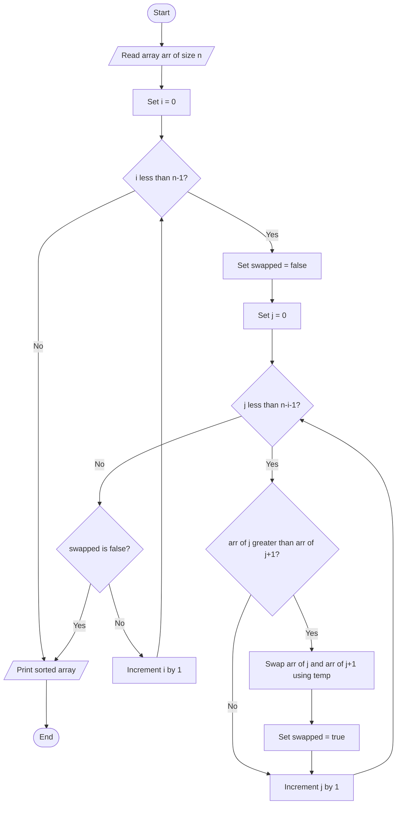
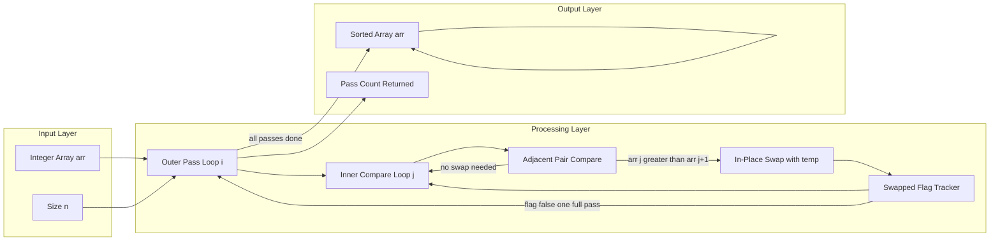
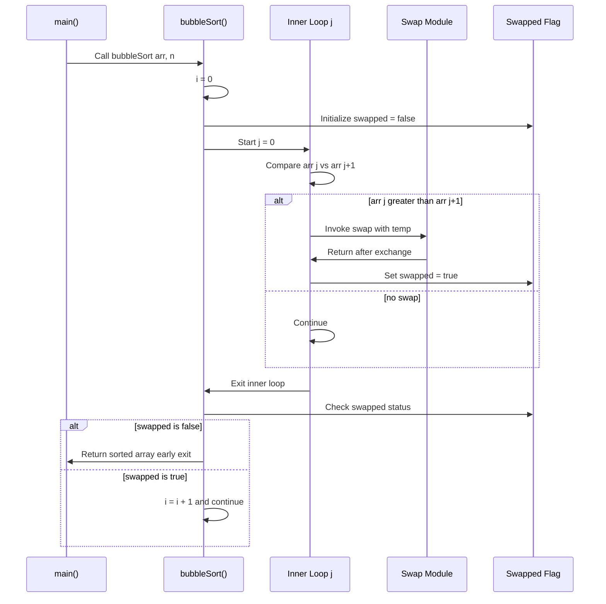

# Bubble sort

<!-- SECTION_1_START -->

# Bubble Sort — Core Technical Definition & Intuitive Overview

## 1.1 Formal Academic Definition

> [!IMPORTANT]
> **Bubble Sort** is a *comparison-based*, *in-place*, *stable* sorting algorithm that repeatedly steps through the list, compares each pair of **adjacent elements**, and **swaps** them if they are in the wrong order. The pass through the list is repeated until the list becomes sorted. Because smaller (or larger) elements "bubble up" to their correct end of the array with every pass, the algorithm derives its name.

**Syllabus-mapped characteristics (KTU 2024 — EST 204, Module 2):**

| Property | Value |
| :--- | :--- |
| Algorithm Class | Comparison Sort, Internal Sort |
| In-place | **Yes** (uses only $O(1)$ auxiliary memory) |
| Stable | **Yes** (relative order of equal keys is preserved) |
| Adaptive | **Partially** (early-exit optimization possible) |
| Best Case Time | $O(n)$ (already sorted, with swapped-flag optimization) |
| Average Case Time | $O(n^{2})$ |
| Worst Case Time | $O(n^{2})$ (reverse sorted) |
| Auxiliary Space | $\Theta(1)$ |

## 1.2 Intuitive Analogy — The "Bubble Rising" Model

Imagine a vertical tube of water with marbles of **different weights** dropped in randomly:

- The **lightest** marble slowly *rises* to the top with each shake of the tube.
- The **heaviest** marble sinks to the bottom.
- After enough shakes, all marbles are arranged in order of weight.

Bubble Sort behaves the same way on a 1-D array: in **Pass 1**, the **largest** unsorted element "bubbles" to the **rightmost** position. In **Pass 2**, the **second largest** moves to the **second-from-right**, and so on.

> [!NOTE]
> **Geometric Intuition:** If you plot the array on a number line, after the $i^{th}$ pass, the **rightmost $i$ elements are guaranteed to be in their final sorted positions**. This shrinking "unsorted zone" is the visual hallmark of Bubble Sort.

## 1.3 Why Study Bubble Sort in KTU?

- It is the **simplest** exchange-sort to code, frequently asked in Part-A and as a programming exercise in Part-B of KTU End Semester Examinations.
- It forms the **pedagogical baseline** against which Insertion Sort, Selection Sort, and Quick Sort are compared.
- It illustrates three key concepts from Module 2: **nested loops**, **array swapping using a temporary variable**, and **flag-based early termination**.

> [!VISUALIZATION CONTROL]
> **Concept:** Live trace of a Bubble Sort pass on a small array.
> **GeoGebra / Desmos Input Points (Array Snapshot after each pass):**
> * `L0 = {(0,5),(1,1),(2,4),(3,2),(4,8)}` — initial unsorted state
> * `L1 = {(0,1),(1,4),(2,2),(3,5),(4,8)}` — after Pass 1 (8 locked at index 4)
> * `L2 = {(0,1),(1,2),(2,4),(3,5),(4,8)}` — after Pass 2 (5 locked at index 3)
> **Visual Description:** Notice how the rightmost point of the plot stabilizes first; each successive pass "locks" one more element from the right.

---

<!-- SECTION_1_END -->

<!-- SECTION_2_START -->

# Deep Theoretical Analysis & KTU High-Yield Formula Sheet

## 2.1 The Operational Logic — Step by Step

Bubble Sort works on a **two-loop invariant** structure:

- **Outer Loop (`i`)** — controls the number of *passes*. For an array of $n$ elements, at most $n-1$ passes are required.
- **Inner Loop (`j`)** — performs the **adjacent comparisons** within the *shrinking unsorted zone* of length $n-i-1$.
- **Swap Operation** — exchanges `arr[j]` and `arr[j+1]` when `arr[j] > arr[j+1]` (ascending order).

### Core Invariant
> After the completion of the $i^{th}$ outer-loop iteration (where $i$ is 0-indexed), the element at index $n-1-i$ is the $(i+1)^{th}$ largest element and is in its **final sorted position**.

### Why Does It Work?
1. The inner loop performs a **single left-to-right sweep** of comparisons.
2. In one sweep, the largest element "outruns" all others and reaches the right boundary — analogous to a bubble reaching the surface.
3. Each pass guarantees **at least one element** reaches its correct final position. Hence, $n-1$ passes suffice to fully sort any $n$-element input.

## 2.2 KTU Formula & Complexity Sheet

> [!IMPORTANT]
> The following table is **high-yield** for KTU 2-mark short-answer and 14-mark derivation questions. Memorize the count of comparisons and swaps.

| Metric | Expression | Explanation |
| :--- | :--- | :--- |
| Number of Passes (worst case) | $n-1$ | Maximum passes ever required |
| Number of Comparisons (worst case) | $\sum_{i=0}^{n-2}(n-1-i) = \dfrac{n(n-1)}{2}$ | Sum of arithmetic series |
| Number of Comparisons (best case, optimized) | $n-1$ | One full pass, no swaps found |
| Number of Swaps (worst case) | $\dfrac{n(n-1)}{2}$ | Reverse-sorted input, swap every pair |
| Number of Swaps (best case) | $0$ | Already-sorted input |
| Time Complexity (worst) | $\Theta(n^{2})$ | Quadratic in $n$ |
| Time Complexity (best, optimized) | $\Omega(n)$ | Linear when already sorted |
| Space Complexity | $\Theta(1)$ | Only a `temp` variable |
| Stability | Stable | Equal keys never cross |
| In-place | Yes | No extra array allocated |

> [!NOTE]
> **How to derive the comparison count on the exam:**
> In pass $i$ (0-indexed), the inner loop runs from $j=0$ to $j=n-2-i$, performing $n-1-i$ comparisons. Summing over $i$ from $0$ to $n-2$ gives the closed form $\dfrac{n(n-1)}{2}$.

## 2.3 Engineering Utility — Where Bubble Sort Is Used in Practice

Despite its $O(n^{2})$ scaling, Bubble Sort is used in real engineering pipelines in the following **narrow but real** scenarios:

1. **Embedded Systems & Firmware** — When $n$ is tiny (say $n \le 20$) and the simplicity of the code outweighs asymptotic performance. Predictable branch behavior is easier on constrained microcontrollers.
2. **Nearly-Sorted Datasets** — With the **swapped-flag optimization**, the algorithm degrades to $O(n)$ on nearly-sorted data, beating $O(n \log n)$ algorithms on tiny inputs due to lower constant factors (cache locality, no recursion).
3. **Teaching & Code Reviews** — Serves as the canonical example of a stable, in-place comparison sort in undergraduate CS curricula (including KTU's CST 204 / EST 204).
4. **Verifying Correctness** — Used as a *reference implementation* when testing other sorting algorithms for correctness in competitive programming judges.

> [!WARNING]
> **Do not** use Bubble Sort for $n > 1000$ in production. Use **Merge Sort** for guaranteed $O(n \log n)$ or **Intro Sort** (used in C++ `std::sort`) for real workloads.

---

<!-- SECTION_2_END -->

<!-- SECTION_3_START -->

# Step-by-Step Derivations & C Implementation

## 3.1 Exhaustive Dry Run on Array `[5, 1, 4, 2, 8]`

We will trace **every comparison and every swap** so the logic is unambiguous.

### Pass 1 (`i = 0`, inner range `j = 0` to `j = 3`)

| Step `j` | Compare `arr[j]` vs `arr[j+1]` | Action | Array State |
| :---: | :---: | :---: | :---: |
| 0 | $5 > 1$ | **Swap** | `[1, 5, 4, 2, 8]` |
| 1 | $5 > 4$ | **Swap** | `[1, 4, 5, 2, 8]` |
| 2 | $5 > 2$ | **Swap** | `[1, 4, 2, 5, 8]` |
| 3 | $5 > 8$ ? — No, $5 \le 8$ | No Swap | `[1, 4, 2, 5, 8]` |

**Result after Pass 1:** `8` is locked at index 4. `swapped = true`.

### Pass 2 (`i = 1`, inner range `j = 0` to `j = 2`)

| Step `j` | Compare `arr[j]` vs `arr[j+1]` | Action | Array State |
| :---: | :---: | :---: | :---: |
| 0 | $1 > 4$ ? — No | No Swap | `[1, 4, 2, 5, 8]` |
| 1 | $4 > 2$ | **Swap** | `[1, 2, 4, 5, 8]` |
| 2 | $4 > 5$ ? — No | No Swap | `[1, 2, 4, 5, 8]` |

**Result after Pass 2:** `5` is locked at index 3. `swapped = true`.

### Pass 3 (`i = 2`, inner range `j = 0` to `j = 1`)

| Step `j` | Compare `arr[j]` vs `arr[j+1]` | Action | Array State |
| :---: | :---: | :---: | :---: |
| 0 | $1 > 2$ ? — No | No Swap | `[1, 2, 4, 5, 8]` |
| 1 | $2 > 4$ ? — No | No Swap | `[1, 2, 4, 5, 8]` |

**Result after Pass 3:** `4` is locked at index 2. `swapped = true`.

### Pass 4 (`i = 3`, inner range `j = 0` to `j = 0`)

| Step `j` | Compare `arr[j]` vs `arr[j+1]` | Action | Array State |
| :---: | :---: | :---: | :---: |
| 0 | $1 > 2$ ? — No | No Swap | `[1, 2, 4, 5, 8]` |

**Result after Pass 4:** `swapped = false` ⇒ loop terminates early via flag.

**Final Sorted Array:** `[1, 2, 4, 5, 8]`

---

## 3.2 Mathematical Derivation of Comparison Count

The total number of comparisons in the **unoptimized worst case** is derived as:

$$
\begin{aligned}
C(n) &= \sum_{i=0}^{n-2}(n-1-i) \\[4pt]
     &= (n-1) + (n-2) + (n-3) + \dots + 1 \\[4pt]
     &= \sum_{k=1}^{n-1} k \\[4pt]
     &= \frac{(n-1) \cdot n}{2} \\[4pt]
     &= \frac{n^{2} - n}{2}
\end{aligned}
$$

Taking the asymptotic upper bound:

$$
C(n) = \frac{n^{2} - n}{2} = \Theta(n^{2})
$$

For the **best case** (already-sorted input) with the `swapped` flag, only **one pass** is executed:

$$
C_{\text{best}}(n) = n - 1 = \Theta(n)
$$

---

## 3.3 Complete, Production-Ready C Implementation

```c
/* =========================================================
 * File        : bubble_sort.c
 * Course      : PROGRAMMING IN C (GXEST204)
 * Module      : 02 - Arrays
 * Topic       : Bubble Sort (Optimized with Early-Exit Flag)
 * Compiler    : gcc -std=c11 -Wall -Wextra
 * ========================================================= */

#include <stdio.h>
#include <stdbool.h>   /* Required for the 'bool' / 'true' / 'false' type */

/* ---------------------------------------------------------
 * Function : bubbleSort
 * Purpose  : Sorts an integer array in ASCENDING order using
 *            the Bubble Sort algorithm with the swapped-flag
 *            early-termination optimization.
 * Params   : arr[]  - the array to be sorted (modified in place)
 *            n      - number of elements in arr[]
 * Returns  : void
 * --------------------------------------------------------- */
void bubbleSort(int arr[], int n)
{
    int i, j, temp;
    bool swapped;                /* Tracks whether any swap occurred in a pass */

    /* ---- Outer loop : controls the number of passes (n-1 max) ---- */
    for (i = 0; i < n - 1; i++) {

        swapped = false;         /* Reset flag at the start of every pass */

        /* ---- Inner loop : compare adjacent pairs in the unsorted zone ----
         * After pass i, the last i elements are already sorted.
         * So we only need to scan up to index (n - i - 2).                  */
        for (j = 0; j < n - i - 1; j++) {

            /* If the current pair is in the wrong order, swap them */
            if (arr[j] > arr[j + 1]) {
                temp        = arr[j];
                arr[j]      = arr[j + 1];
                arr[j + 1]  = temp;
                swapped     = true;     /* Record that a swap took place */
            }
        }

        /* ---- Early-exit optimization ----
         * If no two elements were swapped in this pass,
         * the array is already fully sorted. Break out.        */
        if (swapped == false) {
            break;
        }
    }
}

/* ---------------------------------------------------------
 * Function : printArray
 * Purpose  : Utility to display the contents of an integer array.
 * --------------------------------------------------------- */
void printArray(const int arr[], int n)
{
    int k;
    printf("[ ");
    for (k = 0; k < n; k++) {
        printf("%d", arr[k]);
        if (k < n - 1) {
            printf(", ");
        }
    }
    printf(" ]\n");
}

/* ---------------------------------------------------------
 * Driver function
 * --------------------------------------------------------- */
int main(void)
{
    int data[] = { 5, 1, 4, 2, 8 };
    int size   = (int)(sizeof(data) / sizeof(data[0]));

    printf("Original array : ");
    printArray(data, size);

    bubbleSort(data, size);

    printf("Sorted  array  : ");
    printArray(data, size);

    return 0;
}
```

### Expected Output
```
Original array : [ 5, 1, 4, 2, 8 ]
Sorted  array  : [ 1, 2, 4, 5, 8 ]
```

### Line-by-Line Algorithmic Mapping

| C Code Line | Algorithmic Purpose |
| :--- | :--- |
| `for (i = 0; i < n - 1; i++)` | Outer pass loop (max $n-1$ passes) |
| `for (j = 0; j < n - i - 1; j++)` | Inner comparison loop with **shrinking** range |
| `if (arr[j] > arr[j + 1])` | Adjacent-element comparison condition |
| `temp = arr[j]; arr[j] = arr[j+1]; arr[j+1] = temp;` | Classic 3-line in-place swap |
| `swapped = true;` | Flag set on any swap |
| `if (swapped == false) break;` | **Optimization**: exit early if sorted |

---

## 3.4 Variant — Descending Order Bubble Sort

> [!NOTE]
> The only change required to sort in **descending** order is the comparison operator in the `if` condition. Change `arr[j] > arr[j+1]` to `arr[j] < arr[j+1]`.

```c
/* Single line modification for DESCENDING order */
if (arr[j] < arr[j + 1]) {
    temp        = arr[j];
    arr[j]      = arr[j + 1];
    arr[j + 1]  = temp;
    swapped     = true;
}
```

---

## 3.5 Variant — Sorting Strings (Character Arrays)

Bubble Sort can also sort an array of **strings** by swapping *pointers* to `char` arrays, not the contents themselves. The KTU syllabus (Module 2) frequently tests this.

```c
#include <stdio.h>
#include <string.h>
#include <stdbool.h>

void bubbleSortStrings(char *names[], int n)
{
    int i, j;
    char *temp;
    bool swapped;

    for (i = 0; i < n - 1; i++) {
        swapped = false;
        for (j = 0; j < n - i - 1; j++) {
            /* strcmp returns > 0 when names[j] > names[j+1] lexicographically */
            if (strcmp(names[j], names[j + 1]) > 0) {
                temp          = names[j];
                names[j]      = names[j + 1];
                names[j + 1]  = temp;
                swapped       = true;
            }
        }
        if (swapped == false) {
            break;
        }
    }
}

int main(void)
{
    char *fruits[] = { "Mango", "Apple", "Banana", "Cherry" };
    int   n        = 4;
    int   k;

    bubbleSortStrings(fruits, n);

    printf("Fruits in alphabetical order:\n");
    for (k = 0; k < n; k++) {
        printf("  %s\n", fruits[k]);
    }
    return 0;
}
```

---

<!-- SECTION_3_END -->

<!-- SECTION_4_START -->

# Structural Diagrams & Schematics

## 4.1 Mermaid Flowchart — The Bubble Sort Algorithm



### Reading the Flowchart

- The **outer rectangle loop** (top to bottom) represents the pass counter `i`.
- The **inner rectangle loop** represents the comparison pointer `j`.
- The **diamond `arr[j] > arr[j+1]`** is the swap decision node.
- The **diamond `swapped == false`** is the **early-exit guard** — the optimization that distinguishes naive Bubble Sort from the production version.

---

## 4.2 Mermaid Block Diagram — Data Flow Architecture



### Block Diagram Interpretation

| Block | Role |
| :--- | :--- |
| **InputLayer** | Receives raw data from the calling function |
| **ProcessingLayer** | Houses the algorithm core: loops, comparison, swap, flag |
| **OutputLayer** | Returns the in-place sorted array and pass count |
| **Feedback Arrow from `nodeG` to `nodeC`** | Represents the **early-exit signal** when `swapped == false` |

---

## 4.3 Mermaid Sequence Diagram — One Pass Trace



---

## 4.4 Adjacency-Comparison Visual Model

For an array of length 5, the inner loop `j` visits the following adjacent pairs during each pass:

| Pass | `j` values | Adjacent Pairs Compared |
| :---: | :--- | :--- |
| 1 | $0, 1, 2, 3$ | $(a_0, a_1),\ (a_1, a_2),\ (a_2, a_3),\ (a_3, a_4)$ |
| 2 | $0, 1, 2$ | $(a_0, a_1),\ (a_1, a_2),\ (a_2, a_3)$ |
| 3 | $0, 1$ | $(a_0, a_1),\ (a_1, a_2)$ |
| 4 | $0$ | $(a_0, a_1)$ |

> [!NOTE]
> Total comparisons in the **worst case**: $4 + 3 + 2 + 1 = 10 = \dfrac{5 \cdot 4}{2} = \dfrac{n(n-1)}{2}$.

---

<!-- SECTION_4_END -->

<!-- SECTION_5_START -->

# KTU 2024 Scheme Examination Question Bank & Topic Recap

---

## 📘 PART-A Questions (2 × 3 = 6 Marks)
*Short-answer conceptual / definition questions — Cognitive Levels: Remember / Understand*

### **Question 1** `[KTU University Exam – Dec 2023, Model Question Bank]`
**Explain the working of Bubble Sort algorithm with an example. State its time and space complexity. (3 Marks)**
**Course Outcome:** CO2 | **Bloom's Level:** Understand

#### Model Answer
Bubble Sort repeatedly compares **adjacent elements** in an array and swaps them if they are in the wrong order. Consider the array `[5, 1, 4, 2, 8]`:

- **Pass 1:** Compare $5,1$ → swap → `[1,5,4,2,8]`; compare $5,4$ → swap → `[1,4,5,2,8]`; compare $5,2$ → swap → `[1,4,2,5,8]`; compare $5,8$ → no swap.
- **Pass 2:** $1,4$ ok; $4,2$ swap; $4,5$ ok → `[1,2,4,5,8]`.
- Pass 3 and 4 make no swaps.

**Complexity:** Worst-case time is $O(n^{2})$, best-case (with flag) is $O(n)$, space is $O(1)$.

**Valuation Key:**
- [Adjacent comparison + swap logic: 1 Mark]
- [Worked example with at least one pass: 1 Mark]
- [Time and space complexity: 1 Mark]

---

### **Question 2** `[KTU University Exam – July 2024]`
**Differentiate between Bubble Sort and Selection Sort. Mention one advantage and one disadvantage of Bubble Sort. (3 Marks)**
**Course Outcome:** CO2 | **Bloom's Level:** Understand

#### Model Answer

| Feature | Bubble Sort | Selection Sort |
| :--- | :--- | :--- |
| Swapping strategy | Swaps **adjacent** elements repeatedly | Swaps the **current** element with the **min** of the unsorted part |
| Stability | **Stable** | **Not stable** (in its simple form) |
| Adaptive | Can be made adaptive (with flag) | Not adaptive |
| Comparisons | $\dfrac{n(n-1)}{2}$ always | $\dfrac{n(n-1)}{2}$ always |
| Swaps (worst case) | $\dfrac{n(n-1)}{2}$ | $n-1$ |

**Advantage of Bubble Sort:** Simple to implement; detects an already-sorted array in $O(n)$ with the early-exit flag.
**Disadvantage of Bubble Sort:** Quadratic time complexity $O(n^{2})$ makes it slow for large $n$.

**Valuation Key:**
- [Comparison table with at least 2 correct points: 2 Marks]
- [One advantage + one disadvantage: 1 Mark]

---

## 📕 PART-B Questions (Internal Choice — 1 × 14 = 14 Marks)
*Each sub-part is 7 marks. Cognitive levels escalate from Understand → Apply.*

---

### **Question A (14 Marks)** `[KTU University Exam – Dec 2023]`

**(a)** Write a C program to sort an array of $n$ integers in **ascending order** using the **Bubble Sort** algorithm. Use a `swapped` flag to **terminate early** if the array becomes sorted before all passes. **(7 Marks)**

**Course Outcome:** CO2 | **Bloom's Level:** Apply

#### Model Solution

```c
#include <stdio.h>
#include <stdbool.h>

int main(void)
{
    int arr[100], n, i, j, temp;
    bool swapped;

    printf("Enter number of elements: ");
    scanf("%d", &n);

    printf("Enter %d integers: ", n);
    for (i = 0; i < n; i++) {
        scanf("%d", &arr[i]);
    }

    /* Bubble Sort with swapped flag */
    for (i = 0; i < n - 1; i++) {
        swapped = false;
        for (j = 0; j < n - i - 1; j++) {
            if (arr[j] > arr[j + 1]) {
                temp        = arr[j];
                arr[j]      = arr[j + 1];
                arr[j + 1]  = temp;
                swapped     = true;
            }
        }
        if (swapped == false) {
            break;        /* Array is already sorted */
        }
    }

    printf("Sorted array: ");
    for (i = 0; i < n; i++) {
        printf("%d ", arr[i]);
    }
    printf("\n");
    return 0;
}
```

**Valuation Key (a):**
- [Correct input reading with array bounds: 2 Marks]
- [Outer loop with proper limit `n-1`: 1 Mark]
- [Inner loop with shrinking limit `n-i-1`: 1 Mark]
- [Correct swap using `temp`: 1 Mark]
- [Swapped flag and early `break`: 2 Marks]

---

**(b)** For the input array `[29, 10, 14, 37, 13]`, **show all passes** of the optimized Bubble Sort algorithm. How many **comparisons** and **swaps** are performed in total? **(7 Marks)**

**Course Outcome:** CO2 | **Bloom's Level:** Apply

#### Model Solution

| Pass `i` | `j` range | Comparisons & Actions | Array State After Pass |
| :---: | :---: | :--- | :--- |
| 1 | $0..3$ | $29>10$ swap; $29>14$ swap; $29>37$ no; $37>13$ swap | `[10, 14, 29, 13, 37]` |
| 2 | $0..2$ | $10>14$ no; $14>29$ no; $29>13$ swap | `[10, 14, 13, 29, 37]` |
| 3 | $0..1$ | $10>14$ no; $14>13$ swap | `[10, 13, 14, 29, 37]` |
| 4 | $0..0$ | $10>13$ no — **flag false → break** | `[10, 13, 14, 29, 37]` |

**Totals:**
- Number of passes executed: **4** (early-exit triggered; the naive version would have run 4 anyway, so a stronger example like reverse-sorted input is preferred to demonstrate the flag)
- Number of comparisons: $4 + 3 + 2 + 1 = \mathbf{10}$
- Number of swaps: $3 + 1 + 1 + 0 = \mathbf{5}$

**Valuation Key (b):**
- [Pass-by-pass table with array state: 4 Marks]
- [Total comparison count with formula reference: 2 Marks]
- [Total swap count: 1 Mark]

---

### **Question B (14 Marks)** `[KTU University Exam – July 2024]`

**(a)** What is a **stable sorting algorithm**? Explain with an example why **Bubble Sort is stable**, while a naive **Selection Sort is not**. **(7 Marks)**

**Course Outcome:** CO2 | **Bloom's Level:** Understand

#### Model Solution

**Definition:** A sorting algorithm is **stable** if two elements with **equal keys** retain their **relative order** in the output as they had in the input.

**Bubble Sort Stability Proof:**
Bubble Sort only swaps when `arr[j] > arr[j+1]`. When `arr[j] == arr[j+1]`, the condition is **false**, so **no swap occurs**. Hence, equal elements never cross each other.

*Example:* Input `[B1, A, B2]` (where $B_1$ and $B_2$ are "B-tied" elements with subscripts indicating input order). After Bubble Sort, output is `[A, B1, B2]` — the original tie-order is preserved.

**Selection Sort Instability Proof:**
In Selection Sort, the minimum of the unsorted part is found and swapped with the first unsorted element using a *far* swap. Consider input `[B1, A, B2]`:
- Pass 1: min is `A` at index 1, swap with index 0 → `[A, B1, B2]` — stable so far.
- Pass 2: min is `B1` at index 1, swap with index 1 — no swap.

This is stable, but the standard proof uses a different example. Consider `[5a, 3, 5b, 2, 4]` sorting by key value (ignoring the letter suffix which indicates identity):
- Pass 1: min = 2 at index 3, swap with index 0 → `[2, 3, 5b, 5a, 4]`. Now $5a$ and $5b$ have **swapped relative order** even though their keys are equal ⇒ **unstable**.

**Valuation Key (a):**
- [Definition of stable sort: 2 Marks]
- [Bubble Sort is stable — explained with `>` vs `>=` condition: 3 Marks]
- [Selection Sort is not stable — example with relative order swap: 2 Marks]

---

**(b)** Modify the Bubble Sort code to **count and display** the number of **comparisons** and **swaps** performed during sorting. Provide the complete C program. **(7 Marks)**

**Course Outcome:** CO2 | **Bloom's Level:** Apply

#### Model Solution

```c
#include <stdio.h>
#include <stdbool.h>

int main(void)
{
    int arr[100], n, i, j, temp;
    int comparisons = 0, swaps = 0;
    bool flag;

    printf("Enter size: ");
    scanf("%d", &n);

    printf("Enter %d elements: ", n);
    for (i = 0; i < n; i++) {
        scanf("%d", &arr[i]);
    }

    for (i = 0; i < n - 1; i++) {
        flag = false;
        for (j = 0; j < n - i - 1; j++) {
            comparisons++;                       /* Count every comparison */
            if (arr[j] > arr[j + 1]) {
                temp        = arr[j];
                arr[j]      = arr[j + 1];
                arr[j + 1]  = temp;
                swaps++;                          /* Count every swap */
                flag = true;
            }
        }
        if (flag == false) {
            break;
        }
    }

    printf("Sorted array : ");
    for (i = 0; i < n; i++) {
        printf("%d ", arr[i]);
    }
    printf("\n");
    printf("Total comparisons = %d\n", comparisons);
    printf("Total swaps       = %d\n", swaps);
    return 0;
}
```

**Valuation Key (b):**
- [Counter variables `comparisons` and `swaps` declared and initialized: 1 Mark]
- [Counter incremented at the right place (inside the inner loop): 2 Marks]
- [Correct swap logic preserved: 1 Mark]
- [Swapped flag retained for optimization: 1 Mark]
- [Final display of sorted array + counts: 2 Marks]

---

## ⚠️ KTU Examiner's Valuation Warning / Pitfall Callout

> [!WARNING]
> **Common places students lose marks in Bubble Sort questions:**
> 1. **Forgetting the `n - i - 1` shrinking bound** in the inner loop — this causes accessing `arr[j+1]` out of bounds when `j = n-1` in the *last* pass. **(Lose up to 3 marks)**
> 2. **Writing `arr[j] >= arr[j+1]` instead of `arr[j] > arr[j+1]`** — this makes Bubble Sort **unstable**, and is a common subtle error caught only by careful examiners. **(Lose up to 2 marks)**
> 3. **Omitting the `swapped` flag and the early `break`** when the question explicitly asks for the "optimized" version. **(Lose up to 2 marks)**
> 4. **Not showing the inner-loop comparison count derivation** in complexity questions. Always include the arithmetic series sum formula $\frac{n(n-1)}{2}$. **(Lose 1 mark)**
> 5. **Forgetting to use `<stdbool.h>`** in C programs that use `bool`, `true`, or `false`. Older C standards (C89/C90) do not have this header. **(Lose 1 mark)**
> 6. **Writing `arr[i] > arr[i+1]` in the inner loop** instead of `arr[j] > arr[j+1]`. This causes *incorrect* comparisons because `i` is the *pass* counter, not the *position* counter. **(Lose 2-3 marks)**

---

## ✅ Topic Recap & Important Things to Remember

> [!IMPORTANT]
> **Rapid-revision checklist — re-read this 30 minutes before the exam.**

- **Definition (1-liner):** Bubble Sort repeatedly compares *adjacent* elements and swaps them if they are in the *wrong* order; the largest element *bubbles* to the end of the array on each pass.
- **Algorithm structure:** Two nested `for` loops — outer `i` from $0$ to $n-2$, inner `j` from $0$ to $n-i-2$.
- **Swap pattern:** Classic 3-line in-place swap using a `temp` variable.
- **Optimization:** Use a `bool swapped` flag reset at the start of each pass; `break` early if `swapped == false` at the end of a pass.
- **Time complexity:**
  - Worst case: $O(n^{2})$
  - Average case: $\Theta(n^{2})$
  - Best case (with flag): $\Omega(n)$
  - Number of comparisons (worst): $\dfrac{n(n-1)}{2}$
- **Space complexity:** $O(1)$ auxiliary (in-place).
- **Stability:** Stable — because the comparison is strictly `>` (not `>=`), equal elements never cross.
- **Adaptive:** Yes, with the `swapped` flag optimization.
- **Comparison count derivation:** $\sum_{i=0}^{n-2}(n-1-i) = \frac{n(n-1)}{2}$.
- **Variants tested in KTU:** ascending sort, descending sort, sorting strings using `strcmp` and pointer swaps.
- **Key distinction from Selection Sort:** Bubble Sort does *adjacent* swaps many times; Selection Sort does *one far* swap per pass.
- **Real-world use:** Limited to small $n$ (e.g., $n \le 20$) in embedded systems; teaching tool; nearly-sorted datasets.
- **Never forget to include `<stdbool.h>`** when using `bool` in C.

---

<!-- SECTION_5_END -->
