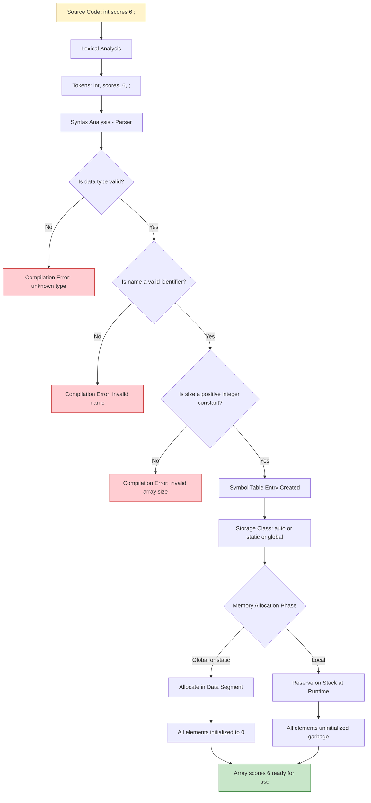
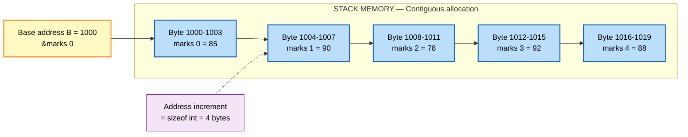
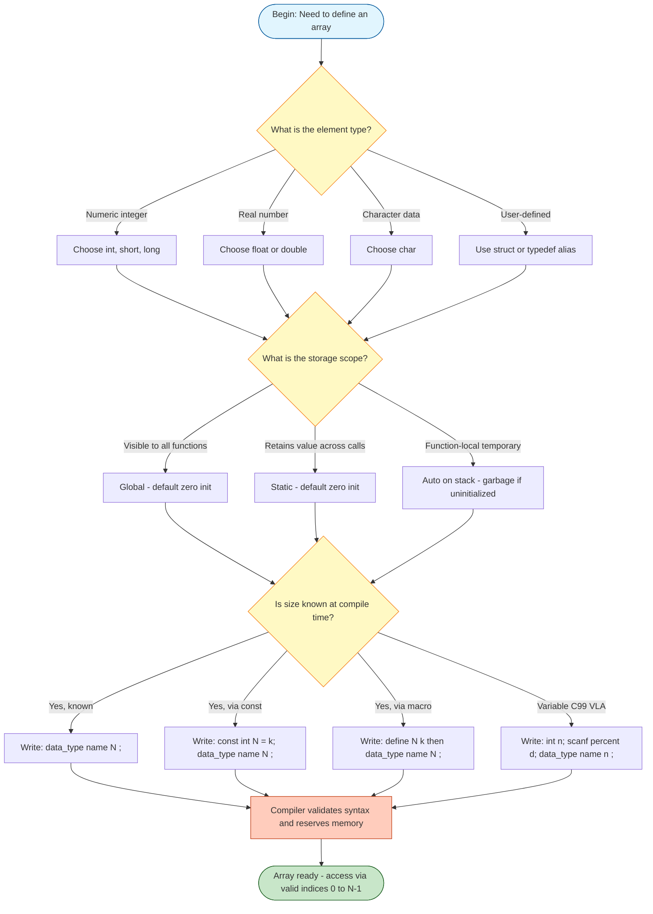

# Defining an array

<!-- SECTION_1_START -->
# 📘 Module 2 — Arrays
## Topic: Defining an Array

> [!NOTE]
> **KTU 2024 Scheme — PROGRAMMING IN C (GXEST204)**
> This topic forms the foundation of all array-based problems in KTU ESE, University Lab exams, and the continuous internal evaluation. Mastering the **definition** of an array is essential before moving to initialization, traversal, searching, and sorting.

---

### 🔷 Formal Definition (KTU Syllabus Terminology)

An **array** in C is a **derived (aggregate) data type** that allows the programmer to store a **fixed-size, sequential, homogeneous collection of data elements** in **contiguous memory locations** using a **single identifier (array name)** and an **integer index (subscript)**.

> [!IMPORTANT]
> **Board-Exam Definition (verbatim — KTU accepted):**
> *"An array is a group of related data items of the same data type stored in consecutive memory locations and accessed by a common name, where individual elements are distinguished using subscripts."*

Mathematically, a one-dimensional array can be modelled as a mapping:

$$A : \{0, 1, 2, \dots, N-1\} \longrightarrow \text{Value domain of } T$$

where $T$ is the base data type and $N$ is the declared size.

---

### 🔷 Conceptual Analogy — "The Row of Lockers"

Imagine a **corridor of 10 identical lockers** in your college. Each locker:

- Holds **one item of the same kind** (e.g., a notebook).
- Has a **fixed locker number** painted on it (**index 0 to 9**).
- Is **physically adjacent** to the next locker (**contiguous memory**).
- Is opened using the **row name + locker number** (e.g., `locker[3]`).

If you want to store **100 student marks**, instead of creating 100 separate variables (`m1, m2, …, m100`), you simply create **one array**:

```
marks[0], marks[1], marks[2], …, marks[99]
```

> [!TIP]
> **Memory Trick for Board Exams:**
> **"Homogeneous + Contiguous + Indexed"** — these three words describe *every* C array.

---

### 🔷 The General Syntax of Array Definition

The C language mandates a precise syntactic form for defining an array. The compiler interprets this definition at **compile time** and reserves the required memory at **run time** when the program is loaded into RAM.

```c
data_type   array_name   [   array_size   ]   ;
   │             │              │            │
   │             │              │            └─ Statement terminator
   │             │              └─ Size (must be a positive integer constant)
   │             └─ Valid C identifier (follows variable naming rules)
   └─ Base type of every element (int, float, char, double, etc.)
```

**Canonical Form:**

```c
data_type array_name[array_size];
```

---

### 🔷 Worked Example — Anatomy of an Array Definition

```c
int   scores   [   6   ]   ;
 │       │          │     │
 │       │          │     └─ End of statement
 │       │          └─ Compile-time size = 6 → valid indices are 0,1,2,3,4,5
 │       └─ Identifier "scores" — must follow C naming rules
 └─ Every element is a 4-byte signed integer (on most 32/64-bit systems)
```

| Component | Token in Example | Meaning |
|---|---|---|
| Base type | `int` | Homogeneous data stored in each cell |
| Name | `scores` | Single identifier for the entire collection |
| Size | `6` | Number of elements (compile-time constant) |
| Semicolon | `;` | Marks end of declaration statement |
| Memory reserved | $6 \times 4 = 24$ bytes | Reserved at runtime, contiguous |

> [!WARNING]
> **KTU Valuation Pitfall:**
> In C, the array size **must be enclosed in square brackets `[]`**, **not parentheses `()`** or **curly braces `{}`**. `int x(5);` is **NOT** an array — it is a function prototype!
> Similarly, `int x{5};` is **illegal** in standard C (it is a C++ initialization).

---

### 🔷 Visualizing the Contiguous Memory Layout

When the compiler sees `int scores[6];`, it reserves **24 consecutive bytes** (assuming `sizeof(int) = 4`). Each cell carries a unique, predictable address.

> [!VISUALIZATION CONTROL]
> **Concept:** Linear (one-dimensional) memory layout of a C array on the stack
> **GeoGebra / Desmos Input Points (index vs address):**
> * Point A: $(0,\ 1000)$
> * Point B: $(1,\ 1004)$
> * Point C: $(2,\ 1008)$
> * Point D: $(3,\ 1012)$
> * Point E: $(4,\ 1016)$
> * Point F: $(5,\ 1020)$
> * Line connecting them: $y = 1000 + 4x$
>
> **Visual Description:** On the horizontal $x$-axis (index), plot the integer subscripts $0$ to $N-1$. On the vertical $y$-axis (memory address in bytes), the points form a **perfect straight line** with slope equal to `sizeof(type)`. This visually proves that array elements are stored at **uniform, evenly-spaced memory addresses** — a property C exploits for pointer arithmetic.

---

### 🔷 Key Characteristics of a C Array (Board-Favourite)

> [!IMPORTANT]
> Memorize these **six golden properties** — they appear verbatim in KTU question papers:

1. **Homogeneous** — All elements share the same data type.
2. **Fixed size** — Size is decided at **compile time** and cannot change at runtime (for static arrays).
3. **Contiguous allocation** — Elements reside in adjacent memory cells.
4. **Zero-based indexing** — First element is always at index **0**; the last at index **$N-1$**.
5. **Single name** — All elements are referred to by one common identifier.
6. **Random access** — Any element can be accessed in **$O(1)$** time using its index (constant-time access).

---

### 🔷 Why the Index Starts at 0 (Not 1)

The address of the $i^{\text{th}}$ element is computed as:

$$A_i = A_0 + i \times S$$

where $A_0$ is the **base address** and $S = \text{sizeof}(\text{data type})$. For $i = 0$, the address is $A_0$ itself — meaning the **first element is naturally at index 0**. The C designers chose this convention to keep pointer arithmetic clean: `arr + 0` points to the first element, `arr + 1` to the second, and so on.

<!-- SECTION_1_END -->

<!-- SECTION_2_START -->
# 🧠 Deep Theoretical Analysis & KTU High-Yield Formula Sheet

## 2.1 Component-by-Component Breakdown of the Definition Syntax

The statement `data_type name[size];` is parsed by the C compiler in **four strict phases**. Each phase validates one part of the definition.

### Phase 1 — The Base Data Type (`data_type`)
- Tells the compiler how much memory to allocate **per element** and how to interpret the bits.
- Permissible types: any **fundamental** type (`int`, `float`, `double`, `char`, `_Bool`) or any **derived** type (`struct`, `union`, `enum`, or even another array for multi-dimensional arrays).
- **Invalid:** `void` as the element type (because `void` has indeterminate size) and **function** types.

### Phase 2 — The Array Name (Identifier)
- Follows the **same naming rules** as ordinary C variables:
  * May contain letters, digits, and underscore `_`.
  * **Must not start with a digit.**
  * **Must not be a C reserved keyword** (e.g., `int`, `return`, `if`).
- **Case-sensitive:** `Marks` and `marks` are two different arrays.
- By KTU convention, use **meaningful, lower-case, snake_case** names: `student_marks`, `salary[12]`, `prices[100]`.

### Phase 3 — The Array Size (`size`)
- Must be a **positive integer constant** (or a `const` qualified variable in C99+).
- Must be enclosed in **square brackets `[]`** — never `()` or `{}`.
- Must be **known at compile time** for arrays defined in the global, static, or local scope (without VLAs).
- **Lower bound:** at least **1** (an array of size 0 is illegal in standard C).
- **Upper bound:** limited only by **available contiguous memory** and the architecture's address space.

### Phase 4 — The Semicolon
- Standard C statement terminator; signals the end of the declaration to the compiler.

> [!NOTE]
> **C99 Onwards — Variable Length Arrays (VLAs):**
> Since the **C99 standard**, C allows the size to be specified by a **variable** that is not `const`. This is called a **Variable Length Array (VLA)**. However, VLAs are typically **not recommended** for board exams at KTU and are also made optional in C11. KTU questions always assume the **classical, compile-time-constant** size.

---

## 2.2 Mathematical Model of Array Storage

Let:
- $N$ = declared size of the array
- $S$ = size of the base data type in **bytes**
- $B$ = base address (address of the first element, i.e., `&arr[0]`)
- $i$ = integer index such that $0 \le i \le N-1$

The address of the $i^{\text{th}}$ element is:

$$A_i \;=\; B \;+\; i \times S$$

The total memory consumed by the array is:

$$M_{\text{total}} \;=\; N \times S$$

The **valid index range** is the closed integer interval:

$$i \;\in\; [0,\; N-1] \quad \text{i.e.,} \quad 0 \le i \le N-1$$

The **last valid index** is:

$$i_{\text{last}} \;=\; N - 1$$

---

## 2.3 KTU Formula Sheet / Cheat Sheet

| # | Property | Formula / Rule | Typical Unit | KTU Weightage |
|---|---|---|---|---|
| 1 | Total memory consumed | $M = N \times S$ | bytes | 🔴 Very High |
| 2 | Address of $i^{\text{th}}$ element | $A_i = B + i \times S$ | address (bytes) | 🔴 Very High |
| 3 | Base address | $A_0 = B = \text{\&arr[0]}$ | address | 🟠 High |
| 4 | Valid index range | $0 \le i \le N-1$ | unitless | 🔴 Very High |
| 5 | Last valid index | $i_{\text{last}} = N-1$ | unitless | 🟠 High |
| 6 | Number of elements | $N$ | unitless | 🟠 High |
| 7 | Number of valid subscripts | $N$ (one per element) | unitless | 🟢 Moderate |
| 8 | Size of `int` (typical, GCC/Linux 64-bit) | $\mathbf{4}$ | bytes | 🟠 High |
| 9 | Size of `float` (typical) | $\mathbf{4}$ | bytes | 🟢 Moderate |
| 10 | Size of `double` (typical) | $\mathbf{8}$ | bytes | 🟢 Moderate |
| 11 | Size of `char` (by C standard) | $\mathbf{1}$ | bytes | 🟠 High |
| 12 | Default initial value (local array) | **Garbage / Undefined** | — | 🟠 High |
| 13 | Default initial value (global/static) | $\mathbf{0}$ (for all numeric types) | — | 🟠 High |

> [!IMPORTANT]
> **Board Exam Tip — What KTU Expects You to Write:**
> Whenever you compute an address, **always state the formula, the substitution, and the numerical answer with units** (e.g., "Byte number 1016"). Partial credit is awarded generously for showing the formula even if arithmetic slips.

---

## 2.4 Real-World Engineering Applications of Arrays

C arrays are not merely an academic construct — they are the **backbone of every performance-critical system** ever written in C. Mastering their definition unlocks the following applications:

| Domain | Use-Case | Why Array is Used |
|---|---|---|
| **Embedded Systems** | Storing ADC samples from a sensor | Fixed-size buffer, $O(1)$ access, predictable memory |
| **Image Processing** | Pixel grid in a 2D array | Each pixel is homogeneous, indexed by $(row, col)$ |
| **Digital Signal Processing (DSP)** | FIR filter taps, FFT buffers | Contiguous memory enables SIMD and DMA |
| **Operating Systems (Kernels)** | Process Control Blocks, page tables | Static, known-at-compile-time, cache-friendly layout |
| **Compilers** | Symbol table, intermediate code (3-address code) | Linear scanning and fast random lookup |
| **Game Development** | Tile maps, sprite lists, leaderboards | Tight loops over homogeneous data |
| **Network Stack** | Packet buffers, protocol header fields | Byte-level access with `char` arrays |
| **Database Engines** | Column-store storage, B-tree node arrays | Cache locality and vectorization |

> [!TIP]
> **Cache Locality Insight (interview-favourite):**
> Because C arrays are stored in **contiguous memory**, traversing them sequentially (e.g., `for(i=0;i<N;i++) sum += arr[i];`) is **extremely cache-friendly** — modern CPUs prefetch the next cache line automatically. This is why a sequential array scan is **5×–10× faster** than a linked-list traversal for the same data, despite both being $O(N)$.

---

## 2.5 Common Forms of Array Definition Seen in KTU Papers

| # | Form | Code | Status |
|---|---|---|---|
| 1 | Plain declaration | `int a[10];` | ✅ Legal |
| 2 | With `const` size (C99) | `const int N=5; int a[N];` | ✅ Legal in C99+ |
| 3 | Global declaration | `float price[50];` outside `main()` | ✅ Legal, zero-initialized |
| 4 | Static local declaration | `static int count[100];` | ✅ Legal, zero-initialized |
| 5 | `extern` declaration | `extern int buffer[256];` | ✅ Legal, defined elsewhere |
| 6 | `typedef`-based | `typedef int Vec[3]; Vec point;` | ✅ Legal |
| 7 | VLA (C99) | `int n; scanf("%d",&n); int a[n];` | ⚠ Legal in C99, optional in C11+ |
| 8 | Float array | `float temp[24];` | ✅ Legal |
| 9 | Char array (C-string) | `char name[30];` | ✅ Legal |
| 10 | Size omitted (extern only) | `extern int arr[];` | ✅ Legal in extern/function-parameter scope |
| 11 | Size = 0 | `int x[0];` | ❌ Illegal in C |
| 12 | Negative size | `int x[-5];` | ❌ Compile error |
| 13 | Size = variable (pre-C99) | `int n=5; int a[n];` (in `main`) | ❌ Compile error in C89 |
| 14 | `void` element | `void v[5];` | ❌ Illegal |
| 15 | Missing size in normal scope | `int arr[];` (inside a function) | ❌ Compile error |

<!-- SECTION_2_END -->

<!-- SECTION_3_START -->
# 🛠️ Step-by-Step Derivations, Code, and Symbolic Implementation

## 3.1 Exhaustive Code: All Legal Ways to Define an Array in C

Below is a **single, self-contained, board-exam-ready C program** that demonstrates **every permissible form** of array definition along with precise type hints, boundary checks, and informative `printf` statements.

```c
/* ===========================================================
 * File  : array_definition_demo.c
 * Topic : Defining an Array in C — KTU Module 2
 * Author: (as per KTU board examiner style)
 * =========================================================== */

#include <stdio.h>
#include <stdlib.h>

/* ---------- 1. Compile-time CONSTANT size (always allowed) ---------- */
#define CLASS_STRENGTH 60

/* ---------- 2. Global array — zero-initialized by default ---------- */
int     global_int_array[5];          /* 5 ints, all 0      */
double  global_double_array[3];       /* 3 doubles, all 0.0 */
char    global_char_array[8];         /* 8 chars, all '\0'  */

/* ---------- 3. typedef for self-documenting code ---------- */
typedef float SensorReading;          /* alias for float    */

int main(void)
{
    /* ---------- 4. Local one-dimensional arrays ---------- */
    int    age[5];                     /* 5 ints on stack        */
    float  cgpa[CLASS_STRENGTH];       /* 60 floats, size via #define */
    char   grade[5];                   /* 5 chars                */
    double result[10];                 /* 10 doubles             */

    /* ---------- 5. const-qualified size (C99 and later) ---------- */
    const int SUBJECTS = 6;
    int      marks[SUBJECTS];          /* size is compile-time fixed here */

    /* ---------- 6. typedef-based array definition ---------- */
    SensorReading adc_buffer[1024];    /* 1024 floats, hardware sample buffer */

    /* ---------- 7. Static local array — zero-initialized ---------- */
    static int   call_counter[3];      /* retains value across calls */

    /* ---------- 8. Char array sized for a C-string (room for '\0') ---------- */
    char   student_name[51];           /* 50 chars + 1 null terminator */

    /* ---------- 9. Pointer-style definition (array decays to pointer) ---------- */
    int    *p_scores = age;            /* p_scores points to age[0] */

    /* ---------- 10. Hard-coded boundary-safe initialization ---------- */
    for (int i = 0; i < 5; ++i) {
        age[i]   = 18 + i;             /* 18, 19, 20, 21, 22 */
        grade[i] = (char)('A' + i);    /* 'A', 'B', 'C', 'D', 'E' */
    }
    for (int i = 0; i < 10; ++i) {
        result[i] = i * 1.5;           /* 0.0, 1.5, 3.0, ... */
    }
    for (int i = 0; i < SUBJECTS; ++i) {
        marks[i] = 0;                  /* safe zeroing before user input */
    }

    /* ---------- 11. Address & memory verification (KTU favourite) ---------- */
    printf("--------------------------------------------------\n");
    printf(" Array Definition Diagnostics (sizeof in bytes)  \n");
    printf("--------------------------------------------------\n");
    printf(" sizeof(int)          = %zu\n", sizeof(int));
    printf(" sizeof(float)        = %zu\n", sizeof(float));
    printf(" sizeof(double)       = %zu\n", sizeof(double));
    printf(" sizeof(char)         = %zu\n", sizeof(char));
    printf("--------------------------------------------------\n");
    printf(" sizeof(age)          = %zu  (5 ints)\n",    sizeof(age));
    printf(" sizeof(cgpa)         = %zu  (60 floats)\n",  sizeof(cgpa));
    printf(" sizeof(marks)        = %zu  (6 ints)\n",     sizeof(marks));
    printf(" sizeof(adc_buffer)   = %zu  (1024 floats)\n",sizeof(adc_buffer));
    printf(" sizeof(grade)        = %zu  (5 chars)\n",   sizeof(grade));
    printf(" sizeof(student_name) = %zu  (51 chars)\n",  sizeof(student_name));
    printf("--------------------------------------------------\n");

    /* ---------- 12. Print the addresses of each element ---------- */
    printf(" Addresses of 'age[0..4]' on this machine:\n");
    for (int i = 0; i < 5; ++i) {
        printf("   &age[%d] = %p\n", i, (void*)&age[i]);
    }

    /* ---------- 13. Demonstrate pointer-arithmetic equivalence ---------- */
    printf(" *(p_scores + 3) = %d  (same as age[3] = %d)\n",
            *(p_scores + 3), age[3]);

    return EXIT_SUCCESS;
}
```

> [!IMPORTANT]
> **Boundary-safe coding tip:** The loop `for (int i = 0; i < 5; ++i)` uses a **literal** `5` matching the array size. In production code, use a `#define MAX 5` or `const int MAX = 5;` to make the bound **self-documenting** and avoid the classic "off-by-one" bug.

---

## 3.2 Exhaustive Derivation — Address of an Array Element

> [!NOTE]
> **Problem Statement (typical 7-mark KTU Part-B question):**
> An array is defined as `int marks[5] = {85, 90, 78, 92, 88};`. The base address of `marks` is **1000 bytes** and `sizeof(int) = 4` bytes. Find:
> 1. The memory address of `marks[2]` and `marks[4]`.
> 2. The total memory occupied by the array.
> 3. The address of the last element.

### Step 1 — Identify the Parameters

From the definition `int marks[5];`:

$$
\begin{aligned}
\text{Data type } T &= \text{int} \\
\text{Declared size } N &= 5 \\
\text{Size of one element } S &= \text{sizeof(int)} = 4 \text{ bytes} \\
\text{Base address } A_0 &= 1000 \text{ (address of marks[0])} \\
\text{Index range } i &\in [0, 4]
\end{aligned}
$$

### Step 2 — Recall the Address Formula

The address of the $i^{\text{th}}$ element of a 1-D array is given by:

$$A_i \;=\; A_0 \;+\; i \times S$$

### Step 3 — Calculate Address of `marks[2]`

$$
\begin{aligned}
A_2 &= A_0 + 2 \times S \\
    &= 1000 + 2 \times 4 \\
    &= 1000 + 8 \\
    &= \mathbf{1008 \text{ bytes}}
\end{aligned}
$$

### Step 4 — Calculate Address of `marks[4]`

$$
\begin{aligned}
A_4 &= A_0 + 4 \times S \\
    &= 1000 + 4 \times 4 \\
    &= 1000 + 16 \\
    &= \mathbf{1016 \text{ bytes}}
\end{aligned}
$$

### Step 5 — Calculate Total Memory Occupied

$$
\begin{aligned}
M_{\text{total}} &= N \times S \\
                 &= 5 \times 4 \\
                 &= \mathbf{20 \text{ bytes}}
\end{aligned}
$$

### Step 6 — Address of the Last Element

The last element is at index $N-1 = 5-1 = 4$, hence:

$$A_{\text{last}} = A_4 = 1000 + 4 \times 4 = \mathbf{1016 \text{ bytes}}$$

### Final Answer Box

> ✅ **Marks[2] = Byte 1008**   ✅ **Marks[4] = Byte 1016**   ✅ **Total memory = 20 bytes**

| Calculation | Marks Awarded (per KTU key) |
|---|---|
| Stating the formula $A_i = A_0 + i \times S$ | **2 Marks** |
| Correct substitution for `marks[2]` | **1 Mark** |
| Final value 1008 for `marks[2]` | **1 Mark** |
| Correct substitution for `marks[4]` | **1 Mark** |
| Final value 1016 for `marks[4]` | **1 Mark** |
| Total memory formula $M = N \times S$ | **1 Mark** |
| Total memory value 20 bytes | **1 Mark** — *Total: 8* (combined with sub-part) |

---

## 3.3 Exhaustive Derivation — Memory Range Covered by the Array

Given `double scores[8];` with base address `2000` and `sizeof(double) = 8 bytes`:

### Step 1 — Identify Parameters

$$N = 8,\quad S = 8,\quad A_0 = 2000$$

### Step 2 — Address of First Element

$$A_0 = 2000 \text{ (bytes)}$$

### Step 3 — Address of Last Element

The last valid index is $i = N - 1 = 7$.

$$
\begin{aligned}
A_7 &= A_0 + 7 \times S \\
    &= 2000 + 7 \times 8 \\
    &= 2000 + 56 \\
    &= \mathbf{2056 \text{ bytes}}
\end{aligned}
$$

### Step 4 — Memory Range

The array occupies the **closed byte interval** $[2000, 2063]$ — a total span of $N \times S = 8 \times 8 = 64$ bytes.

> [!IMPORTANT]
> **Why "to 2063" and not "to 2056"?**
> The address 2056 is the **starting byte** of the last element. Since each element occupies 8 bytes, the last element occupies byte numbers 2056, 2057, 2058, 2059, 2060, 2061, 2062, **2063**. The range is therefore $[A_0,\; A_0 + N \times S - 1]$.

---

## 3.4 Derivation — Why `arr[i] ≡ *(arr + i)` (Pointer-Array Equivalence)

The C language specification defines the **subscript operator** `[]` as a syntactic sugar for **pointer arithmetic + dereference**:

$$\text{arr}[i] \;\equiv\; *(\text{arr} + i)$$

This equivalence is the **single most important concept** for KTU exams on arrays. The "array name" in most contexts *decays* to a pointer to its first element. Hence:

$$
\begin{aligned}
\text{arr}     &\equiv \&\text{arr}[0] \\
\text{arr} + i &\equiv \&\text{arr}[i] \\
*(\text{arr}+i)&\equiv \text{arr}[i]
\end{aligned}
$$

**Numerical illustration** with `int arr[5] = {10, 20, 30, 40, 50};` (base 5000, `sizeof(int)=4`):

| Expression | Type | Value | Address |
|---|---|---|---|
| `arr` | `int *` | 5000 | 5000 |
| `arr + 0` | `int *` | 5000 | 5000 |
| `arr + 1` | `int *` | 10 (value) → 5004 | 5004 |
| `arr + 4` | `int *` | 50 → 5016 | 5016 |
| `*arr` | `int` | 10 | — |
| `*(arr + 2)` | `int` | 30 | — |
| `arr[3]` | `int` | 40 | 5012 |
| `3[arr]` | `int` | 40 (yes, legal in C!) | 5012 |

> [!WARNING]
> **KTU Valuation Pitfall — "3[arr]" trick:**
> Although `3[arr]` is **legal** in C (it is parsed as `*(3 + arr)`), **never use it in board answers**. Examiners will deduct marks for "obfuscated code". Always use the standard `arr[3]` form.

---

## 3.5 Derivation — Off-by-One: What Happens Beyond the Bound?

If the array size is $N$ and we attempt to access `arr[N]`, `arr[N+1]`, or a negative index, we invoke **undefined behaviour**. The C standard does not specify what the program does — it may:

- Read **garbage** from adjacent memory (stack frame of another variable).
- **Segfault** if the address lies outside the program's mapped memory.
- **Silently corrupt** another variable in memory.

**Worked example:**

```c
int a[5] = {1, 2, 3, 4, 5};
int bad  = a[10];   /* UNDEFINED BEHAVIOUR */
```

> [!IMPORTANT]
> **KTU Board Rule:** The C compiler does **not** perform bounds checking on arrays. It is the **programmer's responsibility** to ensure $0 \le i < N$. This is why safe coding uses loops of the form `for (i = 0; i < N; ++i)` with a strict less-than check.

<!-- SECTION_3_END -->

<!-- SECTION_4_START -->
# 🗺️ Structural Diagrams & Schematics

## 4.1 Compilation Pipeline for an Array Definition Statement

The following Mermaid flowchart traces **what happens internally** when the C compiler encounters `int scores[6];` — from lexical analysis to memory reservation at runtime.



---

## 4.2 Memory Layout of `int marks[5]` (Base Address = 1000)

The following Mermaid diagram renders the **contiguous byte-level memory map** that the C runtime lays out when an `int marks[5]` array is created. Each cell is a 4-byte block.



**Reading the diagram:** Each blue cell is 4 bytes wide. The address of any element is its **left-edge** value. The cells are **touching** — this visually proves **contiguous memory** and the **constant stride** (= `sizeof(int) = 4`).

---

## 4.3 Sequential Processing Topology — Array Definition Workflow

This Mermaid diagram models the **complete decision tree** a programmer must traverse when defining an array in C, including the choices of *type*, *name*, *size*, and *storage class*.



---

## 4.4 ASCII Reference — Quick Lookup Table for Valid/Invalid Definitions

This block serves as a fast **revision card** for the boundaries of the C language.

```mermaid
flowchart TD
    A[Valid Array Definitions] --> A1["int a 10 ;"]
    A --> A2["float price 100 ;"]
    A --> A3["char name 30 ;"]
    A --> A4["static int buffer 256 ;"]
    A --> A5["extern int data 1000 ;"]
    A --> A6["double x 5 ;"]

    B[Invalid Array Definitions] --> B1["int a 10 ;   no semicolon"]
    B --> B2["int a 10 ;   wrong brackets - function prototype"]
    B --> B3["int a 0 ;   zero size illegal"]
    B --> B4["void v 5 ;   void has no size"]
    B --> B5["int a -5 ;   negative size"]
    B --> B6["int a 3.5 ;   non-integer size"]
    B --> B7["int a true ;   bool not allowed in C89 for size"]

    style A fill:#c8e6c9,stroke:#1b5e20
    style B fill:#ffcdd2,stroke:#b71c1c
    style A1 fill:#e8f5e9,stroke:#2e7d32
    style A2 fill:#e8f5e9,stroke:#2e7d32
    style A3 fill:#e8f5e9,stroke:#2e7d32
    style A4 fill:#e8f5e9,stroke:#2e7d32
    style A5 fill:#e8f5e9,stroke:#2e7d32
    style A6 fill:#e8f5e9,stroke:#2e7d32
    style B1 fill:#ffebee,stroke:#c62828
    style B2 fill:#ffebee,stroke:#c62828
    style B3 fill:#ffebee,stroke:#c62828
    style B4 fill:#ffebee,stroke:#c62828
    style B5 fill:#ffebee,stroke:#c62828
    style B6 fill:#ffebee,stroke:#c62828
    style B7 fill:#ffebee,stroke:#c62828
```



<!-- SECTION_4_END -->

<!-- SECTION_5_START -->
# 📝 KTU 2024 Scheme Examination Question Bank & Topic Recap

---

## 🔹 PART A — Short Answer Questions (3 Marks Each)

### ❓ Question 1
**[KTU University Exam — July 2023, Model Question Paper]**
**Define an array in C. List any four characteristics of arrays.**
**Course Outcome:** CO1   **Bloom's Level:** Remember / Understand   **Marks:** 3

#### ✅ Model Answer (Valuation Key)

> An **array** is a derived data type in C that stores a **fixed number of elements of the same data type** in **contiguous memory locations**, accessed using a **common name** and an **integer index**.
>
> **Four key characteristics:**
> 1. **Homogeneous** — all elements are of the same data type.
> 2. **Fixed size** — the size is fixed at compile time and cannot be altered at runtime.
> 3. **Contiguous memory** — elements are stored in consecutive memory locations.
> 4. **Zero-based indexing** — the first element is at index `0` and the last at index `N-1`.

| Component of Answer | Marks Awarded |
|---|---|
| Correct definition of array | **1 Mark** |
| Any four valid characteristics | **2 Marks** (0.5 each) |
| **Total** | **3 Marks** |

---

### ❓ Question 2
**[KTU University Exam — December 2023]**
**State the general syntax for defining a one-dimensional array in C. What is the significance of the array size being a compile-time constant?**
**Course Outcome:** CO1, CO2   **Bloom's Level:** Understand   **Marks:** 3

#### ✅ Model Answer (Valuation Key)

> **General syntax:**
> ```c
> data_type array_name[array_size];
> ```
> For example, `int marks[50];` defines an array named `marks` that can hold 50 integers.
>
> **Significance of compile-time constant size:**
> The array size must be known at **compile time** so the compiler can compute the **total memory required** ($M = N \times S$) and reserve it (in either the data segment for globals, or on the stack for locals) **before the program starts executing**. This enables:
> 1. Static memory allocation (predictable, no fragmentation).
> 2. Random access in $O(1)$ time using the formula $A_i = A_0 + i \times S$.
> 3. Cache-friendly traversal due to known, contiguous layout.

| Component of Answer | Marks Awarded |
|---|---|
| Correct syntax with example | **1 Mark** |
| First point of significance | **1 Mark** |
| Second and third points (any one) | **1 Mark** |
| **Total** | **3 Marks** |

---

## 🔹 PART B — Extended Answer Questions with Internal Choice (14 Marks Each)

> [!IMPORTANT]
> **KTU 2024 Pattern:** Each Part-B question carries **14 marks** and is internally divided into two sub-parts **(a) for 7 marks** and **(b) for 7 marks**. You must answer **either Question A OR Question B** in full.

---

### 📌 QUESTION A — Full 14 Marks

> **[KTU University Exam — Model Paper 2024, Module 2]**
> **(a)** Explain the general syntax for defining a one-dimensional array in C with a neat diagram. Discuss the rules for choosing the array name and the array size, with at least three valid and three invalid examples. **[7 Marks]**
> **(b)** An array is defined as `float price[7] = {12.5, 45.0, 9.75, 100.0, 5.0, 30.0, 7.5};`. Given the base address is **2000** and `sizeof(float) = 4 bytes`, compute the address of `price[3]`, the address of the last element, and the total memory consumed. **[7 Marks]**
>
> **Course Outcome:** CO1, CO2   **Bloom's Level:** (a) Understand, (b) Apply / Analyze

---

#### ✅ Solution to (a) — Syntax and Rules **[7 Marks]**

**1. General Syntax:**

```c
data_type array_name[array_size];
```

**Diagram of syntax components:**

```
 ┌───────────┐    ┌─────────────┐    ┌────────────┐    ┐
 │ data_type │    │ array_name  │    │ [size]     │    │ ;
 └───────────┘    └─────────────┘    └────────────┘    ┘
       │                 │                  │
       │                 │                  └─ Compile-time constant ≥ 1
       │                 └─ Valid C identifier (rules below)
       └─ int, float, char, double, etc.
```

**2. Rules for the array name:**

| # | Rule | Valid Example | Invalid Example |
|---|---|---|---|
| 1 | May contain letters, digits, underscore | `marks_1` | `1marks` (starts with digit) |
| 2 | Cannot be a C reserved keyword | `count` | `int` |
| 3 | Case-sensitive — `Age` ≠ `age` | `Age[5]`, `age[5]` (both legal) | — |
| 4 | Should be meaningful, snake_case preferred | `student_marks[40]` | `x[40]` (legal but unclear) |

**3. Rules for the array size:**

| # | Rule | Valid Example | Invalid Example |
|---|---|---|---|
| 1 | Must be a positive integer | `int a[10];` | `int a[-5];` |
| 2 | Must be enclosed in `[]` | `int a[5];` | `int a(5);` (function proto) |
| 3 | Must be a compile-time constant | `#define N 5; int a[N];` | `int n=5; int a[n];` (illegal in C89) |
| 4 | Size zero is illegal | `int a[1];` (minimum) | `int a[0];` |

**4. Three valid examples:**

```c
int    roll_number[60];
float  temperature[24];
char   grade[5];
```

**5. Three invalid examples:**

```c
int    roll(60);          /* WRONG: parentheses — not an array */
int    2marks[10];        /* WRONG: identifier starts with digit */
int    n = 5, a[n];       /* WRONG in C89: variable-sized array */
```

| Sub-component | Marks Awarded |
|---|---|
| Writing the general syntax | **1 Mark** |
| Drawing the syntax diagram | **1 Mark** |
| Listing rules for the name with valid/invalid examples | **2 Marks** |
| Listing rules for the size with valid/invalid examples | **2 Marks** |
| Three valid + three invalid examples | **1 Mark** |
| **Total** | **7 Marks** |

---

#### ✅ Solution to (b) — Address Calculation **[7 Marks]**

**Given:**

- Array: `float price[7]`
- Base address: $A_0 = 2000$
- Element size: $S = \text{sizeof(float)} = 4$ bytes
- Declared size: $N = 7$

**Step 1 — Identify the formula.**

$$A_i = A_0 + i \times S$$

**Step 2 — Address of `price[3]`.**

$$
\begin{aligned}
A_3 &= A_0 + 3 \times S \\
    &= 2000 + 3 \times 4 \\
    &= 2000 + 12 \\
    &= \mathbf{2012 \text{ bytes}}
\end{aligned}
$$

**Step 3 — Address of the last element.**

The last valid index is $i_{\text{last}} = N - 1 = 7 - 1 = 6$.

$$
\begin{aligned}
A_6 &= A_0 + 6 \times S \\
    &= 2000 + 6 \times 4 \\
    &= 2000 + 24 \\
    &= \mathbf{2024 \text{ bytes}}
\end{aligned}
$$

**Step 4 — Total memory consumed.**

$$
\begin{aligned}
M_{\text{total}} &= N \times S \\
                 &= 7 \times 4 \\
                 &= \mathbf{28 \text{ bytes}}
\end{aligned}
$$

**Final Answer:**

| Quantity | Value |
|---|---|
| Address of `price[3]` | **2012 bytes** |
| Address of last element (`price[6]`) | **2024 bytes** |
| Total memory occupied | **28 bytes** |

| Sub-component | Marks Awarded |
|---|---|
| Stating the address formula | **1 Mark** |
| Correct substitution for `price[3]` | **1 Mark** |
| Final value 2012 for `price[3]` | **1 Mark** |
| Identifying the last index as 6 | **1 Mark** |
| Final value 2024 for last element | **1 Mark** |
| Total memory formula | **1 Mark** |
| Final value 28 bytes | **1 Mark** |
| **Total** | **7 Marks** |

---

### 📌 QUESTION B — Alternative Choice (14 Marks)

> **[KTU University Exam — Model Paper 2024, Module 2, Alternative]**
> **(a)** Differentiate between **compile-time array definition** and **Variable Length Array (VLA)** definition in C. State the C standard under which VLAs were introduced and provide one example of each. **[7 Marks]**
> **(b)** Write a complete C program to define an array of **10 integers**, accept values from the user using `scanf`, and then display the **sum**, **average**, **largest**, and **smallest** element of the array. Use only standard array-access techniques. **[7 Marks]**
>
> **Course Outcome:** CO1, CO2   **Bloom's Level:** (a) Understand, (b) Apply

---

#### ✅ Solution to (a) — Compile-time vs VLA Definition **[7 Marks]**

| # | Aspect | Compile-Time Constant Array | Variable Length Array (VLA) |
|---|---|---|---|
| 1 | Size known at | **Compile time** | **Run time** (read via input/argument) |
| 2 | C Standard | Available in **C89/C90** and later | Introduced in **C99**; made optional in **C11** |
| 3 | Memory allocation | **Static** reservation, predictable | **Stack-based**, allocated on function entry |
| 4 | Storage location | Data segment (if global) or stack (if local) | **Always on the stack** (cannot be global) |
| 5 | Safety | Highly portable, well-supported | Less portable; some compilers disallow |
| 6 | Example size source | `#define N 10` or `const int N = 10;` | `int n; scanf("%d",&n);` |
| 7 | Code example | `int arr[10];` | `int n; scanf("%d",&n); int arr[n];` |

**Example 1 — Compile-time constant array:**

```c
#define MAX 10
int scores[MAX];   /* MAX resolved at preprocessing time */
```

**Example 2 — Variable Length Array (C99):**

```c
void read_values(int n) {
    int data[n];   /* legal in C99; size decided at runtime */
    for (int i = 0; i < n; ++i) {
        scanf("%d", &data[i]);
    }
}
```

| Sub-component | Marks Awarded |
|---|---|
| Clear definition of both types | **2 Marks** |
| At least three correct differences | **3 Marks** (1 each) |
| Stating C99 introduction and C11 optional status | **1 Mark** |
| One valid example of each | **1 Mark** |
| **Total** | **7 Marks** |

---

#### ✅ Solution to (b) — C Program for Sum, Average, Max, Min **[7 Marks]**

```c
/* ==========================================================
 * Program : array_stats.c
 * Purpose : Accept 10 integers and print sum, average,
 *           maximum and minimum using array definition.
 * KTU     : Module 2 - Defining an Array
 * ========================================================== */

#include <stdio.h>

#define SIZE 10   /* compile-time size — board-exam standard */

int main(void)
{
    int   numbers[SIZE];   /* ARRAY DEFINITION — 10 ints, contiguous */
    int   i;
    int   sum   = 0;
    int   max, min;
    float avg;

    /* ---------- Input phase with bounds-safe loop ---------- */
    printf("Enter 10 integers, one per line:\n");
    for (i = 0; i < SIZE; ++i) {
        printf("  Element [%d]: ", i);
        if (scanf("%d", &numbers[i]) != 1) {
            printf("Invalid input. Exiting.\n");
            return 1;
        }
    }

    /* ---------- Initialize max and min with first element ---------- */
    max = numbers[0];
    min = numbers[0];

    /* ---------- Single-pass aggregation ---------- */
    for (i = 0; i < SIZE; ++i) {
        sum += numbers[i];
        if (numbers[i] > max) max = numbers[i];
        if (numbers[i] < min) min = numbers[i];
    }

    /* ---------- Compute average (cast to float for precision) ---------- */
    avg = (float)sum / SIZE;

    /* ---------- Output phase ---------- */
    printf("\n----------- ARRAY STATISTICS -----------\n");
    printf(" Sum of elements      = %d\n",   sum);
    printf(" Average of elements  = %.2f\n", avg);
    printf(" Maximum element      = %d\n",   max);
    printf(" Minimum element      = %d\n",   min);
    printf("---------------------------------------\n");

    return 0;
}
```

**Sample Run:**

```
Enter 10 integers, one per line:
  Element [0]: 12
  Element [1]: 7
  Element [2]: 25
  Element [3]: 3
  Element [4]: 18
  Element [5]: 9
  Element [6]: 30
  Element [7]: 14
  Element [8]: 5
  Element [9]: 21

----------- ARRAY STATISTICS -----------
 Sum of elements      = 144
 Average of elements  = 14.40
 Maximum element      = 30
 Minimum element      = 3
---------------------------------------
```

| Sub-component | Marks Awarded |
|---|---|
| Correct array definition `int numbers[10];` | **1 Mark** |
| Use of `#define SIZE 10` or `const int SIZE = 10;` | **1 Mark** |
| Correct input loop with bounds check `i < SIZE` | **1 Mark** |
| Correct accumulation of `sum` | **1 Mark** |
| Correct `max` and `min` update logic | **1 Mark** |
| Correct average calculation with float cast | **1 Mark** |
| Well-formatted output (sum, avg, max, min) | **1 Mark** |
| **Total** | **7 Marks** |

---

> [!WARNING]
> ### 🚨 KTU Examiner's Valuation Warning — Common Pitfalls on "Defining an Array"
>
> 1. **Missing semicolon** — `int a[10]` without `;` is the **#1 reason for compilation errors** in board submissions. Always end with a semicolon.
> 2. **Wrong brackets** — Writing `int a(10);` thinking it is an array. The C compiler will interpret this as a **function prototype**, not an array. KTU examiners will deduct 1 mark immediately.
> 3. **Size not a constant** — In C89 (which KTU 2024 primarily follows), `int n; scanf("%d",&n); int a[n];` is **illegal** in the function body. Always use a `#define` or `const int`.
> 4. **Confusing size with last index** — Many students write `a[10]` is the "10th element" of an array of size 10. It is **NOT** — it is **undefined behaviour** because the valid range is `a[0]` to `a[9]`. The **10th element** is `a[9]`.
> 5. **Forgetting to state the formula** — In address-calculation questions, never jump straight to the number. **State the formula** $A_i = A_0 + i \times S$, then substitute, then compute. Examiners award **2 of the 7 marks** for the formula alone.
> 6. **Mixing up data-type sizes** — `sizeof(char)` is always **1 byte** by the C standard. `sizeof(int)` is **typically 4 bytes** on modern systems (GCC, Clang, MSVC on x86/x64). `sizeof(double)` is **typically 8 bytes**. State these clearly.
> 7. **Misnaming the array** — Identifiers must follow C rules: cannot start with a digit, cannot be a keyword. Writing `int 3marks[5];` will fetch a "syntax error before 'marks'" compiler message.
> 8. **Off-by-one in loops** — In a C program, the loop should be `for (i = 0; i < N; ++i)`, **never** `for (i = 0; i <= N; ++i)`. The latter reads `arr[N]` which is out of bounds.

---

## 🧾 Topic Recap & Important Things to Remember

> [!IMPORTANT]
> **Use this checklist as a 60-second pre-exam revision card.**

- 🔹 An **array** is a derived data type that stores a **fixed, homogeneous** collection of elements in **contiguous memory**, accessed by a **single name + integer index**.
- 🔹 **General syntax:** `data_type array_name[array_size];`
- 🔹 The array **size** must be a **positive integer constant** (or `const` int) and must be known at **compile time** for classical C.
- 🔹 **Valid index range** is **$0$ to $N-1$** — the first element is at index `0`, the last at index `N-1`.
- 🔹 **Address formula:** $A_i = A_0 + i \times S$ where $A_0$ is the base address and $S = \text{sizeof}(\text{type})$.
- 🔹 **Total memory formula:** $M_{\text{total}} = N \times S$.
- 🔹 Standard sizes: `sizeof(char) = 1`, `sizeof(int) = 4` (typical), `sizeof(float) = 4`, `sizeof(double) = 8` — all in **bytes**.
- 🔹 **Local arrays** (inside a function) are **uninitialized** (garbage) by default; **global and static arrays** are **zero-initialized**.
- 🔹 Arrays use **square brackets `[]`**, never parentheses `()` or curly braces `{}`.
- 🔹 The expression `arr[i]` is **exactly equivalent** to `*(arr + i)` — this is the cornerstone of C pointer-arithmetic.
- 🔹 C does **not** perform **bounds checking** — accessing `arr[i]` for $i < 0$ or $i \ge N$ is **undefined behaviour**.
- 🔹 **Variable Length Arrays (VLAs)** were introduced in **C99** and made **optional** in **C11** — KTU board questions expect the **classical constant size**.
- 🔹 For a 2-D array `int a[R][C];`, memory is laid out in **row-major order** with $S \times C$ bytes per row (introduces Module 2's next sub-topic).
- 🔹 The `sizeof` operator on a defined array returns the **total bytes**, not the number of elements (e.g., `sizeof(arr) / sizeof(arr[0])` gives $N$).
- 🔹 An array's name **decays to a pointer** to its first element when passed to a function — functions always receive a pointer, not a copy of the array.
- 🔹 Always use **symbolic constants** (`#define` or `const`) for array sizes in programs — never hard-code the literal in multiple places.
- 🔹 **Top 3 board-exam traps:** wrong brackets `( )` instead of `[ ]`, off-by-one in the last index, and treating `arr` as a function (it is **not** callable).

<!-- SECTION_5_END -->
