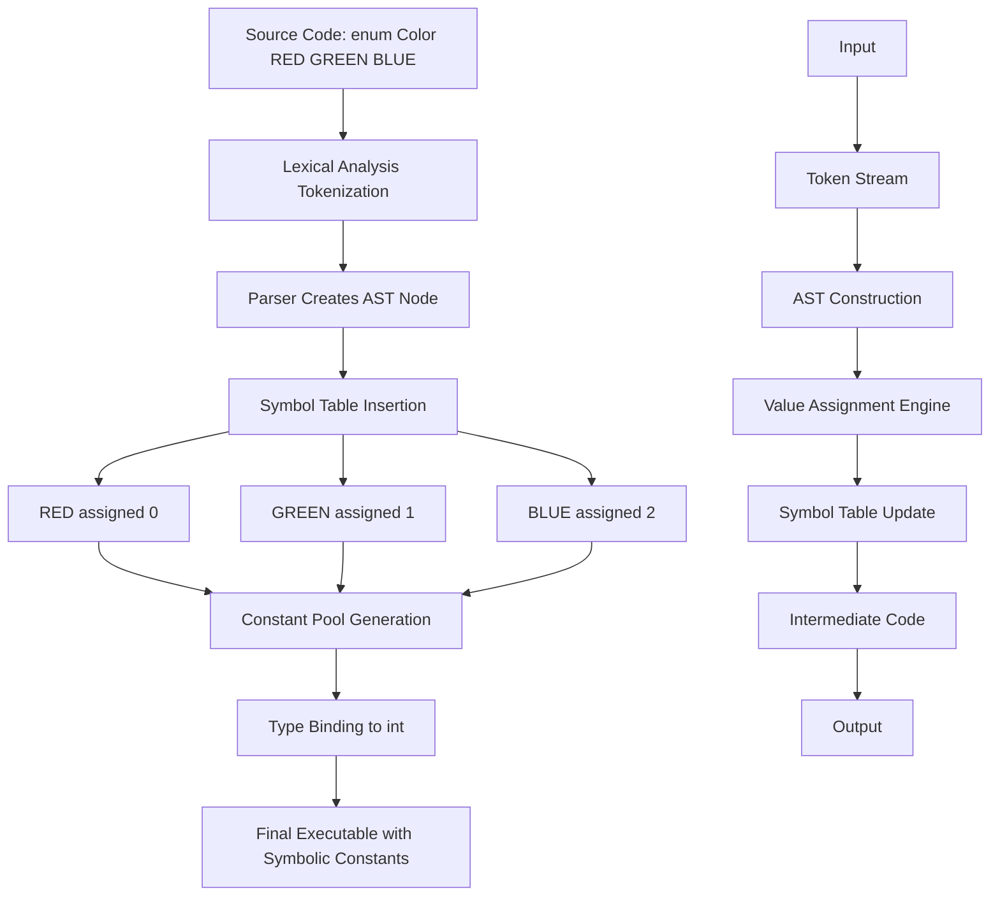
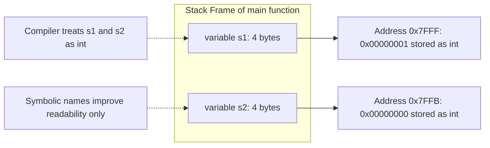
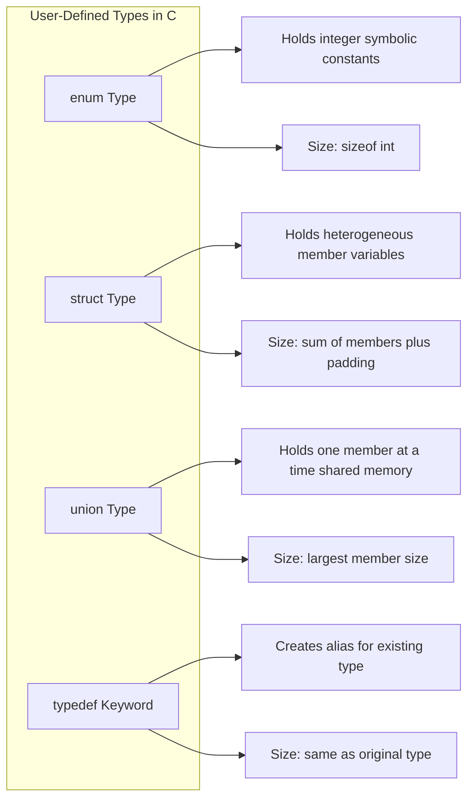
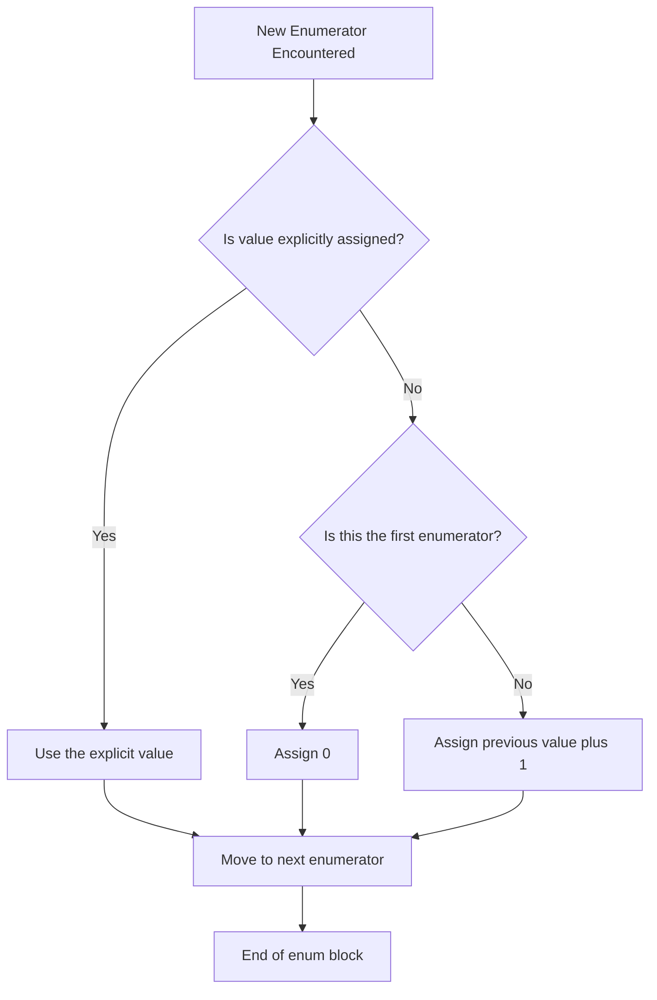

# Enumerated data type

<!-- SECTION_1_START -->
# Enumerated Data Type in C

## Formal Definition (KTU 2024 Syllabus Standard)

> [!IMPORTANT]
> **Enumerated Data Type (`enum`)** is a user-defined data type in C that consists of a set of named integer constant values, called **enumerators** (or enumeration constants). It provides a means of creating a symbolic name for a related group of integer constants, thereby improving program readability, maintainability, and type safety in modular software design.

In the KTU 2024 Scheme syllabus for **PROGRAMMING IN C (GXEST204)**, the enumerated data type is introduced as part of Module 2 (Arrays \& User-Defined Data Types) because it is the simplest and most fundamental **user-defined type** in C, sharing the same module cluster as `struct` and `typedef`.

```c
/* Canonical Form of an enum Declaration */
enum identifier {
    name1, name2, name3, ..., nameN
} variable_list;
```

Here:
- `identifier` is the optional **tag name** (similar to `struct tag`).
- `name1`, `name2`, ..., `nameN` are the **enumeration constants** (enumerators).
- `variable_list` is the optional list of variables of this enumerated type.

## Conceptual Analogy / Intuition

Imagine a traffic signal system at a road intersection. The signal can only be in **four** possible discrete states: `RED`, `YELLOW`, `GREEN`, or `OFF` (for malfunction). Instead of remembering that `RED = 0`, `YELLOW = 1`, `GREEN = 2`, we assign human-readable names to these numeric codes. The compiler then internally treats these as integers, but the *programmer* interacts with friendly, self-documenting labels.

This is precisely what `enum` does — it is a **symbolic shorthand for a fixed set of integer constants**, declared once and reused throughout the code without magic numbers.

> [!NOTE]
> **Key Insight for KTU Exams:** An `enum` in C is **not a true new type**; it is merely a layer of syntactic sugar over `int`. Enumerators are essentially `int` constants, and enum variables behave as integers in arithmetic expressions.

## Underlying Type and Memory

- **Underlying Type:** Always `int` in standard C (some compilers may choose a smaller integral type for optimization, but logically it is `int`).
- **Memory Footprint:** Typically **4 bytes** (size of `int`) on most modern 32-bit and 64-bit platforms, though strictly the standard only guarantees it can hold an `int`.
- **Range:** If the largest enumerator value is $V_{max}$, the enum must be able to represent at least $0$ to $V_{max}$. Negative initializers are permitted.

> [!TIP]
> **GeoGebra / Desmos Visualization**
> **Concept:** Numeric mapping of enumerators on an integer number line.
> **Input Points:** `(name1, 0), (name2, 1), (name3, 2), (name4, 3)`
> **Visual Description:** A discrete scatter plot on the x-axis showing that the compiler assigns monotonically increasing integer values starting from 0, unless explicitly overridden by the programmer.

<!-- SECTION_1_END -->

<!-- SECTION_2_START -->
# Deep Theoretical Analysis & KTU High-Yield Formula Sheet

## Operational Mechanics: How `enum` Works Internally

The C compiler processes an `enum` declaration in **three logical phases**:

1. **Constant Generation Phase:** Every enumerator inside the braces is treated as a symbolic constant of type `int`. By default, the first enumerator gets the value `0`, and each subsequent enumerator gets the value `previous + 1`.
2. **Symbol Table Injection:** These constants are inserted into the compiler's symbol table, making them available throughout the enclosing scope.
3. **Type Binding Phase:** Any variable declared with the `enum` tag is bound to the integer type, with the same storage and arithmetic properties.

## Rules of Enumerator Value Assignment

| Rule | Description | Example |
|------|-------------|---------|
| **Default Initialization** | First enumerator $\rightarrow 0$, next $\rightarrow +1$ from previous | `SUN=0, MON=1, TUE=2` |
| **Explicit Single Assignment** | Assigns a specific integer to an enumerator | `JAN=1, FEB, MAR` $\rightarrow$ `JAN=1, FEB=2, MAR=3` |
| **Explicit Multi Assignment** | Multiple enumerators can share the same value | `A=5, B=5, C=5` (allowed, distinct names same value) |
| **Backwards Compatibility** | Later enumerators may have values less than earlier ones | `X=10, Y=5, Z=6` |
| **Negative Initializers** | Enumerator values can be negative | `ERROR=-1, WARNING=0, INFO=1` |
| **Duplicate Names Forbidden** | Same enumerator name cannot appear twice in one `enum` | Compile-time error |

## KTU Formula / Cheat Sheet

| Concept | Syntax / Value Rule | KTU Exam Relevance |
|---------|---------------------|--------------------|
| Declaration | `enum tag {E1, E2, E3} v1, v2;` | Definition question (2 marks) |
| Default first value | $E_1 = 0$ | High-frequency theory question |
| Default increment | $E_{n} = E_{n-1} + 1$ | Numerical value calculation |
| Explicit override | $E_{n} = \text{user\_value}$ | Mixing default and explicit values |
| Type of enumerator | `int` (logical type) | Distinguish from `struct` / `union` |
| Size of enum variable | $\text{sizeof}(\text{int}) = 4\ \text{bytes}$ (typical) | `sizeof` output prediction |
| Enum-to-int conversion | Implicit, no cast required | Type compatibility questions |
| Int-to-enum conversion | Not allowed implicitly in C (allowed in C++) | Compilation error prediction |
| Scope of enumerators | Same as declared (file or block scope) | Common confusion with macros |
| Comparison | `==`, `!=`, `<`, `>`, `<=`, `>=` allowed | Code snippet output questions |

## Real-World Engineering Utility

Enumerated types are extensively used in **embedded systems firmware, operating system kernels, and protocol stacks**:

- **Embedded Systems (e.g., ARM Cortex-M programming):** Defining FSM (Finite State Machine) states like `IDLE`, `READING`, `WRITING`, `ERROR` for a sensor interface.
- **Network Protocols (TCP/IP stacks):** Defining packet types like `SYN`, `ACK`, `FIN`, `RST` for TCP handshake state tracking.
- **Game Development:** Representing cardinal directions (`NORTH`, `SOUTH`, `EAST`, `WEST`), days of the week, or game states (`MENU`, `PLAYING`, `PAUSED`, `GAMEOVER`).
- **Compiler Design:** Token types during lexical analysis (`KEYWORD`, `IDENTIFIER`, `OPERATOR`, `LITERAL`).
- **Operating Systems:** Process states in schedulers (`NEW`, `READY`, `RUNNING`, `WAITING`, `TERMINATED`).

> [!NOTE]
> In KTU lab examinations, students are frequently asked to use `enum` to model a **menu-driven program** (e.g., calculator operations `ADD`, `SUB`, `MUL`, `DIV`) — a must-practice pattern for the internal assessment.

<!-- SECTION_2_END -->

<!-- SECTION_3_START -->
# Step-by-Step Derivations and Code Implementation

## Derivation 1: Default Value Computation

**Problem:** Given the declaration `enum Color {RED, GREEN, BLUE, YELLOW};`, find the value of each enumerator.

**Step-by-Step Solution:**

$$\text{RED} = 0 \quad \text{(first enumerator, default starting value)}$$

$$\text{GREEN} = \text{RED} + 1 = 0 + 1 = 1$$

$$\text{BLUE} = \text{GREEN} + 1 = 1 + 1 = 2$$

$$\text{YELLOW} = \text{BLUE} + 1 = 2 + 1 = 3$$

**Final Mapping:** $\text{RED}=0,\ \text{GREEN}=1,\ \text{BLUE}=2,\ \text{YELLOW}=3$.  **[3 Marks: 1 mark per row of mapping]**

---

## Derivation 2: Mixed Explicit and Default Values

**Problem:** Given the declaration `enum Token {IF=10, FOR, DO=25, WHILE, RETURN};`, determine each enumerator's integer value.

**Step-by-Step Solution:**

$$\text{IF} = 10 \quad \text{(explicit assignment)}$$

$$\text{FOR} = \text{IF} + 1 = 10 + 1 = 11 \quad \text{(no explicit value, default increment)}$$

$$\text{DO} = 25 \quad \text{(explicit assignment overrides default sequence)}$$

$$\text{WHILE} = \text{DO} + 1 = 25 + 1 = 26 \quad \text{(default resumes from DO)}$$

$$\text{RETURN} = \text{WHILE} + 1 = 26 + 1 = 27$$

**Final Mapping:** $\text{IF}=10,\ \text{FOR}=11,\ \text{DO}=25,\ \text{WHILE}=26,\ \text{RETURN}=27$.  **[5 Marks: 1 mark per enumerator]**

---

## Derivation 3: Size of an Enumerated Variable

**Problem:** Predict the output of the following program.

```c
#include <stdio.h>

enum Status {
    PASS,
    FAIL,
    ABSENT
};

int main(void) {
    enum Status s1 = PASS;
    printf("Size of enum variable: %lu bytes\n", sizeof(s1));
    printf("Value of PASS: %d\n", PASS);
    printf("Value of FAIL: %d\n", FAIL);
    printf("Value of ABSENT: %d\n", ABSENT);
    return 0;
}
```

**Step-by-Step Deduction:**

Step 1: The compiler assigns default values:
$$\text{PASS} = 0,\ \text{FAIL} = 1,\ \text{ABSENT} = 2$$

Step 2: The variable `s1` is of type `enum Status`, which is internally an `int`. On a typical GCC/Linux x86\_64 system, `sizeof(int) = 4` bytes.

Step 3: Output assembly:
```
Size of enum variable: 4 bytes
Value of PASS: 0
Value of FAIL: 1
Value of ABSENT: 2
```

**[Valuation: Correct size identification: 2 Marks | Correct enumerator values: 3 Marks]**

---

## Complete Working C Program: Menu-Driven Calculator Using `enum`

```c
#include <stdio.h>

/* Step 1: Define enumerated type for calculator operations */
enum Operation {
    ADD = 1,
    SUB,
    MUL,
    DIV,
    MOD,
    EXIT_OP
};

/* Step 2: Function prototype for arithmetic execution */
int compute(int a, int b, enum Operation op) {
    switch (op) {
        case ADD:    return a + b;
        case SUB:    return a - b;
        case MUL:    return a * b;
        case DIV:
            if (b == 0) {
                fprintf(stderr, "Error: Division by zero detected.\n");
                return 0;
            }
            return a / b;
        case MOD:
            if (b == 0) {
                fprintf(stderr, "Error: Modulus by zero detected.\n");
                return 0;
            }
            return a % b;
        default:
            fprintf(stderr, "Error: Invalid operation code.\n");
            return 0;
    }
}

/* Step 3: Driver function with menu interface */
int main(void) {
    int x, y;
    enum Operation choice;

    printf("=== KTU Enum Calculator Demo ===\n");
    printf("Operations: 1=ADD, 2=SUB, 3=MUL, 4=DIV, 5=MOD, 6=EXIT\n");

    while (1) {
        printf("\nEnter operation code: ");
        if (scanf("%d", (int *)&choice) != 1) {
            fprintf(stderr, "Input error. Exiting.\n");
            return 1;
        }

        if (choice == EXIT_OP) {
            printf("Exiting calculator. Goodbye!\n");
            break;
        }

        if (choice < ADD || choice > MOD) {
            printf("Invalid choice. Try again.\n");
            continue;
        }

        printf("Enter two integers: ");
        if (scanf("%d %d", &x, &y) != 2) {
            fprintf(stderr, "Input error. Exiting.\n");
            return 1;
        }

        int result = compute(x, y, choice);
        printf("Result: %d\n", result);
    }

    return 0;
}
```

**Enumerated Value Trace:**

$$\text{ADD} = 1 \quad (\text{explicit})$$
$$\text{SUB} = \text{ADD} + 1 = 2$$
$$\text{MUL} = \text{SUB} + 1 = 3$$
$$\text{DIV} = \text{MUL} + 1 = 4$$
$$\text{MOD} = \text{DIV} + 1 = 5$$
$$\text{EXIT\_OP} = \text{MOD} + 1 = 6$$

**Explanation of Each Critical Line:**

1. `enum Operation { ADD = 1, ... };` — Starts the numeric series at 1 instead of 0, which is user-friendly for menu indices.
2. `enum Operation choice;` — Declares a variable of enum type; it can only be assigned enumerators from the same enum (in disciplined C code).
3. `if (choice == EXIT_OP)` — Direct symbolic comparison; far more readable than `if (choice == 6)`.
4. `switch (op) { case ADD: ... }` — The compiler optimizes `switch` on enum into a jump table, yielding performance similar to integer switches.

---

## Demonstration: Iteration Over Enumerators

```c
#include <stdio.h>

enum Days {
    SUN,
    MON,
    TUE,
    WED,
    THU,
    FRI,
    SAT
};

int main(void) {
    /* Loop through all days using integer iteration */
    for (int i = SUN; i <= SAT; i++) {
        printf("Day code %d\n", i);
    }
    return 0;
}
```

**Output:**
```
Day code 0
Day code 1
Day code 2
Day code 3
Day code 4
Day code 5
Day code 6
```

This program demonstrates that enum variables can participate in integer arithmetic and loops — a defining behavioral feature of `enum` in C.

<!-- SECTION_3_END -->

<!-- SECTION_4_START -->
# Structural Diagrams & Schematics

## Diagram 1: Compiler's Internal Processing Pipeline for `enum`



## Diagram 2: Memory Layout of Enum Variables



## Diagram 3: Comparison of User-Defined Types in C



## Diagram 4: Enumerator Value Assignment Decision Tree



<!-- SECTION_4_END -->

<!-- SECTION_5_START -->
# KTU 2024 Scheme Examination Question Bank

## Part A: Short-Answer Questions (2 × 3 = 6 Marks)

### Question 1: `[KTU University Exam - Dec 2023]`
**Define enumerated data type in C. List any two advantages of using `enum` over `#define` macros.** **[CO1, Remember, 3 Marks]**

**Model Answer:**

An **enumerated data type** in C is a user-defined data type created using the keyword `enum`, which consists of a set of named integer constants called enumerators.

**Advantages over `#define`:**
1. **Debugging Friendliness:** Debuggers recognize `enum` symbols by name, whereas `#define` macros are textually substituted and invisible to the debugger.
2. **Scope Respect:** Enumerators obey the scoping rules of the language (block, file, function), whereas `#define` macros follow preprocessor rules and cannot be scoped.
3. **Type Awareness:** Enum variables have an associated type, while macros are pure textual substitution with no type binding.

**[Valuation: Definition: 1 Mark | Any two advantages: 2 Marks]**

---

### Question 2: `[KTU University Exam - July 2024]`
**Predict the output of the following C program.** **[CO2, Understand, 3 Marks]**

```c
#include <stdio.h>

enum Grade {
    A_GRADE = 5,
    B_GRADE,
    C_GRADE = 10,
    D_GRADE
};

int main(void) {
    printf("%d %d %d %d\n", A_GRADE, B_GRADE, C_GRADE, D_GRADE);
    return 0;
}
```

**Model Answer:**

Step-by-step evaluation:
$$\text{A\_GRADE} = 5 \quad (\text{explicit})$$
$$\text{B\_GRADE} = \text{A\_GRADE} + 1 = 5 + 1 = 6$$
$$\text{C\_GRADE} = 10 \quad (\text{explicit, overrides default sequence})$$
$$\text{D\_GRADE} = \text{C\_GRADE} + 1 = 10 + 1 = 11$$

**Output:**
```
5 6 10 11
```

**[Valuation: Correct value of A_GRADE: 1 Mark | Correct value of B_GRADE: 1 Mark | Correct values of C_GRADE and D_GRADE: 1 Mark]**

---

## Part B: Long-Answer Questions (Internal Choice, 14 Marks)

### Question A: `[KTU University Exam - July 2024]`

#### Part (a) **[7 Marks, CO1, Understand]**
**Explain the syntax and rules of the `enum` data type in C with a suitable example. Differentiate between `enum` and `struct`.**

**Model Answer:**

**Syntax:**
```c
enum identifier {
    enumerator1,
    enumerator2,
    ...
    enumeratorN
} variable_list;
```

**Rules:**
1. The first enumerator defaults to value `0` unless explicitly initialized.
2. Subsequent enumerators get the value `previous + 1` by default.
3. Enumerators are essentially `int` constants and obey integer arithmetic rules.
4. Duplicate enumerator names within the same scope cause a compile-time error.
5. Negative and duplicate values are permitted for different enumerators.

**Example:**
```c
enum Season { SPRING, SUMMER, AUTUMN, WINTER };
```

Here: $\text{SPRING}=0,\ \text{SUMMER}=1,\ \text{AUTUMN}=2,\ \text{WINTER}=3$.

**Differentiation Table:**

| Feature | `enum` | `struct` |
|---------|--------|----------|
| Purpose | Defines symbolic integer constants | Groups heterogeneous data members |
| Memory | `sizeof(int)` for each variable | Sum of all member sizes (with padding) |
| Members | Enumerators (no variables) | Variables of various types |
| Arithmetic | Allowed on enum variables | Not directly meaningful |
| Use Case | State codes, status flags | Records, data packets |

**[Valuation: Syntax explanation: 2 Marks | Any 3 rules: 3 Marks | Differentiation table: 2 Marks]**

---

#### Part (b) **[7 Marks, CO2, Apply]**
**Write a C program using `enum` to model the working of a washing machine with the states `IDLE`, `FILL`, `WASH`, `RINSE`, `SPIN`, and `STOP`. Simulate the state transitions with appropriate print statements.**

**Model Answer:**

```c
#include <stdio.h>

enum WashState {
    IDLE,
    FILL,
    WASH,
    RINSE,
    SPIN,
    STOP
};

const char *state_names[] = {
    "IDLE",
    "FILL",
    "WASH",
    "RINSE",
    "SPIN",
    "STOP"
};

int main(void) {
    enum WashState current = IDLE;

    printf("Washing Machine Started. Initial state: %s\n",
           state_names[current]);

    /* Simulate state transitions */
    while (current != STOP) {
        switch (current) {
            case IDLE:
                printf("Machine idle. Transitioning to FILL.\n");
                current = FILL;
                break;
            case FILL:
                printf("Filling water tank. Transitioning to WASH.\n");
                current = WASH;
                break;
            case WASH:
                printf("Washing clothes. Transitioning to RINSE.\n");
                current = RINSE;
                break;
            case RINSE:
                printf("Rinsing clothes. Transitioning to SPIN.\n");
                current = SPIN;
                break;
            case SPIN:
                printf("Spinning to remove water. Transitioning to STOP.\n");
                current = STOP;
                break;
            default:
                printf("Unknown state.\n");
                current = STOP;
                break;
        }
    }

    printf("Washing cycle complete. Final state: %s\n",
           state_names[current]);

    return 0;
}
```

**Output Trace:**
```
Washing Machine Started. Initial state: IDLE
Machine idle. Transitioning to FILL.
Filling water tank. Transitioning to WASH.
Washing clothes. Transitioning to RINSE.
Rinsing clothes. Transitioning to SPIN.
Spinning to remove water. Transitioning to STOP.
Washing cycle complete. Final state: STOP
```

**Enumerator Values:**
$$\text{IDLE}=0,\ \text{FILL}=1,\ \text{WASH}=2,\ \text{RINSE}=3,\ \text{SPIN}=4,\ \text{STOP}=5$$

**[Valuation: Correct enum declaration: 2 Marks | State transition logic in switch: 3 Marks | Output trace and explanation: 2 Marks]**

---

### Question B: `[KTU University Exam - Dec 2023]` (Alternative Choice)

#### Part (a) **[7 Marks, CO1, Understand]**
**Discuss how explicit values can be assigned to enumerators in C. Provide an example where two enumerators have the same value. What is the significance of such duplicate values?**

**Model Answer:**

The C standard explicitly allows explicit integer assignment to enumerators using the assignment operator `=` during declaration. If a value is assigned, the next enumerator (without explicit value) continues with `previous + 1`.

**Example with Duplicate Values:**
```c
enum Permission {
    NONE  = 0,
    READ  = 1,
    WRITE = 1,
    EXECUTE = 1,
    ADMIN = 4
};
```

In this declaration:
$$\text{NONE}=0,\ \text{READ}=1,\ \text{WRITE}=1,\ \text{EXECUTE}=1,\ \text{ADMIN}=4$$

**Significance of Duplicate Values:**
1. **Grouping Semantics:** They allow multiple symbolic names to represent the same underlying privilege level (e.g., `READ`, `WRITE`, and `EXECUTE` all share the basic user level `1`).
2. **Bitmask Compatibility:** Duplicate values are often used in legacy codebases that mimic UNIX permission bitmasks (`rwx`).
3. **Backward Compatibility:** Old enumerator names can be aliased to new ones without breaking existing code that references the old name.

**[Valuation: Explanation of explicit assignment: 2 Marks | Example with duplicate values: 2 Marks | Significance: 3 Marks]**

---

#### Part (b) **[7 Marks, CO2, Apply]**
**Write a C program using `enum` to implement a simple banking transaction system with operations `DEPOSIT`, `WITHDRAW`, `CHECK_BALANCE`, and `EXIT`. Initialize an account balance and perform at least three transactions using a menu-driven approach.**

**Model Answer:**

```c
#include <stdio.h>

enum BankOp {
    DEPOSIT = 1,
    WITHDRAW,
    CHECK_BALANCE,
    EXIT_OP
};

int main(void) {
    double balance = 5000.00;
    int choice;
    double amount;

    printf("=== Simple Banking System (Enum Demo) ===\n");
    printf("1. Deposit\n");
    printf("2. Withdraw\n");
    printf("3. Check Balance\n");
    printf("4. Exit\n");

    while (1) {
        printf("\nEnter your choice: ");
        if (scanf("%d", &choice) != 1) {
            fprintf(stderr, "Invalid input.\n");
            return 1;
        }

        enum BankOp op = (enum BankOp)choice;

        switch (op) {
            case DEPOSIT:
                printf("Enter amount to deposit: ");
                scanf("%lf", &amount);
                if (amount <= 0) {
                    printf("Invalid deposit amount.\n");
                } else {
                    balance += amount;
                    printf("Deposited %.2f. New balance: %.2f\n",
                           amount, balance);
                }
                break;

            case WITHDRAW:
                printf("Enter amount to withdraw: ");
                scanf("%lf", &amount);
                if (amount <= 0) {
                    printf("Invalid withdrawal amount.\n");
                } else if (amount > balance) {
                    printf("Insufficient funds. Balance: %.2f\n", balance);
                } else {
                    balance -= amount;
                    printf("Withdrew %.2f. New balance: %.2f\n",
                           amount, balance);
                }
                break;

            case CHECK_BALANCE:
                printf("Current balance: %.2f\n", balance);
                break;

            case EXIT_OP:
                printf("Thank you for banking with us.\n");
                return 0;

            default:
                printf("Invalid choice. Try again.\n");
                break;
        }
    }

    return 0;
}
```

**Enumerator Value Trace:**
$$\text{DEPOSIT}=1,\ \text{WITHDRAW}=2,\ \text{CHECK\_BALANCE}=3,\ \text{EXIT\_OP}=4$$

**Sample Interaction:**
```
=== Simple Banking System (Enum Demo) ===
1. Deposit
2. Withdraw
3. Check Balance
4. Exit

Enter your choice: 1
Enter amount to deposit: 1500
Deposited 1500.00. New balance: 6500.00

Enter your choice: 2
Enter amount to withdraw: 2000
Withdrew 2000.00. New balance: 4500.00

Enter your choice: 3
Current balance: 4500.00

Enter your choice: 4
Thank you for banking with us.
```

**[Valuation: Correct enum declaration: 1 Mark | Menu display logic: 2 Marks | Switch-case implementation: 3 Marks | Sample trace with valid outputs: 1 Mark]**

---

> [!WARNING]
> **KTU Examiner's Valuation Warning / Common Pitfalls:**
> 1. **Forgetting the semicolon** after the closing brace of an `enum` declaration is the **#1 cause of compile errors** in KTU lab exams — always end with `;`.
> 2. **Assuming enums are type-safe:** C enums are NOT type-safe; you can assign any integer to an enum variable, which may cause unexpected behavior.
> 3. **Mixing enum and integer in `case` labels:** While it works in C (because enums are integers), KTU examiners deduct marks if you do not use the symbolic name in the `case` label.
> 4. **Confusing scope rules:** Enumerators declared inside a function have local scope; enumerators declared outside have global scope. Misunderstanding this leads to "redeclaration" errors.
> 5. **Skipping output tracing in the answer sheet:** Always show a dry-run of values (e.g., $\text{RED}=0,\ \text{GREEN}=1$) for full marks on 7-mark questions.

---

## Topic Recap & Important Things to Remember

- **Definition:** `enum` is a user-defined type consisting of named integer constants called enumerators.
- **Keyword:** `enum` is used to declare an enumerated type.
- **Default Starting Value:** The first enumerator defaults to `0` if no explicit value is given.
- **Default Increment Rule:** $E_{n} = E_{n-1} + 1$ when no explicit value is assigned.
- **Explicit Values:** Allowed using `=`, and can be any integer constant expression (including negative values).
- **Duplicate Values:** Different enumerators can share the same integer value; this is legal and used for semantic grouping.
- **Underlying Type:** Logically `int`; size is typically `sizeof(int) = 4` bytes.
- **Arithmetic:** Enum variables support all integer arithmetic operations, increment, and decrement.
- **Comparison:** Relational (`<`, `>`, `==`, `!=`) and equality operators are valid.
- **Switch Compatibility:** Enums pair excellently with `switch` statements for state machines and menu-driven code.
- **Debugging Advantage:** Enumerator names appear in debuggers, unlike `#define` macros.
- **Scope:** Enumerators obey C scoping rules (block, function, file, prototype).
- **No `|` Allowed in Enumerator Names:** Use words like `EXIT_OP` instead of symbolic separators to avoid parsing issues.
- **Compile-time Errors:** Duplicate enumerator names, missing semicolons, and assigning non-integer types are common error sources.
- **KTU-Favorite Use Case:** Menu-driven programs and Finite State Machine (FSM) modeling.
- **Distinction from `struct`:** `enum` defines constants, while `struct` defines a composite data record.
- **Real-World Use:** Embedded system states, protocol packet types, OS process states, compiler token types.

<!-- SECTION_5_END -->
