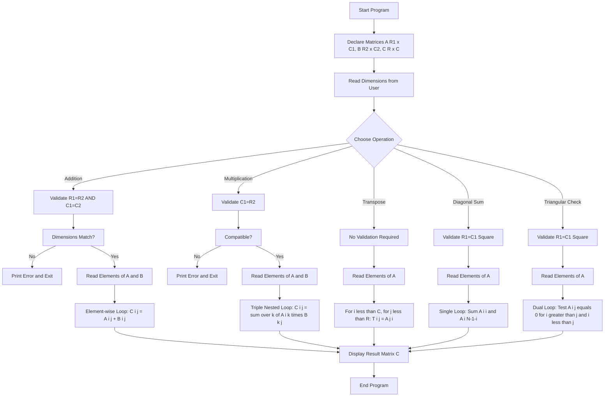
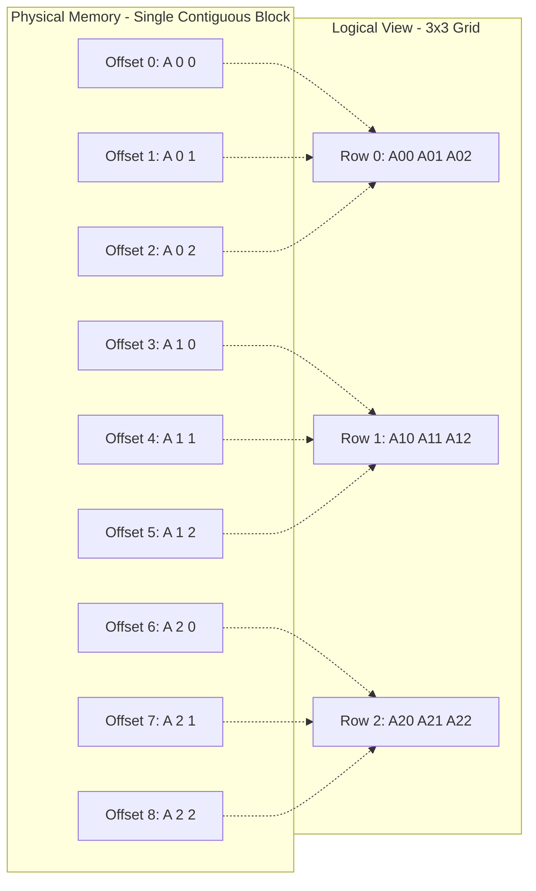
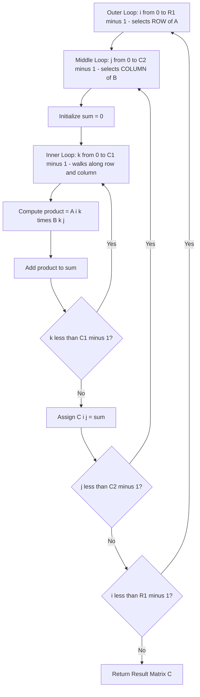
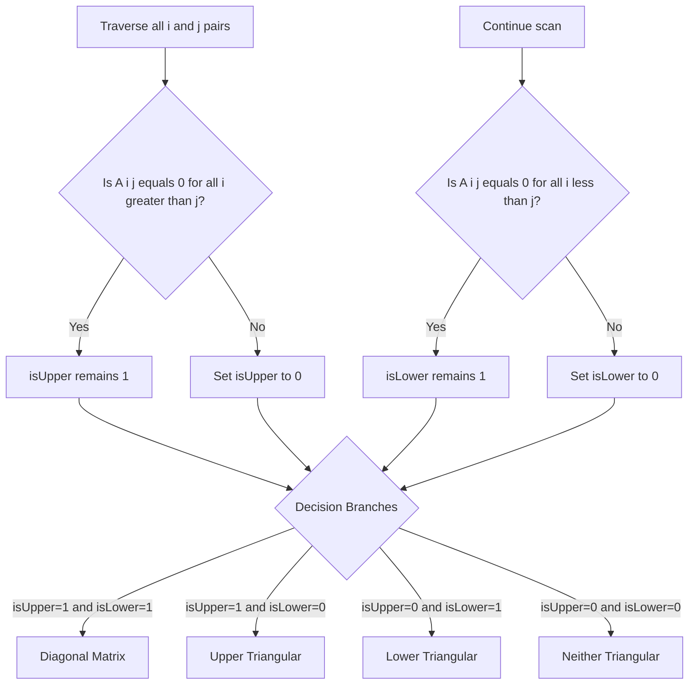

# Programs for matrix processing

<!-- SECTION_1_START -->
# 1. Core Technical Definition & Intuitive Overview

## 1.1 Formal Academic Definition (KTU 2024 Terminology)

A **matrix** in the C programming language is implemented as a **two-dimensional (2D) array** — a homogeneous, contiguous collection of data elements of identical type, organized in a rectangular grid of `rows × columns`, accessed via two indices `[i][j]`.

The general KTU-formal declaration syntax is:

$$ \text{data\_type} \;\; \text{array\_name} \;\; [ \text{MAX\_ROWS} ] \;\; [ \text{MAX\_COLS} ] ; $$

where:
- $\text{data\_type}$ is any valid C primitive (commonly `int`, `float`, `double`).
- $\text{MAX\_ROWS}$ and $\text{MAX\_COLS}$ are compile-time **constant expressions** specifying maximum row and column capacities.
- The first index $i \in [0, R-1]$ represents the **row offset** (vertical position).
- The second index $j \in [0, C-1]$ represents the **column offset** (horizontal position).
- The address of any element $a[i][j]$ in **Row-Major Order** (used by C) is given by:
$$ \text{Address}(a[i][j]) = \text{Base} + (i \times C + j) \times \text{sizeof}(\text{data\_type}) $$

> [!IMPORTANT]
> **KTU 2024 Board Directive:** C stores 2D arrays in **Row-Major Order** — entire rows are stored contiguously in memory. Always remember this when reasoning about pointer arithmetic, since a 2D array is logically a grid but physically a flat block of memory.

---

## 1.2 Conceptual Analogy / Intuition

Imagine a **spreadsheet in Microsoft Excel** or a **seating chart in a cinema hall**:
- The cinema hall has **rows** (numbered $1, 2, 3, \ldots, R$).
- Each row has **seats** (columns $1, 2, 3, \ldots, C$).
- To locate a person, you specify **Row + Column** (e.g., `A[3][5]` = "Row 3, Column 5").

A C matrix works identically. It is a **labeled grid** where every cell is a variable, and you identify each cell with two numbers (its row index and column index) instead of one.

> [!NOTE]
> **Think of it this way:** A 1D array is like a *queue of people* standing in a line. A 2D array is like a *grid of people* arranged in rows and columns. To find someone, you need TWO coordinates (row, column), not just one.

---

## 1.3 Categories of Matrices Relevant to KTU Syllabus

| Matrix Type | Definition | Typical Use Case |
|-------------|-----------|------------------|
| **Rectangular** | Rows $\neq$ Columns ($R \neq C$) | General data tables, image pixels |
| **Square** | Rows $=$ Columns ($R = C = N$) | Linear algebra (determinant, inverse) |
| **Identity** $I_N$ | Diagonal elements $= 1$, off-diagonal $= 0$ | Mathematical identity element |
| **Diagonal** | Non-zero entries only on main diagonal | Eigenvalue problems |
| **Upper Triangular** | All elements **below** main diagonal are $0$ | Gaussian elimination |
| **Lower Triangular** | All elements **above** main diagonal are $0$ | LU Decomposition |
| **Sparse** | Most elements are $0$ | Graph adjacency, ML weight matrices |
| **Symmetric** | $A = A^T$, i.e., $a_{ij} = a_{ji}$ | Physics, covariance matrices |

> [!IMPORTANT]
> **Syllabus Highlight:** KTU 2024 Module 2 explicitly tests: (a) Matrix Addition/Subtraction, (b) Matrix Multiplication, (c) Transpose, (d) Sum of diagonal elements, and (e) Classification into Upper/Lower/Neither Triangular matrices. Master all five.

---

## 1.4 Geometric / Visual Intuition

Consider a $3 \times 3$ matrix $A$:

$$ A = \begin{bmatrix} a_{00} & a_{01} & a_{02} \\ a_{10} & a_{11} & a_{12} \\ a_{20} & a_{21} & a_{22} \end{bmatrix} $$

- The **main diagonal** runs from $a_{00} \rightarrow a_{11} \rightarrow a_{22}$ (indices where $i = j$).
- The **secondary diagonal** runs from $a_{02} \rightarrow a_{11} \rightarrow a_{20}$ (indices where $i + j = N - 1$).

> [!VISUALIZATION CONTROL]
> **Concept:** Memory layout of a $3 \times 3$ integer matrix in Row-Major Order
> **GeoGebra / Desmos Input Equations:**
> * Draw a $3 \times 3$ grid on a coordinate plane.
> * Plot sequential points: `P1 = (1, 3, a00)`, `P2 = (2, 3, a01)`, `P3 = (3, 3, a02)`, `P4 = (1, 2, a10)`, ... `P9 = (3, 1, a22)`
> * Connect with arrows showing the linear memory sweep: $a_{00} \rightarrow a_{01} \rightarrow a_{02} \rightarrow a_{10} \rightarrow a_{11} \rightarrow \ldots \rightarrow a_{22}$
> **Visual Description:** Observe that the **first row fills first**, then the second row, then the third — confirming Row-Major storage. The 2D logical view is a grid; the 1D physical view is a single continuous line.

---

## 1.5 Why Matrix Processing Matters in Engineering

- **Image Processing:** A grayscale image is an $M \times N$ matrix of pixel intensities.
- **Machine Learning:** Neural network weights and input features are stored as matrices; training involves heavy matrix multiplication.
- **Computer Graphics:** 3D transformations (rotation, scaling, translation) are matrix operations.
- **Signal Processing:** Convolution filters operate on matrices.
- **Structural Engineering:** Finite Element Method uses stiffness matrices.
- **Graph Algorithms:** Adjacency matrices represent network connectivity.

> [!NOTE]
> **KTU Context:** For your lab exams and university papers, you are expected to write **complete, compilable, executable** C programs using `scanf`/`printf` for I/O, nested `for` loops for traversal, and clear logic for each matrix operation. Do NOT skip boundary checks (`if (R == C)` for square checks).
<!-- SECTION_1_END -->

<!-- SECTION_2_START -->
# 2. Deep Theoretical Analysis & KTU High-Yield Formula Sheet

## 2.1 Memory Architecture: The Hidden Truth Behind 2D Arrays

A C compiler does **not** allocate a separate block for each row. It allocates **one contiguous block** of size $R \times C \times \text{sizeof}(\text{type})$ bytes and performs arithmetic to compute offsets.

For an `int A[3][4]` declaration:
- Total memory = $3 \times 4 \times 4 = 48$ bytes (assuming 4-byte `int`).
- Layout in memory: `[A[0][0], A[0][1], A[0][2], A[0][3], A[1][0], A[1][1], ... , A[2][3]]`.

The pointer equivalence rule states:
$$ A[i][j] \equiv *(*(A + i) + j) \equiv *(A[i] + j) $$

This is crucial for advanced pointer-based matrix problems occasionally asked in KTU.

---

## 2.2 Algorithmic Decomposition of Common Operations

### 2.2.1 Matrix Addition ($A + B = C$)

**Precondition:** $A$ and $B$ must have **identical dimensions** ($R_A = R_B$ AND $C_A = C_B$).

**Element-wise operation:**
$$ C[i][j] = A[i][j] + B[i][j] \quad \forall \;\; i \in [0, R-1], \;\; j \in [0, C-1] $$

**Why this works:** Matrix addition is defined component-wise. There is no row/column interaction — each output element depends on exactly one input element pair.

**Algorithmic steps:**
1. Read $R, C$ of the two matrices.
2. Validate dimension compatibility (else print "Addition not possible").
3. Initialize result matrix $C[R][C]$.
4. For $i$ from $0$ to $R-1$:
   - For $j$ from $0$ to $C-1$:
     - $C[i][j] = A[i][j] + B[i][j]$.
5. Print $C$.

---

### 2.2.2 Matrix Subtraction ($A - B = C$)

**Precondition:** Dimensionally identical matrices.

**Element-wise operation:**
$$ C[i][j] = A[i][j] - B[i][j] $$

**Engineering use:** Used in computing error/difference matrices, residual plots, and image subtraction in motion detection.

---

### 2.2.3 Matrix Multiplication ($A \times B = C$)

**Precondition:** $A$ is $R_1 \times C_1$, $B$ is $R_2 \times C_2$. Multiplication is possible **iff** $C_1 = R_2$. The result is $C$ of size $R_1 \times C_2$.

**Element-wise operation (using the dot-product definition):**
$$ C[i][j] = \sum_{k=0}^{C_1 - 1} A[i][k] \cdot B[k][j] $$

**Why three nested loops?** The element $C[i][j]$ is the **dot product of the $i$-th row of $A$ with the $j$-th column of $B$**. We need a third index $k$ to walk along that row/column and accumulate the sum.

**Engineering use:** Core of neural network forward propagation, graphics transformations, and solving systems of linear equations.

---

### 2.2.4 Matrix Transpose ($A^T$)

For an $R \times C$ matrix $A$, its transpose $A^T$ is a $C \times R$ matrix where:
$$ A^T[i][j] = A[j][i] $$

Equivalently, the **rows of $A$ become the columns of $A^T$**. This is the matrix's reflection across its main diagonal.

**Use case:** Computing covariance matrices, finding symmetric matrices, and image rotation by 90°.

---

### 2.2.5 Sum of Diagonal Elements

For an $N \times N$ matrix, the sum of the **principal (main) diagonal** is:
$$ S_{\text{main}} = \sum_{i=0}^{N-1} A[i][i] $$

The sum of the **secondary (anti) diagonal** is:
$$ S_{\text{anti}} = \sum_{i=0}^{N-1} A[i][N-1-i] $$

For a $1 \times 1$ matrix, both diagonals coincide (counted once). For odd $N$, the **center element** $A[\frac{N-1}{2}][\frac{N-1}{2}]$ belongs to both diagonals.

---

### 2.2.6 Triangular Matrix Classification

A matrix is **Upper Triangular** if:
$$ A[i][j] = 0 \quad \text{for all} \;\; i > j \quad \text{(strictly below diagonal)} $$

A matrix is **Lower Triangular** if:
$$ A[i][j] = 0 \quad \text{for all} \;\; i < j \quad \text{(strictly above diagonal)} $$

A matrix is **Both** (a diagonal matrix) if:
$$ A[i][j] = 0 \quad \text{for all} \;\; i \neq j $$

A matrix is **Neither** if it has non-zero elements both above and below the diagonal.

**Algorithm:** Traverse all $i, j$ pairs. Use two flags (`isUpper = 1`, `isLower = 1`). If any $A[i][j] \neq 0$ for $i > j$, set `isUpper = 0`. If any $A[i][j] \neq 0$ for $i < j$, set `isLower = 0`. Classify based on final flag values.

---

## 2.3 KTU Formula Sheet (High-Yield Quick Reference)

> [!IMPORTANT]
> The following table is the **exam-day cheat sheet** for matrix problems. Print this mentally before every test.

| Operation | Precondition | Output Size | Core Formula | Time Complexity | Space Complexity |
|-----------|--------------|-------------|--------------|-----------------|------------------|
| **Addition** $A+B$ | $R_A = R_B$ and $C_A = C_B$ | $R_A \times C_A$ | $C[i][j] = A[i][j] + B[i][j]$ | $O(R \cdot C)$ | $O(R \cdot C)$ |
| **Subtraction** $A-B$ | $R_A = R_B$ and $C_A = C_B$ | $R_A \times C_A$ | $C[i][j] = A[i][j] - B[i][j]$ | $O(R \cdot C)$ | $O(R \cdot C)$ |
| **Multiplication** $A \times B$ | $C_A = R_B$ | $R_A \times C_B$ | $C[i][j] = \sum_k A[i][k] \cdot B[k][j]$ | $O(R_A \cdot C_B \cdot C_A)$ | $O(R_A \cdot C_B)$ |
| **Transpose** $A^T$ | None (any matrix) | $C_A \times R_A$ | $B[i][j] = A[j][i]$ | $O(R \cdot C)$ | $O(R \cdot C)$ |
| **In-place Transpose** | Square matrix ($R = C = N$) | $N \times N$ | Swap $A[i][j] \leftrightarrow A[j][i]$ for $i < j$ | $O(N^2)$ | $O(1)$ (no extra matrix) |
| **Main Diagonal Sum** | Square ($N \times N$) | Scalar | $S = \sum_{i=0}^{N-1} A[i][i]$ | $O(N)$ | $O(1)$ |
| **Anti-Diagonal Sum** | Square ($N \times N$) | Scalar | $S = \sum_{i=0}^{N-1} A[i][N-1-i]$ | $O(N)$ | $O(1)$ |
| **Triangular Check** | Square ($N \times N$) | Boolean | Test $A[i][j] = 0$ for $i > j$ (upper) or $i < j$ (lower) | $O(N^2)$ | $O(1)$ |

> [!NOTE]
> **Critical observation:** The **transpose operation** can be performed **in-place** (no extra memory) only for square matrices by swapping elements above the diagonal with those below. For rectangular matrices, you need a fresh $C \times R$ array.

---

## 2.4 Engineering Applications: Where These Operations Run in Production

| Domain | Operation Used | Real System Example |
|--------|----------------|---------------------|
| **Computer Graphics (OpenGL/DirectX)** | Matrix Multiplication | Each vertex position transformed by a $4 \times 4$ Model-View-Projection matrix per frame |
| **Deep Learning (TensorFlow/PyTorch)** | Matrix Multiplication | Every layer computes $Y = W \cdot X + b$ via optimized BLAS libraries |
| **Image Processing (OpenCV)** | Transpose, Addition | Image rotation by 90° uses transpose; brightness adjustment uses scalar addition |
| **Numerical Computing (MATLAB/Numpy)** | All operations | Entire libraries optimized around vectorized matrix arithmetic |
| **Cryptography (Hill Cipher)** | Multiplication mod 26 | Encryption: $C = K \cdot P \mod 26$, Decryption: $P = K^{-1} \cdot C \mod 26$ |
| **Game Development (Physics Engines)** | Multiplication | Collision transformation matrices updated 60 times per second |
| **Computer Vision (CNN)** | Convolution as multiplication | Convolution operation reformulated as matrix multiplication for GPU acceleration |

> [!TIP]
> **Exam tip:** When a KTU question asks "write a C program for matrix multiplication," ensure you show all THREE nested loops, declare the result matrix with the **correct dimensions** ($R_A \times C_B$, not $R_A \times C_A$), and use a running sum variable initialized to 0 *before* the innermost loop.
<!-- SECTION_2_END -->

<!-- SECTION_3_START -->
# 3. Step-by-Step Derivations & Code/Symbolic Implementation

> [!IMPORTANT]
> **Reading Guide:** Every C program below is **fully runnable**, with detailed comments mapping to the formula derived in SECTION 2. No step is abbreviated. Trace through the dry-run example to internalize the algorithm.

---

## 3.1 Program 1 — Matrix Addition

### 3.1.1 Algorithm Derivation

We want to compute $C = A + B$ where $A$ and $B$ are both $R \times C$.

**Step 1: Read dimensions.** Obtain $R$ (rows) and $C$ (cols) for both matrices.

**Step 2: Validate.** For addition, $A$ and $B$ must have the same dimensions. If $R_A \neq R_B$ or $C_A \neq C_B$, print an error and exit.

**Step 3: Initialize result matrix $C[R][C]$ with all zeros.** C does not zero-initialize local arrays, so explicit initialization is good practice.

**Step 4: Nested iteration.** For each $i \in [0, R-1]$ and $j \in [0, C-1]$:
$$ C[i][j] = A[i][j] + B[i][j] $$

**Step 5: Display $C$ in a row-column grid format.**

### 3.1.2 Complete C Implementation

```c
#include <stdio.h>

#define MAX 50

int main(void) {
    int A[MAX][MAX], B[MAX][MAX], C[MAX][MAX];
    int R1, C1, R2, C2;
    int i, j;

    printf("=== Matrix Addition Program ===\n");

    /* Step 1: Read dimensions of Matrix A */
    printf("Enter rows and columns of Matrix A (R C): ");
    if (scanf("%d %d", &R1, &C1) != 2) {
        printf("Invalid input.\n");
        return 1;
    }

    /* Step 1b: Read dimensions of Matrix B */
    printf("Enter rows and columns of Matrix B (R C): ");
    if (scanf("%d %d", &R2, &C2) != 2) {
        printf("Invalid input.\n");
        return 1;
    }

    /* Step 2: Validate dimension compatibility */
    if (R1 != R2 || C1 != C2) {
        printf("ERROR: Matrix addition requires identical dimensions.\n");
        printf("Matrix A is %dx%d, Matrix B is %dx%d.\n", R1, C1, R2, C2);
        return 1;
    }

    /* Step 3a: Read Matrix A from user */
    printf("Enter %d elements of Matrix A (row-wise):\n", R1 * C1);
    for (i = 0; i < R1; i++) {
        for (j = 0; j < C1; j++) {
            printf("A[%d][%d] = ", i, j);
            scanf("%d", &A[i][j]);
        }
    }

    /* Step 3b: Read Matrix B from user */
    printf("Enter %d elements of Matrix B (row-wise):\n", R1 * C1);
    for (i = 0; i < R1; i++) {
        for (j = 0; j < C1; j++) {
            printf("B[%d][%d] = ", i, j);
            scanf("%d", &B[i][j]);
        }
    }

    /* Step 4: Perform element-wise addition */
    for (i = 0; i < R1; i++) {
        for (j = 0; j < C1; j++) {
            C[i][j] = A[i][j] + B[i][j];
        }
    }

    /* Step 5: Display the result matrix C in grid format */
    printf("\nResult Matrix C = A + B:\n");
    for (i = 0; i < R1; i++) {
        for (j = 0; j < C1; j++) {
            printf("%6d ", C[i][j]);
        }
        printf("\n");
    }

    return 0;
}
```

### 3.1.3 Dry Run Trace

Let $A = \begin{bmatrix} 1 & 2 \\ 3 & 4 \end{bmatrix}$ and $B = \begin{bmatrix} 5 & 6 \\ 7 & 8 \end{bmatrix}$.

- $i=0, j=0$: $C[0][0] = 1 + 5 = 6$
- $i=0, j=1$: $C[0][1] = 2 + 6 = 8$
- $i=1, j=0$: $C[1][0] = 3 + 7 = 10$
- $i=1, j=1$: $C[1][1] = 4 + 8 = 12$

Output: $C = \begin{bmatrix} 6 & 8 \\ 10 & 12 \end{bmatrix}$ ✓

---

## 3.2 Program 2 — Matrix Multiplication

### 3.2.1 Algorithm Derivation

We want $C = A \times B$ where $A$ is $R_1 \times C_1$ and $B$ is $R_2 \times C_2$.

**Step 1: Validate.** Multiplication is possible iff $C_1 = R_2$. Result dimensions: $R_1 \times C_2$.

**Step 2: For each cell $C[i][j]$ in the result:**
$$ C[i][j] = \sum_{k=0}^{C_1 - 1} A[i][k] \cdot B[k][j] $$

This requires **three nested loops**:
- Outer loop $i$: pick the row of $A$.
- Middle loop $j$: pick the column of $B$.
- Inner loop $k$: walk along that row/column and accumulate the sum.

**Step 3: Initialize `sum = 0` before the innermost loop** to avoid garbage values.

### 3.2.2 Complete C Implementation

```c
#include <stdio.h>

#define MAX 30

int main(void) {
    int A[MAX][MAX], B[MAX][MAX], C[MAX][MAX] = {0};
    int R1, C1, R2, C2;
    int i, j, k;

    printf("=== Matrix Multiplication Program ===\n");

    printf("Enter rows and columns of Matrix A (R C): ");
    scanf("%d %d", &R1, &C1);

    printf("Enter rows and columns of Matrix B (R C): ");
    scanf("%d %d", &R2, &C2);

    /* Step 1: Validate dimension compatibility */
    if (C1 != R2) {
        printf("ERROR: Multiplication not possible.\n");
        printf("Columns of A (%d) must equal Rows of B (%d).\n", C1, R2);
        return 1;
    }

    /* Read Matrix A */
    printf("Enter %d elements of Matrix A:\n", R1 * C1);
    for (i = 0; i < R1; i++) {
        for (j = 0; j < C1; j++) {
            printf("A[%d][%d] = ", i, j);
            scanf("%d", &A[i][j]);
        }
    }

    /* Read Matrix B */
    printf("Enter %d elements of Matrix B:\n", R2 * C2);
    for (i = 0; i < R2; i++) {
        for (j = 0; j < C2; j++) {
            printf("B[%d][%d] = ", i, j);
            scanf("%d", &B[i][j]);
        }
    }

    /* Step 2: Perform multiplication using three nested loops */
    for (i = 0; i < R1; i++) {           /* For each row of A */
        for (j = 0; j < C2; j++) {       /* For each column of B */
            C[i][j] = 0;                 /* Initialize result cell */
            for (k = 0; k < C1; k++) {   /* Compute dot product */
                C[i][j] += A[i][k] * B[k][j];
            }
        }
    }

    /* Display result */
    printf("\nResult Matrix C = A x B:\n");
    for (i = 0; i < R1; i++) {
        for (j = 0; j < C2; j++) {
            printf("%8d ", C[i][j]);
        }
        printf("\n");
    }

    return 0;
}
```

### 3.2.3 Dry Run Trace

Let $A = \begin{bmatrix} 1 & 2 \\ 3 & 4 \end{bmatrix}$ and $B = \begin{bmatrix} 5 & 6 \\ 7 & 8 \end{bmatrix}$. Here $R_1=2, C_1=2, R_2=2, C_2=2$.

- $C[0][0] = (1 \cdot 5) + (2 \cdot 7) = 5 + 14 = 19$
- $C[0][1] = (1 \cdot 6) + (2 \cdot 8) = 6 + 16 = 22$
- $C[1][0] = (3 \cdot 5) + (4 \cdot 7) = 15 + 28 = 43$
- $C[1][1] = (3 \cdot 6) + (4 \cdot 8) = 18 + 32 = 50$

Output: $C = \begin{bmatrix} 19 & 22 \\ 43 & 50 \end{bmatrix}$ ✓

---

## 3.3 Program 3 — Matrix Transpose

### 3.3.1 Algorithm Derivation

For an $R \times C$ matrix $A$, the transpose $A^T$ is a $C \times R$ matrix where $A^T[i][j] = A[j][i]$.

Two approaches:

**Method A (Out-of-place, works for any matrix):** Allocate a fresh $C \times R$ matrix $T$ and copy $T[i][j] = A[j][i]$.

**Method B (In-place, square matrices only):** Swap $A[i][j]$ with $A[j][i]$ for $i < j$ to avoid double-swapping. No extra memory needed.

### 3.3.2 Complete C Implementation (In-Place for Square Matrix)

```c
#include <stdio.h>

#define MAX 50

int main(void) {
    int A[MAX][MAX];
    int N, i, j, temp;

    printf("=== Matrix Transpose (In-Place) Program ===\n");
    printf("Enter the size of the square matrix (N): ");
    scanf("%d", &N);

    if (N <= 0 || N > MAX) {
        printf("Invalid size. Must be between 1 and %d.\n", MAX);
        return 1;
    }

    /* Read the matrix */
    printf("Enter %d elements:\n", N * N);
    for (i = 0; i < N; i++) {
        for (j = 0; j < N; j++) {
            printf("A[%d][%d] = ", i, j);
            scanf("%d", &A[i][j]);
        }
    }

    /* Display original matrix */
    printf("\nOriginal Matrix A:\n");
    for (i = 0; i < N; i++) {
        for (j = 0; j < N; j++) {
            printf("%5d ", A[i][j]);
        }
        printf("\n");
    }

    /* In-place transpose: swap A[i][j] with A[j][i] for i < j */
    for (i = 0; i < N; i++) {
        for (j = i + 1; j < N; j++) {
            temp    = A[i][j];
            A[i][j] = A[j][i];
            A[j][i] = temp;
        }
    }

    /* Display transposed matrix */
    printf("\nTransposed Matrix A^T:\n");
    for (i = 0; i < N; i++) {
        for (j = 0; j < N; j++) {
            printf("%5d ", A[i][j]);
        }
        printf("\n");
    }

    return 0;
}
```

### 3.3.3 Out-of-Place Variant (For Rectangular Matrices)

```c
/* For an R x C matrix A, produce a C x R matrix T */
for (i = 0; i < C; i++) {        /* Note: iterate up to C */
    for (j = 0; j < R; j++) {    /* Note: iterate up to R */
        T[i][j] = A[j][i];       /* Index swap */
    }
}
```

> [!IMPORTANT]
> **Boundary pitfall:** If you iterate the inner loop from $j=0$ (instead of $j=i+1$) during an in-place transpose, each pair of elements gets swapped **twice**, leaving the matrix unchanged. The condition `j = i + 1` is the **half-triangle** trick that prevents this.

### 3.3.4 Dry Run Trace

Let $A = \begin{bmatrix} 1 & 2 & 3 \\ 4 & 5 & 6 \\ 7 & 8 & 9 \end{bmatrix}$.

- Swap $A[0][1]=2$ with $A[1][0]=4$ → $A[0][1]=4, A[1][0]=2$
- Swap $A[0][2]=3$ with $A[2][0]=7$ → $A[0][2]=7, A[2][0]=3$
- Swap $A[1][2]=6$ with $A[2][1]=8$ → $A[1][2]=8, A[2][1]=6$

Result: $A^T = \begin{bmatrix} 1 & 4 & 7 \\ 2 & 5 & 8 \\ 3 & 6 & 9 \end{bmatrix}$ ✓

---

## 3.4 Program 4 — Sum of Diagonal Elements

### 3.4.1 Algorithm Derivation

For an $N \times N$ matrix $A$:
- **Main diagonal** indices satisfy $i = j$.
- **Anti-diagonal** indices satisfy $i + j = N - 1$, i.e., $j = N - 1 - i$.

If $N$ is odd, the center element at $A[\frac{N-1}{2}][\frac{N-1}{2}]$ lies on **both** diagonals and should be **counted once** if we want the sum of *distinct* diagonal elements.

### 3.4.2 Complete C Implementation

```c
#include <stdio.h>

#define MAX 50

int main(void) {
    int A[MAX][MAX];
    int N, i, j;
    int mainDiagSum = 0, antiDiagSum = 0, totalDiagSum = 0;

    printf("=== Sum of Diagonal Elements Program ===\n");
    printf("Enter the size of the square matrix (N): ");
    scanf("%d", &N);

    if (N <= 0 || N > MAX) {
        printf("Invalid size.\n");
        return 1;
    }

    /* Read matrix */
    printf("Enter %d elements:\n", N * N);
    for (i = 0; i < N; i++) {
        for (j = 0; j < N; j++) {
            printf("A[%d][%d] = ", i, j);
            scanf("%d", &A[i][j]);
        }
    }

    /* Display the matrix */
    printf("\nMatrix A:\n");
    for (i = 0; i < N; i++) {
        for (j = 0; j < N; j++) {
            printf("%5d ", A[i][j]);
        }
        printf("\n");
    }

    /* Compute both diagonal sums */
    for (i = 0; i < N; i++) {
        mainDiagSum  += A[i][i];           /* i == j */
        antiDiagSum  += A[i][N - 1 - i];   /* i + j == N - 1 */
    }

    /* Avoid double-counting the center element for odd N */
    if (N % 2 == 1) {
        int center = N / 2;
        totalDiagSum = mainDiagSum + antiDiagSum - A[center][center];
    } else {
        totalDiagSum = mainDiagSum + antiDiagSum;
    }

    printf("\nMain Diagonal Sum     = %d\n", mainDiagSum);
    printf("Anti-Diagonal Sum     = %d\n", antiDiagSum);
    printf("Total Diagonal Sum    = %d\n", totalDiagSum);

    return 0;
}
```

### 3.4.3 Dry Run Trace

Let $A = \begin{bmatrix} 1 & 2 & 3 \\ 4 & 5 & 6 \\ 7 & 8 & 9 \end{bmatrix}$.

- Main diagonal: $A[0][0]+A[1][1]+A[2][2] = 1+5+9 = 15$
- Anti-diagonal: $A[0][2]+A[1][1]+A[2][0] = 3+5+7 = 15$
- Since $N=3$ (odd), center $A[1][1]=5$ is double-counted. Total = $15+15-5 = 25$.

---

## 3.5 Program 5 — Triangular Matrix Classification

### 3.5.1 Algorithm Derivation

We use two boolean flags: `isUpper = 1` and `isLower = 1`.

- Scan all pairs $(i, j)$.
- If any $A[i][j] \neq 0$ with $i > j$ (below diagonal has a non-zero), set `isUpper = 0`.
- If any $A[i][j] \neq 0$ with $i < j$ (above diagonal has a non-zero), set `isLower = 0`.

**Decision rules:**
- If `isUpper && isLower` → Diagonal matrix (Both).
- If `isUpper && !isLower` → Upper Triangular.
- If `!isUpper && isLower` → Lower Triangular.
- If `!isUpper && !isLower` → Neither.

### 3.5.2 Complete C Implementation

```c
#include <stdio.h>

#define MAX 50

int main(void) {
    int A[MAX][MAX];
    int N, i, j;
    int isUpper = 1, isLower = 1;

    printf("=== Triangular Matrix Classification Program ===\n");
    printf("Enter the size of the square matrix (N): ");
    scanf("%d", &N);

    if (N <= 0 || N > MAX) {
        printf("Invalid size.\n");
        return 1;
    }

    /* Read matrix */
    printf("Enter %d elements:\n", N * N);
    for (i = 0; i < N; i++) {
        for (j = 0; j < N; j++) {
            printf("A[%d][%d] = ", i, j);
            scanf("%d", &A[i][j]);
        }
    }

    /* Display matrix */
    printf("\nMatrix A:\n");
    for (i = 0; i < N; i++) {
        for (j = 0; j < N; j++) {
            printf("%5d ", A[i][j]);
        }
        printf("\n");
    }

    /* Classification logic */
    for (i = 0; i < N; i++) {
        for (j = 0; j < N; j++) {
            if (i > j && A[i][j] != 0) {
                isUpper = 0;   /* Non-zero below diagonal -> not upper */
            }
            if (i < j && A[i][j] != 0) {
                isLower = 0;   /* Non-zero above diagonal -> not lower */
            }
        }
    }

    /* Print classification */
    printf("\nClassification Result:\n");
    if (isUpper && isLower) {
        printf("The matrix is BOTH Upper and Lower Triangular (i.e., a Diagonal Matrix).\n");
    } else if (isUpper) {
        printf("The matrix is an UPPER Triangular Matrix.\n");
    } else if (isLower) {
        printf("The matrix is a LOWER Triangular Matrix.\n");
    } else {
        printf("The matrix is NEITHER Upper nor Lower Triangular.\n");
    }

    return 0;
}
```

### 3.5.3 Dry Run Trace

Let $A = \begin{bmatrix} 1 & 2 & 0 \\ 0 & 3 & 4 \\ 0 & 0 & 5 \end{bmatrix}$.

- Element $A[0][1] = 2$: $i < j$ and $A[0][1] \neq 0$ → set `isLower = 0`.
- Element $A[1][2] = 4$: $i < j$ and $A[1][2] \neq 0$ → `isLower` already 0.
- All elements below diagonal (where $i > j$) are 0, so `isUpper` stays 1.

Final: `isUpper = 1, isLower = 0` → **Upper Triangular** ✓

---

## 3.6 Program 6 — Saddle Point Detection (Bonus)

> [!NOTE]
> A **saddle point** in a matrix is an element that is the **minimum in its row** and the **maximum in its column** (or vice versa). This is occasionally asked as a challenge question.

```c
#include <stdio.h>
#include <limits.h>

#define MAX 50

int main(void) {
    int A[MAX][MAX];
    int R, C, i, j, k;
    int found = 0;

    printf("Enter rows and columns: ");
    scanf("%d %d", &R, &C);

    printf("Enter elements:\n");
    for (i = 0; i < R; i++) {
        for (j = 0; j < C; j++) {
            scanf("%d", &A[i][j]);
        }
    }

    /* Find saddle point */
    for (i = 0; i < R; i++) {
        /* Find minimum of row i and its column position */
        int rowMin = A[i][0];
        int colIdx = 0;
        for (j = 1; j < C; j++) {
            if (A[i][j] < rowMin) {
                rowMin = A[i][j];
                colIdx = j;
            }
        }

        /* Check if this rowMin is the maximum of its column */
        int isColMax = 1;
        for (k = 0; k < R; k++) {
            if (A[k][colIdx] > rowMin) {
                isColMax = 0;
                break;
            }
        }

        if (isColMax) {
            printf("Saddle point found: A[%d][%d] = %d\n", i, colIdx, rowMin);
            found = 1;
        }
    }

    if (!found) {
        printf("No saddle point exists in the given matrix.\n");
    }

    return 0;
}
```
<!-- SECTION_3_END -->

<!-- SECTION_4_START -->
# 4. Structural Diagrams & Schematics

## 4.1 Top-Level Matrix Processing Pipeline



## 4.2 Memory Layout: Row-Major Order Representation



## 4.3 Matrix Multiplication Inner Loop Anatomy



## 4.4 Classification Decision Logic for Triangular Matrices


<!-- SECTION_4_END -->

<!-- SECTION_5_START -->
# 5. KTU 2024 Scheme Examination Question Bank & Topic Recap

## 5.1 Part A — Short Answer Questions (3 Marks Each)

> [!NOTE]
> **Cognitive Levels Tested:** Remember / Understand. Keep answers crisp, factual, and formula-driven.

### **Question 1** [KTU University Exam - July 2024]
**Q: Define a two-dimensional array in C. How is it stored in memory? How do you declare a 2D array of size $M \times N$?**

**Model Answer (3 Marks):**

A two-dimensional array in C is a collection of elements of the same data type arranged in a tabular (row × column) format and accessed using two indices: a row index and a column index. **[1 Mark — Definition]**

It is stored in memory in **Row-Major Order** — meaning all elements of the first row occupy consecutive memory locations, followed by all elements of the second row, and so on, forming a single contiguous block. The compiler internally treats a 2D array as a 1D array and uses pointer arithmetic (offset = `(i * N + j) * sizeof(type)`) to locate any element. **[1 Mark — Memory layout]**

Declaration syntax: `data_type array_name[M][N];` where `M` is the maximum number of rows and `N` is the maximum number of columns. Both `M` and `N` must be compile-time constants. Example: `int marks[50][5];` declares a 2D array of 50 rows and 5 columns. **[1 Mark — Syntax]**

---

### **Question 2** [KTU University Exam - Dec 2023]
**Q: What is the condition for two matrices to be added? Can a $2 \times 3$ matrix and a $3 \times 2$ matrix be added? Justify.**

**Model Answer (3 Marks):**

Two matrices $A$ (of size $R_1 \times C_1$) and $B$ (of size $R_2 \times C_2$) can be added **if and only if** both have the same number of rows **and** the same number of columns, i.e., $R_1 = R_2$ AND $C_1 = C_2$. This is called the **conformability condition** for addition. **[2 Marks — Condition]**

A $2 \times 3$ matrix (2 rows, 3 columns) and a $3 \times 2$ matrix (3 rows, 2 columns) **cannot be added** because the number of rows differ (2 ≠ 3). Matrix addition is strictly element-wise, and since the dimensions are unequal, there is no consistent way to pair elements of one matrix with the other. **[1 Mark — Justification]**

---

## 5.2 Part B — Long Answer Questions (14 Marks Each)

> [!IMPORTANT]
> KTU Part B questions feature **internal choice** between two full questions. Each 14-mark question is split into sub-parts (a) and (b), typically 7 marks each, with escalating cognitive levels.

---

### **Question A (14 Marks)** [KTU University Exam - Dec 2024]

**Q: Write a C program to:**
**(a)** Read two matrices of order $M \times N$ and $P \times Q$ from the user. Check whether matrix multiplication is possible. If yes, compute and display the product matrix. **[7 Marks]**
**(b)** Explain the concept of matrix transpose with an example. Write a C program to find the transpose of a $3 \times 3$ matrix **in-place** (without using a second matrix). **[7 Marks]**

#### **Part (a) — Matrix Multiplication** [7 Marks, Cognitive Level: Apply]

**Algorithm Steps:**
1. Read dimensions $M, N$ of matrix $A$ and $P, Q$ of matrix $B$.
2. Validate: multiplication is possible iff $N = P$.
3. Result matrix $C$ has dimensions $M \times Q$.
4. Use three nested loops to compute $C[i][j] = \sum_{k=0}^{N-1} A[i][k] \cdot B[k][j]$.

**Complete C Program:**

```c
#include <stdio.h>

#define MAX 30

int main(void) {
    int A[MAX][MAX], B[MAX][MAX], C[MAX][MAX] = {0};
    int M, N, P, Q, i, j, k;

    printf("Enter rows and columns of Matrix A: ");
    scanf("%d %d", &M, &N);
    printf("Enter rows and columns of Matrix B: ");
    scanf("%d %d", &P, &Q);

    if (N != P) {
        printf("Multiplication not possible. Columns of A (%d) != Rows of B (%d).\n", N, P);
        return 1;
    }

    printf("Enter elements of Matrix A (%d values):\n", M * N);
    for (i = 0; i < M; i++) {
        for (j = 0; j < N; j++) {
            scanf("%d", &A[i][j]);
        }
    }

    printf("Enter elements of Matrix B (%d values):\n", P * Q);
    for (i = 0; i < P; i++) {
        for (j = 0; j < Q; j++) {
            scanf("%d", &B[i][j]);
        }
    }

    /* Multiplication */
    for (i = 0; i < M; i++) {
        for (j = 0; j < Q; j++) {
            C[i][j] = 0;
            for (k = 0; k < N; k++) {
                C[i][j] += A[i][k] * B[k][j];
            }
        }
    }

    printf("\nProduct Matrix C (A x B):\n");
    for (i = 0; i < M; i++) {
        for (j = 0; j < Q; j++) {
            printf("%6d ", C[i][j]);
        }
        printf("\n");
    }

    return 0;
}
```

**Valuation Key:**
- [Reading dimensions and validation: 2 Marks]
- [Three nested loops with correct index bounds: 2 Marks]
- [Inner sum accumulation logic: 2 Marks]
- [Display formatted output: 1 Mark]

---

#### **Part (b) — Transpose Concept and In-Place Implementation** [7 Marks, Cognitive Level: Understand + Apply]

**Conceptual Explanation:**

The **transpose** of an $M \times N$ matrix $A$ is a new matrix $A^T$ of size $N \times M$ where the rows of $A$ become the columns of $A^T$. Formally, $A^T[i][j] = A[j][i]$. The main diagonal of the matrix remains unchanged, but the elements above the diagonal swap with those below the diagonal. For example, if $A = \begin{bmatrix} 1 & 2 \\ 3 & 4 \end{bmatrix}$, then $A^T = \begin{bmatrix} 1 & 3 \\ 2 & 4 \end{bmatrix}$. Transpose is used in solving linear equations, finding symmetric matrices, and image rotation. **[3 Marks — Concept]**

**In-Place C Program (square matrix only):**

```c
#include <stdio.h>

#define MAX 50

int main(void) {
    int A[MAX][MAX];
    int N, i, j, temp;

    printf("Enter the size of square matrix N: ");
    scanf("%d", &N);

    printf("Enter %d elements:\n", N * N);
    for (i = 0; i < N; i++) {
        for (j = 0; j < N; j++) {
            scanf("%d", &A[i][j]);
        }
    }

    printf("\nOriginal Matrix:\n");
    for (i = 0; i < N; i++) {
        for (j = 0; j < N; j++) {
            printf("%4d ", A[i][j]);
        }
        printf("\n");
    }

    /* In-place transpose: swap upper-triangle with lower-triangle */
    for (i = 0; i < N; i++) {
        for (j = i + 1; j < N; j++) {
            temp    = A[i][j];
            A[i][j] = A[j][i];
            A[j][i] = temp;
        }
    }

    printf("\nTransposed Matrix:\n");
    for (i = 0; i < N; i++) {
        for (j = 0; j < N; j++) {
            printf("%4d ", A[i][j]);
        }
        printf("\n");
    }

    return 0;
}
```

**Valuation Key:**
- [Conceptual explanation with example: 3 Marks]
- [Half-triangle iteration with j starting from i+1: 2 Marks]
- [Correct swap logic and display: 2 Marks]

> [!WARNING]
> **Examiner's Pitfall Warning:** Students often begin the inner loop with `j = 0` instead of `j = i + 1`. This causes **double swapping** — every pair gets swapped twice, leaving the matrix unchanged. The examiner will explicitly check this loop bound. **Loss: 2 Marks.**

---

### **Question B (14 Marks — Alternative Choice)** [KTU University Exam - July 2024]

**Q: Write C programs for the following:**
**(a)** Read an $N \times N$ matrix and find the sum of the main diagonal and anti-diagonal elements. Handle the case of odd $N$ correctly to avoid double-counting the center element. **[7 Marks]**
**(b)** Read an $N \times N$ matrix and determine whether it is an upper triangular, lower triangular, diagonal, or general matrix. Use appropriate flags in your logic. **[7 Marks]**

#### **Part (a) — Diagonal Sum with Center Handling** [7 Marks, Cognitive Level: Apply]

```c
#include <stdio.h>

#define MAX 50

int main(void) {
    int A[MAX][MAX];
    int N, i, j;
    int mainSum = 0, antiSum = 0;

    printf("Enter size of square matrix N: ");
    scanf("%d", &N);

    if (N <= 0 || N > MAX) {
        printf("Invalid size.\n");
        return 1;
    }

    printf("Enter %d elements:\n", N * N);
    for (i = 0; i < N; i++) {
        for (j = 0; j < N; j++) {
            scanf("%d", &A[i][j]);
        }
    }

    /* Compute both diagonal sums in a single pass */
    for (i = 0; i < N; i++) {
        mainSum += A[i][i];          /* Main: i == j */
        antiSum += A[i][N - 1 - i];  /* Anti: i + j == N - 1 */
    }

    /* Display */
    printf("\nMatrix:\n");
    for (i = 0; i < N; i++) {
        for (j = 0; j < N; j++) {
            printf("%4d ", A[i][j]);
        }
        printf("\n");
    }

    printf("\nMain Diagonal Sum  = %d\n", mainSum);
    printf("Anti Diagonal Sum  = %d\n", antiSum);

    if (N % 2 == 1) {
        int center = N / 2;
        int total = mainSum + antiSum - A[center][center];
        printf("Total (distinct)  = %d (center A[%d][%d] = %d counted once)\n",
               total, center, center, A[center][center]);
    } else {
        printf("Total (distinct)  = %d\n", mainSum + antiSum);
    }

    return 0;
}
```

**Valuation Key:**
- [Single-pass traversal of both diagonals: 3 Marks]
- [Correct main and anti-diagonal index expressions: 2 Marks]
- [Center-deduction logic for odd N: 2 Marks]

---

#### **Part (b) — Triangular Matrix Classification** [7 Marks, Cognitive Level: Analyze]

```c
#include <stdio.h>

#define MAX 50

int main(void) {
    int A[MAX][MAX];
    int N, i, j;
    int isUpper = 1, isLower = 1;

    printf("Enter size of square matrix N: ");
    scanf("%d", &N);

    printf("Enter %d elements:\n", N * N);
    for (i = 0; i < N; i++) {
        for (j = 0; j < N; j++) {
            scanf("%d", &A[i][j]);
        }
    }

    printf("\nMatrix:\n");
    for (i = 0; i < N; i++) {
        for (j = 0; j < N; j++) {
            printf("%4d ", A[i][j]);
        }
        printf("\n");
    }

    /* Flag-based classification */
    for (i = 0; i < N; i++) {
        for (j = 0; j < N; j++) {
            if (i > j && A[i][j] != 0) {
                isUpper = 0;
            }
            if (i < j && A[i][j] != 0) {
                isLower = 0;
            }
        }
    }

    printf("\nClassification:\n");
    if (isUpper && isLower) {
        printf("Diagonal Matrix (both upper and lower triangular).\n");
    } else if (isUpper) {
        printf("Upper Triangular Matrix.\n");
    } else if (isLower) {
        printf("Lower Triangular Matrix.\n");
    } else {
        printf("General Matrix (neither upper nor lower triangular).\n");
    }

    return 0;
}
```

**Valuation Key:**
- [Correct use of two boolean flags: 2 Marks]
- [Proper indexing conditions i greater than j and i less than j: 2 Marks]
- [Four-way classification logic: 2 Marks]
- [Proper matrix display: 1 Mark]

> [!WARNING]
> **Examiner's Pitfall Warning:** A common error is **forgetting to handle the diagonal itself** when checking upper/lower triangular. The diagonal elements can be anything (non-zero is allowed). The condition checks $i > j$ (strictly below) and $i < j$ (strictly above), NOT $i \geq j$ or $i \leq j$. Writing `if (i >= j)` instead of `if (i > j)` is a **1-mark deduction** per incorrect bound.

---

## 5.3 KTU Examiner's Valuation Warning / Pitfall Callout

> [!WARNING]
> **Top 5 Most Common Mistakes in Matrix Programs (and How to Avoid Them):**
>
> 1. **Index swap confusion in Transpose:** Writing `T[i][j] = A[i][j]` instead of `T[i][j] = A[j][i]`. The row and column indices **must** swap. **Loss: 2 Marks.**
>
> 2. **Wrong result matrix dimensions in Multiplication:** Declaring `C[R1][C1]` instead of `C[R1][C2]`. The result has the rows of $A$ and columns of $B$, not the inner dimension. **Loss: 2 Marks.**
>
> 3. **Missing initialization of `sum` or `C[i][j]` before the inner multiplication loop:** C does not auto-initialize local variables. Forgetting `C[i][j] = 0` or `int sum = 0` leads to garbage values accumulating. **Loss: 2 Marks.**
>
> 4. **Skipping dimension validation in Addition/Multiplication:** Always check `R1 == R2 && C1 == C2` for addition and `C1 == R2` for multiplication. If you skip, the program may produce undefined behavior on incompatible inputs. **Loss: 1 Mark.**
>
> 5. **In-place transpose using `j = 0` instead of `j = i + 1`:** Causes double-swapping and leaves the matrix unchanged. **Loss: 2 Marks.**

---

## 5.4 Topic Recap & Important Things to Remember

> [!IMPORTANT]
> **Final Revision Checklist — Pin this on your wall before the exam.**

- [x] A 2D array in C is declared as `type name[ROWS][COLS]` and stored in **Row-Major Order** in a single contiguous memory block.
- [x] The element at position `[i][j]` is addressed as `Base + (i * C + j) * sizeof(type)`.
- [x] **Matrix Addition** requires both matrices to have **identical dimensions**; output $C[i][j] = A[i][j] + B[i][j]$.
- [x] **Matrix Subtraction** has the same precondition as addition; output $C[i][j] = A[i][j] - B[i][j]$.
- [x] **Matrix Multiplication** is possible only when $C_A = R_B$ (inner dimensions match); output dimensions are $R_A \times C_B$.
- [x] The element $C[i][j]$ in multiplication is the **dot product** of row $i$ of $A$ and column $j$ of $B$: $C[i][j] = \sum_k A[i][k] \cdot B[k][j]$.
- [x] Matrix multiplication requires **three nested loops**; always initialize the sum or the result cell to **zero** before the innermost loop.
- [x] **Transpose** $A^T$ swaps the row and column indices: $A^T[i][j] = A[j][i]$; the output is $C \times R$ for an $R \times C$ input.
- [x] In-place transpose for square matrices iterates over the **upper triangle** only (`j = i + 1`) to avoid double-swapping.
- [x] The **main diagonal** satisfies $i = j$; the **anti-diagonal** satisfies $i + j = N - 1$.
- [x] For odd $N$, the center element $A[\frac{N-1}{2}][\frac{N-1}{2}]$ lies on both diagonals and must be **subtracted once** to get the sum of distinct diagonal elements.
- [x] An **Upper Triangular** matrix has all elements below the main diagonal as zero ($A[i][j] = 0$ for $i > j$).
- [x] A **Lower Triangular** matrix has all elements above the main diagonal as zero ($A[i][j] = 0$ for $i < j$).
- [x] A **Diagonal** matrix is both upper and lower triangular simultaneously.
- [x] Always **validate input dimensions** before performing operations; print a clear error message on mismatch.
- [x] Time complexity of element-wise operations (add/sub/transpose) is $O(R \cdot C)$; multiplication is $O(R_A \cdot C_B \cdot C_A)$.
- [x] In C, 2D arrays can be passed to functions by specifying only column size: `void func(int A[][MAX])`.
- [x] **Saddle point** (bonus): an element that is the minimum in its row and maximum in its column — algorithm involves row-min search followed by column-max check.
- [x] Real-world matrix applications include graphics transformations, neural network forward passes, image processing, cryptography (Hill Cipher), and solving systems of linear equations.
- [x] Common Board Pitfalls: (1) Wrong result dimensions in multiplication, (2) Missing sum initialization, (3) Double-swap in transpose, (4) Off-by-one index errors, (5) Forgetting dimension validation.
<!-- SECTION_5_END -->
