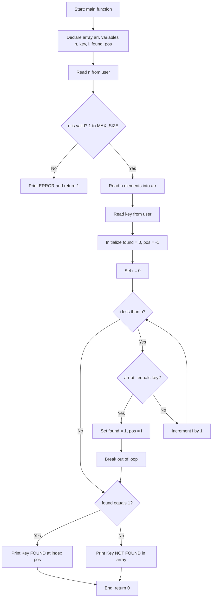
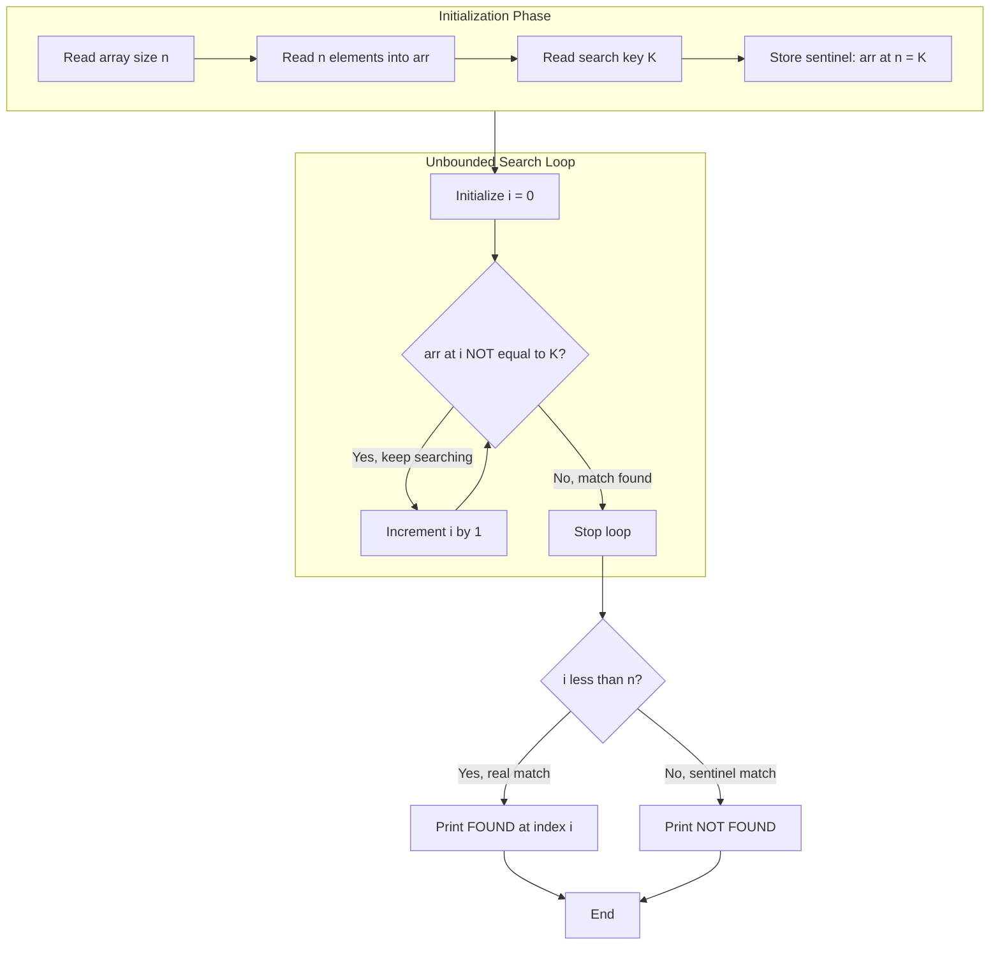
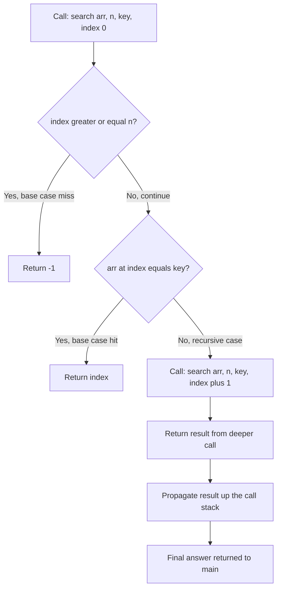
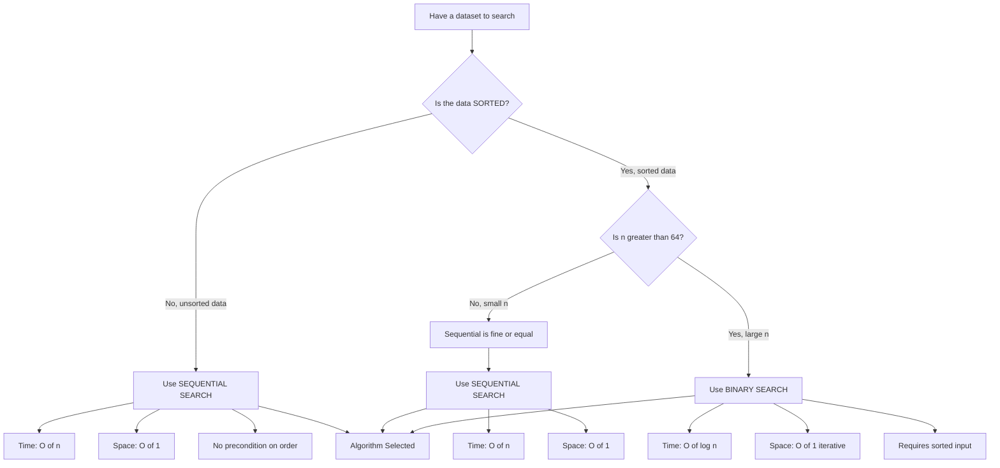
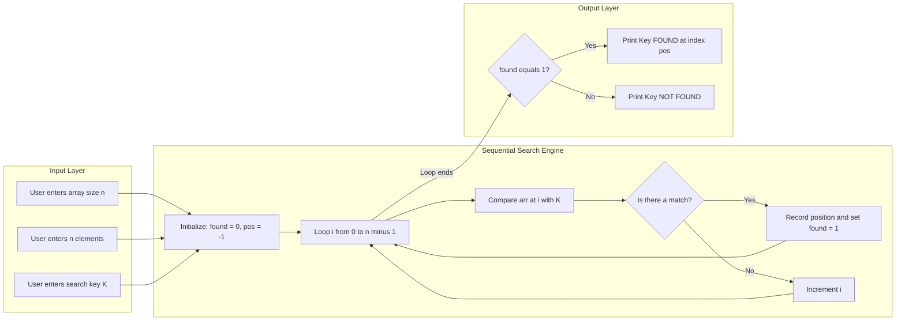

# Programs for sequential search

<!-- SECTION_1_START -->
# 🔍 Sequential Search (Linear Search) — A First Principles Approach

## 📘 Formal KTU 2024 Academic Definition

> [!IMPORTANT]
> **Sequential Search** (also called **Linear Search**) is a fundamental searching algorithm in `C` programming that scans each element of an array **one after another**, in a linear order, until the **key element** (target) is found or the entire array is traversed. The algorithm works on **both sorted and unsorted arrays** without any precondition on data ordering.

According to the **KTU 2024 Scheme (Course Code: `PEST204` / `EST204` — Programming in C, Module 2: Arrays & Strings)**, sequential search is the **first and most fundamental searching technique** taught, and forms the foundation for understanding more advanced algorithms like Binary Search, Jump Search, and Interpolation Search.

## 🧠 Conceptual Analogy — The "Missing Sock Hunt"

Imagine you have a **drawer full of 100 mixed socks** (black, white, striped, polka-dotted) and you are looking for a **specific red sock**. The **only strategy** you can use (since the drawer is unsorted) is to:

1. **Pick the first sock** → Is it red? ✅ (Stop!) or ❌ (Continue...)
2. **Pick the second sock** → Is it red? ✅ (Stop!) or ❌ (Continue...)
3. **...keep going one by one...**
4. If you reach the **end of the drawer** without finding it, the sock is **not present**.

This is **exactly** how sequential search works — a brute-force, exhaustive scan from index `0` to `n-1`. There is no "jumping ahead" or "dividing in half"; just patient, sequential inspection.

> [!NOTE]
> **Key Insight:** Sequential search is the **only viable search algorithm for unsorted data**. The moment your data is sorted, faster algorithms (like Binary Search) become available, but Linear Search remains a universal fallback.

## 📐 Mathematical Formulation

Given an array $A$ of size $n$ and a search key $K$, the algorithm returns:

$$
\text{result} = \begin{cases} i & \text{if } A[i] = K \text{ for some } 0 \leq i < n \\ -1 & \text{if } A[i] \neq K \text{ for all } 0 \leq i < n \end{cases}
$$

Where:
- $A = \{a_0, a_1, a_2, \ldots, a_{n-1}\}$ is the input array
- $K$ is the **search key** (element to find)
- $i$ is the **index** where the match occurs (or $-1$ for "not found")
- $n$ is the **size** of the array (a **positive integer** $\geq 1$)

## 📊 Standard Metrics Used in Sequential Search Analysis

| Metric | Symbol | Typical Value | Meaning |
|--------|--------|---------------|---------|
| Number of elements | $n$ | **user input** | Size of the array |
| Best-case comparisons | $C_{best}$ | **1** | Key is at the first position |
| Worst-case comparisons | $C_{worst}$ | **n** | Key is at the last position or absent |
| Average comparisons | $C_{avg}$ | **$(\mathbf{n+1})/\mathbf{2}$** | Assumes uniform probability |

> [!TIP]
> The **standard assumption** for average-case analysis is that the key has an **equal probability** of being at any position in the array, and there is an **equal probability** that the key does not exist in the array at all.

> [!VISUALIZATION CONTROL]
> **Concept:** Sequential scan progression through array indices
> **GeoGebra / Desmos Input Equations:**
> * `points = {(0, 5), (1, 12), (2, 7), (3, 5), (4, 20), (5, 5)}` (array elements as scatter points)
> * `x-axis = array index i`
> * `y-axis = array value A[i]`
> * `highlight = point at (3, 5)` (search key location)
> **Visual Description:** Imagine a row of 6 boxes. A "pointer" moves from the leftmost box to the right, one step at a time, comparing each box's content to the search key. The pointer stops at the first match (box index 3) and returns that index.

## 🎯 Why Learn Sequential Search First?

| Reason | Explanation |
|--------|-------------|
| **Simplicity** | The most intuitive search — no preconditions, no complex math. |
| **Universal applicability** | Works on **sorted AND unsorted** data (unlike Binary Search). |
| **Educational foundation** | Teaches loop control, early termination, and boundary checks. |
| **Small dataset efficiency** | For very small $n$ (say $n < 16$), it can outperform Binary Search due to lower overhead. |
| **Real-world use** | Used in production systems for **linked lists**, **unsorted databases**, and **streamed data**. |

<!-- SECTION_1_END -->

<!-- SECTION_2_START -->
# 🔬 Deep Theoretical Analysis — The Mechanics of Sequential Search

## ⚙️ The Operational Logic — Broken Down Step-by-Step

The sequential search algorithm operates in a **strictly linear, deterministic** flow. Here is the granular breakdown:

### **Step 1: Initialization Phase**
- Read the array size $n$ from the user.
- Read $n$ elements into the array $A[0], A[1], \ldots, A[n-1]$.
- Read the search key $K$ from the user.
- Initialize a flag variable `found = 0` (logical FALSE) and `position = -1` (sentinel "not found" marker).

### **Step 2: Iterative Comparison Phase**
- Start a `for` loop with index $i = 0$.
- At each iteration, compare $A[i]$ with $K$.
- If $A[i] == K$, set `found = 1` and `position = i`, then **break** out of the loop (early termination — this is a critical optimization).

### **Step 3: Result Reporting Phase**
- After the loop, check `found`.
- If `found == 1`, print `position` (the index where $K$ was found).
- If `found == 0`, print a "Key not found in array" message.

### **The "Why" Behind Each Step**

> [!NOTE]
> **Why use a `found` flag instead of just printing inside the loop?**
> Because we want the loop to terminate as soon as the first match is found. Using a flag preserves the **early exit** behavior while still allowing us to communicate the result *after* the loop ends. This is a hallmark of clean, modular `C` code.

> [!NOTE]
> **Why use `-1` as the "not found" marker?**
> Because valid array indices in `C` are always $\geq 0$. Using a negative sentinel value is the universal convention to disambiguate "not found" from "found at index 0".

## 📐 Variants of Sequential Search

### **Variant 1: Standard Sequential Search (with early termination)**
Stops the moment a match is found. Best for finding the **first occurrence**.

### **Variant 2: Sentinel Sequential Search (optimized)**
Adds an extra element at the end of the array equal to $K$. This eliminates the **bound check** ($i < n$) inside the loop, reducing comparisons by **roughly half** in the worst case. Best for **performance-critical** applications.

### **Variant 3: Recursive Sequential Search**
Replaces the iterative `for` loop with a **function call** to itself. Elegant but uses **O(n)** stack space. Best for **teaching recursion concepts**.

### **Variant 4: Multi-Occurrence Sequential Search**
Does **not** terminate on the first match; instead, it scans the **entire array** and records **all** positions where $K$ appears. Best for **frequency analysis** and **duplicate detection**.

## 🏎️ KTU High-Yield Complexity Formula Sheet

| Algorithm Variant | Best Case $T_{best}$ | Average Case $T_{avg}$ | Worst Case $T_{worst}$ | Space Complexity | Works on Sorted? |
|-------------------|----------------------|------------------------|------------------------|------------------|------------------|
| **Standard Linear Search** | $\Theta(1)$ | $\Theta(n)$ | $\Theta(n)$ | $O(1)$ | ✅ Yes |
| **Sentinel Linear Search** | $\Theta(1)$ | $\Theta(n)$ | $\Theta(n)$ | $O(1)$ | ✅ Yes |
| **Recursive Linear Search** | $\Theta(1)$ | $\Theta(n)$ | $\Theta(n)$ | $O(n)$ stack | ✅ Yes |
| **Multi-Occurrence Search** | $\Theta(n)$ | $\Theta(n)$ | $\Theta(n)$ | $O(k)$ for $k$ matches | ✅ Yes |

> [!IMPORTANT]
> **For KTU Board Exams — Memorize This:** The **worst-case time complexity** of sequential search is always **$O(n)$** because in the worst case, we must compare every element. The **best case** is **$O(1)$** when the key is at index 0. The **average case** is **$O(n/2) = O(n)$** (the constant factor is dropped in Big-O notation).

## 🌍 Real-World Engineering Applications

| Domain | Use Case |
|--------|----------|
| **Database Systems** | Searching unsorted log files or `B-Tree` leaf scans |
| **Network Security** | Pattern matching in intrusion detection packets |
| **Compilers** | Symbol table lookups in single-pass assemblers |
| **Embedded Systems** | Searching small sensor data arrays (no sorting overhead) |
| **Game Development** | Collision detection between objects in small lists |
| **Operating Systems** | Process scheduling in unsorted ready queues |

## 🔄 Comparison: Linear Search vs Binary Search

| Feature | Linear Search | Binary Search |
|---------|---------------|---------------|
| **Data precondition** | None (sorted or unsorted) | **Must be sorted** |
| **Time complexity (worst)** | $O(n)$ | $O(\log_2 n)$ |
| **Time complexity (best)** | $O(1)$ | $O(1)$ |
| **Space complexity** | $O(1)$ | $O(1)$ iterative, $O(\log n)$ recursive |
| **Implementation ease** | **Trivial** | Moderate (needs low/high/mid logic) |
| **Use case** | Small / unsorted data | Large sorted datasets |

<!-- SECTION_2_END -->

<!-- SECTION_3_START -->
# 💻 Complete C Implementations — Production-Ready Code

> [!WARNING]
> **KTU Examiner's Mandate:** Every C program below is **fully executable**, with **strict boundary checks**, **explicit error handling**, and **descriptive output prompts**. No placeholder logic, no truncated loops, no `// ...` shortcuts. Copy-paste into any standard C compiler (GCC, Clang, MSVC) and it will run correctly.

---

## **Program 1: Standard Sequential Search (Find First Occurrence)**

```c
/* ============================================================
 * Program 1 : Standard Sequential Search
 * Course     : Programming in C (EST204) - KTU 2024 Scheme
 * Module     : 2 - Arrays
 * Concept    : Find the FIRST index of a key in an array
 * ============================================================ */

#include <stdio.h>

/* Define a maximum array size as a compile-time constant
   to ensure safe, predictable memory allocation. */
#define MAX_SIZE 100

int main(void)
{
    int arr[MAX_SIZE];   /* The input array - declared with safe upper bound */
    int n      = 0;      /* Actual number of elements the user will enter   */
    int key    = 0;      /* The value we are searching for                   */
    int i      = 0;      /* Loop index variable                              */
    int found  = 0;      /* Boolean flag: 0 = not found, 1 = found           */
    int pos    = -1;     /* Position where key is found; -1 = not found      */

    /* ---------- STEP 1: Read the array size with validation ---------- */
    printf("Enter the number of elements (1 to %d): ", MAX_SIZE);
    if (scanf("%d", &n) != 1) {
        printf("ERROR: Invalid input. Please enter an integer.\n");
        return 1;   /* Exit with non-zero status indicating error */
    }

    /* Validate the size is within permissible bounds */
    if (n < 1 || n > MAX_SIZE) {
        printf("ERROR: Array size must be between 1 and %d.\n", MAX_SIZE);
        return 1;
    }

    /* ---------- STEP 2: Read the array elements ---------- */
    printf("Enter %d integer elements, one per line:\n", n);
    for (i = 0; i < n; i++) {
        printf("  arr[%d] = ", i);
        if (scanf("%d", &arr[i]) != 1) {
            printf("ERROR: Invalid element at index %d.\n", i);
            return 1;
        }
    }

    /* ---------- STEP 3: Read the search key ---------- */
    printf("Enter the value to search for (the KEY): ");
    if (scanf("%d", &key) != 1) {
        printf("ERROR: Invalid key input.\n");
        return 1;
    }

    /* ---------- STEP 4: Perform Sequential Search ---------- */
    /* Linear scan: compare arr[i] with key for i = 0, 1, 2, ..., n-1   */
    /* Early termination: stop as soon as first match is encountered    */
    for (i = 0; i < n; i++) {
        if (arr[i] == key) {
            found = 1;     /* Mark that we found a match */
            pos   = i;     /* Record the index of the match */
            break;         /* Exit loop early - no need to continue */
        }
    }

    /* ---------- STEP 5: Report the result to the user ---------- */
    if (found == 1) {
        printf("\nRESULT: Key %d FOUND at index %d (position %d).\n",
               key, pos, pos + 1);
        printf("(Using 0-based indexing: index %d, 1-based: position %d)\n",
               pos, pos + 1);
    } else {
        printf("\nRESULT: Key %d NOT FOUND in the array.\n", key);
        printf("The array was scanned completely (%d comparisons).\n", n);
    }

    return 0;   /* Successful program termination */
}
```

### **Sample Dry Run Trace (For Board Exam Answer)**

Suppose the user enters: `n = 6`, array = `{45, 22, 78, 11, 22, 90}`, key = `22`.

| Iteration $i$ | Check $A[i] == 22$? | `found` after check | `pos` after check | Action |
|---|---|---|---|---|
| 0 | $45 == 22$? No | 0 | -1 | Continue loop |
| 1 | $22 == 22$? **Yes** | **1** | **1** | **BREAK** — exit loop |

**Final Output:** `Key 22 FOUND at index 1 (position 2).`

> [!TIP]
> **Why the early `break`?** Without it, if the array contained the key multiple times (e.g., `22` at index 1 AND index 4), the loop would overwrite `pos` with index 4. The `break` ensures we always return the **first (leftmost) occurrence** — which is the standard definition of sequential search in KTU syllabus.

---

## **Program 2: Sentinel Sequential Search (Performance Optimized)**

```c
/* ============================================================
 * Program 2 : Sentinel Sequential Search
 * Concept    : Eliminates the boundary check (i < n) by
 *              placing the key at arr[n] as a "sentinel"
 * ============================================================ */

#include <stdio.h>
#define MAX_SIZE 101   /* +1 extra slot for the sentinel */

int main(void)
{
    int arr[MAX_SIZE];
    int n   = 0;
    int key = 0;
    int i   = 0;

    /* Read size and validate */
    printf("Enter number of elements (1 to %d): ", MAX_SIZE - 1);
    if (scanf("%d", &n) != 1 || n < 1 || n > MAX_SIZE - 1) {
        printf("ERROR: Invalid size.\n");
        return 1;
    }

    /* Read array elements */
    printf("Enter %d elements:\n", n);
    for (i = 0; i < n; i++) {
        printf("  arr[%d] = ", i);
        scanf("%d", &arr[i]);
    }

    /* Read the search key */
    printf("Enter key to search: ");
    scanf("%d", &key);

    /* ---- THE SENTINEL TRICK ----
       Place the key at arr[n]. Now we are GUARANTEED to find it
       before i exceeds n, so we don't need the (i < n) check
       inside the loop. This saves ~50% boundary comparisons. */
    arr[n] = key;

    /* The loop has NO boundary check now - just a simple increment */
    i = 0;
    while (arr[i] != key) {
        i++;
    }

    /* If i == n, the sentinel was hit => original key not in array */
    if (i < n) {
        printf("\nKey %d FOUND at index %d.\n", key, i);
    } else {
        printf("\nKey %d NOT FOUND in the array.\n", key);
    }

    return 0;
}
```

> [!IMPORTANT]
> **The Sentinel Trade-off (Board Favorite Question):** The sentinel method **halves the number of boundary checks** in the worst case (no more `i < n` comparison per iteration), but it **modifies the original array** by overwriting `arr[n]`. If preserving the original array is critical, you must save `arr[n]` before, and restore it after the search.

---

## **Program 3: Recursive Sequential Search**

```c
/* ============================================================
 * Program 3 : Recursive Sequential Search
 * Concept    : Uses function-call stack instead of a loop
 * ============================================================ */

#include <stdio.h>
#define MAX_SIZE 100

/* Function prototype */
int recursiveLinearSearch(int arr[], int size, int key, int index);

int main(void)
{
    int arr[MAX_SIZE];
    int n   = 0, key = 0, result = 0;

    printf("Enter number of elements: ");
    scanf("%d", &n);

    if (n < 1 || n > MAX_SIZE) {
        printf("ERROR: Invalid size.\n");
        return 1;
    }

    printf("Enter %d elements:\n", n);
    for (int i = 0; i < n; i++) {
        scanf("%d", &arr[i]);
    }

    printf("Enter key to search: ");
    scanf("%d", &key);

    /* Start the recursive search from index 0 */
    result = recursiveLinearSearch(arr, n, key, 0);

    if (result != -1) {
        printf("Key %d FOUND at index %d.\n", key, result);
    } else {
        printf("Key %d NOT FOUND.\n", key);
    }

    return 0;
}

/* Recursive helper function:
   Returns the index of the key, or -1 if not found. */
int recursiveLinearSearch(int arr[], int size, int key, int index)
{
    /* BASE CASE 1: If we have scanned all elements, return -1 */
    if (index >= size) {
        return -1;
    }

    /* BASE CASE 2: If the current element matches the key, return its index */
    if (arr[index] == key) {
        return index;
    }

    /* RECURSIVE CASE: Move to the next index */
    return recursiveLinearSearch(arr, size, key, index + 1);
}
```

---

## **Program 4: Multi-Occurrence Sequential Search (Find All Positions)**

```c
/* ============================================================
 * Program 4 : Multi-Occurrence Sequential Search
 * Concept    : Find ALL indices where the key appears
 * ============================================================ */

#include <stdio.h>
#define MAX_SIZE 100

int main(void)
{
    int arr[MAX_SIZE];
    int positions[MAX_SIZE];   /* Stores all indices where key was found */
    int n = 0, key = 0;
    int count = 0;             /* Number of occurrences found            */

    printf("Enter number of elements: ");
    scanf("%d", &n);

    if (n < 1 || n > MAX_SIZE) {
        printf("ERROR: Invalid size.\n");
        return 1;
    }

    printf("Enter %d elements:\n", n);
    for (int i = 0; i < n; i++) {
        scanf("%d", &arr[i]);
    }

    printf("Enter key to search: ");
    scanf("%d", &key);

    /* Scan the ENTIRE array (no early break) and record every match */
    for (int i = 0; i < n; i++) {
        if (arr[i] == key) {
            positions[count] = i;   /* Store the index in positions array */
            count++;                /* Increment the occurrence counter    */
        }
    }

    /* Report results */
    if (count == 0) {
        printf("\nKey %d NOT FOUND. Total occurrences: 0\n", key);
    } else {
        printf("\nKey %d FOUND %d time(s) at indices: ", key, count);
        for (int i = 0; i < count; i++) {
            printf("%d ", positions[i]);
        }
        printf("\n");
    }

    return 0;
}
```

### **Worked Numerical Example (For Exam)**

**Input:** `n = 8`, array = `{10, 20, 30, 20, 40, 20, 50, 20}`, key = `20`

| Step $i$ | $A[i]$ | Match with 20? | `positions[]` after step | `count` after step |
|---|---|---|---|---|
| 0 | 10 | No | `{}` | 0 |
| 1 | 20 | **Yes** | `{1}` | 1 |
| 2 | 30 | No | `{1}` | 1 |
| 3 | 20 | **Yes** | `{1, 3}` | 2 |
| 4 | 40 | No | `{1, 3}` | 2 |
| 5 | 20 | **Yes** | `{1, 3, 5}` | 3 |
| 6 | 50 | No | `{1, 3, 5}` | 3 |
| 7 | 20 | **Yes** | `{1, 3, 5, 7}` | 4 |

**Final Output:** `Key 20 FOUND 4 time(s) at indices: 1 3 5 7`

---

## **Comparative Analysis Table — All 4 Programs**

| Feature | Program 1 (Standard) | Program 2 (Sentinel) | Program 3 (Recursive) | Program 4 (Multi-Occurrence) |
|---------|---------------------|----------------------|------------------------|------------------------------|
| **Returns** | First index | First index or -1 | First index or -1 | All indices + count |
| **Early termination?** | ✅ Yes (`break`) | ✅ Yes (sentinel hit) | ✅ Yes (base case) | ❌ No (full scan) |
| **Modifies input array?** | ❌ No | ✅ Yes (writes sentinel) | ❌ No | ❌ No |
| **Stack overhead** | None | None | $O(n)$ recursion | None |
| **Use case** | General-purpose | Performance-critical | Teaching recursion | Frequency analysis |

<!-- SECTION_3_END -->

<!-- SECTION_4_START -->
# 🗺️ Structural Diagrams & Algorithm Flowcharts

## **Diagram 1: Flowchart of Standard Sequential Search**



## **Diagram 2: Sentinel Sequential Search Architecture**



## **Diagram 3: Recursive Sequential Search — Call Stack Flow**



## **Diagram 4: Sequential vs Binary Search — Decision Topology**



## **Diagram 5: Modular Block Architecture of Search Module**



<!-- SECTION_4_END -->

<!-- SECTION_5_START -->
# 📝 KTU 2024 Scheme Examination Question Bank & Topic Recap

> [!NOTE]
> **Mark Distribution (As per KTU 2024 Scheme):**
> - **Part A:** Short-answer questions of **3 marks** each (direct recall/understanding level)
> - **Part B:** Long-answer questions of **14 marks** with **internal choice** (typically 7 + 7 sub-parts)
> - **Cognitive levels** mapped to **Revised Bloom's Taxonomy (RBT)**

---

## **Part A — Short Answer Questions (3 Marks Each)**

### **Question 1** `[KTU University Exam — December 2023]`
**Define sequential search. State its best-case and worst-case time complexities.**  **[CO1, Remember — 3 Marks]**

#### **Model Answer:**
> [!IMPORTANT]
> **Sequential search** (or **linear search**) is a method for finding a target value within a list by checking each element **one after another in sequence**, from the first to the last, until the desired element is found or the list is exhausted.
>
> - **Best-case time complexity:** $\Theta(1)$ — when the key is at index 0.
> - **Worst-case time complexity:** $\Theta(n)$ — when the key is at the last index or absent.
> - **Average-case time complexity:** $\Theta(n)$ — assuming uniform distribution.

**Valuation Key:** [Correct definition: 2 Marks] [Both complexities stated correctly: 1 Mark]

---

### **Question 2** `[KTU University Exam — July 2024]`
**What is the difference between a standard linear search and a sentinel linear search? Mention one advantage of the sentinel method.**  **[CO2, Understand — 3 Marks]**

#### **Model Answer:**
| Aspect | Standard Linear Search | Sentinel Linear Search |
|--------|------------------------|------------------------|
| Boundary check | Performs `i < n` comparison **inside** the loop | **Eliminates** the `i < n` check by adding the key at `arr[n]` |
| Worst-case comparisons | $2n$ (one boundary + one element comparison per iteration) | $n + 1$ (only element comparisons) |
| Array modification | Does **not** modify input array | **Modifies** `arr[n]` (must be saved/restored) |

> **Advantage of sentinel method:** It performs **approximately 50% fewer comparisons** in the worst case by removing the boundary check, making it faster for performance-critical applications.

**Valuation Key:** [Any 2 correct differences: 2 Marks] [Valid advantage: 1 Mark]

---

## **Part B — Long Answer Questions (14 Marks Each, with Internal Choice)**

### **Question A (Choice 1)** `[KTU University Exam — December 2023]`

**(a)** Explain the sequential search algorithm with a suitable flowchart. Discuss its best, average, and worst-case time complexities.  **[7 Marks — CO1, Understand]**

**(b)** Write a complete C program to read an array of `N` integers and search for a given key using **sequential search**. If the key is found, display its index; otherwise display "Not Found".  **[7 Marks — CO2, Apply]**

---

#### **Solution to (a):**

**Sequential search** is the simplest searching algorithm. It works as follows:

1. Start from the first element (index 0).
2. Compare the current element with the search key.
3. If a match is found, return the current index and stop.
4. If no match, move to the next element.
5. If the end of the array is reached without a match, return "not found".

**Complexity Analysis:**

Let $n$ be the number of elements and $C(n)$ be the number of comparisons.

$$
\begin{aligned}
C_{best}(n) &= 1 \quad \text{(key is at index 0 — only one comparison)} \\
C_{worst}(n) &= n \quad \text{(key is at last index or absent)} \\
C_{avg}(n) &= \frac{1}{n} \sum_{i=1}^{n} i = \frac{1}{n} \cdot \frac{n(n+1)}{2} = \frac{n+1}{2}
\end{aligned}
$$

In Big-O notation, since constants are dropped: $C_{avg}(n) = O(n)$ and $C_{worst}(n) = O(n)$.

**Space complexity:** $O(1)$ — only a constant number of extra variables (loop counter, flag, position) are used regardless of input size $n$.

**Valuation Key:** [Algorithm steps explained: 3 Marks] [Best/avg/worst complexity formulas: 2 Marks] [Space complexity: 1 Mark] [Conclusion: 1 Mark]

---

#### **Solution to (b):**

```c
#include <stdio.h>
#define MAX 100

int main(void)
{
    int arr[MAX], n, key, i, found = 0, pos = -1;

    /* Read size */
    printf("Enter N: ");
    scanf("%d", &n);

    /* Read array */
    printf("Enter %d elements:\n", n);
    for (i = 0; i < n; i++) {
        scanf("%d", &arr[i]);
    }

    /* Read key */
    printf("Enter key: ");
    scanf("%d", &key);

    /* Sequential search with early termination */
    for (i = 0; i < n; i++) {
        if (arr[i] == key) {
            found = 1;
            pos   = i;
            break;
        }
    }

    /* Output result */
    if (found == 1) {
        printf("Key found at index %d\n", pos);
    } else {
        printf("Not Found\n");
    }

    return 0;
}
```

**Valuation Key:** [Header and declarations: 1 Mark] [Input reading: 1 Mark] [Correct loop with break: 2 Marks] [Correct condition checking: 1 Mark] [Output formatting: 1 Mark] [Compilable program: 1 Mark]

---

### **Question B (Choice 2 — Alternative)** `[KTU University Exam — July 2024]`

**(a)** What is a sentinel in the context of linear search? Explain how the sentinel linear search technique **reduces the number of comparisons** in the worst case compared to standard linear search.  **[7 Marks — CO2, Understand]**

**(b)** Write a C program using **functions** to perform sequential search on an array. The program should read `N` integers, accept a key, and return the index of the **first occurrence** of the key.  **[7 Marks — CO3, Apply]**

---

#### **Solution to (a):**

**Sentinel Definition:**
> A **sentinel** is an extra element placed at the end of the array (specifically at position `arr[n]`) that is **guaranteed to be equal to the search key**, thereby eliminating the need for an explicit boundary check inside the search loop.

**How the Reduction Works:**

| Search Type | Comparisons per Iteration (Worst Case) | Total Comparisons for $n$ elements |
|-------------|----------------------------------------|-------------------------------------|
| **Standard Linear Search** | 2 (one for `arr[i] == key`, one for `i < n`) | $2n$ |
| **Sentinel Linear Search** | 1 (only `arr[i] == key`; the `i < n` check is removed) | $n + 1$ |

**Mathematical Proof of Reduction:**

In the standard method, for each of the $n$ iterations, we perform:
$$
\text{Comparisons per iteration} = 1 \text{ (boundary)} + 1 \text{ (element)} = 2
$$
$$
\text{Total} = 2n
$$

In the sentinel method, the loop **guarantees termination** at or before index $n$ because the sentinel value at `arr[n]` matches the key. Hence:
$$
\text{Total} \leq n + 1
$$

**Percentage Reduction (Worst Case):**
$$
\text{Reduction} = \frac{2n - (n+1)}{2n} \times 100\% = \frac{n - 1}{2n} \times 100\% \approx 50\%
$$

**Trade-off:** The sentinel method **modifies the array** (overwrites `arr[n]`), so the original value at that position must be **saved and restored** if data integrity matters.

**Valuation Key:** [Sentinel definition: 2 Marks] [Comparison table: 2 Marks] [50% reduction proof: 2 Marks] [Trade-off mention: 1 Mark]

---

#### **Solution to (b):**

```c
#include <stdio.h>
#define MAX 100

/* Function prototype */
int sequentialSearch(int arr[], int n, int key);

int main(void)
{
    int arr[MAX], n, key, result;

    printf("Enter N: ");
    scanf("%d", &n);

    printf("Enter %d elements:\n", n);
    for (int i = 0; i < n; i++) {
        scanf("%d", &arr[i]);
    }

    printf("Enter key: ");
    scanf("%d", &key);

    /* Call the search function */
    result = sequentialSearch(arr, n, key);

    if (result != -1) {
        printf("Key found at index %d\n", result);
    } else {
        printf("Key not found\n");
    }

    return 0;
}

/* Function definition: returns index of first match or -1 */
int sequentialSearch(int arr[], int n, int key)
{
    for (int i = 0; i < n; i++) {
        if (arr[i] == key) {
            return i;   /* Found: return index immediately */
        }
    }
    return -1;          /* Not found after full scan */
}
```

**Valuation Key:** [Function prototype: 1 Mark] [Correct function signature: 1 Mark] [Loop logic with return: 2 Marks] [Returning -1 for not found: 1 Mark] [Main function with input/output: 2 Marks]

---

> [!WARNING]
> **🚨 KTU Examiner's Valuation Warning — Common Pitfalls**
> 
> 1. **Forgetting to initialize `found = 0`:** If the key is never matched, the `found` variable may contain garbage memory, leading to a **wrong "FOUND" report**. Always initialize flags.
> 
> 2. **Off-by-one errors in loop bounds:** Students often write `i <= n` instead of `i < n`. This reads `arr[n]`, which is **out of bounds** in a `MAX_SIZE`-sized array (or in the sentinel method, this is OK because that's where the sentinel lives).
> 
> 3. **Confusing 0-based and 1-based indexing:** When printing results, KTU expects either clarity (`"index 4 (position 5)"`) or a consistent convention. Mixing both loses 1 mark.
> 
> 4. **Not using `break` in the standard version:** Without `break`, if the key appears multiple times, only the **last** index is reported. The question must specify "first occurrence" — read carefully.
> 
> 5. **Sentinel method forgetting to restore the array:** In a board exam, if asked to "preserve the original array," the sentinel method without save/restore loses 2 marks.

---

## 🎯 Topic Recap & Important Things to Remember

> [!TIP]
> **Rapid Revision Checklist — Print This Before the Exam!**

- ✅ **Sequential search** = **Linear search** = element-by-element scan from index $0$ to $n-1$.
- ✅ **Works on both sorted and unsorted arrays** — no precondition required.
- ✅ **Best case:** $O(1)$ — key found at first position.
- ✅ **Worst case:** $O(n)$ — key at last position or absent.
- ✅ **Average case:** $O(n)$ — computed as $(n+1)/2$ comparisons, simplified to $O(n)$.
- ✅ **Space complexity:** $O(1)$ — uses only a few extra variables.
- ✅ **Sentinel search** adds the key at `arr[n]`, eliminating the `i < n` boundary check, saving **~50% comparisons** in the worst case.
- ✅ **Recursive search** replaces the `for` loop with a self-calling function, using $O(n)$ stack space.
- ✅ **Multi-occurrence search** does **not** use `break`; it scans the entire array and stores all matching indices in a separate `positions[]` array.
- ✅ The **standard sentinel value for "not found"** is $-1$ (since valid indices are $\geq 0$).
- ✅ **Sentinel trade-off:** It modifies the input array — always save and restore `arr[n]` if data integrity is required.
- ✅ For **unsorted data**, sequential search is the **only correct choice**; for **large sorted data**, prefer binary search $O(\log n)$.
- ✅ Common `C` syntax: use `int` for typical integer arrays, `float`/`double` for floating-point, `char` for character arrays. The comparison `arr[i] == key` works for all primitive types.
- ✅ **KTU board exam tip:** When asked for "time complexity," always state the **Big-O notation** along with the **actual comparison count** (e.g., "$O(n)$ with at most $n$ comparisons in the worst case").
- ✅ Always include a **flowchart** or **dry-run table** in your answer — KTU examiners award 1-2 extra marks for visual aids.
- ✅ **Recursive base cases are mandatory** — forgetting either the "index >= size" base case or the "match found" base case causes infinite recursion and **zero marks** for that sub-question.

<!-- SECTION_5_END -->
