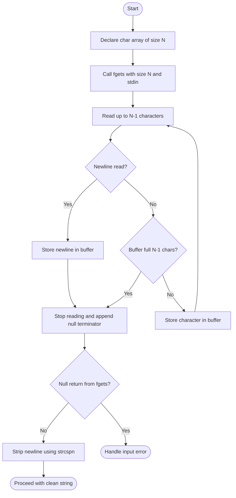
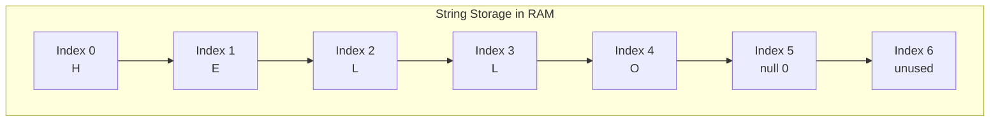
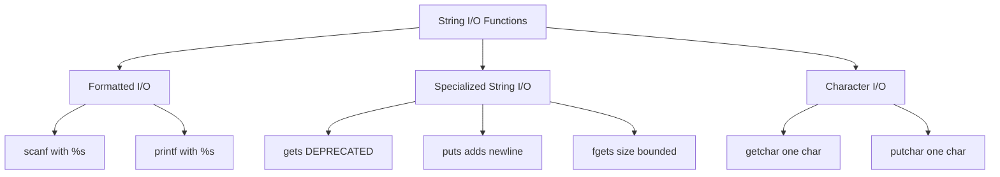
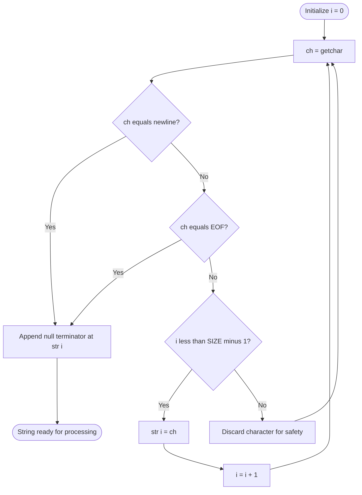
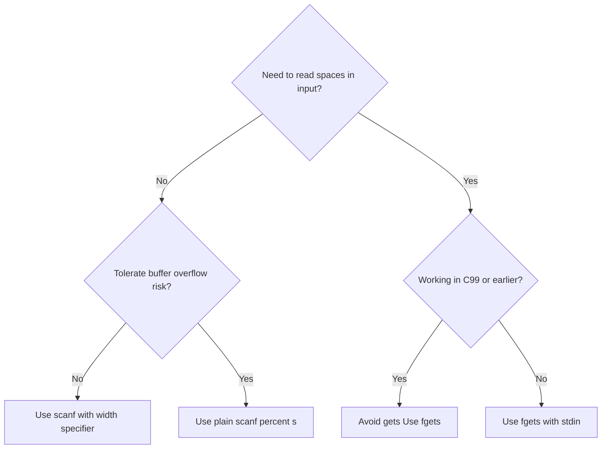

# Reading and displaying strings

<!-- SECTION_1_START -->
# Reading and Displaying Strings in C

## 1. Core Technical Definition

A **string** in the C programming language is defined as a **one-dimensional array of characters terminated by a null character** `'\0'`. According to the **ANSI C (ISO/IEC 9899:2011)** standard, a string is a contiguous sequence of characters terminated by and including the first null character. The null terminator `'\0'` occupies **one byte** of storage and has the **ASCII value 0**. It signals the logical end of the string to all standard library string-handling functions.

> [!IMPORTANT]
> **KTU 2024 Syllabus Highlight:** In C, strings are NOT a primitive data type. They are simply **character arrays** that follow the convention of being terminated by a `'\0'`. This is the single most important concept for scoring marks in this module.

The general syntax for declaring a string is:
```c
char string_name[size];
```

Where `size` represents the **maximum number of characters** the array can store, including the terminating null character. Therefore, a string declared as `char name[30]` can safely store up to **29 visible characters** plus the **null terminator**.

> [!NOTE]
> **Standard Constants Used in String Operations:**
> - **Null character:** `'\0'` — ASCII value **0** (decimal)
> - **Newline:** `'\n'` — ASCII value **10** (decimal)
> - **Carriage return:** `'\r'` — ASCII value **13** (decimal)
> - **End-of-File (EOF):** typically **-1** as returned by `getchar()`

## 2. Conceptual Analogy / Intuition

Imagine a **train of identical boxcars** parked in a railway yard. Each boxcar holds exactly **one letter** of a name, like "A-N-U". The train doesn't have a length marker painted on its side. Instead, the railway worker parks a **bright red flag car** right after the last letter. Whenever anyone inspects the train, they walk car by car and **stop as soon as they see the red flag car** — they never count the cars in advance.

In this analogy:
- The **boxcars** are the `char` slots in the array.
- The **letters** are the actual characters you type.
- The **red flag car** is the **null character `'\0'`**.
- The **railway worker** represents every C string function (`printf`, `strlen`, `strcpy`, etc.) which always reads sequentially until it sees the flag.

Without the red flag (null terminator), the worker would keep walking past the train into random territory, causing **undefined behaviour** — this is exactly what happens in C when you forget the `'\0'`.

## 3. Memory Layout of a String

Consider the declaration:
```c
char greeting[6] = {'H', 'e', 'l', 'l', 'o', '\0'};
```

| Index | 0 | 1 | 2 | 3 | 4 | 5 |
|:---:|:---:|:---:|:---:|:---:|:---:|:---:|
| Character | H | e | l | l | o | \0 |
| ASCII Value | 72 | 101 | 108 | 108 | 111 | 0 |

The size of the array must always be at least `length_of_string + 1` to accommodate the null terminator.

## 4. Initialization Methods

C provides **three** standard ways to initialize a string:

```c
// Method 1: Character-by-character array initialization
char s1[6] = {'H', 'e', 'l', 'l', 'o', '\0'};

// Method 2: String literal (compiler auto-appends '\0')
char s2[6] = "Hello";

// Method 3: Size inferred from initializer
char s3[] = "Hello";
```

> [!CAUTION]
> A very common **KTU examiner pitfall**: `char s[] = {'H','e','l','l','o'};` is **NOT** a string — it is just a character array of length 5 with no terminator. Functions like `printf("%s", s)` invoked on this will print garbage characters until a `'\0'` is randomly encountered in memory.

## 5. Visualization of String Storage

> [!VISUALIZATION CONTROL]
> **Concept:** Memory map of a string array showing indices, characters, and ASCII values
> **GeoGebra / Desmos Input Equations:** Not applicable (conceptual memory layout)
> **Visual Description:** Picture a horizontal row of contiguous byte-sized cells indexed from 0 onwards. The first `n` cells hold visible characters, and the cell immediately after holds the null character (ASCII 0). Any function reading the string will halt exactly at the cell containing zero.

## 6. Fundamental String Constants Recap

| Constant | Symbol | ASCII Value | Bytes |
|:---|:---:|:---:|:---:|
| Null terminator | `'\0'` | **0** | 1 |
| Newline | `'\n'` | **10** | 1 |
| Carriage return | `'\r'` | **13** | 1 |
| End of File | `EOF` | **-1** | N/A (macro) |

<!-- SECTION_1_END -->

<!-- SECTION_2_START -->
# Deep Theoretical Analysis & KTU High-Yield Formula Sheet

## 1. Classification of String I/O Operations

In C, reading strings from standard input (`stdin`) and writing them to standard output (`stdout`) can be performed using **three categories** of functions:

### Category A — Formatted I/O Functions
| Function | Header | Purpose |
|:---|:---|:---|
| `scanf("%s", str)` | `stdio.h` | Reads a whitespace-delimited word |
| `printf("%s", str)` | `stdio.h` | Prints a string until `'\0'` is hit |

### Category B — Specialized String I/O Functions
| Function | Header | Purpose |
|:---|:---|:---|
| `gets(str)` | `stdio.h` | **(Deprecated & removed in C11)** Reads a line including spaces |
| `puts(str)` | `stdio.h` | Prints a string and automatically appends a newline |
| `fgets(str, n, stdin)` | `stdio.h` | Safe line-reading function with size limit |

### Category C — Character I/O Functions
| Function | Header | Purpose |
|:---|:---|:---|
| `getchar()` | `stdio.h` | Reads exactly one character from input |
| `putchar(ch)` | `stdio.h` | Writes exactly one character to output |

## 2. Detailed Analysis of `scanf("%s", str)`

The `%s` format specifier instructs `scanf` to read a sequence of **non-whitespace characters** until the next whitespace character (space, tab, or newline) is encountered. `scanf` automatically appends a `'\0'` to the array after the last non-whitespace character.

**Operational Steps:**
1. Skip leading whitespace characters.
2. Read characters one by one into the array.
3. Stop reading when whitespace or EOF is encountered.
4. Replace the whitespace character with `'\0'`.
5. The whitespace character remains in the input buffer for the next read operation.

> [!WARNING]
> **KTU Examiner's Critical Pitfall:** `scanf("%s", str)` performs **NO bounds checking**. If the user types more than `size - 1` characters, a **buffer overflow** occurs, corrupting adjacent memory. This is the single most common reason students lose marks on Module 2 questions. The C11 standard recommends `scanf("%29s", str)` to limit input width, where `29 = size - 1`.

## 3. Detailed Analysis of `gets(str)`

The `gets()` function reads a full line of text (including spaces) from `stdin` until a newline is found. It replaces the newline with a `'\0'`.

> [!IMPORTANT]
> **KTU 2024 Important Note:** The `gets()` function was **officially removed from the C standard in C11** because it has no parameter to limit the size of input, making it a guaranteed buffer-overflow hazard. Although older KTU question papers may still reference it, the recommended replacement is **`fgets()`**.

## 4. Detailed Analysis of `fgets(str, n, stdin)`

This is the **safe modern equivalent** of `gets()`. Its three parameters are:
1. `str` — destination array.
2. `n` — maximum number of characters to read **including the terminating null character**.
3. `stdin` — input stream (use `stdin` for keyboard input).

**Behavioural Rules:**
- Reads at most `n - 1` characters.
- Stops reading when a newline is encountered.
- **The newline character IS retained** in the buffer (unlike `gets`).
- Always appends `'\0'` after the last character read.

## 5. Detailed Analysis of `puts(str)`

The `puts()` function writes a string to `stdout` and **automatically appends a newline character** `\n` at the end. It returns a non-negative value on success or `EOF` on failure. It does not require a format specifier.

## 6. Detailed Analysis of `printf("%s", str)`

`printf` with `%s` prints characters from the address pointed to by `str` until it encounters a `'\0'`. Unlike `puts`, it does **NOT** add a newline automatically.

## 7. Character-by-Character I/O: `getchar()` and `putchar()`

These are the most fundamental I/O functions and form the **lowest-level building blocks**. Every higher-level function is essentially implemented as a loop around these two.

- `int getchar(void)` — reads the next character from `stdin`. Returns the character as an `unsigned char` cast to `int`, or `EOF` on end-of-file/error.
- `int putchar(int c)` — writes character `c` to `stdout`. Returns the character written or `EOF` on error.

## 8. KTU Formula Sheet / Cheat Sheet

| Concept | Formula / Rule | Units / Notes |
|:---|:---|:---|
| Required array size | $n_{size} \ge n_{chars} + 1$ | Array size in bytes |
| Memory occupied | $n_{bytes} = n_{size} \times 1$ | Each `char` = 1 byte |
| `scanf` read limit | characters $\le n_{size} - 1$ | Excludes `'\0'` |
| `fgets` read limit | characters $\le n - 1$ | Excludes `'\0'`, but includes `\n` if present |
| `puts` appended char | Always `\n` | After `'\0'` |
| `printf %s` appended char | None | Developer must add `\n` manually |
| Return type of `getchar` | `int` | Allows `EOF` detection |
| ASCII of `'\0'` | **0** | Decimal value |
| ASCII of `'\n'` | **10** | Decimal value |
| ASCII of `'A'` | **65** | Decimal value |
| ASCII of `'a'` | **97** | Decimal value |

## 9. Real-World Engineering Utility

String I/O is foundational in:
- **Operating systems** — command-line argument parsing (`argv[]` in `main`).
- **Network protocol implementations** — parsing HTTP headers, IP addresses.
- **Embedded systems** — receiving UART data character-by-character using `getchar` equivalents.
- **Database engines** — reading and tokenizing query strings.
- **Compilers** — lexical analysis of source code where identifiers and keywords are read as strings.

> [!TIP]
> In production-grade C code (e.g., the Linux kernel, PostgreSQL), you will almost always see `fgets` paired with `strcspn` to strip the trailing newline — a pattern you should memorize for KTU lab exams.

<!-- SECTION_2_END -->

<!-- SECTION_3_START -->
# Step-by-Step Derivations & Code Implementation

## 1. Program 1: Reading and Displaying a String Using `scanf` and `printf`

```c
#include <stdio.h>

int main(void) {
    char name[30];

    printf("Enter your name: ");
    scanf("%29s", name);

    printf("Hello, %s!\n", name);
    return 0;
}
```

**Execution Walkthrough:**
1. The program declares `name` as a character array of size **30 bytes**.
2. `scanf("%29s", name)` reads at most **29 non-whitespace characters** from the keyboard.
3. The remaining 1 byte is reserved for the null terminator.
4. `printf("Hello, %s!\n", name)` prints the string.
5. The `\n` is required because `%s` does not add one automatically.

**Sample Run:**
```
Enter your name: KTUStudent
Hello, KTUStudent!
```

## 2. Program 2: Reading a Full Line Using `fgets` and Displaying with `puts`

```c
#include <stdio.h>
#include <string.h>

int main(void) {
    char line[100];

    printf("Enter a sentence: ");
    if (fgets(line, sizeof(line), stdin) != NULL) {
        // Remove trailing newline if present
        line[strcspn(line, "\n")] = '\0';
        printf("You entered: ");
        puts(line);
    }
    return 0;
}
```

**Line-by-Line Explanation:**
- `fgets(line, sizeof(line), stdin)` reads up to **99 characters** (because `n=100` includes the null terminator slot) and keeps the newline in the buffer.
- `strcspn(line, "\n")` returns the index of the first newline character in `line`.
- Assigning `'\0'` at that index overwrites the newline, giving a clean string.
- `puts(line)` prints the cleaned string and adds a newline automatically.

**Sample Run:**
```
Enter a sentence: Welcome to KTU Kerala
You entered: Welcome to KTU Kerala
```

## 3. Program 3: Reading a String Character by Character Using `getchar`

```c
#include <stdio.h>

int main(void) {
    char str[50];
    int ch;
    int i = 0;

    printf("Enter text (press Enter to finish): ");

    while ((ch = getchar()) != '\n' && ch != EOF) {
        if (i < 49) {  // Bounds checking: leave room for '\0'
            str[i] = (char)ch;
            i++;
        }
    }
    str[i] = '\0';  // Append null terminator manually

    printf("You typed: %s\n", str);
    printf("Length: %d characters\n", i);

    return 0;
}
```

**Logic Breakdown:**
1. `getchar()` returns an `int`, allowing the comparison with `EOF` (value **-1**).
2. The loop continues until the user presses **Enter** (newline) or end-of-file occurs.
3. `if (i < 49)` enforces a strict boundary check to prevent buffer overflow.
4. After the loop, the null terminator is **explicitly** written at position `i`.
5. The total number of stored characters equals `i`.

## 4. Program 4: Reading Multiple Strings and Finding the Longest

```c
#include <stdio.h>
#include <string.h>

int main(void) {
    char words[5][50];
    char longest[50];
    int maxLen = 0;

    printf("Enter 5 words:\n");
    for (int i = 0; i < 5; i++) {
        printf("Word %d: ", i + 1);
        scanf("%49s", words[i]);
        if ((int)strlen(words[i]) > maxLen) {
            maxLen = (int)strlen(words[i]);
            strcpy(longest, words[i]);
        }
    }

    printf("\nThe longest word is: %s\n", longest);
    printf("Length: %d characters\n", maxLen);

    return 0;
}
```

**Key Concepts Demonstrated:**
- **2D character array:** `words[5][50]` stores 5 strings of up to 49 characters each.
- `scanf("%49s", words[i])` reads into the `i`-th row, bounded to 49 characters.
- `strlen` returns the number of characters **excluding** the `'\0'`.
- `strcpy` copies the entire string (including the null terminator).

## 5. Program 5: Displaying a String Vertically Using `putchar`

```c
#include <stdio.h>

int main(void) {
    char word[] = "PROGRAM";
    int i = 0;

    printf("Vertical display of %s:\n", word);
    while (word[i] != '\0') {
        putchar(word[i]);
        putchar('\n');
        i++;
    }
    return 0;
}
```

**Output:**
```
Vertical display of PROGRAM:
P
R
O
G
R
A
M
```

This demonstrates that strings can be processed character-by-character until the **null terminator** is reached.

## 6. Program 6: Counting Vowels in a String (Full Application)

```c
#include <stdio.h>

int main(void) {
    char str[100];
    int vowels = 0, i = 0;

    printf("Enter a string: ");
    fgets(str, sizeof(str), stdin);
    str[strcspn(str, "\n")] = '\0';

    while (str[i] != '\0') {
        char ch = str[i];
        if (ch == 'a' || ch == 'e' || ch == 'i' ||
            ch == 'o' || ch == 'u' ||
            ch == 'A' || ch == 'E' || ch == 'I' ||
            ch == 'O' || ch == 'U') {
            vowels++;
        }
        i++;
    }

    printf("Number of vowels: %d\n", vowels);
    return 0;
}
```

## 7. Program 7: Reversing a String In-Place

```c
#include <stdio.h>
#include <string.h>

int main(void) {
    char str[100];
    int len, i;
    char temp;

    printf("Enter a string: ");
    fgets(str, sizeof(str), stdin);
    str[strcspn(str, "\n")] = '\0';

    len = (int)strlen(str);

    // Swap characters from both ends moving inward
    for (i = 0; i < len / 2; i++) {
        temp = str[i];
        str[i] = str[len - 1 - i];
        str[len - 1 - i] = temp;
    }

    printf("Reversed string: %s\n", str);
    return 0;
}
```

**Mathematical Derivation of the Swap Logic:**
For an index $i$ ranging from $0$ to $\frac{n-1}{2}$ (where $n$ is the string length), the character at position $i$ is swapped with the character at position $n - 1 - i$.

$$\text{swap}(str[i], str[n-1-i]) \quad \text{for} \quad 0 \le i < \lfloor n/2 \rfloor$$

**Sample Trace** for input `"HELLO"` (length 5):
- $i = 0$: swap `H` and `O` → `"OELLH"`
- $i = 1$: swap `E` and `L` → `"OLLEH"`
- $i = 2$: condition $i < 5/2 = 2.5$ fails; loop ends.

Final result: `"OLLEH"` ✓

## 8. Program 8: Safe String Reading with Width Specification in `scanf`

```c
#include <stdio.h>

int main(void) {
    char first[20], last[20];

    printf("Enter first and last name: ");
    if (scanf("%19s %19s", first, last) == 2) {
        printf("First: %s\n", first);
        printf("Last:  %s\n", last);
    } else {
        printf("Invalid input.\n");
    }
    return 0;
}
```

The width specifier `%19s` is the **modern safe idiom**. It tells `scanf` to read at most 19 characters, leaving the 20th byte for `'\0'`.

<!-- SECTION_3_END -->

<!-- SECTION_4_START -->
# Structural Diagrams & Schematics

## 1. Flowchart: String Reading Using `scanf("%s", str)`

```mermaid
flowchart TD
    A([Start]) --> B[Declare char array of size N]
    B --> C[Print prompt message]
    C --> D{Call scanf with format %Ns}
    D --> E[Skip leading whitespace]
    E --> F[Read character by character]
    F --> G{Whitespace or EOF?}
    G -- No --> H[Store character in array]
    H --> I[Increment index]
    I --> F
    G -- Yes --> J[Append null terminator at current position]
    J --> K([Return to main program])
    D -.Error.--> L[Return 0 from scanf]
    L --> M([Handle invalid input])
```

## 2. Flowchart: String Reading Using `fgets`



## 3. Block Diagram: Memory Layout After String I/O



## 4. Comparison Topology: String I/O Functions



## 5. Sequential Processing Topology: Character-by-Character Reading Loop



## 6. Decision Matrix: When to Use Which Function



<!-- SECTION_4_END -->

<!-- SECTION_5_START -->
# KTU 2024 Scheme Examination Question Bank & Topic Recap

## PART A — 3 Mark Questions

### Question 1 [KTU University Exam - July 2024]
**Differentiate between `scanf("%s", str)` and `gets(str)` for reading strings in C.** *(CO1, Remember)*

**Model Answer (Valuation Key):**

| Aspect | `scanf("%s", str)` | `gets(str)` |
|:---|:---|:---|
| Whitespace handling | Stops at first whitespace | Reads full line including spaces |
| Newline handling | Leaves newline in buffer | Consumes and replaces newline with `'\0'` |
| Bounds checking | Only with width specifier | None (inherently unsafe) |
| Status in C11 | Recommended with width | Removed from standard |
| Header file | `stdio.h` | `stdio.h` |

**[1 Mark for each correct distinction, 3 Marks total]**

### Question 2 [KTU University Exam - Dec 2023]
**What is the role of the null character `'\0'` in C strings? Why is it necessary?** *(CO1, Understand)*

**Model Answer:**
- The null character `'\0'` is a special character with **ASCII value 0** that marks the **end of a string** in C. **[1 Mark]**
- Since C strings are stored as character arrays, the compiler needs a sentinel to know where the array's textual content ends and the unused memory begins. **[1 Mark]**
- All standard library functions like `printf("%s", str)`, `strlen(str)`, and `strcpy(dest, src)` rely on the null character to determine string boundaries. Without it, these functions would read past the array, leading to **undefined behaviour**. **[1 Mark]**

---

## PART B — 14 Mark Questions (Module Internal Choice)

### Question A (14 Marks) [KTU University Exam - July 2024]

**(a)** Explain the different ways to initialize a string in C with suitable examples. Discuss why a character array `'H','e','l','l','o'` without a null terminator is not a valid string. *(7 Marks, CO1, Understand)*

**(b)** Write a C program to read a string from the user using `fgets()` and count the number of occurrences of each vowel (a, e, i, o, u) in the string. Display the result. *(7 Marks, CO2, Apply)*

**Model Solution:**

**Part (a) — Initialization Methods:**

Method 1: Character-by-character initialization
```c
char s1[6] = {'H', 'e', 'l', 'l', 'o', '\0'};
```
**[1 Mark]** — Note the explicit `'\0'` is required.

Method 2: String literal with size
```c
char s2[6] = "Hello";
```
**[1 Mark]** — Compiler automatically appends `'\0'`. Size must be at least string length + 1.

Method 3: Size inferred
```c
char s3[] = "Hello";
```
**[1 Mark]** — Compiler calculates size as 6 automatically.

Method 4: Partial initialization
```c
char s4[20] = "Hello";
```
**[1 Mark]** — Remaining 14 bytes are filled with `'\0'`.

**Why `{'H','e','l','l','o'}` is invalid:**
- The array has only 5 elements with no `'\0'`. **[1 Mark]**
- `printf("%s", s)` will print the 5 letters plus whatever garbage exists in subsequent memory until a zero byte is randomly found. **[1 Mark]**
- Functions like `strlen` will return unpredictable values. **[1 Mark]**

**Part (b) — Vowel Counting Program:**
```c
#include <stdio.h>
#include <string.h>

int main(void) {
    char str[100];
    int countA = 0, countE = 0, countI = 0, countO = 0, countU = 0;
    int i = 0;

    printf("Enter a string: ");
    fgets(str, sizeof(str), stdin);
    str[strcspn(str, "\n")] = '\0';

    while (str[i] != '\0') {
        switch (str[i]) {
            case 'a': case 'A': countA++; break;
            case 'e': case 'E': countE++; break;
            case 'i': case 'I': countI++; break;
            case 'o': case 'O': countO++; break;
            case 'u': case 'U': countU++; break;
        }
        i++;
    }

    printf("Vowel counts:\n");
    printf("A/a: %d\n", countA);
    printf("E/e: %d\n", countE);
    printf("I/i: %d\n", countI);
    printf("O/o: %d\n", countO);
    printf("U/u: %d\n", countU);

    return 0;
}
```

**Valuation Key for Part (b):**
- [Including `stdio.h` and `string.h` headers: 1 Mark]
- [Correct `fgets` call with size limit: 1 Mark]
- [Stripping newline using `strcspn`: 1 Mark]
- [Loop iterating until `'\0'`: 1 Mark]
- [Switch-case or if-else logic for vowel detection: 2 Marks]
- [Displaying formatted output: 1 Mark]

### Question B (14 Marks) [KTU University Exam - Dec 2023]

**(a)** Compare and contrast `scanf()`, `gets()`, and `fgets()` for reading strings. Mention the safety implications of each. *(7 Marks, CO1, Understand)*

**(b)** Write a C program to read a string and check whether it is a palindrome. A palindrome is a word that reads the same forwards and backwards (e.g., "madam", "level"). *(7 Marks, CO2, Apply)*

**Model Solution:**

**Part (a) — Comparative Analysis:**

| Feature | `scanf("%s", str)` | `gets(str)` | `fgets(str, n, stdin)` |
|:---|:---|:---|:---|
| Reads whitespace? | No (stops at space) | Yes | Yes |
| Size limit | Optional via width | None | Required parameter |
| Retains newline? | No | No (replaces with `'\0'`) | Yes (keeps `\n` in buffer) |
| Buffer overflow safe? | Risky without width | No (always) | Yes |
| Current C standard | C99/C11/C17 | Removed in C11 | C99/C11/C17 |
| Returns | Number of items read | Pointer to string or NULL | Pointer to string or NULL |

**Safety Implications:** **[2 Marks for the explanation]**
- `gets()` is fundamentally unsafe because it cannot limit the size of input. A malicious user typing 10,000 characters will overflow the buffer and corrupt the program stack — a classic **stack smashing** attack.
- `scanf("%s", str)` is unsafe by default but can be made safe using width specifiers like `%29s` to limit the number of characters read.
- `fgets()` is the safest of the three because the size parameter enforces a hard limit on the bytes written.

**Part (b) — Palindrome Check Program:**
```c
#include <stdio.h>
#include <string.h>

int main(void) {
    char str[100];
    int len, i;
    int isPalindrome = 1;

    printf("Enter a word: ");
    fgets(str, sizeof(str), stdin);
    str[strcspn(str, "\n")] = '\0';

    len = (int)strlen(str);

    for (i = 0; i < len / 2; i++) {
        if (str[i] != str[len - 1 - i]) {
            isPalindrome = 0;
            break;
        }
    }

    if (isPalindrome) {
        printf("%s is a palindrome.\n", str);
    } else {
        printf("%s is NOT a palindrome.\n", str);
    }

    return 0;
}
```

**Trace for input `"madam"`** (length 5):
- $i = 0$: compare `str[0]='m'` with `str[4]='m'` → equal
- $i = 1$: compare `str[1]='a'` with `str[3]='a'` → equal
- $i = 2$: condition $i < 5/2 = 2.5$ fails; loop ends.
- `isPalindrome` remains 1 → prints "madam is a palindrome." ✓

**Valuation Key for Part (b):**
- [Reading string with `fgets` and stripping newline: 2 Marks]
- [Calculating string length: 1 Mark]
- [Loop running up to `len/2`: 1 Mark]
- [Comparison logic using two indices: 1 Mark]
- [Flag variable and break statement: 1 Mark]
- [Correct final output: 1 Mark]

> [!WARNING]
> **KTU Examiner's Valuation Pitfall — Common Mark-Deduction Reasons:**
> 1. **Forgetting to include `<string.h>`** when using `strlen`, `strcpy`, or `strcspn`. Examiner deducts 1 mark for missing header.
> 2. **Not stripping the newline from `fgets`**, leading to incorrect output in palindrome or comparison questions. Examiner deducts 1 mark.
> 3. **Using `==` to compare strings** instead of `strcmp` or character comparison. This is a syntax error and costs 2 marks.
> 4. **Declaring `char str[]`** without specifying a size when reading input, causing undefined behaviour. Examiner deducts 1 mark.
> 5. **Forgetting to write `'\0'`** in a manually constructed string (e.g., character-by-character input loop). Examiner deducts 2 marks.
> 6. **Confusing `puts` (adds newline) with `printf("%s")` (no newline)**, leading to mismatched expected output. Examiner deducts 1 mark.

---

## Topic Recap & Important Things to Remember

- A **string in C** is a **one-dimensional character array terminated by `'\0'`** (ASCII value 0).
- The size of a string array must be **at least `n + 1`**, where `n` is the number of visible characters.
- `char s[] = "Hello"` automatically creates a 6-byte array (5 letters + `'\0'`).
- `scanf("%s", s)` reads **only one word** (stops at whitespace) and does **not** consume the trailing whitespace.
- `scanf("%Ns", s)` is the **safe modern idiom** that limits input to `N` characters.
- `gets(s)` is **deprecated and removed in C11**; never use it in modern C code.
- `fgets(s, n, stdin)` is the **recommended safe replacement**; it reads at most `n-1` characters and **retains the newline** if present.
- `puts(s)` prints the string and **automatically appends a newline** `\n`.
- `printf("%s", s)` prints the string but **does NOT append a newline** — you must add `\n` manually.
- `getchar()` returns an **`int`** (not `char`) so that it can return `EOF` (value **-1**) for end-of-file detection.
- A character array like `{'H','e','l','l','o'}` is **not a valid string** because it lacks `'\0'`.
- Always use `strcspn(s, "\n")` to strip the trailing newline after `fgets`.
- The maximum safe width in `scanf("%Ns", s)` is `N = size - 1` to leave room for the null terminator.
- `strlen(s)` returns the length **excluding** `'\0'`, while `sizeof(s)` returns the total array size **including** `'\0'`.
- Comparison of strings must use `strcmp` from `<string.h>`, never the `==` operator on `char` arrays.
<!-- SECTION_5_END -->
