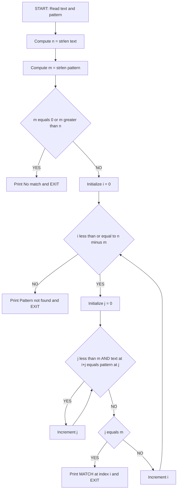
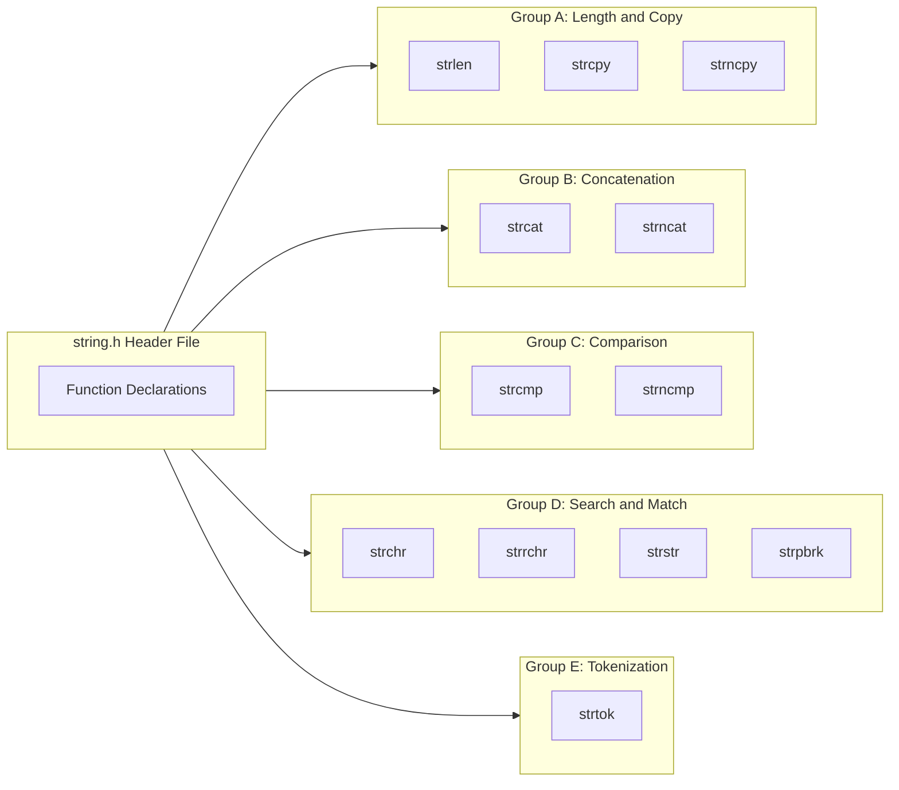
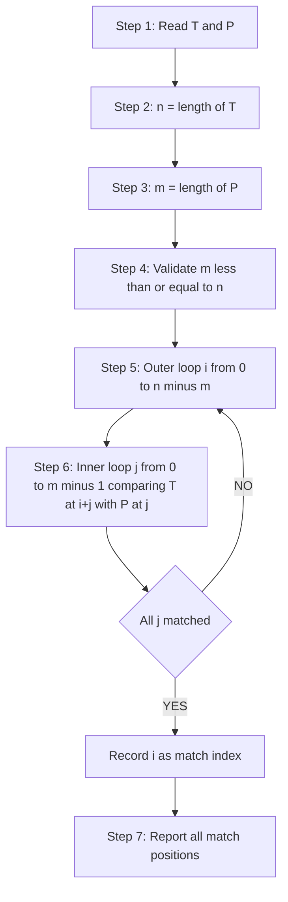
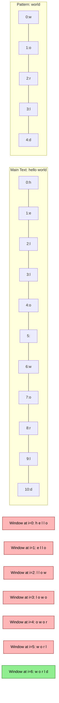

# String related library functions – Programs for string matching.

<!-- SECTION_1_START -->
# String Related Library Functions & Programs for String Matching

## 1.1 Formal Definition (KTU 2024 Syllabus Terminology)

> [!NOTE]
> **String Matching** is the process of locating the occurrence(s) of a **pattern string** (often called the *needle* or *substring*) within a longer **text string** (often called the *haystack* or *main string*). In C, strings are one-dimensional arrays of `char` terminated by the **null character** `'\0'`, and all standard matching operations are performed using the functions declared in the header file `<string.h>`.

**Key Formal Definitions:**

- **String in C** — A null-terminated character array, declared as `char s[size]`, where the last valid element is always the sentinel `'\0'` (ASCII value **0**).
- **Library Function** — A pre-compiled routine provided by the C Standard Library (ISO/IEC 9899) that operates on memory blocks, pointers, or strings.
- **Pattern** — The sequence of characters being searched for.
- **Match Position** — The index in the text where the pattern begins if found, otherwise a special failure value (e.g., `NULL` for `strstr`, a non-zero integer for `strcmp`).

> [!IMPORTANT]
> KTU 2024 Scheme Emphasis (Module 2 — Arrays): Students must be able to (a) recall the prototype, return type, and behavior of every function in `<string.h>` listed in the syllabus, and (b) write complete C programs (without using built-in `strstr` for the matching part) that perform substring search, character search, and pattern counting on user-entered strings.

## 1.2 Conceptual Analogy & Intuition

Imagine you have a **bookshelf of books** and you want to find a specific **sentence** inside one particular book.

- The **bookshelf** is your array of strings.
- The **book** is your *haystack* (main text).
- The **sentence** you are hunting for is your *needle* (pattern).
- Your **finger sliding along the lines** is the index `i` that compares characters one-by-one.

If your sentence is **"rain"** and the book contains the line *"the brain storm"*, you would slide your finger from `t`, then `h`, then `e`... until you reach `b`, at which point you compare `b → r`, then `r → a`, then `a → i`, then `i → n`. All four match → **MATCH FOUND at position 4** (0-indexed).

This sliding-and-comparing action is exactly what every string matching algorithm does at its core.

> [!TIP]
> **Geometric Intuition:** Treat each character as a box placed on a number line at positions $0, 1, 2, \dots, n-1$. A match occurs when a contiguous *window* of length $L$ (the pattern length) has all its boxes identical to the pattern's boxes.

## 1.3 Physical Constants & Standard Metrics

- **Null terminator** `'\0'` has ASCII value **0** and occupies **1 byte**.
- A string of length $n$ characters actually requires **$n + 1$** bytes in memory (for the terminator).
- Standard `<string.h>` functions treat the **first `'\0'`** as the logical end of the string, regardless of array size.

## 1.4 Visualization Callout

> [!VISUALIZATION CONTROL]
> **Concept:** Sliding Window String Matching (Geometric Intuition)
> **Desmos Input Equations (parametric view):**
> * Main string index: $i \in [0,\, 9]$
> * Pattern offset: $j \in [0,\, 3]$
> * Comparison cell: $(x, y) = (i + j,\ \text{match}(i + j, j))$
> **Visual Description:** On the x-axis lay out the main string characters at integer positions. For each starting index $i$, draw a vertical comparison window of width equal to the pattern length. A green window means a full match; a red window means a mismatch.
<!-- SECTION_1_END -->

<!-- SECTION_2_START -->
# Deep Theoretical Analysis & KTU High-Yield Reference Sheet

## 2.1 The `<string.h>` Function Family — Conceptual Breakdown

The C standard library groups string routines by their **operational purpose**. Understanding the "why" behind each group makes recall effortless in exams.

### Group A — Length & Duplication
These functions answer *"How long is it?"* or *"Copy it for me."*

- **`strlen(s)`** — Counts characters until the first `'\0'`. Does **not** include the terminator.
- **`strcpy(dest, src)`** — Copies bytes from `src` to `dest` *including* the `'\0'`. **Unsafe** if `dest` is too small (buffer overflow).
- **`strncpy(dest, src, n)`** — Copies at most $n$ characters. **Does not always null-terminate** if `src` is longer than $n$.

### Group B — Concatenation
- **`strcat(dest, src)`** — Appends `src` to the end of `dest`. Assumes `dest` has enough space.
- **`strncat(dest, src, n)`** — Appends at most $n$ characters, then adds a `'\0'`. Safer.

### Group C — Comparison
- **`strcmp(s1, s2)`** — Lexicographic (dictionary-style) comparison.
  - Returns **0** if equal.
  - Returns a **negative** value if `s1 < s2`.
  - Returns a **positive** value if `s1 > s2`.
- **`strncmp(s1, s2, n)`** — Compares only the first $n$ characters.

### Group D — Search & Match (Core of this Module)
- **`strchr(s, ch)`** — Finds the **first** occurrence of character `ch` in `s`. Returns a pointer to it, or `NULL`.
- **`strrchr(s, ch)`** — Finds the **last** occurrence of character `ch` in `s`.
- **`strstr(s1, s2)`** — Finds the **first** occurrence of substring `s2` inside `s1`. Returns pointer to the start of the match, or `NULL`. This is the **canonical library function for string matching**.
- **`strpbrk(s1, s2)`** — Finds the first character in `s1` that matches **any** character in `s2`.
- **`strspn` / `strcspn`** — Span functions that return the length of initial segments.

### Group E — Tokenization
- **`strtok(s, delim)`** — Splits a string into tokens based on delimiter characters. **Modifies the original string** by inserting `'\0'` between tokens. State is stored internally, so it is **not thread-safe**.

## 2.2 KTU Formula & Reference Cheat Sheet

> [!IMPORTANT]
> The table below contains the **exact prototypes, return values, and behavioural notes** that KTU examiners expect in viva and written exams. Memorize the prototypes verbatim.

| Function | Prototype | Return Value | Key Behaviour / Pitfall |
|---|---|---|---|
| `strlen` | `size_t strlen(const char *s);` | Number of chars before `'\0'` (excludes terminator) | $O(n)$ time, $O(1)$ space |
| `strcpy` | `char *strcpy(char *dest, const char *src);` | Pointer to `dest` | `dest` must be large enough; no length check |
| `strncpy` | `char *strncpy(char *dest, const char *src, size_t n);` | Pointer to `dest` | **May not null-terminate** if `src` length $\geq n$ |
| `strcat` | `char *strcat(char *dest, const char *src);` | Pointer to `dest` | Finds the `'\0'` of `dest` first, then appends |
| `strncat` | `char *strncat(char *dest, const char *src, size_t n);` | Pointer to `dest` | Always adds a trailing `'\0'` |
| `strcmp` | `int strcmp(const char *s1, const char *s2);` | `0` if equal, `<0` or `>0` otherwise | Lexicographic, case-sensitive |
| `strncmp` | `int strncmp(const char *s1, const char *s2, size_t n);` | Same as `strcmp` | Compares first $n$ characters only |
| `strchr` | `char *strchr(const char *s, int c);` | Pointer to first match, or `NULL` | `c` is passed as `int` but treated as `char` |
| `strrchr` | `char *strrchr(const char *s, int c);` | Pointer to last match, or `NULL` | Searches in reverse |
| `strstr` | `char *strstr(const char *haystack, const char *needle);` | Pointer to first occurrence, or `NULL` | **The library workhorse for string matching** |
| `strpbrk` | `char *strpbrk(const char *s1, const char *s2);` | Pointer to first char in `s1` from `s2`, or `NULL` | Used for "any of these" matches |
| `strtok` | `char *strtok(char *str, const char *delim);` | Pointer to next token, or `NULL` | **Modifies input string**; use `NULL` for subsequent calls |

## 2.3 Engineering & Real-World Utility

> [!TIP]
> **Where string matching is used in production systems:**
> - **Search engines** (Google, Elasticsearch) use inverted indexes built on substring/token matching.
> - **Compilers** scan source code for keywords (`int`, `return`, `#include`) using `strcmp`.
> - **Log analyzers** (Splunk, Datadog) match error patterns in millions of log lines.
> - **Bioinformatics** aligns DNA sequences (e.g., BLAST algorithm) — a generalization of string matching.
> - **Intrusion Detection Systems (IDS)** like Snort use string signatures to flag malicious payloads.
> - **Form validators** in web backends check whether an email or URL contains substrings such as `"@"` or `"https://"`.

## 2.4 The Naive String Matching Algorithm — The "Why"

When a KTU exam asks you to *"write a C program to find whether a pattern occurs in a string **without using `strstr`***", you must implement the **naive (brute-force) algorithm**.

**Idea:** Slide the pattern over the main text, one character at a time. At each alignment, compare every character of the pattern with the corresponding character of the text. Stop on the first mismatch and shift by one position.

**Time Complexity:** $O((n - m + 1) \times m)$ in the worst case, where $n$ is the text length and $m$ is the pattern length. This is the expected answer for KTU 2024.
<!-- SECTION_2_END -->

<!-- SECTION_3_START -->
# Step-by-Step Derivations & Code Implementation

## 3.1 Program 1 — Find Length of a String (`strlen` from Scratch)

**Problem Statement:** Write a C program to read a string and find its length without using the library function `strlen`.

**Algorithm Logic Steps:**
1. Declare a `char` array `str[100]`.
2. Initialize an integer counter `len = 0`.
3. Loop using index `i` starting from `0`, incrementing while `str[i] != '\0'`.
4. Inside the loop, increment `len` for every character.
5. Print `len` after the loop terminates.

```c
#include <stdio.h>

int main(void) {
    char str[100];
    int len = 0;
    int i = 0;

    printf("Enter a string: ");
    fgets(str, sizeof(str), stdin);

    while (str[i] != '\0') {
        if (str[i] != '\n') {   /* ignore newline added by fgets */
            len++;
        }
        i++;
    }

    printf("Length of the string = %d\n", len);
    return 0;
}
```

**Step-by-Step Walkthrough (for input `"hello"`):**
- Memory: `'h','e','l','l','o','\n','\0'`
- `i=0`: `'h' != '\0'` and `'h' != '\n'` → `len=1`
- `i=1`: `'e' != '\0'` and `'e' != '\n'` → `len=2`
- `i=2`: `'l' != '\0'` and `'l' != '\n'` → `len=3`
- `i=3`: `'l' != '\0'` and `'l' != '\n'` → `len=4`
- `i=4`: `'o' != '\0'` and `'o' != '\n'` → `len=5`
- `i=5`: `'\n' != '\0'` but `'\n' == '\n'` → `len` unchanged (`5`)
- `i=6`: `'\0' == '\0'` → loop exits.
- **Output:** `Length of the string = 5`.

## 3.2 Program 2 — Copy One String into Another (`strcpy` from Scratch)

```c
#include <stdio.h>

int main(void) {
    char source[100], destination[100];
    int i = 0;

    printf("Enter source string: ");
    fgets(source, sizeof(source), stdin);

    while (source[i] != '\0') {
        destination[i] = source[i];
        i++;
    }
    destination[i] = '\0';   /* critical: terminate destination manually */

    printf("Copied string = %s", destination);
    return 0;
}
```

> [!WARNING]
> **KTU Valuation Pitfall:** Forgetting `destination[i] = '\0';` after the loop is the #1 reason students lose 1 mark. The destination array is **not** automatically null-terminated in C.

## 3.3 Program 3 — Concatenate Two Strings (`strcat` from Scratch)

```c
#include <stdio.h>

int main(void) {
    char s1[200], s2[100];
    int i = 0, j = 0;

    printf("Enter first string : ");
    fgets(s1, sizeof(s1), stdin);
    printf("Enter second string: ");
    fgets(s2, sizeof(s2), stdin);

    while (s1[i] != '\0') {       /* move i to the end of s1 */
        i++;
    }
    /* s1[i] is now the null terminator; we'll overwrite it */
    while (s2[j] != '\0') {
        if (s2[j] != '\n') {
            s1[i] = s2[j];
            i++;
        }
        j++;
    }
    s1[i] = '\0';

    printf("Concatenated string = %s", s1);
    return 0;
}
```

## 3.4 Program 4 — Compare Two Strings (`strcmp` from Scratch)

```c
#include <stdio.h>

int main(void) {
    char s1[100], s2[100];
    int i = 0, diff = 0;

    printf("Enter first string : ");
    fgets(s1, sizeof(s1), stdin);
    printf("Enter second string: ");
    fgets(s2, sizeof(s2), stdin);

    while (s1[i] != '\0' && s2[i] != '\0') {
        if (s1[i] != s2[i]) {
            diff = s1[i] - s2[i];
            break;
        }
        i++;
    }
    /* If both reach '\0' together, strings are equal (diff stays 0) */
    if (diff == 0 && s1[i] == '\0' && s2[i] == '\0') {
        printf("Strings are EQUAL.\n");
    } else if (diff < 0) {
        printf("First string is LESS than second (diff = %d).\n", diff);
    } else {
        printf("First string is GREATER than second (diff = %d).\n", diff);
    }
    return 0;
}
```

## 3.5 Program 5 — String Matching Using `strstr` (Library Method)

```c
#include <stdio.h>
#include <string.h>

int main(void) {
    char text[200], pattern[100];
    char *result = NULL;

    printf("Enter the main text   : ");
    fgets(text, sizeof(text), stdin);
    /* strip trailing newline for cleaner output */
    text[strcspn(text, "\n")] = '\0';

    printf("Enter the pattern     : ");
    fgets(pattern, sizeof(pattern), stdin);
    pattern[strcspn(pattern, "\n")] = '\0';

    result = strstr(text, pattern);

    if (result != NULL) {
        printf("Pattern FOUND at index %ld.\n", (long)(result - text));
        printf("Match starts at: \"%s\"\n", result);
    } else {
        printf("Pattern NOT found in the given text.\n");
    }
    return 0;
}
```

**Explanation of Key Lines:**
- `strstr(text, pattern)` — returns a `char *` pointing to the first byte of the match, or `NULL` if not found.
- `result - text` — pointer arithmetic: subtracts two pointers within the same array to obtain the **index** of the match (a `ptrdiff_t`).

## 3.6 Program 6 — String Matching WITHOUT `strstr` (Naive / Brute Force) ⭐ KTU Favourite

**Problem Statement:** Write a C program to read a text and a pattern, and find the index of the first occurrence of the pattern in the text **without using library functions**.

**Mathematical Foundation:**

Let text $= T[0..n-1]$ and pattern $= P[0..m-1]$ where $m \le n$.

For every starting index $i$ in the main text, attempt to match pattern position $j$ against text position $i+j$. The match succeeds if and only if:

$$
\forall j \in [0,\, m-1] \quad : \quad T[i + j] = P[j]
$$

The set of valid starting indices is:

$$
i \in \left[\, 0,\ n - m \,\right]
$$

because the last valid window is when $i + (m - 1) = n - 1$, giving $i = n - m$.

**Algorithm (Pseudocode):**

$$
\begin{aligned}
&\text{for } i \leftarrow 0 \text{ to } n - m \text{ do} \\
&\quad j \leftarrow 0 \\
&\quad \text{while } j < m \text{ and } T[i + j] = P[j] \text{ do} \\
&\quad\quad j \leftarrow j + 1 \\
&\quad \text{end while} \\
&\quad \text{if } j = m \text{ then} \\
&\quad\quad \text{return } i \quad \text{// match found} \\
&\quad \text{end if} \\
&\text{end for} \\
&\text{return } -1 \quad \text{// no match}
\end{aligned}
$$

**Full C Program:**

```c
#include <stdio.h>

int main(void) {
    char text[200], pattern[100];
    int i, j, n = 0, m = 0, found = -1;

    printf("Enter the main text   : ");
    fgets(text, sizeof(text), stdin);
    printf("Enter the pattern     : ");
    fgets(pattern, sizeof(pattern), stdin);

    /* Compute n = length of text (excluding newline and '\0') */
    while (text[n] != '\0' && text[n] != '\n') {
        n++;
    }
    /* Compute m = length of pattern */
    while (pattern[m] != '\0' && pattern[m] != '\n') {
        m++;
    }

    if (m == 0) {
        printf("Empty pattern - trivially matches at index 0.\n");
        return 0;
    }
    if (m > n) {
        printf("Pattern is longer than text. NO MATCH.\n");
        return 0;
    }

    for (i = 0; i <= n - m; i++) {
        j = 0;
        while (j < m && text[i + j] == pattern[j]) {
            j++;
        }
        if (j == m) {
            found = i;
            break;   /* stop at first occurrence */
        }
    }

    if (found != -1) {
        printf("Pattern FOUND at index %d.\n", found);
    } else {
        printf("Pattern NOT found.\n");
    }
    return 0;
}
```

**Trace Example (for examiners):**
- text = `"hello world"`, pattern = `"world"`.
- $n = 11$, $m = 5$, search range $i \in [0, 6]$.
- $i=0$: compare `text[0..4]` = `"hello"` vs `"world"` → mismatch at `text[1]='e' != 'w'`. Fail.
- $i=1$: `"ello "` vs `"world"` → fail.
- $i=2$: `"llo w"` vs `"world"` → fail.
- $i=3$: `"lo wo"` vs `"world"` → fail.
- $i=4`: `"o wor"` vs `"world"` → fail.
- $i=5`: `" worl"` vs `"world"` → fail.
- $i=6$: `"world"` vs `"world"` → all 5 match. `j=5=m`. **MATCH at index 6.**

## 3.7 Program 7 — Count All Occurrences of a Pattern in a Text

**Modification:** Remove the `break;` statement and wrap the output in a counter.

```c
#include <stdio.h>

int main(void) {
    char text[200], pattern[100];
    int i, j, n = 0, m = 0, count = 0;

    printf("Enter the main text   : ");
    fgets(text, sizeof(text), stdin);
    printf("Enter the pattern     : ");
    fgets(pattern, sizeof(pattern), stdin);

    while (text[n] != '\0' && text[n] != '\n') n++;
    while (pattern[m] != '\0' && pattern[m] != '\n') m++;

    if (m == 0 || m > n) {
        printf("Count = 0\n");
        return 0;
    }

    for (i = 0; i <= n - m; i++) {
        j = 0;
        while (j < m && text[i + j] == pattern[j]) {
            j++;
        }
        if (j == m) {
            count++;
        }
    }
    printf("The pattern occurs %d time(s) in the text.\n", count);
    return 0;
}
```

**For text** `"abababab"` **and pattern** `"ab"`:
- Matches at indices $0, 2, 4, 6$ → `count = 4`.
- This is the **typical 14-mark KTU part (b)** flavour.

## 3.8 Program 8 — Replace All Occurrences of a Word (Bonus KTU Style)

```c
#include <stdio.h>
#include <string.h>

int main(void) {
    char text[400], pattern[100], replacement[100], result[400];
    char *pos;
    int p_len, r_len, prefix_len;

    printf("Enter the text        : ");
    fgets(text, sizeof(text), stdin);
    text[strcspn(text, "\n")] = '\0';

    printf("Enter the word to find: ");
    fgets(pattern, sizeof(pattern), stdin);
    pattern[strcspn(pattern, "\n")] = '\0';

    printf("Enter the replacement : ");
    fgets(replacement, sizeof(replacement), stdin);
    replacement[strcspn(replacement, "\n")] = '\0';

    p_len = (int)strlen(pattern);
    r_len = (int)strlen(replacement);
    result[0] = '\0';
    pos = text;

    while ((pos = strstr(pos, pattern)) != NULL) {
        prefix_len = (int)(pos - text);
        result[prefix_len] = '\0';            /* truncate at match point */
        strcat(result, replacement);          /* append replacement */
        pos += p_len;                         /* jump past the matched word */
        strcat(result, pos);                  /* append rest of text */
        strcpy(text, result);                 /* copy back for next iteration */
    }
    printf("Resulting string = %s\n", text);
    return 0;
}
```
<!-- SECTION_3_END -->

<!-- SECTION_4_START -->
# Structural Diagrams & Schematics

## 4.1 Sliding-Window String Matching Topology (Mermaid)



## 4.2 Functional Block Diagram of `<string.h>` Library Architecture



## 4.3 Sequential Processing Topology for Naive Matching



## 4.4 Memory Layout Diagram of a C String (ASCII View)

| Index `i` | 0 | 1 | 2 | 3 | 4 | 5 | 6 |
|---|---|---|---|---|---|---|---|
| `char s[7]` | `'H'` | `'e'` | `'l'` | `'l'` | `'o'` | `'\0'` | (unused) |
| ASCII value | **72** | **101** | **108** | **108** | **111** | **0** | — |

> [!NOTE]
> The null character `'\0'` (ASCII **0**) is **mandatory** at position 5 even though the visible word is only 5 characters long. This is the foundation of every string function in C.

## 4.5 Comparison Window Visualization (Mermaid Block Matrix)


<!-- SECTION_4_END -->

<!-- SECTION_5_START -->
# KTU 2024 Scheme Examination Question Bank & Topic Recap

---

## **PART A — 3-Mark Questions (Short Answer)**

### **Question 1** `[KTU University Exam – July 2024]`
**List any six string-handling functions available in `<string.h>` along with their purpose.** **(CO1, Remember)**

**Model Answer (Valuation Key):**

> 1. `strlen(s)` — returns the length of string `s` (excluding `'\0'`). **[0.5 Mark]**
> 2. `strcpy(dest, src)` — copies `src` into `dest`. **[0.5 Mark]**
> 3. `strcat(dest, src)` — concatenates `src` to the end of `dest`. **[0.5 Mark]**
> 4. `strcmp(s1, s2)` — compares two strings lexicographically, returns `0`, positive, or negative. **[0.5 Mark]**
> 5. `strchr(s, ch)` — returns pointer to first occurrence of character `ch` in `s`. **[0.5 Mark]**
> 6. `strstr(haystack, needle)` — returns pointer to first occurrence of substring `needle` in `haystack`. **[0.5 Mark]**

---

### **Question 2** `[KTU University Exam – Dec 2023]`
**Differentiate between `strcmp` and `strncmp`.** **(CO1, Understand)**

**Model Answer (Valuation Key):**

| Aspect | `strcmp` | `strncmp` |
|---|---|---|
| Prototype | `int strcmp(const char *s1, const char *s2);` | `int strncmp(const char *s1, const char *s2, size_t n);` |
| Comparison length | Full strings up to `'\0'` | Only first $n$ characters **[1 Mark]** |
| Use case | Checks if two strings are identical | Checks prefix match / first $n$ chars **[1 Mark]** |
| Return | `0` if equal, else non-zero | `0` if first $n` chars equal, else non-zero **[1 Mark]** |

---

## **PART B — 14-Mark Questions (Module Internal Choice)**

### **Question A (14 Marks)** `[KTU University Exam – July 2024]`

#### **Part (a) — 7 Marks** — *Understand Level (CO1)*

**Explain the following string library functions with suitable examples:**
**(i) `strlen`   (ii) `strcpy`   (iii) `strcat`   (iv) `strcmp`**

**Model Answer (Valuation Key):**

- **`strlen`** — Returns the number of characters in a string not counting the terminating null. Example: `strlen("Hello")` returns **5**. **[1.5 Marks]**
- **`strcpy`** — Copies characters of source string (including `'\0'`) into destination. Example:
```c
char s1[20], s2[20] = "World";
strcpy(s1, s2);   /* s1 now contains "World" */
```
**[1.5 Marks]**
- **`strcat`** — Appends source string to the end of destination. Example:
```c
char s1[30] = "Hello ";
char s2[]   = "World";
strcat(s1, s2);   /* s1 becomes "Hello World" */
```
**[2 Marks]**
- **`strcmp`** — Compares two strings character by character using ASCII values. Returns `0` if equal, positive if `s1 > s2`, negative if `s1 < s2`. Example: `strcmp("abc","abd")` returns a **negative** value (`'c' - 'd' = -1`). **[2 Marks]**

#### **Part (b) — 7 Marks** — *Apply Level (CO2)*

**Write a C program to read a main string and a pattern, and find the first occurrence of the pattern in the main string using `strstr()`. Display the index of occurrence or an appropriate "not found" message.**

**Model Answer (Full C Program with Valuation Key):**

```c
#include <stdio.h>
#include <string.h>

int main(void) {
    char text[200], pattern[100];
    char *match = NULL;

    printf("Enter the main string : ");
    fgets(text, sizeof(text), stdin);
    text[strcspn(text, "\n")] = '\0';   /* [Reading input: 1 Mark] */

    printf("Enter the pattern     : ");
    fgets(pattern, sizeof(pattern), stdin);
    pattern[strcspn(pattern, "\n")] = '\0';

    match = strstr(text, pattern);      /* [Using strstr correctly: 2 Marks] */

    if (match != NULL) {
        /* [Pointer arithmetic to compute index: 2 Marks] */
        printf("Pattern FOUND at index %ld.\n", (long)(match - text));
    } else {
        /* [Handling not-found case: 1 Mark] */
        printf("Pattern NOT found in the given string.\n");
    }
    return 0;
}
```

**Sample Run:**
```
Enter the main string : programming in C
Enter the pattern     : in
Pattern FOUND at index 11.
```

---

### **Question B (14 Marks) — Alternative Choice** `[KTU University Exam – Dec 2023]`

#### **Part (a) — 7 Marks** — *Understand Level (CO1)*

**Explain the difference between `strchr()`, `strrchr()`, and `strstr()` with suitable examples.**

**Model Answer (Valuation Key):**

- **`strchr(s, c)`** — Returns pointer to the **first** occurrence of character `c` in string `s`. **[1 Mark]**
Example:
```c
char s[] = "Hello";
char *p = strchr(s, 'l');
/* p points to the first 'l' at index 2 */
```
**[1.5 Marks]**

- **`strrchr(s, c)`** — Returns pointer to the **last** occurrence of character `c`. **[1 Mark]**
Example:
```c
char *p = strrchr("Hello", 'l');
/* p points to the second 'l' at index 3 */
```
**[1.5 Marks]**

- **`strstr(s1, s2)`** — Returns pointer to the **first occurrence of substring** `s2` in `s1`. **[1 Mark]**
Example:
```c
char *p = strstr("Hello World", "World");
/* p points to index 6 of the original string */
```
**[1 Mark]**

#### **Part (b) — 7 Marks** — *Apply Level (CO2)*

**Write a C program (without using `strstr`) to count the number of times a given pattern occurs in a main string entered by the user.**

**Model Answer (Full C Program with Valuation Key):**

```c
#include <stdio.h>

int main(void) {
    char text[200], pattern[100];
    int i, j, n = 0, m = 0, count = 0;

    /* [Reading two strings: 1 Mark] */
    printf("Enter the main text   : ");
    fgets(text, sizeof(text), stdin);
    printf("Enter the pattern     : ");
    fgets(pattern, sizeof(pattern), stdin);

    /* [Computing lengths manually: 1 Mark] */
    while (text[n]    != '\0' && text[n]    != '\n') n++;
    while (pattern[m] != '\0' && pattern[m] != '\n') m++;

    if (m == 0 || m > n) {
        printf("Number of occurrences = 0\n");
        return 0;
    }

    /* [Outer loop i from 0 to n-m: 1 Mark] */
    for (i = 0; i <= n - m; i++) {
        j = 0;
        /* [Inner comparison loop: 2 Marks] */
        while (j < m && text[i + j] == pattern[j]) {
            j++;
        }
        /* [Counting full matches: 1 Mark] */
        if (j == m) {
            count++;
        }
    }
    /* [Final output: 1 Mark] */
    printf("Number of occurrences = %d\n", count);
    return 0;
}
```

**Sample Run:**
```
Enter the main text   : abababab
Enter the pattern     : ab
Number of occurrences = 4
```

**Trace for verification:**
| $i$ | Window | Match? | `count` |
|---|---|---|---|
| 0 | `ab` from `ab`... | ✓ | 1 |
| 1 | `ba` vs `ab` | ✗ | 1 |
| 2 | `ab` | ✓ | 2 |
| 3 | `ba` | ✗ | 2 |
| 4 | `ab` | ✓ | 3 |
| 5 | `ba` | ✗ | 3 |
| 6 | `ab` | ✓ | 4 |

---

## **KTU Examiner's Valuation Warning / Pitfall Callout**

> [!WARNING]
> **Common Mark-Deduction Mistakes in String Matching Programs:**
> 1. **Forgetting `'\0'` termination** after `strcpy` or `strcat` from scratch. Lose **1–2 marks** immediately. Always write the manual `dest[i] = '\0';` after the loop.
> 2. **Mixing `scanf` and `fgets`** — `scanf("%s", ...)` leaves the newline in the buffer, breaking subsequent `fgets` calls. Either use `scanf("%99s", s);` consistently or use `fgets` + `strcspn(s, "\n") = 0;` pattern.
> 3. **Off-by-one error** in the loop bound — should be `i <= n - m` (inclusive) **and not** `i < n - m` when searching for the pattern. The inclusive bound is essential.
> 4. **Empty pattern not handled** — if `m == 0`, the program may run an infinite loop. Add a guard `if (m == 0) return 0;` early.
> 5. **Confusing `strcmp` return value** — KTU expects students to write the condition `if (strcmp(a, b) == 0)`, **not** `if (strcmp(a, b))`. The latter is logically correct but loses marks for "lack of clarity".
> 6. **Including `'\n'` in string length** — when using `fgets`, the newline is stored in the buffer. Always strip it or stop counting when `s[i] == '\n'`.

---

## **Topic Recap & Important Things to Remember**

- A C string is a **null-terminated** (`'\0'`) `char` array, declared as `char s[size]`. The terminator occupies one extra byte beyond the visible characters.
- All standard string functions live in **`<string.h>`** and require `#include <string.h>`.
- **`strlen(s)`** returns the count of characters *before* the first `'\0'`. It does **not** count the terminator.
- **`strcpy(dest, src)`** copies the entire source (including `'\0'`) into `dest`. The destination must be large enough.
- **`strncpy(dest, src, n)`** copies at most $n$ characters. It may **fail to null-terminate** if `src` length $\geq n$ — always manually terminate when in doubt.
- **`strcat(dest, src)`** appends `src` to `dest`. The first `'\0'` of `dest` is overwritten.
- **`strcmp(s1, s2)`** returns `0` for equality, **negative** if `s1 < s2`, **positive** if `s1 > s2`. Comparison is lexicographic and **case-sensitive**.
- **`strncmp`** compares only the first $n$ characters — useful for prefix matching.
- **`strchr`** finds the *first* occurrence of a character; **`strrchr`** finds the *last*.
- **`strstr(haystack, needle)`** is the primary library function for substring matching. Returns `NULL` if not found; otherwise a pointer to the start of the match.
- **`strtok(str, delim)`** splits a string into tokens and **modifies the original** by replacing delimiters with `'\0'`. Subsequent calls pass `NULL` as the first argument.
- The **naive string matching algorithm** checks every window of the text against the pattern. The outer index `i` runs from $0$ to $n - m$ (inclusive). The inner index `j` runs from $0$ to $m - 1$ and stops at the first mismatch.
- Worst-case time complexity of naive matching: $O\!\left((n - m + 1) \cdot m\right)$.
- **Pointer arithmetic trick:** to find the index from a `strstr` result, use `(match_ptr - original_ptr)`. This gives a `ptrdiff_t` (a signed integer type).
- **Edge cases to always handle in string programs:** empty string, pattern longer than text, repeated occurrences, and `'\n'` leftover from `fgets`.
- When asked *"without using library functions"*, you must implement the matching manually with two nested loops and break on the first mismatch.
- The standard idiom to remove the trailing newline from `fgets` is `s[strcspn(s, "\n")] = '\0';`.
<!-- SECTION_5_END -->
