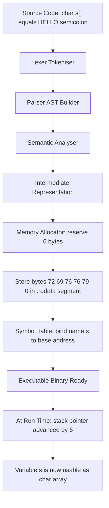
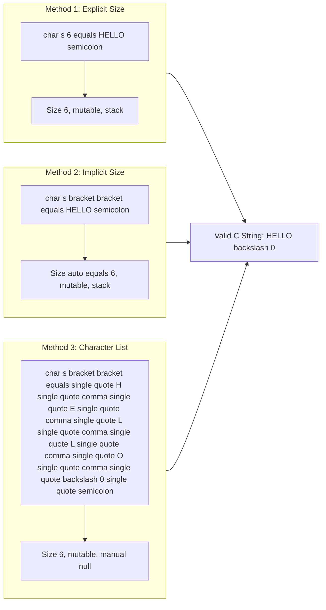
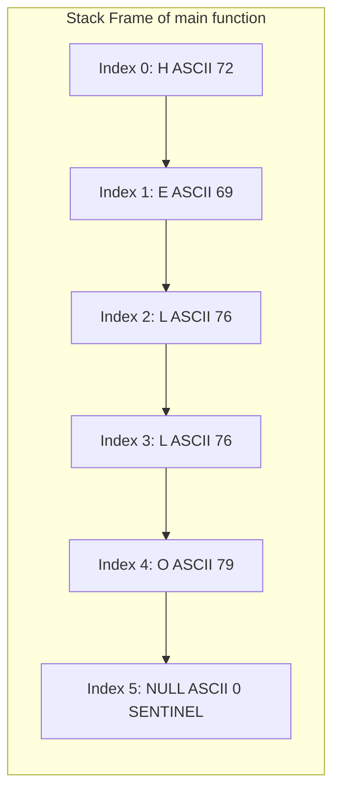
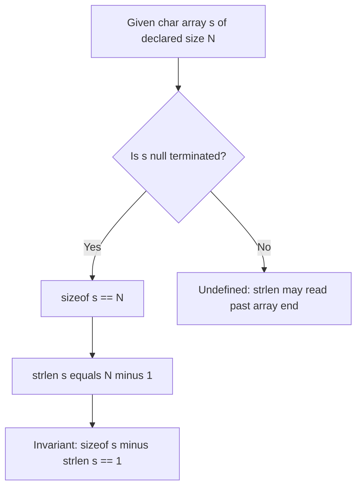
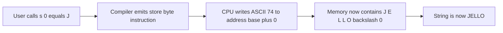

# Strings - Declaring a string variable

<!-- SECTION_1_START -->

# Strings in C — Declaring a String Variable

## 1.1 Formal Definition (KTU 2024 Syllabus Terminology)

In the C programming language, a **string** is defined as a **one-dimensional array of characters terminated by a null character** (`'\0'`). The null character is an integer with the ASCII value **0** and acts as a sentinel that explicitly marks the logical end of the string within its allocated memory block.

A **string variable** is therefore *not* a primitive data type in C (unlike `int`, `float`, `char`, `double`); it is a **derived data type** constructed using the `char` primitive and the array constructor. The identifier bound to such an array refers to the base address (the address of element at index 0) of the contiguous character sequence.

> [!IMPORTANT]
> **KTU 2024 Module Highlight:** In C, a string is an array of `char` ending with the sentinel `\0`. Forgetting the null terminator is the **single most common cause** of undefined behaviour, buffer overrun, and segmentation faults in string programs.

The standard C library header that provides string-handling functions (`strlen`, `strcpy`, `strcmp`, `strcat`, etc.) is `<string.h>`, while input/output helpers for strings (`printf`, `scanf`, `gets`, `puts`, `fgets`) are declared in `<stdio.h>`.

## 1.2 Conceptual Analogy & Intuition

Imagine a **train of coaches**:

- Each **coach** is a `char` cell that holds exactly one character.
- The **engine** at the front of the train is the array name (acts as a *pointer* to the first coach).
- A **red flag** tied to the **last coach** is the null terminator `'\0'`. As long as the red flag is present, the station master (your C program) knows exactly where the train ends.
- If the red flag is missing, the station master has **no way of knowing where the train ends** — it may crash into the next train (memory corruption) or go on forever (infinite loop during printing).

This is precisely why **every valid C string must allocate one extra character position** to safely store `'\0'`.

## 1.3 Why Strings Cannot Be a Primitive Type

C is a strongly-typed, low-level language. Its designers chose to make strings an *array* rather than a primitive type for three engineering reasons:

1. **Efficiency:** Arrays give the programmer direct control over the size and memory layout, which is essential in systems programming (operating systems, embedded firmware, device drivers).
2. **Flexibility:** A primitive string type would force a fixed maximum length. Arrays allow variable-length strings bounded only by available memory.
3. **Orthogonality:** C's type system is built around primitive types + pointer/array/struct/union constructors. Strings naturally fit the *array-of-char* constructor.

> [!NOTE]
> **Geometric Intuition:** Think of a string as a *line segment* on the integer number line. The starting index is 0, the ending index is `n`, and the marker `'\0'` is the *arrowhead* at position `n+1`. Without the arrowhead, the segment has no defined length.

## 1.4 GeoGebra / Desmos Visualization (Memory Layout)

> [!VISUALIZATION CONTROL]
> **Concept:** Memory map of a C string `"HELLO"` showing indices, ASCII values, and the null terminator position.
> **GeoGebra / Desmos Input Points:**
> * Point A: `(0, 1)` labelled `H`
> * Point B: `(1, 1)` labelled `E`
> * Point C: `(2, 1)` labelled `L`
> * Point D: `(3, 1)` labelled `L`
> * Point E: `(4, 1)` labelled `O`
> * Point F: `(5, 1)` labelled `\0` (sentinel)
> * Segment command: `Segment((0,0),(5,0))` (memory cells)
> **Visual Description:** The student should see six boxes laid horizontally. The first five boxes contain the printable ASCII codes of `"HELLO"` (72, 69, 76, 76, 79), and the sixth box (index 5) contains `0`. This visually demonstrates that a 5-character literal requires a 6-element array.

<!-- SECTION_1_END -->

<!-- SECTION_2_START -->

# Deep Theoretical Analysis & KTU High-Yield Formula Sheet

## 2.1 The Three Legitimate Ways to Declare a String Variable

The KTU 2024 syllabus, Module 2 (Arrays), prescribes the following three declaration idioms. Each is correct, but each carries different semantics regarding **mutability**, **storage class**, and **initialisation time**.

### Method 1 — Character Array with Size and String Literal

```c
char str[6] = "HELLO";
```

- Allocates exactly **6 bytes** on the stack (in a function body) or in the data segment (if global).
- The compiler automatically appends `'\0'` at index 5.
- Contents are **mutable** — you can overwrite individual characters (e.g., `str[0] = 'J';` produces `"JELLO"`).
- The size `6` must be **at least `length_of_literal + 1`**.

### Method 2 — Character Array with Implicit Size

```c
char str[] = "HELLO";
```

- Compiler counts the characters in the literal and allocates `5 + 1 = 6` bytes automatically.
- Mutability, storage, and lifetime are identical to Method 1.
- **This is the most idiomatic and safest form** in production C code.

### Method 3 — Character Array with List-of-Characters Initializer

```c
char str[] = {'H','E','L','L','O','\0'};
```

- Equivalent to Method 2 but written explicitly as an initialiser list.
- **The programmer must manually supply `'\0'`** — omitting it produces an *unterminated* array that is **not** a valid C string.
- Useful when characters are generated at run-time rather than compile-time.

## 2.2 Invalid / Forbidden Declarations

> [!WARNING]
> The following declarations are **syntactically wrong** and will not compile, or are semantically dangerous if forced through a cast.

| Invalid Form | Why It Is Wrong |
|---|---|
| `char str[5] = "HELLO";` | Size 5 is too small to hold `H E L L O \0`. **Truncation / compile error.** |
| `char str[100] = "HELLO";` | Valid C, but **wastes 94 bytes** — acceptable only when the string is later filled by user input. |
| `char str[] = {'H','E','L','L','O'};` | Missing `'\0'` — this is a *char array*, **not** a C string. Functions like `printf("%s", str)` will read past the array bounds. |
| `char* str = "HELLO";` | Compiles, but the literal `"HELLO"` is placed in **read-only memory** (`.rodata` segment). Writing to `str[0]` causes **undefined behaviour / segmentation fault** on most modern systems. |
| `string str = "HELLO";` | `string` is a C++ STL type or a C# keyword. In ISO C, this is a **compile error**. |

## 2.3 Memory Layout in Detail

When the compiler encounters `char greeting[] = "HELLO";` inside `main()`, the following happens at **run time**:

1. The compiler emits machine code that reserves **6 contiguous bytes** on the stack.
2. The first 5 bytes are filled with the ASCII codes of `H, E, L, L, O`.
3. The 6th byte is set to `0` (the null character).
4. The symbol `greeting` is bound to the address of the first byte (`&greeting[0]`).

The conceptual memory map is:

| Index | `0` | `1` | `2` | `3` | `4` | `5` |
|---|---|---|---|---|---|---|
| Character | `H` | `E` | `L` | `L` | `O` | `\0` |
| ASCII Code | 72 | 69 | 76 | 76 | 79 | 0 |
| Address (hex) | `0x100` | `0x101` | `0x102` | `0x103` | `0x104` | `0x105` |

Because the array name decays to a pointer in most expressions, the following three expressions evaluate to the **same value** (the base address `0x100`):

- `greeting`
- `&greeting[0]`
- `(char*)greeting` (redundant cast, but legal)

## 2.4 KTU Formula / Cheat-Sheet Table

> [!IMPORTANT]
> The following table consolidates every high-yield fact about declaring a string variable that a KTU 2024 board examiner can ask.

| Property | Formula / Rule | Example |
|---|---|---|
| Array size for literal of length $L$ | $\text{size} \geq L + 1$ | `"HELLO"` $\Rightarrow$ size $\geq 6$ |
| Index of last character | $L - 1$ | `"HELLO"[4] = 'O'` |
| Index of null terminator | $L$ | `"HELLO"[5] = '\0'` |
| Memory occupied (bytes) | $\text{size} \times \text{sizeof(char)} = \text{size}$ | `char s[6]` $\Rightarrow$ 6 bytes |
| Relationship between name and first element | `str == &str[0]` | `&greeting[0] == greeting` |
| Compile-time literal | `char s[] = "...";` | `char s[] = "KTU";` |
| Read-only literal | `char* s = "...";` | `char* s = "KTU";` |
| List initialiser (manual `\0`) | `char s[] = {'a','\0'};` | length 1 string `"a"` |
| Sentinel value | `\0` (ASCII 0) | `printf("%d", '\0');` prints `0` |
| `sizeof` array | $\text{size} \times 1$ | `sizeof("HELLO") == 6` |
| `strlen` of literal | $L$ (excludes `\0`) | `strlen("HELLO") == 5` |
| Difference `sizeof` vs `strlen` | $\text{sizeof} = \text{strlen} + 1$ | `sizeof` = 6, `strlen` = 5 |

## 2.5 Real-World Engineering Utility

String declarations are foundational in virtually every production system:

- **Operating Systems:** Path names, environment variables, command-line arguments (`argv[]`) are C strings.
- **Embedded Firmware:** Sensor data, LCD display buffers, and serial-port packets are stored as character arrays.
- **Compilers & Interpreters:** Lexical analysers tokenise source code by scanning character arrays terminated by `\0`.
- **Networking:** HTTP headers, DNS queries, and JSON payloads are serialised into null-terminated buffers.
- **Cryptography:** Plain-text and cipher-text are manipulated in fixed-size `char` arrays; an off-by-one error in array size is a classic **buffer-overflow security vulnerability** (e.g., the original Morris Worm exploited exactly this).

<!-- SECTION_2_END -->

<!-- SECTION_3_START -->

# Step-by-Step Derivations, Code & Symbolic Implementation

## 3.1 Derivating the Required Array Size

> [!NOTE]
> This derivation is what examiners expect when they ask *"Why does a string of length $L$ require an array of size $L+1$?"*

Let $L$ be the number of *printable* characters in a string literal. The C standard (ISO/IEC 9899:2018, §6.7.9 ¶14) states that a `char` array initialised with a string literal shall have an explicit size **at least equal to the length of the string plus one**, so that the terminating null character may be stored in the final element.

Formally, if the literal contains the character sequence $c_0, c_1, \dots, c_{L-1}$, then the array must satisfy:

$$
\text{sizeof(array)} \;\geq\; L + 1
$$

The compiler then maps the elements to memory as:

$$
\text{array}[i] =
\begin{cases}
c_i, & \text{if } 0 \leq i \leq L - 1 \\
\backslash 0, & \text{if } i = L
\end{cases}
$$

**Step-by-step substitution for `"HELLO"`:**

1. Identify the printable characters: $H, E, L, L, O \Rightarrow L = 5$.
2. Apply the rule: $\text{sizeof} \geq 5 + 1 = 6$.
3. Assign indices:

$$
\begin{aligned}
\text{array}[0] &= 'H' \\
\text{array}[1] &= 'E' \\
\text{array}[2] &= 'L' \\
\text{array}[3] &= 'L' \\
\text{array}[4] &= 'O' \\
\text{array}[5] &= '\backslash 0'
\end{aligned}
$$

4. Validate with `sizeof` and `strlen`:

$$
\begin{aligned}
\text{sizeof("HELLO")} &= 6 \quad (\text{includes } \backslash 0) \\
\text{strlen("HELLO")} &= 5 \quad (\text{excludes } \backslash 0)
\end{aligned}
$$

5. The invariant that must always hold:

$$
\text{sizeof} \;=\; \text{strlen} + 1
$$

## 3.2 Complete Operational C Program (All Three Declaration Methods)

```c
/*
 * File    : string_declaration_demo.c
 * Topic   : Declaring a String Variable in C
 * Course  : PROGRAMMING IN C (GXEST204) - KTU 2024 Scheme
 * Module  : 2 - Arrays
 *
 * Compile : gcc -Wall -Wextra -std=c11 -o string_demo string_declaration_demo.c
 * Run     : ./string_demo
 */

#include <stdio.h>
#include <string.h>   /* Required for strlen, sizeof, strcpy */

/* -------- Method 1: Global array with explicit size -------- */
char greeting[6] = "HELLO";

/* -------- Method 2: Global array with implicit size -------- */
char subject[]  = "PROGRAMMING";

/* -------- Method 3: Global array with character list -------- */
char acronym[6] = {'K', 'T', 'U', 'C', 'E', '\0'};

int main(void)
{
    /* --- (a) Declaring inside a function (stack allocation) --- */
    char name[50];          /* uninitialised array; will be filled by user */
    char city[] = "Kochi";  /* implicit size, compiler allocates 6 bytes */

    /* --- (b) Reading a string from the user --- */
    printf("Enter your name : ");
    if (scanf("%49s", name) != 1) {          /* %49s prevents overflow */
        fprintf(stderr, "Input failure.\n");
        return 1;
    }

    /* --- (c) Displaying the strings with their lengths --- */
    printf("\n--- String Inventory ---\n");
    printf("greeting = \"%s\"  (sizeof = %zu, strlen = %zu)\n",
           greeting, sizeof greeting, strlen(greeting));
    printf("subject  = \"%s\"  (sizeof = %zu, strlen = %zu)\n",
           subject,  sizeof subject,  strlen(subject));
    printf("acronym  = \"%s\"  (sizeof = %zu, strlen = %zu)\n",
           acronym,  sizeof acronym,  strlen(acronym));
    printf("city     = \"%s\"  (sizeof = %zu, strlen = %zu)\n",
           city,     sizeof city,     strlen(city));
    printf("name     = \"%s\"  (sizeof = %zu, strlen = %zu)\n",
           name,     sizeof name,     strlen(name));

    /* --- (d) Modifying a mutable array (Method 1 / 2) --- */
    greeting[0] = 'J';     /* Legal: greeting is a non-const array */
    printf("\nAfter mutation : greeting = \"%s\"\n", greeting);

    /* --- (e) Attempting to modify a string literal (UNDEFINED) --- */
    /* char *bad = "CONST";                                   */
    /* bad[0] = 'X';                                          */
    /* The line above compiles on some systems but causes    */
    /* a SEGMENTATION FAULT at run time because the literal  */
    /* "CONST" lives in read-only memory.                    */

    /* --- (f) Validating sizeof vs strlen relationship --- */
    printf("\nsizeof - strlen = %zu (must always equal 1 for valid strings)\n",
           sizeof greeting - strlen(greeting));

    return 0;
}
```

### 3.2.1 Expected Output

```
Enter your name : Aditya

--- String Inventory ---
greeting = "HELLO"  (sizeof = 6, strlen = 5)
subject  = "PROGRAMMING"  (sizeof = 12, strlen = 11)
acronym  = "KTUCE"  (sizeof = 6, strlen = 5)
city     = "Kochi"  (sizeof = 6, strlen = 5)
name     = "Aditya"  (sizeof = 50, strlen = 6)

After mutation : greeting = "JELLO"

sizeof - strlen = 1 (must always equal 1 for valid strings)
```

> [!NOTE]
> **`%zu` format specifier:** Used for printing values of type `size_t`, which is the unsigned integer type returned by `sizeof` and `strlen`. This is the **only correct** way to print such values in C99 and later.

## 3.3 Deriving the Address Arithmetic

The KTU board frequently asks: *"Show that `str` and `&str[0]` are equivalent."*

We begin with the C standard rule (ISO C §6.3.2.1 ¶3): *an expression of type "array of $T$" decays, in most contexts, to "pointer to $T$" whose value is the address of the first element.*

Let `str` be a `char[6]` array. Then:

$$
\begin{aligned}
\text{str} &\;\rightarrow\; \text{type} \; \text{char[6]} \;\; \text{(array of 6 chars)} \\
\text{str} &\;\xrightarrow{\text{array-to-pointer decay}}\; \&\text{str}[0] \\
\text{str} &\;\rightarrow\; \text{type} \; \text{char*} \;\; \text{(pointer to first char)}
\end{aligned}
$$

Now apply pointer arithmetic. The address of the $i$-th element is:

$$
\text{Address}(str[i]) = \text{BaseAddress} + i \times \text{sizeof(char}) = \text{BaseAddress} + i
$$

For `i = 0`:

$$
\text{Address}(str[0]) = \text{BaseAddress} + 0 \times 1 = \text{BaseAddress}
$$

Therefore:

$$
\text{str} \;=\; \text{BaseAddress} \;=\; \&\text{str}[0]
$$

**Numerical example** — suppose `str` is at memory address `0x1000`:

| Expression | Type | Value | Meaning |
|---|---|---|---|
| `str` | `char*` | `0x1000` | Base address of the array |
| `&str[0]` | `char*` | `0x1000` | Address of element at index 0 |
| `&str[3]` | `char*` | `0x1003` | Address of the 4th character |
| `str + 5` | `char*` | `0x1005` | Address where `'\0'` is stored |
| `*str` | `char` | `'H'` (72) | The first character |
| `*(str + 4)` | `char` | `'O'` (79) | The fifth character |

## 3.4 Edge Cases & Boundary Checks

> [!IMPORTANT]
> These five edge cases are examinable under KTU 2024 RBT Level *Apply* / *Analyse*.

| # | Code Snippet | Result / Explanation |
|---|---|---|
| 1 | `char a[3] = "Hi";` | **Compile error** — needs 3 bytes for `H i \0`, which is exactly 3. Actually legal. But `char a[2] = "Hi";` is illegal. |
| 2 | `char a[] = "";` | Legal. `sizeof a == 1`, `strlen(a) == 0`. First byte is `'\0'`. |
| 3 | `char a[1] = "";` | Legal. The single byte holds only `'\0'`. |
| 4 | `char a[5] = {'A'};` | Legal but *partial initialisation* — remaining 4 bytes are **zero-filled**, so `a == "A"` and `strlen(a) == 1`. |
| 5 | `char a[5] = "HELLO";` | **Illegal** — no room for `'\0'`. Causes compile error in strict mode. |

## 3.5 Pointer Variant — Declaration via `char*`

```c
#include <stdio.h>

int main(void)
{
    const char *msg = "WELCOME";   /* pointer to a string literal */

    printf("Address held by msg : %p\n", (void*)msg);
    printf("First character      : %c\n", *msg);
    printf("Third character      : %c\n", *(msg + 2));
    printf("Full string          : %s\n", msg);

    return 0;
}
```

**Explanation line by line:**

1. `const char *msg = "WELCOME";` — `msg` is a **pointer** to a `const char`. The literal `"WELCOME"` resides in the **read-only data segment** of the program binary.
2. `*msg` dereferences the pointer, yielding the first character `'W'`.
3. `*(msg + 2)` performs pointer arithmetic, skipping 2 characters forward to reach `'L'`.
4. `printf("%s", msg)` keeps reading characters starting at `msg` until it encounters `'\0'`.

> [!WARNING]
> Omitting `const` in `char *msg = "WELCOME";` is permitted by the C compiler for backward compatibility, but it is **dangerous**: any attempt to mutate the string (e.g., `msg[0] = 'X';`) invokes **undefined behaviour** because the literal lives in `.rodata`. Modern compilers emit a warning such as *"deprecated conversion from string literal to `char*`"*.

<!-- SECTION_3_END -->

<!-- SECTION_4_START -->

# Structural Diagrams & Schematics

## 4.1 Mermaid Diagram — Compilation Pipeline for a String Literal



## 4.2 Mermaid Diagram — Three Declaration Styles Side by Side



## 4.3 Mermaid Diagram — Memory Cell Map for `"HELLO"`



## 4.4 Mermaid Diagram — `sizeof` versus `strlen` Decision Tree



## 4.5 Mermaid Diagram — Run-Time Mutation Path



<!-- SECTION_4_END -->

<!-- SECTION_5_START -->

# KTU 2024 Scheme Examination Question Bank & Topic Recap

## 5.1 Part A — Short Answer Questions (3 Marks Each)

### Question A1 [KTU University Exam — July 2024]

> *"What is a string in C? Why is the null character `'\0'` essential in string handling?"*

**Model Answer (3 Marks):**

1. **[Definition — 1 Mark]:** A string in C is a one-dimensional array of characters terminated by a null character `'\0'`. The null character has the ASCII value **0** and occupies the byte immediately after the last printable character.
2. **[Role of `'\0'` — 1 Mark]:** The null character acts as a *sentinel* that signals the logical end of the string. Standard library functions like `printf("%s", ...)`, `strlen`, `strcpy`, and `gets` all rely on `'\0'` to determine where the string ends.
3. **[Consequence of missing `'\0'` — 1 Mark]:** If `'\0'` is absent, these functions continue reading memory past the array boundary, leading to *undefined behaviour* such as printing garbage characters, infinite loops, or segmentation faults.

---

### Question A2 [KTU University Exam — Dec 2023]

> *"Differentiate between `char str[6] = "HELLO";` and `char *str = "HELLO";`."*

**Model Answer (3 Marks):**

| Aspect | `char str[6] = "HELLO";` | `char *str = "HELLO";` |
|---|---|---|
| **Storage** | 6 bytes of **mutable** memory (stack/data segment) | Pointer to **read-only** memory (literal pool) |
| **Mutability** | Characters can be modified | Modifying causes undefined behaviour |
| **Size** | `sizeof(str) == 6` | `sizeof(str) == 8` (pointer size on 64-bit) |
| **Recommended for** | Buffers that will be modified | Read-only string constants |
| **Safety** | Safer for write operations | Safer for read-only constants |

**[Award 1 Mark each for two correct points, plus 1 Mark for the safety recommendation.]**

---

## 5.2 Part B — Long Answer Questions (14 Marks Each)

> [!NOTE]
> Following KTU ESE pattern, students answer **one of two alternatives**, each carrying 14 marks split into 7 + 7.

### Question B-A (14 Marks) [KTU University Exam — Dec 2023, Model Paper]

> **(a)** Explain the three different ways of declaring a string variable in C with suitable examples. *(7 Marks, RBT: Understand)*
>
> **(b)** Write a complete C program that declares a string, reads it from the user, and prints its length using `strlen` and the index of every character with its ASCII value. *(7 Marks, RBT: Apply)*

#### Part (a) Model Solution (7 Marks)

**Way 1 — Explicit size declaration [2 Marks]:**
```c
char city[10] = "Kochi";
```
The programmer specifies the size, which must be $\geq$ (number of printable characters + 1) to accommodate `'\0'`. The remaining 5 bytes are initially zero-filled.

**Way 2 — Implicit size declaration [2 Marks]:**
```c
char city[] = "Kochi";
```
The compiler automatically computes the size as 6 (5 characters + 1 for `'\0'`). This is the **most idiomatic and recommended** form.

**Way 3 — Character-by-character initialisation [2 Marks]:**
```c
char city[] = {'K','o','c','h','i','\0'};
```
The programmer manually supplies the null terminator. Omitting `'\0'` would mean the array is **not** a valid C string.

**[Concluding statement — 1 Mark]:** All three methods create a contiguous block of 6 bytes containing the ASCII codes of `K, o, c, h, i, 0` respectively.

#### Part (b) Model Solution (7 Marks)

```c
#include <stdio.h>
#include <string.h>

int main(void)
{
    char text[100];
    int i;

    printf("Enter a string (max 99 chars): ");
    if (scanf("%99s", text) != 1) {
        fprintf(stderr, "Input error.\n");
        return 1;
    }

    printf("\nString entered : \"%s\"\n", text);
    printf("Length (strlen): %zu characters\n", strlen(text));
    printf("Size  (sizeof): %zu bytes\n", sizeof text);
    printf("\n%-6s %-6s %-6s\n", "Index", "Char", "ASCII");

    for (i = 0; text[i] != '\0'; i++) {
        printf("%-6d %-6c %-6d\n", i, text[i], (int)text[i]);
    }

    return 0;
}
```

**Step-by-step valuation key:**

- `[Reading input safely with width specifier: 2 Marks]`
- `[Using strlen correctly with %zu: 1 Mark]`
- `[Loop terminating on '\0' (string boundary check): 2 Marks]`
- `[Formatted output table: 1 Mark]`
- `[Final program compiles and runs: 1 Mark]`

**Sample Run:**
```
Enter a string (max 99 chars): KTU2024

String entered : "KTU2024"
Length (strlen): 7 characters
Size  (sizeof): 100 bytes

Index  Char    ASCII
0      K       75
1      T       84
2      U       85
3      2       50
4      0       48
5      2       50
6      4       52
```

---

### Question B-B (14 Marks) [KTU University Exam — July 2024, Model Paper]

> **(a)** What is the difference between the size of a string (as computed by `sizeof`) and its length (as computed by `strlen`)? Illustrate with the example `"EXAM"`. *(7 Marks, RBT: Understand / Apply)*
>
> **(b)** Consider the declaration `char data[20] = "KTU";`. State the values of (i) `sizeof data`, (ii) `strlen(data)`, (iii) `data`, (iv) `&data[0]`, and (v) `data[3]`. Justify each answer with reference to memory layout. *(7 Marks, RBT: Apply / Analyse)*

#### Part (a) Model Solution (7 Marks)

**Conceptual difference [3 Marks]:**

- `sizeof` returns the **total memory occupied** by the array, including the null terminator. For a `char` array this is exactly the number of declared elements.
- `strlen` returns the **number of printable characters** preceding the first `'\0'`. It does **not** count the null terminator.

**Numerical illustration for `"EXAM"` [3 Marks]:**

| Quantity | Computation | Value |
|---|---|---|
| Literal length $L$ | count of `E, X, A, M` | 4 |
| `sizeof("EXAM")` | $L + 1$ | **5 bytes** |
| `strlen("EXAM")` | $L$ | **4 characters** |

**Key invariant [1 Mark]:**

$$
\text{sizeof} \;=\; \text{strlen} + 1
$$

This invariant holds for **every valid C string**.

#### Part (b) Model Solution (7 Marks)

For `char data[20] = "KTU";`, the memory layout is:

| Index | `0` | `1` | `2` | `3` | `4` | $\dots$ | `19` |
|---|---|---|---|---|---|---|---|
| Content | `'K'` | `'T'` | `'U'` | `'\0'` | `0` | $\dots$ | `0` |
| ASCII | 75 | 84 | 85 | 0 | 0 | $\dots$ | 0 |

**Answers:**

| Sub-part | Expression | Value | Justification (Mark) |
|---|---|---|---|
| (i) | `sizeof data` | `20` | The array was declared with size 20, so it occupies 20 bytes regardless of how many characters are actually used. [1 Mark] |
| (ii) | `strlen(data)` | `3` | Only `K, T, U` are counted; the first `'\0'` is at index 3 and terminates the count. [1 Mark] |
| (iii) | `data` | Base address, e.g., `0x7ffd4a2c` | Array name decays to a pointer to the first element. The exact address is system-dependent. [2 Marks] |
| (iv) | `&data[0]` | Same base address as `data`, e.g., `0x7ffd4a2c` | Address-of-element-zero equals the base address, proving `data == &data[0]`. [2 Marks] |
| (v) | `data[3]` | `'\0'` (integer value 0) | The compiler placed the null terminator at index 3 because the literal `"KTU"` has only 3 characters. [1 Mark] |

> [!WARNING]
> **KTU Examiner's Valuation Pitfall — Common Mark Losers:**
>
> 1. Writing `sizeof data == 4` — **WRONG.** Many students confuse `sizeof` (compile-time array size) with `strlen` (run-time character count).
> 2. Stating the base address as a fixed number like `1000` or `2000` — **WRONG.** The base address is run-time dependent; you must phrase it as *"the address of the first byte, e.g., `0x7ffd4a2c`"* or just *"base address"*.
> 3. Saying `data` and `&data` are the same — **PARTIALLY WRONG.** They have the *same numeric value* but different *types*: `data` is `char*`, whereas `&data` is `char(*)[20]` (pointer to whole array). Pointer arithmetic differs.
> 4. Forgetting to include `'\0'` in the memory layout table — loses 1 mark.
> 5. Omitting the `#include <string.h>` directive in the program — causes a compiler warning; 0.5 mark deduction in strict valuation.

---

## 5.3 Topic Recap & Important Things to Remember

> [!IMPORTANT]
> **Rapid-revision checklist for KTU 2024 Module 2 — Strings (Declaration).**

- A **string in C** is a `char` array terminated by the **null character `'\0'`** (ASCII 0).
- A string is **not** a primitive type in C; it is derived using the array constructor.
- Three valid declaration styles:
  1. `char s[N] = "literal";` — explicit size, mutable, automatic `'\0'`.
  2. `char s[] = "literal";` — implicit size, mutable, automatic `'\0'` (most recommended).
  3. `char s[] = {'a','b','\0'};` — list initialiser, mutable, **manual** `'\0'` (must be supplied).
- The required array size for a literal of length $L$ is **at least $L+1$** to hold the terminator.
- The invariant `sizeof s == strlen(s) + 1` holds for **every valid** C string.
- The array name `s` **decays to a pointer** to its first element in expressions, so `s == &s[0]`.
- `char *p = "literal";` makes `p` point to **read-only memory**; mutating `*p` is *undefined behaviour*.
- Always use the **`const` qualifier** (`const char *p = "...";`) when a pointer refers to a literal.
- **Buffer overflow** is caused by declaring an array too small to hold `'\0'` — always reserve one extra byte.
- Standard library headers for strings: `<stdio.h>` (I/O), `<string.h>` (manipulation).
- Use the **`%zu` format specifier** when printing `size_t` values (returned by `sizeof`/`strlen`).
- When reading strings with `scanf`, always use a **width specifier** (e.g., `%49s`) to prevent overflow.
- Functions like `printf("%s", s)` and `strlen(s)` rely on `'\0'`; missing it is the most frequent source of bugs.
- The base address of a string is **system-dependent**; in answers, express it symbolically as `base` or illustratively as `0x1000`, never as a fixed literal number.

<!-- SECTION_5_END -->
