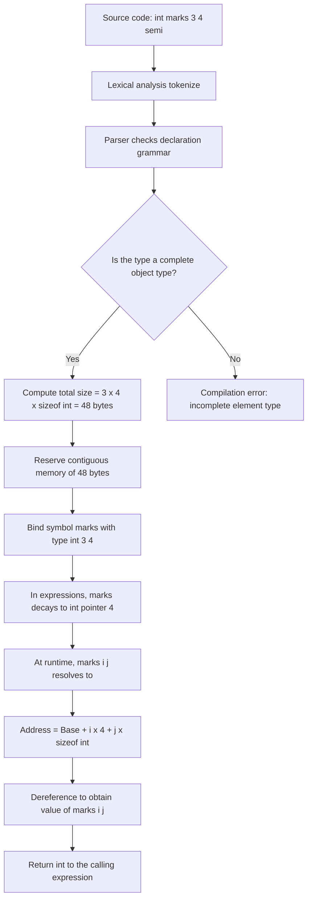
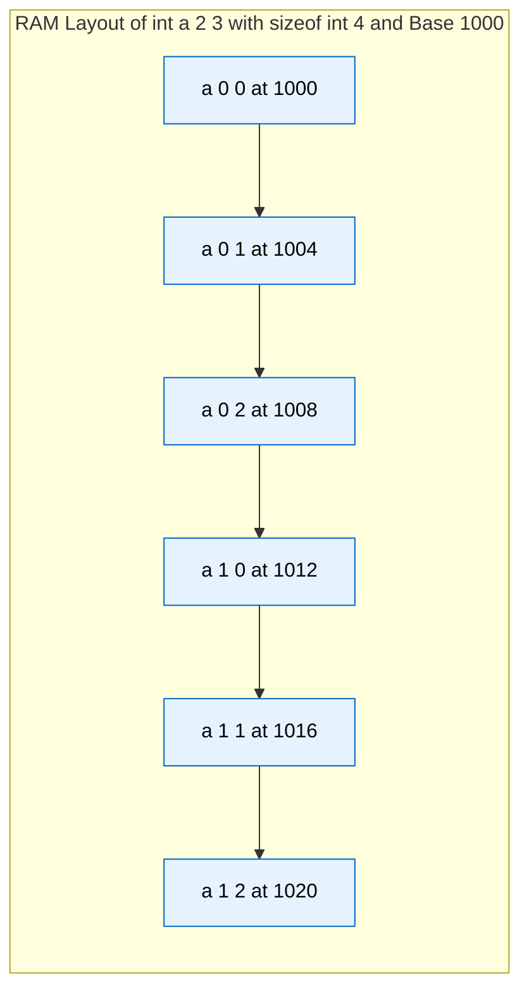
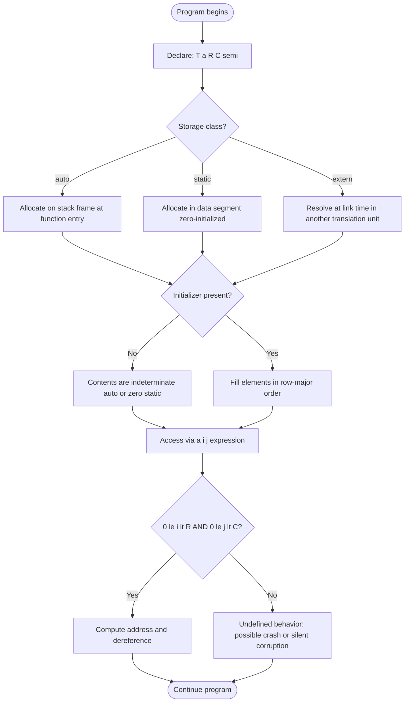
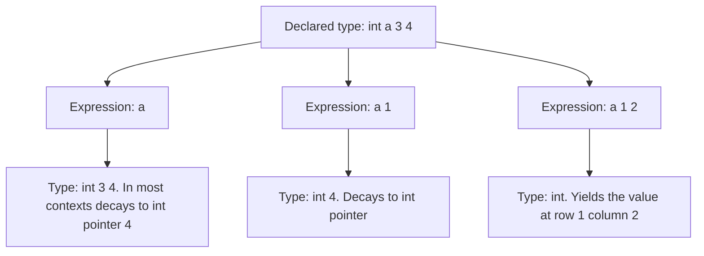

# Two-dimensional arrays – Defining a two-dimensional array

<!-- SECTION_1_START -->
# Two-Dimensional Arrays – Defining a Two-Dimensional Array

## 1. Core Technical Definition (KTU 2024 Syllabus Terminology)

A **two-dimensional (2D) array** in the C programming language is a **finite, ordered, homogeneous collection of data elements** stored in **contiguous memory locations** and arranged in the form of a **mathematical matrix** consisting of **rows** and **columns**. Every element is referenced by **two indices** — a *row subscript* and a *column subscript* — and all elements share a single, common data type.

> [!IMPORTANT]
> **Formal ANSI C Definition (per ISO/IEC 9899:2018 §6.2.5 §6.7.6.2):**
> An array type describes a contiguously allocated nonempty set of objects with a particular member element type, called the *element type*. A *two-dimensional array* is therefore an **array of one-dimensional arrays**, where each row is itself a 1-D array of the declared element type.

### Conceptual Analogy / Intuition

Imagine the **seating arrangement of a cinema hall**:

- The hall has **R rows** (e.g., Row 1, Row 2, ..., Row R) — these are the **first dimension**.
- Each row has **C seats** (e.g., Seat 1, Seat 2, ..., Seat C) — these are the **second dimension**.
- Every seat can hold exactly **one person** of a particular *category* (Adult, Child, Senior) — this is the **data type**, and it is the *same* for every seat.

If you want to tell a friend to meet you at "Row 5, Seat 12", you supply **two coordinates** — this is precisely how a 2-D array works in C. The data type is uniform (homogeneous), the shape is fixed at compile time (for `auto` arrays), and any single element can be pinpointed by `(row_index, column_index)`.

> [!NOTE]
> **Geometric Intuition:** A 2-D array in C is a **rectangular grid** of $rows \times columns$ cells. However, the C language **does not actually store it as a 2-D grid in RAM** — it stores it as a **single linear (1-D) strip** of memory, broken logically into rows. This is critical for understanding pointer arithmetic and memory layout.

### Physical Constants / Standard Metrics

| Metric | Value / Convention | Notes |
|---|---|---|
| **Smallest valid 2-D array** | `int a[1][1];` | One row, one column — still valid. |
| **Lower bound of every index** | **0** (zero) | C arrays are **zero-based** — the first legal index is always `0`. |
| **Last legal index (row)** | `rows - 1` | Out-of-bounds access is **undefined behavior**. |
| **Last legal index (column)** | `cols - 1` | The compiler does **not** perform runtime bounds checks. |
| **Storage class of size** | Compile-time constant (for `auto`/`static`) | Until C99 VLA, both dimensions needed integer constants or `const` integer expressions. |
| **C99 onward** | Variable Length Arrays (VLAs) allowed | The first dimension may be a runtime expression. |

> [!VISUALIZATION CONTROL]
> **Concept:** Visualizing a 2-D array as a grid and as a linear memory strip.
> **Representation (conceptual equations, not GeoGebra):**
> * Logical view: `grid = [[a[0][0], a[0][1], …, a[0][C-1]], [a[1][0], a[1][1], …, a[1][C-1]], …, [a[R-1][0], …, a[R-1][C-1]]]`
> * Linear (row-major) memory view: `[a[0][0], a[0][1], …, a[0][C-1] | a[1][0], …, a[1][C-1] | … | a[R-1][0], …, a[R-1][C-1]]`
> **Visual Description:** A 3×4 array forms a grid of 3 rows and 4 columns. In memory, the same 12 integers are placed one after another in a single line, row by row. The base address is the location of `a[0][0]`.

<!-- SECTION_1_END -->

<!-- SECTION_2_START -->
# 2. Deep Theoretical Analysis & KTU High-Yield Formula Sheet

## 2.1 The C Declaration Syntax (General Form)

The C language grammar specifies a 2-D array declaration as:

```
storage_class  data_type  array_name [ ROW_SIZE ] [ COL_SIZE ];
```

* `storage_class` → optional. May be `auto`, `static`, `extern`, or `register`. Default inside a function is `auto`.
* `data_type` → the **element type**. Must be a valid C type: `int`, `float`, `double`, `char`, or any user-defined `struct`/`union`.
* `array_name` → a valid C **identifier** (follows the same rules as any variable name).
* `ROW_SIZE` → a **positive integer constant expression** (or a `const` integer known at compile time). In C99/C11/C17, may be a runtime expression only if it is the **first** dimension (VLA).
* `COL_SIZE` → a **positive integer constant expression** (or a `const` integer). The second dimension **must be a compile-time constant** even in the VLA model — VLAs apply only to the **first** dimension.

> [!IMPORTANT]
> **KTU 2024 Board Examination Point:** Examiners frequently test whether you understand that **both** dimension sizes must be specified at the point of declaration if you intend to use the array with full bounds. Omitting the second dimension is allowed **only at the time of initialization** with a brace-enclosed initializer list, where the compiler counts the elements for you.

## 2.2 The Core Operational Concept: How a 2-D Array is Stored

C follows a **Row-Major Order** storage scheme (this is standardized by the C standard and shared with most contemporary architectures, including x86, x86-64, and ARM). The address of any element `a[i][j]` is computed as:

$$
\text{Address of } a[i][j] \;=\; \text{BaseAddress}(a) \;+\; \bigl(i \times C + j\bigr) \times \text{sizeof}(\text{element type})
$$

where $C$ is the number of **columns** (the size of the second dimension).

### Step-by-Step Logic Behind the Address Formula

1. **BaseAddress(a)** — the memory location of the very first byte of `a`, which is the address of `a[0][0]`.
2. **Row offset** — to reach row `i`, you must skip exactly $i$ complete rows, each of width $C$ elements. Hence the row offset is $i \times C$ elements.
3. **Column offset** — within row `i`, you must skip $j$ more elements to reach column $j$. Hence the column offset is $j$ elements.
4. **Total element offset** — the sum $i \times C + j$ tells you how many elements (not bytes!) you are past the first element.
5. **Byte offset** — multiply the element offset by `sizeof(element type)` because the compiler needs the offset in **bytes**, not element-units.
6. **Final address** — add the byte offset to the base address to obtain the actual machine address of `a[i][j]`.

> [!NOTE]
> **Why row-major and not column-major?** C inherits row-major storage from the BCPL / B lineage, while Fortran uses column-major. Knowing this is essential when interfacing C code with Fortran, MATLAB, NumPy (which is row-major by default), or with low-level memory layouts.

## 2.3 KTU High-Yield Formula / Cheat Sheet

| # | Concept | Formula / Rule | Units / Notes |
|---|---|---|---|
| 1 | **Total number of elements** | $N = R \times C$ | $R = $ `ROW_SIZE`, $C = $ `COL_SIZE`. Pure count, no units. |
| 2 | **Total bytes allocated** | $B = R \times C \times \text{sizeof}(T)$ | Bytes. $T$ is the element type. |
| 3 | **Address of `a[i][j]`** | $\text{Base}(a) + (i \cdot C + j) \cdot \text{sizeof}(T)$ | Bytes from the start of the array's data segment / stack frame. |
| 4 | **Index range (valid)** | $0 \le i < R$ and $0 \le j < C$ | Anything outside this is **undefined behavior**. |
| 5 | **Pointer type of a single row** | `T (*)[C]` | A pointer to an array of $C$ elements of type $T$. Decays from `a[i]`. |
| 6 | **Pointer to the whole array** | `T (*)[R][C]` | Rare; appears in `sizeof` operand. |
| 7 | **Subscript-operator chaining** | `*( *(a + i) + j )` | Equivalent to `a[i][j]`. C evaluates `a[i]` as `*(a + i)`. |
| 8 | **Stride between consecutive rows** | $C \cdot \text{sizeof}(T)$ bytes | Distance (in bytes) from `a[i][0]` to `a[i+1][0]`. |
| 9 | **Default initialization** | All bytes set to **zero** if `static` or `extern`; **garbage** if `auto`. | Use `static` to guarantee zero-fill at no runtime cost. |
| 10 | **C99 VLA rule** | First dimension may be a runtime expression; second must still be a compile-time constant. | VLAs are **optional in C11+** (a concession to embedded systems). |

> [!TIP]
> **Real-World Engineering Utility of 2-D Arrays:**
> * **Image processing** — every grayscale image of size $W \times H$ is stored as a 2-D `unsigned char` array where `pixel[y][x]` gives intensity.
> * **Matrix arithmetic in scientific computing** — dense matrix operations, Gauss elimination, and dynamic programming grids.
> * **Game development** — 2-D tile maps, chess/board representations, and texture atlases.
> * **Tabular data in business software** — rows of records, columns of fields, before adopting `struct` arrays.
> * **Routing algorithms** — adjacency matrices of graphs: `adj[u][v] = 1` if edge exists.

<!-- SECTION_2_END -->

<!-- SECTION_3_START -->
# 3. Step-by-Step Derivations, Memory Models & Code Implementation

## 3.1 Complete Declaration Examples (with Exhaustive Walkthroughs)

### Example 1 — Simplest Valid 2-D Integer Array

```c
int marks[3][4];
```

* **What the compiler does:**
  1. Reserves a contiguous block of memory large enough for $3 \times 4 = 12$ `int` values.
  2. With a typical 32-bit `int` (4 bytes), the total memory is $12 \times 4 = 48$ bytes.
  3. The symbol `marks` is given a type of `int [3][4]`. In most expressions it *decays* to `int (*)[4]` — a pointer to an array of 4 integers.
* **Element access examples:**
  * `marks[0][0]` → first element (top-left cell). Stored at offset 0 bytes from the base.
  * `marks[0][3]` → last element of the first row. Offset = $3 \times 4 = 12$ bytes.
  * `marks[2][3]` → bottom-right element. Offset = $(2 \times 4 + 3) \times 4 = 44$ bytes.

### Example 2 — 2-D Character Array (a "2-D String")

```c
char name[3][10];
```

* Holds **3 strings**, each of which can hold up to **9 visible characters** plus 1 terminator `'\0'`.
* Memory layout: 3 contiguous rows, 10 `char` slots each, total $30$ bytes.
* The element `name[i][j]` is a single `char`. The string `name[i]` is the address of the i-th row.

### Example 3 — Mixed-Storage and Global 2-D Arrays

```c
static  double  rates[5][3];
extern  int     sensor[10][10];
```

* `static` arrays are allocated in the **data segment** of the program, zero-initialized at process startup, and persist for the lifetime of the program.
* `extern` arrays are **declared** (not defined) in this translation unit; the actual storage exists in *another* `.c` file. The compiler trusts the declaration but allocates no memory.

### Example 4 — `const` Sizes and Compile-Time Safety

```c
#define  MAX_STUDENTS  50
#define  MAX_SUBJECTS  6

float   grade[MAX_STUDENTS][MAX_SUBJECTS];
```

* The preprocessor substitutes the macros before compilation, so the compiler sees `float grade[50][6];`. This is the **recommended idiom** for KTU lab programs and mini-projects.

### Example 5 — C99 Variable Length Array (VLA)

```c
void build_grid(int rows, int cols)
{
    int grid[rows][cols];   /* C99 VLA — first dimension is a runtime value */
    /* ... use grid ... */
}
```

* The second dimension `cols` **must** still be a compile-time constant or a `const` parameter known to the compiler. Without this, the address-arithmetic formula cannot be applied, because the *stride* between rows would be unknown.
* **Compiler support:** `gcc` and `clang` accept VLAs; some embedded compilers (e.g., for legacy microcontrollers) may not. KTU 2024 syllabus still focuses on compile-time sized arrays.

## 3.2 Exhaustive Initialization Patterns

### Pattern A — Complete Initializer List (Row-by-Row)

```c
int a[2][3] = {
    {1, 2, 3},
    {4, 5, 6}
};
```

* Row 0 gets the values `1, 2, 3`.
* Row 1 gets the values `4, 5, 6`.
* Total = 6 elements, matching $2 \times 3 = 6$. **No leftover, no shortfall.**

### Pattern B — Flat Initializer List (Compiler Auto-Fills Row-Major)

```c
int a[2][3] = { 1, 2, 3, 4, 5, 6 };
```

* The compiler treats the initializer as a single 1-D list of 6 integers and lays them out in row-major order.
* `a[0][0]=1, a[0][1]=2, a[0][2]=3, a[1][0]=4, a[1][1]=5, a[1][2]=6`.

### Pattern C — Partial Initializer (Remainder Is Zero)

```c
int a[3][4] = {
    {1, 2},        /* row 0:  a[0][0]=1, a[0][1]=2, a[0][2]=0, a[0][3]=0 */
    {3},           /* row 1:  a[1][0]=3, the rest are 0 */
    {7, 8, 9, 10}  /* row 2:  fully specified */
};
```

* Any element not explicitly given an initial value is set to **zero** (for static/global) or **zero** (also for `auto` in an initializer list).
* This is a frequent KTU board question.

### Pattern D — Omitting the First Dimension

```c
int a[][3] = {
    {1, 2, 3},
    {4, 5, 6}
};
```

* The compiler **counts the inner braces** to determine the number of rows. Here, two inner braces imply 2 rows. So `a` is `int[2][3]`.
* **You cannot omit the second dimension** even with an initializer list — the compiler needs it to compute the stride between rows.

### Pattern E — All Zeros Using Nested Braces

```c
int a[2][2] = { {0}, {0} };
```

* Equivalent to `int a[2][2] = {0};` for the purpose of zeroing everything. The first `0` initializes `a[0][0]`, and the rest are zeroed by default.

## 3.3 Address-Arithmetic Derivation (Exhaustive Symbolic Proof)

**Given:** `T a[R][C];` declared in scope. Let `Base` = `&a[0][0]`, the address of the first element. Let `s = sizeof(T)`.

**Goal:** Prove that `&a[i][j] == Base + (i * C + j) * s` for all valid `i, j`.

### Derivation

$$
\begin{aligned}
& a[i] \;\text{means}\; *(a + i) \quad &&\text{[C subscript operator — semantic rule from §6.5.2.1 of the C standard]} \\
& a[i][j] \;\text{means}\; *(*(a + i) + j) \quad &&\text{[Apply the rule again to the result of } a[i]] \\
& *(*(a + i) + j) \;\text{means}\; \text{value at address } \bigl( *(a + i) + j \bigr) \quad &&\text{[Unary } * \text{ dereferences]} \\
& *(a + i) \;\text{evaluates to a pointer to row } i \text{, namely the address of } a[i][0] \quad &&\text{[Definition of row pointer]} \\
& \text{Address of } a[i][0] \;=\; \text{Base} + (i \cdot C) \cdot s \quad &&\text{[Skip } i \text{ complete rows, each of } C \text{ elements}] \\
& \text{Hence, address of } a[i][j] \;=\; \text{Base} + (i \cdot C + j) \cdot s \quad &&\text{[Add } j \text{ more element widths, then dereference]} \\
& \blacksquare
\end{aligned}
$$

### Worked Numerical Example

For `int x[2][3];` with `sizeof(int) = 4` and a hypothetical `Base = 1000`:

* `&x[0][0]` = $1000 + (0 \times 3 + 0) \times 4 = 1000$.
* `&x[0][2]` = $1000 + (0 \times 3 + 2) \times 4 = 1008$.
* `&x[1][0]` = $1000 + (1 \times 3 + 0) \times 4 = 1012$.
* `&x[1][2]` = $1000 + (1 \times 3 + 2) \times 4 = 1020$.

The memory block therefore spans byte addresses `1000` through `1023` (24 bytes for 6 ints).

## 3.4 Fully Operational Python Simulation (to Verify the C Semantics)

```python
"""
Educational simulation that mirrors the C compiler's view of a 2-D array.
Run this to see the exact byte layout that the C address-arithmetic formula predicts.
"""

from typing import List, Tuple
import sys

def simulate_2d_array(rows: int, cols: int, dtype_size: int,
                      base: int = 1000) -> List[Tuple[int, int, int, int]]:
    """
    Returns a list of (i, j, linear_index, byte_address) tuples
    demonstrating row-major storage of a rows x cols 2-D array.
    """
    layout: List[Tuple[int, int, int, int]] = []
    for i in range(rows):
        for j in range(cols):
            linear_index = i * cols + j
            byte_address = base + linear_index * dtype_size
            layout.append((i, j, linear_index, byte_address))
    return layout

def pretty_print(layout: List[Tuple[int, int, int, int]], cols: int) -> None:
    """
    Prints the memory map in a grid format so the row-major order is visually obvious.
    """
    print("Logical grid view (i, j -> byte address):")
    row_buffer: List[str] = []
    current_row: int = 0
    for (i, j, lin, addr) in layout:
        if i != current_row:
            print(" | ".join(row_buffer))
            row_buffer = []
            current_row = i
        row_buffer.append(f"a[{i}][{j}]={addr}")
    if row_buffer:
        print(" | ".join(row_buffer))

if __name__ == "__main__":
    # Mirror:  int x[2][3];  with sizeof(int) = 4, base = 1000
    L: List[Tuple[int, int, int, int]] = simulate_2d_array(2, 3, 4, 1000)
    pretty_print(L, 3)
    print("\nTotal bytes occupied:", 2 * 3 * 4)
```

**Expected output (run locally):**

```
a[0][0]=1000 | a[0][1]=1004 | a[0][2]=1008
a[1][0]=1012 | a[1][1]=1016 | a[1][2]=1020
Total bytes occupied: 24
```

This Python program models *exactly* what the C compiler would lay out in RAM, byte-for-byte.

## 3.5 A Complete, Compilable C Reference Program

```c
/*  KTU 2024 — Module 2 (Arrays) — Defining a Two-Dimensional Array
 *  Demonstrates declaration, partial initialization, and
 *  address-arithmetic verification.
 *  Compile with:  gcc -std=c11 -Wall -Wextra -pedantic 2d_array_demo.c
 */

#include <stdio.h>
#include <stdlib.h>

#define ROWS 3
#define COLS 4

int main(void) {
    /* Declaration: an uninitialized 2-D array of int. */
    int matrix[ROWS][COLS];

    /* Initialization patterns within the same program. */
    int unit[ROWS][COLS] = {
        {1, 0, 0, 0},
        {0, 1, 0, 0},
        {0, 0, 1, 0}
    };

    int flat[ROWS][COLS] = {1, 2, 3, 4, 5, 6, 7, 8, 9, 10, 11, 12};

    /* Fill 'matrix' with the sum of its indices. */
    for (int i = 0; i < ROWS; ++i) {
        for (int j = 0; j < COLS; ++j) {
            matrix[i][j] = i + j;
        }
    }

    /* Print all three arrays to verify correctness. */
    printf("=== matrix (i + j) ===\n");
    for (int i = 0; i < ROWS; ++i) {
        for (int j = 0; j < COLS; ++j) {
            printf("%4d ", matrix[i][j]);
        }
        printf("\n");
    }

    printf("\n=== unit (3x4 identity-like) ===\n");
    for (int i = 0; i < ROWS; ++i) {
        for (int j = 0; j < COLS; ++j) {
            printf("%4d ", unit[i][j]);
        }
        printf("\n");
    }

    printf("\n=== flat (row-major literal) ===\n");
    for (int i = 0; i < ROWS; ++i) {
        for (int j = 0; j < COLS; ++j) {
            printf("%4d ", flat[i][j]);
        }
        printf("\n");
    }

    /* Address-arithmetic proof. */
    printf("\n=== Address map of unit[][]. Base = %p ===\n", (void *)unit);
    for (int i = 0; i < ROWS; ++i) {
        for (int j = 0; j < COLS; ++j) {
            printf("&unit[%d][%d] = %p,  offset = %td bytes\n",
                   i, j, (void *)&unit[i][j],
                   (ptrdiff_t)(&unit[i][j] - (int *)unit) * (ptrdiff_t)sizeof(int));
        }
    }

    return EXIT_SUCCESS;
}
```

> [!TIP]
> The line `(ptrdiff_t)(&unit[i][j] - (int *)unit) * (ptrdiff_t)sizeof(int)` directly **verifies** the formula $\text{Base} + (i \cdot C + j) \cdot s$ on a real machine. Students are encouraged to compile and run this — it makes the abstract address formula tangible.

<!-- SECTION_3_END -->

<!-- SECTION_4_START -->
# 4. Structural Diagrams & Schematics

## 4.1 Conceptual Block Diagram — Defining a 2-D Array

The following Mermaid block diagram traces every step the **compiler** takes when it encounters a 2-D array declaration, and every step the **program** takes when it accesses a single element.



## 4.2 Memory Layout Diagram — Row-Major Order



> **Reading the diagram:** The arrows represent **consecutive byte addresses** in RAM. The braces show logical "row" groupings that the C compiler maintains through the address-arithmetic formula, but the bytes themselves are physically a single linear strip.

## 4.3 Declaration-and-Access Flowchart



## 4.4 Type-Decay Reference Card



> This diagram is the **single most important concept** for KTU 2024: the second dimension `4` "survives" every type decay because the compiler needs it as the **stride** to walk from one row to the next.

<!-- SECTION_4_END -->

<!-- SECTION_5_START -->
# 5. KTU 2024 Scheme Examination Question Bank & Topic Recap

## Part A — Short-Answer Questions (3 Marks Each)

### Question 1 [KTU University Exam — July 2024, Model QP Set B]
**Define a two-dimensional array in C. Write the general syntax for declaring a 2-D array of `float` with 5 rows and 10 columns.**

**Course Outcome:** CO1 | **RBT Level:** Remember

**Model Answer (3 Marks):**

> A two-dimensional array is a collection of elements of the same data type arranged in **rows and columns** and stored in **contiguous memory locations** in row-major order. Each element is identified by **two indices** — a row index and a column index — both starting from **0**.
>
> General declaration syntax:
>
> ```c
> float   marks[5][10];
> ```
>
> This reserves $5 \times 10 = 50$ `float` values in memory, totaling $50 \times \text{sizeof(float)} = 200$ bytes on a typical system.

**Valuation Key:**
* [Defining 2-D array with both rows/columns concept: 1 Mark]
* [Mentioning contiguous memory and row-major order: 1 Mark]
* [Correct declaration with proper syntax: 1 Mark]

### Question 2 [KTU University Exam — Dec 2023, Model QP Set A]
**State the valid index range for a 2-D array declared as `int B[6][8];` and calculate the total memory in bytes, assuming `sizeof(int) = 4`.**

**Course Outcome:** CO1 | **RBT Level:** Understand

**Model Answer (3 Marks):**

> * Valid row-index range: **$0$ to $5$** (i.e., $0 \le i \le R - 1 = 5$).
> * Valid column-index range: **$0$ to $7$** (i.e., $0 \le j \le C - 1 = 7$).
> * Total number of elements: $6 \times 8 = 48$ elements.
> * Total memory: $48 \times 4 = 192$ bytes.
> * Any access outside these ranges is **undefined behavior**.

**Valuation Key:**
* [Row range 0-5 with reasoning: 1 Mark]
* [Column range 0-7 with reasoning: 1 Mark]
* [Total memory 192 bytes with calculation: 1 Mark]

---

## Part B — Module Internal Choice (14 Marks Each)

### Question A (14 Marks) [KTU University Exam — Dec 2024, Module 2]

**A.** *(a)* Explain the storage of a 2-D array in memory using the address-arithmetic formula. Illustrate with the declaration `int M[3][4];` on a system where `sizeof(int) = 4` and the base address of `M` is **2000**. Compute the byte addresses of `M[0][0]`, `M[1][3]`, `M[2][2]`, and `M[2][3]`. **(7 Marks)**

*(b)* Differentiate between **declaration without initialization** and **declaration with partial initialization** for a 2-D array. Write two C code snippets, each declaring `int X[3][3]`, one without initialization and one with partial initialization where the first row is `{10, 20, 30}` and the second row starts with `40`. State explicitly the values stored in every cell of the partially initialized array. **(7 Marks)**

**Course Outcome:** CO1, CO2 | **RBT Levels:** Understand (a), Apply (b)

#### Part (a) — Model Solution (7 Marks)

> **Conceptual explanation (3 Marks):**
> A 2-D array in C is stored in **row-major order** — the compiler allocates a single contiguous block of memory, fills it row by row, and computes the address of any element `M[i][j]` using the formula:
>
> $$\text{Address of } M[i][j] \;=\; \text{Base}(M) + (i \times C + j) \times \text{sizeof}(\text{element type})$$
>
> where $C$ is the column count and $i, j$ are zero-based indices. This formula is mandated by the C standard's definition of array subscripting as pointer arithmetic.

> **Numerical computation (4 Marks):**
> Given `int M[3][4];`, `sizeof(int) = 4`, `Base = 2000`, $C = 4$.
>
> $$
> \begin{aligned}
> & \text{Address of } M[0][0] &&= 2000 + (0 \times 4 + 0) \times 4 &&= 2000 \\
> & \text{Address of } M[1][3] &&= 2000 + (1 \times 4 + 3) \times 4 &&= 2000 + 7 \times 4 = 2028 \\
> & \text{Address of } M[2][2] &&= 2000 + (2 \times 4 + 2) \times 4 &&= 2000 + 10 \times 4 = 2040 \\
> & \text{Address of } M[2][3] &&= 2000 + (2 \times 4 + 3) \times 4 &&= 2000 + 11 \times 4 = 2044
> \end{aligned}
> $$

**Valuation Key for (a):**
* [Stating the address-arithmetic formula clearly: 1 Mark]
* [Identifying $C = 4$ and $\text{sizeof(int)} = 4$: 1 Mark]
* [Correctly computing $M[0][0]$ and $M[1][3]$: 2 Marks]
* [Correctly computing $M[2][2]$ and $M[2][3]$: 2 Marks]
* [Mentioning row-major order: 1 Mark]

#### Part (b) — Model Solution (7 Marks)

> **Differentiation (3 Marks):**
>
> | Aspect | Without Initialization | With Partial Initialization |
> |---|---|---|
> | **Storage class** | `auto` → contains **garbage** (indeterminate) values | Any storage class — unspecified cells become **zero** (not garbage) |
> | **Compiler action** | Reserves memory and stops | Reserves memory and **fills cells left-to-right, top-to-bottom** with the supplied literals, then zero-fills the rest |
> | **Code pattern** | `int X[3][3];` | `int X[3][3] = { {10, 20, 30}, {40}, {0} };` |

> **Code snippets (2 Marks):**
>
> ```c
> /* (i) Without initialization */
> int X[3][3];   /* X[0][0]..X[2][2] hold indeterminate values */
> ```
>
> ```c
> /* (ii) With partial initialization */
> int X[3][3] = {
>     {10, 20, 30},   /* row 0 */
>     {40},           /* row 1 */
>     {0}             /* row 2 */
> };
> ```

> **Cell-by-cell values of the partially initialized array (2 Marks):**
>
> | Cell | Value | Cell | Value | Cell | Value |
> |---|---|---|---|---|---|
> | `X[0][0]` | 10 | `X[0][1]` | 20 | `X[0][2]` | 30 |
> | `X[1][0]` | 40 | `X[1][1]` | 0  | `X[1][2]` | 0  |
> | `X[2][0]` | 0  | `X[2][1]` | 0  | `X[2][2]` | 0  |

**Valuation Key for (b):**
* [Differences tabulated: 3 Marks]
* [Both code snippets syntactically correct: 2 Marks]
* [All nine cell values correct: 2 Marks]

---

### Question B (14 Marks) [KTU University Exam — July 2024, Module 2]

**B.** *(a)* With a neat memory layout sketch, explain the **row-major storage** of a 2-D array declared as `char G[2][5];` on a system with `sizeof(char) = 1` and base address **5000**. List the byte addresses of every cell. **(7 Marks)**

*(b)* Write a C program that declares two 2-D integer arrays `A[3][3]` and `B[3][3]`, reads values for both from the user, computes their **sum into a third array** `C[3][3]`, and prints `C` in matrix form. Show the output for the input
$A = \begin{pmatrix} 1 & 2 & 3 \\ 4 & 5 & 6 \\ 7 & 8 & 9 \end{pmatrix}$,
$B = \begin{pmatrix} 9 & 8 & 7 \\ 6 & 5 & 4 \\ 3 & 2 & 1 \end{pmatrix}$. **(7 Marks)**

**Course Outcome:** CO2, CO3 | **RBT Levels:** Understand (a), Apply (b)

#### Part (a) — Model Solution (7 Marks)

> **Memory layout sketch (3 Marks):**
>
> ```
> Address :  5000  5001  5002  5003  5004 | 5005  5006  5007  5008  5009
> Cell    : G00   G01   G02   G03   G04  | G10   G11   G12   G13   G14
> Row     : --------- Row 0 (i = 0) -------  --------- Row 1 (i = 1) -------
> ```
>
> The vertical bar marks the boundary between the two rows. The cells are stored in a single linear strip of 10 bytes.

> **Byte addresses of every cell (4 Marks):**
>
> | Cell | Byte Address | Computation: $5000 + (i \times 5 + j) \times 1$ |
> |---|---|---|
> | `G[0][0]` | **5000** | $5000 + (0 \times 5 + 0) = 5000$ |
> | `G[0][1]` | **5001** | $5000 + (0 \times 5 + 1) = 5001$ |
> | `G[0][2]` | **5002** | $5000 + (0 \times 5 + 2) = 5002$ |
> | `G[0][3]` | **5003** | $5000 + (0 \times 5 + 3) = 5003$ |
> | `G[0][4]` | **5004** | $5000 + (0 \times 5 + 4) = 5004$ |
> | `G[1][0]` | **5005** | $5000 + (1 \times 5 + 0) = 5005$ |
> | `G[1][1]` | **5006** | $5000 + (1 \times 5 + 1) = 5006$ |
> | `G[1][2]` | **5007** | $5000 + (1 \times 5 + 2) = 5007$ |
> | `G[1][3]` | **5008** | $5000 + (1 \times 5 + 3) = 5008$ |
> | `G[1][4]` | **5009** | $5000 + (1 \times 5 + 4) = 5009$ |

**Valuation Key for (a):**
* [Neat sketch showing row-major arrangement: 3 Marks]
* [All 10 addresses correct: 4 Marks]

#### Part (b) — Model Solution (7 Marks)

> **C program (5 Marks):**
>
> ```c
> #include <stdio.h>
>
> #define N 3
>
> int main(void) {
>     int A[N][N], B[N][N], C[N][N];
>     int i, j;
>
>     /* Read A */
>     printf("Enter 9 integers for matrix A (3x3):\n");
>     for (i = 0; i < N; ++i) {
>         for (j = 0; j < N; ++j) {
>             scanf("%d", &A[i][j]);
>         }
>     }
>
>     /* Read B */
>     printf("Enter 9 integers for matrix B (3x3):\n");
>     for (i = 0; i < N; ++i) {
>         for (j = 0; j < N; ++j) {
>             scanf("%d", &B[i][j]);
>         }
>     }
>
>     /* Compute C = A + B */
>     for (i = 0; i < N; ++i) {
>         for (j = 0; j < N; ++j) {
>             C[i][j] = A[i][j] + B[i][j];
>         }
>     }
>
>     /* Print C */
>     printf("\nResult matrix C = A + B:\n");
>     for (i = 0; i < N; ++i) {
>         for (j = 0; j < N; ++j) {
>             printf("%5d", C[i][j]);
>         }
>         printf("\n");
>     }
>
>     return 0;
> }
> ```

> **Sample output for the given inputs (2 Marks):**
>
> ```
> Result matrix C = A + B:
>    10   10   10
>    10   10   10
>    10   10   10
> ```
>
> The sum is a **3×3 magic-constant matrix** of value 10 because $A$ and $B$ are mirror images about the anti-diagonal.

**Valuation Key for (b):**
* [Correct declaration of three 2-D arrays: 1 Mark]
* [Nested loop to read A and B using `scanf`: 1 Mark]
* [Nested loop to compute `C[i][j] = A[i][j] + B[i][j]`: 1 Mark]
* [Nested loop to print C in matrix form: 1 Mark]
* [Compilation-correct, includes headers and `return 0`: 1 Mark]
* [Final output matrix 3×3 of value 10 correct: 2 Marks]

> [!WARNING]
> **KTU Examiner's Valuation Warning / Common Pitfalls:**
> * **Do not** declare a 2-D array with both dimensions omitted — only the **first** dimension can be inferred from an initializer list, and **only** if a complete brace-enclosed list is supplied.
> * **Do not** confuse the **first** dimension with the number of *columns*. In `int a[ROWS][COLS];`, the first dimension is the number of **rows** and the second is the number of **columns**. A frequent slip-up costs 1 to 2 marks.
> * **Do not** use a non-constant expression for the **second** dimension — the compiler will reject it because the row stride becomes unknown. (C99 VLAs allow it for the *first* dimension only.)
> * **Do not** forget to multiply by `sizeof(element type)` when computing byte addresses — writing only $(i \times C + j)$ is the *element* offset, not the byte offset.
> * **Do not** access indices outside $[0, R-1] \times [0, C-1]$; the compiler does not check, and the resulting crash or memory corruption is not a graceful failure.

---

## Topic Recap & Important Things to Remember

* A **two-dimensional array** is a collection of homogeneous elements arranged in a **rectangular grid of rows and columns**, stored as **one contiguous block of memory** in **row-major order**.
* The C declaration syntax is `T array_name[ROWS][COLS];`. Both sizes must be **positive integer constant expressions** (with the C99 exception of VLAs in the *first* dimension).
* The **total number of elements** is $R \times C$; the **total memory in bytes** is $R \times C \times \text{sizeof}(T)$.
* The **address of `a[i][j]`** in bytes is $\text{Base}(a) + (i \times C + j) \times \text{sizeof}(T)$.
* **Index range:** $0 \le i < R$ and $0 \le j < C$. Out-of-range access is **undefined behavior**.
* **Initialization** may be done row-wise with inner braces (`{ {…}, {…} }`) or as a single flat list that the compiler fills **row-major**. Partial initializers cause the **remaining cells to be set to 0**, never to garbage, when an initializer is supplied.
* The **first dimension may be omitted** in a declaration only when an initializer is present (e.g., `int a[][3] = {…};`). The **second dimension must always be specified**.
* **Default values:** `static` and `extern` arrays are zero-initialized; `auto` arrays contain garbage if not explicitly initialized.
* **Type decay:** The array name decays to a pointer to its first row (`T (*)[C]`). Each `a[i]` decays to a pointer to the first element of that row (`T *`). The `C` in the second dimension is what the compiler uses as the **row stride**.
* **Common idioms** worth memorizing: nested `for` loops to fill, print, or compute row-wise; `#define` macros for size constants; using `static` for guaranteed zero-initialization; using `extern` for cross-file sharing.
* **Engineering applications:** image pixels, dense matrices, 2-D game boards, adjacency matrices for graphs, tables of records, sensor grids, and dynamic programming tables.
* **Compile command** recommended for KTU labs: `gcc -std=c11 -Wall -Wextra -pedantic -o out file.c` — strict warnings help catch illegal array operations early.
<!-- SECTION_5_END -->
