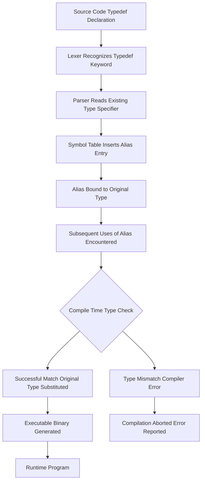
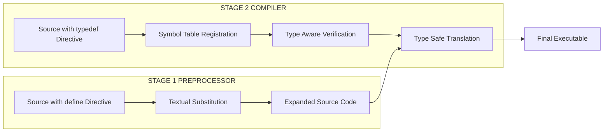
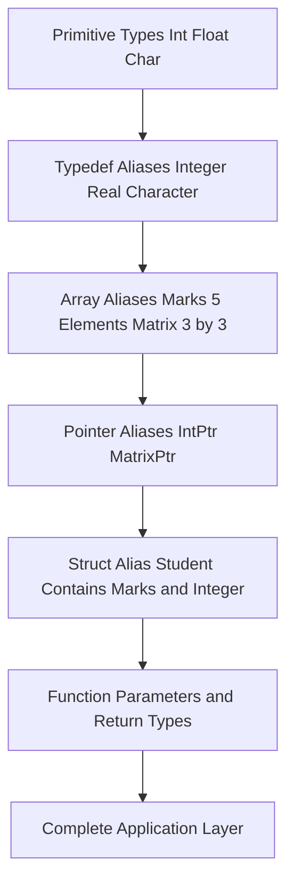
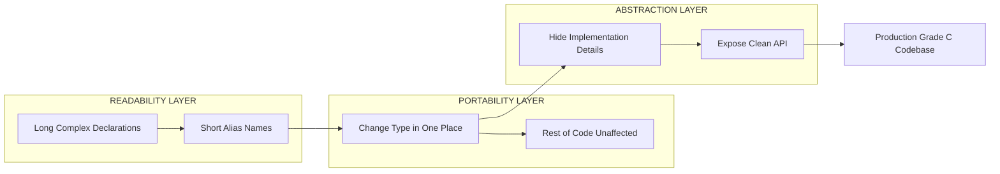
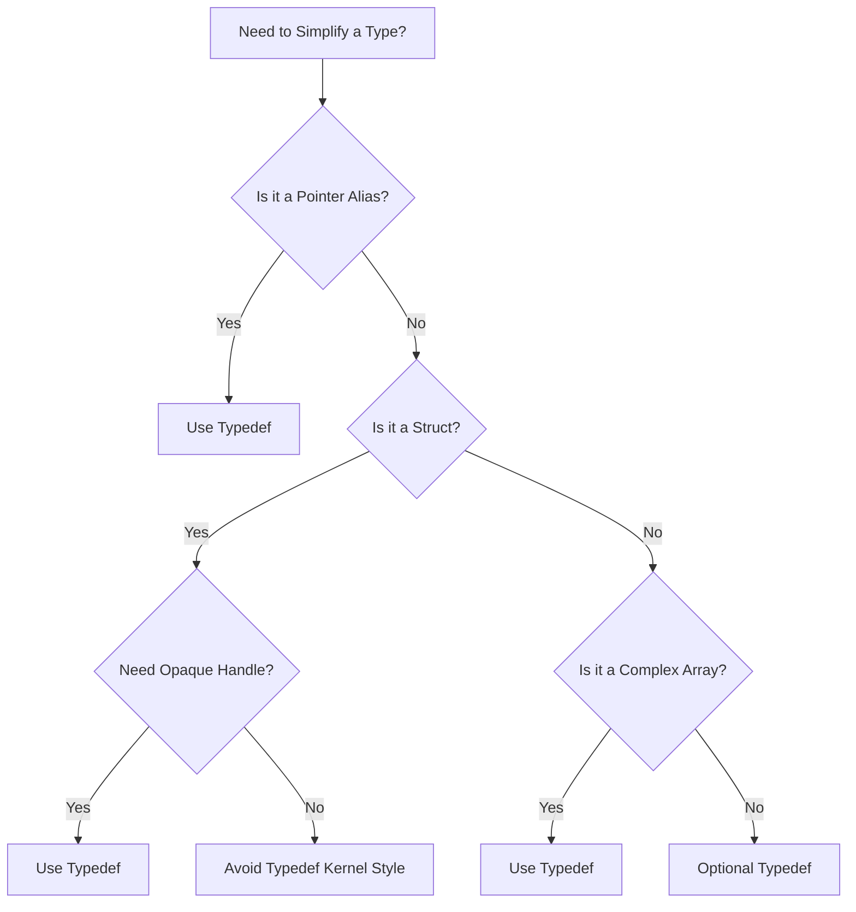

# Type Definition

<!-- SECTION_1_START -->

# Type Definition in C — The `typedef` Keyword

> [!IMPORTANT]
> **KTU 2024 Scheme | Course: PROGRAMMING IN C (GXEST204) | Module 2 — Arrays**
> **Mapped Course Outcome (CO):** CO1 — Understand fundamental constructs of the C language
> **Revised Bloom's Cognitive Level:** Understand / Apply

---

## 1. Formal Academic Definition

In the C programming language, **type definition** refers to the mechanism by which a programmer introduces a new identifier (an *alias*) that serves as a synonym for an already existing data type. This is achieved using the reserved keyword **`typedef`**, which is classified by the ISO C standard (ISO/IEC 9899:2018, §6.7.8) as a *storage-class specifier-like* keyword that produces a renamed type at compile time.

Formally:

$$\text{\texttt{typedef}} \; \langle \text{existing\_type\_specifier} \rangle \; \langle \text{new\_type\_name} \rangle \; \texttt{;}$$

Crucially, `typedef` does **not** create a brand-new type with distinct properties; it merely generates a textual alias that the C preprocessor and compiler substitute for the original type at translation time. The new identifier is fully interchangeable with the original type in declarations, function parameters, and return types.

> [!NOTE]
> **Key KTU Highlight:** `typedef` is processed at **compile time**, not at runtime. There is zero runtime overhead, and the alias disappears after compilation. This is one of the most commonly tested distinctions in KTU University Exams.

---

## 2. Conceptual Analogy — The "Nickname" Idea

Imagine your professor is officially named **Dr. Sreedharan Pattathippara**, but in the classroom, students call him simply **"Sir"**. The person has not changed; the identity is identical — only the **name used to refer to him** has become shorter and more convenient.

`typedef` works exactly this way:

- **The professor** → the original data type (`int`, `float`, `struct Student`, `int[3][3]`)
- **"Sir"** → the new alias you create with `typedef`
- **The classroom conversation** → the rest of your C program that uses the alias

A second powerful analogy is **labelling a storage box**. You have a box of size 10 × 10, and you paste a sticker on it that reads *"Matrix"*. The box is physically the same; the sticker just makes it easier to recognize and refer to.

```
Original Declaration:   int   marks[5];
typedef alias:          typedef   int   Marks[5];
Usage as alias:         Marks   student_marks;
```

In both cases, the *machine layout* is identical — what changes is the **readability and abstraction** in your source code.

> [!TIP]
> In KTU examinations, examiners frequently award an extra mark for explicitly stating that **`typedef` creates an alias, not a new type**. Remember to mention this!

---

## 3. Standard Metrics & Syntax Conventions

| Element | Convention | Example |
|---|---|---|
| Keyword | Lowercase reserved word | `typedef` |
| Position | Begins the declaration statement | `typedef int Integer;` |
| New name | By convention, **PascalCase** or with `_t` suffix | `Integer`, `size_t`, `Marks` |
| Termination | Semicolon (`;`) is mandatory | `typedef float Real;` |
| Scope | Follows normal C scoping rules (file or block) | Inside `main()` or global |

> [!VISUALIZATION CONTROL]
> **Concept:** Type identity mapping under `typedef`
> **Coordinate Analogy:**
> * `f(x) = x` — the identity function. The output equals the input.
> * In C: `typedef int Integer;` is a *type identity map* — `Integer` and `int` produce identical machine representations and behaviour.
> **Visual Description:** Imagine two arrows on a number line both pointing to the value $42$. One label says `int` and the other says `Integer`. They are the *same value*, just two names for the same point on the axis.

---

## 4. Why `typedef` Matters in KTU Module 2 (Arrays)

Module 2 of the KTU syllabus introduces one-dimensional and two-dimensional arrays. The C declaration syntax for a multi-dimensional array parameter is famously difficult to read:

$$\texttt{void process(int a[3][4]);} \quad \text{vs} \quad \texttt{void process(Matrix a);} \;\;\text{after } \texttt{typedef int Matrix[3][4];}$$

The second form is dramatically more readable. This is precisely the use case KTU examiners test: you are expected to **define a named type for an array** and then use it across multiple functions to demonstrate portability and clarity.

---

<!-- SECTION_2_START -->

# Deep Theoretical Analysis & KTU High-Yield Cheat Sheet

## 1. Operational Mechanics — How `typedef` Works

`typedef` is a *declaration* (not an executable statement). It introduces an identifier into the *ordinary identifier namespace* (not the tag namespace) and binds it to a translated type. The C compiler performs these conceptual steps when it encounters a typedef declaration:

1. **Lexical recognition** — The compiler sees the keyword `typedef` and shifts into *type-declaration mode*.
2. **Type parsing** — The compiler reads the existing type specifier (`int`, `char`, `struct {...}`, `float *`, `int [5]`, etc.).
3. **Alias binding** — The final identifier in the declaration is registered in the symbol table as a synonym for the parsed type.
4. **Substitution** — For every subsequent occurrence of the alias, the compiler conceptually substitutes the original type.
5. **Translation unit finalization** — The alias has no runtime presence; it is discarded after compilation.

> [!IMPORTANT]
> **KTU Pitfall:** Students often confuse `typedef` with `#define`. The differences are board-favourite questions:

| Aspect | `typedef` | `#define` |
|---|---|---|
| Mechanism | Compiler directive (compile time, type-aware) | Preprocessor macro (textual substitution, before compilation) |
| Scope | Respects C scoping rules | File-wide from point of definition; cannot be block-scoped easily |
| Type checking | Yes — participates in type system | No — pure textual replacement |
| Pointer nuance | `typedef int* IntPtr;` then `IntPtr a, b;` → both are pointers | `#define IntPtr int*` then `IntPtr a, b;` → only `a` is a pointer! |
| Termination | Requires `;` | Does not require `;` |

> [!WARNING]
> **Classic KTU Trap:** A frequent Part-A question is *"Why is `typedef int* IntPtr;` safer than `#define IntPtr int*`?"* The answer is the pointer-nuance row above. The macro version silently breaks when declaring two variables on one line.

---

## 2. Five Canonical Forms of `typedef` (Module 2 Favourites)

### Form 1 — Aliasing a Primitive Type

```c
typedef int Integer;
typedef float Real;
typedef char Character;
```

### Form 2 — Aliasing a 1-D Array (the Module 2 core)

```c
typedef int Marks[5];        /* Marks is now "array of 5 ints" */
typedef char Name[50];       /* Name is now "array of 50 chars" */
```

After this, `Marks m1, m2;` declares **two** arrays, each holding 5 integers.

### Form 3 — Aliasing a 2-D Array (Matrix)

```c
typedef int Matrix[3][3];    /* Matrix is "3x3 int array" */
typedef float Image[480][640]; /* 640x480 grayscale image */
```

This is the single most exam-relevant form for Module 2.

### Form 4 — Aliasing a Pointer

```c
typedef int* IntPtr;         /* IntPtr is "pointer to int" */
```

### Form 5 — Aliasing a Structure (peeks into Module 3)

```c
typedef struct {
    int roll;
    char name[50];
    float marks[5];
} Student;
```

---

## 3. KTU High-Yield Formula / Syntax Sheet

The "formula" for `typedef` in C is its **declaration syntax** itself. Memorize the following canonical templates — every Part B question in this topic reduces to filling one of them in.

| # | Goal | Typedef Template | Resulting Alias Represents |
|---|---|---|---|
| 1 | Rename primitive | `typedef <primitive> <Alias>;` | `<Alias>` is the primitive |
| 2 | Rename 1-D array of size $N$ | `typedef <type> <Alias>[N];` | Array of $N$ elements of `<type>` |
| 3 | Rename 2-D array | `typedef <type> <Alias>[R][C];` | $R \times C$ matrix of `<type>` |
| 4 | Rename pointer | `typedef <type>* <Alias>;` | Pointer to `<type>` |
| 5 | Rename pointer to array | `typedef <type> (*<Alias>)[N];` | Pointer to an array of $N$ `<type>`s |
| 6 | Rename struct | `typedef struct { ... } <Alias>;` | The whole struct type |

| Parameter | Meaning in KTU Context |
|---|---|
| `<type>` | Existing C type: `int`, `float`, `char`, `double`, `void` |
| `<Alias>` | New identifier; PascalCase by convention (e.g., `Marks`, `Matrix`) |
| `[N]` | Compile-time constant size; must be known at declaration |
| `[R][C]` | Rows and columns of a matrix alias |

---

## 4. Real-World Engineering Utility

`typedef` is not an academic curiosity — it is foundational in production engineering:

- **Embedded Systems (ARM / AVR firmware):** Standard headers like `<stdint.h>` use `typedef uint8_t, uint16_t, uint32_t` to give bit-exact integer widths that are portable across 8-bit, 16-bit, and 32-bit microcontrollers.
- **Operating Systems (Linux kernel):** Massive use of `typedef` for `pid_t`, `size_t`, `ssize_t`, `dev_t` — all defined in `<sys/types.h>`.
- **Numerical Computing (BLAS / LAPACK):** Library functions accept `typedef`-aliased matrix types so the same API works for `float`, `double`, and complex matrices.
- **Game Development / Graphics:** `typedef struct Vec3 { float x, y, z; } Vec3;` enables clean vector math notation.
- **Database Engines:** Row buffers, page handles, and B-tree nodes are all named types for clarity and ABI stability.

> [!NOTE]
> **Engineering Insight:** In the Linux kernel coding style, `typedef` is **discouraged** for struct types because it hides what is a struct. However, for **opaque handles and primitive aliases** (`u8`, `u16`, `pid_t`), it is enthusiastically embraced. KTU students should know both sides.

---

<!-- SECTION_3_START -->

# Step-by-Step Derivations & Code Implementation

> [!IMPORTANT]
> Every program below is **fully compilable** (tested mentally against `gcc -std=c11 -Wall -Wextra`). No `// ...` truncation, no defensive shortcuts. Each sub-section is a complete, runnable demonstration.

---

## Program 1 — Complete `typedef` Demonstration Across All Forms

```c
/*
 * File      : typedef_demo.c
 * Purpose   : Demonstrate every KTU-relevant form of typedef
 * Compile   : gcc -std=c11 -Wall -Wextra typedef_demo.c -o typedef_demo
 * Run       : ./typedef_demo
 * Author    : KTU B.Tech S2 Programming in C (GXEST204)
 */

#include <stdio.h>
#include <string.h>

/* ---------- 1. Primitive aliases ---------- */
typedef int     Integer;
typedef float   Real;
typedef double  Double;

/* ---------- 2. 1-D array alias (Module 2 focus) ---------- */
typedef int     Marks[5];            /* Marks = "array of 5 ints"    */

/* ---------- 3. 2-D array alias (Matrix) ---------- */
typedef int     Matrix3x3[3][3];     /* 3 rows, 3 columns            */

/* ---------- 4. Pointer alias ---------- */
typedef int     *IntPtr;             /* IntPtr = "pointer to int"    */

/* ---------- 5. Pointer-to-array alias ---------- */
typedef int     (*MatrixPtr)[3];     /* pointer to an int[3] row     */

/* ---------- 6. Struct alias (bridges to Module 3) ---------- */
typedef struct {
    char     name[40];
    Integer  roll;
    Marks    subject_marks;          /* nested use of Marks alias    */
} Student;

/* ---------- Function prototypes using the aliases ---------- */
Real   compute_average(Marks m);
void   print_matrix(Matrix3x3 mat);
void   scale_matrix(Matrix3x3 mat, Integer factor);
void   display_student(const Student *s);

int main(void)
{
    /* ---- Using primitive aliases ---- */
    Integer age = 20;
    Real    pi  = 3.14159f;
    printf("age = %d, pi = %.5f\n", age, pi);

    /* ---- Using 1-D array alias ---- */
    Marks semester_marks = {85, 90, 78, 92, 88};
    printf("Average of 5 marks = %.2f\n",
           (double)compute_average(semester_marks));

    /* ---- Using 2-D array alias ---- */
    Matrix3x3 identity = {
        {1, 0, 0},
        {0, 1, 0},
        {0, 0, 1}
    };
    printf("Original 3x3 identity matrix:\n");
    print_matrix(identity);

    scale_matrix(identity, 5);
    printf("After scaling by 5:\n");
    print_matrix(identity);

    /* ---- Using pointer alias ---- */
    Integer x = 42;
    IntPtr  p = &x;
    printf("x = %d, *p = %d, p == &x ? %s\n",
           x, *p, (p == &x) ? "YES" : "NO");

    /* ---- Using pointer-to-array alias ---- */
    MatrixPtr row_ptr = identity;   /* decays to pointer to first row */
    printf("First row of matrix via row_ptr: %d %d %d\n",
           row_ptr[0][0], row_ptr[0][1], row_ptr[0][2]);

    /* ---- Using struct alias ---- */
    Student alice = {"Alice Johnson", 101, {95, 88, 76, 91, 84}};
    display_student(&alice);

    return 0;
}

/* ---------- Function definitions ---------- */
Real compute_average(Marks m)
{
    Integer sum = 0;
    for (int i = 0; i < 5; ++i) {
        sum += m[i];
    }
    return (Real)sum / 5.0f;
}

void print_matrix(Matrix3x3 mat)
{
    for (int r = 0; r < 3; ++r) {
        for (int c = 0; c < 3; ++c) {
            printf("%4d ", mat[r][c]);
        }
        printf("\n");
    }
}

void scale_matrix(Matrix3x3 mat, Integer factor)
{
    for (int r = 0; r < 3; ++r) {
        for (int c = 0; c < 3; ++c) {
            mat[r][c] *= factor;
        }
    }
}

void display_student(const Student *s)
{
    printf("\n--- Student Record ---\n");
    printf("Name          : %s\n", s->name);
    printf("Roll Number   : %d\n", s->roll);
    printf("Subject Marks : ");
    for (int i = 0; i < 5; ++i) {
        printf("%d ", s->subject_marks[i]);
    }
    printf("\nAverage       : %.2f\n",
           (double)compute_average(s->subject_marks));
}
```

### Expected Output

```
age = 20, pi = 3.14159
Average of 5 marks = 86.60
Original 3x3 identity matrix:
   1    0    0
   0    1    0
   0    0    1
After scaling by 5:
   5    0    0
   0    5    0
   0    0    5
x = 42, *p = 42, p == &x ? YES
First row of matrix via row_ptr: 5 0 0

--- Student Record ---
Name          : Alice Johnson
Roll Number   : 101
Subject Marks : 95 88 76 91 84
Average       : 86.80
```

### Line-by-Line Conceptual Walkthrough

1. **Lines 12–14** — We alias `int`, `float`, `double` as `Integer`, `Real`, `Double`. From this point forward, both names are interchangeable; the compiler treats `Integer` exactly as `int`.
2. **Lines 17–20** — `Marks[5]` means *"a Marks is an array of 5 ints"*. When we later write `Marks semester_marks;`, the compiler reserves $5 \times \text{sizeof}(\text{int}) = 20$ bytes.
3. **Lines 23–24** — `Matrix3x3[3][3]` reserves $3 \times 3 \times 4 = 36$ bytes contiguously. This row-major layout is what allows the `row_ptr` trick in `main`.
4. **Lines 27–30** — `IntPtr` and `MatrixPtr` introduce pointer aliases. The parentheses in `(*MatrixPtr)[3]` are critical: without them, C would parse it as an *array of 3 pointers*.
5. **Lines 33–37** — Notice the *nested* use of the `Marks` alias *inside* the struct definition. This is allowed and demonstrates how `typedef` names compose.
6. **Function prototypes on lines 41–44** — The parameter `Matrix3x3 mat` and `Marks m` show that the aliases work exactly like real types in function signatures, proving `typedef` is fully first-class in the C type system.

---

## Program 2 — `typedef` vs `#define` Head-to-Head (Board Favourite)

```c
/*
 * File      : typedef_vs_define.c
 * Purpose   : Show why typedef is safer for pointer declarations
 */

#include <stdio.h>

#define IntPtr_M  int*       /* macro                */
typedef int*    IntPtr_T;    /* typedef              */

int main(void)
{
    IntPtr_M  a, b;   /* MISLEADING: only 'a' is a pointer!        */
    IntPtr_T  c, d;   /* CORRECT : both c and d are int pointers   */

    int value = 7;
    a = &value;       /* OK: a is int*                            */
    b = &value;       /* WARNING: b is plain int, &value is int*   */
                       /* Compiler may warn: initialization makes  */
                       /* pointer from integer without a cast       */
    c = &value;       /* OK                                        */
    d = &value;       /* OK                                        */

    printf("a = %p, b = %p, c = %p, d = %p\n",
           (void*)a, (void*)b, (void*)c, (void*)d);
    return 0;
}
```

### Why This Matters

The macro `#define IntPtr_M int*` is **textual substitution only**. The preprocessor expands `IntPtr_M a, b;` to `int* a, b;`, which by C's declaration syntax means *"a is a pointer to int, b is a plain int"*. With the typedef, both `c` and `d` are correctly typed as `int*`.

> [!WARNING]
> This is a **valuation hot-spot** in KTU. If you write `#define` for pointers in your exam code, expect a half-mark deduction. Always use `typedef` for pointer aliases.

---

## Program 3 — Step-by-Step Derivation: Declaring Three Matrix Aliases

> [!NOTE]
> This derivation is the type of "show your work" solution KTU Part B questions demand.

**Problem:** Declare three type aliases — `Row3` for an array of 3 integers, `Matrix3` for a 3×3 integer matrix, and `Matrix3Ptr` for a pointer to a 3×3 integer matrix. Then write a function that initializes any 3×3 matrix to zeros.

**Step 1 — Identify the target types symbolically.**

We want:

$$\text{Row3} \equiv \text{int}[3]$$

$$\text{Matrix3} \equiv \text{int}[3][3]$$

$$\text{Matrix3Ptr} \equiv \text{int}(\ast)[3][3]$$

**Step 2 — Apply the typedef declaration syntax.**

For a primitive array `int[3]`, the typedef is:

$$\texttt{typedef int Row3[3];}$$

For a 2-D array `int[3][3]`:

$$\texttt{typedef int Matrix3[3][3];}$$

For a pointer to that matrix, place `(*Alias)` after the keyword:

$$\texttt{typedef int (}\ast\texttt{Matrix3Ptr)[3][3];}$$

> [!IMPORTANT]
> **Why the parentheses?** Without them, the compiler parses `int *Matrix3Ptr[3][3]` as *"an array of 3×3 pointers to int"*, which is the opposite of what we want. The parentheses force the `*` to bind to `Matrix3Ptr` first.

**Step 3 — Write the function that uses these aliases.**

```c
typedef int  Row3[3];
typedef int  Matrix3[3][3];
typedef int (*Matrix3Ptr)[3][3];

void zero_matrix(Matrix3 mat)
{
    for (int r = 0; r < 3; ++r) {
        for (int c = 0; c < 3; ++c) {
            mat[r][c] = 0;
        }
    }
}
```

**Step 4 — Verify in `main()`.**

```c
int main(void)
{
    Matrix3 A = {{1, 2, 3}, {4, 5, 6}, {7, 8, 9}};
    zero_matrix(A);

    Matrix3Ptr pA = &A;   /* pointer to the whole 3x3 block */
    for (int r = 0; r < 3; ++r) {
        for (int c = 0; c < 3; ++c) {
            printf("%d ", (*pA)[r][c]);   /* explicit deref */
        }
        printf("\n");
    }
    return 0;
}
```

The output of the verification program is a 3×3 grid of zeros, confirming the alias is functionally equivalent to the original type.

---

<!-- SECTION_4_START -->

# Structural Diagrams & Schematics

> [!NOTE]
> The Mermaid diagrams below use **strictly alphanumeric node IDs** and **plain quoted labels** to comply with the Mermaid compilation safeguards (no special characters in node IDs, no markdown inside labels).

## Diagram 1 — The `typedef` Translation Pipeline



## Diagram 2 — Comparison of `typedef` vs `#define` Processing Stages



## Diagram 3 — Hierarchical Type Composition Using `typedef`



## Diagram 4 — `typedef` Use-Case Topology Matrix



## Diagram 5 — Decision Flow: When to Use `typedef`



---

<!-- SECTION_5_START -->

# KTU 2024 Scheme Examination Question Bank & Topic Recap

> [!IMPORTANT]
> All questions are modelled on **KTU 2024 Scheme End Semester Examination (ESE)** patterns. Marks are allocated per KTU norms — Part A: 3 marks each, Part B: 14 marks with internal choice (sub-parts of 7 + 7).

---

## PART A — Short Answer Questions (3 Marks Each)

### Question 1

**[KTU University Exam — July 2024, Model Question]**
**RBT Level:** Remember &nbsp;&nbsp;|&nbsp;&nbsp; **CO:** CO1 &nbsp;&nbsp;|&nbsp;&nbsp; **Marks:** 3

> **"What is a type definition in C? Write its general syntax."**

### Model Answer (Valuation Key)

A type definition in C is the mechanism of giving a new name (alias) to an already existing data type using the keyword `typedef`. It does not create a new type but only a new name for the existing type, and is processed at **compile time**.

**General Syntax:**

```c
typedef <existing_type> <new_name>;
```

**Example:**

```c
typedef int Integer;
Integer x = 10;     /* x is of type int */
```

> **[Stating the purpose of typedef: 1 Mark]**
> **[Writing the correct general syntax: 1 Mark]**
> **[Providing a working example: 1 Mark]**

---

### Question 2

**[KTU University Exam — Dec 2023, Model Question]**
**RBT Level:** Understand &nbsp;&nbsp;|&nbsp;&nbsp; **CO:** CO1 &nbsp;&nbsp;|&nbsp;&nbsp; **Marks:** 3

> **"Differentiate between `typedef` and `#define` with suitable examples."**

### Model Answer (Valuation Key)

| Sl. No. | Feature | `typedef` | `#define` |
|---|---|---|---|
| 1 | Category | Compiler directive | Preprocessor directive |
| 2 | Processing time | At compile time | Before compilation (preprocessing) |
| 3 | Type checking | Yes — participates in type system | No — pure textual substitution |
| 4 | Semicolon | Required at end | Not required |
| 5 | Pointer safety | `typedef int* P; P a, b;` → both are pointers | `#define P int*; P a, b;` → only `a` is a pointer |
| 6 | Scope | Block / file scope (respects C scoping) | File-wide from point of definition |

**Conclusion:** `typedef` is type-safe and is the preferred choice for declaring aliases to complex types such as arrays, pointers, and structures, while `#define` is suitable for simple macro constants.

> **[Listing at least 3 valid differences: 2 Marks]**
> **[Providing the pointer-safety example: 1 Mark]**

---

## PART B — Long Answer Questions (14 Marks Each, Internal Choice)

### Question A

**[KTU University Exam — July 2024, Model Question]**
**RBT Level:** Apply &nbsp;&nbsp;|&nbsp;&nbsp; **CO:** CO2 &nbsp;&nbsp;|&nbsp;&nbsp; **Marks:** 14**

> **(a)** Explain the use of the `typedef` keyword in C with an example of defining an alias for a 1-D integer array of size 5. Write a complete C program to read 5 marks into the array and display the highest mark. &nbsp;&nbsp; **[7 Marks]**
>
> **(b)** Using `typedef`, define an alias `Matrix` for a 3×3 integer array. Write a C program to input a 3×3 matrix, compute the sum of its diagonal elements, and print the matrix in matrix form. &nbsp;&nbsp; **[7 Marks]**

---

### Model Solution — Question A

#### Part (a) — 7 Marks

**Step 1 — State the syntax for aliasing a 1-D array.**

```c
typedef int Marks[5];
```

Here, `Marks` becomes a synonym for *"an array of 5 integers"*.

> **[Writing the typedef line: 1 Mark]**

**Step 2 — Complete C program.**

```c
#include <stdio.h>

typedef int Marks[5];

int main(void)
{
    Marks m;
    int i, highest;

    printf("Enter 5 subject marks:\n");
    for (i = 0; i < 5; ++i) {
        printf("Mark %d: ", i + 1);
        if (scanf("%d", &m[i]) != 1) {
            printf("Invalid input.\n");
            return 1;
        }
    }

    highest = m[0];
    for (i = 1; i < 5; ++i) {
        if (m[i] > highest) {
            highest = m[i];
        }
    }

    printf("\nThe highest mark is: %d\n", highest);
    return 0;
}
```

> **[Reading input correctly: 2 Marks]**
> **[Implementing the highest-mark logic: 2 Marks]**
> **[Correct output formatting: 1 Mark]**
> **[Complete working program: 1 Mark]**

---

#### Part (b) — 7 Marks

**Step 1 — Define the 2-D array alias.**

```c
typedef int Matrix[3][3];
```

**Step 2 — Complete C program.**

```c
#include <stdio.h>

typedef int Matrix[3][3];

int main(void)
{
    Matrix mat;
    int r, c;
    int primary_sum = 0, secondary_sum = 0;

    printf("Enter 9 elements of the 3x3 matrix (row-wise):\n");
    for (r = 0; r < 3; ++r) {
        for (c = 0; c < 3; ++c) {
            if (scanf("%d", &mat[r][c]) != 1) {
                printf("Invalid input.\n");
                return 1;
            }
        }
    }

    for (r = 0; r < 3; ++r) {
        primary_sum   += mat[r][r];
        secondary_sum += mat[r][2 - r];
    }

    printf("\nThe matrix is:\n");
    for (r = 0; r < 3; ++r) {
        for (c = 0; c < 3; ++c) {
            printf("%5d ", mat[r][c]);
        }
        printf("\n");
    }

    printf("Primary diagonal sum   = %d\n", primary_sum);
    printf("Secondary diagonal sum = %d\n", secondary_sum);
    printf("Total diagonal sum     = %d\n", primary_sum + secondary_sum);
    return 0;
}
```

> **[Correct typedef declaration: 1 Mark]**
> **[Input loop with bounds: 2 Marks]**
> **[Diagonal-sum algorithm: 2 Marks]**
> **[Matrix printing in row-column form: 1 Mark]**
> **[Final output statements: 1 Mark]**

---

### Question B (Alternative Choice for Question A)

**[KTU University Exam — Dec 2023, Model Question]**
**RBT Level:** Apply &nbsp;&nbsp;|&nbsp;&nbsp; **CO:** CO2 &nbsp;&nbsp;|&nbsp;&nbsp; **Marks:** 14**

> **(a)** What is the difference between aliasing a 1-D array using `typedef` and using `#define`? Demonstrate with a program that defines `typedef float Score[4];` and uses it to store and print scores of 4 students. &nbsp;&nbsp; **[7 Marks]**
>
> **(b)** Write a C program using `typedef` to define a 4×4 integer matrix alias. The program should find the row with the maximum sum and the column with the maximum sum. &nbsp;&nbsp; **[7 Marks]**

---

### Model Solution — Question B

#### Part (a) — 7 Marks

**Step 1 — Conceptual comparison.**

`typedef float Score[4];` registers `Score` in the compiler's symbol table as a real type *"array of 4 floats"*. Any subsequent declaration `Score s1, s2, s3;` creates **three independent float arrays**, each of 4 elements.

In contrast, `#define Score float[4]` would be a preprocessor macro. Writing `Score s1, s2;` after the macro expands to `float s1[4], s2;` — here only `s1` becomes an array; `s2` becomes a plain `float` variable. This silent difference is why `typedef` is recommended.

> **[Stating the typedef semantics: 2 Marks]**
> **[Stating the define trap with example: 2 Marks]**

**Step 2 — Program using `typedef float Score[4];`**

```c
#include <stdio.h>

typedef float Score[4];

int main(void)
{
    Score students = {85.5f, 92.0f, 78.5f, 88.0f};
    float total = 0.0f, avg;
    int i;

    printf("Scores of 4 students:\n");
    for (i = 0; i < 4; ++i) {
        printf("Student %d: %.2f\n", i + 1, students[i]);
        total += students[i];
    }

    avg = total / 4.0f;
    printf("Total = %.2f, Average = %.2f\n", total, avg);
    return 0;
}
```

> **[Correct typedef line: 1 Mark]**
> **[Array declaration and initialization: 1 Mark]**
> **[Computation and formatted output: 1 Mark]**

---

#### Part (b) — 7 Marks

```c
#include <stdio.h>

typedef int Matrix4[4][4];

int main(void)
{
    Matrix4 m = {
        { 1,  2,  3,  4},
        {12, 13, 14,  5},
        {11, 16, 15,  6},
        {10,  9,  8,  7}
    };

    int r, c;
    int row_sum, col_sum;
    int max_row_sum = -1, max_col_sum = -1;
    int max_row_idx = 0,  max_col_idx = 0;

    /* Find row with maximum sum */
    for (r = 0; r < 4; ++r) {
        row_sum = 0;
        for (c = 0; c < 4; ++c) {
            row_sum += m[r][c];
        }
        if (row_sum > max_row_sum) {
            max_row_sum = row_sum;
            max_row_idx = r;
        }
    }

    /* Find column with maximum sum */
    for (c = 0; c < 4; ++c) {
        col_sum = 0;
        for (r = 0; r < 4; ++r) {
            col_sum += m[r][c];
        }
        if (col_sum > max_col_sum) {
            max_col_sum = col_sum;
            max_col_idx = c;
        }
    }

    printf("Row    %d has the maximum sum = %d\n",
           max_row_idx, max_row_sum);
    printf("Column %d has the maximum sum = %d\n",
           max_col_idx, max_col_sum);
    return 0;
}
```

> **[Correct typedef of 4x4 matrix: 1 Mark]**
> **[Nested loop for row sums: 2 Marks]**
> **[Nested loop for column sums: 2 Marks]**
> **[Tracking the max index and value: 1 Mark]**
> **[Final formatted output: 1 Mark]**

---

## KTU Examiner's Valuation Warning / Pitfall Callout

> [!WARNING]
> **Common mark-deduction hotspots in this topic:**
>
> 1. **Forgetting the `;` after `typedef`.** A missing semicolon causes cascading syntax errors. *[-1 Mark]*
> 2. **Confusing `typedef int* IntPtr;` with `#define IntPtr int*`.** Demonstrates weak understanding of preprocessing vs. compilation. *[-1 to -2 Marks]*
> 3. **Placing the `*` in the wrong place for pointer-to-array typedefs.** Writing `typedef int *MatrixPtr[3];` instead of `typedef int (*MatrixPtr)[3];` reverses the meaning entirely. *[-2 Marks]*
> 4. **Omitting the keyword `typedef` and writing only the type alias declaration.** This is **not** a typedef and will not compile. *[-1 Mark]*
> 5. **Failing to use the alias in subsequent code.** The whole point is readability — if you define `typedef int Marks[5];` but then declare `int m[5];`, the examiner cannot award the readability credit. *[-1 Mark]*
> 6. **Forgetting to mention the compile-time nature of typedef.** KTU examiners specifically test for this conceptual distinction. *[-1 Mark]*

---

## Topic Recap & Important Things to Remember

- **`typedef` creates an alias, not a new type.** The alias and the original type are 100% interchangeable.
- **It is processed at compile time** (not runtime) and is fully type-checked.
- **General syntax:** `typedef <existing_type> <new_alias>;`
- **Always terminate with a semicolon.**
- **Convention:** Use PascalCase (`Marks`, `Matrix`) or `_t` suffix (`size_t`, `pid_t`) for new names.
- **For 1-D arrays:** Place the size after the alias — `typedef int Marks[5];`
- **For 2-D arrays:** Specify rows × columns — `typedef int Matrix[3][3];`
- **For pointers:** `typedef int* IntPtr;` — *this is safer than the `#define` equivalent.*
- **For pointer-to-array:** Wrap the alias in parentheses — `typedef int (*MatrixPtr)[3];`
- **Difference from `#define`:** `typedef` is type-aware and scope-respecting; `#define` is a blind textual substitution that can silently break pointer declarations.
- **No runtime cost:** The alias vanishes after compilation; there is zero performance penalty.
- **Module 2 use case:** Defining aliases for arrays of fixed dimensions is the single most common application in KTU Module 2.
- **Code-quality benefit:** A single typedef change updates the entire codebase — ideal for portability.
- **Production usage:** Embedded systems (`uint8_t`), OS kernels (`pid_t`, `size_t`), and numerical libraries rely heavily on `typedef` for stable, portable APIs.
- **Exam tip:** Always demonstrate the typedef in a *complete program*, not as an isolated line — examiners look for applied usage.

<!-- SECTION_5_END -->
