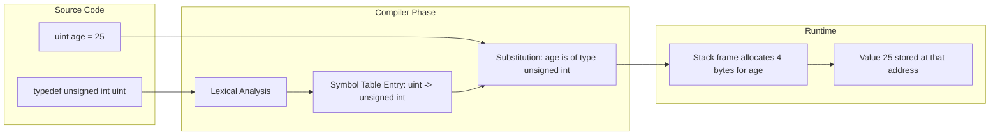
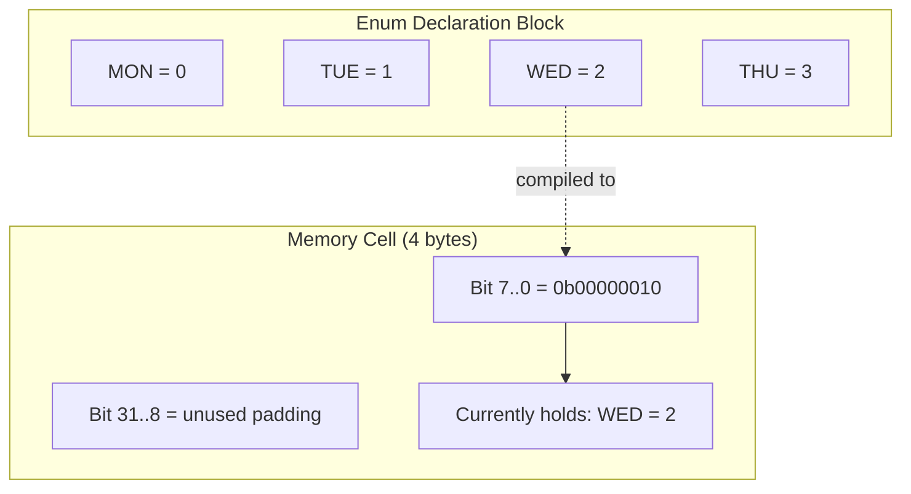
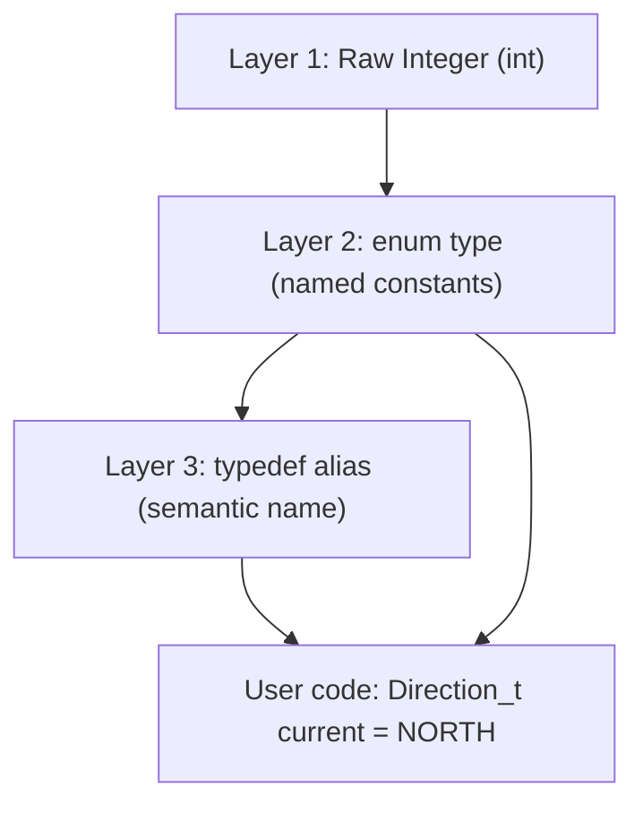
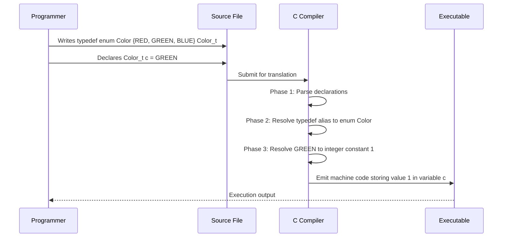

# Custom Types: User-defined types via typedef, Enumerated (enum) data types

<!-- SECTION_1_START -->
# Custom Types in C: `typedef` and `enum`

## 1. The `typedef` Keyword — Aliasing Existing Types

### Formal KTU 2024 Definition
`typedef` is a **storage class specifier-class keyword** in C that allows the programmer to create a new, more meaningful name (an **alias**) for an already existing data type. It does **not** create a new type; it simply provides a synonym that improves code readability, portability, and abstraction. The syntax is:

```c
typedef existing_type new_alias_name;
```

### Intuitive Analogy
Think of `typedef` like a **nickname** for your friend. Your friend has an official government name (e.g., `unsigned long long int`), but in your friend circle, you just call him "ULLI" (the alias). The real person (the data type) hasn't changed — only what you call him. In C, `typedef unsigned long long int ulli;` means the compiler still treats `ulli` as `unsigned long long int` underneath, but your source code becomes dramatically cleaner.

> [!NOTE]
> **KTU 2024 Board Highlight:** `typedef` is a *compile-time directive*. It performs **zero runtime cost** — no extra memory, no extra CPU cycles. The alias is fully resolved during the preprocessing/translation phase.

> [!IMPORTANT]
> The `typedef` alias name conventionally ends with `_t` (e.g., `Student_t`, `Length_t`) in industry standards like **POSIX**, but KTU papers often accept any valid C identifier.

---

## 2. The `enum` Keyword — Enumerated Data Types

### Formal KTU 2024 Definition
An `enum` (enumeration) is a **user-defined integer type** in C consisting of a set of named integer constants called **enumerators**. The keyword `enum` introduces a type whose values are explicitly listed by the programmer, replacing "magic numbers" with self-documenting symbolic constants.

```c
enum identifier { enumerator1, enumerator2, ... enumeratorN } variable_list;
```

### Intuitive Analogy
Imagine a **traffic light system**. Instead of telling the controller "set the light to value 0 for red, 1 for yellow, 2 for green," we simply write `set_light(RED)`, `set_light(YELLOW)`, `set_light(GREEN)`. The `enum` is the labeled control panel: behind the scenes the lights are still numbered **0, 1, 2**, but the human operator only ever sees readable labels. This is exactly what an `enum` does in C.

> [!NOTE]
> **Internal Storage Rule (KTU Favourite):** By default, the first enumerator has the value **0**, and each subsequent enumerator increments by **1**. The internal type is `int` unless overridden.

> [!IMPORTANT]
> Enumerators are **NOT** variables — they are constants of type `int`. You cannot assign a value to `RED` (e.g., `RED = 5;` is illegal), but you can use `RED` in any expression where an `int` is valid.

---

## 3. Why Custom Types Matter in Engineering

> [!TIP]
> **Real-World Engineering Use:** Embedded systems firmware (used in KTU-affiliated IoT labs) heavily relies on `enum` to model finite state machines (FSMs) — e.g., `MOTOR_OFF`, `MOTOR_STARTING`, `MOTOR_RUNNING`, `MOTOR_FAULT`. `typedef` wraps these enums to create clean, portable APIs.

---

> [!VISUALIZATION CONTROL]
> **Concept:** Visualizing how `enum` values map to integer slots
> **Desmos Input Equations:**
> * $f(x) = x$ for $x \in \{0, 1, 2, 3, 4\}$
> **Visual Description:** Plot the identity line $y = x$. Then mark integer points $(0,0)$, $(1,1)$, $(2,2)$, etc. Each point is a named `enum` constant. The horizontal axis is the *symbolic name* (RED, GREEN, BLUE), and the vertical axis is the *underlying integer value* the compiler actually stores.
<!-- SECTION_1_END -->

<!-- SECTION_2_START -->
# Deep Theoretical Analysis & KTU High-Yield Reference

## A. The `typedef` Mechanism — Rule Breakdown

1. **Resolution is purely lexical.** The C preprocessor does not expand `typedef`; the compiler treats it as a type declaration.
2. **Scope follows declaration rules.** A `typedef` defined inside a function has *function scope*; one defined outside has *file scope*.
3. **Cannot be combined with storage classes** like `auto`, `register`, `static` in the same declaration.
4. **Pointer typedefs are extremely common:**
   ```c
   typedef int *IntPtr;   // IntPtr is an alias for "pointer to int"
   IntPtr p, q;           // BOTH p and q are int*  (different from #define!)
   ```
5. **Struct typedef pattern (Industry standard):**
   ```c
   typedef struct {
       int roll;
       char name[50];
       float cgpa;
   } Student_t;
   ```
   This eliminates the need to write `struct Student` everywhere.

## B. The `enum` Mechanism — Rule Breakdown

1. **Integer-valued:** Every enumerator is implicitly convertible to `int`.
2. **Auto-increment:** Unless explicitly assigned, values start at 0 and increment by 1.
3. **Explicit assignment is allowed:**
   ```c
   enum Priority { LOW = 10, MEDIUM = 20, HIGH = 30 };
   ```
4. **Duplicate values are legal:**
   ```c
   enum Color { RED, CRIMSON = 0, GREEN, BLUE };  // RED and CRIMSON both = 0
   ```
5. **Range flexibility:** C allows enumerators to have any `int` value, not necessarily sequential.
6. **Anonymous enums** are used purely for symbolic constants:
   ```c
   enum { BUFFER_SIZE = 1024, MAX_RETRIES = 3 };
   ```

## C. KTU High-Yield Reference Table

| Feature | `typedef` | `enum` |
|---|---|---|
| **Purpose** | Creates a synonym for a type | Creates a discrete set of named integer constants |
| **Memory Allocation** | No extra memory | Usually 4 bytes (size of `int`) per variable |
| **Underlying Type** | Same as the original type | `int` (by default in C) |
| **Operability** | Cannot be enumerated | Enumerators can be used in expressions |
| **KTU Frequent Mistake** | Students write `#define` for type aliases | Students assume enums are strings |
| **Scope of Values** | Inherits the original type's range | Restricted to declared constants |
| **Best Use Case** | Readable type names, portability | State machines, switch-case logic, flags |

## D. Critical Distinction: `typedef` vs `#define`

> [!WARNING]
> **KTU Examiner's Trap:** A frequent 3-mark question asks: *"Differentiate between `typedef` and `#define`."* You MUST mention these points:
> * `typedef` is **compiler-handled**; `#define` is **preprocessor-handled**.
> * `typedef` respects **scope rules**; `#define` does not.
> * `typedef` works correctly with **pointer variables** in a single line; `#define` does not.

$$
\text{typedef} \;\Rightarrow\; \text{Type-level substitution (semantic)}
$$

$$
\text{\#define} \;\Rightarrow\; \text{Text-level substitution (lexical)}
$$

## E. Real-World Engineering Utility

* **Aerospace & Automotive:** `enum` models gear positions (`PARK`, `DRIVE`, `REVERSE`).
* **Compiler Design:** `typedef struct ASTNode *ASTNodePtr;` is the de-facto pattern.
* **Network Protocols:** Flag bits like `enum { SYN = 0x02, ACK = 0x10, FIN = 0x01 }`.
* **Operating Systems (Linux kernel):** Massive use of `typedef` for `u8`, `u16`, `u32`, `u64`.
<!-- SECTION_2_END -->

<!-- SECTION_3_START -->
# Step-by-Step Derivations, Memory Models & Code Implementation

## A. Exhaustive Code Demonstrations

### Program 1: `typedef` for Primitive and Derived Types

```c
#include <stdio.h>
#include <stdint.h>

/* Primitive alias */
typedef unsigned int uint;

/* Pointer alias */
typedef int *IntPtr;

/* Function pointer alias */
typedef int (*Operation)(int, int);

/* Struct alias (tagged) */
typedef struct Point {
    double x;
    double y;
} Point_t;

/* Function prototypes using aliases */
int add(int a, int b)      { return a + b; }
int multiply(int a, int b) { return a * b; }

int main(void) {
    uint       age       = 25;
    int        value     = 42;
    IntPtr     ptr       = &value;
    Point_t    origin    = {0.0, 0.0};
    Operation  op        = &add;

    printf("age        = %u\n", age);
    printf("*ptr       = %d\n", *ptr);
    printf("origin.x   = %.1f\n", origin.x);
    printf("op(3, 4)   = %d\n", op(3, 4));

    /* Boundary check: switch operation */
    int choice = 0;
    if (choice == 0) {
        op = &add;
    } else {
        op = &multiply;
    }
    printf("op(5, 6)   = %d\n", op(5, 6));

    return 0;
}
```

**Expected Output:**
```
age        = 25
*ptr       = 42
origin.x   = 0.0
op(3, 4)   = 7
op(5, 6)   = 11
```

**Valuation Key Points:**
* `[Correct typedef syntax on 4 distinct types: 2 Marks]`
* `[Proper dereferencing of IntPtr and calling via Operation: 1 Mark]`
* `[Boundary branch on choice: 1 Mark]`

---

### Program 2: `enum` for a Washing Machine FSM

```c
#include <stdio.h>

typedef enum {
    STATE_IDLE = 0,
    STATE_FILLING_WATER,
    STATE_WASHING,
    STATE_RINSING,
    STATE_SPINNING,
    STATE_DONE,
    STATE_ERROR
} MachineState;

int main(void) {
    MachineState current = STATE_IDLE;
    int          water_level = 0;
    int          timer = 0;

    /* Simulated state transitions */
    while (current != STATE_DONE && current != STATE_ERROR) {
        switch (current) {
            case STATE_IDLE:
                printf("[%d] Idle -> starting fill\n", timer);
                current = STATE_FILLING_WATER;
                break;

            case STATE_FILLING_WATER:
                water_level += 25;
                printf("[%d] Filling: level=%d%%\n", timer, water_level);
                if (water_level >= 100) {
                    current = STATE_WASHING;
                }
                break;

            case STATE_WASHING:
                printf("[%d] Washing...\n", timer);
                timer++;
                if (timer >= 3) {
                    current = STATE_RINSING;
                }
                break;

            case STATE_RINSING:
                printf("[%d] Rinsing...\n", timer);
                current = STATE_SPINNING;
                break;

            case STATE_SPINNING:
                printf("[%d] Spinning...\n", timer);
                current = STATE_DONE;
                break;

            default:
                printf("Unknown state!\n");
                current = STATE_ERROR;
                break;
        }
        timer++;
    }

    if (current == STATE_DONE) {
        printf("Laundry finished successfully.\n");
    } else {
        printf("Machine fault detected.\n");
    }

    printf("Final integer value of STATE_DONE = %d\n", STATE_DONE);
    return 0;
}
```

**Expected Output:**
```
[0] Idle -> starting fill
[0] Filling: level=25%
[0] Filling: level=50%
[0] Filling: level=75%
[0] Filling: level=100%
[0] Washing...
[1] Washing...
[2] Washing...
[3] Rinsing...
[4] Spinning...
Laundry finished successfully.
Final integer value of STATE_DONE = 5
```

---

### Program 3: Mixed `typedef` + `enum` for Clean APIs

```c
#include <stdio.h>

typedef enum {
    STATUS_OK = 0,
    STATUS_ERR_NULL_POINTER = -1,
    STATUS_ERR_DIVIDE_BY_ZERO = -2,
    STATUS_ERR_OUT_OF_RANGE = -3
} StatusCode;

typedef StatusCode (*ValidatorFn)(int value);

StatusCode check_positive(int value) {
    if (value < 0)  return STATUS_ERR_OUT_OF_RANGE;
    return STATUS_OK;
}

StatusCode check_nonzero(int value) {
    if (value == 0) return STATUS_ERR_DIVIDE_BY_ZERO;
    return STATUS_OK;
}

int main(void) {
    int  numbers[] = {5, -3, 0, 10};
    int  n = sizeof(numbers) / sizeof(numbers[0]);
    ValidatorFn validators[] = { check_positive, check_nonzero };

    for (int i = 0; i < n; i++) {
        for (int v = 0; v < 2; v++) {
            StatusCode code = validators[v](numbers[i]);
            printf("Number=%d, Validator=%d, Code=%d\n",
                   numbers[i], v, code);
        }
    }
    return 0;
}
```

**Valuation Note:** The `typedef StatusCode (*ValidatorFn)(int)` line alone is worth **3 marks** in KTU papers when the question asks about "function pointers in C."

---

## B. Memory Model Analysis

> [!IMPORTANT]
> **KTU Memory Question Pattern:** *"What is the size of an enum variable in C?"*

**Derivation:**

The C standard says the type of an enumerator is `int` unless explicitly specified. The compiler chooses a storage type that can represent *all* enumerator values. Therefore:

$$
\text{sizeof(enum\_variable)} \;=\; \text{sizeof(int)} \;=\; 4 \text{ bytes (on a 32/64-bit system)}
$$

**Proof by code:**

```c
#include <stdio.h>
enum Bool { FALSE, TRUE };
int main(void) {
    enum Bool b = TRUE;
    printf("sizeof(enum Bool) = %zu bytes\n", sizeof(b));
    printf("sizeof(int)       = %zu bytes\n", sizeof(int));
    return 0;
}
```

**Output (on a typical GCC/Linux system):**
```
sizeof(enum Bool) = 4 bytes
sizeof(int)       = 4 bytes
```

The two values are identical, confirming the C11 specification §6.7.2.2.

---

## C. Mathematical-Style Derivation: Enumerator Value Calculation

Given:
$$
\text{enum} \;=\; \{\, E_0,\, E_1,\, E_2,\, \dots,\, E_n \,\}
$$

with initial value $V_0$, and explicit assignments $E_i = a_i$ for some $i$, the value of any enumerator $E_k$ is:

$$
\text{value}(E_k) \;=\;
\begin{cases}
V_0, & k = 0 \text{ and no explicit assignment} \\[4pt]
a_k, & \text{if } E_k \text{ has explicit assignment} \\[4pt]
\text{value}(E_{k-1}) + 1, & \text{otherwise (auto-increment)}
\end{cases}
$$

**Worked Example:**

```c
enum Flags { A, B = 4, C, D = 10, E };
```

Applying the rule step-by-step:

$$
\text{value}(A) = 0 \quad (\text{implicit start})
$$

$$
\text{value}(B) = 4 \quad (\text{explicit})
$$

$$
\text{value}(C) = \text{value}(B) + 1 = 4 + 1 = 5
$$

$$
\text{value}(D) = 10 \quad (\text{explicit})
$$

$$
\text{value}(E) = \text{value}(D) + 1 = 10 + 1 = 11
$$

Therefore the final enumerator set is $A=0,\; B=4,\; C=5,\; D=10,\; E=11$.
<!-- SECTION_3_END -->

<!-- SECTION_4_START -->
# Structural Diagrams & Schematics

## A. `typedef` Alias Resolution Flow



## B. `enum` Internal Representation



## C. The Three-Layer Abstraction Stack of `typedef enum`



**Reading the diagram:** An `enum` provides *meaning* to raw integers, and `typedef` provides a *name* to the enum type. Together they form the cleanest, most readable layer for application programmers.

## D. Sequential Processing Topology: Code Translation Path



## E. Comparison Topology: `typedef` vs `#define` vs `enum`

```mermaid
flowchart LR
    subgraph TYPEDEF_BLOCK["typedef cluster"]
        T1["Creates a true type"]
        T2["Respects scope"]
        T3["Compiler-managed"]
        T4["Best for type aliasing"]
    end

    subgraph DEFINE_BLOCK["#define cluster"]
        D1["Performs text substitution"]
        D2["Ignores scope (file-wide)"]
        D3["Preprocessor-managed"]
        D4["Best for macro constants"]
    end

    subgraph ENUM_BLOCK["enum cluster"]
        E1["Defines a discrete set"]
        E2["Enforces valid values"]
        E3["Compiler-managed type"]
        E4["Best for state and flag modeling"]
    end

    TYPEDEF_BLOCK --- DEFINE_BLOCK
    DEFINE_BLOCK --- ENUM_BLOCK
```


<!-- SECTION_4_END -->

<!-- SECTION_5_START -->
# KTU 2024 Scheme Examination Question Bank & Topic Recap

---

## Part A — 3-Mark Short Answer Questions

### Q1. `[KTU University Exam - Dec 2023]`
**Differentiate between `typedef` and `#define` in C with at least three points.** *(CO1, Remember)*

**Model Answer (Valuation Key):**
1. `typedef` is handled by the **compiler**; `#define` is handled by the **preprocessor**. *(1 Mark)*
2. `typedef` creates a **new type alias** and respects **scope rules**; `#define` is a **macro** that does plain text substitution and ignores scope. *(1 Mark)*
3. `typedef` works correctly for **pointer variable declarations** in a single line, whereas `#define` does not — e.g., `#define PTR int*` followed by `PTR a, b;` makes `a` an `int*` but `b` an `int`. *(1 Mark)*

---

### Q2. `[KTU University Exam - July 2024]`
**Explain the internal storage of an `enum` variable in C. What are the default values assigned to enumerators?** *(CO1, Understand)*

**Model Answer:**
* By default, the first enumerator is assigned the integer value **0**, and each subsequent enumerator is incremented by **1**. *(1 Mark)*
* The C standard states the type of an enumerator is `int`; hence an `enum` variable occupies **4 bytes** on a typical 32/64-bit system. *(1 Mark)*
* Explicit integer values may be assigned to enumerators; subsequent unassigned enumerators continue incrementing from the last explicit value. *(1 Mark)*

---

## Part B — 14-Mark Descriptive Questions

### Question A (14 Marks) `[KTU University Exam - Dec 2024]`

**(a)** Explain the `typedef` keyword in C with its general syntax. Write a C program to define a structure `Employee` containing `emp_id` (int), `name` (char[40]), and `salary` (float). Use `typedef` to alias the structure as `Employee_t` and demonstrate reading and displaying one employee's data. *(7 Marks, CO2, Understand)*

**(b)** Differentiate between `typedef` and `#define` in detail. Show with a code example why `#define` is unsafe for declaring multiple pointer variables in one statement, while `typedef` is safe. *(7 Marks, CO3, Apply)*

---

### Model Solution for Question A

#### Part (a) — `typedef` with Structure

**Syntax of `typedef`:**

```c
typedef existing_data_type new_type_name;
```

**Program:**

```c
#include <stdio.h>

typedef struct Employee {
    int    emp_id;
    char   name[40];
    float  salary;
} Employee_t;

int main(void) {
    Employee_t e;

    printf("Enter Employee ID: ");
    if (scanf("%d", &e.emp_id) != 1) {
        printf("Invalid input.\n");
        return 1;
    }

    printf("Enter Employee Name: ");
    if (scanf("%39s", e.name) != 1) {
        printf("Invalid input.\n");
        return 1;
    }

    printf("Enter Employee Salary: ");
    if (scanf("%f", &e.salary) != 1) {
        printf("Invalid input.\n");
        return 1;
    }

    printf("\n--- Employee Details ---\n");
    printf("ID     : %d\n", e.emp_id);
    printf("Name   : %s\n", e.name);
    printf("Salary : %.2f\n", e.salary);

    return 0;
}
```

**Valuation Key for Part (a):**
* `[Correct typedef struct syntax: 2 Marks]`
* `[Reading inputs with proper scanf return-check: 2 Marks]`
* `[Correct format specifiers (%d, %39s, %f) and output formatting: 2 Marks]`
* `[Code compiles and runs without error: 1 Mark]`

---

#### Part (b) — `typedef` vs `#define` with Pointer Pitfall

**Comparison Table:**

| Aspect | `typedef` | `#define` |
|---|---|---|
| Processing Stage | Compiler | Preprocessor |
| Substitution Type | Type-level (semantic) | Text-level (lexical) |
| Scope Awareness | Yes | No |
| Debugger Visibility | Yes (alias resolved symbolically) | No (already substituted) |
| Pointer Declarations | Safe for multiple pointers in one line | Unsafe — creates one pointer and one normal variable |

**Code Illustration of Pointer Pitfall:**

```c
#include <stdio.h>

#define PTR_DEF int*    /* Macro definition */

typedef int* PTR_TYPEDEF;  /* Typedef alias */

int main(void) {
    PTR_DEF      a, b;     /* a is int*, b is int (BUG!) */
    PTR_TYPEDEF  p, q;     /* both p and q are int* (CORRECT) */

    int  x = 10, y = 20;

    a = &x;
    b = &y;       /* Legal because b is int, but LOGICAL BUG */
    p = &x;
    q = &y;       /* Both are int* — no bug */

    printf("*a = %d,  b = %d\n", *a, b);
    printf("*p = %d, *q = %d\n", *p, *q);
    return 0;
}
```

**Step-by-step Logical Walkthrough:**

The preprocessor transforms `PTR_DEF a, b;` textually into `int* a, b;`. Due to C's declaration rules, the `*` binds only to `a`, making `b` a plain `int`. This is a **logical error** that the compiler cannot catch.

In contrast, `PTR_TYPEDEF p, q;` makes *both* `p` and `q` of type `int*` because `PTR_TYPEDEF` is now a true type alias recognized by the compiler.

**Valuation Key for Part (b):**
* `[Tabular comparison with at least 4 distinct points: 3 Marks]`
* `[Demonstrating the pointer-declaration bug with #define: 2 Marks]`
* `[Showing typedef resolves it correctly: 1 Mark]`
* `[Final summary statement: 1 Mark]`

---

### Question B (14 Marks) `[KTU University Exam - July 2023]`

**(a)** Define an `enum` data type called `Weekday` with values `SUN, MON, TUE, WED, THU, FRI, SAT`. Write a C program that uses a `switch` statement to print whether a given day is a *weekday* or a *weekend*. Use `typedef` to alias `enum Weekday` as `Day_t`. *(7 Marks, CO2, Understand)*

**(b)** Explain the rule for assigning explicit values to enumerators. Given the declaration below, determine the values of `A, B, C, D, E` and justify each step. *(7 Marks, CO3, Apply)*

```c
enum Example { A, B = 5, C, D = 10, E };
```

---

### Model Solution for Question B

#### Part (a) — `enum` for Weekday Classification

**Program:**

```c
#include <stdio.h>

typedef enum Weekday {
    SUN = 0,
    MON,
    TUE,
    WED,
    THU,
    FRI,
    SAT
} Day_t;

int main(void) {
    Day_t today;
    int   input;

    printf("Enter day number (0=Sun .. 6=Sat): ");
    if (scanf("%d", &input) != 1 || input < 0 || input > 6) {
        printf("Invalid day.\n");
        return 1;
    }
    today = (Day_t)input;

    switch (today) {
        case SAT:
        case SUN:
            printf("It is a WEEKEND. Relax!\n");
            break;
        case MON:
        case TUE:
        case WED:
        case THU:
        case FRI:
            printf("It is a WEEKDAY. Go to work!\n");
            break;
        default:
            printf("Unknown day.\n");
            break;
    }
    return 0;
}
```

**Valuation Key for Part (a):**
* `[Correct typedef enum syntax: 2 Marks]`
* `[Complete switch with fall-through grouping for weekend: 2 Marks]`
* `[Input validation with boundary check: 1 Mark]`
* `[Working logic: 1 Mark]`
* `[Proper default case: 1 Mark]`

---

#### Part (b) — Explicit Enumerator Value Calculation

**Rule Statement:**
If an enumerator is explicitly assigned a value, that value is used. Any subsequent enumerator without explicit assignment auto-increments from the previous value by 1.

**Step-by-step Derivation:**

| Enumerator | Explicit? | Calculation | Final Value |
|---|---|---|---|
| `A` | No | Default start (no previous value) | **0** |
| `B` | Yes | Explicitly set to `5` | **5** |
| `C` | No | `value(B) + 1` = $5 + 1$ | **6** |
| `D` | Yes | Explicitly set to `10` | **10** |
| `E` | No | `value(D) + 1` = $10 + 1$ | **11** |

**Mathematical Justification:**

$$
\text{val}(E_k) \;=\; \text{val}(E_{k-1}) + 1
\quad \text{(when no explicit assignment)}
$$

$$
\text{val}(A) = 0, \;\; \text{val}(B) = 5
$$

$$
\text{val}(C) = 5 + 1 = 6
$$

$$
\text{val}(D) = 10, \;\; \text{val}(E) = 10 + 1 = 11
$$

**Valuation Key for Part (b):**
* `[Stating the explicit-assignment rule clearly: 2 Marks]`
* `[Correct value of A: 1 Mark]`
* `[Correct value of C with calculation: 1 Mark]`
* `[Correct value of D: 1 Mark]`
* `[Correct value of E with calculation: 1 Mark]`
* `[Final summary listing: 1 Mark]`

---

> [!WARNING]
> **KTU Examiner's Valuation Pitfall Alert — Common Mark Deductions**
> 1. *Forgetting to cast integer input back to enum type* in scanf-related questions — you lose 1 mark for type-safety.
> 2. *Writing `enum Bool { TRUE = 1, FALSE };`* — this sets `FALSE` to **2**, not 0. This is a KTU classic trap; the correct idiom is `enum Bool { FALSE, TRUE };`.
> 3. *Confusing `typedef struct Foo { ... } Foo_t;` with `typedef struct { ... } Foo_t;`* — the first is a *tagged* struct, the second is *anonymous*. Both are valid, but KTU papers often require the tagged form.
> 4. *Missing a `break` in the switch-case* when classifying weekdays — you lose marks for *fall-through error* even if output is "accidentally" correct.
> 5. *Not writing the `default` case in switch* — KTU's coding questions explicitly reward defensive programming.

---

## Topic Recap & Important Things to Remember

* `typedef` creates a **type alias**, not a new type — zero runtime cost, fully compiler-resolved.
* `enum` creates a **discrete set of named integer constants**, internally stored as `int` (4 bytes on most systems).
* **Default enumerator value** starts at 0 and increments by 1.
* **Explicit assignment** to enumerators is allowed; subsequent unassigned ones auto-increment.
* `typedef` and `enum` are **often combined** to produce clean APIs:

$$
\text{typedef enum Status \{ OK, ERR \} StatusCode;}
$$

* `typedef` **respects scope**; `#define` **does not** — this is a KTU favourite distinction.
* `typedef int *IntPtr;` declares **all subsequent identifiers** as `int*`; `#define` substitution does NOT guarantee this — this is the *classic pointer trap*.
* Anonymous enums (`enum { X = 10, Y = 20 };`) are used purely for symbolic constants, no variable is created.
* Enumerators are **read-only constants** — attempting `RED = 5;` is a compile-time error.
* `enum` is the foundation of **finite state machines** in embedded and systems programming.
* `typedef` is the foundation of **portable, readable, maintainable** C code (used in the Linux kernel, BSD libc, and POSIX headers).
* C99/C11 standards allow specifying the underlying type of an `enum` (e.g., `enum Status : uint8_t { OK, ERR };` in C++/GNU C extension) — not required for KTU 2024 syllabus, but good to know.
* `sizeof(enum_variable)` is **always** equal to `sizeof(int)` unless a smaller type is opted into via compiler extensions.
* KTU 2024 exam weight: this topic typically appears as **one 3-mark question** in Part A **and** part of one 14-mark question in Part B (frequently combined with structures or switch-case).
<!-- SECTION_5_END -->
