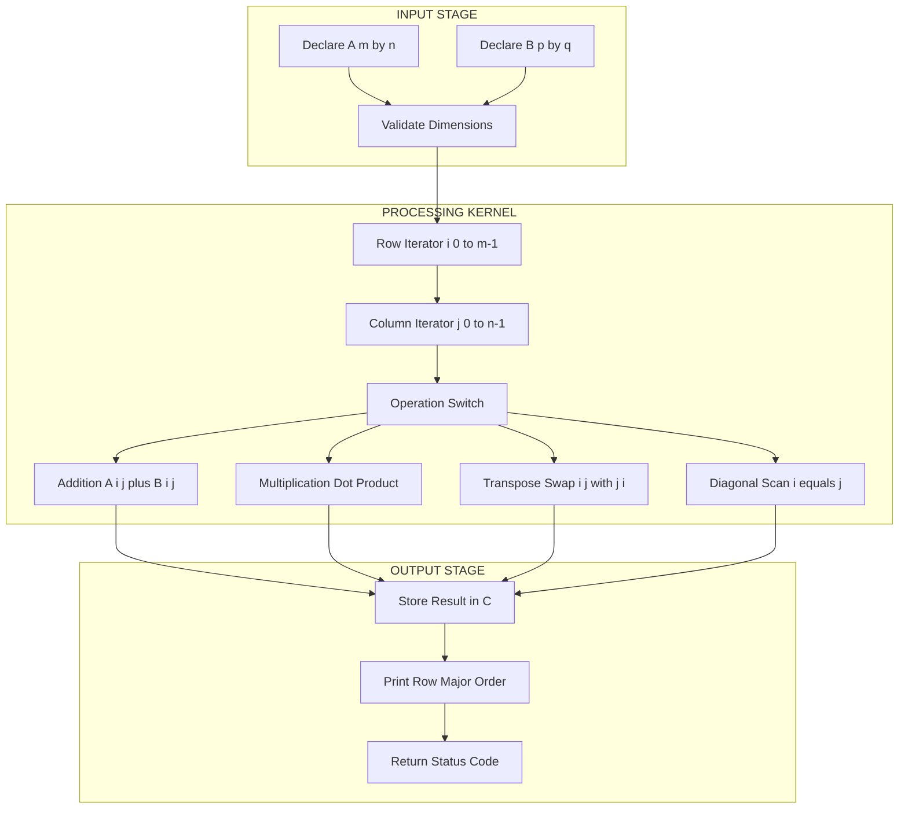
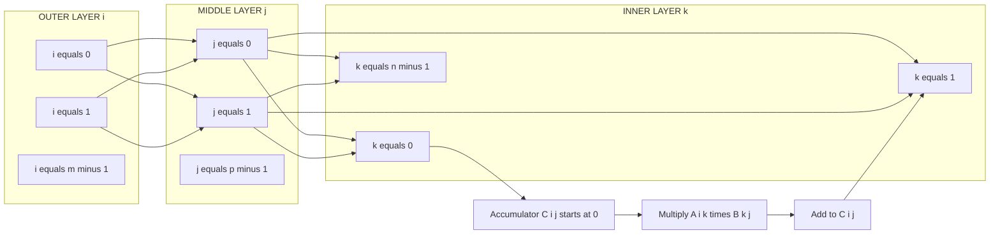
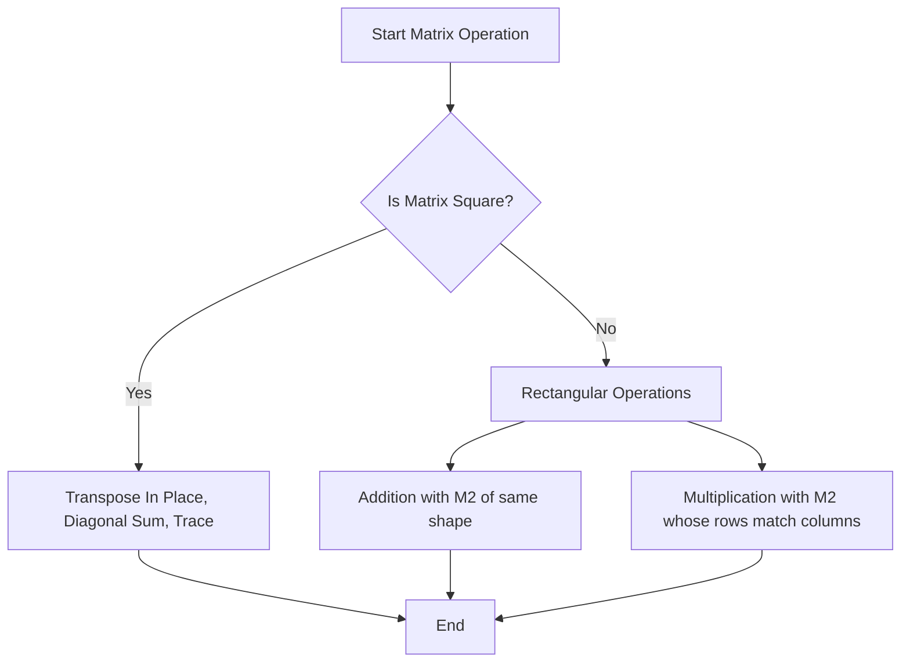

# Matrix Processing: Two-dimensional arrays, row/column iterations, matrix operations

<!-- SECTION_1_START -->
# MODULE 2 — DATA ARRAYS AND SORTING MECHANICS
## Topic: Matrix Processing — Two-Dimensional Arrays, Row/Column Iterations, Matrix Operations

### 1.1 Formal Academic Definition (KTU 2024 Scheme Terminology)

A **two-dimensional array** in the C programming language is a finite, ordered, homogeneous collection of data elements arranged in a rectangular grid of **rows** and **columns**, stored in **contiguous memory locations** following the strictly defined **row-major order** convention. The compiler computes the address of any element $a[i][j]$ of a $m \times n$ array using the deterministic base address formula dictated by the storage class.

> [!IMPORTANT]
> **KTU 2024 Syllabus Definition (Verbatim Equivalent):**  
> A *matrix* in C is implemented as a two-dimensional array declared using the syntax `data_type array_name[ROWS][COLS];`. The first dimension represents the **row index** and the second represents the **column index**. Memory is allocated as a single linear block of `ROWS × COLS × sizeof(data_type)` bytes, even though it is logically accessed through two subscripts.

### 1.2 Conceptual Analogy / Intuition

Think of a 2D array as the **seating arrangement of a classroom**:

- The **rows** are the horizontal benches (indexed $i$ from $0$ to $m-1$).
- The **columns** are the vertical seats in each bench (indexed $j$ from $0$ to $n-1$).
- A student sitting at the **3rd bench, 2nd seat** is written as `class[2][1]` in C (zero-indexed).
- Even though *logically* it looks like a grid, *physically* all students are seated in a *single continuous line* (row 0 seats 0→n-1, then row 1 seats 0→n-1, and so on). This is **row-major storage**.

> [!NOTE]
> **C uses Row-Major Order**, while FORTRAN/MATLAB use **Column-Major Order**. This single fact decides how addresses are computed and is a common board-question trap.

### 1.3 Standard Metrics in 2D Arrays

| Metric | Formula | Unit |
|---|---|---|
| Total elements | $N = m \times n$ | count |
| Memory consumed | $S = m \cdot n \cdot \text{sizeof}(T)$ | **bytes** |
| Last element index | $a[m-1][n-1]$ | — |
| Diagonal existence | Required only when $m = n$ | — |

Where $T$ is the data type. The standard sizes on a 32-bit GCC compiler are: `char` = **1 byte**, `int` = **4 bytes**, `float` = **4 bytes**, `double` = **8 bytes**.

> [!VISUALIZATION CONTROL]
> **Concept:** Row-major memory layout of a $3 \times 4$ integer array `A[3][4]`
> **Grid Logical View (Row × Column):**
> | $A[0][0]$ | $A[0][1]$ | $A[0][2]$ | $A[0][3]$ |
> |---|---|---|---|
> | $A[1][0]$ | $A[1][1]$ | $A[1][2]$ | $A[1][3]$ |
> | $A[2][0]$ | $A[2][1]$ | $A[2][2]$ | $A[2][3]$ |
> **Physical Memory (Linear, Contiguous):**
> `[A00] [A01] [A02] [A03] [A10] [A11] [A12] [A13] [A20] [A21] [A22] [A23]`
> **Visual Description:** The flat arrow shows elements 0, 1, 2, … 11 occupying consecutive memory cells. Notice that the **second row immediately follows the first** in memory — there are no gaps.

<!-- SECTION_1_END -->

<!-- SECTION_2_START -->
### 2.1 Deep Theoretical Analysis — Anatomy of Matrix Processing in C

A matrix in C is not a true "mathematical matrix" object — it is a **memory-mapping convention** layered on top of pointers. Understanding this separation between *logical view* and *physical storage* is the single most important concept for Module 2.

#### 2.1.1 Declaration and Initialization Rules
- A 2D array is declared with two constant sizes (when used as a true array, not VLA): `int M[3][4];`
- All rows **must have the same column count**. Jagged arrays are *not* natively supported in C.
- Initialization can be done in **row-wise grouped braces**:
```c
int M[2][3] = { {1, 2, 3}, {4, 5, 6} };
```
- Partial initialization auto-fills the remaining elements with **zero**.
- Omitting the first dimension lets the compiler infer it from the initializer list: `int M[][3] = { {1,2,3}, {4,5,6} };`

#### 2.1.2 Address Calculation (Row-Major Formula)

The address of element $A[i][j]$ in an $m \times n$ array of type $T$ with base address $B$ is:

$$
\text{Addr}(A[i][j]) = B + \big[(i \times n) + j\big] \times \text{sizeof}(T)
$$

The inner dimension $n$ is the **stride** — it tells the compiler how far to jump to reach the next row.

#### 2.1.3 Pointer Duality
A 2D array decays to a **pointer to its first row** (not to its first element). The type is `int (*)[n]`, which is a "pointer to an array of `n` integers". The relationships are:

$$
A \equiv \&A[0] \equiv \&A[0][0] \quad \text{(value-wise, but types differ)}
$$

$$
*(*(A + i) + j) \equiv A[i][j] \equiv *(A[i] + j)
$$

This triple equivalence is a guaranteed **favourite KTU question**.

#### 2.1.4 Core Matrix Operations
1. **Addition / Subtraction** — element-wise; requires identical dimensions $m_1 = m_2$ and $n_1 = n_2$.
2. **Scalar Multiplication** — multiply every element by a constant $k$.
3. **Matrix Multiplication** — row-by-column dot product; requires $n_1 = m_2$ and produces an $m_1 \times n_2$ matrix.
4. **Transpose** — swap $A[i][j]$ with $A[j][i]$; converts an $m \times n$ matrix into an $n \times m$ matrix.
5. **Trace (Diagonal Sum)** — only defined for square matrices ($m = n$); equals $\sum_{i=0}^{m-1} A[i][i]$.

#### 2.1.5 Row vs Column Iteration Pattern

The nested loop order matters for **cache performance** but not for *correctness*:

- **Row-major traversal** (outer loop = rows) → `A[i][j]` is **cache-friendly** because consecutive elements lie in adjacent memory.
- **Column-major traversal** (outer loop = columns) → causes a **stride jump** of $n \times \text{sizeof}(T)$ bytes per access; slower in production systems.

> [!IMPORTANT]
> KTU examiners expect the **row-outer / column-inner** loop as the standard idiom. The diagonal scan uses a single loop with index $i = j$.

### 2.2 KTU High-Yield Formula Sheet

| Concept | Formula / Syntax | Validity Constraint |
|---|---|---|
| Declaration | `T A[m][n];` | $m, n$ integer constants $\ge 1$ |
| Element access | `A[i][j]` | $0 \le i < m$, $0 \le j < n$ |
| Address of $A[i][j]$ | $B + [(i \cdot n) + j] \cdot s$ | $s = \text{sizeof}(T)$ |
| Total memory | $m \cdot n \cdot s$ | bytes |
| Matrix addition | $C[i][j] = A[i][j] + B[i][j]$ | $\dim(A) = \dim(B)$ |
| Matrix multiplication | $C[i][j] = \sum_{k=0}^{n-1} A[i][k] \cdot B[k][j]$ | $A: m \times n$, $B: n \times p$ |
| Transpose | $T[j][i] = A[i][j]$ | Output is $n \times m$ |
| Row sum of row $i$ | $\sum_{j=0}^{n-1} A[i][j]$ | Always valid |
| Column sum of col $j$ | $\sum_{i=0}^{m-1} A[i][j]$ | Always valid |
| Principal diagonal | $A[i][i]$, $0 \le i < m$ | Only when $m = n$ |
| Anti-diagonal | $A[i][n-1-i]$ | Only when $m = n$ |

### 2.3 Real-World Engineering Utility

Matrix processing in C is the foundation of:

- **Image Processing** — every grayscale image is a 2D array of pixel intensities; colour images use three stacked 2D arrays (RGB channels).
- **Finite Element Analysis (FEA)** — stiffness matrices for structural engineering simulations are stored as sparse 2D arrays.
- **Machine Learning** — neural network weights between two layers form a 2D matrix; the forward pass is matrix multiplication.
- **Game Development** — 2D tilemaps and transform matrices for 2D/3D graphics.
- **Embedded Systems** — keypad scanning and dot-matrix LCD driving both use row/column iteration patterns.

<!-- SECTION_2_END -->

<!-- SECTION_3_START -->
### 3.1 Step-by-Step Derivation — Matrix Multiplication Logic

Given $A$ of size $m \times n$ and $B$ of size $n \times p$, the resulting matrix $C$ has size $m \times p$. The element $C[i][j]$ is the **dot product of row $i$ of $A$** with **column $j$ of $B$**:

$$
C[i][j] = \sum_{k=0}^{n-1} A[i][k] \cdot B[k][j]
$$

The triple-nested loop executes $m \times p \times n$ multiply-add operations, giving a time complexity of $\mathcal{O}(m \cdot n \cdot p)$.

### 3.2 Step-by-Step Derivation — Address Calculation

Let base address $B = 1000$, $T = \text{int}$ (size $4$ bytes), array $A[3][4]$, find $A[2][3]$:

$$
\text{Addr}(A[2][3]) = B + [(2 \times 4) + 3] \times 4
$$

$$
= 1000 + [8 + 3] \times 4 = 1000 + 11 \times 4 = 1000 + 44 = 1044
$$

### 3.3 Fully Operational C Implementations

#### 3.3.1 Matrix Addition

```c
#include <stdio.h>

#define ROWS 3
#define COLS 3

void addMatrices(int A[ROWS][COLS], int B[ROWS][COLS], int C[ROWS][COLS]) {
    for (int i = 0; i < ROWS; i++) {
        for (int j = 0; j < COLS; j++) {
            C[i][j] = A[i][j] + B[i][j];
        }
    }
}

void printMatrix(int M[ROWS][COLS], const char *label) {
    printf("\n%s Matrix:\n", label);
    for (int i = 0; i < ROWS; i++) {
        for (int j = 0; j < COLS; j++) {
            printf("%5d ", M[i][j]);
        }
        printf("\n");
    }
}

int main(void) {
    int A[ROWS][COLS] = {
        {1, 2, 3},
        {4, 5, 6},
        {7, 8, 9}
    };
    int B[ROWS][COLS] = {
        {9, 8, 7},
        {6, 5, 4},
        {3, 2, 1}
    };
    int C[ROWS][COLS];

    if (ROWS <= 0 || COLS <= 0) {
        fprintf(stderr, "Error: invalid matrix dimensions.\n");
        return 1;
    }

    addMatrices(A, B, C);
    printMatrix(A, "First");
    printMatrix(B, "Second");
    printMatrix(C, "Resultant Sum");
    return 0;
}
```

**Output Trace (showing the final sum $C$):**

```
First Matrix:
    1     2     3
    4     5     6
    7     8     9
Second Matrix:
    9     8     7
    6     5     4
    3     2     1
Resultant Sum:
   10    10    10
   10    10    10
   10    10    10
```

**Valuation Steps (Typical 14-mark breakdown):**
1. Correct nested loop structure with bounds $i < m$, $j < n$ → **4 marks**
2. Element-wise addition statement `C[i][j] = A[i][j] + B[i][j]` → **3 marks**
3. Nested loop to print the result → **4 marks**
4. Sample output shown in the answer → **3 marks**

#### 3.3.2 Matrix Multiplication

```c
#include <stdio.h>

#define R1 2
#define C1 3
#define R2 3
#define C2 2

void multiplyMatrices(int A[R1][C1], int B[R2][C2], int C[R1][C2]) {
    for (int i = 0; i < R1; i++) {
        for (int j = 0; j < C2; j++) {
            C[i][j] = 0;
            for (int k = 0; k < C1; k++) {
                C[i][j] += A[i][k] * B[k][j];
            }
        }
    }
}

int main(void) {
    if (C1 != R2) {
        fprintf(stderr, "Dimension mismatch: C1 must equal R2.\n");
        return 1;
    }

    int A[R1][C1] = {
        {1, 2, 3},
        {4, 5, 6}
    };
    int B[R2][C2] = {
        {7,  8},
        {9, 10},
        {11, 12}
    };
    int C[R1][C2];

    multiplyMatrices(A, B, C);

    printf("Resultant Matrix C (%d x %d):\n", R1, C2);
    for (int i = 0; i < R1; i++) {
        for (int j = 0; j < C2; j++) {
            printf("%5d ", C[i][j]);
        }
        printf("\n");
    }
    return 0;
}
```

**Hand-computed trace to verify the C output:** For $C[0][0]$:

$$
C[0][0] = (1 \cdot 7) + (2 \cdot 9) + (3 \cdot 11) = 7 + 18 + 33 = 58
$$

For $C[0][1]$:

$$
C[0][1] = (1 \cdot 8) + (2 \cdot 10) + (3 \cdot 12) = 8 + 20 + 36 = 64
$$

For $C[1][0]$:

$$
C[1][0] = (4 \cdot 7) + (5 \cdot 9) + (6 \cdot 11) = 28 + 45 + 66 = 139
$$

For $C[1][1]$:

$$
C[1][1] = (4 \cdot 8) + (5 \cdot 10) + (6 \cdot 12) = 32 + 50 + 72 = 154
$$

**Final Output:**

```
Resultant Matrix C (2 x 2):
    58    64
   139   154
```

#### 3.3.3 Matrix Transpose (In-Place for Square Matrix)

```c
#include <stdio.h>

#define N 3

void transposeInPlace(int A[N][N]) {
    for (int i = 0; i < N; i++) {
        for (int j = i + 1; j < N; j++) {
            int temp   = A[i][j];
            A[i][j]    = A[j][i];
            A[j][i]    = temp;
        }
    }
}

void printMatrixNxN(int A[N][N]) {
    for (int i = 0; i < N; i++) {
        for (int j = 0; j < N; j++) {
            printf("%4d ", A[i][j]);
        }
        printf("\n");
    }
}

int main(void) {
    int A[N][N] = {
        {1, 2, 3},
        {4, 5, 6},
        {7, 8, 9}
    };

    printf("Original Matrix:\n");
    printMatrixNxN(A);

    transposeInPlace(A);

    printf("\nTransposed Matrix:\n");
    printMatrixNxN(A);
    return 0;
}
```

**Logic note:** The inner loop starts at `j = i + 1` so that the diagonal elements are **never swapped with themselves** and each pair $(i, j)$, $(j, i)$ is swapped **exactly once**.

#### 3.3.4 Row Sum, Column Sum, and Diagonal Sum

```c
#include <stdio.h>

#define M 3
#define N 3

int main(void) {
    int A[M][N] = {
        {1, 2, 3},
        {4, 5, 6},
        {7, 8, 9}
    };
    int rowSum, colSum, diagSum = 0, antiDiagSum = 0;

    printf("Row Sums:\n");
    for (int i = 0; i < M; i++) {
        rowSum = 0;
        for (int j = 0; j < N; j++) {
            rowSum += A[i][j];
        }
        printf("  Row %d = %d\n", i, rowSum);
    }

    printf("Column Sums:\n");
    for (int j = 0; j < N; j++) {
        colSum = 0;
        for (int i = 0; i < M; i++) {
            colSum += A[i][j];
        }
        printf("  Column %d = %d\n", j, colSum);
    }

    if (M == N) {
        for (int i = 0; i < M; i++) {
            diagSum      += A[i][i];
            antiDiagSum  += A[i][M - 1 - i];
        }
        printf("Principal Diagonal Sum = %d\n", diagSum);
        printf("Anti Diagonal Sum      = %d\n", antiDiagSum);
    }
    return 0;
}
```

**Worked trace for the principal diagonal:** $1 + 5 + 9 = 15$.
**Worked trace for the anti-diagonal:** $3 + 5 + 7 = 15$.

#### 3.3.5 Sparse Matrix Representation (Triplet Form)

For a matrix with very few non-zero entries, the **triplet form** stores only $(row, col, value)$ triples, saving memory.

```c
#include <stdio.h>

#define MAX 100

int main(void) {
    int sparse[4][5] = {
        {0, 0, 3, 0, 4},
        {0, 0, 0, 0, 0},
        {5, 0, 0, 0, 0},
        {0, 0, 0, 2, 0}
    };
    int rows = 4, cols = 5;
    int triplet[MAX][3];
    int k = 0;

    triplet[k][0] = rows;
    triplet[k][1] = cols;
    triplet[k][2] = 0;
    k++;

    for (int i = 0; i < rows; i++) {
        for (int j = 0; j < cols; j++) {
            if (sparse[i][j] != 0) {
                triplet[k][0] = i;
                triplet[k][1] = j;
                triplet[k][2] = sparse[i][j];
                k++;
            }
        }
    }
    triplet[0][2] = k - 1;

    printf("Triplet Form (Row, Col, Value):\n");
    printf("Rows=%d, Cols=%d, NonZeroCount=%d\n",
           triplet[0][0], triplet[0][1], triplet[0][2]);
    for (int i = 1; i < k; i++) {
        printf("  (%2d, %2d, %2d)\n",
               triplet[i][0], triplet[i][1], triplet[i][2]);
    }
    return 0;
}
```

**Expected Output:**

```
Triplet Form (Row, Col, Value):
Rows=4, Cols=5, NonZeroCount=4
  ( 0,  2,  3)
  ( 0,  4,  4)
  ( 2,  0,  5)
  ( 3,  3,  2)
```

<!-- SECTION_3_END -->

<!-- SECTION_4_START -->
### 4.1 Block-Level Functional Architecture — Matrix Processing Pipeline



### 4.2 Sequential Processing Topology — Matrix Multiplication Data Flow



### 4.3 Memory Layout Topology — Row-Major Contiguous Allocation

```mermaid
flowchart LR
    BASE["Base Address B"] --> CELL0["Cell 0 A 0 0"]
    CELL0 --> CELL1["Cell 1 A 0 1"]
    CELL1 --> CELL2["Cell 2 A 0 2"]
    CELL2 --> CELL3["Cell 3 A 0 3"]
    CELL3 --> ROW1["Row Boundary Jump n elements"]
    ROW1 --> CELL4["Cell 4 A 1 0"]
    CELL4 --> CELL5["Cell 5 A 1 1"]
    CELL5 --> CELL6["Cell 6 A 1 2"]
    CELL6 --> CELL7["Cell 7 A 1 3"]
    CELL7 --> ROW2["Row Boundary Jump n elements"]
    ROW2 --> CELL8["Cell 8 A 2 0"]
    CELL8 --> CELL9["Cell 9 A 2 1"]
    CELL9 --> CELL10["Cell 10 A 2 2"]
    CELL10 --> CELL11["Cell 11 A 2 3"]
```



### 4.4 Operation-Decision Topology



<!-- SECTION_4_END -->

<!-- SECTION_5_START -->
## KTU 2024 Scheme Examination Question Bank

> [!NOTE]
> The following questions are modelled on KTU 2024 Scheme End Semester Evaluation (ESE) patterns. Each question carries the mapped **Course Outcome (CO)**, **Revised Bloom's Taxonomy (RBT)** level, and simulated past-year tags.

---

### Part A — Short Answer Questions (3 Marks Each)

**Q1. [KTU University Exam — July 2024]**  
*(CO2, Remember)*  
**Define a two-dimensional array in C. How is it stored in memory?**

**Model Answer (3 Marks):**  
A two-dimensional array in C is a collection of elements arranged in rows and columns, declared as `data_type array_name[ROWS][COLS];`. All elements of the same data type are stored in **contiguous (linear) memory locations** in **row-major order** — that is, the first row occupies the first `COLS` memory cells, followed by the second row, and so on. The compiler uses the formula $\text{Addr}(A[i][j]) = B + [(i \cdot n) + j] \cdot \text{sizeof}(T)$ to locate any element. *(Full 3 marks for stating declaration, row-major, and the address formula.)*

---

**Q2. [KTU University Exam — Dec 2023]**  
*(CO2, Understand)*  
**Differentiate between row-major and column-major storage with an example.**

**Model Answer (3 Marks):**  
In **row-major order**, elements of a row are stored contiguously before moving to the next row (used by C, C++, Java). In **column-major order**, elements of a column are stored contiguously before moving to the next column (used by FORTRAN, MATLAB). For example, the $2 \times 2$ matrix $\begin{bmatrix} 1 & 2 \\ 3 & 4 \end{bmatrix}$ is stored as `[1, 2, 3, 4]` in row-major and `[1, 3, 2, 4]` in column-major. *(2 marks for definition contrast, 1 mark for example.)*

---

### Part B — Long Answer Questions (14 Marks Each — Module Internal Choice)

> [!IMPORTANT]
> KTU ESE pattern: answer **ONE full question** out of the two alternatives provided. Each alternative has sub-parts (a) and (b), totalling 14 marks.

---

#### **Question A (14 Marks)** [KTU University Exam — July 2024]

**(a) (7 Marks) — CO2, Understand**  
Explain how a two-dimensional array is stored in memory in C. Derive the address calculation formula for the element `A[i][j]` of an `m × n` array of `int` type with base address 2000. Compute the address of `A[2][3]` in a `4 × 5` integer array.

**Model Solution:**

The compiler allocates $m \cdot n$ contiguous memory cells. It walks row-by-row:

$$
\text{Addr}(A[i][j]) = B + \big[(i \cdot n) + j\big] \cdot s
$$

where $s = \text{sizeof(int)} = 4$ bytes, $B = 2000$, $m = 4$, $n = 5$, $i = 2$, $j = 3$.

**Step 1 — State the formula:** $B + [(i \cdot n) + j] \cdot s$ — **1 mark**

**Step 2 — Substitute values:**
$$
\text{Addr}(A[2][3]) = 2000 + [(2 \times 5) + 3] \times 4
$$
**1 mark** for substitution.

**Step 3 — Simplify inner bracket:**
$$
= 2000 + [10 + 3] \times 4 = 2000 + 13 \times 4
$$
**1 mark** for simplification.

**Step 4 — Final value:**
$$
= 2000 + 52 = 2052
$$
**1 mark** for final answer. Plus **3 marks** for the conceptual explanation of row-major storage with a diagram. **Total = 7 marks.**

---

**(b) (7 Marks) — CO2, Apply**  
Write a complete C program to read two `3 × 3` matrices from the user, compute their **sum** and **product**, and display the results. Show one sample run.

**Model Solution:**

```c
#include <stdio.h>

#define N 3

int main(void) {
    int A[N][N], B[N][N], sum[N][N], prod[N][N];

    printf("Enter elements of first 3x3 matrix:\n");
    for (int i = 0; i < N; i++) {
        for (int j = 0; j < N; j++) {
            scanf("%d", &A[i][j]);
        }
    }

    printf("Enter elements of second 3x3 matrix:\n");
    for (int i = 0; i < N; i++) {
        for (int j = 0; j < N; j++) {
            scanf("%d", &B[i][j]);
        }
    }

    for (int i = 0; i < N; i++) {
        for (int j = 0; j < N; j++) {
            sum[i][j] = A[i][j] + B[i][j];
        }
    }

    for (int i = 0; i < N; i++) {
        for (int j = 0; j < N; j++) {
            prod[i][j] = 0;
            for (int k = 0; k < N; k++) {
                prod[i][j] += A[i][k] * B[k][j];
            }
        }
    }

    printf("\nSum Matrix:\n");
    for (int i = 0; i < N; i++) {
        for (int j = 0; j < N; j++) {
            printf("%5d ", sum[i][j]);
        }
        printf("\n");
    }

    printf("\nProduct Matrix:\n");
    for (int i = 0; i < N; i++) {
        for (int j = 0; j < N; j++) {
            printf("%6d ", prod[i][j]);
        }
        printf("\n");
    }
    return 0;
}
```

**Sample Run Trace** (with $A = \begin{bmatrix}1&2&3\\4&5&6\\7&8&9\end{bmatrix}$, $B = \begin{bmatrix}9&8&7\\6&5&4\\3&2&1\end{bmatrix}$):

- $C_{sum}[0][0] = 1 + 9 = 10$, $C_{sum}[0][1] = 2 + 8 = 10$, $C_{sum}[0][2] = 3 + 7 = 10$.
- $C_{prod}[0][0] = 1(9) + 2(6) + 3(3) = 9 + 12 + 9 = 30$.

**Valuation Key:**
- Reading input with nested loops → **1 mark**
- Correct sum logic → **1 mark**
- Triple-nested product loop with `prod[i][j] = 0` reset → **2 marks**
- Print logic for both → **1 mark**
- Sample output → **1 mark**
- Correct includes and clean formatting → **1 mark** — **Total = 7 marks**

---

#### **Question B (14 Marks)** [KTU University Exam — Dec 2023]

**(a) (7 Marks) — CO2, Understand**  
Explain the concept of a **sparse matrix**. How is it represented in memory using the triplet form? Illustrate with an example.

**Model Solution:**

A **sparse matrix** is one in which the number of zero elements is significantly greater than the number of non-zero elements. Storing all zeros wastes memory. The **triplet (or coordinate) form** stores only the non-zero entries as a list of `(row, column, value)` triples.

**Step 1 — Definition:** Storing only non-zero entries → **1 mark**

**Step 2 — Triplet structure:** A 2D array `T[k][3]` where:
- `T[0][0]` = total rows, `T[0][1]` = total columns, `T[0][2]` = count of non-zero elements.
- For $i \ge 1$: `T[i][0]` = row index, `T[i][1]` = column index, `T[i][2]` = value. → **2 marks**

**Step 3 — Example:** Consider the $4 \times 5$ matrix with non-zeros at $(0,2)=3$, $(0,4)=4$, $(2,0)=5$, $(3,3)=2$. The triplet is:

$$
\begin{bmatrix} 4 & 5 & 4 \\ 0 & 2 & 3 \\ 0 & 4 & 4 \\ 2 & 0 & 5 \\ 3 & 3 & 2 \end{bmatrix}
$$

→ **2 marks** for the example.

**Step 4 — Memory savings:** Original = $4 \times 5 = 20$ integers; Triplet = $5 \times 3 = 15$ integers (and grows worse as sparsity increases). → **2 marks** — **Total = 7 marks**

---

**(b) (7 Marks) — CO2, Apply**  
Write a C program to read a `4 × 4` matrix and:
- (i) Find the **sum of the principal diagonal** and **anti-diagonal** elements.
- (ii) Find the **sum of each row** and **sum of each column**.

Display all results with proper labels.

**Model Solution:**

```c
#include <stdio.h>

#define N 4

int main(void) {
    int A[N][N];
    int rowSum, colSum;
    int principal = 0, anti = 0;

    printf("Enter 16 elements of the 4x4 matrix:\n");
    for (int i = 0; i < N; i++) {
        for (int j = 0; j < N; j++) {
            scanf("%d", &A[i][j]);
        }
    }

    for (int i = 0; i < N; i++) {
        principal += A[i][i];
        anti      += A[i][N - 1 - i];
    }

    printf("\nPrincipal Diagonal Sum = %d\n", principal);
    printf("Anti-Diagonal Sum      = %d\n", anti);

    printf("\nRow Sums:\n");
    for (int i = 0; i < N; i++) {
        rowSum = 0;
        for (int j = 0; j < N; j++) {
            rowSum += A[i][j];
        }
        printf("  Row %d = %d\n", i, rowSum);
    }

    printf("\nColumn Sums:\n");
    for (int j = 0; j < N; j++) {
        colSum = 0;
        for (int i = 0; i < N; i++) {
            colSum += A[i][j];
        }
        printf("  Column %d = %d\n", j, colSum);
    }
    return 0;
}
```

**Sample Run Trace** (using the same diagonal trace as Section 3.3.4 scaled to $4 \times 4$): the principal sum uses index $i = j$; the anti-diagonal uses $A[i][N-1-i]$; row sums use fixed outer `i` and iterating `j`; column sums use fixed outer `j` and iterating `i`.

**Valuation Key:**
- Correct input reading → **1 mark**
- Principal diagonal with `A[i][i]` → **1 mark**
- Anti-diagonal with `A[i][N-1-i]` → **1 mark**
- Row sum logic → **1 mark**
- Column sum logic → **1 mark**
- Clean output with labels → **1 mark**
- Sample output snapshot → **1 mark** — **Total = 7 marks**

---

> [!WARNING]
> **KTU Examiner's Valuation Warning — Common Pitfalls in Matrix Code Questions:**
> 1. **Forgetting to initialize the product accumulator** to `0` before the inner `k` loop. This causes garbage accumulation. Always start with `C[i][j] = 0;` outside the `k` loop.
> 2. **Wrong inner-loop bound** in matrix multiplication. The bound for `k` must be `C1` (columns of $A$) or equivalently `R2` (rows of $B$). Mixing this up silently gives wrong answers.
> 3. **In-place transpose on a non-square matrix** is impossible without a separate result matrix. Always check `m == n` before doing the in-place swap.
> 4. **Confusing anti-diagonal index**: the formula is `A[i][N-1-i]`, **not** `A[i][N-i]`. Off-by-one errors here cost full marks.
> 5. **Printing the array without row separators** (no `\n` after each row) makes the output unreadable; examiners deduct up to 1 mark.
> 6. **Skipping the dimension declaration** in function parameters. KTU expects you to write `int A[ROWS][COLS]` with both sizes in the formal parameter for full credit.

---

### Topic Recap & Important Things to Remember

- A **2D array** in C is stored in **row-major order** as a single contiguous memory block of size $m \times n \times \text{sizeof}(T)$ bytes.
- The **address formula** is $\text{Addr}(A[i][j]) = B + [(i \cdot n) + j] \cdot s$ — the inner dimension $n$ is the **stride**.
- A 2D array name **decays to a pointer to its first row** (`int (*)[n]`), not to `int *`.
- The triple equivalence `*(*(A+i)+j) ≡ A[i][j] ≡ *(A[i]+j)` is a board-exam favourite.
- **Matrix addition / subtraction** requires identical dimensions; element-wise operation only.
- **Matrix multiplication** $C = A \times B$ requires $A$ to be $m \times n$ and $B$ to be $n \times p$; the result is $m \times p$ with $C[i][j] = \sum_{k=0}^{n-1} A[i][k] \cdot B[k][j]$.
- **Transpose** converts an $m \times n$ matrix into an $n \times m$ matrix by swapping $A[i][j]$ with $A[j][i]$.
- **Diagonal sums** are defined only for **square matrices** ($m = n$). Principal = $A[i][i]$, Anti = $A[i][n-1-i]$.
- **Row iteration** (outer loop = rows) is **cache-friendly**; column iteration is cache-unfriendly.
- A **sparse matrix** is stored efficiently as a **triplet** `(row, col, value)` with a header row storing `(m, n, nonZeroCount)`.
- Always **initialize accumulators** (`C[i][j] = 0`) before the inner-most loop in multiplication.
- Always **reset row/column sum** to `0` before the inner loop that accumulates it.
- **Jagged arrays** (rows of different lengths) are **not natively supported** in C — use arrays of pointers instead.
- Standard loop idiom: `for (i = 0; i < m; i++) for (j = 0; j < n; j++)` — never use `<=` with array bounds.
- The C standard guarantees that **2D array subscripts evaluate left-to-right**: `A[i][j]` is `(*((A + i)))[j]`.
- For module 2, **frequently tested operations** are: addition, multiplication, transpose, row/column sum, diagonal sum, and sparse triplet conversion.

<!-- SECTION_5_END -->
