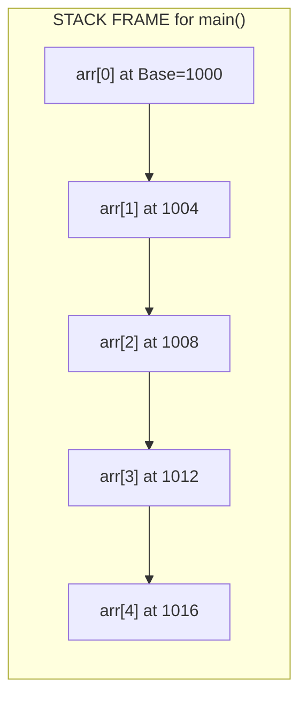
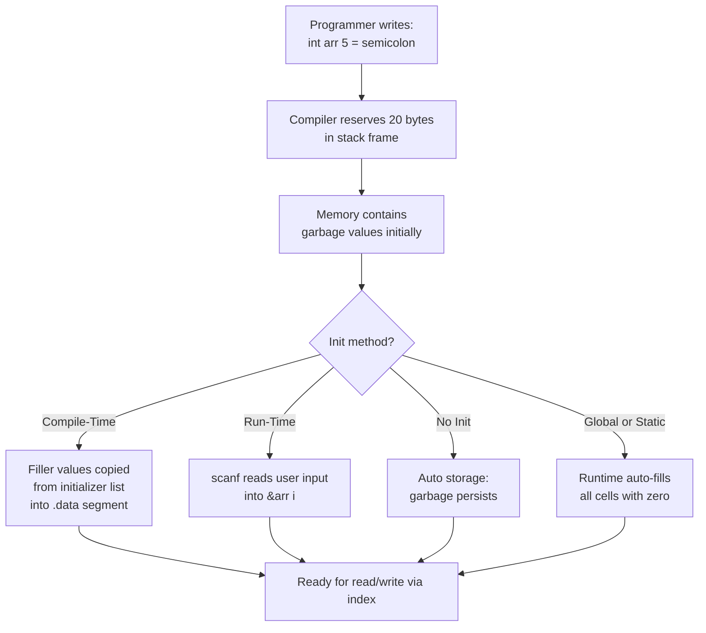
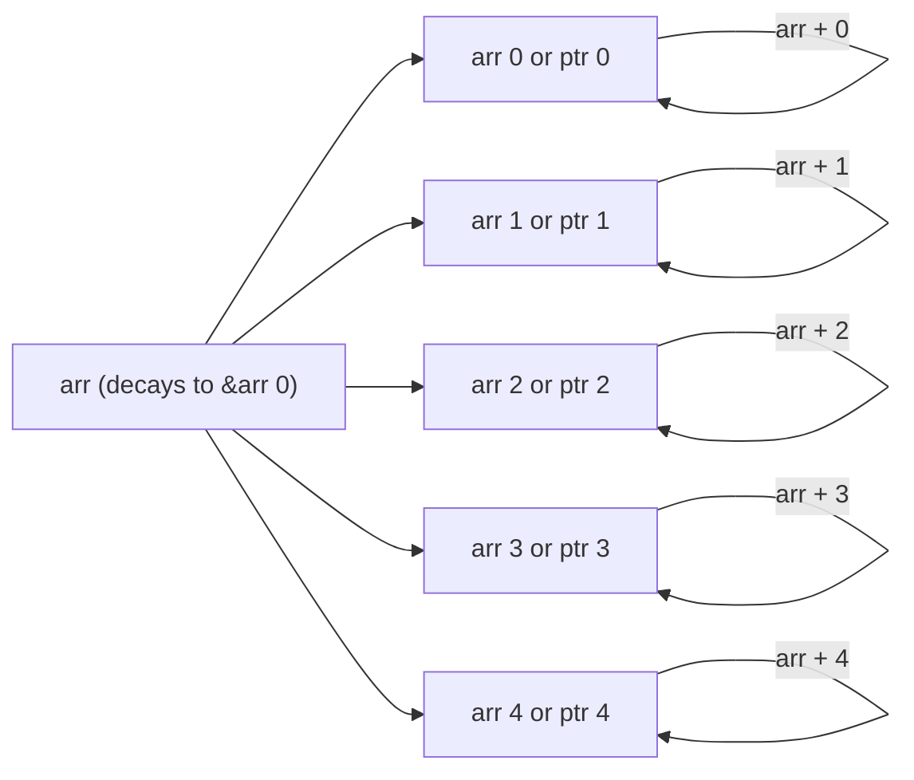
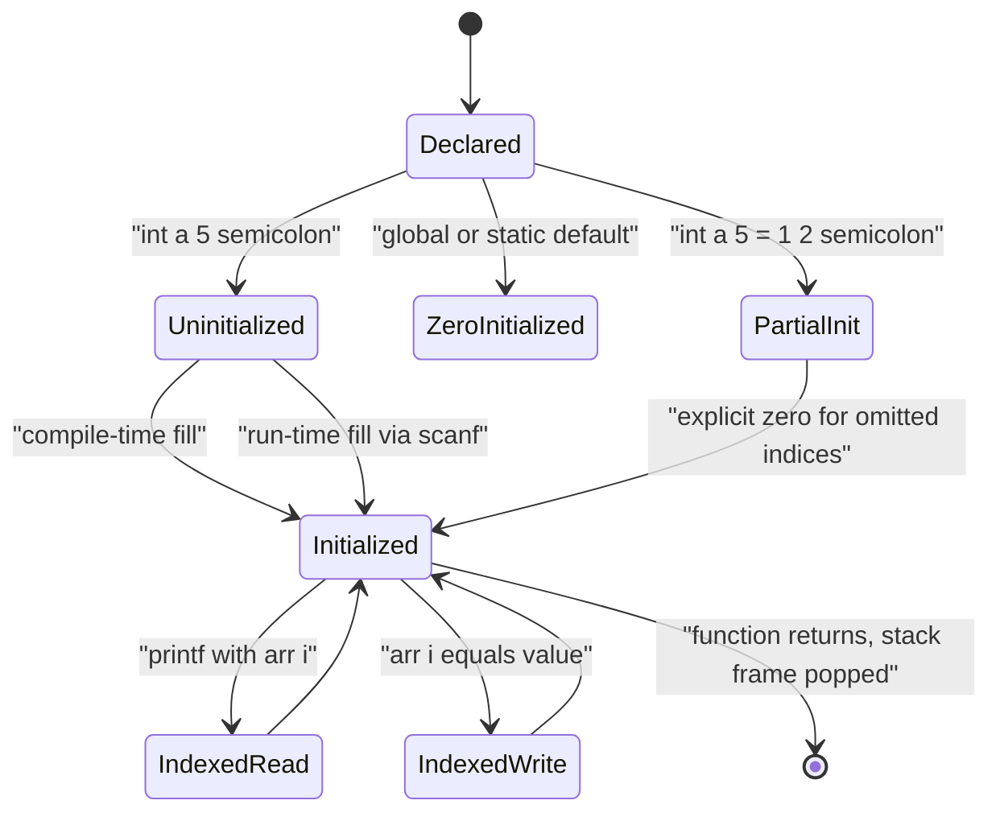
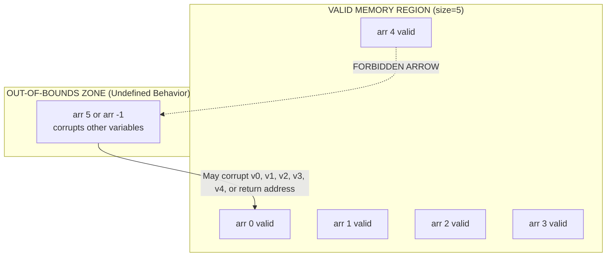

# One-Dimensional Arrays: Declaration, memory allocation, structural initialization, index access

<!-- SECTION_1_START -->
# One-Dimensional Arrays in C: The Building Block of Sequential Data Storage

## Formal Definition (KTU 2024 Scheme Terminology)

A **one-dimensional array** is a derived, homogeneous data structure in the C programming language that stores a fixed-size, ordered, contiguous collection of elements of *identical data type* under a single symbolic identifier. It enables constant-time indexed access using a non-negative integer offset and is the foundational construct for implementing sequential lists, lookup tables, buffers, and stack data structures in systems-level programming.

> [!IMPORTANT]
> **KTU Syllabus Highlight (Module 2):** Arrays form the precursor to Strings (character arrays), Sorting, and Searching algorithms. Mastery of memory addressing and bounds is mandatory for all lab viva questions and university theory exams.

## Conceptual Analogy / Intuition

Imagine a **post office with 50 lockers numbered 0 to 49**, all placed in a single straight row, side by side. Each locker is identical in size, holds exactly one parcel of the same type, and the lockers are glued together so they cannot be moved. The post office manager (the C compiler) gives you a starting tag called the **Base Address** (the address of locker 0). When you say *"give me the parcel in locker 7"*, the manager performs a quick math trick: he walks to locker 0, then jumps forward by *7 locker widths*. This jump is instant — that is the power of **O(1) random access**.

- **Array = Row of lockers**
- **Index = Locker number**
- **Element type = Parcel type (uniform)**
- **Base address = Address of locker 0**
- **sizeof(type) = Width of one locker**

> [!NOTE]
> **Critical Insight:** Because lockers are *glued together* in a single block, the C runtime can compute the address of `arr[i]` using simple integer arithmetic — no searching, no traversal. This is why arrays are the fastest data structure for lookup operations.

## Key Engineering Metrics (Per KTU Standards)

- **Index Range (Valid):** $0$ to $(N - 1)$ where $N$ is the declared size.
- **Default Lower Bound:** **0** (zero-based indexing — mandatory for KTU board answers).
- **Memory Footprint:** $N \times \text{sizeof}(\text{data\_type})$ **bytes**.
- **Access Time Complexity:** $O(1)$ — constant, independent of array size.
- **Default Storage Class (inside function):** **Automatic** (allocated on the stack).
- **Default Storage Class (outside function):** **External/Static** (allocated in the data segment).

> [!VISUALIZATION CONTROL]
> **Concept:** Linear memory layout of an `int` array of size 5.
> **Conceptual Grid Equations (Linear Address Mapping):**
> * `address(arr[i]) = base_address + i * sizeof(int)`
> * Example: if base = 1000 and sizeof(int) = 4, then arr[3] sits at 1012.
> **Visual Description:** A horizontal strip of 5 adjacent cells. Cell 0 starts at address 1000. Each subsequent cell is offset by 4 bytes. The student should visualize arrows pointing from index labels to the byte-address line.
<!-- SECTION_1_END -->

<!-- SECTION_2_START -->
# Deep Theoretical Analysis & KTU High-Yield Formula Sheet

## 1. The Four Pillars of Array Mechanics in C

### Pillar 1 — Declaration (Reserves Memory at Compile Time)

The C compiler translates the declaration into a memory reservation request during the compilation phase. The size must be a compile-time constant expression (C89/C90) or may be a runtime expression in C99/C11 with **VLA (Variable Length Array)** semantics.

**General Syntax:**

$$\text{data\_type array\_name} \left[ \text{array\_size} \right] \text{;}$$

**Valid Declaration Variants:**

* `int marks[50];`  → reserves 50 × 4 = **200 bytes** on the stack.
* `float temperature[24];` → reserves 24 × 4 = **96 bytes** for hourly readings.
* `char name[30];` → reserves 30 × 1 = **30 bytes** (often used as a string buffer).
* `#define SIZE 10` followed by `int arr[SIZE];` → preferred KTU style.
* `extern int buffer[];` → declared in header, defined elsewhere (no size needed).

### Pillar 2 — Memory Allocation (Contiguous & Linear)

C guarantees that all elements of an array are stored in **contiguous (adjacent) memory locations**. The compiler computes the address of any element using the **Address Calculation Formula**:

$$Address(arr[i]) = Base\_Address + (i \times sizeof(data\_type))$$

**Why this matters in KTU exams:** The examiner frequently tests whether you can compute byte offsets manually. Example: For `double x[7];` with base address 2000, the address of `x[4]` is $2000 + (4 \times 8) = 2032$.

### Pillar 3 — Initialization (Compile-Time vs Run-Time)

| Method | When Executed | Syntax | Memory State |
|---|---|---|---|
| **Compile-Time (Aggregate Initializer)** | Before `main()` runs | `int a[5] = {10, 20, 30, 40, 50};` | Pre-filled in `.data` segment |
| **Partial Initialization** | Before `main()` runs | `int a[5] = {10, 20};` | First two set, rest default to **0** |
| **Zero Initialization** | Before `main()` runs | `int a[5] = {0};` | All elements become **0** |
| **Designated Initializer (C99)** | Before `main()` runs | `int a[5] = {[2]=99, [4]=88};` | Sparse fill, unspecified → **0** |
| **Size Omission** | Before `main()` runs | `int a[] = {1,2,3,4,5};` | Compiler counts → size = **5** |
| **Run-Time (Loop)** | During program execution | `scanf("%d", &a[i]);` | Filled at runtime |
| **No Initialization** | — | `int a[5];` (local) | Contains **garbage values** |

> [!NOTE]
> **KTU Board Rule:** If the array is declared **local** (inside a function) without initialization, it contains **garbage**. If declared **global/static** without initialization, it is **auto-initialized to zero** by the C runtime startup code.

### Pillar 4 — Index Access (Zero-Based, No Bounds Check)

C performs **no runtime bounds checking** on array subscripts. Writing to `arr[10]` when the size is 5 is a silent, dangerous memory violation known as a **buffer overflow** — a primary source of security vulnerabilities in production C code.

**Syntactic Sugar (KTU Favorites):**
* `arr[i]` ≡ `*(arr + i)` ≡ `i[arr]` (the last is legal C but never used in practice).

---

## KTU High-Yield Formula Cheat Sheet

| # | Concept | Formula / Rule | Unit | Validity Condition |
|---|---|---|---|---|
| 1 | Address of element | $Address(arr[i]) = Base + i \times sizeof(T)$ | bytes | $0 \le i \le N-1$ |
| 2 | Total memory footprint | $Footprint = N \times sizeof(T)$ | bytes | Compile-time $N$ preferred |
| 3 | Valid index range | $0 \ldots (N-1)$ | integer | Bounds must be enforced manually |
| 4 | Number of elements | $N = sizeof(arr) \div sizeof(arr[0])$ | integer | Only works on the original array |
| 5 | Last valid index | $last\_index = N - 1$ | integer | One past the end = **UB** to dereference |
| 6 | First element address | $Base = \&arr[0]$ | bytes | Identical to `arr` (array decay rule) |
| 7 | Out-of-bounds offset | $UB$ if $i < 0$ or $i \ge N$ | — | Triggers undefined behavior |
| 8 | Designated init syntax | `int a[N] = {[k]=val, ...};` | — | C99/C11 only |
| 9 | Default of omitted init | $0$ for static/global, **garbage** for auto | — | Storage duration dependent |
| 10 | Pointer arithmetic step | $ptr + 1$ advances by $sizeof(T)$ | bytes | Type-aware movement |

## Real-World Engineering Utility

- **Embedded firmware:** Lookup tables for sensor calibration curves (`float lut[256]`).
- **Image processing:** Pixel buffers where `pixel[i]` is O(1) retrievable.
- **Network stacks:** Packet byte-arrays for parsing headers byte-by-byte.
- **Sorting algorithms:** In-place swap routines rely entirely on indexed array access.
- **Compilers:** Symbol tables use arrays of struct entries for O(1) hash-bucket lookup.

> [!TIP]
> **Production Reality:** In real systems, dynamic arrays (malloc/realloc) are used when size is unknown at compile time, but the underlying addressing formula $Base + i \times sizeof(T)$ remains *unchanged*. Mastering the static array fully transfers to dynamic array manipulation.
<!-- SECTION_2_END -->

<!-- SECTION_3_START -->
# Step-by-Step Derivations, Address Computation & C Code Implementation

## Derivation 1: The Address Calculation Formula (Step-by-Step)

**Given:**
* Array `T arr[N];` where `T` is a generic data type.
* `Base_Address = address of arr[0]`.
* Index `i` where $0 \le i \le N-1$.

**Derivation:**

$$\begin{aligned}
\text{Address of } arr[0] &= Base\_Address \\
\text{Address of } arr[1] &= Base\_Address + 1 \times sizeof(T) \\
\text{Address of } arr[2] &= Base\_Address + 2 \times sizeof(T) \\
\text{Address of } arr[i] &= Base\_Address + i \times sizeof(T) \\
\end{aligned}$$

**Sanity Check (KTU Hot Question):**
For `double b[10];` with `Base = 5000` and `sizeof(double) = 8` bytes, compute the address of `b[6]`.

$$\begin{aligned}
Address(b[6]) &= Base + 6 \times sizeof(double) \\
&= 5000 + 6 \times 8 \\
&= 5000 + 48 \\
&= 5048
\end{aligned}$$

**Valuation Key:** Step-wise substitution — **1 mark** for substitution, **1 mark** for arithmetic, **1 mark** for final answer.

---

## Derivation 2: Memory Footprint Calculation

**Given:** `int scores[4] = {95, 88, 76, 100};` on a system where `sizeof(int) = 4`.

**Derivation:**

$$\begin{aligned}
Footprint &= N \times sizeof(data\_type) \\
&= 4 \times sizeof(int) \\
&= 4 \times 4 \\
&= 16 \text{ bytes}
\end{aligned}$$

**Cross-check using compiler operator:**

$$\begin{aligned}
total\_bytes &= sizeof(scores) \\
total\_elements &= sizeof(scores) \div sizeof(scores[0]) \\
&= 16 \div 4 \\
&= 4
\end{aligned}$$

---

## Exhaustive C Code: Demonstrating All Four Pillars

```c
/* File: array_kit.c
 * KTU Module 2 — One-Dimensional Arrays
 * Demonstrates: declaration, memory layout, initialization, index access
 * Compile: gcc -Wall -std=c11 -o array_kit array_kit.c
 */

#include <stdio.h>
#include <stdlib.h>
#include <stdint.h>

#define SIZE 6

int main(void)
{
    /* ===== PILLAR 1: DECLARATION ===== */
    /* Six contiguous int cells reserved on the stack. */
    int scores[SIZE];

    /* Designated initializer (C99) — sparse fill of specific indices. */
    int sparse[SIZE] = { [2] = 70, [5] = 99 };

    /* Auto-sized array — compiler infers length = 5. */
    int primes[] = { 2, 3, 5, 7, 11 };

    /* ===== PILLAR 2: MEMORY LAYOUT (printf-based address map) ===== */
    printf("--- Memory Address Map for int scores[%d] ---\n", SIZE);
    printf("%-12s %-15s %-12s\n", "Index", "Address (hex)", "Value");
    printf("-------------------------------------------\n");

    for (int i = 0; i < SIZE; i++) {
        printf("%-12d %-15p %-12d\n",
               i,
               (void *)&scores[i],
               scores[i]);
    }

    /* ===== PILLAR 3: RUN-TIME INITIALIZATION ===== */
    printf("\n--- Run-time fill via scanf (enter %d values) ---\n", SIZE);
    for (int i = 0; i < SIZE; i++) {
        printf("Enter scores[%d]: ", i);
        if (scanf("%d", &scores[i]) != 1) {
            fprintf(stderr, "Input failure at index %d. Exiting.\n", i);
            return EXIT_FAILURE;
        }
    }

    /* ===== PILLAR 4: INDEX ACCESS & COMPUTATIONS ===== */
    int sum = 0;
    int max = scores[0];
    int min = scores[0];

    for (int i = 0; i < SIZE; i++) {
        sum += scores[i];
        if (scores[i] > max) max = scores[i];
        if (scores[i] < min) min = scores[i];
    }

    double average = (double)sum / (double)SIZE;

    /* ===== BOUNDS-SAFE ITERATION DEMO ===== */
    printf("\n--- Computed Statistics ---\n");
    printf("Sum     = %d\n", sum);
    printf("Average = %.2f\n", average);
    printf("Max     = %d\n", max);
    printf("Min     = %d\n", min);

    /* ===== FOOTPRINT DERIVATION ===== */
    printf("\n--- Footprint Derivation ---\n");
    printf("sizeof(scores)        = %zu bytes (total footprint)\n", sizeof(scores));
    printf("sizeof(scores[0])     = %zu bytes (single element)\n", sizeof(scores[0]));
    printf("Element count = sizeof/element = %zu\n", sizeof(scores) / sizeof(scores[0]));

    /* ===== REVERSE PRINT (USES POINTER ARITHMETIC EQUIVALENT) ===== */
    printf("\n--- Reverse Order ---\n");
    for (int i = SIZE - 1; i >= 0; i--) {
        printf("scores[%d] = %d\n", i, scores[i]);
    }

    /* ===== DEMO: EQUIVALENCE OF arr[i] AND *(arr + i) ===== */
    int *ptr = scores;  /* array decay: scores -> &scores[0] */
    printf("\n--- Pointer Decay Demo ---\n");
    for (int i = 0; i < SIZE; i++) {
        printf("scores[%d]=%d  |  *(ptr+%d)=%d  |  ptr[%d]=%d\n",
               i, scores[i],
               i, *(ptr + i),
               i, ptr[i]);
    }

    return EXIT_SUCCESS;
}
```

### Sample Input / Output Trace

```
Enter scores[0]: 45
Enter scores[1]: 78
Enter scores[2]: 62
Enter scores[3]: 91
Enter scores[4]: 55
Enter scores[5]: 88

--- Computed Statistics ---
Sum     = 419
Average = 69.83
Max     = 91
Min     = 45
```

---

## Derivation 3: Loop-Based Average of an Array (Step-by-Step)

**Problem (KTU Typical 7-Mark Question):** Given `int arr[10];` find the average of all elements.

**Step-by-step Logic:**

$$\begin{aligned}
\text{Step 1: } & \text{Initialize } sum = 0 \\
\text{Step 2: } & \text{Loop } i = 0 \text{ to } 9 \\
\text{Step 3: } & \text{Add each element: } sum = sum + arr[i] \\
\text{Step 4: } & \text{After loop: } average = \frac{sum}{10.0} \quad \text{(force float division)} \\
\text{Step 5: } & \text{Print } average \text{ with 2 decimal places using } \%.2f
\end{aligned}$$

**C Snippet (Exhaustive):**

```c
int arr[10];
int sum = 0;
double average;

printf("Enter 10 integers:\n");
for (int i = 0; i < 10; i++) {
    scanf("%d", &arr[i]);
    sum += arr[i];
}

average = (double)sum / 10.0;
printf("Average = %.2f\n", average);
```

**Valuation Key:** Declaration + loop + accumulation = **4 marks**, type-cast for float division = **2 marks**, correct print format = **1 mark**.

---

## Derivation 4: Finding Maximum Using Index Access

```c
int arr[8] = { 12, 45, 7, 89, 23, 56, 91, 34 };
int max = arr[0];          /* Initialize with first element */
int maxIndex = 0;

for (int i = 1; i < 8; i++) {     /* Start from index 1 */
    if (arr[i] > max) {
        max = arr[i];
        maxIndex = i;
    }
}
printf("Maximum = %d at index %d\n", max, maxIndex);
```

**Trace (KTU loves this in viva):**
* i=1: 45 > 12 → max=45, idx=1
* i=2: 7 < 45 → no change
* i=3: 89 > 45 → max=89, idx=3
* i=4: 23 < 89 → no change
* i=5: 56 < 89 → no change
* i=6: 91 > 89 → max=91, idx=6  ✅
* i=7: 34 < 91 → no change

**Final Output:** `Maximum = 91 at index 6`

---

## Derivation 5: Address Calculation (Full Worked Example for Board)

**Problem:** `char name[] = "KOTTAYAM";` is stored starting at address **2000**. Find the address of `name[3]`.

**Solution:**

$$\begin{aligned}
Address(name[i]) &= Base + i \times sizeof(char) \\
Address(name[3]) &= 2000 + 3 \times 1 \\
&= 2003
\end{aligned}$$

**Output mapping:**
| Index | 0 | 1 | 2 | 3 | 4 | 5 | 6 | 7 |
|---|---|---|---|---|---|---|---|---|
| Char | K | O | T | T | A | Y | A | M |
| Address | 2000 | 2001 | 2002 | **2003** | 2004 | 2005 | 2006 | 2007 |

> [!IMPORTANT]
> **Why `sizeof(char) = 1` byte always:** Per the C standard (ISO/IEC 9899), `sizeof(char)` is defined as exactly **1 byte**, regardless of the platform. KTU examiners use this as a trick question.
<!-- SECTION_3_END -->

<!-- SECTION_4_START -->
# Structural Diagrams & Schematics

## Diagram 1: Contiguous Memory Layout Block



**Reading Guide:** Each block represents 4 bytes (typical `int`). Addresses increase left-to-right by 4. `arr[0]` holds 10, `arr[1]` holds 20, …, `arr[4]` holds 50. Total footprint = 20 bytes.

## Diagram 2: Array Declaration and Initialization Flow



## Diagram 3: Indexing and Pointer Decay Relationship



**Reading Guide:** The array name `arr` is *not* a variable — it is a label that the compiler replaces with the address of the first element. The expressions `arr[i]`, `*(arr + i)`, and `ptr[i]` (where `ptr = arr`) all produce the same memory cell.

## Diagram 4: Array Lifecycle State Machine



## Diagram 5: Bounds Violation Visualization



> [!WARNING]
> **Visual Lesson:** C performs **zero runtime bounds checking**. Accessing `arr[5]` on a size-5 array is **Undefined Behavior** — the program may print garbage, crash, or appear to work. Always enforce bounds in your loop condition: `i < N`, never `i <= N`.
<!-- SECTION_4_END -->

<!-- SECTION_5_START -->
# KTU 2024 Scheme Examination Question Bank & Topic Recap

---

## Part A — Short Answer Questions (3 Marks Each)

### Q1. Define a one-dimensional array in C. State the rules for declaring an array with a suitable example. [KTU University Exam — July 2024]

**Model Answer (Board-Expected):**

A **one-dimensional array** is a collection of variables of the same data type stored in contiguous memory locations and accessed using a common name with an integer index.

**Rules for Declaration:**

1. The array name must be a valid C identifier.
2. The size must be a positive integer constant expression (for static arrays).
3. The data type must be specified explicitly.
4. The size cannot be changed once declared (static array).
5. Indexing starts from **0** and ends at **N − 1**.

**Example:**

```c
int marks[5];   /* Declares an array of 5 integers */
float price[10]; /* Declares an array of 10 floats */
```

**Valuation Key:** [Definition: 1 mark] [Any 2 rules: 1 mark] [Valid example: 1 mark].

---

### Q2. Distinguish between compile-time and run-time initialization of an array with examples. [KTU University Exam — Dec 2023]

**Model Answer:**

| Feature | Compile-Time Initialization | Run-Time Initialization |
|---|---|---|
| **When values are set** | Before program execution | During program execution |
| **Memory region** | `.data` segment | Stack (after assignment) |
| **Mechanism** | Initializer list in declaration | `scanf()` or assignment statements |
| **Example** | `int a[3] = {1, 2, 3};` | `scanf("%d", &a[0]);` |
| **Flexibility** | Fixed at compile time | Dynamic, user-driven |
| **Default for omitted** | Remaining → 0 | Garbage until assigned |

**Valuation Key:** [Any 3 differences in tabular form: 3 marks].

---

## Part B — Long Answer Questions (14 Marks, with Internal Choice)

### QUESTION A (14 Marks) [Internal Choice]

#### (a) Explain how memory is allocated for a one-dimensional array in C. Derive the address calculation formula. (7 Marks) [CO2, Understand]

**Model Answer:**

**Memory Allocation Characteristics:**

1. C allocates a **single contiguous block** of memory for all elements of the array.
2. The block size equals $N \times \text{sizeof}(\text{data\_type})$ bytes.
3. The compiler computes a **Base Address** which is the location of the first element `arr[0]`.
4. The size must be known at compile time (for static arrays).
5. Allocated on the **stack** if declared inside a function, or in the **data segment** if global/static.

**Address Calculation Formula — Derivation:**

Let `Base` = address of `arr[0]`. Let `S` = `sizeof(data_type)`.

$$\begin{aligned}
Address(arr[0]) &= Base + 0 \times S = Base \\
Address(arr[1]) &= Base + 1 \times S \\
Address(arr[2]) &= Base + 2 \times S \\
&\;\;\vdots \\
Address(arr[i]) &= Base + i \times S \\
\end{aligned}$$

**General Formula:**

$$Address(arr[i]) = Base\_Address + (i \times sizeof(data\_type))$$

**Worked Example:**

For `float temp[8];` with `Base = 3000` and `sizeof(float) = 4`:

$$\begin{aligned}
Address(temp[5]) &= 3000 + (5 \times 4) \\
&= 3000 + 20 \\
&= 3020
\end{aligned}$$

**Valuation Key:** [Stating 3 allocation characteristics: 3 Marks] [Formula derivation: 2 Marks] [Numerical example: 2 Marks].

---

#### (b) Write a C program to read N integers into a one-dimensional array and perform the following operations: (i) find the sum and average, (ii) find the maximum and minimum element, (iii) reverse the array in place. (7 Marks) [CO3, Apply]

**Model Answer:**

```c
#include <stdio.h>
#include <stdlib.h>

int main(void)
{
    int n;
    int arr[100];
    int sum, max, min;
    double average;

    printf("Enter number of elements (1-100): ");
    if (scanf("%d", &n) != 1 || n < 1 || n > 100) {
        fprintf(stderr, "Invalid input.\n");
        return EXIT_FAILURE;
    }

    printf("Enter %d integers:\n", n);
    for (int i = 0; i < n; i++) {
        scanf("%d", &arr[i]);
    }

    /* (i) Sum and Average */
    sum = 0;
    for (int i = 0; i < n; i++) {
        sum += arr[i];
    }
    average = (double)sum / (double)n;
    printf("\nSum     = %d\n", sum);
    printf("Average = %.2f\n", average);

    /* (ii) Maximum and Minimum */
    max = arr[0];
    min = arr[0];
    for (int i = 1; i < n; i++) {
        if (arr[i] > max) max = arr[i];
        if (arr[i] < min) min = arr[i];
    }
    printf("Maximum = %d\n", max);
    printf("Minimum = %d\n", min);

    /* (iii) In-place reversal */
    for (int i = 0, j = n - 1; i < j; i++, j--) {
        int temp = arr[i];
        arr[i] = arr[j];
        arr[j] = temp;
    }

    printf("\nReversed array:\n");
    for (int i = 0; i < n; i++) {
        printf("%d ", arr[i]);
    }
    printf("\n");

    return EXIT_SUCCESS;
}
```

**Sample Run:**

```
Enter number of elements (1-100): 5
Enter 5 integers:
10 50 30 70 20

Sum     = 180
Average = 36.00
Maximum = 70
Minimum = 10

Reversed array:
20 70 30 50 10
```

**Valuation Key:** [Input validation + array read: 2 Marks] [Sum/Average logic with type cast: 2 Marks] [Max/Min loop: 1 Mark] [In-place reversal with two-pointer swap: 2 Marks].

---

### QUESTION B (14 Marks) [Alternative Choice]

#### (a) Explain the different ways of initializing a one-dimensional array in C. Illustrate with C code snippets. (7 Marks) [CO2, Understand]

**Model Answer:**

C supports the following initialization methods for one-dimensional arrays:

**1. Full Compile-Time Initialization:**

```c
int marks[5] = { 85, 90, 78, 92, 88 };
```

All 5 positions are filled. The size can be omitted; the compiler infers it from the list:

```c
int marks[] = { 85, 90, 78, 92, 88 };   /* size = 5 */
```

**2. Partial Initialization:**

```c
int marks[5] = { 85, 90 };
```

Only the first two elements are set; the remaining three are automatically set to **0**.

**3. Zero Initialization (Idiomatic):**

```c
int marks[5] = { 0 };     /* All five elements become 0 */
int marks[5] = { };       /* Legal in C99 — all elements 0 */
```

**4. Designated Initialization (C99/C11):**

```c
int flags[8] = { [0] = 1, [3] = 1, [7] = 1 };
```

Specific indices are filled; the rest default to **0**. Useful for sparse lookup tables.

**5. Run-Time Initialization:**

```c
int arr[5];
for (int i = 0; i < 5; i++) {
    scanf("%d", &arr[i]);
}
```

The user provides values while the program runs.

**6. Implicit Initialization (Global Scope):**

```c
int globalArr[5];   /* All elements auto-initialized to 0 at program startup */
```

**Valuation Key:** [Naming 6 methods: 3 Marks] [C snippets for any 3: 3 Marks] [Mentioning default-to-zero rule: 1 Mark].

---

#### (b) Given an array `int data[10] = {5, 12, 7, 20, 15, 8, 3, 11, 9, 18};`, write a C program to: (i) count the number of even and odd elements, (ii) search for a user-given key using linear search, and (iii) compute the sum of elements at even-indexed positions. (7 Marks) [CO3, Apply]

**Model Answer:**

```c
#include <stdio.h>
#include <stdlib.h>

int main(void)
{
    int data[10] = {5, 12, 7, 20, 15, 8, 3, 11, 9, 18};
    int n = 10;
    int evenCount = 0, oddCount = 0;
    int key, foundIndex = -1;
    int evenIndexSum = 0;

    /* (i) Count even and odd elements */
    for (int i = 0; i < n; i++) {
        if (data[i] % 2 == 0) {
            evenCount++;
        } else {
            oddCount++;
        }
    }
    printf("Even count = %d\n", evenCount);
    printf("Odd count  = %d\n", oddCount);

    /* (ii) Linear search for user-given key */
    printf("Enter key to search: ");
    if (scanf("%d", &key) != 1) {
        fprintf(stderr, "Invalid key.\n");
        return EXIT_FAILURE;
    }
    for (int i = 0; i < n; i++) {
        if (data[i] == key) {
            foundIndex = i;
            break;
        }
    }
    if (foundIndex != -1) {
        printf("Key %d found at index %d\n", key, foundIndex);
    } else {
        printf("Key %d not found in the array.\n", key);
    }

    /* (iii) Sum of elements at even-indexed positions (0, 2, 4, 6, 8) */
    for (int i = 0; i < n; i += 2) {
        evenIndexSum += data[i];
    }
    printf("Sum of elements at even indices = %d\n", evenIndexSum);

    return EXIT_SUCCESS;
}
```

**Sample Run:**

```
Even count = 4
Odd count  = 6
Enter key to search: 20
Key 20 found at index 3
Sum of elements at even indices = 39
```

**Trace of even-index sum:** data[0]=5, data[2]=7, data[4]=15, data[6]=3, data[8]=9 → 5+7+15+3+9 = **39** ✓

**Valuation Key:** [Even/odd counter: 2 Marks] [Linear search with break and -1 sentinel: 3 Marks] [Even-index sum using step=2: 2 Marks].

---

> [!WARNING]
> **KTU Examiner's Valuation Warning — Common Pitfalls:**
> 1. **Forgetting the type cast** when computing the average: `int/int` truncates. Always write `(double)sum / n`.
> 2. **Off-by-one errors** in loop bounds: Use `i < n`, never `i <= n`. The last valid index is `n − 1`, not `n`.
> 3. **Mixing up index and value**: `arr[i]` is the value, `&arr[i]` is the address. Forgetting the `&` in `scanf` is a classic blunder.
> 4. **Omitting the size** during declaration without an initializer: `int x[];` is illegal in a function scope.
> 5. **Assuming runtime bounds checking**: C will happily write to `arr[100]` of a size-10 array, corrupting memory silently. Always enforce `i < n` in loops.
> 6. **Writing `arr[i++]` ambiguously** — this has side effects. Prefer breaking it into two statements in KTU answers.

---

## Topic Recap & Important Things to Remember

- A **one-dimensional array** stores a fixed number of homogeneous elements in **contiguous memory** under a single identifier.
- **Declaration syntax:** `data_type name[size];` — the size must be a positive integer constant.
- **Memory allocation** is contiguous: $N \times \text{sizeof}(T)$ bytes total, allocated on the **stack** (local) or **data segment** (global/static).
- **Address formula:** $Address(arr[i]) = Base\_Address + i \times \text{sizeof}(T)$.
- **Index range** is $0$ to $N-1$. C performs **no runtime bounds checking** — out-of-bounds access is **undefined behavior**.
- **Initialization methods** include compile-time (full, partial, zero, designated, size-omitted) and run-time (via `scanf` or loops).
- **Local arrays** start with **garbage**; **global/static arrays** start with **zero** (C runtime auto-initialization).
- **Array name decays** to a pointer to its first element in expressions: `arr ≡ &arr[0]`.
- `arr[i]`, `*(arr+i)`, and `ptr[i]` (with `ptr=arr`) are **completely equivalent** expressions.
- The `sizeof` operator on an array yields the total footprint in bytes; `sizeof(arr)/sizeof(arr[0])` yields the element count — this trick only works for the original array, not a decayed pointer.
- **`sizeof(char)` is always 1 byte** by the ISO C standard.
- **Designated initializers** (`[k]=val`) are a **C99 feature** — confirm your compiler flag `-std=c99` or `-std=c11` is set.
- Common KTU operations: **sum, average, max, min, reverse, linear search, count even/odd, sum at even indices** — practice each on paper.
- Always **cast to `double`** before division when computing averages to avoid integer truncation.
<!-- SECTION_5_END -->
