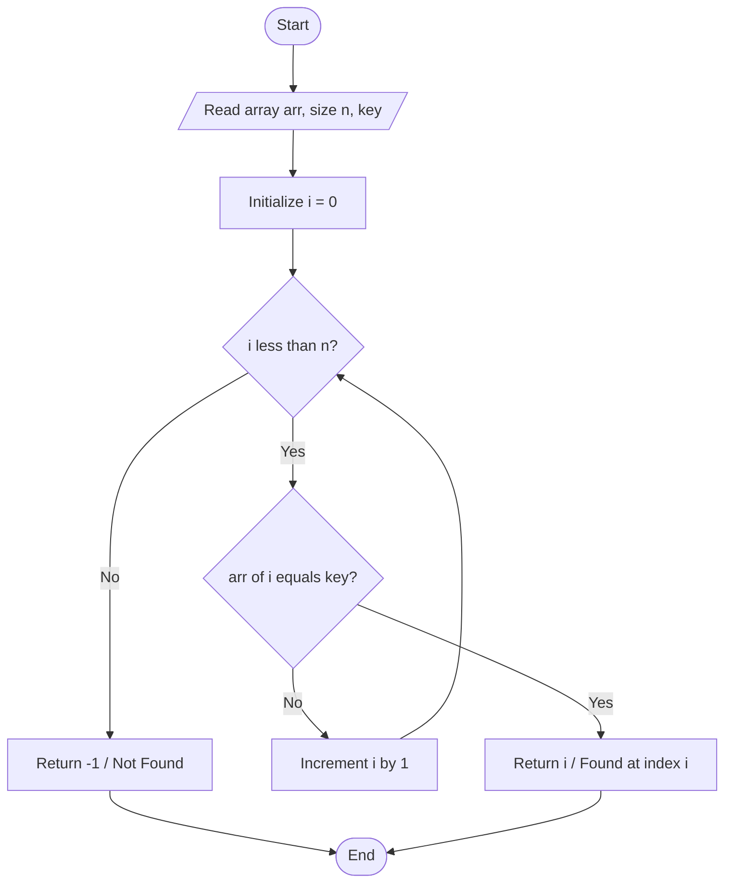
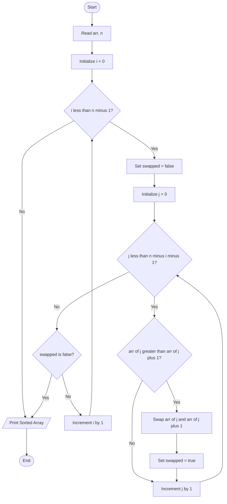

# Search & Sort: Sequential Search, Bubble Sort sorting algorithm

<!-- SECTION_1_START -->
# Module 2 — Search & Sort: Sequential Search & Bubble Sort

## 1. Core Technical Definition & Intuitive Overview

### 1.1 Sequential Search (Linear Search)

> [!NOTE]
> **Formal Definition (KTU 2024 Syllabus Terminology):**
> *Sequential Search* (also called *Linear Search*) is the simplest searching algorithm that locates a target element (called the **key**) inside an unordered or unsorted collection by inspecting every element **one after another** in a sequential, linear order — from the first index `$0$` to the last index `$n-1$` — until a match is found or the entire dataset is exhausted.

**Intuitive Analogy — The Missing Sock Hunt 🧦:**
Imagine you dumped a basket of 50 mixed socks on your bed and need to find the *blue striped one*. You don't sort them by color first — you just pick up each sock one-by-one from left to right, checking it. The moment you spot the blue striped one, you stop. If you finish the entire pile and still haven't found it, you conclude *"the sock simply isn't here."* That is *exactly* how Sequential Search works on an array.

---

### 1.2 Bubble Sort

> [!IMPORTANT]
> **Formal Definition (KTU 2024 Syllabus Terminology):**
> *Bubble Sort* is a **comparison-based, in-place, stable** sorting algorithm that repeatedly steps through the list, **compares adjacent pairs** of elements, and **swaps** them if they are in the wrong order (i.e., ascending: `$a[j] > a[j+1]$`). After every full pass, the largest unsorted element "bubbles up" to its correct final position at the end of the array — hence the name.

**Intuitive Analogy — The Soda Bottle Lineup 🥤:**
Picture a row of soda bottles of varying heights standing on a shelf in *random* order. You walk along the shelf from left to right. Whenever you notice two adjacent bottles that are in the *wrong height order* (shorter on the left, taller on the right), you **swap** them. After one full sweep, the **tallest bottle** will have *bubbled* all the way to the far right end. You repeat the sweep (excluding the last bottle, which is now sorted), and after `$n-1$` such passes, the bottles will be arranged from shortest to tallest.

**Performance Metric (standard KTU benchmark):**
- Bubble Sort Time Complexity: **$O(n^2)$** in worst & average case
- Bubble Sort Time Complexity: **$O(n)$** in **best case** (when array is already sorted, with optimization flag)
- Space Complexity: **$O(1)$** (in-place)

> [!VISUALIZATION CONTROL]
> **Concept:** Bubble Sort — Adjacent Swap Pass
> **GeoGebra / Desmos Input Data Points (initial array `[5, 1, 4, 2, 8]`):**
> * Bar 1: `(1, 5)`, Bar 2: `(2, 1)`, Bar 3: `(3, 4)`, Bar 4: `(4, 2)`, Bar 5: `(5, 8)`
> **Visual Description:** Render the values as vertical bars in their initial order. After Pass 1, observe that the value `8` (tallest bar) has moved to index `5` (rightmost). After Pass 2, `5` settles at index `4`, and so on — like bubbles rising to the surface.
<!-- SECTION_1_END -->

<!-- SECTION_2_START -->
# 2. Deep Theoretical Analysis & KTU High-Yield Formula Sheet

## 2.1 Sequential Search — Operational Logic Decomposition

The algorithm inspects array elements in a deterministic order. The following structured steps describe the complete operation:

1. **Initialization:** Read the array `arr[]` of size `$n$` and the `key` to be searched.
2. **Iteration:** Set a loop counter `$i = 0$` and traverse up to `$i < n$`.
3. **Comparison:** At each index, check if `arr[i] == key`.
4. **Success Path:** If a match occurs → return the **index `$i$`** (position) and terminate early.
5. **Failure Path:** If loop ends without any match → return a sentinel value **$-1$** (meaning *not found*).
6. **Time Accounting:** The number of comparisons ranges from **$1$** (best case — key at first index) to **$n$** (worst case — key absent or at last index).

**Best, Worst & Average Case Analysis (KTU Board Standard):**

| Case | # Comparisons | When it Happens |
|---|---|---|
| **Best Case** | $1$ | Key is at index `$0$` (first position) |
| **Worst Case** | $n$ | Key is at last position or absent |
| **Average Case** | $\frac{n+1}{2}$ | Key is at a random position in the array |

**Real-World Utility in Engineering & Computing:**
- Used in **small, unsorted datasets** where sort overhead is not justified.
- Used in **linked list traversal** since random access is not available.
- Foundational concept for **brute-force pattern matching** (e.g., substring search in editors).
- Used in **database index probing** for unsorted heap tables.

---

## 2.2 Bubble Sort — Operational Logic Decomposition

Bubble Sort is governed by nested loop iteration. Each pass pushes the largest remaining element to its final position:

1. **Outer Loop (`i`):** Runs from `$0$` to `$n-2$` (total `$n-1$` passes required).
2. **Inner Loop (`j`):** Runs from `$0$` to `$n-i-2$` — *shrinks* with every pass because the rightmost portion is already sorted.
3. **Comparison:** Test `if (arr[j] > arr[j+1])`.
4. **Swap:** If true, exchange the two elements using a temporary variable.
5. **Optimization Flag:** Track a boolean `swapped`; if a full pass makes **zero swaps**, the array is already sorted — break out early (best case `$O(n)$`).
6. **Termination:** After `$n-1$` passes, the array is guaranteed to be in ascending order.

> [!NOTE]
> **Why Stable?** Bubble Sort is *stable* because it only swaps elements that are **strictly greater** (`>`), not greater-than-or-equal (`>=`). Equal elements never swap, preserving their original relative order. This is critical in KTU multi-key sorting problems.

**Real-World Utility in Engineering & Computing:**
- Primarily a **pedagogical algorithm** — taught to introduce nested loops, swap mechanics, and algorithmic complexity.
- Used in **embedded systems with tiny memory** where in-place `$O(1)$` sorting is mandatory.
- Detects **near-sorted inputs** in linear time via the swapped-flag optimization.

---

## 2.3 KTU Formula Sheet / Cheat Sheet

| Algorithm | Best Case | Average Case | Worst Case | Space | Stable? | In-Place? |
|---|---|---|---|---|---|---|
| **Sequential Search** | $O(1)$ | $O(n)$ | $O(n)$ | $O(1)$ | N/A | N/A |
| **Bubble Sort** | $O(n)$ (optimized) | $O(n^2)$ | $O(n^2)$ | $O(1)$ | Yes | Yes |

| Symbol | Meaning |
|---|---|
| $n$ | Total number of elements in the array |
| $C_{\text{best}}$ | Minimum comparisons (best case) |
| $C_{\text{worst}}$ | Maximum comparisons (worst case) |
| $\text{key}$ | The element being searched for |
| $\text{return } -1$ | Sentinel — "element not found" |
| $a_j, a_{j+1}$ | Adjacent element pair under comparison |
| $\text{swapped}$ | Boolean flag for early termination optimization |

| # Pass | # Comparisons in Inner Loop | Sorted Region (Right) |
|---|---|---|
| Pass $1$ | $n-1$ | $a_{n-1}$ |
| Pass $2$ | $n-2$ | $a_{n-1}, a_{n-2}$ |
| Pass $k$ | $n-k$ | Last $k$ elements locked |
| Pass $n-1$ | $1$ | Entire array sorted |
<!-- SECTION_2_END -->

<!-- SECTION_3_START -->
# 3. Step-by-Step Derivations & Code/Symbolic Implementation

## 3.1 Sequential Search — Complete C Code (Board-Ready)

```c
#include <stdio.h>
#include <stdlib.h>

/*
 * Function: sequentialSearch
 * Purpose : Searches 'key' inside 'arr' of size 'n' using linear scan.
 * Returns : Index of 'key' if found; otherwise -1.
 */
int sequentialSearch(int arr[], int n, int key) {
    int i;
    for (i = 0; i < n; i++) {
        if (arr[i] == key) {
            return i;          // Success: report position
        }
    }
    return -1;                 // Failure: sentinel value
}

int main(void) {
    int arr[] = {45, 12, 89, 33, 67, 24, 90, 11};
    int n     = sizeof(arr) / sizeof(arr[0]);
    int key   = 0;
    int pos   = 0;

    printf("Enter the element to search: ");
    if (scanf("%d", &key) != 1) {
        fprintf(stderr, "Invalid input.\n");
        return EXIT_FAILURE;
    }

    pos = sequentialSearch(arr, n, key);

    if (pos != -1) {
        printf("Element %d found at index %d.\n", key, pos);
    } else {
        printf("Element %d NOT found in the array.\n", key);
    }

    return EXIT_SUCCESS;
}
```

### Exhaustive Numerical Trace — Sequential Search

Let `arr = [10, 22, 35, 40, 55, 67, 70]` and `key = 40`, `$n = 7$`.

| Step `$i$` | `arr[i]` | `arr[i] == key`? | Action |
|---|---|---|---|
| $0$ | $10$ | False | Continue |
| $1$ | $22$ | False | Continue |
| $2$ | $35$ | False | Continue |
| $3$ | $40$ | **True** | **Return $3$** |

Comparisons used = **$4$** (key at index `$3$`, so `$\frac{n+1}{2} = \frac{8}{2} = 4$` ✓ matches average case).

---

## 3.2 Bubble Sort — Complete C Code (Board-Ready)

```c
#include <stdio.h>
#include <stdlib.h>
#include <stdbool.h>

/*
 * Function: bubbleSort
 * Purpose : Sorts 'arr' of size 'n' in ascending order using
 *           the Bubble Sort algorithm with early-termination flag.
 */
void bubbleSort(int arr[], int n) {
    int  i, j, temp;
    bool swapped;

    for (i = 0; i < n - 1; i++) {
        swapped = false;

        for (j = 0; j < n - i - 1; j++) {
            if (arr[j] > arr[j + 1]) {
                /* Adjacent swap */
                temp        = arr[j];
                arr[j]      = arr[j + 1];
                arr[j + 1]  = temp;
                swapped     = true;
            }
        }

        /* Optimization: no swap => already sorted */
        if (!swapped) {
            break;
        }
    }
}

int main(void) {
    int arr[] = {64, 25, 12, 22, 11};
    int n     = sizeof(arr) / sizeof(arr[0]);
    int i     = 0;

    printf("Unsorted array: ");
    for (i = 0; i < n; i++) {
        printf("%d ", arr[i]);
    }
    printf("\n");

    bubbleSort(arr, n);

    printf("Sorted array  : ");
    for (i = 0; i < n; i++) {
        printf("%d ", arr[i]);
    }
    printf("\n");

    return EXIT_SUCCESS;
}
```

### Exhaustive Numerical Trace — Bubble Sort on `arr = [5, 1, 4, 2, 8]`

**Pass 1 (`$i = 0$`, inner loop `$j = 0$` to `$3$`):**

| `$j$` | Compare `arr[j] > arr[j+1]`? | Array State After | Swapped? |
|---|---|---|---|
| $0$ | $5 > 1$ ✓ | `[1, 5, 4, 2, 8]` | Yes |
| $1$ | $5 > 4$ ✓ | `[1, 4, 5, 2, 8]` | Yes |
| $2$ | $5 > 2$ ✓ | `[1, 4, 2, 5, 8]` | Yes |
| $3$ | $5 > 8$ ✗ | `[1, 4, 2, 5, 8]` | No |

After Pass 1: **`8` is locked at index `4`**. `swapped = true`.

**Pass 2 (`$i = 1$`, inner loop `$j = 0$` to `$2$`):**

| `$j$` | Compare | Array State After | Swapped? |
|---|---|---|---|
| $0$ | $1 > 4$ ✗ | `[1, 4, 2, 5, 8]` | No |
| $1$ | $4 > 2$ ✓ | `[1, 2, 4, 5, 8]` | Yes |
| $2$ | $4 > 5$ ✗ | `[1, 2, 4, 5, 8]` | No |

After Pass 2: **`5` is locked at index `3`**.

**Pass 3 (`$i = 2$`, inner loop `$j = 0$` to `$1$`):**

| `$j$` | Compare | Array State After | Swapped? |
|---|---|---|---|
| $0$ | $1 > 2$ ✗ | `[1, 2, 4, 5, 8]` | No |
| $1$ | $2 > 4$ ✗ | `[1, 2, 4, 5, 8]` | No |

`swapped = false` → **break out early** ✓.

**Final Sorted Array: `[1, 2, 4, 5, 8]`** in just `$3$` passes instead of `$4$`.

### Derivation of Pass Count Formula

The number of comparisons in **Pass `$i$`** (zero-indexed) is:

$$
\begin{aligned}
C_i &= (n - 1) - i \\
\text{Total comparisons (worst case)} &= \sum_{i=0}^{n-2} \bigl( n - 1 - i \bigr) \\
&= (n-1) + (n-2) + \ldots + 1 \\
&= \frac{n(n-1)}{2}
\end{aligned}
$$

This yields complexity `$O(n^2)$` in the worst case, which is the standard KTU-board answer for Bubble Sort complexity.
<!-- SECTION_3_END -->

<!-- SECTION_4_START -->
# 4. Structural Diagrams & Schematics

## 4.1 Sequential Search — Process Flow



**Node ID Alpha-Rule Compliance:** Every identifier above is purely alphanumeric (e.g., `D`, `G`, `H`) — no reserved Mermaid keywords used.

---

## 4.2 Bubble Sort — Nested Loop Architecture



**Explanation of Modules:**
- **Outer Control Module (C, H):** Manages total pass count `$n-1$`.
- **Inner Sweep Module (F, I, K):** Performs the actual adjacent-pair comparison and conditional swap.
- **Early-Exit Guard (G):** Detects a fully-sorted input via the `swapped` flag and short-circuits the algorithm, achieving best-case `$O(n)$` behavior.

---

## 4.3 Sequential Processing Topology Matrix (Search & Sort Interaction)

| Stage | Operation | Time Cost | Output |
|---|---|---|---|
| Stage 1 — Input | Read `$n$` integers into `arr[]` | $O(n)$ | Unsorted array |
| Stage 2 — Sort | Apply Bubble Sort | $O(n^2)$ | Sorted array |
| Stage 3 — Search | Apply Sequential Search | $O(n)$ | Index or $-1$ |
| Stage 4 — Report | Print result to console | $O(1)$ | Final answer |

> [!NOTE]
> This table maps the **typical KTU lab-cycle pattern** where students first sort an array using Bubble Sort and then perform a search. Marks are awarded for clean modular function design and complexity statement.
<!-- SECTION_4_END -->

<!-- SECTION_5_START -->
# 5. KTU 2024 Scheme Examination Question Bank & Topic Recap

## Part A — Short Answer Questions (3 Marks Each)

### Question 1 `[KTU University Exam — July 2024]`
**CO1 | Remember**
> **Q:** Define *Sequential Search*. State its best-case and worst-case time complexity.

**Model Answer (3 Marks):**
Sequential Search is a method of finding a target element (`key`) in an array by inspecting elements one by one from the first index to the last until a match is found or the array ends.
- **Best Case:** `$O(1)$` — when the key is present at index `$0$`.
- **Worst Case:** `$O(n)$` — when the key is absent or present at the last index `$n-1$`.
- **Average Case:** `$O(n)$` — average number of comparisons is `$\frac{n+1}{2}$`.

**Valuation Key:** [Definition: 1 Mark] [Best & Worst: 1 Mark] [Average: 1 Mark]

---

### Question 2 `[KTU University Exam — Dec 2023]`
**CO2 | Understand**
> **Q:** Explain why Bubble Sort is called a *stable* and *in-place* sorting algorithm.

**Model Answer (3 Marks):**
- **Stable:** Bubble Sort uses the strict inequality `arr[j] > arr[j+1]` for comparison. Two equal elements are **never swapped**, so their relative order in the input is preserved in the output. **[1.5 Marks]**
- **In-Place:** The algorithm sorts the array using only a single temporary variable (`temp`) for swapping. It does not require any additional array proportional to the input size, so its auxiliary space is `$O(1)$`. **[1.5 Marks]**

---

## Part B — Long Answer Questions (14 Marks Each)

> **Note:** As per KTU 2024 ESE pattern, students answer **either** Question A **or** Question B.

---

### ✦ Question A (14 Marks) `[KTU University Exam — Dec 2024]`
**CO2 | Apply + Analyze**

> **(a)** Write a C program to sort an array of `$n$` integers in **ascending order** using Bubble Sort. Display the array after each pass. **(7 Marks)**
>
> **(b)** Sort the array `[29, 10, 14, 37, 13]` using Bubble Sort. Show the array state after every pass and count the total number of comparisons. **(7 Marks)**

#### Solution (a) — C Program (7 Marks)

```c
#include <stdio.h>

void bubbleSortWithPasses(int arr[], int n) {
    int i, j, temp;

    for (i = 0; i < n - 1; i++) {
        for (j = 0; j < n - i - 1; j++) {
            if (arr[j] > arr[j + 1]) {
                temp       = arr[j];
                arr[j]     = arr[j + 1];
                arr[j + 1] = temp;
            }
        }

        /* Display array after each pass */
        printf("Array after Pass %d: ", i + 1);
        for (int k = 0; k < n; k++) {
            printf("%d ", arr[k]);
        }
        printf("\n");
    }
}

int main(void) {
    int arr[] = {29, 10, 14, 37, 13};
    int n     = sizeof(arr) / sizeof(arr[0]);

    printf("Original Array: ");
    for (int k = 0; k < n; k++) {
        printf("%d ", arr[k]);
    }
    printf("\n\n");

    bubbleSortWithPasses(arr, n);

    return 0;
}
```

**Valuation Key for (a):** [Outer loop correct bounds: 1 Mark] [Inner loop correct bounds: 1 Mark] [Comparison logic `>`: 1 Mark] [Swap using temp: 2 Marks] [Display after each pass: 2 Marks]

#### Solution (b) — Pass-by-Pass Trace (7 Marks)

`$n = 5$`. Array: `[29, 10, 14, 37, 13]`

**Pass 1 (`$i=0$`, `$j=0$` to `$3$`, comparisons = $4$):**

| `$j$` | Compare | Array After | Swap? |
|---|---|---|---|
| $0$ | $29 > 10$ ✓ | `[10, 29, 14, 37, 13]` | Yes |
| $1$ | $29 > 14$ ✓ | `[10, 14, 29, 37, 13]` | Yes |
| $2$ | $29 > 37$ ✗ | `[10, 14, 29, 37, 13]` | No |
| $3$ | $37 > 13$ ✓ | `[10, 14, 29, 13, 37]` | Yes |

Result after Pass 1: **`[10, 14, 29, 13, 37]`** — `$37$` locked.

**Pass 2 (`$i=1$`, `$j=0$` to `$2$`, comparisons = $3$):**

| `$j$` | Compare | Array After | Swap? |
|---|---|---|---|
| $0$ | $10 > 14$ ✗ | `[10, 14, 29, 13, 37]` | No |
| $1$ | $14 > 29$ ✗ | `[10, 14, 29, 13, 37]` | No |
| $2$ | $29 > 13$ ✓ | `[10, 14, 13, 29, 37]` | Yes |

Result after Pass 2: **`[10, 14, 13, 29, 37]`** — `$29$` locked.

**Pass 3 (`$i=2$`, `$j=0$` to `$1$`, comparisons = $2$):**

| `$j$` | Compare | Array After | Swap? |
|---|---|---|---|
| $0$ | $10 > 14$ ✗ | `[10, 14, 13, 29, 37]` | No |
| $1$ | $14 > 13$ ✓ | `[10, 13, 14, 29, 37]` | Yes |

Result after Pass 3: **`[10, 13, 14, 29, 37]`** — `$14$` locked.

**Pass 4 (`$i=3$`, `$j=0$` to `$0$`, comparisons = $1$):**

| `$j$` | Compare | Array After | Swap? |
|---|---|---|---|
| $0$ | $10 > 13$ ✗ | `[10, 13, 14, 29, 37]` | No |

Result after Pass 4: **`[10, 13, 14, 29, 37]`** — `$13$` locked.

**Final Sorted Array: `[10, 13, 14, 29, 37]`**

**Total Comparisons** = $4 + 3 + 2 + 1 = 10$ = `$\frac{n(n-1)}{2} = \frac{5 \times 4}{2} = 10$` ✓

**Valuation Key for (b):** [Pass 1 trace: 2 Marks] [Pass 2 trace: 1.5 Marks] [Pass 3 trace: 1.5 Marks] [Pass 4 trace: 1 Mark] [Total comparison count: 1 Mark]

---

### ✦ Question B (14 Marks) `[KTU University Exam — July 2023]`
**CO2 | Apply + Analyze**

> **(a)** Write a C program to implement Sequential Search on an array of `$n$` integers. The program should return the position of the first occurrence of the key. **(7 Marks)**
>
> **(b)** Given the array `[15, 8, 22, 7, 31, 19, 4]` and `key = 22`, demonstrate Sequential Search step-by-step. Also state the number of comparisons made. **(7 Marks)**

#### Solution (a) — C Program (7 Marks)

```c
#include <stdio.h>

int sequentialSearch(int arr[], int n, int key) {
    int i;
    for (i = 0; i < n; i++) {
        if (arr[i] == key) {
            return i;   /* Return first occurrence index */
        }
    }
    return -1;          /* Not found */
}

int main(void) {
    int arr[] = {15, 8, 22, 7, 31, 19, 4};
    int n     = sizeof(arr) / sizeof(arr[0]);
    int key   = 22;
    int pos   = sequentialSearch(arr, n, key);

    if (pos != -1) {
        printf("Key %d found at index %d (first occurrence).\n", key, pos);
    } else {
        printf("Key %d not found in the array.\n", key);
    }

    return 0;
}
```

**Valuation Key for (a):** [Function signature: 1 Mark] [Loop with bounds: 1 Mark] [Equality comparison: 1 Mark] [Return on match: 2 Marks] [Return -1 sentinel: 1 Mark] [main() with I/O: 1 Mark]

#### Solution (b) — Step-by-Step Trace (7 Marks)

`arr = [15, 8, 22, 7, 31, 19, 4]`, `key = 22`, `$n = 7$`.

| Step `$i$` | `arr[i]` | `arr[i] == 22`? | Action |
|---|---|---|---|
| $0$ | $15$ | False | Continue |
| $1$ | $8$ | False | Continue |
| $2$ | $22$ | **True** | **Return `$2$`** |

**Comparisons used = 3.** Match found at index `$2$` (zero-indexed) which is the **$3^{rd}$** position in human terms.

**Best Case** would be `$1$` comparison (if key was `$15$` at index `$0$`).
**Worst Case** would be `$7$` comparisons (if key was `$4$` or absent).
**Average Case** = `$\frac{7+1}{2} = 4$` comparisons.

**Valuation Key for (b):** [Correct tabular trace: 4 Marks] [Identification of index 2: 1 Mark] [Comparison count = 3: 1 Mark] [Best/Worst case mention: 1 Mark]

---

## KTU Examiner's Valuation Warning / Pitfall Callout

> [!WARNING]
> **Common Mark-Deduction Pitfalls in this Module:**
> 1. **Bubble Sort — Wrong inner-loop bound:** Writing `j < n` instead of `j < n - i - 1` causes *unnecessary* comparisons with already-sorted tail elements. KTU examiners deduct **1 Mark** for this.
> 2. **Bubble Sort — Confusing `>` with `>=`:** Using `>=` breaks the **stability** property. Examiners specifically test this conceptual nuance.
> 3. **Sequential Search — Forgetting the `-1` sentinel:** Returning `$0$` or some other value when not found loses **1 Mark**. The standard is **$-1$**.
> 4. **Not showing the array state after every pass:** In Bubble Sort trace questions, students often skip writing the intermediate array. Deduct **2 Marks** if intermediate states are missing.
> 5. **Confusing "position" and "index":** Position is `$1$-based; index is `$0$-based. Examiners check this distinction carefully.
> 6. **Forgetting to mention the optimization flag:** In a 14-mark question on Bubble Sort, stating the `swapped` flag optimization is worth **at least 1 Mark**.

---

## Topic Recap & Important Things to Remember

- **Sequential Search** checks elements one-by-one from index `$0$` to `$n-1$`; returns index on match, otherwise `$-1$`.
- **Time Complexity of Sequential Search:** Best `$O(1)$`, Average `$O(n)$`, Worst `$O(n)$`.
- **Bubble Sort** is a **comparison-based**, **in-place**, **stable** sorting algorithm.
- **Bubble Sort core operation:** Compare adjacent pair `arr[j]` and `arr[j+1]`; swap if `arr[j] > arr[j+1]`.
- **Bubble Sort outer loop:** `$i = 0$` to `$n-2$` (total `$n-1$` passes).
- **Bubble Sort inner loop:** `$j = 0$` to `$n-i-2$` — shrinks every pass as the right side becomes sorted.
- **Total comparisons (worst case):** `$\frac{n(n-1)}{2}$`, leading to complexity `$O(n^2)$`.
- **Optimization:** A `swapped` boolean flag gives **best case `$O(n)$`** when input is already sorted.
- **Stability rule:** Always use strict `>` (not `>=`) for the comparison.
- **Space complexity of both algorithms:** `$O(1)$` auxiliary.
- **Sequential Search use case:** Best for **small or unsorted** data; works on **linked lists** (no random access).
- **Bubble Sort use case:** Primarily **educational**; useful in **memory-constrained** systems requiring in-place sorting.
- **Sentinel return value for "not found":** `$-1$` (KTU standard).
- **Standard swap idiom:** Use a `temp` variable — `temp = a; a = b; b = temp;`.
- **KTU trace format:** Always show **array state after each pass** for Bubble Sort; show a **comparison table** for Sequential Search.
- **Stable sort definition:** A sort is *stable* if equal elements retain their original relative order after sorting.
<!-- SECTION_5_END -->
