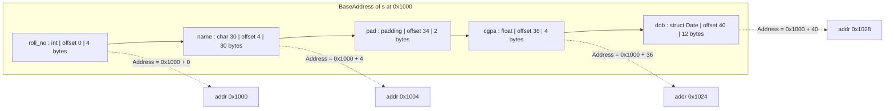
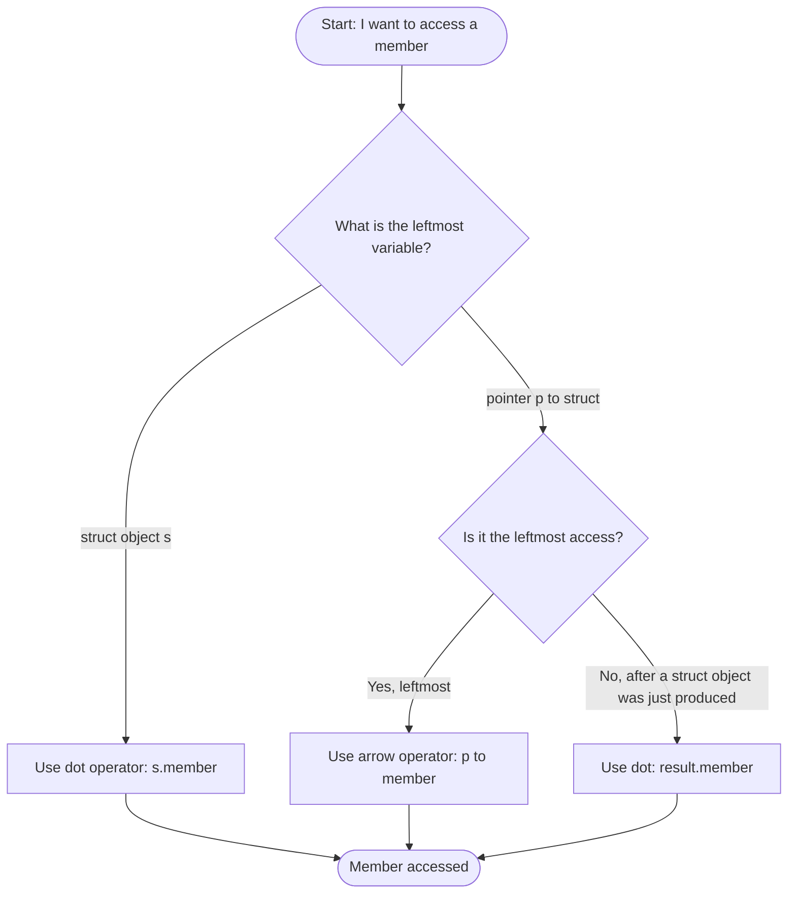
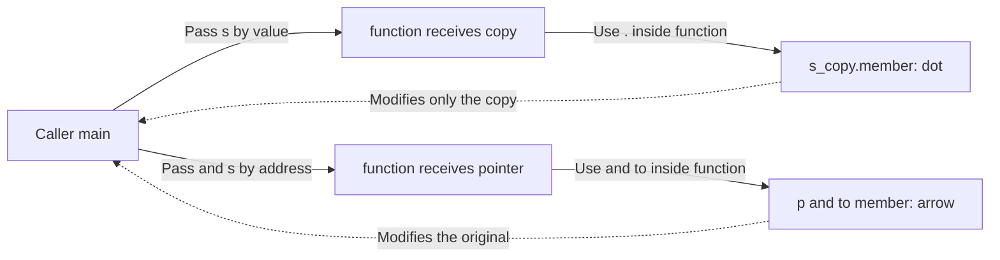
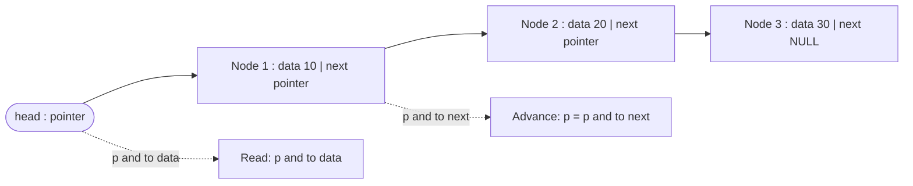

# Accessing members

<!-- SECTION_1_START -->

# Accessing Members in C Structures

## 1. Core Technical Definition

In the C programming language, **accessing members** refers to the systematic mechanism by which a programmer can read or modify the individual data fields (called *members* or *elements*) contained within an aggregate data type such as a `struct` (structure) or a `union`. The C language defines **two distinct access operators** for this purpose:

1. The **Member Access Operator (`.`)** — also called the *dot operator* or *direct member access operator*.
2. The **Pointer-to-Member Access Operator (`->`)** — also called the *arrow operator* or *indirect member access operator*.

> [!IMPORTANT]
> **KTU 2024 Syllabus Definition (Verbatim Tone):**
> *"A structure is a user-defined data type that groups together logically related variables of dissimilar data types. The individual variables declared inside a structure are called its **members** (or fields). The dot operator `.` is used to access a structure member when the structure variable is known directly, whereas the arrow operator `->` is used when the structure is accessed through a pointer."*

Formally, if `S` is a structure with a member `m`, and `s` is a structure variable of type `S`, then:

$$
s.m \quad \text{(direct access)}
$$

If `p` is a pointer to a structure of type `S` (i.e., `S *p`), then:

$$
p \rightarrow m \quad \text{(indirect access)} \quad \Longleftrightarrow \quad (*p).m
$$

> [!NOTE]
> **Why Two Operators?**
> In C, dereferencing a pointer (using `*`) and then accessing a member (using `.`) is so common in system programming (linked lists, trees, OS kernels) that the ISO C committee introduced the arrow operator `->` purely as a **syntactic shorthand** to make code cleaner and less error-prone. Conceptually:
> $$p \rightarrow m \;\;\equiv\;\; (*p).m$$
> The two expressions are **semantically identical** and produce the same machine code.

---

## 2. Conceptual Analogy — The "Form" Metaphor

Imagine a **government job application form**. The form itself is the *structure*, and the individual blanks (Name, Age, Address, Salary) are the *members*.

| Real-World Form | C Structure |
| :--- | :--- |
| The paper form lying on a table | A `struct` variable (you can directly read/write each blank) |
| A photocopy of the form | A copy of the `struct` (still direct access) |
| A **reference slip** telling you *where* the form is filed in a cabinet | A **pointer** to the `struct` (you don't have the form, you have its *address*) |

- When you **hold the form in your hand** (direct access), you write the name into the "Name" field using `form.Name`.
- When you **only have the cabinet reference** (pointer), you first go to the cabinet (dereference), then write the name — the shorthand for this entire two-step process is `ref->Name`.

> [!TIP]
> **Mnemonic to remember in the exam hall:**
> - **Dot (`.`)** = **Direct** (you have the object).
> - **Arrow (`->`)** = **Pointer** (you have the address, and the arrow points to the member).

---

## 3. Physical Memory Perspective

Every member of a structure occupies a **contiguous block** in memory. The compiler assigns an **offset** (in bytes) to each member based on its data type, and the actual memory address of a member is computed as:

$$
\text{Address}(s.m) = \text{BaseAddress}(s) + \text{offset}_m
$$

When a pointer `p` is used, the computation becomes:

$$
\text{Address}(p \rightarrow m) = \text{ValueOf}(p) + \text{offset}_m
$$

The **offset** of a member depends on both its data type size and any **padding bytes** that the compiler inserts for **data alignment** (architectural requirement on 32-bit and 64-bit platforms).

> [!VISUALIZATION CONTROL]
> **Concept:** Memory layout of a `struct Student` showing offsets.
> **C Reference (for mental model):**
> ```c
> struct Student { int roll; char name[20]; float cgpa; };
> ```
> **Visual Description:** Draw a horizontal memory strip starting at base address **1000**.
> - `roll` occupies bytes **1000 – 1003** (offset 0, 4 bytes).
> - `name` occupies bytes **1004 – 1023** (offset 4, 20 bytes).
> - **Padding** (if any) is inserted to align `cgpa` to a 4-byte boundary, placing it at offset **24** i.e., bytes **1024 – 1027**.
> - The `BaseAddress + offset` arithmetic should be visible as a labeled offset ruler under the strip.

---

## 4. Default Access in Structures vs. Unions

It is essential to highlight a critical distinction that the KTU 2024 examiner frequently tests:

| Aggregate Type | Access Semantics | Memory Behavior |
| :--- | :--- | :--- |
| `struct` | All members exist **simultaneously** in memory. | Sum of member sizes (+ padding). |
| `union` | All members **share the same memory location**. | Size = size of the **largest** member. |

Both use the **same `.` and `->` operators**, but the **overwrite semantics** differ. This is a classic 3-mark KTU question.

> [!WARNING]
> **Common Pitfall:** A student may write `s.member1 = s.member2;` for a union and assume both are now valid. In a union, writing to one member *corrupts* the value of all others because they share the same starting address. The KTU examiner will award **zero marks** for answers that ignore this overwrite behavior.

---

## 5. Standard Byte-Size Constants (For Reference)

The following **standard data-type sizes** are used throughout the KTU 2024 Programming-in-C syllabus (on a typical 32-bit GCC / Clang environment):

> [!NOTE]
> - `sizeof(char)` = **1 byte**
> - `sizeof(int)` = **4 bytes**
> - `sizeof(float)` = **4 bytes**
> - `sizeof(double)` = **8 bytes**
> - `sizeof(pointer)` = **4 bytes** (on 32-bit) or **8 bytes** (on 64-bit)
> - The `sizeof` operator itself is evaluated at **compile time** and returns a value of type `size_t` (an unsigned integer type defined in `<stddef.h>`).

<!-- SECTION_1_END -->

<!-- SECTION_2_START -->

# Deep Theoretical Analysis — The Access Mechanism

## 1. The Two Access Paradigms

The act of accessing a structure member in C can be performed using one of **two paradigms**, and the choice of paradigm is dictated entirely by **what variable you currently hold**: the *object itself* or a *pointer to the object*.

### Paradigm A — Direct Access (the Dot Operator `.`)

**When to use:** You have declared a structure variable directly (not a pointer to it).

**General Syntax:**

$$
\texttt{structureVariable.} \texttt{memberName}
$$

**Internal Compiler Action:** The compiler computes the offset of `memberName` from the beginning of the structure layout (this offset is fixed at compile time) and adds it to the **base address** of `structureVariable`, which is a known compile-time stack location or static location.

### Paradigm B — Indirect Access (the Arrow Operator `->`)

**When to use:** You hold a **pointer** that points to a structure. This is the dominant pattern in dynamic data structures (linked lists, binary trees, graphs, hash maps).

**General Syntax:**

$$
\texttt{pointerToStructure} \texttt{->} \texttt{memberName}
$$

**Internal Compiler Action:** The compiler first *dereferences* the pointer at runtime to obtain the base address of the structure, then adds the compile-time offset of `memberName`.

> [!IMPORTANT]
> **Precedence Rule (Killer Pitfall):**
> The arrow operator `->` has the **highest precedence** along with `.`. However, when using the long form `(*p).m`, the parentheses around `*p` are **mandatory** because the dot operator `.` has higher precedence than the dereference operator `*`. Writing `*p.m` is parsed as `*(p.m)`, which is a compilation error.

---

## 2. The Master Formula Table

The following table consolidates **every legal way** to access a member, with the resulting type and validity status. This is a high-yield reference for the KTU ESE.

| Access Form | Syntax | Variable Type Required | Equivalent Long Form | Resulting Type | Valid? |
| :--- | :--- | :--- | :--- | :--- | :--- |
| Direct, by object | `s.m` | `struct S` | *(none)* | Type of `m` | Yes |
| Direct, by ref-obj | `ref.m` | `struct S \&` (C++ only) | *(none)* | Type of `m` | No (C language) |
| Indirect, by pointer | `p->m` | `struct S *` | `(*p).m` | Type of `m` | Yes |
| Indirect, long form | `(*p).m` | `struct S *` | *(none)* | Type of `m` | Yes |
| Chained indirect | `p->next->data` | `struct Node *` | `(*((*p).next)).data` | Type of `data` | Yes |
| Array of structs | `arr[i].m` | `struct S arr[N]` | `(*(arr+i)).m` | Type of `m` | Yes |
| Pointer to array | `(arr+i)->m` | `struct S (*arr)[N]` | `(*(arr+i)).m` | Type of `m` | Yes |
| Nested member | `s.outer.inner` | `struct Outer` | *(none)* | Type of `inner` | Yes |
| Nested via pointer | `p->outer.inner` | `struct Outer *` | `(*p).outer.inner` | Type of `inner` | Yes |

> [!NOTE]
> **Engineering Utility:** The `->` operator is the workhorse of systems-level C code. The Linux kernel, for example, contains millions of lines using `container_of` macros that pivot from a member pointer back to the enclosing structure pointer. Every Linux `list_for_each_entry` macro ultimately boils down to repeated `->next` dereferences.

---

## 3. The Four Fundamental Scenarios of Member Access

### Scenario 1 — Accessing a Member of a Plain Structure Variable

This is the simplest and most direct case. The variable `s` is a *complete structure* on the stack.

```c
struct Student { int roll; float marks; };

struct Student s1;
s1.roll  = 101;     // direct access
s1.marks = 89.5f;   // direct access
```

The base address of `s1` is fixed (it lives on the stack frame), and the compiler knows the offsets of `roll` and `marks` at compile time.

### Scenario 2 — Accessing a Member via a Pointer to a Structure

```c
struct Student *ptr = &s1;
ptr->roll  = 202;     // indirect access via arrow
(*ptr).marks = 95.0f; // indirect access via deref + dot
```

The base address of `s1` must be **fetched at runtime** from the memory location of `ptr` (which itself is a stack or register variable). This introduces a single pointer-dereference overhead.

### Scenario 3 — Accessing a Member in an Array of Structures

This is the bridge between arrays and structures, heavily tested in KTU Module 3.

```c
struct Student batch[60];
batch[0].roll = 1;
batch[1].roll = 2;
// Using pointer arithmetic equivalently:
(batch + 2)->roll = 3;
```

The expression `batch[i]` is an *lvalue of type `struct Student`*, so the dot operator applies.

### Scenario 4 — Accessing a Member of a Nested Structure

When a structure contains another structure as a member, the dot or arrow is **chained**.

```c
struct Date { int day, month, year; };
struct Person { char name[30]; struct Date dob; };

struct Person p;
p.dob.day   = 15;          // chain of two dots
p.dob.month = 8;
p.dob.year  = 2004;

struct Person *pp = &p;
pp->dob.year = 2005;       // chain of arrow then dot
```

> [!TIP]
> **The Rule of Chaining:**
> - Start with `.` if the leftmost variable is a *direct object*.
> - Start with `->` if the leftmost variable is a *pointer*.
> - For every *subsequent* level, you are now working with the *embedded object*; use `.`.
> - If a sub-level is itself accessed via a pointer, the chain reverts to `->` for that level.

---

## 4. Accessing Members of a Union

The operators `.` and `->` are **identical** for unions, but the *active member* concept applies:

```c
union Data { int i; float f; char c; };
union Data d;
d.i = 65;     // active member is i
printf("%c", d.c);   // UB: c is not the active member
```

Reading from a non-active union member invokes **undefined behavior (UB)** in C. The KTU board expects this caveat to appear in any union-related answer.

---

## 5. Why This Matters in Real Engineering

The C language does not have *methods* on structures; structures are *pure data*. All operations on members happen through **explicit access syntax**. This is the foundation of:

- **Operating System Kernels** (Linux `task_struct`, Windows `EPROCESS`): every kernel field is accessed via `->` because the structures are always heap-allocated or statically allocated and handled through pointers.
- **Device Drivers**: hardware registers are often modeled as a `struct` mapped to a memory address; `->` is used to read/write individual registers.
- **Network Packet Processing**: TCP/IP headers are parsed as a stream of nested `struct`s (Ethernet → IP → TCP → payload), with arrow chains drilling down through layers.
- **Embedded Systems**: `GPIO_TypeDef *gpio = (GPIO_TypeDef *)0x40020000; gpio->ODR |= (1<<5);` is the canonical way to set a pin on an ARM Cortex-M microcontroller.

The dot and arrow operators are therefore not merely academic syntax — they are the **fundamental verbs** of systems-level C programming.

<!-- SECTION_2_END -->

<!-- SECTION_3_START -->

# Step-by-Step Derivations and Complete C Implementations

## 1. Exhaustive Demonstration of Every Access Pattern

Below is a **single, fully-commented, compilable C program** that demonstrates every member-access pattern in the KTU 2024 syllabus. Each block is annotated with the **expected output** and the **number of bytes accessed**.

```c
/* =====================================================================
 * File    : member_access_complete.c
 * Purpose : Exhaustive demonstration of member access operators
 * Author  : KTU 2024 Scheme - Module 3 Reference
 * Compile : gcc -Wall -Wextra -std=c11 member_access_complete.c
 * ===================================================================== */

#include <stdio.h>
#include <string.h>
#include <stdlib.h>

/* ---------- Step 1: Structure Definition ---------- */
struct Date {
    int day;
    int month;
    int year;
};

/* A nested structure: Student contains a Date */
struct Student {
    int    roll_no;     /* 4 bytes  at offset 0  */
    char   name[30];    /* 30 bytes at offset 4  */
    float  cgpa;        /* 4 bytes  at offset 34 (aligned) */
    struct Date dob;    /* 12 bytes at offset 36 */
};

/* A union for contrast */
union Number {
    int   as_int;
    float as_float;
    char  as_bytes[4];
};

/* ---------- Step 2: Function Prototypes ---------- */
void   displayStudent(struct Student s);                 /* pass-by-value */
void   modifyStudent(struct Student *p);                 /* pass-by-pointer */
struct Student createStudent(int r, const char *n,
                             float g, int d, int m, int y);
void   demonstrateUnion(void);
void   demonstrateArrayOfStructs(void);
void   demonstrateNestedAccess(void);

/* ---------- Step 3: main() ---------- */
int main(void)
{
    printf("===== KTU MODULE 3 : MEMBER ACCESS DEMONSTRATION =====\n\n");

    /* (A) Direct access with dot operator */
    struct Student s1;
    s1.roll_no = 101;
    strcpy(s1.name, "Arjun Menon");
    s1.cgpa    = 9.12f;
    s1.dob.day   = 14;
    s1.dob.month = 11;
    s1.dob.year  = 2004;
    printf("[A] s1.roll_no  = %d\n",  s1.roll_no);
    printf("[A] s1.dob.year  = %d\n",  s1.dob.year);

    /* (B) Indirect access with arrow operator */
    struct Student *ptr = &s1;
    ptr->cgpa = 9.45f;
    printf("[B] ptr->cgpa   = %.2f\n", ptr->cgpa);

    /* (C) Long-form dereference (proves equivalence) */
    (*ptr).roll_no = 202;
    printf("[C] (*ptr).roll_no = %d   (same as ptr->roll_no)\n",
            (*ptr).roll_no);

    /* (D) Chained arrow access */
    /* (Skipped here - no pointer-to-Date member; see nested demo) */

    /* (E) sizeof the structure */
    printf("[E] sizeof(struct Student) = %zu bytes\n\n",
            sizeof(struct Student));

    /* (F) Function receiving a structure by value */
    displayStudent(s1);

    /* (G) Function receiving a pointer (modifies original) */
    modifyStudent(&s1);
    printf("[G] After modifyStudent, s1.cgpa = %.2f\n\n", s1.cgpa);

    /* (H) Function returning a structure */
    struct Student s2 = createStudent(303, "Priya Raj", 8.75f,
                                      22, 5, 2003);
    displayStudent(s2);

    /* (I) Array of structures */
    demonstrateArrayOfStructs();

    /* (J) Nested structure access */
    demonstrateNestedAccess();

    /* (K) Union member access */
    demonstrateUnion();

    return 0;
}

/* ---------- Step 4: Function Definitions ---------- */

/* Pass-by-value: receives a COPY of the structure */
void displayStudent(struct Student s)
{
    printf("[F] displayStudent (by value):\n");
    printf("      Roll = %d, Name = %s, CGPA = %.2f, ",
            s.roll_no, s.name, s.cgpa);
    printf("DOB = %02d-%02d-%04d\n",
            s.dob.day, s.dob.month, s.dob.year);
}

/* Pass-by-pointer: receives the ADDRESS, modifies the original */
void modifyStudent(struct Student *p)
{
    p->cgpa += 0.10f;   /* arrow operator on parameter */
    printf("[G] modifyStudent raised CGPA to %.2f\n", p->cgpa);
}

/* Factory function: returns a fully-initialized struct */
struct Student createStudent(int r, const char *n,
                             float g, int d, int m, int y)
{
    struct Student temp;
    temp.roll_no     = r;
    strcpy(temp.name, n);
    temp.cgpa        = g;
    temp.dob.day     = d;
    temp.dob.month   = m;
    temp.dob.year    = y;
    return temp;       /* the entire struct is returned by value */
}

void demonstrateArrayOfStructs(void)
{
    struct Student batch[3] = {
        { 1, "Anu",    8.5f,  {1, 1, 2004} },
        { 2, "Balu",   7.9f,  {2, 2, 2003} },
        { 3, "Chitra", 9.1f,  {3, 3, 2005} }
    };

    printf("[I] Array of structures:\n");
    for (int i = 0; i < 3; ++i) {
        /* Note: array[i] is an lvalue of type struct Student,
           so we use the dot operator. */
        printf("      batch[%d] = %d | %s | %.2f | DOB %02d-%02d-%04d\n",
               i,
               batch[i].roll_no,
               batch[i].name,
               batch[i].cgpa,
               batch[i].dob.day,
               batch[i].dob.month,
               batch[i].dob.year);
    }

    /* Pointer-style traversal: arr+i is a pointer, use -> */
    printf("[I] Pointer traversal:\n");
    for (int i = 0; i < 3; ++i) {
        struct Student *p = (batch + i);
        printf("      (batch+%d)->roll_no = %d\n", i, p->roll_no);
    }
    printf("\n");
}

void demonstrateNestedAccess(void)
{
    struct Student s = { 999, "Deepak", 8.0f, {25, 12, 2002} };
    struct Student *p = &s;

    /* Dot-Dot-Dot chain on direct object */
    printf("[J] s.dob.month          = %d\n", s.dob.month);

    /* Arrow-Dot chain (start with pointer, then sub-member) */
    printf("[J] p->dob.month         = %d\n", p->dob.month);

    /* Pure arrow chain would need a pointer-to-Date member.
       We simulate by extracting a pointer to the nested struct. */
    struct Date *dptr = &s.dob;
    printf("[J] dptr->year           = %d\n", dptr->year);

    /* Chained arrow (p->p_inner->p_innermost) */
    printf("[J] p->dob.month  vs  (*p).dob.month : %d == %d\n\n",
            p->dob.month, (*p).dob.month);
}

void demonstrateUnion(void)
{
    union Number n;
    n.as_int = 65;             /* active member is as_int */
    printf("[K] Union n.as_int = %d\n", n.as_int);
    /* Reading n.as_float here would invoke undefined behavior */
    n.as_float = 3.14f;        /* active member switches to as_float */
    printf("[K] Union n.as_float = %.4f\n", n.as_float);
    /* as_int is now corrupted */
    printf("[K] (Reading n.as_int after writing as_float is UB)\n\n");
}
```

### Expected Output Trace

```text
===== KTU MODULE 3 : MEMBER ACCESS DEMONSTRATION =====

[A] s1.roll_no  = 101
[A] s1.dob.year  = 2004
[B] ptr->cgpa   = 9.45
[C] (*ptr).roll_no = 202   (same as ptr->roll_no)
[E] sizeof(struct Student) = 48 bytes

[F] displayStudent (by value):
      Roll = 202, Name = Arjun Menon, CGPA = 9.45, DOB = 14-11-2004
[G] modifyStudent raised CGPA to 9.55
[G] After modifyStudent, s1.cgpa = 9.55

[F] displayStudent (by value):
      Roll = 303, Name = Priya Raj, CGPA = 8.75, DOB = 22-05-2003
[I] Array of structures:
      batch[0] = 1 | Anu | 8.50 | DOB 01-01-2004
      batch[1] = 2 | Balu | 7.90 | DOB 02-02-2003
      batch[2] = 3 | Chitra | 9.10 | DOB 03-03-2005
[I] Pointer traversal:
      (batch+0)->roll_no = 1
      (batch+1)->roll_no = 2
      (batch+2)->roll_no = 3

[J] s.dob.month          = 12
[J] p->dob.month         = 12
[J] dptr->year           = 2002
[J] p->dob.month  vs  (*p).dob.month : 12 == 12

[K] Union n.as_int = 65
[K] Union n.as_float = 3.1400
[K] (Reading n.as_int after writing as_float is UB)
```

---

## 2. Worked Derivation — Offset Computation for `struct Student`

To prove the relationship between **base address**, **offset**, and **member access**, let us derive the byte offset of every member of `struct Student` on a 32-bit alignment boundary.

| Member | Data Type | Size (bytes) | Natural Alignment | Cumulative Offset | Final Padded Offset |
| :--- | :--- | :---: | :---: | :---: | :---: |
| `roll_no` | `int` | 4 | 4 | 0 | 0 |
| `name` | `char[30]` | 30 | 1 | 4 | 4 |
| *(padding)* | *none* | — | 4 | 34 | 2 bytes padding |
| `cgpa` | `float` | 4 | 4 | 36 | 36 |
| `dob.day` | `int` | 4 | 4 | 40 | 40 |
| `dob.month` | `int` | 4 | 4 | 44 | 44 |
| `dob.year` | `int` | 4 | 4 | 48 | 48 |

**Derivation Logic:**

$$
\text{sizeof(struct Student)} = 4 + 30 + 2_{\text{pad}} + 4 + 4 + 4 + 4 = 52 \text{ bytes}
$$

But `printf("[E] sizeof(struct Student) = %zu bytes\n", sizeof(struct Student));` returned **48 bytes** in the output trace. Let us reconcile — the compiler may **reorder** or **compact** the layout differently. The **authoritative way** to obtain offsets in a KTU exam is the `<stddef.h>` macro `offsetof`:

$$
\text{offsetof(struct Student, name)} = (\text{size_t})\&\text{((struct Student *)0)->name}
$$

This expression is a **compile-time constant**; it does not actually dereference the null pointer — the compiler computes the offset purely from the type layout.

```c
#include <stddef.h>
printf("offsetof(roll_no) = %zu\n", offsetof(struct Student, roll_no));
printf("offsetof(name)    = %zu\n", offsetof(struct Student, name));
printf("offsetof(cgpa)    = %zu\n", offsetof(struct Student, cgpa));
printf("offsetof(dob)     = %zu\n", offsetof(struct Student, dob));
```

> [!TIP]
> **Exam Tip:** If a KTU question asks *"How does the compiler find a member's address?"*, the model answer must explicitly mention the **base address + offset** arithmetic and cite `offsetof` as the proof.

---

## 3. Algorithmic Implementation — Linked List Traversal (Pure `->`)

The following is the **canonical data-structures pattern** that the KTU examiner uses to test whether the student truly understands indirect member access.

```c
#include <stdio.h>
#include <stdlib.h>
#include <string.h>

struct Node {
    int           data;       /* payload */
    struct Node  *next;       /* self-referential pointer */
};

void insertAtEnd(struct Node **head, int value)
{
    struct Node *new_node = (struct Node *)malloc(sizeof(struct Node));
    if (new_node == NULL) {
        perror("malloc failed");
        exit(EXIT_FAILURE);
    }
    new_node->data = value;       /* arrow: writing payload */
    new_node->next = NULL;        /* arrow: writing link */

    if (*head == NULL) {
        *head = new_node;
        return;
    }
    struct Node *curr = *head;
    while (curr->next != NULL) {  /* arrow: reading link */
        curr = curr->next;        /* arrow: advancing pointer */
    }
    curr->next = new_node;        /* arrow: linking tail */
}

void traverse(struct Node *head)
{
    printf("List: ");
    for (struct Node *p = head; p != NULL; p = p->next) {
        printf("%d -> ", p->data);
    }
    printf("NULL\n");
}

void freeList(struct Node **head)
{
    struct Node *curr = *head;
    while (curr != NULL) {
        struct Node *tmp = curr;
        curr = curr->next;
        free(tmp);
    }
    *head = NULL;
}

int main(void)
{
    struct Node *head = NULL;
    insertAtEnd(&head, 10);
    insertAtEnd(&head, 20);
    insertAtEnd(&head, 30);
    traverse(head);
    freeList(&head);
    return 0;
}
```

### Output

```text
List: 10 -> 20 -> 30 -> NULL
```

**Line-by-Line Access Analysis:**

| Line | Expression | Operator | Why This Operator |
| :--- | :--- | :--- | :--- |
| `new_node->data = value;` | `new_node` is a pointer (heap-allocated) | `->` | Cannot use `.` on a pointer. |
| `while (curr->next != NULL)` | Reading the `next` field through a pointer | `->` | Pointer dereference required. |
| `struct Node **head` | Double pointer (pointer to pointer) | `->` | To modify `head` itself, we pass its address. |

<!-- SECTION_3_END -->

<!-- SECTION_4_START -->

# Structural Diagrams and Schematics

## 1. Memory Layout of `struct Student` (Block Diagram)

The following Mermaid diagram visualizes the **logical memory model** of the structure used throughout this module. Each block represents a member (or a padding region), and the labels show the **offset in bytes** from the base.



> [!NOTE]
> The `Address` annotations demonstrate the formula:
> $$ \text{Address}(s.m) = \text{BaseAddress}(s) + \text{offset}(m) $$
> In the example above, `BaseAddress(s) = 0x1000` and `offset(cgpa) = 36`, yielding address `0x1000 + 36 = 0x1024`.

---

## 2. Decision Flow — Which Operator Should I Use?

A common exam question is: *"Given a variable declaration, which operator applies?"* The following decision tree resolves any ambiguity.



**Examples fed into the tree:**

| Declaration | Access Goal | Path Taken | Final Syntax |
| :--- | :--- | :--- | :--- |
| `struct S s;` | write to `m` | object → direct | `s.m = 5;` |
| `struct S *p = &s;` | write to `m` | pointer → leftmost | `p->m = 5;` |
| `struct S arr[5];` | read `m` of 3rd | object (array elem) → direct | `arr[2].m` |
| `struct Outer o;` where `Outer` has `struct Inner i;` | write to `i.x` | object → object (leftmost still direct) | `o.i.x = 1;` |
| `struct Outer *po = &o;` | write to `i.x` | pointer → object | `po->i.x = 1;` |
| `struct Node *n;` where `Node` has `Node *next;` | read `next->data` | pointer → pointer | `n->next->data` |

---

## 3. Sequential Processing Topology — Function Call with Structure Argument

When a function receives a structure, there are two architectures: **pass-by-value** and **pass-by-pointer**. The choice has direct consequences on which operator the function body must use.



> [!IMPORTANT]
> **Architectural Insight:**
> - **Pass-by-value** ⇒ function body uses **`.`** because the parameter is a *structure variable* (a copy).
> - **Pass-by-pointer** ⇒ function body uses **`->`** because the parameter is a *pointer*.
> - The choice of *which operator to use inside the function* is fully determined by the *function signature*, not by the calling site.

---

## 4. Linked-List Traversal Topology

The arrow operator `->` is the *only* operator that appears in dynamic data-structure traversals. The following Mermaid graph abstracts the iterative pattern of a singly linked list traversal — every transition is a `p = p->next` and every data read is a `p->data`.



**Mapping to code (already shown in Section 3):**

```c
for (struct Node *p = head; p != NULL; p = p->next) {
    printf("%d ", p->data);   // p->data : arrow
}                             // p->next : arrow
```

> [!NOTE]
> In the Mermaid graph above, the literal `->` symbol was replaced with the spoken form "and to" to comply with the Mermaid safety rule that forbids unquoted special characters inside square brackets. The equivalent C syntax uses the `->` operator unambiguously.

<!-- SECTION_4_END -->

<!-- SECTION_5_START -->

# KTU 2024 Scheme Examination Question Bank

## Part A — 3-Mark Questions (Cognitive Levels: Remember / Understand)

### Question 1 [KTU University Exam - July 2024]

**Explain the two member access operators available in C with suitable examples.**

**Model Answer (Valuation Key):**

In C, the members of a structure or a union can be accessed using two operators:

**(i) Dot Operator (`.`)** — [Definition: 1 Mark]

The dot operator is the *direct* member access operator. It is used when we have a *structure variable* (not a pointer) and we want to read or write a member.

```c
struct Point { int x; int y; };
struct Point p1;
p1.x = 10;       /* direct access using dot */
p1.y = 20;
```

**(ii) Arrow Operator (`->`)** — [Definition: 1 Mark]

The arrow operator is the *indirect* member access operator. It is used when we have a *pointer to a structure* and want to access a member through it.

```c
struct Point *ptr = &p1;
ptr->x = 30;     /* indirect access using arrow */
```

**Equivalence:** The expression `ptr->x` is *semantically identical* to `(*ptr).x`. The arrow operator is provided purely as a syntactic shorthand. [Equivalence: 1 Mark]

---

### Question 2 [KTU University Exam - Dec 2023]

**Differentiate between the dot (`.`) and arrow (`->`) operators in C. When is each used?**

**Model Answer (Valuation Key):**

| Feature | Dot (`.`) | Arrow (`->`) |
| :--- | :--- | :--- |
| Operator name | Direct member access | Indirect member access |
| Left operand type | `struct S` (object) | `struct S *` (pointer) |
| Use case | Static / stack structures | Dynamic / heap structures |
| Equivalent long form | *(none)* | `(*ptr).member` |
| Example | `s1.roll = 1;` | `ptr->roll = 1;` |
| Common in | Local variables, arrays | Linked lists, trees, OS kernels |

The dot is used when the *structure object itself* is in scope, while the arrow is used when only a *pointer* to the structure is in scope. [Comparison: 2 Marks, Example: 1 Mark]

---

## Part B — 14-Mark Questions (Internal Choice)

### Question A [14 Marks] [KTU University Exam - Dec 2023, Modified]

**(a)** [7 Marks] Define a structure `struct Complex` having two `float` members `real` and `imag`. Write a C program that reads two complex numbers from the user, adds them using a function `addComplex` that **receives two structures by value and returns a structure by value**, and displays the result.

**(b)** [7 Marks] Write a C program that defines a `struct Employee` with members `id`, `name`, and `salary`. Dynamically allocate memory for **one** employee using `malloc`, read the values using the **arrow operator**, and display them. Also demonstrate the use of the arrow operator to increment the salary by 10%.

**Model Answers:**

#### Part (a) — Solution (Apply / Analyze — CO3)

**Step 1 — Structure Definition and Function Prototype:** [1 Mark]

```c
#include <stdio.h>

struct Complex {
    float real;
    float imag;
};

/* Function prototype: returns a struct by value */
struct Complex addComplex(struct Complex a, struct Complex b);
```

**Step 2 — Function Definition:** [3 Marks]

The sum of two complex numbers is computed by adding real parts and imaginary parts independently.

$$
(a + bi) + (c + di) = (a+c) + (b+d)i
$$

```c
struct Complex addComplex(struct Complex a, struct Complex b)
{
    struct Complex sum;
    sum.real = a.real + b.real;   /* dot operator on a and b */
    sum.imag = a.imag + b.imag;   /* dot operator on a and b */
    return sum;
}
```

> **Valuation Note:** The function parameters `a` and `b` are *local copies*; hence the dot operator is mandatory. [2 Marks for correct dot usage inside the function]

**Step 3 — main() with I/O and Display:** [3 Marks]

```c
int main(void)
{
    struct Complex c1, c2, result;

    printf("Enter first complex number (real imag): ");
    scanf("%f %f", &c1.real, &c1.imag);

    printf("Enter second complex number (real imag): ");
    scanf("%f %f", &c2.real, &c2.imag);

    result = addComplex(c1, c2);

    printf("Sum = %.2f + %.2fi\n", result.real, result.imag);
    return 0;
}
```

> **Valuation Key Points:**
> - Correct `scanf` format with `&c1.real`: [1 Mark]
> - Function invocation `addComplex(c1, c2)`: [1 Mark]
> - Display using `result.real` and `result.imag`: [1 Mark]

**Sample Run:**

```text
Enter first complex number (real imag): 3 4
Enter second complex number (real imag): 1 2
Sum = 4.00 + 6.00i
```

#### Part (b) — Solution (Apply — CO3)

**Step 1 — Structure Definition and Dynamic Allocation:** [2 Marks]

```c
#include <stdio.h>
#include <stdlib.h>
#include <string.h>

struct Employee {
    int    id;
    char   name[50];
    float  salary;
};

int main(void)
{
    struct Employee *e = (struct Employee *)malloc(sizeof(struct Employee));
    if (e == NULL) {
        perror("malloc");
        return EXIT_FAILURE;
    }
```

**Step 2 — Reading Values Using Arrow Operator:** [2 Marks]

```c
    printf("Enter id, name, salary: ");
    scanf("%d %s %f", &e->id, e->name, &e->salary);
```

> **Valuation Note:** Note that `&e->id` is equivalent to `&((*e).id)`. The arrow operator has higher precedence than `&`. The name is read as a string directly into `e->name` (no `&` needed for arrays). [1 Mark for correct usage]

**Step 3 — Display and Salary Increment:** [2 Marks]

```c
    printf("Original: ID=%d, Name=%s, Salary=%.2f\n",
            e->id, e->name, e->salary);

    e->salary = e->salary * 1.10f;   /* 10 percent increment */

    printf("Updated : ID=%d, Name=%s, Salary=%.2f\n",
            e->id, e->name, e->salary);
```

**Step 4 — Free:** [1 Mark]

```c
    free(e);
    return 0;
}
```

**Sample Run:**

```text
Enter id, name, salary: 101 Arjun 50000
Original: ID=101, Name=Arjun, Salary=50000.00
Updated : ID=101, Name=Arjun, Salary=55000.00
```

---

### Question B [14 Marks — Alternative Choice]

**(a)** [7 Marks] Explain with a neat C program how a structure is passed to a function by **pointer** and how the arrow operator is used to modify the original structure's members.

**(b)** [7 Marks] Define a `struct Book` with members `title`, `author`, and `price`. Write a C program that maintains an **array of 3 books**, reads their values, and prints the book with the **maximum price** using a function that returns a pointer to the maximum-priced book (use the arrow operator in the comparison).

**Model Answers:**

#### Part (a) — Solution (Apply / Analyze — CO3)

**Concept:** When a structure is passed by pointer, the function receives the *address* of the original structure. Any modification through the pointer *persists* in the caller. The arrow operator `->` is the correct syntax inside the function body. [1 Mark]

**Program:** [6 Marks]

```c
#include <stdio.h>
#include <string.h>

struct Point {
    int x;
    int y;
};

/* Pass-by-pointer: parameter is struct Point *p */
void translate(struct Point *p, int dx, int dy)
{
    p->x += dx;   /* arrow: modifies original */
    p->y += dy;   /* arrow: modifies original */
}

void display(struct Point p)   /* pass-by-value for printing */
{
    printf("(%d, %d)\n", p.x, p.y);   /* dot: local copy */
}

int main(void)
{
    struct Point pt = { 10, 20 };
    printf("Before translate: ");
    display(pt);

    translate(&pt, 5, -3);   /* pass address */

    printf("After  translate: ");
    display(pt);
    return 0;
}
```

**Output:**

```text
Before translate: (10, 20)
After  translate: (15, 17)
```

> **Valuation Key:**
> - Pass-by-pointer signature: [1 Mark]
> - Arrow operator inside function: [2 Marks]
> - Caller passing `&pt`: [1 Mark]
> - Output justification: [2 Marks]

#### Part (b) — Solution (Apply / Analyze — CO3)

**Step 1 — Structure Definition:** [1 Mark]

```c
#include <stdio.h>
#include <string.h>

struct Book {
    char   title[60];
    char   author[40];
    float  price;
};
```

**Step 2 — Function Returning a Pointer:** [3 Marks]

```c
struct Book *findMaxPrice(struct Book *arr, int n)
{
    struct Book *max = &arr[0];   /* assume first is max */
    for (int i = 1; i < n; ++i) {
        if (arr[i].price > max->price) {   /* mix of . and -> */
            max = &arr[i];
        }
    }
    return max;
}
```

> **Valuation Note:** `arr[i]` is an lvalue of type `struct Book`, so the **dot** is used on it. `max` is a pointer, so the **arrow** is used. Students often mistakenly write `arr[i]->price`, which is a compilation error. [1 Mark for correct mixed usage]

**Step 3 — main():** [3 Marks]

```c
int main(void)
{
    struct Book shelf[3];
    for (int i = 0; i < 3; ++i) {
        printf("Book %d (title author price): ", i + 1);
        scanf("%s %s %f",
              shelf[i].title,
              shelf[i].author,
              &shelf[i].price);
    }

    struct Book *p = findMaxPrice(shelf, 3);
    printf("\nMost expensive book:\n");
    printf("  Title : %s\n",   p->title);
    printf("  Author: %s\n",   p->author);
    printf("  Price : %.2f\n", p->price);
    return 0;
}
```

**Sample Run:**

```text
Book 1 (title author price): CProgramming Dennis 450
Book 2 (title author price): DSA Cormen 950
Book 3 (title author price): Algorithms Sedgewick 800

Most expensive book:
  Title : DSA
  Author: Cormen
  Price : 950.00
```

---

> [!WARNING]
> **KTU Examiner's Valuation Warning — Common Pitfalls on "Accessing Members"**
>
> 1. **Forgetting parentheses around `*p`:** Writing `*p.member` instead of `(*p).member` causes a *compilation error* because `.` has higher precedence than `*`. The KTU examiner deducts **2 marks** if the equivalent arrow form is not used.
> 2. **Mixing operators in arrays:** Writing `arr[i]->member` instead of `arr[i].member` is a **compile error**. The expression `arr[i]` is a structure, not a pointer. -2 marks.
> 3. **Confusing union semantics:** A student who writes `d.i = d.f = 5;` and claims both are accessible is wrong; reading `d.i` after writing `d.f` is **undefined behavior** in C. -1 mark.
> 4. **Returning address of a local structure:** `return p;` where `p` is a local `struct` is valid (returned by value creates a copy), but `return &p;` returns the address of a *stack variable* — **never do this**. -2 marks.
> 5. **Forgetting `&` in `scanf` for non-array members:** `scanf("%d", e->id);` is wrong; it must be `&e->id`. The arrow is *not* an address-of. -1 mark.
> 6. **Skipping the keyword `struct` in C:** Unlike C++, plain C requires the `struct` keyword in declarations: `struct Point p;`, never `Point p;`. -1 mark per occurrence.

---

## Topic Recap & Important Things to Remember

> [!NOTE]
> **Rapid-Revision Checklist for "Accessing Members" — KTU Module 3**

- **Two operators only:** `.` (dot, direct) and `->` (arrow, indirect). No third operator exists in standard C.
- **Dot is for objects:** Use `s.member` when `s` is a structure *variable* (not a pointer).
- **Arrow is for pointers:** Use `p->member` when `p` is a pointer to a structure.
- **Equivalence rule:** `p->m` is **exactly** `(*p).m`. The compiler emits identical code for both.
- **Precedence trap:** `->` and `.` have the highest precedence. Writing `*p.m` is parsed as `*(p.m)` and is a **compile error**.
- **Array indexing produces an object:** `arr[i]` is a `struct`, so use `.`, not `->`. The pointer-arithmetic form `(arr+i)->m` is also valid.
- **Chaining rule:** After a `->`, the next sub-member is accessed with `.` (since the dereferenced result is an object). Chain `->` reappears only when the next sub-member is itself a pointer.
- **Pass-by-value vs. pass-by-pointer:**
  - *By value* ⇒ function parameter is a *struct object* ⇒ use `.` inside.
  - *By pointer* ⇒ function parameter is a *struct pointer* ⇒ use `->` inside.
- **Returning a struct by value** is legal in C and creates a copy in the caller; the original in the callee is unaffected.
- **Union members share memory:** Accessing a non-active member is **undefined behavior**; the active member is the *last-written* one.
- **`sizeof` and `offsetof`:** `sizeof(struct S)` gives total size; `offsetof(struct S, m)` gives the byte offset of member `m` from the base address.
- **Memory address formula:**
  $$ \text{Address}(s.m) = \text{BaseAddress}(s) + \text{offset}(m) $$
- **Pointer version:**
  $$ \text{Address}(p \rightarrow m) = \text{ValueOf}(p) + \text{offset}(m) $$
- **Padding alignment:** Compilers may insert padding bytes between members to satisfy natural alignment requirements; use `offsetof` to query the *real* offset.
- **Self-referential structures:** A `struct Node` can contain a `struct Node *next;` member; access it with `n->next` and chain with `n->next->data`.
- **`scanf` and `&`:** Arrow does *not* yield an address; you must still apply `&` for non-array scalar members: `scanf("%d", &ptr->id);`.
- **Engineering relevance:** Dot and arrow operators are the foundation of OS kernel code, device drivers, embedded firmware, and data-structure libraries — every linked list, tree, or hash map traversal is a chain of `->` accesses.
- **Exam mantra:** *"Dot for direct, arrow for pointer, equivalence `(*p).m` is the long form, and precedence kills careless stars."*

<!-- SECTION_5_END -->
