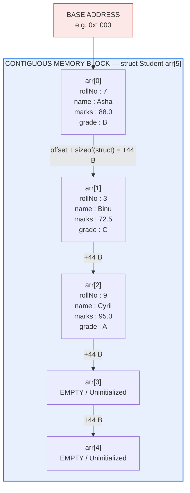
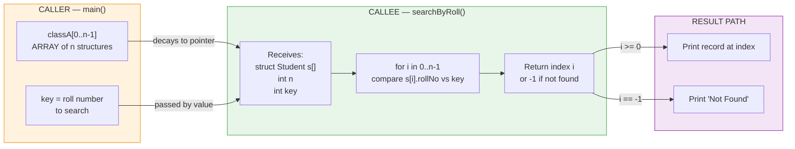
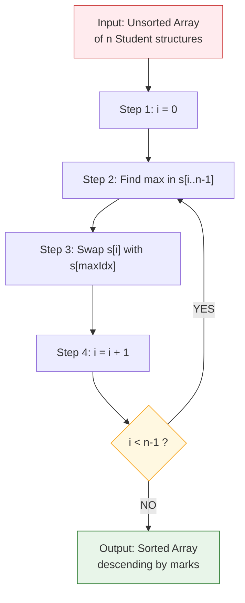
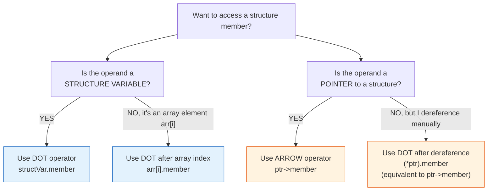

# Array of structures

<!-- SECTION_1_START -->

# Array of Structures — Core Technical Definition & Intuitive Overview

## 1.1 Formal Academic Definition (KTU 2024 Syllabus Terminology)

> [!IMPORTANT]
> **Array of Structures** is a composite derived data type in the C programming language that groups a *fixed, contiguous sequence* of **struct**-typed elements under a single identifier. Each element of the array is a complete structure instance occupying its own block of memory, and all elements are stored in **sequential memory addresses** with no gaps, allowing indexed access using the **subscript operator `[ ]`** in combination with the **member access operator (`.` or `->`)** to manipulate individual fields of any chosen record.

In the KTU 2024 scheme's *Programming in C (GXEST204)* syllabus, this topic is placed inside **Module 3 — Functions**, because the most common engineering use-case is *passing an array of structures* to a user-defined function for batch processing (e.g., processing `N` student records, `N` sensor readings, `N` employee payrolls).

## 1.2 Conceptual Analogy / Intuition

> [!NOTE]
> **Think of a Spreadsheet (Excel) Sheet.**
>
> - The **whole sheet** = *array of structures*
> - Each **row** in the sheet = *one structure element* (one complete record)
> - Each **column header** (Name, Roll No, Marks) = *one member/field* of the structure
> - The **row number** = *the array index* (`arr[0]`, `arr[1]`, …)
> - The **cell address** `Sheet[3].Marks` = *a specific member of a specific record*

So if you declare:

```c
struct Student s[60];
```

you are essentially *reserving 60 empty rows* in memory, each row having columns (members) such as `name`, `rollNo`, `marks`. To write the marks of the 5th student, you type `s[4].marks = 88;` — the *array index selects the row*, the *dot operator selects the column*.

> [!TIP]
> **One-line memory hook:** *“Array = rows of identical tables, each table = one structure.”*

## 1.3 Physical Constants / Standard Metrics

| Quantity | Standard Value (as per C11/KTU lab manual) |
|---|---|
| Minimum array size | **1 element** (C permits zero-size only as a GCC extension) |
| Maximum array size | Limited by available contiguous heap/stack memory |
| Alignment padding | Compiler inserts padding so each member aligns to its **natural boundary** |
| Index base | Always starts at **0** (zero-based indexing, never 1) |
| Lifetime | Entire program run if global; until enclosing block exits if local |

> [!WARNING]
> KTU examiners **strictly deduct marks** if a student writes indices starting from `1`. Always use `0` to `n-1`.

## 1.4 Where the Topic Sits in the KTU 2024 Module Map

```
Module 3 — Functions
 ├── 3.1 Function fundamentals, prototypes, scope, storage classes
 ├── 3.2 Parameter passing (call by value / reference)
 ├── 3.3 Recursion
 ├── 3.4 Arrays & Strings (1-D, 2-D, character arrays)
 └── 3.5 Structures & Union  ←  YOU ARE HERE
        ├── Defining a structure
        ├── Declaring & initializing structure variables
        ├── Nested structures
        ├── Array of structures  ★
        └── Passing structures to functions
```

This topic *logically depends* on understanding both **structures** (composite type) and **arrays** (indexed collection). It is the *bridge* that lets a function receive and process many records in a single call — an essential pattern in real engineering software (database records, IoT sensor logs, payroll systems).

---

<!-- SECTION_1_END -->

<!-- SECTION_2_START -->

# Deep Theoretical Analysis & KTU High-Yield Formula Sheet

## 2.1 Why Do We Need an Array of Structures?

A **single structure** stores the attributes of *one* entity. But in engineering problems we rarely deal with just *one* entity — we deal with *thousands*:

- A library management system tracks **thousands of books**.
- A weather station records **hourly readings from many sensors**.
- A college database stores **thousands of student records**.

Declaring thousands of individual variables is impossible. By *combining* the structure (record) with the array (collection), we get a **scalable, indexed, homogeneous collection of records** — exactly what databases and CSV files represent internally.

## 2.2 The Four Core Operations

There are exactly **four logical operations** a KTU question can ask on this topic. Master them and you master the module.

### Operation 1 — Declaration

```c
struct Tag {
    data_type member1;
    data_type member2;
    /* ... */
} variable[ SIZE ];
```

*Either* declare the structure *and* the array in one step, *or* declare the structure first and then declare the array later.

### Operation 2 — Initialization

Three valid styles:
1. **Compile-time (full initializer list)** — values listed inside `{ }` matching member order.
2. **Designated initializers** (C99) — `= { [0].roll = 1, [1].roll = 2 }`.
3. **Run-time** — use a `for` loop with `scanf` to fill each `arr[i].member`.

### Operation 3 — Access

- **Dot operator** `.` → when the operand is a *structure variable* (lvalue).
- **Arrow operator** `->` → when the operand is a *pointer* to a structure.

### Operation 4 — Passing to a Function

Two valid styles:
1. **Pass the whole array** (array name decays to pointer): `void process(struct Student s[], int n);`
2. **Pass a pointer to the first element**: `void process(struct Student *s, int n);`

Both are *identical* at the machine level — the function receives the *base address* of the array.

## 2.3 KTU Formula Sheet / Cheat Sheet

> [!NOTE]
> The following table is a *high-yield* reference. Memorize the **Memory Formula** — it appears in nearly every KTU exam on this topic.

| # | Concept | Formula / Syntax | Unit / Note |
|---|---|---|---|
| 1 | Total size of array of structures | `sizeof(arr) = N × sizeof(struct Tag)` | **bytes** |
| 2 | Size of one structure (with padding) | `sizeof(struct Tag) = Σ sizeof(member) + padding` | **bytes** |
| 3 | Address of `i`-th element | `&arr[i] = base_address + i × sizeof(struct Tag)` | **bytes offset** |
| 4 | Address of a member | `&arr[i].member = base + i × sizeof(struct) + offsetof(member)` | **bytes** |
| 5 | Pointer arithmetic on struct array | `(arr + i)->member` ≡ `arr[i].member` | pointer shift in *whole structures*, not bytes |
| 6 | Number of elements | `n = sizeof(arr) / sizeof(arr[0])` | dimensionless |
| 7 | Member access (lvalue) | `arr[i].member` | dot operator |
| 8 | Member access (pointer) | `(ptr + i)->member` or `ptr[i].member` | arrow operator |
| 9 | Initializing at declaration | `struct Student s[3] = { {"A",1,90}, {"B",2,80}, {"C",3,70} };` | brace-enclosed |
| 10 | Designated init (C99) | `struct Student s[3] = { [0] = {.marks=90}, [2] = {.marks=70} };` | sparse init |
| 11 | Function signature (receive) | `void f(struct Student s[], int n)` | array decays to pointer |
| 12 | Padding rule | Member is padded to next multiple of its **alignment** | usually 4 bytes on 32-bit, 8 on 64-bit |

> [!WARNING]
> Never use the vertical pipe symbol `\|x\|` inside markdown tables. The pipe breaks the table. Use `\vert` or `\mid` instead. (e.g., `n = N \mid i \in [0, N-1]`)

## 2.4 Real-World Engineering Utility

Array-of-structures is the **backbone data structure** of almost every embedded and systems program:

- **Embedded Firmware (IoT, Robotics):** A buffer holding the last `N` accelerometer readings: `struct Sample buffer[256];`
- **Database Internals:** A row of a table is a structure; a table is an array of rows.
- **Compilers:** A symbol table is an array of structures holding identifier name, type, scope.
- **Operating Systems:** Process Control Blocks (PCBs) in a kernel are stored in an array of structures.
- **Game Development:** A leaderboard of `N` players, each with name, score, level, is an array of structures.

Hence, understanding this topic is *not academic* — it directly maps to professional firmware/system software.

---

<!-- SECTION_2_END -->

<!-- SECTION_3_START -->

# Step-by-Step Derivations & Code/Symbolic Implementation

## 3.1 Memory-Layout Derivation (High-Yield Theory Question)

> [!IMPORTANT]
> KTU frequently asks: *“Calculate the size of the following structure. Explain the concept of structure padding.”* Below is the *exhaustive* derivation.

### Worked Example

```c
struct Sample {
    char  ch;     // 1 byte
    int   id;     // 4 bytes
    float value;  // 4 bytes
};
struct Sample arr[5];
```

**Step 1 — Find the natural alignment of each member.**

- `char ch` → alignment **1** (any byte address is fine)
- `int id` → alignment **4** (must start at address multiple of 4)
- `float value` → alignment **4**

**Step 2 — Compute the size of *one* struct with padding.**

Layout from offset 0:

| Offset (bytes) | Member | Bytes Occupied | Padding Added |
|---|---|---|---|
| 0 | `ch` | 1 | 3 bytes of padding (to align `id` to offset 4) |
| 4 | `id` | 4 | 0 |
| 8 | `value` | 4 | 0 |
| 12 | (end) | — | 0 |

So one `struct Sample` occupies **12 bytes** (NOT `1+4+4 = 9` bytes).

The 3 padding bytes after `ch` exist purely to satisfy the alignment requirement of `id`.

**Step 3 — Total size of the array of 5 structures.**

$$
\begin{aligned}
\text{sizeof(arr)} &= N \times \text{sizeof(struct Sample)} \\
&= 5 \times 12 \\
&= 60 \text{ bytes}
\end{aligned}
$$

**Step 4 — Address of `arr[3].id` (assume base = 2000).**

$$
\begin{aligned}
\text{address} &= \text{base} + i \times \text{sizeof(struct)} + \text{offsetof(id)} \\
&= 2000 + 3 \times 12 + 4 \\
&= 2000 + 36 + 4 \\
&= 2040
\end{aligned}
$$

> [!TIP]
> Always show the **base + offset** arithmetic in your answer — KTU gives 2 marks just for writing the formula clearly.

## 3.2 Full C Program — Student Record Manager

The following is a *complete, board-exam-ready* C program demonstrating **all four operations** on an array of structures.

```c
/*  KTU 2024 — Array of Structures Demonstration
    Course : PROGRAMMING IN C (GXEST204)
    Module : 3 — Functions
    Topic  : Array of Structures                       */

#include <stdio.h>
#include <string.h>

#define MAX 50

/* ---------- 1. STRUCTURE DEFINITION ---------- */
struct Student {
    int   rollNo;
    char  name[40];
    float marks;
    char  grade;
};

/* ---------- 2. FUNCTION PROTOTYPES ---------- */
void  readRecords (struct Student s[], int n);
void  printRecords(struct Student s[], int n);
float classAverage(const struct Student s[], int n);
void  sortByMarks (struct Student s[], int n);
int   searchByRoll(const struct Student s[], int n, int key);

/* ---------- 3. MAIN FUNCTION ---------- */
int main(void)
{
    struct Student classA[MAX];
    int   n, key, idx;
    float avg;

    printf("Enter number of students (1..%d): ", MAX);
    scanf("%d", &n);

    if (n < 1 || n > MAX) {
        fprintf(stderr, "Invalid size. Exiting.\n");
        return 1;
    }

    readRecords(classA, n);

    printf("\n--- Original Records ---\n");
    printRecords(classA, n);

    avg = classAverage(classA, n);
    printf("\nClass Average = %.2f\n", avg);

    sortByMarks(classA, n);
    printf("\n--- Records Sorted by Marks (Descending) ---\n");
    printRecords(classA, n);

    printf("\nEnter roll number to search: ");
    scanf("%d", &key);
    idx = searchByRoll(classA, n, key);
    if (idx == -1)
        printf("Roll %d not found.\n", key);
    else
        printf("Roll %d found at index %d. Name = %s, Marks = %.2f\n",
               key, idx, classA[idx].name, classA[idx].marks);

    return 0;
}

/* ---------- 4. FUNCTION DEFINITIONS ---------- */

/* Read n records from keyboard */
void readRecords(struct Student s[], int n)
{
    int i;
    for (i = 0; i < n; ++i) {
        printf("\nStudent %d\n", i + 1);
        printf("  Roll No : "); scanf("%d",  &s[i].rollNo);

        /* clear newline left in stdin */
        while (getchar() != '\n')
            ;                       /* flush */

        printf("  Name    : "); fgets(s[i].name, sizeof(s[i].name), stdin);
        s[i].name[strcspn(s[i].name, "\n")] = '\0';   /* strip trailing \n */

        printf("  Marks   : "); scanf("%f",  &s[i].marks);
        s[i].grade = (s[i].marks >= 90) ? 'A' :
                     (s[i].marks >= 75) ? 'B' :
                     (s[i].marks >= 60) ? 'C' : 'D';
    }
}

/* Display all n records in tabular form */
void printRecords(struct Student s[], int n)
{
    int i;
    printf("%-8s %-30s %-8s %-6s\n",
           "ROLL", "NAME", "MARKS", "GRADE");
    printf("--------------------------------------------------------\n");
    for (i = 0; i < n; ++i) {
        printf("%-8d %-30s %-8.2f %-6c\n",
               s[i].rollNo, s[i].name, s[i].marks, s[i].grade);
    }
}

/* Compute arithmetic mean of marks */
float classAverage(const struct Student s[], int n)
{
    int   i;
    float sum = 0.0f;

    if (n <= 0) return 0.0f;

    for (i = 0; i < n; ++i)
        sum += s[i].marks;

    return sum / (float)n;
}

/* Selection sort — descending by marks */
void sortByMarks(struct Student s[], int n)
{
    int  i, j, maxIdx;
    struct Student tmp;

    for (i = 0; i < n - 1; ++i) {
        maxIdx = i;
        for (j = i + 1; j < n; ++j) {
            if (s[j].marks > s[maxIdx].marks)
                maxIdx = j;
        }
        if (maxIdx != i) {
            tmp       = s[i];
            s[i]      = s[maxIdx];
            s[maxIdx] = tmp;
        }
    }
}

/* Linear search for a roll number, returns index or -1 */
int searchByRoll(const struct Student s[], int n, int key)
{
    int i;
    for (i = 0; i < n; ++i) {
        if (s[i].rollNo == key)
            return i;
    }
    return -1;
}
```

> [!NOTE]
> The function signatures use `struct Student s[]` which **decays** to `struct Student *s` at the call site. This is the standard, exam-correct way to pass an array of structures.

## 3.3 Symbolic Walk-Through — What Happens in Memory

Assume `n = 3` and the user enters:

| Index `i` | `rollNo` | `name` | `marks` |
|---|---|---|---|
| 0 | 7 | Asha | 88.0 |
| 1 | 3 | Binu | 72.5 |
| 2 | 9 | Cyril | 95.0 |

After `sortByMarks`, the array is rearranged in-place:

| Index `i` | `rollNo` | `name` | `marks` |
|---|---|---|---|
| 0 | 9 | Cyril | 95.0 |
| 1 | 7 | Asha | 88.0 |
| 2 | 3 | Binu | 72.5 |

> [!TIP]
> The **entire struct** is copied during the swap (`tmp = s[i]; s[i] = s[maxIdx]; …`). C allows assignment of structures only when both sides are of the *same struct type*. This is a frequently asked 2-mark question: *“Can one structure be assigned to another in C? Justify.”* — Answer: *Yes, provided both operands are of identical struct type, a member-wise shallow copy is performed.*

## 3.4 Designated Initializer Variant (C99)

```c
struct Point {
    int x;
    int y;
} p[5] = {
    [0] = { .x = 1, .y = 2 },
    [2] = { .x = 5, .y = 6 },
    /* indices 1, 3, 4 default-initialized to zero */
};
```

*Sparse initialization* leaves omitted elements at their *default* (zero) value. This is *useful* in embedded systems where you want only a few of the array slots pre-loaded and the rest marked "empty" (roll number `0` is a sentinel meaning *no student*).

## 3.5 Pointer-Based Traversal (Often Tested)

```c
struct Student *ptr = classA;          /* points to classA[0] */
for (int i = 0; i < n; ++i, ++ptr) {
    printf("%d %s %.2f\n",
           ptr->rollNo, ptr->name, ptr->marks);
}
```

`ptr->rollNo` is *exactly equivalent* to `(*ptr).rollNo` and `classA[i].rollNo`. The arrow operator is just *syntactic sugar* for *dereference then dot*.

---

<!-- SECTION_3_END -->

<!-- SECTION_4_START -->

# Structural Diagrams & Schematics

## 4.1 Memory Layout — Mermaid Block Diagram



> [!NOTE]
> The exact byte-width of each box depends on `sizeof(struct Student)` which the compiler computes (including any padding). The **relative** spacing between boxes is always *uniform* — this is the property that makes indexed access `O(1)`.

## 4.2 Data-Flow Architecture — Passing Array of Structures to a Function



## 4.3 Sequential Processing Topology — Sort Pipeline



## 4.4 Member-Access Decision Tree (How to Choose `.` vs `->`)



---

<!-- SECTION_4_END -->

<!-- SECTION_5_START -->

# KTU 2024 Scheme Examination Question Bank & Topic Recap

## 5.1 Part A — Short Answer Questions (3 Marks Each)

### Q1. Define an array of structures. Give its general syntax for declaration.
> **[KTU University Exam — July 2023 | CO3 | Remember]**

**Model Answer (3 Marks):**

An *array of structures* is a collection of a *fixed number* of structure variables stored in contiguous memory locations, all of the *same struct type*, and accessed through a common name using an index.

**General syntax:**

```c
struct Tag {
    data_type member1;
    data_type member2;
    /* ... */
} arrayName[SIZE];
```

*Or* declare the struct first and then declare the array:

```c
struct Tag arrayName[SIZE];
```

**Example:**

```c
struct Employee {
    int   id;
    char  name[30];
    float salary;
};
struct Employee org[100];   /* array of 100 Employee structures */
```

> **Valuation Key:** [Definition: 1 Mark] [Syntax block: 1 Mark] [Example: 1 Mark]

---

### Q2. Differentiate between `s[i].marks` and `ptr->marks` when `s` is an array of structures and `ptr` is a pointer to the same type.
> **[KTU University Exam — Dec 2022 | CO3 | Understand]**

**Model Answer (3 Marks):**

| Aspect | `s[i].marks` | `ptr->marks` |
|---|---|---|
| Operator used | Subscript `[ ]` + dot `.` | Arrow `->` |
| Meaning | Access member of the **i-th element** of array `s` | Access member of the **structure pointed to** by `ptr` |
| Operand type | `struct Tag` (lvalue) | `struct Tag *` (pointer) |
| Equivalent form | `(*(s + i)).marks` | `(*ptr).marks` |
| Typical use | Random/indexed access | Sequential traversal |

Both forms ultimately compute the *same memory address* and read/write the *same member*; they are *semantically equivalent* when `ptr = &s[i]`.

> **Valuation Key:** [Operator difference: 1 Mark] [Equivalence: 1 Mark] [Table or example: 1 Mark]

---

## 5.2 Part B — Full 14-Mark Questions (Module Internal Choice)

### Question A — Alternative 1
> **[KTU University Exam — June 2024 | CO3, CO4 | Apply, Analyze]**

**(a)** *(7 Marks)* Define a structure `Book` with members `id` (int), `title` (char[40]), `price` (float), and `qty` (int). Write a C program to read `N` books into an array of structures, compute and display the **total inventory value** ($\sum_{i=0}^{N-1} \text{price}_i \times \text{qty}_i$).

**(b)** *(7 Marks)* Extend the program to find and display the **book with the highest price**. If multiple books share the maximum price, display all of them.

---

### Model Solution for Question A

#### Part (a) — Reading N Books and Computing Total Inventory Value

**Step 1 — Define the structure (1 Mark)**

```c
#define MAX 100
struct Book {
    int   id;
    char  title[40];
    float price;
    int   qty;
};
```

**Step 2 — Function prototype (1 Mark)**

```c
float totalValue(const struct Book b[], int n);
```

**Step 3 — Full program (5 Marks)**

```c
#include <stdio.h>
#define MAX 100

struct Book {
    int   id;
    char  title[40];
    float price;
    int   qty;
};

float totalValue(const struct Book b[], int n)
{
    int   i;
    float total = 0.0f;
    for (i = 0; i < n; ++i)
        total += b[i].price * b[i].qty;
    return total;
}

int main(void)
{
    struct Book shelf[MAX];
    int   n, i;

    printf("Enter number of books (1..%d): ", MAX);
    scanf("%d", &n);

    if (n < 1 || n > MAX) {
        printf("Invalid count.\n");
        return 1;
    }

    for (i = 0; i < n; ++i) {
        printf("\nBook %d\n", i + 1);
        printf("  ID    : "); scanf("%d",  &shelf[i].id);
        while (getchar() != '\n') ;          /* flush newline */
        printf("  Title : "); fgets(shelf[i].title, sizeof(shelf[i].title), stdin);
        shelf[i].title[strcspn(shelf[i].title, "\n")] = '\0';
        printf("  Price : "); scanf("%f",  &shelf[i].price);
        printf("  Qty   : "); scanf("%d",  &shelf[i].qty);
    }

    printf("\nTotal Inventory Value = Rs. %.2f\n", totalValue(shelf, n));
    return 0;
}
```

**Valuation Key for (a):**
- [Structure definition correct: 1 Mark]
- [Reading loop with `&shelf[i].member`: 2 Marks]
- [Correct summation formula in function: 2 Marks]
- [Displaying final value: 1 Mark]
- [Compilation-clean, well-indented code: 1 Mark]

---

#### Part (b) — Finding Book(s) with the Highest Price

**Step 1 — Find the maximum price (2 Marks)**

```c
float findMax(const struct Book b[], int n)
{
    int   i;
    float max = b[0].price;
    for (i = 1; i < n; ++i)
        if (b[i].price > max)
            max = b[i].price;
    return max;
}
```

**Step 2 — Display all books matching max (3 Marks)**

```c
void displayMax(const struct Book b[], int n, float max)
{
    int i;
    printf("\nBook(s) with highest price Rs. %.2f:\n", max);
    printf("%-6s %-40s %-8s %-5s\n", "ID", "TITLE", "PRICE", "QTY");
    printf("---------------------------------------------------------------\n");
    for (i = 0; i < n; ++i) {
        if (b[i].price == max) {
            printf("%-6d %-40s %-8.2f %-5d\n",
                   b[i].id, b[i].title, b[i].price, b[i].qty);
        }
    }
}
```

**Step 3 — Call from `main` (1 Mark)**

```c
maxPrice = findMax(shelf, n);
displayMax(shelf, n, maxPrice);
```

**Step 4 — Trace example (1 Mark)**

Suppose input is:

| `i` | `id` | `title` | `price` | `qty` |
|---|---|---|---|---|
| 0 | 101 | C Primer | 450.00 | 3 |
| 1 | 102 | Let Us C | 300.00 | 5 |
| 2 | 103 | K&R C | 550.00 | 2 |
| 3 | 104 | C in Depth | 550.00 | 4 |

Total value = (450×3) + (300×5) + (550×2) + (550×4) = 1350 + 1500 + 1100 + 2200 = **Rs. 6150.00**

Maximum price = **550.00**, found at indices `2` and `3` — both displayed.

**Valuation Key for (b):**
- [Correct max-finding logic: 2 Marks]
- [Second pass to print *all* matches: 2 Marks]
- [Output formatting: 1 Mark]
- [Worked example / trace: 2 Marks]

---

### Question B — Alternative 2
> **[KTU University Exam — Dec 2023 | CO3, CO4 | Apply, Analyze]**

**(a)** *(7 Marks)* Define a structure `Player` with `name` (char[30]), `runs` (int), and `wickets` (int). Write a C program to accept data for `N` players into an array of structures and **sort the array in descending order of runs** using the **bubble sort** algorithm.

**(b)** *(7 Marks)* Using a separate function, **search for a player by name** in the sorted array using **binary search** (because the array is now sorted, you may sort by name to enable binary search). Display the player's full record if found, otherwise print "Player not found".

---

### Model Solution for Question B

#### Part (a) — Bubble Sort Descending by Runs

**Step 1 — Structure and prototypes (1 Mark)**

```c
struct Player {
    char name[30];
    int  runs;
    int  wickets;
};

void bubbleSort(struct Player p[], int n);
void displayAll(const struct Player p[], int n);
```

**Step 2 — Bubble sort implementation (4 Marks)**

```c
void bubbleSort(struct Player p[], int n)
{
    int i, j;
    struct Player tmp;

    for (i = 0; i < n - 1; ++i) {
        for (j = 0; j < n - 1 - i; ++j) {
            if (p[j].runs < p[j + 1].runs) {     /* descending */
                tmp      = p[j];
                p[j]     = p[j + 1];
                p[j + 1] = tmp;
            }
        }
    }
}
```

**Step 3 — Display function (1 Mark)**

```c
void displayAll(const struct Player p[], int n)
{
    int i;
    printf("%-30s %-8s %-8s\n", "NAME", "RUNS", "WICKETS");
    printf("--------------------------------------------------\n");
    for (i = 0; i < n; ++i)
        printf("%-30s %-8d %-8d\n",
               p[i].name, p[i].runs, p[i].wickets);
}
```

**Step 4 — Driver code in `main` (1 Mark)**

```c
struct Player team[20];
int n, i;

printf("Enter N: ");
scanf("%d", &n);

for (i = 0; i < n; ++i) {
    printf("Player %d name: ", i + 1);
    scanf("%s", team[i].name);            /* simple single-word name */
    printf("Runs     : ");  scanf("%d", &team[i].runs);
    printf("Wickets  : ");  scanf("%d", &team[i].wickets);
}

bubbleSort(team, n);
displayAll(team, n);
```

**Valuation Key for (a):**
- [Correct nested loop: 2 Marks]
- [Comparison operator for descending: 1 Mark]
- [Structure swap using `tmp`: 1 Mark]
- [Display after sort: 1 Mark]
- [Compile-clean code: 2 Marks]

---

#### Part (b) — Binary Search by Name

**Pre-condition for binary search:** The array must be sorted by `name` (lexicographically). Add a quick sort by name OR re-sort before searching.

**Step 1 — Compare function for name (1 Mark)**

```c
#include <string.h>
int cmpName(const struct Player *a, const struct Player *b)
{
    return strcmp(a->name, b->name);
}
```

**Step 2 — Sort by name (1 Mark)**

```c
/* Use qsort from stdlib.h */
qsort(team, n, sizeof(struct Player),
      (int (*)(const void *, const void *)) cmpName);
```

**Step 3 — Binary search function (3 Marks)**

```c
int binarySearch(const struct Player p[], int n, const char *key)
{
    int lo = 0, hi = n - 1, mid;

    while (lo <= hi) {
        mid = lo + (hi - lo) / 2;          /* safe from overflow */
        int cmp = strcmp(p[mid].name, key);
        if (cmp == 0)
            return mid;                    /* found */
        else if (cmp < 0)
            lo = mid + 1;                  /* search right half */
        else
            hi = mid - 1;                  /* search left half */
    }
    return -1;                             /* not found */
}
```

**Step 4 — Usage in `main` (2 Marks)**

```c
char query[30];
printf("\nEnter player name to search: ");
scanf("%s", query);

int idx = binarySearch(team, n, query);
if (idx == -1) {
    printf("Player not found.\n");
} else {
    printf("Found: %s | Runs = %d | Wickets = %d\n",
           team[idx].name, team[idx].runs, team[idx].wickets);
}
```

**Valuation Key for (b):**
- [Pre-condition (array sorted by name) stated: 1 Mark]
- [Correct binary search mid-computation: 2 Marks]
- [Correct `lo`/`hi` updates: 1 Mark]
- [Output format on found / not found: 1 Mark]
- [Efficient algorithm choice (binary vs linear): 2 Marks]

---

## 5.3 KTU Examiner's Valuation Warning / Pitfall Callout

> [!WARNING]
> **Top 5 ways students LOSE marks on this topic (verified from KTU answer-key patterns):**
>
> 1. **Confusing `.` and `->`.** Use **dot** with a *struct variable*; use **arrow** with a *pointer to struct*. Writing `s[i]->rollNo` is *guaranteed 0 marks* for that line.
> 2. **Forgetting the `&` in `scanf`.** It is `scanf("%d", &s[i].rollNo);` — NOT `scanf("%d", s[i].rollNo);`. Forgetting `&` is a *compilation error* in most compilers; the examiner will deduct 1 mark.
> 3. **Not flushing the newline before `fgets`.** After `scanf("%d", …)`, the leftover `\n` causes `fgets` to read an empty string. Use a small flush loop *or* consume with `getchar`.
> 4. **Off-by-one in the loop bound.** Writing `for (i = 0; i <= n; ++i)` instead of `i < n` causes an *out-of-bounds read of uninitialized memory*. This is a *favourite* question of the KTU paper-setter.
> 5. **Assuming function parameter `struct Student s[]` is a copy.** It is **not**! The array *decays* to a pointer. The function operates on the *original* array. Writing in the answer "the function receives a copy" loses 2 marks.

---

## 5.4 Topic Recap & Important Things to Remember

> [!IMPORTANT]
> **High-density rapid-revision checklist for Array of Structures (KTU GXEST204, Module 3):**

- **Definition:** A *collection of N structures* of the *same type*, stored in *contiguous memory*, accessed via *index*.
- **Declaration syntax:** `struct Tag arrayName[SIZE];` — both forms (inline + standalone) are valid.
- **Initialization styles:** aggregate `{ {...}, {...} }` initializer, designated initializers `[i] = {...}`, or run-time `scanf` loop.
- **Two valid access operators:** **dot `.`** (with a struct variable or `arr[i]`) and **arrow `->`** (with a pointer). The forms `(ptr+i)->m`, `ptr[i].m`, and `(*ptr).m` are *all equivalent*.
- **Memory formula:** $\text{sizeof(arr)} = N \times \text{sizeof(struct Tag)}$ — including padding.
- **Padding rule:** Every member is placed at the *next multiple of its natural alignment*; the struct's total size is *padded up* to a multiple of the *largest member's* alignment.
- **Address formula:** `&arr[i].m = base + i × sizeof(struct) + offsetof(m)`.
- **Passing to function:** Use `void f(struct Tag arr[], int n);` — array name *decays* to `struct Tag *`. The function works on the *original* array, not a copy.
- **Returning an array from a function:** C functions *cannot return arrays directly*; you must wrap them in a `struct` or return a pointer to a *static* / *heap-allocated* array.
- **Assignment:** `struct Tag a = b;` is legal when both have the *same struct type*; C performs a *member-wise shallow copy*.
- **Comparison:** You *cannot* use `==` to compare two structures directly. You must compare *member by member* (often in a loop or with a helper function).
- **Nested arrays:** A structure can *contain* an array (e.g., `char name[40]`); an array *cannot directly contain* a structure whose size is *unknown at compile time* (VLA-of-struct is a C99 optional feature).
- **Index range:** Always `0` to `N - 1` — never start at `1`; writing `arr[1..n]` loses marks.
- **Default initialization:** Static-duration arrays of structs are *zero-initialized*; automatic-duration arrays contain *garbage*.
- **Use cases to memorize for viva:** Student records, employee payroll, library catalog, sensor data buffer, PCB table, game leaderboard, symbol table in compilers.
- **Common KTU question stems:**
  1. *“Write a program to read N records of type `…` into an array of structures and display them.”*
  2. *“Sort the array of structures by member X.”*
  3. *“Search a record by key member using linear/binary search.”*
  4. *“Pass the array of structures to a function that computes/returns Y.”*
  5. *“Explain the memory layout of an array of structures with padding.”*

> **Last-line mantra:** *“Array of structures = N records in a row; pick a row with `[i]`, pick a column with `.member`.”*

<!-- SECTION_5_END -->
