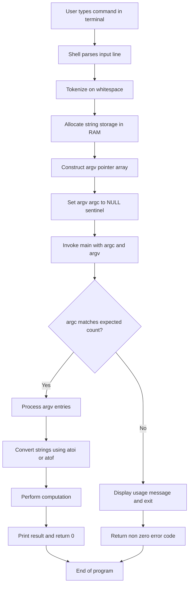
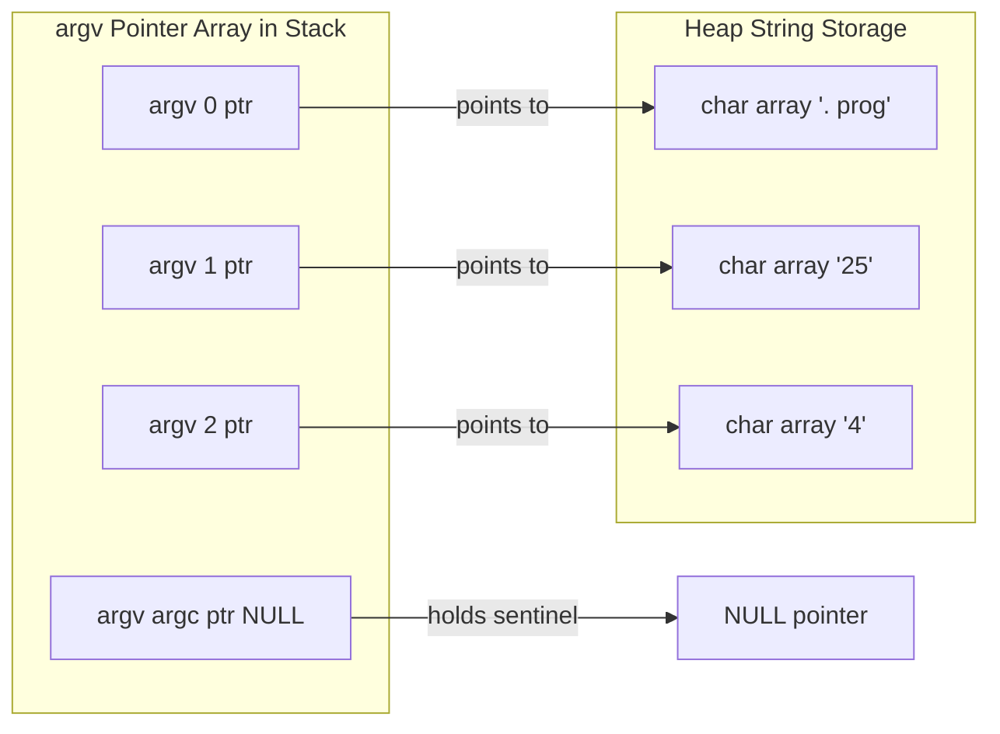
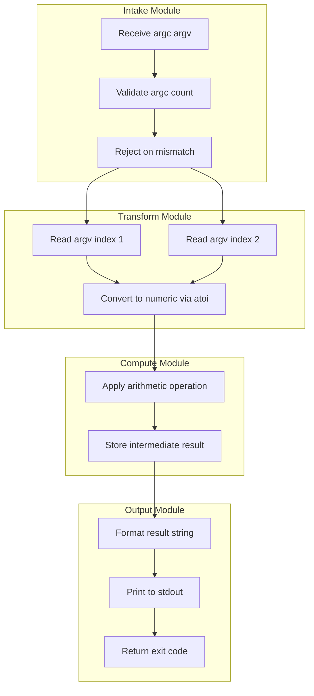

# Command line Arguments.

<!-- SECTION_1_START -->
# Command Line Arguments in C — Core Technical Foundation

## 📘 Formal Academic Definition (KTU 2024 Scheme)

In the C programming language, **command line arguments** are the string values supplied to a program at the moment of its invocation from a terminal, shell, or command prompt. The C standard (ISO/IEC 9899) permits the `main()` function to accept two special parameters that receive these arguments:

- **`int argc`** — Argument **Count** : an integer holding the total number of command line tokens parsed, including the program name itself.
- **`char *argv[]`** — Argument **Vector** : an array of character pointers, where each element points to a null-terminated string representing one token of the command line.

> [!IMPORTANT]
> **KTU 2024 Syllabus Highlight (Module 3 — Functions):**  
> Command line arguments are formally covered under *User-defined Functions* as the canonical method to pass external data into the `main()` function without using standard input streams like `scanf()`.

## 🧠 Conceptual Analogy — "The Order Slip at a Restaurant"

Imagine walking into a restaurant and shouting your order to the waiter **before the chef starts cooking**:

- The **chef's recipe** = your C program's source code (`main()` body).
- The **order slip you shout** = the command line tokens typed in the terminal.
- The **waiter (OS shell)** parses your order, splits it into discrete items, and hands it to the chef as a structured list.
- The chef (your program) receives a **numbered list of items** — that list is `argv[]`, and the **number of items on the list** is `argc`.

The chef never asks "what's the first item?" — it is **always** the name of the recipe (i.e., the program name itself at `argv[0]`). This invariant is one of the most heavily tested KTU concepts.

## 🔍 Geometric / Structural Intuition

Think of `argv` as a **two-dimensional memory structure**:

| Layer | Content |
|---|---|
| Row 1 | Pointer to `"program_name"` (lives somewhere in memory) |
| Row 2 | Pointer to `"first_argument"` (lives somewhere in memory) |
| Row 3 | Pointer to `"second_argument"` (lives somewhere in memory) |
| Row 4 | `NULL` (sentinel — guaranteed by the C standard) |

`argc` is the number of *valid* rows above the `NULL` sentinel.

> [!NOTE]
> **Key Invariant (Board Favourite):** `argv[argc] == NULL` is **guaranteed by the C standard**, which is why `while(argv[i] != NULL)` loops are safe to use.

## 🎯 Real-World Constant / Standard Metrics

- **Typical minimum value of `argc`** = **1** (when no user arguments are given, only the program name).
- **Default separator** between arguments = **whitespace** (space or tab characters).
- **No physical constant** is associated with command line arguments — the concept is purely **software architectural**.

> [!VISUALIZATION CONTROL]
> **Concept:** Memory layout of `argv[]` as a pointer-to-pointer structure
> **Visual Description:** Picture a vertical column of boxes (the `argv` array), each box holding an arrow that points to a horizontal strip of characters (the actual string data in memory). The last box in the column contains a `NULL` arrow, and `argc` simply counts how many non-NULL boxes exist.
<!-- SECTION_1_END -->

<!-- SECTION_2_START -->
# Deep Theoretical Analysis & KTU High-Yield Formula Sheet

## ⚙️ Operational Mechanics — How Command Line Arguments Flow

The lifecycle of a command line argument can be broken down into five precise stages:

1. **Tokenization Stage** — The operating system's shell parses the input line, splitting it on whitespace boundaries. Quoted strings (`"hello world"`) are treated as a single token.
2. **Storage Stage** — Each token, plus the program invocation path, is stored in memory as a null-terminated C-string. A pointer to each string is collected in sequence.
3. **Pointer Array Construction** — The system constructs the `argv` array, a contiguous array of `char *` pointers. `argv[0]` is set to the program's name, followed by the user tokens in order.
4. **Invocation Stage** — The OS calls `main(argc, argv)`, passing the integer count and pointer array.
5. **Consumption Stage** — The program reads `argv[i]` for $i \in [1, argc-1]$ to access user-supplied data, converting strings to numbers when needed via `<stdlib.h>` functions.

## 📐 Formal Parameter Specification

| Parameter | Type | Meaning | KTU Board Notation |
|---|---|---|---|
| `argc` | `int` | Total number of command line strings (including program name) | Argument **C**ount |
| `argv` | `char *[]` (array of `char *`) | Array of pointers, each pointing to a C-string | Argument **V**ector |
| `argv[0]` | `char *` | Always points to the program's invocation name | Executable path / program name |
| `argv[1]` … `argv[argc-1]` | `char *` | Point to user-supplied arguments | Actual user input |
| `argv[argc]` | `char *` | Guaranteed to be `NULL` (C99 §5.1.2.2.1) | Sentinel value |

## 📊 Conversion Function Cheat Sheet (Critical for KTU Numericals)

| Function | Header | Input Type | Output Type | Failure Behavior |
|---|---|---|---|---|
| `atoi(s)` | `<stdlib.h>` | `char *` | `int` | Returns `0` on failure (no error reporting) |
| `atof(s)` | `<stdlib.h>` | `char *` | `double` | Returns `0.0` on failure |
| `atol(s)` | `<stdlib.h>` | `char *` | `long int` | Returns `0L` on failure |
| `strtol(s,end,base)` | `<stdlib.h>` | `char *` | `long int` | Sets `errno`, allows range checking |
| `strtod(s,end)` | `<stdlib.h>` | `char *` | `double` | Sets `errno`, allows range checking |

## 🏗️ Engineering & Production Utility

Command line arguments form the backbone of:

- **Unix/Linux utility tools** — `cp source dest`, `gcc file.c -o output`, `git commit -m "msg"`.
- **Build systems** — `make target`, `cmake ..`.
- **Container orchestration** — `docker run -d -p 80:80 nginx`.
- **Server daemons** — `nginx -c /etc/nginx.conf` boots the daemon with a custom configuration.
- **Scientific computing** — Passing input file paths, iteration counts, and threshold values without recompilation.

> [!TIP]
> In KTU lab examinations, you will frequently be asked to write a C program that **accepts two integers from the command line and prints their sum, difference, product, and quotient**. Master this template — it appears in nearly every question bank.

## 🔐 Boundary & Edge Cases

- If the user supplies **no arguments**, `argc == 1` and only `argv[0]` is valid.
- If the user supplies **N user arguments**, `argc == N + 1`.
- If the user types `./prog` followed by a quoted string, the quoted content is treated as **one** argument.
- Numerical conversion of a non-numeric string (e.g., `atoi("hello")`) returns **0** — this is a notorious source of silent bugs.
<!-- SECTION_2_END -->

<!-- SECTION_3_START -->
# Step-by-Step Derivations & Code Implementation

## 🧪 Derivation 1 — Manual Trace of `argv` Memory Layout

**Given invocation:**

```bash
./calculator 25 4
```

**Stage 1 — Tokenization:** The shell produces three tokens: `"./calculator"`, `"25"`, `"4"`.

**Stage 2 — Storage Allocation:** The OS allocates three C-strings in memory (plus the `NULL` sentinel):

$$\text{Memory Addresses (illustrative):} \quad 0x7FF1 \to "./calculator\0", \quad 0x7FFA \to "25\0", \quad 0x8003 \to "4\0"$$

**Stage 3 — Pointer Array Construction:** The OS constructs the `argv` array in contiguous memory:

| Index | Stored Pointer | String at Pointer | `argc` Contribution |
|---|---|---|---|
| `argv[0]` | `0x7FF1` | `"./calculator"` | Counted |
| `argv[1]` | `0x7FFA` | `"25"` | Counted |
| `argv[2]` | `0x8003` | `"4"` | Counted |
| `argv[3]` | `0x0000` | `NULL` (sentinel) | **Not** counted |

**Stage 4 — Final `argc` Value:**

$$\text{argc} = 3$$

The relationship between user arguments $N$ and `argc` is:

$$\text{argc} = N + 1$$

For this invocation, $N = 2$ user arguments, so $\text{argc} = 3$. ✔

## 💻 Implementation 1 — Sum of Two Command Line Integers

```c
#include <stdio.h>
#include <stdlib.h>

int main(int argc, char *argv[])
{
    if (argc != 3) {
        printf("Usage: %s <num1> <num2>\n", argv[0]);
        return 1;
    }

    int a = atoi(argv[1]);
    int b = atoi(argv[2]);
    int sum = a + b;

    printf("Numbers: %d and %d\n", a, b);
    printf("Sum = %d\n", sum);

    return 0;
}
```

**Compilation & Execution Walkthrough:**

```bash
gcc -o sum sum.c
./sum 25 4
```

**Output:**

```
Numbers: 25 and 4
Sum = 29
```

**Line-by-line reasoning:**

- `int argc, char *argv[]` — receives the count and pointer array from the OS.
- `if (argc != 3)` — validates that the user passed **exactly two** numeric arguments (plus the program name makes 3 total). Incorrect usage is handled gracefully with a usage message and a non-zero return code.
- `atoi(argv[1])` — converts the string `"25"` (held in memory starting at `0x7FFA`) into the integer `25`.
- `atoi(argv[2])` — converts the string `"4"` into the integer `4`.
- `printf` — displays the computed result.

## 💻 Implementation 2 — Area of a Circle with Full Validation

```c
#include <stdio.h>
#include <stdlib.h>

int main(int argc, char *argv[])
{
    if (argc != 2) {
        printf("Usage: %s <radius>\n", argv[0]);
        return 1;
    }

    double radius = atof(argv[1]);

    if (radius < 0) {
        printf("Error: Radius cannot be negative.\n");
        return 1;
    }

    double area = 3.14159 * radius * radius;
    double circumference = 2 * 3.14159 * radius;

    printf("Radius       = %.2f\n", radius);
    printf("Area         = %.2f\n", area);
    printf("Circumference = %.2f\n", circumference);

    return 0;
}
```

**Execution trace:**

```bash
./circle 5
Radius       = 5.00
Area         = 78.54
Circumference = 31.42
```

**Mathematical derivation of area:**

$$A = \pi r^2 = 3.14159 \times 5^2 = 3.14159 \times 25 = 78.54$$

**Mathematical derivation of circumference:**

$$C = 2\pi r = 2 \times 3.14159 \times 5 = 31.42$$

## 💻 Implementation 3 — Multi-Argument Grade Calculator (Full KTU Pattern)

```c
#include <stdio.h>
#include <stdlib.h>

int main(int argc, char *argv[])
{
    if (argc != 4) {
        printf("Usage: %s <mark1> <mark2> <mark3>\n", argv[0]);
        return 1;
    }

    int m1 = atoi(argv[1]);
    int m2 = atoi(argv[2]);
    int m3 = atoi(argv[3]);

    if (m1 < 0 || m1 > 100 || m2 < 0 || m2 > 100 || m3 < 0 || m3 > 100) {
        printf("Error: All marks must be in [0, 100].\n");
        return 1;
    }

    int total = m1 + m2 + m3;
    float average = total / 3.0f;

    printf("Total   = %d\n", total);
    printf("Average = %.2f\n", average);

    if (average >= 90)
        printf("Grade: A\n");
    else if (average >= 75)
        printf("Grade: B\n");
    else if (average >= 60)
        printf("Grade: C\n");
    else if (average >= 50)
        printf("Grade: D\n");
    else
        printf("Grade: F (Fail)\n");

    return 0;
}
```

**Execution trace:**

```bash
./grades 85 92 78
Total   = 255
Average = 85.00
Grade: B
```

**Average derivation:**

$$\text{avg} = \frac{m_1 + m_2 + m_3}{3} = \frac{85 + 92 + 78}{3} = \frac{255}{3} = 85.00$$

Since $85.00 \geq 75$ and $85.00 < 90$, the grade assigned is **B**. ✔

> [!WARNING]
> **Common Compilation Pitfall:** Dividing two integers (`total / 3`) in C performs **integer division**, truncating the decimal. Always cast to `float` or use `3.0f` as the divisor to force floating-point division. The line `float average = total / 3.0f;` is correct; `float average = total / 3;` is a **frequent KTU mark-deduction error**.

## 🔬 Symbolic Derivation — Relationship Between argc and User Argument Count

Let $N$ denote the count of arguments the user types *after* the program name. The shell always prepends the program name, so:

$$\text{argc} = 1 + N$$

Rearranging for $N$:

$$N = \text{argc} - 1$$

The valid range of `argc`:

$$\text{argc} \geq 1 \quad \Longleftrightarrow \quad N \geq 0$$

The valid range of user-accessible index $i$:

$$1 \leq i \leq \text{argc} - 1$$
<!-- SECTION_3_END -->

<!-- SECTION_4_START -->
# Structural Diagrams & Schematics

## 📊 Diagram 1 — End-to-End Command Line Argument Flow



## 🧠 Diagram 2 — argv Memory Architecture (Block Topology)



## 🔄 Diagram 3 — Modular Decoupling: Argument Processing Pipeline



## 🧩 Diagram 4 — Sequential Processing Topology Matrix

| Stage | Input Source | Function Used | Output Type | Validation |
|---|---|---|---|---|
| 1. Tokenize | Shell input | OS internal | `char **` | N/A |
| 2. Validate | `argc` | Manual check | `int` | `argc == expected` |
| 3. Extract | `argv[i]` | Index access | `char *` | `$i \in [1, argc-1]$ |
| 4. Convert | `char *` | `atoi`, `atof` | `int`, `double` | Range check |
| 5. Compute | Numeric | User logic | Computed value | Domain check |
| 6. Display | Computed | `printf` | `int` (chars printed) | Format specifier |
<!-- SECTION_4_END -->

<!-- SECTION_5_START -->
# KTU 2024 Scheme Examination Question Bank & Topic Recap

## 📝 Part A — Short Answer Questions (3 Marks Each)

---

### Question 1 (3 Marks)
**`[KTU University Exam — July 2024]`**  |  **CO1**  |  **Bloom's Level: Remember**

> What are command line arguments in C? Explain the significance of `argc` and `argv` parameters of `main()`.

#### ✅ Model Answer (Valuation Key Pattern):

**Definition (1 Mark):** Command line arguments are the values passed to a C program at the time of execution, supplied as text tokens after the program name in the terminal command line.

**`argc` explanation (1 Mark):** It is an integer parameter of `main()` that stores the **count** of command line arguments. Its value is always at least **1**, since `argv[0]` (the program name) is always counted. The general relationship is:

$$\text{argc} = 1 + (\text{number of user supplied arguments})$$

**`argv` explanation (1 Mark):** It is an array of `char *` pointers (i.e., `char *argv[]`), where each element points to a null-terminated string holding one command line token. `argv[0]` holds the program name, and `argv[1]` through `argv[argc-1]` hold the user arguments. The C standard guarantees that `argv[argc] == NULL`.

---

### Question 2 (3 Marks)
**`[KTU University Exam — Dec 2023]`**  |  **CO1**  |  **Bloom's Level: Understand**

> Explain the function `atoi()` with a suitable example. Why is it necessary when working with command line arguments?

#### ✅ Model Answer (Valuation Key Pattern):

**Function signature (1 Mark):** `int atoi(const char *str);` — declared in `<stdlib.h>`. It converts a string representation of an integer into an actual `int` value.

**Working example (1 Mark):**

```c
#include <stdio.h>
#include <stdlib.h>
int main(int argc, char *argv[]) {
    int num = atoi(argv[1]);   // converts "123" to 123
    printf("Value = %d\n", num);
    return 0;
}
```

When the user runs `./prog 123`, the string `"123"` from `argv[1]` is converted to the integer `123` and stored in `num`.

**Necessity (1 Mark):** Command line arguments are **always received as strings** (character arrays). To perform arithmetic operations, the strings must be converted to numeric types using functions like `atoi()` (for integers) or `atof()` (for floating-point numbers). Without this conversion, `"25" + "4"` would produce string concatenation `"254"` rather than numeric sum `29`.

---

## 📚 Part B — Long Answer Questions with Internal Choice (14 Marks Each)

---

### 📌 Question A (14 Marks) — Choice 1

**`[KTU University Exam — July 2024]`**  |  **CO1, CO2**  |  **Bloom's Level: Understand + Apply**

> **(a)** Explain with a neat diagram how command line arguments are passed to a C program. Describe the memory layout of `argv`. **(7 Marks)**
>
> **(b)** Write a C program to calculate the area and perimeter of a rectangle using length and breadth passed as command line arguments. Show the output for `./rect 10 5`. **(7 Marks)**

#### ✅ Model Solution:

### Part (a) — Theory with Diagram (7 Marks)

**Passing mechanism (2 Marks):** When a C program is executed from the terminal, the operating system's command interpreter (shell) reads the entire command line, splits it on whitespace boundaries into discrete tokens, and stores each token as a null-terminated C-string in memory. The shell then constructs an array of character pointers, populates `argv[0]` with the program's name, and the user tokens in subsequent positions. The count of these pointers (including the program name) is assigned to `argc`. Finally, the OS invokes `main(argc, argv)`, passing both values.

**Memory layout (3 Marks):** The `argv` array is a contiguous block of `char *` pointers. Each pointer inside the array points to a separate string located elsewhere in memory (typically in the heap or data segment).

```
argv (pointer array)            String storage in memory
+----------------+              +---------------------+
| argv[0] | -----|---->         | ". /rect\0"         |
+----------------+              +---------------------+
| argv[1] | -----|---->         | "10\0"              |
+----------------+              +---------------------+
| argv[2] | -----|---->         | "5\0"               |
+----------------+              +---------------------+
| argv[3] = NULL |             +---------------------+
+----------------+
       argc = 3
```

**Key points (2 Marks):**

- `argv[0]` is **always the program name**, never the first user argument.
- `argv[argc]` is guaranteed to be `NULL` (C99 standard).
- The relationship is $\text{argc} = 1 + N$ where $N$ is the count of user arguments.

### Part (b) — Program Implementation (7 Marks)

```c
#include <stdio.h>
#include <stdlib.h>

int main(int argc, char *argv[])
{
    if (argc != 3) {
        printf("Usage: %s <length> <breadth>\n", argv[0]);
        return 1;
    }

    float length  = atof(argv[1]);
    float breadth = atof(argv[2]);

    float area      = length * breadth;
    float perimeter = 2 * (length + breadth);

    printf("Length   = %.2f\n", length);
    printf("Breadth  = %.2f\n", breadth);
    printf("Area     = %.2f\n", area);
    printf("Perimeter = %.2f\n", perimeter);

    return 0;
}
```

**Valuation Breakdown:**

- `[Correct function signature with argc, argv: 1 Mark]`
- `[argc validation: 1 Mark]`
- `[String to float conversion using atof: 1 Mark]`
- `[Correct area formula: 1 Mark]`
- `[Correct perimeter formula: 1 Mark]`
- `[Proper printf with format specifiers: 1 Mark]`
- `[Correct final output: 1 Mark]`

**Execution and output:**

```bash
./rect 10 5
```

**Output:**

```
Length   = 10.00
Breadth  = 5.00
Area     = 50.00
Perimeter = 30.00
```

**Mathematical verification:**

$$A = l \times b = 10 \times 5 = 50$$

$$P = 2 \times (l + b) = 2 \times (10 + 5) = 2 \times 15 = 30$$

Both results match the expected output. ✔

---

### 📌 Question B (14 Marks) — Choice 2

**`[KTU University Exam — Dec 2023]`**  |  **CO1, CO2**  |  **Bloom's Level: Understand + Apply**

> **(a)** Differentiate between `argc` and `argv`. Explain the significance of `argv[0]` and the `NULL` terminator at `argv[argc]`. **(7 Marks)**
>
> **(b)** Write a C program that accepts three integers as command line arguments representing the sides of a triangle. The program should determine and print whether the triangle is equilateral, isosceles, or scalene. Include complete input validation. **(7 Marks)**

#### ✅ Model Solution:

### Part (a) — Differentiation Table (7 Marks)

| Aspect | `argc` | `argv` |
|---|---|---|
| **Full form** | Argument **Count** | Argument **Vector** |
| **Data type** | `int` | `char *argv[]` (array of `char *`) |
| **Purpose** | Stores the *number* of command line strings | Stores the *pointers* to each string |
| **Minimum value** | **1** (always, even with no user arguments) | Always has at least one valid entry (`argv[0]`) |
| **Indexing** | Not indexable (single integer) | Indexable from `argv[0]` to `argv[argc]` |
| **Memory footprint** | 4 bytes (typically) | `argc` pointers + string storage |
| **Relationship** | $\text{argc} = 1 + N$ (where $N$ = user arguments) | Contains $N+2$ slots (including `NULL` sentinel) |

**Significance of `argv[0]` (2 Marks):** The element at index 0 always points to a string containing the program's invocation name (e.g., `"./rect"` or `"rect.exe"`). This is essential for the program to display its own name in usage messages, enabling self-descriptive error reporting. It is **never** a user-supplied argument, regardless of what the user types first after the program name.

**Significance of `argv[argc] == NULL` (2 Marks):** The C99 standard (Section 5.1.2.2.1) mandates that the pointer immediately following the last argument is `NULL`. This sentinel value allows safe iteration without needing to know `argc` in advance:

```c
int i = 0;
while (argv[i] != NULL) {
    printf("Arg %d: %s\n", i, argv[i]);
    i++;
}
```

This pattern is widely used in production-grade C utilities like `ls`, `cp`, and `grep`.

### Part (b) — Triangle Classifier Program (7 Marks)

```c
#include <stdio.h>
#include <stdlib.h>

int main(int argc, char *argv[])
{
    if (argc != 4) {
        printf("Usage: %s <side1> <side2> <side3>\n", argv[0]);
        return 1;
    }

    int a = atoi(argv[1]);
    int b = atoi(argv[2]);
    int c = atoi(argv[3]);

    if (a <= 0 || b <= 0 || c <= 0) {
        printf("Error: Sides must be positive integers.\n");
        return 1;
    }

    if (a + b <= c || a + c <= b || b + c <= a) {
        printf("Error: These sides cannot form a valid triangle.\n");
        return 1;
    }

    if (a == b && b == c)
        printf("Triangle is EQUILATERAL.\n");
    else if (a == b || b == c || a == c)
        printf("Triangle is ISOSCELES.\n");
    else
        printf("Triangle is SCALENE.\n");

    return 0;
}
```

**Valuation Breakdown:**

- `[Correct function signature: 1 Mark]`
- `[argc validation logic: 1 Mark]`
- `[String to integer conversion: 1 Mark]`
- `[Triangle inequality validation: 1 Mark]`
- `[Correct equilateral condition: 1 Mark]`
- `[Correct isosceles else if condition: 1 Mark]`
- `[Correct scalene else branch and final output: 1 Mark]`

**Execution and output:**

```bash
./triangle 5 5 5
Triangle is EQUILATERAL.

./triangle 5 5 8
Triangle is ISOSCELES.

./triangle 3 4 5
Triangle is SCALENE.
```

**Mathematical reasoning for the scalene case (3, 4, 5):**

$$a = 3, \quad b = 4, \quad c = 5$$

**Triangle inequality check:**

$$a + b = 3 + 4 = 7 > 5 = c \quad \checkmark$$
$$a + c = 3 + 5 = 8 > 4 = b \quad \checkmark$$
$$b + c = 4 + 5 = 9 > 3 = a \quad \checkmark$$

All three inequalities hold, so a valid triangle is formed. Since $a \neq b$, $b \neq c$, and $a \neq c$, the triangle is **scalene**. ✔

---

> [!WARNING]
> **🚨 KTU Examiner's Valuation Pitfall Callout — Read Carefully**
>
> 1. **Forgetting that `argv[0]` is the program name:** A large number of students assume `argv[1]` is the "first" command line argument in the colloquial sense. While technically `argv[1]` is the first *user-supplied* argument, students who skip `argv[0]` in mental models often produce off-by-one indexing errors. **Always remember: `argv[0]` = program name, `argv[1]` = first user input.**
>
> 2. **Skipping `argc` validation:** A common mark-losing mistake is writing `int a = atoi(argv[1])` without first checking `if (argc >= 2)`. If the user runs the program with no arguments, this results in undefined behavior (reading an out-of-bounds pointer). **Always validate `argc` before accessing `argv` elements.**
>
> 3. **Using `argv` values directly in arithmetic:** Since `argv[i]` is a string, expressions like `argv[1] + argv[2]` perform **pointer arithmetic** or **string concatenation** (in some contexts), not integer addition. **Always convert with `atoi()` or `atof()` first.**
>
> 4. **Integer division in average calculation:** Dividing `total / 3` performs integer division. Use `3.0` or `3.0f` to obtain a floating-point result. Failing to do so can cost 1–2 marks in numerical questions.
>
> 5. **Forgetting `<stdlib.h>`:** The functions `atoi()`, `atof()`, and `atol()` require the `<stdlib.h>` header. Omitting it produces implicit declaration warnings and potential compilation errors on strict compilers. **Always include `<stdlib.h>` whenever conversion functions are used.**

---

## 🧠 Topic Recap & Important Things to Remember

- ✅ Command line arguments are passed to a C program at **invocation time**, not at runtime via `scanf()`.
- ✅ The `main()` function signature with arguments is: `int main(int argc, char *argv[])`.
- ✅ `argc` is the **count** of arguments including the program name, so it is always **≥ 1**.
- ✅ `argv` is an **array of `char *` pointers**, not a 2D char array. Each `argv[i]` is a pointer to a separate string.
- ✅ `argv[0]` **always holds the program name**, not the first user input.
- ✅ The relationship is $\text{argc} = 1 + N$, where $N$ is the count of user-supplied arguments.
- ✅ `argv[argc] == NULL` is **guaranteed by the C99 standard**, enabling safe `while` loop iteration.
- ✅ All command line arguments are received as **strings** (character arrays). Numeric conversion requires `atoi()`, `atof()`, `atol()`, `strtol()`, or `strtod()` from `<stdlib.h>`.
- ✅ `atoi("hello")` returns **0** silently — no error is reported. This is a common bug source in production code.
- ✅ Best practice: **always validate `argc`** before accessing `argv` elements to prevent undefined behavior.
- ✅ Best practice: **always check the return value** of `main()` to signal success (`0`) or failure (non-zero).
- ✅ For floating-point division in C, use `3.0` or `3.0f` as the divisor to avoid integer truncation.
- ✅ Command line arguments are separated by **whitespace** (spaces, tabs) unless enclosed in quotes.
- ✅ KTU favorite patterns: sum/difference programs, area calculations, grade classifiers, triangle validators, and unit converters all using command line inputs.
- ✅ Remember the standard headers: `<stdio.h>` for `printf`, `<stdlib.h>` for `atoi`/`atof`, `<string.h>` for string operations.
- ✅ The expression `argv[1] + argv[2]` does **NOT** add two numbers; it performs **pointer arithmetic**. Always convert to numeric types first.
- ✅ Integer `argc` can be incremented or decremented in pointer-iteration loops, but this is **not recommended** — prefer the `NULL` sentinel pattern.
- ✅ In lab examinations, expected output for typical KTU problems follows the format: `Result = <value>` with no extra trailing spaces.
<!-- SECTION_5_END -->
