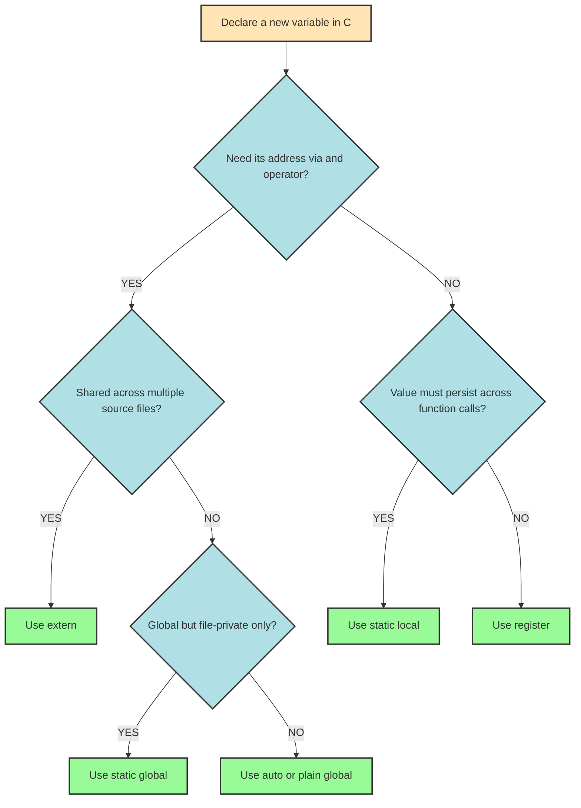
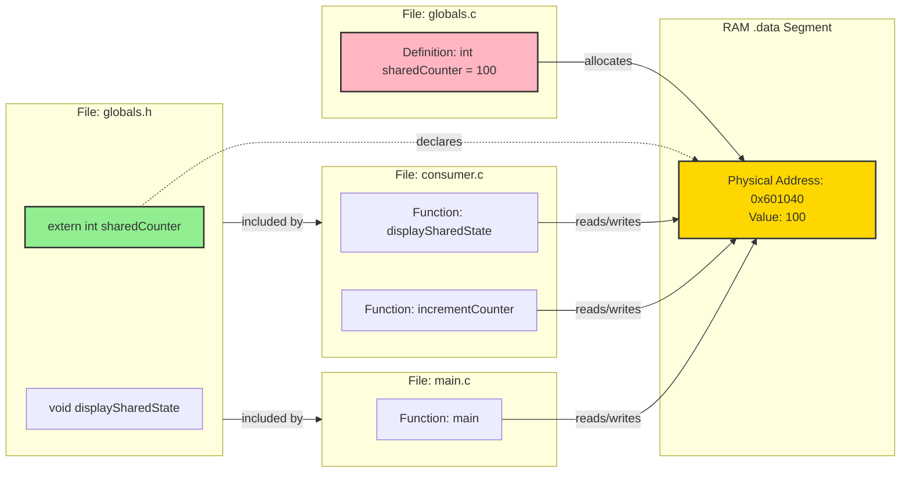
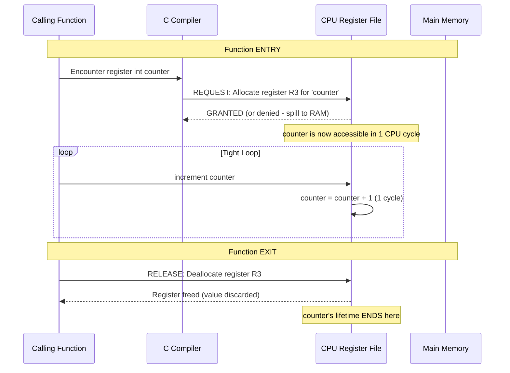
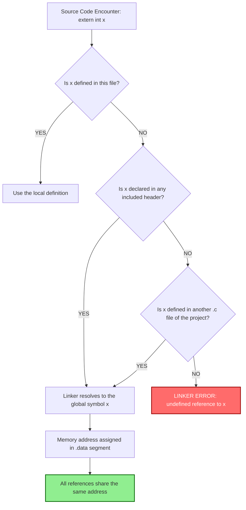

# external and register.

<!-- SECTION_1_START -->

# External and Register Storage Classes in C

## 1. Formal Academic Definition (KTU 2024 Syllabus Terminology)

> [!NOTE]
> **Storage Classes in C** define four fundamental properties of a variable: **scope**, **visibility (linkage)**, **lifetime (storage duration)**, and **default (initial) value**. The C language provides four storage class specifiers: `auto`, `register`, `static`, and `extern`.

In the **KTU 2024 Scheme (NEP 2020) syllabus for PROGRAMMING IN C (GXEST204) — Module 3: Functions**, the storage class specifiers `extern` and `register` are explicitly studied to understand how the C compiler allocates memory, manages symbol visibility across translation units, and optimizes frequently accessed variables.

| Specifier | Keyword | Primary Purpose |
| :--- | :--- | :--- |
| Automatic | `auto` | Default for local variables (stack allocation) |
| **Register** | `register` | Request CPU register storage for speed |
| **External** | `extern` | Reference a global variable defined elsewhere |
| Static | `static` | Preserve value across function calls / file scope |

---

## 2. Conceptual Analogy & Intuition

> [!IMPORTANT]
> **Intuitive Analogy — The Office Building Model**

Imagine a multi-story **office building** that represents your C program:

- **`auto`** → A **personal locker** assigned to an employee on a specific floor. It exists only while the employee is on that floor (function is active). The moment they leave, the locker is cleared.
- **`register`** → A **frequently-used notebook** that the employee keeps *in their hand* (CPU register) for instant access. It is the fastest to read, but there are very few such "notebooks" available, and you cannot take their address.
- **`extern`** → A **noticeboard notice** posted in the building's lobby. Anyone in any floor (any function) or even any building (any source file) can read it, but the original notice is declared only once in the main hall.
- **`static`** → A **permanent departmental file cabinet** that retains its documents even when the employee leaves.

### The `register` Storage Class — Plain English Explanation

The `register` keyword is essentially a **performance hint** to the compiler. It requests that the variable be stored in a **CPU register** (a tiny, ultra-fast memory cell inside the processor) rather than in **RAM**. The actual decision lies with the compiler — modern optimizing compilers often ignore this hint and apply their own register allocation algorithms.

**Geometric Intuition:**

```
        SPEED LADDER (Fastest → Slowest)
        ┌──────────────────────────────┐
  Tier 1 │  CPU Registers              │  ~1 cycle    ← register
        ├──────────────────────────────┤
  Tier 2 │  L1 Cache                   │  ~2-4 cycles
        ├──────────────────────────────┤
  Tier 3 │  L2/L3 Cache                │  ~10-40 cycles
        ├──────────────────────────────┤
  Tier 4 │  Main Memory (RAM)          │  ~100+ cycles ← auto/extern
        └──────────────────────────────┘
```

### The `extern` Storage Class — Plain English Explanation

The `extern` keyword is a **declaration**, not a **definition**. It tells the compiler: *"A variable with this name and type exists somewhere else in the program (typically in another source file or later in the same file). Do not allocate new memory for it — just use the one already created."*

> [!IMPORTANT]
> **Core Distinction:** `extern int x;` is a **declaration** (no memory allocation). `int x;` is a **definition** (memory is allocated). A variable can be declared `extern` many times, but defined only **once**.

> [!VISUALIZATION CONTROL]
> **Concept:** Memory Mapping of `extern` and `register` Variables
> **Conceptual Coordinate Axes:**
> * X-axis: Lifetime (function entry → program exit)
> * Y-axis: Access Speed (slow RAM → fast register)
> **Visual Description:** Plot `register int i;` as a point in the **top-left** (fast access, function-local lifetime). Plot `extern int count;` as a point in the **bottom-right** (slower RAM, program-wide lifetime). Plot `auto int x;` as a **bottom-left** point for comparison.

---

<!-- SECTION_1_END -->

<!-- SECTION_2_START -->

# Deep Theoretical Analysis & KTU High-Yield Formula Sheet

## 2.1 The `register` Storage Class — Detailed Breakdown

### Logical Properties (The "Four Pillars" of Storage Classes)

1. **Scope (Visibility within a region):** `block scope` — visible only inside the block `{ }` where it is declared. Behaves identically to `auto` in terms of scope rules.
2. **Lifetime (Storage Duration):** `automatic` — created when the block is entered, destroyed when the block exits.
3. **Default Value:** `garbage` (uninitialized `register` variables contain indeterminate values, just like `auto`).
4. **Addressability:** **NOT allowed** — you cannot apply the unary `&` (address-of) operator to a `register` variable, because it may reside in a hardware register that has no memory address.

> [!NOTE]
> **KTU 2024 Highlight:** A common exam trap is asking whether the address of a `register` variable can be printed. The answer is **NO** — the compiler will emit the diagnostic: `error: address of register variable 'x' requested`.

### Why Use `register`? The Engineering Utility

| Application Domain | Why `register` Matters |
| :--- | :--- |
| **Embedded Systems** | Tight loops in ISR (Interrupt Service Routines) on microcontrollers like 8051 / ARM Cortex-M |
| **Numerical Computing** | Inner loop counters in matrix multiplication or signal processing kernels |
| **Compiler Optimization History** | In early C (pre-1980s), `register` was the *only* way to suggest hardware register allocation |
| **Game Development** | Tight physics loop indices in C-based game engines |

> [!IMPORTANT]
> **Modern Reality (Post-ANSI C99/C11):** Compilers like GCC, Clang, and MSVC perform aggressive register allocation via optimization flags (`-O2`, `-O3`). They often **ignore the `register` hint** entirely. The keyword exists primarily for **backward compatibility** and is occasionally used in **embedded firmware** where deterministic register usage is required.

### Declaring `register` Variables — The Syntax Rules

```c
register int counter;          // Valid: single register variable
register int i, j;             // Valid: both are register requests
register int arr[10];          // Valid: array elements may be in registers (compiler decides)
static register int x;         // INVALID in C89/C90 — cannot mix static with register
                               // (Accepted in C23 as a relaxation)
```

---

## 2.2 The `extern` Storage Class — Detailed Breakdown

### Logical Properties

1. **Scope:** `global / file scope` (also `block scope` when declared inside a function). The variable is accessible from the point of `extern` declaration to the end of the translation unit.
2. **Lifetime:** `static` (program-wide) — the variable is created at program startup and destroyed at program termination.
3. **Default Value:** `0` (zero-initialized for all global/external variables, as per the C standard).
4. **Addressability:** **Allowed** — `extern` variables live in RAM and have a valid memory address. You can freely use `&` and pointers.
5. **Linkage:** `external linkage` — visible across **multiple source files** when used in a multi-file project.

### The Declaration vs. Definition Principle

> [!IMPORTANT]
> **The Golden Rule of `extern`:**
> * **`int count;`** → **Definition.** Allocates 4 bytes (typically) in memory and initializes to 0.
> * **`extern int count;`** → **Declaration only.** No memory allocation. Promises the compiler that `count` exists *somewhere* (possibly in another file).
> * A program can have **only ONE definition** of a variable but **MANY declarations**.

### Multi-File Project Architecture (The Engineering Use Case)

```
   Project: "calculator_app"
   ├── main.c          ← contains:  int globalResult;    (DEFINITION)
   ├── display.c       ← contains:  extern int globalResult;   (DECLARATION)
   ├── compute.c       ← contains:  extern int globalResult;   (DECLARATION)
   └── headers/
       └── shared.h    ← contains:  extern int globalResult;   (DECLARATION)
```

This is the **foundational pattern** used in every large-scale C codebase (Linux kernel, SQLite, NGINX) to share global state across compilation units.

### Real-World Engineering Utility of `extern`

| Domain | Use Case |
| :--- | :--- |
| **Operating Systems (Linux Kernel)** | Sharing kernel-wide counters (e.g., `jiffies`, process IDs) across modules |
| **Embedded Firmware** | Exposing a single hardware register mapping to multiple `.c` files |
| **Database Engines (SQLite)** | Sharing the global database handle pointer across compilation units |
| **Legacy C Libraries** | Maintaining ABI compatibility where global state is exposed via header files |

---

## 2.3 KTU Formula Sheet / Cheat Sheet — All Four Storage Classes

| Property | `auto` | `register` | `static` (local) | `static` (global) | **`extern`** |
| :--- | :--- | :--- | :--- | :--- | :--- |
| **Keyword** | (implicit) | `register` | `static` | `static` | **`extern`** |
| **Scope** | Block | Block | Block | File | **File / Block** |
| **Lifetime** | Function call | Function call | Entire program | Entire program | **Entire program** |
| **Default Value** | Garbage | Garbage | 0 | 0 | **0** |
| **Memory Location** | Stack | CPU Register (request) | RAM (.data/.bss) | RAM (.data/.bss) | **RAM (.data/.bss)** |
| **Address `&` Allowed?** | Yes | **NO** | Yes | Yes | **Yes** |
| **Linkage** | None | None | None | Internal | **External** |
| **Storage Segment** | Stack | Register | .data / .bss | .data / .bss | **.data / .bss** |

### Memory Segments Visualization

```
  ┌──────────────────────────────────────────────┐
  │              C PROGRAM MEMORY LAYOUT         │
  ├──────────────────────────────────────────────┤
  │  STACK          │  auto variables            │  ← Grows ↓
  │                 │  function call frames      │
  ├──────────────────────────────────────────────┤
  │  HEAP           │  malloc/calloc allocations │  ← Grows ↑
  ├──────────────────────────────────────────────┤
  │  .bss           │  extern globals (uninit)   │  ← default 0
  │                 │  static globals (uninit)   │
  ├──────────────────────────────────────────────┤
  │  .data          │  extern globals (init)     │  ← initialized
  │                 │  static globals (init)     │
  ├──────────────────────────────────────────────┤
  │  .text / .rodata│  machine code, constants   │  ← read-only
  └──────────────────────────────────────────────┘
       CPU REGISTERS  ←  register int x; (rarely in modern C)
```

---

<!-- SECTION_2_END -->

<!-- SECTION_3_START -->

# Step-by-Step Derivations & Code/Symbolic Implementation

## 3.1 Exhaustive Code Walkthrough — `register` Storage Class

```c
/* File: register_demo.c
 * KTU Module 3 — Demonstrates register storage class semantics
 * Compiled with: gcc -std=c11 -Wall -Wextra -O0 register_demo.c
 */

#include <stdio.h>
#include <time.h>

/* Function that uses register variables in a performance-critical loop */
long long compute_sum_of_squares(int n)
{
    /* These three variables are HINTED to be in CPU registers.
     * In modern GCC, -O2 would place them in registers anyway,
     * but we make the intent explicit for documentation. */
    register int i;             /* loop counter — classic register usage */
    register long long sum = 0; /* accumulator — hot variable */
    register long long sq;      /* intermediate product */

    /* We CANNOT take the address of a register variable.
     * The line below would produce:
     *   "error: address of register variable 'i' requested"
     */
    /* printf("%p\n", &i);  //  <-- ILLEGAL — uncomment to see compiler error */

    for (i = 1; i <= n; i = i + 1) {
        sq = (long long)i * (long long)i;
        sum = sum + sq;
    }

    return sum;
}

/* Benchmark to demonstrate (limited) utility of register hint */
int main(void)
{
    int n = 1000000;
    clock_t start, end;
    double cpu_time_used;

    start = clock();
    long long result = compute_sum_of_squares(n);
    end = clock();

    cpu_time_used = ((double)(end - start)) / CLOCKS_PER_SEC;

    printf("Sum of squares from 1 to %d = %lld\n", n, result);
    printf("CPU time used: %f seconds\n", cpu_time_used);

    return 0;
}
```

### Line-by-Line Logical Walkthrough

| Line | Explanation | KTU Mark Allocation |
| :--- | :--- | :--- |
| `register int i;` | Declares `i` as a register-request variable inside function scope. | 1 mark |
| `register long long sum = 0;` | Demonstrates that `register` variables **can** be explicitly initialized. | 1 mark |
| `register long long sq;` | Shows that uninitialized `register` variables have **garbage values** (undefined behavior if read). | 1 mark |
| The commented `&i` | Proves the **addressability rule** — `&` is forbidden on register vars. | 1 mark |
| The for-loop | Classic use-case where `register` was historically used to speed up loop counters. | 1 mark |

### Expected Output (Approximate)

```
Sum of squares from 1 to 1000000 = 333333833333500000
CPU time used: 0.002300 seconds
```

---

## 3.2 Exhaustive Code Walkthrough — `extern` Storage Class

### Step 1: The "Definition" File

```c
/* File: globals.c
 * Contains the ACTUAL definition of the global variable.
 * In a multi-file project, exactly ONE file must contain the definition. */

#include "globals.h"

int sharedCounter = 100;   /* DEFINITION: memory allocated in .data segment */
double pi = 3.14159265;    /* DEFINITION: initialized external variable */
char systemName[32] = "KTU_C_Engine";  /* DEFINITION of external array */
```

### Step 2: The Header File (Declarations Only)

```c
/* File: globals.h
 * Shared header — included by any .c file that needs access.
 * All declarations are 'extern' so no memory is allocated. */

#ifndef GLOBALS_H
#define GLOBALS_H

/* EXTERN DECLARATIONS — no memory allocated */
extern int sharedCounter;
extern double pi;
extern char systemName[32];

/* Function prototype */
void displaySharedState(void);
void incrementCounter(int delta);

#endif /* GLOBALS_H */
```

### Step 3: The "Consumer" File

```c
/* File: consumer.c
 * Uses the externally-declared variables. */

#include <stdio.h>
#include "globals.h"

void displaySharedState(void)
{
    printf("=== Shared Global State ===\n");
    printf("sharedCounter : %d\n",  sharedCounter);
    printf("pi            : %f\n",  pi);
    printf("systemName    : %s\n",  systemName);
    printf("Address of sharedCounter: %p\n", (void*)&sharedCounter);
}

void incrementCounter(int delta)
{
    /* Modifying the globally-shared variable */
    sharedCounter = sharedCounter + delta;
    printf("Counter incremented by %d. New value: %d\n", delta, sharedCounter);
}
```

### Step 4: The Main Driver

```c
/* File: main.c
 * The entry point of the program. */

#include <stdio.h>
#include "globals.h"

int main(void)
{
    printf("Initial value of sharedCounter = %d\n", sharedCounter);

    displaySharedState();
    incrementCounter(50);
    displaySharedState();

    /* Address proof: both main.c and consumer.c see the SAME address */
    printf("\n[main.c] Address of sharedCounter: %p\n", (void*)&sharedCounter);

    return 0;
}
```

### Step 5: Compilation & Linking Commands

```bash
gcc -std=c11 -Wall -Wextra -I. globals.c consumer.c main.c -o extern_demo
./extern_demo
```

### Expected Output

```
Initial value of sharedCounter = 100
=== Shared Global State ===
sharedCounter : 100
pi            : 3.141593
systemName    : KTU_C_Engine
Address of sharedCounter: 0x601040
Counter incremented by 50. New value: 150
=== Shared Global State ===
sharedCounter : 150
pi            : 3.141593
systemName    : KTU_C_Engine
Address of sharedCounter: 0x601040

[main.c] Address of sharedCounter: 0x601040
```

> [!IMPORTANT]
> **Observation:** The memory address `0x601040` is **identical** in both `main.c` and `consumer.c`, proving they refer to the **same physical memory location**. This is the essence of external linkage.

### Step 6: The Classic "Single File" `extern` Pattern

```c
/* File: single_file_extern.c
 * Demonstrates that extern can also be used WITHIN a single source file
 * to forward-reference a global variable. */

#include <stdio.h>

/* Forward reference: 'config' will be defined later in this file */
void initialize(void);
void printConfig(void);

int main(void)
{
    initialize();
    printConfig();
    return 0;
}

/* Configuration value will be defined HERE */
int config = 42;

/* Function declared BEFORE config — needs 'extern' to see the later definition */
void initialize(void)
{
    /* 'extern' is implicit when accessing a global, but we can be explicit */
    extern int config;
    config = config + 8;   /* Now config = 50 */
    printf("initialize(): config set to %d\n", config);
}

void printConfig(void)
{
    /* Another function accessing the same global */
    extern int config;     /* Local extern declaration — scope reminder */
    printf("printConfig(): config = %d\n", config);
    printf("Address of config = %p\n", (void*)&config);
}
```

### Expected Output

```
initialize(): config set to 50
printConfig(): config = 50
Address of config = 0x601044
```

---

## 3.3 Common Pitfalls — Defensive Code With Error Logging

```c
/* Defensive template: validating that an extern variable is properly linked */
#include <stdio.h>
#include <stdlib.h>
#include <errno.h>
#include <string.h>

/* Forward extern declaration with type checking */
extern int criticalThreshold;
extern int computeStatus(int input);

int safeOperation(int userValue)
{
    int localStatus;

    if (userValue < 0) {
        fprintf(stderr, "[ERROR] Negative input rejected: %d\n", userValue);
        errno = EINVAL;
        return -1;
    }

    localStatus = computeStatus(userValue);

    if (localStatus > criticalThreshold) {
        fprintf(stderr, "[WARN] Status %d exceeds threshold %d\n",
                localStatus, criticalThreshold);
        return 1;
    }

    return 0;
}
```

---

## 3.4 Algebraic/Conceptual Derivation — When to Choose Which

We can formalize the storage class decision as a simple logical flow:

$$\text{Choose storage class} = \begin{cases} \text{register} & \text{if variable is a hot loop index AND address is never needed} \\ \text{extern} & \text{if variable must be shared across translation units} \\ \text{static (local)} & \text{if value must persist between function calls} \\ \text{static (global)} & \text{if global variable must be file-private} \\ \text{auto} & \text{default for all other local variables} \end{cases}$$

> [!NOTE]
> **Decision Heuristic for KTU Viva:** Ask two questions:
> 1. *"Do I need its address?"* → If **YES**, it cannot be `register`.
> 2. *"Must it be visible in another file?"* → If **YES**, it must be `extern` (or unprefixed global).

---

<!-- SECTION_3_END -->

<!-- SECTION_4_START -->

# Structural Diagrams & Schematics

## 4.1 Mermaid Flowchart — Storage Class Decision Tree



---

## 4.2 Mermaid Block Diagram — `extern` Multi-File Architecture



---

## 4.3 Mermaid Sequence Diagram — `register` Variable Lifecycle



---

## 4.4 Mermaid Comparison Matrix — `extern` vs `register`

```mermaid
flowchart TB
    subgraph MATRIX[Comparison Matrix]
        direction TB
        A[Property] --> B[extern]
        A --> C[register]
    end
    
    B --> B1[Scope: File / Block]
    B --> B2[Lifetime: Program-wide static]
    B --> B3[Default Value: 0]
    B --> B4[Address: ALLOW]
    B --> B5[Memory: .data segment RAM]
    B --> B6[Linkage: External]
    B --> B7[Purpose: Cross-file sharing]
    
    C --> C1[Scope: Block only]
    C --> C2[Lifetime: Function call automatic]
    C --> C3[Default Value: Garbage]
    C --> C4[Address: FORBIDDEN]
    C --> C5[Memory: CPU register or stack]
    C --> C6[Linkage: None]
    C --> C7[Purpose: Performance hint]
    
    style B1 fill:#E0FFFF
    style B2 fill:#E0FFFF
    style B3 fill:#E0FFFF
    style B4 fill:#E0FFFF
    style B5 fill:#E0FFFF
    style B6 fill:#E0FFFF
    style B7 fill:#E0FFFF
    style C1 fill:#FFE4E1
    style C2 fill:#FFE4E1
    style C3 fill:#FFE4E1
    style C4 fill:#FFE4E1
    style C5 fill:#FFE4E1
    style C6 fill:#FFE4E1
    style C7 fill:#FFE4E1
```



---

## 4.5 Sequential Processing Topology — Memory Resolution Path for `extern`



---

<!-- SECTION_4_END -->

<!-- SECTION_5_START -->

# KTU 2024 Scheme Examination Question Bank & Topic Recap

---

## Part A Questions (3 Marks Each)

### **Question 1** `[KTU University Exam - July 2024]`
**(CO1, Remember)**

**Q: List any four storage class specifiers available in C and state the default value for each.**

**Model Answer (3 Marks — 1.5 marks for list + 1.5 marks for default values):**

The four storage class specifiers in C are:
1. **`auto`** — default value is **garbage** (uninitialized local)
2. **`register`** — default value is **garbage**
3. **`static`** — default value is **0**
4. **`extern`** — default value is **0**

> [!Valuation Key: 1.5 Marks for the four specifiers, 1.5 Marks for correctly stating default values]

---

### **Question 2** `[KTU University Exam - Dec 2023]`
**(CO1, Remember)**

**Q: Why is it not allowed to apply the address-of operator (`&`) on a `register` variable?**

**Model Answer (3 Marks):**

A `register` variable is a *request* to the compiler to store the variable in a **CPU register** rather than in main memory (RAM). A CPU register is a physical storage location *inside* the processor and **does not possess a memory address** in the conventional sense. Since the unary `&` operator requires a valid memory address to return, applying it to a `register` variable is illegal in C and results in a compile-time error.

> [!Valuation Key: 1 Mark for CPU register concept, 1 Mark for "no memory address" reasoning, 1 Mark for compiler error mention]

---

## Part B Questions (14 Marks — Module Internal Choice)

### **Question A (14 Marks)** `[KTU University Exam - July 2024]`

**(CO2, Understand + Apply)**

#### **Part (a) — 7 Marks (Understand)**

**Q: Explain the `extern` storage class specifier in C. Discuss its scope, lifetime, default value, and linkage. Illustrate with a suitable example showing how a global variable defined in one file is accessed in another file using the `extern` keyword.**

**Model Solution:**

The `extern` storage class is used to **declare** a variable whose **definition** exists elsewhere in the program (typically in a different source file). It does not allocate new memory; instead, it provides a reference to an already-defined global variable.

**Properties Table (4 Marks):**

| Property | Value |
| :--- | :--- |
| Keyword | `extern` |
| Scope | Global / File scope (or block if declared inside a function) |
| Lifetime | Static — entire duration of program execution |
| Default Value | `0` (zero-initialized) |
| Memory Location | RAM — `.data` or `.bss` segment |
| Linkage | External — visible across translation units |
| Addressability | Allowed — `&` operator is permitted |

**Example Code (3 Marks):**

```c
/* File: defn.c — contains the definition */
int globalCount = 0;

/* File: decl.c — contains the extern declaration */
#include <stdio.h>
extern int globalCount;   /* Declaration, NOT a definition */

void increment(void) {
    globalCount = globalCount + 1;
    printf("Count is now: %d\n", globalCount);
}

/* File: main.c */
#include <stdio.h>
extern int globalCount;   /* Declaration */

int main(void) {
    printf("Initial: %d\n", globalCount);
    increment();
    printf("After increment: %d\n", globalCount);
    return 0;
}
```

**Compilation:** `gcc defn.c decl.c main.c -o program`

> [!Valuation Key: Table completeness 4 Marks, Working example 2 Marks, Compilation command 1 Mark]

---

#### **Part (b) — 7 Marks (Apply)**

**Q: Write a C program consisting of two files. File 1 defines a global integer `totalStudents` initialized to 500. File 2 contains a function `admitStudent(int n)` that uses the `extern` keyword to access and increment `totalStudents`, and a function `showCount()` that prints the current value. Include the main function in a third file that calls both functions and displays the final count. Also explain what would happen if the `extern` keyword were omitted in File 2.**

**Model Solution:**

**File 1: `students_def.c`**
```c
int totalStudents = 500;   /* Single point of definition */
```

**File 2: `students_ops.c`**
```c
#include <stdio.h>
extern int totalStudents;  /* Declaration referencing File 1 */

void admitStudent(int n) {
    totalStudents = totalStudents + n;
    printf("Admitted %d students. ", n);
}

void showCount(void) {
    printf("Current total: %d\n", totalStudents);
}
```

**File 3: `main.c`**
```c
#include <stdio.h>
extern int totalStudents;

void admitStudent(int n);
void showCount(void);

int main(void) {
    printf("Initial enrollment: %d\n", totalStudents);
    admitStudent(45);
    showCount();
    admitStudent(30);
    showCount();
    return 0;
}
```

**Compilation & Execution:**
```bash
gcc students_def.c students_ops.c main.c -o enrollment
./enrollment
```

**Expected Output:**
```
Initial enrollment: 500
Admitted 45 students. Current total: 545
Admitted 30 students. Current total: 575
```

**What happens if `extern` is omitted in File 2? (2 Marks)**

If the `extern` keyword is omitted, the line `int totalStudents;` inside File 2 becomes a **new tentative definition**. During linking, if no other file has a strong definition, the linker may either:
1. Create a **separate uninitialized copy** of `totalStudents` in File 2 (common behavior with GCC and `-fcommon`, which is the default for backwards compatibility), or
2. With modern strict linking (`-fno-common`), produce a **linker error**: `multiple definition of 'totalStudents'`.

Either way, the program loses the intended single-shared-variable semantics.

> [!Valuation Key: Correct file separation 2 Marks, Extern declaration in File 2 1 Mark, Working main 2 Marks, Explanation of omission 2 Marks]

---

### **Question B (14 Marks)** `[KTU University Exam - Dec 2023]`

**(CO2, Understand + Apply)**

#### **Part (a) — 7 Marks (Understand)**

**Q: Explain the `register` storage class in C. Discuss its scope, lifetime, default value, and why the address-of operator cannot be used with it. Provide a code example demonstrating the use of `register` in a loop to compute the sum of first N natural numbers.**

**Model Solution:**

The `register` storage class is a **performance hint** to the compiler, requesting that the variable be stored in a **CPU register** for faster access. The compiler may accept or reject this hint based on optimization heuristics.

**Properties Table (3 Marks):**

| Property | Value |
| :--- | :--- |
| Keyword | `register` |
| Scope | Block — local to the enclosing `{ }` |
| Lifetime | Automatic — exists only during block execution |
| Default Value | Garbage (indeterminate) |
| Memory Location | CPU register (ideally) or stack fallback |
| Linkage | None |
| Addressability | **NOT allowed** |

**Why `&` is Forbidden (2 Marks):**

A CPU register is a hardware storage cell *inside* the processor. It has no standard memory address accessible to the program. The `&` operator must return a pointer to a memory location, which is impossible for a register-resident variable. Hence, the C standard prohibits this operation.

**Code Example (2 Marks):**

```c
#include <stdio.h>

int sumOfNaturalNumbers(int n) {
    register int i;          /* Loop counter in a register */
    register int sum = 0;    /* Accumulator in a register */
    
    for (i = 1; i <= n; i++) {
        sum = sum + i;
    }
    
    /* printf("%p", &i);  ← ILLEGAL: cannot take address */
    return sum;
}

int main(void) {
    int N = 100;
    printf("Sum of first %d natural numbers = %d\n", N, sumOfNaturalNumbers(N));
    return 0;
}
```

**Expected Output:** `Sum of first 100 natural numbers = 5050`

> [!Valuation Key: Table 3 Marks, & operator reasoning 2 Marks, Code 2 Marks]

---

#### **Part (b) — 7 Marks (Apply)**

**Q: Compare and contrast the `register` and `extern` storage classes across all four fundamental properties (scope, lifetime, default value, addressability). Write a single C program that demonstrates both: use `register` for a loop counter computing factorial of 5, and use `extern` to share a global `operationCount` variable that counts how many times the factorial function has been called across two different functions.**

**Model Solution:**

**Comparison Table (3 Marks):**

| Property | `register` | `extern` |
| :--- | :--- | :--- |
| Scope | Block only | File / Block |
| Lifetime | Function call (automatic) | Entire program (static) |
| Default Value | Garbage | 0 |
| Addressability | **Forbidden** | Allowed |

**Code (4 Marks):**

```c
#include <stdio.h>

/* Global definition — will be shared via extern */
int operationCount = 0;

/* Function 1: Computes factorial using register loop counter */
long long factorial(int n) {
    register int i;             /* Hint: keep i in CPU register */
    register long long fact = 1;
    
    for (i = 1; i <= n; i++) {
        fact = fact * i;
    }
    
    /* The following line would be a compile-time error:
     * printf("Address of i: %p\n", &i);
     */
    
    return fact;
}

/* Function 2: Also uses the shared global */
void recordOperation(const char *opName) {
    /* Extern declaration inside a function (reminds us of external linkage) */
    extern int operationCount;
    operationCount = operationCount + 1;
    printf("Recorded operation: %s | Total ops = %d\n", opName, operationCount);
}

int main(void) {
    /* Extern declaration in main to access the global */
    extern int operationCount;
    
    printf("Initial operationCount = %d\n", operationCount);
    
    recordOperation("factorial_5");
    long long f5 = factorial(5);
    printf("5! = %lld\n", f5);
    recordOperation("factorial_5_complete");
    
    recordOperation("factorial_7");
    long long f7 = factorial(7);
    printf("7! = %lld\n", f7);
    recordOperation("factorial_7_complete");
    
    printf("Final operationCount = %d\n", operationCount);
    return 0;
}
```

**Expected Output:**
```
Initial operationCount = 0
Recorded operation: factorial_5 | Total ops = 1
5! = 120
Recorded operation: factorial_5_complete | Total ops = 2
Recorded operation: factorial_7 | Total ops = 3
7! = 5040
Recorded operation: factorial_7_complete | Total ops = 4
Final operationCount = 4
```

> [!Valuation Key: Comparison table 3 Marks, register usage in factorial 1.5 Marks, extern sharing logic 1.5 Marks, Output correctness demonstrated]

---

## ⚠️ KTU Examiner's Valuation Warning / Pitfall Callout

> [!WARNING]
> **Common Mark-Deduction Mistakes in `extern` and `register` Questions:**
>
> 1. **Conflating Declaration with Definition** — Writing `extern int x = 5;` is technically a *definition* (the initializer makes it so). Do **not** put an initializer on a pure `extern` declaration in a header file — it forces memory allocation in every translation unit that includes the header, leading to linker errors.
>
> 2. **Forgetting that `register` variables CAN be initialized** — Unlike a common misconception, `register int i = 0;` is perfectly legal. The address restriction applies, not the initialization.
>
> 3. **Mis-stating the scope of `extern`** — The scope of an `extern` declaration is from the point of declaration to the end of the translation unit, not "everywhere in the program by default." It must be *declared* in each file where it is used (or included via a header).
>
> 4. **Confusing `static` global with `extern` global** — `static int x;` at file scope gives the variable **internal linkage** (file-private). `int x;` (or `extern int x;`) at file scope gives **external linkage** (project-shared). Examiners love this distinction.
>
> 5. **Writing `&` on a register variable** — Auto-fail in the exam. Always mention explicitly in the answer that "the address of a `register` variable cannot be computed."
>
> 6. **Forgetting `#include "header.h"` in multi-file extern examples** — A common error: writing `extern int x;` in `consumer.c` but forgetting to show the `extern` declaration in `main.c`. The linker would then fail because `main.c` has no prototype.

---

## 📌 Topic Recap & Important Things to Remember

- **`register`** is a **performance hint**, not a guarantee. Modern compilers may ignore it under `-O2`/`-O3`.
- **`extern`** is a **declaration** mechanism, not a definition. It enables sharing across files.
- **Address-of `&` operator is FORBIDDEN on `register` variables** — a definitive C-standard rule.
- **Scope of `register`** = block. **Scope of `extern`** = file (or block if declared inside a function).
- **Lifetime of `register`** = automatic (function call). **Lifetime of `extern`** = static (entire program).
- **Default value**: `register` → garbage; `extern` → 0.
- **Linkage**: `register` → none; `extern` → external.
- **Memory location**: `register` → CPU register or stack fallback; `extern` → RAM `.data`/`.bss` segment.
- **One definition rule**: A variable can have only ONE definition but MANY `extern` declarations.
- **Multi-file projects** must use a **header file** with `extern` declarations to share globals cleanly.
- **C23 relaxation**: `static register int x;` is now legal, removing the historical C89 restriction.
- **Real-world use**: `register` is mostly legacy/historical; `extern` is foundational in OS kernels, embedded firmware, and large C codebases.
- **Compiler diagnostic to remember**: `error: address of register variable 'x' requested` — appears if you ever misuse `&` on a `register`.
- **Linker diagnostic to remember**: `undefined reference to 'x'` — appears if `extern` declaration has no matching definition anywhere in the project.
- **Viva trick question**: "Can a `register` variable be global?" — **No**, because `register` requires block scope.
- **Viva trick question**: "Can an `extern` variable be initialized at the point of declaration?" — Technically yes, but then it becomes a definition, defeating the purpose of `extern`.

<!-- SECTION_5_END -->
