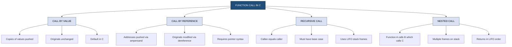
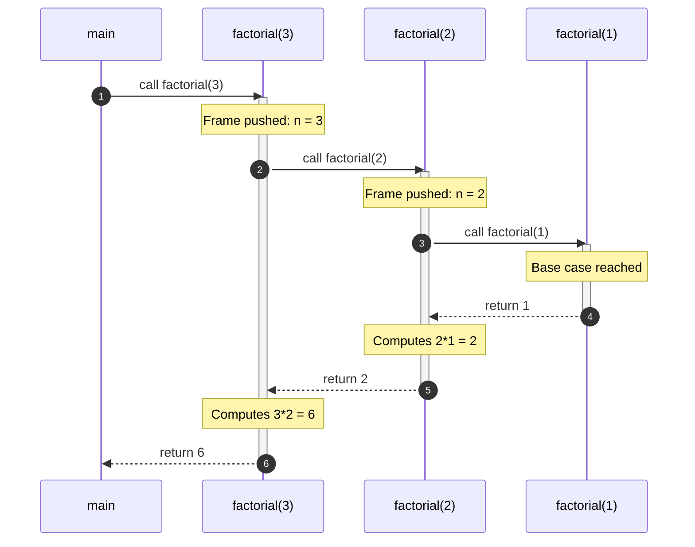
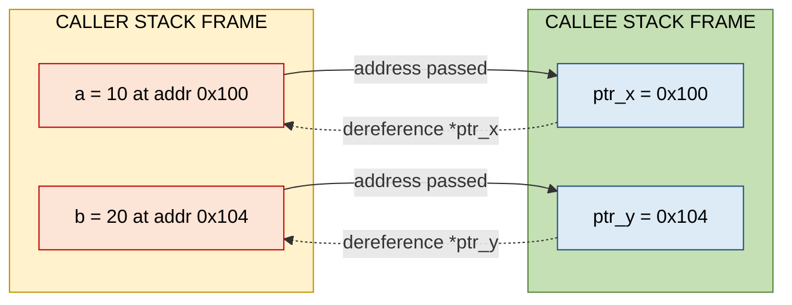
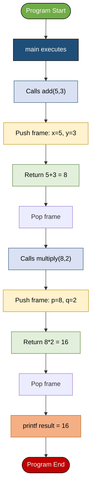
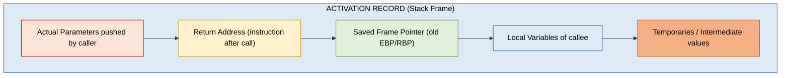
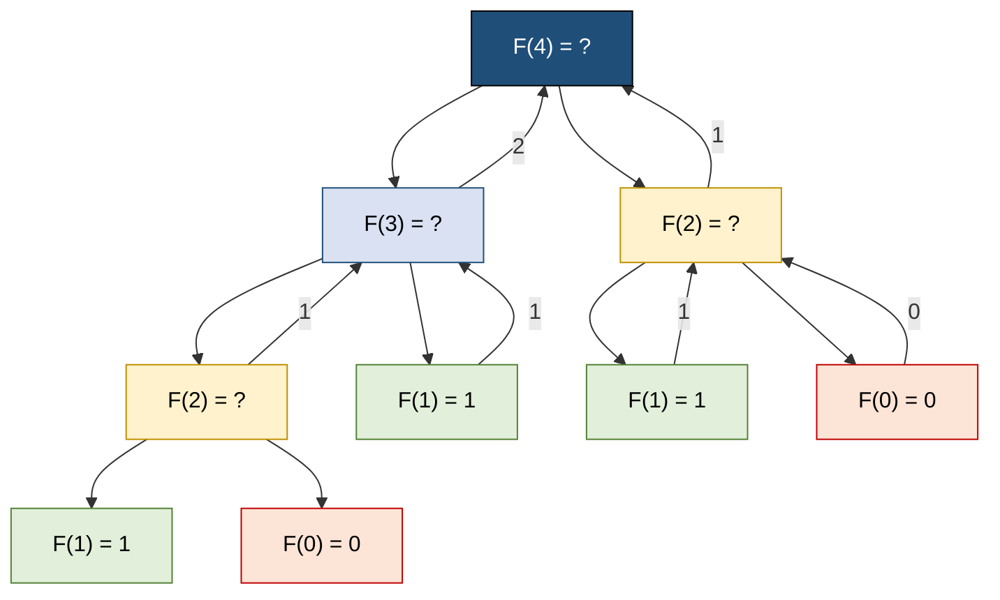

# Function call

<!-- SECTION_1_START -->
# Function Call in C — Core Definition & Intuitive Overview

> [!IMPORTANT]
> **KTU 2024 Scheme — Module 3: Functions**
> This note covers the central concept of **Function Call**, which is the mechanism by which the CPU transfers control, data, and return-path information between sub-programs. Mastery of function calls is the foundation for understanding **recursion**, **pointers**, and **modular program design** in C.

## 1.1 Formal Definition (KTU Syllabus Terminology)

A **function call** is an executable statement that invokes a previously declared (prototyped) or defined function, thereby:

1. **Transferring program control** from the *calling function* (caller) to the *called function* (callee).
2. **Passing arguments** (actual parameters) to the callee using one of the parameter-passing strategies.
3. **Establishing a return address** on the call stack so that execution resumes at the statement following the call once the callee completes.
4. **Optionally receiving a return value** of the function's declared return type.

> [!NOTE]
> **Two Fundamental Categories of Function Calls in C**
> * **Call by Value** — a *copy* of the actual argument's value is pushed onto the stack. The callee operates on its own local copy.
> * **Call by Reference** — the *memory address* of the actual argument (obtained via the address-of operator `&`) is passed. The callee uses the dereference operator `*` to operate on the original variable.

## 1.2 Conceptual Analogy / Plain-English Intuition

> [!TIP]
> **The "Photocopy vs. Original Document" Analogy**
>
> Imagine you are a project manager (the *calling function*) and you need a clerk (the *called function*) to update a customer's phone number.
>
> * **Call by Value** → You hand the clerk a **photocopy** of the register. The clerk scribbles corrections on the photocopy and files it. Your **original register remains untouched**.
> * **Call by Reference** → You hand the clerk the **original register** itself. Whatever the clerk writes is **reflected on your master copy** when it comes back.
>
> C defaults to **Call by Value**. To achieve Call by Reference, you must explicitly pass *pointers* (addresses).

## 1.3 Anatomy of a C Function Call Statement

$$ \text{call\_statement} \;:\; \text{LValue} \;=\; \underbrace{\text{identifier}}_{\text{function name}} \;\Big( \; \underbrace{a_1, a_2, \dots, a_n}_{\text{actual parameters}} \; \Big) \; ; $$

Each component has a strict role:

| Component | Role | Mandatory? |
|---|---|---|
| `identifier` | Name of the previously declared function | Yes |
| `a_1 \dots a_n` | Actual parameters (expressions yielding values) | Only if prototype expects them |
| `LValue` | Variable that receives the returned value | Only if return type is non-`void` |

## 1.4 What Happens at the Machine Level (High-Level Glimpse)

When a C function is called, the system performs four low-level operations — often remembered by the acronym **CARS**:

| Step | Letter | Action | Stack Effect |
|---|---|---|---|
| 1 | **C** | **Create** the call frame (activation record) | Push return address |
| 2 | **A** | **Allocate** space for formal parameters & locals | Push parameter copies |
| 3 | **R** | **Run** the callee's body | Save base pointer |
| 4 | **S** | **Store** return value, pop frame, jump back | Pop frame, restore IP |

> [!WARNING]
> **KTU Examiner's Pitfall**
> Many students confuse the *function definition* with the *function call*. Definition is the **recipe**; the call is the **act of cooking using that recipe**. A program with only a definition and no call will compile but produce no output from that function.

## 1.5 Why Function Calls Matter in Engineering

In real-world C projects (embedded systems, OS kernels, IoT firmware), function calls enable:

* **Modularity** — each function is a black box with a single responsibility (*SRP*).
* **Reusability** — DRY (Don't Repeat Yourself) principle.
* **Recursion** — solving problems with self-similar sub-problems (tree traversal, quicksort, factorial).
* **Callback mechanisms** — passing function pointers for event-driven firmware (`HAL_GPIO_EXTI_Callback` in STM32 HAL, for instance).

> [!VISUALIZATION CONTROL]
> **Concept:** Call Stack Growth for a Recursive Call (e.g., `factorial(3)`)
> **Stack Push Sequence (bottom → top):**
> * Frame 0 → `main()`
> * Frame 1 → `factorial(3)` with `n = 3`
> * Frame 2 → `factorial(2)` with `n = 2`
> * Frame 3 → `factorial(1)` with `n = 1` (base case reached)
> **Stack Pop Sequence (top → bottom):** Each frame returns its value, pops, and the parent resumes.
> **Visual Description:** Students should picture a vertical LIFO tower growing downward in memory as recursive depth increases and shrinking as each call resolves.
<!-- SECTION_1_END -->

<!-- SECTION_2_START -->
# Deep Theoretical Analysis & KTU High-Yield Formula Sheet

## 2.1 The Four Stages of a Function Call (Detailed)

When the CPU executes the statement `result = square(x + 1);`, the following sequence unfolds:

### Stage 1 — Argument Evaluation
Each actual parameter expression (here, `x + 1`) is evaluated in the **caller's scope**. The result is stored in a temporary location.

### Stage 2 — Stack Frame Construction (Activation Record)
A new **stack frame** is pushed onto the program's call stack. This frame contains:

$$
\text{Frame} = \big[ \; \text{Return Address} \;\vert\; \text{Saved Base Pointer} \;\vert\; \text{Formal Parameters} \;\vert\; \text{Local Variables} \; \big]
$$

### Stage 3 — Control Transfer
The Instruction Pointer (IP) is set to the callee's entry address. Execution continues inside the called function's body.

### Stage 4 — Return
The callee executes `return value;`. The return value is placed in a designated register (conventionally `EAX` in x86-32, `RAX` in x86-64, `R0` in ARM). The frame is popped, IP is restored from the saved return address, and execution resumes at the call site.

## 2.2 Call by Value vs Call by Reference — Comparative Analysis

> [!NOTE]
> This is the single most-tested concept on Function Calls in KTU University Exams.

| Property | Call by Value | Call by Reference |
|---|---|---|
| **Mechanism** | Passes a **copy** of the value | Passes the **address** of the variable |
| **Operator at call site** | `func(x)` | `func(\&x)` |
| **Operator in callee** | `void func(int a)` | `void func(int *a)` |
| **Original variable modified?** | No | Yes |
| **Memory overhead** | Allocates separate copy on stack | No extra allocation (just an address) |
| **Pointer hazard** | None | Dereference errors possible |
| **Default in C?** | Yes | No (must use pointers explicitly) |
| **KTU typical question** | Swap two numbers (failed) | Swap two numbers (successful) |

## 2.3 KTU Formula Sheet (Cheat-Sheet)

> [!IMPORTANT]
> The following table summarizes the algebraic and address-arithmetic rules you must know cold for the exam. Note that the pipe character is written as `\vert` to keep Markdown tables intact.

| # | Concept | Equation / Rule | Unit / Note |
|---|---|---|---|
| 1 | Address of variable | $\text{addr}(x) = \&x$ | Hexadecimal value |
| 2 | Dereference (value at address) | $\text{val}(p) = *p$ where $p = \&x$ | — |
| 3 | Stack pointer growth | $\text{SP}_{\text{new}} = \text{SP}_{\text{old}} - \text{sizeof}(\text{Frame})$ | Bytes; grows downward on x86 |
| 4 | Frame size (simplified) | $F = \sum_{i} \text{sizeof}(\text{param}_i) + \sum_{j} \text{sizeof}(\text{local}_j)$ | Bytes |
| 5 | Recurrence depth (factorial) | $T(n) = T(n-1) + c$ | Linear depth |
| 6 | Master theorem form (recursion) | $T(n) = aT(n/b) + f(n)$ | Used for divide-and-conquer |
| 7 | Swap identity | $a' = a - b; \; b' = a'; \; a'' = a' - b'$ | XOR form: $a\^{}b\^{}a = b$ |
| 8 | Array decay | $\text{passed\_arr} \equiv \&\text{arr}[0]$ | Arrays always pass by reference |
| 9 | Function pointer size | $\text{sizeof}(fp) = 8$ (on 64-bit) | Bytes |
| 10 | Return value register | $\text{RAX}$ (x86-64) \vert\ $\text{R0}$ (ARM) | — |

## 2.4 The Recursive Call — Special Case

A function call where the **caller and callee are the same function** is called **recursion**. Every recursive call must have:

1. **Base case** — termination condition (otherwise infinite recursion → stack overflow).
2. **Recursive case** — reduces the problem toward the base case.

$$
T(n) = \begin{cases} \Theta(1) & \text{if } n \le 1 \quad \text{(base case)} \\ T(n-1) + \Theta(1) & \text{if } n > 1 \quad \text{(recursive case)} \end{cases}
$$

> [!TIP]
> **Real-world engineering use of recursion**
> * Tree / graph traversal (compilers, ASTs, file-system crawlers).
> * Quick Sort & Merge Sort divide-and-conquer.
> * Tower of Hanoi, N-Queens (algorithmic puzzles).
> * Hierarchical state machines in embedded RTOS schedulers.

## 2.5 Parameter Passing in C — The Underlying Truth

C **only** supports **call by value** at the language level. What we colloquially call "call by reference" is **simulated** by passing the *value of the address* (i.e., a pointer).

$$ \text{func}(\&x) \;\longrightarrow\; \text{value pushed} = \&x \;\longrightarrow\; \text{callee receives} = \text{ptr} $$

This is why the technique is sometimes called **"passing by value of a pointer"** — a nuance that KTU examiners love to test.
<!-- SECTION_2_END -->

<!-- SECTION_3_START -->
# Step-by-Step Derivations & Code Implementation

> [!NOTE]
> All C programs below are **complete, compilable, and KTU-board-ready**. They include exhaustive comments so you can reproduce them verbatim in your lab record and exam. No step is skipped.

## 3.1 Example 1 — Call by Value (Swapping That Fails)

```c
/*  Program: call_by_value_FAIL.c
    Course : PROGRAMMING IN C (GXEST204)
    Module : 3 - Functions
    Topic  : Function Call - Call by Value

    Expected Output:
    Before swap: a = 10, b = 20
    Inside swap (callee): x = 20, y = 10
    After swap (caller) : a = 10, b = 20   <-- UNCHANGED!
*/

#include <stdio.h>

/* Function definition: receives COPIES of a and b */
void swap_by_value(int x, int y)
{
    int temp;
    temp = x;       /* Step 1: save x into temp   */
    x   = y;        /* Step 2: put y into x       */
    y   = temp;     /* Step 3: put temp into y    */
    printf("Inside swap (callee): x = %d, y = %d\n", x, y);
}

int main(void)
{
    int a = 10, b = 20;

    printf("Before swap: a = %d, b = %d\n", a, b);
    swap_by_value(a, b);                       /* Function call  */
    printf("After swap (caller) : a = %d, b = %d\n", a, b);

    return 0;
}
```

### Line-by-Line Evaluation

1. `a = 10` and `b = 20` are stored in `main`'s stack frame.
2. At `swap_by_value(a, b);` the values `10` and `20` are **copied** to new memory locations `x` and `y`.
3. Inside the callee, the swap happens on `x, y`. The original `a, b` are untouched.
4. When the function returns, `x, y` are destroyed. `a, b` retain their original values.

---

## 3.2 Example 2 — Call by Reference (Swapping That Works)

```c
/*  Program: call_by_reference_OK.c
    Demonstrates passing addresses (pointers) to modify originals.
*/

#include <stdio.h>

/* Function definition: receives ADDRESSES of a and b */
void swap_by_reference(int *x, int *y)
{
    int temp;
    temp = *x;      /* Step 1: dereference x, save value   */
    *x   = *y;      /* Step 2: dereference y, assign to *x  */
    *y   = temp;    /* Step 3: assign temp to *y            */
}

int main(void)
{
    int a = 10, b = 20;

    printf("Before swap: a = %d, b = %d\n", a, b);
    swap_by_reference(&a, &b);                 /* Pass ADDRESSES */
    printf("After swap : a = %d, b = %d\n", a, b);

    return 0;
}
```

### Trace Table (KTU Valuation Style)

| Line Executed | `a` | `b` | `*x` | `*y` | Note |
|---|---|---|---|---|---|
| Initialization | 10 | 20 | — | — | main frame |
| `swap_by_reference(&a, &b)` | 10 | 20 | 10 | 20 | addresses pushed |
| `temp = *x;` | 10 | 20 | 10 | 20 | temp = 10 |
| `*x = *y;` | 20 | 20 | 20 | 20 | a is now 20 |
| `*y = temp;` | 20 | 10 | 20 | 10 | b is now 10 |
| Return | 20 | 10 | — | — | caller sees changes |

---

## 3.3 Example 3 — Recursive Function Call (Factorial)

The mathematical definition of factorial is:

$$
n! = \begin{cases} 1 & \text{if } n = 0 \text{ or } n = 1 \\ n \times (n-1)! & \text{if } n > 1 \end{cases}
$$

**C Implementation:**

```c
/*  Program: factorial_recursion.c
    Demonstrates self-referential function call.
*/

#include <stdio.h>

long long factorial(int n)
{
    /* Base case */
    if (n <= 1) {
        return 1;
    }
    /* Recursive case */
    return n * factorial(n - 1);   /* Function calls ITSELF */
}

int main(void)
{
    int number;

    printf("Enter a non-negative integer: ");
    if (scanf("%d", &number) != 1 || number < 0) {
        printf("Invalid input.\n");
        return 1;                  /* Exit with error code */
    }

    printf("Factorial of %d = %lld\n", number, factorial(number));
    return 0;
}
```

### Derivation for $n = 4$

$$
\begin{aligned}
4! & = 4 \times 3! \\
   & = 4 \times (3 \times 2!) \\
   & = 4 \times 3 \times (2 \times 1!) \\
   & = 4 \times 3 \times 2 \times (1 \times 0!) \\
   & = 4 \times 3 \times 2 \times 1 \times 1 \\
   & = 24
\end{aligned}
$$

> [!IMPORTANT]
> **Stack overflow warning:** For very large $n$ (e.g., $n > 100{,}000$), recursion exhausts the default stack (~1 MB on most systems). Production code uses **iterative** algorithms or **tail-call optimization**.

---

## 3.4 Example 4 — Python Verification of the Recursive Algorithm

> [!TIP]
> Use the following Python snippet to **verify** your C recursion logic during debugging. It is not part of the KTU syllabus but is invaluable for quick sanity checks.

```python
import sys
from typing import Union

def factorial(n: int) -> int:
    """Compute n! using recursion with strict input validation."""
    if not isinstance(n, int):
        raise TypeError(f"Expected int, got {type(n).__name__}")
    if n < 0:
        raise ValueError("Factorial is undefined for negative integers")
    if n <= 1:                         # base case
        return 1
    return n * factorial(n - 1)       # recursive call

def main() -> None:
    try:
        user_input: str = input("Enter a non-negative integer: ").strip()
        number: int = int(user_input)
        result: int = factorial(number)
        print(f"Factorial of {number} = {result}")
    except (ValueError, TypeError) as exc:
        print(f"[ERROR] {exc}", file=sys.stderr)
        sys.exit(1)

if __name__ == "__main__":
    main()
```

---

## 3.5 Example 5 — Function Returning a Value (Square Function)

```c
/*  Program: square_function.c
    Demonstrates: function with parameters, return value, and call.
*/

#include <stdio.h>

/* Function prototype (declaration) */
int square(int num);   /* Tells compiler: "square exists, returns int" */

int main(void)
{
    int x, result;

    printf("Enter an integer: ");
    scanf("%d", &x);

    result = square(x);              /* Function call with assignment */
    printf("Square of %d = %d\n", x, result);

    return 0;
}

/* Function definition (implementation) */
int square(int num)
{
    return num * num;                /* Single return statement */
}
```

### Call-Stack Trace for `square(5)`

| Step | Action | Stack Contents (top to bottom) |
|---|---|---|
| 1 | `main` starts | `[ main frame ]` |
| 2 | `square(5)` invoked | `[ main frame, num=5, return-addr ]` |
| 3 | `return 5*5` | pushes `25` into `EAX`/return register |
| 4 | Frame popped | `[ main frame ]`; `result = 25` |
<!-- SECTION_3_END -->

<!-- SECTION_4_START -->
# Structural Diagrams & Schematics

> [!IMPORTANT]
> All Mermaid diagrams below are **render-safe** (alphanumeric node IDs, double-quoted labels, no markdown inside labels). Study them carefully — KTU often asks you to **draw** an equivalent diagram in the answer sheet.

## 4.1 Block Diagram — Categories of Function Calls



## 4.2 Sequential Topology — Call Stack Growth for `factorial(3)`



## 4.3 Block Architecture — Memory Layout During Call by Reference



## 4.4 Nested Function Call — Processing Topology


<!-- SECTION_4_END -->

<!-- SECTION_5_START -->
# KTU 2024 Scheme Examination Question Bank & Topic Recap

## 5.1 Part A — Short-Answer Questions (2 × 3 = 6 Marks)

### **Q1.** [KTU University Exam — July 2024]  **(3 Marks)**
**Differentiate between Call by Value and Call by Reference in C. Give one example for each.**

**Course Outcome:** CO1 | **RBT Level:** Understand

**Model Answer (Board-Standard Key):**

| Sl. | Call by Value | Call by Reference |
|---|---|---|
| 1 | A **copy** of the actual argument is passed to the formal parameter. | The **address** of the actual argument is passed using the `&` operator. |
| 2 | Changes made inside the function do **not** reflect in the caller. | Changes made inside the function **do** reflect in the caller. |
| 3 | Default mechanism in C. | Achieved using **pointers**. |

**Example — Call by Value:**
```c
void increment(int x) { x = x + 1; }
int main(void) {
    int a = 5;
    increment(a);              /* a remains 5 after call */
    return 0;
}
```

**Example — Call by Reference:**
```c
void increment(int *x) { *x = *x + 1; }
int main(void) {
    int a = 5;
    increment(&a);             /* a becomes 6 after call */
    return 0;
}
```

> **[Valuation Key: Definition 1M + Difference 1M + Example 1M]**

---

### **Q2.** [KTU University Exam — Dec 2023]  **(3 Marks)**
**What is recursion? State the two essential components of a recursive function.**

**Course Outcome:** CO2 | **RBT Level:** Remember

**Model Answer:**

**Recursion** is a programming technique in which a function **calls itself**, either directly or indirectly, to solve a problem by breaking it into smaller sub-problems of the same form.

The two essential components are:

1. **Base Case** — the terminating condition that stops further recursive calls (prevents infinite recursion and stack overflow).
2. **Recursive Case** — the part where the function calls itself with a *smaller* or *simpler* input that progresses toward the base case.

**Illustrative snippet:**
```c
int sum_n(int n) {
    if (n == 0)                 /* Base case      */
        return 0;
    return n + sum_n(n - 1);    /* Recursive case */
}
```

> **[Valuation Key: Definition 1M + Base case explanation 1M + Recursive case explanation 1M]**

---

## 5.2 Part B — Long-Answer Questions (Choice-Based, 1 × 14 = 14 Marks)

> **KTU 2024 Pattern:** Each Part B question is split into **(a) 7 marks** and **(b) 7 marks**, mapping to *Understand* and *Apply* cognitive levels respectively.

---

### **Question A.** [KTU University Exam — July 2024]

**(a)** Explain the mechanism of a function call in C with a neat diagram of the activation record. **(7 Marks — Understand)**

**Course Outcome:** CO2 | **RBT Level:** Understand

**Model Answer:**

When a function is invoked in C, the compiler/runtime performs four sequential steps. The **activation record** (or *stack frame*) is a block of memory allocated on the call stack that stores all information required to execute and return from the function.

**Structure of an Activation Record (Bottom to Top):**

$$
\text{Frame} = \Big[ \; \text{Parameters} \;\Big\vert\; \text{Return Address} \;\Big\vert\; \text{Saved Frame Pointer} \;\Big\vert\; \text{Local Variables} \;\Big\vert\; \text{Temporaries} \; \Big]
$$

**Four Steps of a Function Call:**

1. **Argument Evaluation & Push** — actual parameters are evaluated and their values (or addresses) are pushed right-to-left onto the stack (cdecl convention).
2. **Return Address Push** — the address of the instruction following the `call` statement is pushed.
3. **Frame Pointer Save** — the current base pointer (`EBP` / `RBP`) is saved so it can be restored on return.
4. **Control Transfer & Execution** — the Instruction Pointer jumps to the callee, which executes its body.

On `return`, the callee places the return value in `EAX`/`RAX`, restores the saved base pointer, pops the frame, and execution resumes at the saved return address.

**Diagram (Draw this in your answer sheet):**



> **[Valuation Key: Listing 4 steps 2M + Frame contents 2M + Diagram 2M + Return mechanism 1M]**

---

**(b)** Write a C program using a **user-defined function** to compute the sum of digits of a number using a **function call**. Demonstrate both **call by value** and **call by reference** by passing the same number to two different functions. **(7 Marks — Apply)**

**Course Outcome:** CO3 | **RBT Level:** Apply

**Model Answer — Full C Program:**

```c
/* Program: sum_of_digits_both_calls.c */
#include <stdio.h>

/* (i) Call by value: returns the sum */
int sum_of_digits_value(int n)
{
    int s = 0;
    if (n < 0) n = -n;          /* Handle negatives */
    while (n > 0) {
        s   = s + (n % 10);     /* Extract last digit */
        n   = n / 10;            /* Remove last digit   */
    }
    return s;
}

/* (ii) Call by reference: stores the sum via pointer */
void sum_of_digits_reference(int n, int *result)
{
    int s = 0;
    if (n < 0) n = -n;
    while (n > 0) {
        s   = s + (n % 10);
        n   = n / 10;
    }
    *result = s;                 /* Write back to caller */
}

int main(void)
{
    int number = 12345;
    int stored = 0;

    printf("Number = %d\n", number);
    printf("Sum (call by value)     = %d\n", sum_of_digits_value(number));
    sum_of_digits_reference(number, &stored);
    printf("Sum (call by reference) = %d (stored in 'stored')\n", stored);

    return 0;
}
```

**Expected Output:**
```
Number = 12345
Sum (call by value)     = 15
Sum (call by reference) = 15 (stored in 'stored')
```

**Step-by-Step Trace for `sum_of_digits_value(12345)`:**

| Iteration | `n` (start) | `n % 10` | `s` (new) | `n` (after `/10`) |
|---|---|---|---|---|
| 1 | 12345 | 5 | 5 | 1234 |
| 2 | 1234 | 4 | 9 | 123 |
| 3 | 123 | 3 | 12 | 12 |
| 4 | 12 | 2 | 14 | 1 |
| 5 | 1 | 1 | 15 | 0 |
| Exit | 0 | — | 15 | — |

**Result:** $1+2+3+4+5 = 15$ ✓

> **[Valuation Key: Correct value-version logic 2M + Correct reference-version logic 2M + Correct function calls in main 2M + Output 1M]**

---

### **Question B (Alternative).** [KTU University Exam — Dec 2023]

**(a)** What are the different ways of passing parameters to functions in C? Explain with suitable examples. **(7 Marks — Understand)**

**Course Outcome:** CO1 | **RBT Level:** Understand

**Model Answer:**

C supports two ways of passing parameters to functions:

**1. Call by Value (Pass by Value)**

The actual argument's value is copied into the formal parameter. The callee works on a private copy.

```c
#include <stdio.h>
void display(int x)        /* x is a local copy */
{
    x = 100;               /* Modifies x, NOT the caller's variable */
    printf("Inside: x = %d\n", x);
}
int main(void)
{
    int a = 5;
    display(a);
    printf("Outside: a = %d\n", a);   /* Still 5 */
    return 0;
}
```

**2. Call by Reference (Pass by Address)**

The actual argument's address is passed. The callee dereferences the pointer to read/write the original variable.

```c
#include <stdio.h>
void display(int *x)       /* x holds the address */
{
    *x = 100;              /* Modifies the caller's variable */
    printf("Inside: *x = %d\n", *x);
}
int main(void)
{
    int a = 5;
    display(&a);           /* Pass address of a */
    printf("Outside: a = %d\n", a);   /* Now 100 */
    return 0;
}
```

> **[Valuation Key: Listing 2 methods 1M + Call by value with example 3M + Call by reference with example 3M]**

---

**(b)** Write a recursive C function to compute the **nth Fibonacci number**. Trace the call stack for $F(4)$ and show the output. **(7 Marks — Apply)**

**Course Outcome:** CO3 | **RBT Level:** Apply

**Model Answer:**

The Fibonacci sequence is defined as:

$$
F(n) = \begin{cases} 0 & n = 0 \\ 1 & n = 1 \\ F(n-1) + F(n-2) & n \ge 2 \end{cases}
$$

**C Program:**

```c
/* Program: fibonacci_recursion.c */
#include <stdio.h>

int fibonacci(int n)
{
    /* Base cases */
    if (n == 0) return 0;
    if (n == 1) return 1;
    /* Recursive case */
    return fibonacci(n - 1) + fibonacci(n - 2);
}

int main(void)
{
    int i, terms = 6;
    printf("Fibonacci series up to %d terms:\n", terms);
    for (i = 0; i < terms; i++) {
        printf("F(%d) = %d\n", i, fibonacci(i));
    }
    return 0;
}
```

**Expected Output:**
```
Fibonacci series up to 6 terms:
F(0) = 0
F(1) = 1
F(2) = 1
F(3) = 2
F(4) = 3
F(5) = 5
```

**Call-Stack Trace for $F(4)$:**



**Computation:**
$$
\begin{aligned}
F(4) & = F(3) + F(2) \\
     & = \big(F(2) + F(1)\big) + \big(F(1) + F(0)\big) \\
     & = \big((F(1) + F(0)) + 1\big) + (1 + 0) \\
     & = (1 + 0 + 1) + 1 \\
     & = 3
\end{aligned}
$$

> **[Valuation Key: Recurrence definition 1M + Correct recursive C code 2M + Trace tree 2M + Final value 2M]**

---

> [!WARNING]
> **KTU Examiner's Valuation Warning — Top 5 Ways Students Lose Marks**
>
> 1. **Confusing `*` and `&` in pointer calls** — Remember: `&` at the **call site** (gives address), `*` inside the **callee** (gives value at address).
> 2. **Forgetting to declare a function prototype** before calling it — modern C allows implicit `int` return, but KTU strictly expects prototypes.
> 3. **Missing base case in recursion** — always costs 2-3 marks. Write it explicitly even if it looks trivial.
> 4. **Mixing up pass-by-value with pass-by-reference terminology** — C technically *only* supports pass-by-value; "pass by reference" is a pointer idiom. Mentioning this nuance impresses examiners.
> 5. **Not showing stack frames / diagrams** in long answers — diagrams in Part B (a) carry **at least 2 marks** by themselves. Always include a labeled activation-record sketch.

---

## 5.3 Topic Recap & Important Things to Remember

> [!TIP]
> **Rapid-Revision Checklist — Pin This to Your Wall Before the Exam**

* **Function call** transfers control, passes arguments, and returns a value (if non-`void`).
* C has **two parameter-passing mechanisms**: *Call by Value* (default) and *Call by Reference* (via pointers).
* Strictly speaking, C **only supports pass-by-value**; "pass by reference" is simulated via pointer values.
* A function call **must match its prototype** in number, type, and order of parameters.
* A **recursive call** requires a **base case** and a **recursive case**; otherwise → stack overflow.
* The **activation record** contains: actual parameters, return address, saved frame pointer, local variables, and temporaries.
* Arrays in C are **always passed by reference** (decay to `int *`).
* The `return` statement places the value in a **designated register** (`EAX`/`RAX` on x86, `R0` on ARM).
* **Function call stack** follows **LIFO** discipline — last-called function returns first.
* The **`&` (address-of)** operator appears at the **call site**; the **`*` (dereference)** operator appears inside the **callee** when using pass-by-reference.
* Recurrence relations like $T(n) = aT(n/b) + f(n)$ govern the **time complexity** of recursive algorithms (Master Theorem).
* **Recursion vs Iteration**: Recursion is elegant for tree/graph problems; iteration is preferred when stack space is limited.
* **Common KTU trick questions**:
  * "Will `swap(a, b)` work if `swap` is written using call by value?" → **No**.
  * "What happens if a recursive function has no base case?" → **Stack overflow / segmentation fault**.
  * "Is `void main()` acceptable?" → KTU expects `int main(void)` with a `return 0;`.
* **Standard library examples** that internally use function calls: `printf`, `scanf`, `strlen`, `strcpy`, `malloc`, `free`.
* **Engineering applications**: callbacks in embedded HAL, event handlers in GUIs, recursive descent parsers in compilers, divide-and-conquer in image processing.
* **Mnemonic for remembering call types**: **C**opy **V**alue (CV) vs **R**eal **R**eference (RR).
* **Mnemonic for activation record**: **P**arameters **R**eturn-address **F**rame-pointer **L**ocals **T**emporaries → **"PRFLT"** ("profit without the I").
<!-- SECTION_5_END -->
