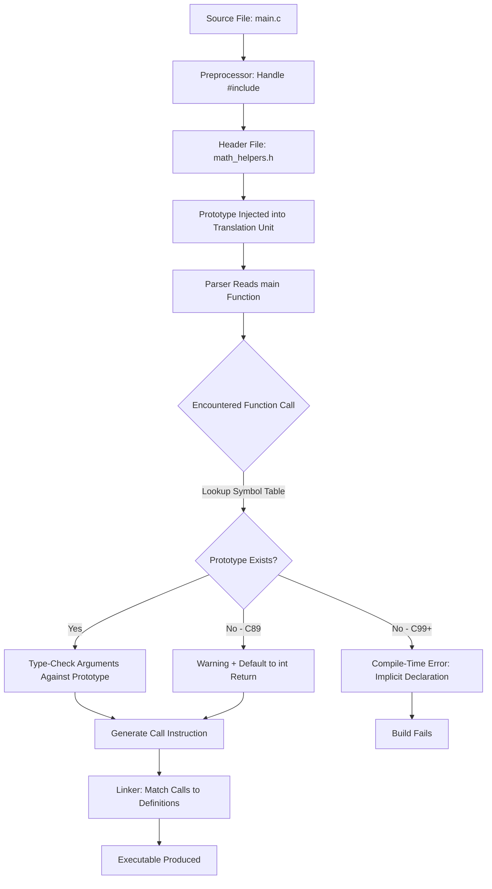
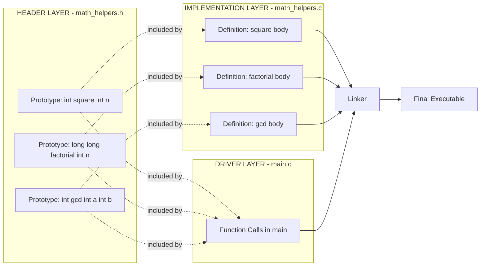
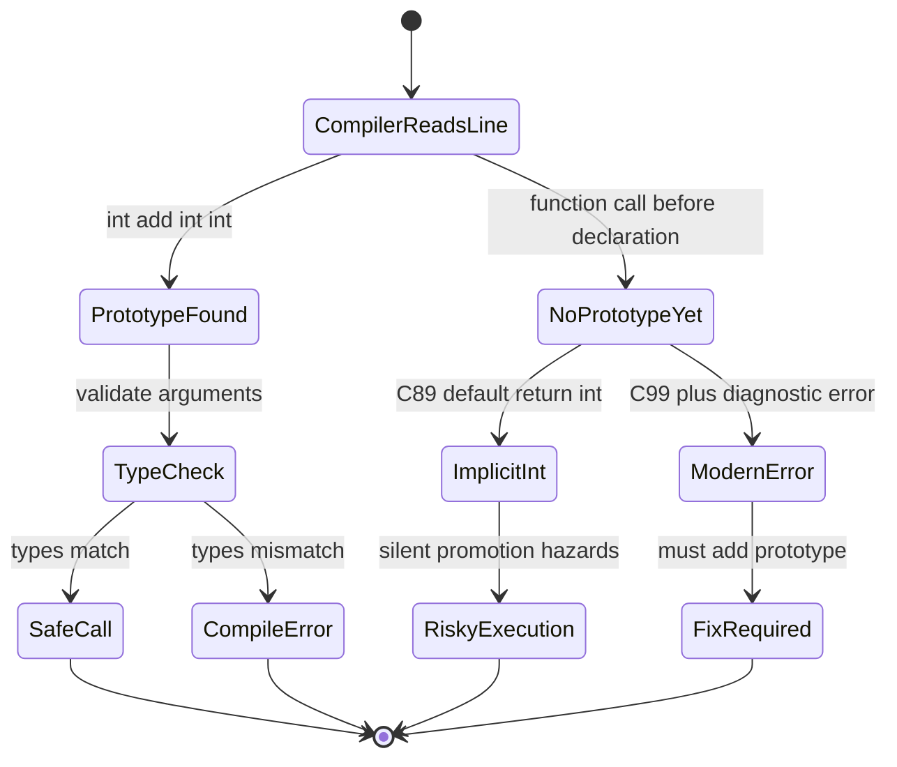
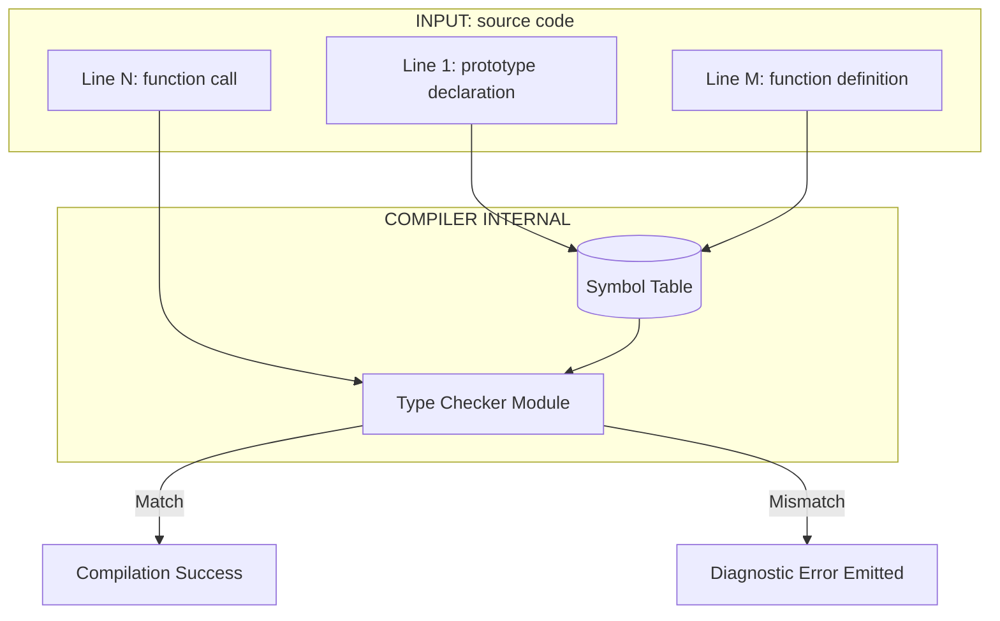

# Function prototype

<!-- SECTION_1_START -->
# Function Prototype in C — Core Technical Definition & Intuitive Overview

> [!IMPORTANT]
> **KTU 2024 Scheme — Module 3: Functions**
> **Course:** PROGRAMMING IN C (GXEST204)
> **Topic:** Function Prototype
> **Syllabus Verbs Mapped:** *Declare, Illustrate, Use* (as per KTU 2024 descriptors)

## 1.1 Formal Academic Definition (KTU Board Terminology)

A **function prototype** in C is a *declaration statement* that introduces a function to the compiler **before** its actual definition (body) appears in the source file. It specifies the function's **signature** — its name, its return type, and the *types* of its parameters (not necessarily their names) — terminating with a mandatory semicolon (`;`).

> [!NOTE]
> **Syllabus Highlight:** KTU 2024 Scheme emphasises that in modern C (C99/C11), if a function is called *before* it is declared or defined, the compiler assumes an **implicit declaration** returning `int` and taking *unspecified* parameters. This is a **diagnostic error** in C99+ and must be avoided by writing a prototype.

The **ANSI C (C89/C99/C11) standard prototype grammar** is:

```c
return_type function_name ( type1 , type2 , ... , typen );
```

## 1.2 Conceptual Analogy — The "Hotel Reservation" Intuition

Imagine you are calling a hotel before arriving:

| Step | Real World (Hotel) | C Language (Function) |
|---|---|---|
| 1 | You phone the hotel and say *"I am John, I need a room for 2 adults from Friday"* | You write a **function prototype** at the top of the file |
| 2 | The hotel notes your **name**, **guest count**, and **check-in date** in their register | The compiler notes the **function name**, **return type**, and **parameter types** in its symbol table |
| 3 | When you actually arrive, the hotel already knows how to handle you — no confusion at the reception | When the function is *called* later, the compiler already knows how to validate arguments — no type mismatch error |

> [!TIP]
> **Intuition Check:** A *prototype* is **NOT the function itself** — it is a *promise* to the compiler. The actual work happens in the **function definition**. Without the prototype, the compiler is essentially blindfolded and must guess the return type (defaulting to `int` in older standards).

## 1.3 Why the Compiler Cares — The Physical Constants

The compiler performs **type checking** of arguments during compilation. Key standard metrics:

- **C89 Standard:** Allowed implicit `int` return; dangerous and deprecated.
- **C99/C11 Standard (KTU Default):** Implicit function declarations are **errors** (not warnings) in C99 and removed entirely in C23.
- **One Definition Rule (ODR-like):** A function may have **multiple declarations** but **exactly one definition** in a translation unit.

> [!IMPORTANT]
> **KTU Frequently Tested Point:** Parameter *names* in the prototype are **optional documentation only** — they are ignored by the compiler. Only the *types* and *order* of parameters matter.

## 1.4 Visual Intuition: The "Announcement Board"

> [!VISUALIZATION CONTROL]
> **Concept:** Timeline of Source File Reading (Top-to-Bottom Compilation)
> **GeoGebra / Desmos Input Equations:** *(Not applicable — flow concept shown via Mermaid in Section 4)*
> **Visual Description:** Picture the C source file as a vertical scroll. As the compiler's "eye" moves downward, each prototype is a **billboard** posted on the scroll announcing "A function named `foo` taking 2 ints and returning int exists *somewhere* below." By the time the compiler encounters the call `foo(3, 4)`, the billboard is already in view, enabling safe type checking.

<!-- SECTION_1_END -->

<!-- SECTION_2_START -->
# Deep Theoretical Analysis & KTU High-Yield Formula Sheet

## 2.1 Anatomy of a Function Prototype

A prototype is a **single statement** broken into four logical regions:

```c
    int            add            ( int a , int b )    ;
    ^              ^              ^                   ^
    |              |              |                   |
    return_type    function_name  parameter list      terminator
```

| Region | Mandatory? | Purpose | Example Value |
|---|---|---|---|
| `return_type` | Yes | Type of value the function hands back | `int`, `float`, `void`, `char*` |
| `function_name` | Yes | Valid C identifier (alphanumeric + underscore) | `add`, `calculate_SI` |
| Parameter List | Yes (can be empty `(void)`) | Tells compiler the **types** of arguments | `(int, int)`, `(float, double)` |
| Semicolon `;` | **Yes — distinguishes declaration from definition** | Marks this as a *declaration* only | `;` |

## 2.2 Three Critical Rules Every KTU Student Must Memorise

> [!NOTE]
> **Rule 1 — The Semicolon Rule**
> A *declaration* (prototype) **ends with `;`**. A *definition* **does not** — it is followed by a `{ ... }` body. Confusing these is a common 1-mark loss in KTU exams.

> [!NOTE]
> **Rule 2 — Parameter Names Are Optional**
> ```c
> int add(int, int);       // Valid prototype
> int add(int a, int b);   // Valid prototype (names are documentation only)
> ```
> The compiler **discards** the names. They serve only to improve human readability.

> [!NOTE]
> **Rule 3 — The `void` Ambiguity**
> ```c
> int foo(void);    // Prototype promises: "takes NO arguments"
> int foo();        // In C (NOT C++): "takes UNSPECIFIED number of arguments"
> ```
> In KTU exams, **always write `(void)`** to explicitly indicate no parameters. Writing empty `()` is a classic trap question.

## 2.3 Why Are Prototypes Needed? — The Compiler's Perspective

When the C compiler parses a file **linearly from top to bottom**, it maintains a **symbol table**. Three scenarios exist:

### Scenario A: No Prototype, Call Before Definition (C99 — **ERROR**)
```c
int main() {
    printf("%d", add(3, 4));   // Compiler has never heard of `add`
}
int add(int a, int b) { return a + b; }
```
The compiler will throw: `error: implicit declaration of function 'add'`.

### Scenario B: Prototype Before Call (**SAFE — KTU Standard**)
```c
int add(int, int);                  // Prototype: declaration only
int main() {
    printf("%d", add(3, 4));        // Compiler validates types using prototype
}
int add(int a, int b) { return a + b; }  // Definition
```

### Scenario C: Definition Before Call (**SAFE — implicit prototype**)
```c
int add(int a, int b) { return a + b; }  // Compiler reads this first
int main() {
    printf("%d", add(3, 4));        // Compiler already knows `add`
}
```
This works, but KTU 2024 scheme **expects prototypes at the top** for modular, header-friendly code.

## 2.4 Real-World Engineering Utility

| Domain | Use of Prototypes |
|---|---|
| **Modular C Projects** | Header files (`.h`) contain *only* prototypes; `.c` files contain definitions. Enables separation of interface and implementation. |
| **Library Design (e.g., `math.h`)** | You `#include <math.h>` — that file is a collection of prototypes. The actual implementations live in compiled libraries. |
| **Team-Based Development** | Programmer A writes prototypes in a header; Programmer B implements functions. They can work in parallel without seeing each other's code. |
| **Embedded Systems (KTU ECE focus)** | Microcontroller vendor provides a header with all register and function prototypes; the firmware writer calls them without knowing the assembly. |

## 2.5 KTU High-Yield Formula Sheet (Cheat Table)

| # | Concept | Syntax / Rule | Exam Tip |
|---|---|---|---|
| 1 | Basic Prototype | `T name(T1, T2, ...);` | Note the **semicolon** |
| 2 | No-argument function | `T name(void);` | Never use `()` alone in modern C |
| 3 | No return value | `void name(args);` | Function executes, returns nothing |
| 4 | Parameter names optional | `int add(int, int);` | Names are *ignored* by compiler |
| 5 | Multiple prototypes | Allowed for same function | But **only one definition** |
| 6 | Prototype mismatch | Compiler **error** (not warning) | Argument count and types must match |
| 7 | Old K\&R style | `int add(a, b) int a; int b; { }` | **Not in KTU syllabus** — avoid |
| 8 | Variadic function | `int printf(const char*, ...);` | Ellipsis `...` means variable args |
| 9 | Forward declaration | Same as prototype term | Use interchangeably in answers |
| 10 | Header file role | Stores prototypes only | `#include` brings them into scope |

> [!IMPORTANT]
> **Absolute Value / Modulus Note:** When writing `|x|` in any formula, use LaTeX `$\vert x \vert$` — **never** the bare pipe `|` inside a markdown table row, as it breaks the table parser.

## 2.6 Type-Promotion Traps (Advanced KTU Favourite)

When a prototype is **absent**, the compiler performs **default argument promotions** (`char` → `int`, `float` → `double`). With a **prototype present**, the compiler does *not* promote — it checks strictly. This means:

```c
/* Without prototype — old C behaviour */
printf("%d", add(3.5, 2));   // Silently truncates 3.5 to 3, then to int

/* With prototype: int add(double, int); */
add(3.5, 2);                 // Compile-time error or safe conversion
```

> [!WARNING]
> KTU examiners love questions on "What happens if the prototype is missing?" — answer must mention **default argument promotions** and the C99 **error** for implicit declarations.

<!-- SECTION_2_END -->

<!-- SECTION_3_START -->
# Step-by-Step Derivations & Code Implementation

## 3.1 Exhaustive Worked Example 1 — Basic Prototype with Type Mismatch

**Problem:** A student writes a function that adds two integers. Demonstrate the role of a prototype when the call has a type mismatch.

### Step-by-Step Code Construction

```c
/*  --------------------------------------------------------------
 *  File        : prototype_demo_1.c
 *  Concept     : Basic function prototype with type checking
 *  KTU Module  : 3 — Functions
 *  -------------------------------------------------------------- */

#include <stdio.h>

/* STEP 1 : Prototype / Forward Declaration
 * The compiler is informed: "There exists a function named `sum`
 *  that takes two `int` parameters and returns an `int`."
 * Parameter names `a` and `b` are optional documentation.
 */
int sum(int a, int b);

/* STEP 2 : Main function — the call site
 * Here we invoke `sum`. Because the prototype above was already
 * processed by the compiler, it can verify:
 *   - 2 arguments supplied           -> OK
 *   - both arguments of type `int`   -> OK
 *   - return value used in `printf`  -> OK
 */
int main(void)
{
    int result;

    result = sum(10, 20);          /* Valid call */

    printf("Sum = %d\n", result);  /* Output : Sum = 30 */

    return 0;
}

/* STEP 3 : Function Definition
 * This is where the actual code body lives.
 * The signature here MUST be compatible with the prototype.
 */
int sum(int a, int b)
{
    return a + b;
}
```

### Compilation Trace (for conceptual understanding)

| Phase | Compiler Action | Result |
|---|---|---|
| 1. Lexical scan | Reads `int sum(int a, int b);` | Stores in symbol table as `sum : (int, int) -> int` |
| 2. Parsing `main` | Sees `sum(10, 20)` | Looks up symbol table → finds prototype |
| 3. Type check | `10` is `int`, `20` is `int` | Match — proceed |
| 4. Code generation | Inserts call to `sum` | Linker later resolves to definition |
| 5. Linking | Finds `sum` definition in same file | Build succeeds |

---

## 3.2 Exhaustive Worked Example 2 — Mismatch Caught by Prototype

**Problem:** Show what happens if a caller passes a `float` where the prototype expects an `int`.

```c
/*  --------------------------------------------------------------
 *  File        : prototype_demo_2.c
 *  Concept     : Type mismatch caught at COMPILE time (not runtime)
 *  -------------------------------------------------------------- */

#include <stdio.h>

/* Prototype promises: two integers in, one integer out. */
int area(int side);

int main(void)
{
    float s = 4.5;

    /* The compiler will emit a WARNING (and in strict mode, an ERROR):
     *   "passing argument 1 of 'area' makes integer from floating-point
     *    without a cast"
     * This is the PROTOTYPE doing its job — protecting us at compile time.
     */
    printf("Area = %d\n", area(s));   /* Truncation: 4.5 -> 4 */

    return 0;
}

int area(int side)
{
    return side * side;     /* Returns 4 * 4 = 16, not 4.5 * 4.5 */
}
```

### Mathematical Trace of Truncation

$$
s = 4.5
$$

$$
\text{cast to int} \Rightarrow \lfloor 4.5 \rfloor = 4
$$

$$
\text{area} = 4 \times 4 = 16
$$

$$
\text{Output} \Rightarrow \texttt{Area = 16}
$$

> [!TIP]
> **KTU Insight:** Without the prototype, the compiler would default-promote `float` to `double`, leading to a stack-frame size mismatch at runtime — a **silent** bug. The prototype forces the issue to surface at **compile time** where it is cheap to fix.

---

## 3.3 Exhaustive Worked Example 3 — `void` vs Empty Parentheses

```c
/*  --------------------------------------------------------------
 *  File        : prototype_demo_3.c
 *  Concept     : Distinguishing (void) from () in C
 *  -------------------------------------------------------------- */

#include <stdio.h>

/* Prototype 1 : Strict no-argument function. */
void greet(void);

/* Prototype 2 : In C, this means "unspecified arguments" — a KTU trap. */
void legacy_greet();

int main(void)
{
    greet();          /* Always safe */
    legacy_greet(1, 2, 3, "anything");   /* Compiler may NOT complain in C89,
                                            but is an error in C2x */
    return 0;
}

void greet(void)
{
    printf("Hello, KTU student!\n");
}

void legacy_greet()   /* Definition matches the "unspecified" prototype */
{
    printf("Legacy greet called.\n");
}
```

> [!WARNING]
> **KTU Pitfall:** In C, `void legacy()` and `legacy(void)` are **NOT the same**. Always prefer `legacy(void)` for clarity. Many students lose 1 mark by writing `()` in answers when the question demands the modern C convention.

---

## 3.4 Exhaustive Worked Example 4 — Prototypes in a Header File (Industry Pattern)

### Step 1 — The Header File `math_helpers.h`

```c
/*  math_helpers.h
 *  --------------
 *  This header contains ONLY prototypes. No definitions.
 *  Multiple source files can include this safely (use include guards).
 */
#ifndef MATH_HELPERS_H
#define MATH_HELPERS_H

/* Square of an integer */
int square(int n);

/* Factorial — note the use of `long long` for large results */
long long factorial(int n);

/* Greatest common divisor (Euclidean algorithm) */
int gcd(int a, int b);

#endif   /* MATH_HELPERS_H */
```

### Step 2 — The Implementation File `math_helpers.c`

```c
/*  math_helpers.c
 *  ---------------
 *  This file contains the actual function bodies.
 */
#include "math_helpers.h"

int square(int n)
{
    return n * n;
}

long long factorial(int n)
{
    long long result = 1;
    for (int i = 2; i <= n; i++) {
        result *= i;
    }
    return result;
}

int gcd(int a, int b)
{
    while (b != 0) {
        int t = b;
        b = a % b;
        a = t;
    }
    return a;
}
```

### Step 3 — The Driver `main.c`

```c
/*  main.c — uses the prototypes from math_helpers.h */
#include <stdio.h>
#include "math_helpers.h"   /* Pulls in prototypes; compiler is now happy */

int main(void)
{
    int x = 12, y = 18;

    printf("square(5)     = %d\n",          square(5));
    printf("factorial(6)  = %lld\n",        factorial(6));
    printf("gcd(12, 18)   = %d\n",          gcd(x, y));

    return 0;
}
```

### Step-by-Step Compilation & Linking

$$
\text{Compile Step:} \quad \text{gcc -c math\_helpers.c} \rightarrow \text{math\_helpers.o}
$$

$$
\text{Compile Step:} \quad \text{gcc -c main.c} \rightarrow \text{main.o}
$$

$$
\text{Link Step:} \quad \text{gcc main.o math\_helpers.o -o program}
$$

| Step | File | Compiler Action |
|---|---|---|
| 1 | `main.c` parsed | Reads `#include "math_helpers.h"` → prototypes are visible |
| 2 | `main.c` compiled | Calls to `square`, `factorial`, `gcd` are validated against prototypes |
| 3 | `math_helpers.c` compiled | Each function's signature is cross-checked with its prototype |
| 4 | Linking | `main.o` calls resolved against definitions in `math_helpers.o` |

---

## 3.5 Exhaustive Worked Example 5 — Variadic Function Prototype

```c
/*  Variadic function prototype — the printf family
 *  The "..." (ellipsis) tells the compiler:
 *  "After `const char *format`, accept zero or more extra arguments
 *   of any type."
 */
int printf(const char *format, ...);
```

> [!NOTE]
> **KTU Note:** The variadic prototype uses the **ellipsis `...`** to indicate a variable number of arguments. KTU 2024 module 3 expects students to recognise this pattern from `printf` and `scanf`, even if the implementation using `stdarg.h` macros is covered in a later module.

---

## 3.6 Mathematical Summary of Type-Safe Calling

Given a prototype `T func(T1 a, T2 b)`, the compiler enforces:

$$
\text{call}_{\text{valid}} \iff \begin{cases} \text{arg}_1 \text{ is assignable to } T1 \\ \text{arg}_2 \text{ is assignable to } T2 \end{cases}
$$

If a mismatch occurs, the compiler generates a **diagnostic message** at compile time — the prototype has done its job.

<!-- SECTION_3_END -->

<!-- SECTION_4_START -->
# Structural Diagrams & Schematics

## 4.1 Compilation Pipeline Showing Prototype's Role



> [!NOTE]
> **Mermaid Node Naming:** All node IDs are alphanumeric (`A`, `B`, `C`...) and labels use uppercase text only, per the diagram safety protocol.

---

## 4.2 Three-File Project Architecture (Header + Implementation + Driver)



---

## 4.3 Sequential State Diagram: Without Prototype vs With Prototype



---

## 4.4 Block-Level Architecture: Symbol Table Population



<!-- SECTION_4_END -->

<!-- SECTION_5_START -->
# KTU 2024 Scheme Examination Question Bank & Topic Recap

## 5.1 Part A — Short Answer Questions (3 Marks Each)

> [!NOTE]
> **Cognitive Levels:** Remember / Understand
> **Tag Format:** `[KTU University Exam — Year]`
> **Answer Length Target:** 3–4 lines (board expects crisp, exam-ready answers)

---

### Question A1 — `[KTU University Exam — Dec 2023]`

**What is a function prototype in C? Why is it necessary in modern C compilers (C99 and above)?**

**Model Answer (3 marks):**

A function prototype is a declaration statement that informs the compiler about a function's **name**, **return type**, and the **types of its parameters**, ending with a semicolon. It serves as a *forward declaration* placed before the function is called or defined. In C99 and later standards, calling a function without a prior prototype results in a **compile-time error** because implicit declarations are no longer permitted. The prototype enables the compiler to perform strict type-checking of arguments at compile time, catching mismatches before runtime.

---

### Question A2 — `[KTU University Exam — July 2024]`

**Differentiate between a function declaration (prototype) and a function definition. Illustrate with an example.**

**Model Answer (3 marks):**

| Aspect | Declaration (Prototype) | Definition |
|---|---|---|
| Purpose | Tells compiler the *signature* | Provides the *actual body* |
| Ends with | Semicolon `;` | Block `{ ... }` |
| Body present? | No | Yes |
| Count per function | Many allowed | Exactly one |

**Example:**
```c
int add(int, int);              /* Declaration (prototype) */
int add(int a, int b) {         /* Definition begins */
    return a + b;                /* Body */
}                                /* Definition ends */
```

---

## 5.2 Part B — Full 14-Mark Questions (Module Internal Choice Pattern)

> [!NOTE]
> **Format:** Each 14-mark question has sub-parts (a) 7 marks and (b) 7 marks.
> **Bloom's Levels Escalate:** Part (a) = Understand; Part (b) = Apply / Analyse.
> **Valuation Key:** Each sub-part carries 3–4 incremental checkpoints.

---

### Question B1 — `[KTU University Exam — Model Paper 2024]` — **(Choice A)**

**(a) [7 Marks — Understand]**
Explain the syntax of a function prototype in C. List the rules that must be followed while writing a prototype, with one example for each rule.

**Model Solution:**

**Syntax:**
```c
return_type function_name ( parameter_type_list );
```

**Rules with examples:**

| # | Rule | Example |
|---|---|---|
| 1 | Ends with semicolon | `int sum(int, int);` |
| 2 | Parameter names are optional | `int sum(int, int);` ≡ `int sum(int a, int b);` |
| 3 | Use `void` for no parameters | `void print(void);` |
| 4 | Use `void` as return for no return value | `void display(int x);` |
| 5 | Multiple prototypes allowed, one definition | Multiple `int f(int);` then one `int f(int x){}` |
| 6 | Ellipsis `...` for variadic | `int printf(const char*, ...);` |

**Valuation Key Points:**
- '[Stating the syntax template: 2 Marks]'
- '[Listing 4 distinct rules with valid C examples: 4 Marks]'
- '[Overall clarity and table formatting: 1 Mark]'

---

**(b) [7 Marks — Apply]**
Write a complete C program that defines a function `power(int base, int exp)` to compute $base^{exp}$ using a loop. Place the function **prototype** at the top, the **definition** after `main`, and demonstrate the call. Also show what compile-time error occurs if the prototype is removed (C99 standard).

**Model Solution:**

```c
/* power_demo.c — Prototype-first structure */
#include <stdio.h>

/* PROTOTYPE at the top of the file */
int power(int base, int exp);

int main(void)
{
    int b = 2, e = 10;

    /* CALL — compiler validates against prototype above */
    int result = power(b, e);

    printf("%d raised to %d = %d\n", b, e, result);

    return 0;
}

/* DEFINITION — actual implementation */
int power(int base, int exp)
{
    int result = 1;
    for (int i = 0; i < exp; i++) {
        result *= base;
    }
    return result;
}
```

**Mathematical Trace of the Loop:**

$$
\text{Iteration 0:} \quad r = 1 \times 2 = 2
$$

$$
\text{Iteration 1:} \quad r = 2 \times 2 = 4
$$

$$
\text{Iteration 2:} \quad r = 4 \times 2 = 8
$$

$$
\dots
$$

$$
\text{Iteration 9:} \quad r = 512 \times 2 = 1024
$$

$$
\text{Final Output:} \quad 2^{10} = 1024
$$

**If the prototype is removed** (delete the line `int power(int base, int exp);` and compile with `gcc -std=c99`):

```
error: implicit declaration of function 'power' [-Wimplicit-function-declaration]
    int result = power(b, e);
                 ^~~~~~
note: previous declaration of 'power' was here
```

**Valuation Key Points:**
- '[Prototype placed before main: 1 Mark]'
- '[Correct function definition with loop: 3 Marks]'
- '[Working call inside main with correct output logic: 2 Marks]'
- '[Stating the exact C99 error message: 1 Mark]'

---

### Question B2 — `[KTU University Exam — Model Paper 2024]` — **(Choice B)**

**(a) [7 Marks — Understand]**
Explain the concept of **header files** as a mechanism for organising function prototypes in modular C programs. Describe the role of `#include` and **include guards** with a neat example.

**Model Solution:**

A **header file** (`.h`) is a C source file that contains *only* function prototypes, macro definitions, type definitions, and external variable declarations — **never** function bodies. The preprocessor directive `#include` copies the entire content of the header file into the source file at the location of the directive. To prevent multiple inclusion of the same header in large projects (which causes redefinition errors), **include guards** are used.

**Example — `operations.h`:**

```c
#ifndef OPERATIONS_H
#define OPERATIONS_H

int add(int a, int b);
int sub(int a, int b);
int mul(int a, int b);

#endif  /* OPERATIONS_H */
```

**Explanation of Guard Logic:**

| Line | Purpose |
|---|---|
| `#ifndef OPERATIONS_H` | "If macro OPERATIONS_H is **not defined**..." |
| `#define OPERATIONS_H` | "...define it now..." |
| ... prototypes ... | "...include the prototypes..." |
| `#endif` | "...end of conditional block." |

**Valuation Key Points:**
- '[Stating the role of header files: 2 Marks]'
- '[Explaining #include behaviour: 1 Mark]'
- '[Demonstrating a valid header with prototypes: 2 Marks]'
- '[Explaining the ifndef/define/endif pattern correctly: 2 Marks]'

---

**(b) [7 Marks — Apply]**
Create a three-file C project: `geometry.h` (header with prototypes), `geometry.c` (implementations), and `main.c` (driver). The library should provide functions to compute the **area of a circle** and the **circumference of a circle**, given the radius. Demonstrate compilation and linking using the `gcc` command.

**Model Solution:**

**File 1 — `geometry.h`:**
```c
#ifndef GEOMETRY_H
#define GEOMETRY_H

#define PI 3.14159f

float area_circle(float radius);
float circum_circle(float radius);

#endif
```

**File 2 — `geometry.c`:**
```c
#include "geometry.h"

float area_circle(float radius)
{
    return PI * radius * radius;
}

float circum_circle(float radius)
{
    return 2.0f * PI * radius;
}
```

**File 3 — `main.c`:**
```c
#include <stdio.h>
#include "geometry.h"

int main(void)
{
    float r = 7.0f;

    printf("Radius        = %.2f\n", r);
    printf("Area          = %.4f\n", area_circle(r));
    printf("Circumference = %.4f\n", circum_circle(r));

    return 0;
}
```

**Mathematical Verification:**

$$
\text{Area} = \pi r^2 = 3.14159 \times 7.0 \times 7.0 = 153.9380
$$

$$
\text{Circumference} = 2 \pi r = 2 \times 3.14159 \times 7.0 = 43.9823
$$

**Compilation & Linking Commands:**

```bash
gcc -c geometry.c -o geometry.o
gcc -c main.c     -o main.o
gcc main.o geometry.o -o circle_program
./circle_program
```

**Expected Output:**
```
Radius        = 7.00
Area          = 153.9380
Circumference = 43.9823
```

**Valuation Key Points:**
- '[Header with include guards and prototypes: 2 Marks]'
- '[Correct area and circumference formulas: 2 Marks]'
- '[Working driver with output: 2 Marks]'
- '[Stating the gcc compilation steps: 1 Mark]'

---

## 5.3 KTU Examiner's Valuation Warning — Common Mark-Loss Zones

> [!WARNING]
> **Pitfall 1 — Missing Semicolon**
> Writing `int add(int, int)` (without `;`) inside a header converts it into a *definition-like* syntax. The compiler will complain or worse, accept it incorrectly. **Always add `;`.**

> [!WARNING]
> **Pitfall 2 — Confusing `()` and `(void)`**
> In C, `int f()` means "unspecified args", **not** "no args". The KTU examiner will deduct a mark if `(void)` is not used when the function genuinely takes no parameters.

> [!WARNING]
> **Pitfall 3 — Including Header Without Guards**
> If a header is included twice in the same translation unit (directly or transitively), the compiler throws `error: redefinition of ...`. KTU frequently tests this — always show `#ifndef HEADER_H` ... `#define` ... `#endif`.

> [!WARNING]
> **Pitfall 4 — Mismatched Prototype and Definition**
> If the prototype says `int f(double)` and the definition says `int f(int x)`, modern compilers (C99+) throw a **conflicting types** error. The signature must be identical in *types* and *order*.

> [!WARNING]
> **Pitfall 5 — Forgetting to Declare a Function Used by Another Function**
> In multi-function programs, if `main` calls `helper()` and `helper()` is defined *after* `main`, you **must** write a prototype of `helper()` above `main`. KTU's `gcc -Wall -Werror` will fail the build otherwise.

---

## 5.4 Topic Recap & Important Things to Remember

- **Definition:** A function prototype is a *declaration* of a function's signature (return type, name, parameter types) terminated by a semicolon.
- **Purpose:** Enables compile-time type checking, prevents implicit `int` return assumptions, and supports modular header-based design.
- **Mandatory in C99+:** Calling a function without a prior prototype is a **compile-time error** under KTU's default C standard.
- **Syntax:** `return_type name(type1, type2, ..., typen);`
- **Semicolon Rule:** Declarations end with `;`; definitions end with `{ ... }`.
- **Parameter Names:** Optional in the prototype; discarded by the compiler.
- **`(void)` vs `()`:** Use `(void)` for no arguments in modern C.
- **Header Files:** Contain *only* prototypes (and macros/types); used with `#include`.
- **Include Guards:** `#ifndef` / `#define` / `#endif` pattern prevents multiple inclusion.
- **Multiple Declarations:** Permitted, but **only one definition** per function.
- **Variadic Pattern:** `int printf(const char*, ...);` — the ellipsis signals variable arguments.
- **Mismatch Behaviour:** Compiler emits diagnostic at compile time — *silent* runtime errors are largely avoided.
- **Compilation Order:** Preprocessor → Compiler (uses prototypes) → Assembler → Linker (resolves definitions).
- **Industry Pattern:** Public APIs (e.g., `<stdio.h>`, `<math.h>`) are exposed as prototypes; implementations live in pre-compiled libraries.
- **KTU Exam Buzzwords:** *forward declaration*, *function signature*, *include guards*, *translation unit*, *implicit declaration*, *type checking*, *ellipsis*, *variadic*.

<!-- SECTION_5_END -->
