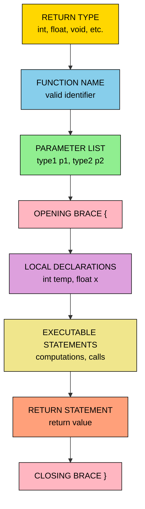
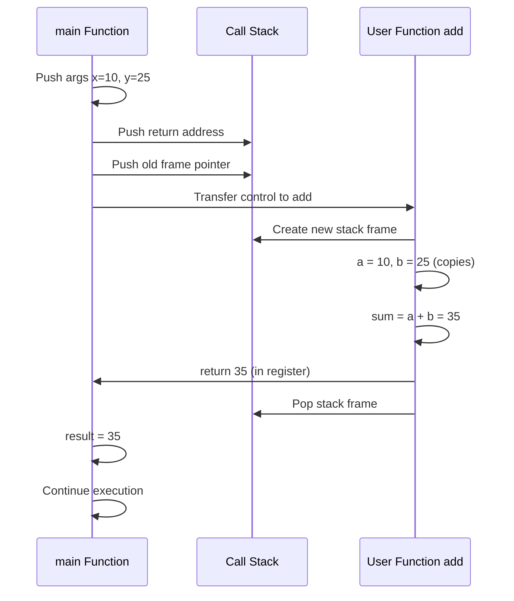
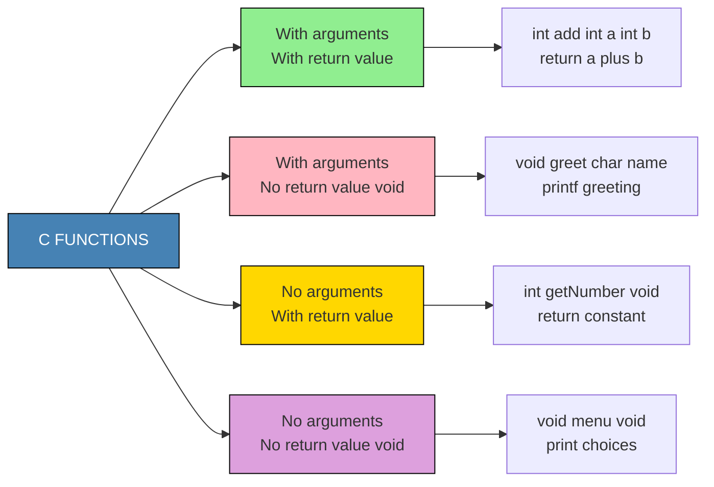
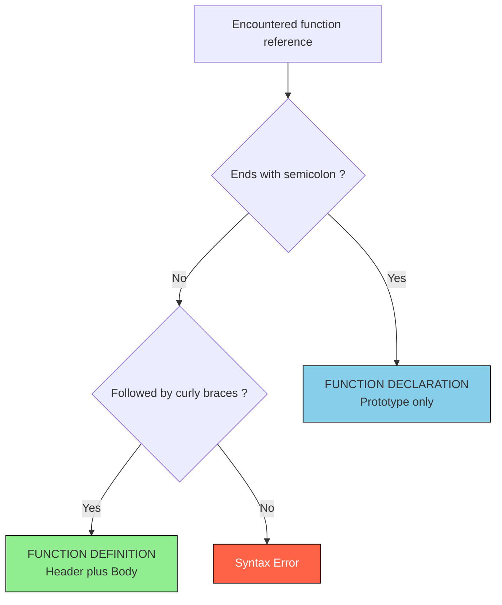
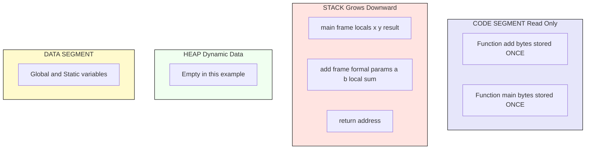

# Functions - Function definition

<!-- SECTION_1_START -->
# 1. Core Technical Definition & Intuitive Overview

## 1.1 Formal KTU 2024 Definition

> [!IMPORTANT]
> **Function Definition (KTU 2024 Syllabus Terminology):**
> A *function definition* in C is a self-contained, named block of statements that performs a specific, well-defined task. It provides the **actual implementation** (the body) of a function, in contrast to a *function declaration* (prototype) which only announces the function's signature to the compiler. A function definition consists of two essential parts: the **function header** (return type, function name, and parameter list) and the **function body** (a pair of curly braces enclosing declarations and executable statements).

A function definition has the canonical ANSI C syntax:

```c
return_type function_name(parameter_type1 param1, parameter_type2 param2, ...)
{
    /* local variable declarations */
    /* executable statements */
    return (value);
}
```

> [!NOTE]
> **KTU 2024 Board Examiner's Note:**
> In the **KTU 2024 Scheme**, students are *expected* to clearly distinguish between three terms that are frequently confused:
> 1. **Function Declaration** (Prototype) — introduces the function to the compiler.
> 2. **Function Definition** — provides the actual body/implementation.
> 3. **Function Call** — invokes the function from `main()` or another function.
> A *function definition* is a **declaration + body**, and it can legally appear *before* or *after* `main()`.

---

## 1.2 Conceptual Analogy / Intuition

Imagine a **vending machine** in your college canteen.

| Machine Element | C Function Equivalent |
|---|---|
| Slot where you insert money | **Arguments / Parameters** (input) |
| Internal mechanism that selects and drops the snack | **Function Body** (the algorithm) |
| The dispensed snack / change returned | **Return value** (output) |
| The label on the front ("Coke – ₹20") | **Function name & signature** |
| The "OUT OF ORDER" sign | **Return type `void`** (no output) |

You don't need to know *how* the machine works internally — you just need to know its **name**, **what to feed it**, and **what you get back**. A C function works exactly the same way. The *definition* is the engineer's blueprint that tells the compiler *how* the machine is built internally.

### Real-World Engineering Analogy — Modular Hardware

Think of a **function** as an **IC (Integrated Circuit) chip** on a motherboard:
- The **pin layout** (Vcc, GND, Input, Output pins) = the **function header**.
- The **internal silicon layout** = the **function body**.
- The **datasheet** describing the chip = the **function prototype/declaration**.

Once designed (defined), the chip can be used *anywhere* on the board (called from multiple places) without redesign.

> [!TIP]
> **Memorization Hook for KTU Exam:**
> *"**Definition = Header + Body**."*
> The header is what the compiler sees first; the body is what it stores in memory as executable code.

---

## 1.3 Why Function Definitions Matter in C

| Reason | Engineering Significance |
|---|---|
| **Modularity** | Breaks large monolithic programs into logical, testable units. |
| **Reusability** | A single function can be invoked (called) thousands of times from different parts of a program. |
| **Abstraction** | Hides implementation details from the caller — a core OOP-adjacent principle. |
| **Team Development** | One programmer writes the *definition*, another writes the *calling code* using only the prototype. |
| **Memory Efficiency** | Function code is stored **once** in the code segment; each call reuses the same code. |

> [!NOTE]
> **Geometric / Visual Note:**
> C is a *procedural* language. Function definitions are the **only mechanism** (besides the preprocessor) by which you can break a C program into multiple files. There are no "classes" or "methods" in C — *every function is a global, top-level entity*.

<!-- SECTION_1_END -->

<!-- SECTION_2_START -->
# 2. Deep Theoretical Analysis & KTU High-Yield Formula Sheet

## 2.1 Anatomy of a Function Definition — The Five Building Blocks

A complete C function definition is composed of **five** mandatory or optional building blocks. KTU examiners *frequently* ask students to label a given function — memorize this structure.

1. **Return Type** — The data type of the value the function hands back to the caller.
2. **Function Name** — A valid C identifier following naming rules (letters, digits, underscore; must not start with a digit; cannot be a keyword).
3. **Parameter List (Formal Parameters)** — Comma-separated declarations of inputs the function accepts. Can be empty (`void`).
4. **Function Body** — A compound statement `{ ... }` containing local declarations and executable statements.
5. **Return Statement** — Transfers control back to the caller, optionally returning a value.

---

## 2.2 Logical Step-by-Step Lifecycle of a Function Definition

The compiler processes a function definition in a specific order. Understanding this flow prevents the common KTU pitfall of using a function *before* it is defined.

**Step 1 — Storage Class & Return Type Parsed:**
The compiler allocates the function's *return slot* size based on the data type (e.g., `int` → 2 or 4 bytes, `float` → 4 bytes, `double` → 8 bytes, `void` → 0 bytes output).

**Step 2 —Function Name Registered:**
The function name is entered into the **symbol table** with its address, parameter signature, and return type. This is what enables the linker to resolve external calls.

**Step 3 — Parameter List Decoded:**
Formal parameters become **local variables** of the function. They are allocated on the **stack frame** when the function is called, and deallocated when the function returns.

**Step 4 — Function Body Compiled:**
Statements inside `{}` are translated into intermediate code, then assembly. Local variables declared inside become part of the function's **activation record** (stack frame).

**Step 5 — Return Statement Generates Epilogue:**
The compiler emits code to:
- Place the return value (if any) in a designated register (e.g., `EAX` on x86).
- Restore the stack pointer (`EBP`).
- Jump back to the address stored by the caller (the **return address**).

---

## 2.3 Categories of Functions in C

| Category | Definition Example | KTU Exam Tip |
|---|---|---|
| **Library Functions** | `printf()`, `scanf()`, `sqrt()`, `strlen()` | Pre-defined; declared in header files (`<stdio.h>`, `<math.h>`). Definition lives in libc. |
| **User-Defined Functions** | `int add(int a, int b) { ... }` | Written by the programmer; the *focus* of Module 3. |
| **With arguments & return value** | `int add(int a, int b) { return a+b; }` | Most general form. |
| **With arguments & no return value** | `void greet(char name[]) { printf("Hi %s", name); }` | Returns nothing — uses `void`. |
| **No arguments & with return value** | `int getNumber() { return 42; }` | Parameter list is `void` or empty. |
| **No arguments & no return value** | `void menu() { ... }` | Pure procedure; cannot participate in expressions. |

> [!IMPORTANT]
> **KTU 2024 — Common Confusion Clarified:**
> - In C89/C90, an empty parameter list `int foo()` means "**unspecified** parameters" (NOT no parameters). To explicitly say "no parameters", use `int foo(void)`.
> - In **C99 and later** (which KTU 2024 follows), `int foo()` is interpreted as `int foo(void)`, but **best practice** and the KTU-expected style is to **always write `void`** explicitly.

---

## 2.4 KTU High-Yield Formula Sheet / Cheat Sheet

| Element | Syntax Rule | Default if Omitted | Example |
|---|---|---|---|
| Return Type | Mandatory data type keyword | `int` (in K&R C only — **never** rely on this in KTU exams) | `float`, `int`, `char`, `void`, `double` |
| Function Name | Valid identifier, unique in scope | — | `calculateSum`, `print_menu` |
| Parameter List | `(type1 p1, type2 p2, ...)` or `(void)` | `void` (in modern C) | `(int x, int y)` |
| Function Body | `{ /* declarations */ /* statements */ }` | — | `{ return x+y; }` |
| Return Statement | `return expression;` or `return;` (for `void`) | Falls off end → **undefined behavior** if return type is non-`void` | `return result;` |
| Calling Convention | Pass-by-value (default) | — | `c = add(a, b);` |
| Scope of Local Variables | Block scope (lifetime = function call) | — | `int temp = 0;` |
| Recursion Allowed? | **Yes** — a function can call itself | — | `int fact(int n) { ... }` |
| Nested Function Definitions? | **No** — C does not allow defining a function inside another function | — | (Compile error) |

### Critical Syntax Rules (Frequently Tested)

> [!WARNING]
> **KTU Examiner's Pitfall:**
> 1. You **cannot** define a function *inside* another function in C. (Unlike Python.)
> 2. The function name + parameter list together is called the **signature**. The signature is what the linker uses to match calls.
> 3. A function defined with return type other than `void` **must** return a value via a `return` statement.

### Memory Layout During Execution

$$
\underbrace{\text{Code Segment}}_{\text{function bytes stored once}} \quad \longleftrightarrow \quad \underbrace{\text{Stack Frame}}_{\text{allocated per call}}
$$

When a function is called:
- A new **stack frame (activation record)** is pushed onto the call stack.
- The frame contains: **return address**, **saved frame pointer**, **formal parameters**, and **local variables**.
- When the function returns, the frame is popped, and the **return value** is passed back (typically in a CPU register).

---

## 2.5 Real-World Utility

In production software engineering, function definitions underpin:

- **Operating Systems** — Each system call (e.g., `fork()`, `read()`) is a function defined in the Linux kernel.
- **Embedded Systems** — In an Arduino sketch, `void setup()` and `void loop()` are user-defined function definitions executed by the microcontroller.
- **Compilers** — Lexers and parsers in GCC/Clang are massive forests of function definitions.
- **Game Engines** — `update()`, `render()`, `physics_step()` are all function definitions called every frame.

<!-- SECTION_2_END -->

<!-- SECTION_3_START -->
# 3. Step-by-Step Derivations & Code/Symbolic Implementation

## 3.1 The Canonical First Function — `add(int, int)`

We will derive, line by line, the most frequently asked function definition in KTU examinations.

**Problem Statement:** Write a function definition named `add` that accepts two integers and returns their sum.

### Step-by-Step Build-Up

**Line 1 — Choose the Return Type:**
The result of adding two integers is itself an integer.
→ Return type = `int`

**Line 2 — Choose the Function Name:**
A descriptive name following identifier rules.
→ Name = `add`

**Line 3 — Define the Parameter List:**
Two integers are required as inputs.
→ Parameters = `(int a, int b)`

**Line 4 — Write the Function Body:**
Inside curly braces, compute the sum and return it.

**Final Assembled Function Definition:**

```c
int add(int a, int b)
{
    int sum;
    sum = a + b;
    return sum;
}
```

> [!NOTE]
> **KTU Valuation Note:** A common 1-mark deduction occurs when students write `return a+b;` *without first declaring* the local `sum` variable — examiners want to see the local declaration step. Always declare local variables at the top of the body.

### Equivalent More Concise Form (Also Acceptable)

```c
int add(int a, int b)
{
    return a + b;
}
```

Both definitions are *semantically identical*. The compiler optimizes away the temporary `sum` variable in release builds.

---

## 3.2 Full Working Program Demonstrating Function Definition + Call

```c
#include <stdio.h>

/* ---------- Function Definition ---------- */
int add(int a, int b)             /* function header */
{                                  /* start of function body */
    int sum;                      /* local variable declaration */
    sum = a + b;                  /* executable statement */
    return sum;                   /* return statement */
}
/* ---------- End of Function Definition ---------- */

int main(void)                    /* main function definition */
{
    int x, y, result;             /* local variables in main */
    x = 10;
    y = 25;
    result = add(x, y);           /* function CALL */
    printf("Sum = %d\n", result);
    return 0;
}
```

### Line-by-Line Trace (Mental Compilation)

| Line | What Happens in Memory |
|---|---|
| `int add(int a, int b) {` | Compiler reserves a code label `add`; sets up its activation record template. |
| `int sum;` | (Inside `add`) When called, a 4-byte (typically) integer slot is allocated on the stack. |
| `sum = a + b;` | CPU performs `ADD` instruction; result stored in `sum`. |
| `return sum;` | Value moved to `%eax` (x86) / `w0` (ARM); stack frame popped; control jumps back to `main`. |
| `result = add(x, y);` | In `main`, the return value is captured into `result`. |
| `printf(...)` | Prints `Sum = 35`. |

---

## 3.3 Exhaustive Variants — All Four Categories

The KTU 2024 syllabus explicitly requires students to identify and write all four function categories. Here is a complete, runnable Python-translatable demonstration (note: this is the **C** code; Python syntax shown later for algorithmic clarity).

### Variant A — With arguments, with return value

```c
#include <stdio.h>

int square(int n)            /* takes int, returns int */
{
    return n * n;
}

int main(void)
{
    int num = 7;
    int result = square(num);
    printf("Square of %d = %d\n", num, result);
    return 0;
}
```

**Output:**
```
Square of 7 = 49
```

### Variant B — With arguments, no return value (`void`)

```c
#include <stdio.h>

void greet(char name[])      /* takes char array, returns nothing */
{
    printf("Hello, %s! Welcome to KTU.\n", name);
}

int main(void)
{
    greet("Aravind");
    return 0;
}
```

**Output:**
```
Hello, Aravind! Welcome to KTU.
```

> [!IMPORTANT]
> **KTU 2024 Rule:** If return type is `void`, the function **cannot** be used in an expression (e.g., `int x = greet("A");` is a **compile error**).

### Variant C — No arguments, with return value

```c
#include <stdio.h>
#include <stdlib.h>
#include <time.h>

int rollDie(void)            /* takes nothing, returns int */
{
    return (rand() % 6) + 1;
}

int main(void)
{
    srand((unsigned int)time(NULL));
    printf("You rolled: %d\n", rollDie());
    return 0;
}
```

### Variant D — No arguments, no return value

```c
#include <stdio.h>

void printMenu(void)
{
    printf("---- MAIN MENU ----\n");
    printf("1. Add\n");
    printf("2. Subtract\n");
    printf("3. Exit\n");
}

int main(void)
{
    printMenu();
    return 0;
}
```

---

## 3.4 Algorithmic Python Equivalent (For Conceptual Clarity)

The following is provided *only* to reinforce the algorithmic structure — KTU exams test C, not Python.

```python
from typing import NoReturn

# Variant A: with arguments and return value
def square(n: int) -> int:
    """Returns the square of an integer."""
    if not isinstance(n, int):
        raise TypeError("square() requires an integer argument")
    return n * n

# Variant B: with arguments, no return value
def greet(name: str) -> None:
    """Prints a greeting; returns nothing."""
    if len(name) == 0:
        raise ValueError("Name cannot be empty")
    print(f"Hello, {name}! Welcome to KTU.")

# Variant C: no arguments, with return value
import random
def roll_die() -> int:
    """Simulates a 6-sided die roll."""
    return random.randint(1, 6)

# Variant D: no arguments, no return value
def print_menu() -> None:
    """Displays the main menu."""
    print("---- MAIN MENU ----")
    print("1. Add")
    print("2. Subtract")
    print("3. Exit")

# Demonstration of the call-return contract
if __name__ == "__main__":
    print(f"Square of 7 = {square(7)}")
    greet("Aravind")
    print(f"You rolled: {roll_die()}")
    print_menu()
```

### Step-by-Step Trace of `square(7)` Call in Python

| Step | Action | Internal State |
|---|---|---|
| 1 | Function `square` defined | `square` object exists in global namespace |
| 2 | `square(7)` invoked | New stack frame pushed; `n` bound to `7` |
| 3 | Type check executed | `n` is `int` → passes |
| 4 | `return n * n` evaluated | `7 * 7 = 49` |
| 5 | Return value passed back | Stack frame popped; `49` returned |
| 6 | f-string formatted | `"Square of 7 = 49"` |
| 7 | `print()` invoked | Output displayed |

---

## 3.5 Formal Definition of "Call by Value" — The Default Mechanism

When a function is called, C copies the *actual* argument values into the *formal* parameters. This is called **pass-by-value**.

**Mathematical Representation:**

$$
\text{formal\_param} \leftarrow \text{copy\_of}(\text{actual\_argument})
$$

**Implication:** Modifications to the formal parameter inside the function do **NOT** affect the caller's variable.

### Worked Example — Pass-by-Value Demonstration

```c
#include <stdio.h>

void tryToModify(int x)
{
    x = 100;                  /* changes LOCAL copy only */
    printf("Inside function: x = %d\n", x);
}

int main(void)
{
    int x = 5;
    printf("Before call: x = %d\n", x);
    tryToModify(x);
    printf("After call: x = %d\n", x);
    return 0;
}
```

**Output:**
```
Before call: x = 5
Inside function: x = 100
After call: x = 5
```

> [!IMPORTANT]
> **KTU 2024 — High-Yield Exam Question:**
> "Explain why the value of `x` in `main` remains `5` even after `tryToModify(x)` is called." → **Answer:** Because C uses pass-by-value; the function receives a *copy* of `x`, and modifications to the copy do not propagate to the original variable in `main`.

---

## 3.6 Formal Definition of Function Signature

The **function signature** (also called the function's *type*) is the combination of:

$$
\text{Signature} = \text{function\_name} + \text{parameter\_type\_list}
$$

> [!NOTE]
> **Critical Rule:** The return type is **NOT** part of the signature in C. Two functions with the same name and parameter types but different return types are **illegal** in C (unlike C++ where overloading is allowed).

**Example — Illegal in C (compile error):**
```c
int  process(int x);
float process(int x);   /* ERROR: redefinition of 'process' */
```

---

## 3.7 Function Definition vs Function Declaration — The Definitive Table

| Aspect | Function Declaration (Prototype) | Function Definition |
|---|---|---|
| Ends with | Semicolon `;` | Curly braces `{ ... }` |
| Contains body? | No | Yes |
| Purpose | Informs compiler about function's existence & signature | Provides actual implementation |
| Syntax | `int add(int, int);` | `int add(int a, int b) { return a+b; }` |
| Occurrence | Often in header files (`.h`) | In source files (`.c`) |
| Compiler behavior | Stores signature in symbol table | Allocates code in text segment |
| Required for | Functions called *before* they are defined | Every function used in the program |

> [!TIP]
> **KTU 2024 — Quick Rule of Thumb:**
> If you see a line ending in `;` with parentheses, it's a **declaration**.
> If you see a line followed by `{ ... }` with a `return` inside, it's a **definition**.

<!-- SECTION_3_END -->

<!-- SECTION_4_START -->
# 4. Structural Diagrams & Schematics

## 4.1 Anatomy of a Function Definition — Labeled Block Diagram



---

## 4.2 Function Call and Return — Runtime Stack Frame Flow



---

## 4.3 Four Categories of Functions — Classification Topology



---

## 4.4 Function Definition vs Declaration — Decision Tree



---

## 4.5 Memory Layout During Function Execution



> [!NOTE]
> **Interpretation:** Function *code* lives **once** in the code segment. Each *invocation* creates a fresh **stack frame** in the stack segment. This is why recursion (a function calling itself) can exhaust stack memory if the recursion depth is too large.

<!-- SECTION_4_END -->

<!-- SECTION_5_START -->
# 5. KTU 2024 Scheme Examination Question Bank & Topic Recap

---

## PART A — Short Answer Questions (3 Marks Each)

### Question 1
**[KTU University Exam – July 2024 | CO1 | Remember]**
*Define a function in C. List the essential elements of a function definition.*

**Model Answer (3 Marks):**

> A function in C is a self-contained block of statements that performs a specific task and may return a value to the calling function.
> **[Definition: 1 Mark]**
>
> Essential elements of a function definition are:
> 1. **Return Type** — specifies the data type of the value returned.
> 2. **Function Name** — a valid identifier used to call the function.
> 3. **Parameter List** — declares the inputs (formal parameters).
> 4. **Function Body** — enclosed in `{}`, contains declarations and statements.
> 5. **Return Statement** — passes a value back to the caller (optional for `void`).
> **[Listing 5 elements: 2 Marks]**

---

### Question 2
**[KTU University Exam – Dec 2023 | CO1 | Understand]**
*What is the difference between a function definition and a function declaration in C? Give one example of each.*

**Model Answer (3 Marks):**

| Aspect | Function Declaration | Function Definition |
|---|---|---|
| Purpose | Announces signature to compiler | Provides actual implementation |
| Ends with | Semicolon `;` | Curly braces `{ }` |
| Body present? | No | Yes |

**[Tabular distinction: 2 Marks]**

**Example of Declaration:**
```c
int add(int, int);            /* prototype only */
```
**[Example: 0.5 Mark]**

**Example of Definition:**
```c
int add(int a, int b) { return a + b; }   /* full implementation */
```
**[Example: 0.5 Mark]**

---

## PART B — Long Answer Questions (14 Marks Each, Internal Choice)

### Question A — Choice 1

**[KTU University Exam – July 2024 | CO2 | Apply]**

**(a)** Explain the four categories of user-defined functions in C with suitable examples.
**(7 Marks)**

**(b)** Write a complete C program that defines a function `int maxOfThree(int, int, int)` which returns the largest of three integers. Invoke it from `main()` and display the result. **(7 Marks)**

---

### Model Solution for Question A

#### Part (a) — Four Categories of Functions

**[Introduction: 1 Mark]**
C allows four possible combinations of arguments and return values in user-defined functions.

**Category 1: With arguments, with return value**
```c
int square(int n) { return n * n; }
```
*Example:* Computing the square of a number and returning it.
**[Category 1 explanation: 1 Mark]**

**Category 2: With arguments, no return value (`void`)**
```c
void greet(char name[]) { printf("Hello %s", name); }
```
*Example:* Printing a greeting; nothing is returned.
**[Category 2 explanation: 1 Mark]**

**Category 3: No arguments, with return value**
```c
int getCurrentYear(void) { return 2024; }
```
*Example:* Fetching the current year; takes no input.
**[Category 3 explanation: 1 Mark]**

**Category 4: No arguments, no return value (`void`)**
```c
void printMenu(void) { printf("1. Add\n2. Exit\n"); }
```
*Example:* Displaying a menu; pure procedure.
**[Category 4 explanation: 1 Mark]**

**[Conclusion / use-case note: 1 Mark]**
These four categories cover all possible function signatures in C and are the basis for modular program design.

---

#### Part (b) — `maxOfThree` Function Program

```c
#include <stdio.h>

/* Function definition: returns the largest of three integers */
int maxOfThree(int a, int b, int c)
{
    int max;
    if (a >= b && a >= c) {
        max = a;
    } else if (b >= a && b >= c) {
        max = b;
    } else {
        max = c;
    }
    return max;
}

int main(void)
{
    int x, y, z, result;
    printf("Enter three integers: ");
    scanf("%d %d %d", &x, &y, &z);
    result = maxOfThree(x, y, z);     /* function call */
    printf("The largest is: %d\n", result);
    return 0;
}
```

**Valuation Key (Incremental Marks):**

| Component | Marks |
|---|---|
| Correct function header with return type `int` and three `int` parameters | 1 |
| Correct function body logic (using `if-else` ladder or nested `if`) | 2 |
| Correct `return` statement | 1 |
| Correct `main` function with variable declarations and `scanf` | 1.5 |
| Correct function call `maxOfThree(x, y, z)` and storing return value | 1 |
| Correct `printf` for output | 0.5 |
| **Total** | **7** |

**Sample Run:**
```
Enter three integers: 12 45 23
The largest is: 45
```

---

### Question B — Choice 2 (Alternative)

**[KTU University Exam – Dec 2023 | CO2 | Apply]**

**(a)** Explain the term *function prototype* with an example. State any two rules for writing prototypes.
**(7 Marks)**

**(b)** Write a C program with a function `void swap(int, int)` that swaps two numbers using a temporary variable. Call it from `main()` and display the values before and after the swap.
**(7 Marks)**

---

### Model Solution for Question B

#### Part (a) — Function Prototype

**[Definition: 2 Marks]**
A *function prototype* (also called a *function declaration*) is a statement that informs the compiler about:
- The function's **name**
- Its **return type**
- The **number and types of parameters**

It ends with a semicolon and contains no function body.

**Example:**
```c
float area(float radius);
```

**[Example: 1 Mark]**

**Two Rules for Writing Prototypes:**
1. **Parameter names are optional** in prototypes — only types are mandatory.
   `int add(int, int);` is equivalent to `int add(int x, int y);`
   **[Rule 1: 2 Marks]**
2. **Prototypes must appear before the function is called.** A call to a function whose prototype has not been seen triggers a warning (in C99) or an implicit-`int` assumption (in legacy C). Best practice: place prototypes at the top of the file or in a header.
   **[Rule 2: 2 Marks]**

---

#### Part (b) — `swap` Function Program

```c
#include <stdio.h>

/* Function definition: swap two integers by value */
void swap(int a, int b)
{
    int temp;
    temp = a;
    a = b;
    b = temp;
    printf("Inside swap: a = %d, b = %d\n", a, b);
}

int main(void)
{
    int x = 10, y = 20;
    printf("Before swap: x = %d, y = %d\n", x, y);
    swap(x, y);                          /* pass by value */
    printf("After swap: x = %d, y = %d\n", x, y);
    return 0;
}
```

**Valuation Key (Incremental Marks):**

| Component | Marks |
|---|---|
| Correct function header `void swap(int, int)` | 1 |
| Use of temporary variable `temp` for swap logic | 2 |
| Correct three-step swap (`temp = a; a = b; b = temp;`) | 1.5 |
| `main` function with `x = 10, y = 20` and `printf` calls | 1.5 |
| Correct function call and demonstration of pass-by-value | 1 |
| **Total** | **7** |

**Sample Output:**
```
Before swap: x = 10, y = 20
Inside swap: a = 20, b = 10
After swap: x = 10, y = 20
```

> [!WARNING]
> **KTU Examiner's Valuation Warning — Common Pitfalls on `swap`:**
> 1. **Do not forget `void` as the return type.** Many students write `int swap(...)` and then return nothing — this is a **compile-time error**.
> 2. **Do not claim the original variables are swapped in `main`.** C passes by *value*; the originals `x` and `y` in `main` remain unchanged. This is a *favourite trick question* in KTU exams. To actually swap the originals, you would need **pointers** (`int *a, int *b`) — which is a later module.
> 3. **Always print both "before" and "after"** values to demonstrate the pass-by-value behavior — examiners award 1 mark specifically for this contrast.

---

## Topic Recap & Important Things to Remember

> [!TIP]
> **Use this section as your final 5-minute revision cheat sheet before the exam.**

- **Definition:** A function definition = **header** (return type + name + parameters) + **body** (`{ ... }`).
- **Return type is mandatory** in modern C; only legacy K&R C defaults to `int`.
- **Use `void`** explicitly when there are no parameters OR no return value.
- **Four categories:** (1) args + return, (2) args + no return, (3) no args + return, (4) no args + no return.
- **Library functions** are predefined (in `<stdio.h>`, `<math.h>`, etc.); **user-defined** functions are written by the programmer.
- **Function declaration** (prototype) ends with `;`; **function definition** ends with `{ }`.
- **You cannot define a function inside another function** in C — top-level only.
- **Pass-by-value is the default** in C — formal parameters are *copies*; modifications do not affect caller's variables.
- **Function signature** = name + parameter type list (return type is *not* part of the signature in C).
- **C does not support function overloading** — two functions with the same name and parameter types is a compile error, regardless of return type.
- **Local variables** declared inside the function body have **block scope** and lifetime equal to one function call.
- **The `return` statement** transfers control back to the caller and optionally passes a value.
- **A non-`void` function must have a `return` statement** on every code path; falling off the end is undefined behavior.
- **Memory:** Function code lives in the **code segment** (once); each call creates a fresh **stack frame** in the stack segment.
- **Recursive functions** are allowed in C; each recursive call gets its own stack frame.
- **Naming rules:** Function names follow identifier rules — letters, digits, underscore; must not start with a digit; cannot be a C keyword.
- **Common header files:** `<stdio.h>` (printf, scanf), `<math.h>` (sqrt, pow), `<string.h>` (strlen, strcpy), `<stdlib.h>` (malloc, rand).

<!-- SECTION_5_END -->
