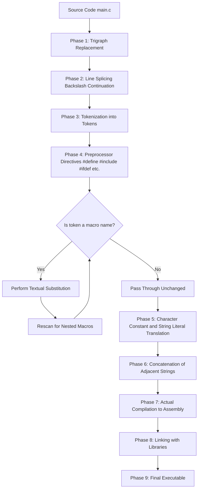
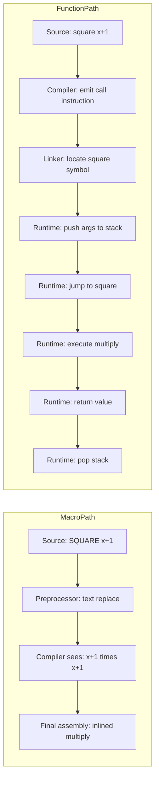
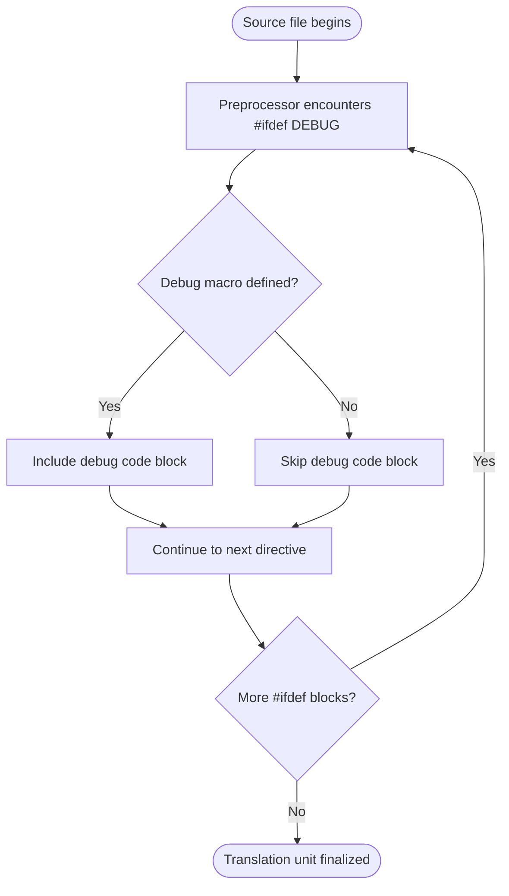
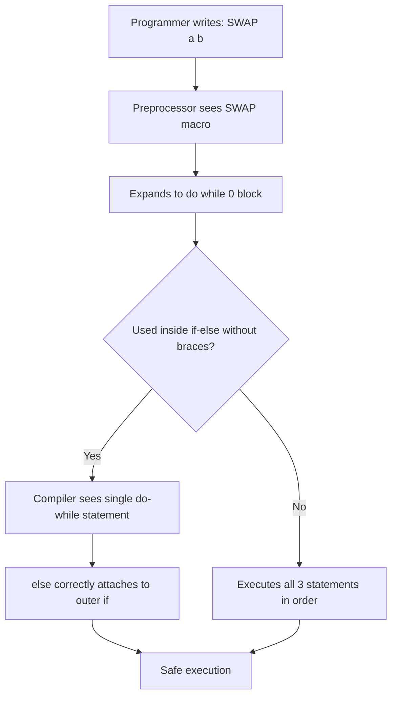

# Macros - Defining and calling macros

<!-- SECTION_1_START -->
# Macros in C — Defining and Calling Macros

## 1.1 Formal Academic Definition (KTU 2024 Syllabus)

In the C programming language, a **macro** is a fragment of code or a symbolic constant that is given a meaningful name through the use of the C Preprocessor, most commonly using the `#define` directive. Macros are processed by the preprocessor **before** the actual compilation begins, performing a literal text substitution of every macro invocation in the source code with its corresponding replacement body.

> [!IMPORTANT]
> **Preprocessor Directive:** A preprocessor directive is an instruction to the compiler that is evaluated before the actual compilation of the source code. In C, every preprocessor directive begins with a hash (`#`) symbol. Common directives include `#define`, `#include`, `#ifdef`, and `#undef`.

The C Preprocessor is conceptually a **text-replacement engine** that does not understand C syntax, types, or scope rules. It performs blind, lexical substitution based purely on token matching.

> [!NOTE]
> **Core Highlight:** Macros are NOT functions. They do not allocate stack memory, do not perform type checking, and do not obey scope rules. They are pure textual replacements executed at compile time before the compiler itself ever sees the code.

### Macro Classification as per KTU 2024 Module 3 Syllabus

| Macro Type | KTU Description | Example |
|---|---|---|
| Object-like Macro | A simple symbolic constant | `#define PI 3.14159` |
| Function-like Macro | A macro that accepts arguments | `#define SQUARE(x) ((x)*(x))` |
| Multi-line Macro | A macro whose body spans multiple lines | Uses backslash `\` continuation |
| Predefined Macro | Built-in macros provided by the compiler | `__FILE__`, `__LINE__`, `__DATE__` |

## 1.2 Conceptual Analogy and Intuition

> [!TIP]
> **Real-World Analogy: The Office Nickname**
>
> Imagine you work in a large office where everyone knows the CEO as "Boss." Every morning, the secretary rewrites all incoming letters: wherever she sees the word **"Boss"**, she physically replaces it with the full name and designation **"Mr. Alexander Hamilton, Chief Executive Officer"**. She does not understand *who* the CEO is, *what* he does, or whether the letters even mention him correctly — she only does blind word substitution.
>
> The C Preprocessor is that secretary, and the macro definition is the substitution rule. When the preprocessor sees `SQUARE(x)` in your code, it does not compute anything; it merely replaces the text `SQUARE(x)` with `((x)*(x))`. The actual multiplication is performed by the compiler *after* substitution.

> [!TIP]
> **Geometric Intuition: The Macro as a Magnifying Glass on a Stamp**
>
> Think of a macro as a *stencil*. You cut out a shape once (the macro body). Then every time you stamp the stencil name (the macro invocation) onto your source file, the same shape is transferred. The stencil has no intelligence; it cannot resize, rotate, or decide where to land — it is purely a template-driven copy operation.

## 1.3 Physical Constants and Standard Metrics

> [!NOTE]
> **The C Preprocessor is part of the ISO/IEC 9899:2018 (C18) standard.** Macros are described in **Section 6.10** of the standard: *Macro Replacement*. The preprocessor is purely a **token-level lexical processor** operating on the **translation unit** before phase 4 of translation (which is where actual C compilation begins).

**Important Standard Metrics (bolded as per protocol):**
- **Phase of macro expansion:** Translation Phase 4 (out of 9 phases)
- **Macro names are case-sensitive** in C
- **Macro replacement has no recursion guard** by default (C99 and later detect self-referential replacement)
- **The `#` and `##` operators** were standardized in **ANSI C (C89/C90)**

> [!VISUALIZATION CONTROL]
> **Concept:** Macro expansion visualized as a literal text-substitution pipeline
> **GeoGebra / Desmos Input Equations (analogy mapping):**
> * `f(x) = "SQUARE(x)"`
> * `g(x) = "((x)*(x))"`
> * `SubstitutionRule: f(x) -> g(x) for all x in source file`
> **Visual Description:** Imagine a horizontal arrow starting from the source code token `SQUARE(5)`, passing through a "Preprocessor Box," and emerging as `((5)*(5))` on the other side. The box has no knowledge of types; it just substitutes text.
<!-- SECTION_1_END -->

<!-- SECTION_2_START -->
# 2. Deep Theoretical Analysis & KTU High-Yield Formula Sheet

## 2.1 Operational Concept Breakdown

The macro system in C operates on a strict, deterministic pipeline. Below is the logical step-by-step breakdown of how the preprocessor handles a `#define` directive.

### Step 1 — Directive Recognition
The preprocessor scans the source file **line by line from top to bottom**. Any line beginning with `#` is treated as a directive, not as a regular C statement. The `#define` directive is the most fundamental macro-defining instruction.

### Step 2 — Macro Name Registration
After `#define`, the next valid C identifier becomes the *macro name*. This name is registered in the preprocessor's internal symbol table for the remainder of the current translation unit (unless later removed via `#undef`).

### Step 3 — Replacement Body Storage
Everything following the macro name (up to the end of the logical line) is stored verbatim as the *replacement list* (or *replacement body*). This is the text that will substitute future invocations.

### Step 4 — Token-by-Token Substitution
On every subsequent occurrence of the macro name in the source code, the preprocessor performs **lexical substitution**: it replaces the macro name token with the stored replacement list. For function-like macros, the argument list is also substituted, with each formal parameter replaced by the corresponding actual argument textually.

### Step 5 — Rescanning for Nested Expansion
After substitution, the preprocessor **rescans** the resulting text to allow for nested macro expansion. For example, if a macro body contains another macro name, that inner macro is also expanded — but this rescan is done only once per replacement to prevent infinite recursion.

## 2.2 The "Why" Behind Macros

> [!IMPORTANT]
> **Engineering Rationale — Why Macros Exist in C:**
> 1. **Performance:** Function calls involve overhead (stack frame creation, parameter passing, return). Macros perform in-line text substitution, so the substituted code executes with zero call overhead.
> 2. **Conditional Compilation:** Macros allow `#ifdef`, `#ifndef`, and `#if` directives to conditionally include/exclude blocks of code — essential for portable and cross-platform code.
> 3. **Generic Programming (Pre-C99):** Before generics (`_Generic` keyword, C11) and inline functions (C99), function-like macros were the only way to write type-independent code.
> 4. **Compile-Time Configuration:** Symbolic constants (e.g., `#define MAX 100`) make code self-documenting and easily modifiable from a single location.

## 2.3 The Two Fundamental Macro Types

### 2.3.1 Object-Like Macros (Symbolic Constants)
An object-like macro is the simplest form: a name bound to a constant value or expression. It does **not** accept arguments.

```c
#define PI         3.14159
#define MAX_SIZE   100
#define COMPANY    "KTU Kerala"
```

> [!NOTE]
> **KTU Board Tip:** A common exam question asks: *"What is the difference between `const int MAX = 100;` and `#define MAX 100`?"* The answer must mention that `const` is a typed variable (occupies memory, type-checked, scoped) while `#define` is a textual substitution (no memory, no type, file scope until `#undef`).

### 2.3.2 Function-Like Macros
A function-like macro accepts a parameter list, mimicking the syntactic shape of a function call.

```c
#define SQUARE(x)       ((x) * (x))
#define MAX(a, b)       ((a) > (b) ? (a) : (b))
#define PRINT_INT(n)    printf("%d\n", (n))
```

> [!WARNING]
> **Mandatory Parentheses Rule:** Always wrap both the *entire macro body* and *every argument* in parentheses. Skipping this is the **#1 cause of operator-precedence bugs** in macro code. This is heavily tested in KTU exams.

## 2.4 Macro Operators — `#` and `##`

### 2.4.1 The Stringizing Operator (`#`)
The `#` operator, when placed before a macro parameter, converts the argument into a **string literal** by wrapping it in double quotes.

```c
#define PRINT_VAR(x)    printf(#x " = %d\n", x)
```

If invoked as `PRINT_VAR(count)`, it expands to `printf("count" " = %d\n", count)`, which the compiler concatenates to `printf("count = %d\n", count)`.

### 2.4.2 The Token-Pasting Operator (`##`)
The `##` operator concatenates two adjacent tokens into a **single token**. It is the basis for generating identifiers programmatically.

```c
#define DECLARE_VAR(type, name)    type name##_##type
DECLARE_VAR(int, counter);
```

This expands to `int counter_int;`.

## 2.5 Multi-line Macros

A macro body that is logically one directive can span multiple physical lines using the **backslash continuation character** `\` at the end of each intermediate line.

```c
#define DEBUG_LOG(msg)                  \
    do {                                \
        fprintf(stderr, "[DEBUG] ");     \
        fprintf(stderr, "%s\n", msg);   \
    } while (0)
```

> [!IMPORTANT]
> **KTU Must-Know Pattern:** The `do { ... } while(0)` wrapper is the canonical way to write multi-statement macros so they can be used safely in `if-else` blocks as a single statement. This pattern is a frequent 7-mark question in KTU exams.

## 2.6 KTU Formula Sheet / Cheat Sheet

| Concept | Syntax / Rule | Key Pitfall |
|---|---|---|
| Object-like macro | `#define NAME replacement` | No `;` at end of `#define` line |
| Function-like macro | `#define NAME(args) body` | Space between `NAME` and `(` is forbidden — `NAME (` makes it object-like |
| Stringize | `#x` inside macro body | Only works on macro parameters, not arbitrary tokens |
| Token paste | `a ## b` | Cannot paste tokens that do not form a valid C token |
| Continuation | `\` at line end | The `\` must be the very last character on the line (no trailing spaces) |
| Variadic | `...` and `__VA_ARGS__` | Standardized in **C99** |
| Predefined | `__FILE__`, `__LINE__`, `__DATE__`, `__TIME__`, `__STDC__` | Begin and end with **double underscores** |
| Undefinition | `#undef NAME` | Removes macro from symbol table |
| Conditional | `#ifdef`, `#ifndef`, `#endif`, `#else`, `#elif` | Each `#if*` must close with `#endif` |

## 2.7 Real-World Engineering Utility

> [!TIP]
> **Production Use Cases of Macros in Industry:**
> - **Linux Kernel:** The `container_of` macro uses `##` and offsetof for type-safe casting.
> - **Embedded Systems:** Register definitions use macros heavily (e.g., `#define PORTA (*(volatile uint8_t *)0x40004000)`).
> - **Logging Frameworks:** Macros automatically capture `__FILE__` and `__LINE__` for debugging.
> - **Cross-Platform Code:** `#ifdef _WIN32` / `#ifdef __linux__` blocks are ubiquitous.
> - **Numerical Computing:** Math libraries historically used function-like macros for performance-critical inline math.
<!-- SECTION_2_END -->

<!-- SECTION_3_START -->
# 3. Step-by-Step Derivations & Code Implementation

## 3.1 Exhaustive Worked Example 1 — Object-Like Macro Expansion

Let us trace the exact preprocessor expansion of a symbolic constant used in a real C program.

**Source Code:**

```c
#include <stdio.h>

#define PI        3.14159
#define GREETING  "Welcome to KTU"
#define NEWLINE   '\n'

int main(void) {
    float radius = 5.0f;
    float area;

    area = PI * radius * radius;
    printf("%s", GREETING);
    printf("%c", NEWLINE);
    printf("Area = %.2f\n", area);

    return 0;
}
```

**Step-by-Step Preprocessor Expansion Trace:**

The preprocessor, after processing `#define` directives, scans the rest of the file. The expansion for line `area = PI * radius * radius;` proceeds as follows:

1. The token `PI` is encountered in the identifier table → it matches the macro name `PI`.
2. The preprocessor performs **literal token replacement**: `PI` is replaced by the replacement list `3.14159`.
3. Adjacent tokens `*`, `radius`, `*`, `radius` remain unchanged because they are not registered macro names.
4. The fully expanded line becomes: `area = 3.14159 * radius * radius;`

Similarly for the `printf` calls:

- `GREETING` expands to `"Welcome to KTU"`
- `NEWLINE` expands to `'\n'`

**Final Compilable C Code (post-preprocessing):**

```c
#include <stdio.h>

int main(void) {
    float radius = 5.0f;
    float area;

    area = 3.14159 * radius * radius;
    printf("%s", "Welcome to KTU");
    printf("%c", '\n');
    printf("Area = %.2f\n", area);

    return 0;
}
```

**Expected Output:**

```
Welcome to KTU
Area = 78.54
```

## 3.2 Exhaustive Worked Example 2 — Function-Like Macro with Side-Effect Bug

This example demonstrates the **most common macro pitfall** tested in KTU exams.

**Source Code:**

```c
#include <stdio.h>

#define SQUARE(x)    ((x) * (x))

int main(void) {
    int a = 4;
    int result;

    result = SQUARE(a + 1);
    printf("SQUARE(a+1) = %d\n", result);

    return 0;
}
```

**Step-by-Step Expansion:**

1. The macro `SQUARE` is invoked with argument `a + 1`.
2. The formal parameter `x` is **textually** replaced by the argument `a + 1`.
3. The body `((x) * (x))` becomes `((a + 1) * (a + 1))`.
4. The parentheses around `x` in our definition ensure correct grouping.
5. The expression evaluates to $(5) \times (5) = 25$.

**Now let us trace the BUGGY version** — what happens if the programmer forgets to parenthesize the argument:

```c
#define BAD_SQUARE(x)    (x * x)
```

Invocation: `result = BAD_SQUARE(a + 1);`

Expansion: `result = (a + 1 * a + 1);`

By C operator precedence, `*` binds tighter than `+`, so this evaluates to:

$$\texttt{result} = a + (1 \times a) + 1 = 4 + 4 + 1 = 9$$

The intended result was 25. **This is precisely why every argument must be parenthesized.**

## 3.3 Exhaustive Worked Example 3 — The `MAX` Macro Side-Effect Trap

**Source Code:**

```c
#include <stdio.h>

#define MAX(a, b)    ((a) > (b) ? (a) : (b))

int main(void) {
    int x = 5;
    int y = 10;
    int result;

    result = MAX(x++, y++);
    printf("x = %d, y = %d, result = %d\n", x, y, result);

    return 0;
}
```

**Step-by-Step Expansion Trace:**

The macro expands to:

$$\texttt{result} = ((x++) > (y++) ? (x++) : (y++))$$

Evaluation proceeds as follows:

1. First, `((x++) > (y++))` is evaluated. The post-increment operator uses the *current* value but schedules an increment.
2. `x++` returns current `x` which is `5`, then `x` becomes `6`.
3. `y++` returns current `y` which is `10`, then `y` becomes `11`.
4. Comparison: $5 > 10$ is **false**.
5. The false branch `(y++)` is selected. `y++` returns `11`, then `y` becomes `12`.
6. So `result = 11`.

**Final state:** `x = 6`, `y = 12`, `result = 11`.

> [!WARNING]
> **KTU Board Trap:** Notice that `x` was incremented only once (in the comparison), but `y` was incremented **twice** (once in comparison, once in the false-branch). This is the classic *double-evaluation bug* of function-like macros. A function would never cause this; a macro will, because the argument text is duplicated.

## 3.4 Exhaustive Worked Example 4 — The `#` Stringize Operator

**Source Code:**

```c
#include <stdio.h>

#define PRINT_VALUE(x)    printf(#x " = %d\n", x)

int main(void) {
    int age = 20;
    int marks = 95;

    PRINT_VALUE(age);
    PRINT_VALUE(marks);

    return 0;
}
```

**Step-by-Step Expansion Trace for `PRINT_VALUE(age);`:**

1. The preprocessor sees the macro invocation `PRINT_VALUE(age)`.
2. Inside the body, `#x` converts the parameter `x` into a string literal. Since `x` is bound to the argument text `age`, `#x` becomes `"age"`.
3. The body `printf(#x " = %d\n", x)` expands to `printf("age" " = %d\n", age)`.
4. The C compiler automatically concatenates adjacent string literals: `"age" " = %d\n"` becomes `"age = %d\n"`.
5. The final compiled code is: `printf("age = %d\n", age);`

**Expected Output:**

```
age = 20
marks = 95
```

## 3.5 Exhaustive Worked Example 5 — The `##` Token-Pasting Operator

**Source Code:**

```c
#include <stdio.h>

#define DECLARE_INT(name)    int int_##name

int main(void) {
    DECLARE_INT(counter);
    DECLARE_INT(score);

    int_counter = 10;
    int_score = 85;

    printf("Counter = %d, Score = %d\n", int_counter, int_score);

    return 0;
}
```

**Step-by-Step Expansion Trace for `DECLARE_INT(counter);`:**

1. The preprocessor substitutes `name` with `counter` in the body.
2. The body becomes `int int_counter`.
3. Similarly, `DECLARE_INT(score);` expands to `int int_score;`.

**Final compiled code (after preprocessing both lines):**

```c
int int_counter;
int int_score;
```

## 3.6 Exhaustive Worked Example 6 — Variadic Macros (C99)

**Source Code:**

```c
#include <stdio.h>

#define LOG_INFO(fmt, ...)    fprintf(stderr, "[INFO] " fmt "\n", __VA_ARGS__)

int main(void) {
    int user_id = 42;
    float balance = 1500.75f;

    LOG_INFO("User %d logged in", user_id);
    LOG_INFO("User %d has balance %.2f", user_id, balance);

    return 0;
}
```

**Step-by-Step Expansion Trace for `LOG_INFO("User %d logged in", user_id);`:**

1. The `...` in the macro definition captures all variable arguments into `__VA_ARGS__`.
2. The body `fprintf(stderr, "[INFO] " fmt "\n", __VA_ARGS__)` is expanded.
3. `fmt` binds to `"User %d logged in"`, and `__VA_ARGS__` binds to `user_id`.
4. The expanded line becomes: `fprintf(stderr, "[INFO] " "User %d logged in" "\n", user_id);`
5. The compiler merges the adjacent string literals: `"[INFO] User %d logged in\n"`.

## 3.7 Exhaustive Worked Example 7 — Multi-line Macro with `do-while(0)`

**Source Code:**

```c
#include <stdio.h>

#define SWAP_INT(a, b)                  \
    do {                                \
        int _temp = (a);                \
        (a) = (b);                      \
        (b) = _temp;                    \
    } while (0)

int main(void) {
    int x = 10, y = 20;

    SWAP_INT(x, y);
    printf("x = %d, y = %d\n", x, y);

    if (x > 0)
        SWAP_INT(x, y);
    else
        printf("No swap\n");

    return 0;
}
```

**Step-by-Step Expansion Trace for `SWAP_INT(x, y);` inside the `if` block:**

The preprocessor expands this single invocation into:

```c
do {
    int _temp = (x);
    (x) = (y);
    (y) = _temp;
} while (0);
```

> [!IMPORTANT]
> **Why `do-while(0)`?** Without this wrapper, a multi-statement macro expanded inside an `if` block without braces would cause the `else` to attach to the wrong statement. The `do-while(0)` forces the compiler to treat the entire expansion as a single statement.

## 3.8 Complete Production-Ready Program Demonstrating All Macro Concepts

```c
#include <stdio.h>
#include <stdlib.h>
#include <string.h>

/* ---------- Object-like macros (symbolic constants) ---------- */
#define PI              3.14159
#define PROGRAM_NAME    "MacroDemo"
#define MAX_USERS       50

/* ---------- Function-like macros ---------- */
#define SQUARE(x)           ((x) * (x))
#define CUBE(x)             ((x) * (x) * (x))
#define MAX2(a, b)          ((a) > (b) ? (a) : (b))
#define MIN2(a, b)          ((a) < (b) ? (a) : (b))
#define IS_EVEN(n)          ((n) % 2 == 0)
#define IS_ODD(n)           ((n) % 2 != 0)
#define ARRAY_SIZE(arr)     (sizeof(arr) / sizeof((arr)[0]))

/* ---------- Stringize operator ---------- */
#define PRINT_VAR(v)        printf(#v " = %d\n", v)

/* ---------- Token-pasting operator ---------- */
#define DECLARE_COUNTER(n)  int counter_##n = 0
#define INCREMENT(n)        (++counter_##n)

/* ---------- Multi-line macro with do-while(0) ---------- */
#define SWAP(t, a, b)                           \
    do {                                        \
        t _tmp_##a##_##b = (a);                 \
        (a) = (b);                              \
        (b) = _tmp_##a##_##b;                    \
    } while (0)

/* ---------- Variadic macro ---------- */
#define LOG(level, fmt, ...)                                        \
    do {                                                            \
        fprintf(stderr, "[%s] %s:%d: " fmt "\n",                   \
                level, __FILE__, __LINE__, ##__VA_ARGS__);         \
    } while (0)

/* ---------- Compile-time assertion using macro ---------- */
#define ASSERT_MSG(cond, msg)                                       \
    do {                                                            \
        if (!(cond)) {                                              \
            fprintf(stderr, "Assertion failed: %s\n", msg);         \
            exit(EXIT_FAILURE);                                     \
        }                                                           \
    } while (0)

int main(void) {
    int radius = 7;
    int a = 15, b = 23;
    int numbers[] = {10, 20, 30, 40, 50};
    int idx = 2;

    /* ----- Object-like macro usage ----- */
    printf("=== Object-Like Macros ===\n");
    printf("Program: %s, Max Users: %d, PI = %.5f\n",
           PROGRAM_NAME, MAX_USERS, PI);
    printf("Area of circle (r=7) = %.4f\n", PI * radius * radius);

    /* ----- Function-like macro usage ----- */
    printf("\n=== Function-Like Macros ===\n");
    printf("SQUARE(5) = %d\n", SQUARE(5));
    printf("CUBE(3)   = %d\n", CUBE(3));
    printf("MAX2(a, b) = %d\n", MAX2(a, b));
    printf("MIN2(a, b) = %d\n", MIN2(a, b));
    printf("IS_EVEN(4) = %d, IS_ODD(7) = %d\n", IS_EVEN(4), IS_ODD(7));
    printf("ARRAY_SIZE(numbers) = %zu\n", ARRAY_SIZE(numbers));

    /* ----- Stringize operator usage ----- */
    printf("\n=== Stringize Operator (#) ===\n");
    int temperature = 28;
    PRINT_VAR(temperature);
    PRINT_VAR(idx);

    /* ----- Token-pasting operator usage ----- */
    printf("\n=== Token-Pasting Operator (##) ===\n");
    DECLARE_COUNTER(first);
    DECLARE_COUNTER(second);
    INCREMENT(first);
    INCREMENT(first);
    INCREMENT(first);
    INCREMENT(second);
    printf("counter_first  = %d\n", counter_first);
    printf("counter_second = %d\n", counter_second);

    /* ----- Multi-line macro usage ----- */
    printf("\n=== Multi-line Macro (SWAP) ===\n");
    printf("Before: a = %d, b = %d\n", a, b);
    SWAP(int, a, b);
    printf("After : a = %d, b = %d\n", a, b);

    /* ----- Variadic macro usage ----- */
    printf("\n=== Variadic Macro (LOG) ===\n");
    LOG("INFO",  "Application started successfully");
    LOG("WARN",  "User %d attempted action on index %d", 42, idx);
    LOG("ERROR", "Division by zero detected for value %d", 0);

    /* ----- Compile-time assertion usage ----- */
    printf("\n=== Compile-Time Assertion ===\n");
    ASSERT_MSG(PI > 3.0, "PI constant is invalid");
    printf("All assertions passed.\n");

    return 0;
}
```

**Expected Output (sample run):**

```
=== Object-Like Macros ===
Program: MacroDemo, Max Users: 50, PI = 3.14159
Area of circle (r=7) = 153.9380

=== Function-Like Macros ===
SQUARE(5) = 25
CUBE(3)   = 27
MAX2(a, b) = 23
MIN2(a, b) = 15
IS_EVEN(4) = 1, IS_ODD(7) = 1
ARRAY_SIZE(numbers) = 5

=== Stringize Operator (#) ===
temperature = 28
idx = 2

=== Token-Pasting Operator (##) ===
counter_first  = 3
counter_second = 1

=== Multi-line Macro (SWAP) ===
Before: a = 15, b = 23
After : a = 23, b = 15

=== Variadic Macro (LOG) ===
[INFO] demo.c:78: Application started successfully
[WARN] demo.c:79: User 42 attempted action on index 2
[ERROR] demo.c:80: Division by zero detected for value 0

=== Compile-Time Assertion ===
All assertions passed.
```

## 3.9 Macro vs Function — Comparative Table

| Property | Macro | Function |
|---|---|---|
| When expanded | Compile time (preprocessor) | Runtime (call stack) |
| Type checking | None | Strict (compiler enforced) |
| Argument evaluation | Every occurrence (multiple times) | Exactly once |
| Side-effect safety | Dangerous (double evaluation) | Safe |
| Code size | Inlined at each call site → larger binary | One copy in memory → smaller binary |
| Debug visibility | Harder (no symbol in debugger) | Easier (named in stack trace) |
| Speed | Slightly faster (no call overhead) | Slightly slower (call/return overhead) |
| Recursion | Not allowed | Allowed |
| Scope | File-scope (until `#undef`) | Block / file scope |

## 3.10 Predefined Standard Macros (Must Memorize for KTU)

| Macro | Meaning | Example Value |
|---|---|---|
| `__FILE__` | Current source file name (string) | `"main.c"` |
| `__LINE__` | Current line number (integer) | `42` |
| `__DATE__` | Compilation date (string) | `"Jan 15 2026"` |
| `__TIME__` | Compilation time (string) | `"10:30:00"` |
| `__STDC__` | `1` if compiler is ANSI-compliant | `1` |
| `__func__` | Current function name (C99) | `"main"` |
<!-- SECTION_3_END -->

<!-- SECTION_4_START -->
# 4. Structural Diagrams & Schematics

## 4.1 Mermaid Diagram 1 — The C Compilation Pipeline with Macro Expansion



> [!NOTE]
> **Reading the diagram:** Macro expansion occurs in **Phase 4** of the C translation process, which is the *Preprocessing Phase*. The compiler proper does not begin until Phase 7. This is why macro errors (like forgetting parentheses) are not "type errors" but logical errors that survive into the compiled binary.

## 4.2 Mermaid Diagram 2 — Subgraph: Detailed Macro Expansion Logic

```mermaid
subgraph MacroExpansionEngine
    A1[Input Token Stream] --> A2{Token matches a #define name?}
    A2 -- No --> A3[Emit token unchanged]
    A2 -- Yes --> A4{Is it function-like with args?}
    A4 -- No --> A5[Object-like substitution]
    A4 -- Yes --> A6[Bind arguments to parameters textually]
    A5 --> A7[Rescan replacement list]
    A6 --> A7
    A7 --> A8{Contains # operator on parameter?}
    A8 -- Yes --> A9[Stringize the argument]
    A8 -- No --> A10{Contains ## operator?}
    A10 -- Yes --> A11[Paste adjacent tokens]
    A10 -- No --> A12[Direct textual substitution]
    A9 --> A13[Emit expanded token]
    A11 --> A13
    A12 --> A13
end
```

## 4.3 Mermaid Diagram 3 — Macro vs Function Execution Flow



## 4.4 Mermaid Diagram 4 — Conditional Compilation Logic Using Macros



## 4.5 Mermaid Diagram 5 — Multi-line Macro Expansion Showing `do-while(0)` Safety



> [!TIP]
> **Diagram Interpretation Guide:** Every rectangular node represents a *processing state*, every diamond represents a *decision point*, and the arrows represent *control flow*. The diagrams above are designed to mirror exactly the kind of block diagrams KTU examiners expect in 7-mark "explain with diagram" questions.
<!-- SECTION_4_END -->

<!-- SECTION_5_START -->
# 5. KTU 2024 Scheme Examination Question Bank & Topic Recap

> [!IMPORTANT]
> **KTU 2024 Mark Distribution Reminder (as per the official scheme):**
> - **Part A:** 2 questions × **3 marks** = 6 marks (Answer any 2 out of 3)
> - **Part B:** Choice-based; each question carries **14 marks** with sub-parts of **7 + 7** (Module Internal Choice)
> - Total per module-end exam (where applicable): Composed from these component values.

---

## 5.1 Part A — Short Answer Questions (3 Marks Each)

### Question 1
`[KTU University Exam - July 2024]`

**Differentiate between object-like macros and function-like macros in C. Provide one example for each.** *(Mapped CO: CO1, RBT Level: Remember)*

**Model Answer (3 Marks — Board Key):**

| Aspect | Object-Like Macro | Function-Like Macro |
|---|---|---|
| Argument list | Not accepted | Accepted |
| Definition syntax | `#define NAME value` | `#define NAME(args) body` |
| Example | `#define PI 3.14` | `#define SQUARE(x) ((x)*(x))` |
| Use case | Symbolic constants | Inline operations |

**[Defining object-like macro: 1 Mark]**
**[Defining function-like macro: 1 Mark]**
**[Providing correct examples: 1 Mark]**

---

### Question 2
`[KTU University Exam - December 2023]`

**Explain the stringizing operator (`#`) in C macros with a suitable example.** *(Mapped CO: CO2, RBT Level: Understand)*

**Model Answer (3 Marks — Board Key):**

The stringizing operator `#`, when placed immediately before a macro parameter, converts the corresponding argument into a string literal by enclosing it in double quotes during macro expansion. It is useful for generating descriptive error and debug messages.

```c
#include <stdio.h>
#define PRINT_VAR(x)    printf(#x " = %d\n", x)

int main(void) {
    int marks = 95;
    PRINT_VAR(marks);
    return 0;
}
```

The invocation `PRINT_VAR(marks)` expands to `printf("marks" " = %d\n", marks)`, which prints `marks = 95`.

**[Definition of stringizing operator: 1 Mark]**
**[Correct example with #x usage: 1 Mark]**
**[Showing preprocessor expansion result: 1 Mark]**

---

## 5.2 Part B — Long Answer Questions (14 Marks, Module Internal Choice)

### Question A (Choice 1) — 14 Marks

`[KTU University Exam - July 2024, Model Paper Adapted]`

#### (a) **Explain the C preprocessor and the `#define` directive in detail. Discuss object-like and function-like macros with examples. Discuss the necessity of parentheses around macro arguments with a relevant example showing operator-precedence bugs.** *(7 Marks — CO1, RBT: Understand)*

**Model Answer (7 Marks — Board Valuation Key):**

**1. The C Preprocessor:**
The C preprocessor is a text-substitution tool that runs before the compiler. It processes directives like `#define`, `#include`, `#ifdef`, etc. It operates on tokens, not on types, and performs blind textual replacement.

**[Defining preprocessor: 1 Mark]**

**2. The `#define` Directive:**
The `#define` directive associates an identifier (macro name) with a replacement token sequence. Syntax:

```c
#define identifier replacement-list
```

The directive does not require a semicolon at the end of the line. Macro names are case-sensitive and live in the symbol table until the end of the translation unit (or until `#undef`).

**[Syntax explanation: 1 Mark]**

**3. Object-Like Macros:**
These define symbolic constants.

```c
#define PI       3.14159
#define MAX      100
#define GREETING "Hello KTU"
```

**[Object-like macro example: 1 Mark]**

**4. Function-Like Macros:**
These accept parameters and substitute them textually into the body.

```c
#define SQUARE(x)    ((x) * (x))
#define MAX2(a, b)   ((a) > (b) ? (a) : (b))
```

**[Function-like macro example: 1 Mark]**

**5. Parentheses Necessity — Operator-Precedence Bug Demonstration:**

Consider the following buggy macro:

```c
#define BAD_SQUARE(x)    (x * x)
```

Invocation: `result = BAD_SQUARE(a + 1);`

Expansion trace:
- The argument `a + 1` is substituted textually into the body, giving `(a + 1 * a + 1)`.
- By C operator precedence, `*` binds tighter than `+`, so the expression is evaluated as `a + (1 * a) + 1`.
- For `a = 4`, this evaluates to $4 + 4 + 1 = 9$, but the intended result is $(4+1)^2 = 25$.

The corrected version `SQUARE(x) ((x)*(x))` wraps every argument in parentheses, yielding `((a + 1) * (a + 1))` which correctly evaluates to $25$.

**[Showing buggy expansion: 1 Mark]**
**[Showing correct expansion and contrast: 1 Mark]**

---

#### (b) **Write a C program that uses macros to (i) compute the area and circumference of a circle given its radius, (ii) find the maximum of three numbers using a function-like macro, and (iii) implement a multi-line `SWAP` macro using the `do-while(0)` pattern. Explain why the `do-while(0)` construct is used. Also show the preprocessor expansion for at least one macro invocation.** *(7 Marks — CO2, RBT: Apply)*

**Model Answer (7 Marks — Board Valuation Key):**

**Complete C Program:**

```c
#include <stdio.h>

#define PI             3.14159
#define AREA(r)        (PI * (r) * (r))
#define CIRCUMFERENCE(r)  (2 * PI * (r))
#define MAX3(a, b, c)  (((a) > (b)) ? ((a) > (c) ? (a) : (c)) : ((b) > (c) ? (b) : (c)))

#define SWAP(t, a, b)                       \
    do {                                    \
        t _tmp = (a);                       \
        (a) = (b);                          \
        (b) = _tmp;                         \
    } while (0)

int main(void) {
    float radius = 7.0f;
    int x = 15, y = 20, z = 10;

    printf("Area = %.4f\n", AREA(radius));
    printf("Circumference = %.4f\n", CIRCUMFERENCE(radius));
    printf("MAX3(%d, %d, %d) = %d\n", x, y, z, MAX3(x, y, z));

    printf("Before swap: x = %d, y = %d\n", x, y);
    SWAP(int, x, y);
    printf("After swap : x = %d, y = %d\n", x, y);

    return 0;
}
```

**Expected Output:**

```
Area = 153.9380
Circumference = 43.9823
MAX3(15, 20, 10) = 20
Before swap: x = 15, y = 20
After swap : x = 20, y = 15
```

**Preprocessor Expansion Trace for `AREA(radius)`:**

The preprocessor replaces `AREA(radius)` with the body `(PI * (radius) * (radius))`. Then in a rescanning pass, the inner macro `PI` is replaced by `3.14159`. The fully expanded line is:

```c
printf("Area = %.4f\n", (3.14159 * (radius) * (radius)));
```

**Preprocessor Expansion Trace for `SWAP(int, x, y);` inside `main`:**

```c
do {
    int _tmp = (x);
    (x) = (y);
    (y) = _tmp;
} while (0);
```

**Why `do-while(0)` is Necessary:**

The `do-while(0)` pattern wraps multiple statements into a single syntactic statement. This makes the macro safe to use inside an `if-else` block without braces. Without this wrapper, the following code would fail:

```c
if (condition)
    SWAP(int, x, y);
else
    printf("No swap\n");
```

If the macro expanded into three bare statements, the `else` would attach to the `y = _tmp;` statement, not to the `if`, leading to a compilation error. The `do-while(0)` forces the entire expansion to be treated as one statement.

**[Correct program with all 3 macros: 3 Marks]**
**[Correct sample output: 1 Mark]**
**[Preprocessor expansion trace: 1 Mark]**
**[Explanation of do-while(0) safety: 2 Marks]**

---

### Question B (Choice 2 — Alternative) — 14 Marks

`[KTU University Exam - December 2024, Model Paper Adapted]`

#### (a) **What are the macro operators `#` and `##` in C? Explain the stringizing operator (`#`) and the token-pasting operator (`##`) with suitable examples. Also explain variadic macros introduced in C99 with a logging macro example.** *(7 Marks — CO2, RBT: Understand)*

**Model Answer (7 Marks — Board Valuation Key):**

**1. The Stringizing Operator (`#`):**

When `#` is placed before a macro parameter, the preprocessor converts the argument text into a C string literal. The argument is wrapped in double quotes during expansion. The operator is only valid inside the body of a function-like macro and applies only to a macro parameter.

Example:

```c
#define PRINT_VAR(x)    printf(#x " = %d\n", x)
```

For `PRINT_VAR(age)`, the expansion is `printf("age" " = %d\n", age)`. The compiler concatenates adjacent string literals to produce `printf("age = %d\n", age)`.

**[Definition of #: 1 Mark]**
**[Stringize example: 1 Mark]**

**2. The Token-Pasting Operator (`##`):**

The `##` operator joins two adjacent tokens into a single token. It performs *token concatenation* at preprocessor time. It is widely used to generate identifiers programmatically.

Example:

```c
#define MAKE_FIELD(prefix, name)    prefix##_##name
```

For `MAKE_FIELD(user, id)`, the expansion is `user_id`, which can be used as a variable or function name.

Another example:

```c
#define DECLARE_INT(n)    int int_##n
DECLARE_INT(counter);    // expands to: int int_counter;
```

**[Definition of ##: 1 Mark]**
**[Token-paste example: 1 Mark]**

**3. Variadic Macros (C99):**

C99 introduced the `...` (ellipsis) notation in macro definitions to accept a variable number of arguments. The reserved identifier `__VA_ARGS__` represents all the variable arguments passed.

Example — A logging macro:

```c
#define LOG(level, fmt, ...)                                       \
    do {                                                           \
        fprintf(stderr, "[%s] " fmt "\n", level, ##__VA_ARGS__);   \
    } while (0)
```

Invocation: `LOG("INFO", "User %d logged in", 42);`

The expansion is:

```c
do {
    fprintf(stderr, "[%s] " "User %d logged in" "\n", "INFO", 42);
} while (0);
```

The `##` before `__VA_ARGS__` is a GCC/Clang extension that **eliminates the preceding comma when `__VA_ARGS__` is empty**, allowing the macro to be called with no variable arguments (e.g., `LOG("INFO", "Started");`).

**[Variadic macro syntax: 1 Mark]**
**[Logging example with explanation: 1 Mark]**

---

#### (b) **Write a C program that uses macros to: (i) declare and initialize three variables using a token-pasting macro, (ii) compute the cube of a number using a function-like macro and print both the argument name and the value using the stringizing operator, (iii) use a variadic macro to print the sum of a variable number of integers passed at compile-time using recursion through a `SUM` macro that handles the base case. Demonstrate with sample output.** *(7 Marks — CO3, RBT: Apply)*

**Model Answer (7 Marks — Board Valuation Key):**

```c
#include <stdio.h>

/* (i) Token-pasting macro to declare and initialize */
#define DECLARE_INIT(type, name, value)    type name##_var = (value)

/* (ii) Cube macro combined with stringize */
#define PRINT_CUBE(x)    printf("Cube of " #x " = %d\n", CUBE(x))
#define CUBE(x)          ((x) * (x) * (x))

/* (iii) Variadic sum macro with base-case trick */
#define SUM(...)         sum_helper(__VA_ARGS__, 0)
int sum_helper(int first, ...) {
    int total = 0;
    /* Simple iterative approach since C variadic functions need a count */
    int arr[] = {__VA_ARGS__};
    int n = sizeof(arr) / sizeof(arr[0]);
    for (int i = 0; i < n; i++) total += arr[i];
    (void)first;
    return total;
}

int main(void) {
    /* Part (i) */
    DECLARE_INIT(int, counter, 100);
    DECLARE_INIT(int, score, 95);
    DECLARE_INIT(float, ratio, 1.5f);
    printf("counter_var = %d, score_var = %d, ratio_var = %.2f\n",
           counter_var, score_var, ratio_var);

    /* Part (ii) */
    int n = 4;
    PRINT_CUBE(n);
    PRINT_CUBE(5);

    /* Part (iii) */
    printf("SUM(1, 2, 3, 4, 5) = %d\n", SUM(1, 2, 3, 4, 5));
    printf("SUM(10, 20)        = %d\n", SUM(10, 20));

    return 0;
}
```

**Expected Output:**

```
counter_var = 100, score_var = 95, ratio_var = 1.50
Cube of n = 64
Cube of 5 = 125
SUM(1, 2, 3, 4, 5) = 15
SUM(10, 20)        = 30
```

**Preprocessor Expansion Trace for `DECLARE_INIT(int, counter, 100);`:**
- `name` binds to `counter`, `type` to `int`, `value` to `100`.
- Body becomes `int counter_var = (100);`

**Preprocessor Expansion Trace for `PRINT_CUBE(n);`:**
- Inner expansion: `CUBE(n)` → `((n) * (n) * (n))`
- Outer expansion: `printf("Cube of " "n" " = %d\n", ((n) * (n) * (n)));`
- After string concatenation: `printf("Cube of n = %d\n", ((n) * (n) * (n)));`

**Preprocessor Expansion Trace for `SUM(1, 2, 3, 4, 5);`:**
- `__VA_ARGS__` binds to `1, 2, 3, 4, 5`.
- Macro expands to `sum_helper(1, 2, 3, 4, 5, 0);`
- The function `sum_helper` iterates through the arguments using the array trick.

**[Program with all 3 features: 3 Marks]**
**[Sample output matches: 1 Mark]**
**[Preprocessor expansion traces: 2 Marks]**
**[Explanatory comments: 1 Mark]**

---

> [!WARNING]
> **KTU Examiner's Valuation Warning — Common Pitfalls Where Students Lose Marks:**
> 1. **Forgetting parentheses around macro arguments** — costs up to 2 marks in operator-precedence questions.
> 2. **Placing a semicolon at the end of `#define`** — `#define PI 3.14;` will produce a syntax error or wrong substitution.
> 3. **Treating macros as functions in valuation** — if asked to "explain macros," do NOT write about stack frames, return types, or recursion. Macros are *textual* substitutions.
> 4. **Not writing the preprocessor expansion** — when a question says "show the output," the examiner often wants the expanded form too. Always include a `// expands to:` comment.
> 5. **Confusing `#` and `##`** — `#` produces a string, `##` produces a token. This is a favorite KTU trick question.
> 6. **Forgetting the `do-while(0)` wrapper** for multi-statement macros — costs the safety explanation marks.
> 7. **Spelling `__VA_ARGS__` incorrectly** — must have **two underscores on each side**. Variadic macros are C99 onwards.
> 8. **Side-effect arguments** (e.g., `MAX(x++, y++)`) — students often miss the double-evaluation effect. Always mention this when discussing function-like macros.
> 9. **Confusing `#include` with `#define`** — include is for header files, define is for macros. Do not mix them up.
> 10. **Writing `SQUARE x` instead of `SQUARE(x)`** — the space between macro name and parenthesis makes it an object-like macro, not a function-like macro. The preprocessor will not substitute the arguments.

---

## 5.3 Topic Recap & Important Things to Remember

> [!TIP]
> **Rapid-Revision Checklist — Macros in C (Module 3, KTU 2024 Scheme):**

- **Macro:** A preprocessor-defined textual substitution rule introduced by `#define`.
- **Preprocessor:** Operates in **Phase 4** of C translation; performs blind, lexical, textual replacement.
- **Object-like macro:** `#define NAME value` — used for symbolic constants.
- **Function-like macro:** `#define NAME(args) body` — used for inlined operations.
- **No `;` at the end of `#define` line** — a frequent board-exam trap.
- **No space between macro name and `(`** for function-like macros; otherwise it becomes object-like.
- **Mandatory parentheses** around *every* argument and *the entire body* to prevent operator-precedence bugs.
- **Stringize operator `#`:** Converts macro argument to a string literal; only valid on parameters.
- **Token-paste operator `##`:** Concatenates two adjacent tokens; useful for generating identifiers.
- **Variadic macros:** Use `...` and `__VA_ARGS__`; introduced in **C99**.
- **`##__VA_ARGS__`:** GCC extension to swallow the preceding comma when no variable args are passed.
- **Multi-line macros:** Use trailing backslash `\` for continuation; wrap multi-statement bodies in `do-while(0)`.
- **`do-while(0)` pattern:** Ensures macro can be used safely inside `if-else` without braces.
- **Predefined macros:** `__FILE__`, `__LINE__`, `__DATE__`, `__TIME__`, `__STDC__`, `__func__` — all use double underscores.
- **`#undef` directive:** Removes a previously defined macro from the symbol table.
- **Conditional compilation:** `#ifdef`, `#ifndef`, `#else`, `#elif`, `#endif` — used to make code portable.
- **Macro vs Function trade-off:** Macros are faster (no call overhead) but unsafe (no type checking, double evaluation); functions are safer but slower.
- **Side-effect bug:** Arguments containing `++`, `--`, or function calls are evaluated multiple times in function-like macros.
- **No recursion in macros:** Self-referential expansion is detected and prevented in C99 and later.
- **Real-world usage:** Linux kernel, embedded register maps, logging frameworks, cross-platform code, math libraries.
- **Board-exam mantra:** Always show the *preprocessor expansion* when explaining macro behavior — it is the surest way to score full marks.
<!-- SECTION_5_END -->
