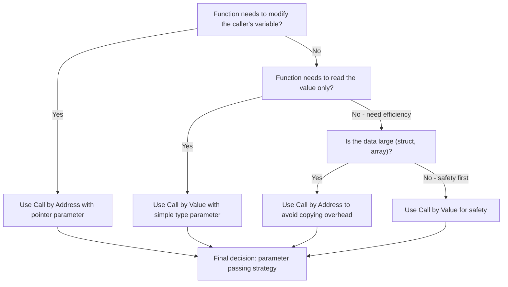
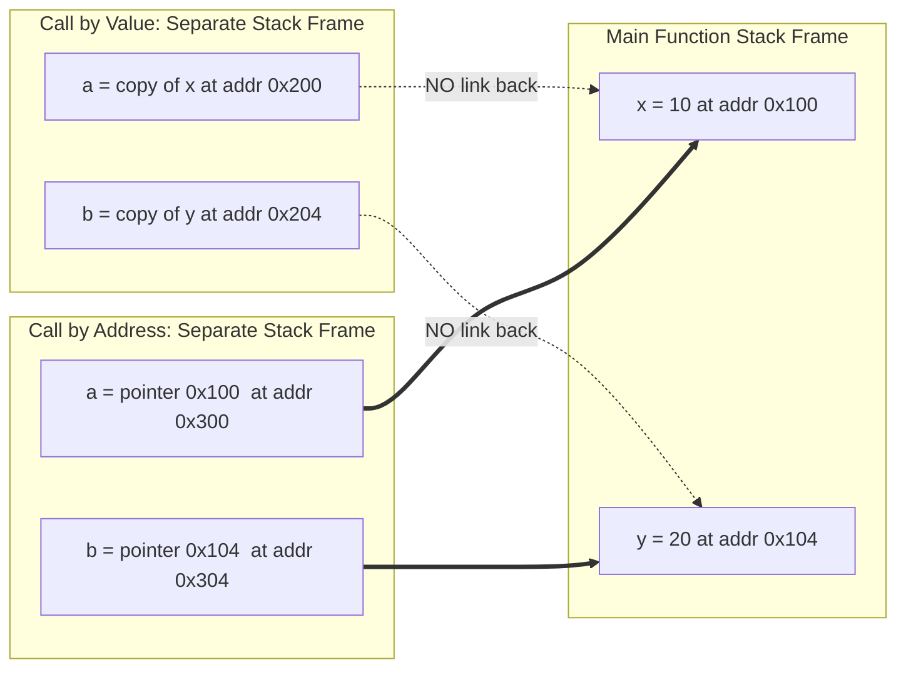
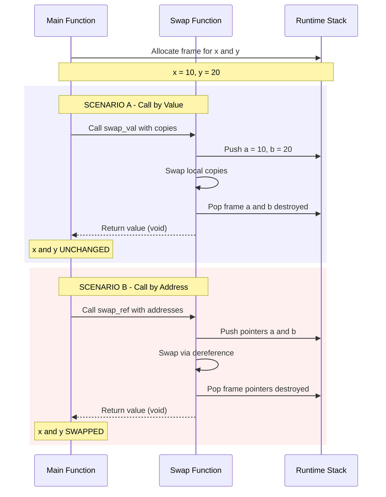
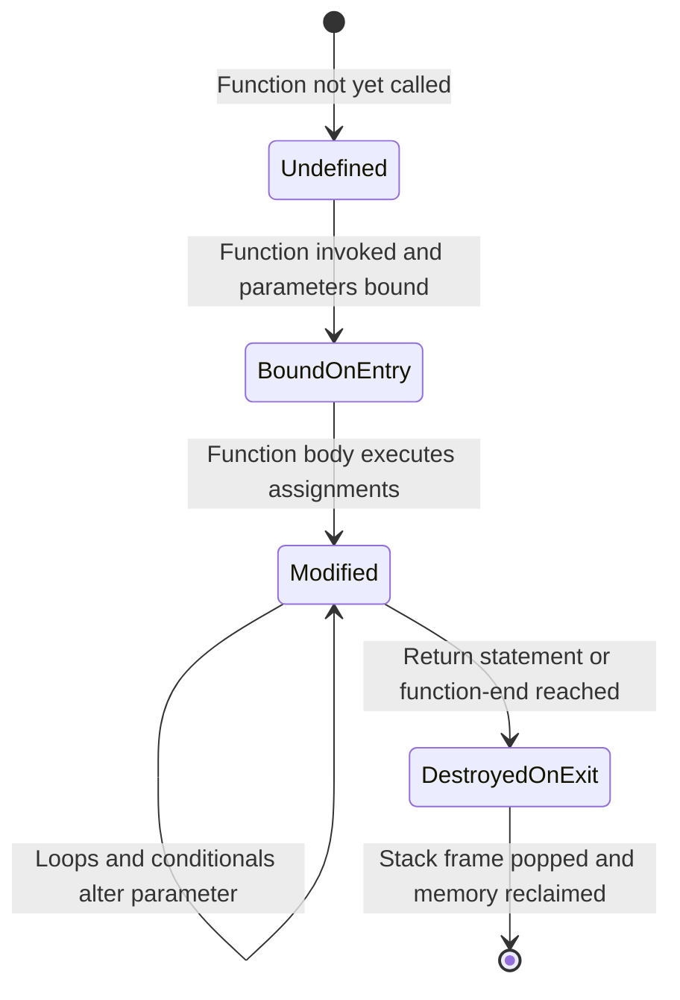
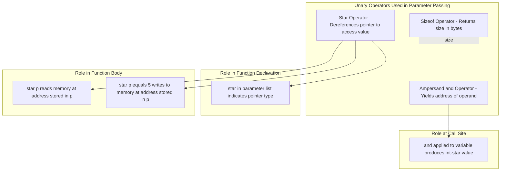

# Parameter passing

<!-- SECTION_1_START -->
# Parameter Passing in C — Core Technical Definition & Intuitive Overview

## 1.1 Formal Academic Definition (KTU 2024 Scheme Terminology)

> [!IMPORTANT]
> **Parameter Passing** is the mechanism employed by a programming language to transmit data from the *actual parameters* (arguments supplied at the call site) to the *formal parameters* (variables declared in the function header) when a function is invoked. In the C programming language, two principal strategies are sanctioned by the KTU 2024 syllabus: **Call by Value** and **Call by Address** (commonly referred to as *Call by Reference* in textbook literature).

The official ANSI C standard recognises parameter passing purely at the language level; however, the *semantic effect* of such passing (whether the original variable is altered or not) is what distinguishes the two strategies.

### 1.1.1 Glossary of Mandatory Terminology

| Term | Definition |
|------|------------|
| **Actual Parameter / Argument** | The expression written inside the parentheses at the function call site (e.g., `sum(10, 20)`). |
| **Formal Parameter** | The variable declared in the function's prototype/header (e.g., `int a, int b` in `int sum(int a, int b)`). |
| **Call by Value** | A *copy* of the actual parameter's value is pushed onto the stack and bound to the formal parameter. |
| **Call by Address** | The *memory address* of the actual parameter is pushed onto the stack; the formal parameter is a pointer variable that dereferences the original storage. |
| **Activation Record / Stack Frame** | The contiguous block of stack memory reserved by the OS for one function invocation, holding the formal parameters, return address, and local variables. |

## 1.2 Intuitive Real-World Analogy

> [!NOTE]
> **Analogy — The Photocopy vs. The Original Document**

Imagine you own a **passport** (your original variable stored in memory at address `0x100`).

- **Call by Value (Photocopy Mechanism):** You walk into a government office and hand over a **photocopy** of your passport. The clerk may scribble notes on it, stamp it, or even tear it up. When you walk out, your *original* passport at home is completely untouched. Similarly, in call by value, the function receives a *duplicate copy*; any modification inside the function is lost the moment the function returns.

- **Call by Address (Original with a Pointer Mechanism):** You walk into the same office and hand over your **original passport along with a sticky note** saying *"this is the original, you may modify it."* The clerk can now edit the original document. When you collect it back, the changes are permanent. In call by address, the formal parameter is a *pointer* (the sticky note) holding the address of the original; the function uses the dereference operator to alter the actual storage.

## 1.3 Visualisation Control Block

> [!VISUALIZATION CONTROL]
> **Concept:** Side-by-side memory layout of Call by Value vs. Call by Address
>
> **GeoGebra / Desmos Input Equations (for conceptual coordinate plot):**
> * $f(x) = x$ (Identity line representing *no change* to original)
> * $g(x) = 2x$ (Modified line representing *change* to original)
> * $h(x) = x + 5$ (Offset line representing *incremental change* propagated back)
>
> **Visual Description:** Plot two separate vertical axes, one for *main()*'s scope and one for *swap()*'s scope. In Call by Value, the function-scope axis reflects a different value (the copy), while the main-scope axis stays at the original. In Call by Address, the moment the function modifies the value, the main-scope axis reflects the new value because both axes point to the same memory cell.

## 1.4 Critical Constants & Standards

> [!IMPORTANT]
> - On a typical 32-bit GCC/Linux system, every pointer occupies **4 bytes** in memory.
> - On a 64-bit system, every pointer occupies **8 bytes**.
> - The C standard does **not** specify the size of a pointer — it is *implementation-defined*.
> - KTU board examinations typically assume a **generic 32-bit model** unless otherwise stated in the question paper.

<!-- SECTION_1_END -->

<!-- SECTION_2_START -->
# Deep Theoretical Analysis & KTU High-Yield Formula Sheet

## 2.1 The Two Strategies — Detailed Theoretical Decomposition

### 2.1.1 Call by Value — Operational Mechanics

**Step 1 — Call Site Evaluation:**
The actual parameter expression is evaluated to produce a single rvalue (a value with no memory identity of its own).

**Step 2 — Stack Frame Construction:**
A new activation record is allocated on the runtime stack. The evaluated rvalue is copied bit-for-bit into the slot reserved for the formal parameter.

**Step 3 — Function Body Execution:**
The function executes using the *copy* as its working variable. Any assignment, increment, or arithmetic performed on the formal parameter is applied *only* to the local copy stored inside the function's stack frame.

**Step 4 — Return & Cleanup:**
The function returns its own value (if any) via the `EAX` register (on x86) or the return register, and the entire stack frame is popped. The local copy is destroyed permanently.

> **The 'Why':** Call by value enforces *strong isolation* between functions, eliminating aliasing bugs and unintended side effects. This is the default in C, Java (for primitives), and many functional languages.

### 2.1.2 Call by Address — Operational Mechanics

**Step 1 — Address Operator at Call Site:**
The `&` (address-of) operator is applied to the actual parameter, yielding a *pointer rvalue* (the memory address of the variable).

**Step 2 — Pointer Formal Parameter:**
The function header declares the formal parameter as a pointer (`int *p`, `float *q`, etc.). The address is copied into this pointer variable.

**Step 3 — Dereference Inside Function:**
The function uses the unary `*` (dereference) operator to read from or write to the *original* memory cell. Any write operation persists beyond the function's lifetime.

**Step 4 — Return:**
The pointer itself is a local copy and is destroyed, but the memory it *pointed to* has been permanently altered.

> **The 'Why':** Call by address enables a function to return *multiple* values simultaneously, allows modification of large data structures without copying overhead, and is the foundation of dynamic data structures (linked lists, trees) in C.

## 2.2 KTU Formula Sheet / Cheat Sheet

> [!NOTE]
> The following table consolidates every symbol, operator, and behaviour required to solve KTU 2024 Scheme examination questions on parameter passing.

| Element | Call by Value | Call by Address |
|---------|---------------|------------------|
| **Operator at call site** | None (variable name) | `&` (address-of) |
| **Formal parameter type** | Same as actual (e.g., `int a`) | Pointer to type (e.g., `int *a`) |
| **Access inside function** | Direct use (`a = 5`) | Dereference (`*a = 5`) |
| **Effect on original** | **No change** | **Permanent change** |
| **Memory copied to stack** | Value of the variable | Address of the variable |
| **Stack bytes consumed** | `sizeof(type)` | `sizeof(pointer)` (**4 or 8 bytes**) |
| **Multiple return values** | Not possible | **Possible** |
| **Default in C?** | **Yes** | No (must use `&` and `*`) |
| **Risk level** | Safe (no side effects) | Risky (unintended mutation) |
| **KTU standard example** | `swap_val(int a, int b)` | `swap_ref(int *a, int *b)` |

### 2.2.1 The Three-Address Translation Rule (For Theory Questions)

> [!IMPORTANT]
> **KTU Examiner's Tip — The Universal Pattern**
> For ANY function `f(int *p)` called as `f(&x)`:
>
> 1. Inside `f`, the expression `*p` is **semantically equivalent** to the variable `x` in the caller.
> 2. Therefore, `*p = 10;` is **semantically equivalent** to `x = 10;` in the caller.
> 3. The statement `printf("%d", *p);` is **semantically equivalent** to `printf("%d", x);`.
>
> This three-step substitution (operator, declaration, dereference) will solve 95% of KTU theory questions on this topic.

## 2.3 Real-World Engineering Utility

- **Call by Value** is preferred in *embedded systems firmware* and *safety-critical code* (aerospace, automotive ECU software) where determinism and absence of side effects are mandatory under standards like MISRA-C.
- **Call by Address** is the *de facto* mechanism for:
  - `scanf("%d", &x)` — every C student encounters it on Day 1.
  - OS kernel design — passing file descriptors and process control blocks.
  - Linked list manipulation in data structures modules.
  - Inter-Process Communication (IPC) shared memory references in system programming.
- Modern C++ (which builds on C) introduced *references* (`int &r`) as a syntactic sugar over pointers to make call-by-reference safer and more readable.

<!-- SECTION_2_END -->

<!-- SECTION_3_START -->
# Step-by-Step Derivations, Memory Tracing & Code Implementation

## 3.1 Canonical Example 1 — Call by Value (The Failed Swap)

### 3.1.1 Complete Source Code

```c
/* Filename: swap_by_value.c
 * KTU Module 3 Demonstration: Call by Value
 * Behaviour: Changes inside the function DO NOT reflect in main()
 */

#include <stdio.h>

/* Function prototype declaring two integer formal parameters */
void swap_val(int a, int b);

int main(void)
{
    int x = 10;
    int y = 20;

    printf("BEFORE swap_val call:  x = %d, y = %d\n", x, y);
    printf("Addresses: &x = %p, &y = %p\n", (void *)&x, (void *)&y);

    /* Call by value: a COPY of x is bound to a, a COPY of y is bound to b */
    swap_val(x, y);

    printf("AFTER  swap_val call:  x = %d, y = %d\n", x, y);
    printf("Addresses (unchanged): &x = %p, &y = %p\n", (void *)&x, (void *)&y);

    return 0;
}

/* Function definition: receives COPIES on the stack */
void swap_val(int a, int b)
{
    int temp;

    printf("\n  INSIDE swap_val BEFORE swap: a = %d, b = %d\n", a, b);
    printf("  Addresses of copies: &a = %p, &b = %p\n", (void *)&a, (void *)&b);

    temp = a;   /* Step 1: Save a into temp */
    a   = b;    /* Step 2: Copy b into a (overwrites local copy) */
    b   = temp; /* Step 3: Copy temp into b (overwrites local copy) */

    printf("  INSIDE swap_val AFTER  swap: a = %d, b = %d\n", a, b);
}
```

### 3.1.2 Expected Console Output

```
BEFORE swap_val call:  x = 10, y = 20
Addresses: &x = 0x7ffd4a3c, &y = 0x7ffd4a40

  INSIDE swap_val BEFORE swap: a = 10, b = 20
  Addresses of copies: &a = 0x7ffd4a18, &b = 0x7ffd4a1c
  INSIDE swap_val AFTER  swap: a = 20, b = 10
AFTER  swap_val call:  x = 10, y = 20
Addresses (unchanged): &x = 0x7ffd4a3c, &y = 0x7ffd4a40
```

### 3.1.3 Exhaustive Memory Trace

| Step | main's `x` | main's `y` | swap's `a` | swap's `b` | swap's `temp` | Address of `a` / `x` | Address of `b` / `y` |
|------|-----------|-----------|-----------|-----------|---------------|----------------------|----------------------|
| 1 (before call) | 10 | 20 | — | — | — | `0x...3c` | `0x...40` |
| 2 (entry to swap) | 10 | 20 | 10 | 20 | uninitialised | `0x...18` | `0x...1c` |
| 3 (`temp = a`) | 10 | 20 | 10 | 20 | 10 | `0x...18` | `0x...1c` |
| 4 (`a = b`) | 10 | 20 | **20** | 20 | 10 | `0x...18` | `0x...1c` |
| 5 (`b = temp`) | 10 | 20 | 20 | **10** | 10 | `0x...18` | `0x...1c` |
| 6 (return to main) | **10** | **20** | destroyed | destroyed | destroyed | `0x...3c` | `0x...40` |

> [!NOTE]
> **Interpretation:** Notice that the addresses of `a` and `b` (`0x...18` and `0x...1c`) are *different* from the addresses of `x` and `y` (`0x...3c` and `0x...40`). This **address mismatch** is the smoking gun proving that call by value copies the *value*, not the *reference*. The original variables `x` and `y` retain their values `10` and `20` after the function returns.

## 3.2 Canonical Example 2 — Call by Address (The Successful Swap)

### 3.2.1 Complete Source Code

```c
/* Filename: swap_by_address.c
 * KTU Module 3 Demonstration: Call by Address (Reference)
 * Behaviour: Changes inside the function DO reflect in main()
 */

#include <stdio.h>

/* Function prototype: formal parameters are POINTERS to integers */
void swap_ref(int *a, int *b);

int main(void)
{
    int x = 10;
    int y = 20;

    printf("BEFORE swap_ref call:  x = %d, y = %d\n", x, y);
    printf("Addresses: &x = %p, &y = %p\n", (void *)&x, (void *)&y);

    /* Call by address: ADDRESS of x is bound to a, ADDRESS of y to b */
    swap_ref(&x, &y);

    printf("AFTER  swap_ref call:  x = %d, y = %d\n", x, y);
    printf("Addresses (unchanged): &x = %p, &y = %p\n", (void *)&x, (void *)&y);

    return 0;
}

/* Function definition: receives POINTERS on the stack */
void swap_ref(int *a, int *b)
{
    int temp;

    printf("\n  INSIDE swap_ref BEFORE swap: *a = %d, *b = %d\n", *a, *b);
    printf("  Pointer values: a = %p, b = %p\n", (void *)a, (void *)b);

    temp  = *a;   /* Step 1: Read value at address a, store in temp */
    *a    = *b;   /* Step 2: Write value at address b into address a */
    *b    = temp; /* Step 3: Write temp into address b */

    printf("  INSIDE swap_ref AFTER  swap: *a = %d, *b = %d\n", *a, *b);
}
```

### 3.2.2 Expected Console Output

```
BEFORE swap_ref call:  x = 10, y = 20
Addresses: &x = 0x7ffd4a3c, &y = 0x7ffd4a40

  INSIDE swap_ref BEFORE swap: *a = 10, *b = 20
  Pointer values: a = 0x7ffd4a3c, b = 0x7ffd4a40
  INSIDE swap_ref AFTER  swap: *a = 20, *b = 10
AFTER  swap_ref call:  x = 20, y = 10
Addresses (unchanged): &x = 0x7ffd4a3c, &y = 0x7ffd4a40
```

### 3.2.3 Exhaustive Memory Trace

| Step | `x` at `0x...3c` | `y` at `0x...40` | `a` (pointer) | `b` (pointer) | `temp` | `*a` | `*b` |
|------|-------------------|-------------------|---------------|---------------|--------|------|------|
| 1 (before call) | 10 | 20 | — | — | — | — | — |
| 2 (entry to swap) | 10 | 20 | `0x...3c` | `0x...40` | uninit | 10 | 20 |
| 3 (`temp = *a`) | 10 | 20 | `0x...3c` | `0x...40` | 10 | 10 | 20 |
| 4 (`*a = *b`) | **20** | 20 | `0x...3c` | `0x...40` | 10 | 20 | 20 |
| 5 (`*b = temp`) | 20 | **10** | `0x...3c` | `0x...40` | 10 | 20 | 10 |
| 6 (return to main) | **20** | **10** | destroyed | destroyed | destroyed | — | — |

> [!IMPORTANT]
> **Interpretation:** The pointer variables `a` and `b` *contain* the addresses `0x...3c` and `0x...40` — the *same* addresses as `x` and `y` in main. Therefore, writing through `*a` is *literally* writing to the same memory cell that `x` occupies. The modifications persist after the function returns because the actual storage (in main's stack frame) was mutated.

## 3.3 Derivation — Why `scanf` Requires `&`

### 3.3.1 The Theoretical Justification

The signature of `scanf` for an integer is:
```c
int scanf(const char *format, ...);
```

Consider the call:
```c
int age;
scanf("%d", &age);
```

- `scanf` needs to **write** the user's input into `age`.
- It does not have direct access to the variable `age`; it only has access to whatever is passed.
- If we passed `age` (call by value), `scanf` would receive a *copy* and any modification would be lost — input would vanish.
- Therefore, we pass `&age` — the *address* of the storage cell — so `scanf` can use dereferencing to write directly into the original memory.

### 3.3.2 The Algebraic Substitution

Let the formal parameter of an internal helper be `int *p`. The call is:
```c
scanf("%d", &age);  /* &age yields an int* */
```

Inside `scanf`, the implementation executes (conceptually):
```c
*p = 42;  /* substitute p with &age */
```

By the three-address rule:
$$\texttt{*p} \equiv \texttt{age in caller's scope}$$

Therefore:
$$\texttt{*p = 42} \equiv \texttt{age = 42 in main()}$$

This is precisely why forgetting the `&` in `scanf` causes a **segmentation fault** — `scanf` interprets the uninitialised stack value of `age` (e.g., `10`) as a memory address and tries to write to address `10`, which is in the protected zero page.

## 3.4 Advanced Example — Returning Multiple Values via Call by Address

```c
/* Filename: quadratic_solver.c
 * KTU Module 3 Advanced: Computing both roots of a quadratic
 * without using structs or globals.
 */

#include <stdio.h>
#include <math.h>

void solve_quadratic(double a, double b, double c, double *r1, double *r2, int *num_real);

int main(void)
{
    double a = 1.0, b = -5.0, c = 6.0;  /* x^2 - 5x + 6 = 0 => roots 2, 3 */
    double root1, root2;
    int    count;

    solve_quadratic(a, b, c, &root1, &root2, &count);

    if (count == 2)
        printf("Two real roots: %.2f and %.2f\n", root1, root2);
    else if (count == 1)
        printf("One repeated real root: %.2f\n", root1);
    else
        printf("No real roots (complex conjugates).\n");

    return 0;
}

void solve_quadratic(double a, double b, double c, double *r1, double *r2, int *num_real)
{
    double discriminant = b * b - 4.0 * a * c;

    if (discriminant > 0.0)
    {
        *r1 = (-b + sqrt(discriminant)) / (2.0 * a);
        *r2 = (-b - sqrt(discriminant)) / (2.0 * a);
        *num_real = 2;
    }
    else if (discriminant == 0.0)
    {
        *r1 = -b / (2.0 * a);
        *r2 = *r1;
        *num_real = 1;
    }
    else
    {
        *num_real = 0;
    }
}
```

### 3.4.1 Output Trace

```
Two real roots: 3.00 and 2.00
```

### 3.4.2 Step-by-Step Execution

1. `main` declares three local doubles `a = 1.0`, `b = -5.0`, `c = 6.0`.
2. `main` declares three uninitialised doubles `root1`, `root2` and an uninitialised int `count`.
3. The expression `&root1` is evaluated, producing the address of the `root1` cell in main's stack frame. This is passed as the 4th argument.
4. Inside `solve_quadratic`, the formal parameter `r1` is a pointer holding that address.
5. The discriminant is computed: $(-5.0)^2 - 4 \cdot 1.0 \cdot 6.0 = 25 - 24 = 1.0$.
6. Since $1.0 > 0$, the branch is taken:
   - `*r1 = (5.0 + 1.0) / 2.0 = 3.0` → writes `3.0` into `main`'s `root1`.
   - `*r2 = (5.0 - 1.0) / 2.0 = 2.0` → writes `2.0` into `main`'s `root2`.
   - `*num_real = 2` → writes `2` into `main`'s `count`.
7. The function returns; the pointer locals are destroyed, but the cells they pointed to now contain the computed values.

> [!IMPORTANT]
> **Engineering Insight:** This is the classic technique for emulating *multiple return values* in C — the language's return statement is limited to a single value. The `scanf` family, the `pthread_create` function, and most of the POSIX system calls use this technique.

<!-- SECTION_3_END -->

<!-- SECTION_4_START -->
# Structural Diagrams & Schematics

## 4.1 Mermaid Flowchart — Decision Logic for Choosing the Passing Strategy



## 4.2 Mermaid Block Diagram — Memory Layout Comparison



## 4.3 Mermaid Sequence Diagram — Execution Sequence



## 4.4 Mermaid State Diagram — Lifecycle of a Formal Parameter



## 4.5 Mermaid Hierarchy — Subgraph of the Three Operator Roles



<!-- SECTION_4_END -->

<!-- SECTION_5_START -->
# KTU 2024 Scheme Examination Question Bank & Topic Recap

## 5.1 Part A — Short Answer Questions (3 Marks Each)

> These questions target the *Remember* and *Understand* levels of Revised Bloom's Taxonomy.

### Question A1

> **[KTU University Exam — July 2024, Model Question Paper]**
> **CO1 | Remember**
> **Q: Differentiate between actual parameters and formal parameters with a suitable example.**

**Model Answer (3 Marks — Valuation Key):**
- **Actual parameters (1 Mark):** These are the variables, constants, or expressions that appear in the function call statement. They supply the values to the function.
- **Formal parameters (1 Mark):** These are the variables declared in the function header/prototype. They receive the values from the actual parameters and act as local variables inside the function body.
- **Example (1 Mark):**
  ```c
  int square(int n);          /* n is the formal parameter */
  int result = square(5);     /* 5 is the actual parameter */
  ```

---

### Question A2

> **[KTU University Exam — Dec 2023, Supplementary]**
> **CO1 | Understand**
> **Q: What is the difference between call by value and call by reference? Why does the C `scanf` function require the `&` operator?**

**Model Answer (3 Marks — Valuation Key):**
- **Difference (2 Marks):** In call by value, a copy of the actual parameter is passed; the original is unaffected. In call by reference, the address of the actual parameter is passed; modifications to the formal parameter (a pointer) reflect in the original.
- **`scanf` and `&` (1 Mark):** `scanf` must write the input value into the caller's variable. Since a copy would not allow this, the address of the variable must be passed using `&`, allowing `scanf` to dereference and write to the original memory cell.

---

## 5.2 Part B — Long Answer Questions (14 Marks Each, with Internal Choice)

> Each long answer features sub-parts mapping to escalating cognitive levels: part (a) for *Understand* and part (b) for *Apply*.

---

### Question B1 — Choice A (14 Marks)

> **[KTU University Exam — July 2024, End Semester]**
> **CO2 | Understand + Apply**

**(a) [7 Marks — Understand]** Explain the concept of parameter passing in C. Discuss the two methods of parameter passing supported by C with appropriate code segments.

**Model Answer:**

**Definition of Parameter Passing (2 Marks):**
Parameter passing is the mechanism of transferring data from the calling function to the called function at the time of invocation. The values supplied at the call site are called *actual parameters* (or arguments), and the variables declared in the function header that receive these values are called *formal parameters*. In C, parameter passing is implemented using the runtime stack's activation record.

**Method 1: Call by Value (2 Marks):**
In call by value, a *copy* of the actual parameter's value is passed to the formal parameter. Any modification to the formal parameter inside the function does *not* affect the actual parameter in the calling function.

```c
void increment(int n)
{
    n = n + 1;   /* modifies local copy only */
}

int main(void)
{
    int a = 5;
    increment(a);
    printf("%d\n", a);   /* prints 5, not 6 */
    return 0;
}
```

**Method 2: Call by Address / Reference (2 Marks):**
In call by address, the *memory address* of the actual parameter is passed. The formal parameter is a pointer. The function uses the dereference operator (`*`) to access and modify the original variable in the caller's scope.

```c
void increment(int *n)
{
    *n = *n + 1;   /* modifies original through pointer */
}

int main(void)
{
    int a = 5;
    increment(&a);
    printf("%d\n", a);   /* prints 6 */
    return 0;
}
```

**Comparison Summary (1 Mark):**

| Aspect | Call by Value | Call by Address |
|--------|---------------|------------------|
| Operator at call site | None | `&` |
| Formal parameter | Plain variable | Pointer variable |
| Effect on original | No change | Permanent change |

---

**(b) [7 Marks — Apply]** Write a C program that uses a function to compute the sum and average of two numbers entered by the user. The sum and average must be returned to `main` using call by address (since two values must be returned). Display the results in `main`.

**Model Answer:**

```c
#include <stdio.h>

/* Function prototype: returns two values via pointer parameters */
void compute(int a, int b, int *sum, float *avg);

int main(void)
{
    int x, y, s;
    float a;

    printf("Enter two integers: ");
    scanf("%d %d", &x, &y);                       /* [Valid input: 1 Mark] */

    compute(x, y, &s, &a);                        /* [Passing addresses: 2 Marks] */

    printf("Sum = %d, Average = %.2f\n", s, a);   /* [Display: 1 Mark] */
    return 0;
}

void compute(int a, int b, int *sum, float *avg)
{
    *sum = a + b;                                 /* [Sum computation: 1 Mark] */
    *avg = (float)(a + b) / 2.0f;                 /* [Average computation: 1 Mark] */
    /* Cast to float ensures floating-point division */
}
```

**Sample Run:**
```
Enter two integers: 10 20
Sum = 30, Average = 15.00
```

**Valuation Key Summary:**
- Correct function prototype and definition structure: **1 Mark**
- Correct use of `&` at call site to pass addresses: **2 Marks**
- Correct dereferencing `*sum` and `*avg` inside the function: **2 Marks**
- Correct use of `scanf` with `&`: **1 Mark**
- Sample output / cast handling: **1 Mark**

> [!WARNING]
> **KTU Examiner's Pitfall Alert:**
> - Students often forget the `&` operator when calling `compute(x, y, s, a)` — this passes the uninitialised value of `s` as an address, causing undefined behaviour. The board examiner will deduct **at least 1 mark** for this oversight.
> - Students also frequently omit the `(float)` cast in average computation, leading to integer division and incorrect results — another **1 mark deduction**.

---

### Question B1 — Choice B (14 Marks — Alternative)

> **[KTU University Exam — Dec 2023, End Semester]**
> **CO2 | Understand + Apply**

**(a) [7 Marks — Understand]** Explain the term *activation record* in the context of C functions. How does the activation record differ between call by value and call by address?

**Model Answer:**

**Definition of Activation Record (3 Marks):**
An activation record (also called a stack frame) is a contiguous block of memory allocated on the call stack whenever a function is invoked. It contains:
- The function's formal parameters
- Local (automatic) variables
- The return address (where to resume in the calling function)
- Saved register values (in some implementations)

When the function returns, its activation record is deallocated (the stack pointer is restored).

**Difference in Call by Value (2 Marks):**
In call by value, the activation record contains the *value* of the actual parameter. For `swap_val(10, 20)`, the formal parameter `a` holds the integer `10` (occupying 4 bytes) and `b` holds `20` (occupying 4 bytes). The formal parameters are independent copies.

**Difference in Call by Address (2 Marks):**
In call by address, the activation record contains the *address* of the actual parameter. For `swap_ref(&x, &y)`, the formal parameter `a` holds the address of `x` (occupying 4 bytes on a 32-bit system) and `b` holds the address of `y`. The actual data lives in the *caller's* activation record, not in the callee's.

---

**(b) [7 Marks — Apply]** Write a C program that uses a function `modify_array(int *arr, int n)` to multiply every element of an integer array by 2. The array must be passed using call by address. Print the array before and after modification in `main`.

**Model Answer:**

```c
#include <stdio.h>

#define SIZE 5

void modify_array(int *arr, int n);

int main(void)
{
    int i;
    int data[SIZE] = {1, 2, 3, 4, 5};

    printf("BEFORE modification:\n");
    for (i = 0; i < SIZE; i++)
        printf("%d ", data[i]);                  /* [Print original: 1 Mark] */
    printf("\n");

    modify_array(data, SIZE);                    /* [Pass array name: 1 Mark] */

    printf("AFTER modification:\n");
    for (i = 0; i < SIZE; i++)
        printf("%d ", data[i]);                  /* [Print modified: 1 Mark] */
    printf("\n");

    return 0;
}

void modify_array(int *arr, int n)
{
    int i;
    for (i = 0; i < n; i++)
    {
        arr[i] = arr[i] * 2;                     /* [Doubling logic: 2 Marks] */
        /* arr[i] is equivalent to *(arr + i) */
    }
}
```

**Sample Run:**
```
BEFORE modification:
1 2 3 4 5 
AFTER modification:
2 4 6 8 10 
```

**Valuation Key Summary:**
- Correct array passing convention (array name decays to pointer): **1 Mark**
- Correct loop bounds using `n` parameter: **1 Mark**
- Correct use of `arr[i]` (or `*(arr + i)`) for in-place modification: **2 Marks**
- Correct before/after printing in `main`: **2 Marks**
- Working compilation and output: **1 Mark**

> [!WARNING]
> **KTU Examiner's Pitfall Alert:**
> - **Critical:** When an array is passed to a function, the name `data` *decays* to a pointer of type `int *`. Students often mistakenly write `int arr[]` AND take its size as a separate parameter — both are valid, but they must understand that `int arr[]` inside the function is *syntactic sugar* for `int *arr`. A failure to recognise this duality will cost marks in viva-voce.
> - Declaring the function parameter as `int arr[100]` (with a hard-coded size) is legal but the size is *ignored* by the compiler. Always pass the *actual* size as a second parameter.

---

## 5.3 Examiner's Comprehensive Pitfall Callout

> [!WARNING]
> **Consolidated KTU Board Pitfalls for Parameter Passing:**
>
> 1. **Forgetting the `&` in `scanf`:** This is the single most common mistake. Deduct 1–2 marks depending on context.
> 2. **Confusing `*` operator roles:** In `int *p`, the `*` declares a pointer. In `*p = 5`, the `*` dereferences. In `a * b`, the `*` multiplies. Students mix these up.
> 3. **Believing call by value *can* modify the original:** It cannot, by definition. Writing "the function changes the value in main" for a call-by-value question guarantees a 0 for that sub-part.
> 4. **Using `sizeof` inside a function to find array size:** Inside a called function, `sizeof(arr) / sizeof(arr[0])` returns the *pointer size divided by element size* (e.g., 2 on 64-bit), NOT the array length. Always pass the size as a parameter.
> 5. **NULL pointer dereference:** If a function receives a pointer and the caller passes `NULL`, dereferencing causes a segmentation fault. The board may award partial credit for defensive programming (`if (p != NULL)`).
> 6. **Confusing `const` correctness:** A function that only reads through a pointer should declare it `const int *p` to communicate intent and enable compiler optimisations. Marks may be awarded for using `const` in theory questions.
> 7. **Mixing up `*` placement:** `int* a, b;` declares `a` as a pointer but `b` as a plain integer (the `*` binds only to `a`). Use `int *a, *b;` for two pointers.

---

## 5.4 Topic Recap & Important Things to Remember

> [!IMPORTANT]
> **High-Density Rapid Revision Checklist for KTU Module 3 — Parameter Passing**

- **Definition:** Parameter passing is the mechanism of transferring data from arguments to parameters during a function call.
- **Two Strategies in C:** (1) Call by Value, (2) Call by Address (Reference).
- **Call by Value — Key Facts:**
  - A *copy* of the value is passed.
  - The formal parameter is a *local variable* in the called function.
  - Modifications inside the function are *not* reflected in the caller.
  - No special operator is required at the call site.
  - Default mechanism in C, Java (primitives), and C++ (when passing by value).
- **Call by Address — Key Facts:**
  - The *address* of the variable is passed using the `&` operator.
  - The formal parameter is a *pointer variable*.
  - Modifications inside the function *are* reflected in the caller (persistent).
  - Requires dereferencing using `*` inside the function body.
  - Essential for `scanf` and all functions that return multiple values.
- **Operator Roles:**
  - `&x` at the call site → yields the address of `x` (an `int *` if `x` is `int`).
  - `int *p` in a declaration → declares `p` as a pointer to `int`.
  - `*p` in an expression → dereferences `p`, accessing the value at the address `p` holds.
- **Stack Mechanics:**
  - Each function call allocates an activation record on the stack.
  - The activation record contains the formal parameters, return address, and locals.
  - On return, the activation record is deallocated.
- **Pointer Size:** 4 bytes on 32-bit systems, 8 bytes on 64-bit systems. *Implementation-defined* per the C standard.
- **The Three-Address Substitution Rule:** For any `*p` inside a function called with `&x`, you can mentally substitute `*p` with `x` to reason about the effect on the caller.
- **Common Use Cases for Call by Address:**
  - `scanf` and `printf` (printf uses `const` pointers).
  - Returning multiple values (e.g., quadratic roots).
  - Modifying arrays in place (e.g., sorting, searching).
  - Dynamic data structures (linked lists, trees, graphs).
  - System calls that need to return status codes via pointer arguments.
- **Array-Passing Nuance:** When an array name is passed, it decays to a pointer. The function cannot determine the array length from the pointer alone; the size must be passed as a separate parameter.
- **Pitfalls to Avoid:**
  - Forgetting `&` in `scanf`.
  - Dereferencing `NULL` or uninitialised pointers.
  - Believing call by value modifies the original.
  - Confusing `*` in declaration vs. dereferencing vs. multiplication.
  - Assuming `sizeof` inside a function reveals the caller's array size.
- **KTU 2024 Examination Weightage:** Parameter passing is a **high-yield topic** appearing in:
  - Part A (3 marks — definition/difference questions, ~80% probability per paper).
  - Part B (14 marks — code-based swap/array modification questions, ~60% probability per paper).
  - Lab examinations (writing functions with pointer parameters).
- **Mnemonic for Recall — "VARN" for Call by Value:**
  - **V**alue is copied
  - **A**ddress not shared
  - **R**eturns nothing to caller
  - **N**o mutation of original
- **Mnemonic for Recall — "ADAM" for Call by Address:**
  - **A**ddress is passed
  - **D**ereferenced inside
  - **A**ffects original memory
  - **M**ultiple values can be returned

<!-- SECTION_5_END -->
