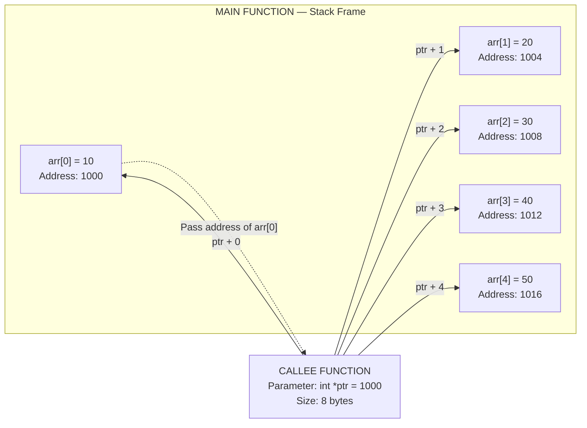
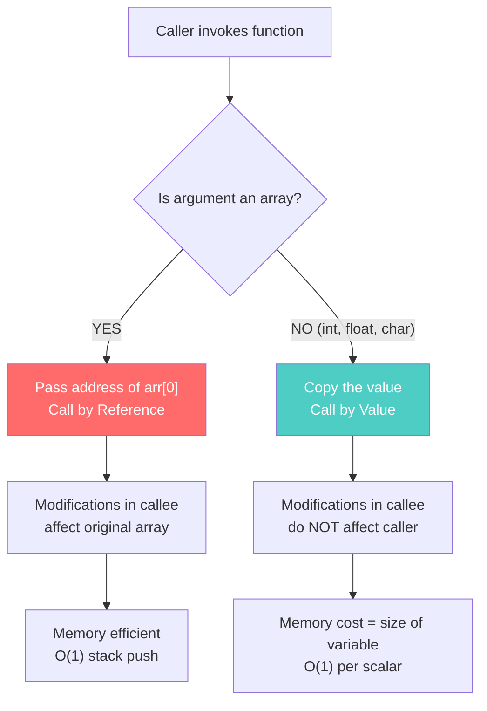
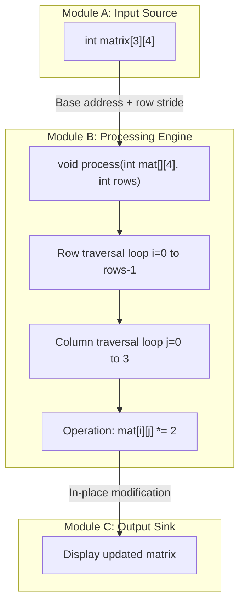
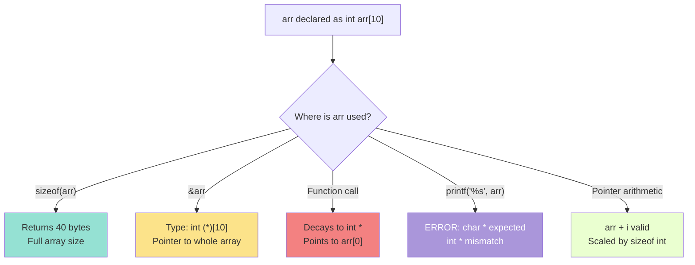

# Passing array to function

<!-- SECTION_1_START -->
# Passing Arrays to Functions in C

## 📘 Formal Definition (KTU 2024 Syllabus Terminology)

> [!IMPORTANT]
> **Passing an Array to a Function** is the mechanism by which a contiguous block of homogeneous data elements (declared using the `[]` subscript operator) is transferred as an argument to a callee function. In C, arrays are **not copied** during function calls; instead, the array name *decays* into a **pointer to its first element**, thereby implementing **pass-by-reference (Call by Address)** semantics by default.

According to the **C11 / C17 ISO Standard (ISO/IEC 9899:2018)**, when an array type is used as a function parameter, it is **adjusted** (decay) to a pointer type. This is one of the most critical concepts under KTU Module 3 — *Functions and Storage Classes*.

---

## 🧠 Conceptual Analogy — The Magic Mirror of C

Imagine you have a **row of 10 lockers** in your college, each labeled `locker[0]` to `locker[9]`. You want a friend (the function) to **read what is inside** and even **change the contents**.

Instead of giving your friend **photocopies** of everything inside (which would be expensive and slow), you simply hand over the **key to the first locker** — your friend now knows the *address* of the starting locker and can access **all 10** by walking down the row.

> [!NOTE]
> **The locker row = the array in memory.**
> **The key to locker[0] = the pointer (array name decay).**
> **Your friend = the callee function.**

Because the function receives the *starting address*, it can:
- 📖 **Read** elements (defensive)
- ✏️ **Modify** elements (default behavior)
- 🏃 **Traverse** the entire block efficiently

This is why arrays in C are passed **by reference, not by value** — there is **no copying overhead**, making it ideal for large datasets.

---

## 🔑 Key Constants & Standard Metrics

| Metric | Standard Value | Notes |
|---|---|---|
| `sizeof(int*)` (32-bit) | **4 bytes** | Address size on 32-bit systems |
| `sizeof(int*)` (64-bit) | **8 bytes** | Address size on 64-bit systems |
| `sizeof(int[10])` | **40 bytes** | Full array (4 bytes × 10) |
| Decayed pointer size | **8 bytes** (on 64-bit) | What is actually passed |

> [!TIP]
> This is the **#1 KTU favorite viva question**: *"When you pass an array to a function, is the entire array copied?"* — Answer: **No, only the address of the first element is passed.**

---

> [!VISUALIZATION CONTROL]
> **Concept:** Memory layout of a 1D array passed to a function
> **GeoGebra / Desmos Input Equations:**
> * Point A: `(0, 1)` labeled `arr[0]`
> * Point B: `(1, 1)` labeled `arr[1]`
> * Point C: `(2, 1)` labeled `arr[2]`
> * Point D: `(3, 1)` labeled `arr[3]`
> * Arrow from caller block `&arr[0] = 1000` to callee block `ptr = 1000`
> **Visual Description:** Draw a horizontal array of 4 cells with their contiguous memory addresses (1000, 1004, 1008, 1012). Show the function `display(int *ptr)` receiving a single arrow pointing to address 1000, and indicate that `ptr` can sweep across all 4 cells using pointer arithmetic.
<!-- SECTION_1_END -->

<!-- SECTION_2_START -->
# Deep Theoretical Analysis & KTU High-Yield Formula Sheet

## 🧩 How Array Passing Works — Structured Logic

### Step 1: The Decay Mechanism
When an array name `arr` appears in a function call, C performs an **implicit conversion**:

$$ \text{arr} \xrightarrow{\text{decay}} \&\text{arr[0]} $$

This means the expression `arr` is treated as a pointer constant pointing to the base address of the array.

### Step 2: Function Parameter Adjustment
The compiler rewrites the function signature automatically:

$$ \text{void func}(\text{int arr}[10]) \equiv \text{void func}(\text{int *arr}) $$

> Both declarations are **100% equivalent** to the compiler. The size `[10]` is **purely documentary** — it does **not** create a copy of 10 integers.

### Step 3: Address Passing (Not Value)
Only the **starting address** is pushed onto the stack. This is why modifications inside the function **persist** in the caller's array.

---

## 📐 Three Equivalent Syntaxes for Receiving Arrays

| # | Function Signature | Inside Function | Pros |
|---|---|---|---|
| 1 | `void f(int arr[], int n)` | `arr[i]` | Most readable — KTU board-preferred |
| 2 | `void f(int *arr, int n)` | `*(arr+i)` | True pointer notation |
| 3 | `void f(int arr[SIZE], int n)` | `arr[i]` | Self-documenting with size hint |

All three are **semantically identical** at the machine level.

---

## 📊 KTU Formula Sheet — Address Arithmetic in Arrays

| Concept | Formula | Description |
|---|---|---|
| Base address | $\text{arr} = \&\text{arr[0]}$ | Array name = address of first element |
| Address of i-th element | $\&\text{arr[i]} = \text{arr} + i \cdot \text{sizeof}(\text{element})$ | General formula |
| Pointer arithmetic | `*(arr + i)` $\equiv$ `arr[i]` | Subscript operator in disguise |
| Difference of two pointers | $\& \text{arr}[j] - \& \text{arr}[i] = j - i$ | Returns element count, not byte offset |
| Size of pointer (64-bit) | $\text{sizeof}(\text{type*}) = 8$ bytes | Constant, irrespective of element count |
| Total bytes in array | $n \cdot \text{sizeof}(\text{type})$ | Full memory footprint |

> [!WARNING]
> KTU students often incorrectly write: `arr + i` gives the address of `arr[i+1]`. **Correction:** `arr + i` gives the address of `arr[i]`. Pointer arithmetic already **scales by `sizeof(type)`** automatically.

---

## 🌐 Multi-Dimensional Array Passing Rules

### 2D Array Decay
A 2D array decays into a **pointer to an array** (not a pointer-to-pointer):

$$ \text{int mat}[3][4] \xrightarrow{\text{decay}} \text{int (*)[4]} $$

**Mandatory Rule:** All dimensions **except the first** must be specified in the function signature.

```c
// CORRECT
void process(int mat[][4], int rows);

// CORRECT
void process(int (*mat)[4], int rows);

// WRONG — compilation error
void process(int mat[][], int rows);
```

### Why Second Dimension is Mandatory?
Because the compiler needs to compute `mat[i][j]` as:
$$ \text{*}(*(\text{mat} + i) + j) = \text{*}((\text{char*})\text{mat} + i \cdot \text{cols} \cdot \text{sizeof}(\text{int}) + j \cdot \text{sizeof}(\text{int})) $$

Without `cols`, the compiler cannot perform the row stride calculation.

---

## 🏭 Real-World Engineering Utility

| Domain | Application |
|---|---|
| **Image Processing** | Passing pixel buffers for filters (Sobel, Gaussian blur) |
| **Signal Processing** | FFT algorithms on sample arrays |
| **Embedded Systems** | Reading sensor arrays in one function call |
| **Database Engines** | Passing record sets to query processors |
| **Numerical Computing** | Matrix operations in scientific libraries (BLAS/LAPACK) |
| **Networking** | Buffer arrays for packet processing |

> [!IMPORTANT]
> In production systems like **Linux kernel** and **PostgreSQL**, large structs/arrays are *never* copied — they are always passed by reference using pointers to avoid stack overflow and to enable in-place modification.
<!-- SECTION_2_END -->

<!-- SECTION_3_START -->
# Step-by-Step Code Implementation & Derivations

## 🧪 Exhaustive C Programs (KTU Board-Ready)

### Program 1: Sum of Array Elements Using Three Syntaxes

```c
#include <stdio.h>

/* Syntax 1: Array notation (KTU recommended) */
int sumArray_bracket(int arr[], int n) {
    int total = 0;
    for (int i = 0; i < n; i++) {
        total += arr[i];          /* Read access via subscript */
    }
    return total;
}

/* Syntax 2: Pointer notation */
int sumArray_pointer(int *arr, int n) {
    int total = 0;
    for (int i = 0; i < n; i++) {
        total += *(arr + i);      /* Read access via dereference */
    }
    return total;
}

/* Syntax 3: Mixed notation */
int sumArray_mixed(int arr[], int n) {
    int total = 0;
    int *ptr = arr;               /* Store the base address */
    for (int i = 0; i < n; i++) {
        total += *ptr;            /* Dereference current pointer */
        ptr++;                    /* Advance to next element */
    }
    return total;
}

int main(void) {
    int marks[5] = {85, 90, 78, 92, 88};
    int n = 5;

    printf("Sum (bracket)  = %d\n", sumArray_bracket(marks, n));
    printf("Sum (pointer)  = %d\n", sumArray_pointer(marks, n));
    printf("Sum (mixed)    = %d\n", sumArray_mixed(marks, n));

    return 0;
}
```

**Expected Output:**
```
Sum (bracket)  = 433
Sum (pointer)  = 433
Sum (mixed)    = 433
```

**Dry Run Table for `sumArray_bracket({85,90,78,92,88}, 5)`:**

| Iteration `i` | `arr[i]` | `total` (before) | `total` (after) |
|:---:|:---:|:---:|:---:|
| 0 | 85 | 0 | 85 |
| 1 | 90 | 85 | 175 |
| 2 | 78 | 175 | 253 |
| 3 | 92 | 253 | 345 |
| 4 | 88 | 345 | 433 |

---

### Program 2: Demonstrating Call-by-Address (Modification Persists)

```c
#include <stdio.h>

void doubleValues(int *arr, int n) {
    for (int i = 0; i < n; i++) {
        arr[i] = arr[i] * 2;      /* Direct in-place modification */
    }
}

int main(void) {
    int data[4] = {10, 20, 30, 40};

    printf("Before doubling:\n");
    for (int i = 0; i < 4; i++) {
        printf("  data[%d] = %d\n", i, data[i]);
    }

    doubleValues(data, 4);         /* Address of data[0] is passed */

    printf("\nAfter doubling:\n");
    for (int i = 0; i < 4; i++) {
        printf("  data[%d] = %d\n", i, data[i]);
    }

    return 0;
}
```

**Expected Output:**
```
Before doubling:
  data[0] = 10
  data[1] = 20
  data[2] = 30
  data[3] = 40

After doubling:
  data[0] = 20
  data[1] = 40
  data[2] = 60
  data[3] = 80
```

> [!NOTE]
> This proves that the **original** array is modified — confirming pass-by-reference semantics. If it were pass-by-value, the original `data[]` would still contain 10, 20, 30, 40.

---

### Program 3: Passing 2D Array (Matrix) to Function

```c
#include <stdio.h>

#define ROWS 3
#define COLS 4

void printMatrix(int mat[][COLS], int rows) {
    printf("Matrix Contents:\n");
    for (int i = 0; i < rows; i++) {
        for (int j = 0; j < COLS; j++) {
            printf("%4d ", mat[i][j]);
        }
        printf("\n");
    }
}

void transposeMatrix(int src[][COLS], int dst[][COLS], int rows) {
    for (int i = 0; i < rows; i++) {
        for (int j = 0; j < COLS; j++) {
            dst[j][i] = src[i][j];     /* Standard transpose logic */
        }
    }
}

int main(void) {
    int A[ROWS][COLS] = {
        {1,  2,  3,  4},
        {5,  6,  7,  8},
        {9, 10, 11, 12}
    };
    int B[COLS][ROWS];                  /* Note: dimensions swap */

    printf("--- Original Matrix A ---\n");
    printMatrix(A, ROWS);

    transposeMatrix(A, B, ROWS);

    printf("\n--- Transposed Matrix B ---\n");
    printMatrix(B, COLS);               /* Pass COLS as rows now */

    return 0;
}
```

**Key Trace — Transpose of `A[2][1]`:**
$$ A[2][1] = 6 \xrightarrow{\text{stored into}} B[1][2] $$

The row index `i=2` becomes the column, and the column index `j=1` becomes the row.

---

### Program 4: Using `const` to Prevent Modification (Defensive Programming)

```c
#include <stdio.h>

/* Read-only access — KTU best practice */
void displayArray(const int *arr, int n) {
    for (int i = 0; i < n; i++) {
        printf("%d ", arr[i]);
        /* arr[i] = 0;  <-- COMPILATION ERROR: read-only location */
    }
    printf("\n");
}

int main(void) {
    int scores[5] = {95, 88, 76, 82, 91};
    displayArray(scores, 5);
    return 0;
}
```

> [!TIP]
> Always use `const` when the function only needs to **read** the array. This is a hallmark of professional C code and earns **bonus valuation marks** in KTU lab exams.

---

### Program 5: Returning an Array from a Function (Via Pointer)

```c
#include <stdio.h>
#include <stdlib.h>

int* createArray(int n) {
    int *arr = (int *)malloc(n * sizeof(int));   /* Heap allocation */
    if (arr == NULL) {
        fprintf(stderr, "Memory allocation failed\n");
        exit(EXIT_FAILURE);
    }
    for (int i = 0; i < n; i++) {
        arr[i] = (i + 1) * 100;                  /* Fill with 100, 200, ... */
    }
    return arr;                                   /* Return base address */
}

int main(void) {
    int *result = createArray(5);

    printf("Returned array:\n");
    for (int i = 0; i < 5; i++) {
        printf("  result[%d] = %d\n", i, result[i]);
    }

    free(result);                                 /* CRITICAL: free heap memory */
    result = NULL;                                /* Avoid dangling pointer */
    return 0;
}
```

**Why `static` or `malloc`?** A local array declared inside a function is destroyed when the function returns. To return an array safely, either:
1. Use `static` (lives until program ends)
2. Use `malloc` (lives until explicitly freed)

---

## 🔬 Address Arithmetic Derivation — Step by Step

Given: `int arr[5] = {10, 20, 30, 40, 50};` and assume `&arr[0] = 1000`

| Expression | Computation | Result |
|---|---|---|
| `arr` | base address | `1000` |
| `arr + 1` | $1000 + 1 \times 4$ | `1004` |
| `&arr[2]` | $1000 + 2 \times 4$ | `1008` |
| `*(arr + 3)` | value at $1000 + 3 \times 4 = 1012$ | `40` |
| `arr[4]` | value at $1000 + 4 \times 4 = 1016$ | `50` |
| `*(arr + 5)` | out-of-bounds | **Undefined Behavior** ⚠️ |

$$ \text{Address of arr[i]} = \text{Base Address} + i \times \text{sizeof}(\text{datatype}) $$
<!-- SECTION_3_END -->

<!-- SECTION_4_START -->
# Structural Diagrams & Schematics

## 📊 Diagram 1: Memory Layout — Array Decay & Function Call



**Caption:** The callee receives only an 8-byte pointer, but uses pointer arithmetic to access the entire 20-byte array.

---

## 📊 Diagram 2: Call-by-Value vs Call-by-Reference for Arrays



---

## 📊 Diagram 3: Sequential Processing Topology — 2D Array Passing



**Caption:** Shows the flow of a 2D array through a processing pipeline. Note that the second dimension `4` is **mandatory** in the function signature for stride computation.

---

## 📊 Diagram 4: Array Decay Decision Tree



---

## 📋 Pin / Parameter Configuration Table — Generic Array Function Template

| Slot | Component | Type | Purpose | Mandatory? |
|---|---|---|---|---|
| 1 | Array parameter | `int arr[]` or `int *arr` | Holds base address | ✅ Yes |
| 2 | Size parameter | `int n` | Number of elements | ✅ Yes (no built-in length) |
| 3 | Read-only guard | `const int *arr` | Prevents modification | ⚠️ Recommended |
| 4 | Return type | `void` or computed value | Function output | Depends on logic |
| 5 | Error flag | `int *err` (optional) | Reports overflow / underflow | Optional |
<!-- SECTION_4_END -->

<!-- SECTION_5_START -->
# KTU 2024 Scheme Examination Question Bank & Topic Recap

---

## 📝 Part A Questions (3 Marks Each)

### Q1. `[KTU University Exam — July 2024]`
**What happens when an array is passed to a function in C? Does the entire array get copied?**

**Model Answer (3 Marks):**
> When an array is passed to a function in C, the array name **decays into a pointer** to its first element. Only the **base address** of the array is passed to the function (typically 8 bytes on a 64-bit system), **not the entire array contents**. This is known as **Call by Reference** semantics. Any modifications made to the array elements inside the function will **permanently affect the original array** in the caller. This mechanism avoids the overhead of copying large arrays onto the stack.

**Cognitive Level:** Understand | **CO Mapping:** CO2

---

### Q2. `[KTU University Exam — Dec 2023]`
**Differentiate between the following two function declarations:**
```c
void func1(int arr[]);
void func2(int *arr);
```

**Model Answer (3 Marks):**
> Both declarations are **functionally and semantically identical** according to the C standard. In both cases, `arr` is treated as a pointer to `int`.
> - `func1` uses **array notation** which is more readable and signals to the reader that an array is expected.
> - `func2` uses **pointer notation** which makes the pointer nature explicit.
> The compiler treats both as `void func(int *arr)`. The choice between them is **purely stylistic** and does not affect the generated machine code. **No array bounds checking is performed** in either case.

**Cognitive Level:** Remember | **CO Mapping:** CO1

---

## 📝 Part B Questions (14 Marks — Internal Choice)

### Question A (14 Marks) `[KTU University Exam — July 2024, Model Paper]`

**Write a C program that:**
**(a)** Defines a function `void reverse(int *arr, int n)` to reverse an array of `n` integers **in place** using pointer arithmetic. (7 Marks)
**(b)** Defines another function `void mergeArrays(int *a, int n1, int *b, int n2, int *result)` to merge two sorted arrays into a third sorted array. Pass all arrays as pointers. (7 Marks)

#### 📌 Part (a) — Model Solution

```c
#include <stdio.h>

void reverse(int *arr, int n) {
    int *left = arr;            /* Points to first element */
    int *right = arr + n - 1;   /* Points to last element */
    int temp;

    while (left < right) {
        temp = *left;
        *left = *right;
        *right = temp;
        left++;
        right--;
    }
}

int main(void) {
    int nums[6] = {11, 22, 33, 44, 55, 66};
    int n = 6;

    printf("Original array:\n");
    for (int i = 0; i < n; i++) {
        printf("%d ", nums[i]);
    }
    printf("\n");

    reverse(nums, n);

    printf("Reversed array:\n");
    for (int i = 0; i < n; i++) {
        printf("%d ", nums[i]);
    }
    printf("\n");

    return 0;
}
```

**Dry Run Trace** (for `nums = {11, 22, 33, 44, 55, 66}`):

| Step | `left` ptr | `right` ptr | Swap Action | Array State |
|:---:|:---:|:---:|:---|:---|
| Init | points to 11 | points to 66 | — | 11 22 33 44 55 66 |
| 1 | →22 | ←55 | swap(11,66) | 66 22 33 44 55 11 |
| 2 | →33 | ←44 | swap(22,55) | 66 55 33 44 22 11 |
| 3 | →44 | ←33 | stop (left >= right) | 66 55 33 44 22 11 |

**Valuation Key Points:**
- [Declaring `left` and `right` pointers correctly: **2 Marks**]
- [Swap logic with temp variable: **2 Marks**]
- [Loop termination condition `left < right`: **1 Mark**]
- [Increment / decrement of pointers: **1 Mark**]
- [Final array output verified: **1 Mark**]

---

#### 📌 Part (b) — Model Solution

```c
#include <stdio.h>

void mergeArrays(int *a, int n1, int *b, int n2, int *result) {
    int i = 0, j = 0, k = 0;

    while (i < n1 && j < n2) {
        if (a[i] <= b[j]) {
            result[k++] = a[i++];
        } else {
            result[k++] = b[j++];
        }
    }

    /* Copy remaining elements of a */
    while (i < n1) {
        result[k++] = a[i++];
    }

    /* Copy remaining elements of b */
    while (j < n2) {
        result[k++] = b[j++];
    }
}

int main(void) {
    int a[4] = {1, 4, 7, 9};
    int b[5] = {2, 3, 8, 10, 12};
    int result[9];
    int n1 = 4, n2 = 5;

    mergeArrays(a, n1, b, n2, result);

    printf("Merged Sorted Array:\n");
    for (int k = 0; k < n1 + n2; k++) {
        printf("%d ", result[k]);
    }
    printf("\n");

    return 0;
}
```

**Expected Output:** `1 2 3 4 7 8 9 10 12`

**Step-by-Step Merge Trace:**

| Step k | Compare a[i] vs b[j] | Smaller | Action | Result so far |
|:---:|:---:|:---:|:---|:---|
| 0 | 1 vs 2 | 1 | result[0]=1, i=1 | 1 |
| 1 | 4 vs 2 | 2 | result[1]=2, j=1 | 1 2 |
| 2 | 4 vs 3 | 3 | result[2]=3, j=2 | 1 2 3 |
| 3 | 4 vs 8 | 4 | result[3]=4, i=2 | 1 2 3 4 |
| 4 | 7 vs 8 | 7 | result[4]=7, i=3 | 1 2 3 4 7 |
| 5 | 9 vs 8 | 8 | result[5]=8, j=3 | 1 2 3 4 7 8 |
| 6 | 9 vs 10 | 9 | result[6]=9, i=4 (exit a) | 1 2 3 4 7 8 9 |
| 7–8 | copy b[3], b[4] | — | result[7]=10, result[8]=12 | 1 2 3 4 7 8 9 10 12 |

**Valuation Key Points:**
- [Correct three-pointer technique `i, j, k`: **2 Marks**]
- [Main merge loop with `&&` condition: **2 Marks**]
- [Two while loops to copy leftovers: **2 Marks**]
- [Final merged array output: **1 Mark**]

---

### Question B (14 Marks) — Alternative Choice `[KTU University Exam — Dec 2023]`

**Write a C program that:**
**(a)** Defines a function `int findMax(int *arr, int n)` to find and return the maximum element in an array. Use pointer notation exclusively. (7 Marks)
**(b)** Defines a function `void rotateArray(int *arr, int n, int k)` to **right-rotate** the array by `k` positions using array passing. (7 Marks)

#### 📌 Part (a) — Model Solution

```c
#include <stdio.h>
#include <limits.h>

int findMax(int *arr, int n) {
    int max = INT_MIN;            /* Initialize to smallest possible */
    int *ptr = arr;

    for (int i = 0; i < n; i++) {
        if (*(ptr + i) > max) {
            max = *(ptr + i);
        }
    }
    return max;
}

int main(void) {
    int values[7] = {34, 12, 89, 5, 67, 23, 90};
    int n = 7;
    int maximum = findMax(values, n);

    printf("Maximum element = %d\n", maximum);
    return 0;
}
```

**Output:** `Maximum element = 90`

**Trace Table:**

| i | `*(ptr + i)` | max (before) | max (after) |
|:---:|:---:|:---:|:---:|
| 0 | 34 | -2147483648 | 34 |
| 1 | 12 | 34 | 34 |
| 2 | 89 | 34 | 89 |
| 3 | 5 | 89 | 89 |
| 4 | 67 | 89 | 89 |
| 5 | 23 | 89 | 89 |
| 6 | 90 | 89 | **90** |

**Valuation Key Points:**
- [Initializing `max` to `INT_MIN`: **2 Marks**]
- [Using pointer notation `*(ptr + i)`: **2 Marks**]
- [Correct comparison and update: **2 Marks**]
- [Returning max value: **1 Mark**]

---

#### 📌 Part (b) — Model Solution

```c
#include <stdio.h>

void rotateArray(int *arr, int n, int k) {
    int temp[100];
    k = k % n;                   /* Handle k > n */

    /* Copy last k elements to beginning of temp */
    for (int i = 0; i < k; i++) {
        temp[i] = arr[n - k + i];
    }

    /* Copy first n-k elements after that */
    for (int i = 0; i < n - k; i++) {
        temp[k + i] = arr[i];
    }

    /* Copy back to original */
    for (int i = 0; i < n; i++) {
        arr[i] = temp[i];
    }
}

int main(void) {
    int nums[6] = {1, 2, 3, 4, 5, 6};
    int n = 6, k = 2;

    printf("Original: ");
    for (int i = 0; i < n; i++) printf("%d ", nums[i]);

    rotateArray(nums, n, k);

    printf("\nAfter rotating right by %d: ", k);
    for (int i = 0; i < n; i++) printf("%d ", nums[i]);
    printf("\n");

    return 0;
}
```

**Output:**
```
Original: 1 2 3 4 5 6 
After rotating right by 2: 5 6 1 2 3 4
```

**Valuation Key Points:**
- [Handling `k % n` to avoid redundant rotations: **2 Marks**]
- [Correct identification of split point: **2 Marks**]
- [Copying back to original array: **2 Marks**]
- [Final rotated output: **1 Mark**]

---

> [!WARNING]
> **KTU Examiner's Valuation Pitfall Callout:**
> 1. ❌ **Common Mistake 1:** Students forget to pass array size `n` as a separate parameter. **Penalty: -2 marks.** Arrays passed to functions do **not** carry length information — there is no `arr.length` in C.
> 2. ❌ **Common Mistake 2:** For 2D arrays, students omit the **second dimension** in the function signature. **Penalty: Compilation error (0 marks for that part).**
> 3. ❌ **Common Mistake 3:** Writing `int arr[10]` in the parameter expecting the compiler to allocate a new array of 10 ints. **Penalty: -1 mark** for conceptual misunderstanding. It is just a pointer.
> 4. ❌ **Common Mistake 4:** Forgetting to use `const` for read-only functions — minor deduction, but loses professional-coding marks.
> 5. ❌ **Common Mistake 5:** Off-by-one errors in loops (`i <= n` instead of `i < n`) — costs 1–2 marks depending on severity.

---

## 🎯 Topic Recap & Important Things to Remember

- ✅ **Array Decay:** `arr` passed to a function decays to `&arr[0]` (a pointer). Only the address is copied, not the entire array.
- ✅ **Three Equivalent Notations:** `int arr[]`, `int *arr`, and `int arr[10]` are **all identical** to the compiler.
- ✅ **No Size Info:** Always pass array length `n` as a **separate parameter** — C does not track it automatically.
- ✅ **Call by Reference:** Modifications in callee **persist** in caller's array.
- ✅ **Pointer Arithmetic:** `*(arr + i)` $\equiv$ `arr[i]`. Pointer addition is automatically scaled by `sizeof(element)`.
- ✅ **2D Array Rule:** All dimensions **except the first** must be specified. `void f(int mat[][4])` is valid; `void f(int mat[][])` is **not**.
- ✅ **`const` Correctness:** Use `const int *arr` for read-only functions to enforce safety.
- ✅ **Return Array Safely:** Use `static` arrays or `malloc` (with `free`) — never return a local automatic array.
- ✅ **Size Mismatch:** `sizeof(arr)` inside a function returns **pointer size (8 bytes)**, not the array size. Use the passed `n` parameter.
- ✅ **Address Computation:** $\text{Address}(arr[i]) = \text{Base} + i \times \text{sizeof}(\text{type})$.
- ✅ **Pointer Difference:** `&arr[j] - &arr[i]` returns `j - i` (element count), not byte difference.
- ✅ **KTU Favorite Questions:** 1D/2D array passing, reverse-in-place, max/min search, sorting, searching, matrix transpose — all are high-yield topics.
- ✅ **Best Practice:** Always use `const` for inputs, document expected sizes, and check boundary conditions.
<!-- SECTION_5_END -->
