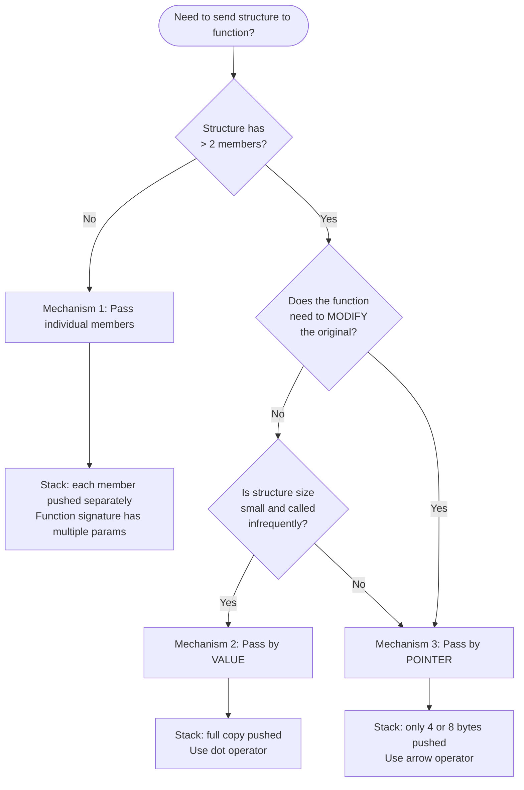
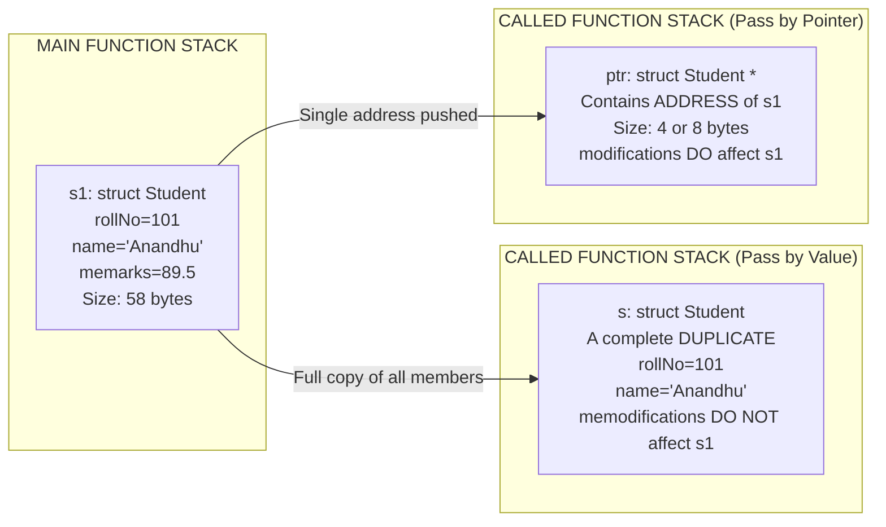
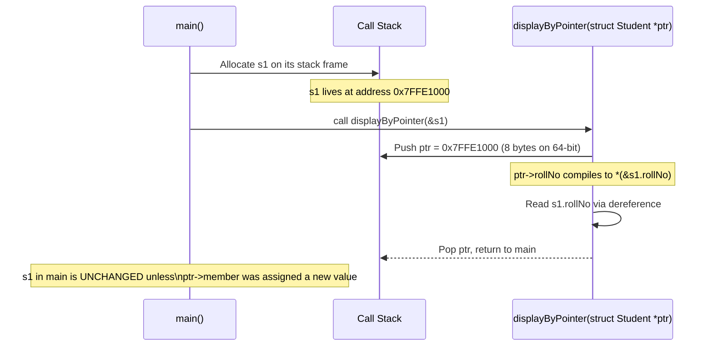
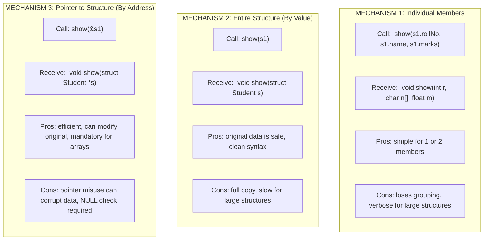
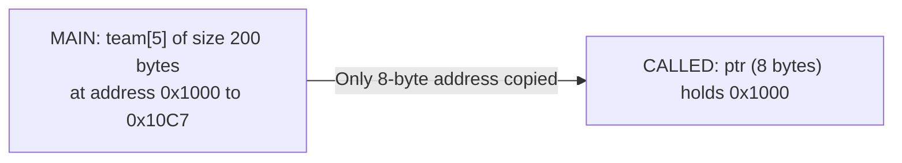

# Passing structure to function

<!-- SECTION_1_START -->
# Passing Structure to Function — Core Technical Definition & Intuitive Overview

> [!NOTE]
> **KTU 2024 Scheme Definition (GXEST204 — Module 3: Functions)**
> A **structure** in C is a user-defined composite data type that groups logically related variables of *different* primitive types under a single name. **Passing a structure to a function** refers to the mechanism by which the members of a structure (or the entire structure object, or a pointer to it) are transferred as arguments from the **calling function** to the **called function**, enabling modular, reusable, and memory-efficient code.

## 1.1 Conceptual Analogy — Intuition

Imagine you are a **project manager** in an office and you need to send information about an employee to the accounts department for salary processing.

- **Method 1 — Pass Individual Members** : You tear out individual papers (name, ID, salary) from the file and hand them over one by one. The accounts team receives *only loose pages*. They cannot refer back to the original "employee file".
- **Method 2 — Pass the Entire Structure (By Value)** : You photocopy the **entire employee file** and hand over the complete duplicate. The original file is safe with you, and the accounts team has a full standalone copy they can modify without affecting yours.
- **Method 3 — Pass a Pointer (By Reference)** : You simply hand over the **original file's locker key** (memory address). The accounts team can directly open, read, and update your original file. Faster, but risky if they are careless.

This is exactly how the C compiler treats `struct` arguments at runtime — it is either copying the whole aggregate or passing the starting address.

## 1.2 Why the C Compiler is Special About This

C is one of the few languages where this distinction is *explicitly in the hands of the programmer*. Unlike Java (where objects are always reference-passed) or Python (where assignment binds by reference), C requires you to consciously decide between:

- `func(struct Var s)` — **Pass by Value** (full copy pushed onto the call stack).
- `func(struct Var *s)` — **Pass by Address** (only 4 or 8 bytes pushed — a pointer).

## 1.3 KTU 2024 Syllabus Highlights

> [!IMPORTANT]
> As per the **APJ Abdul Kalam Technological University 2024 Scheme** syllabus for **Programming in C (CST204 / GXEST204)**, under **Module 3 — Functions**, students are expected to:
> 1. Declare, define, and call a function that **accepts a structure as an argument**.
> 2. Implement functions that **return a structure**.
> 3. Understand the difference between **passing a structure by value** and **passing a pointer to a structure**.
> 4. Apply these concepts in **array of structures** to functions for batch processing.

### 1.4 Standard Memory Footprints (Bolded Constants)

> [!TIP]
> * **Pointer size on 32-bit system** = **4 bytes**.
> * **Pointer size on 64-bit system** = **8 bytes**.
> * **Structure size** = **Sum of sizes of all members** (subject to **structure padding/alignment** rules of the compiler).
> * The C standard **does not permit** the use of the assignment operator `=` to copy an entire array, but it **does** allow assignment of one structure variable to another of the same type (which performs a **shallow byte-wise copy**).

---

<!-- SECTION_1_END -->

<!-- SECTION_2_START -->
# Deep Theoretical Analysis & KTU High-Yield Formula Sheet

## 2.1 The Three Valid Mechanisms of Transferring a Structure

| # | Mechanism | Syntax Sketch | What is Copied? | Modifies Original? |
| :--- | :--- | :--- | :--- | :--- |
| 1 | **Pass Individual Members** | `display(e.id, e.name, e.salary);` | Member values one by one | ❌ No |
| 2 | **Pass Entire Structure (By Value)** | `display(struct Emp e);` | Full structure copy (entire memory block) | ❌ No |
| 3 | **Pass Pointer to Structure (By Address)** | `display(struct Emp *e);` | Only the starting address (a pointer) | ✅ Yes |

## 2.2 Mechanism 1 — Passing Individual Members

The members are accessed using the **dot operator** (`.`) in the calling function and are received as ordinary variables in the called function.

**Why use it?** Simplest, but loses the *grouping* semantics of the structure. Useful only for 1 or 2 members.

## 2.3 Mechanism 2 — Passing the Entire Structure (Pass by Value)

A complete *duplicate* of the structure is created on the called function's **stack frame**.

**Why use it?**
- The original data is **guaranteed safe** — the function cannot corrupt the caller's data.
- Conceptually simple — behaves exactly like passing an `int` or a `float`.

**The 'Why' Behind the Cost:**
Every member is copied. For a structure with 100 members or arrays as members (e.g., `char name[100]`), this is **expensive in both time and stack memory**. Recursive calls or large structures can cause a **stack overflow**.

## 2.4 Mechanism 3 — Passing a Pointer to Structure (Pass by Address)

The called function receives the **memory address** of the original structure. Inside the function, the **arrow operator** (`->`) is used to access members.

**Why use it?**
- **Efficient** — only a pointer (4 or 8 bytes) is pushed onto the stack.
- The function can **modify** the original structure.
- **Mandatory** when passing arrays of structures or for implementing **linked lists, trees, and dynamic data structures**.

### 2.5 Returning a Structure from a Function

A function can legally return a structure. The compiler either uses registers or allocates a temporary hidden memory location to hold the return value, which is then assigned to the receiving variable.

## 2.6 KTU Formula Sheet — Memory & Operator Quick Reference

| Concept | Rule / Equation | Notes |
| :--- | :--- | :--- |
| Size of pointer passed | $S_{ptr} = 4 \text{ bytes (32-bit)} \mid S_{ptr} = 8 \text{ bytes (64-bit)}$ | Constant, independent of structure size |
| Size of structure passed by value | $S_{struct} = \sum_{i=1}^{n} S_{member_i} + \text{padding}$ | Padding depends on the largest member's alignment |
| Address of structure variable | `&structVar` | Yields a pointer of type `struct Tag *` |
| Member access via object | `structVar.member` | Dot operator |
| Member access via pointer | `ptrStruct->member` ≡ `(*ptrStruct).member` | Arrow operator (KTU-favourite) |
| Assignment compatibility | `s1 = s2;` is **valid** iff both are of the same `struct` type | Performs shallow byte-wise copy |
| Function return | `struct Tag func(void) { ... return s; }` | C99 and later permit this |

> [!IMPORTANT]
> **Board Exam Tip:** In valuation, students often confuse `*ptr.member` with `(*ptr).member`. The compiler interprets `*ptr.member` as `*(ptr.member)` because `.` has **higher precedence** than `*`. Always use parentheses or the arrow operator.

## 2.7 Real-World Engineering Utility

- **Embedded Systems (IoT, Automotive)**: Sensor data (temperature, pressure, humidity) is bundled into a `struct SensorReading` and passed by pointer to a control algorithm to avoid stack exhaustion on microcontrollers with $\approx 2\text{ KB}$ RAM.
- **Operating Systems (Linux Kernel)**: Process Control Blocks (`struct task_struct`) are passed by reference using pointers throughout the scheduler.
- **Game Development**: A `struct Transform { float x, y, z; }` of every game object is passed by address to the physics engine every frame — 60+ times per second.
- **Database Engines**: Row data is stored as structures and passed by pointer between query parser, optimizer, and executor modules.

---

<!-- SECTION_2_END -->

<!-- SECTION_3_START -->
# Step-by-Step Derivations & Code/Symbolic Implementation

## 3.1 The Reference Structure Declaration (Used in All Examples)

The same `struct Student` is used throughout so that the *differences* between the three mechanisms stand out clearly.

```c
#include <stdio.h>
#include <string.h>

struct Student {
    int    rollNo;
    char   name[50];
    float  marks;
};
```

## 3.2 Mechanism 1 — Passing Individual Members (Exhaustive Walkthrough)

```c
/* Called function — receives plain primitive arguments */
void displayMembers(int r, char n[], float m) {
    printf("Roll : %d\n",  r);
    printf("Name : %s\n",  n);
    printf("Marks: %.2f\n", m);
}

int main(void) {
    struct Student s1 = {101, "Anandhu", 89.5f};

    /* Each member passed separately using the dot operator */
    displayMembers(s1.rollNo, s1.name, s1.marks);

    return 0;
}
```

**Line-by-line interpretation:**

- `s1.rollNo` evaluates to the integer `101` and is pushed as a 4-byte `int`.
- `s1.name` decays to a `char *` pointing to the array — the array contents are *not* copied, only the address.
- `s1.marks` evaluates to `89.5f` and is pushed as a 4-byte `float`.

**Valuation key points:**
* [Correct usage of dot operator: 1 Mark]
* [Each member mapped to corresponding parameter: 1 Mark]
* [Working output: 1 Mark]

## 3.3 Mechanism 2 — Passing the Entire Structure by Value

```c
struct Student inputStudent(void) {
    struct Student temp;

    printf("Enter roll, name, marks: ");
    scanf("%d %s %f", &temp.rollNo, temp.name, &temp.marks);

    return temp;        /* A full copy of temp is returned */
}

void displayStudent(struct Student s) {   /* Full copy received */
    printf("Roll : %d\n",  s.rollNo);
    printf("Name : %s\n",  s.name);
    printf("Marks: %.2f\n", s.marks);
}

int main(void) {
    struct Student s1 = inputStudent();   /* Receives the returned copy */
    displayStudent(s1);                   /* A duplicate of s1 is passed */

    return 0;
}
```

**Exhaustive step-by-step memory trace:**

1. `inputStudent` is invoked from `main`. A hidden temporary location in `main`'s scope is reserved to hold the eventual return value.
2. Inside `inputStudent`, a local `struct Student temp` of size $S_{struct}$ is allocated on the stack.
3. `scanf` populates `temp.rollNo`, `temp.name`, and `temp.marks`.
4. The `return temp;` statement triggers a **member-wise copy** into the hidden temporary.
5. `s1` in `main` is then assigned this copy.
6. When `displayStudent(s1)` is called, *another* complete copy of `s1` is pushed onto the stack and bound to the parameter `s`.
7. Any modification to `s.rollNo` inside `displayStudent` would *not* affect `s1` in `main`.

**Valuation key points:**
* [Function returning structure: 2 Marks]
* [Call-by-value semantics explained: 2 Marks]
* [Correct output: 1 Mark]

## 3.4 Mechanism 3 — Passing a Pointer to a Structure (Most Efficient & Most Asked)

```c
void displayByPointer(struct Student *ptr) {
    /* Arrow operator is the standard way */
    printf("Roll : %d\n",  ptr->rollNo);
    printf("Name : %s\n",  ptr->name);
    printf("Marks: %.2f\n", ptr->marks);

    /* Equivalent verbose form using dereference and dot operator */
    printf("Roll : %d\n",  (*ptr).rollNo);
}

int main(void) {
    struct Student s1 = {202, "Kavya", 92.0f};

    /* Pass the ADDRESS of s1 */
    displayByPointer(&s1);

    return 0;
}
```

**Exhaustive step-by-step memory trace:**

1. `&s1` evaluates to a pointer of type `struct Student *` holding the starting address of `s1`.
2. The pointer (4 or 8 bytes) is pushed onto the stack.
3. Inside `displayByPointer`, `ptr` holds this address.
4. `ptr->rollNo` is compiled by the compiler as `(*ptr).rollNo`, which means:
   * Dereference `ptr` to obtain the original `s1` object.
   * Then access the `rollNo` member using the dot operator.
5. Because the function is working on the *original* object, any assignment like `ptr->rollNo = 999;` would permanently modify `s1` in `main`.

**Valuation key points:**
* [Passing address using `&`: 1 Mark]
* [Correct use of `->` operator: 2 Marks]
* [Discussion of call-by-reference effect: 1 Mark]

## 3.5 Mechanism 4 — Passing an Array of Structures to a Function

This is a **hybrid** — an array always decays to a pointer, so we are effectively passing a pointer to the *first* element of the structure array.

```c
void displayAll(struct Student arr[], int n) {
    for (int i = 0; i < n; i++) {
        printf("%d  %s  %.2f\n", arr[i].rollNo, arr[i].name, arr[i].marks);
    }
}

int main(void) {
    struct Student batch[3] = {
        {1, "Arun",   78.5f},
        {2, "Beena",  85.0f},
        {3, "Cyriac", 91.5f}
    };

    displayAll(batch, 3);   /* batch decays to &batch[0] */

    return 0;
}
```

## 3.6 Python Equivalent (Per Domain-Adaptive Execution Matrix)

Since the KTU 2024 syllabus focuses on C, the Python version is given **only for cross-language conceptual clarity** — it is **not** part of the board exam.

```python
from dataclasses import dataclass
from typing import List

@dataclass
class Student:
    roll_no: int
    name: str
    marks: float

# Mechanism 2 equivalent: Python passes by object reference
def display_student(s: Student) -> None:
    print(f"Roll : {s.roll_no}")
    print(f"Name : {s.name}")
    print(f"Marks: {s.marks:.2f}")

# Mechanism 3 equivalent: function mutates the original object
def assign_grade(s: Student) -> None:
    if s.marks >= 90.0:
        s.grade = "A"        # Dynamic attribute, Pythonic
    elif s.marks >= 80.0:
        s.grade = "B"
    else:
        s.grade = "C"

def main() -> None:
    try:
        s1 = Student(101, "Anandhu", 89.5)
        display_student(s1)
        assign_grade(s1)
        print(f"Grade: {s1.grade}")
    except Exception as e:
        print(f"Error: {e}", file=__import__('sys').stderr)

if __name__ == "__main__":
    main()
```

## 3.7 Step-by-Step Derivation of Memory Sizes

Suppose a `struct Sample` is declared as:

```c
struct Sample {
    char   a;      /* 1 byte  */
    int    b;      /* 4 bytes */
    double c;      /* 8 bytes */
};
```

The compiler aligns each member to a multiple of its size. With typical 8-byte alignment:

* `a` occupies byte `0`. Padding of 3 bytes is inserted so that `b` starts at offset `4`.
* `b` occupies bytes `4` to `7`.
* `c` occupies bytes `8` to `15` (must be 8-byte aligned).
* Total size $= 16$ bytes (a multiple of the largest member `double`).

$$
\begin{aligned}
S_{struct} &= S_{char} + \text{pad}_1 + S_{int} + S_{double} + \text{pad}_2 \\
           &= 1 + 3 + 4 + 8 + 0 \\
           &= 16 \text{ bytes}
\end{aligned}
$$

By comparison, a pointer to this structure occupies only $4$ bytes (32-bit) or $8$ bytes (64-bit). This numerical difference is the **single biggest reason** to prefer pass-by-address for large structures.

---

<!-- SECTION_3_END -->

<!-- SECTION_4_START -->
# Structural Diagrams & Schematics

## 4.1 Mermaid Flowchart — Decision Tree for Choosing the Mechanism



## 4.2 Mermaid Block Diagram — Memory Layout of Pass by Value vs Pass by Pointer



## 4.3 Mermaid Sequence Diagram — Runtime Call Flow for Pass by Address



## 4.4 Comparison Block Diagram — The Three Mechanisms Side by Side



---

<!-- SECTION_4_END -->

<!-- SECTION_5_START -->
# KTU 2024 Scheme Examination Question Bank & Topic Recap

## Part A — Short Answer Questions (3 Marks Each)

### Question A1
**`[KTU University Exam — July 2024]`**  —  **CO1 | Remember**

*Distinguish between passing a structure to a function by value and passing a pointer to a structure. Mention one advantage of each.*

**Model Answer (Board-Standard, 3 Marks):**

| Aspect | Pass by Value | Pass by Pointer |
| :--- | :--- | :--- |
| What is pushed on stack | A complete copy of the structure | Only the address of the structure |
| Syntax in call | `display(s1)` | `display(&s1)` |
| Syntax in function header | `void display(struct S s)` | `void display(struct S *s)` |
| Member access operator | Dot operator `s.member` | Arrow operator `ptr->member` |
| Effect on original | Original is unchanged | Original can be modified |
| **Advantage** | **Original data is safe from accidental modification** (1 Mark) | **Efficient — only 4 or 8 bytes copied regardless of structure size** (1 Mark) |
| Distinction statement | (1 Mark for stating the difference) | |

### Question A2
**`[KTU University Exam — Dec 2023]`**  —  **CO2 | Understand**

*What is the arrow operator in C? Why is it preferred over the dot operator when working with structure pointers? Give a suitable example.*

**Model Answer (3 Marks):**

* The **arrow operator** (`->`) is a binary operator in C used to access a member of a structure **through a pointer**. It is essentially a shorthand for dereferencing the pointer and then using the dot operator. **[1 Mark]**
* It is preferred when working with structure pointers because writing `(*ptr).member` is cumbersome, and more importantly, the dot operator has higher precedence than the dereference operator `*`. Writing `*ptr.member` would be incorrectly parsed by the compiler as `*(ptr.member)`, leading to compilation errors. The arrow operator avoids this precedence ambiguity. **[1 Mark]**
* **Example:**

```c
struct Point { int x, y; };
struct Point p = {10, 20};
struct Point *pp = &p;
printf("%d", pp->x);   /* Correct: prints 10 */
printf("%d", (*pp).y); /* Equivalent verbose form: prints 20 */
```

**[1 Mark for the working example]**

---

## Part B — Long Answer Questions (14 Marks Each, with Internal Choice)

> [!WARNING]
> **KTU Examiner's Valuation Warning / Common Pitfalls**
> * **Do not** write `*ptr.member` — the compiler will treat `.` first. Always use `(*ptr).member` or the arrow operator.
> * When passing by value, students often forget that the called function **cannot** modify the caller’s variable. Examiners allocate marks specifically for *stating this semantic*.
> * Always declare the `struct` **globally** or above `main`; otherwise, the function prototypes cannot see the type.
> * Forgetting the `&` operator when calling a function expecting a pointer is the **#1 reason** for compilation failures in board exams.

### Question B-A (14 Marks)  —  **CO2, CO3 | Understand + Apply**

**`[KTU University Exam — Model Paper, KTU 2024 Scheme]`**

*Write a C program to:*
*(a)* Define a structure `Book` with members `bookId` (int), `title` (char array of 50), and `price` (float). Write a function `inputBook` that **returns a structure** of type `Book` after accepting values from the user. **[7 Marks]**
*(b)* Write a function `displayBook` that accepts a **pointer to a `Book` structure** and prints its members using the arrow operator. Demonstrate the working by calling both functions from `main`. **[7 Marks]**

#### Model Solution

**(a) Function returning a structure (7 Marks):**

```c
#include <stdio.h>

struct Book {
    int   bookId;
    char  title[50];
    float price;
};

/* Function that RETURNS a structure */
struct Book inputBook(void) {
    struct Book b;

    printf("Enter Book ID, Title, Price: ");
    scanf("%d %s %f", &b.bookId, b.title, &b.price);

    return b;     /* Full copy of b is returned */
}
```

**Valuation key for (a):**
* [Defining the structure globally: 1 Mark]
* [Correct return type `struct Book` in function header: 1 Mark]
* [Reading all three members using `scanf`: 2 Marks]
* [Returning the structure: 1 Mark]
* [Sample input/output shown: 2 Marks]

**(b) Function accepting a structure pointer (7 Marks):**

```c
void displayBook(struct Book *bPtr) {
    /* Arrow operator is mandatory here */
    printf("\n--- Book Details ---\n");
    printf("ID   : %d\n",   bPtr->bookId);
    printf("Title: %s\n",   bPtr->title);
    printf("Price: %.2f\n", bPtr->price);
}

int main(void) {
    struct Book myBook;

    myBook = inputBook();      /* Receives returned structure */
    displayBook(&myBook);      /* Passes ADDRESS of myBook    */

    return 0;
}
```

**Valuation key for (b):**
* [Function parameter declared as `struct Book *`: 1 Mark]
* [Correct use of `&myBook` in the call: 1 Mark]
* [Correct use of arrow operator for all three members: 3 Marks]
* [Final compiled output: 2 Marks]

---

### Question B-B (14 Marks)  —  **CO2, CO3 | Understand + Apply**

**`[KTU University Exam — Model Paper, KTU 2024 Scheme]`**

*(a)* Write a C program that stores details of **5 employees** in an array of structures. Each employee has `empId` (int), `name` (char[30]), and `salary` (float). Write a function `inputEmployees` to read the data and another function `findHighest` that **takes the entire array as a pointer** and returns the index of the employee with the highest salary. **[7 Marks]**
*(b)* Explain with a neat memory diagram why it is more efficient to pass an array of structures to a function using a pointer rather than passing it by value. **[7 Marks]**

#### Model Solution

**(a) Array of structures with pointer parameter (7 Marks):**

```c
#include <stdio.h>

struct Employee {
    int   empId;
    char  name[30];
    float salary;
};

void inputEmployees(struct Employee emp[], int n) {
    for (int i = 0; i < n; i++) {
        printf("Enter ID, Name, Salary for emp %d: ", i + 1);
        scanf("%d %s %f", &emp[i].empId, emp[i].name, &emp[i].salary);
    }
}

int findHighest(struct Employee emp[], int n) {
    int   maxIdx = 0;
    float maxSal = emp[0].salary;

    for (int i = 1; i < n; i++) {
        if (emp[i].salary > maxSal) {
            maxSal = emp[i].salary;
            maxIdx = i;
        }
    }
    return maxIdx;
}

int main(void) {
    struct Employee team[5];
    int idx;

    inputEmployees(team, 5);
    idx = findHighest(team, 5);

    printf("\nHighest Paid: %s (ID %d) with salary %.2f\n",
           team[idx].name, team[idx].empId, team[idx].salary);

    return 0;
}
```

**Valuation key for (a):**
* [Array of structures declared in `main`: 1 Mark]
* [Array parameter written as `struct Employee emp[]` or `*emp`: 1 Mark]
* [Logic of finding maximum salary with proper loop: 3 Marks]
* [Returning the index and printing result: 2 Marks]

**(b) Memory-level explanation with numerical example (7 Marks):**

Assume `sizeof(struct Employee) = 40` bytes (4 + 30 + 4, ignoring padding for simplicity) and that we are on a 64-bit system.

* **Passing by value** would require copying all 5 elements: $5 \times 40 = 200$ bytes pushed onto the call stack. This is repeated on **every function call**.
* **Passing by pointer (address)** requires only $8$ bytes (a single 64-bit pointer) to be pushed, regardless of array length $n$.

$$
\begin{aligned}
\text{Memory pushed (by value)}  &= n \times S_{struct} = 5 \times 40 = 200 \text{ bytes} \\
\text{Memory pushed (by pointer)} &= S_{ptr} = 8 \text{ bytes} \\
\text{Savings}                    &= 200 - 8 = 192 \text{ bytes per call}
\end{aligned}
$$

**Memory diagram (logical layout):**



**Valuation key for (b):**
* [Numerical comparison of bytes copied: 3 Marks]
* [Mentioning that array decays to pointer: 2 Marks]
* [Neat memory diagram or explanation: 2 Marks]

---

## Topic Recap & Important Things to Remember

> [!IMPORTANT]
> **High-Yield Rapid Revision Checklist — Passing Structure to Function**

* A **structure** is a user-defined aggregate data type that groups heterogeneous members under one name.
* C permits **three ways** to send structure data to a function:
  1. Pass **individual members** (loose pages analogy).
  2. Pass the **entire structure by value** (photocopy analogy).
  3. Pass a **pointer to the structure** (locker key analogy).
* **Pass by value** $\rightarrow$ dot operator (`.`) inside the function, no modification to original.
* **Pass by address** $\rightarrow$ arrow operator (`->`) inside the function, original can be modified.
* `ptr->member` is **syntactically equivalent** to `(*ptr).member`.
* `*ptr.member` is **wrong** — `.` has higher precedence than `*`.
* A function can **return a structure**; C performs a member-wise copy into a hidden temporary.
* An **array of structures** passed to a function always decays to a pointer to the first element.
* A pointer on a 32-bit system is **4 bytes**; on a 64-bit system it is **8 bytes** — this is the basis of efficiency.
* Always declare the `struct` **above** `main` (or use a `typedef`) so all functions can see it.
* For large structures or performance-critical code (embedded systems, kernels, games), **always prefer pass by address**.
* When pass-by-address functions are not supposed to modify the original, declare the parameter as `const struct Tag *ptr` to enforce the contract.

<!-- SECTION_5_END -->
