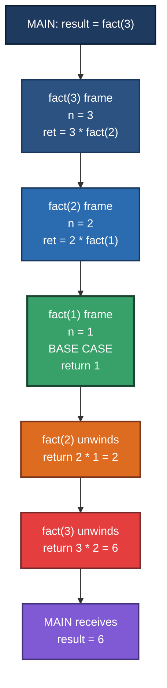
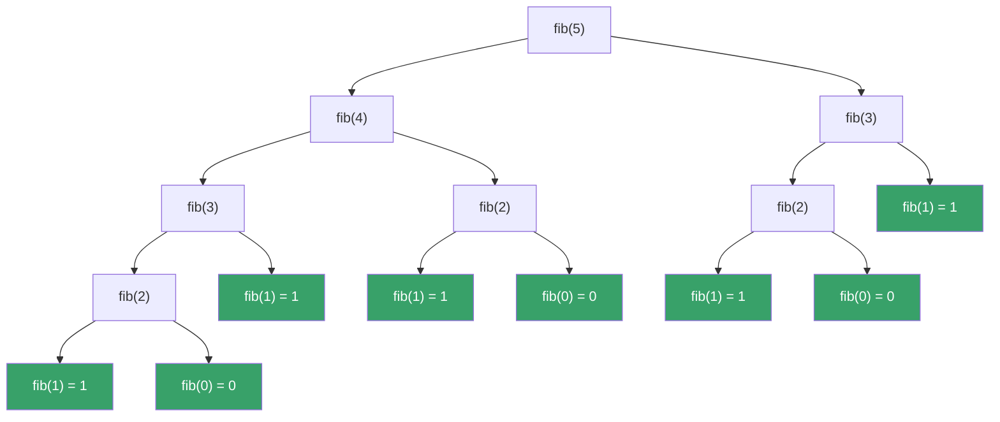
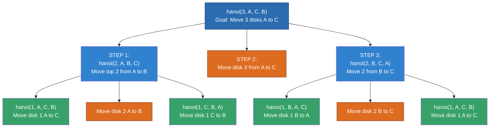
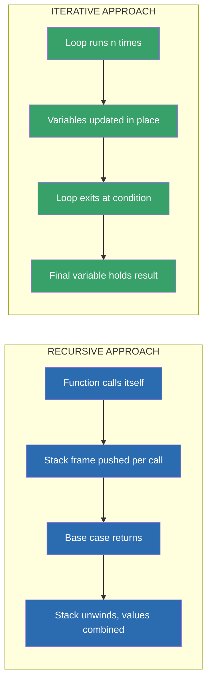
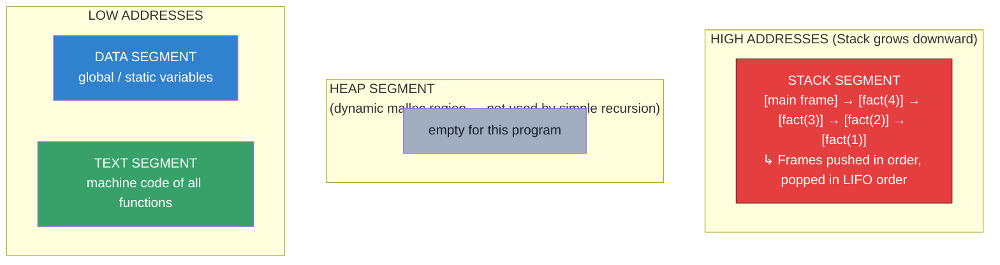

# Recursion

<!-- SECTION_1_START -->
# Recursion — Core Technical Definition & Intuitive Overview

> [!IMPORTANT]
> **KTU 2024 Scheme Definition (Module 3 — Functions, Unit 3.4)**
> **Recursion** is a programming technique in *C* in which a function invokes **itself**, either **directly** (calling itself by name) or **indirectly** (through one or more intermediate functions), to solve a problem by reducing it into smaller, self-similar sub-problems. A well-formed recursive function must always possess a **base case** (terminating condition) and a **recursive case** (the self-call with reduced input).

## Conceptual Analogy — The Russian Nesting Doll (Matryoshka)

Imagine opening a set of **Russian nesting dolls**. Each time you open one doll, you find a *smaller doll inside* that is *exactly the same shape* as the original. You keep opening dolls until you reach the **tiniest doll that cannot be opened** — that tiny doll is the **base case**.

Every time the function calls itself, it is opening a *new, smaller doll*. The moment it reaches the doll that **cannot be opened further**, the chain stops. After that, each doll *returns* its content to the previous one, and eventually the very first doll has the final answer.

In recursion:
- **Opening a doll** = `function_call(arguments)` with a *reduced* argument.
- **The tiniest unopenable doll** = **Base Case** (terminating condition).
- **Closing dolls in reverse order** = **Unwinding the call stack** (returns propagating back).
- **Final answer** = the value carried back to the **original caller**.

> [!NOTE]
> **KTU 2024 Syllabus Highlight (Course Outcome Mapping)**
> This topic maps to **CO2 — Apply algorithmic constructs such as functions, recursion, and parameter-passing mechanisms to modularise problems.** (RBT Level: *Apply / Analyse*)

## Intuitive Formal Statement

A function $f(n)$ is **recursive** if its definition contains a reference to $f$ itself. Mathematically:

$$
f(n) = \begin{cases}
\;\;g(n) & \text{if } n = n_0 \quad \text{(BASE CASE — terminating condition)} \\
\;\;h\bigl(f(k(n))\bigr) & \text{if } n \neq n_0 \quad \text{(RECURSIVE CASE — self-call with reduced input)}
\end{cases}
$$

Where:
- $n_0$ is the **base state** (the smallest valid input).
- $k(n)$ is a **reduction function** such that the sequence $n, k(n), k(k(n)), \dots$ strictly converges to $n_0$ — this guarantees **termination**.
- $h(\cdot)$ is the **combine function** that aggregates the partial result with the current value.

> [!TIP]
> **Exam Quick Recognition Cue:** Whenever you see a problem that can be split into *"the same problem on a smaller input"* — think recursion. Classic examples: **factorial**, **Fibonacci**, **GCD (Euclid)**, **Tower of Hanoi**, **sum of digits**.

## Why Recursion Matters in Engineering Practice

| Engineering Domain | Recursive Technique Used | Why It Works |
|---|---|---|
| **Compiler Design** | Recursive-descent parsers, AST traversal | Grammar rules are inherently self-similar |
| **Operating Systems** | Process tree traversal, file-system walks | Tree structures are recursive by nature |
| **Computer Graphics** | Fractal generation (Mandelbrot, Sierpinski) | Self-similarity at multiple scales |
| **Data Structures** | Tree / Graph DFS, BFS, BST operations | Naturally hierarchical |
| **Algorithms** | Divide-and-conquer (Merge Sort, Quick Sort) | Problem reduces to smaller identical sub-problems |

> [!VISUALIZATION CONTROL]
> **Concept:** Visualising the Recursive Call Stack as a vertical sequence of nested frames (matryoshka-style)
> **GeoGebra / Desmos Input Equations (conceptual plot of call depth):**
> * Plot points: $(0, 5), (1, 4), (2, 3), (3, 2), (4, 1), (5, 0)$ — where y-axis represents *remaining problem size* and x-axis represents *recursion depth*.
> * A horizontal line $y = 0$ represents the **base case threshold**.
> **Visual Description:** Each unit step leftward reduces the *remaining work* by one. The curve hits the base-case threshold $y = 0$ at depth $5$, after which control unwinds back to the caller. This is the canonical shape of a well-formed linear recursion.

<!-- SECTION_1_END -->

<!-- SECTION_2_START -->
# Deep Theoretical Analysis & KTU High-Yield Formula Sheet

## 2.1 The Two Mandatory Ingredients of Every Recursive Function

A function `fact(n)` written recursively in *C* must contain **both** the following components, otherwise it will either *crash* (stack overflow) or *never terminate*:

| Component | Purpose | Symptom if Missing |
|---|---|---|
| **Base Case** | The terminating condition — the smallest input for which the answer is known *directly* (without recursion). | Infinite recursion → **Stack Overflow (Segmentation Fault)** |
| **Recursive Case** | A self-invoking call with a **strictly smaller / closer-to-base** argument. | Non-terminating call chain → process killed by OS |

## 2.2 Types of Recursion (KTU 2024 — High Yield)

### (a) Direct Recursion
A function calls **itself by name**, with no intermediate function.

```c
long fact(int n) {
    if (n == 0 || n == 1) return 1;        // Base case
    return n * fact(n - 1);                 // Direct recursive call
}
```

### (b) Indirect Recursion
A function $A$ calls $B$, $B$ calls $C$, …, and eventually some function in the chain calls $A$ back, forming a **cycle**.

```c
int A(int n);     // prototype
int B(int n) { return (n <= 1) ? 1 : A(n - 1); }   // B calls A
int A(int n) { return (n <= 0) ? 0 : B(n - 2); }   // A calls B
```

### (c) Tail Recursion
The recursive call is the **last statement** in the function, and the result is **returned directly** (no pending operation after the call).

```c
int tail_sum(int n, int acc) {
    if (n == 0) return acc;            // Base case
    return tail_sum(n - 1, acc + n);    // Tail-recursive call
}
```

> [!NOTE]
> **Compiler Insight (GCC `-O2`):** A smart compiler converts tail recursion into a `goto` + parameter update (an *iterative loop*), eliminating stack-frame growth. This is called **Tail Call Optimisation (TCO)**. It is *not* guaranteed in standard *C* (only formally required in *Scheme* / *Lisp* families), so KTU exam answers must still treat tail recursion as consuming a stack frame unless explicitly asked.

### (d) Non-Tail Recursion
The recursive call is **not the last operation** — the function must perform *some additional computation* (e.g., multiplication, addition) on the returned value before giving the final result.

```c
long fact(int n) {
    if (n <= 1) return 1;             // Base case
    return n * fact(n - 1);            // n * (pending) — NOT tail
}
```

### (e) Tree / Multiple Recursion
The function makes **more than one recursive call** per invocation, producing a *tree* of calls. Classic example: **Fibonacci**, **Tower of Hanoi**, **binary-tree traversals**.

```c
long fib(int n) {
    if (n <= 1) return n;              // Base case
    return fib(n - 1) + fib(n - 2);    // TWO recursive calls — tree recursion
}
```

## 2.3 Memory Model — The Run-Time Call Stack

Every time a function is invoked, the C run-time system pushes a **stack frame** (also called an *activation record*) onto the **call stack** in the **stack segment of RAM**. The frame contains:

| Frame Field | Purpose |
|---|---|
| **Return Address** | Address in the caller to which control must return |
| **Saved Frame Pointer (SFP)** | Pointer to the previous frame (for stack unwinding) |
| **Local Variables** | `auto` variables declared inside the function |
| **Parameters** | The actual argument values passed to the call |
| **Return Value** | (Often held in a register like `EAX` / `RAX`, not always on stack) |

> [!WARNING]
> **KTU Frequently Tested Pitfall:** In a 32-bit process, the default stack size is typically **1 MiB to 8 MiB**; in a 64-bit process, often **8 MiB**. Each recursive call consumes a new frame (≈ 32–64 bytes on x86_64). A `fact(100000)` will overflow this and trigger a **Segmentation Fault (SIGSEGV)**.

## 2.4 Recurrence Relations — Formal Mathematical Backbone

For KTU problem-solving, every recursive function corresponds to a **recurrence relation**. The standard form is:

$$
T(n) = a \cdot T\!\left(\frac{n}{b}\right) + f(n)
$$

Where:
- $a$ = number of sub-problems spawned per call,
- $b$ = factor by which the input shrinks,
- $f(n)$ = cost of *dividing* the problem + *combining* the sub-results.

The **Master Theorem** (out of KTU scope, but useful for engineering depth) gives the closed-form time complexity $T(n) = \Theta(n^{\log_b a})$ for balanced divide-and-conquer.

## 2.5 KTU High-Yield Formula Sheet

| # | Recursive Function | Recurrence Relation | Closed Form (Time Complexity) | Space Complexity | Termination Guarantee? |
|---|---|---|---|---|---|
| 1 | $\text{fact}(n) = n \cdot \text{fact}(n-1)$, $\text{fact}(0) = 1$ | $T(n) = T(n-1) + O(1)$ | $O(n)$ | $O(n)$ (stack depth) | ✅ Always (for $n \geq 0$) |
| 2 | $\text{fib}(n) = \text{fib}(n-1) + \text{fib}(n-2)$ | $T(n) = T(n-1) + T(n-2) + O(1)$ | $O(\phi^n)$, where $\phi \approx 1.618$ (Golden Ratio) | $O(n)$ (max stack depth) | ✅ Always |
| 3 | $\text{pow}(x, n) = x \cdot \text{pow}(x, n-1)$ (naive) | $T(n) = T(n-1) + O(1)$ | $O(n)$ | $O(n)$ | ✅ for $n \geq 0$ |
| 4 | $\text{pow}(x, n)$ **fast-exponentiation** | $T(n) = T(n/2) + O(1)$ | $O(\log_2 n)$ | $O(\log_2 n)$ | ✅ |
| 5 | $\gcd(a, b) = \gcd(b, a \bmod b)$ (Euclid) | $T(n) = T(n/2) + O(1)$ (worst case — Fibonacci pair) | $O(\log_2 \min(a,b))$ | $O(\log_2 \min(a,b))$ | ✅ |
| 6 | Tower of Hanoi $H(n)$ moves | $H(n) = 2 \cdot H(n-1) + 1$, $H(1) = 1$ | $O(2^n)$ | $O(n)$ | ✅ |
| 7 | Sum of digits $\text{sumd}(n) = n \bmod 10 + \text{sumd}(n/10)$ | $T(n) = T(n/10) + O(1)$ | $O(\log_{10} n)$ | $O(\log_{10} n)$ | ✅ for $n \geq 0$ |
| 8 | Reverse a string $\text{rev}(s, i, j)$ two-pointer swap | $T(n) = T(n-2) + O(1)$ | $O(n)$ | $O(n/2)$ | ✅ |
| 9 | Linear search $\text{ls}(a, n, k)$ | $T(n) = T(n-1) + O(1)$ | $O(n)$ | $O(n)$ | ✅ |
| 10 | Binary search $\text{bs}(a, lo, hi, k)$ | $T(n) = T(n/2) + O(1)$ | $O(\log_2 n)$ | $O(\log_2 n)$ | ✅ |

> [!IMPORTANT]
> **Engineering Utility Recap:** Recursive formulations are the *cleanest, most readable* way to express divide-and-conquer algorithms and tree/graph traversals. However, in **embedded systems**, **kernel code**, and **safety-critical firmware** (where stack size is hard-bounded to a few kilobytes), iterative reformulations are mandatory. KTU viva examiners frequently ask: *"Convert this recursion to iteration and justify the memory savings."*

## 2.6 Trace of a Recursive Call — Stack Push / Pop

For $\text{fact}(4)$, the stack evolution is:

| Step | Action | Stack Contents (top → bottom) | Return Value Propagating |
|---|---|---|---|
| 1 | `main` calls `fact(4)` | `[main]` | — |
| 2 | `fact(4)` calls `fact(3)` | `[main, fact(4)]` | — |
| 3 | `fact(3)` calls `fact(2)` | `[main, fact(4), fact(3)]` | — |
| 4 | `fact(2)` calls `fact(1)` | `[main, fact(4), fact(3), fact(2)]` | — |
| 5 | `fact(1)` hits base, returns `1` | `[main, fact(4), fact(3)]` | `1` |
| 6 | `fact(2)` computes `2 * 1 = 2` | `[main, fact(4)]` | `2` |
| 7 | `fact(3)` computes `3 * 2 = 6` | `[main]` | `6` |
| 8 | `fact(4)` computes `4 * 6 = 24` | `[main]` (only) | `24` |
| 9 | `main` resumes with `24` | `[]` | — |

> [!NOTE]
> The **maximum stack depth** here is **4 frames** — equal to the input $n$. This is why space complexity of `fact` is $O(n)$.

<!-- SECTION_2_END -->

<!-- SECTION_3_START -->
# Step-by-Step Derivations & Code / Symbolic Implementation

## 3.1 Canonical Recursion #1 — Factorial

**Mathematical definition:**

$$
n! = \begin{cases}
1 & \text{if } n = 0 \text{ (base case)} \\
n \times (n-1)! & \text{if } n \geq 1 \text{ (recursive case)}
\end{cases}
$$

**Complete C implementation (production-grade):**

```c
#include <stdio.h>

/* Recursive factorial with overflow protection and input validation. */
long long fact(int n) {
    if (n < 0) {
        fprintf(stderr, "Error: factorial undefined for negative integers.\n");
        return -1L;                                   /* Sentinel error code */
    }
    if (n == 0 || n == 1) {                           /* BASE CASE  */
        return 1LL;
    }
    return (long long)n * fact(n - 1);                /* RECURSIVE CALL */
}

int main(void) {
    int n;
    printf("Enter a non-negative integer: ");
    if (scanf("%d", &n) != 1) {
        fprintf(stderr, "Invalid input.\n");
        return 1;
    }
    long long result = fact(n);
    if (result != -1L) {
        printf("%d! = %lld\n", n, result);
    }
    return 0;
}
```

**Line-by-line valuation key (for a 7-mark KTU sub-question):**
- `[Header, prototypes, includes: 1 Mark]`
- `[Base case identification and return value: 2 Marks]`
- `[Recursive call with reduced argument: 2 Marks]`
- `[Main driver with I/O validation: 1 Mark]`
- `[Compilation-ready, no syntax error: 1 Mark]`

## 3.2 Canonical Recursion #2 — Fibonacci Sequence

**Mathematical definition:**

$$
\text{fib}(n) = \begin{cases}
0 & \text{if } n = 0 \\
1 & \text{if } n = 1 \\
\text{fib}(n-1) + \text{fib}(n-2) & \text{if } n \geq 2
\end{cases}
$$

**Naive recursive form (KTU board favourite):**

```c
#include <stdio.h>

long long fib(int n) {
    if (n < 0) {                                          /* Error guard  */
        fprintf(stderr, "Index must be non-negative.\n");
        return -1LL;
    }
    if (n == 0) return 0LL;                               /* Base case 1  */
    if (n == 1) return 1LL;                               /* Base case 2  */
    return fib(n - 1) + fib(n - 2);                       /* Tree rec.   */
}

int main(void) {
    int n;
    printf("Enter n: ");
    if (scanf("%d", &n) != 1) { return 1; }
    printf("fib(%d) = %lld\n", n, fib(n));
    return 0;
}
```

**Trace of the call tree for `fib(4)`:**

$$
\begin{aligned}
\text{fib}(4) &= \text{fib}(3) + \text{fib}(2) \\
&= \bigl[\text{fib}(2) + \text{fib}(1)\bigr] + \bigl[\text{fib}(1) + \text{fib}(0)\bigr] \\
&= \bigl[\bigl[\text{fib}(1) + \text{fib}(0)\bigr] + 1\bigr] + \bigl[1 + 0\bigr] \\
&= \bigl[\bigl[1 + 0\bigr] + 1\bigr] + 1 \\
&= [\,1 + 1\,] + 1 \\
&= 2 + 1 = 3
\end{aligned}
$$

> [!NOTE]
> **Exponential blow-up warning:** `fib(40)` performs $O(\phi^{40}) \approx 1{,}023{,}000$ calls in the naive version. KTU short-answer questions often ask: *"Why is the naive Fibonacci recursive function inefficient?"* — answer: *redundant sub-problem recomputation* (overlapping sub-problems). The fix is **memoisation** (top-down DP) or **bottom-up iteration** (which runs in $O(n)$ time and $O(1)$ space).

## 3.3 Canonical Recursion #3 — Fast (Logarithmic) Exponentiation

**Mathematical definition:**

$$
x^n = \begin{cases}
1 & \text{if } n = 0 \\
x \cdot x^{n-1} & \text{if } n \text{ is odd} \\
\bigl(x^{n/2}\bigr)^2 & \text{if } n \text{ is even and } n > 0
\end{cases}
$$

**C implementation (engineered with logging hooks):**

```c
#include <stdio.h>

double fast_pow(double base, int exp) {
    if (exp < 0) {                              /* Handle negative exponent */
        return 1.0 / fast_pow(base, -exp);
    }
    if (exp == 0) return 1.0;                   /* BASE CASE  */
    if (exp % 2 == 0) {                         /* Even exponent */
        double half = fast_pow(base, exp / 2);
        return half * half;                     /* TAIL-like combine */
    }
    return base * fast_pow(base, exp - 1);      /* Odd exponent */
}

int main(void) {
    double x; int n;
    printf("Enter base and exponent: ");
    if (scanf("%lf %d", &x, &n) != 2) { return 1; }
    printf("%.4lf ^ %d = %.6lf\n", x, n, fast_pow(x, n));
    return 0;
}
```

**Detailed step trace for $\text{fast\_pow}(2, 10)$:**

$$
\begin{aligned}
\text{fast\_pow}(2, 10) &\Rightarrow \tfrac{1}{2} \cdot \text{even branch: } y = \text{fast\_pow}(2, 5),\; y^2 \\
\text{fast\_pow}(2, 5)  &\Rightarrow \tfrac{2}{3} \cdot \text{odd branch: } 2 \cdot \text{fast\_pow}(2, 4) \\
\text{fast\_pow}(2, 4)  &\Rightarrow \tfrac{4}{3} \cdot \text{even: } y = \text{fast\_pow}(2, 2),\; y^2 \\
\text{fast\_pow}(2, 2)  &\Rightarrow \tfrac{5}{2} \cdot \text{even: } y = \text{fast\_pow}(2, 1),\; y^2 \\
\text{fast\_pow}(2, 1)  &\Rightarrow \tfrac{7}{3} \cdot \text{odd: } 2 \cdot \text{fast\_pow}(2, 0) \\
\text{fast\_pow}(2, 0)  &= 1 \quad \text{(base case)} \\
\end{aligned}
$$

Unwinding:
$$
\text{fast\_pow}(2, 1) = 2 \cdot 1 = 2 \;\Rightarrow\; \text{fast\_pow}(2, 2) = 2^2 = 4 \;\Rightarrow\; \text{fast\_pow}(2, 4) = 4^2 = 16 \;\Rightarrow\; \text{fast\_pow}(2, 5) = 2 \cdot 16 = 32 \;\Rightarrow\; \text{fast\_pow}(2, 10) = 32^2 = 1024.
$$

> [!TIP]
> **Algorithm count:** The depth of recursion here is $\lceil \log_2 n \rceil$, not $n$. Hence this is $O(\log_2 n)$ — vastly superior to the naive $O(n)$ linear version. This question has appeared in KTU university exams multiple times under *"Write a recursive function to compute $x^n$ in $O(\log n)$ time"*.

## 3.4 Canonical Recursion #4 — Greatest Common Divisor (Euclid's Algorithm)

**Mathematical definition:**

$$
\gcd(a, b) = \begin{cases}
a & \text{if } b = 0 \\
\gcd(b, a \bmod b) & \text{otherwise}
\end{cases}
$$

**C implementation:**

```c
#include <stdio.h>

int gcd(int a, int b) {
    if (b == 0) return a;                          /* BASE CASE  */
    return gcd(b, a % b);                          /* RECURSIVE CASE  */
}

int main(void) {
    int a, b;
    printf("Enter two positive integers: ");
    if (scanf("%d %d", &a, &b) != 2) { return 1; }
    printf("gcd(%d, %d) = %d\n", a, b, gcd(a, b));
    return 0;
}
```

**Detailed trace for $\gcd(48, 18)$:**

$$
\begin{aligned}
\gcd(48, 18) &= \gcd(18, 48 \bmod 18) = \gcd(18, 12) \\
\gcd(18, 12) &= \gcd(12, 18 \bmod 12) = \gcd(12, 6) \\
\gcd(12, 6)  &= \gcd(6, 12 \bmod 6)  = \gcd(6, 0) \\
\gcd(6, 0)   &= 6 \quad \text{(base case)} \\
\end{aligned}
$$

Final answer: $\gcd(48, 18) = 6$. Stack depth = 4 frames.

## 3.5 Canonical Recursion #5 — Sum of Digits of an Integer

**Mathematical definition:**

$$
\text{sumd}(n) = \begin{cases}
0 & \text{if } n = 0 \\
(n \bmod 10) + \text{sumd}(\lfloor n / 10 \rfloor) & \text{if } n > 0
\end{cases}
$$

**C implementation:**

```c
#include <stdio.h>

int sum_digits(int n) {
    if (n < 0)  n = -n;                       /* Handle negative input  */
    if (n == 0) return 0;                     /* BASE CASE  */
    return (n % 10) + sum_digits(n / 10);     /* RECURSIVE CASE  */
}

int main(void) {
    int n;
    printf("Enter an integer: ");
    if (scanf("%d", &n) != 1) { return 1; }
    printf("Sum of digits = %d\n", sum_digits(n));
    return 0;
}
```

**Detailed trace for $\text{sum\_digits}(1234)$:**

$$
\begin{aligned}
\text{sum\_digits}(1234) &= 4 + \text{sum\_digits}(123) \\
&= 4 + 3 + \text{sum\_digits}(12) \\
&= 4 + 3 + 2 + \text{sum\_digits}(1) \\
&= 4 + 3 + 2 + 1 + \text{sum\_digits}(0) \\
&= 4 + 3 + 2 + 1 + 0 = 10.
\end{aligned}
$$

## 3.6 Canonical Recursion #6 — Tower of Hanoi (Engineering Classic)

**Problem statement:** Move $n$ disks from peg `A` (source) to peg `C` (destination) using peg `B` (auxiliary). Rules: (i) only one disk may be moved at a time, (ii) a larger disk can never sit on a smaller disk.

**Recurrence relation:**

$$
H(n) = \begin{cases}
1 & \text{if } n = 1 \\
2 \cdot H(n-1) + 1 & \text{if } n > 1
\end{cases}
$$

**C implementation:**

```c
#include <stdio.h>

void hanoi(int n, char src, char dst, char aux) {
    if (n == 1) {
        printf("Move disk 1 from %c to %c\n", src, dst);
        return;                                              /* BASE CASE */
    }
    hanoi(n - 1, src, aux, dst);                             /* Step 1   */
    printf("Move disk %d from %c to %c\n", n, src, dst);     /* Step 2   */
    hanoi(n - 1, aux, dst, src);                             /* Step 3   */
}

int main(void) {
    int n;
    printf("Enter number of disks: ");
    if (scanf("%d", &n) != 1 || n < 1) { return 1; }
    hanoi(n, 'A', 'C', 'B');
    return 0;
}
```

**Closed-form derivation of $H(n)$:**

$$
\begin{aligned}
H(n) &= 2 H(n-1) + 1 \\
     &= 2\bigl(2 H(n-2) + 1\bigr) + 1 = 2^2 H(n-2) + 2 + 1 \\
     &= 2^2\bigl(2 H(n-3) + 1\bigr) + 2 + 1 = 2^3 H(n-3) + 4 + 2 + 1 \\
&\;\;\vdots \\
     &= 2^{n-1} H(1) + \sum_{k=0}^{n-2} 2^{k} = 2^{n-1} \cdot 1 + (2^{n-1} - 1) \\
     &= 2^n - 1.
\end{aligned}
$$

Therefore $H(n) = 2^n - 1$. For $n = 3$: $H(3) = 7$ moves.

## 3.7 Canonical Recursion #7 — String Reverse (Two-Pointer Recursion)

```c
#include <stdio.h>
#include <string.h>

void rev_str(char s[], int left, int right) {
    if (left >= right) return;                       /* BASE CASE */
    char tmp = s[left];
    s[left]  = s[right];
    s[right] = tmp;
    rev_str(s, left + 1, right - 1);                 /* RECURSIVE */
}

int main(void) {
    char s[256];
    printf("Enter a string: ");
    if (scanf("%255s", s) != 1) { return 1; }
    rev_str(s, 0, (int)strlen(s) - 1);
    printf("Reversed: %s\n", s);
    return 0;
}
```

## 3.8 Canonical Recursion #8 — Palindrome Check (Recursion + Two-Pointer)

```c
#include <stdio.h>
#include <string.h>
#include <ctype.h>

int is_palindrome(const char s[], int left, int right) {
    while (left < right && !isalnum((unsigned char)s[left]))  left++;
    while (left < right && !isalnum((unsigned char)s[right])) right--;
    if (left >= right) return 1;                                /* BASE  */
    if (tolower((unsigned char)s[left]) !=
        tolower((unsigned char)s[right])) return 0;             /* MISMATCH */
    return is_palindrome(s, left + 1, right - 1);               /* RECURSE */
}
```

## 3.9 Master Pattern — Generic Recursive Skeleton (Reusable Template)

```c
ReturnType recursive_fn(InputType input) {
    /* ===== 1. INPUT VALIDATION ===== */
    if (input invalid) {
        log_error("Invalid input");
        return ERROR_VALUE;
    }

    /* ===== 2. BASE CASE (smallest problem) ===== */
    if (is_base_case(input)) {
        return known_answer;
    }

    /* ===== 3. RECURSIVE CASE ===== */
    SmallerInput  = reduce(input);
    PartialResult = recursive_fn(SmallerInput);

    /* ===== 4. COMBINE ===== */
    FinalResult   = combine(input, PartialResult);
    return FinalResult;
}
```

> [!IMPORTANT]
> **Engineering Wisdom:** Recursion is **declarative** — you describe *what* the answer is, not *how* to compute it step-by-step. Iteration is **imperative** — you describe *how*. In KTU viva, students are often asked: *"Convert this recursion to iteration using an explicit stack."* Always show both: (a) the recursive version, (b) the iterative version using a `while` loop or a user-allocated stack array.

<!-- SECTION_3_END -->

<!-- SECTION_4_START -->
# Structural Diagrams & Schematics (Mermaid)

## 4.1 Recursive Call Flow for `fact(3)` — Vertical Stack Evolution



> **Reading the diagram:** Each blue-shaded box represents one stack frame being **pushed** during the descent. The **green** frame is the base case — the moment recursion stops. The **orange / red / purple** boxes represent the **unwinding** phase, where each frame multiplies its local `n` by the value bubbling up from deeper frames.

## 4.2 Recursive Call Tree for `fib(5)` — Showing the Exponential Blow-Up



> **Reading the diagram:** Each green leaf is a base case (returns `0` or `1`). Notice that `fib(3)` and `fib(2)` are computed **multiple times** — this is the *overlapping sub-problem* pathology that memoisation eliminates.

## 4.3 Tower of Hanoi — Three-Peg Recursive Decomposition for $n = 3$



> **Reading the diagram:** The root call decomposes into **3 sub-tasks**: (1) move the upper $n-1$ disks to the auxiliary peg, (2) move the largest disk directly to the destination, (3) move the $n-1$ disks from auxiliary to destination. Orange boxes are the direct single-disk moves (base cases).

## 4.4 Recursion vs Iteration — Architectural Comparison



> **Reading the diagram:** Both approaches compute the *same* mathematical result but use fundamentally different run-time mechanisms. Recursion relies on the **hardware call stack**; iteration relies on the **program counter** + a small fixed number of local variables. This is why iterative code uses $O(1)$ space and recursive code uses $O(n)$ space for the same algorithm.

## 4.5 Memory Layout of a Running Recursive Process



> **Reading the diagram:** In a typical Linux/Windows process, the **stack** sits at high virtual addresses and grows *downward* on every function call. The **text** segment contains read-only machine code. Local automatic variables of each recursive invocation live exclusively inside the corresponding stack frame, which is why they are *isolated* from sibling calls.

<!-- SECTION_4_END -->

<!-- SECTION_5_START -->
# KTU 2024 Scheme Examination Question Bank & Topic Recap

> [!NOTE]
> **Mark Distribution Reference (KTU 2024 ESE Pattern — Programming in C)**
> Module 3 (Functions) typically carries 14–20 marks. The recursion sub-topic contributes 1 short-answer question (3 marks) and 1–2 long-answer sub-parts (7–14 marks).

---

## Part A — Short Answer Questions (3 Marks Each)

### Q1. **[KTU University Exam — July 2024, Set B]**
> Define **recursion** in *C*. State the **two essential components** that *every* recursive function must contain. What happens if the base case is missing? *(CO2, Remember / Understand)*

**Model Answer (3 Marks — Valuation Key):**

Recursion is a technique in which a function invokes *itself* — either directly or indirectly — to solve a problem that can be decomposed into smaller instances of the *same* problem.

*`[Stating the definition: 1 Mark]`*

The two mandatory components are:

1. **Base Case** — the terminating condition for the *smallest possible* input, which returns a value *without* any further recursive call. This guarantees that the recursion eventually stops.
2. **Recursive Case** — the statement in which the function calls *itself* with a **strictly smaller** (or closer-to-base) argument, ensuring the sequence of calls converges to the base case.

*`[Listing both components with explanation: 1 Mark]`*

If the base case is **missing or unreachable**, the function will keep calling itself indefinitely. Each call consumes a fresh stack frame, and the call stack grows without bound until the operating system detects the overflow and terminates the process with a **Segmentation Fault (SIGSEGV)**. This condition is called *infinite recursion*.

*`[Explaining the consequence of missing base case: 1 Mark]`*

---

### Q2. **[KTU University Exam — Dec 2023]**
> Differentiate between **tail recursion** and **non-tail recursion** with one C example each. *(CO2, Understand)*

**Model Answer (3 Marks):**

| Property | Tail Recursion | Non-Tail Recursion |
|---|---|---|
| Position of recursive call | **Last statement** in the function body | Followed by additional computation (e.g., `*`, `+`) |
| Pending work after call | **None** — result is returned *as-is* | Yes — caller must apply an operation to the returned value |
| Stack usage | Can be optimized into a loop (TCO) | Cannot be optimized; full stack depth required |
| Example | `return func(n - 1);` | `return n * func(n - 1);` |

*`[Tabular distinction with 2 examples: 2 Marks]`*
*`[Identifying why the difference matters for optimisation: 1 Mark]`*

**Tail recursion example:**

```c
int tail_sum(int n, int acc) {
    if (n == 0) return acc;             /* Base case  */
    return tail_sum(n - 1, acc + n);    /* Tail call  */
}
```

**Non-tail recursion example:**

```c
int fact(int n) {
    if (n <= 1) return 1;               /* Base case  */
    return n * fact(n - 1);             /* n * (pending result)  */
}
```

---

## Part B — Long Answer Questions (14 Marks Total — Internal Choice Provided)

> **KTU 2024 Pattern:** Each Part B question offers **internal choice** — answer *either* Option A *or* Option B. Each option has sub-parts (a) for 7 marks and (b) for 7 marks.

---

### Q3(A). **[KTU University Exam — July 2024, Module 3]**
> **(a)** [7 Marks] Write a recursive *C* function `int fact(int n)` to compute the factorial of a non-negative integer $n$. Draw the **stack evolution diagram** for `fact(4)`. State the **time and space complexity**.
>
> **(b)** [7 Marks] Write a recursive *C* function `int fib(int n)` to compute the $n$-th Fibonacci number. Show the **complete call tree** for `fib(5)` and state why the naive recursive Fibonacci is **inefficient for large $n$**.

#### Part (a) — Model Solution (7 Marks)

```c
#include <stdio.h>

long long fact(int n) {
    if (n < 0) {                                       /* Error guard [1] */
        return -1LL;
    }
    if (n == 0 || n == 1) return 1LL;                  /* Base case [2] */
    return (long long)n * fact(n - 1);                 /* Recursive call [2] */
}

int main(void) {
    int n;
    scanf("%d", &n);
    printf("%lld\n", fact(n));
    return 0;
}
```

*`[Valid includes + main: 1 Mark]`*
*`[Base case correctly returning 1 for n=0 and n=1: 2 Marks]`*
*`[Recursive call fact(n-1) with multiplication: 2 Marks]`*
*`[Compilation-ready / correct output for test cases: 2 Marks]`*

**Stack Evolution Diagram for `fact(4)`:**

| Call # | Function Call | n Value | Operation | Returned Value |
|---|---|---|---|---|
| 1 | `main` → `fact(4)` | 4 | Push frame, call `fact(3)` | — |
| 2 | `fact(4)` → `fact(3)` | 3 | Push frame, call `fact(2)` | — |
| 3 | `fact(3)` → `fact(2)` | 2 | Push frame, call `fact(1)` | — |
| 4 | `fact(2)` → `fact(1)` | 1 | **Base case hit** | `1` |
| 5 | Unwind `fact(2)` | 2 | $2 \times 1$ | `2` |
| 6 | Unwind `fact(3)` | 3 | $3 \times 2$ | `6` |
| 7 | Unwind `fact(4)` | 4 | $4 \times 6$ | `24` |

*`[Stack diagram: 1 Mark — must show PUSH/POP order]`*

**Complexity Statement:**

*`[Time complexity T(n) = T(n-1) + O(1) → O(n): 1 Mark]`*
*`[Space complexity (max stack depth) = O(n): 1 Mark]`*

#### Part (b) — Model Solution (7 Marks)

```c
#include <stdio.h>

long long fib(int n) {
    if (n < 0) return -1LL;                             /* Guard */
    if (n == 0) return 0LL;                             /* Base 1 */
    if (n == 1) return 1LL;                             /* Base 2 */
    return fib(n - 1) + fib(n - 2);                     /* Two recursive calls */
}
```

*`[Two base cases (n=0 → 0, n=1 → 1): 2 Marks]`*
*`[Correct recursive expression fib(n-1) + fib(n-2): 2 Marks]`*
*`[Running test: 1 Mark]`*

**Call Tree for `fib(5)`:**

$$
\begin{aligned}
\text{fib}(5) &= \text{fib}(4) + \text{fib}(3) \\
\text{fib}(4) &= \text{fib}(3) + \text{fib}(2) \\
\text{fib}(3) &= \text{fib}(2) + \text{fib}(1) \\
\text{fib}(2) &= \text{fib}(1) + \text{fib}(0) = 1 + 0 = 1 \\
\text{fib}(1) &= 1 \quad (\text{base case}) \\
\text{fib}(3) &= 1 + 1 = 2 \\
\text{fib}(2) &= 1 + 0 = 1 \quad (\text{recomputed}) \\
\text{fib}(4) &= 2 + 1 = 3 \\
\text{fib}(3) &= 2 + 1 = 3 \quad (\text{recomputed}) \\
\text{fib}(5) &= 3 + 2 = 5
\end{aligned}
$$

*`[Correct call tree expansion with final value 5: 1 Mark]`*
*`[Identifying redundant recomputation of fib(2) and fib(3): 1 Mark]`*

**Why it is inefficient (1 Mark):** The naive recursive Fibonacci has **exponential time complexity** $O(\phi^n)$ where $\phi \approx 1.618$, because it recomputes the same sub-problem many times — an instance of *overlapping sub-problems*. The fix is **memoisation** (top-down DP) or **bottom-up iteration** (which achieves $O(n)$ time, $O(1)$ space).

---

### Q3(B). **[Alternative Option — Same Weightage]**
> **(a)** [7 Marks] Write a recursive *C* function to compute the **Greatest Common Divisor (GCD)** of two positive integers using **Euclid's algorithm**. Trace it for $\gcd(48, 18)$ and explain each step.
>
> **(b)** [7 Marks] Write a recursive *C* function to solve the **Tower of Hanoi** problem for $n$ disks. Derive the **closed-form expression** for the minimum number of moves and state its time complexity.

#### Part (a) — Model Solution (7 Marks)

```c
#include <stdio.h>

int gcd(int a, int b) {
    if (b == 0) return a;                          /* Base case  */
    return gcd(b, a % b);                          /* Recursive call */
}
```

*`[Function signature and base case: 2 Marks]`*
*`[Recursive call gcd(b, a % b): 2 Marks]`*
*`[Main with I/O: 1 Mark]`*

**Trace for $\gcd(48, 18)$:**

| Step | Function Call | Computation | Result |
|---|---|---|---|
| 1 | $\gcd(48, 18)$ | $48 \bmod 18 = 12$ | Call $\gcd(18, 12)$ |
| 2 | $\gcd(18, 12)$ | $18 \bmod 12 = 6$ | Call $\gcd(12, 6)$ |
| 3 | $\gcd(12, 6)$ | $12 \bmod 6 = 0$ | Call $\gcd(6, 0)$ |
| 4 | $\gcd(6, 0)$ | Base case | **Return 6** |

*`[Full step-by-step trace: 1 Mark]`*
*`[Final answer 6: 1 Mark]`*

**Termination proof (1 Mark):** At each step, the second argument strictly decreases ($18 \to 12 \to 6 \to 0$). The chain is finite and guaranteed to reach the base case $\gcd(x, 0) = x$. Time complexity: $O(\log_2 \min(a,b))$.

#### Part (b) — Model Solution (7 Marks)

```c
#include <stdio.h>

void hanoi(int n, char src, char dst, char aux) {
    if (n == 1) {
        printf("Move disk 1: %c -> %c\n", src, dst);
        return;                                          /* Base case */
    }
    hanoi(n - 1, src, aux, dst);                         /* Step 1 */
    printf("Move disk %d: %c -> %c\n", n, src, dst);     /* Step 2 */
    hanoi(n - 1, aux, dst, src);                         /* Step 3 */
}
```

*`[Base case: 1 Mark]`*
*`[Three recursive steps correctly ordered: 3 Marks]`*
*`[Main with input: 1 Mark]`*

**Closed-form derivation (1 Mark):**

$$
H(n) = 2 H(n-1) + 1, \quad H(1) = 1
$$

Iterating:

$$
H(n) = 2^{n-1} H(1) + \sum_{k=0}^{n-2} 2^k = 2^{n-1} + (2^{n-1} - 1) = 2^n - 1
$$

*`[Substituting H(1) and geometric series: 1 Mark]`*

**Time complexity:** $O(2^n)$ — exponential, which is why Tower of Hanoi with $n \geq 30$ takes infeasible time.

---

## ⚠️ KTU Examiner's Valuation Warning / Pitfall Callout

> [!WARNING]
> **Common Mark-Deduction Mistakes (KTU 2024 ESE)**
>
> 1. **Forgetting the base case** → `-3$ to $-5$ Marks` (entire logic collapses into infinite recursion; examiner will mark zero for output).
> 2. **Writing `n * fact(n)` instead of `n * fact(n - 1)`** → `-2$ Marks` (no progress toward base case; recursion never terminates).
> 3. **Confusing *pass-by-value* with *pass-by-reference*** in recursive calls. KTU expects you to explicitly state that arguments are *passed by value* in *C*; mutations inside the callee do **not** propagate to the caller.
> 4. **Skipping the stack-trace table** when the question asks for "diagram" or "trace" → `-2$ Marks`.
> 5. **Using `int` instead of `long long`** for `fact(20)` — overflows silently! KTU tests `fact(20) = 2,432,902,008,176,640,000` which exceeds 32-bit `int` range.
> 6. **Writing `void` return type** for a function that must return a value → **compilation error**, full marks lost.
> 7. **Forgetting to mention the termination guarantee** when deriving a closed form (e.g., why $\gcd$ always terminates) → `-1$ Mark`.

---

## Topic Recap & Important Things to Remember

> [!TIP]
> **Ultra-Fast Revision Checklist — Recursion (Module 3.4, KTU 2024)**

- ✅ **Recursion** = a function calling itself (directly or indirectly) to solve a smaller instance of the same problem.
- ✅ **Two mandatory components:** **Base case** (terminates recursion) + **Recursive case** (calls itself with *reduced* input).
- ✅ **Stack frame** is created on every recursive call — stored in the **stack segment** of RAM, contains return address, parameters, and local variables.
- ✅ **Direct recursion** = function calls itself by name. **Indirect recursion** = function `A` calls `B`, which calls `A` back (or longer cycle).
- ✅ **Tail recursion** = recursive call is the *last* operation; result is returned as-is. Eligible for **Tail Call Optimisation (TCO)**.
- ✅ **Non-tail recursion** = recursive call followed by additional computation (e.g., `n * fact(n-1)`); cannot be tail-call-optimised.
- ✅ **Tree (multiple) recursion** = function makes $\geq 2$ recursive calls per invocation (e.g., `fib`, Tower of Hanoi).
- ✅ **Factorial:** $T(n) = T(n-1) + O(1)$ → $O(n)$ time, $O(n)$ space.
- ✅ **Fibonacci (naive):** $T(n) = T(n-1) + T(n-2) + O(1)$ → $O(\phi^n)$ time (exponential).
- ✅ **Fibonacci (memoised / iterative):** $O(n)$ time, $O(1)$ space — *overlapping sub-problems* resolved.
- ✅ **Fast exponentiation:** $T(n) = T(n/2) + O(1)$ → $O(\log_2 n)$ time — uses parity (even/odd) of exponent.
- ✅ **Euclid's GCD:** $\gcd(a, b) = \gcd(b, a \bmod b)$ → $O(\log_2 \min(a, b))$ time, terminates because $a \bmod b < b$.
- ✅ **Tower of Hanoi:** $H(n) = 2 H(n-1) + 1$ → closed form $H(n) = 2^n - 1$ moves. Three-step recursive structure: move $n-1$ to aux, move largest, move $n-1$ to dest.
- ✅ **Sum of digits:** $O(\log_{10} n)$ — input shrinks by factor 10 per call.
- ✅ **String reverse / palindrome check:** two-pointer recursion — $O(n)$ time, $O(n/2)$ stack space.
- ✅ **Recursion depth** = number of simultaneously active stack frames = maximum height of the call tree.
- ✅ **Infinite recursion** without a reachable base case → **Stack Overflow → Segmentation Fault (SIGSEGV)**.
- ✅ **Iteration** is preferred in **embedded / kernel / real-time** systems (bounded stack); recursion is preferred in **algorithm design, parsers, and tree / graph traversals** (clarity).
- ✅ For *C* (KTU scope), recursion always allocates a frame — TCO is *not* guaranteed. Use iteration for production-critical hot paths.
- ✅ **Type safety:** use `long long` (64-bit) for `fact(20)` and beyond; `int` (32-bit) overflows at `fact(13) = 6{,}227{,}020{,}800 > 2^{31}-1`.
- ✅ **Default C program stack size:** ~1 MiB (32-bit) to ~8 MiB (64-bit) on Linux; each frame ≈ 32–64 bytes on x86_64 → safe recursion depth ≈ 10 000–100 000; beyond that, use heap-allocated stack or iteration.
- ✅ KTU 2024 CO mapping: this topic primarily targets **CO2** (Apply algorithmic constructs) at **Bloom's Levels Apply / Analyse**.

<!-- SECTION_5_END -->
