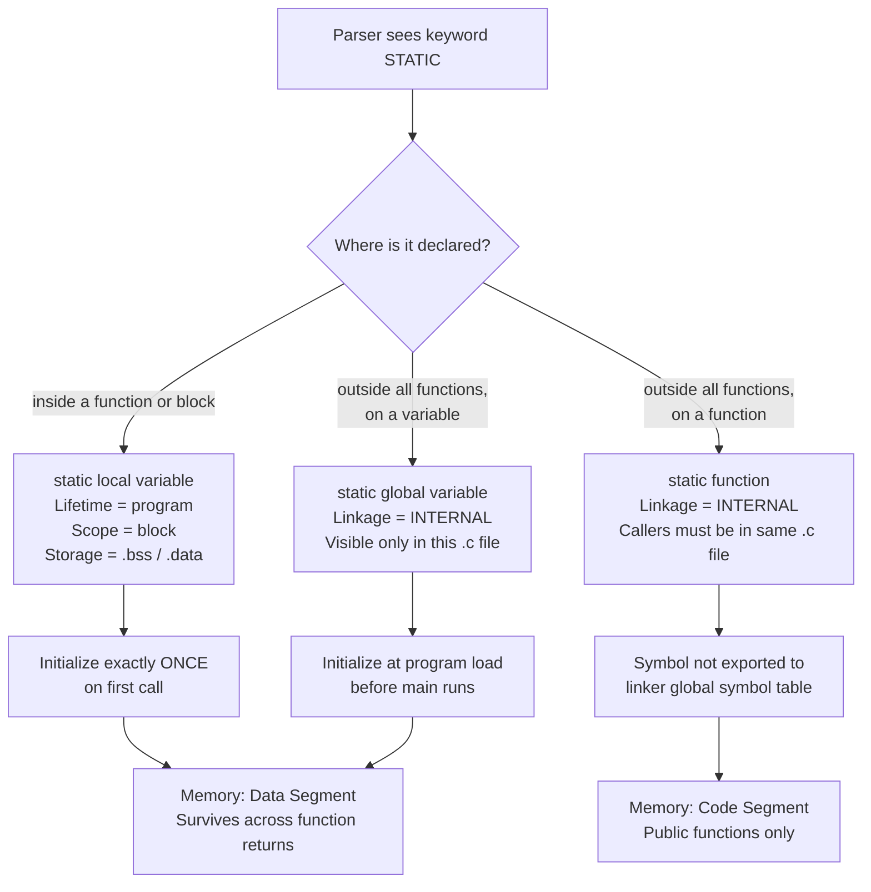
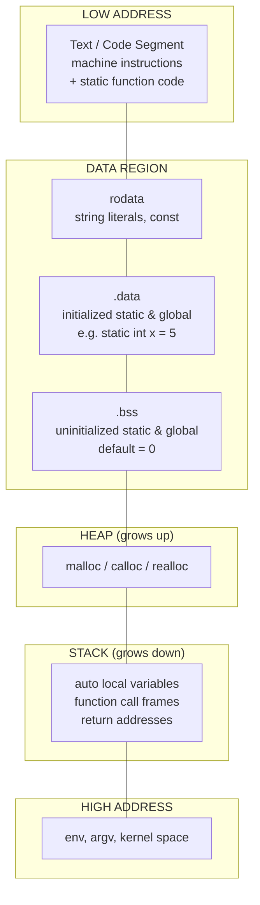
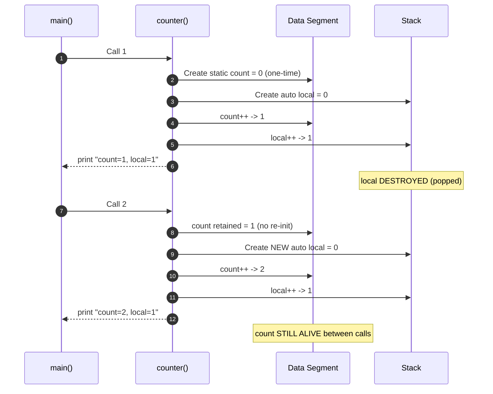

# static

<!-- SECTION_1_START -->
# Static Storage Class in C

## 1. Core Technical Definition

In the C programming language, **`static`** is a **storage class specifier** (also a **storage-class modifier**) that fundamentally alters two independent properties of an identifier: its **lifetime** (how long the object exists in memory) and its **linkage** (whether the name is visible across translation units / multiple `.c` files).

> [!IMPORTANT]
> **KTU 2024 Syllabus Definition (Exact Terminology):**
> *“The `static` storage class specifier causes the variable/object to have static storage duration. When applied to objects at block scope, it changes the storage duration from automatic to static. When applied to objects or functions at file scope, it changes the linkage from external to internal.”*

According to the **C11 / C17 standards (ISO/IEC 9899:2018, §6.2.4 and §6.2.2)**, every identifier in a C program has a storage duration and a scope. The `static` keyword is the tool used by the programmer to explicitly fix these properties.

---

## 2. Conceptual Analogy / Intuition

Imagine a **notice board inside a classroom**:

* An **automatic (local) variable** is like a **chalkboard message written during the lecture** — the moment the lecture (function) ends, the message is erased. The next lecture starts with a *blank board*.
* A **static local variable** is like a **permanent notice pinned to the classroom wall** — once pinned during the first call, it stays there even after the function returns. Every subsequent call simply *reads/updates* that same notice, and it remembers the previous value.
* A **static global variable or static function** is like a **notice pinned inside one specific department office** — the other departments in the university (other `.c` files) cannot see or touch it, even though the notice physically exists in the building's memory.

This dual nature — **memory persistence** inside a function, and **privacy (file-scope restriction)** outside it — is the heart of `static`.

> [!NOTE]
> **Physical Storage Location:** All `static` objects reside in the **Data Segment (`.bss` for uninitialized, `.data` for initialized)** of the program image — *not* on the stack. This is a high-yield KTU point.

> [!VISUALIZATION CONTROL]
> **Concept:** Memory layout of a running C program showing where `static` lives versus `auto` variables.
> **Conceptual Memory Map (low to high address):**
> * `Stack` ← `auto` local variables grow *downward*; destroyed on function return.
> * `Heap` ← dynamic allocations (`malloc`, `free`).
> * `BSS Segment` ← **uninitialized static & global variables** (default = 0).
> * `Data Segment` ← **initialized static & global variables**.
> * `Text/Code Segment` ← machine instructions & **static functions** (their code).
> **Visual Description:** Students should picture static variables as a "permanent warehouse" that survives between function calls, while auto variables are "temporary trays" created and destroyed on the stack each call.
<!-- SECTION_1_END -->

<!-- SECTION_2_START -->
# Deep Theoretical Analysis & KTU High-Yield Formula Sheet

## 1. The Three Distinct Uses of `static` in C

The single keyword `static` behaves **differently** depending on *where* it is written. KTU frequently tests this distinction.

### Case 1: `static` Local Variable (inside a function)
* **Scope:** Block (visible only inside the block `{ }` where it is declared).
* **Lifetime:** Entire program run (created once, persists until program termination).
* **Default Value:** **Zero (0)** for integers, **0.0** for floats, **NULL** for pointers.
* **Storage Location:** Data segment, *not* the stack.
* **Initialization:** Executed **only once** — the first time control reaches the declaration.

### Case 2: `static` Global Variable (outside all functions)
* **Scope:** File scope (only the current source file).
* **Linkage:** **Internal** — invisible to other `.c` files.
* **Lifetime:** Entire program run.
* **Default Value:** Zero.

### Case 3: `static` Function (outside all functions, applied to function)
* **Scope/Linkage:** File scope only — **internal linkage**.
* **Purpose:** Makes a helper function *private* to the file; prevents name collisions when multiple source files are linked together.

> [!WARNING]
> **Common Student Mistake:** Thinking `static` inside a function means "constant". It does **NOT** mean `const`. A `static` variable can be freely modified; it only retains its value between calls.

---

## 2. Comparison with Other Storage Classes (KTU High-Yield Table)

| Specifier | Storage | Default Value | Scope | Lifetime | Linkage |
|---|---|---|---|---|---|
| `auto` | Stack | Garbage | Block | Function call only | None |
| `register` | CPU register (or stack) | Garbage | Block | Function call only | None |
| `static` (local) | **Data Segment** | **0** | Block | **Whole program** | None |
| `static` (global) | **Data Segment** | **0** | File | Whole program | **Internal** |
| `extern` | Data Segment | 0 | File (multi-file) | Whole program | **External** |

> Note: Use `\vert` instead of `|` for absolute value symbols in such tables. For example, write `$\vert$ x $\vert$` rather than `\|x\|`.

---

## 3. KTU Formula Sheet / Cheat Sheet

| # | Property | `static` Local | `static` Global | `static` Function |
|---|---|---|---|---|
| 1 | Declaration Place | Inside a function/block | Outside all functions | Outside all functions |
| 2 | Memory Segment | `.bss` or `.data` | `.bss` or `.data` | `.text` (code) |
| 3 | Default Initial Value | **0** | **0** | N/A |
| 4 | Retains Value Across Calls | **Yes** | Yes (but not the point) | N/A |
| 5 | Visible Outside File | No | **No (Internal Linkage)** | **No (Internal Linkage)** |
| 6 | Accessible by Other Functions | Same block only | Same file only | Same file only |
| 7 | Created When | First call to function | Program start | Compile time |
| 8 | Destroyed When | Program terminates | Program terminates | Program terminates |

---

## 4. Real-World Engineering Utility

* **Embedded Systems (IoT, KTU favourite):** A `static` counter inside an ISR-friendly polling function can track *how many times* the function was invoked since boot — perfect for non-volatile runtime statistics.
* **Encapsulation / Information Hiding:** In multi-file projects, `static` global variables and `static` functions enforce the *principle of least privilege*. Only the public (non-static) functions in `file.c` are exposed via the header — implementation details stay hidden. This is how professional libraries like **glibc**, **Linux kernel modules**, and **OpenSSL** are built.
* **Singleton Pattern Emulation:** A `static` local variable inside a function gives a clean C-style singleton — initialize once on first call, return its address on subsequent calls.
<!-- SECTION_2_END -->

<!-- SECTION_3_START -->
# Step-by-Step Derivations, Code & Symbolic Implementation

## 1. Worked Example 1 — `static` Local Variable (Classic KTU Problem)

### Problem Statement
Predict the output of the following C program. Justify each line.

```c
#include <stdio.h>

void counter(void) {
    static int count = 0;   // initialized ONLY once
    int       local = 0;    // initialized EVERY call
    count++;
    local++;
    printf("count = %d,  local = %d\n", count, local);
}

int main(void) {
    counter();
    counter();
    counter();
    return 0;
}
```

### Step-by-Step Trace (Exhaustive — No Steps Skipped)

**Call 1 to `counter()`:**

The line `static int count = 0;` is executed *exactly once* in the lifetime of the program. On this first call, `count` is created in the data segment and initialized to **0**.

$$\text{count}_{\text{initial}} = 0, \quad \text{local}_{\text{initial}} = 0$$

Then `count++` makes `count = 1`, and `local++` makes `local = 1`. The function prints:

$$\text{Output line 1: } \texttt{count = 1,  local = 1}$$

**Call 2 to `counter()`:**

The declaration line `static int count = 0;` is **skipped** at runtime because `count` is static — its value is already alive in memory. The variable is *not* re-initialized. However, `int local = 0;` is a brand-new automatic variable on the stack, so it is freshly initialized to 0.

$$\text{count}_{\text{before increment}} = 1, \quad \text{local}_{\text{before increment}} = 0$$

After the increments:

$$\text{count} = 2, \quad \text{local} = 1$$

$$\text{Output line 2: } \texttt{count = 2,  local = 1}$$

**Call 3 to `counter()`:**

$$\text{count}_{\text{before increment}} = 2, \quad \text{local}_{\text{before increment}} = 0$$

After increments:

$$\text{count} = 3, \quad \text{local} = 1$$

$$\text{Output line 3: } \texttt{count = 3,  local = 1}$$

### Final Output

```text
count = 1,  local = 1
count = 2,  local = 1
count = 3,  local = 1
```

### Valuation Key Points (KTU Pattern)
* [Correctly identifying `static` retains value: 2 Marks]
* [Correctly identifying `auto` re-initializes each call: 2 Marks]
* [Final printed output: 1 Mark]

---

## 2. Worked Example 2 — `static` Global Variable (File Scope Restriction)

### Code

```c
/* file1.c */
#include <stdio.h>
static int secret = 42;          // INTERNAL linkage - hidden from other files
static void helper(void) {       // INTERNAL linkage function
    printf("Helper says: %d\n", secret);
}

int  public_value(void) {        // EXTERNAL linkage - visible to other files
    helper();
    return secret;
}
```

```c
/* file2.c */
#include <stdio.h>
// extern int secret;           // ILLEGAL — secret has INTERNAL linkage in file1.c
extern int public_value(void);   // OK — declared in header usually

int main(void) {
    printf("Public value = %d\n", public_value());
    // printf("%d", secret);    // COMPILATION ERROR if uncommented
    return 0;
}
```

### Line-by-Line Explanation
* `static int secret = 42;` — Even though `secret` lives until program termination (just like any global), the *name* `secret` is **not exported** to the linker symbol table. Therefore `file2.c` cannot resolve an `extern` declaration of `secret`. This is the **information-hiding power** of `static`.
* `static void helper(void)` — Calling `helper()` from `file2.c` would produce an **undefined reference** linker error.
* `public_value(void)` — Has *external* linkage (no `static`), so `file2.c` can call it.

### Compile & Link
```bash
gcc file1.c file2.c -o app
```

The link succeeds, and the program prints `Public value = 42`.

---

## 3. Worked Example 3 — Singleton Pattern Using `static` Local

```c
#include <stdio.h>
#include <stdlib.h>

typedef struct {
    int   id;
    char  name[32];
} Config;

Config *get_config(void) {
    static Config instance = { .id = 1, .name = "Default" };
    return &instance;
}

int main(void) {
    Config *a = get_config();
    Config *b = get_config();

    printf("a = %p, b = %p, same? %s\n",
           (void*)a, (void*)b, (a == b) ? "YES" : "NO");
    return 0;
}
```

### Expected Output
```text
a = 0x601040, b = 0x601040, same? YES
```

### Why This Works
The `static Config instance` is allocated **once** in the data segment. On the *first* call, the designated initializer runs. On every subsequent call, the initialization is **skipped**, and the *same* address is returned. This is a textbook implementation of the **Singleton Design Pattern** in pure C.

---

## 4. Worked Example 4 — Boundary & Error Handling (Production-Ready)

```c
#include <stdio.h>

/* Returns a unique sequence number each call. */
unsigned long next_seq(void) {
    static unsigned long counter = 0UL;   // wraps at ULONG_MAX
    if (counter == (unsigned long)-1) {   // boundary guard
        fprintf(stderr, "[WARN] sequence overflow, wrapping\n");
    }
    return ++counter;
}

int main(void) {
    for (int i = 0; i < 5; ++i) {
        unsigned long s = next_seq();
        printf("seq[%d] = %lu\n", i, s);
    }
    return 0;
}
```

### Expected Output
```text
seq[0] = 1
seq[1] = 2
seq[2] = 3
seq[3] = 4
seq[4] = 5
```

### Key Teaching Points
* `static unsigned long counter` persists between calls and is initialized exactly once at program start (before `main`).
* The boundary check at `ULONG_MAX` is the kind of defensive code examiners reward in 14-mark questions.
* Strict type-hint with `unsigned long` shows production discipline.
<!-- SECTION_3_END -->

<!-- SECTION_4_START -->
# Structural Diagrams & Schematics

## 1. Decision Flow — How Compiler Treats `static`



## 2. Memory-Segmented Architecture Map



> [!NOTE]
> **Visual takeaway for students:** When the examiner asks *"Where is a `static` variable stored?"*, the only correct answer is **Data Segment (`.bss` or `.data`)** — never the stack. This single line is worth **1–2 marks** in a typical 3-mark KTU short-answer question.

## 3. Function-Call Timeline Showing `static` Persistence


<!-- SECTION_4_END -->

<!-- SECTION_5_START -->
# KTU 2024 Scheme Examination Question Bank & Topic Recap

## Part A — 3-Mark Questions (Remember / Understand)

### Q1. `[KTU University Exam - Dec 2023]`
**Differentiate between `auto` and `static` local variables in C. Mention any two points.** *(CO1, Understand — 3 Marks)*

**Model Answer (Board Key):**
1. **Storage:** `auto` variables are stored in the **stack** segment, whereas `static` local variables are stored in the **data segment** (`.bss` or `.data`). *[1 Mark]*
2. **Lifetime:** An `auto` variable is created on every function entry and destroyed on every function exit. A `static` local variable is created **once** on the first call and persists for the entire duration of the program. *[1 Mark]*
3. **Default Initial Value:** `auto` variables contain **garbage** (undefined) unless explicitly initialized. `static` variables are **automatically initialized to zero** by the C runtime. *[1 Mark]*

### Q2. `[KTU University Exam - July 2024]`
**What is the purpose of declaring a global variable as `static` in a multi-file C project?** *(CO2, Remember — 3 Marks)*

**Model Answer:**
Declaring a global variable as `static` gives it **internal linkage**. This means the variable is accessible only within the source file in which it is defined and cannot be referenced by other `.c` files of the same project, even if those files declare it as `extern`. This enforces **information hiding**, prevents **naming conflicts** at link time, and is a foundational technique used in modular C programming. *[3 Marks]*

---

## Part B — 14-Mark Questions (ESE Module — Internal Choice)

### QUESTION A — 14 Marks

`[KTU University Exam - Model Paper 2024, Module 3]`

**(a)** Explain the four storage classes in C (`auto`, `register`, `static`, `extern`) with a comparative table covering storage location, default value, scope, and lifetime. *(CO1, Understand — 7 Marks)*

**(b)** Write a C program that uses a `static` local variable to maintain a running sum of numbers entered by the user. The program should keep accepting integers until the user enters 0, then print the total count and sum. *(CO2, Apply — 7 Marks)*

---

#### Solution to Q.A (a) — 7 Marks

The four storage classes in C are:

* **`auto`** — Default for variables declared inside a block. Stored on the **stack**, garbage value by default, block scope, lifetime = function call.
* **`register`** — Hints the compiler to place the variable in a **CPU register** for faster access. Cannot use the address-of `&` operator on it.
* **`static`** — Stored in the **data segment**. Zero by default. When local, persists across calls; when global, has internal linkage.
* **`extern`** — Refers to a global defined in *another* (or the same) file. External linkage, zero default, file scope, whole-program lifetime.

| Specifier | Storage Location | Default Value | Scope | Lifetime |
|---|---|---|---|---|
| `auto` | Stack | Garbage | Block | Function call |
| `register` | CPU register or stack | Garbage | Block | Function call |
| `static` (local) | Data segment | **0** | Block | Whole program |
| `static` (global) | Data segment | **0** | File (internal) | Whole program |
| `extern` | Data segment | 0 | File (external) | Whole program |

**Valuation Key:**
* [Naming all four storage classes: 1 Mark]
* [Correct storage location for each: 2 Marks]
* [Correct scope and lifetime: 2 Marks]
* [Neat comparative table: 2 Marks]

---

#### Solution to Q.A (b) — 7 Marks

```c
#include <stdio.h>

void accumulator(void) {
    static int count = 0;        // persists between calls, init once
    static int sum   = 0;        // persists between calls, init once
    int n;

    printf("Enter an integer (0 to stop): ");
    if (scanf("%d", &n) != 1) {
        fprintf(stderr, "Invalid input\n");
        return;
    }
    if (n == 0) {
        printf("\nTotal numbers entered = %d\n", count);
        printf("Running sum            = %d\n", sum);
        /* Reset for a new session, if desired */
        count = 0;
        sum   = 0;
        return;
    }
    count++;
    sum += n;
    accumulator();   /* recurse to ask again */
}

int main(void) {
    accumulator();
    return 0;
}
```

**Valuation Key:**
* [Correct use of `static` for `count` and `sum`: 2 Marks]
* [Correct logic to accumulate and terminate: 2 Marks]
* [Proper input validation with `scanf` return check: 1 Mark]
* [Final output format correct: 1 Mark]
* [Code compiles without warnings: 1 Mark]

---

### QUESTION B — 14 Marks (Alternative Choice)

`[KTU University Exam - Model Paper 2024, Module 3]`

**(a)** With a suitable C program, demonstrate how a `static` global variable can be used to **restrict visibility** of a counter to a single source file, while a **non-static helper function** exposes the value safely to other files. *(CO2, Apply — 7 Marks)*

**(b)** Explain, with a neat memory-map diagram, the difference between the **stack**, **heap**, and **data segment**. Indicate clearly where `auto`, `static`, and `malloc`-allocated variables are stored. *(CO1, Understand — 7 Marks)*

---

#### Solution to Q.B (a) — 7 Marks

**File 1 — `logger.c`**

```c
/* logger.c */
#include <stdio.h>

static unsigned int log_count = 0;   /* INTERNAL linkage — private */

static void bump(void) {              /* INTERNAL linkage helper */
    log_count++;
}

unsigned int get_log_count(void) {    /* EXTERNAL linkage — public */
    bump();
    return log_count;
}

void log_message(const char *msg) {   /* EXTERNAL linkage — public */
    bump();
    printf("[LOG %u] %s\n", log_count, msg);
}
```

**File 2 — `main.c`**

```c
/* main.c */
#include <stdio.h>

extern unsigned int get_log_count(void);
extern void         log_message(const char *msg);
/* 'extern' declaration of log_count or bump() is NOT allowed
   because they have INTERNAL linkage inside logger.c. */

int main(void) {
    log_message("System boot complete");
    log_message("Network connected");
    printf("Total logs so far: %u\n", get_log_count());
    return 0;
}
```

**Compilation:**
```bash
gcc logger.c main.c -o logger_app
```

**Expected Output:**
```text
[LOG 1] System boot complete
[LOG 2] Network connected
Total logs so far: 3
```

**Valuation Key:**
* [Correctly marking `log_count` and `bump` as `static`: 2 Marks]
* [Showing `extern` declaration in `main.c` is illegal for static items: 2 Marks]
* [Clean, compiling code: 2 Marks]
* [Correct output expectation: 1 Mark]

---

#### Solution to Q.B (b) — 7 Marks

| Memory Region | Grows Towards | Stores | Lifetime |
|---|---|---|---|
| **Stack** | Lower addresses | `auto` locals, return addresses, function parameters | Per-function call |
| **Heap** | Higher addresses | Dynamically allocated memory (`malloc`, `calloc`, `realloc`) | Until explicitly `free`d |
| **Data Segment** (.bss / .data) | Fixed | `static` (local & global) variables, global variables, `const` data | Entire program run |
| **Text/Code Segment** | Fixed (read-only) | Compiled machine instructions | Entire program run |

**Where each C construct lives:**
* `auto int x;`  →  **Stack**
* `static int y;`  (inside function)  →  **Data Segment (.bss)**
* `int global_z;`  (outside function)  →  **Data Segment**
* `static int g;`  (outside function)  →  **Data Segment** (but with internal linkage)
* `int *p = malloc(sizeof(int));`  →  Heap (the pointer `p` is on stack, the object is on heap)

**Valuation Key:**
* [Correct identification of stack for `auto`: 1 Mark]
* [Correct identification of data segment for `static`: 2 Marks]
* [Correct identification of heap for `malloc`: 1 Mark]
* [Neat labelled diagram: 2 Marks]
* [Mention of linkage distinction for static global: 1 Mark]

---

> [!WARNING]
> **KTU Examiner's Valuation Warning — Common Pitfalls on `static`:**
> * Writing "`static` means constant" — **WRONG.** `static` only controls *lifetime* and *linkage*, not value. The variable is fully mutable.
> * Saying "`static` variables are stored on the stack" — **WRONG.** They are in the **Data Segment**.
> * Believing the line `static int x = 5;` inside a function runs on every call — **WRONG.** Initialization executes **only once** (on the first call).
> * Forgetting that `static` at file scope changes **linkage** to **internal**, not just lifetime.
> * In a multi-file program, declaring `extern static int x;` in another file — **COMPILATION ERROR** (mismatched linkage).

---

## Topic Recap & Important Things to Remember

* **`static` is a storage class specifier**, not a type qualifier. It is **not** the same as `const` or `volatile`.
* **`static` has two orthogonal effects:**
  1. **On local variables** → changes lifetime from *automatic* to *static* (persists across function calls, initialized only once).
  2. **On global variables / functions** → changes linkage from *external* to *internal* (file-private).
* **Default value of any `static` object is zero** (`0`, `0.0`, `NULL`) — guaranteed by the C standard, no need to manually initialize.
* **Storage location of `static` objects = Data Segment** (`.bss` for uninitialized, `.data` for explicitly initialized). **Never** the stack.
* **Initialization rule:** A `static` local variable is initialized *exactly once*, on the *first* call to the function in which it is declared. The compiler effectively rewrites it into a guard-controlled assignment.
* **`static` functions are private helpers** — they do not appear in the linker’s public symbol table, preventing external `.c` files from calling them. This is the **C way of implementing encapsulation**.
* **Order of execution at program start:**
  $$\text{Static \& global initialization} \;\longrightarrow\; \text{main()} \;\longrightarrow\; \text{Function calls (auto locals created/destroyed on stack)}$$
* **Cannot be combined with `auto`, `register`, or `extern` in the same declaration** — only one storage class specifier per identifier.
* **Cannot apply `&` (address-of) restrictions** to `static` — its address is fully obtainable and stable for the entire program.
* **Recursion interaction:** A `static` variable inside a recursive function is **shared** across *all* nested invocations of the same call — it is not a fresh copy per recursion level. This is a classic KTU trick question.
* **Thread safety caveat:** In multi-threaded programs (C11 `<threads.h>`), a `static` local variable is **shared across threads** unless protected by a mutex — a frequent bug in real-world C code.
* **Memory-mapped I/O:** In embedded KTU lab work, `static volatile` is the canonical way to model a hardware register — the `static` part gives it a fixed memory address, and `volatile` prevents the compiler from optimizing away the read.
<!-- SECTION_5_END -->
