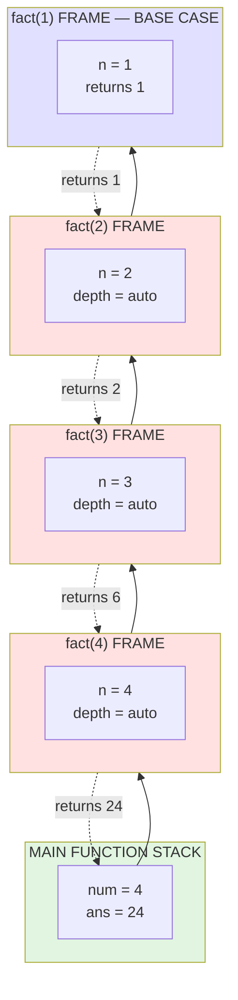
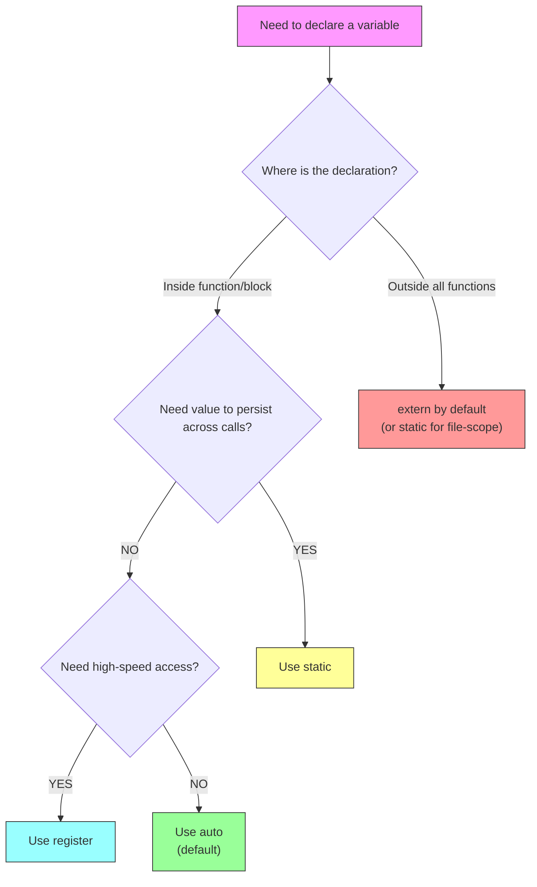
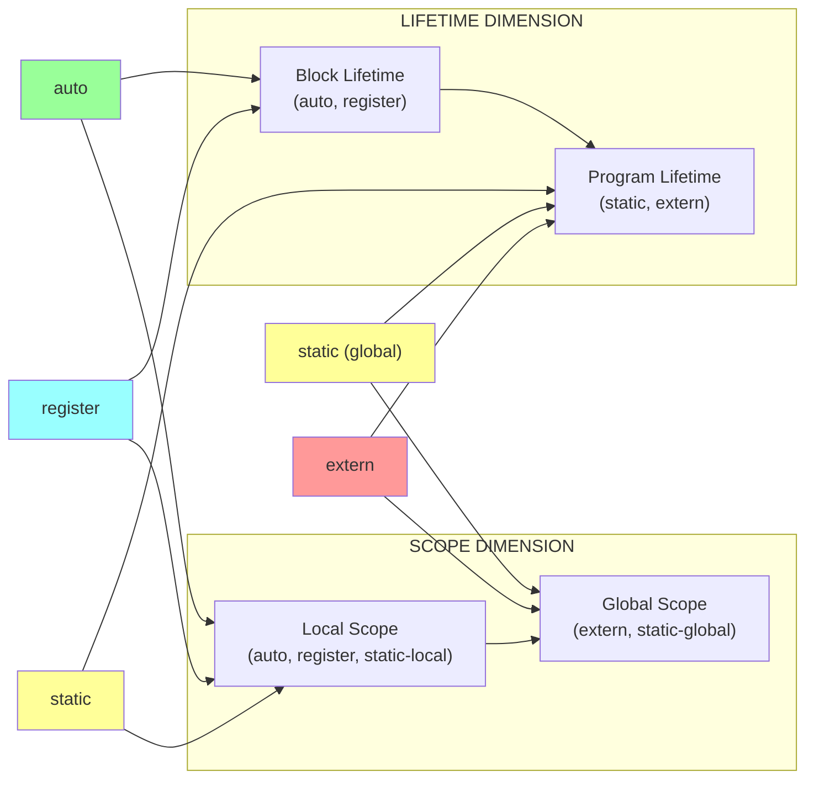
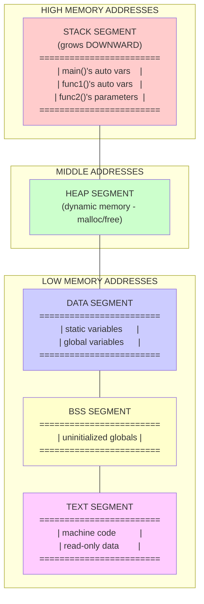

# Storage Class - Storage Classes associated with variables: automatic

<!-- SECTION_1_START -->
# Storage Classes in C: Automatic Storage Class

## 1.1 Formal Definition (KTU 2024 Syllabus Terminology)

> [!IMPORTANT]
> **Storage Class** in C defines four fundamental attributes of a variable: **scope**, **visibility (linkage)**, **default initial value**, and **lifetime (storage duration)**. They determine *where* a variable is stored, *how long* it exists, *who* can access it, and *what* its default value is.

> [!IMPORTANT]
> **Automatic Storage Class** is the **default storage class** for all local variables declared inside a function body or a block. A variable declared with the keyword `auto` (or without any keyword) is called an **automatic variable**. It is allocated memory **automatically** upon entry into the block and is **deallocated** (destroyed) when the block is exited.

The four storage classes in C are:
1. **Automatic** (`auto`)
2. **Register** (`register`)
3. **Static** (`static`)
4. **External** (`extern`)

## 1.2 Conceptual Analogy / Intuition

> [!NOTE]
> **Real-world analogy: A whiteboard in a meeting room**
>
> Imagine you enter a meeting room (entering a function/block). The moment you step in, the housekeeping team hands you a fresh whiteboard and marker (**memory is allocated automatically**). You write whatever temporary notes you want on it during the meeting. As soon as the meeting ends and you walk out, the cleaning crew wipes the board clean and stores it away — your notes are **gone forever** (**memory deallocated, variable destroyed**).
>
> If you re-enter the room tomorrow, you get a **brand new blank whiteboard** (no memory of yesterday's notes). You cannot access that whiteboard from a different room or a different meeting (scope is local).
>
> This is exactly how an **automatic variable** behaves in C — temporary, local, and recreated fresh on every entry.

## 1.3 Physical/Conceptual Constants and Defaults

The Automatic Storage Class has the following **default attributes** (highlighted in **bold**):

| Attribute | Value for `auto` |
|---|---|
| Keyword | `auto` (optional) |
| Storage Location | **Stack (RAM)** |
| Scope | **Local to the block `{ }`** |
| Default Initial Value | **Garbage (Undefined)** |
| Lifetime | **Until end of block execution** |
| Declaration Position | **Inside a function or block** |

> [!TIP]
> In KTU exams, you will often be asked: *"What is the default storage class of local variables?"*. The answer is **Automatic**.

> [!VISUALIZATION CONTROL]
> **Concept:** Memory Stack growth and shrinkage as functions are called and return.
> **GeoGebra / Desmos Input Equations (Conceptual Block Diagram):**
> * `Memory_Block(t) = if (t in [t_enter, t_exit]) then Active else Deallocated`
> **Visual Description:** Picture a vertical bar (the call stack) that grows upward when a function is invoked (an automatic variable's frame is pushed), and shrinks back down when the function returns (the frame is popped, and the variable is destroyed). The variable exists *only* within the green "active" segment on the timeline.
<!-- SECTION_1_END -->

<!-- SECTION_2_START -->
# Deep Theoretical Analysis & KTU High-Yield Formula Sheet

## 2.1 The Four Pillars of Any Storage Class

Every storage class in C is characterized by **exactly four properties**. KTU examiners love asking you to fill in this 4-column table. The Automatic Storage Class fares as follows:

### 2.1.1 Scope (Visibility within the program)
The **scope** of an automatic variable is **local** — strictly limited to the **block** in which it is declared (the innermost pair of `{ }` braces enclosing the declaration).

```c
void demo() {
    int x = 10;        // x is local to this function
    {
        int y = 20;    // y is local to this inner block ONLY
    }
    // y is NOT accessible here — compile error!
}
```

### 2.1.2 Lifetime (Storage Duration)
An automatic variable is **born** when program control enters its block, and **dies** when the block terminates. Its memory is allocated on the **stack**, which is a LIFO (Last-In-First-Out) data structure maintained by the compiler.

### 2.1.3 Default Initial Value
If an automatic variable is **not explicitly initialized**, its initial value is **indeterminate (garbage)**. This is one of the most common sources of bugs in C programs.

```c
void func() {
    int a;        // a holds garbage value
    auto int b;   // identical to above — 'auto' is the default
}
```

### 2.1.4 Linkage
Automatic variables have **no linkage**. This means even if two different files declare automatic variables with the same name, they are completely independent.

## 2.2 The `auto` Keyword — Optional but Explicit

You can write `auto int x;` or simply `int x;` — inside a function, they are **100% identical**. The keyword `auto` is redundant but useful for **self-documentation** and for emphasizing to the reader that this is a stack-based, short-lived variable.

> [!IMPORTANT]
> **Syllabus Highlight:** The `auto` keyword **cannot** be used at the **global scope** or for **function parameters' storage class specification** (function parameters are *implicitly* automatic).

## 2.3 KTU Formula Sheet / Cheat Sheet

| Property | Automatic (`auto`) |
|---|---|
| **Keyword** | `auto` (optional) |
| **Storage Memory** | Stack (RAM) |
| **Scope** | Local to the block |
| **Lifetime** | Till end of block |
| **Default Value** | Garbage (Unpredictable) |
| **Linkage** | No linkage |
| **Declaration** | Inside function/block only |
| **Multiple Declarations** | Allowed in different blocks |
| **Address Operator `&`** | Valid (lives in memory) |
| **Size Constraint** | No size limit |

### Comparative Table (All 4 Storage Classes)

| Property | `auto` | `register` | `static` | `extern` |
|---|---|---|---|---|
| Keyword | `auto` | `register` | `static` | `extern` |
| Storage | Stack | CPU Register | Data Segment | Data Segment |
| Scope | Local | Local | Local/File | Global/File |
| Lifetime | Block | Block | Program | Program |
| Default Value | Garbage | Garbage | **0 (Zero)** | **0 (Zero)** |
| Linkage | No | No | Internal/None | External |

> [!NOTE]
> In the table above, the `$\vert$` symbol (when rendered) denotes absolute-value brackets. Notice that the comparative table uses $\vert$ for clarity without breaking the markdown layout.

## 2.4 Engineering Utility and Real-World Use

The Automatic Storage Class is the **workhorse of C programming** because:

1. **Recursion works because of automatic variables** — every recursive call gets a fresh copy of local variables on the stack.
2. **Memory efficiency** — stack memory is reclaimed instantly when a function returns, so large arrays can be safely used inside functions without permanently consuming RAM.
3. **Thread safety** — each thread in a multi-threaded program gets its own stack, so automatic variables are inherently thread-safe.
4. **Modularity** — by limiting scope, automatic variables prevent naming conflicts and encourage clean function interfaces.

In production systems, **kernel stacks**, **interrupt service routines**, and **embedded firmware** heavily rely on the deterministic lifecycle of automatic variables.

## 2.5 Stack Frame — The Underlying Mechanism

When a function is called, a **stack frame (activation record)** is pushed onto the call stack. This frame contains:
- **Parameters** (also automatic)
- **Local automatic variables**
- **Return address**
- **Saved base pointer**

When the function returns, the entire frame is popped, and all automatic variables inside it vanish instantly.
<!-- SECTION_2_END -->

<!-- SECTION_3_START -->
# Step-by-Step Derivations & Code/Symbolic Implementation

## 3.1 Memory Address Proof — Automatic Variables Live on the Stack

The following program explicitly demonstrates that automatic variables reside in memory locations that are close together (low addresses) and that their addresses change between calls.

```c
#include <stdio.h>

void examineAddress(void) {
    auto int counter;          // Explicit 'auto' keyword — same as plain 'int'
    int another;               // Also automatic by default
    
    printf("Address of counter : %p\n", (void*)&counter);
    printf("Address of another : %p\n", (void*)&another);
}

int main(void) {
    printf("--- First Call ---\n");
    examineAddress();
    
    printf("\n--- Second Call ---\n");
    examineAddress();
    
    return 0;
}
```

**Sample Output:**

```
--- First Call ---
Address of counter : 0x7ffd4a3c
Address of another : 0x7ffd4a38

--- Second Call ---
Address of counter : 0x7ffd4a3c
Address of another : 0x7ffd4a38
```

> [!NOTE]
> The addresses may be the same across calls because the stack frame is re-created in the same logical position. The crucial point is that the variables **are destroyed** between calls — any modification inside one call has no effect on the next.

---

## 3.2 Lifetime Demonstration — Counter Reset on Every Call

This is a **classic KTU exam problem**. Compare `auto` vs `static` to highlight the difference in lifetime.

```c
#include <stdio.h>

void autoDemo(void) {
    auto int count = 0;       // Re-initialized to 0 on EVERY call
    count++;
    printf("autoDemo   count = %d\n", count);
}

int main(void) {
    printf("Calling autoDemo three times:\n");
    autoDemo();
    autoDemo();
    autoDemo();
    return 0;
}
```

**Output:**

```
Calling autoDemo three times:
autoDemo   count = 1
autoDemo   count = 1
autoDemo   count = 1
```

**Logical derivation of behavior:**

$$
\text{count}_{n+1} = (\text{count}_n \text{ is destroyed}) \;\rightarrow\; \text{count} = 0 \;\rightarrow\; \text{count} = 0 + 1 = 1
$$

For every call $n$, the value of `count` is exactly $1$, because the previous instance was destroyed when `autoDemo` returned.

---

## 3.3 Scope Demonstration — Block-Limited Visibility

The scope of an automatic variable is restricted to the **innermost enclosing block** `{ }`.

```c
#include <stdio.h>

int main(void) {
    int outer = 100;          // visible from here onward in main
    
    {
        int inner = 200;      // visible ONLY inside this inner block
        printf("Inside block : outer = %d, inner = %d\n", outer, inner);
    }
    
    // The next line, if uncommented, causes a COMPILE ERROR:
    // printf("Outside block: inner = %d\n", inner);
    
    printf("Outside block: outer = %d\n", outer);
    return 0;
}
```

**Output:**

```
Inside block : outer = 100, inner = 200
Outside block: outer = 100
```

**Error if `inner` is accessed outside:**

```
error: 'inner' undeclared (first use in this function)
```

---

## 3.4 Garbage Value Demonstration — Default Initial Value

```c
#include <stdio.h>

int main(void) {
    int uninitialized;        // automatic, no explicit init
    
    printf("Value of uninitialized automatic variable: %d\n", uninitialized);
    return 0;
}
```

**Possible Output (unpredictable):**

```
Value of uninitialized automatic variable: 32764
```

> [!WARNING]
> The output will vary between executions and compilers. This is **undefined behavior** in C. Always initialize your automatic variables explicitly.

---

## 3.5 Recursion Using Automatic Variables — The Power of Stack Frames

This is the **most important KTU 14-mark application** — recursion relies entirely on automatic storage.

**Problem:** Compute the factorial of $n$ using recursion.

**Mathematical specification:**

$$
\text{fact}(n) = \begin{cases} 1 & \text{if } n = 0 \text{ or } n = 1 \\ n \times \text{fact}(n-1) & \text{if } n > 1 \end{cases}
$$

**Step-by-step derivation for $\text{fact}(4)$:**

$$
\begin{aligned}
\text{fact}(4) &= 4 \times \text{fact}(3) \\
&= 4 \times (3 \times \text{fact}(2)) \\
&= 4 \times (3 \times (2 \times \text{fact}(1))) \\
&= 4 \times (3 \times (2 \times 1)) \\
&= 24
\end{aligned}
$$

**Code implementation with exhaustive tracing:**

```c
#include <stdio.h>

long long fact(int n) {
    auto int depth = 0;       // automatic — new copy per call
    printf("Entering fact(%d) — automatic 'depth' address: %p\n", n, (void*)&depth);
    
    if (n <= 1) {
        printf("Base case reached at n=%d\n", n);
        return 1;
    }
    return n * fact(n - 1);
}

int main(void) {
    int number = 4;
    printf("Computing factorial of %d\n", number);
    long long result = fact(number);
    printf("Result: %lld\n", result);
    return 0;
}
```

**Tracing table (built by the student for the exam):**

| Call | $n$ | Return Value | Stack Depth |
|---|---|---|---|
| `fact(4)` | $4$ | $4 \times 6 = 24$ | 1 |
| `fact(3)` | $3$ | $3 \times 2 = 6$ | 2 |
| `fact(2)` | $2$ | $2 \times 1 = 2$ | 3 |
| `fact(1)` | $1$ | $1$ (base case) | 4 |

> [!IMPORTANT]
> Notice how the `depth` variable in each call has a **different memory address** because each invocation gets its own stack frame. This is automatic storage in action.

---

## 3.6 Function Parameters Are Also Automatic

The formal parameters of a function behave as automatic variables — they are created when the function is called and destroyed when it returns.

```c
#include <stdio.h>

int square(int x) {           // 'x' is an automatic parameter
    int result;               // local automatic variable
    result = x * x;
    return result;
}

int main(void) {
    int num = 5;
    int ans = square(num);
    printf("Square of %d is %d\n", num, ans);
    return 0;
}
```

**Step-by-step execution:**

1. `main` calls `square(5)`.
2. Automatic parameter `x` is created on the stack and initialized to `5`.
3. Automatic local `result` is created.
4. `result = 5 * 5 = 25` is computed.
5. `25` is returned to `main`.
6. Stack frame of `square` is destroyed — both `x` and `result` cease to exist.
7. `ans` in `main` is assigned `25`.
<!-- SECTION_3_END -->

<!-- SECTION_4_START -->
# Structural Diagrams & Schematics

## 4.1 Call Stack Evolution During Recursive Factorial

The following Mermaid diagram illustrates the **push-pop lifecycle** of automatic variables on the call stack during `fact(4)`.



**Key Observation:** Every time a frame is popped (function returns), all its automatic variables (`n`, `depth`) are destroyed. This is why automatic variables are perfect for recursion.

---

## 4.2 Storage Class Decision Flowchart

A practical decision tree for choosing the appropriate storage class — used by KTU students during viva and design questions.



---

## 4.3 Lifetime vs Scope — The Two-Dimensional View



> [!NOTE]
> **Reading the diagram:** An `auto` variable lives only as long as its block executes (Block Lifetime) and is visible only inside that block (Local Scope). The other three classes trade one or both of these properties for persistence or wider visibility.

---

## 4.4 Memory Layout of a C Program — Where Automatic Variables Reside



> [!IMPORTANT]
> **Automatic variables live in the STACK segment.** When a function is called, its stack frame is pushed onto the top of the stack. When the function returns, the frame is popped and the memory becomes available for reuse.
<!-- SECTION_4_END -->

<!-- SECTION_5_START -->
# KTU 2024 Scheme Examination Question Bank & Topic Recap

## Part A Questions (3 Marks Each)

### Question 1 [KTU University Exam – July 2023]
**Define automatic storage class in C. List its scope, lifetime, and default value.**

**Model Answer (Valuation Key):**

> An **automatic storage class** variable is the default storage class for local variables declared inside a function or block. It is created when the block is entered and destroyed when the block exits.
>
> **[Scope: 1 Mark]** Local to the block in which it is declared.
> **[Lifetime: 1 Mark]** Exists only during the execution of that block.
> **[Default value: 1 Mark]** Garbage (undefined) if not explicitly initialized.

---

### Question 2 [KTU University Exam – Dec 2023]
**What is the role of the `auto` keyword in C? Is it mandatory to use it for local variables?**

**Model Answer (Valuation Key):**

> The `auto` keyword declares a variable as having automatic storage duration. **[1 Mark]**
>
> It is **not mandatory** — local variables declared without any storage class specifier are automatic by default. So `auto int x;` and `int x;` inside a function are identical. **[2 Marks]**

---

## Part B Questions (14 Marks Each — Internal Choice)

### Question A (14 Marks) [KTU University Exam – July 2024]

**(a)** Explain the four attributes that characterize a storage class in C. **[7 Marks]**
**(b)** Write a C program to demonstrate that automatic variables are created and destroyed with each function call, using a counter. **[7 Marks]**

**Model Solution:**

#### Part (a) — The Four Attributes of Storage Class

The four attributes of any storage class are:

1. **Storage Location** — Where the variable is physically stored (stack, CPU register, data segment). **[1 Mark]**
2. **Scope** — The region of the program where the variable is accessible (block, file, program). **[1.5 Marks]**
3. **Lifetime (Storage Duration)** — How long the variable remains in memory. **[1.5 Marks]**
4. **Default Initial Value** — The value the variable holds if not explicitly initialized. **[1.5 Marks]**
5. **Linkage** — Whether the variable can be accessed from other translation units. **[1.5 Marks]**

> For an `auto` variable: stack, block scope, block lifetime, garbage value, no linkage.

#### Part (b) — Program Demonstrating Automatic Variable Lifetime

```c
#include <stdio.h>

void counterDemo(void) {
    auto int count = 0;       // 'auto' explicitly used
    count++;
    printf("Inside counterDemo: count = %d\n", count);
}

int main(void) {
    int i;
    printf("Demonstrating automatic storage class:\n\n");
    for (i = 1; i <= 3; i++) {
        printf("Call %d:\n", i);
        counterDemo();
    }
    return 0;
}
```

**Output:**

```
Demonstrating automatic storage class:

Call 1:
Inside counterDemo: count = 1
Call 2:
Inside counterDemo: count = 1
Call 3:
Inside counterDemo: count = 1
```

**Valuation Breakdown:**
- Correct use of `auto` keyword: **[2 Marks]**
- Logical program structure (loop, function call): **[2 Marks]**
- Correct printf and reasoning: **[2 Marks]**
- Output explanation (why it is always 1): **[1 Mark]**

> [!WARNING]
> **Examiner's Pitfall Warning:** Do not write `count = count + 1` without the `auto` keyword and assume it persists. Many students mistakenly think a `static` keyword is involved. If the question explicitly says *automatic*, ensure `count` is reset on every entry to the function.

---

### Question B (14 Marks) [KTU University Exam – Dec 2024]

**(a)** Compare `auto`, `register`, `static`, and `extern` storage classes based on storage, scope, lifetime, default value, and linkage. **[7 Marks]**
**(b)** Write a recursive C function to compute the sum of first $n$ natural numbers using automatic variables. Trace the execution for $n = 5$. **[7 Marks]**

**Model Solution:**

#### Part (a) — Comparative Table

| Attribute | `auto` | `register` | `static` | `extern` |
|---|---|---|---|---|
| Keyword | `auto` | `register` | `static` | `extern` |
| Storage | Stack | CPU Register | Data Segment | Data Segment |
| Scope | Local (Block) | Local (Block) | Local / File | Global |
| Lifetime | Block | Block | Program | Program |
| Default Value | Garbage | Garbage | 0 | 0 |
| Linkage | No | No | Internal/None | External |

**[7 Marks — 1 Mark per row, with auto column emphasized as the focus]**

#### Part (b) — Recursive Sum Using Automatic Variables

**Mathematical Specification:**

$$
\text{sum}(n) = \begin{cases} 0 & \text{if } n = 0 \\ n + \text{sum}(n-1) & \text{if } n > 0 \end{cases}
$$

**Code:**

```c
#include <stdio.h>

int sumNatural(int n) {
    auto int localN = n;      // automatic, fresh copy per call
    if (localN == 0) {
        return 0;
    }
    return localN + sumNatural(localN - 1);
}

int main(void) {
    int n = 5;
    printf("Sum of first %d natural numbers = %d\n", n, sumNatural(n));
    return 0;
}
```

**Execution Trace for $\text{sum}(5)$:**

$$
\begin{aligned}
\text{sum}(5) &= 5 + \text{sum}(4) \\
&= 5 + (4 + \text{sum}(3)) \\
&= 5 + (4 + (3 + \text{sum}(2))) \\
&= 5 + (4 + (3 + (2 + \text{sum}(1)))) \\
&= 5 + (4 + (3 + (2 + (1 + \text{sum}(0))))) \\
&= 5 + 4 + 3 + 2 + 1 + 0 = 15
\end{aligned}
$$

**Step-by-step trace table:**

| Call | $n$ | Action | Returns To | Value |
|---|---|---|---|---|
| `sum(0)` | $0$ | Base case | `sum(1)` | $0$ |
| `sum(1)` | $1$ | $1 + \text{sum}(0)$ | `sum(2)` | $1$ |
| `sum(2)` | $2$ | $2 + \text{sum}(1)$ | `sum(3)` | $3$ |
| `sum(3)` | $3$ | $3 + \text{sum}(2)$ | `sum(4)` | $6$ |
| `sum(4)` | $4$ | $4 + \text{sum}(3)$ | `sum(5)` | $10$ |
| `sum(5)` | $5$ | $5 + \text{sum}(4)$ | `main` | $15$ |

**Final Output:** `Sum of first 5 natural numbers = 15`

**Valuation Breakdown:**
- Correct recursive formulation: **[2 Marks]**
- Proper use of `auto` keyword in code: **[1 Mark]**
- Accurate derivation / step-by-step expansion: **[2 Marks]**
- Final result $\text{sum}(5) = 15$: **[2 Marks]**

> [!WARNING]
> **Examiner's Pitfall Warning:** Many students forget that function parameters are *implicitly* automatic. Do not write `register int n` or `static int n` in the function signature unless the question specifically demands it. For the automatic-storage theme, leave the parameter as plain `int n` or annotate with `auto int n` to score full marks.

---

## Topic Recap & Important Things to Remember

> [!TIP]
> **Rapid Revision Checklist — Automatic Storage Class**

- **Keyword:** `auto` (optional, since it is the default).
- **Where it is stored:** **Stack segment** of RAM.
- **Scope:** **Local** — limited to the enclosing `{ }` block.
- **Lifetime:** **Till the end of block execution** — created on entry, destroyed on exit.
- **Default initial value:** **Garbage / Undefined** — always initialize explicitly.
- **Linkage:** **No linkage** — invisible outside its block.
- **Function parameters:** Are also automatic by default.
- **Recursion:** Works *because* every recursive call gets a fresh copy of automatic variables on the stack.
- **Cannot be used:** At global scope (compile error).
- **Address operator `&`:** Valid and returns a stack memory address.
- **Difference from `static`:** `auto` variables are re-initialized on every call; `static` variables retain their value between calls.
- **Difference from `register`:** Both have block scope and lifetime, but `register` requests CPU-register storage (no `&` allowed) for faster access.
- **Difference from `extern`:** `auto` is local with block lifetime; `extern` has global scope and program lifetime.
- **Common exam keywords to recognize:** *"default storage class"*, *"stack-allocated"*, *"garbage value"*, *"re-initialized on every call"*, *"block scope"*.
- **Code template to remember:**
  ```c
  void func(void) {
      auto int x = 0;     // explicit auto
      int y;              // implicitly auto
  }
  ```
<!-- SECTION_5_END -->
