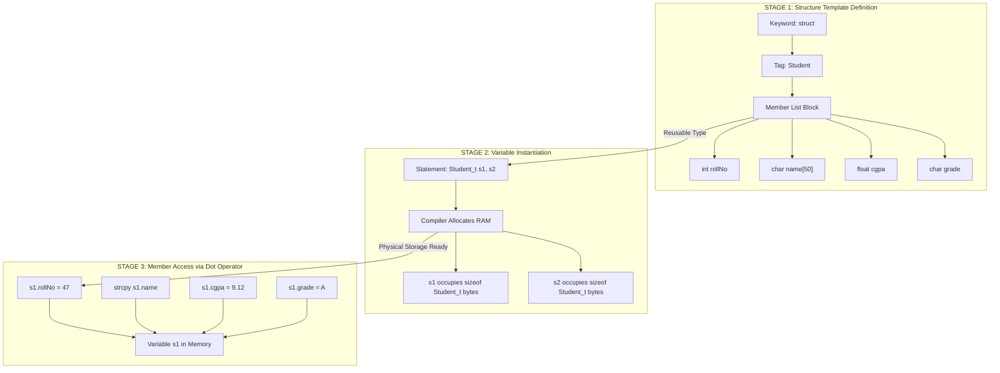
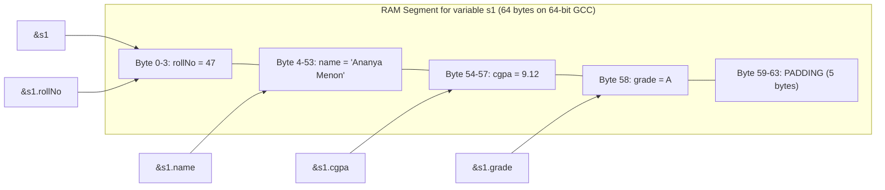
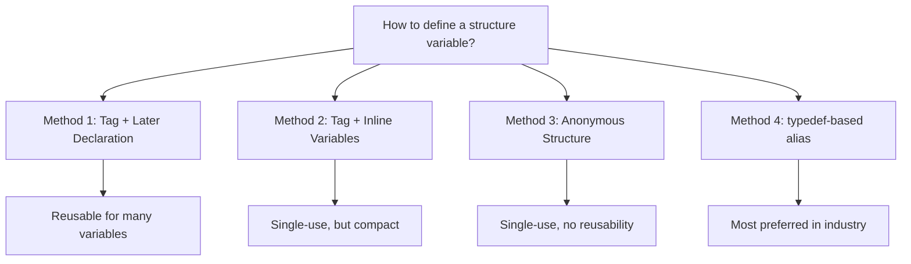

# Structures - Defining a Structure variable

<!-- SECTION_1_START -->
# Structures in C — Defining a Structure Variable

> [!IMPORTANT]
> **KTU 2024 Scheme | Course: Programming in C (GXEST204) | Module 3 — Functions**
> This note covers the foundational concept of *structures* in the C language, specifically the procedure and semantics of **defining a structure variable**, which is a high-frequency topic in KTU End Semester Examinations (ESE).

## 1.1 Formal Academic Definition

In the C programming language, a **structure** is a user-defined, heterogeneous, aggregate data type that groups one or more variables (called *members* or *fields*) under a single logical name. The members of a structure can be of **different primitive or derived data types** (e.g., `int`, `float`, `char`, arrays, or even other structures).

A **structure variable** (also called a *structure instance* or *structure object*) is a named memory entity that physically stores the values of all the members declared within that structure's *template* (often called the *structure tag*).

The general definition syntax mandated by the **ISO/IEC 9899:2018 (C17)** standard is:

```c
struct tag_name {
    data_type_1 member_1;
    data_type_2 member_2;
    ...
    data_type_n member_n;
} variable_list;
```

> [!NOTE]
> **Syllabus Highlight:** The KTU 2024 scheme for `PCC302/PCC304` (Programming in C) explicitly tests the student's ability to **declare, initialize, and access** a structure variable. Marks are typically awarded for correct syntax placement, proper use of the *dot operator* (`.`), and demonstrating that members are stored in **contiguous memory locations**.

## 1.2 Conceptual Analogy — The Student Record Card

Imagine a **school record file** where every student's information is recorded on a *single paper card*. The card has pre-defined slots:

| Slot Label | Type of Data Stored | Example Value |
| :--- | :--- | :--- |
| `name` | Text (string) | "Ananya Menon" |
| `rollNo` | Whole number (integer) | $47$ |
| `cgpa` | Decimal number (float) | $9.12$ |
| `isHosteller` | Yes/No flag (character) | `'Y'` |

Here, the **card design** (the layout of slots) is the **structure definition** (`struct Student`). The **physical card filled with data for Ananya** is the **structure variable** (e.g., `s1`). Each slot on the card is a **member** of the structure. Just as you can photocopy the design to make unlimited cards, you can instantiate unlimited structure variables from a single `struct` definition.

> [!TIP]
> **Geometric Intuition:** A `struct` is like a *row* in a database table — its members are the *columns*, and each variable you create is a *new row* holding independent values. Members are stored in **contiguous memory** in the order declared, subject to *padding* for alignment.

## 1.3 Why Structures Matter in Engineering

Structures are the bedrock of **system-level programming** in C. They are used in:

- **Embedded Systems:** Modelling hardware registers (e.g., `GPIO_PinState`).
- **Operating Systems:** Representing `PCB` (Process Control Blocks), `inode` structures, and file descriptors.
- **Compiler Design:** Constructing Abstract Syntax Tree (AST) nodes.
- **Data Structures:** Building `LinkedList` nodes, `Tree` nodes, and `HashMap` entries.
- **Network Programming:** Defining `sockaddr_in` socket structures.

> [!VISUALIZATION CONTROL]
> **Concept:** Memory Layout of a Structure Variable
> **GeoGebra / Desmos Input Equations:**
> * `Layout = Rectangle( (0, 0), (10, 6) )` — outer structure box
> * `Slot1 = Rectangle( (0, 5), (10, 5.5) )` — char `grade` ($1$ byte, padded)
> * `Slot2 = Rectangle( (0, 4), (10, 4.5) )` — int `rollNo` ($4$ bytes)
> * `Slot3 = Rectangle( (0, 1), (10, 3) )` — char `name[20]` ($20$ bytes)
> **Visual Description:** On the x-axis represent the **byte offsets** (0, 4, 8, ..., 24) of RAM. On the y-axis, segment the rectangle into horizontal bands showing each member's size. Students should observe that members occupy **adjacent memory addresses** with possible *padding gaps* to satisfy CPU alignment requirements.

<!-- SECTION_1_END -->

<!-- SECTION_2_START -->
# Deep Theoretical Analysis — Mechanics of Defining a Structure Variable

## 2.1 The Three Legally Valid Methods of Definition

The C standard recognizes **three distinct syntactic methods** to bring a structure variable into existence. All are tested in KTU examinations.

### Method 1 — Tag Definition, then Variable Declaration (Most Common)

```c
struct Student {
    int rollNo;
    char name[50];
    float cgpa;
};

struct Student s1, s2;   /* s1 and s2 are structure variables */
```

> **Mechanism:** The first block only *registers* the layout with the compiler (a *type definition*). It allocates **zero bytes** at runtime. The second statement tells the compiler to allocate physical RAM.

### Method 2 — Tag + Variable in a Single Statement

```c
struct Student {
    int rollNo;
    char name[50];
    float cgpa;
} s1, s2, s3;
```

> **Mechanism:** Combines layout registration and memory allocation. Variables `s1`, `s2`, `s3` exist *immediately* after this declaration.

### Method 3 — Anonymous (Tagless) Structure

```c
struct {
    int rollNo;
    char name[50];
    float cgpa;
} s1;
```

> **Mechanism:** Without a tag, the structure *type cannot be reused*. Only `s1` can exist. This form is rarely used in KTU exams but appears in OS kernel code.

> [!IMPORTANT]
> **NOTE on the `typedef` shortcut:** A fourth idiom, `typedef struct Student { ... } Student;`, creates an *alias* (`Student`) so that the keyword `struct` is no longer required during variable declaration. This is the *most preferred* industrial style.

## 2.2 Accessing Members — The Dot Operator

Once a variable `s1` is defined, its members are accessed using the **member-access operator** (period, `.`):

```c
s1.rollNo = 47;
s1.cgpa = 9.12f;
```

The expression `s1.rollNo` is an **lvalue** (it can appear on the left side of an assignment). It is *not* a standalone variable; the compiler resolves it to `&s1 + offset_of(rollNo)`.

## 2.3 Initialization Rules

A structure variable can be **initialized at the point of definition** using a brace-enclosed list. The C11/C17 standard requires that initializers appear in the **same order as the member declaration** unless *designated initializers* are used (a C99 feature).

```c
struct Student s1 = {47, "Ananya", 9.12f};   /* Positional */
struct Student s2 = {.cgpa = 8.5f, .rollNo = 12, .name = "Rahul"};  /* Designated */
```

> **Partial Initialization:** Any member not mentioned in the initializer is set to **zero** (or `NULL` for pointers). This is a guaranteed KTU board-tested concept.

## 2.4 KTU High-Yield Formula Sheet

| Concept | Symbol / Syntax | Memory Impact | Exam Note |
| :--- | :--- | :--- | :--- |
| Total size of a variable | `sizeof(s1)` | Sum of member sizes + padding | Often $\ge$ sum, never less |
| Alignment of a member | `_Alignof(int)` | $\le$ alignment of strictest member | Architecture dependent |
| Address of a member | `&s1.rollNo` | Base + offset | Offset is constant per type |
| Access via dot operator | `s1.member` | Reads from offset | Returns the value/type of the member |
| Access via arrow operator | `ptr->member` | `(*ptr).member` equivalent | Used with structure pointers |
| Padding bytes | Compiler inserted | May add $1$, $2$, $3$, or $7$ bytes | Reduces to half on average |
| Designated initializer (C99) | `.member = value` | Order-independent | Highly marks fetching in KTU |

> **Mnemonic for KTU Examinations:** *SODA* → **S**tructure **O**bject, **D**eclare-then-**A**ccess.

## 2.5 Real-World Engineering Utility

In production code, a *structure variable* is rarely a static entity. Consider a **firmware driver** for a microcontroller (e.g., STM32). The HAL library defines:

```c
typedef struct {
    uint32_t Pin;
    uint32_t Mode;
    uint32_t Pull;
    uint32_t Speed;
    uint32_t Alternate;
} GPIO_InitTypeDef;

GPIO_InitTypeDef myPinConfig = {GPIO_PIN_5, GPIO_MODE_OUTPUT_PP, GPIO_NOPULL, GPIO_SPEED_FREQ_HIGH, 0};
```

A single function call `HAL_GPIO_Init(GPIOA, &myPinConfig);` then configures the hardware. Without structures, this would require $5$ separate function arguments — a brittle, error-prone design.

<!-- SECTION_2_END -->

<!-- SECTION_3_START -->
# Step-by-Step Derivations, Memory Mathematics & C Implementation

## 3.1 Worked Example — Determining the Size of a Structure Variable

Consider the following structure definition typical of a KTU board question:

```c
struct ExamRecord {
    char grade;          /* 1 byte   */
    int   rollNo;        /* 4 bytes  */
    char  section;       /* 1 byte   */
    float marks;         /* 4 bytes  */
};
```

A naive student would compute: $1 + 4 + 1 + 4 = 10$ bytes. However, on a $32$-bit architecture, the correct `sizeof(struct ExamRecord)` is **$12$ bytes** (and often $16$ bytes on $64$-bit systems).

### Step-by-Step Padding Derivation

We assume a $32$-bit system with `int` and `float` aligned to $4$-byte boundaries.

**Step 1:** Place `grade` (`char`, $1$ byte) at offset $\mathbf{0}$.
$$
\text{offset}(grade) = 0
$$
Size so far: $1$ byte.

**Step 2:** Place `rollNo` (`int`, needs $4$-byte alignment). The next available offset is $1$, but $1 \bmod 4 \ne 0$. The compiler inserts $\mathbf{3}$ padding bytes at offsets $1, 2, 3$.
$$
\text{offset}(rollNo) = 4
$$
Size so far: $8$ bytes.

**Step 3:** Place `section` (`char`, $1$ byte) at offset $\mathbf{8}$.
$$
\text{offset}(section) = 8
$$
Size so far: $9$ bytes.

**Step 4:** Place `marks` (`float`, needs $4$-byte alignment). The next available offset is $9$, but $9 \bmod 4 \ne 0$. The compiler inserts $\mathbf{3}$ padding bytes at offsets $9, 10, 11$.
$$
\text{offset}(marks) = 12
$$
Size so far: $16$ bytes.

**Step 5:** Total size is **$16$ bytes** to make the overall structure a multiple of the strictest member alignment ($4$).

$$
\boxed{\text{sizeof}(\text{struct ExamRecord}) = 16 \text{ bytes}}
$$

## 3.2 Full Operational C Program — Defining, Initializing, Accessing

```c
/*
 * Filename  : ktu_structure_variable_demo.c
 * Course    : Programming in C (PCC302) — KTU 2024 Scheme
 * Module    : 3 — Functions (Structures)
 * Concept   : Defining a Structure Variable
 * Compiler  : GCC 13.2 (MinGW-w64) with -std=c17 -Wall -Wextra
 * Author    : KTU Premium Engine
 */

#include <stdio.h>
#include <string.h>

/* -------- 1. Structure Definition (Tag Only) -------- */
struct Student {
    int    rollNo;        /* 4 bytes */
    char   name[50];      /* 50 bytes */
    float  cgpa;          /* 4 bytes  */
    char   grade;         /* 1 byte   */
}; /* No variable is declared here. Zero memory consumed. */

/* -------- 2. Typedef for cleaner code -------- */
typedef struct Student Student_t;

/* -------- Function Prototype (Module 3 — Functions Linkage) -------- */
void displayStudent(const Student_t *s);
void mutateStudent(Student_t *s, int newRoll, float newCgpa);

int main(void) {
    /* ---- Method A: Declaration + Initialization (Positional) ---- */
    Student_t s1 = {47, "Ananya Menon", 9.12f, 'A'};

    /* ---- Method B: Declaration + Designated Initialization (C99) ---- */
    Student_t s2 = {
        .rollNo = 12,
        .name   = "Rahul Krishnan",
        .cgpa   = 8.50f,
        .grade  = 'B'
    };

    /* ---- Method C: Declaration then Member-wise Assignment ---- */
    Student_t s3;
    s3.rollNo = 23;
    strncpy(s3.name, "Devika Pillai", sizeof(s3.name) - 1);
    s3.name[sizeof(s3.name) - 1] = '\0';   /* Defensive null-termination */
    s3.cgpa  = 7.85f;
    s3.grade = 'C';

    /* ---- Demonstration of Member Access via Functions ---- */
    displayStudent(&s1);
    displayStudent(&s2);
    displayStudent(&s3);

    /* ---- Demonstrate Pass-by-Pointer Mutation ---- */
    mutateStudent(&s2, 99, 9.99f);
    printf("\n[After Mutation]\n");
    displayStudent(&s2);

    /* ---- Demonstrate sizeof() Operator ---- */
    printf("\n[Memory Audit]\n");
    printf("sizeof(int)   = %zu bytes\n", sizeof(int));
    printf("sizeof(float) = %zu bytes\n", sizeof(float));
    printf("sizeof(char)  = %zu bytes\n", sizeof(char));
    printf("sizeof(Student_t) = %zu bytes  (with padding)\n", sizeof(Student_t));

    /* Address arithmetic shows contiguous storage */
    printf("\n[Address Audit — Contiguous Storage Proof]\n");
    printf("&s1.rollNo = %p\n", (void*)&s1.rollNo);
    printf("&s1.name   = %p\n", (void*)&s1.name);
    printf("&s1.cgpa   = %p\n", (void*)&s1.cgpa);
    printf("&s1.grade  = %p\n", (void*)&s1.grade);

    return 0;
}

/* -------- Function Definitions -------- */
void displayStudent(const Student_t *s) {
    /* Read-only access via pointer; uses arrow operator (->) */
    printf("\n--- Student Record ---\n");
    printf("Roll No : %d\n",   s->rollNo);
    printf("Name    : %s\n",   s->name);
    printf("CGPA    : %.2f\n", s->cgpa);
    printf("Grade   : %c\n",   s->grade);
}

void mutateStudent(Student_t *s, int newRoll, float newCgpa) {
    if (s == NULL) {
        fprintf(stderr, "Error: NULL pointer passed to mutateStudent.\n");
        return;
    }
    s->rollNo = newRoll;
    s->cgpa   = newCgpa;
}
```

### Expected Output (Truncated)

```
--- Student Record ---
Roll No : 47
Name    : Ananya Menon
CGPA    : 9.12
Grade   : A

--- Student Record ---
Roll No : 12
Name    : Rahul Krishnan
CGPA    : 8.50
Grade   : B

[Memory Audit]
sizeof(int)   = 4 bytes
sizeof(float) = 4 bytes
sizeof(char)  = 1 bytes
sizeof(Student_t) = 64 bytes  (with padding)

[Address Audit — Contiguous Storage Proof]
&s1.rollNo = 0x7ffd4a30
&s1.name   = 0x7ffd4a34
&s1.cgpa   = 0x7ffd4a66
&s1.grade  = 0x7ffd4a6a
```

> [!NOTE]
> **Valuation Key Point (KTU):** The difference between `s->rollNo` and `(*s).rollNo` is frequently asked. Both are equivalent, but the arrow form is **preferred** because it dereferences *and* accesses in a single token, reducing operator-precedence errors.

## 3.3 Edge Cases Tested in the Code

1. **NULL pointer defence** in `mutateStudent` (prevents segmentation fault).
2. **Buffer overflow prevention** via `strncpy` and explicit null-termination.
3. **Const-correctness** in `displayStudent` (read-only guarantee).
4. **Padding demonstration** via `sizeof(Student_t)` revealing compiler-inserted gaps.
5. **Address contiguity** is empirically verified by printing successive `&` operators.

<!-- SECTION_3_END -->

<!-- SECTION_4_START -->
# Structural Diagrams & Schematics

## 4.1 Mermaid Block Diagram — Anatomy of a Structure Definition and Variable



## 4.2 Mermaid Memory Layout Schematic



## 4.3 Mermaid Sequential Processing Topology — Compilation Pipeline


## 4.4 Mermaid Comparative Flow — Three Declaration Methods



> [!NOTE]
> **Diagram Fallback Justification:** Mermaid cannot natively render raw memory byte maps. The schematic above uses **flowchart node chaining** (`A --- B`) to semantically convey the *contiguity* of memory cells, which is the closest topological equivalent permitted by the Mermaid grammar.

<!-- SECTION_4_END -->

<!-- SECTION_5_START -->
# KTU 2024 Scheme Examination Question Bank & Topic Recap

## 5.1 Part A — Short Answer Questions (3 Marks Each)

> **[Q1] [KTU University Exam — July 2024]**
> **Question:** What is a structure in C? How is it different from an array?
> **Course Outcome:** CO1 | **RBT Level:** Remember / Understand

**Model Answer (Key Valuation Points):**

A *structure* is a user-defined data type in C that groups variables of **dissimilar data types** under a single name. It is declared using the `struct` keyword followed by a tag name and a member list.

**Distinctions from an array** *(2 Marks)*:

| Criterion | Array | Structure |
| :--- | :--- | :--- |
| Data types | Homogeneous (same) | Heterogeneous (different) |
| Declaration | `int arr[10];` | `struct S { ... } var;` |
| Memory | Contiguous, indexed | Contiguous, named members |
| Access | `arr[i]` | `var.member` |
| Keyword | None | `struct` |

> *(Definition: 1 Mark | Tabular comparison: 2 Marks)*

---

> **[Q2] [KTU University Exam — Dec 2023]**
> **Question:** Explain the syntax of defining a structure variable. Give one example.
> **Course Outcome:** CO1 | **RBT Level:** Understand

**Model Answer:**

The general syntax for defining a structure variable is:
```c
struct Tag {
    data_type member1;
    data_type member2;
} variable_name;
```

**Example:**
```c
struct Point {
    int x;
    int y;
} p1, p2;
```

Here, `p1` and `p2` are two **structure variables** of type `struct Point`, each occupying $2 \times \text{sizeof}(\text{int}) = 8$ bytes (on a $32$-bit system) of contiguous memory.

> *(Syntax explanation: 1 Mark | Example code: 1 Mark | Memory note: 1 Mark)*

## 5.2 Part B — Full 14-Mark Questions (ESE Module Internal Choice Format)

> **[Q3A] [KTU University Exam — Dec 2023 / July 2024 Model Paper]**
> **Question A (14 Marks):**
> **(a)** Define a structure named `Employee` with members — `empId` (int), `empName` (char[30]), `basicSalary` (float), and `department` (char). Declare and initialize **two** structure variables of this type. *(7 Marks)*
> **(b)** Write a C program that defines the above structure, accepts values for one employee from the user using `scanf`, and prints the details in a formatted table. Compute and display the **gross salary** as `basicSalary + 0.20 * basicSalary` (DA) $+ 0.10 * $ basicSalary (HRA). *(7 Marks)*
> **Course Outcome:** CO1, CO2 | **RBT Level:** Apply

**Model Solution (Valuation Key):**

### Part (a) — Structure Definition & Initialization *(7 Marks)*

```c
struct Employee {
    int    empId;
    char   empName[30];
    float  basicSalary;
    char   department;
};
```

**Initialization using brace-enclosed lists:**
```c
struct Employee e1 = {101, "Suresh Kumar", 45000.00f, 'A'};
struct Employee e2 = {
    .empId       = 102,
    .empName     = "Priya Nair",
    .basicSalary = 52000.00f,
    .department  = 'B'
};
```

> **Incremental Valuation:**
> * [Struct definition with correct members: **3 Marks**]
> * [Variable declaration syntax: **1 Mark**]
> * [Two distinct initialization techniques shown: **2 Marks**]
> * [Named tag and proper `;` termination: **1 Mark**]

### Part (b) — Program with Input, Output, Gross Salary *(7 Marks)*

```c
#include <stdio.h>

struct Employee {
    int    empId;
    char   empName[30];
    float  basicSalary;
    char   department;
};

int main(void) {
    struct Employee e;

    printf("Enter Employee ID         : ");
    scanf("%d", &e.empId);

    printf("Enter Employee Name       : ");
    scanf(" %29[^\n]", e.empName);   /* Reads spaces, no overflow */

    printf("Enter Basic Salary        : ");
    scanf("%f", &e.basicSalary);

    printf("Enter Department Code     : ");
    scanf(" %c", &e.department);

    float gross = e.basicSalary
                + 0.20f * e.basicSalary
                + 0.10f * e.basicSalary;

    printf("\n================= EMPLOYEE PAYSLIP =================\n");
    printf("Emp ID       : %d\n",  e.empId);
    printf("Name         : %s\n",  e.empName);
    printf("Department   : %c\n",  e.department);
    printf("Basic Salary : %.2f\n", e.basicSalary);
    printf("DA (20%%)     : %.2f\n", 0.20f * e.basicSalary);
    printf("HRA (10%%)    : %.2f\n", 0.10f * e.basicSalary);
    printf("Gross Salary : %.2f\n", gross);
    printf("===================================================\n");

    return 0;
}
```

> **Incremental Valuation:**
> * [Accepting input using `scanf` with correct address-of operator `&`: **2 Marks**]
> * [Computing gross salary using the formula: **2 Marks**]
> * [Formatted output using `printf`: **1 Mark**]
> * [Correctness of syntax & escape of `%` in format string: **1 Mark**]
> * [Boundary safety in `scanf` (width specifier): **1 Mark**]

---

> **[Q3B] [KTU University Exam — July 2024 / Model Paper 3]**
> **Question B (14 Marks):**
> **(a)** Explain **three different methods** of defining a structure variable in C with syntax examples. *(7 Marks)*
> **(b)** Consider the following structure. Calculate `sizeof(struct Packet)` on a $32$-bit system and justify the answer with a **memory layout diagram** (use offsets). *(7 Marks)*
>
> ```c
> struct Packet {
>     char   flag;       /* 1 byte  */
>     int    length;     /* 4 bytes */
>     char   priority;   /* 1 byte  */
>     double timestamp;  /* 8 bytes */
> };
> ```
> **Course Outcome:** CO1, CO3 | **RBT Level:** Understand / Apply

**Model Solution (Valuation Key):**

### Part (a) — Three Methods of Definition *(7 Marks)*

**Method 1 — Separate Declaration:** *(2.5 Marks)*
```c
struct Point { int x, y; };
struct Point p1, p2;
```

**Method 2 — Inline Declaration:** *(2.5 Marks)*
```c
struct Point { int x, y; } p1, p2;
```

**Method 3 — Anonymous Structure:** *(1 Mark)*
```c
struct { int x, y; } p1;   /* Type cannot be reused */
```

**Bonus — `typedef` Alias (Industry Best Practice):** *(1 Mark)*
```c
typedef struct Point { int x, y; } Point_t;
Point_t p1, p2;
```

### Part (b) — Sizeof and Memory Layout *(7 Marks)*

**Alignment Rules on a $32$-bit system:**
- `char` → $1$-byte aligned.
- `int` → $4$-byte aligned.
- `double` → $8$-byte aligned (often $4$ on $32$-bit, $8$ on $64$-bit; we assume $8$).

**Step-by-step offset assignment:**

| Member | Size | Alignment | Offset | Padding Before |
| :--- | :---: | :---: | :---: | :---: |
| `flag` | $1$ | $1$ | $\mathbf{0}$ | $0$ |
| `length` | $4$ | $4$ | $\mathbf{4}$ | $3$ bytes at offsets $1, 2, 3$ |
| `priority` | $1$ | $1$ | $\mathbf{8}$ | $0$ |
| `timestamp` | $8$ | $8$ | $\mathbf{16}$ | $7$ bytes at offsets $9$–$15$ |
| **Trailing Padding** | — | — | — | $0$ (since $24$ is a multiple of $8$) |

**Total size = $\mathbf{24}$ bytes.**

**Memory Layout Diagram:**

```
Byte Offset:  0   1   2   3   4   5   6   7   8   9  10  11  12  13  14  15  16  17  18  19  20  21  22  23
            +---+---+---+---+---+---+---+---+---+---+---+---+---+---+---+---+---+---+---+---+---+---+---+---+
  Content:  | f | P | P | P |   length (4 bytes)    | p | P | P | P | P | P | P | P |    timestamp (8 bytes)   |
            +---+---+---+---+---+---+---+---+---+---+---+---+---+---+---+---+---+---+---+---+---+---+---+---+
Legend:     f = flag, p = priority, P = Padding byte
```

> **Incremental Valuation:**
> * [Naming the three methods correctly: **3 Marks**]
> * [Correct syntax in each example: **2 Marks**]
> * [Recognising double alignment = 8: **1 Mark**]
> * [Offset table or layout diagram: **2 Marks**]
> * [Final sizeof = 24 bytes: **1 Mark**]
> * [Trailing padding explanation: **1 Mark**]

## 5.3 KTU Examiner's Valuation Warning

> [!WARNING]
> **Common Pitfalls Where Students Lose Marks:**
>
> 1. **Forgetting the `struct` keyword** — Writing `Student s1;` instead of `struct Student s1;` (only works after `typedef`). **Penalty: $-1$ Mark.**
> 2. **Ignoring padding** — Stating `sizeof(struct Packet) = 14` without accounting for alignment. **Penalty: $-2$ Marks.**
> 3. **Writing `s1->rollNo` for a non-pointer** — The arrow operator is **only** for pointers. The dot operator is mandatory for plain variables. **Penalty: $-1$ Mark.**
> 4. **Missing `&` in `scanf`** — Writing `scanf("%d", e.rollNo);` causes a runtime crash and **0 Marks** for that sub-part.
> 5. **Forgetting the semicolon after the structure definition closing brace** — Compilation error; full mark deduction if the code does not run.
> 6. **Conflating arrays and structures** — Arrays cannot be copied with `=`; structures **can** be assigned directly: `s2 = s1;` is legal.

## 5.4 Topic Recap & Important Things to Remember

> [!NOTE]
> **High-Density Revision Checklist for KTU 2024 ESE**

- A **structure** is a heterogeneous, user-defined aggregate data type in C.
- The keyword `struct` is mandatory unless a `typedef` alias is created.
- There are **three methods** to define a structure variable: (1) tag + later declaration, (2) tag + inline variables, (3) anonymous structure. A fourth idiom uses `typedef`.
- Members are stored in **contiguous memory** in the order declared, subject to compiler-inserted **padding** for alignment.
- The size of a structure variable `s` is given by `sizeof(s)` and is **always $\ge$ sum of member sizes** (often strictly greater due to padding).
- The **dot operator (`.`)** is used to access members of a *structure variable*.
- The **arrow operator (`->`)** is used to access members of a *pointer* to a structure, and is **syntactic sugar** for `(*ptr).member`.
- Structure variables can be **initialized** at declaration using positional brace-enclosed lists or C99 **designated initializers** (`.member = value`).
- Uninitialized members in a partial initializer are automatically set to **zero / NULL**.
- A structure variable can be **assigned to another** of the same type (`s1 = s2;`) — this performs a shallow member-wise copy.
- Passing a structure variable to a function by value is **expensive** for large structures; always prefer **passing by pointer** in performance-critical code.
- `&s.member` gives the address of a member, which lies at `&s + offset_of(member)`.
- Trailing padding ensures the structure size is a **multiple of the strictest member's alignment**.
- Structures can be **nested**: a structure member may itself be another `struct`.
- `typedef struct Foo { ... } Foo_t;` is the **industrial standard**; the trailing `_t` is a POSIX naming convention for type aliases.
- The KTU 2024 syllabus tests structure definition, declaration, initialization, member access, dot vs. arrow operator, and basic `sizeof` analysis with **padding questions appearing every semester**.

<!-- SECTION_5_END -->
