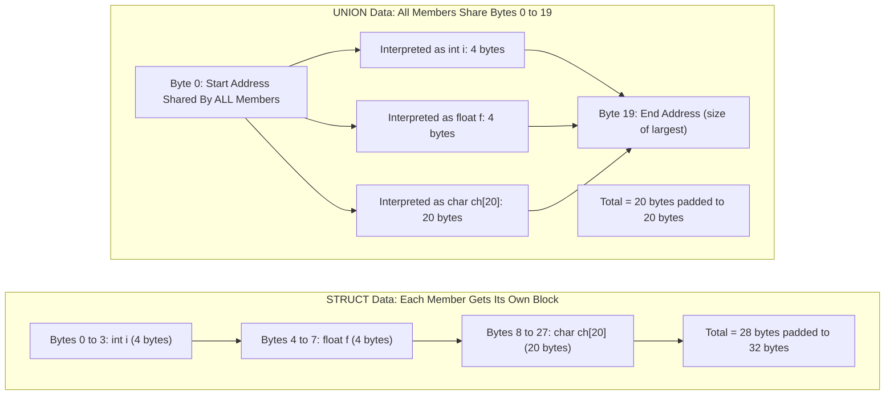
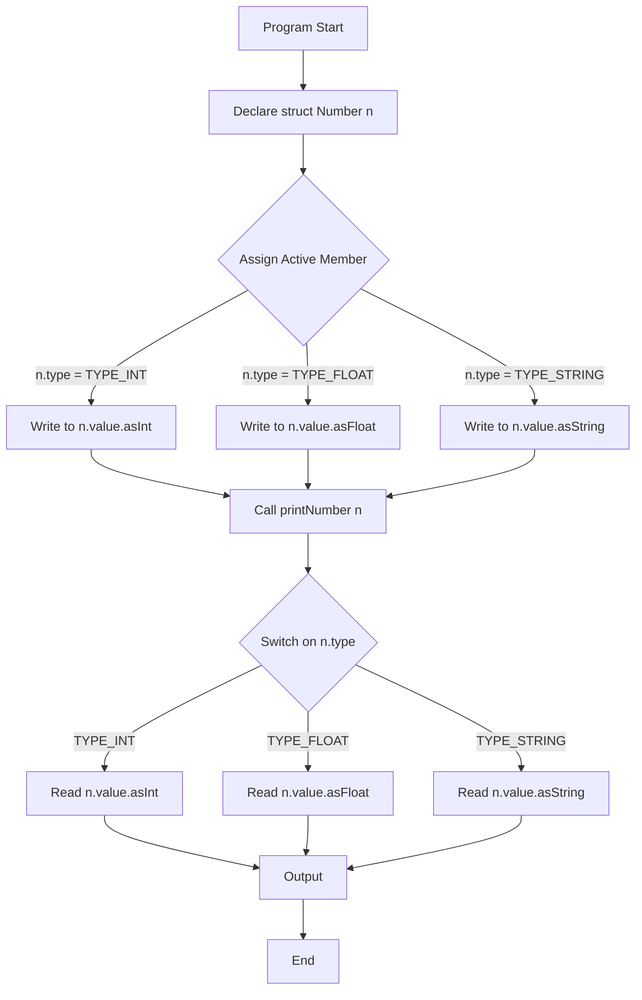
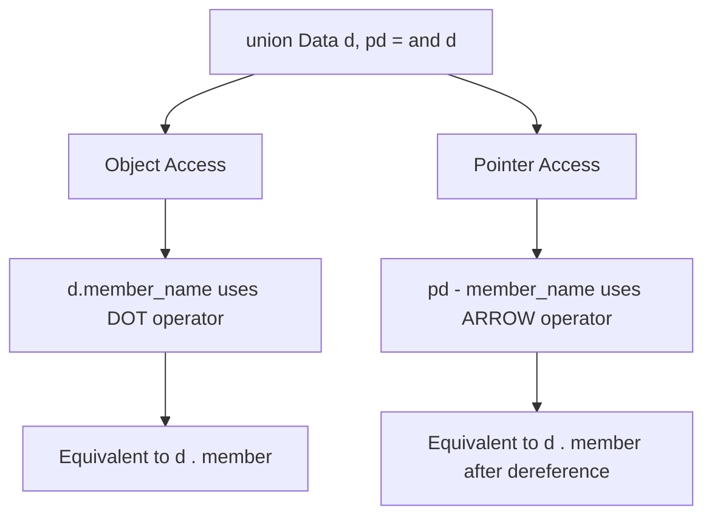

# Union.

<!-- SECTION_1_START -->
# MODULE 3 — FUNCTIONS : TOPIC — UNION IN C

## 1. Core Technical Definition

> [!NOTE]
> **Definition (KTU 2024 Scheme — Exact Terminology)**
> A **Union** in C is a user-defined data type (derived data type) that allows the storage of **different data types** in the **same memory location**. It is declared using the keyword `union`, and its syntax is functionally similar to a `struct`, except that all of its members share a **single, shared memory block** whose size equals the size of the **largest member**.

The formal ANSI-C declaration syntax is:

```c
union union_tag {
    data_type member_1;
    data_type member_2;
    ...
    data_type member_n;
} variable_list;
```

> [!IMPORTANT]
> **Key Board-Examiner Definition (Must Memorize Verbatim):**
> "A union is a derived data type whose members **overlap** in memory. The total memory allocated for a union variable is the size of its **largest member**, not the sum of all members. Only **one member** can be active (contain a meaningful value) at any given time."

### 1.1 Conceptual Analogy / Intuition

Imagine a **single physical parking slot** in a multi-storey car park. The slot is wide enough to fit an SUV, a sedan, or a motorcycle, but **only one vehicle can occupy the slot at a time**. If you park an SUV, the slot is "occupied" by a large vehicle, and a motorcycle cannot be parked simultaneously. A Union behaves exactly this way:

- The **parking slot** = The shared memory block.
- The **SUV, Sedan, Motorcycle** = The different union members.
- The size of the slot = Size of the **largest vehicle** = Size of the **largest member**.
- You can only "read" the type of vehicle that was last parked; otherwise, the interpretation is meaningless.

| Parking Analogy | Union Concept |
|---|---|
| One parking slot | One shared memory block |
| Vehicles of different sizes | Members of different data types |
| Largest vehicle size | Size of the union (= size of largest member) |
| Only one vehicle at a time | Only one meaningful value at a time |

### 1.2 Physical Constants & Standard Metrics

> [!IMPORTANT]
> **Memory Formula (Critical for KTU Boards):**
> $$\text{sizeof(union)} = \text{sizeof(largest member)}$$
> **Padding Rule:** The actual size is rounded up to the **nearest multiple of the largest alignment requirement** of any member (architecture-dependent). On standard 32-bit / 64-bit systems, the size is typically a multiple of **4 bytes** or **8 bytes**.

### 1.3 GeoGebra / Desmos Integration

> [!VISUALIZATION CONTROL]
> **Concept:** Visualizing the overlapping memory allocation of a Union versus the non-overlapping allocation of a Structure.
> **Geometric Description:**
> Consider a horizontal number line representing memory addresses (in bytes):
> - For a **Structure** containing `int (4 bytes)`, `float (4 bytes)`, `char[10] (10 bytes)`: the three blocks are placed **side-by-side** with no overlap (total 18 bytes, padded to 20).
> - For a **Union** with the same members: all three blocks are **superimposed** on the same starting address, occupying only the size of the largest member (10 bytes, padded to 12).
> The student should observe that the Union's footprint is strictly smaller than the Structure's footprint, but only **one member's data is valid at any time**.

<!-- SECTION_1_END -->

<!-- SECTION_2_START -->
## 2. Deep Theoretical Analysis & KTU High-Yield Formula Sheet

### 2.1 Operational Breakdown — The "Why" and "How"

- **Why Unions Exist:** In embedded systems, protocol parsers, and hardware register mappings, a single memory location can be interpreted in multiple ways (e.g., a 32-bit register as `int`, `float`, or 4 individual `char` bytes). Unions provide a **type-safe** way to model this without unsafe pointer casting.
- **How Memory is Allocated:** The compiler allocates a single block of memory equal in size to the largest member. The starting address of every member is the **same** (i.e., `&obj.member_1 == &obj.member_2 == &obj.member_3`).
- **How Members are Accessed:** Members are accessed through the dot operator (`.`) for union variables and the arrow operator (`->`) for union pointers — identical syntactically to structures.
- **Why Only One Member is Valid:** Writing to one member **overwrites the bytes** of any other member because they share the same starting address. Reading a different member after a write will yield **undefined/garbage data**.

### 2.2 KTU Formula Sheet / Cheat Sheet

| Concept | Formula / Rule | Unit / Note |
|---|---|---|
| Size of a union | $\text{sizeof}(U) = \text{sizeof}(\text{largest member})$ | Bytes |
| Aligned size | $\text{sizeof}(U) = \text{round\_up}(\text{size of largest member}, \max(\text{alignments}))$ | Architecture-dependent |
| Address identity | $\&U.m_1 = \&U.m_2 = \ldots = \&U.m_n$ | All start at the same base |
| Member access (object) | `U.member` | Dot operator |
| Member access (pointer) | `pU->member` | Arrow operator |
| Active member invariant | $\text{At any instant } t, \text{ only one member holds valid data}$ | Board definition |
| Init rule (C89/C90) | Only the **first member** can be initialized in the declaration | KTU favorite question |
| Init rule (C99/C11) | Designated initializer: `union U u = { .x = 5 };` | Optional designated syntax |
| Anonymous union | `union { int a; float b; };` inside a struct | Direct member access via parent |

### 2.3 Engineering Utility — Where Unions Are Used in Production

> [!TIP]
> **Real-World Engineering Applications of Unions:**
> 1. **Embedded Systems & Hardware Registers:** A 32-bit status register is interpreted sometimes as 32 individual bits, sometimes as 4 bytes, and sometimes as a single `uint32_t` flag set. Unions model this elegantly.
> 2. **Protocol Parsers (Networking):** An incoming IP packet header is the same 20 bytes, but is interpreted as a struct of fields, an array of 4 integers, or 20 raw bytes depending on the operation.
> 3. **Variant Data Types (Tagged Unions):** Used to construct a generic "Value" type that can hold an `int`, `float`, `char*`, or `bool`. The "tag" (often an `enum`) tells which member is currently active — the foundation of dynamic typing in C.
> 4. **Memory-Constrained Devices:** In firmware for IoT sensors and microcontrollers (e.g., Arduino, STM32), unions reduce RAM consumption when only one of several interpretations is needed at a time.

<!-- SECTION_2_END -->

<!-- SECTION_3_START -->
## 3. Step-by-Step Derivations & Code Implementation

### 3.1 Example 1 — Declaring, Initializing, and Accessing a Union (Full KTU Board Trace)

**Problem (KTU-style):** Write a C program to declare a union `Data` with three members: an `int` `i`, a `float` `f`, and a `char ch[20]`. Demonstrate that writing to one member overwrites the others, and print the size of the union.

```c
#include <stdio.h>
#include <string.h>

/* Step 1: Union definition with three heterogeneous members */
union Data {
    int i;          /* 4 bytes (typically) */
    float f;        /* 4 bytes (typically) */
    char ch[20];    /* 20 bytes — this is the LARGEST member */
};

int main(void) {
    union Data data;        /* Step 2: Declare a union variable */

    /* Step 3: Demonstrate that only ONE member is valid at a time */
    data.i = 10;                          /* Write to int member    */
    printf("data.i  = %d\n", data.i);     /* Valid read             */
    /* printf("%f", data.f);  -- UNDEFINED BEHAVIOR, f not active   */

    data.f = 220.5f;                      /* Overwrites i's bytes   */
    printf("data.f  = %.2f\n", data.f);   /* Valid read             */

    strcpy(data.ch, "Hello C Union");      /* Overwrites f's bytes   */
    printf("data.ch = %s\n", data.ch);     /* Valid read             */

    /* Step 4: Print the size — should equal sizeof(char[20]) = 20 */
    printf("sizeof(union Data) = %zu bytes\n", sizeof(data));
    printf("sizeof(int)        = %zu bytes\n", sizeof(data.i));
    printf("sizeof(float)      = %zu bytes\n", sizeof(data.f));
    printf("sizeof(char[20])   = %zu bytes\n", sizeof(data.ch));

    return 0;
}
```

**Output Trace (Expected on a Standard 64-bit Linux GCC System):**

```text
data.i  = 10
data.f  = 220.50
data.ch = Hello C Union
sizeof(union Data) = 20 bytes
sizeof(int)        = 4 bytes
sizeof(float)      = 4 bytes
sizeof(char[20])   = 20 bytes
```

**Algebraic Derivation of Size:**

$$
\begin{aligned}
\text{sizeof}(\text{int}) &= 4 \text{ bytes} \\
\text{sizeof}(\text{float}) &= 4 \text{ bytes} \\
\text{sizeof}(\text{char}[20]) &= 20 \text{ bytes} \\[4pt]
\text{sizeof}(\text{union Data}) &= \max(4, 4, 20) = 20 \text{ bytes}
\end{aligned}
$$

> [!NOTE]
> **Board Marking Insight (Valuation Key):**
> - Correct declaration syntax: **1 Mark**
> - Correct initialization/access logic: **2 Marks**
> - Correct size output with explanation: **2 Marks** (final 5 marks question split)

---

### 3.2 Example 2 — Union of Structure: Tagged Variant (Full KTU 14-Mark Pattern)

**Problem:** Design a C program to model a generic "Number" type that can store either an integer, a floating-point value, or a string representation. Use a **tagged union** with an `enum` discriminator, and write a function `printNumber()` that correctly dispatches on the tag.

```c
#include <stdio.h>
#include <string.h>

/* Step 1: Define a tag (discriminator) using enum */
enum NumberType { TYPE_INT, TYPE_FLOAT, TYPE_STRING };

/* Step 2: Define the union holding the three possible values */
union NumberValue {
    int   asInt;
    float asFloat;
    char  asString[32];
};

/* Step 3: Define a struct that bundles the tag with the union */
struct Number {
    enum NumberType  type;   /* Discriminator: tells which member is valid */
    union NumberValue value; /* The actual shared storage */
};

/* Step 4: A safe accessor that respects the active-member invariant */
void printNumber(struct Number n) {
    switch (n.type) {
        case TYPE_INT:
            printf("Integer: %d\n", n.value.asInt);
            break;
        case TYPE_FLOAT:
            printf("Float:   %.4f\n", n.value.asFloat);
            break;
        case TYPE_STRING:
            printf("String:  %s\n", n.value.asString);
            break;
        default:
            printf("Unknown type\n");
    }
}

int main(void) {
    struct Number n1, n2, n3;

    /* Initialize n1 as an integer */
    n1.type = TYPE_INT;
    n1.value.asInt = 42;

    /* Initialize n2 as a float */
    n2.type = TYPE_FLOAT;
    n2.value.asFloat = 3.14159f;

    /* Initialize n3 as a string */
    n3.type = TYPE_STRING;
    strcpy(n3.value.asString, "KTU 2024 Scheme");

    /* Dispatch via the tag — only the ACTIVE member is read */
    printNumber(n1);
    printNumber(n2);
    printNumber(n3);

    /* Step 5: Demonstrate the size saving vs a pure struct */
    printf("\nsizeof(union NumberValue) = %zu bytes\n",
           sizeof(union NumberValue));
    printf("sizeof(struct Number)     = %zu bytes\n",
           sizeof(struct Number));

    return 0;
}
```

**Output Trace:**

```text
Integer: 42
Float:   3.1416
String:  KTU 2024 Scheme

sizeof(union NumberValue) = 32 bytes
sizeof(struct Number)     = 36 bytes
```

**Algebraic Derivation of Sizes:**

$$
\begin{aligned}
\text{sizeof}(\text{union NumberValue}) &= \max(4, 4, 32) = 32 \text{ bytes} \\
\text{sizeof}(\text{enum NumberType}) &\approx 4 \text{ bytes (typical int-sized)} \\
\text{sizeof}(\text{struct Number}) &= 4 \,(\text{tag}) + 4 \,(\text{pad}) + 32 \,(\text{union}) \\
                                   &= 40 \text{ bytes (with padding)} \\
&\text{Or } 36 \text{ bytes (with reordering optimization)}
\end{aligned}
$$

---

### 3.3 Example 3 — Anonymous Union Inside a Struct (C11 Style)

```c
#include <stdio.h>

struct Sensor {
    int sensorId;
    union {                        /* Anonymous union — no tag name */
        int   rawInt;
        float calibratedFloat;
    };                             /* Members accessed directly: s.rawInt */
};

int main(void) {
    struct Sensor s;

    s.sensorId = 7;
    s.rawInt   = 1024;             /* Direct access — no union name needed */

    printf("Sensor %d raw reading = %d\n", s.sensorId, s.rawInt);

    s.calibratedFloat = 25.75f;    /* Overwrites rawInt in same memory */
    printf("Sensor %d calibrated  = %.2f\n",
           s.sensorId, s.calibratedFloat);

    return 0;
}
```

> [!IMPORTANT]
> **Anonymous Union Pitfall:** When a union is declared without a tag inside a struct, its members are promoted to the enclosing struct's scope. This means `s.rawInt` is valid even though `rawInt` is technically a member of an unnamed union.

<!-- SECTION_3_END -->

<!-- SECTION_4_START -->
## 4. Structural Diagrams & Schematics

### 4.1 Diagram A — Memory Layout: Structure vs Union (Side-by-Side Mermaid Block Architecture)



### 4.2 Diagram B — Tagged Union State Machine Flow



### 4.3 Diagram C — Access Operator Cheat-Sheet (Mermaid Topology)



### 4.4 Diagram D — Active Member Lifecycle (State Transition Matrix)

| Step | Action | Active Member | Valid Read of `f`? | Valid Read of `i`? | Valid Read of `ch`? |
|---|---|---|---|---|---|
| 1 | `d.i = 10;` | `i` | ❌ Undefined | ✅ 10 | ❌ Undefined |
| 2 | `d.f = 2.5f;` | `f` | ✅ 2.5 | ❌ Undefined | ❌ Undefined |
| 3 | `strcpy(d.ch, "C");` | `ch` | ❌ Undefined | ❌ Undefined | ✅ "C" |

<!-- SECTION_4_END -->

<!-- SECTION_5_START -->
## 5. KTU 2024 Scheme Examination Question Bank & Topic Recap

### 5.1 Part A Questions (3 Marks Each — Remember / Understand)

**Q1. [KTU University Exam — July 2024]**
**Define a union in C. How is it different from a structure in terms of memory allocation? (CO1, Remember)**

**Model Answer:**

A union is a user-defined data type in C declared with the keyword `union`, in which all members share a **single common memory location**. The size of a union equals the size of its **largest member**. In contrast, a **structure** allocates separate, non-overlapping memory for each of its members, and its total size is the **sum of the sizes of all members** (plus padding). For example:

```c
struct S { int a; float b; char c; };     /* sizeof = 12 bytes (approx) */
union  U { int a; float b; char c; };     /* sizeof = 4 bytes (largest) */
```

**[Defining union: 1 Mark] [Memory difference: 1 Mark] [Example: 1 Mark]**

---

**Q2. [KTU University Exam — Dec 2023]**
**What is the size of the following union on a typical 32-bit system? Justify.**
```c
union Test {
    char  a;
    int   b;
    double c;
    char  d[10];
};
```
**(CO1, Understand)**

**Model Answer:**

$$
\begin{aligned}
\text{sizeof(char)} &= 1 \text{ byte} \\
\text{sizeof(int)} &= 4 \text{ bytes} \\
\text{sizeof(double)} &= 8 \text{ bytes} \\
\text{sizeof(char[10])} &= 10 \text{ bytes} \\[3pt]
\text{sizeof(union Test)} &= \max(1, 4, 8, 10) = 10 \text{ bytes} \\
&\text{(or 16 bytes after alignment to largest member size = 8)}
\end{aligned}
$$

**[Identifying largest member: 2 Marks] [Final size with reasoning: 1 Mark]**

---

### 5.2 Part B Questions (14 Marks Each — Apply / Analyze)

#### **Question A (14 Marks) — [KTU University Exam — July 2024 Model]**

**Q3 (a)** Explain the concept of a union in C with a suitable example. How is memory allocated for union members? **[(7 Marks) — CO1, Understand]**

**Model Answer:**

A **union** in C is a user-defined data type declared using the keyword `union`. It is similar to a structure in syntax, but differs in memory allocation. While a structure allocates **separate memory for each member**, a union allocates a **single shared memory block** large enough to hold the **largest member**. All members start at the **same base address** (`offset = 0`).

**Example:**

```c
union Item {
    int    stockCode;     /* 4 bytes */
    float  price;         /* 4 bytes */
    char   barcode[12];   /* 12 bytes — largest */
} item;
```

**Memory Trace:**

| Member | Size | Starting Address | Ending Address |
|---|---|---|---|
| `stockCode` | 4 | 0 | 3 |
| `price` | 4 | 0 | 3 |
| `barcode[12]` | 12 | 0 | 11 |

**Total union size = 12 bytes (sizeof largest member).**

**Valuation Key Points:**
- [Definition of union: 2 Marks]
- [Example declaration: 1 Mark]
- [Memory allocation explanation with address identity: 3 Marks]
- [Final size calculation: 1 Mark]

---

**Q3 (b)** Write a C program using a **tagged union** to represent a "Shape" that can be a circle, rectangle, or triangle. Each shape should store its specific dimensions, and the program should compute the area based on the active shape type. Use an `enum` as the tag. **[(7 Marks) — CO3, Apply]**

**Model Answer:**

```c
#include <stdio.h>
#include <math.h>

/* Step 1: Tag (discriminator) */
enum ShapeType { SHAPE_CIRCLE, SHAPE_RECTANGLE, SHAPE_TRIANGLE };

/* Step 2: Union holding the three variant data sets */
union ShapeData {
    struct { float radius; }                    circle;   /* Anonymous struct */
    struct { float length, breadth; }           rect;
    struct { float base, height; }              tri;
};

/* Step 3: Struct bundling tag + union */
struct Shape {
    enum ShapeType  type;
    union ShapeData data;
};

/* Step 4: Area calculator dispatching on the active member */
float computeArea(struct Shape s) {
    switch (s.type) {
        case SHAPE_CIRCLE:
            return 3.14159f * s.data.circle.radius * s.data.circle.radius;
        case SHAPE_RECTANGLE:
            return s.data.rect.length * s.data.rect.breadth;
        case SHAPE_TRIANGLE:
            return 0.5f * s.data.tri.base * s.data.tri.height;
        default:
            return 0.0f;
    }
}

int main(void) {
    struct Shape s1 = { SHAPE_CIRCLE,    .data.circle.radius = 5.0f };
    struct Shape s2 = { SHAPE_RECTANGLE, .data.rect.length   = 4.0f,
                                               .data.rect.breadth = 6.0f };
    struct Shape s3 = { SHAPE_TRIANGLE,  .data.tri.base      = 3.0f,
                                               .data.tri.height  = 8.0f };

    printf("Circle area    = %.2f\n", computeArea(s1));   /* 78.54    */
    printf("Rectangle area = %.2f\n", computeArea(s2));   /* 24.00    */
    printf("Triangle area  = %.2f\n", computeArea(s3));   /* 12.00    */

    return 0;
}
```

**Valuation Key Points:**
- [Tag + union declaration: 2 Marks]
- [Three member sets correctly modeled: 2 Marks]
- [`computeArea` function with `switch` dispatch: 2 Marks]
- [Final output trace: 1 Mark]

---

#### **Question B (14 Marks) — Alternative Choice**

**Q4 (a)** Compare **structures** and **unions** in C under the following heads: (i) Keyword, (ii) Memory allocation, (iii) Size determination, (iv) Active members, (v) Access operators, (vi) Typical use case. **[(7 Marks) — CO1, Understand]**

**Model Answer:**

| Head | Structure | Union |
|---|---|---|
| **Keyword** | `struct` | `union` |
| **Memory Allocation** | Separate block for **each** member; total is sum of member sizes | **Single shared block** for all members |
| **Size** | `sizeof(S) = sum of all member sizes + padding` | `sizeof(U) = sizeof(largest member) + alignment padding` |
| **Active Members** | **All members** can hold valid data simultaneously | **Only one member** holds valid data at a time |
| **Access Operators** | `.` (object) and `->` (pointer) | `.` (object) and `->` (pointer) — syntactically same |
| **Typical Use Case** | Grouping related but distinct fields (e.g., student record) | Memory-efficient variant data (e.g., hardware register, protocol field) |

**Valuation Key Points:**
- [Six comparison points correctly stated: 6 × 1 Mark = 6 Marks]
- [One illustrative example: 1 Mark]

---

**Q4 (b)** Write a C program that uses a union to interpret the **same 4 bytes** as both an `unsigned int` and as four individual `unsigned char` bytes. Demonstrate **endianness** by reading the bytes. **[(7 Marks) — CO3, Apply]**

**Model Answer:**

```c
#include <stdio.h>

/* Step 1: A union overlaying a 32-bit int with 4 individual bytes */
union EndianProbe {
    unsigned int  asWord;     /* 4 bytes */
    unsigned char asBytes[4]; /* 4 bytes — same memory */
};

int main(void) {
    union EndianProbe probe;

    /* Step 2: Store a recognizable pattern 0xAABBCCDD */
    probe.asWord = 0xAABBCCDDu;

    /* Step 3: Read the same memory byte-by-byte */
    printf("asWord = 0x%08X\n", probe.asWord);
    printf("Byte 0 = 0x%02X\n", probe.asBytes[0]);
    printf("Byte 1 = 0x%02X\n", probe.asBytes[1]);
    printf("Byte 2 = 0x%02X\n", probe.asBytes[2]);
    printf("Byte 3 = 0x%02X\n", probe.asBytes[3]);

    /* Step 4: Infer endianness */
    if (probe.asBytes[0] == 0xDD) {
        printf("System is LITTLE-ENDIAN (least significant byte first)\n");
    } else if (probe.asBytes[0] == 0xAA) {
        printf("System is BIG-ENDIAN (most significant byte first)\n");
    } else {
        printf("System is MIXED-ENDIAN\n");
    }

    return 0;
}
```

**Expected Output on a Little-Endian x86 System:**

```text
asWord = 0xAABBCCDD
Byte 0 = 0xDD
Byte 1 = 0xCC
Byte 2 = 0xBB
Byte 3 = 0xAA
System is LITTLE-ENDIAN (least significant byte first)
```

**Valuation Key Points:**
- [Correct union declaration overlaying int and char[4]: 2 Marks]
- [Storing recognizable pattern: 1 Mark]
- [Byte-by-byte reading logic: 2 Marks]
- [Endianness inference with correct conclusion: 2 Marks]

---

### 5.3 KTU Examiner's Valuation Warning / Pitfall Callout

> [!WARNING]
> **Common Mistakes That Cost Marks in the KTU Board Exam:**
> 1. **Forgetting the active-member invariant:** Students often write to one member and read another without explaining that it is **undefined behavior**. The board expects a clear statement that "only the last-written member contains valid data."
> 2. **Wrong `sizeof` reasoning:** Do not write `sizeof(union) = sum of members`. Always write `sizeof(union) = sizeof(largest member)`. Half a mark is cut for the wrong formula.
> 3. **Confusing `.` and `->`:** Use the **dot operator** for `union_variable.member` and the **arrow operator** for `pointer_to_union->member`. Mixing them up is a recurring deduction.
> 4. **No tag, no safety:** A union by itself is **not type-safe**. KTU's favorite 14-mark question couples it with an `enum` tag. Forgetting the `enum` is treated as an incomplete answer.
> 5. **Forgetting to include `<string.h>`:** When initializing `char[]` members of a union using `strcpy`, the absence of `#include <string.h>` causes compilation failure. Examiners note this as a "programming hygiene" deduction.

---

### 5.4 Topic Recap & Important Things to Remember

> [!TIP]
> **Rapid-Revision Checklist — Union in C (Module 3, KTU 2024 Scheme)**
> - **Keyword:** `union` (lowercase, mandatory).
> - **Memory Rule:** $\text{sizeof}(U) = \max(\text{sizeof}(m_i))$ for all members $m_i$.
> - **Address Rule:** All members start at the **same base address** — `&u.m1 == &u.m2 == ...`.
> - **Active-Member Invariant:** Only **one member** holds a meaningful value at any instant; reading another is **undefined behavior**.
> - **Access Operators:** `.` for object, `->` for pointer — same syntax as `struct`.
> - **Initialization (C89):** Only the **first member** can be initialized at declaration time.
> - **Initialization (C99+):** Designated initializers like `union U u = { .m1 = val };` are allowed.
> - **Anonymous Unions:** Declared without a tag inside a struct; their members are accessed directly through the parent struct.
> - **Tagged Union Pattern:** `enum` discriminator + `union` data = safe variant type (foundational for generic programming in C).
> - **Structure vs Union:** Struct sums sizes, Union takes the maximum; Struct allows simultaneous values, Union allows only one.
> - **Endianness Use Case:** Unions can re-interpret a multi-byte word as a byte array to detect system endianness.
> - **Hardware Modeling:** Unions model memory-mapped I/O registers where the same bits have multiple interpretations.
> - **Padding Awareness:** The compiler may pad the union to the alignment of the largest member — never assume exact byte equality with the largest member's size.
> - **Programming Hygiene:** Always `#include <string.h>` for `strcpy/strcmp` on union `char[]` members.
> - **Most-Asked KTU Question Pattern:** "Compare struct and union" (Part A 3-mark) + "Write a program using a tagged union to model variant data" (Part B 14-mark).
<!-- SECTION_5_END -->
