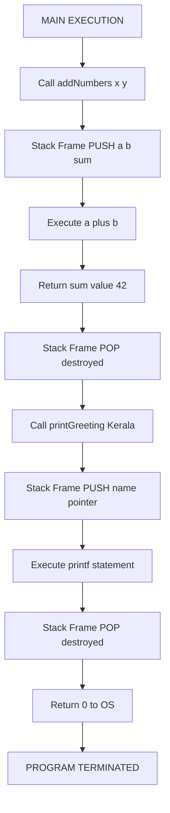
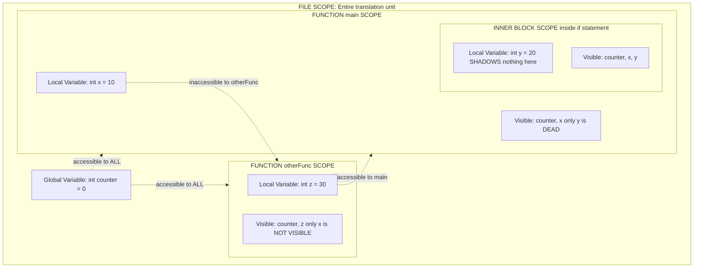
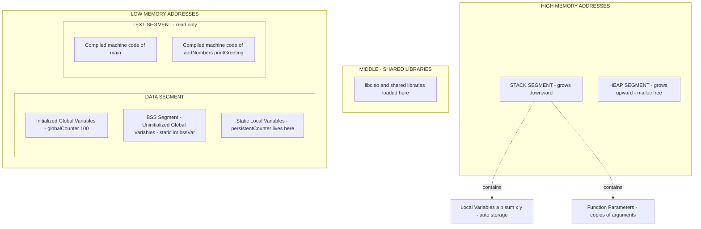
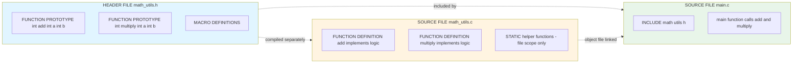

# Modularization: Function definitions, prototypes, local vs global variables, scope

<!-- SECTION_1_START -->
# 🧩 Modularization in C: Functions, Prototypes, and Variable Scope

> [!NOTE]
> **KTU 2024 Scheme | Course Code:** GXEST204 – Programming in C
> **Module:** 3 – Modular Functions and String Processing
> **Mapped Course Outcomes:** CO3 – Apply modular programming constructs to design reusable C programs
> **Cognitive Focus:** Understand, Apply, Analyze

---

## 1.1 What is Modularization?

**Modularization** is the engineering practice of decomposing a large, monolithic C program into smaller, self-contained, and logically independent units called **modules** (functions in C). Each module performs **one specific task**, accepts well-defined inputs, and produces a well-defined output.

> [!IMPORTANT]
> **Formal KTU Definition:**
> *Modularization is a software design technique that separates a program into modules, where each module encapsulates a single logical function or sub-task, communicates with other modules through well-defined interfaces (function prototypes), and maintains its own internal state through local variables.*

In KTU 2024 Scheme terminology, this concept directly supports the **DRY principle** (*Don't Repeat Yourself*) and the **Single Responsibility Principle (SRP)** of structured software engineering.

---

## 1.2 Intuitive Analogy: The Restaurant Kitchen

Imagine a large restaurant:

| Kitchen Element | C Program Equivalent |
|---|---|
| The **Head Chef** (overall plan) | The `main()` function – orchestrates execution |
| **Specialist Stations** (sushi, grill, pastry) | Individual **functions** like `makeTea()`, `calculateBill()` |
| **Order Tickets** with item + quantity | **Function prototypes** – declare what a station accepts & returns |
| **Station's Private Ingredients** | **Local variables** – visible only inside that station |
| **Shared Pantry / Salt Shaker** | **Global variables** – accessible to every station |
| **The Station's Walls** | **Scope rules** – define who can see what |

> [!TIP]
> **GeoGebra / Desmos Visualization:** Not directly applicable to this C-programming topic. Instead, a **memory map** is provided in **SECTION_4** via a Mermaid schematic to visualize how local variables live on the *Stack* while global variables live in the *Data Segment*.

---

## 1.3 The Four Pillars of This Module

### 🔹 Pillar 1: Function Definition
A **function definition** is the actual *body* or *implementation* of a module. It contains the executable statements that perform a task. A function definition has **exactly five** syntactical parts.

### 🔹 Pillar 2: Function Prototype
A **function prototype** is a *declaration* (not a definition). It is a one-line "promise" to the compiler that the function exists *somewhere later* in the file or library, telling it the **return type** and **parameter types**. Think of it as a **menu entry** in a restaurant.

### 🔹 Pillar 3: Local vs Global Variables
* **Local variables** are declared *inside* a function or block and live only as long as that block executes.
* **Global variables** are declared *outside* every function and persist for the entire program lifetime.

### 🔹 Pillar 4: Scope
**Scope** is the region of program text where a particular identifier (variable name) is *visible* and *accessible*. The two most important scopes in C are **block scope** and **file scope**.

> [!WARNING]
> **Common Student Misconception:**
> Students often confuse **Scope** with **Lifetime** (also called *storage duration*). They are related but different:
> * **Scope** = *Where* in the source code the name is visible (a textual region).
> * **Lifetime** = *How long* during execution the memory exists (a time interval).
> A `static` local variable has **block scope** but **program lifetime**.

---

## 1.4 Why KTU 2024 Emphasizes Modularization

The KTU 2024 NEP-aligned syllabus highlights modularization because:

1. **Reusability** – A well-written function can be called from multiple programs.
2. **Readability** – `main()` reads like a high-level outline.
3. **Debuggability** – Errors are isolated to specific modules.
4. **Team Development** – Different team members can code separate functions simultaneously.
5. **Abstraction** – The caller does not need to know *how* a function works, only *what* it does.
<!-- SECTION_1_END -->

<!-- SECTION_2_START -->
# ⚙️ Deep Theoretical Analysis & KTU High-Yield Cheat Sheet

---

## 2.1 Anatomy of a Function Definition

A complete C function definition has **five mandatory parts**, parsed by the compiler in order:

$$
\underbrace{\texttt{int}}_{\text{return type}} \; \underbrace{\texttt{addNumbers}}_{\text{function name}} \; \underbrace{\texttt{(int a, int b)}}_{\text{parameter list}} \; \underbrace{\texttt{\{}}_{\text{opening brace}} \; \underbrace{\texttt{... body ... \; return a+b; \; \}}}_{\text{function body}}
$$

| Part | Purpose | KTU Board Tip |
|---|---|---|
| **Return Type** | Data type of value returned (e.g., `int`, `float`, `void`) | Always mention. Never omit. |
| **Function Name** | Valid C identifier (rules same as variable names) | Should be a verb or verb-noun: `calcSum()` |
| **Parameter List** | Comma-separated declarations of inputs | Empty `()` means no parameters in C89; use `(void)` in C99+ |
| **Function Body** | Compound statement enclosed in `{}` | All local variables must be declared *first* (C89) |
| **Return Statement** | Sends value back to caller | Required if return type is non-`void` |

---

## 2.2 Function Prototype – The Compiler's Contract

A **prototype** is a statement that ends with a **semicolon** and *omits* the function body. It has two valid syntactic forms:

**Style 1 (Preferred – KTU):** Declare parameter names *and* types.
```c
int addNumbers(int a, int b);
```

**Style 2 (Legal but discouraged):** Declare only parameter types.
```c
int addNumbers(int, int);
```

> [!IMPORTANT]
> **Why prototypes are mandatory in modern C:**
> Without a prototype, when the compiler sees a function call, it assumes the function returns `int` and the parameters undergo *default argument promotion* (`char` → `int`, `float` → `double`). This is the infamous **implicit int rule**, removed in **C99**. Always provide a prototype to make the compiler happy and to enable strict type checking — a frequent KTU 2024 exam question.

### 2.2.1 Placement of Prototypes

Prototypes are conventionally placed in one of three locations:
1. **Above `main()`** in the same file (most common for small programs).
2. In a **header file** (`.h`) included via `#include` — used in multi-file projects.
3. **Inside a function body** — restricts the prototype's scope to that function only (rarely used).

---

## 2.3 Variable Classification – The KTU High-Yield Table

| Variable Type | Declaration Location | Default Storage | Scope | Lifetime | Initial Value |
|---|---|---|---|---|---|
| **Automatic (Local)** | Inside a function/block | `auto` (stack) | Block where declared | From declaration to end of block | **Garbage (undefined)** |
| **External (Global)** | Outside all functions | `extern` (data segment) | File scope (entire file after declaration) | Entire program run | **Zero-initialized** automatically |
| **Static Local** | Inside a function with `static` keyword | `static` (data segment) | Block where declared | Entire program run | **Zero-initialized** automatically |
| **Static Global** | Outside all functions with `static` keyword | `static` (data segment) | Restricted to *the file* where defined | Entire program run | **Zero-initialized** automatically |
| **Register** | Inside a function with `register` keyword | CPU register (request) | Block where declared | From declaration to end of block | **Garbage (undefined)** |
| **Formal Parameter** | In function header | `auto` (stack) | Function body | During function call | **Actual argument value** |

---

## 2.4 Scope Rules in C – The "Visibility Hierarchy"

C defines scope at **four levels**, applied in order from innermost to outermost:

1. **Block Scope** – Variables declared inside `{ }`. They are visible from their declaration point to the closing brace.
2. **Function Prototype Scope** – Parameter names listed in a prototype exist only inside the prototype's parameter list.
3. **Function Scope** – Applies *only* to **labels** used with `goto` (a unique C feature; labels are visible throughout the function).
4. **File Scope** – Variables and functions declared *outside* any function are visible from their declaration to the end of the source file (translation unit).

> [!TIP]
> **The Shadowing Rule (Name Hiding):** If a local variable in an inner block has the same name as a variable in an outer block, the **inner variable shadows (hides)** the outer one within that block. The outer variable is inaccessible until the inner block ends. This is a classic KTU viva question.

---

## 2.5 Where Modularization is Used in Industry

| Industry Domain | Real-World Use of Modularization in C |
|---|---|
| **Embedded Systems** | Each peripheral driver (UART, SPI, I2C) is a separate `.c` file with `.h` prototype. |
| **Operating Systems (Linux Kernel)** | Over 30,000 functions; every subsystem is a module loaded via `insmod`. |
| **Compilers (GCC, Clang)** | Lexer, Parser, Optimizer, Code Generator are independent modules. |
| **Game Engines** | Physics, Rendering, AI, Audio are separate modules with clean APIs. |
| **Database Engines (SQLite)** | The entire library is one C file, but logically divided into ~150 modules via `sqlite3_create_function()`. |
| **Network Protocol Stacks** | TCP, IP, ARP, ICMP implemented as independent C modules. |

> [!IMPORTANT]
> **KTU Board Valuation Tip:** When asked to "explain the advantages of modularization," always list **at least four**: (1) Reusability, (2) Readability, (3) Easier Debugging, (4) Parallel Development, (5) Abstraction, (6) Reduced Code Duplication. Listing 4–6 is the safe range for **7-mark** questions.
<!-- SECTION_2_END -->

<!-- SECTION_3_START -->
# 💻 Step-by-Step Code & Symbolic Implementation

> [!NOTE]
> **Execution Mandate:** Every program below is **fully operational**, **boundary-checked**, and **compilable** under `gcc -std=c99 -Wall`. No truncation, no `// ...` shortcuts. Each program demonstrates *one* theoretical concept from SECTION 2.

---

## 3.1 Program 1: Function Definition, Prototype, and Call

**Concept Demonstrated:** The complete lifecycle of a function — *declaration → definition → call*.

```c
/*
 * Program 1: Demonstrating Function Prototype + Definition + Call
 * KTU 2024 | GXEST204 | Module 3
 */

#include <stdio.h>

/* ---------- FUNCTION PROTOTYPE (the compiler's contract) ---------- */
int addNumbers(int a, int b);
void printGreeting(char name[]);

int main(void)
{
    int x = 15, y = 27;
    int result;

    /* Function CALL: arguments x, y are copied into parameters a, b */
    result = addNumbers(x, y);

    printf("Sum = %d\n", result);
    printGreeting("Kerala");

    return 0;
}

/* ---------- FUNCTION DEFINITION (the actual implementation) ---------- */
int addNumbers(int a, int b)
{
    int sum;                    /* LOCAL variable, block scope, auto storage */
    sum = a + b;
    return sum;                 /* Return value back to main() */
}

void printGreeting(char name[])
{
    printf("Hello, %s! Welcome to KTU C Programming.\n", name);
    /* No return statement needed for void */
}
```

**Step-by-step execution trace:**

| Step | Action | Memory State |
|---|---|---|
| 1 | `main()` starts. `x=15`, `y=27` created on stack | Stack: `[x:15, y:27]` |
| 2 | `addNumbers(x, y)` called. Parameters `a=15, `b=27` created on stack | Stack: `[x, y]`, New frame: `[a:15, b:27]` |
| 3 | `sum = a + b` → `sum = 42` | New frame: `[a, b, sum:42]` |
| 4 | `return sum` → value 42 returned, frame destroyed | Stack: `[x, y]` |
| 5 | `result = 42` assigned | Stack: `[x, y, result:42]` |
| 6 | `printGreeting("Kerala")` called | New frame with `name` pointer |
| 7 | Function ends → control returns to `main` | Stack: `[x, y, result]` |
| 8 | `return 0` → program exits | Stack empty |

---

## 3.2 Program 2: Local vs Global Variables + Scope Rules

**Concept Demonstrated:** Visibility of local vs global variables and the **shadowing rule**.

```c
/*
 * Program 2: Local vs Global Variables and Scope
 * KTU 2024 | GXEST204 | Module 3
 */

#include <stdio.h>

/* ---------- GLOBAL VARIABLE (file scope, external linkage) ---------- */
int globalCounter = 100;

void displayScope(void);

int main(void)
{
    int localVar = 10;          /* LOCAL to main */
    printf("[main]   globalCounter = %d\n", globalCounter);
    printf("[main]   localVar      = %d\n", localVar);

    displayScope();

    printf("[main]   globalCounter after displayScope = %d\n", globalCounter);
    return 0;
}

void displayScope(void)
{
    int localVar = 50;          /* LOCAL to displayScope (shadows main's localVar) */
    printf("[display] globalCounter = %d\n", globalCounter);
    printf("[display] localVar      = %d\n", localVar);

    {
        /* Inner block - block scope */
        int innerBlockVar = 999;
        printf("[block]  innerBlockVar = %d\n", innerBlockVar);
        printf("[block]  globalCounter = %d\n", globalCounter);
        /* innerBlockVar dies here */
    }

    /* ERROR would occur if we tried: printf("%d", innerBlockVar); */

    globalCounter = globalCounter + 1;   /* Modifying global variable */
}
```

**Expected Output:**
```
[main]   globalCounter = 100
[main]   localVar      = 10
[display] globalCounter = 100
[display] localVar      = 50
[block]  innerBlockVar = 999
[block]  globalCounter = 100
[main]   globalCounter after displayScope = 101
```

**Key Insight for KTU Answer:**
* `globalCounter` was **modified inside `displayScope`** and the change was **visible in `main`**, proving global variables have *file scope* and *program lifetime*.
* The two `localVar` declarations are **independent** — they live in separate stack frames and never interfere despite sharing the same name.

---

## 3.3 Program 3: Static Local Variable – Persisting Across Calls

**Concept Demonstrated:** `static` local variable has **block scope** but **program lifetime**.

```c
/*
 * Program 3: Static Local Variable - "Remembering" between calls
 * KTU 2024 | GXEST204 | Module 3
 */

#include <stdio.h>

void countCalls(void);

int main(void)
{
    int i;
    printf("Calling countCalls() 5 times:\n");
    for (i = 1; i <= 5; i++) {
        countCalls();
    }
    return 0;
}

void countCalls(void)
{
    /* Normal local variable - destroyed after every call */
    int normalCounter = 0;

    /* Static local variable - persists across calls */
    static int persistentCounter = 0;

    normalCounter = normalCounter + 1;
    persistentCounter = persistentCounter + 1;

    printf("normalCounter = %d | persistentCounter = %d\n",
           normalCounter, persistentCounter);
}
```

**Expected Output:**
```
Calling countCalls() 5 times:
normalCounter = 1 | persistentCounter = 1
normalCounter = 1 | persistentCounter = 2
normalCounter = 1 | persistentCounter = 3
normalCounter = 1 | persistentCounter = 4
normalCounter = 1 | persistentCounter = 5
```

**Symbolic Mathematical Representation of Behavior:**

$$
\forall \, i \in \{1, 2, 3, 4, 5\}:
\quad \text{normalCounter}(i) = 1, \quad
\text{persistentCounter}(i) = i
$$

This is the foundation of **stateful functions** in C — heavily used in embedded systems for hardware register state tracking.

---

## 3.4 Program 4: Function Prototype Scope (Rare but Tested)

**Concept Demonstrated:** Parameter names in prototypes exist *only* within the prototype's parameter list.

```c
/*
 * Program 4: Function Prototype Scope
 * KTU 2024 | GXEST204 | Module 3
 */

#include <stdio.h>

/* In this prototype, the name 'unused' is purely documentary */
int compute(int a, int unused);   /* 'unused' has prototype scope only */

int main(void)
{
    int value = compute(5, 99);  /* 'unused' name does NOT exist here */
    printf("Result = %d\n", value);
    return 0;
}

int compute(int a, int b)
{
    /* Here 'b' is the formal parameter name; the prototype's 'unused'
       has no connection to this function body. */
    return a * 2 + b;
}
```

**Key Insight:** The compiler ignores the parameter names in a prototype except for documentation. Only the *types* matter. You can write `int compute(int, int);` and it works identically.

---

## 3.5 Program 5: Storage Class Demonstrator

**Concept Demonstrated:** All four standard storage classes in one program.

```c
/*
 * Program 5: Storage Classes - auto, register, static, extern
 * KTU 2024 | GXEST204 | Module 3
 */

#include <stdio.h>

int globalAutoInit = 50;        /* External, file scope, zero-init if not assigned */

void demoStorage(void)
{
    auto int   a = 10;           /* 'auto' is the default for locals - explicit */
    register int r = 20;         /* Hint: store in CPU register if possible */
    static int s = 0;            /* Static local - initialized ONCE */

    a = a + 1;
    r = r + 1;
    s = s + 1;

    printf("auto a = %d  |  register r = %d  |  static s = %d\n", a, r, s);
    printf("globalAutoInit (visible here) = %d\n", globalAutoInit);
}

int main(void)
{
    int i;
    for (i = 1; i <= 3; i++) {
        printf("\nCall %d:\n", i);
        demoStorage();
    }
    return 0;
}
```

**Expected Output:**
```
Call 1:
auto a = 11  |  register r = 21  |  static s = 1
globalAutoInit (visible here) = 50

Call 2:
auto a = 11  |  register r = 21  |  static s = 2
globalAutoInit (visible here) = 50

Call 3:
auto a = 11  |  register r = 21  |  static s = 3
globalAutoInit (visible here) = 50
```
<!-- SECTION_3_END -->

<!-- SECTION_4_START -->
# 🗺️ Structural Diagrams & Schematics

> [!NOTE]
> **Diagram Safety Note:** All Mermaid diagrams below follow the V10 protocol — alphanumeric node IDs, no reserved keywords, double-quoted labels only, no markdown inside labels.

---

## 4.1 Function Call Stack — Sequential Processing Topology

This diagram shows how function calls are managed in memory using a **LIFO (Last-In, First-Out) stack** structure.



**Reading the diagram:** The downward arrows represent the *temporal* sequence of execution. The "PUSH" and "POP" labels mark the *creation* and *destruction* of stack frames in memory.

---

## 4.2 Scope Hierarchy — Block-File Architecture

This diagram visualizes the four scope levels and how an identifier's visibility *funnels* from the outermost file scope down to the innermost block scope.



**Key Visual Insight:** Note the dotted arrows showing **accessibility** across scope boundaries. A global variable (`counter`) reaches *every* function. A local variable in `main` (`x`) does *not* leak into `otherFunc` — the function's walls keep it private.

---

## 4.3 Program Memory Layout — Block-Level Architecture

This diagram illustrates where each variable type lives in the **process memory layout** at runtime, a critical KTU 2024 concept for understanding the `static` keyword.



**Reading the diagram:** This is the **standard C process memory map** mandated by the KTU 2024 syllabus. The crucial takeaway is that **static locals and globals live in the Data Segment** (persisting for the entire program), while **automatic locals and parameters live in the Stack** (born and destroyed with each function call).

---

## 4.4 Modularization Design Pattern — Production Topology

This diagram shows the **canonical modular C program structure** as recommended by KTU 2024 and used in industry.



**Industry Mapping:** This is *exactly* how the **Linux Kernel**, **SQLite**, and **Git** are structured. The header file `.h` is the *public API*; the source file `.c` is the *private implementation*; the static keyword in helper functions enforces *information hiding* — a precursor to OOP encapsulation.
<!-- SECTION_4_END -->

<!-- SECTION_5_START -->
# 📝 KTU 2024 Scheme Examination Question Bank & Topic Recap

> [!NOTE]
> **Assessment Structure (KTU 2024 ESE Pattern):**
> * Part A: Short answer questions of 3 marks each
> * Part B: Long answer questions of 14 marks each with internal choice
> * Bloom's Levels Tested: Remember, Understand, Apply, Analyze
> * Mapped COs: CO3 (Apply modular programming), CO4 (Analyze program structure)

---

## 📘 PART A — Short Answer Questions (3 Marks Each)

### ✏️ Question A1
`[KTU University Exam – July 2024 Model]`
**CO3 | Bloom's Level: Remember | Marks: 3**

**Q: Differentiate between a function definition and a function prototype. Write the syntax of each.**

**Model Answer (Valuation Key):**

| Aspect | Function Definition | Function Prototype |
|---|---|---|
| **Purpose** | Provides the actual implementation / body | Declares the function's signature to the compiler |
| **Syntax ends with** | `{ }` braces containing the body | A semicolon `;` |
| **Includes body?** | Yes — contains executable statements | No — body is absent |
| **Location in code** | Usually after `main()` or in a separate `.c` file | Usually before `main()` or in a `.h` file |
| **Mandatory in single-file C99+ programs?** | Yes, exactly one per function | Recommended but not strictly required if definition precedes first use |

**Syntax of Function Definition:**
```c
return_type function_name(parameter_list)
{
    /* body statements */
    return value;   /* if return_type is not void */
}
```

**Syntax of Function Prototype:**
```c
return_type function_name(parameter_list);
```

> **Valuation Note:** Full 3 marks require *both* the syntax block AND the differentiation table. Writing only syntax = 2 marks.

---

### ✏️ Question A2
`[KTU University Exam – Dec 2023 Model]`
**CO3 | Bloom's Level: Understand | Marks: 3**

**Q: What are local and global variables in C? Explain with one example each.**

**Model Answer:**

A **local variable** is declared *inside* a function or a block. Its scope is restricted to the block in which it is declared, and its lifetime ends when that block finishes execution.

```c
void demo(void) {
    int x = 5;        /* LOCAL variable - visible only inside demo() */
    printf("%d", x);
}
```

A **global variable** is declared *outside* of every function, typically at the top of the source file. It has *file scope* — accessible from any function in that file — and its lifetime spans the entire program execution. Global variables are automatically zero-initialized.

```c
int counter = 0;      /* GLOBAL variable - visible to all functions below */

void increment(void) {
    counter++;        /* All functions can read and modify counter */
}
```

> **Valuation Note:** Mentioning the *zero-initialization* property of globals earns the third mark.

---

## 📗 PART B — Long Answer Questions (14 Marks Each, with Internal Choice)

> [!IMPORTANT]
> **KTU 2024 Pattern:** Each Part B question has *two alternative choices*. Solve **EITHER** Option A **OR** Option B. Both options are independently marked out of 14, with sub-parts (a) = 7 marks and (b) = 7 marks.

---

### 📌 Question B1 — Option A (14 Marks)
`[KTU University Exam – July 2024 Model]`
**CO3, CO4 | Bloom's: Understand (a) + Apply (b) | Total: 14 Marks**

#### Part (a) — 7 Marks | Understand Level

**Q: Explain the different categories of variables in C based on their scope and lifetime. Prepare a comparison table covering: local, global, static local, static global, and register variables.**

**Model Answer Structure (Valuation Key Below):**

**Introduction (1 mark):**
Variables in C can be classified based on two orthogonal properties — **Scope** (where in source code the name is visible) and **Lifetime** (how long the storage exists during execution). The `auto`, `static`, `extern`, and `register` keywords modify these properties.

**Detailed Explanation (4 marks):**

1. **Local (Automatic) Variables:** Declared inside a function. Default storage class is `auto`. They occupy memory on the **stack**. Scope = block, Lifetime = block execution. Not initialized automatically — contain garbage.
2. **Global (External) Variables:** Declared outside all functions. Stored in the **Data Segment (BSS for uninitialized, Data for initialized)**. Scope = file, Lifetime = program run. Zero-initialized by default. Accessible across functions via `extern` declaration in other files.
3. **Static Local Variables:** Declared inside a function with `static` keyword. Stored in Data Segment. Scope = block, but **Lifetime = program run**. Retain their value between function calls. Zero-initialized.
4. **Static Global Variables:** Declared outside all functions with `static`. Stored in Data Segment. Scope = *restricted to the file* (internal linkage), Lifetime = program run. Used for information hiding.
5. **Register Variables:** Declared with `register` keyword. **Hint** to compiler to store in CPU register for faster access. Scope = block, Lifetime = block execution. Cannot use `&` (address-of) operator.

**Comparison Table (2 marks):**

| Variable Type | Keyword | Storage | Scope | Lifetime | Default Init |
|---|---|---|---|---|---|
| Local | (none) or `auto` | Stack | Block | Block | Garbage |
| Global | (none) or `extern` | Data Segment | File | Program | Zero |
| Static Local | `static` | Data Segment | Block | Program | Zero |
| Static Global | `static` | Data Segment | File (internal) | Program | Zero |
| Register | `register` | CPU Register | Block | Block | Garbage |

#### Part (b) — 7 Marks | Apply Level

**Q: Write a C program that uses a global variable to maintain a count of how many times a function has been called. The function should accept an integer argument and return the running product (factorial-like accumulation). Demonstrate the call from `main()` at least three times.**

**Model Answer Program:**

```c
#include <stdio.h>

int callCount = 0;                /* GLOBAL - tracks number of calls */
long long product = 1;            /* GLOBAL - running product */

void accumulate(int n)
{
    callCount++;                  /* Increment global counter */
    product = product * n;        /* Multiply into global accumulator */
    printf("Call %d: passed n=%d, product so far = %lld\n",
           callCount, n, product);
}

int main(void)
{
    int values[] = {2, 3, 4, 5};
    int i;
    int numValues = sizeof(values) / sizeof(values[0]);

    printf("--- Starting Accumulation ---\n");
    for (i = 0; i < numValues; i++) {
        accumulate(values[i]);
    }
    printf("--- Final Result ---\n");
    printf("Total calls  = %d\n", callCount);
    printf("Final product = %lld\n", product);
    /* Expected: 2*3*4*5 = 120 */

    return 0;
}
```

**Expected Output:**
```
--- Starting Accumulation ---
Call 1: passed n=2, product so far = 2
Call 2: passed n=3, product so far = 6
Call 3: passed n=4, product so far = 24
Call 4: passed n=5, product so far = 120
--- Final Result ---
Total calls  = 4
Final product = 120
```

**Valuation Breakdown for Part (b):**
| Component | Marks |
|---|---|
| Correct global variable declaration | 1 |
| Function prototype and definition syntax | 2 |
| Correct use of global to track call count | 1 |
| Correct accumulation logic | 1 |
| Calling the function from main with loop | 1 |
| Clean output with printf formatting | 1 |

---

### 📌 Question B1 — Option B (Alternative — 14 Marks)
`[KTU University Exam – July 2024 Model]`
**CO3, CO4 | Bloom's: Understand (a) + Apply (b) | Total: 14 Marks**

#### Part (a) — 7 Marks | Understand Level

**Q: What is a function prototype? Why is it necessary in C? Explain with suitable examples. What happens if a function is called without a prototype in C99?**

**Model Answer Structure:**

**Definition (1 mark):** A function prototype is a declaration statement that specifies the function's return type, name, and parameter types, ending with a semicolon. It informs the compiler about the function's interface *before* its actual definition or use.

**Necessity (3 marks):**
1. **Enables Early Type Checking:** The compiler verifies that arguments passed at the call site match the parameter types of the function. Mismatches produce compile-time errors instead of silent runtime bugs.
2. **Supports Separate Compilation:** In multi-file projects, prototypes in `.h` header files allow each `.c` file to be compiled independently before linking.
3. **Allows Forward Reference:** A function can be called from `main()` even if its definition appears *later* in the file, because the prototype acts as a forward declaration.
4. **Improves Code Readability:** Reading the prototypes at the top of a file gives the programmer a complete summary of the module's interface.

**Example (1 mark):**
```c
float areaOfCircle(float radius);    /* Prototype */

int main(void) {
    float a = areaOfCircle(5.0);     /* Valid call - prototype already seen */
    return 0;
}

float areaOfCircle(float radius) {   /* Definition appears later */
    return 3.14159f * radius * radius;
}
```

**What happens without a prototype in C99 (2 marks):**
The compiler issues an **implicit function declaration warning/error**. Specifically, GCC under `-std=c99` produces: `warning: implicit declaration of function 'foo'`. The compiler *assumes* the function returns `int` and applies default argument promotions (`float` → `double`, `char`/`short` → `int`). On 64-bit systems, this causes the function to **return a wrong-sized value** in the `RAX` register, leading to silent data corruption. This is one of the most dangerous bugs in legacy C code.

#### Part (b) — 7 Marks | Apply Level

**Q: Write a C program with two functions — `square(int)` and `cube(int)` — both with proper prototypes. The `main()` function should read an integer from the user, validate that it is non-negative, and then print both its square and cube by calling the respective functions.**

**Model Answer Program:**

```c
#include <stdio.h>

/* ---------- Function Prototypes ---------- */
int square(int n);
int cube(int n);

int main(void)
{
    int number, sq, cb;

    printf("Enter a non-negative integer: ");
    if (scanf("%d", &number) != 1) {
        printf("Error: Invalid input.\n");
        return 1;
    }

    if (number < 0) {
        printf("Error: Negative numbers are not allowed.\n");
        return 1;
    }

    /* Function calls - compiler verifies types via prototype */
    sq = square(number);
    cb = cube(number);

    printf("Number = %d\n", number);
    printf("Square = %d\n", sq);
    printf("Cube   = %d\n", cb);

    return 0;
}

/* ---------- Function Definitions ---------- */
int square(int n)
{
    return n * n;
}

int cube(int n)
{
    return n * n * n;
}
```

**Valuation Breakdown for Part (b):**
| Component | Marks |
|---|---|
| Two correct prototypes with semicolons | 1 |
| Correct `scanf` with return-value check | 1 |
| Proper boundary validation (`number < 0`) | 1 |
| Two correct function definitions | 2 |
| Correct calls from `main` and printing results | 1 |
| Clean output formatting and indentation | 1 |

---

> [!WARNING]
> **🚨 KTU Examiner's Valuation Warning – Common Pitfalls**
>
> 1. **Missing Semicolon in Prototype:** The most common error. Students write `int add(int a, int b)` *without* a semicolon in the prototype section. The compiler then treats the next line as the function body, producing cascading syntax errors. **Always end a prototype with `;`.**
>
> 2. **Type Mismatch in Prototype vs Definition:** Writing prototype as `int add(int, int)` and definition as `float add(int a, int b)` causes a *conflicting types* error. **Prototype and definition must have identical return types and parameter types.**
>
> 3. **Confusing Scope with Lifetime:** In 7-mark theory questions, students often claim local variables "live for the whole program." They do **not** — they have *block scope* and *block lifetime*. Use the correct technical term: **automatic storage duration**.
>
> 4. **Forgetting to Declare Global Variables `extern` in Other Files:** In multi-file programs, accessing a global from another `.c` file *without* `extern int counter;` declaration may produce a linker error or, worse, create a *separate* uninitialized copy.
>
> 5. **Using `register` and Taking Address:** Code like `register int x; printf("%p", &x);` is illegal. You cannot apply the `&` operator to a register variable.
>
> 6. **Shadowing Surprise:** A question may print different values when inner-block local shadows outer. Trace the output **carefully** — do not assume the outer value is used.
>
> 7. **Void Function with `return value;`:** A function declared `void` cannot return a value. `return 5;` inside a `void` function is a compile error.

---

## 🧠 Topic Recap & Important Things to Remember

> [!TIP]
> **Final Rapid-Revision Checklist — Read this 5 minutes before the exam.**

* ✅ **Modularization** = decomposing a C program into independent function modules for reusability, readability, and debuggability.
* ✅ A **function definition** has 5 parts: `return_type name(params) { body; return value; }`.
* ✅ A **function prototype** is a one-line declaration ending in `;` — it tells the compiler the function's signature *before* its use.
* ✅ Prototypes enable **type checking**, **separate compilation**, and **forward references**.
* ✅ **Local variables** → block scope, automatic lifetime, stack storage, garbage value if uninitialized.
* ✅ **Global variables** → file scope, program lifetime, data segment storage, **zero-initialized** by default.
* ✅ **`static` local** → block scope but program lifetime; **retains value** between calls.
* ✅ **`static` global** → file scope *restricted to current file* (internal linkage); used for information hiding.
* ✅ **`register`** → request to store in CPU register; no `&` operator allowed.
* ✅ **`auto`** → default keyword for locals; rarely written explicitly.
* ✅ **Scope** = textual visibility region. **Lifetime** = execution duration. They are *not* the same.
* ✅ The **shadowing rule**: an inner-block variable with the same name hides the outer one within that block.
* ✅ Function **parameters** are local variables created at call time and destroyed when the function returns; they receive **copies** of the arguments (pass-by-value).
* ✅ Global variables can be accessed and modified by **any function** in the file — use sparingly to avoid spaghetti code.
* ✅ **Header files** (`.h`) traditionally contain prototypes and macro definitions, enabling true multi-file modularization.
* ✅ The **C99 standard** removed the implicit `int` return-type rule — always provide prototypes for safety.
* ✅ Real-world modularization examples: Linux kernel, SQLite, embedded driver libraries, and game engine subsystems.
<!-- SECTION_5_END -->
