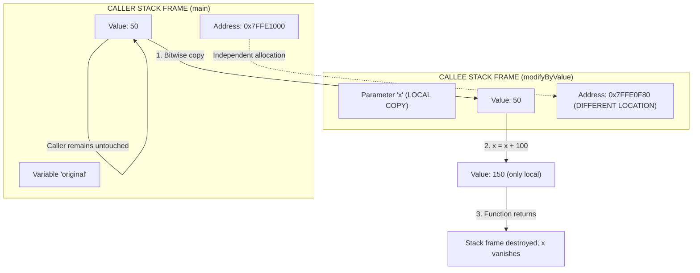
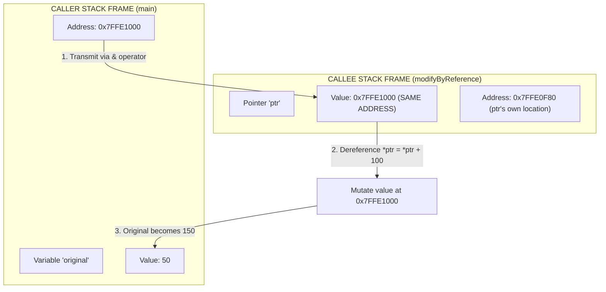
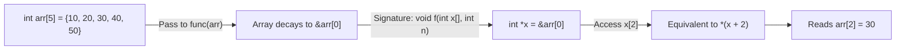
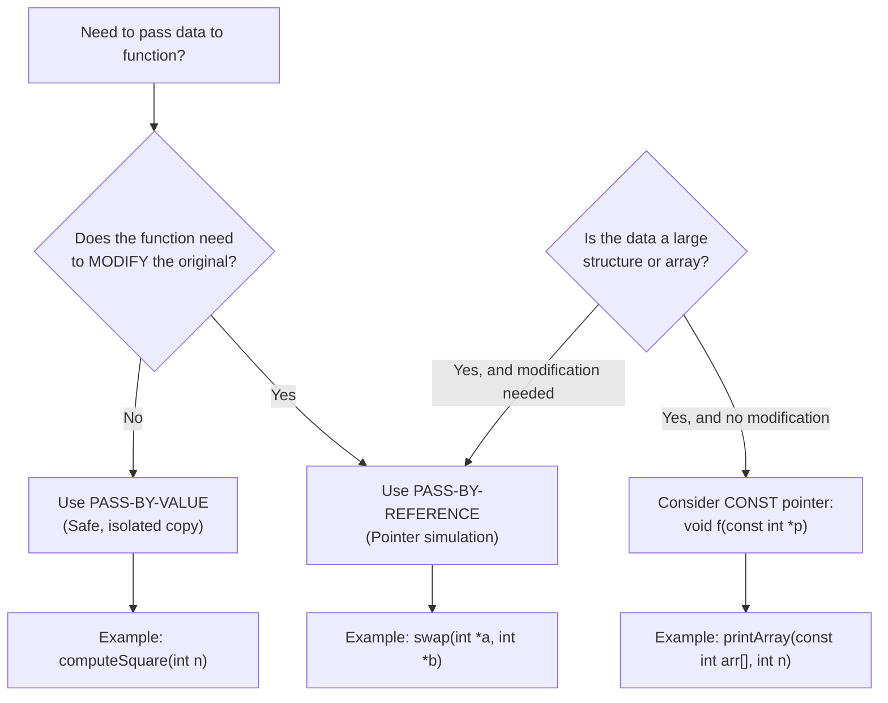
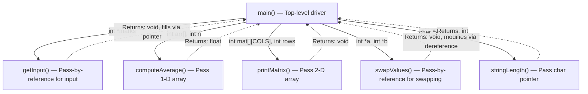

# Parameter Passing: Pass-by-Value vs Pass-by-Reference, array data transfers into functions

<!-- SECTION_1_START -->
# Module 3: Parameter Passing Mechanisms in C

## 1. Core Technical Definition & Intuitive Overview

### 1.1 Formal KTU Definition

In the C programming language, **parameter passing** (also termed *argument transmission*) is the mechanism by which data is communicated from the *calling function* (caller) to the *called function* (callee) during a function invocation. The **KTU 2024 Scheme syllabus (Course Code: GXEST204)** explicitly categorizes this into two foundational paradigms:

> [!IMPORTANT]
> **Pass-by-Value (Call-by-Value):** A mechanism wherein a *copy* of the actual argument's value is transmitted to the formal parameter of the called function. Any modification performed on the parameter inside the callee remains **local** and does **NOT** reflect back in the caller's original variable.

> [!IMPORTANT]
> **Pass-by-Reference (Call-by-Reference):** A mechanism wherein the *memory address* (reference) of the actual argument is transmitted to the formal parameter. Modifications performed through the dereferenced parameter **permanently reflect** in the caller's original variable, since both caller and callee operate on the *same memory location*.

### 1.2 Conceptual Analogy (Intuition)

> [!NOTE]
> **Real-World Analogy: Photocopy vs. Shared Google Document**
>
> - **Pass-by-Value** is like giving someone a **photocopy of an original document**. They can scribble, highlight, or tear the photocopy, but your *original* document in the safe remains untouched.
>
> - **Pass-by-Reference** is like sharing a **live Google Docs link** to your original document. Anyone with the link can edit the *same* file, and every change is instantly visible to all collaborators. The original is permanently modified.
>
> - **Array Passing** (a special C convention) is like sharing the *home address* of a row of lockers. Once you give someone the base address, they can walk down the lane and access *every locker* in sequence using pointer arithmetic.

### 1.3 Physical Memory Model

In C, every variable resides in a contiguous block of **Random Access Memory (RAM)**. Each block has a unique hexadecimal address. The compiler's **Symbol Table** maintains the mapping between *variable names* and their *memory addresses*.

When we declare `int x = 10;`, the OS allocates (typically) **4 bytes** of memory at some address, say `0x7FFE4B`, and stores the binary value `0000 1010` there. The *name* `x` is a symbolic alias the programmer uses; the *address* `0x7FFE4B` is the true hardware-level identifier.

> [!TIP]
> **KTU Board Tip:** Examiners frequently award marks for explicitly stating the **size of the data type in bytes** (`int` = 4 bytes on most modern 32/64-bit GCC compilers, `char` = 1 byte, `float` = 4 bytes, `double` = 8 bytes, pointer = 8 bytes on 64-bit systems).

### 1.4 Array Decay Rule (Critical KTU Concept)

> [!WARNING]
> **The Array-to-Pointer Decay Phenomenon:** In C, when a one-dimensional array is passed to a function, it **does NOT** pass the entire array block. Instead, the array *decays* into a pointer to its **first element** (`&arr[0]`). This means information about the array's length is lost unless explicitly transmitted as a separate `int` parameter.

---

### 2. Deep Theoretical Analysis & KTU High-Yield Formula Sheet

#### 2.1 Operational Logic — Pass-by-Value

The pass-by-value mechanism follows a strict 5-stage operational sequence:

1. **Allocation**: The compiler allocates a *new, independent* memory location on the function's **stack frame** for the formal parameter.
2. **Bitwise Copy**: The bit pattern of the actual argument is **copied verbatim** into the formal parameter's memory.
3. **Local Binding**: The formal parameter becomes a *local variable* of the called function (visible only inside its scope).
4. **Independent Operation**: Any arithmetic or logical operation on the parameter affects *only* the local copy.
5. **Destruction**: Upon `return`, the stack frame is unwound, and the local copy is permanently destroyed.

#### 2.2 Operational Logic — Pass-by-Reference (Simulated in C)

C does *not* natively support pass-by-reference like Pascal or Fortran. Instead, we **simulate** it by passing the **address** (a pointer) of the variable. The operational sequence is:

1. **Address Extraction**: The unary `&` (address-of) operator fetches the memory address of the caller's variable.
2. **Pointer Allocation**: The compiler allocates stack space for a *pointer variable* in the callee.
3. **Address Binding**: The pointer is initialized with the address received from step 1.
4. **Indirection**: The `*` (dereference) operator accesses/modifies the value at that address.
5. **Reflection**: Since the address points to the caller's original variable, modifications are immediately visible to the caller.

#### 2.3 KTU High-Yield Cheat Sheet

| # | Concept | Pass-by-Value | Pass-by-Reference (Pointer Simulation) |
|---|---------|---------------|----------------------------------------|
| 1 | What is transmitted? | A *copy* of the data value | A *copy* of the memory address |
| 2 | Syntax in callee signature | `void func(int x)` | `void func(int *x)` |
| 3 | Syntax at call site | `func(a)` | `func(&a)` |
| 4 | Memory allocated for parameter | **Yes** (new stack frame) | **Yes** (new pointer variable) |
| 5 | Modifications affect caller? | **No** (isolated) | **Yes** (reflects via dereferencing) |
| 6 | Pointer overhead? | **No** | **Yes** (8 bytes on 64-bit) |
| 7 | Risk of side effects? | **None** (safer) | **High** (caller data exposed) |
| 8 | Formal parameter data type | Same as argument | Pointer to argument's data type |
| 9 | Dereferencing required? | **No** | **Yes** using `*` operator |
| 10 | KTU typical use case | Simple computations, math | Swap functions, in-place edits |

#### 2.4 Array Transfer Mechanism Summary

| Array Dimension | Function Signature | What is Passed? | Length Info Required? |
|-----------------|-------------------|------------------|----------------------|
| 1-D array | `void f(int arr[], int n)` | Pointer to first element (decays) | **Yes** — explicit `n` |
| 2-D array | `void f(int mat[][C], int r)` | Pointer to first row | **Yes** — column count `C` mandatory |
| String (char array) | `void f(char str[])` | Pointer to first character | **No** — null terminator `'\0'` marks end |
| Array of pointers | `void f(int *arr[], int n)` | Pointer to first pointer | **Yes** — explicit `n` |

> [!IMPORTANT]
> **Real-World Engineering Utility:** Pass-by-reference simulation is the backbone of operating system kernels (Linux kernel uses extensive pointer-based parameter passing for performance and hardware register manipulation), embedded systems firmware (memory-constrained microcontrollers like Arduino/AVR), and high-performance computing (HPC) where copying large data structures is computationally prohibitive.

---

### 3. Step-by-Step Code/Symbolic Implementation

#### 3.1 Demonstration 1: Pass-by-Value (Isolated Copy)

```c
#include <stdio.h>

/* Function prototype — note 'int x' receives a COPY */
void modifyByValue(int x)
{
    /* Step 4: Local operation */
    x = x + 100;
    printf("Inside modifyByValue: x = %d\n", x);
}

int main(void)
{
    int original = 50;

    printf("Before call: original = %d\n", original);

    /* Step 1: Argument 'original' is COPIED to formal parameter 'x' */
    modifyByValue(original);

    /* The caller's 'original' is UNCHANGED */
    printf("After call:  original = %d\n", original);

    return 0;
}
```

**Expected Output Trace:**
```
Before call: original = 50
Inside modifyByValue: x = 150
After call:  original = 50
```

> [!NOTE]
> **Explanation:** The value `150` printed inside the function vanishes the moment the function returns. The caller's `original` remains at `50` because a *new memory location* was used for `x` inside the callee.

---

#### 3.2 Demonstration 2: Pass-by-Reference (Address Manipulation)

```c
#include <stdio.h>

/* Function prototype — receives an ADDRESS (pointer) */
void modifyByReference(int *ptr)
{
    /* Step 4: Dereference to mutate the original memory */
    *ptr = *ptr + 100;
    printf("Inside modifyByReference: *ptr = %d\n", *ptr);
}

int main(void)
{
    int original = 50;

    printf("Before call: original = %d\n", original);

    /* Step 1: Transmit ADDRESS of 'original' using '&' */
    modifyByReference(&original);

    /* The caller's 'original' is PERMANENTLY MODIFIED */
    printf("After call:  original = %d\n", original);

    return 0;
}
```

**Expected Output Trace:**
```
Before call: original = 50
Inside modifyByReference: *ptr = 150
After call:  original = 150
```

---

#### 3.3 Demonstration 3: The Classic Swap Function (A KTU Board Favorite)

```c
#include <stdio.h>

/* Swap by VALUE — FAILS (this is what students often mistakenly write) */
void swapByValue(int a, int b)
{
    int temp = a;
    a = b;
    b = temp;
    /* Changes are LOCAL; originals remain untouched */
}

/* Swap by REFERENCE (pointer simulation) — SUCCEEDS */
void swapByReference(int *a, int *b)
{
    int temp = *a;
    *a = *b;
    *b = temp;
}

int main(void)
{
    int x = 10, y = 20;

    printf("Before swapByValue: x = %d, y = %d\n", x, y);
    swapByValue(x, y);
    printf("After  swapByValue: x = %d, y = %d\n", x, y);
    /* Output: x = 10, y = 20 (unchanged!) */

    printf("\nBefore swapByReference: x = %d, y = %d\n", x, y);
    swapByReference(&x, &y);
    printf("After  swapByReference: x = %d, y = %d\n", x, y);
    /* Output: x = 20, y = 10 (swapped!) */

    return 0;
}
```

**Algebraic Derivation of the Swap (using indicator variables):**

Let $x_0, y_0$ be the initial values in the caller's memory at addresses $\&x, \&y$.

$$
\begin{aligned}
\text{Step 1 (save left):} \quad & temp \leftarrow *a = x_0 \\
\text{Step 2 (overwrite left):} \quad & *a \leftarrow *b = y_0 \quad \Rightarrow \quad \text{now } x = y_0 \\
\text{Step 3 (overwrite right):} \quad & *b \leftarrow temp = x_0 \quad \Rightarrow \quad \text{now } y = x_0 \\
\text{Result:} \quad & (x, y) = (y_0, x_0) \quad \blacksquare
\end{aligned}
$$

---

#### 3.4 Demonstration 4: Passing 1-D Array to Function

```c
#include <stdio.h>

/* Function receives: base address (decayed) + length */
float computeAverage(int marks[], int n)
{
    int sum = 0;

    for (int i = 0; i < n; i++)
    {
        sum += marks[i];   /* Or equivalently: sum += *(marks + i); */
    }

    return (float)sum / n;
}

int main(void)
{
    int studentMarks[] = {85, 90, 78, 92, 88};
    int size = sizeof(studentMarks) / sizeof(studentMarks[0]);

    float avg = computeAverage(studentMarks, size);

    printf("Average marks = %.2f\n", avg);

    return 0;
}
```

**Memory Layout Diagram (conceptual):**

$$
\begin{array}{|c|c|c|c|c|c|}
\hline
\text{Index } i & 0 & 1 & 2 & 3 & 4 \\
\hline
\text{Address} & \text{0x100} & \text{0x104} & \text{0x108} & \text{0x10C} & \text{0x110} \\
\hline
\text{Value} & 85 & 90 & 78 & 92 & 88 \\
\hline
\end{array}
$$

When `studentMarks` is passed, it decays to the address `0x100` (an `int *`). The parameter `int marks[]` inside the function is *syntactically equivalent* to `int *marks`. The size `5` must be sent explicitly.

---

#### 3.5 Demonstration 5: Passing 2-D Array to Function

```c
#include <stdio.h>

#define ROWS 3
#define COLS 4

/* IMPORTANT: Column count COLS is MANDATORY in the signature */
void printMatrix(int mat[][COLS], int rows)
{
    for (int i = 0; i < rows; i++)
    {
        for (int j = 0; j < COLS; j++)
        {
            printf("%4d ", mat[i][j]);
        }
        printf("\n");
    }
}

int main(void)
{
    int grid[ROWS][COLS] = {
        {1,  2,  3,  4},
        {5,  6,  7,  8},
        {9, 10, 11, 12}
    };

    printMatrix(grid, ROWS);

    return 0;
}
```

> [!WARNING]
> **Why is the column count `COLS` mandatory in `int mat[][COLS]`?**
> Because the compiler needs to know the *stride* (offset) to jump from one row to the next. `mat[i][j]` is internally computed as `*(*(mat + i) + j)`. To compute `*(mat + i)`, the compiler must know each row's width, which is `COLS * sizeof(int)` bytes. Omitting `COLS` would produce a **compilation error**.

---

#### 3.6 Demonstration 6: Passing Strings to Functions

```c
#include <stdio.h>

/* Strings decay to char pointers; '\0' marks the end */
int stringLength(const char *str)
{
    int len = 0;
    while (str[len] != '\0')
    {
        len++;
    }
    return len;
}

int main(void)
{
    char greeting[] = "Hello, KTU!";

    int len = stringLength(greeting);

    printf("Length of \"%s\" = %d characters\n", greeting, len);

    return 0;
}
```

**String Memory Trace:**

$$
\begin{array}{|c|c|c|c|c|c|c|c|c|c|c|c|c|}
\hline
\text{Index} & 0 & 1 & 2 & 3 & 4 & 5 & 6 & 7 & 8 & 9 & 10 & 11 \\
\hline
\text{Char} & \text{'H'} & \text{'e'} & \text{'l'} & \text{'l'} & \text{'o'} & \text{','} & \text{' '} & \text{'K'} & \text{'T'} & \text{'U'} & \text{'!'} & \text{'\textbackslash 0'} \\
\hline
\end{array}
$$

The `'\0'` (null character, ASCII code 0) sentinel is the universal end-of-string marker in C. No length argument is needed.

---

### 4. Structural Diagrams & Schematics

#### 4.1 Pass-by-Value Memory Flow



#### 4.2 Pass-by-Reference Memory Flow



#### 4.3 Array Decay Process



#### 4.4 Decision Matrix — When to Use Which Mechanism



#### 4.5 Complete Call Hierarchy — Modular Program Structure



---

### 5. KTU 2024 Scheme Examination Question Bank & Topic Recap

---

#### **Part A: Short-Answer Questions (3 Marks Each)**

> **Question 1. `[KTU University Exam - July 2024]`**
> *Differentiate between pass-by-value and pass-by-reference mechanisms in C. Provide one example scenario where each is preferred.* **(CO2, Understand)**

**Model Answer:**

| Aspect | Pass-by-Value | Pass-by-Reference |
|--------|---------------|-------------------|
| Transmitted item | A *copy* of the value | A *copy* of the address |
| Effect on caller | Original variable **unchanged** | Original variable **modified** |
| Syntax | `func(x)` with `void func(int a)` | `func(&x)` with `void func(int *a)` |
| Memory | New allocation for parameter | Pointer parameter (8 bytes on 64-bit) |

**Preferred scenarios:**
- **Pass-by-Value:** Computing the square of a number (`int sq = square(n)`) — we only need the input, no need to modify the original.
- **Pass-by-Reference:** A `void updateSalary(float *sal, float increment)` function that must permanently raise an employee's record.

> **[Valuation Key: 1 Mark for each correct difference row + 1 Mark for valid example]**

---

> **Question 2. `[KTU University Exam - Dec 2023]`**
> *Explain the concept of "array decay" in C with reference to passing 1-D arrays to functions. Why is it necessary to pass the array size as a separate parameter?* **(CO2, Understand)**

**Model Answer:**

**Array Decay:** In C, when a 1-D array is passed to a function, it is *not* transmitted in its entirety. Instead, the array name *decays* (converts implicitly) into a pointer to its first element. So `int arr[5]` becomes `int *` pointing to `&arr[0]` when passed.

**Proof:** Inside the callee, `sizeof(arr)` returns `sizeof(int *)` (8 bytes on 64-bit), not the full `20` bytes of the array. This demonstrates that the array's length information is **lost** during decay.

**Need for explicit size parameter:** Because the callee has no way to determine the array's length from the decayed pointer alone, the programmer *must* transmit the size as a separate `int` argument. Without it, functions cannot safely iterate using a `for` loop and will overrun memory, causing undefined behavior.

> **[Valuation Key: Definition of decay (1 Mark), proof via sizeof (1 Mark), size necessity (1 Mark)]**

---

#### **Part B: Long-Answer Questions (14 Marks Each — Internal Choice)**

> ### **Question A (14 Marks)** — `[KTU University Exam - July 2024]`
> **(a)** Write a C function `void swap(int *a, int *b)` that exchanges the values of two integer variables using pass-by-reference. Demonstrate its working in a complete `main()` function. **(7 Marks)** **(CO3, Apply)**
>
> **(b)** Explain with a neat diagram how a 2-D array `int mat[3][4]` is laid out in memory and how it is passed to a function. Write a C program that computes the sum of all elements in a 3×4 matrix using a function. **(7 Marks)** **(CO3, Apply)**

---

### **Solution A (a):**

```c
#include <stdio.h>

void swap(int *a, int *b)
{
    int temp;
    temp = *a;      /* Save value at address a */
    *a = *b;        /* Copy value from address b to address a */
    *b = temp;      /* Copy saved value to address b */
}

int main(void)
{
    int p = 45, q = 75;

    printf("Before swap: p = %d, q = %d\n", p, q);
    swap(&p, &q);
    printf("After  swap: p = %d, q = %d\n", p, q);

    return 0;
}
```

**Output:**
```
Before swap: p = 45, q = 75
After  swap: p = 75, q = 45
```

> **[Valuation Key: Correct pointer syntax in signature: 2 Marks, Proper dereferencing logic: 3 Marks, Complete working main with & operator: 2 Marks]**

---

### **Solution A (b):**

**Memory Layout of `int mat[3][4]` (row-major order in C):**

$$
\begin{array}{|c|c|c|c|c|c|c|c|c|c|c|c|}
\hline
\text{Linear offset} & 0 & 1 & 2 & 3 & 4 & 5 & 6 & 7 & 8 & 9 & 10 & 11 \\
\hline
\text{Address} & 0x200 & 0x204 & 0x208 & 0x20C & 0x210 & 0x214 & 0x218 & 0x21C & 0x220 & 0x224 & 0x228 & 0x22C \\
\hline
\text{Logical} & \text{m[0][0]} & \text{m[0][1]} & \text{m[0][2]} & \text{m[0][3]} & \text{m[1][0]} & \text{m[1][1]} & \text{m[1][2]} & \text{m[1][3]} & \text{m[2][0]} & \text{m[2][1]} & \text{m[2][2]} & \text{m[2][3]} \\
\hline
\end{array}
$$

**C Program:**

```c
#include <stdio.h>

#define ROWS 3
#define COLS 4

int computeMatrixSum(int mat[][COLS], int rows)
{
    int sum = 0;
    for (int i = 0; i < rows; i++)
    {
        for (int j = 0; j < COLS; j++)
        {
            sum += mat[i][j];
        }
    }
    return sum;
}

int main(void)
{
    int matrix[ROWS][COLS] = {
        {1, 2, 3, 4},
        {5, 6, 7, 8},
        {9, 10, 11, 12}
    };

    int total = computeMatrixSum(matrix, ROWS);
    printf("Sum of all elements = %d\n", total);

    return 0;
}
```

**Output:** `Sum of all elements = 78`

> **[Valuation Key: Memory layout diagram with addresses: 2 Marks, Correct row-major explanation: 1 Mark, Function signature with COLS: 2 Marks, Nested loop logic: 2 Marks]**

---

> ### **Question B (14 Marks)** — *Alternative Choice*
> **(a)** Differentiate between pass-by-value and pass-by-reference with suitable C code examples. Mention two real-world situations in software engineering where each is preferred. **(7 Marks)** **(CO2, Understand)**
>
> **(b)** Write a C program that passes a 1-D array of `n` integers to a function which uses pointer arithmetic (NOT subscript notation) to find the largest element. Display the largest value and its index. **(7 Marks)** **(CO3, Apply)**

---

### **Solution B (a):**

**Pass-by-Value Example:**

```c
#include <stdio.h>

int square(int n)        /* Receives a COPY */
{
    return n * n;
}

int main(void)
{
    int x = 7;
    printf("Square of %d = %d\n", x, square(x));
    /* x is STILL 7 after the call */
    return 0;
}
```

**Pass-by-Reference Example:**

```c
#include <stdio.h>

void increment(int *n)    /* Receives an ADDRESS */
{
    (*n)++;                /* Modifies the original */
}

int main(void)
{
    int counter = 0;
    increment(&counter);
    increment(&counter);
    increment(&counter);
    printf("Counter = %d\n", counter);  /* Output: 3 */
    return 0;
}
```

**Real-World Scenarios:**

| Mechanism | Real-World Use Case |
|-----------|---------------------|
| Pass-by-Value | Mathematical library functions (e.g., `pow(base, exp)`, `sqrt(x)`) — pure functions with no side effects. |
| Pass-by-Reference | Operating system kernel APIs (`int read(fd, void *buf, size_t count)`) where the kernel must fill the caller's buffer. |

> **[Valuation Key: 2 correct code examples with outputs: 4 Marks, 2 valid real-world engineering scenarios: 3 Marks]**

---

### **Solution B (b):**

```c
#include <stdio.h>

int findLargest(int *arr, int n, int *largestIndex)
{
    int largest = *arr;          /* Initialize with first element */
    *largestIndex = 0;

    for (int i = 1; i < n; i++)
    {
        if (*(arr + i) > largest)  /* Pure pointer arithmetic */
        {
            largest = *(arr + i);
            *largestIndex = i;
        }
    }
    return largest;
}

int main(void)
{
    int data[] = {34, 78, 12, 89, 45, 67};
    int n = sizeof(data) / sizeof(data[0]);
    int idx;

    int max = findLargest(data, n, &idx);

    printf("Largest element = %d\n", max);
    printf("Found at index   = %d\n", idx);

    return 0;
}
```

**Output:**
```
Largest element = 89
Found at index   = 3
```

**Trace of pointer arithmetic:**
- Iteration `i=1`: `*(arr + 1)` accesses address `arr + 1*4 bytes` = second element `78`.
- Iteration `i=2`: `*(arr + 2)` accesses `12`.
- ... continues until `*(arr + 3)` = `89`, which is the maximum.

> **[Valuation Key: Signature with int *largestIndex for output parameter: 2 Marks, Correct pointer arithmetic *(arr + i): 3 Marks, Complete main with sizeof: 2 Marks]**

---

> [!WARNING]
> **KTU Examiner's Valuation Warning — Common Pitfalls:**
>
> 1. **Forgetting the `&` operator at the call site:** Students frequently write `swap(p, q)` instead of `swap(&p, &q)`. The compiler will emit a *warning*, but if ignored, the program will crash with a segmentation fault.
>
> 2. **Confusing `*` in declaration vs. dereferencing:** `int *p = &x;` (declaration — `*` is part of the type) is different from `*p = 10;` (statement — `*` is the dereference operator). Examiners often test this distinction.
>
> 3. **Omitting the column size in 2-D array signature:** Writing `void f(int mat[][], int r)` causes a compilation error. Always specify the second dimension: `void f(int mat[][COLS], int r)`.
>
> 4. **Assuming array size is known inside the function:** A student's loop `for(i = 0; i < 10; i++)` with a hardcoded `10` fails if a different-sized array is passed. **Always** accept the size as a parameter.
>
> 5. **Modifying a string literal:** Writing `char *s = "Hello"; s[0] = 'h';` invokes *undefined behavior* on most systems. Use `char s[] = "Hello";` for mutable copies.

---

### 📌 Topic Recap & Important Things to Remember

- **Pass-by-Value** transmits a *copy*; the original variable is **never** modified. Safe but memory-expensive for large structures.
- **Pass-by-Reference** in C is *simulated* by passing the address using the `&` operator; the callee dereferences with `*` to modify the original.
- A **pointer** is a variable that stores a memory address; it occupies **8 bytes** on a 64-bit system.
- The unary `&` (address-of) operator fetches the address of a variable; the unary `*` (dereference / indirection) operator accesses the value at an address.
- **1-D arrays decay** to `int *` (pointer to first element) when passed to functions — size information is lost.
- **2-D arrays** require the *column dimension* to be specified in the function signature; rows are passed as a pointer decay.
- **Strings** are null-terminated (`'\0'`) character arrays; no length argument is needed since the sentinel marks the end.
- The classic **swap function** *only works* with pass-by-reference (pointer simulation); pass-by-value swap is a guaranteed bug.
- The `const` qualifier (`const int *p`) is used to pass arrays by reference *without* allowing modification — best practice for read-only operations.
- **Stack frame lifecycle:** A function's local variables and parameters are allocated on the call stack and destroyed upon `return`.
- **K&R C vs. ANSI C:** In modern ANSI C, function prototypes with explicit parameter types are *mandatory* — avoid K&R-style empty parentheses in KTU submissions.
- **KTU Coding Standard:** Always include meaningful comments, use proper indentation, validate user input, and handle edge cases (empty arrays, NULL pointers).
- **Common header to include** for standard I/O: `#include <stdio.h>`. For string functions like `strlen`, `strcpy`: `#include <string.h>`.

<!-- SECTION_5_END -->
