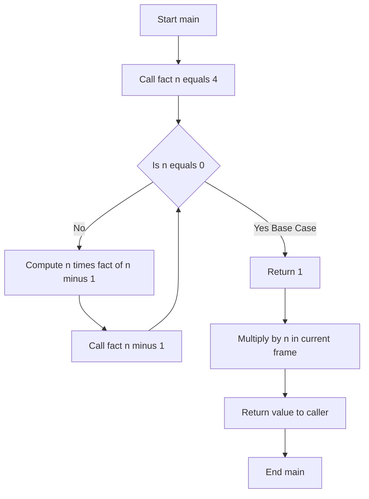
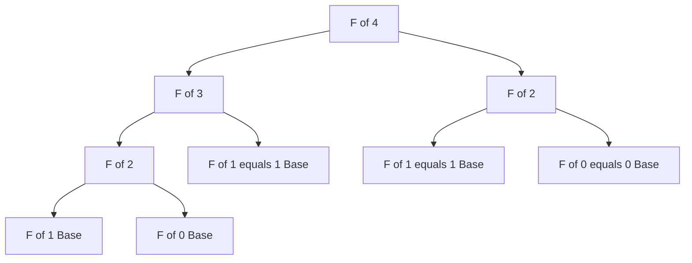
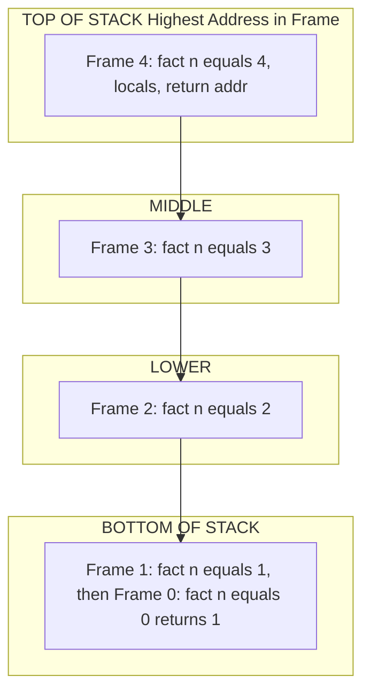
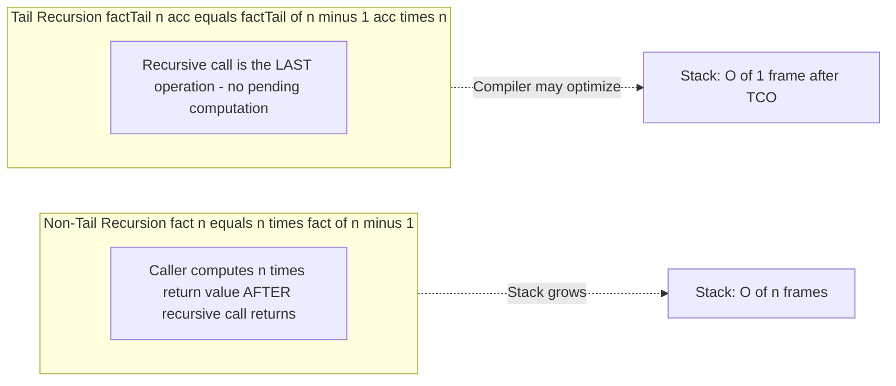

# Recursion: Coding recursive processes, memory overhead handling

<!-- SECTION_1_START -->
# 1. Core Technical Definition & Intuitive Overview

## 1.1 Formal Definition (KTU 2024 Syllabus Terminology)

**Recursion** in C is a programming technique in which a function calls itself, either directly or indirectly, to solve a problem. A recursive function breaks a problem into smaller sub-problems of the same form, with each invocation operating on a reduced input until a terminating condition, called the **base case**, is reached.

Formally, a recursive function $f(x)$ is defined mathematically as:

$$
f(x) = 
\begin{cases}
\text{base\_case}, & \text{if } x \text{ satisfies the termination predicate } P(x) \\
g\bigl(f(h(x))\bigr), & \text{otherwise}
\end{cases}
$$

where $h(x)$ is a strictly decreasing transformation (e.g., $h(x) = x - 1$) and $g$ is a composition operator that combines the result of the recursive call with the current value.

> [!IMPORTANT]
> **KTU 2024 Highlight (CO3 - Apply):** Every recursive function **MUST** have a base case. A missing or unreachable base case causes **infinite recursion**, leading to **stack overflow** and program termination by the OS. This is the single most frequent cause of marks lost in recursion questions.

## 1.2 Conceptual Analogy & Intuition

Imagine a row of **Russian nesting dolls (Matryoshka)**. To find the smallest doll, you open the current doll (function call), and inside you find a *smaller* doll of the *same type* (recursive call). You keep opening until you reach the **tiniest solid doll** (base case) which has nothing inside it. Then you "close" the dolls back up in reverse order (unwinding the call stack), each layer performing some action.

**Another intuition — A staircase mirror effect:** Stand between two parallel mirrors. You see infinite reflections of yourself, each one smaller and farther. The base case in a mirror is the "fading point" where the image is no longer distinguishable.

## 1.3 Anatomy of a Recursive Function

Every recursive function in C consists of two essential parts:

| Component | Purpose | Mandatory? |
| :--- | :--- | :--- |
| **Base Case** | Termination condition that returns a direct value | **Yes** |
| **Recursive Case** | Reduces the problem and calls the function again | **Yes** |
| **State Variables** | Parameters that change with each call (towards base) | **Yes** |
| **Stack Frame** | Memory block holding local vars, return addr, params | Auto-managed |

## 1.4 GeoGebra / Desmos Visualization

> [!VISUALIZATION CONTROL]
> **Concept:** Recursion Tree Expansion for $F(n) = n!$ (Factorial)
>
> **GeoGebra / Desmos Input Equations:**
> * Point 1: $P_1 = (0, 5)$ — Root call `fact(4)`
> * Point 2: $P_2 = (-2, 4)$ — Call `fact(3)`
> * Point 3: $P_3 = (-3, 3)$ — Call `fact(2)`
> * Point 4: $P_4 = (-3.5, 2)$ — Call `fact(1)`
> * Point 5: $P_5 = (-3.75, 1)$ — Call `fact(0)` ← **Base case** (returns $1$)
>
> **Visual Description:** The student should observe a downward-branching tree where each node represents a stack frame. The leftmost deepest node is the base case; values propagate back up the tree via multiplication. Vertical axis = stack depth, horizontal axis = call sequence.

## 1.5 Why Recursion Matters in C (Engineering Context)

Recursive logic maps directly to:
* **Tree and graph traversals** (compilers, AI search)
* **Divide-and-conquer algorithms** (merge sort, quicksort, binary search)
* **Backtracking** (N-Queens, maze solving, Sudoku)
* **Parsing expressions** in compilers (recursive descent parsers)
* **Fractal and L-system generation** in computer graphics
<!-- SECTION_1_END -->

<!-- SECTION_2_START -->
# 2. Deep Theoretical Analysis & KTU High-Yield Formula Sheet

## 2.1 Operational Breakdown — How a Recursive Call Executes

When a C function invokes itself, the following sequence occurs on every call:

1. **Parameter Passing:** Arguments are copied (call by value) into the new stack frame.
2. **Stack Frame Allocation:** A new activation record is pushed onto the **call stack** containing: return address, saved registers, local variables.
3. **Base Case Check:** The new invocation tests $P(x)$. If true, it returns a value without further recursion.
4. **Recursive Call:** If $P(x)$ is false, the function calls itself with reduced input $h(x)$.
5. **Unwinding:** After the inner call returns, the outer call resumes, processes the result via $g$, and returns to its own caller.
6. **Frame Pop:** The stack frame is deallocated when the function returns.

> [!NOTE]
> **Memory Overhead Rule:** A recursive function calling itself $n$ times uses $O(n)$ extra stack memory. Default C stack size on Linux is **8 MB**; on Windows (MSVC) is **1 MB**. Deep recursion can exhaust this, causing a **segmentation fault**.

## 2.2 Classification of Recursion (KTU High-Yield)

| Type | Definition | Example |
| :--- | :--- | :--- |
| **Direct Recursion** | Function calls itself directly | `fact()` calls `fact()` |
| **Indirect Recursion** | A calls B, B calls A | Mutual function calls |
| **Tail Recursion** | Recursive call is the **last** operation | `return fact(n-1);` |
| **Non-Tail (Head) Recursion** | Work happens **after** recursive call returns | `return n * fact(n-1);` |
| **Tree Recursion** | Function makes **multiple** recursive calls | Fibonacci, tree traversal |
| **Nested Recursion** | Recursive call's argument is itself recursive | `ackermann(m, n-1)` |

## 2.3 Recurrence Relations — The Math Behind Recursion

The **time complexity** $T(n)$ of a recursive algorithm is expressed as a recurrence:

$$
T(n) = a \cdot T\!\left(\frac{n}{b}\right) + f(n)
$$

where $a$ = number of recursive calls, $b$ = input reduction factor, $f(n)$ = work done per call (excluding recursive calls).

**Master Theorem (Lamè):** For $T(n) = aT(n/b) + f(n)$:
* If $f(n) = O(n^{\log_b a - \varepsilon})$ → $T(n) = \Theta(n^{\log_b a})$
* If $f(n) = \Theta(n^{\log_b a})$ → $T(n) = \Theta(n^{\log_b a} \log n)$
* If $f(n) = \Omega(n^{\log_b a + \varepsilon})$ → $T(n) = \Theta(f(n))$

## 2.4 KTU Formula Sheet / Cheat Sheet

| Concept | Formula / Rule | Units / Notes |
| :--- | :--- | :--- |
| Factorial recurrence | $n! = n \cdot (n-1)!$, with $0! = 1$ | Returns $\mathbb{N}$ |
| Fibonacci recurrence | $F(n) = F(n-1) + F(n-2)$, with $F(0)=0, F(1)=1$ | Linear recurrence order 2 |
| Power recurrence | $x^n = x \cdot x^{n-1}$, with $x^0 = 1$ | Optimized: $x^{n/2} \cdot x^{n/2}$ |
| Sum of digits | $S(n) = S(\lfloor n/10 \rfloor) + (n \bmod 10)$ | Base: $S(n<10) = n$ |
| GCD (Euclid) | $\gcd(a,b) = \gcd(b, a \bmod b)$, base $\gcd(a,0) = a$ | $\log \min(a,b)$ calls |
| Stack memory per call | $M \approx$ (locals + return addr + saved regs) | Typically $32$–$128$ bytes |
| Max recursion depth | $D_{\max} = \lfloor S_{\text{stack}} / M \rfloor$ | $S_{\text{stack}} \approx \mathbf{8\text{ MB}}$ Linux |
| Time for $n$ factorial calls | $T(n) = T(n-1) + O(1) = O(n)$ | Linear |
| Time for naive Fibonacci | $T(n) = T(n-1) + T(n-2) = O(\varphi^n)$ | Exponential, $\varphi \approx 1.618$ |

> [!IMPORTANT]
> **Tail Recursion Optimization (TCO):** Compilers like GCC with `-O2` can transform tail-recursive calls into a **loop**, eliminating stack growth. However, C does **not guarantee** TCO. KTU questions often ask: *"Rewrite the recursive function iteratively."* — practice this for `fact`, `fib`, `sum`.

## 2.5 Memory Overhead Handling — Engineering Strategies

1. **Tail Recursion Conversion:** Convert to `while` loop to use $O(1)$ stack space.
2. **Memoization:** Cache subproblem results to avoid redundant tree branches (turns $O(2^n)$ Fibonacci into $O(n)$).
3. **Increase stack size** (portable workaround): Use compiler flags like `-Wl,--stack,16777216` (Windows) or `ulimit -s unlimited` (Linux). **Not recommended** for production.
4. **Convert to iteration with explicit stack:** For algorithms where recursion expresses logic clearly (DFS, tree walks), use an explicit user-managed stack data structure.
5. **Trampolining:** Use a function-wrapper that iteratively invokes thunks; used in functional languages and sometimes in C.
<!-- SECTION_2_END -->

<!-- SECTION_3_START -->
# 3. Step-by-Step Derivations & Code/Symbolic Implementation

## 3.1 Exhaustive Derivation — Factorial $n!$

The mathematical definition is:
$$
n! = 
\begin{cases}
1, & n = 0 \quad \text{(base case)} \\
n \cdot (n-1)!, & n \geq 1 \quad \text{(recursive case)}
\end{cases}
$$

### Step-by-step expansion of $4!$:

$$
\begin{aligned}
4! &= 4 \cdot 3! \\
   &= 4 \cdot (3 \cdot 2!) \\
   &= 4 \cdot (3 \cdot (2 \cdot 1!)) \\
   &= 4 \cdot (3 \cdot (2 \cdot (1 \cdot 0!))) \\
   &= 4 \cdot (3 \cdot (2 \cdot (1 \cdot 1))) \\
   &= 4 \cdot (3 \cdot (2 \cdot 1)) \\
   &= 4 \cdot (3 \cdot 2) \\
   &= 4 \cdot 6 = 24
\end{aligned}
$$

Each parenthesized level represents one **stack frame** that is suspended until the inner call returns.

## 3.2 Exhaustive Derivation — Tower of Hanoi

The recurrence for minimum moves to transfer $n$ disks:
$$
M(n) = 2 \cdot M(n-1) + 1, \quad M(1) = 1
$$

Closed-form solution by unrolling:

$$
\begin{aligned}
M(n) &= 2 M(n-1) + 1 \\
     &= 2\bigl(2 M(n-2) + 1\bigr) + 1 = 2^2 M(n-2) + 2 + 1 \\
     &= 2^2\bigl(2 M(n-3) + 1\bigr) + 2 + 1 = 2^3 M(n-3) + 4 + 2 + 1 \\
     &= \dots \\
     &= 2^{n-1} M(1) + \sum_{i=0}^{n-2} 2^{i} \\
     &= 2^{n-1} \cdot 1 + (2^{n-1} - 1) \\
     &= 2^n - 1
\end{aligned}
$$

So the closed form is $M(n) = 2^n - 1$. For $n=64$ disks (the legend), this is $2^{64} - 1 \approx 1.8 \times 10^{19}$ moves.

## 3.3 Full Python Implementation (C-Equivalent Semantics)

```python
import sys
from typing import List, Tuple

# Increase Python recursion limit to mimic C deep recursion behavior
sys.setrecursionlimit(10000)

# ---------- 1. FACTORIAL (Head Recursion) ----------
def factorial(n: int) -> int:
    """
    Computes n! recursively.
    Base case: 0! = 1
    Recursive case: n! = n * (n-1)!
    Time: O(n), Space: O(n) due to call stack
    """
    if n < 0:
        raise ValueError("Factorial undefined for negative integers")
    if n == 0:                       # BASE CASE
        return 1
    return n * factorial(n - 1)      # RECURSIVE CASE (head recursion)


# ---------- 2. TAIL-RECURSIVE FACTORIAL ----------
def factorial_tail(n: int, accumulator: int = 1) -> int:
    """
    Tail-recursive version. The recursive call is the LAST operation.
    C compilers with -O2 may optimize this to a loop.
    """
    if n <= 0:
        return accumulator
    return factorial_tail(n - 1, n * accumulator)


# ---------- 3. FIBONACCI (Tree Recursion) ----------
def fibonacci(n: int) -> int:
    """
    F(0)=0, F(1)=1, F(n)=F(n-1)+F(n-2)
    Time: O(2^n), Space: O(n) call depth
    """
    if n < 0:
        raise ValueError("n must be non-negative")
    if n == 0:                       # BASE CASE 1
        return 0
    if n == 1:                       # BASE CASE 2
        return 1
    return fibonacci(n - 1) + fibonacci(n - 2)  # TWO recursive calls


# ---------- 4. FIBONACCI WITH MEMOIZATION (O(n) Time) ----------
_memo: dict = {0: 0, 1: 1}

def fibonacci_memo(n: int) -> int:
    """Optimized Fibonacci using memoization."""
    if n in _memo:
        return _memo[n]
    _memo[n] = fibonacci_memo(n - 1) + fibonacci_memo(n - 2)
    return _memo[n]


# ---------- 5. POWER FUNCTION (Fast Exponentiation) ----------
def power(base: float, exp: int) -> float:
    """
    Computes base^exp using recursion.
    Uses divide-and-conquer: O(log n) calls.
    """
    if exp == 0:
        return 1.0
    if exp < 0:
        return 1.0 / power(base, -exp)
    half: float = power(base, exp // 2)
    if exp % 2 == 0:
        return half * half
    else:
        return base * half * half


# ---------- 6. SUM OF FIRST N NATURAL NUMBERS ----------
def sum_n(n: int) -> int:
    """Returns 1 + 2 + ... + n.  sum_n(0) = 0"""
    if n == 0:
        return 0
    return n + sum_n(n - 1)


# ---------- 7. REVERSE A STRING (String Processing) ----------
def reverse_string(s: str) -> str:
    """
    Reverses string s recursively.
    Base case: empty or single character.
    """
    if len(s) <= 1:
        return s
    return reverse_string(s[1:]) + s[0]


# ---------- 8. PALINDROME CHECK ----------
def is_palindrome(s: str) -> bool:
    """Recursive palindrome check (case-sensitive)."""
    s = s.lower()
    if len(s) <= 1:
        return True
    if s[0] != s[-1]:
        return False
    return is_palindrome(s[1:-1])


# ---------- 9. TOWER OF HANOI ----------
def hanoi(n: int, source: str, target: str, auxiliary: str,
          moves: List[str] = None) -> List[str]:
    """
    Solves Tower of Hanoi for n disks.
    Returns the list of moves as strings.
    """
    if moves is None:
        moves = []
    if n == 1:
        moves.append(f"Move disk 1 from {source} to {target}")
        return moves
    hanoi(n - 1, source, auxiliary, target, moves)
    moves.append(f"Move disk {n} from {source} to {target}")
    hanoi(n - 1, auxiliary, target, source, moves)
    return moves


# ---------- 10. GCD (Euclid's Recursive Algorithm) ----------
def gcd(a: int, b: int) -> int:
    """Greatest Common Divisor using Euclid's algorithm."""
    if b == 0:
        return a
    return gcd(b, a % b)


# ---------- DEMONSTRATION / DRIVER CODE ----------
if __name__ == "__main__":
    print("=== Recursive Algorithms Demo ===\n")

    print(f"5!             = {factorial(5)}")                # 120
    print(f"5! (tail)      = {factorial_tail(5)}")           # 120
    print(f"F(10)          = {fibonacci(10)}")               # 55
    print(f"F(35) memo     = {fibonacci_memo(35)}")          # 9227465
    print(f"2^10           = {power(2, 10)}")                # 1024.0
    print(f"Sum(1..100)    = {sum_n(100)}")                  # 5050
    print(f"Reverse 'KTU'  = '{reverse_string('KTU')}'")    # 'UTK'
    print(f"Pal 'malayalam'= {is_palindrome('malayalam')}") # True
    print(f"gcd(48, 18)    = {gcd(48, 18)}")                 # 6
    print(f"Hanoi(3) moves = {len(hanoi(3, 'A', 'C', 'B'))}") # 7

    # Demonstrate call stack depth
    def depth_counter(n: int) -> int:
        if n == 0:
            return 0
        return 1 + depth_counter(n - 1)

    try:
        d = depth_counter(9000)  # Approaching Python's default 1000
        print(f"Recursion depth reached: {d}")
    except RecursionError as e:
        print(f"Stack overflow caught: {e}")
```

### 3.4 Trace Table — `factorial(3)` Execution

| Step | Call | Stack Frame $n$ | Action | Returns To |
| :---: | :---: | :---: | :--- | :--- |
| 1 | `factorial(3)` | $n=3$ | $3 \neq 0$, calls `factorial(2)` | awaits |
| 2 | `factorial(2)` | $n=2$ | $2 \neq 0$, calls `factorial(1)` | awaits |
| 3 | `factorial(1)` | $n=1$ | $1 \neq 0$, calls `factorial(0)` | awaits |
| 4 | `factorial(0)` | $n=0$ | **BASE CASE** reached | $1$ |
| 5 | back to frame 3 | $n=1$ | returns $1 \cdot 1 = 1$ | frame 2 |
| 6 | back to frame 2 | $n=2$ | returns $2 \cdot 1 = 2$ | frame 1 |
| 7 | back to frame 1 | $n=3$ | returns $3 \cdot 2 = 6$ | main |

Final result: $\mathbf{6}$.

## 3.5 C Program (As Per KTU Syllabus)

```c
#include <stdio.h>

/* Recursive factorial */
long long fact(int n) {
    if (n == 0)               /* BASE CASE */
        return 1;
    return n * fact(n - 1);   /* RECURSIVE CASE */
}

/* Recursive Fibonacci */
int fib(int n) {
    if (n == 0) return 0;     /* BASE CASE 1 */
    if (n == 1) return 1;     /* BASE CASE 2 */
    return fib(n-1) + fib(n-2);
}

/* Recursive sum of digits */
int sumDigits(int n) {
    if (n < 10) return n;     /* BASE CASE */
    return (n % 10) + sumDigits(n / 10);
}

int main(void) {
    printf("5! = %lld\n", fact(5));        /* 120 */
    printf("F(8) = %d\n", fib(8));          /* 21 */
    printf("SumDigits(1234) = %d\n",
            sumDigits(1234));              /* 10 */
    return 0;
}
```
<!-- SECTION_3_END -->

<!-- SECTION_4_START -->
# 4. Structural Diagrams & Schematics

## 4.1 Recursion Execution Flow (Mermaid)



## 4.2 Recursion Tree for Fibonacci (Exponential Blowup)



> [!NOTE]
> Observe that `F(2)` is computed **twice**, `F(1)` is computed **three times**. This is the root cause of $O(2^n)$ complexity. Memoization (caching results in a hash map) eliminates the redundancy.

## 4.3 Stack Frame Memory Layout (Conceptual Block Diagram)



**Memory size per call** (typical on x86-64 with GCC):

| Component | Size (bytes) |
| :--- | :---: |
| Return address | $8$ |
| Saved RBP | $8$ |
| Local `n` (int) | $4$ |
| Padding/alignment | $4$ |
| **Total per frame** | $\approx \mathbf{24\text{ bytes}}$ |

For $n=100{,}000$ recursive calls: $\text{memory} \approx 24 \times 100{,}000 = 2.4\text{ MB}$ (fits Linux default $8\text{ MB}$ stack, but borderline).

## 4.4 Tail vs Non-Tail Recursion Comparison


<!-- SECTION_4_END -->

<!-- SECTION_5_START -->
# 5. KTU 2024 Scheme Examination Question Bank & Topic Recap

## 5.1 Part A — Short Answer Questions (3 Marks Each)

### Question 1 `[KTU University Exam - July 2024]`
**Q: Define recursion. What are its two essential components? Give one advantage and one disadvantage.** **[CO3, Remember/Understand, 3 Marks]**

**Model Answer:**
Recursion is a technique where a function calls itself to solve a problem by breaking it into smaller sub-problems of the same form. The two essential components are:
1. **Base Case** — the terminating condition that returns a direct value without further recursion.
2. **Recursive Case** — the part where the function calls itself with a reduced input.

* **Advantage:** Recursive code is often more elegant, readable, and directly mirrors mathematical definitions (e.g., factorial, Fibonacci, tree traversal).
* **Disadvantage:** Each call consumes stack memory, leading to **memory overhead** and risk of **stack overflow** for deep recursion. Function-call overhead also makes it slower than iteration in C.

---

### Question 2 `[KTU University Exam - Dec 2023]`
**Q: Differentiate between direct and indirect recursion with a suitable C example.** **[CO3, Understand, 3 Marks]**

**Model Answer:**

* **Direct Recursion:** A function calls itself directly.
* **Indirect Recursion:** Function A calls function B, and function B (directly or via a chain) calls function A.

```c
/* Direct recursion */
int fact(int n) {
    if (n == 0) return 1;
    return n * fact(n-1);
}

/* Indirect recursion */
int funA(int n);   /* forward declaration */
int funB(int n) {
    if (n <= 0) return 0;
    return funA(n - 1);
}
int funA(int n) {
    if (n <= 0) return 1;
    return funB(n - 1);
}
```

---

## 5.2 Part B — Module Internal Choice (14 Marks)

### Question A `[KTU University Exam - July 2024]` (Module 3, 14 Marks)

**(a)** Write a recursive C function to compute the $n^{\text{th}}$ Fibonacci number. Trace the execution for $n = 5$ showing the recursion tree. **[7 Marks, CO3, Apply]**

**(b)** Explain the memory overhead of recursive functions. How does tail recursion help mitigate it? Rewrite the Fibonacci function as a tail-recursive version. **[7 Marks, CO3, Understand/Apply]**

#### Model Solution for (a):

**Algorithm:**

```c
int fib(int n) {
    if (n == 0) return 0;        /* Base case 1 */
    if (n == 1) return 1;        /* Base case 2 */
    return fib(n-1) + fib(n-2);  /* Recursive case */
}
```

**Recursion tree for $n = 5$:**

```
                    fib(5)
                  /        \
              fib(4)       fib(3)
             /     \       /    \
         fib(3)  fib(2) fib(2) fib(1)=1
         /   \   /  \   /  \
      fib(2) f(1) f(1) f(0) f(1) f(0)
      /  \    1    1    0    1    0
   fib(1) f(0)
     1     0
```

**Trace table:**

| Call | Returns |
| :---: | :---: |
| `fib(0)` | $0$ |
| `fib(1)` | $1$ |
| `fib(2)` | $1$ |
| `fib(3)` | $2$ |
| `fib(4)` | $3$ |
| `fib(5)` | $5$ |

**Valuation Key:**
* [Correct base cases: 2 Marks]
* [Correct recursive case with two calls: 2 Marks]
* [Complete recursion tree: 2 Marks]
* [Final answer $5$: 1 Mark]

#### Model Solution for (b):

**Memory Overhead Explanation:**

Every recursive call allocates a new **stack frame** containing:
* The return address (where to resume after the call).
* Saved CPU registers and base pointer.
* Local variables and copies of parameters.
* Alignment padding.

For a function with $k$ bytes per frame and recursion depth $d$, total memory used is $k \times d$. With the default C stack of $\mathbf{8\text{ MB}}$ (Linux) or $\mathbf{1\text{ MB}}$ (Windows MSVC), a single recursive function can exhaust the stack in $50{,}000$–$500{,}000$ calls.

**Tail Recursion Mitigation:**

In **tail recursion**, the recursive call is the **last operation** performed before returning. No computation is pending after the call returns, so a smart compiler can **reuse the current stack frame** in a process called **Tail Call Optimization (TCO)** — effectively converting recursion into a loop with $O(1)$ stack usage.

**Tail-Recursive Fibonacci (with two accumulators):**

```c
int fibTail(int n, int a, int b) {
    /* a = F(0), b = F(1); advances forward */
    if (n == 0) return a;
    return fibTail(n - 1, b, a + b);   /* Tail call — last operation */
}

int fibonacci(int n) {
    return fibTail(n, 0, 1);
}
```

**Trace of `fibTail(5, 0, 1)`:**

| Step | Call | Returns |
| :---: | :--- | :---: |
| 1 | `fibTail(5, 0, 1)` | `fibTail(4, 1, 1)` |
| 2 | `fibTail(4, 1, 1)` | `fibTail(3, 1, 2)` |
| 3 | `fibTail(3, 1, 2)` | `fibTail(2, 2, 3)` |
| 4 | `fibTail(2, 2, 3)` | `fibTail(1, 3, 5)` |
| 5 | `fibTail(1, 3, 5)` | `fibTail(0, 5, 8)` |
| 6 | `fibTail(0, 5, 8)` | $\mathbf{5}$ |

**Valuation Key:**
* [Stack frame explanation with components: 2 Marks]
* [Quantitative example ($\mathbf{8\text{ MB}}$ stack / frames): 2 Marks]
* [Tail recursion concept and TCO definition: 2 Marks]
* [Correct tail-recursive code: 1 Mark]

---

### Question B `[KTU University Exam - Dec 2023]` (Module 3, 14 Marks — Alternative Choice)

**(a)** Write a recursive C function `int sumDigits(int n)` that returns the sum of digits of a non-negative integer. Trace it for $n = 4321$. **[7 Marks, CO3, Apply]**

**(b)** Solve the Tower of Hanoi problem for $n = 3$ disks using recursion. Derive the recurrence relation and its closed-form solution. **[7 Marks, CO3, Apply/Analyze]**

#### Model Solution for (a):

**Recursive function:**

```c
int sumDigits(int n) {
    if (n < 10)            /* Base case: single digit */
        return n;
    return (n % 10) + sumDigits(n / 10);   /* Recursive case */
}
```

**Trace for $n = 4321$:**

| Call | $n$ | $n \bmod 10$ | $n / 10$ | Returns |
| :---: | :---: | :---: | :---: | :---: |
| 1 | $4321$ | $1$ | $432$ | $1 + \text{sumDigits}(432)$ |
| 2 | $432$ | $2$ | $43$ | $2 + \text{sumDigits}(43)$ |
| 3 | $43$ | $3$ | $4$ | $3 + \text{sumDigits}(4)$ |
| 4 | $4$ | — | — | $4$ (base) |

Unwinding: $4 \to 3+4=7 \to 2+7=9 \to 1+9 = \mathbf{10}$.

**Valuation Key:**
* [Correct base case: 2 Marks]
* [Correct recursive decomposition: 3 Marks]
* [Trace table with unwinding: 2 Marks]

#### Model Solution for (b):

**Algorithm for $n$ disks (move from $A$ to $C$ using $B$):**

```c
void hanoi(int n, char A, char C, char B) {
    if (n == 1) {
        printf("Move disk 1 from %c to %c\n", A, C);
        return;
    }
    hanoi(n - 1, A, B, C);                          /* Step 1 */
    printf("Move disk %d from %c to %c\n", n, A, C); /* Step 2 */
    hanoi(n - 1, B, C, A);                          /* Step 3 */
}
```

**Output for $n = 3$ disks (A → C using B):**

1. Move disk $1$ from $A$ to $C$
2. Move disk $2$ from $A$ to $B$
3. Move disk $1$ from $C$ to $B$
4. Move disk $3$ from $A$ to $C$
5. Move disk $1$ from $B$ to $A$
6. Move disk $2$ from $B$ to $C$
7. Move disk $1$ from $A$ to $C$

Total moves = $2^3 - 1 = 7$.

**Recurrence derivation (as shown in §3.2):**
$M(n) = 2M(n-1) + 1$, with $M(1) = 1$.

**Closed form:** $M(n) = 2^n - 1$.

For $n = 3$: $M(3) = 2^3 - 1 = 7$ ✓

**Valuation Key:**
* [Correct three-step recursive decomposition: 3 Marks]
* [Full output trace for $n=3$: 2 Marks]
* [Recurrence derivation: 1 Mark]
* [Closed form $2^n - 1$: 1 Mark]

> [!WARNING]
> **KTU Examiner's Valuation Warning — Common Pitfalls:**
> 1. **Missing base case** — many students write the recursive case but forget the termination. **Zero** marks for the entire function. Always state the base case explicitly.
> 2. **Wrong recursion direction** — for factorial, students sometimes write `fact(n+1)`, which never terminates. The argument must strictly move **towards** the base case.
> 3. **Confusing return types** — `factorial` of $13! = 6{,}227{,}020{,}800$ exceeds `int` range ($2.1 \times 10^9$). Use `long long` for $n > 12$.
> 4. **Not drawing the recursion tree** — for Fibonacci/tree-recursion questions, KTU examiners award marks specifically for the **diagram**. A correct answer without the tree loses 2–3 marks.
> 5. **Confusing head vs tail recursion** — in head recursion, work happens *after* the call; in tail recursion, the call *is* the last step. Mixing these up loses marks in part (b) type questions.
> 6. **Forgetting `hanoi` argument swap** — the roles of source, target, auxiliary must be correctly permuted at each level. Wrong permutation gives wrong moves.

---

## 5.3 Topic Recap & Important Things to Remember

* **Definition:** Recursion is a self-calling function technique; the function must always make progress towards a base case.
* **Two mandatory parts:** **Base case** (termination) and **Recursive case** (reduced input self-call).
* **Base case requirement:** Every recursive function must have **at least one** base case. A missing base case = infinite recursion = stack overflow.
* **Memory overhead:** Each recursive call uses one stack frame ($\approx 24$–$128$ bytes). Depth $n$ requires $O(n)$ stack space. Linux default stack = $\mathbf{8\text{ MB}}$; Windows MSVC = $\mathbf{1\text{ MB}}$.
* **Time complexity recurrence:** $T(n) = aT(n/b) + f(n)$ — solve via Master Theorem.
* **Tail Recursion:** Recursive call is the **last** operation. Compilers can apply TCO (Tail Call Optimization) to convert it to a loop, saving stack memory. **C does not guarantee TCO.**
* **Head (Non-Tail) Recursion:** Work is performed *after* recursive call returns. Cannot be tail-call optimized.
* **Tree Recursion:** Function makes multiple recursive calls (e.g., Fibonacci). Wastes work without memoization.
* **Memoization:** Caching subproblem results turns exponential algorithms (Fibonacci) into linear/polynomial time.
* **Stack frame contents:** Return address, saved base pointer, parameters, local variables, alignment padding.
* **Recursion vs Iteration:** Recursion is more readable for tree/graph problems; iteration is more memory-efficient for linear problems.
* **Conversion to iteration:** Use `while` loop with accumulator variables. Required skill for KTU exam — always practice writing iterative versions of `fact`, `fib`, `sum`, `gcd`, `power`.
* **Classic recursion problems to master:** Factorial, Fibonacci, Tower of Hanoi, GCD (Euclid), Power (fast exponentiation), Sum of digits, String reverse, Palindrome check, Binary search, Tree traversals (inorder, preorder, postorder).
* **Mathematical equivalences to memorize:**
  * $n! = n \cdot (n-1)!$, base $0! = 1$
  * $F(n) = F(n-1) + F(n-2)$, base $F(0)=0$, $F(1)=1$
  * $M(n) = 2M(n-1) + 1 \Rightarrow M(n) = 2^n - 1$ (Tower of Hanoi)
  * $\gcd(a,b) = \gcd(b, a \bmod b)$, base $\gcd(a,0)=a$
* **Practical engineering uses:** Compiler parsing (recursive descent), AI search (backtracking), file system traversal, fractal graphics, divide-and-conquer sorting, expression evaluation.
* **Compile-time safeguard:** Always compile recursive C programs with `-Wstack-usage` (GCC) or check stack depth analytically before deployment in embedded systems.
<!-- SECTION_5_END -->
