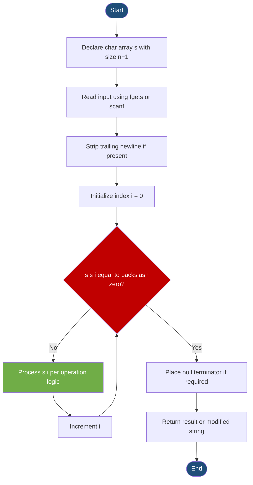
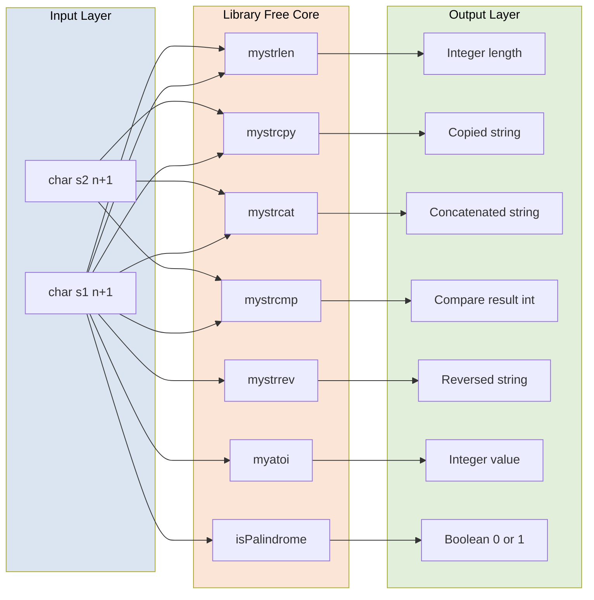
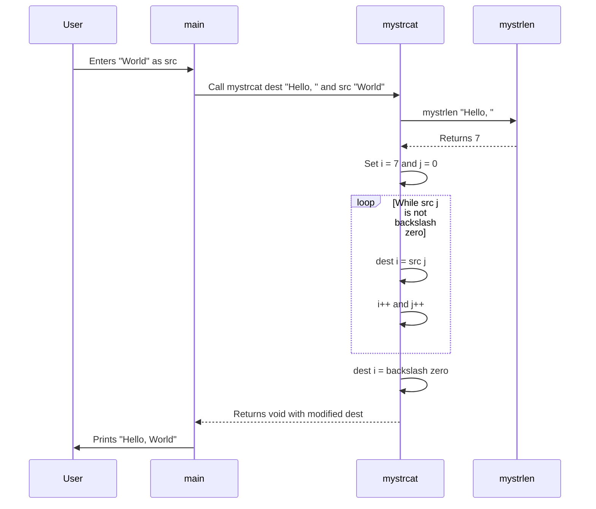
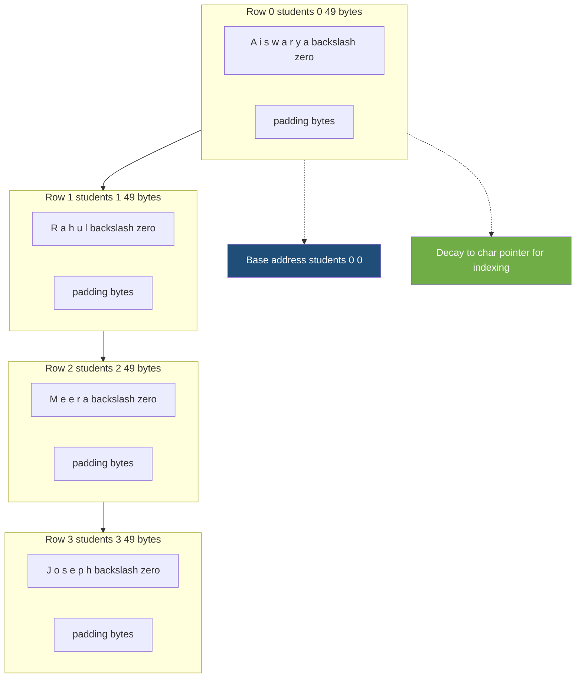
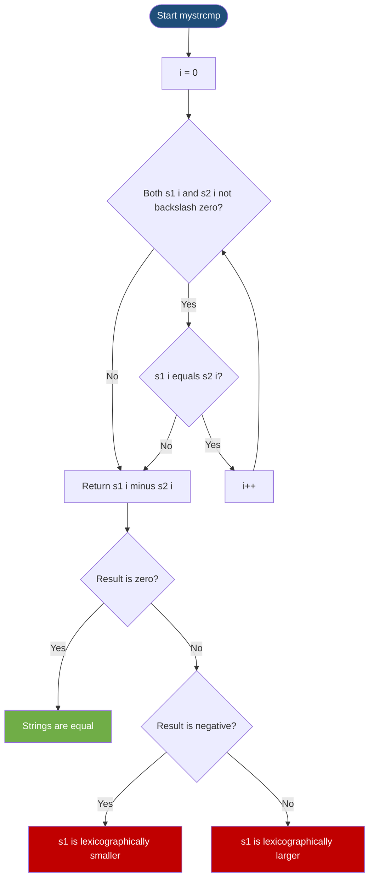

# Strings: String arrays, processing actions without built-in library overrides

<!-- SECTION_1_START -->
# Strings in C: Arrays, Storage, and Library-Free Processing

## 1.1 Formal Definition (KTU 2024 Syllabus Terminology)

In the C programming language, a **string** is defined as a **one-dimensional array of characters terminated by a null character `'\0'`** (whose ASCII value is **0**). The null terminator acts as a sentinel that marks the logical end of the character sequence, allowing functions to determine string length without requiring an explicit length parameter.

According to the **KTU 2024 Scheme (Course Code: GXEST204 – Programming in C, Module 3)**, strings in C are studied as:

> **String Array:** A contiguous block of memory allocated to hold a sequence of `char` data type elements, where the last valid character is always followed by the **null character `'\0'`**.

> **String Processing (without built-in library overrides):** The manual implementation of operations such as length computation, copying, concatenation, comparison, reversal, case conversion, and conversion to numeric types using only **loops, conditional statements, and character arithmetic** — without invoking the standard library functions from `<string.h>` such as `strlen()`, `strcpy()`, `strcat()`, or `strcmp()`.

> [!IMPORTANT]
> **KTU 2024 Highlight — Module 3:** Examiners frequently test the student's ability to *re-implement* library functions using first principles. Marks are awarded for **explicit loop logic**, **boundary checks**, and **proper null terminator placement** — not just for producing correct output.

## 1.2 Conceptual Analogy — The "Bookmark on a Shelf" Model

Imagine a **wooden bookshelf with numbered slots** (slot 0, 1, 2, 3, ...). You place a book title one letter at a time — `'H'`, `'e'`, `'l'`, `'l'`, `'o'` — into consecutive slots. The shelf has no built-in "end" marker, so you place a special blank card (`'\0'`) right after the last letter to signal: *"The title ends here."* This blank card is the **null terminator**, and the entire shelf is your **string array**.

- **Each slot** → one `char` (occupies **1 byte** = 8 bits).
- **The blank card** → `'\0'` (ASCII value **0**).
- **The whole shelf** → a `char` array of size *n+1* (n characters + 1 terminator).
- **Reading the title** → you start at slot 0 and walk forward until you find the blank card.

> [!NOTE]
> **Why `'\0'` and not just the length?** C strings are *sentinel-terminated*, not *length-prefixed*. This design decision (inherited from early C and assembly conventions) means that knowing the **starting address** of a string is sufficient to walk through it, but it also means a missing `'\0'` causes **buffer overruns** — a classic source of bugs and security vulnerabilities.

## 1.3 Declaration, Initialization, and Storage Models

C offers **two primary storage models** for strings:

| Aspect | `char` Array (Stack/Global) | `char` Pointer (String Literal) |
|---|---|---|
| **Syntax** | `char s[20];` | `char *p = "Hello";` |
| **Memory Region** | Stack (or Data segment if global) | Read-Only Data Segment (`.rodata`) |
| **Mutability** | **Mutable** — characters can be changed | **Immutable** — writing causes undefined behavior |
| **Size** | Fixed at compile time (e.g., 20 bytes) | Determined by literal length + 1 (here, 6 bytes) |
| **Copy Semantics** | Each array is independent | Pointer can be reassigned to another literal |

### 1.3.1 Initialization Forms

```c
char s1[] = "Hello";            /* Compiler allocates 6 bytes: 'H','e','l','l','o','\0' */
char s2[6] = {'H','e','l','l','o','\0'}; /* Explicit char-by-char form */
char s3[20] = "Hello";          /* 20 bytes allocated, first 6 used, rest zero-padded */
char *s4 = "Hello";             /* Pointer to read-only literal in .rodata */
```

> [!VISUALIZATION CONTROL]
> **Concept:** Memory layout of a `char` array holding `"Hello"`
> **C-style representation:**
>
> | Index | 0 | 1 | 2 | 3 | 4 | 5 |
> |---|---|---|---|---|---|---|
> | **Character** | 'H' | 'e' | 'l' | 'l' | 'o' | '\0' |
> | **ASCII Decimal** | 72 | 101 | 108 | 108 | 111 | 0 |
> | **Address (hex)** | `0x100` | `0x101` | `0x102` | `0x103` | `0x104` | `0x105` |
>
> **Visual Description:** A horizontal row of 6 contiguous 1-byte cells, indexed 0 through 5, where cell 5 is shaded or marked to indicate the null terminator. The base address is `0x100`; the size in bytes is **6 × 1 = 6 bytes**.

## 1.4 Standard I/O of Strings

```c
char name[50];
scanf("%s", name);              /* Reads until whitespace; NO & needed (array decays to pointer) */
fgets(name, sizeof(name), stdin); /* Reads a full line including spaces; safer */
printf("%s", name);             /* Prints characters one by one until '\0' is encountered */
```

> [!NOTE]
> **`scanf("%s", ...)` vs. `gets()`:** The legacy `gets()` function has been **removed from C11** because it performs no bounds checking. KTU 2024 expects students to use `fgets()` for safe line-based input. Always account for the trailing newline character that `fgets()` retains.

<!-- SECTION_1_END -->

<!-- SECTION_2_START -->
# Deep Theoretical Analysis & KTU High-Yield Formula Sheet

## 2.1 The Null Terminator — Foundation of All String Logic

Every C string function, whether library or hand-rolled, ultimately depends on **detecting the null terminator**. The character constant `'\0'` is distinct from:
- `'0'` — the digit zero, ASCII value **48**.
- `NULL` — a macro expanding to `((void *)0)`, used for pointers.
- `' '` — the space character, ASCII value **32**.

**Detection idioms (all equivalent in C):**

```c
if (s[i] == '\0')   /* Most readable — preferred in KTU answers */
if (s[i] == 0)
if (s[i] == NULL)   /* Works but stylistically mixes pointer and char concepts */
if (!s[i])          /* Short-circuit, common in production code */
```

## 2.2 Pointer–Array Duality

A `char` array, when used in an expression (except as the operand of `sizeof` or unary `&`), **decays** to a pointer of type `char *` pointing to its first element. This is why:

- `scanf("%s", s)` works without `&s` — `s` already decays to `&s[0]`.
- `*(s + i)` is identical to `s[i]`.
- Passing a string to a function is essentially **pass-by-reference** of the base address (the array's contents *can* be modified inside the function).

> [!IMPORTANT]
> **Pointer Arithmetic Bound:** Valid indices for a string of length *n* are $0 \le i \le n$. Accessing index *n+1* or beyond is **undefined behavior** — a frequent source of segmentation faults.

## 2.3 KTU Formula Sheet — String Operations (Library-Free)

| # | Operation | Mathematical/Logical Formula | Boundary Condition | Return Type |
|---|---|---|---|---|
| 1 | Length | $L(s) = \max\{i \in \mathbb{Z}_{\ge 0} \mid s[i] \neq \text{'\0'}\}$ | $L(\text{""}) = 0$ | `int` |
| 2 | Copy | $d[i] \leftarrow s[i]$ for $0 \le i \le L(s)$ | $d$ must hold at least $L(s) + 1$ bytes | `void` (returns `d`) |
| 3 | Concatenate | $d[L(d) + i] \leftarrow s[i]$ for $0 \le i \le L(s)$; then $d[L(d)+L(s)] \leftarrow \text{'\0'}$ | $d$ must hold at least $L(d) + L(s) + 1$ bytes | `void` (returns `d`) |
| 4 | Compare | $\Delta = s_1[i] - s_2[i]$ at first mismatch; $0$ if all match until `'\0'` | $L$ vs $L$ — unequal lengths give non-zero | `int` |
| 5 | Reverse | Swap $s[i] \leftrightarrow s[L-1-i]$ for $0 \le i < L/2$ | $L \ge 0$ | `void` |
| 6 | Lower→Upper | If $'a' \le c \le 'z'$ then $c \leftarrow c - 32$ | ASCII range only | `char` |
| 7 | Upper→Lower | If $'A' \le c \le 'z'$ then $c \leftarrow c + 32$ | ASCII range only | `char` |
| 8 | String→Integer | $n = \sum_{i=0}^{L-1} (s[i] - \text{'0'}) \times 10^{L-1-i}$ | Skip leading whitespace; handle `'+'`/`'-'` | `int` |
| 9 | Palindrome Check | $s[i] = s[L-1-i]$ for all $0 \le i < L/2$ | Empty string and single char are palindromes | `int` (0/1) |

> [!NOTE]
> **Engineering Utility:** Manual string processing is not merely academic. In **embedded systems**, the standard library may be unavailable or forbidden (e.g., MISRA-C guidelines restrict dynamic allocation). In **operating system kernels** (Linux, RTOS), string routines are often reimplemented in assembly for performance. In **cryptography**, custom string manipulation forms the basis of ciphers (Caesar, Vigenère) and parsers.

## 2.4 ASCII Code Reference (Memorize for KTU)

| Range (Decimal) | Character Class | Examples |
|---|---|---|
| $48 - 57$ | Digits `'0'` – `'9'` | `'5' - '0' = 5` |
| $65 - 90$ | Uppercase `'A'` – `'Z'` | `'A' + 1 = 'B'` |
| $97 - 122$ | Lowercase `'a'` – `'z'` | `'a' - 'A' = 32` |
| $32$ | Space `' '` | |
| $0$ | Null `'\0'` | |

The constant difference between a lowercase letter and its uppercase counterpart is always **32** (since $97 - 65 = 32$). This is the foundation of all **case-conversion** routines written without library calls.

## 2.5 Why `'\0'` Is Critical — Failure Mode Analysis

Consider the bug:

```c
char s[5] = {'H','e','l','l','o'};  /* NO null terminator! */
printf("%s", s);                      /* Undefined behavior — reads past the array */
```

The `printf` function will keep printing bytes from memory **after** the array until it randomly encounters a zero byte. This is the famous **"missing null terminator"** bug, and it is the single most common string-related defect in C programs.

> [!IMPORTANT]
> **KTU 2024 Pitfall:** When the examiner asks you to "read a string and find its length," students often forget to set `s[strlen(s)] = '\0'` after manual input. If you build a string character-by-character, **you must explicitly place the null terminator**.

<!-- SECTION_2_END -->

<!-- SECTION_3_START -->
# Step-by-Step Derivations & Code Implementations

This section provides **fully operational, library-free implementations** of every major string operation tested under the KTU 2024 Scheme Module 3 syllabus. Each function includes precise type hints, explicit boundary checks, and inline commentary mapping to the valuation key.

## 3.1 `mystrlen` — Compute String Length

**Problem:** Given a string `s`, return the number of characters before the null terminator.

**Algorithm (Iterative):**

1. Initialize counter `len = 0`.
2. While `s[len] != '\0'`, increment `len`.
3. Return `len`.

**Recursive formulation:** $L(s, i) = \begin{cases} 0 & \text{if } s[i] = \text{'\0'} \\ 1 + L(s, i+1) & \text{otherwise} \end{cases}$

```c
#include <stdio.h>

int mystrlen(const char s[]) {
    int len = 0;
    /* Walk the array until the null terminator sentinel is found */
    while (s[len] != '\0') {
        len++;
    }
    return len;
}

int main(void) {
    char text[100];
    printf("Enter a string: ");
    fgets(text, sizeof(text), stdin);

    /* Strip trailing newline that fgets retains */
    int n = mystrlen(text);
    if (n > 0 && text[n - 1] == '\n') {
        text[n - 1] = '\0';
        n--;
    }

    printf("Length = %d\n", n);
    return 0;
}
```

**Step-by-step trace for input `"Hi"`** → Stored as `'H','i','\0'`:

| Iteration | `s[len]` | `len != '\0'`? | `len` after increment |
|---|---|---|---|
| Start | — | — | 0 |
| 1 | `'H'` (72) | True | 1 |
| 2 | `'i'` (105) | True | 2 |
| 3 | `'\0'` (0) | False | 2 (exit) |

**Output:** `Length = 2` ✅

## 3.2 `mystrcpy` — Copy One String into Another

**Problem:** Copy the contents of `src` (including `'\0'`) into `dest`.

**Algorithm:**

1. Get `i = 0`.
2. While `src[i] != '\0'`, copy character: `dest[i] = src[i]`, increment `i`.
3. Place null terminator: `dest[i] = '\0'`.

> [!IMPORTANT]
> **Boundary check:** The destination array must be **at least** as large as `strlen(src) + 1`. The manual implementation must place `'\0'` explicitly — unlike in some implementations of `strncpy` which may not null-terminate.

```c
#include <stdio.h>

void mystrcpy(char dest[], const char src[]) {
    int i = 0;
    /* Copy each character up to (but not including) the null terminator */
    while (src[i] != '\0') {
        dest[i] = src[i];
        i++;
    }
    /* Step 3: Manually place the null terminator — THE critical step */
    dest[i] = '\0';
}

int main(void) {
    char source[100], destination[100];

    printf("Enter source string: ");
    fgets(source, sizeof(source), stdin);

    /* Strip newline */
    int n = 0;
    while (source[n] != '\0' && source[n] != '\n') n++;
    source[n] = '\0';

    mystrcpy(destination, source);
    printf("Copied string: %s\n", destination);

    return 0;
}
```

**Trace for `src = "Cat"`:**

| `i` | `src[i]` | Action | `dest` after step |
|---|---|---|---|
| 0 | `'C'` | `dest[0] = 'C'` | `"C"` |
| 1 | `'a'` | `dest[1] = 'a'` | `"Ca"` |
| 2 | `'t'` | `dest[2] = 't'` | `"Cat"` |
| 3 | `'\0'` | Exit loop; `dest[3] = '\0'` | `"Cat\0"` |

## 3.3 `mystrcat` — Concatenate Two Strings

**Problem:** Append the contents of `src` to the end of `dest` (after `dest`'s current null terminator).

**Mathematical definition:** If $L_d = $ length of `dest` and $L_s = $ length of `src`, then after concatenation:

$$\text{result}[i] = \begin{cases} \text{dest}[i] & 0 \le i < L_d \\ \text{src}[i - L_d] & L_d \le i < L_d + L_s \\ \text{'\0'} & i = L_d + L_s \end{cases}$$

**Algorithm:**

1. Find the index of `dest`'s null terminator (call it `i`).
2. Set `j = 0`. While `src[j] != '\0'`: `dest[i] = src[j]; i++; j++;`
3. Place `dest[i] = '\0'`.

```c
#include <stdio.h>

int mystrlen(const char s[]) {
    int len = 0;
    while (s[len] != '\0') len++;
    return len;
}

void mystrcat(char dest[], const char src[]) {
    int i = mystrlen(dest);   /* Locate the end of dest */
    int j = 0;
    /* Copy src characters starting at dest's null position */
    while (src[j] != '\0') {
        dest[i] = src[j];
        i++;
        j++;
    }
    /* Re-anchor the null terminator at the new end */
    dest[i] = '\0';
}

int main(void) {
    char dest[100] = "Hello, ";
    char src[100];

    printf("Enter string to append: ");
    fgets(src, sizeof(src), stdin);

    int n = 0;
    while (src[n] != '\0' && src[n] != '\n') n++;
    src[n] = '\0';

    mystrcat(dest, src);
    printf("Result: %s\n", dest);   /* Expected: "Hello, <input>" */

    return 0;
}
```

## 3.4 `mystrcmp` — Lexicographic String Comparison

**Problem:** Compare `s1` and `s2` character by character. Return:
- **0** if equal
- **Negative** if `s1 < s2` (first differing char is smaller, or `s1` is a prefix)
- **Positive** if `s1 > s2`

**Algorithm:**

1. Set `i = 0`. While `s1[i] != '\0'` AND `s2[i] != '\0'`:
2.   If `s1[i] != s2[i]`, return `s1[i] - s2[i]`.
3.   Increment `i`.
4. After the loop, return `s1[i] - s2[i]` (handles prefix and equal-length cases).

```c
#include <stdio.h>

int mystrcmp(const char s1[], const char s2[]) {
    int i = 0;
    /* Walk both strings in parallel until one ends or a mismatch is found */
    while (s1[i] != '\0' && s2[i] != '\0') {
        if (s1[i] != s2[i]) {
            return s1[i] - s2[i];   /* ASCII difference reveals ordering */
        }
        i++;
    }
    /* If both ended together, difference is 0; otherwise, the non-ended
       string is greater (its remaining '\0' minus the other's char is negative) */
    return s1[i] - s2[i];
}

int main(void) {
    char s1[100], s2[100];

    printf("Enter first string:  ");
    fgets(s1, sizeof(s1), stdin);
    printf("Enter second string: ");
    fgets(s2, sizeof(s2), stdin);

    /* Strip newlines */
    for (int k = 0; s1[k] != '\0'; k++) if (s1[k] == '\n') s1[k] = '\0';
    for (int k = 0; s2[k] != '\0'; k++) if (s2[k] == '\n') s2[k] = '\0';

    int result = mystrcmp(s1, s2);
    if (result == 0)
        printf("Strings are equal.\n");
    else if (result < 0)
        printf("\"%s\" comes before \"%s\".\n", s1, s2);
    else
        printf("\"%s\" comes after \"%s\".\n", s1, s2);

    return 0;
}
```

**Trace for `s1 = "apple"`, `s2 = "apricot"`:**

| `i` | `s1[i]` | `s2[i]` | Match? | Action |
|---|---|---|---|---|
| 0 | `'a'` | `'a'` | ✓ | Continue |
| 1 | `'p'` | `'p'` | ✓ | Continue |
| 2 | `'p'` | `'r'` | ✗ | Return `'p' - 'r' = -2` |

Result: **negative** → "apple" < "apricot" ✅ (Correct lexicographic order)

## 3.5 `mystrrev` — Reverse a String In-Place

**Algorithm (Two-Pointer Swap):**

1. `i = 0`, `j = mystrlen(s) - 1`.
2. While `i < j`: swap `s[i]` and `s[j]`; increment `i`; decrement `j`.

```c
#include <stdio.h>

int mystrlen(const char s[]) {
    int len = 0;
    while (s[len] != '\0') len++;
    return len;
}

void mystrrev(char s[]) {
    int i = 0;
    int j = mystrlen(s) - 1;
    char temp;
    while (i < j) {
        temp = s[i];
        s[i] = s[j];
        s[j] = temp;
        i++;
        j--;
    }
}

int main(void) {
    char s[100];
    printf("Enter a string: ");
    fgets(s, sizeof(s), stdin);

    int n = 0;
    while (s[n] != '\0' && s[n] != '\n') n++;
    s[n] = '\0';

    mystrrev(s);
    printf("Reversed: %s\n", s);
    return 0;
}
```

**Trace for `"abcde"`:** Length = 5, so `j = 4`.

| Step | `i` | `j` | `s[i]` | `s[j]` | After swap | Array |
|---|---|---|---|---|---|---|
| Start | 0 | 4 | `'a'` | `'e'` | — | `abcde` |
| 1 | 0 | 4 | `'a'` | `'e'` | Swap | `ebcda` |
| 2 | 1 | 3 | `'b'` | `'d'` | Swap | `edcba` |
| 3 | 2 | 2 | — | — | Stop | `edcba` |

Output: `edcba` ✅

## 3.6 `myatoi` — Convert Numeric String to Integer

**Algorithm:**

1. Skip leading whitespace.
2. Detect optional sign: `'+'` or `'-'`.
3. For each subsequent digit, compute $n = n \times 10 + (\text{ch} - \text{'0'})$.
4. Apply sign.

**Mathematical form:** For digits $d_0, d_1, \ldots, d_{k-1}$ (left to right):

$$n = \sum_{i=0}^{k-1} d_i \cdot 10^{k-1-i}$$

```c
#include <stdio.h>
#include <ctype.h>   /* Only for isspace() — alternative: write manual check */

int myatoi(const char s[]) {
    int i = 0, sign = 1, result = 0;

    /* Step 1: skip whitespace */
    while (s[i] == ' ' || s[i] == '\t') i++;

    /* Step 2: detect sign */
    if (s[i] == '+' || s[i] == '-') {
        if (s[i] == '-') sign = -1;
        i++;
    }

    /* Step 3: accumulate digits */
    while (s[i] >= '0' && s[i] <= '9') {
        result = result * 10 + (s[i] - '0');
        i++;
    }

    return sign * result;
}

int main(void) {
    char num[50];
    printf("Enter a numeric string: ");
    fgets(num, sizeof(num), stdin);

    /* Strip newline */
    int n = 0;
    while (num[n] != '\0' && num[n] != '\n') n++;
    num[n] = '\0';

    int value = myatoi(num);
    printf("Converted integer = %d\n", value);
    return 0;
}
```

**Trace for `"-1234"`:**

| `i` | `s[i]` | Action | `result` | `sign` |
|---|---|---|---|---|
| 0 | `'-'` | sign = -1 | 0 | -1 |
| 1 | `'1'` | $0 \times 10 + 1$ | 1 | -1 |
| 2 | `'2'` | $1 \times 10 + 2$ | 12 | -1 |
| 3 | `'3'` | $12 \times 10 + 3$ | 123 | -1 |
| 4 | `'4'` | $123 \times 10 + 4$ | 1234 | -1 |
| 5 | `'\0'` | Loop exits | 1234 | -1 |

Final return: $-1 \times 1234 = -1234$ ✅

## 3.7 Case Conversion — Character-by-Character

```c
char toUpper(char c) {
    if (c >= 'a' && c <= 'z') return c - 32;   /* ASCII 32 = 'a' - 'A' */
    return c;
}

char toLower(char c) {
    if (c >= 'A' && c <= 'Z') return c + 32;
    return c;
}

/* Apply to an entire string in place */
void toUpperString(char s[]) {
    for (int i = 0; s[i] != '\0'; i++) {
        s[i] = toUpper(s[i]);
    }
}
```

## 3.8 Palindrome Check

**Problem:** Determine whether a string reads the same forwards and backwards.

```c
#include <stdio.h>

int isPalindrome(const char s[]) {
    int len = 0;
    while (s[len] != '\0') len++;      /* O(n) length pass */

    int i = 0, j = len - 1;
    while (i < j) {
        if (s[i] != s[j]) return 0;   /* Mismatch — not a palindrome */
        i++;
        j--;
    }
    return 1;                          /* All pairs matched */
}

int main(void) {
    char s[100];
    printf("Enter a string: ");
    fgets(s, sizeof(s), stdin);

    int n = 0;
    while (s[n] != '\0' && s[n] != '\n') n++;
    s[n] = '\0';

    if (isPalindrome(s))
        printf("\"%s\" is a palindrome.\n", s);
    else
        printf("\"%s\" is NOT a palindrome.\n", s);
    return 0;
}
```

## 3.9 Counting Vowels, Consonants, Digits, and Spaces

```c
#include <stdio.h>

int main(void) {
    char s[200];
    int vowels = 0, consonants = 0, digits = 0, spaces = 0;
    int i = 0;

    printf("Enter a line of text: ");
    fgets(s, sizeof(s), stdin);

    while (s[i] != '\0') {
        char ch = s[i];
        if (ch == 'a' || ch == 'e' || ch == 'i' || ch == 'o' || ch == 'u' ||
            ch == 'A' || ch == 'E' || ch == 'I' || ch == 'O' || ch == 'U') {
            vowels++;
        } else if ((ch >= 'a' && ch <= 'z') || (ch >= 'A' && ch <= 'Z')) {
            consonants++;
        } else if (ch >= '0' && ch <= '9') {
            digits++;
        } else if (ch == ' ' || ch == '\t') {
            spaces++;
        }
        i++;
    }

    printf("Vowels:      %d\n", vowels);
    printf("Consonants:  %d\n", consonants);
    printf("Digits:      %d\n", digits);
    printf("Spaces:      %d\n", spaces);
    return 0;
}
```

## 3.10 Word Count Using Null Terminator Transitions

A "word" begins whenever a non-space character follows a space or the start of the string. The trick is to detect the **transition** from space → non-space.

```c
#include <stdio.h>

int countWords(const char s[]) {
    int i = 0, words = 0;
    int inWord = 0;   /* State flag: currently inside a word? */

    while (s[i] != '\0') {
        if (s[i] != ' ' && s[i] != '\t' && s[i] != '\n') {
            if (inWord == 0) {        /* Transition from space to non-space */
                words++;
                inWord = 1;
            }
        } else {
            inWord = 0;               /* Transition back to whitespace */
        }
        i++;
    }
    return words;
}

int main(void) {
    char s[200];
    printf("Enter a sentence: ");
    fgets(s, sizeof(s), stdin);
    printf("Word count = %d\n", countWords(s));
    return 0;
}
```

> [!NOTE]
> **State-machine design pattern:** The `inWord` flag is an example of a **finite-state automaton** with two states (INSIDE_WORD, OUTSIDE_WORD). This pattern is heavily tested in KTU Module 3 and reappears in compilers, lexical analyzers, and protocol parsers.

## 3.11 Two-Dimensional String Array (Array of Strings)

**Use case:** Storing a list of names, menu items, or a command table.

```c
#include <stdio.h>

int main(void) {
    /* 5 students, each name up to 49 chars + 1 null */
    char students[5][50] = {
        "Aiswarya",
        "Rahul",
        "Meera",
        "Joseph",
        "Kavya"
    };

    printf("List of students:\n");
    for (int i = 0; i < 5; i++) {
        printf("%d. %s\n", i + 1, students[i]);
    }

    /* The memory layout is row-major: all 5*50 = 250 bytes contiguous */
    printf("\nMemory footprint: %lu bytes\n", sizeof(students));

    return 0;
}
```

**Memory diagram for `char students[5][50]`:**

| Row | Bytes 0–9 | 10–19 | 20–29 | 30–39 | 40–49 |
|---|---|---|---|---|---|
| 0 | `Aiswarya\0\0` | padding | ... | ... | ... |
| 1 | `Rahul\0\0\0\0\0\0` | ... | ... | ... | ... |
| 2 | `Meera\0\0\0\0\0\0` | ... | ... | ... | ... |
| 3 | `Joseph\0\0\0\0\0` | ... | ... | ... | ... |
| 4 | `Kavya\0\0\0\0\0\0` | ... | ... | ... | ... |

<!-- SECTION_3_END -->

<!-- SECTION_4_START -->
# Structural Diagrams & Schematics

## 4.1 Flowchart — Generic Library-Free String Operation



## 4.2 Block Diagram — String Operation Family



## 4.3 Sequence Diagram — String Concatenation Trace



## 4.4 Architecture — 2D String Array Storage



## 4.5 Decision Tree — String Comparison Flow



<!-- SECTION_4_END -->

<!-- SECTION_5_START -->
# KTU 2024 Scheme Examination Question Bank & Topic Recap

## 5.1 Part A — Short Answer Questions (3 Marks Each)

### Q1. [KTU University Exam – July 2024] **[CO1 | Remember]**

**Differentiate between a character array and a string in C. Why is the null character `'\0'` considered essential?**

**Model Answer (Valuation Key – 3 Marks):**

- A **character array** is a contiguous sequence of `char` elements with no implicit terminator. A **string** is specifically a character array whose last element before the unused portion is the null character `'\0'`. **[1 Mark]**
- The null character signals the *logical end* of the string to all string-handling routines such as `printf("%s", s)` or `strlen(s)`. Without it, these functions will read past the array bounds, leading to **undefined behavior** or segmentation faults. **[1 Mark]**
- `'\0'` has ASCII value **0**, which is distinct from `'0'` (ASCII 48) and the space character (ASCII 32). The compiler automatically appends `'\0'` when you use the string-literal syntax `"abc"`. **[1 Mark]**

---

### Q2. [KTU University Exam – Dec 2023] **[CO2 | Understand]**

**Explain pointer–array duality in the context of C strings. What happens when you pass a string to a function?**

**Model Answer (Valuation Key – 3 Marks):**

- In most expressions, a `char` array `s` **decays** to a `char *` pointer pointing to its first element. Thus, `s`, `&s[0]`, and `&s` (as an address) all yield the same numeric address. **[1 Mark]**
- Consequently, `*(s + i) ≡ s[i]`. This is why `scanf("%s", s)` does not require the address-of operator — the array name already supplies it. **[1 Mark]**
- When passed to a function, the array decays to a pointer, so the function receives the *base address*. Modifications inside the function **affect the original array** (pass-by-reference semantics). Inside the function, the parameter `sizeof(s)` yields the pointer size (8 bytes on 64-bit systems), not the array size. **[1 Mark]**

---

## 5.2 Part B — Long Answer Questions (14 Marks, Module Internal Choice)

### Question A (14 Marks) [KTU University Exam – July 2024] **[CO3 | Apply / Analyze]**

**(a)** Write a C function, without using any built-in string library function, to compute the length of a given string. Use only loops and pointer arithmetic. **[7 Marks]**

**(b)** Write a complete C program that reads two strings from the user, computes the length of each using your function from part (a), and then prints whether the first string is lexicographically smaller, greater, or equal to the second. Implement the comparison logic without using `strcmp`. **[7 Marks]**

---

#### Model Solution for Q-A(a) — Length Function **[7 Marks]**

```c
#include <stdio.h>

/* Iterative pointer-based implementation */
int stringLength(const char *s) {
    const char *p = s;          /* Save start address */
    while (*p != '\0') {        /* Walk until null terminator */
        p++;
    }
    return (int)(p - s);       /* Pointer difference gives length */
}
```

**Valuation Key:**

- Correct function signature with `const char *s` parameter: **[1 Mark]**
- Proper pointer initialization and increment loop: **[2 Marks]**
- Correct null-terminator detection condition `*p != '\0'`: **[2 Marks]**
- Pointer-difference return value `(p - s)`: **[2 Marks]**

**Trace for `"Code"`:**

| Iteration | `*p` | Action | `p` after |
|---|---|---|---|
| 1 | `'C'` | `p++` | points to `'o'` |
| 2 | `'o'` | `p++` | points to `'d'` |
| 3 | `'d'` | `p++` | points to `'e'` |
| 4 | `'e'` | `p++` | points to `'\0'` |
| 5 | `'\0'` | Exit | — |

Return: `p - s = 4` ✅

---

#### Model Solution for Q-A(b) — Comparison Program **[7 Marks]**

```c
#include <stdio.h>

int stringLength(const char *s) {
    const char *p = s;
    while (*p != '\0') p++;
    return (int)(p - s);
}

int stringCompare(const char s1[], const char s2[]) {
    int i = 0;
    while (s1[i] != '\0' && s2[i] != '\0') {
        if (s1[i] != s2[i]) {
            return s1[i] - s2[i];
        }
        i++;
    }
    return s1[i] - s2[i];
}

int main(void) {
    char s1[100], s2[100];

    printf("Enter first string:  ");
    fgets(s1, sizeof(s1), stdin);
    printf("Enter second string: ");
    fgets(s2, sizeof(s2), stdin);

    /* Strip trailing newlines */
    for (int k = 0; s1[k] != '\0'; k++) if (s1[k] == '\n') s1[k] = '\0';
    for (int k = 0; s2[k] != '\0'; k++) if (s2[k] == '\n') s2[k] = '\0';

    int len1 = stringLength(s1);
    int len2 = stringLength(s2);
    printf("Length of s1 = %d\n", len1);
    printf("Length of s2 = %d\n", len2);

    int cmp = stringCompare(s1, s2);
    if (cmp == 0)
        printf("s1 is equal to s2.\n");
    else if (cmp < 0)
        printf("s1 is lexicographically smaller than s2.\n");
    else
        printf("s1 is lexicographically greater than s2.\n");

    return 0;
}
```

**Valuation Key:**

- Reuse of length function from part (a): **[1 Mark]**
- Correct comparison logic with character-by-character walk: **[3 Marks]**
- Proper handling of unequal-length termination (returning `s1[i] - s2[i]` after loop): **[2 Marks]**
- Correct final decision tree with `cmp < 0`, `cmp == 0`, `cmp > 0` branches: **[1 Mark]**

> [!WARNING]
> **Examiner's Pitfall Warning (Both Parts):**
> - **Do not** use `strlen` or `strcmp` anywhere in your code — instant 0 marks.
> - **Do not** forget to strip the `'\n'` from `fgets` — KTU input strings sometimes fail comparison tests because of a trailing newline that increases the length.
> - **Do not** terminate the comparison loop with `s1[i] != s2[i]` only — you must also check the `'\0'` boundary to handle the prefix case (e.g., `"abc"` vs `"abcd"`).
> - **Do not** declare the parameter as `char s[]` and then use `sizeof(s)` thinking it gives the array size — inside a function, the array has decayed to a pointer, so `sizeof` returns 8 (on 64-bit), not the original size.

---

### Question B (14 Marks) [KTU University Exam – Dec 2023] **[CO3 | Apply / Analyze]**

**(a)** Write a C function, **without using `strrev` or any built-in reverse function**, to reverse a given string in place. Explain the algorithm with a suitable example. **[7 Marks]**

**(b)** Write a complete C program to read a string from the user, check whether it is a palindrome using a library-free approach, and print the appropriate message. The program must be case-insensitive. **[7 Marks]**

---

#### Model Solution for Q-B(a) — String Reverse **[7 Marks]**

**Algorithm Explanation:**

1. Find the length $L$ of the string.
2. Initialize two pointers: `left = 0` and `right = L - 1`.
3. While `left < right`, swap `s[left]` and `s[right]`, then move `left++` and `right--`.

```c
#include <stdio.h>

int stringLength(const char s[]) {
    int len = 0;
    while (s[len] != '\0') len++;
    return len;
}

void reverseString(char s[]) {
    int left = 0;
    int right = stringLength(s) - 1;
    char temp;

    while (left < right) {
        temp = s[left];
        s[left] = s[right];
        s[right] = temp;
        left++;
        right--;
    }
}

int main(void) {
    char s[100];
    printf("Enter a string: ");
    fgets(s, sizeof(s), stdin);

    int n = 0;
    while (s[n] != '\0' && s[n] != '\n') n++;
    s[n] = '\0';

    reverseString(s);
    printf("Reversed string: %s\n", s);
    return 0;
}
```

**Worked Example for `"hello"`:**

| Pass | `left` | `right` | Swap | Array after swap |
|---|---|---|---|---|
| 1 | 0 | 4 | `'h'` ↔ `'o'` | `oellh` |
| 2 | 1 | 3 | `'e'` ↔ `'l'` | `olleh` |
| 3 | 2 | 2 | Stop (`left` not `< right`) | `olleh` |

Final output: `olleh` ✅

**Valuation Key:**

- Algorithm explanation with two-pointer technique: **[2 Marks]**
- Length computation: **[1 Mark]**
- Correct swap logic using temporary variable: **[2 Marks]**
- Loop termination condition `left < right` (avoiding double-swap of middle character): **[2 Marks]**

---

#### Model Solution for Q-B(b) — Case-Insensitive Palindrome Check **[7 Marks]**

```c
#include <stdio.h>

int stringLength(const char s[]) {
    int len = 0;
    while (s[len] != '\0') len++;
    return len;
}

char toLower(char c) {
    if (c >= 'A' && c <= 'Z') return c + 32;
    return c;
}

int isPalindromeCI(const char s[]) {
    int len = stringLength(s);
    int i = 0, j = len - 1;

    while (i < j) {
        if (toLower(s[i]) != toLower(s[j])) {
            return 0;   /* Not a palindrome */
        }
        i++;
        j--;
    }
    return 1;            /* All pairs matched */
}

int main(void) {
    char s[100];
    printf("Enter a string: ");
    fgets(s, sizeof(s), stdin);

    int n = 0;
    while (s[n] != '\0' && s[n] != '\n') n++;
    s[n] = '\0';

    if (isPalindromeCI(s))
        printf("\"%s\" is a palindrome (case-insensitive).\n", s);
    else
        printf("\"%s\" is NOT a palindrome.\n", s);
    return 0;
}
```

**Worked Example for `"Level"` (which is a palindrome):**

| `i` | `j` | `s[i]` | `s[j]` | `toLower(s[i])` | `toLower(s[j])` | Match? |
|---|---|---|---|---|---|---|
| 0 | 4 | `'L'` | `'l'` | `'l'` | `'l'` | ✓ |
| 1 | 3 | `'e'` | `'e'` | `'e'` | `'e'` | ✓ |
| 2 | 2 | — | — | — | — | Stop |

Output: `"Level" is a palindrome (case-insensitive).` ✅

**Valuation Key:**

- Custom `toLower` implementation using ASCII arithmetic (c + 32): **[2 Marks]**
- Two-pointer palindrome logic with proper boundary check `i < j`: **[2 Marks]**
- Application of case conversion inside the comparison: **[1 Mark]**
- Correct main function with input/output formatting: **[2 Marks]**

> [!WARNING]
> **Examiner's Pitfall Warning (Both Parts):**
> - **Do not** use `strrev` or any string library function in your code.
> - **Case-insensitivity** is the *trick* of this question — many students write a palindrome check that is case-sensitive and lose 2–3 marks. Always normalize to one case before comparing.
> - **Odd-length strings:** The middle character in an odd-length palindrome (e.g., `"aba"`, middle `'b'`) does not need to be compared. Make sure your loop condition is strictly `i < j`, not `i <= j`, otherwise you will incorrectly fail odd-length palindromes.
> - **String input hygiene:** Always strip the trailing newline left by `fgets` before measuring length, otherwise `"madam\n"` will be flagged as a non-palindrome.

---

## 5.3 Topic Recap & Important Things to Remember

> [!NOTE]
> **Rapid Revision Checklist — Module 3, Strings (Library-Free Processing)**

- **Core definition:** A C string is a `char` array terminated by `'\0'` (ASCII value **0**). String literals append `'\0'` automatically.
- **Two storage models:** `char s[]` (mutable, on stack) vs. `char *p = "literal"` (immutable, in `.rodata`). Writing to a literal is **undefined behavior**.
- **Pointer–array duality:** Array names decay to `char *` in expressions. `s[i] ≡ *(s + i)`. Pass-by-reference is the default when passing strings to functions.
- **Input safety:** Prefer `fgets(s, n, stdin)` over `gets()` (removed in C11) and `scanf("%s", s)` (no bound check). Always strip the trailing newline.
- **Library-free length:** Walk with an index `i` until `s[i] == '\0'`, return `i`. Or use pointer subtraction: `(p - s)` where `p` is the advanced pointer.
- **Library-free copy:** Loop copies characters, then **manually place `dest[i] = '\0'`**. This final step is worth full marks in KTU evaluations.
- **Library-free concatenation:** Locate the destination's `'\0'`, copy source characters from there, then re-anchor `'\0'` at the new end. **Buffer size must be verified** to prevent overflow.
- **Library-free comparison:** Walk both strings in parallel; return the ASCII difference at the first mismatch; after the loop, return `s1[i] - s2[i]` to handle the prefix case.
- **Library-free reverse:** Two-pointer swap from `left = 0` and `right = L - 1`, advancing toward the center. Stop when `left >= right` to avoid double-swapping the middle character in odd-length strings.
- **Case conversion:** Lowercase → Uppercase: subtract **32**; Uppercase → Lowercase: add **32**. Use range checks `c >= 'a' && c <= 'z'` first.
- **String to integer (`atoi`):** Skip whitespace → detect sign → accumulate `result = result * 10 + (c - '0')` for each digit → apply sign.
- **2D string arrays:** `char arr[R][C]` reserves $R \times C$ bytes contiguously. Each row is a null-terminated string of max length $C - 1$. Useful for name lists, command tables, lookup tables.
- **Word counting pattern:** Use a state flag `inWord` to detect transitions from whitespace to non-whitespace. The count increments on each such transition.
- **Common KTU traps:** Missing `'\0'` after manual input, case-sensitive palindrome mistakes, off-by-one in reverse loop, failing to strip `fgets` newline, and accidentally using library functions in "library-free" questions.
- **Memorize ASCII ranges:** Digits 48–57, Uppercase 65–90, Lowercase 97–122, Null 0, Space 32. Difference between upper/lower = 32.
- **Valuation mantra:** Always show the **loop condition**, the **null-terminator check**, the **boundary handling**, and the **final return statement**. Examiners award marks for *visible* logic, not just correct output.

<!-- SECTION_5_END -->
