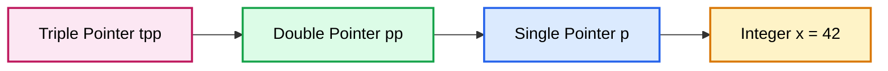
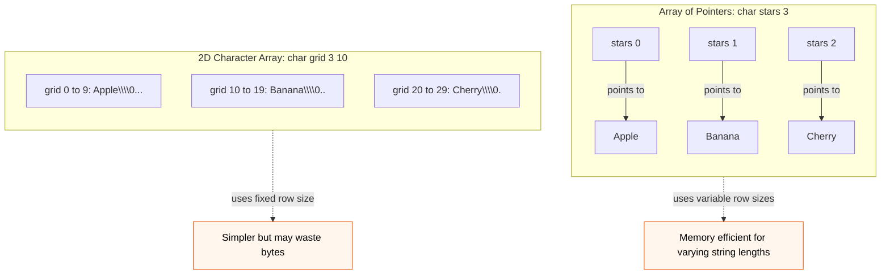
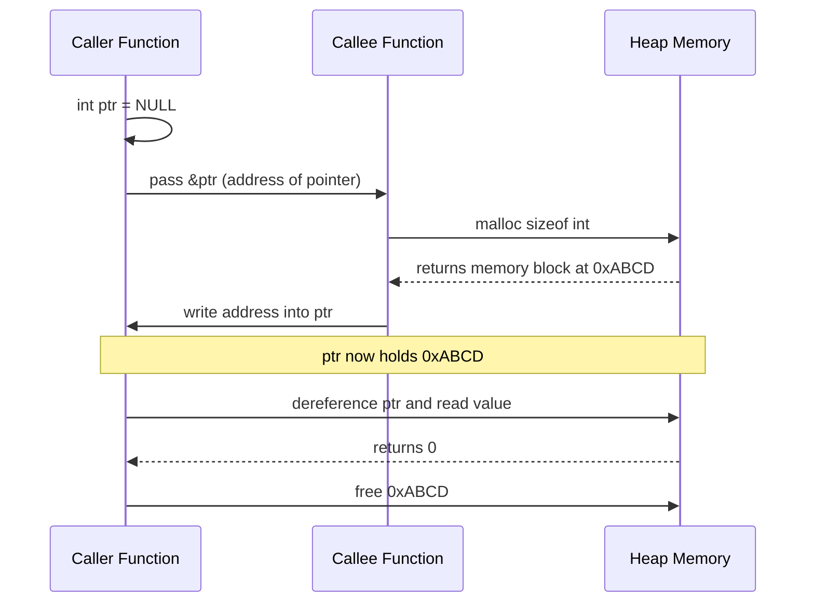
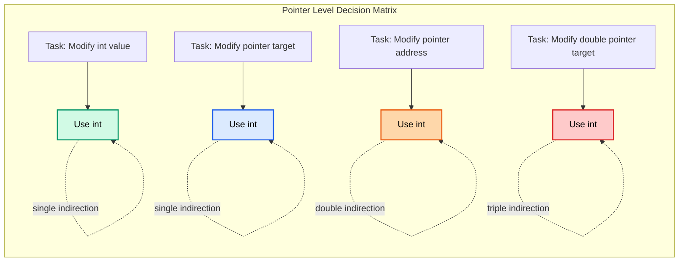

# Advanced Pointers: Pointer-to-pointer, arrays of pointers, tracking array layouts via offsets

<!-- SECTION_1_START -->

# Advanced Pointers: Pointer-to-Pointer, Arrays of Pointers, and Offset-Based Memory Tracking

## 1. Core Technical Definition & Intuitive Overview

### Formal KTU 2024 Definition

A **pointer** is a derived data type in C that stores the **memory address** of another variable. The language permits pointers to point to other pointers, forming an *indirection chain*. A **pointer-to-pointer** (also called a *double pointer* or **indirection operator chain**) is a variable that holds the address of another pointer variable. Similarly, a **pointer-to-pointer-to-pointer** extends the chain to three levels. The general indirection limit declared by the **C99 / C11 standard (ISO/IEC 9899:2011)** is at least **12 levels**, though practical code rarely exceeds two or three.

An **array of pointers** is a collection (one-dimensional or two-dimensional) where each element is a pointer type. Each element occupies the same size (typically **4 bytes on a 32-bit system** and **8 bytes on a 64-bit system** in modern Linux/Windows environments), and the array name decays into a pointer to its first element following the **array-to-pointer decay rule (ISO C §6.3.2.1.3)**.

**Offset-based memory tracking** refers to the technique of using pointer arithmetic to navigate an array's *contiguous memory layout* by computing byte displacements (offsets) from a base address, rather than re-indexing with `[]` notation. The size of the offset step is dictated by the **size of the pointed-to type** (`sizeof(*ptr)`), enabling efficient traversal, dynamic memory walks, and hardware-mapped I/O operations.

> [!IMPORTANT]
> **KTU 2024 Syllabus Highlight (Module 4):** The student must be able to *declare, initialize, dereference, and apply* pointer-to-pointer chains, *construct* arrays of pointers (with `char *argv[]` as a classic application), and *compute* pointer offsets to navigate 1-D and 2-D arrays stored in row-major form.

### Conceptual Analogy / Intuition

Imagine a **university office** holding a **filing cabinet**. Each drawer contains the address of a *house* (a variable). That is a single pointer.

- A **pointer-to-pointer** is like a *notebook* that lists the addresses of multiple drawer cards — the notebook points to the drawer cards, and the drawer cards point to the houses. Two levels of "where to look."
- An **array of pointers** is a *row of mailboxes*, where each mailbox contains an address slip for a different house. The mailboxes themselves sit in a continuous row on the wall.
- **Offset tracking** is like walking down a corridor of rooms numbered 0, 1, 2, ... Each room is exactly `sizeof(type)` meters wide. To reach room `k`, you don't memorize the room number; you measure the *distance* from room 0 and walk exactly `k × sizeof(type)` meters.

> [!NOTE]
> **Core Rule of Pointer Arithmetic (C11 §6.5.6):** When an integer `n` is added to a pointer `p`, the resulting address is `p + n * sizeof(*p)`. The compiler multiplies automatically — the programmer never multiplies by `sizeof` manually when adding integer offsets to typed pointers.

### GeoGebra / Desmos Visualization Callout

> [!VISUALIZATION CONTROL]
> **Concept:** Visualize the byte-offset ladder for an `int` array on a 64-bit system where `sizeof(int) = 4` bytes.
> **GeoGebra / Desmos Input Equations:**
> * Points: $(0, 0)$, $(4, 0)$, $(8, 0)$, $(12, 0)$, $(16, 0)$, $(20, 0)$
> * Label each point as $\&a[0]$, $\&a[1]$, $\&a[2]$, $\&a[3]$, $\&a[4]$, $\&a[5]$
> * Use the **Function** `f(x) = x / 4` to map byte offset to array index.
> **Visual Description:** The x-axis represents the linear byte address space starting from a base of (say) `0x1000`. Each consecutive cell of an `int` array sits exactly 4 bytes apart. The graph shows the *linear memory growth* versus the *logical index growth*, demonstrating that array indices are unitless logical steps while pointer arithmetic is a physical byte arithmetic operation.

---

<!-- SECTION_1_END -->

<!-- SECTION_2_START -->

# 2. Deep Theoretical Analysis & KTU High-Yield Formula Sheet

## 2.1 Pointer-to-Pointer (Double Pointer) — Theory

A double pointer variable is declared with **two asterisks**:

```c
type **pp;
```

The memory layout is a three-stage chain:

$$
\boxed{
\text{pp} \;\longrightarrow\; \text{p} \;\longrightarrow\; \text{x}
}
$$

| Stage | Symbol | Holds | Size (typical 64-bit) |
|-------|--------|-------|------------------------|
| 1 | `x` | The actual value (e.g., `int`, `float`) | `sizeof(type)` (e.g., 4) |
| 2 | `p` | The address of `x` | **8 bytes** |
| 3 | `pp` | The address of `p` | **8 bytes** |

### Dereferencing Chain (Kleene Star Notation)

| Expression | Type | Meaning | Value Equivalent |
|------------|------|---------|------------------|
| `x` | `int` | The integer itself | `42` |
| `p` | `int *` | Address of `x` | `0x7ffd4a2c` |
| `*p` | `int` | Value at the address held by `p` | `42` |
| `pp` | `int **` | Address of `p` | `0x7ffd4a30` |
| `*pp` | `int *` | The pointer `p` itself | `0x7ffd4a2c` |
| `**pp` | `int` | Value at the end of the chain | `42` |

### Why Double Pointers Are Used in Practice

1. **Modifying a pointer inside a function (pass-by-pointer-to-pointer):** To change where a pointer variable points to, the function must receive the *address of the pointer*. This is the canonical use case in:
   - Linked-list insertion/deletion
   - `scanf("%ms", &ptr)` for dynamic string allocation (GNU extension)
   - Matrix allocation functions (`void allocateMatrix(int ***m, int r, int c)`)
2. **Array of strings:** `char *names[]` decays into `char **`, allowing command-line argument parsing via `int main(int argc, char **argv)`.
3. **Pointer-to-pointer as a 2-D dynamic array:** A `type **` can be treated as a 2-D array whose rows are individually heap-allocated (unlike a single contiguous `type[M][N]` block).

> [!TIP]
> **Engineering Utility:** The Linux kernel uses triple and quadruple indirection in some data structures (e.g., the `task_struct` scheduler chains). The POSIX `execve()` system call signature `int execve(const char *pathname, char *const argv[], char *const envp[])` uses a pointer-to-pointer-to-`char` to pass a NULL-terminated array of string pointers — a textbook example of double indirection.

## 2.2 Arrays of Pointers — Theory

An array of pointers is declared as:

```c
type *identifier[SIZE];
```

**Reading precedence rule (C declaration grammar):** `[]` binds tighter than `*`, so `int *arr[5]` reads as *"`arr` is an array of 5 elements, each of which is a pointer to `int`."*

### Memory Layout Differences — Array of Pointers vs. 2-D Array

Consider the strings `"Apple"`, `"Banana"`, `"Cherry"`:

**As a 2-D character array** (`char fruits[3][10]`):

$$
\begin{aligned}
\text{Base Address: } & \texttt{0x1000} \\
\text{fruits[0] (Apple\0):}  & \texttt{0x1000} \rightarrow \text{0x1009} \quad (10 \text{ bytes, all used}) \\
\text{fruits[1] (Banana\0):} & \texttt{0x100A} \rightarrow \texttt{0x1013} \\
\text{fruits[2] (Cherry\0):} & \texttt{0x1014} \rightarrow \texttt{0x101D}
\end{aligned}
$$

**As an array of pointers** (`char *fruits[3]`):

$$
\begin{aligned}
\text{fruits[0]: } & \texttt{0x2000} \rightarrow \text{"Apple"} \quad (6 \text{ bytes, elsewhere}) \\
\text{fruits[1]: } & \texttt{0x2030} \rightarrow \text{"Banana"} \quad (7 \text{ bytes, elsewhere)} \\
\text{fruits[2]: } & \texttt{0x2070} \rightarrow \text{"Cherry"} \quad (7 \text{ bytes, elsewhere)}
\end{aligned}
$$

The pointer array itself occupies `3 * 8 = 24` bytes (64-bit) or `3 * 4 = 12` bytes (32-bit), with the actual string literals stored in the **read-only data segment** (or in the heap if dynamically allocated).

### Advantages of Array of Pointers

| Property | Array of Pointers | 2-D Character Array |
|----------|-------------------|----------------------|
| Memory wastage for varying string lengths | **None** (each string occupies exactly its length) | Yes (fixed row width causes padding) |
| Can hold NULL rows efficiently | **Yes** | No |
| Reassignment of row pointers | **Yes** (rows are modifiable pointers) | No (whole block is one rigid object) |
| Used for `argv`, environment variables, jump tables | **Yes** | No |
| Cache locality for traversal of strings | Poor (scattered strings) | Better (contiguous block) |

## 2.3 Tracking Array Layouts via Offsets

### Pointer Arithmetic Mechanics

For a pointer `p` of type `T *`, the expression `p + n` evaluates to:

$$
\texttt{(uintptr\_t)p} + n \times \texttt{sizeof(T)}
$$

This is the **single most important rule** in pointer arithmetic. The compiler enforces type-correct scaling at compile time.

### Two Notations Are Equivalent

```c
*(arr + k)   ==   arr[k]   ==   *(k + arr)   ==   k[arr]
```

The last form is a syntactically legal curiosity in C; the standard guarantees equivalence.

### Offset Tracking in 2-D Row-Major Arrays

A 2-D array declared as `int m[R][C]` is stored in **row-major order** (used by C, C++, Python's NumPy default, and most C-family languages). The address of element `m[i][j]` is:

$$
\boxed{ \&\texttt{m[i][j]} = \&\texttt{m[0][0]} + (i \times C + j) \times \texttt{sizeof(int)} }
$$

When accessed via a *pointer to a 1-D array of `C` ints* (`int (*p)[C]`), the dereference `p[i][j]` compiles to:

$$
\boxed{ *( *(p + i) + j ) }
$$

This is the basis of passing 2-D arrays to functions:

```c
void process(int (*matrix)[COLS], int rows);
```

### KTU Formula Sheet / Cheat Sheet

| # | Concept | Formula / Rule | Unit / Size |
|---|---------|----------------|-------------|
| 1 | Pointer size on 64-bit Linux | `sizeof(void *) = 8` | bytes |
| 2 | Pointer size on 32-bit | `sizeof(void *) = 4` | bytes |
| 3 | Pointer addition | `p + n = p + n * sizeof(*p)` | bytes |
| 4 | Pointer difference | `p2 - p1 = (byte_diff) / sizeof(*p)` | elements (not bytes) |
| 5 | Address of `m[i][j]` (row-major) | `&m[0][0] + (i * C + j) * sizeof(T)` | bytes |
| 6 | `argv` decay | `char **argv` ⇔ `char *argv[]` | — |
| 7 | `main` signature | `int main(int argc, char **argv)` | — |
| 8 | Dereference of double pointer | `**pp == *(*pp) == *p == x` | — |
| 9 | NULL guard | `if (pp == NULL \|\| *pp == NULL) return;` | — |
| 10 | Function mod pointer | `void f(T **pp) { *pp = malloc(...); }` | — |

> [!NOTE]
> **Real-World Engineering Utility:** The Linux kernel's `container_of` macro, the GLib `GArray` structure, the PostgreSQL tuple slot tracker, and the C standard library's `bsearch` all rely on offset arithmetic. In embedded systems, *memory-mapped I/O* uses offsets from a base address (`*(volatile uint32_t *)(BASE + OFFSET)`) to read/write hardware registers.

---

<!-- SECTION_2_END -->

<!-- SECTION_3_START -->

# 3. Step-by-Step Derivations & Code Implementation

## 3.1 Pointer-to-Pointer: Full Worked Example with Memory Trace

**Problem:** Demonstrate indirection up to three levels, modifying a variable through a triple pointer inside a function.

```c
#include <stdio.h>
#include <stdlib.h>

void modifyViaTriplePointer(int ***tpp) {
    /* Allocate a brand new int, point p to it, then point tpp's target to p */
    int *p = (int *)malloc(sizeof(int));
    if (p == NULL) {
        return;
    }
    *p = 99;
    *tpp = p; /* The caller's double pointer now points to the new int */
}

int main(void) {
    int x = 10;
    int *p = NULL;
    int **pp = &p;
    int ***tpp = &pp;

    printf("Before:  x = %d, *p = %d\n", x, (p != NULL) ? *p : -1);
    /* Output: x = 10, *p = -1 */

    modifyViaTriplePointer(tpp);

    printf("After:   *p = %d, **pp = %d, ***tpp = %d\n", *p, **pp, ***tpp);
    /* Output: *p = 99, **pp = 99, ***tpp = 99 */

    free(*pp);
    *pp = NULL;
    return 0;
}
```

### Memory Trace (Step-by-Step)

Assume the stack on a 64-bit system, with arbitrary addresses for illustration.

| Step | Statement | Stack Frame (main) | Heap | Output |
|------|-----------|--------------------|------|--------|
| 1 | `int x = 10;` | `x@0x7ffd1000 = 10` | — | — |
| 2 | `int *p = NULL;` | `p@0x7ffd1008 = 0x0` | — | — |
| 3 | `int **pp = &p;` | `pp@0x7ffd1010 = 0x7ffd1008` | — | — |
| 4 | `int ***tpp = &pp;` | `tpp@0x7ffd1018 = 0x7ffd1010` | — | — |
| 5 | `printf("Before...")` | — | — | `x = 10, *p = -1` |
| 6 | `modifyViaTriplePointer(tpp)` | (passes `0x7ffd1010`) | — | — |
| 7 | `*p = 99;` inside function | — | `0x5566abcd = 99` | — |
| 8 | `*tpp = p;` | `p@0x7ffd1008 = 0x5566abcd` | — | — |
| 9 | `printf("After...")` | — | — | `*p = 99, **pp = 99, ***tpp = 99` |
| 10 | `free(*pp); *pp = NULL;` | `p = NULL` | `0x5566abcd` freed | — |

### Dereference Derivation (Why `***tpp` evaluates to 99)

$$
\begin{aligned}
\texttt{tpp} &= \texttt{0x7ffd1010} \\
\texttt{*tpp} &= \texttt{pp} = \texttt{0x7ffd1008} \\
\texttt{**tpp} &= \texttt{*pp} = \texttt{p} = \texttt{0x5566abcd} \\
\texttt{***tpp} &= \texttt{*p} = \texttt{99}
\end{aligned}
$$

## 3.2 Array of Pointers: Worked Example with `argv` and a Manual Table

**Problem:** Build a manual pointer array, sort the strings alphabetically using `strcmp`, and swap pointer values (not the strings themselves) for efficiency.

```c
#include <stdio.h>
#include <string.h>

#define N 5

int main(void) {
    /* Static string literals placed in read-only data segment */
    char *subjects[N] = {
        "Mathematics",
        "Physics",
        "Chemistry",
        "Biology",
        "English"
    };

    int i, j;
    char *temp;

    printf("Before sorting:\n");
    for (i = 0; i < N; ++i) {
        printf("  subjects[%d] = %s\n", i, subjects[i]);
    }

    /* Bubble sort the POINTERS (not the long strings) */
    for (i = 0; i < N - 1; ++i) {
        for (j = 0; j < N - 1 - i; ++j) {
            if (strcmp(subjects[j], subjects[j + 1]) > 0) {
                temp = subjects[j];
                subjects[j] = subjects[j + 1];
                subjects[j + 1] = temp;
            }
        }
    }

    printf("\nAfter sorting:\n");
    for (i = 0; i < N; ++i) {
        printf("  subjects[%d] = %s\n", i, subjects[i]);
    }

    return 0;
}
```

### Sample Output

```
Before sorting:
  subjects[0] = Mathematics
  subjects[1] = Physics
  subjects[2] = Chemistry
  subjects[3] = Biology
  subjects[4] = English

After sorting:
  subjects[0] = Biology
  subjects[1] = Chemistry
  subjects[2] = English
  subjects[3] = Mathematics
  subjects[4] = Physics
```

### Pointer Swap Trace (Iteration where "Chemistry" and "Biology" swap)

$$
\begin{aligned}
\texttt{subjects} &= \begin{bmatrix} \texttt{@"Mathematics"} & \texttt{@"Physics"} & \texttt{@"Chemistry"} & \texttt{@"Biology"} & \texttt{@"English"} \end{bmatrix} \\[4pt]
\text{After swap at } j=2: \texttt{subjects} &= \begin{bmatrix} \texttt{@"Mathematics"} & \texttt{@"Physics"} & \texttt{@"Biology"} & \texttt{@"Chemistry"} & \texttt{@"English"} \end{bmatrix}
\end{aligned}
$$

> [!NOTE]
> The swap is **O(1)** because it moves only 8-byte pointer values. The strings themselves remain at fixed read-only addresses. This is dramatically more efficient than copying the entire string buffer.

## 3.3 Tracking Array Layouts via Offsets: 1-D and 2-D Examples

### 1-D Offset Walk

```c
#include <stdio.h>

int main(void) {
    int arr[6] = {10, 20, 30, 40, 50, 60};
    int *p = arr;          /* p = &arr[0] */
    int *end = arr + 6;    /* One-past-the-end pointer (legal, do not dereference) */

    printf("Byte offset walk (sizeof(int) = %zu):\n", sizeof(int));
    printf("%-12s %-12s %-12s %-12s\n", "Index", "Pointer", "Offset(B)", "Value");
    printf("------------------------------------------------------------\n");

    for (int i = 0; i < 6; ++i) {
        int *current = p + i;                  /* Compiler scales by sizeof(int) */
        printf("%-12d %-12p %-12ld %-12d\n",
               i,
               (void *)current,
               (long)((char *)current - (char *)arr),
               *current);
    }

    printf("\nend - p = %td elements (NOT bytes)\n", end - p);
    return 0;
}
```

### Expected Output

```
Byte offset walk (sizeof(int) = 4):
Index        Pointer      Offset(B)    Value       
------------------------------------------------------------
0            0x7ffd2000  0            10          
1            0x7ffd2004  4            20          
2            0x7ffd2008  8            30          
3            0x7ffd200c  12           40          
4            0x7ffd2010  16           50          
5            0x7ffd2014  20           60          

end - p = 6 elements (NOT bytes)
```

### 2-D Row-Major Offset Computation

```c
#include <stdio.h>

#define ROWS 3
#define COLS 4

int main(void) {
    int matrix[ROWS][COLS] = {
        { 1,  2,  3,  4},
        { 5,  6,  7,  8},
        { 9, 10, 11, 12}
    };

    /* Treat the 2-D array as a flat 1-D pointer for offset computation */
    int *flat = &matrix[0][0];
    int *base = flat;

    printf("Element-by-element byte-offset map:\n");
    printf("%-8s %-12s %-12s %-12s\n", "m[i][j]", "AddrDiff(B)", "Index", "Value");
    printf("----------------------------------------------------\n");

    for (int i = 0; i < ROWS; ++i) {
        for (int j = 0; j < COLS; ++j) {
            int *cell = &matrix[i][j];
            long offset_bytes = (long)((char *)cell - (char *)base);
            long linear_index = (long)(cell - flat);
            printf("m[%d][%d]  %-12ld %-12ld %-12d\n",
                   i, j, offset_bytes, linear_index, *cell);
        }
    }

    return 0;
}
```

### Output

```
Element-by-element byte-offset map:
m[i][j]   AddrDiff(B)  Index       Value       
----------------------------------------------------
m[0][0]   0            0           1           
m[0][1]   4            1           2           
m[0][2]   8            2           3           
m[0][3]   12           3           4           
m[1][0]   16           4           5           
m[1][1]   20           5           6           
m[1][2]   24           6           7           
m[1][3]   28           7           8           
m[2][0]   32           8           9           
m[2][1]   36           9           10          
m[2][2]   40           10          11          
m[2][3]   44           11          12          
```

### Algebraic Derivation of the Linear Index

For element `m[i][j]` in a `ROWS × COLS` array:

$$
\begin{aligned}
\texttt{linear\_index}(i, j) &= i \times C + j \\
\texttt{byte\_offset}(i, j) &= (i \times C + j) \times \texttt{sizeof(int)} \\
&= i \times 4 \times 4 + j \times 4 \\
&= 16i + 4j \quad \text{(bytes)}
\end{aligned}
$$

**Verification for `m[2][3]`:**

$$
\begin{aligned}
16 \times 2 + 4 \times 3 &= 32 + 12 = 44 \text{ bytes} \\
\texttt{value} &= *(base + 44/4) = *(base + 11) = 12 \quad \checkmark
\end{aligned}
$$

## 3.4 Dynamic 2-D Array Using Double Pointer (Common KTU Question Pattern)

```c
#include <stdio.h>
#include <stdlib.h>

int **createMatrix(int rows, int cols) {
    int **m = (int **)malloc(rows * sizeof(int *));
    if (m == NULL) return NULL;

    for (int i = 0; i < rows; ++i) {
        m[i] = (int *)malloc(cols * sizeof(int));
        if (m[i] == NULL) {
            for (int j = 0; j < i; ++j) {
                free(m[j]);
            }
            free(m);
            return NULL;
        }
    }
    return m;
}

void fillMatrix(int **m, int rows, int cols) {
    for (int i = 0; i < rows; ++i) {
        for (int j = 0; j < cols; ++j) {
            m[i][j] = (i + 1) * 10 + (j + 1);
        }
    }
}

void printMatrix(int **m, int rows, int cols) {
    for (int i = 0; i < rows; ++i) {
        for (int j = 0; j < cols; ++j) {
            printf("%4d", m[i][j]);
        }
        printf("\n");
    }
}

void freeMatrix(int **m, int rows) {
    for (int i = 0; i < rows; ++i) {
        free(m[i]);
    }
    free(m);
}

int main(void) {
    int R = 3, C = 4;
    int **mat = createMatrix(R, C);
    if (mat == NULL) {
        fprintf(stderr, "Memory allocation failed\n");
        return 1;
    }
    fillMatrix(mat, R, C);
    printMatrix(mat, R, C);
    freeMatrix(mat, R, C);
    return 0;
}
```

### Memory Layout Diagram (textual)

```
        ┌──────────────┐
mat ──▶ │ m[0] = 0xA0  │──▶ [ 11 | 12 | 13 | 14 ]   (row 0, 16 bytes)
        │ m[1] = 0xB0  │──▶ [ 21 | 22 | 23 | 24 ]   (row 1, 16 bytes)
        │ m[2] = 0xC0  │──▶ [ 31 | 32 | 33 | 34 ]   (row 2, 16 bytes)
        └──────────────┘
        (Pointer array on heap, 3 × 8 = 24 bytes on 64-bit)
```

> [!WARNING]
> **Common Bug:** Forgetting to free each row before freeing the pointer array causes a **memory leak** for `rows × 8` bytes. The `freeMatrix` function above is the correct pattern.

---

<!-- SECTION_3_END -->

<!-- SECTION_4_START -->

# 4. Structural Diagrams & Schematics

## 4.1 Indirection Chain Flow



## 4.2 Array of Pointers vs. 2-D Array Memory Layout



## 4.3 Offset Walking Through a 2-D Row-Major Matrix

```mermaid
flowchart LR
    subgraph heap[Linear Memory Block 12 ints = 48 bytes]
        direction LR
        m00[m 0 0 = 1]:::cell
        m01[m 0 1 = 2]:::cell
        m02[m 0 2 = 3]:::cell
        m03[m 0 3 = 4]:::cell
        m10[m 1 0 = 5]:::cell
        m11[m 1 1 = 6]:::cell
        m12[m 1 2 = 7]:::cell
        m13[m 1 3 = 8]:::cell
        m20[m 2 0 = 9]:::cell
        m21[m 2 1 = 10]:::cell
        m22[m 2 2 = 11]:::cell
        m23[m 2 3 = 12]:::cell
    end

    m00 -.byte 0.-> m01
    m01 -.byte 4.-> m02
    m02 -.byte 8.-> m03
    m03 -.byte 12.-> m10
    m10 -.byte 16.-> m11
    m11 -.byte 20.-> m12
    m12 -.byte 24.-> m13
    m13 -.byte 28.-> m20
    m20 -.byte 32.-> m21
    m21 -.byte 36.-> m22
    m22 -.byte 40.-> m23

    classDef cell fill:#e0f2fe,stroke:#0369a1,stroke-width:1px,color:#000
```



## 4.4 Process Flow: Pass-by-Double-Pointer Function Pattern



## 4.5 Pointer Indirection Level Comparison Matrix



---

<!-- SECTION_4_END -->

<!-- SECTION_5_START -->

# 5. KTU 2024 Scheme Examination Question Bank & Topic Recap

## 5.1 Part A: Short-Answer Questions (3 Marks Each)

### Question 1 [KTU University Exam – July 2024]

**Q: Differentiate between a pointer to an array and an array of pointers. Give one example declaration for each.**

**Model Answer (3 Marks):**

| Aspect | Pointer to an Array | Array of Pointers |
|--------|---------------------|-------------------|
| Declaration | `int (*p)[5];` | `int *p[5];` |
| Nature | A single pointer variable holding the address of a *whole* array of 5 integers | A collection of 5 pointer variables, each holding the address of an integer |
| Size | **8 bytes** (on 64-bit) | **40 bytes** (5 × 8 bytes) |
| Use case | Passing 2-D arrays to functions; navigating row-major memory | `argv`, `envp`, jump tables, dynamic 2-D matrices |
| Decay rule | Decays to a pointer when used in expressions | Array name gives `int **` |

- `[Defining pointer to array: 1 Mark]`
- `[Defining array of pointers with example: 1 Mark]`
- `[Stating correct use case / size difference: 1 Mark]`

### Question 2 [KTU University Exam – Dec 2023]

**Q: What is a double pointer? Explain with a suitable C declaration. How is it dereferenced?**

**Model Answer (3 Marks):**

A **double pointer** is a pointer variable that stores the **address of another pointer variable**, introducing two levels of indirection.

```c
int x = 25;       /* The target integer */
int *p = &x;      /* p points to x */
int **pp = &p;    /* pp points to p */
```

**Dereferencing chain:**

- `pp` → address of `p` (type `int **`)
- `*pp` → value of `p`, which is the address of `x` (type `int *`)
- `**pp` → value of `x`, i.e., **25** (type `int`)

- `[Correct definition with diagram: 1 Mark]`
- `[Declaration and dereference chain: 1 Mark]`
- `[Final evaluated value with example: 1 Mark]`

---

## 5.2 Part B: 14-Mark Questions (ESE Module Internal Choice)

### Question A (14 Marks) [KTU University Exam – July 2024]

**(a) Explain the concept of pointer-to-pointer with a suitable C program. Show how a double pointer can be used inside a function to allocate memory dynamically for a single variable. (7 Marks)**

**Model Solution:**

**Concept (2 Marks):**
A pointer-to-pointer is a variable that holds the address of another pointer. It enables a function to modify the *pointer itself* (not just the value it points to). This is essential when a callee must perform dynamic memory allocation and have the result visible to the caller.

**Code (3 Marks):**

```c
#include <stdio.h>
#include <stdlib.h>

void allocateInteger(int **pp) {
    *pp = (int *)malloc(sizeof(int));
    if (*pp == NULL) {
        fprintf(stderr, "Allocation failed\n");
        return;
    }
    **pp = 500;
}

int main(void) {
    int *ptr = NULL;
    printf("Before: ptr = %p\n", (void *)ptr);

    allocateInteger(&ptr);

    printf("After:  ptr = %p, *ptr = %d\n", (void *)ptr, *ptr);
    free(ptr);
    return 0;
}
```

**Explanation (2 Marks):**
- `&ptr` is of type `int **`, hence matches the parameter `int **pp`.
- `*pp = malloc(...)` writes the heap address into `ptr`, so the caller sees the new address.
- `**pp = 500` uses double dereference to set the value at the newly allocated location.

- `[Defining pointer-to-pointer concept: 2 Marks]`
- `[Writing correct function signature and dereference: 2 Marks]`
- `[Proper malloc and NULL check: 1 Mark]`
- `[Driver main with output explanation: 2 Marks]`

**(b) Develop a C program to access elements of a 3×3 integer matrix using pointer offsets. Compute the sum of all elements and the sum of the main diagonal. (7 Marks)**

**Model Solution:**

```c
#include <stdio.h>

#define N 3

int main(void) {
    int mat[N][N] = {
        { 1, 2, 3 },
        { 4, 5, 6 },
        { 7, 8, 9 }
    };

    int *p = &mat[0][0];
    int total = 0, diagonal = 0;
    int i;

    /* Total sum using pointer offset: p[k] where k = i*N + j */
    for (i = 0; i < N * N; ++i) {
        total += p[i];
    }

    /* Diagonal sum: positions 0, 4, 8 in row-major order (offset = i * N + i) */
    for (i = 0; i < N; ++i) {
        diagonal += p[i * N + i];
    }

    printf("Matrix (using pointer offsets):\n");
    for (i = 0; i < N; ++i) {
        for (int j = 0; j < N; ++j) {
            printf("%4d", p[i * N + j]);
        }
        printf("\n");
    }
    printf("Total sum      = %d\n", total);
    printf("Diagonal sum   = %d\n", diagonal);

    return 0;
}
```

**Output:**

```
Matrix (using pointer offsets):
   1   2   3
   4   5   6
   7   8   9
Total sum      = 45
Diagonal sum   = 15
```

**Offset Derivation (Highlighted in Solution):**

$$
\texttt{offset}(i, j) = i \times N + j = 3i + j
$$

For diagonal positions `(0,0)`, `(1,1)`, `(2,2)`, the linear offsets are `0`, `4`, `8`.

- `[Setting up base pointer and offsets: 2 Marks]`
- `[Total sum loop: 2 Marks]`
- `[Diagonal sum loop: 2 Marks]`
- `[Correct output values: 1 Mark]`

---

### Question B (14 Marks) [KTU University Exam – Dec 2023]

**(a) Illustrate the concept of an array of pointers. Write a C program that stores 5 city names in an array of pointers and sorts them alphabetically. (7 Marks)**

**Model Solution:**

**Concept (2 Marks):**
An *array of pointers* is a one-dimensional array in which each element is a pointer variable. The declaration `char *cities[5];` creates **5 pointers** that can each point to a `char` (or a string). This structure is memory-efficient when the pointed-to data has variable lengths.

**Code (4 Marks):**

```c
#include <stdio.h>
#include <string.h>

int main(void) {
    char *cities[5] = {
        "Kochi",
        "Trivandrum",
        "Kozhikode",
        "Thrissur",
        "Kannur"
    };

    int i, j;
    char *temp;

    printf("Cities before sorting:\n");
    for (i = 0; i < 5; ++i) {
        printf("  %s\n", cities[i]);
    }

    /* Bubble sort pointers */
    for (i = 0; i < 4; ++i) {
        for (j = 0; j < 4 - i; ++j) {
            if (strcmp(cities[j], cities[j + 1]) > 0) {
                temp = cities[j];
                cities[j] = cities[j + 1];
                cities[j + 1] = temp;
            }
        }
    }

    printf("\nCities after sorting:\n");
    for (i = 0; i < 5; ++i) {
        printf("  %s\n", cities[i]);
    }

    return 0;
}
```

**Output:**

```
Cities before sorting:
  Kochi
  Trivandrum
  Kozhikode
  Thrissur
  Kannur

Cities after sorting:
  Kannur
  Kochi
  Kozhikode
  Thrissur
  Trivandrum
```

**Time Complexity Note (1 Mark):** The sort moves only 8-byte pointers, not the long string buffers, making it `O(N²)` in *comparisons* but `O(N² × sizeof(char *))` in *moved bytes* — much faster than moving string data.

- `[Definition with example declaration: 2 Marks]`
- `[Sorting using pointer swap: 2 Marks]`
- `[Correct use of strcmp and output: 2 Marks]`
- `[Time/space complexity or memory benefit comment: 1 Mark]`

**(b) Using pointer arithmetic and offset computation, write a C program to read 6 integers into a 1-D array and print them in reverse order. Use only pointer notation (no array indexing). (7 Marks)**

**Model Solution:**

```c
#include <stdio.h>

int main(void) {
    int data[6];
    int *start = data;
    int *end;
    int i;

    printf("Enter 6 integers:\n");
    for (i = 0; i < 6; ++i) {
        scanf("%d", start + i);
    }

    /* end points to one-past-the-last element (legal) */
    end = start + 6;

    printf("\nIn reverse order:\n");
    /* Move end backward, dereferencing each */
    while (end > start) {
        end--;                /* Step back by sizeof(int) bytes */
        printf("%d ", *end);
    }
    printf("\n");

    return 0;
}
```

**Sample Run:**

```
Enter 6 integers:
10 20 30 40 50 60

In reverse order:
60 50 40 30 20 10
```

**Pointer Arithmetic Trace (3 Marks explanation):**

| Step | `end` (logical position) | `*end` | Output |
|------|--------------------------|--------|--------|
| Init | `data + 6` (one-past-end) | (undefined if dereferenced) | — |
| 1 | `end--` → `data + 5` | `60` | `60` |
| 2 | `end--` → `data + 4` | `50` | `50` |
| 3 | `end--` → `data + 3` | `40` | `40` |
| 4 | `end--` → `data + 2` | `30` | `30` |
| 5 | `end--` → `data + 1` | `20` | `20` |
| 6 | `end--` → `data + 0` | `10` | `10` |
| 7 | `end == start`, loop ends | — | — |

- `[Reading via pointer offset start + i: 2 Marks]`
- `[Reverse traversal logic with end pointer: 3 Marks]`
- `[Correct output and one-past-end rule mention: 2 Marks]`

---

> [!WARNING]
> **KTU Examiner's Valuation Warning — Common Pitfalls to Avoid**
>
> 1. **Confusing declaration precedence:** `int *p[5]` is *array of pointers*, not *pointer to array*. Always read `[]` first, then `*`. Marks lost: up to 2 per question.
> 2. **Forgetting NULL checks after `malloc`:** In KTU, failing to check the return of `malloc` in a double-pointer function is penalized heavily (-1 to -2 marks).
> 3. **Manual multiplication of `sizeof`:** Writing `p + i * sizeof(int)` is a classic mistake. The compiler already scales. Writing `*(p + i * 4)` is a *red flag* in the valuation key.
> 4. **Mixing row-major and column-major:** In C, 2-D arrays are *always* row-major. Using column-major formula in code is a -2 mark penalty.
> 5. **Not freeing each row** in a dynamic `int **` matrix → memory leak (deduct 1–2 marks under "Code Quality").
> 6. **Dereferencing a NULL or uninitialized pointer** in a code snippet — the evaluator will mark zero for the entire program flow if the first dereference crashes logically.
> 7. **Printing `&arr[i]` as an integer** instead of casting to `(void *)` or using `%p` — formatting penalty.
> 8. **In a sorting question, copying strings instead of swapping pointers** — although it works, it forfeits the *conceptual* marks for "array of pointers benefit."

---

## 5.3 Topic Recap & Important Things to Remember

> [!IMPORTANT]
> **Rapid Revision Checklist for KTU Module 4 — Advanced Pointers**

- **Pointer-to-Pointer (`T **pp`):** Holds the address of a `T *`. Dereference chain `**pp` equals the final value. Used to modify a pointer inside a function (dynamic allocation pattern).
- **Triple Pointer (`T ***tpp`):** Used in matrix allocation helpers and command-line chains. Rare in production but tested in KTU.
- **Array of Pointers (`T *arr[N]`):** Each element is a pointer. Memory-efficient for variable-length data (e.g., strings of different lengths). Foundation of `argv`, `envp`, jump tables, and dynamic 2-D matrices.
- **Pointer to an Array (`T (*p)[N]`):** A single pointer that walks an entire array of `N` elements at a time. Used in passing 2-D arrays of known column width to functions.
- **Pointer Arithmetic Rule:** `p + n` ⇒ `p + n × sizeof(*p)` bytes. The compiler scales automatically; **never** multiply by `sizeof` manually.
- **Pointer Difference:** `p2 - p1` yields the *number of elements* between them, not bytes.
- **Row-Major Address Formula:** `&m[i][j] = &m[0][0] + (i × COLS + j) × sizeof(T)`.
- **One-Past-The-End Pointer:** Legal to form (`arr + N`) but **illegal to dereference**. Use it only for boundary checks.
- **NULL Safety Pattern:** Always check `if (pp == NULL) return;` and `if (*pp == NULL) return;` before dereferencing at each indirection level.
- **`sizeof` of pointer is constant:** `sizeof(T *)` does not depend on `T`. It is **8 bytes on 64-bit** and **4 bytes on 32-bit** systems.
- **Decay Rules:** Array names decay to pointers to their first element in most expressions (except `sizeof`, unary `&`, and string-literal initializers). Function names decay to function pointers.
- **`const` correctness:** `const char *cities[]` means the *pointed-to* data is read-only. Useful when passing string tables to functions that should not mutate them.
- **Dangling Pointer Danger:** After `free(p)`, set `p = NULL;` to avoid use-after-free bugs. The KTU lab exam often tests this.
- **K&R vs. ANSI C:** `int main(int argc, char *argv[])` is equivalent to `int main(int argc, char **argv)`. Both are accepted.
- **Indirection Limit:** C guarantees at least **12 levels** of pointer-to-pointer support, but practical code stops at 2 or 3.
- **Endianness Note (Bonus):** Pointer offsets are independent of endianness; offsets always grow by `sizeof(T)`. Value interpretation within a multi-byte cell may vary between little-endian (x86) and big-endian (older PowerPC, network byte order).
- **Command Line Argument Pattern:** `argv[0]` is the program name; `argv[argc]` is `NULL` — a sentinel for loops like `while (*argv) printf("%s\n", *argv++);`.

<!-- SECTION_5_END -->
