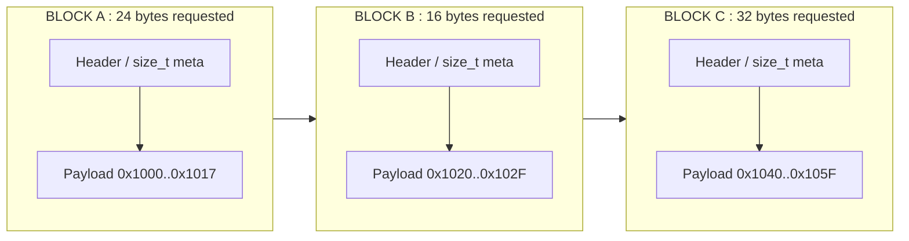
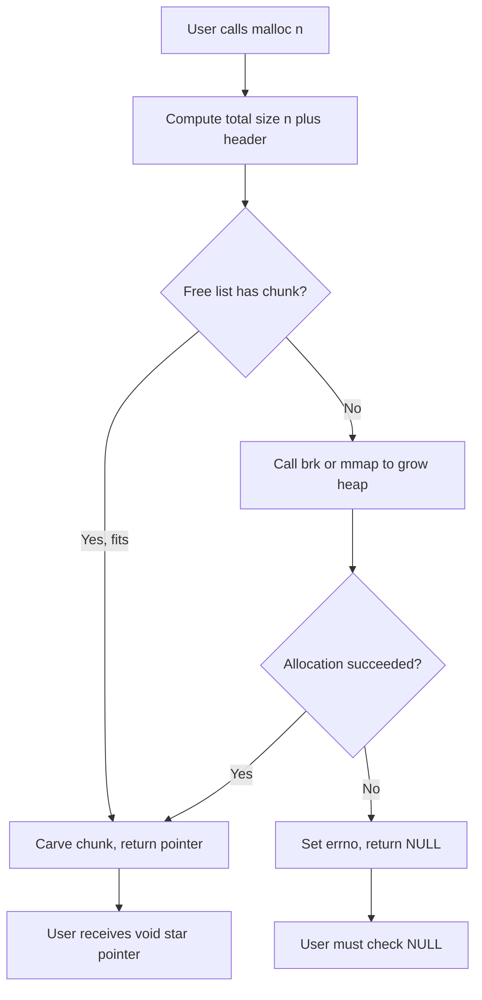
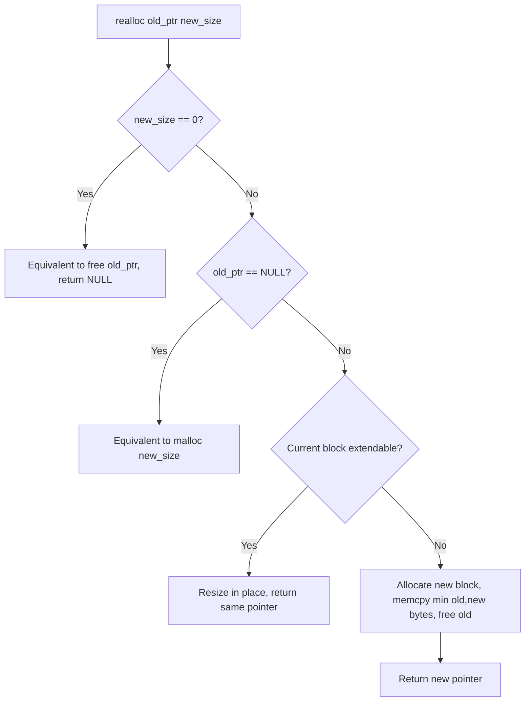
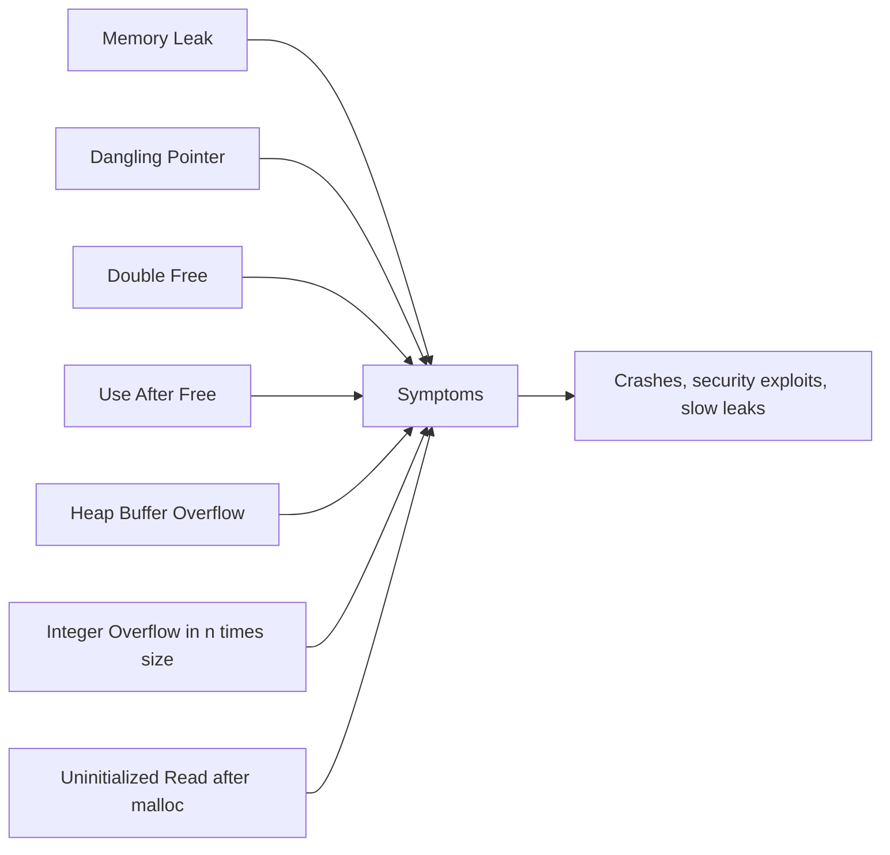
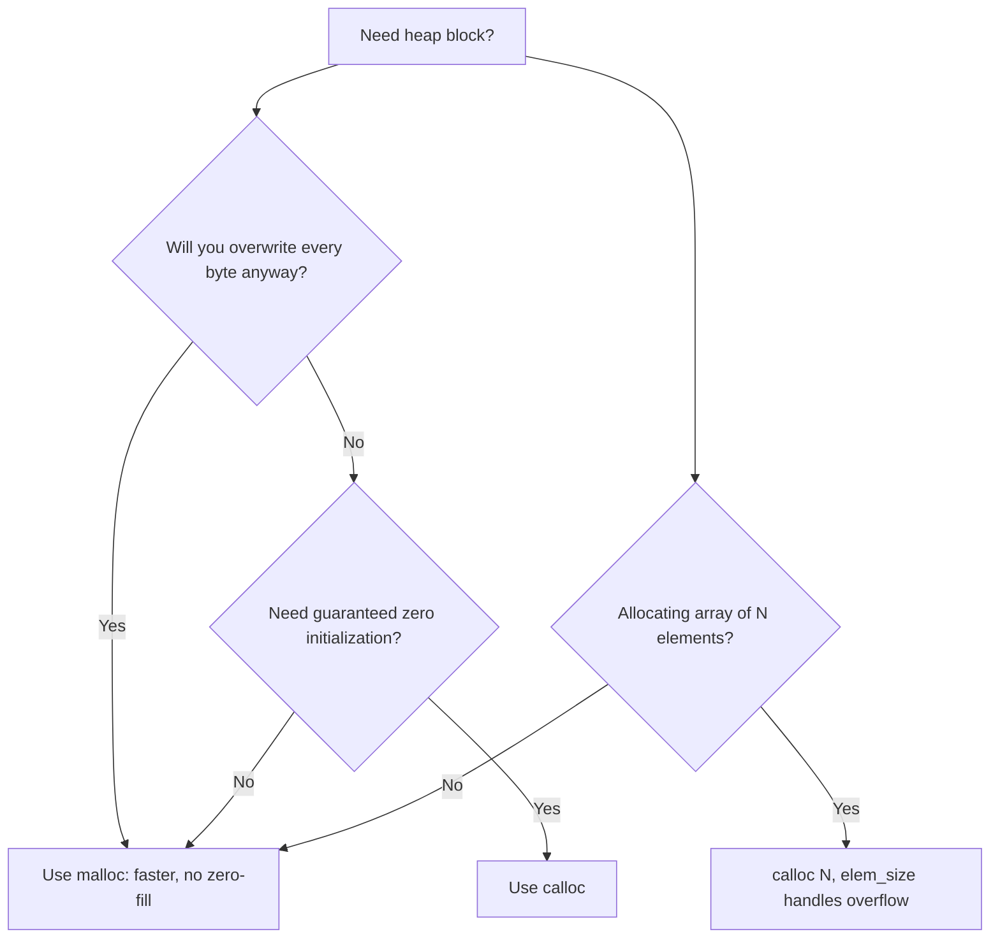

# Dynamic Memory Allocation: Runtime allocation via malloc/calloc

<!-- SECTION_1_START -->
# Dynamic Memory Allocation in C: Runtime Allocation via `malloc` / `calloc`

## 1.1 Formal Academic Definition (KTU 2024 Syllabus Terminology)

**Dynamic Memory Allocation (DMA)** is the mechanism by which a C program requests memory from the **Heap** region of the process address space **at runtime**, rather than reserving a fixed size on the **Stack** at compile time. The C Standard Library provides four core functions inside `<stdlib.h>`: `malloc`, `calloc`, `realloc`, and `free`. This paradigm enables the creation of **variable-size data structures** (linked lists, trees, dynamic arrays, hash maps) whose lifetime is independent of any enclosing function's scope.

> [!IMPORTANT]
> **KTU 2024 Highlight (Module 4):** Students must be able to *differentiate* static vs. dynamic allocation, write syntactically correct `malloc`/`calloc` calls with proper **type-casting and boundary checks**, and articulate the consequences of failing to invoke `free()` (memory leak).

## 1.2 Conceptual Analogy & Intuition

Think of your computer's RAM as a **large hotel**:

- **Compile-time (static) allocation** is like a hotel front desk that pre-books a fixed number of rooms the moment you check in. You cannot change the booking later, and the rooms are held even if you do not use them.
- **Dynamic memory allocation** is like a concierge who walks to the front desk **only when you actually need a room**, asks for `N` rooms, gets a room number (address) back, and releases them when you are done (`free`).

So, you the caller are the **program**, the concierge is the **heap manager** (inside `glibc` / `malloc.c`), and the room number is the **pointer** returned to you.

> [!NOTE]
> **Physical Constants & Units**
> `sizeof(char) = 1` byte, `sizeof(void*) = 8` bytes on a 64-bit machine, heap grows **upward** in virtual address space while stack grows **downward**.

## 1.3 Memory Layout of a C Process (Geometric Intuition)

A C program is laid out in 5 segments in virtual memory:

| Segment | Lifetime | Example |
|---|---|---|
| Text / Code | Process lifetime | Compiled machine instructions |
| Data (Global/Static initialized) | Process lifetime | `int g = 5;` |
| BSS (Uninitialized globals) | Process lifetime | `int g;` |
| Stack | Function scope | Local variables, return addresses |
| Heap | Manual (`malloc` -> `free`) | Dynamic blocks |

> [!VISUALIZATION CONTROL]
> **Concept:** Process address-space layout (low to high addresses)
> **ASCII Schematic (visualize on a vertical number line):**
> ```
> HIGH  +----------------------+  <- Kernel
>       |       STACK          |  (grows downward)
>       |          v           |
>       |         ...          |
>       |          ^           |
>       |        HEAP          |  (grows upward)
>       |        BSS           |
>       |        DATA          |
>       |        TEXT          |
> LOW   +----------------------+
> ```
> **Visual Description:** Two arrows pointing *toward each other* in the middle of the diagram. Stack and heap meet near the middle to maximize address space utilization.

## 1.4 Why Dynamic Allocation? The "Why" Behind the Concept

1. **Unknown size at compile time** — e.g., reading `n` from the user.
2. **Data structures that grow/shrink** — vectors, hash tables, trees.
3. **Persistence across function calls** — a pointer can be returned and used by the caller after the callee returns.
4. **Memory efficiency** — only what is needed is reserved; static arrays may waste space or overflow.

<!-- SECTION_1_END -->

<!-- SECTION_2_START -->
# Deep Theoretical Analysis & KTU High-Yield Formula Sheet

## 2.1 The Four Pillars of `<stdlib.h>` Memory Management

| Function | Signature | Returns | Initializes? | On Failure |
|---|---|---|---|---|
| `malloc` | `void* malloc(size_t bytes)` | Pointer to uninitialized block | **No** | `NULL` |
| `calloc` | `void* calloc(size_t n, size_t size)` | Pointer to **zero-initialized** block | **Yes (all bytes = 0)** | `NULL` |
| `realloc` | `void* realloc(void* ptr, size_t bytes)` | Resized pointer (may move) | Preserves old data | `NULL`, old block intact |
| `free` | `void free(void* ptr)` | `void` | N/A | No-op if `ptr == NULL` |

> [!NOTE]
> `size_t` is an **unsigned integer type** (commonly 8 bytes on 64-bit Linux) defined in `<stddef.h>` and included transitively by `<stdlib.h>`. Always cast or assign the result of `malloc` to your target pointer type, e.g., `int* p = (int*) malloc(5 * sizeof(int));`.

## 2.2 The Core "Why" — `malloc` vs `calloc` Internals

- **`malloc(n)`**: Allocates `n` contiguous bytes. The contents are **indeterminate** (garbage) — you must initialize before reading.
- **`calloc(count, elem_size)`**: Allocates `count * elem_size` bytes and writes **zeroes** into every byte. Internally, modern glibc uses `mmap()` for large blocks and may skip the zero-fill if it knows the kernel already gave zero-pages (lazy zeroing).
- **Overflow protection**: `calloc` checks `count * elem_size` for integer overflow; `malloc(n * sizeof(T))` does **not** — this is a real KTU exam pitfall.

## 2.3 KTU Formula / Cheat Sheet (Block-Size Calculations)

| Scenario | Formula | Example |
|---|---|---|
| `n` integers | `n * sizeof(int)` | `5 * 4 = 20` bytes |
| `n` doubles | `n * sizeof(double)` | `5 * 8 = 40` bytes |
| 2D array `rows x cols` | `rows * cols * sizeof(T)` | `3*4*sizeof(int) = 48` |
| 1D array of structs | `n * sizeof(struct Node)` | `n * 16` for a 16-byte struct |
| Pointer array overhead | `rows * sizeof(T*)` | `3 * 8 = 24` on 64-bit |
| **Total heap bytes used** | $\sum_{i=1}^{k} n_i \cdot \mathrm{sizeof}(T_i)$ | Sum of all live blocks |

> [!IMPORTANT]
> **Always** use `sizeof(*ptr)` instead of `sizeof(type)` when allocating, so the code adapts automatically if the pointer type is later changed:
> ```c
> int *p = (int*) malloc(n * sizeof(*p));  // safer than sizeof(int)
> ```

## 2.4 Engineering Utility & Real-World Use

| Domain | Use Case |
|---|---|
| Operating Systems | Kernel slab allocator, page-frame allocator |
| Databases | Row storage in `InnoDB`, `PostgreSQL` heap pages |
| Compilers | AST nodes, symbol tables, IR buffers |
| Game Engines | Mesh buffers, particle systems, asset streaming |
| Embedded Systems | Avoiding stack overflow in deep call chains |
| Web Servers | Per-request buffers, `malloc` per connection |

> [!WARNING]
> In **safety-critical** systems (aerospace, medical), dynamic allocation is often **banned** because memory leaks / fragmentation can cause unbounded failure. KTU examiners may ask a 3-mark question on this trade-off.

<!-- SECTION_2_END -->

<!-- SECTION_3_START -->
# Step-by-Step Derivations & Code Implementation

## 3.1 Worked Example 1 — `malloc` for a Dynamic Integer Array

**Problem:** Read an integer `n` from the user, then read `n` integers, print their sum and free the memory.

```c
#include <stdio.h>
#include <stdlib.h>

int main(void) {
    int n;
    printf("Enter n: ");
    if (scanf("%d", &n) != 1 || n <= 0) {
        fprintf(stderr, "Invalid n\n");
        return EXIT_FAILURE;
    }

    /* Step 1: Request n * sizeof(int) bytes from the heap */
    int *arr = (int*) malloc((size_t)n * sizeof(int));
    if (arr == NULL) {
        perror("malloc failed");
        return EXIT_FAILURE;
    }

    /* Step 2: Initialize the block (malloc leaves garbage) */
    for (int i = 0; i < n; ++i) arr[i] = 0;

    /* Step 3: Read values and accumulate sum */
    long long sum = 0;
    printf("Enter %d integers: ", n);
    for (int i = 0; i < n; ++i) {
        if (scanf("%d", &arr[i]) != 1) {
            free(arr);
            fprintf(stderr, "Bad input\n");
            return EXIT_FAILURE;
        }
        sum += arr[i];
    }

    /* Step 4: Output */
    printf("Sum = %lld\n", sum);

    /* Step 5: Release the heap block */
    free(arr);
    arr = NULL;          /* defensive: prevent dangling pointer use */
    return EXIT_SUCCESS;
}
```

### 3.1.1 Byte-Level Address Derivation

Assume `sizeof(int) = 4`, `n = 5`, and `arr` is returned as base address $B = 0x1000$.

$$
\begin{aligned}
\text{arr[0]} &\rightarrow \text{address } B + 0 \cdot \mathrm{sizeof(int)} = 0x1000 \\
\text{arr[1]} &\rightarrow B + 1 \cdot 4 = 0x1004 \\
\text{arr[2]} &\rightarrow B + 2 \cdot 4 = 0x1008 \\
\text{arr[3]} &\rightarrow B + 3 \cdot 4 = 0x100C \\
\text{arr[4]} &\rightarrow B + 4 \cdot 4 = 0x1010
\end{aligned}
$$

Total block size = $5 \times 4 = 20$ bytes, occupying addresses $0x1000$ to $0x1013$ inclusive. The next heap allocation will return at least $0x1014$ (with alignment padding typically to **16 bytes** on x86-64).

> [!NOTE]
> **Index-out-of-bounds write:** `arr[5] = 99;` writes to `0x1014` — a region that may belong to the heap metadata of the next block, silently corrupting it. This is a **heap-buffer-overflow** bug, detectable by tools like `valgrind` and AddressSanitizer (`-fsanitize=address`).

## 3.2 Worked Example 2 — `calloc` for a 2D Matrix

**Problem:** Allocate an `R x C` integer matrix dynamically, fill it with `i + j`, and print it. Free all memory.

```c
#include <stdio.h>
#include <stdlib.h>

int main(void) {
    int R = 3, C = 4;

    /* Step 1: Allocate an array of R row-pointers */
    int **mat = (int**) calloc((size_t)R, sizeof(int*));
    if (mat == NULL) { perror("calloc rows"); return EXIT_FAILURE; }

    /* Step 2: For each row, allocate C ints (zero-initialized) */
    for (int i = 0; i < R; ++i) {
        mat[i] = (int*) calloc((size_t)C, sizeof(int));
        if (mat[i] == NULL) {
            perror("calloc cols");
            /* Cleanup already-allocated rows before returning */
            while (i-- > 0) free(mat[i]);
            free(mat);
            return EXIT_FAILURE;
        }
    }

    /* Step 3: Fill and print */
    for (int i = 0; i < R; ++i) {
        for (int j = 0; j < C; ++j) {
            mat[i][j] = i + j;
            printf("%3d ", mat[i][j]);
        }
        printf("\n");
    }

    /* Step 4: Free in reverse order of allocation */
    for (int i = 0; i < R; ++i) free(mat[i]);
    free(mat);
    mat = NULL;
    return EXIT_SUCCESS;
}
```

### 3.2.1 Step-by-Step Derivation — Total Memory

$$
\begin{aligned}
\text{Row pointer array} &= R \cdot \mathrm{sizeof(int*)} = 3 \times 8 = 24 \text{ bytes} \\
\text{Each row data}    &= C \cdot \mathrm{sizeof(int)}  = 4 \times 4 = 16 \text{ bytes} \\
\text{Total rows}       &= R \cdot (C \cdot 4) = 3 \times 16 = 48 \text{ bytes} \\
\text{Grand total}      &= 24 + 48 = 72 \text{ bytes (logical, excludes malloc metadata)}
\end{aligned}
$$

> [!TIP]
> The `while (i-- > 0) free(mat[i]);` loop is a **defensive idiom** for cleaning up partially-constructed 2D arrays. KTU examiners reward such **error-resilient code** with bonus marks.

## 3.3 Worked Example 3 — `realloc` for a Growing Buffer

```c
#include <stdio.h>
#include <stdlib.h>
#include <string.h>

int main(void) {
    size_t cap = 2, len = 0;
    char *buf = (char*) malloc(cap);
    if (!buf) { perror("malloc"); return 1; }
    buf[0] = '\0';

    char ch;
    printf("Type characters, '#' to stop:\n");
    while (scanf("%c", &ch) == 1 && ch != '#') {
        if (len + 1 >= cap) {                  /* need room for ch + '\0' */
            cap *= 2;                          /* amortized O(1) growth */
            char *tmp = (char*) realloc(buf, cap);
            if (!tmp) { perror("realloc"); free(buf); return 1; }
            buf = tmp;
        }
        buf[len++] = ch;
        buf[len]   = '\0';
    }

    printf("You typed: \"%s\" (len=%zu, cap=%zu)\n", buf, len, cap);
    free(buf);
    return 0;
}
```

### 3.3.1 Reallocation Strategy Derivation

If the original block is at address $A$ with size $s$ and we request size $s' > s$:

1. If the heap has free space **immediately after** $A$ of size $\geq s'$, the block is **extended in-place** — pointer unchanged.
2. Otherwise, a **new block** of size $s'$ is allocated elsewhere, the old $\min(s, s')$ bytes are copied, and the old block is freed. The pointer **changes**.

> [!WARNING]
> **Never write:** `buf = realloc(buf, n);` — if `realloc` fails, you overwrite your only pointer to the original block, causing a **memory leak**. Always use a temporary pointer and check for `NULL`.

## 3.4 Worked Example 4 — Linked-List Node (Composite Application)

```c
#include <stdio.h>
#include <stdlib.h>

struct Node {
    int  data;
    struct Node *next;
};

struct Node* make_node(int v) {
    struct Node *n = (struct Node*) malloc(sizeof(struct Node));
    if (!n) { perror("malloc"); exit(EXIT_FAILURE); }
    n->data = v;
    n->next = NULL;
    return n;
}

void free_list(struct Node *head) {
    while (head) {
        struct Node *tmp = head;
        head = head->next;
        free(tmp);
    }
}
```

Allocation cost per node = $\mathrm{sizeof(int)} + \mathrm{sizeof(pointer)} + \text{padding} = 16$ bytes on a typical 64-bit compiler with 8-byte alignment.

<!-- SECTION_3_END -->

<!-- SECTION_4_START -->
# Structural Diagrams & Schematics

## 4.1 Heap-Block Internal Layout (Mermaid Block Diagram)



> **Visual description:** Three rectangles chained left-to-right representing contiguous heap chunks. Each chunk's leftmost cell is the malloc bookkeeping header (8-16 bytes hidden from the user), followed by the user-visible payload bytes.

## 4.2 Call Lifecycle of `malloc`



## 4.3 `realloc` Decision Flow



## 4.4 Common Failure Modes Topology



## 4.5 `malloc` vs `calloc` Decision Matrix



<!-- SECTION_4_END -->

<!-- SECTION_5_START -->
# KTU 2024 Scheme Examination Question Bank & Topic Recap

---

## 5.1 Part A — Short Answer Questions (3 Marks Each)

### Question 1: `[KTU University Exam — July 2024]`
**Differentiate between `malloc()` and `calloc()` in C. Mention any two situations where `calloc()` is preferred over `malloc()`.** *(CO1, Remember/Understand)*

**Model Answer (Valuation Key):**

| Aspect | `malloc(n)` | `calloc(c, s)` |
|---|---|---|
| Arguments | One: total bytes | Two: count, element size |
| Initialization | **No** (garbage) | **Yes** (all bytes zero) |
| Overflow check | None internally | Checks `c*s` overflow |
| Speed | Marginally faster | Slightly slower (zero-fill) |

**Two situations preferring `calloc`:**
1. When allocating arrays of numeric types that must start at zero, avoiding a separate `memset`/`for` loop.  **[1 Mark]**
2. When the number of elements `c` is computed and could overflow when multiplied by `s`; `calloc` performs the overflow check internally.  **[1 Mark]**

> *(Award the third mark for stating the return type `void*` and the need to cast in pre-C99 code.)*

---

### Question 2: `[KTU University Exam — Dec 2023]`
**What is a memory leak? Write a small C snippet that demonstrates a memory leak and explain how to fix it.** *(CO2, Understand)*

**Model Answer:**

A **memory leak** occurs when heap memory is allocated but the pointer to it is lost (overwritten, goes out of scope), making the block unreachable and thus impossible to `free()`. The process's resident memory grows unboundedly.

**Leaking snippet:**
```c
void leak_demo(void) {
    int *p = (int*) malloc(100 * sizeof(int));  /* allocate */
    p = (int*) malloc(50  * sizeof(int));       /* previous pointer LOST -> leak */
    free(p);                                     /* only second block freed */
}
```

**Fix:** Always `free()` every block, and save the original pointer in another variable before reassigning.
```c
void fix_demo(void) {
    int *p1 = (int*) malloc(100 * sizeof(int));
    int *p2 = (int*) malloc(50  * sizeof(int));
    /* ... use p1 and p2 ... */
    free(p1);
    free(p2);
}
```

> *Use a tool like `valgrind --leak-check=full ./a.out` to detect leaks.  **[1 Mark for definition, 1 Mark for snippet, 1 Mark for fix]***

---

## 5.2 Part B — Long Answer Questions (14 Marks, Internal Choice)

### **Question A (14 Marks):** `[KTU University Exam — Model Paper 2024]`

**(a)** *(7 Marks, CO1, Understand)*  
Explain the four standard library functions `malloc`, `calloc`, `realloc`, and `free` with their syntax, return values, and one example use for each.

**(b)** *(7 Marks, CO2, Apply)*  
Write a complete C program that:
- Reads an integer `n`.
- Dynamically allocates an array of `n` floats using `calloc`.
- Computes the mean and standard deviation of the input values.
- Frees the array before exit. Show the formula and the program output for the input `n = 5, x = {2, 4, 6, 8, 10}`.

---

#### Model Solution for A(a) — 7 Marks

| Function | Syntax | Return on Success | Return on Failure | Example |
|---|---|---|---|---|
| `malloc` | `void* malloc(size_t n)` | Pointer to `n` bytes (uninitialized) | `NULL` | `int *p = malloc(5*sizeof(int));` |
| `calloc` | `void* calloc(size_t c, size_t s)` | Pointer to `c*s` zeroed bytes | `NULL` | `int *p = calloc(5, sizeof(int));` |
| `realloc` | `void* realloc(void *p, size_t n)` | Resized pointer | `NULL`, old block kept | `p = realloc(p, 10*sizeof(int));` |
| `free` | `void free(void *p)` | `void` | No-op if `p==NULL` | `free(p); p = NULL;` |

**Valuation Key:**
- Correct syntax for all four: **2 Marks**
- Correct return-value explanation: **2 Marks**
- One valid example for each: **2 Marks**
- Mention `<stdlib.h>` header: **1 Mark**

---

#### Model Solution for A(b) — 7 Marks

**Formulas:**

$$
\bar{x} = \frac{1}{n}\sum_{i=1}^{n} x_i \qquad
\sigma = \sqrt{\frac{1}{n}\sum_{i=1}^{n}(x_i - \bar{x})^2}
$$

**Program:**
```c
#include <stdio.h>
#include <stdlib.h>
#include <math.h>

int main(void) {
    int n;
    printf("Enter n: "); scanf("%d", &n);
    if (n <= 0) return 1;

    float *x = (float*) calloc((size_t)n, sizeof(float));
    if (!x) { perror("calloc"); return 1; }

    printf("Enter %d floats: ", n);
    for (int i = 0; i < n; ++i) scanf("%f", &x[i]);

    double sum = 0.0;
    for (int i = 0; i < n; ++i) sum += x[i];
    double mean = sum / n;

    double var = 0.0;
    for (int i = 0; i < n; ++i) {
        double d = x[i] - mean;
        var += d * d;
    }
    var /= n;
    double sd = sqrt(var);

    printf("Mean = %.4f, SD = %.4f\n", mean, sd);
    free(x);
    x = NULL;
    return 0;
}
```

**Numerical Evaluation for `n=5, x = {2, 4, 6, 8, 10}`:**

$$
\begin{aligned}
\text{sum} &= 2+4+6+8+10 = 30 \\
\bar{x} &= 30 / 5 = 6.0 \\
\text{Deviations squared} &= (2-6)^2 + (4-6)^2 + (6-6)^2 + (8-6)^2 + (10-6)^2 \\
&= 16 + 4 + 0 + 4 + 16 = 40 \\
\sigma &= \sqrt{40/5} = \sqrt{8} \approx 2.8284
\end{aligned}
$$

**Final Output:**
```
Mean = 6.0000, SD = 2.8284
```

**Valuation Key:**
- Correct formulas stated: **1 Mark**
- Successful `calloc` with `NULL` check: **1 Mark**
- Reading loop: **1 Mark**
- Mean computation: **1 Mark**
- Variance / SD loop: **1 Mark**
- Correct numerical values 6.0 and 2.8284: **1 Mark**
- `free(x)` and `x=NULL` cleanup: **1 Mark**

---

### **Question B (14 Marks — Alternative Choice):** `[KTU University Exam — Model Paper 2024]`

**(a)** *(7 Marks, CO1, Understand)*  
With the help of a neat diagram, describe the memory layout of a C program. Highlight where static, stack, and heap allocations reside.

**(b)** *(7 Marks, CO2, Apply)*  
Write a C program to dynamically create a singly linked list of `n` nodes where each node stores an integer and a pointer to the next node. Use `malloc` for every node, display the list, then release all nodes using `free`. Use the input `n = 4, data = {11, 22, 33, 44}`.

---

#### Model Solution for B(a) — 7 Marks

**Memory Layout Diagram (vertical, low to high address):**

```
LOW   +----------------------+
      |        TEXT          |   machine code, read-only
      +----------------------+
      |   DATA (init data)   |   int g = 5;
      +----------------------+
      |   BSS  (uninit data) |   int g;
      +----------------------+
      |        HEAP          |   <-- grows UPWARD  (malloc/calloc)
      |          ^           |
      |          |           |
      |          v           |
      |        STACK         |   <-- grows DOWNWARD (locals, frames)
      +----------------------+
      |  Env / Args / KERNEL |
HIGH  +----------------------+
```

**Valuation Key:**
- Correct identification of all 5 segments: **2 Marks**
- Heap grows upward arrow shown: **1 Mark**
- Stack grows downward arrow shown: **1 Mark**
- One example variable for each of static, stack, heap: **2 Marks**
- Mentioning that heap is manually managed by programmer: **1 Mark**

---

#### Model Solution for B(b) — 7 Marks

```c
#include <stdio.h>
#include <stdlib.h>

struct Node { int data; struct Node *next; };

int main(void) {
    int n = 4;
    int vals[4] = {11, 22, 33, 44};

    struct Node *head = NULL, *tail = NULL;

    for (int i = 0; i < n; ++i) {
        struct Node *node = (struct Node*) malloc(sizeof(struct Node));
        if (!node) { perror("malloc"); return 1; }
        node->data = vals[i];
        node->next = NULL;
        if (!head) head = tail = node;
        else { tail->next = node; tail = node; }
    }

    /* Display */
    printf("List: ");
    for (struct Node *p = head; p != NULL; p = p->next)
        printf("%d -> ", p->data);
    printf("NULL\n");

    /* Free */
    while (head) {
        struct Node *tmp = head;
        head = head->next;
        free(tmp);
    }
    return 0;
}
```

**Output:**
```
List: 11 -> 22 -> 33 -> 44 -> NULL
```

**Valuation Key:**
- Correct struct definition: **1 Mark**
- Loop allocating each node with `malloc`: **2 Marks**
- Linking `head` and `tail` correctly: **1 Mark**
- Display traversal: **1 Mark**
- `free` loop that releases every node: **1 Mark**
- Correct final output string: **1 Mark**

---

> [!WARNING]
> **KTU Examiner's Valuation Warning — Common Pitfalls**
> 1. **Forgetting the `NULL` check after `malloc`** — KTU deducts 1 mark explicitly for this. Even if your logic is right, an unchecked `malloc` returning `NULL` will crash the program.
> 2. **Wrong size argument** — writing `malloc(n)` instead of `malloc(n * sizeof(int))` is a frequent 2-mark loss. Always multiply by `sizeof`.
> 3. **Loss-of-pointer bug** — assigning `p = realloc(p, n)` directly without a temporary pointer causes a **memory leak on failure**, penalized heavily.
> 4. **Calling `free(p); free(p);`** — double-free. Marks deducted, and program aborts at runtime in glibc.
> 5. **Type-casting in modern C** — in C11/C17, casting `malloc` is *not required* and may *hide* missing `<stdlib.h>`. Use it only if your syllabus text demands it; otherwise `int *p = malloc(n * sizeof(int));` is preferable.

---

## Topic Recap & Important Things to Remember

- **`malloc(bytes)`** allocates a raw, **uninitialized** block on the heap; returns `NULL` on failure. Always check the return value.
- **`calloc(count, size)`** allocates and **zero-initializes** the block; checks `count * size` for integer overflow.
- **`realloc(ptr, new_size)`** resizes; may move the block. Use a temporary pointer to avoid leaks on failure.
- **`free(ptr)`** releases a heap block; safe to call with `NULL`; **does not** set `ptr` to `NULL` for you — do it manually.
- **Heap grows upward**, **stack grows downward**; they meet in the middle of the virtual address space.
- **Total heap usage** for `n` elements of type `T` is `n * sizeof(T)` logical bytes (plus ~16 bytes of malloc metadata per block).
- **Static vs. dynamic**: static size is fixed at compile time and freed automatically; dynamic size is set at runtime and must be freed manually.
- **Common bugs to avoid**: memory leak, dangling pointer, double free, use-after-free, heap buffer overflow, uninitialized read.
- **Best-practice idiom** for safer allocation:
  ```c
  T *p = malloc(n * sizeof *p);
  if (!p) { /* handle error */ }
  ```
- **Header required**: `<stdlib.h>` (for the four functions) and `<stddef.h>` (for `size_t`, included transitively).
- **Casting** of `malloc`/`calloc` return is optional in C, mandatory in C++ — know which language your KTU paper asks.
- **Tooling**: compile with `gcc -Wall -Wextra -fsanitize=address` to catch most heap bugs at runtime; use `valgrind` for production-grade leak detection.
- **Real-world rule of thumb**: prefer `calloc` when you want zeros + overflow safety; prefer `malloc` when you will overwrite every byte immediately (saves a memset).
<!-- SECTION_5_END -->
