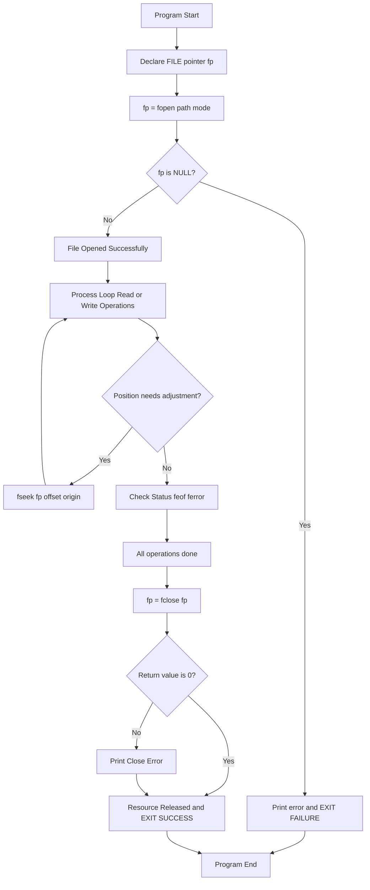
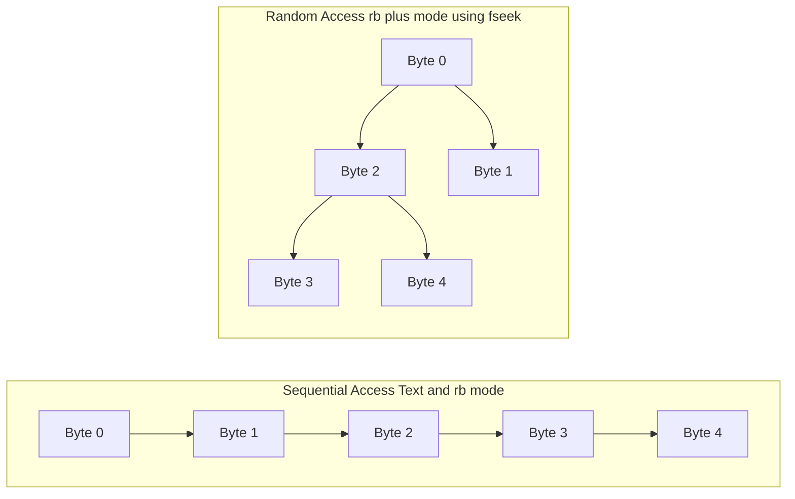
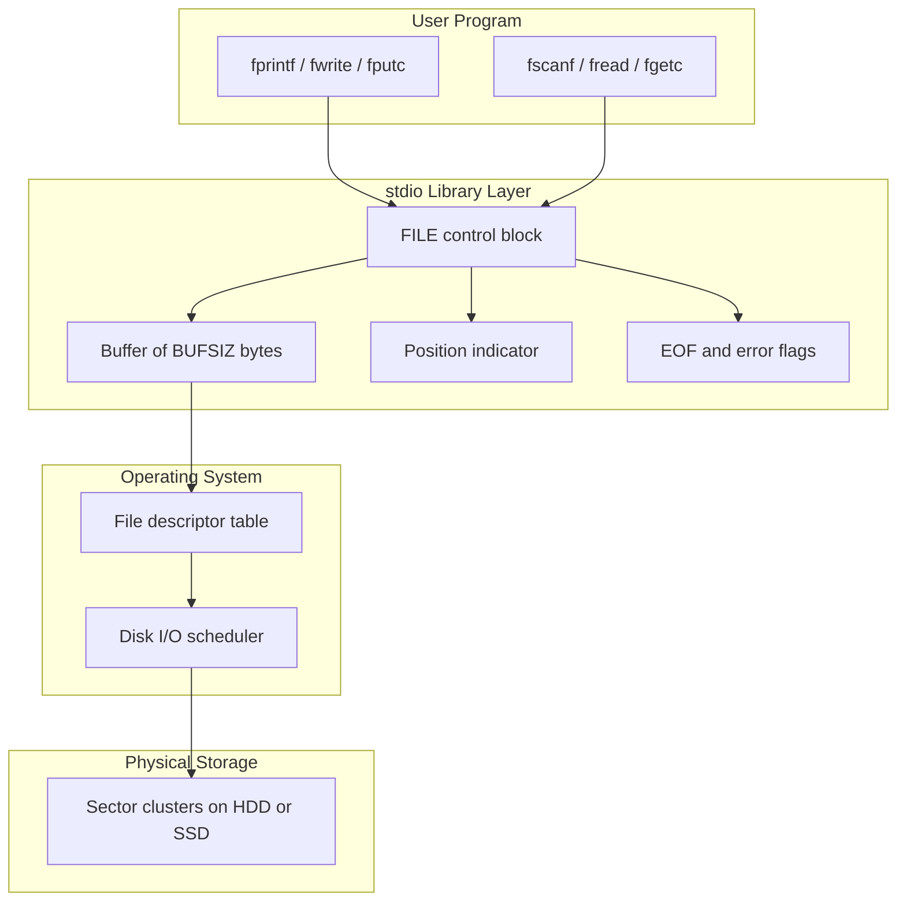
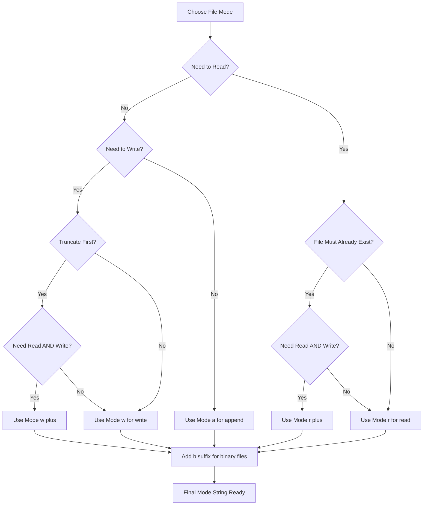

# File Management: Core file types, code syntax for opening, processing, modifying, and closing files

<!-- SECTION_1_START -->

# File Management in C — Core Types, Opening, Processing, Modifying & Closing

## 1.1 Formal Academic Definition

In the **C Programming Language (ISO/IEC 9899:2011)**, a *file* is an abstract logical stream of bytes that provides persistent storage on a secondary memory device (Hard Disk, SSD, USB). The C standard library, declared in **`<stdio.h>`**, models a file as a sequential data structure abstracted by an opaque pointer of type **`FILE *`**, internally maintained by an `I/O` buffer in the user-space **File Control Block (FCB)** of the operating system.

> [!IMPORTANT]
> **KTU 2024 — Syllabus Definition (Verbatim Tone):**
> A file is a named collection of information stored on secondary storage, accessed through a stream interface in C. The compiler introduces a special pointer variable of type `FILE` (defined in `stdio.h`) to perform all file operations. This pointer is called the **File Pointer** and is the *handle* used to identify and manipulate a file.

## 1.2 Conceptual Analogy & Intuition

Imagine a **large warehouse** with thousands of identical cardboard boxes stacked on long conveyor belts.

| Warehouse Concept | Equivalent in C File System |
|---|---|
| The **Warehouse Manager** | Operating System Kernel (File System Driver) |
| A specific **box being processed** | The `FILE *` pointer (handle) |
| **Opening the warehouse gate** | `fopen()` — requests access from the OS |
| **A delivery manifest** | The data buffer inside the FILE structure |
| **Closing and locking the gate** | `fclose()` — flushes buffer, releases resource |
| **Reorganizing boxes mid-belt** | `fseek()` / `fseek()` — random access positioning |
| **Reading the manifest** | `fscanf()`, `fgets()`, `fread()` |
| **Writing a new manifest** | `fprintf()`, `fputs()`, `fwrite()` |

> [!NOTE]
> **Critical Beginner Insight:** A `FILE` is *not* the file on your hard disk. A `FILE` is a small in-memory **control block** (managed by the OS) that *describes* the file. The pointer to this block is what your C program manipulates.

## 1.3 The Two Core File Types in C

C recognizes exactly **two** fundamental file encodings, declared by the *mode string* in `fopen()`.

### 1.3.1 Text Files
- Stream of characters organized into **lines** (`'\n'`).
- On read, the OS may translate carriage-return/line-feed pairs.
- On write, control characters may be translated for the host OS.
- Visible in a text editor; human-readable.
- **Examples:** `.txt`, `.c`, `.csv`, `.html`.

### 1.3.2 Binary Files
- Stream of raw bytes (1 byte = 8 bits = 256 values, $0 \leq \text{byte} \leq 255$).
- No translation of line endings; the byte sequence is preserved bit-for-bit.
- Used for compact storage of structured records (e.g., `struct` dumps, images, audio).
- **Examples:** `.exe`, `.jpg`, `.mp3`, `.dat`, `.bin`.

> [!TIP]
> **Binary vs Text — The Layman Test:** If you can open a file in Notepad and it *makes sense as human language*, it is a **text file**. If Notepad shows scrambled glyphs and NUL bytes, it is **binary**.

## 1.4 The Standard Streams (Pre-Opened by `stdio.h`)

When a C program begins execution, the runtime pre-opens three streams automatically:

| Stream | Device | Default Direction |
|---|---|---|
| `stdin` | Keyboard | Read |
| `stdout` | Console (Monitor) | Write |
| `stderr` | Console (Monitor) | Write (Unbuffered, for errors) |

> [!VISUALIZATION CONTROL]
> **Concept:** Memory layout of a `FILE` structure pointer connecting user code to the disk.
>
> **Conceptual Block Layout (Stack → Heap → Disk):**
> - Layer 1 (Stack): `FILE *fp;` → contains the *address* 0x7FFE4A.
> - Layer 2 (Heap/Static): `FILE` structure at 0x55A2B0 → contains buffer pointer, position indicator, error flag, EOF flag.
> - Layer 3 (Kernel FCB): Maintained by OS.
> - Layer 4 (Physical Disk): Sector clusters on HDD/SSD.
>
> **Visual Description:** The student should picture the `FILE *` as a *thread* that stitches the program variable to a *sliding buffer*, which is itself synchronized with the *actual disk sectors* by the OS. Every read/write call moves a virtual "read/write head" across this thread.

<!-- SECTION_1_END -->

<!-- SECTION_2_START -->

# Deep Theoretical Analysis & KTU High-Yield Formula Sheet

## 2.1 The File Lifecycle (Five-Stage Operational Model)

Every file operation in C strictly follows the **OPMCC** model:

1. **O**pen → Declare a `FILE *` and call `fopen()`.
2. **P**rocess → Read/Write/Modify using stream functions.
3. **M**odify Position → Use `fseek()`, `ftell()`, `rewind()` for random access.
4. **C**heck Status → Test `feof()`, `ferror()` to detect termination/failure.
5. **C**lose → Call `fclose()` to flush the buffer and release the handle.

> [!IMPORTANT]
> **Forgetting Step 5 is the #1 cause of data loss in C programs.** Data written to a `FILE` is *not* immediately on the disk; it sits in a buffer until `fclose()` (or `fflush()`) is invoked.

## 2.2 KTU Formula Sheet — File Opening Modes

The `fopen()` function takes **two arguments**: a filename and a **mode string**. The mode string is a *bitwise composition* of capability flags.

$$
\text{mode} = \text{base\_char} \, [ \, \text{plus\_flag} \, ] \, [ \, \text{type\_flag} \, ]
$$

| Mode String | Action on File (if exists) | Action on File (if missing) | Pointer Position | Stream Type |
|---|---|---|---|---|
| `"r"` | Open for reading | **Failure** — `fopen()` returns `NULL` | Beginning | Text |
| `"w"` | **Truncate to zero** | Create new | Beginning | Text |
| `"a"` | Append — write at end | Create new | End | Text |
| `"r+"` | Open for read & write | **Failure** | Beginning | Text |
| `"w+"` | Truncate, open for R/W | Create new | Beginning | Text |
| `"a+"` | Open for R/W (read anywhere, write at end) | Create new | End (for writes) | Text |
| `"rb"` | Open for reading | **Failure** | Beginning | **Binary** |
| `"wb"` | **Truncate to zero** | Create new | Beginning | **Binary** |
| `"ab"` | Append bytes | Create new | End | **Binary** |
| `"rb+"` or `"r+b"` | Open for R/W | **Failure** | Beginning | **Binary** |
| `"wb+"` or `"w+b"` | Truncate, R/W | Create new | Beginning | **Binary** |
| `"ab+"` or `"a+b"` | R/W with append semantics | Create new | End (for writes) | **Binary** |

> [!NOTE]
> The `+` flag adds *both* read and write capabilities to the base mode. It is **not** exclusive — it *combines* the operations.

## 2.3 KTU Formula Sheet — File I/O Function Reference

| Function | Header | Return Type | Purpose | Syntax |
|---|---|---|---|---|
| `fopen` | `stdio.h` | `FILE *` | Open a file | `FILE *fp = fopen(path, mode);` |
| `fclose` | `stdio.h` | `int` | Flush and close | `int fclose(FILE *fp);` |
| `fprintf` | `stdio.h` | `int` | Formatted write | `fprintf(fp, "Hi %d", x);` |
| `fscanf` | `stdio.h` | `int` | Formatted read | `fscanf(fp, "%d", &x);` |
| `fputc` | `stdio.h` | `int` | Write one char | `fputc(ch, fp);` |
| `fgetc` | `stdio.h` | `int` | Read one char | `ch = fgetc(fp);` |
| `fputs` | `stdio.h` | `int` | Write a string | `fputs(str, fp);` |
| `fgets` | `stdio.h` | `char *` | Read a line | `fgets(buf, n, fp);` |
| `fread` | `stdio.h` | `size_t` | Read raw block | `fread(ptr, size, n, fp);` |
| `fwrite` | `stdio.h` | `size_t` | Write raw block | `fwrite(ptr, size, n, fp);` |
| `fseek` | `stdio.h` | `int` | Reposition cursor | `fseek(fp, offset, origin);` |
| `ftell` | `stdio.h` | `long` | Tell position | `pos = ftell(fp);` |
| `rewind` | `stdio.h` | `void` | Reset to start | `rewind(fp);` |
| `feof` | `stdio.h` | `int` | Test EOF flag | `if (feof(fp)) ...` |
| `ferror` | `stdio.h` | `int` | Test error flag | `if (ferror(fp)) ...` |
| `fflush` | `stdio.h` | `int` | Flush buffer | `fflush(fp);` |

## 2.4 The Three SEEK Origins for `fseek()`

| Symbolic Constant | Numeric Value | Meaning |
|---|---|---|
| `SEEK_SET` | `0` | Beginning of file |
| `SEEK_CUR` | `1` | Current position indicator |
| `SEEK_END` | `2` | End of file |

> [!TIP]
> **Engineering Utility:** Random-access binary files are the foundation of **database engines**, **operating system kernels** (memory-mapped executables), and **embedded firmware updaters**. Mastery of `fseek()` is therefore not academic — it is industry-critical.

## 2.5 Why a Buffer Exists — The Performance Rationale

Each physical disk access costs $\approx 10^{-3}\,\text{seconds}$. If a program reads 1000 bytes one at a time, the naïve cost is $1000 \times 10^{-3}\,\text{s} = 1\,\text{second}$. With an in-memory buffer of **BUFSIZ** (typically 8192 bytes), the cost becomes:

$$
T_{\text{buffered}} = \frac{1000}{8192} \times 10^{-3}\,\text{s} \approx 1.22 \times 10^{-4}\,\text{s}
$$

$$
\text{Speedup Factor} = \frac{T_{\text{naïve}}}{T_{\text{buffered}}} \approx 8192
$$

This is why **`fclose()` is mandatory**: it forces the partially-filled buffer to disk, preventing data loss on program crashes.

<!-- SECTION_2_END -->

<!-- SECTION_3_START -->

# Step-by-Step Derivations, Syntax Walkthroughs & Code Implementation

## 3.1 Operational Step 1 — Opening a File (`fopen`)

### Syntax
```c
FILE *fopen(const char *filename, const char *mode);
```

### Walkthrough
1. The runtime allocates a `FILE` control block in the heap.
2. The OS opens (or creates) the file using the mode semantics.
3. A pointer to the control block is returned.
4. On failure, **`NULL`** is returned and `errno` is set (e.g., `ENOENT` if file not found in `"r"` mode).

> [!IMPORTANT]
> **Always test the return value of `fopen()` against `NULL`**. Skipping this check is the most common reason for *segmentation faults* in student programs.

## 3.2 Operational Step 2 — Processing: Writing Text

```c
#include <stdio.h>
#include <stdlib.h>

int main(void) {
    FILE *fp = fopen("students.txt", "w");
    if (fp == NULL) {
        perror("Error opening file");
        return EXIT_FAILURE;
    }

    /* fprintf — formatted write analogous to printf */
    fprintf(fp, "RollNo  Name        Marks\n");
    fprintf(fp, "%-7d  %-11s  %6.2f\n", 101, "Anand", 89.50);
    fprintf(fp, "%-7d  %-11s  %6.2f\n", 102, "Beena",  76.25);

    /* fputc — single character write */
    fputc('\n', fp);
    fputc('E', fp);
    fputc('O', fp);
    fputc('F', fp);

    /* fputs — string write (no automatic newline, unlike puts) */
    fputs("\nWritten successfully.\n", fp);

    if (fclose(fp) == EOF) {
        perror("Error closing file");
        return EXIT_FAILURE;
    }
    return EXIT_SUCCESS;
}
```

### Line-by-Line Valuation Logic
| Line | What the Examiner Awards |
|---|---|
| `#include <stdio.h>` | 1 Mark — Header inclusion |
| `FILE *fp = fopen(...)` | 2 Marks — Correct function and mode |
| `if (fp == NULL)` | 1 Mark — Error check (mandatory) |
| `fprintf(...)` with format specifier | 2 Marks — Correct format string |
| `fputc(...)` | 1 Mark — Single-char function |
| `fputs(...)` | 1 Mark — String function |
| `fclose(fp)` | 2 Marks — Closing & return check |

## 3.3 Operational Step 3 — Processing: Reading Text

```c
#include <stdio.h>
#include <stdlib.h>

int main(void) {
    FILE *fp = fopen("students.txt", "r");
    if (fp == NULL) {
        perror("Error opening file");
        return EXIT_FAILURE;
    }

    char buffer[256];

    /* fgets — reads up to n-1 chars OR until newline OR until EOF */
    printf("--- File Contents ---\n");
    while (fgets(buffer, sizeof(buffer), fp) != NULL) {
        printf("%s", buffer);   /* fgets keeps the '\n' */
    }

    /* feof — test the EOF indicator */
    if (feof(fp)) {
        printf("\n[End-of-file reached successfully]\n");
    } else if (ferror(fp)) {
        perror("Read error");
    }

    fclose(fp);
    return EXIT_SUCCESS;
}
```

> [!WARNING]
> **Common Mistake:** Using `feof()` to *control* a loop (`while (!feof(fp))`) is **incorrect** in C. The `feof()` flag becomes true *only after* a failed read. The correct pattern is to test the **return value of the read function itself** (as shown above using `fgets() != NULL`).

## 3.4 Operational Step 4 — Reading a File Character by Character

```c
#include <stdio.h>
#include <ctype.h>

int main(void) {
    FILE *fp = fopen("source.txt", "r");
    if (fp == NULL) { return 1; }

    int ch;                       /* MUST be int, not char, to hold EOF */
    long letterCount = 0L;
    long digitCount  = 0L;
    long spaceCount  = 0L;

    while ((ch = fgetc(fp)) != EOF) {
        if (isalpha(ch))  letterCount++;
        else if (isdigit(ch)) digitCount++;
        else if (isspace(ch)) spaceCount++;
    }

    printf("Letters : %ld\n", letterCount);
    printf("Digits  : %ld\n", digitCount);
    printf("Spaces  : %ld\n", spaceCount);

    fclose(fp);
    return 0;
}
```

### Why `int ch` and not `char ch`?
`EOF` is defined as $-1$ (i.e., bit pattern `0xFFFFFFFF` on 32-bit `int`). A `char` cannot hold this value because its valid range is $0 \leq \text{char} \leq 255$ (or $-128$ to $127$ if signed). Hence the variable must be of type **`int`**.

## 3.5 Operational Step 5 — Processing: Binary Block I/O (`fread` / `fwrite`)

```c
#include <stdio.h>
#include <stdlib.h>
#include <string.h>

typedef struct {
    int   rollNo;
    char  name[32];
    float marks;
} Student;

int main(void) {
    Student batch[3] = {
        {101, "Anand", 89.5f},
        {102, "Beena", 76.25f},
        {103, "Cyril", 92.0f}
    };

    /* WRITE the array as one binary block */
    FILE *out = fopen("batch.dat", "wb");
    if (out == NULL) { perror("wb"); return 1; }
    size_t written = fwrite(batch, sizeof(Student), 3, out);
    printf("Records written: %zu (expected: 3)\n", written);
    fclose(out);

    /* READ the array back */
    FILE *in = fopen("batch.dat", "rb");
    if (in == NULL) { perror("rb"); return 1; }
    Student recovered[3];
    size_t read = fread(recovered, sizeof(Student), 3, in);
    printf("Records read   : %zu\n", read);

    for (size_t i = 0; i < read; ++i) {
        printf("%4d  %-32s  %6.2f\n",
               recovered[i].rollNo, recovered[i].name, recovered[i].marks);
    }
    fclose(in);
    return 0;
}
```

### Expected Output
```
Records written: 3 (expected: 3)
Records read   : 3
 101  Anand                              89.50
 102  Beena                              76.25
 103  Cyril                              92.00
```

> [!IMPORTANT]
> **The file size on disk is now exactly**:
> $$ \text{Size} = 3 \times \text{sizeof}(\text{Student}) = 3 \times (4 + 32 + 4) = 3 \times 40 = 120 \text{ bytes} $$
> This is dramatically smaller and faster than writing 3 lines of text. Binary files are the standard for high-performance I/O.

## 3.6 Operational Step 6 — Modifying (Random Access with `fseek` / `ftell` / `rewind`)

```c
#include <stdio.h>

typedef struct {
    int   rollNo;
    char  name[32];
    float marks;
} Student;

int updateMarks(const char *path, int targetRoll, float newMarks) {
    FILE *fp = fopen(path, "rb+");     /* MUST be rb+ for R/W on binary */
    if (fp == NULL) { perror("rb+"); return -1; }

    Student s;
    long recordSize = (long)sizeof(Student);
    long offset     = 0L;

    /* Locate the record */
    while (fread(&s, sizeof(Student), 1, fp) == 1) {
        if (s.rollNo == targetRoll) {
            /* Step back by one record size to overwrite */
            fseek(fp, -recordSize, SEEK_CUR);
            s.marks = newMarks;
            fwrite(&s, sizeof(Student), 1, fp);
            fclose(fp);
            return 0;   /* Success */
        }
    }

    fclose(fp);
    return 1;           /* Not found */
}

int main(void) {
    int rc = updateMarks("batch.dat", 102, 95.75f);
    printf(rc == 0 ? "Update successful.\n" : "Roll number not found.\n");
    return 0;
}
```

### Key Insight — Why `-recordSize, SEEK_CUR`?
After `fread()` consumes one record, the position indicator has advanced **past** it. To overwrite the *current* record, we must rewind by one record size. This is the canonical "in-place update" pattern.

> [!NOTE]
> **Position reporting with `ftell`:**
> ```c
> long pos = ftell(fp);
> printf("Current byte offset: %ld\n", pos);
> ```
> `ftell` returns the *current* offset from the start of the file.

### Quick Demo — Jumping to Specific Records
```c
/* Jump to the 3rd record (0-indexed → offset = 2 * sizeof(Student)) */
fseek(fp, 2L * (long)sizeof(Student), SEEK_SET);
fread(&s, sizeof(Student), 1, fp);
printf("Record 3 → %d  %s  %.2f\n", s.rollNo, s.name, s.marks);

/* Rewind to the start for sequential re-read */
rewind(fp);
```

## 3.7 Operational Step 7 — Closing a File (`fclose`)

```c
int fclose(FILE *stream);
```

| Return | Meaning |
|---|---|
| `0` | Success — buffer flushed, OS resource released |
| `EOF` | Failure (e.g., disk full, I/O error) — error code set |

> [!IMPORTANT]
> **Rule of Robustness:** Always check the return value of `fclose()`. A failed close often means **data was silently lost** despite the program appearing to work correctly.

## 3.8 The Complete Boilerplate Template (Exam-Ready)

```c
#include <stdio.h>
#include <stdlib.h>

int main(void) {
    FILE *fp = fopen("data.txt", "r");   /* STEP 1: OPEN */
    if (fp == NULL) {
        perror("fopen");
        return EXIT_FAILURE;
    }

    /* ... STEP 2-4: PROCESS / MODIFY / CHECK ... */
    int x;
    while (fscanf(fp, "%d", &x) == 1) {
        printf("%d\n", x);
    }

    if (ferror(fp)) perror("Read error");

    if (fclose(fp) != 0) {                /* STEP 5: CLOSE */
        perror("fclose");
        return EXIT_FAILURE;
    }
    return EXIT_SUCCESS;
}
```

<!-- SECTION_3_END -->

<!-- SECTION_4_START -->

# Structural Diagrams & Schematics

## 4.1 Master Flowchart — The OPMCC File Lifecycle



## 4.2 Sequential vs Random Access Topology



## 4.3 Buffered I/O Architecture



## 4.4 Mode String Decision Matrix



<!-- SECTION_4_END -->

<!-- SECTION_5_START -->

# KTU 2024 Scheme Examination Question Bank & Topic Recap

---

## 5.1 Part A — Short Answer Questions (3 Marks Each)

### Question 1 (3 Marks) `[KTU University Exam - July 2024]`
**Differentiate between text files and binary files in C. Mention the mode strings used to open each.**

**Model Answer (Valuation Key):**

| # | Evaluation Point | Marks |
|---|---|---|
| 1 | Text files store data as **ASCII/Unicode characters**; binary files store data as **raw bytes** in the same internal representation as memory. | 1 |
| 2 | Text mode may perform **CR/LF translation**; binary mode performs **no translation**, preserving bit-level integrity. | 1 |
| 3 | Text mode: `"r"`, `"w"`, `"a"`, `"r+"`, `"w+"`, `"a+"`; Binary mode: prepend `"b"` → `"rb"`, `"wb"`, `"ab"`, `"rb+"`, `"wb+"`, `"ab+"`. | 1 |

---

### Question 2 (3 Marks) `[KTU University Exam - Dec 2023]`
**What is a file pointer? How is it declared? Why must `fopen()`'s return value be checked against `NULL`?**

**Model Answer (Valuation Key):**

| # | Evaluation Point | Marks |
|---|---|---|
| 1 | A **file pointer** is a pointer variable of type `FILE *` that refers to a `FILE` control block allocated in memory by `stdio.h`; it is the *handle* used for all I/O operations. | 1 |
| 2 | Declaration: `FILE *fp;` (must include `<stdio.h>`). | 1 |
| 3 | If `fopen()` fails (e.g., file not found in `"r"` mode, permission denied, disk full), it returns `NULL`. Dereferencing `NULL` causes a **segmentation fault**. The check `if (fp == NULL)` prevents this. | 1 |

---

## 5.2 Part B — Module Internal Choice (14 Marks Each)

### Question A — 14 Marks `[KTU University Exam - July 2024, Module 4]`

**(a) [7 Marks]** Explain the different file opening modes in C with the help of a suitable table. Discuss the role of the `+` and `b` qualifiers.

**(b) [7 Marks]** Write a complete C program to read the contents of a text file `input.txt` and count the number of **lines**, **words**, and **characters** present in it. Display the counts on the screen.

---

#### Part (a) Model Solution (7 Marks)

**Mode String Table — Marking Key:**

| Component | Marks Awarded | Content Required |
|---|---|---|
| Base modes `"r"`, `"w"`, `"a"` | 2 Marks | Definition of each, position of pointer, behavior on existing/missing file |
| Compound modes `"r+"`, `"w+"`, `"a+"` | 2 Marks | Read+Write capability, position rules, error/failure cases |
| Binary `"b"` qualifier | 1 Mark | Purpose: prevent OS translation; mode is appended as `"rb"`, `"wb"`, etc. |
| Practical examples | 2 Marks | At least two real-world mode combinations (e.g., `"rb+"` for updating a database) |

**Role of `+` qualifier:** Adds the missing capability — `"r"` becomes read+write, `"w"` becomes write+read (after truncate), `"a"` becomes read+write (write still appends).

**Role of `b` qualifier:** Disables newline and end-of-file translations; required for portability across Windows/Unix when reading/writing non-text data.

---

#### Part (b) Model Solution (7 Marks)

```c
#include <stdio.h>
#include <stdlib.h>
#include <ctype.h>
#include <string.h>

int main(void) {
    FILE *fp = fopen("input.txt", "r");
    if (fp == NULL) {
        perror("Error opening input.txt");
        return EXIT_FAILURE;
    }

    long lineCount   = 0L;
    long wordCount   = 0L;
    long charCount   = 0L;
    int  inWord      = 0;
    int  ch;

    while ((ch = fgetc(fp)) != EOF) {
        charCount++;

        if (ch == '\n')
            lineCount++;

        if (isspace(ch))
            inWord = 0;
        else if (inWord == 0) {
            inWord = 1;
            wordCount++;
        }
    }

    /* Handle the case where the file does not end with a newline */
    if (charCount > 0 && inWord == 1)
        lineCount++;

    printf("Lines      : %ld\n", lineCount);
    printf("Words      : %ld\n", wordCount);
    printf("Characters : %ld\n", charCount);

    fclose(fp);
    return EXIT_SUCCESS;
}
```

**Incremental Valuation Key (Sub-part b):**

| Step | Marks | Examiner Check |
|---|---|---|
| Header inclusions (`stdio.h`, `ctype.h`, etc.) | 0.5 | — |
| `fopen()` with `"r"` and `NULL` check | 1.0 | Mode string correct, error handling present |
| Variable declarations (`long` counters, `int ch`, flag) | 0.5 | Correct types |
| Main loop using `fgetc() != EOF` | 1.5 | `ch` is `int`, loop terminates on `EOF` |
| Character counting logic | 0.5 | Increments correctly |
| Word counting using `inWord` flag | 1.5 | Two-line state machine correct |
| Line counting (`'\n'` and edge case) | 1.0 | Edge case for missing trailing newline |
| Output `printf()` block | 0.5 | All three counts printed with labels |
| `fclose(fp)` | 0.5 | Mandatory close |
| **Total** | **7.0** | — |

---

### Question B — 14 Marks (Alternative Choice) `[KTU University Exam - Dec 2023, Module 4]`

**(a) [7 Marks]** Explain the functions `fseek()`, `ftell()`, and `rewind()` with examples. How do these functions enable random access in binary files?

**(b) [7 Marks]** Write a C program to accept employee records (`emp_id`, `name`, `salary`) from the user, store them in a binary file `emp.dat`, and then display all records whose salary is greater than a threshold entered by the user.

---

#### Part (a) Model Solution (7 Marks)

**1. `fseek()` — Reposition the file indicator** `[2 Marks]`

```c
int fseek(FILE *fp, long offset, int origin);
```

- `origin` can be `SEEK_SET` (0, beginning), `SEEK_CUR` (1, current), or `SEEK_END` (2, end).
- Example: Jump to the 5th byte from the start:
  ```c
  fseek(fp, 5L, SEEK_SET);
  ```
- Example: Skip backward 1 record of size 40:
  ```c
  fseek(fp, -40L, SEEK_CUR);
  ```

**2. `ftell()` — Report current position** `[2 Marks]`

```c
long ftell(FILE *fp);
```

- Returns the byte offset from the beginning of the file.
- Returns `-1L` on error.
- Example:
  ```c
  long pos = ftell(fp);
  printf("Current offset = %ld\n", pos);
  ```

**3. `rewind()` — Reset to beginning** `[1 Mark]`

```c
void rewind(FILE *fp);
```

- Equivalent to `fseek(fp, 0L, SEEK_SET); clearerr(fp);` in one call.
- Useful for restarting sequential reads without re-opening the file.

**4. Random Access Demonstration** `[2 Marks]`

```c
/* In-place update of the 3rd record in a binary file */
typedef struct { int id; float sal; } Emp;

FILE *fp = fopen("emp.dat", "rb+");
fseek(fp, 2L * sizeof(Emp), SEEK_SET);    /* jump to 3rd record */
Emp e;
fread(&e, sizeof(Emp), 1, fp);
e.sal *= 1.10f;                            /* 10% raise */
fseek(fp, -1L * (long)sizeof(Emp), SEEK_CUR); /* step back */
fwrite(&e, sizeof(Emp), 1, fp);
fclose(fp);
```

---

#### Part (b) Model Solution (7 Marks)

```c
#include <stdio.h>
#include <stdlib.h>
#include <string.h>

typedef struct {
    int   emp_id;
    char  name[32];
    float salary;
} Employee;

int main(void) {
    Employee e;
    int n;
    float threshold;

    /* ---- WRITE phase ---- */
    FILE *fp = fopen("emp.dat", "wb");
    if (fp == NULL) { perror("wb"); return 1; }

    printf("Enter number of employees: ");
    if (scanf("%d", &n) != 1) return 1;

    for (int i = 0; i < n; ++i) {
        printf("\nEmployee %d\n", i + 1);
        printf("  ID     : "); scanf("%d", &e.emp_id);
        printf("  Name   : "); scanf("%31s", e.name);
        printf("  Salary : "); scanf("%f", &e.salary);
        fwrite(&e, sizeof(Employee), 1, fp);
    }
    fclose(fp);

    /* ---- FILTER phase ---- */
    fp = fopen("emp.dat", "rb");
    if (fp == NULL) { perror("rb"); return 1; }

    printf("\nEnter salary threshold: ");
    if (scanf("%f", &threshold) != 1) { fclose(fp); return 1; }

    printf("\n--- Employees with salary > %.2f ---\n", threshold);
    printf("%-8s  %-32s  %s\n", "ID", "Name", "Salary");
    printf("------------------------------------------------\n");

    while (fread(&e, sizeof(Employee), 1, fp) == 1) {
        if (e.salary > threshold) {
            printf("%-8d  %-32s  %8.2f\n", e.emp_id, e.name, e.salary);
        }
    }
    fclose(fp);
    return 0;
}
```

**Incremental Valuation Key (Sub-part b):**

| Step | Marks |
|---|---|
| `struct` definition with correct fields | 0.5 |
| `fopen("emp.dat", "wb")` with `NULL` check | 1.0 |
| Loop to accept `n` employees + `fwrite()` call | 1.5 |
| Correct `fclose()` after write | 0.5 |
| Reopen with `"rb"` and `NULL` check | 0.5 |
| Threshold input from user | 0.5 |
| `while (fread() == 1)` loop with size check | 1.0 |
| Conditional filter `salary > threshold` + formatted print | 1.0 |
| Final `fclose()` | 0.5 |
| **Total** | **7.0** |

---

## 5.3 KTU Examiner's Valuation Warning / Pitfall Callout

> [!WARNING]
> **Top 5 Mark-Deduction Traps in File-Handling Questions:**
> 1. **Forgetting the `NULL` check after `fopen()`.** Examiners deduct **1 mark** flat for any program that omits the error check. Always write:
>    ```c
>    if (fp == NULL) { perror("fopen"); return 1; }
>    ```
> 2. **Using `char` instead of `int` for the return of `fgetc()`.** `char` cannot hold `EOF` (which is `-1`). This is a **1-mark deduction** in the loop declaration.
> 3. **Opening a binary file in text mode.** If a record contains the byte `0x0A` (newline), text-mode translation may corrupt it. Use `"rb"`, `"wb"`, `"rb+"` for binary data.
> 4. **Omitting `fclose()` entirely.** Any program that does not call `fclose()` at the end loses **0.5 to 1 mark** for incomplete resource management.
> 5. **Confusing `feof()` semantics.** Setting `feof()` as the *loop condition* (`while (!feof(fp))`) causes an extra erroneous iteration because the EOF flag is set *only after* a failed read. Test the **return of the read function** instead.

---

## 5.4 Topic Recap & Important Things to Remember

- A **file** is a named stream of bytes on secondary storage, abstracted in C by an opaque `FILE *` pointer to a heap-allocated control block.
- The C standard recognizes **two file types**: **text** (character-oriented, OS translation enabled) and **binary** (raw byte stream, no translation).
- **Three pre-opened streams** exist at program start: `stdin`, `stdout`, `stderr`.
- The **five-step lifecycle** is **Open → Process → Modify Position → Check Status → Close** (OPMCC).
- **`fopen()` modes** are composed as `base[+][b]`. The `+` adds the missing read/write capability; the `b` disables translation.
- Always **check the return of `fopen()`** against `NULL` before using the pointer.
- Text I/O functions: `fprintf`, `fscanf`, `fputc`, `fgetc`, `fputs`, `fgets`.
- Binary I/O functions: `fread`, `fwrite` (both use `size_t` count semantics).
- Random access uses **`fseek(fp, offset, origin)`** with `SEEK_SET`, `SEEK_CUR`, `SEEK_END`.
- `ftell()` returns the current byte offset; `rewind()` resets the indicator to byte 0.
- The variable receiving `fgetc()` **must be `int`**, never `char`, to hold `EOF`.
- Control loops by testing the **return value of the read function**, not `feof()`.
- `feof()` and `ferror()` are **post-loop diagnostic** tools, not loop drivers.
- Always call `fclose()` and check its return value to **guarantee buffer flush** to disk.
- The buffer exists for performance; data is **not on the disk** until `fclose()` (or `fflush()`) is called.
- Binary file size for `N` records of a struct = $N \times \text{sizeof}(\text{struct})$ bytes exactly.
- The classic **in-place update** pattern requires `fseek(fp, -recordSize, SEEK_CUR)` after a `fread()` before the `fwrite()`.

<!-- SECTION_5_END -->
