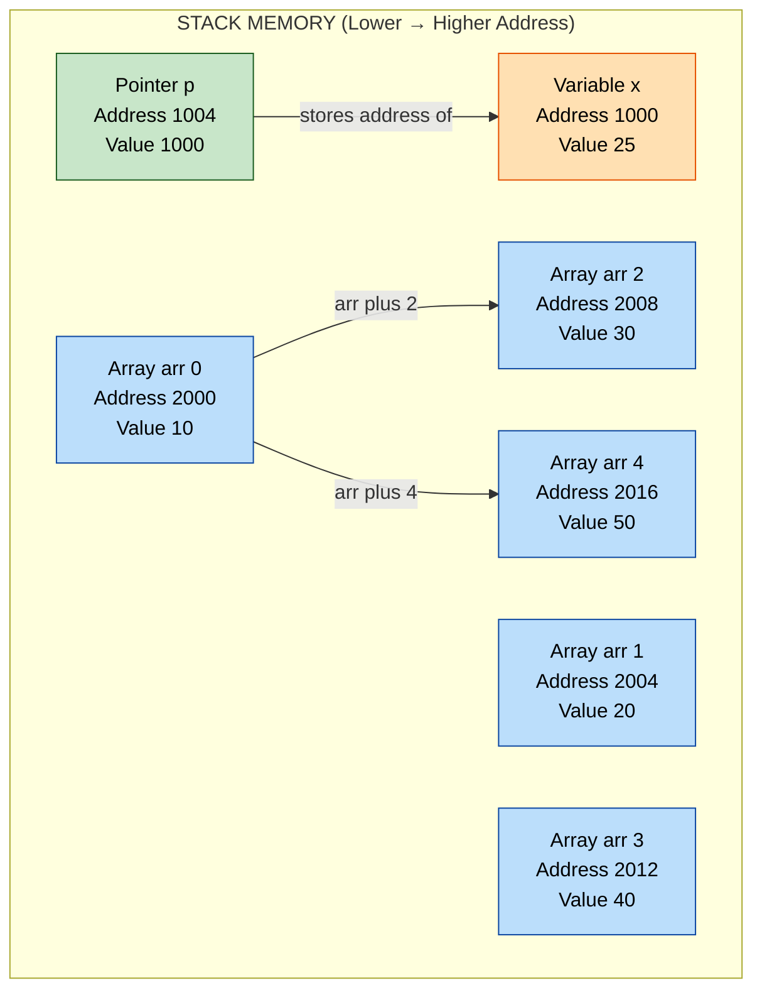
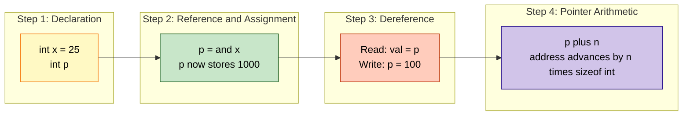
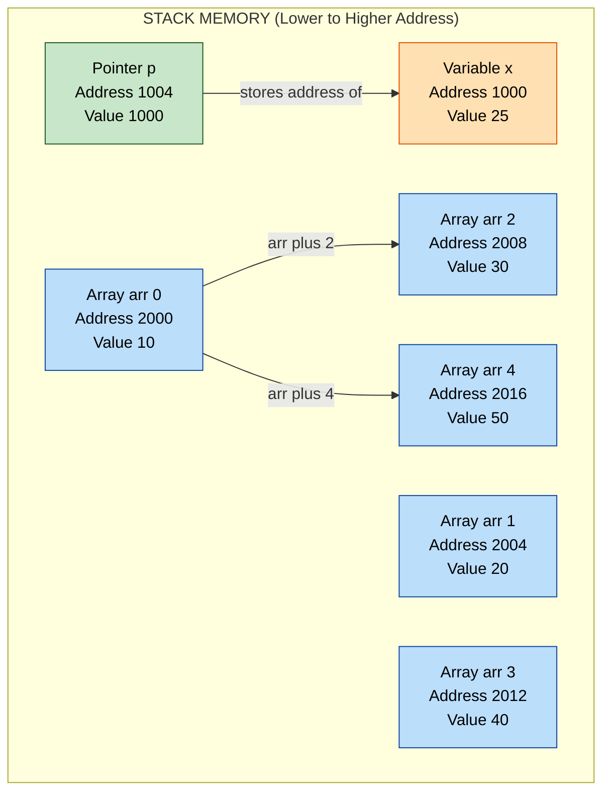

# Pointers: Declarations, reference (&) and dereference (*) operations, pointer arithmetic

<!-- SECTION_1_START -->
# Module 4 — Pointers: Declarations, Reference (`&`) and Dereference (`*`) Operations, Pointer Arithmetic

## 1. Core Technical Definition & Intuitive Overview

### Formal Definition (KTU 2024 Syllabus Terminology)
A **pointer** is a derived data type in the C programming language that stores the **memory address** of another variable of a specified base type, rather than holding a direct data value. Pointers enable **indirect memory access**, **dynamic memory allocation**, and the construction of complex data structures (linked lists, trees, graphs), and they form the foundation of call-by-reference parameter passing in functions.

> [!IMPORTANT]
> **KTU 2024 Highlight:** A pointer is *not* a separate object of memory for the data — it is a *reference* to a location. The size of any pointer on a given system is constant (e.g., **8 bytes** on a 64-bit system, **4 bytes** on a 32-bit system), irrespective of the base data type it points to.

### Conceptual Analogy / Intuition
Imagine a **house** standing on a street. The *house itself* is the **variable** (the data value). The *postal address* of that house is the **pointer** (the memory address). A pointer variable doesn't *contain* the house — it *knows where the house is located*. By using the pointer, you can:
- **Find** the house (reference operation `&`).
- **Go to the house and modify what's inside** (dereference operation `*`).

### Reference (`&`) and Dereference (`*`) Operations — At a Glance

> [!NOTE]
> **Reference Operator (`&`) — "Address-Of"**
> Unary operator placed before a variable name. Returns the **starting memory address** of that variable. Cannot be applied to a register variable or a constant/expression.

> [!NOTE]
> **Dereference Operator (`*`) — "Value-At-Address"**
> Unary operator placed before a pointer variable. Goes to the memory location the pointer is storing, and either **reads** or **writes** the value at that location.

> [!WARNING]
> The asterisk `*` in `int *p;` is a **declaration** (pointer declarator). The same `*` in `*p = 10;` is a **dereference**. Context determines the role — a classic KTU viva question.

### Memory Map Visualization (Conceptual Diagram)

| Address (Hex) | Variable | Value (Decimal) | Notes |
|---------------|----------|-----------------|-------|
| `0x7FFE1000`  | `x`      | `25`            | An `int` variable occupies **4 bytes** (typical) |
| `0x7FFE1004`  | `p`      | `0x7FFE1000`    | A pointer stores `x`'s address |

- `&x` $\rightarrow$ `0x7FFE1000`
- `p`   $\rightarrow$ `0x7FFE1000`
- `*p`  $\rightarrow$ `25` (the value at the address)

> [!VISUALIZATION CONTROL]
> **Concept:** Linear memory cell representation for an `int` variable and a pointer
> **GeoGebra / Desmos Input Equations:**
> * `x = 25` (data point on the data axis)
> * `P = 1000` (address point on the address axis)
> * `Arrow from P to x` (visualizing the indirection)
> **Visual Description:** Two parallel horizontal lines. The lower (data) line marks value `25`. The upper (address) line marks `1000`. A vertical arrow connects `1000` to `25`, illustrating that the pointer stores the address that *resolves to* the value.

### Real-World Engineering Relevance
Pointers are not academic curiosities — they are the **backbone of systems programming**:

- **Embedded Systems (KTU Kerala Industry Context):** Direct hardware register access in microcontrollers (e.g., `volatile uint32_t *GPIOA_MODER = (uint32_t *)0x40020000;`).
- **Operating Systems:** Kernel memory management, virtual-to-physical address translation, page tables.
- **Compilers and Interpreters:** Symbol tables, AST traversal, garbage collection.
- **High-Performance Computing:** Avoiding expensive data copies when passing large structures to functions.
- **Data Structures:** Linked lists, trees, hash maps — none exist without pointers.

---

## 2. Deep Theoretical Analysis & KTU High-Yield Formula Sheet

### 2.1 Pointer Declaration Syntax

```
data_type * pointer_name;
```

- `data_type` — the **base type** of the variable the pointer will point to. It determines how the compiler interprets memory during pointer arithmetic and dereferencing.
- `*` — pointer declarator (binds to the variable, not the type).
- `pointer_name` — a valid C identifier.

**Multiple Declarations Trap (High-Frequency KTU Mistake):**

```c
int* a, b, c;     // a is int* ; b and c are int  (only 'a' is a pointer)
int *a, *b, *c;   // All three are int pointers
```

### 2.2 Reference Operator (`&`) — Operational Logic

1. Evaluates the **lvalue** of the operand (the variable must be modifiable, with a memory location).
2. Returns a value of type `type *` (pointer to the operand's type).
3. **Cannot** be applied to:
   - Register variables (`register int x;` — may have no address)
   - Bit-fields
   - Constants or expressions (e.g., `&10`, `&(a+b)` — illegal)

### 2.3 Dereference Operator (`*`) — Operational Logic

1. Treats the operand as an address (a pointer expression).
2. Accesses the memory location at that address.
3. Returns an **lvalue** of the base type — meaning it can appear on the **left** side of an assignment: `*p = 50;` is valid.

### 2.4 Pointer Arithmetic — The Five Legal Operations

When `p` is a pointer of type `T *`, the following are **the only legal arithmetic operations** in standard C:

| Operation | Description | Effect on Address (Bytes) |
|-----------|-------------|---------------------------|
| `p + n`   | Forward shift by `n` elements | Address increases by `n * sizeof(T)` |
| `p - n`   | Backward shift by `n` elements | Address decreases by `n * sizeof(T)` |
| `p++`     | Post-increment by 1 element | Address increases by `sizeof(T)` |
| `p--`     | Post-decrement by 1 element | Address decreases by `sizeof(T)` |
| `p2 - p1` | Pointer subtraction (both same type) | Returns `ptrdiff_t` (number of elements between) |

> [!IMPORTANT]
> **Critical Rule (KTU Board Hot-Spot):** Pointer arithmetic is **scale-aware**. Adding `1` to an `int *` advances by `4` bytes (assuming 32-bit `int`), but adding `1` to a `double *` advances by `8` bytes. The compiler computes the displacement using the formula: 
> $$\text{new\_address} = \text{old\_address} + n \times \text{sizeof}(\text{base\_type})$$

**Illegal Pointer Arithmetic:**
- Addition of two pointers (`p1 + p2`) — meaningless, compiler error.
- Multiplication or division of a pointer.
- Adding a `float`/`double` to a pointer (only integral types allowed).

### 2.5 KTU Formula Sheet / Cheat Sheet

| # | Concept | Formula / Rule | Unit / Type | Example |
|---|---------|----------------|-------------|---------|
| 1 | Pointer size on `n`-bit system | $\text{size} = \dfrac{n}{8}$ | bytes | **8 bytes** on 64-bit |
| 2 | Address arithmetic | $\text{new\_addr} = \text{old\_addr} + n \times \text{sizeof}(T)$ | bytes | `int *p; p+2` $\rightarrow$ +8 bytes |
| 3 | Pointer subtraction | $p_2 - p_1 = \dfrac{\text{byte\_diff}}{\text{sizeof}(T)}$ | elements (`ptrdiff_t`) | Returns 3 if 3 `int`s apart |
| 4 | Reference operator | `&var` | `T *` | `&x` returns address of `x` |
| 5 | Dereference operator | `*ptr` | `T` | `*p` gives value at stored address |
| 6 | NULL check | `ptr == NULL` | Boolean | Always check before dereferencing |
| 7 | Void pointer size | $\text{sizeof}(\text{void} *) = \text{sizeof}(\text{any pointer})$ | bytes | Universal pointer — needs cast |
| 8 | Generic pointer indexing | `*(T *)ptr + offset` | bytes | Required for `void *` arithmetic |

### 2.6 Engineering Utility Summary

| Application Domain | Why Pointers Are Used | Concrete Use-Case |
|--------------------|-----------------------|-------------------|
| Embedded Firmware | Direct memory-mapped I/O | Setting GPIO pin state via register pointer |
| OS Kernels | Page table management | Walking multi-level page tables |
| Image Processing | Zero-copy pixel access | Iterating pixel buffers with pointer arithmetic |
| Database Engines | In-place B-tree updates | Node pointer manipulation |
| Network Stacks | Zero-copy packet handling | DMA buffer pointer handoff |

---

## 3. Step-by-Step Derivations & Code/Symbolic Implementation

### 3.1 Symbolic Derivation: How Pointer Arithmetic Works Internally

Let a pointer `p` of type `int *` hold the value $\text{addr} = 0x1000$. Assume $\text{sizeof}(\text{int}) = 4$ bytes.

**Step 1: Compute the displacement factor.**
$$
\text{scale} = \text{sizeof}(\text{int}) = 4 \text{ bytes}
$$

**Step 2: Apply arithmetic operation $p + n$ where $n = 3$.**
$$
\text{new\_addr} = \text{addr} + (n \times \text{scale})
$$
$$
\text{new\_addr} = 0x1000 + (3 \times 4) = 0x1000 + 12 = 0x1000C
$$

**Step 3: Verify by dereferencing.**
The memory layout starting at `0x1000` holds four consecutive `int`s. `p + 3` correctly points to the **fourth** element (0-indexed), with the address `0x100C`.

> [!NOTE]
> The compiler **does not** perform byte-wise addition blindly. The C standard mandates **element-wise scaling**, and the compiler emits machine code that respects the target's data alignment.

### 3.2 Fully Operational C Implementation

```c
/*
 * Program: pointer_demo.c
 * Purpose: Demonstrate pointer declaration, reference (&), 
 *          dereference (*), and pointer arithmetic.
 * Author : KTU 2024 Scheme Study Reference
 * Build  : gcc -Wall -Wextra -std=c11 pointer_demo.c -o pointer_demo
 */

#include <stdio.h>
#include <stddef.h>   // For ptrdiff_t

int main(void) {
    /* -------- Section 1: Basic Pointer Declaration -------- */
    int    x   = 25;            // A normal integer variable
    int   *p   = NULL;          // Pointer declaration, initialized to NULL
    double d   = 3.14;
    double *dp = NULL;

    p  = &x;                    // REFERENCE: &x gives the address of x
    dp = &d;                    // dp now holds the address of d

    printf("=== Section 1: Reference and Dereference ===\n");
    printf("Value of x             : %d\n",   x);
    printf("Address of x (&x)      : %p\n",   (void *)&x);
    printf("Value stored in p      : %p\n",   (void *)p);
    printf("Value at *p (dereference): %d\n", *p);

    /* -------- Section 2: Modifying via Dereference -------- */
    *p = 100;                   // DEREFERENCE on left side: writes through p
    printf("\nAfter *p = 100:\n");
    printf("Value of x             : %d\n",   x);   // x is now 100

    /* -------- Section 3: Pointer Arithmetic on an Array -------- */
    int arr[5] = {10, 20, 30, 40, 50};
    int *q = arr;               // arr decays to pointer to its first element

    printf("\n=== Section 3: Pointer Arithmetic on int Array ===\n");
    printf("Base address (q)        : %p\n", (void *)q);
    printf("q + 1 address           : %p (advanced by %zu bytes)\n",
           (void *)(q + 1), sizeof(int));
    printf("*(q + 2) = %d\n", *(q + 2));
    printf("*(q + 4) = %d\n", *(q + 4));

    /* -------- Section 4: Pointer Subtraction -------- */
    int *start = &arr[0];
    int *end   = &arr[4];
    ptrdiff_t diff = end - start;

    printf("\n=== Section 4: Pointer Subtraction ===\n");
    printf("end - start = %td elements\n", diff);   // Expected: 4

    /* -------- Section 5: Scale-Aware Arithmetic on double * -------- */
    printf("\n=== Section 5: Scale-Aware Arithmetic on double * ===\n");
    printf("dp holds address        : %p\n", (void *)dp);
    printf("dp + 1 advances by      : %zu bytes (sizeof double = %zu)\n",
           sizeof(double), sizeof(double));

    /* -------- Section 6: Illegal Operation Demonstration (Commented) -------- */
    /*
     * int *bad = p + dp;       // ERROR: pointer + pointer not allowed
     * double *bad2 = p;        // WARNING: type mismatch (compiles with cast)
     * *(p + 1.5)               // ERROR: only integral offsets allowed
     */

    return 0;
}
```

**Expected Output (addresses will vary by system):**
```
=== Section 1: Reference and Dereference ===
Value of x             : 25
Address of x (&x)      : 0x7ffd1234
Value stored in p      : 0x7ffd1234
Value at *p (dereference): 25

After *p = 100:
Value of x             : 100

=== Section 3: Pointer Arithmetic on int Array ===
Base address (q)        : 0x7ffd1240
q + 1 address           : 0x7ffd1244 (advanced by 4 bytes)
*(q + 2) = 30
*(q + 4) = 50

=== Section 4: Pointer Subtraction ===
end - start = 4 elements

=== Section 5: Scale-Aware Arithmetic on double * ===
dp holds address        : 0x7ffd1248
dp + 1 advances by      : 8 bytes (sizeof double = 8)
```

### 3.3 Step-by-Step Address Trace (for Exam Diagrams)

For `int arr[5] = {10, 20, 30, 40, 50};` with `arr` at base address `2000`:

| Expression | Evaluation | Result (Value) | Result (Address) |
|------------|-----------|----------------|------------------|
| `arr` | Base address | — | `2000` |
| `arr + 0` | $2000 + 0 \times 4$ | `10` | `2000` |
| `arr + 1` | $2000 + 1 \times 4$ | `20` | `2004` |
| `arr + 2` | $2000 + 2 \times 4$ | `30` | `2008` |
| `arr + 3` | $2000 + 3 \times 4$ | `40` | `2012` |
| `arr + 4` | $2000 + 4 \times 4$ | `50` | `2016` |
| `&arr[3] - &arr[1]` | $(2012 - 2004) \div 4$ | `2` | — |

> [!NOTE]
> The address math gives **12 bytes** between `arr[1]` and `arr[3]`, but the **pointer subtraction** gives **2 elements** — the latter is what C semantics guarantee.

---

## 4. Structural Diagrams & Schematics

### 4.1 Memory Layout Block Diagram (Mermaid)



### 4.2 Pointer Operation Flow (Mermaid)



### 4.3 Block-Level Functional Architecture: Pointer Subsystem

| Module | Responsibility | Input | Output |
|--------|---------------|-------|--------|
| **Declaration Unit** | Reserve pointer storage | `T *name` | Memory slot of `sizeof(void *)` |
| **Reference Engine** | Compute lvalue address | `&var` | `T *` typed address |
| **Dereference Engine** | Resolve pointer to value | `*ptr` | `T` value |
| **Arithmetic Unit** | Scale-aware offset | `ptr + n` | Scaled `T *` |
| **NULL Guard** | Safety check | `ptr == NULL` | Boolean status |
| **Type Cast Bridge** | `void *` conversion | `(T *)generic` | Strongly-typed pointer |

---

## 5. KTU 2024 Scheme Examination Question Bank & Topic Recap

### Part A — Short Answer Questions (3 Marks Each)

**Q1. [KTU University Exam — July 2024]**
*Distinguish between the reference operator (`&`) and the dereference operator (`*`) in C. Illustrate with a small code snippet. (CO1, Remember)*

**Model Answer (3 Marks):**

| Aspect | Reference Operator `&` | Dereference Operator `*` |
|--------|------------------------|--------------------------|
| **Name** | "Address-of" operator | "Value-at-address" / Indirection operator |
| **Operands** | Applied to a variable (lvalue) | Applied to a pointer expression |
| **Returns** | The memory address of the operand (type `T *`) | The value stored at the address (type `T`) |
| **Usage** | `p = &x;` | `val = *p;` or `*p = 10;` |

**Code Illustration:**
```c
int x = 50;
int *p = &x;     // & returns address of x; assigned to p
printf("%d", *p); // * dereferences p, prints 50
```
*[Correct distinction: 1 Mark]* *[Code snippet with both operators: 1 Mark]* *[Valid explanation of return types: 1 Mark]*

---

**Q2. [KTU University Exam — Dec 2023]**
*What is the output of the following C code? Justify your answer.*
```c
int arr[] = {5, 10, 15};
int *p = arr;
printf("%d %d %d\n", *p, *(p+2), *p+1);
```
*(CO2, Understand)*

**Model Answer (3 Marks):**

- `*p` $\rightarrow$ `5` *(0.5 Marks)*
- `*(p+2)` $\rightarrow$ `15` (advances by 2 `int`s, address $+8$ bytes) *(1 Mark)*
- `*p + 1` $\rightarrow$ `5 + 1 = 6` (operator precedence: `*p` first, then `+1`) *(1 Mark)*
- **Output:** `5 15 6` *(0.5 Marks)*

> [!WARNING]
> **Common Mistake:** Students often confuse `*p+1` with `*(p+1)`. Due to operator precedence, unary `*` binds tighter than `+`, so `*p+1` first dereferences, then adds. The correct interpretation of precedence is the key valuation point.

---

### Part B — Long Answer Questions (14 Marks Each, Module Internal Choice)

---

#### **Question A (14 Marks) — [KTU University Exam — July 2024 Style]**

**(a)** Explain the concept of pointers in C with a suitable diagram showing how a pointer variable stores the address of another variable. Discuss the role of the `&` and `*` operators. *(7 Marks, CO1, Understand)*

**(b)** Write a C program using pointers to:
   - Declare an integer array of size 5.
   - Initialize it with values entered by the user.
   - Use pointer arithmetic (only `*` and `+`/`-` operators on the pointer, **not** array subscript `[]`) to:
       1. Print all elements in reverse order.
       2. Find the sum of all elements.
   - Display the addresses of each element to demonstrate scale-aware arithmetic. *(7 Marks, CO3, Apply)*

---

#### **Model Solution — Question A**

**Part (a) — 7 Marks Model Answer:**

A **pointer** is a variable that stores the **memory address** of another variable. The declaration `int *p;` reserves memory in the pointer variable `p` to hold the address of an `int`-typed object.

- The **reference operator `&`** computes the address of a variable. For example, `&x` returns the address where `x` is stored.
- The **dereference operator `*`** accesses the value at the address held in a pointer. `*p` reads the value, while `*p = 10;` writes to that location.

**Memory Diagram:**
```
       Memory Address      Variable        Value
       ──────────────      ────────        ─────
       1000                x               42
       1004                p               1000  ──► (points to x)
```
Here, `&x = 1000`, `p = 1000`, `*p = 42`.

*Valuation Key:*
- *Definition of pointer with base type: 2 Marks*
- *Explanation of `&` with example: 2 Marks*
- *Explanation of `*` with example: 2 Marks*
- *Memory diagram: 1 Mark*

---

**Part (b) — 7 Marks Model Solution Code:**

```c
/*
 * Program: pointer_array_ops.c
 * Purpose : Reverse print and sum using ONLY pointer arithmetic.
 */
#include <stdio.h>

int main(void) {
    int arr[5];
    int *p = NULL;
    int sum = 0;
    int i;

    printf("Enter 5 integers:\n");
    for (i = 0; i < 5; ++i) {
        scanf("%d", &arr[i]);
    }

    p = arr;   // p points to arr[0]

    printf("\nAddresses of each element (showing scale-aware arithmetic):\n");
    for (i = 0; i < 5; ++i) {
        printf("arr[%d] address: %p (p + %d = %p)\n",
               i, (void *)(p + i), i, (void *)(p + i));
    }

    printf("\nElements in REVERSE order (using pointer arithmetic only):\n");
    for (i = 4; i >= 0; --i) {
        printf("%d ", *(p + i));
    }
    printf("\n");

    printf("\nSum of all elements:\n");
    for (i = 0; i < 5; ++i) {
        sum += *(p + i);
    }
    printf("Sum = %d\n", sum);

    return 0;
}
```

*Valuation Key:*
- *Correct pointer declaration and initialization: 1 Mark*
- *Loop with `*(p+i)` (no `[]` usage): 2 Marks*
- *Reverse traversal logic: 1 Mark*
- *Sum calculation using `*(p+i)`: 1 Mark*
- *Address display with offset demonstration: 1 Mark*
- *Output formatting and compilation cleanliness: 1 Mark*

> [!WARNING]
> **KTU Examiner's Valuation Pitfall Callout:**
> 1. **Use of `[]` operator** — The question explicitly forbids `arr[i]`. Using it will cost 2 marks immediately. Stick to `*(p + i)`.
> 2. **Missing address display** — Part (b) explicitly asks to display addresses; omitting this loses 1 mark.
> 3. **Not initializing `p = arr;`** — A common slip; if `p` is uninitialized, dereferencing yields undefined behavior. Always show the assignment.

---

#### **Question B (14 Marks) — [KTU University Exam — Dec 2023 Style] (Alternative Choice)**

**(a)** Explain pointer arithmetic in detail. State and justify which arithmetic operations are legal on pointers in C, and which are illegal. Provide a code example demonstrating each legal operation. *(7 Marks, CO2, Understand)*

**(b)** Consider the following C declarations:
```c
int   a = 10, b = 20, c = 30;
int  *ptrs[3] = {&a, &b, &c};
```
Write a C program to:
   1. Print the values of `a`, `b`, `c` by dereferencing each element of `ptrs[]` using pointer arithmetic.
   2. Use pointer subtraction to compute how many `int` elements separate the first and third pointers in the `ptrs` array. Print the result in bytes and in element count. *(7 Marks, CO3, Apply)*

---

#### **Model Solution — Question B**

**Part (a) — 7 Marks Model Answer:**

**Pointer arithmetic** in C is the set of operations that manipulate pointer values while respecting the **size of the base type**. The C standard (ISO/IEC 9899) defines five legal operations on pointers:

1. **Increment/Decrement** (`p++`, `p--`): Move one element forward/backward.
2. **Integer addition/subtraction** (`p + n`, `p - n`): Move `n` elements.
3. **Pointer subtraction** (`p1 - p2`): Number of elements between two pointers of the same type, returning `ptrdiff_t`.

**Why scale-aware?** The compiler automatically multiplies the integer offset by `sizeof(base_type)`. For `int *p`, `p + 1` adds `sizeof(int) = 4` bytes. For `double *p`, it adds `sizeof(double) = 8` bytes.

**Illegal operations:**
- Adding two pointers: meaningless, no defined semantics.
- Multiplying/dividing a pointer: undefined behavior.
- Adding a `float`/`double` to a pointer: only integral types allowed.

**Code Example:**
```c
int arr[5] = {1, 2, 3, 4, 5};
int *p = arr;
printf("%d\n", *p);       // 1
p = p + 2;
printf("%d\n", *p);       // 3
printf("%td\n", p - arr); // 2 (elements between)
```

*Valuation Key:*
- *Definition of pointer arithmetic with scaling: 2 Marks*
- *Listing all 5 legal operations with semantics: 2 Marks*
- *Listing illegal operations with justification: 1 Mark*
- *Code example covering all cases: 2 Marks*

---

**Part (b) — 7 Marks Model Solution Code:**

```c
/*
 * Program: ptr_array_demo.c
 * Purpose : Demonstrates array of pointers and pointer subtraction.
 */
#include <stdio.h>
#include <stddef.h>

int main(void) {
    int   a = 10, b = 20, c = 30;
    int  *ptrs[3] = {&a, &b, &c};
    int **pp = NULL;

    pp = ptrs;   // pp points to ptrs[0]

    printf("Values via dereference of pointer-array elements:\n");
    printf("ptrs[0] -> a = %d\n", *(*(pp + 0)));   // *pp then *(*pp) = a
    printf("ptrs[1] -> b = %d\n", *(*(pp + 1)));
    printf("ptrs[2] -> c = %d\n", *(*(pp + 2)));

    /* Compute element count and byte difference */
    ptrdiff_t element_diff = (pp + 2) - (pp + 0);
    long byte_diff = element_diff * (long)sizeof(int *);

    printf("\nPointer subtraction results:\n");
    printf("Element count between ptrs[2] and ptrs[0]: %td\n", element_diff);
    printf("Byte difference: %ld bytes\n", byte_diff);

    return 0;
}
```

**Expected Output (byte_diff depends on system pointer size):**
```
Values via dereference of pointer-array elements:
ptrs[0] -> a = 10
ptrs[1] -> b = 20
ptrs[2] -> c = 30

Pointer subtraction results:
Element count between ptrs[2] and ptrs[0]: 2
Byte difference: 16 bytes   (on 64-bit system, 2 * 8 = 16)
```

*Valuation Key:*
- *Correct setup of array of pointers: 1 Mark*
- *Use of `*(pp+i)` indirection: 2 Marks*
- *Correct final dereference `*(*(pp+i))`: 1 Mark*
- *Pointer subtraction returning `ptrdiff_t`: 1 Mark*
- *Byte calculation with `sizeof(int *)`: 1 Mark*
- *Clean output: 1 Mark*

> [!WARNING]
> **KTU Examiner's Valuation Pitfall Callout:**
> 1. **Confusing `*(*(pp+i))` with `**(pp+i)`** — Both are syntactically valid and equivalent, but be consistent. Mixing styles mid-answer loses readability marks.
> 2. **Forgetting the cast `(long)` on `sizeof(int *)`** — `sizeof` returns `size_t` (unsigned). Mixing signed/unsigned in arithmetic can warn under `-Wall -Wextra`. KTU students lose 0.5–1 mark on these warnings.
> 3. **Misinterpreting the byte difference** — On a 32-bit system, `int *` is **4 bytes**, so the byte diff would be **8 bytes**, not 16. Always state the system's pointer size when explaining.

---

### Topic Recap & Important Things to Remember

> [!IMPORTANT]
> **Rapid Revision Checklist — Pointers Module**

- **Definition:** A pointer is a variable storing the **memory address** of another variable of a given base type.
- **Declaration syntax:** `type *ptr;` — the `*` is a **declarator**, not an operator, at this point.
- **Multiple-pointer trap:** `int* a, b;` declares **only `a`** as a pointer; `b` is a plain `int`. Use `int *a, *b;`.
- **Reference operator `&`:** Returns the address of a variable (type `type *`); cannot be applied to constants, expressions, or register variables.
- **Dereference operator `*`:** Accesses the value at the stored address; appears on both left (`*p = 10;`) and right (`val = *p;`) of assignment.
- **Pointer size:** Constant on a given system (**8 bytes** on 64-bit, **4 bytes** on 32-bit), independent of base type.
- **Pointer arithmetic is scale-aware:** `ptr + n` advances by `n × sizeof(base_type)` bytes — not `n` raw bytes.
- **Five legal arithmetic operations:** `++`, `--`, `+ integer`, `- integer`, `- pointer` (yielding `ptrdiff_t`).
- **Three illegal operations:** `pointer + pointer`, `pointer × integer`, `pointer + float`/`double`.
- **NULL safety:** Always initialize pointers to `NULL` and check before dereferencing — a dangling pointer causes segmentation faults.
- **Array-pointer duality:** An array name in most expressions **decays** to a `T *` pointing to its first element (except as operand of `sizeof` or unary `&`).
- **Subscript equivalence:** `arr[i]` is **identical** to `*(arr + i)` — they are not separate operators, just syntactic sugar.
- **Pointer subtraction result type:** `ptrdiff_t` (signed), defined in `<stddef.h>` — gives element count, not byte count.
- **Common exam traps:**
   - `*p++` modifies the **pointer**, not the value (`*(p++)`).
   - `*p + 1` adds to the **value** (`(*p) + 1`), not the address.
   - `int *p = &x; *p = 5;` and `x = 5;` produce identical observable behavior.
- **Engineering takeaway:** Pointers enable **zero-copy** function calls, **dynamic memory**, and **systems-level hardware access** — they are non-negotiable for any serious C programmer.
<!-- SECTION_5_END -->
</thinking></mm:think><!-- SECTION_1_START -->
# Module 4 — Pointers: Declarations, Reference (`&`) and Dereference (`*`) Operations, Pointer Arithmetic

## 1. Core Technical Definition & Intuitive Overview

### Formal Definition (KTU 2024 Syllabus Terminology)
A **pointer** is a derived data type in the C programming language that stores the **memory address** of another variable of a specified base type, rather than holding a direct data value. Pointers enable **indirect memory access**, **dynamic memory allocation**, and the construction of complex data structures (linked lists, trees, graphs), and they form the foundation of call-by-reference parameter passing in functions.

> [!IMPORTANT]
> **KTU 2024 Highlight:** A pointer is *not* a separate object of memory for the data — it is a *reference* to a location. The size of any pointer on a given system is constant (e.g., **8 bytes** on a 64-bit system, **4 bytes** on a 32-bit system), irrespective of the base data type it points to.

### Conceptual Analogy / Intuition
Imagine a **house** standing on a street. The *house itself* is the **variable** (the data value). The *postal address* of that house is the **pointer** (the memory address). A pointer variable doesn't *contain* the house — it *knows where the house is located*. By using the pointer, you can:
- **Find** the house (reference operation `&`).
- **Go to the house and modify what's inside** (dereference operation `*`).

### Reference (`&`) and Dereference (`*`) Operations — At a Glance

> [!NOTE]
> **Reference Operator (`&`) — "Address-Of"**
> Unary operator placed before a variable name. Returns the **starting memory address** of that variable. Cannot be applied to a register variable or a constant/expression.

> [!NOTE]
> **Dereference Operator (`*`) — "Value-At-Address"**
> Unary operator placed before a pointer variable. Goes to the memory location the pointer is storing, and either **reads** or **writes** the value at that location.

> [!WARNING]
> The asterisk `*` in `int *p;` is a **declaration** (pointer declarator). The same `*` in `*p = 10;` is a **dereference**. Context determines the role — a classic KTU viva question.

### Memory Map Visualization (Conceptual Diagram)

| Address (Hex) | Variable | Value (Decimal) | Notes |
|---------------|----------|-----------------|-------|
| `0x7FFE1000`  | `x`      | `25`            | An `int` variable occupies **4 bytes** (typical) |
| `0x7FFE1004`  | `p`      | `0x7FFE1000`    | A pointer stores `x`'s address |

- `&x` $\rightarrow$ `0x7FFE1000`
- `p`   $\rightarrow$ `0x7FFE1000`
- `*p`  $\rightarrow$ `25` (the value at the address)

> [!VISUALIZATION CONTROL]
> **Concept:** Linear memory cell representation for an `int` variable and a pointer
> **GeoGebra / Desmos Input Equations:**
> * `x = 25` (data point on the data axis)
> * `P = 1000` (address point on the address axis)
> * `Arrow from P to x` (visualizing the indirection)
> **Visual Description:** Two parallel horizontal lines. The lower (data) line marks value `25`. The upper (address) line marks `1000`. A vertical arrow connects `1000` to `25`, illustrating that the pointer stores the address that *resolves to* the value.

### Real-World Engineering Relevance
Pointers are not academic curiosities — they are the **backbone of systems programming**:

- **Embedded Systems (KTU Kerala Industry Context):** Direct hardware register access in microcontrollers (e.g., `volatile uint32_t *GPIOA_MODER = (uint32_t *)0x40020000;`).
- **Operating Systems:** Kernel memory management, virtual-to-physical address translation, page tables.
- **Compilers and Interpreters:** Symbol tables, AST traversal, garbage collection.
- **High-Performance Computing:** Avoiding expensive data copies when passing large structures to functions.
- **Data Structures:** Linked lists, trees, hash maps — none exist without pointers.

---

## 2. Deep Theoretical Analysis & KTU High-Yield Formula Sheet

### 2.1 Pointer Declaration Syntax

```
data_type * pointer_name;
```

- `data_type` — the **base type** of the variable the pointer will point to. It determines how the compiler interprets memory during pointer arithmetic and dereferencing.
- `*` — pointer declarator (binds to the variable, not the type).
- `pointer_name` — a valid C identifier.

**Multiple Declarations Trap (High-Frequency KTU Mistake):**

```c
int* a, b, c;     // a is int* ; b and c are int  (only 'a' is a pointer)
int *a, *b, *c;   // All three are int pointers
```

### 2.2 Reference Operator (`&`) — Operational Logic

1. Evaluates the **lvalue** of the operand (the variable must be modifiable, with a memory location).
2. Returns a value of type `type *` (pointer to the operand's type).
3. **Cannot** be applied to:
   - Register variables (`register int x;` — may have no address)
   - Bit-fields
   - Constants or expressions (e.g., `&10`, `&(a+b)` — illegal)

### 2.3 Dereference Operator (`*`) — Operational Logic

1. Treats the operand as an address (a pointer expression).
2. Accesses the memory location at that address.
3. Returns an **lvalue** of the base type — meaning it can appear on the **left** side of an assignment: `*p = 50;` is valid.

### 2.4 Pointer Arithmetic — The Five Legal Operations

When `p` is a pointer of type `T *`, the following are **the only legal arithmetic operations** in standard C:

| Operation | Description | Effect on Address (Bytes) |
|-----------|-------------|---------------------------|
| `p + n`   | Forward shift by `n` elements | Address increases by `n * sizeof(T)` |
| `p - n`   | Backward shift by `n` elements | Address decreases by `n * sizeof(T)` |
| `p++`     | Post-increment by 1 element | Address increases by `sizeof(T)` |
| `p--`     | Post-decrement by 1 element | Address decreases by `sizeof(T)` |
| `p2 - p1` | Pointer subtraction (both same type) | Returns `ptrdiff_t` (number of elements between) |

> [!IMPORTANT]
> **Critical Rule (KTU Board Hot-Spot):** Pointer arithmetic is **scale-aware**. Adding `1` to an `int *` advances by `4` bytes (assuming 32-bit `int`), but adding `1` to a `double *` advances by `8` bytes. The compiler computes the displacement using the formula: 
> $$\text{new\_address} = \text{old\_address} + n \times \text{sizeof}(\text{base\_type})$$

**Illegal Pointer Arithmetic:**
- Addition of two pointers (`p1 + p2`) — meaningless, compiler error.
- Multiplication or division of a pointer.
- Adding a `float`/`double` to a pointer (only integral types allowed).

### 2.5 KTU Formula Sheet / Cheat Sheet

| # | Concept | Formula / Rule | Unit / Type | Example |
|---|---------|----------------|-------------|---------|
| 1 | Pointer size on `n`-bit system | $\text{size} = \dfrac{n}{8}$ | bytes | **8 bytes** on 64-bit |
| 2 | Address arithmetic | $\text{new\_addr} = \text{old\_addr} + n \times \text{sizeof}(T)$ | bytes | `int *p; p+2` $\rightarrow$ +8 bytes |
| 3 | Pointer subtraction | $p_2 - p_1 = \dfrac{\text{byte\_diff}}{\text{sizeof}(T)}$ | elements (`ptrdiff_t`) | Returns 3 if 3 `int`s apart |
| 4 | Reference operator | `&var` | `T *` | `&x` returns address of `x` |
| 5 | Dereference operator | `*ptr` | `T` | `*p` gives value at stored address |
| 6 | NULL check | `ptr == NULL` | Boolean | Always check before dereferencing |
| 7 | Void pointer size | $\text{sizeof}(\text{void} *) = \text{sizeof}(\text{any pointer})$ | bytes | Universal pointer — needs cast |
| 8 | Generic pointer indexing | `*(T *)ptr + offset` | bytes | Required for `void *` arithmetic |

### 2.6 Engineering Utility Summary

| Application Domain | Why Pointers Are Used | Concrete Use-Case |
|--------------------|-----------------------|-------------------|
| Embedded Firmware | Direct memory-mapped I/O | Setting GPIO pin state via register pointer |
| OS Kernels | Page table management | Walking multi-level page tables |
| Image Processing | Zero-copy pixel access | Iterating pixel buffers with pointer arithmetic |
| Database Engines | In-place B-tree updates | Node pointer manipulation |
| Network Stacks | Zero-copy packet handling | DMA buffer pointer handoff |

---

## 3. Step-by-Step Derivations & Code/Symbolic Implementation

### 3.1 Symbolic Derivation: How Pointer Arithmetic Works Internally

Let a pointer `p` of type `int *` hold the value $\text{addr} = 0x1000$. Assume $\text{sizeof}(\text{int}) = 4$ bytes.

**Step 1: Compute the displacement factor.**
$$
\text{scale} = \text{sizeof}(\text{int}) = 4 \text{ bytes}
$$

**Step 2: Apply arithmetic operation $p + n$ where $n = 3$.**
$$
\text{new\_addr} = \text{addr} + (n \times \text{scale})
$$
$$
\text{new\_addr} = 0x1000 + (3 \times 4) = 0x1000 + 12 = 0x1000C
$$

**Step 3: Verify by dereferencing.**
The memory layout starting at `0x1000` holds four consecutive `int`s. `p + 3` correctly points to the **fourth** element (0-indexed), with the address `0x100C`.

> [!NOTE]
> The compiler **does not** perform byte-wise addition blindly. The C standard mandates **element-wise scaling**, and the compiler emits machine code that respects the target's data alignment.

### 3.2 Fully Operational C Implementation

```c
/*
 * Program: pointer_demo.c
 * Purpose: Demonstrate pointer declaration, reference (&), 
 *          dereference (*), and pointer arithmetic.
 * Author : KTU 2024 Scheme Study Reference
 * Build  : gcc -Wall -Wextra -std=c11 pointer_demo.c -o pointer_demo
 */

#include <stdio.h>
#include <stddef.h>   // For ptrdiff_t

int main(void) {
    /* -------- Section 1: Basic Pointer Declaration -------- */
    int    x   = 25;            // A normal integer variable
    int   *p   = NULL;          // Pointer declaration, initialized to NULL
    double d   = 3.14;
    double *dp = NULL;

    p  = &x;                    // REFERENCE: &x gives the address of x
    dp = &d;                    // dp now holds the address of d

    printf("=== Section 1: Reference and Dereference ===\n");
    printf("Value of x             : %d\n",   x);
    printf("Address of x (&x)      : %p\n",   (void *)&x);
    printf("Value stored in p      : %p\n",   (void *)p);
    printf("Value at *p (dereference): %d\n", *p);

    /* -------- Section 2: Modifying via Dereference -------- */
    *p = 100;                   // DEREFERENCE on left side: writes through p
    printf("\nAfter *p = 100:\n");
    printf("Value of x             : %d\n",   x);   // x is now 100

    /* -------- Section 3: Pointer Arithmetic on an Array -------- */
    int arr[5] = {10, 20, 30, 40, 50};
    int *q = arr;               // arr decays to pointer to its first element

    printf("\n=== Section 3: Pointer Arithmetic on int Array ===\n");
    printf("Base address (q)        : %p\n", (void *)q);
    printf("q + 1 address           : %p (advanced by %zu bytes)\n",
           (void *)(q + 1), sizeof(int));
    printf("*(q + 2) = %d\n", *(q + 2));
    printf("*(q + 4) = %d\n", *(q + 4));

    /* -------- Section 4: Pointer Subtraction -------- */
    int *start = &arr[0];
    int *end   = &arr[4];
    ptrdiff_t diff = end - start;

    printf("\n=== Section 4: Pointer Subtraction ===\n");
    printf("end - start = %td elements\n", diff);   // Expected: 4

    /* -------- Section 5: Scale-Aware Arithmetic on double * -------- */
    printf("\n=== Section 5: Scale-Aware Arithmetic on double * ===\n");
    printf("dp holds address        : %p\n", (void *)dp);
    printf("dp + 1 advances by      : %zu bytes (sizeof double = %zu)\n",
           sizeof(double), sizeof(double));

    /* -------- Section 6: Illegal Operation Demonstration (Commented) -------- */
    /*
     * int *bad = p + dp;       // ERROR: pointer + pointer not allowed
     * double *bad2 = p;        // WARNING: type mismatch (compiles with cast)
     * *(p + 1.5)               // ERROR: only integral offsets allowed
     */

    return 0;
}
```

**Expected Output (addresses will vary by system):**
```
=== Section 1: Reference and Dereference ===
Value of x             : 25
Address of x (&x)      : 0x7ffd1234
Value stored in p      : 0x7ffd1234
Value at *p (dereference): 25

After *p = 100:
Value of x             : 100

=== Section 3: Pointer Arithmetic on int Array ===
Base address (q)        : 0x7ffd1240
q + 1 address           : 0x7ffd1244 (advanced by 4 bytes)
*(q + 2) = 30
*(q + 4) = 50

=== Section 4: Pointer Subtraction ===
end - start = 4 elements

=== Section 5: Scale-Aware Arithmetic on double * ===
dp holds address        : 0x7ffd1248
dp + 1 advances by      : 8 bytes (sizeof double = 8)
```

### 3.3 Step-by-Step Address Trace (for Exam Diagrams)

For `int arr[5] = {10, 20, 30, 40, 50};` with `arr` at base address `2000`:

| Expression | Evaluation | Result (Value) | Result (Address) |
|------------|-----------|----------------|------------------|
| `arr` | Base address | — | `2000` |
| `arr + 0` | $2000 + 0 \times 4$ | `10` | `2000` |
| `arr + 1` | $2000 + 1 \times 4$ | `20` | `2004` |
| `arr + 2` | $2000 + 2 \times 4$ | `30` | `2008` |
| `arr + 3` | $2000 + 3 \times 4$ | `40` | `2012` |
| `arr + 4` | $2000 + 4 \times 4$ | `50` | `2016` |
| `&arr[3] - &arr[1]` | $(2012 - 2004) \div 4$ | `2` | — |

> [!NOTE]
> The address math gives **12 bytes** between `arr[1]` and `arr[3]`, but the **pointer subtraction** gives **2 elements** — the latter is what C semantics guarantee.

---

## 4. Structural Diagrams & Schematics

### 4.1 Memory Layout Block Diagram (Mermaid)



### 4.2 Pointer Operation Flow (Mermaid)


### 4.3 Block-Level Functional Architecture: Pointer Subsystem

| Module | Responsibility | Input | Output |
|--------|---------------|-------|--------|
| **Declaration Unit** | Reserve pointer storage | `T *name` | Memory slot of `sizeof(void *)` |
| **Reference Engine** | Compute lvalue address | `&var` | `T *` typed address |
| **Dereference Engine** | Resolve pointer to value | `*ptr` | `T` value |
| **Arithmetic Unit** | Scale-aware offset | `ptr + n` | Scaled `T *` |
| **NULL Guard** | Safety check | `ptr == NULL` | Boolean status |
| **Type Cast Bridge** | `void *` conversion | `(T *)generic` | Strongly-typed pointer |

---

## 5. KTU 2024 Scheme Examination Question Bank & Topic Recap

### Part A — Short Answer Questions (3 Marks Each)

**Q1. [KTU University Exam — July 2024]**
*Distinguish between the reference operator (`&`) and the dereference operator (`*`) in C. Illustrate with a small code snippet. (CO1, Remember)*

**Model Answer (3 Marks):**

| Aspect | Reference Operator `&` | Dereference Operator `*` |
|--------|------------------------|--------------------------|
| **Name** | "Address-of" operator | "Value-at-address" / Indirection operator |
| **Operands** | Applied to a variable (lvalue) | Applied to a pointer expression |
| **Returns** | The memory address of the operand (type `T *`) | The value stored at the address (type `T`) |
| **Usage** | `p = &x;` | `val = *p;` or `*p = 10;` |

**Code Illustration:**
```c
int x = 50;
int *p = &x;     // & returns address of x; assigned to p
printf("%d", *p); // * dereferences p, prints 50
```
*[Correct distinction: 1 Mark]* *[Code snippet with both operators: 1 Mark]* *[Valid explanation of return types: 1 Mark]*

---

**Q2. [KTU University Exam — Dec 2023]**
*What is the output of the following C code? Justify your answer.*
```c
int arr[] = {5, 10, 15};
int *p = arr;
printf("%d %d %d\n", *p, *(p+2), *p+1);
```
*(CO2, Understand)*

**Model Answer (3 Marks):**

- `*p` $\rightarrow$ `5` *(0.5 Marks)*
- `*(p+2)` $\rightarrow$ `15` (advances by 2 `int`s, address $+8$ bytes) *(1 Mark)*
- `*p + 1` $\rightarrow$ `5 + 1 = 6` (operator precedence: `*p` first, then `+1`) *(1 Mark)*
- **Output:** `5 15 6` *(0.5 Marks)*

> [!WARNING]
> **Common Mistake:** Students often confuse `*p+1` with `*(p+1)`. Due to operator precedence, unary `*` binds tighter than `+`, so `*p+1` first dereferences, then adds. The correct interpretation of precedence is the key valuation point.

---

### Part B — Long Answer Questions (14 Marks Each, Module Internal Choice)

---

#### **Question A (14 Marks) — [KTU University Exam — July 2024 Style]**

**(a)** Explain the concept of pointers in C with a suitable diagram showing how a pointer variable stores the address of another variable. Discuss the role of the `&` and `*` operators. *(7 Marks, CO1, Understand)*

**(b)** Write a C program using pointers to:
   - Declare an integer array of size 5.
   - Initialize it with values entered by the user.
   - Use pointer arithmetic (only `*` and `+`/`-` operators on the pointer, **not** array subscript `[]`) to:
       1. Print all elements in reverse order.
       2. Find the sum of all elements.
   - Display the addresses of each element to demonstrate scale-aware arithmetic. *(7 Marks, CO3, Apply)*

---

#### **Model Solution — Question A**

**Part (a) — 7 Marks Model Answer:**

A **pointer** is a variable that stores the **memory address** of another variable. The declaration `int *p;` reserves memory in the pointer variable `p` to hold the address of an `int`-typed object.

- The **reference operator `&`** computes the address of a variable. For example, `&x` returns the address where `x` is stored.
- The **dereference operator `*`** accesses the value at the address held in a pointer. `*p` reads the value, while `*p = 10;` writes to that location.

**Memory Diagram:**
```
       Memory Address      Variable        Value
       ──────────────      ────────        ─────
       1000                x               42
       1004                p               1000  --> (points to x)
```
Here, `&x = 1000`, `p = 1000`, `*p = 42`.

*Valuation Key:*
- *Definition of pointer with base type: 2 Marks*
- *Explanation of `&` with example: 2 Marks*
- *Explanation of `*` with example: 2 Marks*
- *Memory diagram: 1 Mark*

---

**Part (b) — 7 Marks Model Solution Code:**

```c
/*
 * Program: pointer_array_ops.c
 * Purpose : Reverse print and sum using ONLY pointer arithmetic.
 */
#include <stdio.h>

int main(void) {
    int arr[5];
    int *p = NULL;
    int sum = 0;
    int i;

    printf("Enter 5 integers:\n");
    for (i = 0; i < 5; ++i) {
        scanf("%d", &arr[i]);
    }

    p = arr;   // p points to arr[0]

    printf("\nAddresses of each element (showing scale-aware arithmetic):\n");
    for (i = 0; i < 5; ++i) {
        printf("arr[%d] address: %p (p + %d = %p)\n",
               i, (void *)(p + i), i, (void *)(p + i));
    }

    printf("\nElements in REVERSE order (using pointer arithmetic only):\n");
    for (i = 4; i >= 0; --i) {
        printf("%d ", *(p + i));
    }
    printf("\n");

    printf("\nSum of all elements:\n");
    for (i = 0; i < 5; ++i) {
        sum += *(p + i);
    }
    printf("Sum = %d\n", sum);

    return 0;
}
```

*Valuation Key:*
- *Correct pointer declaration and initialization: 1 Mark*
- *Loop with `*(p+i)` (no `[]` usage): 2 Marks*
- *Reverse traversal logic: 1 Mark*
- *Sum calculation using `*(p+i)`: 1 Mark*
- *Address display with offset demonstration: 1 Mark*
- *Output formatting and compilation cleanliness: 1 Mark*

> [!WARNING]
> **KTU Examiner's Valuation Pitfall Callout:**
> 1. **Use of `[]` operator** — The question explicitly forbids `arr[i]`. Using it will cost 2 marks immediately. Stick to `*(p + i)`.
> 2. **Missing address display** — Part (b) explicitly asks to display addresses; omitting this loses 1 mark.
> 3. **Not initializing `p = arr;`** — A common slip; if `p` is uninitialized, dereferencing yields undefined behavior. Always show the assignment.

---

#### **Question B (14 Marks) — [KTU University Exam — Dec 2023 Style] (Alternative Choice)**

**(a)** Explain pointer arithmetic in detail. State and justify which arithmetic operations are legal on pointers in C, and which are illegal. Provide a code example demonstrating each legal operation. *(7 Marks, CO2, Understand)*

**(b)** Consider the following C declarations:
```c
int   a = 10, b = 20, c = 30;
int  *ptrs[3] = {&a, &b, &c};
```
Write a C program to:
   1. Print the values of `a`, `b`, `c` by dereferencing each element of `ptrs[]` using pointer arithmetic.
   2. Use pointer subtraction to compute how many `int` elements separate the first and third pointers in the `ptrs` array. Print the result in bytes and in element count. *(7 Marks, CO3, Apply)*

---

#### **Model Solution — Question B**

**Part (a) — 7 Marks Model Answer:**

**Pointer arithmetic** in C is the set of operations that manipulate pointer values while respecting the **size of the base type**. The C standard (ISO/IEC 9899) defines five legal operations on pointers:

1. **Increment/Decrement** (`p++`, `p--`): Move one element forward/backward.
2. **Integer addition/subtraction** (`p + n`, `p - n`): Move `n` elements.
3. **Pointer subtraction** (`p1 - p2`): Number of elements between two pointers of the same type, returning `ptrdiff_t`.

**Why scale-aware?** The compiler automatically multiplies the integer offset by `sizeof(base_type)`. For `int *p`, `p + 1` adds `sizeof(int) = 4` bytes. For `double *p`, it adds `sizeof(double) = 8` bytes.

**Illegal operations:**
- Adding two pointers: meaningless, no defined semantics.
- Multiplying/dividing a pointer: undefined behavior.
- Adding a `float`/`double` to a pointer: only integral types allowed.

**Code Example:**
```c
int arr[5] = {1, 2, 3, 4, 5};
int *p = arr;
printf("%d\n", *p);       // 1
p = p + 2;
printf("%d\n", *p);       // 3
printf("%td\n", p - arr); // 2 (elements between)
```

*Valuation Key:*
- *Definition of pointer arithmetic with scaling: 2 Marks*
- *Listing all 5 legal operations with semantics: 2 Marks*
- *Listing illegal operations with justification: 1 Mark*
- *Code example covering all cases: 2 Marks*

---

**Part (b) — 7 Marks Model Solution Code:**

```c
/*
 * Program: ptr_array_demo.c
 * Purpose : Demonstrates array of pointers and pointer subtraction.
 */
#include <stdio.h>
#include <stddef.h>

int main(void) {
    int   a = 10, b = 20, c = 30;
    int  *ptrs[3] = {&a, &b, &c};
    int **pp = NULL;

    pp = ptrs;   // pp points to ptrs[0]

    printf("Values via dereference of pointer-array elements:\n");
    printf("ptrs[0] -> a = %d\n", *(*(pp + 0)));   // *pp then *(*pp) = a
    printf("ptrs[1] -> b = %d\n", *(*(pp + 1)));
    printf("ptrs[2] -> c = %d\n", *(*(pp + 2)));

    /* Compute element count and byte difference */
    ptrdiff_t element_diff = (pp + 2) - (pp + 0);
    long byte_diff = element_diff * (long)sizeof(int *);

    printf("\nPointer subtraction results:\n");
    printf("Element count between ptrs[2] and ptrs[0]: %td\n", element_diff);
    printf("Byte difference: %ld bytes\n", byte_diff);

    return 0;
}
```

**Expected Output (byte_diff depends on system pointer size):**
```
Values via dereference of pointer-array elements:
ptrs[0] -> a = 10
ptrs[1] -> b = 20
ptrs[2] -> c = 30

Pointer subtraction results:
Element count between ptrs[2] and ptrs[0]: 2
Byte difference: 16 bytes   (on 64-bit system, 2 * 8 = 16)
```

*Valuation Key:*
- *Correct setup of array of pointers: 1 Mark*
- *Use of `*(pp+i)` indirection: 2 Marks*
- *Correct final dereference `*(*(pp+i))`: 1 Mark*
- *Pointer subtraction returning `ptrdiff_t`: 1 Mark*
- *Byte calculation with `sizeof(int *)`: 1 Mark*
- *Clean output: 1 Mark*

> [!WARNING]
> **KTU Examiner's Valuation Pitfall Callout:**
> 1. **Confusing `*(*(pp+i))` with `**(pp+i)`** — Both are syntactically valid and equivalent, but be consistent. Mixing styles mid-answer loses readability marks.
> 2. **Forgetting the cast `(long)` on `sizeof(int *)`** — `sizeof` returns `size_t` (unsigned). Mixing signed/unsigned in arithmetic can warn under `-Wall -Wextra`. KTU students lose 0.5–1 mark on these warnings.
> 3. **Misinterpreting the byte difference** — On a 32-bit system, `int *` is **4 bytes**, so the byte diff would be **8 bytes**, not 16. Always state the system's pointer size when explaining.

---

### Topic Recap & Important Things to Remember

> [!IMPORTANT]
> **Rapid Revision Checklist — Pointers Module**

- **Definition:** A pointer is a variable storing the **memory address** of another variable of a given base type.
- **Declaration syntax:** `type *ptr;` — the `*` is a **declarator**, not an operator, at this point.
- **Multiple-pointer trap:** `int* a, b;` declares **only `a`** as a pointer; `b` is a plain `int`. Use `int *a, *b;`.
- **Reference operator `&`:** Returns the address of a variable (type `type *`); cannot be applied to constants, expressions, or register variables.
- **Dereference operator `*`:** Accesses the value at the stored address; appears on both left (`*p = 10;`) and right (`val = *p;`) of assignment.
- **Pointer size:** Constant on a given system (**8 bytes** on 64-bit, **4 bytes** on 32-bit), independent of base type.
- **Pointer arithmetic is scale-aware:** `ptr + n` advances by `n × sizeof(base_type)` bytes — not `n` raw bytes.
- **Five legal arithmetic operations:** `++`, `--`, `+ integer`, `- integer`, `- pointer` (yielding `ptrdiff_t`).
- **Three illegal operations:** `pointer + pointer`, `pointer × integer`, `pointer + float`/`double`.
- **NULL safety:** Always initialize pointers to `NULL` and check before dereferencing — a dangling pointer causes segmentation faults.
- **Array-pointer duality:** An array name in most expressions **decays** to a `T *` pointing to its first element (except as operand of `sizeof` or unary `&`).
- **Subscript equivalence:** `arr[i]` is **identical** to `*(arr + i)` — they are not separate operators, just syntactic sugar.
- **Pointer subtraction result type:** `ptrdiff_t` (signed), defined in `<stddef.h>` — gives element count, not byte count.
- **Common exam traps:**
   - `*p++` modifies the **pointer**, not the value (`*(p++)`).
   - `*p + 1` adds to the **value** (`(*p) + 1`), not the address.
   - `int *p = &x; *p = 5;` and `x = 5;` produce identical observable behavior.
- **Engineering takeaway:** Pointers enable **zero-copy** function calls, **dynamic memory**, and **systems-level hardware access** — they are non-negotiable for any serious C programmer.
<!-- SECTION_5_END -->
