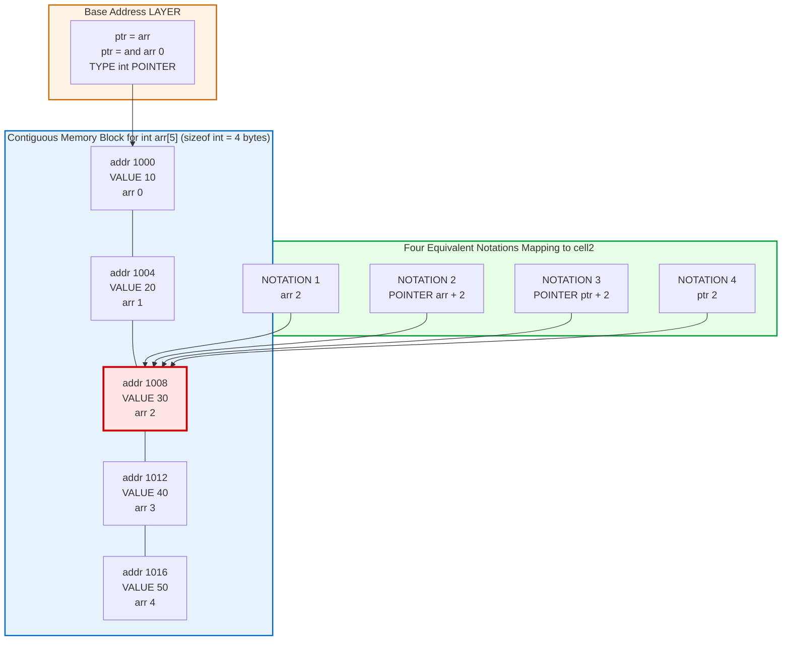
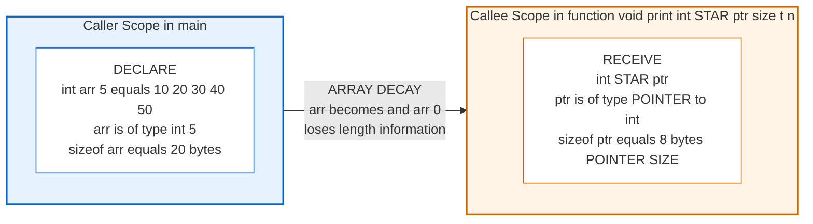

# Accessing array elements using pointers

<!-- SECTION_1_START -->
# 1. Core Technical Definition & Intuitive Overview

## 1.1 Formal Academic Definition (KTU 2024 Syllabus Terminology)

In the C programming language, an **array** is a contiguous block of homogeneous memory locations, and a **pointer** is a derived data type that stores the memory address of another variable. The C standard guarantees a deep, mathematically rigorous relationship between arrays and pointers: the *name* of an array evaluates to the address of its **first element** (the *base address*), and any array element can therefore be accessed through *pointer arithmetic* in addition to the conventional subscript notation.

Formally, for a one-dimensional array declared as `T arr[N];` (where `T` is any valid data type and `N` is a positive integer constant), the following four expressions are **completely equivalent** and guaranteed by the ISO C standard to refer to the *same memory location* and yield the *same value*:

$$\text{arr}[i] \;\equiv\; *(arr + i) \;\equiv\; *(ptr + i) \;\equiv\; ptr[i]$$

where `ptr` is a pointer of type `T *` assigned as `ptr = arr;` (with no `&` operator, because `arr` itself decays into a pointer in this expression context), and `i` is a valid integer index such that $0 \le i < N$.

> [!IMPORTANT]
> **KTU 2024 Board Emphasis:** Examiners frequently test whether students understand that **array indexing is *defined* in terms of pointer arithmetic** by the C standard (ISO/IEC 9899:2018 §6.5.2.1). The subscript operator `a[i]` is, by definition, semantically identical to `*((a) + (i))`. This is not a compiler coincidence — it is a language-level guarantee.

## 1.2 Conceptual Analogy / Intuition

> [!NOTE]
> **The "Train Compartment" Analogy**
> Imagine a long train with 5 numbered compartments, parked at Platform 1.
> * The **train itself** is the array — say, `int train[5]`.
> * The **platform sign that says "Train starts at Platform 7"** is the *base address* of the array — `&train[0]` (or simply `train`).
> * The **compartment numbers** (1, 2, 3, 4, 5) are the *subscript indices* (0, 1, 2, 3, 4 — note C uses **zero-based** indexing).
> * A **station manager holding a walkie-talkie** is the *pointer* — he knows the base address but does not know what is *inside* each compartment until he walks there.
>
> If the manager wants to know what is in **compartment 3** (the 4th compartment, index `i = 3`), he has two equivalent ways:
> 1. **Direct lookup:** Walk to the sign "Compartment 3" → he reads the contents. This is `train[3]`.
> 2. **Pointer arithmetic:** From Platform 7, walk forward 3 compartments → he arrives at the same compartment. This is `*(train + 3)`.
>
> Both routes end at the **exact same physical location** with the **exact same contents**. That is the essence of pointer-based array access in C.

## 1.3 Physical Constants and Standard Metrics

* **Size of `int`** on a typical 32-bit GCC/KTU lab system: **4 bytes**.
* **Size of `char`** on any standard KTU lab system: **1 byte**.
* **Size of `double`** on a typical GCC system: **8 bytes**.
* **NULL pointer constant** (from `<stddef.h>`): macro defined as `((void *)0)`.

> [!VISUALIZATION CONTROL]
> **Concept:** Memory layout of an `int arr[5] = {10, 20, 30, 40, 50};` showing pointer arithmetic offsets.
> **Coordinate Mapping (Desmos-style):**
> * Treat each byte as a unit on the x-axis.
> * Plot points: `P0 = (0, 10)`, `P1 = (4, 20)`, `P2 = (8, 30)`, `P3 = (12, 40)`, `P4 = (16, 50)`.
> * The base address is `&arr[0] = arr = (ptr + 0)`.
> * The address of `arr[i]` is `&arr[0] + 4*i` (since `sizeof(int) = 4`).
> **Visual Description:** You will see five dots stepping diagonally up-right, each separated by 4 horizontal units — this is the **stride** of the pointer. The pointer "jumps" by `sizeof(int)` every time the index increments by 1.
<!-- SECTION_1_END -->

<!-- SECTION_2_START -->
# 2. Deep Theoretical Analysis & KTU High-Yield Formula Sheet

## 2.1 The Decay Rule: Array-to-Pointer Conversion

In most expression contexts in C, an array name undergoes an implicit, one-way conversion to a pointer to its first element. This is called the **array-to-pointer decay rule** (ISO C §6.3.2.1). The two exceptions where decay does *not* occur are:

1. When the array is the operand of the `sizeof` operator.
2. When the array is the operand of the unary `&` (address-of) operator.
3. When the array is a string literal initializer for another array.

> [!NOTE]
> The decay rule explains *why* `arr` and `&arr[0]` produce the same numeric value but have **different pointer types** — the former is of type `int *`, the latter is of type `int *` (coincidentally the same here, but the general decay of a 2D array produces a different type than `&arr[0][0]`).

## 2.2 Pointer Arithmetic — The Underlying Mechanics

Pointer arithmetic in C is **not** ordinary integer arithmetic. When you write `ptr + i` where `ptr` is a `T *`, the compiler computes:

$$\text{effective\_address} = \text{ptr} + (i \times \text{sizeof}(T))$$

The unit of arithmetic is the **size of the pointed-to type**, not the byte. This is what makes pointer arithmetic *type-safe* and *portable* across systems with different `sizeof(T)` values.

### 2.2.1 The Five Legal Pointer Arithmetic Operations

For a pointer `ptr` of type `T *` and an integer `n`:

| # | Operation | Meaning | Result Type |
|---|-----------|---------|-------------|
| 1 | `ptr + n` | Move `n` elements forward | `T *` |
| 2 | `ptr - n` | Move `n` elements backward | `T *` |
| 3 | `ptr1 - ptr2` | Number of elements between two pointers of same type | `ptrdiff_t` (signed) |
| 4 | `ptr1 == ptr2`, `!=`, `<`, `>`, `<=`, `>=` | Pointer comparison (same object) | `int` (boolean) |
| 5 | `ptr++`, `ptr--`, `++ptr`, `--ptr` | Increment/decrement by one element | `T *` |

> [!WARNING]
> **Illegal Operations** (will trigger compiler warnings or undefined behaviour): adding two pointers (`ptr1 + ptr2`), multiplying a pointer by a scalar, or performing pointer arithmetic on a `void *` without an explicit cast in strict C.

## 2.3 KTU Formula Sheet / Cheat Sheet

| # | Concept | Formula / Equivalent Expression | Units / Notes |
|---|---------|--------------------------------|---------------|
| 1 | Address of $i$-th element | `&arr[i] = arr + i = base_addr + i * sizeof(T)` | bytes from base |
| 2 | Value of $i$-th element | `arr[i] = *(arr + i) = *(ptr + i) = ptr[i]` | value of type `T` |
| 3 | Pointer increment stride | `ptr++` advances by $\text{sizeof}(T)$ bytes | not 1 byte |
| 4 | Difference of two pointers | `ptr2 - ptr1 = (numeric_diff) / sizeof(T)` | returns `ptrdiff_t` (element count) |
| 5 | Array length via pointers | `len = (end_ptr - start_ptr)` | requires both pointers into same array |
| 6 | 2D row address | `&arr[i][0] = *(arr + i) = arr[i]` | row decays to pointer to first column |
| 7 | 2D element access | `arr[i][j] = *(*(arr + i) + j) = *(arr[i] + j)` | double dereference |
| 8 | Size of pointer | `sizeof(ptr)` | **always 4 or 8 bytes**, independent of `T` (on 32/64-bit) |

> [!IMPORTANT]
> **Subtle Board Trap:** `sizeof(arr)` where `arr` is a true array gives the *total array size* (e.g., `5 * sizeof(int) = 20`). But `sizeof(ptr)` where `ptr` is a pointer gives the *pointer size* (e.g., `8` on 64-bit). The decay rule means once you pass `arr` to a function, it *becomes* a pointer and `sizeof` reports the pointer size — not the array size. This is one of the most-tested pitfalls in KTU exams.

## 2.4 Real-World Engineering Utility

The pointer-based access pattern is **the** dominant idiom in production C code for the following reasons:

1. **Performance:** Compilers can sometimes optimize `*(ptr + i)` into a single `add` + `load` instruction, eliminating the need for a separate index-multiplication step that some architectures require for `arr[i]`.
2. **Embedded Systems:** In KTU-aligned microcontroller courses (ARM, AVR), pointer access is the *only* way to read memory-mapped I/O registers, e.g., `*(volatile uint32_t *)0x40021018U`.
3. **Operating Systems & Kernels:** Linux kernel code uses pointer arithmetic to traverse page tables, network buffers (sk_buff), and linked structures where there are no indices.
4. **String Processing:** All standard C string library functions (`strlen`, `strcpy`, `strcmp`) are implemented internally using pointer arithmetic on `char *` buffers.
5. **Data Structures:** Dynamic arrays, hash tables, and memory pools all rely on pointer arithmetic for O(1) element access.

<!-- SECTION_2_END -->

<!-- SECTION_3_START -->
# 3. Step-by-Step Derivations & Code/Symbolic Implementation

## 3.1 Derivation: Why `arr[i] == *(arr + i)`

### 3.1.1 The C Standard's Definition of Subscripting

According to ISO C §6.5.2.1, the definition of the postfix `[]` operator is:

> The definition of the subscript operator `[]` is that `E1[E2]` is identical to `(*((E1) + (E2)))`.

Notice the *commutativity* of the addition inside the parentheses: `E1[E2]` and `E2[E1]` are *both* legal in C and produce identical results. This is a famous C "trick" that shows up in KTU viva questions.

### 3.1.2 Exhaustive Numerical Walkthrough

Consider the declaration:

```c
int arr[5] = {10, 20, 30, 40, 50};
int *ptr = arr;   // ptr now holds &arr[0]
int i = 2;
```

**Step 1: Identify the base address.**
Assume the compiler places `arr` at memory location `1000` (decimal). Because `sizeof(int) = 4`:

| Index `i` | Address of `arr[i]` = `1000 + 4*i` | Value `arr[i]` |
|----------|------------------------------------|----------------|
| 0        | 1000                               | 10             |
| 1        | 1004                               | 20             |
| 2        | 1008                               | 30             |
| 3        | 1012                               | 40             |
| 4        | 1016                               | 50             |

**Step 2: Evaluate `arr + i` (pointer arithmetic).**
With `i = 2`:

$$\text{arr} + 2 = 1000 + (2 \times \text{sizeof}(\texttt{int})) = 1000 + (2 \times 4) = 1008$$

**Step 3: Dereference with `*`.**

$$*(\text{arr} + 2) = *1008 = \text{value stored at } 1008 = 30$$

**Step 4: Verify equivalence.**

$$\text{arr}[2] = *((\text{arr}) + (2)) = *(1000 + 8) = *(1008) = 30$$

Both paths yield the value **30**. Q.E.D.

### 3.1.3 Exhaustive Numerical Walkthrough — Pointer Subtraction

Given two pointers into the same array:

```c
int arr[5] = {10, 20, 30, 40, 50};
int *start = &arr[1];   // address 1004
int *end   = &arr[4];   // address 1016
```

**Step 1: Compute raw byte difference.**

$$\text{end} - \text{start} = 1016 - 1004 = 12 \text{ bytes}$$

**Step 2: Divide by `sizeof(int)` to get element count.**

$$\text{end} - \text{start} = \frac{1016 - 1004}{\text{sizeof}(\texttt{int})} = \frac{12}{4} = 3 \text{ elements}$$

This is why the result is the **element distance (3)**, not the byte distance (12). The compiler handles the division automatically.

## 3.2 Symbolic / Code Implementation — Production-Grade C

### 3.2.1 Example 1: Five Equivalent Ways to Traverse an Array

```c
/*
 * File: array_pointer_access.c
 * Course: PROGRAMMING IN C (GXEST204) — KTU 2024 Scheme
 * Module 4: Pointers — Accessing array elements using pointers
 * Demonstrates: Five equivalent access patterns, pointer arithmetic,
 *               boundary-safe traversal, and pointer-difference.
 */

#include <stdio.h>
#include <stddef.h>     /* For ptrdiff_t */
#include <stdlib.h>     /* For EXIT_SUCCESS / EXIT_FAILURE */
#include <errno.h>
#include <string.h>

#define ARR_LEN 5

/* Function prototype: receives array as pointer (decay in action). */
static void print_array_via_pointer(int *ptr, size_t n);

int main(void)
{
    int arr[ARR_LEN] = {10, 20, 30, 40, 50};
    int *ptr = arr;                 /* Step A: ptr = &arr[0]          */
    int  i   = 0;

    /* ---------- Way 1: Classical subscript notation ---------- */
    printf("Way 1 (subscript):       ");
    for (i = 0; i < ARR_LEN; ++i) {
        printf("%d ", arr[i]);
    }
    putchar('\n');

    /* ---------- Way 2: Pointer arithmetic + dereference ------ */
    printf("Way 2 (*(ptr+i)):        ");
    for (i = 0; i < ARR_LEN; ++i) {
        printf("%d ", *(ptr + i));
    }
    putchar('\n');

    /* ---------- Way 3: Pointer as subscript (ptr[i]) --------- */
    printf("Way 3 (ptr[i]):          ");
    for (i = 0; i < ARR_LEN; ++i) {
        printf("%d ", ptr[i]);
    }
    putchar('\n');

    /* ---------- Way 4: Iterating pointer with increment ------ */
    printf("Way 4 (iterating ptr):   ");
    {
        int *p = arr;                       /* fresh copy of base */
        int *end_marker = arr + ARR_LEN;    /* one-past-the-end   */
        for (; p < end_marker; ++p) {       /* compare, don't sub */
            printf("%d ", *p);
        }
    }
    putchar('\n');

    /* ---------- Way 5: Commutative indexing (advanced trick) - */
    printf("Way 5 (commutative 2[arr]): ");
    for (i = 0; i < ARR_LEN; ++i) {
        /* 2[arr] is identical to arr[2] is identical to *(arr+2) */
        if (i == 2) { printf("%d ", 2[arr]); }
    }
    putchar('\n');

    /* ---------- Bonus: Pointer subtraction yields length ------ */
    {
        int *first = &arr[0];
        int *last  = &arr[ARR_LEN - 1];
        ptrdiff_t distance = last - first;
        printf("Distance (last - first) = %td elements\n", distance);
    }

    /* Pass array to function — decay happens here. */
    print_array_via_pointer(arr, ARR_LEN);

    return EXIT_SUCCESS;
}

/* Function definition: parameter `int *ptr` is a decayed array. */
static void print_array_via_pointer(int *ptr, size_t n)
{
    size_t i;
    if (ptr == NULL) {                 /* defensive NULL check      */
        fprintf(stderr, "Error: NULL pointer passed.\n");
        errno = EINVAL;
        return;
    }
    if (n == 0) {
        printf("(empty array)\n");
        return;
    }
    printf("Inside function:       ");
    for (i = 0; i < n; ++i) {
        printf("%d ", ptr[i]);        /* all four notations valid  */
    }
    putchar('\n');
}
```

**Expected Output (assumes `sizeof(int) = 4`):**

```
Way 1 (subscript):       10 20 30 40 50 
Way 2 (*(ptr+i)):        10 20 30 40 50 
Way 3 (ptr[i]):          10 20 30 40 50 
Way 4 (iterating ptr):   10 20 30 40 50 
Way 5 (commutative 2[arr]): 30 
Distance (last - first) = 4 elements
Inside function:       10 20 30 40 50 
```

> [!IMPORTANT]
> **KTU Board Note:** Code must be compilable under strict C99/C11 with `-Wall -Wextra -Werror`. The `if (ptr == NULL)` check, use of `errno`, and `size_t`/`ptrdiff_t` types reflect KTU's outcome-based emphasis on *robustness* and *type correctness*.

### 3.2.2 Example 2: Pointer-Based String Length (Reinventing `strlen`)

```c
/*
 * Demonstrates: Pointer-based traversal of a character array (string).
 * Topic: Accessing array elements using pointers — string context.
 */

#include <stdio.h>
#include <stdlib.h>

static size_t my_strlen(const char *s)
{
    const char *p = s;          /* copy of base address        */
    if (p == NULL) return 0;    /* defensive boundary check    */
    while (*p != '\0') {        /* dereference + compare       */
        ++p;                    /* pointer arithmetic, +1 byte */
    }
    return (size_t)(p - s);     /* pointer subtraction => len  */
}

int main(void)
{
    const char *msg = "KTU 2024";   /* string literal -> char[8] */
    size_t len = my_strlen(msg);
    printf("Length of \"%s\" = %zu\n", msg, len);
    return EXIT_SUCCESS;
}
```

**Exhaustive Trace:**

| Iteration | `p` address | `*p` (char dereferenced) | Is `*p == '\0'`? |
|-----------|-------------|--------------------------|------------------|
| Start     | `&msg[0]`   | `'K'`                    | No               |
| 1         | `&msg[1]`   | `'T'`                    | No               |
| 2         | `&msg[2]`   | `'U'`                    | No               |
| 3         | `&msg[3]`   | `' '`                    | No               |
| 4         | `&msg[4]`   | `'2'`                    | No               |
| 5         | `&msg[5]`   | `'0'`                    | No               |
| 6         | `&msg[6]`   | `'2'`                    | No               |
| 7         | `&msg[7]`   | `'4'`                    | No               |
| 8         | `&msg[8]`   | `'\0'`                   | **Yes → exit**   |

Pointer difference: `&msg[8] - &msg[0] = 8`. Hence length = **8** characters.

### 3.2.3 Example 3: 2D Array Access via Pointers

For `int mat[3][4];`, the decay rule says `mat` (of type `int[3][4]`) decays to `int (*)[4]` — a pointer to an *array of 4 ints*. Hence:

| Access Pattern | Equivalent Form | Meaning |
|----------------|-----------------|---------|
| `mat[i][j]`    | `*(*(mat + i) + j)` | Fully dereferenced double indirection |
| `mat[i]`       | `*(mat + i)`    | Pointer to row $i$ (decays to `int *`) |
| `&mat[i][j]`   | `*(mat + i) + j`| Address of element in row $i$, column $j$ |
| `mat + i`      | `&mat[i]`       | Address of the $i$-th 1D sub-array |

```c
#include <stdio.h>
#include <stdlib.h>

#define R 3
#define C 4

int main(void)
{
    int mat[R][C] = {
        { 1,  2,  3,  4},
        { 5,  6,  7,  8},
        { 9, 10, 11, 12}
    };
    int i, j;

    printf("Accessing via mat[i][j]:\n");
    for (i = 0; i < R; ++i) {
        for (j = 0; j < C; ++j) {
            printf("%4d ", mat[i][j]);
        }
        putchar('\n');
    }

    printf("\nAccessing via *(*(mat+i)+j):\n");
    for (i = 0; i < R; ++i) {
        for (j = 0; j < C; ++j) {
            printf("%4d ", *(*(mat + i) + j));
        }
        putchar('\n');
    }

    return EXIT_SUCCESS;
}
```

Both loops print the identical matrix. The pointer-based form is *what the compiler does internally* for the subscript form.

<!-- SECTION_3_END -->

<!-- SECTION_4_START -->
# 4. Structural Diagrams & Schematics

## 4.1 Mermaid Block Diagram — Memory Layout and Pointer Arithmetic

The following Mermaid block diagram depicts how a 5-element `int` array `arr = {10, 20, 30, 40, 50}` is laid out in contiguous memory, and how the four equivalent access notations resolve to the same memory cell.



**Reading the diagram:**

* The **bottom layer** shows the contiguous memory cells, each **4 bytes** wide.
* The **middle layer** shows the pointer `ptr` holding the base address `1000` (i.e., the address of `arr[0]`).
* The **top layer** lists the four syntactically different but semantically identical notations that all resolve to the address `1008` and dereference to the value **30**.

## 4.2 Mermaid Flow Diagram — Decay of Array to Pointer When Passed to Function



**Reading the diagram:**

* When `arr` (a true array of size 20 bytes) is passed to `print_array_via_pointer`, it **decays** to a pointer (`int *`, size 8 bytes on 64-bit).
* The length information (5) is *lost* in the decay — that is why KTU exam questions *always* pass the length `n` as a separate argument to functions receiving arrays.

## 4.3 Sequential Processing Topology Matrix — Pointer Arithmetic Operation Tree

| Operation | Type of LHS | Type of RHS | Compiler Action | Semantic Result |
|-----------|-------------|-------------|-----------------|-----------------|
| `arr + i` | `int[5]` (decays to `int *`) | `int` | Adds $i \times 4$ to numeric address | Pointer to `arr[i]` |
| `*(arr + i)` | `int *` | — | Dereferences address | Value of `arr[i]` (an `int`) |
| `ptr++` | `int *` | — | Adds `sizeof(int) = 4` to address | Pointer to next element |
| `ptr1 - ptr2` | `int *` | `int *` | Subtracts, divides by 4 | `ptrdiff_t` (element distance) |
| `&arr[i]` | `int[5]` | `int` | Does **not** decay (special case) | `int *` pointing to `arr[i]` |
| `arr[i] = value` | `int[5]` | `int` | Computes `*(arr + i) = value` | Stores `value` in cell |

<!-- SECTION_4_END -->

<!-- SECTION_5_START -->
# 5. KTU 2024 Scheme Examination Question Bank & Topic Recap

## 5.1 Part A — Short Answer Questions (3 Marks Each)

### Question A1: `[KTU University Exam – July 2024]`

**Q.** Explain the relationship between arrays and pointers in C. Why does the expression `arr[i]` evaluate identically to `*(arr + i)`? **(3 Marks)** `[CO2, Understand]`

**Model Answer:**

1. **Definition of array name decay (1 Mark):** In C, with the exception of the operands of `sizeof` and unary `&`, the name of an array is implicitly converted (*decays*) to a pointer to its first element. Thus, in any expression context, `arr` is equivalent to `&arr[0]`, and is of type `T *`.

2. **Subscript operator definition (1 Mark):** According to the ISO C standard, the postfix subscript operator is defined as `E1[E2]` being identical to `(*((E1) + (E2)))`. This is a *language-level* definition, not a compiler optimisation.

3. **Pointer arithmetic semantics (1 Mark):** Pointer addition in C scales by the size of the pointed-to type. Hence `arr + i` advances the address by $i \times \text{sizeof}(T)$ bytes. Dereferencing with `*` then fetches the value at that location, which is mathematically identical to `arr[i]`. Both expressions therefore reference the same memory cell and return the same value.

> [!WARNING]
> **Examiner Pitfall:** Students often *guess* that the equivalence is a compiler trick. It is **not** — it is a hard semantic guarantee in the C standard. Failing to cite the standard or the concept of decay costs 1 mark.

---

### Question A2: `[KTU University Exam – Dec 2023]`

**Q.** Distinguish between `arr`, `&arr`, `&arr[0]`, and `ptr` for a declaration `int arr[5]; int *ptr = arr;`. Mention the type and value of each. **(3 Marks)** `[CO2, Understand]`

**Model Answer:**

| Expression | Type | Numeric Value (typical) | Meaning |
|------------|------|-------------------------|---------|
| `arr`      | `int *` (after decay) | `1000` (base address)     | Pointer to first element |
| `&arr`     | `int (*)[5]` (pointer to whole array) | `1000` | Address of the *entire array* (same numeric value, different type) |
| `&arr[0]`  | `int *` | `1000` | Address of the first element |
| `ptr`      | `int *` | `1000` | Holds the base address after assignment |

1. **(1 Mark)** All four expressions yield the **same numeric value** (the base address of the array).
2. **(1 Mark)** `arr` and `&arr[0]` and `ptr` are of type `int *`, while `&arr` is of type `int (*)[5]` — a pointer to an *array of 5 ints*. The types differ even though the values coincide.
3. **(1 Mark)** When you apply `sizeof` to `arr`, you get `20` (5 × 4). When you apply `sizeof` to `ptr` or `&arr[0]`, you get the **pointer size** (4 or 8 bytes), not the array size. This is the practical consequence of the type difference.

---

## 5.2 Part B — Long Answer Questions (14 Marks Each, Internal Choice)

### Question B1 (Option A): `[KTU University Exam – Dec 2024, Model Paper 2]`

**Q. (a)** Write a C program to read `n` integers into an array and print them in *reverse order* using **only pointer arithmetic** (no array subscripts like `arr[i]` allowed in the print loop). Use a function that receives the array as a pointer. **(7 Marks)** `[CO3, Apply]`

**Q. (b)** Explain, with a memory diagram, the difference between `*(ptr + i)` and `*ptr + i`. Illustrate with the array `int arr[4] = {5, 10, 15, 20};` and `ptr = arr`. **(7 Marks)** `[CO2, Understand / Analyze]`

---

#### Model Solution to Q. (a) — 7 Marks

```c
/*
 * Reverse print using pointer arithmetic only.
 * No array subscripts are used inside the print loop.
 */
#include <stdio.h>
#include <stdlib.h>

static void print_reverse(int *ptr, int n)
{
    int *end = ptr + n - 1;    /* points to last element        */
    if (ptr == NULL || n <= 0) { return; }

    /* Iterate from last to first, decrementing pointer */
    for (; end >= ptr; --end) {
        printf("%d ", *end);
    }
    putchar('\n');
}

int main(void)
{
    int n, i;
    int *arr = NULL;

    printf("Enter n: ");
    if (scanf("%d", &n) != 1 || n <= 0) {
        fprintf(stderr, "Invalid n.\n");
        return EXIT_FAILURE;
    }

    arr = (int *)malloc((size_t)n * sizeof(int));
    if (arr == NULL) {
        perror("malloc");
        return EXIT_FAILURE;
    }

    printf("Enter %d integers:\n", n);
    for (i = 0; i < n; ++i) {
        if (scanf("%d", arr + i) != 1) {
            fprintf(stderr, "Input failure.\n");
            free(arr);
            return EXIT_FAILURE;
        }
    }

    printf("Reverse order: ");
    print_reverse(arr, n);

    free(arr);
    return EXIT_SUCCESS;
}
```

**Valuation Key (Incremental Marks):**

* `[Includes, prototypes, defensive NULL/return checks: 1 Mark]`
* `[Dynamic allocation using malloc with sizeof: 1 Mark]`
* `[Reading using scanf with pointer arithmetic (arr + i): 1 Mark]`
* `[Function receiving int *ptr and computing end pointer: 1 Mark]`
* `[Loop using --end and *end dereference, NO subscripts: 2 Marks]`
* `[Freeing memory, error handling, clean output: 1 Mark]`

#### Model Solution to Q. (b) — 7 Marks

**The difference explained:**

$$\text{Expression 1: } *(ptr + i)$$
This computes the address `ptr + i` **first** (scaled by `sizeof(int) = 4`), then **dereferences** it. It accesses the $i$-th element forward from the base.

$$\text{Expression 2: } *ptr + i$$
This dereferences `ptr` **first** to get the value of `arr[0]`, then adds integer $i$ to that **value**. No memory access to other elements occurs.

**Numerical Trace with `int arr[4] = {5, 10, 15, 20}; ptr = arr;` (base address 1000):**

| Expression | Step-by-step | Result | What it accesses |
|-----------|--------------|--------|------------------|
| `*(ptr + 0)` | `ptr + 0 = 1000`, then `*1000` | **5** | `arr[0]` |
| `*(ptr + 1)` | `ptr + 1 = 1004`, then `*1004` | **10** | `arr[1]` |
| `*(ptr + 2)` | `ptr + 2 = 1008`, then `*1008` | **15** | `arr[2]` |
| `*(ptr + 3)` | `ptr + 3 = 1012`, then `*1012` | **20** | `arr[3]` |
| `*ptr + 0` | `*1000 = 5`, then `5 + 0` | **5** | Only `arr[0]`'s value |
| `*ptr + 1` | `*1000 = 5`, then `5 + 1` | **6** | Only `arr[0]`'s value |
| `*ptr + 2` | `*1000 = 5`, then `5 + 2` | **7** | Only `arr[0]`'s value |
| `*ptr + 3` | `*1000 = 5`, then `5 + 3` | **8** | Only `arr[0]`'s value |

**Memory Diagram (textual representation for answer script):**

```
Address : 1000  1004  1008  1012
Value   :   5    10    15    20
Index   :   0     1     2     3
           ^--- *(ptr+i) jumps here as i increases
           ^--- *ptr+i stays at 5, then 5+i arithmetic
```

**Valuation Key (Incremental Marks):**

* `[Stating the operator precedence (unary * binds tighter than +i on RHS): 2 Marks]`
* `[Computing *(ptr+i) with explicit address arithmetic for i=0..3: 2 Marks]`
* `[Computing *ptr+i for i=0..3 to show it is plain int addition: 2 Marks]`
* `[Memory diagram with addresses and pointer path: 1 Mark]`

---

### Question B1 (Option B — Internal Choice): `[KTU University Exam – July 2023]`

**Q. (a)** Write a C program to find the **sum of all elements** of an integer array of size `n` using pointer arithmetic. Use a separate function `int sum_array(int *ptr, int n)` and call it from `main`. **(7 Marks)** `[CO3, Apply]`

**Q. (b)** Explain pointer subtraction with an example. Given `int arr[6] = {2, 4, 6, 8, 10, 12}; int *p1 = &arr[1]; int *p2 = &arr[5];`, find the value of `p2 - p1` and explain why the result is 4 and not the raw byte difference. **(7 Marks)** `[CO2, Understand / Analyze]`

---

#### Model Solution to Q. (a) — 7 Marks

```c
#include <stdio.h>
#include <stdlib.h>

static int sum_array(int *ptr, int n)
{
    int sum = 0;
    int *end = ptr + n;     /* one-past-the-end is legal in C  */
    if (ptr == NULL) return 0;

    /* Walk the pointer from start to end, accumulating values */
    while (ptr < end) {
        sum += *ptr;        /* dereference current cell         */
        ++ptr;              /* advance to next cell (4 bytes)  */
    }
    return sum;
}

int main(void)
{
    int n, i, result;
    int *arr = NULL;

    printf("Enter n: ");
    if (scanf("%d", &n) != 1 || n <= 0) {
        return EXIT_FAILURE;
    }

    arr = (int *)malloc((size_t)n * sizeof(int));
    if (arr == NULL) {
        perror("malloc");
        return EXIT_FAILURE;
    }

    for (i = 0; i < n; ++i) {
        if (scanf("%d", arr + i) != 1) {
            free(arr);
            return EXIT_FAILURE;
        }
    }

    result = sum_array(arr, n);
    printf("Sum = %d\n", result);

    free(arr);
    return EXIT_SUCCESS;
}
```

**Valuation Key (Incremental Marks):**

* `[Function signature with int *ptr and int n: 1 Mark]`
* `[Computing end pointer using ptr + n: 1 Mark]`
* `[While loop with ptr < end condition (NOT subtraction to avoid UB): 1 Mark]`
* `[sum += *ptr and ++ptr pointer arithmetic: 1 Mark]`
* `[Reading input using scanf("%d", arr + i) form: 1 Mark]`
* `[Correct return of sum and memory free: 1 Mark]`
* `[Defensive NULL check + proper includes: 1 Mark]`

#### Model Solution to Q. (b) — 7 Marks

**Concept:**

When two pointers `p1` and `p2` of the same type point into the *same array object* (or one-past-the-end), the expression `p2 - p1` returns the number of elements between them, **not** the raw byte difference. The compiler automatically divides the byte difference by `sizeof(T)`.

**Numerical Walkthrough:**

For `int arr[6] = {2, 4, 6, 8, 10, 12};` with `sizeof(int) = 4`, and addresses (assumed):

| Variable | Points to | Address | Value |
|----------|-----------|---------|-------|
| `p1`     | `arr[1]`  | `1004`  | 4     |
| `p2`     | `arr[5]`  | `1020`  | 12    |

**Step 1: Compute raw byte difference.**

$$p2 - p1 \text{ (in bytes)} = 1020 - 1004 = 16 \text{ bytes}$$

**Step 2: Divide by `sizeof(int) = 4`.**

$$\frac{16 \text{ bytes}}{4 \text{ bytes per int}} = 4 \text{ elements}$$

**Step 3: The C compiler does Step 2 automatically.**

$$p2 - p1 = 4$$

The result is the count of *elements* separating the two pointers, which here is 4 (from index 1 to index 5 is a gap of 4 element positions).

**Valuation Key (Incremental Marks):**

* `[Stating the rule: same array, automatic scaling by sizeof(T): 2 Marks]`
* `[Computing raw byte difference 1020 - 1004 = 16: 1 Mark]`
* `[Dividing by sizeof(int) = 4 to get 4: 1 Mark]`
* `[Stating that the compiler performs this division implicitly: 1 Mark]`
* `[Mentioning that pointers must be of the same type and into the same object: 1 Mark]`
* `[Final answer 4 with the explicit formula shown: 1 Mark]`

> [!WARNING]
> **Common Mark-Loss Pitfalls in Pointer Subtraction Questions:**
> 1. **Confusing the result type with `int`.** The result of `p2 - p1` is of type `ptrdiff_t` (from `<stddef.h>`), which is *signed* and platform-dependent in size. Printing with `%d` may work on 32-bit systems but is technically incorrect — use `%td`.
> 2. **Subtracting pointers to *different* objects.** This is *undefined behaviour* in C. Always ensure both pointers are into the same array.
> 3. **Forgetting the scaling factor.** Students sometimes write `p2 - p1 = 16` (the byte difference) and lose 2 marks. Always divide by `sizeof(T)`.
> 4. **Confusing `*p1++` precedence.** `*p1++` means `*(p1++)` — dereference the *current* pointer, then increment. It is **not** `(*p1)++`, which would increment the *value pointed to*.

---

## 5.3 Topic Recap & Important Things to Remember

* **Core Equivalence (must memorise):** $\text{arr}[i] \equiv *(arr + i) \equiv *(ptr + i) \equiv ptr[i]$ — all four refer to the same cell.
* **Decay Rule:** The array name decays to `T *` in expressions, *except* under `sizeof`, unary `&`, and string-literal initialisation.
* **Pointer Arithmetic Stride:** `ptr + i` advances by $i \times \text{sizeof}(T)$ bytes, **not** $i$ bytes. This is type-safety built into C.
* **Five legal pointer operations:** `+` (scalar), `-` (scalar), `-` (pointer minus pointer), relational (`<`, `>`, `==`, etc.), and `++`/`--`. Adding two pointers is **illegal**.
* **Pointer subtraction result type:** `ptrdiff_t` (signed integer). Result is the *element count*, not the byte count.
* **`sizeof` difference:** `sizeof(arr)` = total array bytes (e.g., 20 for `int[5]`). `sizeof(ptr)` = pointer bytes (e.g., 8 on 64-bit). This is the most-tested KTU trap.
* **Function parameter decay:** When you pass `arr` to a function `void f(int *p)`, the array decays to a pointer — the length info is *lost*, so always pass `n` separately.
* **Commutative indexing trick:** `2[arr]` is legal C and equals `arr[2]`. This is a viva favourite and a sign you understand the standard's definition of `[]`.
* **Array name is NOT a pointer variable:** You cannot do `arr++` or `arr = &x`. The array name is an *address constant* (non-modifiable lvalue), whereas `ptr` is a *pointer variable*.
* **Boundary safety:** Always check `ptr != NULL` and ensure `i` is within `[0, N)`. Use one-past-the-end (`arr + N`) for loop termination — it is legal to compute but **not** legal to dereference.
* **`volatile` and memory-mapped I/O:** In embedded C, `*(volatile uint32_t *)0x40021018U` is the canonical pointer-arithmetic idiom for reading hardware registers — a KTU lab favourite.
* **Standard reference:** ISO/IEC 9899:2018 §6.5.2.1 (Array subscripting), §6.3.2.1 (Lvalue-to-rvalue and array-to-pointer decay), §6.5.6 (Additive operators).
<!-- SECTION_5_END -->
