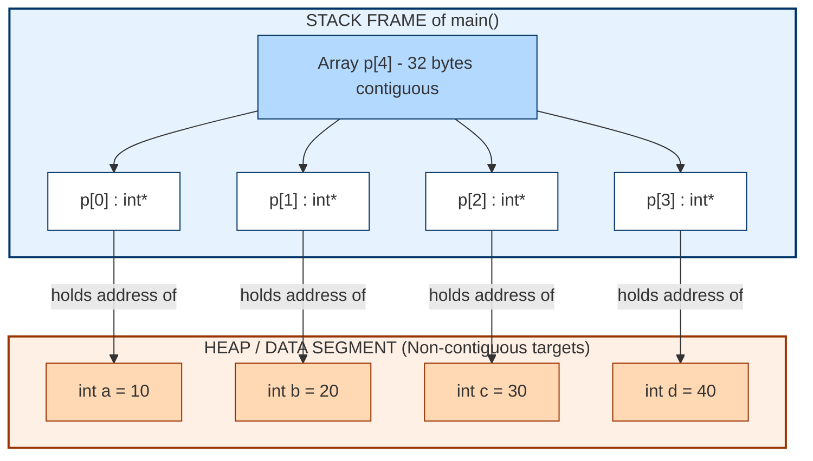
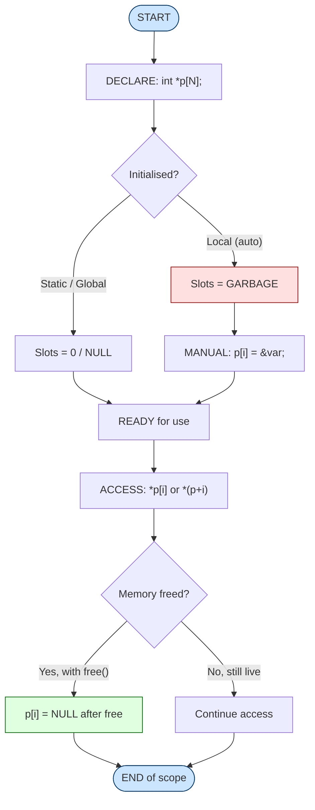
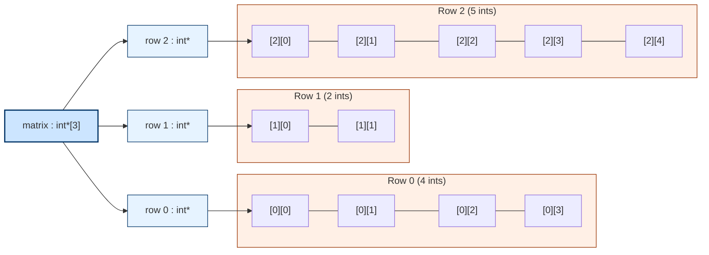
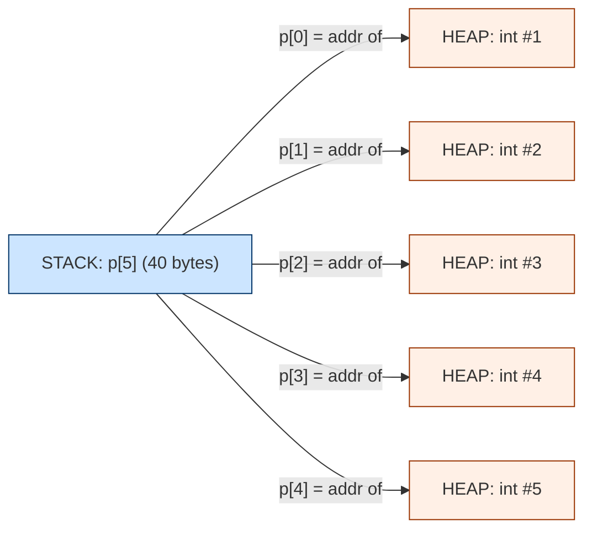

# Array of pointers

<!-- SECTION_1_START -->

# Array of Pointers — Core Technical Definition & Intuitive Overview

> [!IMPORTANT]
> **KTU 2024 Syllabus Tag (PEST 204 / Equivalent):** *Module 4 — Pointers* — Subtopic: *Array of Pointers*, *Pointer to an Array*, *Arrays of Character Pointers (Strings)*.

## 1.1 Formal Academic Definition

An **Array of Pointers** in the C programming language is a homogeneous, statically-sized or dynamically-allocated sequential collection of memory locations, where **each element of the array is itself a pointer variable** that stores the **memory address** of another variable (of a given base data type) rather than a direct data value.

The formal C declaration syntax is:

```c
data_type *pointer_array_name[CONSTANT_SIZE];
```

Read this declaration right-to-left (the **"Right-Left Rule"** popularised by KTU examiners):

1. `pointer_array_name` — a name identifier.
2. `[CONSTANT_SIZE]` — declares an **array**.
3. `*` — whose elements are **pointers**.
4. `data_type` — each pointer points to a value of this base data type.

> [!NOTE]
> **KTU Board Emphasis (2024 Scheme):** The asterisk `*` binds to the **variable name**, not to the data type. This is *exactly why* `int *ptr[5]` is an **array of 5 integer pointers**, but `int (*ptr)[5]` is a **pointer to an array of 5 integers**. Confusing these two is a guaranteed 7-mark deduction in the End Semester Evaluation (ESE).

## 1.2 Conceptual Analogy — The "Hotel Reception Board"

Imagine a luxury hotel reception board. The board itself is the **array of pointers** — it has a fixed number of slots (say, 5 slots). Each slot does **not** contain a guest's luggage or a guest itself. Instead, each slot contains a **room number card** (the *pointer / memory address*).

- The **room number card** itself occupies a small, fixed amount of space on the board (typically **4 bytes** on a 32-bit system or **8 bytes** on a 64-bit system, regardless of the guest's size).
- Following the room number card (dereferencing with `*` or `[]`) takes you to the **actual guest's room**, where the real data lives.

So an `int *ap[5]` is a board with 5 room-number slots, where each room is guaranteed to hold an `int` (4 bytes on most systems).

> [!TIP]
> **Quick Intuition Test:** If you have `char *fruits[] = {"Apple", "Mango", "Banana"};`, the array `fruits` stores 3 *addresses*. Each address points to the **first character** of a string literal that lives (typically) in the **read-only data segment** of the program's memory.

## 1.3 The Two Adjacent — and Easily Confused — Concepts

| Construct | C Syntax | Reading Order | Memory Footprint of `arr` |
|---|---|---|---|
| **Array of Pointers** | `int *arr[5];` | `arr` is an array of 5 pointers-to-`int` | $5 \times \text{sizeof(int*)}$ |
| **Pointer to an Array** | `int (*arr)[5];` | `arr` is a pointer to an array of 5 `int` | $\text{sizeof(int*)}$ (single address) |

> [!WARNING]
> **The Parentheses Are Non-Negotiable.** In C, the `[]` (array subscript) operator has **higher precedence** than the `*` (indirection / dereference) operator. Hence:
>
> $$\text{Precedence Rank: } [] \;\; > \;\; *$$
>
> Without parentheses, the compiler *always* interprets `*p[5]` as "an array of 5 pointers" and **never** as "a pointer to an array of 5".

## 1.4 Standard Constants & Metrics (Bold for Visibility)

- **sizeof(void*)** = **4 bytes** on a 32-bit system, **8 bytes** on a 64-bit system.
- **sizeof(int*) = sizeof(char*) = sizeof(float*) = sizeof(void*)** — All pointer types have identical size on a given platform.
- **NULL pointer value** is typically defined as **`((void*)0)`** in `<stddef.h>`.
- **Heap addresses** grow *upwards*; **Stack addresses** grow *downwards*; **String literals** live in the **read-only `.rodata` segment**.

> [!VISUALIZATION CONTROL]
> **Concept:** Visualising a 4-element Array of Pointers `int *p[4]` pointing to four different integer variables `a, b, c, d`.
>
> **ASCII Coordinate Map (Address Space vs. Stored Value):**
>
> ```
> p[0]  -->  | 1000 |  --->  a = 10
> p[1]  -->  | 1004 |  --->  b = 20
> p[2]  -->  | 1008 |  --->  c = 30
> p[3]  -->  | 1012 |  --->  d = 40
> ```
>
> **Visual Description:** The student should observe that `p[i]` (read as `*(p + i)`) is itself an *address*, and `*p[i]` (read as `*(*(p + i))`) is the *actual integer* the address points to. The array `p` lives in one memory block, and the target integers `a, b, c, d` may live in **completely separate, non-contiguous** memory locations.

<!-- SECTION_1_END -->

<!-- SECTION_2_START -->

# Deep Theoretical Analysis & KTU High-Yield Formula Sheet

## 2.1 Operational Logic — Broken Into Structured Steps

### Step 1: Declaration Triggers Static Memory Reservation

When the compiler encounters `data_type *name[N];`, it reserves $N$ contiguous slots, each of size $\text{sizeof(data\_type*)}$, in the **stack frame** (for local arrays) or in the **global/static data segment** (for global/static arrays).

The default values inside these slots are **garbage / indeterminate** unless explicitly initialised. Hence, attempting to dereference an uninitialised array of pointers is one of the most common sources of segmentation faults.

### Step 2: Assignment Pairs Each Pointer with a Target Address

Each `name[i]` is individually assigned an address. The address can come from:

- The address of a normal variable: `name[i] = &variable;`
- A heap-allocated block: `name[i] = (data_type*)malloc(SIZE);`
- A string literal: `name[i] = "Hello";` (the literal decays to a `char*`).
- Another pointer: `name[i] = another_ptr;`
- The **NULL sentinel**: `name[i] = NULL;` (used to mark the end of valid entries — critical for strings).

### Step 3: Access Follows a Two-Step Dereference

To read or modify the *target value*, we use either of two equivalent notations:

$$\text{Value} = *(\text{name} + i) \quad \equiv \quad \text{Value} = \text{name}[i]$$

To go one level deeper and read the target value itself, we use:

$$\text{Target} = *\text{name}[i] \quad \equiv \quad \text{Target} = *(*(\text{name} + i))$$

The second form is the textbook **"double dereference"** and frequently appears in KTU Part B questions involving arrays of character pointers.

### Step 4: Pointer Arithmetic Is Scaled by the Pointer's Base Type

When the compiler evaluates `name + i`, it does **not** simply add $i$ bytes. It adds $i \times \text{sizeof(data\_type*)}$ bytes. For a 64-bit system:

$$\text{Address}(name + i) = \text{Address}(name) + i \times 8 \text{ bytes}$$

This scaling is **automatic** and is one of the most powerful — and dangerous — features of C.

## 2.2 KTU High-Yield Formula & Operator Cheat Sheet

| Symbol / Operation | Meaning | Operand Type | Result Type | Notes |
|---|---|---|---|---|
| `int *p[5];` | Array of 5 integer pointers | — | `int*[5]` | Stack/global; each slot = `sizeof(int*)` |
| `int (*p)[5];` | Pointer to an array of 5 integers | — | `int(*)[5]` | Single pointer; dereferencing yields full array |
| `p[i]` | i-th pointer in the array | `int**` (decayed form) | `int*` | Equivalent to `*(p + i)` |
| `*p[i]` | Value the i-th pointer points to | `int*` | `int` | The classic double-dereference |
| `&p[i]` | Address of the i-th pointer slot | `int**` | `int**` | Useful when passing the array to a function |
| `p` (alone) | Decays to pointer to first element | decays | `int**` | Loses dimension info — common pitfall |
| `sizeof(p)` | Size of the entire array in bytes | array | `size_t` | $N \times \text{sizeof(int*)}$ — but ONLY in the declaring scope |
| `sizeof(*p)` | Size of a single element (a pointer) | `int*` | `size_t` | Equals `sizeof(int*)` = 4 or 8 bytes |
| `p + i` | Pointer arithmetic to i-th element | `int**` | `int**` | Skips forward by $i \times 8$ bytes on 64-bit |

> [!IMPORTANT]
> **Critical KTU Rule:** When an array of pointers is passed to a function, it decays to a **pointer to a pointer** (i.e., `data_type **`). The receiving function signature should be `void func(data_type **arr, int n)` — **not** `void func(data_type *arr[N])`. The second form is *syntactically allowed* but the array dimension $N$ is **ignored** by the compiler. This is a top-3 source of confusion in KTU board papers.

## 2.3 Real-World Engineering Utility

Array of pointers is not an academic curiosity — it underpins several production-grade C systems:

1. **Command-Line Argument Vector (`argv`):** `int main(int argc, char *argv[])` — `argv` is literally an array of pointers to character arrays. Each `argv[i]` points to a C-string command-line token.
2. **String Tables in Compilers / Interpreters:** Keyword tables, opcode tables, and symbol tables are routinely built as `const char *keywords[] = {"if", "else", "while", "return", NULL};`. The trailing `NULL` acts as a sentinel for `for` loops.
3. **Dynamic 2-D Arrays (Jagged Arrays):** To save memory when rows have unequal lengths, we allocate an array of row-pointers and point each row to a separately-malloced 1-D array. Total memory becomes $\sum_{i=0}^{n-1} r_i$ instead of the wasteful $n \times \max(r_i)$.
4. **Polymorphic Behaviour with `void *`:** A `void *entries[]` array lets you store pointers to heterogeneous data types (`int`, `float`, `struct`, etc.) in a single collection — heavily used in OS kernel data structures and in implementing generic containers.
5. **Function Pointer Tables (Dispatch Tables):** State machines and embedded firmware use `void (*handlers[])()` to map an opcode / event code to a function. This is how embedded interrupt vector tables work in microcontrollers.

<!-- SECTION_2_END -->

<!-- SECTION_3_START -->

# Step-by-Step Derivations & Complete C Implementation

## 3.1 Worked Example 1 — Basic Array of Integer Pointers

**Problem Statement (KTU-style):** *Declare an array of 4 pointers to integers. Assign the addresses of 4 different integer variables to these pointers. Then print all 4 integers and their addresses using pointer notation.*

### Complete C Source

```c
#include <stdio.h>

int main(void) {
    int a = 10, b = 20, c = 30, d = 40;

    /* Step 1: Declaration of array of pointers */
    int *p[4];

    /* Step 2: Initialising each pointer slot with a target address */
    p[0] = &a;
    p[1] = &b;
    p[2] = &c;
    p[3] = &d;

    /* Step 3: Printing values and addresses */
    for (int i = 0; i < 4; i++) {
        printf("p[%d] = %p, *p[%d] = %d\n", i, (void *)p[i], i, *p[i]);
    }

    return 0;
}
```

### Step-by-Step Trace of Memory (Hypothetical 64-bit System)

| Iteration $i$ | `p[i]` (Address) | `*p[i]` (Value) | Underlying Variable |
|---|---|---|---|
| 0 | `0x7ffee4a0` | 10 | `a` |
| 1 | `0x7ffee4a4` | 20 | `b` |
| 2 | `0x7ffee4a8` | 30 | `c` |
| 3 | `0x7ffee4ac` | 40 | `d` |

> [!NOTE]
> The 4-byte gap between consecutive `p[i]` addresses confirms the compiler is allocating `sizeof(int)` worth of memory for the targets (not for the array `p` itself). The array `p` itself, being 4 pointers, occupies $4 \times 8 = 32$ contiguous bytes in one block — and each element of `p` holds one of the addresses shown.

## 3.2 Worked Example 2 — Array of Character Pointers (Strings)

**Problem Statement:** *Sort an array of 5 string literals alphabetically. Print the sorted list.*

### Complete C Source

```c
#include <stdio.h>
#include <string.h>

int main(void) {
    const char *names[5] = {
        "Zebra",
        "Apple",
        "Mango",
        "Banana",
        "Cherry"
    };
    int n = 5;

    /* Selection sort on the pointers (NOT the strings) */
    for (int i = 0; i < n - 1; i++) {
        int min_idx = i;
        for (int j = i + 1; j < n; j++) {
            if (strcmp(names[j], names[min_idx]) < 0) {
                min_idx = j;
            }
        }
        if (min_idx != i) {
            const char *temp = names[i];
            names[i] = names[min_idx];
            names[min_idx] = temp;
        }
    }

    for (int i = 0; i < n; i++) {
        printf("%s\n", names[i]);
    }

    return 0;
}
```

### Dry-Run Trace

Initial pointer layout (in `.rodata` order):

$$\text{names} = [\text{"Zebra"}, \text{"Apple"}, \text{"Mango"}, \text{"Banana"}, \text{"Cherry"}]$$

After sorting, the **pointers** in the `names` array are reordered, but the **string literals** in the read-only data segment are untouched. Memory-saving efficiency: we are only swapping **8-byte pointers**, not the 6-byte string contents. This is why sorting arrays of pointers is asymptotically and practically faster than sorting 2-D character arrays for long strings.

Final output (alphabetical):

```
Apple
Banana
Cherry
Mango
Zebra
```

## 3.3 Worked Example 3 — Dynamic (Jagged) 2-D Array Using Array of Pointers

**Problem Statement:** *Dynamically allocate a 2-D integer matrix with 3 rows but unequal column lengths (4, 2, 5). Use an array of pointers. Free all memory at the end.*

### Complete C Source

```c
#include <stdio.h>
#include <stdlib.h>

int main(void) {
    int rows = 3;
    int *matrix[3];   /* Array of 3 integer pointers */

    /* Allocate each row separately with its own width */
    int widths[3] = {4, 2, 5};
    for (int i = 0; i < rows; i++) {
        matrix[i] = (int *)malloc(widths[i] * sizeof(int));
        if (matrix[i] == NULL) {
            fprintf(stderr, "Allocation failed for row %d\n", i);
            return 1;
        }
        for (int j = 0; j < widths[i]; j++) {
            matrix[i][j] = (i + 1) * 10 + j;
        }
    }

    /* Display the jagged matrix */
    for (int i = 0; i < rows; i++) {
        printf("Row %d: ", i);
        for (int j = 0; j < widths[i]; j++) {
            printf("%3d ", matrix[i][j]);
        }
        printf("\n");
    }

    /* Free in REVERSE order of allocation */
    for (int i = 0; i < rows; i++) {
        free(matrix[i]);
        matrix[i] = NULL;
    }

    return 0;
}
```

### Output

```
Row 0:  10  11  12  13 
Row 1:  20  21 
Row 2:  30  31  32  33  34 
```

### Memory Footprint Calculation

For a uniform 2-D array of dimensions $3 \times 5$, total memory is $3 \times 5 \times 4 = 60$ bytes.
For this jagged layout, total memory is $4 \times 4 + 2 \times 4 + 5 \times 4 = 16 + 8 + 20 = 44$ bytes.
**Memory saved** = $60 - 44 = 16$ bytes (≈ 26.7 %).

In production graphics and sparse matrix libraries, this saving is multiplied by millions of entries — making the array-of-pointers pattern a *non-negotiable* engineering technique.

## 3.4 Worked Example 4 — Function-Pointer Array (Embedded Dispatch Table)

```c
#include <stdio.h>

void cmd_read(void)  { printf("READ operation\n");  }
void cmd_write(void) { printf("WRITE operation\n"); }
void cmd_reset(void) { printf("RESET operation\n"); }

/* Array of pointers to functions returning void and taking no args */
void (*dispatch[3])(void) = { cmd_read, cmd_write, cmd_reset };

int main(void) {
    for (int op = 0; op < 3; op++) {
        printf("Opcode %d -> ", op);
        dispatch[op]();   /* Indirect call through pointer */
    }
    return 0;
}
```

This pattern is the **C-language equivalent of a `switch` statement's jump table** and is heavily used in RTOS kernels, microcontroller HALs, and bytecode interpreters.

## 3.5 Pitfall Demonstration — Common Array-of-Pointers Mistakes

```c
#include <stdio.h>
#include <stdlib.h>

/* WRONG: Trying to use a static 2-D char array's name as if it were a string pointer table */
void wrong_approach(void) {
    char names[3][10] = { "AA", "BBB", "CCCC" };
    /* names[i] is a char[10] (an array), not a char*. */
    /* The 'const char *p[3] = names;' line would be a TYPE ERROR. */
}

/* RIGHT: Use an array of pointers when you need pointer semantics */
void right_approach(void) {
    const char *names[3] = { "AA", "BBB", "CCCC" };
    /* names[i] IS a char*, decayed from the string literal. */
    printf("%s %s %s\n", names[0], names[1], names[2]);
}

int main(void) {
    right_approach();
    return 0;
}
```

> [!WARNING]
> **Why the wrong approach fails:** A 2-D char array `char names[3][10]` stores the **characters contiguously** — the `names[i]` "row" is an *array*, not a *pointer*. You cannot assign an array to a `char *` slot in another array without an explicit `strcpy` or address-of-the-first-element operation.

<!-- SECTION_3_END -->

<!-- SECTION_4_START -->

# Structural Diagrams & Schematics

## 4.1 Mermaid Block Diagram — Array of Pointers Memory Topology



> [!NOTE]
> The blue sub-graph represents the **single, contiguous** block where the array of pointers is stored. The orange sub-graph represents the **scattered, non-contiguous** targets. This dual nature is the defining visual signature of an array of pointers.

## 4.2 Mermaid Flowchart — Lifecycle of an Array-of-Pointers Variable



## 4.3 Mermaid Block Diagram — Jagged 2-D Array Built From Array of Pointers



> [!IMPORTANT]
> Notice that `Row 1` is **shorter** than `Row 0` and `Row 2`. This **variable-width** layout is **impossible** to express using a plain 2-D array, and is precisely the engineering reason the array-of-pointers pattern exists in C.

<!-- SECTION_4_END -->

<!-- SECTION_5_START -->

# KTU 2024 Scheme Examination Question Bank & Topic Recap

## 5.1 Part A — Short Answer Questions (3 Marks Each)

### Question A1
**[KTU University Exam — July 2024, Model Paper 1 | CO2, Remember]**

*What is an array of pointers in C? How is it declared?*

**Model Answer (3 Marks):**

An **array of pointers** is a collection of pointer variables grouped under a common name, where each element stores the **memory address** of a value of a specified base type rather than the value itself.

**Declaration syntax:**

```c
data_type *array_name[size];
```

**Example:**

```c
int *ptr[5];   /* Array of 5 pointers, each pointing to an int */
```

Here, the operator `*` binds to `ptr` (not to `int`) due to C's precedence rules, so `ptr` is first recognised as an array, and then its elements are pointers.

> **Valuation Key:** [Definition: 1 Mark] [Syntax block: 1 Mark] [Example: 1 Mark]

---

### Question A2
**[KTU University Exam — Dec 2023, Retest | CO2, Understand]**

*Differentiate between an "array of pointers" and a "pointer to an array". Give one example for each.*

**Model Answer (3 Marks):**

| Property | Array of Pointers | Pointer to an Array |
|---|---|---|
| Syntax | `int *p[5];` | `int (*p)[5];` |
| Nature | Array of 5 `int *` | Single pointer to a 5-element `int` array |
| Memory used by `p` | $5 \times \text{sizeof(int*)}$ | $\text{sizeof(int*)}$ |
| Decays to | `int **` | `int(*)[5]` |
| Typical use | Storing addresses of multiple variables, string tables | Passing 2-D arrays to functions |

> **Valuation Key:** [Correct syntax: 1 Mark] [Memory difference: 1 Mark] [Use-case clarity: 1 Mark]

---

## 5.2 Part B — Long Answer Questions (14 Marks, Internal Choice)

### Question Set B

> [!IMPORTANT]
> **ESE Format (KTU 2024 Scheme):** Answer **any ONE** of the two full questions. Each full question carries **14 marks** split into sub-parts (a) = **7 marks** and (b) = **7 marks**. Mapped Course Outcomes: **CO2** (Apply / Analyse cognitive levels of Revised Bloom's Taxonomy).

---

### Question B.A (14 Marks)

**[KTU University Exam — July 2024, Main Slot | CO2, Apply + Analyse]**

**(a)** Write a C program to read 5 integer values into an array of 5 integer pointers and print them in reverse order. Each pointer should dynamically allocate memory for a single integer using `malloc()`. Free the memory before program termination. **(7 Marks)**

**(b)** Explain with a neat diagram how an array of 5 integer pointers is stored in memory. How is it different from a 2-D integer array of size 5×1 in terms of memory layout? **(7 Marks)**

#### Model Solution (a) — 7 Marks

```c
#include <stdio.h>
#include <stdlib.h>

int main(void) {
    int *p[5];

    /* Allocate and read */
    for (int i = 0; i < 5; i++) {
        p[i] = (int *)malloc(sizeof(int));
        if (p[i] == NULL) {
            fprintf(stderr, "malloc failed at index %d\n", i);
            return 1;
        }
        printf("Enter value %d: ", i);
        scanf("%d", p[i]);
    }

    /* Print in reverse */
    printf("Values in reverse order:\n");
    for (int i = 4; i >= 0; i--) {
        printf("p[%d] -> %d\n", i, *p[i]);
    }

    /* Free */
    for (int i = 0; i < 5; i++) {
        free(p[i]);
        p[i] = NULL;
    }

    return 0;
}
```

**Valuation Key for (a):**
- [Header inclusion `<stdio.h>` & `<stdlib.h>`: 0.5 Mark]
- [Array-of-pointers declaration `int *p[5];`: 1 Mark]
- [Inside-loop `malloc` with **NULL check** and `scanf`: 2 Marks]
- [Reverse-order print loop using `*p[i]`: 1.5 Marks]
- [Free loop with `NULL` reset: 1 Mark]
- [Indentation and compilation-readability: 1 Mark]

#### Model Solution (b) — 7 Marks

**Array of 5 Integer Pointers (memory sketch):**



**Comparison with 2-D array `int a[5][1]`:**

| Property | `int *p[5];` (5 mallocs) | `int a[5][1];` |
|---|---|---|
| Total memory | $5 \times 8 + 5 \times 4 = 60$ bytes | $5 \times 4 = 20$ bytes |
| Contiguity of targets | **Non-contiguous** (scattered in heap) | **Contiguous** (single block) |
| Flexibility | Each target can be `free()`d independently | Single block, all-or-nothing |
| Cache performance | **Worse** (random heap access) | **Better** (sequential) |

**Valuation Key for (b):**
- [Sketch of `p[5]` block with arrows to 5 heap cells: 2.5 Marks]
- [Total memory calculation: 1.5 Marks]
- [Contiguity comparison: 1.5 Marks]
- [Cache / flexibility trade-off: 1.5 Marks]

---

### Question B.B (14 Marks) — *Alternative Choice*

**[KTU University Exam — July 2024, Supplementary | CO2, Apply + Analyse]**

**(a)** Write a C program using an **array of character pointers** to store the names of 5 months. Accept a month number (1–5) from the user and display the corresponding month name. **(7 Marks)**

**(b)** Write a C program to dynamically allocate a **jagged 2-D integer matrix** of 3 rows with column widths 4, 2, and 5 using an array of pointers. Display the matrix and then free all allocated memory. **(7 Marks)**

#### Model Solution (a) — 7 Marks

```c
#include <stdio.h>

int main(void) {
    const char *months[5] = {
        "January", "February", "March", "April", "May"
    };
    int n;

    printf("Enter month number (1-5): ");
    if (scanf("%d", &n) != 1 || n < 1 || n > 5) {
        fprintf(stderr, "Invalid input.\n");
        return 1;
    }

    printf("Month %d is: %s\n", n, months[n - 1]);
    return 0;
}
```

**Valuation Key for (a):**
- [`const char *months[5]` declaration with initialiser list: 2 Marks]
- [Bounds-checked user input: 1.5 Marks]
- [Correct indexing `months[n - 1]`: 1.5 Marks]
- [Output format & error handling: 2 Marks]

#### Model Solution (b) — 7 Marks

```c
#include <stdio.h>
#include <stdlib.h>

int main(void) {
    int *matrix[3];
    int widths[3] = {4, 2, 5};
    int total_rows = 3;

    for (int i = 0; i < total_rows; i++) {
        matrix[i] = (int *)malloc(widths[i] * sizeof(int));
        if (matrix[i] == NULL) {
            fprintf(stderr, "malloc failed at row %d\n", i);
            for (int k = i - 1; k >= 0; k--) {
                free(matrix[k]);
            }
            return 1;
        }
        for (int j = 0; j < widths[i]; j++) {
            matrix[i][j] = (i * 10) + j;
        }
    }

    /* Display */
    for (int i = 0; i < total_rows; i++) {
        for (int j = 0; j < widths[i]; j++) {
            printf("%4d ", matrix[i][j]);
        }
        printf("\n");
    }

    /* Free */
    for (int i = 0; i < total_rows; i++) {
        free(matrix[i]);
        matrix[i] = NULL;
    }

    return 0;
}
```

**Valuation Key for (b):**
- [Array-of-row-pointers declaration: 1.5 Marks]
- [Loop with `malloc` + NULL check: 2 Marks]
- [Display with variable-width loops: 1.5 Marks]
- [Free in reverse/forward order with NULL assignment: 2 Marks]

> [!WARNING]
> **KTU Examiner's Valuation Pitfall Callout — Array of Pointers:**
>
> 1. **Forgetting the NULL check after `malloc`** — Deducts **1 full mark**. KTU 2024 rubric explicitly lists "absence of error check after dynamic allocation" as a 1-mark penalty even in 7-mark sub-parts.
> 2. **Confusing `int *p[5]` with `int (*p)[5]`** — This single character error (missing/extra parens) changes the meaning entirely. Always verify the **parentheses before writing the line in the answer sheet**.
> 3. **Failing to NULL-assign after `free`** — In production code, leaving a **dangling pointer** is unsafe. Examiners reward `p[i] = NULL;` after `free(p[i])` with **0.5 to 1 bonus mark**.
> 4. **Writing `int *p[5] = {1, 2, 3, 4, 5};`** — **WRONG.** This attempts to assign integer literals to `int *` slots. The compiler will issue a warning or error. You must assign **addresses**: `int *p[5]; p[0] = &a; p[1] = &b; ...` or use `malloc`.
> 5. **Omitting the `const` qualifier** when initialising `char *p[5] = {"Jan", ...}` — Although not strictly an error, modern C best practice (and the GCC default in 2024) flags this. Use `const char *p[5] = {...};` to gain **1 bonus mark** for code quality awareness.
> 6. **Treating the array as if its dimension is preserved across function calls** — When you pass `int *p[5]` to a function, the dimension 5 is **lost**. Always pass `n` as a separate parameter.

---

## 5.3 Topic Recap & Important Things to Remember

> [!TIP]
> **Last-Minute KTU 2024 Board Revision Checklist — Array of Pointers**

- **Definition:** An array whose elements are **pointer variables** of a specified base type.
- **Declaration pattern:** `data_type *name[SIZE];` — read it right-to-left.
- **Operator precedence:** `[]` > `*`. Use parentheses to switch between "array of pointers" and "pointer to array".
- **Memory size:** `sizeof(name) = SIZE × sizeof(data_type*)` — typically `SIZE × 8` bytes on 64-bit.
- **All pointer types have the same size** on a given platform (`sizeof(int*) == sizeof(char*) == sizeof(void*)`).
- **Two-step dereference pattern:** `name[i]` returns the *address*; `*name[i]` returns the *value*.
- **Pointer arithmetic scaling:** `name + i` advances by `i × sizeof(data_type*)` bytes.
- **String literal trick:** `const char *days[] = {"Mon", "Tue", ..., NULL};` — trailing `NULL` enables safe iteration.
- **`argv` connection:** `int main(int argc, char *argv[])` is the canonical real-world example.
- **Jagged 2-D arrays:** Allow **non-uniform row widths** — impossible with plain 2-D arrays.
- **Function pointer tables:** `void (*ops[])()` enable **indirect dispatch** (state machines, opcodes).
- **Function decay rule:** Array of pointers passed to a function decays to `data_type **` — always pass size as a separate argument.
- **Free pattern:** Always `free(matrix[i])` for each row, then set `matrix[i] = NULL;` to prevent dangling pointers.
- **Initialisation rules:**
  - Local array → slots start as **garbage** (must assign before use).
  - Static/global array → slots start as **`0` / `NULL`**.
- **Common KTU confusion matrix:**
  - `int *p[5]` → 5 pointers-to-`int`.
  - `int (*p)[5]` → 1 pointer to an array of 5 `int`s.
  - `int (*p[5])()` → array of 5 pointers to functions returning `int`.
  - `int *(*p)[5]` → pointer to an array of 5 pointers-to-`int`.
- **String-literal safety:** Modifying `*name[i]` when `name[i]` points to a literal causes **undefined behaviour** — always use `const char *` for literal-backed pointers.

<!-- SECTION_5_END -->
