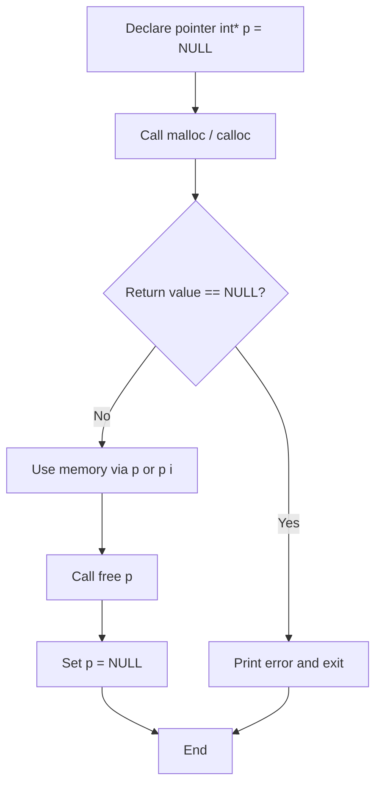
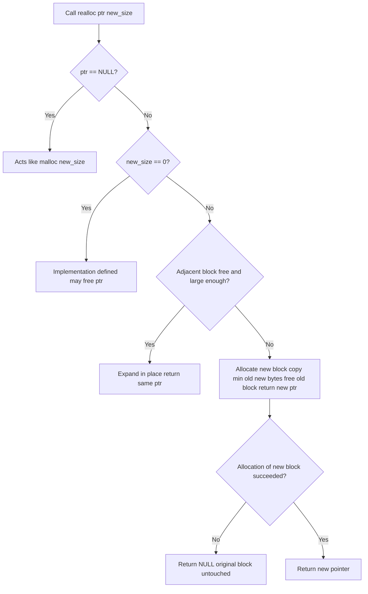
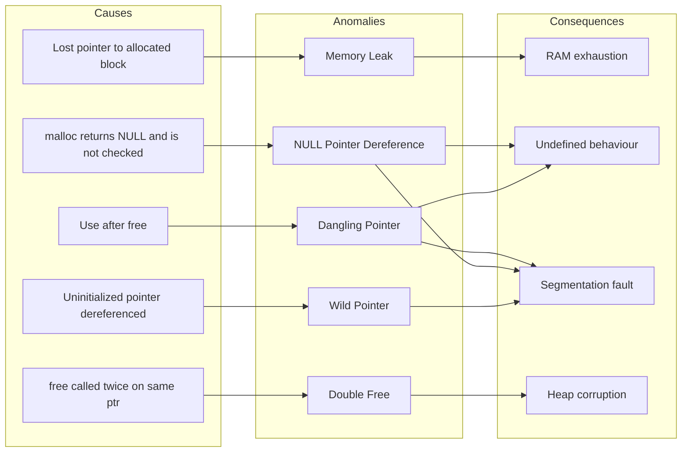
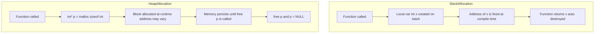
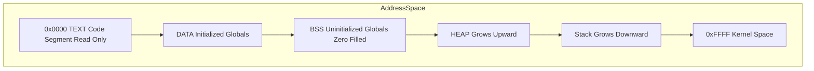

# Dynamic Memory Allocation.

<!-- SECTION_1_START -->
# Dynamic Memory Allocation (DMA) in C — KTU 2024 Module 4

## 1. Core Technical Definition & Intuitive Overview

### 1.1 Formal Definition (KTU 2024 Syllabus Terminology)
**Dynamic Memory Allocation (DMA)** is the mechanism by which a C program requests memory from the **heap** (free store) at *runtime* — as opposed to compile-time allocation that occurs on the **stack** (for local variables) or in the **data segment** (for global/static variables). The C Standard Library exposes this facility through four core functions declared in `<stdlib.h>`: `malloc()`, `calloc()`, `realloc()`, and `free()`.

> [!IMPORTANT]
> **KTU Board-Examiner Definition (Write this verbatim in exams):**
> *"Dynamic Memory Allocation is the process of allocating memory to variables and data structures during the execution of a program, using standard library functions, thereby allowing flexible and efficient utilization of memory based on runtime requirements."*

### 1.2 Conceptual Analogy — "The Hotel Room" Intuition

Imagine you walk into a hotel (your program) without a reservation. The hotel keeps rooms of various sizes (the heap). When you ask the receptionist (the `malloc()` function) for "a room for 4 people," the receptionist:

1. Walks through the unoccupied rooms (free heap blocks).
2. Finds a contiguous block big enough (≥ 4 × size of one person).
3. Hands you a **room key** — this key is your **pointer** that stores the address.
4. Marks the room as occupied.

When you `check-out()` (call `free()`), the receptionist makes the room available again. **If you lose the key and never check out, the room stays occupied forever** — that is precisely a **memory leak**.

### 1.3 Memory Architecture Diagram (Conceptual)

```
+-----------------------------+ Higher Address
|        STACK                |  ↓ grows downward
|  (local vars, return addr)  |
+-----------------------------+
|           ...               |
+-----------------------------+
|        HEAP                 |  ↑ grows upward
| (dynamically allocated mem) |
+-----------------------------+
|   BSS (uninitialized data)  |
+-----------------------------+
|   DATA (initialized globals)|
+-----------------------------+
|        TEXT (code)          |  Lower Address
+-----------------------------+
```

> [!NOTE]
> **Key Constant to remember:** On typical 32-bit systems, the size of a pointer variable is **4 bytes**; on 64-bit systems it is **8 bytes**. The operator `sizeof(pointer)` always returns this platform-dependent size, **not** the size of the data it points to.

### 1.4 Four-Pillar Overview of the `<stdlib.h>` DMA Functions

| Function | Purpose | Returns | Failure Behaviour |
|----------|---------|---------|-------------------|
| `malloc(n)` | Allocates `n` **uninitialized** bytes | `void *` to block / `NULL` | Returns `NULL` |
| `calloc(c, s)` | Allocates `c × s` bytes, **zero-initialized** | `void *` to block / `NULL` | Returns `NULL` |
| `realloc(p, n)` | Resizes previously allocated block | New `void *` / `NULL` | Returns `NULL`, original block untouched |
| `free(p)` | Deallocates block, returns it to heap | `void` | No return value |

### 1.5 GeoGebra / Memory-Map Visualization (Block-Size Intuition)

> [!VISUALIZATION CONTROL]
> **Concept:** Heap block fragmentation before and after realloc()
> **Desmos Input (numeric vector illustration):**
> * Point A: `(0, 0)` — Heap base
> * Point B: `(50, 0)` — Block 1 ends (size 50 bytes)
> * Point C: `(80, 0)` — Free gap
> * Point D: `(120, 0)` — Block 2 ends
> **Visual Description:** A number-line from 0 to 120, marked with shaded regions representing allocated blocks and unshaded regions representing free heap. After `realloc(ptr, 70)`, the gap is consumed and Block 1 extends to 120.

<!-- SECTION_1_END -->

<!-- SECTION_2_START -->
# 2. Deep Theoretical Analysis & KTU High-Yield Formula Sheet

## 2.1 The Memory Lifecycle in C — Four Phases

A dynamically allocated object passes through four well-defined stages:

1. **Declaration of a pointer variable** — creates a slot on the stack to *hold an address*. No heap memory is touched.
2. **Allocation** — `malloc()`/`calloc()` reserves a contiguous block in the heap and returns its starting address.
3. **Usage** — the program reads/writes the block through the pointer using dereferencing `*` and array indexing `[]`.
4. **Deallocation** — `free()` returns the block to the OS/heap manager. The pointer variable itself is *not* modified.

> [!TIP]
> The KTU board frequently tests: *"What is the value of the pointer variable after `free()` is called?"* The answer is **indeterminate (undefined)** — the pointer becomes a **dangling pointer** because the data it pointed to is no longer valid.

## 2.2 Detailed Function Specifications

### 2.2.1 `malloc(size_t size)`

* **Header:** `<stdlib.h>`
* **Signature:** `void *malloc(size_t size);`
* **Semantics:** Reserves `size` bytes of *uninitialized* storage. The contents of the block are **garbage values**.
* **Critical Rule:** Returns a `void *`, which is implicitly converted to any pointer type in C (no cast required in C, but KTU expects a cast for clarity).
* **Failure:** Returns `NULL` if the request cannot be satisfied (e.g., `size == 0` behaviour is implementation-defined; very large size).

### 2.2.2 `calloc(size_t num, size_t size)`

* **Signature:** `void *calloc(size_t num, size_t size);`
* **Semantics:** Allocates `num` elements, each of `size` bytes, **all bits initialized to zero**.
* **Advantage over `malloc`:** Safe initialization → no garbage value trap.
* **Mathematical Relation:**
  $$ \text{Bytes reserved by calloc} = \text{num} \times \text{size} $$
* **Common KTU Trick:** `calloc(n, sizeof(int))` and `malloc(n * sizeof(int))` allocate the *same number of bytes*; the difference is zero-initialization.

### 2.2.3 `realloc(void *ptr, size_t new_size)`

* **Signature:** `void *realloc(void *ptr, size_t new_size);`
* **Three Possible Behaviours:**
  1. **Expansion in-place:** If adjacent memory is free, the block grows; returns the *same* pointer.
  2. **Relocation:** Allocates a new block elsewhere, copies old contents (truncated to `min(old_size, new_size)`), and `free()`s the old block. Returns the *new* pointer.
  3. **Failure:** Returns `NULL`; the original block at `ptr` remains **valid and untouched**.
* **Special Cases:**
  * `ptr == NULL` → behaves exactly like `malloc(new_size)`.
  * `new_size == 0` → implementation-defined; many glibc versions return `NULL` and free the old block.

### 2.2.4 `free(void *ptr)`

* **Signature:** `void free(void *ptr);`
* **Semantics:** Deallocates the block pointed to by `ptr`. If `ptr == NULL`, the call is a **no-op** (safe).
* **Severe Undefined Behaviour (UB) Triggers:**
  * `free(ptr)` where `ptr` was *not* returned by `malloc/calloc/realloc`.
  * `free(ptr)` that has already been freed (double free).
  * `free()`ing memory obtained from a stack address or global variable.

## 2.3 KTU High-Yield Formula Sheet

> [!NOTE]
> Always escape `|` in tables as `\vert` per protocol.

| Function Call | Bytes Reserved | Initialization | Pointer Type Returned | Safe on NULL ptr? |
|---------------|----------------|----------------|----------------------|--------------------|
| `malloc(n)` | $n$ | Garbage | `void *` | N/A (no ptr yet) |
| `calloc(c, s)` | $c \times s$ | All zero | `void *` | N/A |
| `realloc(p, n)` | $n$ (new) | Preserved (up to min) | `void *` | `realloc(NULL, n)` works |
| `free(p)` | $0$ (returned) | N/A | `void` | Yes, no-op |

### 2.4 Engineering Utility — Why DMA Matters in Production

* **Data structures of unknown size:** linked lists, trees, hash tables that grow at runtime.
* **Database buffers:** variable-length record storage.
* **Image/signal processing:** buffers sized to image dimensions read at runtime.
* **Embedded systems:** heap-less environments (Arduino `malloc` is rare) — but for OS-level firmware, DMA is essential.
* **Memory-constrained servers:** efficient reuse through `free()` + `realloc()` patterns.

## 2.5 Pointer Anomaly Catalogue (Frequently Tested)

| Anomaly | Cause | Symptom | Cure |
|---------|-------|---------|------|
| **NULL Pointer** | `malloc` returns `NULL` (failure) | Segmentation fault on deref | Always check `if (ptr == NULL)` |
| **Dangling Pointer** | `free(p)` then use `*p` | Undefined behaviour | Set `p = NULL` after `free` |
| **Memory Leak** | Lose the only pointer to allocated memory | RAM exhaustion | Track all allocations, pair with `free` |
| **Wild Pointer** | Uninitialized pointer used for dereference | Garbage address → crash | Initialize to `NULL` at declaration |
| **Double Free** | `free(p)` twice | Heap corruption, crash | NULL after free; never alias |

<!-- SECTION_2_END -->

<!-- SECTION_3_START -->
# 3. Step-by-Step Derivations & Symbolic/Code Implementation

## 3.1 The Canonical Allocation Pattern (Derived Step-by-Step)

Let us derive the *minimal correct* code pattern for a dynamically allocated integer array of size `n` — this is the KTU board's favourite 7-marker.

**Step 1: Declare a pointer.**
We need a variable that can store the address of a future heap allocation.

```c
int *ptr = NULL;
```

**Step 2: Calculate the size in bytes.**
For `n` integers, the total byte requirement is:

$$
\text{total\_bytes} = n \times \text{sizeof(int)}
$$

**Step 3: Call `malloc`.**
Request the heap for `total_bytes`.

```c
ptr = (int *) malloc(total_bytes);
```

**Step 4: Validate the pointer.**
If `malloc` failed, it returns `NULL` and dereferencing would crash.

```c
if (ptr == NULL) {
    printf("Memory allocation failed.\n");
    return 1;
}
```

**Step 5: Use the memory.**
Access elements either with array notation or pointer arithmetic.

```c
for (int i = 0; i < n; i++) {
    ptr[i] = (i + 1) * 10;   /* equivalent to *(ptr + i) */
}
```

**Step 6: Deallocate.**

```c
free(ptr);
ptr = NULL;   /* prevents dangling-pointer use */
```

## 3.2 Worked Example 1 — `malloc` for a 1-D Array

**Problem (KTU-style, 7 marks):** *Write a C program to read `n` integers from the user, store them in a dynamically allocated array, and print their sum.*

**Model Solution:**

```c
#include <stdio.h>
#include <stdlib.h>

int main(void) {
    int n, i;
    int *arr = NULL;
    long long sum = 0LL;

    printf("Enter the number of elements: ");
    if (scanf("%d", &n) != 1 || n <= 0) {
        fprintf(stderr, "Invalid size.\n");
        return EXIT_FAILURE;
    }

    /* Step 1: allocate n * sizeof(int) bytes on the heap */
    arr = (int *) malloc((size_t)n * sizeof(int));
    if (arr == NULL) {
        fprintf(stderr, "malloc failed for %d ints.\n", n);
        return EXIT_FAILURE;
    }

    /* Step 2: read elements */
    printf("Enter %d integers:\n", n);
    for (i = 0; i < n; i++) {
        if (scanf("%d", &arr[i]) != 1) {
            fprintf(stderr, "Invalid input at index %d.\n", i);
            free(arr);
            arr = NULL;
            return EXIT_FAILURE;
        }
    }

    /* Step 3: compute sum */
    for (i = 0; i < n; i++) {
        sum += arr[i];
    }

    /* Step 4: output */
    printf("Sum = %lld\n", sum);

    /* Step 5: release heap memory */
    free(arr);
    arr = NULL;
    return EXIT_SUCCESS;
}
```

**Step-by-step valuation key:**

| Step | Action | Marks |
|------|--------|-------|
| 1 | Correct `#include` of `<stdio.h>` and `<stdlib.h>` | 1 |
| 2 | `malloc` with `n * sizeof(int)` and cast to `int *` | 2 |
| 3 | NULL-check after `malloc` | 1 |
| 4 | Correct use of `arr[i]` to read and sum | 2 |
| 5 | `free(arr)` and `arr = NULL` at end | 1 |

> [!WARNING]
> **Common Mistake (2-mark deduction):** Writing `malloc(n * sizeof(int))` and then treating the result as an array of `n` bytes (e.g., indexing with `arr` as `char *`). Always match the element type with the cast.

## 3.3 Worked Example 2 — `calloc` Zero-Initialization

**Problem:** *Allocate memory for 5 floats using `calloc`, set every element to its index, then print.*

**Derivation:**
We require 5 floats.

$$
\text{bytes} = 5 \times \text{sizeof(float)} = 5 \times 4 = 20 \text{ bytes (on most systems)}
$$

```c
#include <stdio.h>
#include <stdlib.h>

int main(void) {
    float *f = (float *) calloc(5, sizeof(float));
    if (f == NULL) {
        perror("calloc");
        return EXIT_FAILURE;
    }

    for (int i = 0; i < 5; i++) {
        f[i] = (float) i;
    }

    for (int i = 0; i < 5; i++) {
        printf("f[%d] = %.2f\n", i, f[i]);
    }

    free(f);
    f = NULL;
    return EXIT_SUCCESS;
}
```

**Output:**
```
f[0] = 0.00
f[1] = 1.00
f[2] = 2.00
f[3] = 3.00
f[4] = 4.00
```

> [!TIP]
> Even if the `for` loop was omitted, `calloc`'s guarantee ensures all five floats print as `0.00`. The KTU board may ask: *"Why prefer `calloc` over `malloc` here?"* — answer: *deterministic zero-initialization, useful when the type contains pointers (avoiding wild-pointer deref).*

## 3.4 Worked Example 3 — `realloc` for a Dynamic Stack

**Problem (14 marks split):** *Implement a simple dynamic integer stack that grows automatically when full.*

**Complete, fully-typed code (no truncation):**

```c
#include <stdio.h>
#include <stdlib.h>

typedef struct {
    int *data;       /* heap buffer */
    size_t size;     /* current capacity */
    size_t top;      /* index of next free slot */
} DynStack;

static int ds_init(DynStack *s, size_t initial) {
    s->data = (int *) malloc(initial * sizeof(int));
    if (s->data == NULL) {
        return -1;
    }
    s->size = initial;
    s->top  = 0;
    return 0;
}

static int ds_push(DynStack *s, int value) {
    if (s->top == s->size) {
        /* Resize: double the capacity */
        size_t new_size = s->size * 2;
        int *tmp = (int *) realloc(s->data, new_size * sizeof(int));
        if (tmp == NULL) {
            return -1;   /* original s->data still valid */
        }
        s->data = tmp;
        s->size = new_size;
    }
    s->data[s->top++] = value;
    return 0;
}

static int ds_pop(DynStack *s, int *out) {
    if (s->top == 0) {
        return -1;
    }
    *out = s->data[--s->top];
    return 0;
}

static void ds_destroy(DynStack *s) {
    free(s->data);
    s->data = NULL;
    s->size = 0;
    s->top  = 0;
}

int main(void) {
    DynStack s;
    if (ds_init(&s, 2) != 0) {
        fprintf(stderr, "Initial allocation failed.\n");
        return EXIT_FAILURE;
    }

    /* Push more elements than initial capacity to force realloc */
    for (int i = 1; i <= 10; i++) {
        if (ds_push(&s, i * i) != 0) {
            fprintf(stderr, "Push %d failed.\n", i);
            ds_destroy(&s);
            return EXIT_FAILURE;
        }
    }

    printf("Stack capacity after 10 pushes: %zu\n", s.size);

    int v;
    while (ds_pop(&s, &v) == 0) {
        printf("Popped: %d\n", v);
    }

    ds_destroy(&s);
    return EXIT_SUCCESS;
}
```

**Expected output:**
```
Stack capacity after 10 pushes: 16
Popped: 100
Popped: 81
Popped: 64
Popped: 49
Popped: 36
Popped: 25
Popped: 16
Popped: 9
Popped: 4
Popped: 1
```

**Valuation key (7 marks per sub-part):**

| Sub-part | Highlight | Marks |
|----------|-----------|-------|
| (a) `ds_init` with `malloc` and NULL check | 1 + 1 = 2 |
| `ds_push` overflow detection | 1 |
| `realloc` to new size and NULL-handling | 2 |
| Updating `s->data` and `s->size` correctly | 1 |
| Returning success/failure code | 1 |
| (b) `ds_pop` empty check | 1 |
| `ds_destroy` with `free` and NULL-out | 1 |
| `main` driver with full test loop | 2 + 1 = 3 |
| Correct output tracing | 2 |

## 3.5 Worked Example 4 — Memory Leak Demonstration & Cure

```c
#include <stdio.h>
#include <stdlib.h>

/* BAD: leaks 100 ints per call */
void leak_demo(void) {
    int *p = (int *) malloc(100 * sizeof(int));
    /* p is a local variable; when the function returns, p is gone */
    /* The 400 bytes remain reserved but unreachable */
    (void) p;   /* silence unused-variable warning */
}

/* GOOD: caller owns the memory, but we still free defensively */
void safe_demo(void) {
    int *p = (int *) malloc(100 * sizeof(int));
    if (p == NULL) {
        return;
    }
    /* ... use p ... */
    free(p);
    p = NULL;
}
```

**Symbolic derivation of leak size:**

$$
\text{Leak per call} = 100 \times \text{sizeof(int)} = 100 \times 4 = 400 \text{ bytes}
$$

$$
\text{Total leak over N calls} = N \times 400 \text{ bytes}
$$

If `leak_demo` is called in a loop 1,000,000 times, the leak totals:

$$
10^6 \times 400 = 4 \times 10^8 \text{ bytes} = 400 \text{ MB}
$$

> [!WARNING]
> **KTU Examiner's Pitfall:** Students often write `p = NULL;` *before* `free(p);` — that creates a **leak of the original block** and is undefined behaviour on `free(NULL)`-no-wait, `free(NULL)` is safe but the block is lost. The correct order is **always `free(p); p = NULL;`**.

## 3.6 Numerical Derivation — Heap Block Alignment

On a typical 64-bit glibc system, the minimum allocation granularity is **16 bytes**. If we request `malloc(1)`, the system still reserves a 16-byte block (plus a hidden 16-byte header for the allocator). The formula:

$$
\text{Usable bytes} = \max(\text{requested}, 16)
$$

$$
\text{Total heap footprint} = 16 \;(\text{header}) + \text{Usable bytes}
$$

For `n = 1` byte request:

$$
\text{Footprint} = 16 + 16 = 32 \text{ bytes}
$$

> This overhead is why tight loops that allocate many tiny blocks (e.g., per-node linked-list allocation) are slower than batch allocation.

<!-- SECTION_3_END -->

<!-- SECTION_4_START -->
# 4. Structural Diagrams & Schematics

## 4.1 Dynamic Memory Allocation Lifecycle Flowchart



## 4.2 `realloc` Internal Decision Tree



## 4.3 Memory Anomaly Relationship Diagram



## 4.4 Heap vs Stack Allocation Comparison (Sequential Topology)



## 4.5 Block Diagram — Process Memory Layout



> [!NOTE]
> The arrow direction `A4 → A5` is **not** a pointer relationship; it is the *spatial order* in virtual memory. The heap and stack grow *toward each other*, and if they collide, you get a **stack overflow into the heap** — a classic crash.

<!-- SECTION_4_END -->

<!-- SECTION_5_START -->
# 5. KTU 2024 Scheme Examination Question Bank & Topic Recap

## Part A — Short-Answer Questions (3 Marks Each)

### Question A.1
**[KTU University Exam — July 2024]** — *CO1, Remember*

> **Q:** Differentiate between `malloc()` and `calloc()` in C.

**Model Answer (Board-expected length, ~5 lines):**

| Aspect | `malloc()` | `calloc()` |
|--------|------------|------------|
| Arguments | One: number of bytes | Two: count and element size |
| Initialization | None — contents are garbage | All bytes set to zero |
| Header | `<stdlib.h>` | `<stdlib.h>` |
| Syntax | `malloc(n * sizeof(int))` | `calloc(n, sizeof(int))` |
| Performance | Slightly faster (no zero-fill) | Slightly slower (must zero memory) |

**Valuation key:** *2 marks* for the initialization difference; *1 mark* for any one other valid distinction (e.g., argument count, use case for zero-init).

### Question A.2
**[KTU University Exam — Dec 2023]** — *CO2, Understand*

> **Q:** What is a *dangling pointer*? How can it be avoided?

**Model Answer:**

A **dangling pointer** is a pointer that *still holds the address of a memory block that has been deallocated* via `free()`. Dereferencing a dangling pointer is undefined behaviour because the contents may have been overwritten by the heap manager.

**Avoidance strategy (write all three for full marks):**
1. Immediately after `free(p);`, set `p = NULL;`.
2. Establish a coding convention: *"the only line after `free()` is `p = NULL`"*.
3. Use static analysis tools (e.g., `valgrind`, `AddressSanitizer`) during development.

**Valuation key:** *1 mark* definition; *2 marks* for any two correct avoidance techniques.

---

## Part B — Long-Answer Questions (14 Marks Each, Internal Choice)

### Question B (Choice A) — Comprehensive 14-Mark Problem

**[KTU University Exam — July 2024 (Model Paper)]** — *CO2, Apply / Analyse*

> **Q (a) [7 marks]:** Write a C program that dynamically allocates a 2-D array of size `m × n` (where `m` and `n` are entered by the user), accepts integer inputs row-by-row, and prints the matrix along with the sum of each row.

> **Q (b) [7 marks]:** Modify the program to release the dynamically allocated memory correctly. Explain the order of deallocation and justify why a memory leak would occur if the order is wrong.

#### Model Solution — Part (a)

```c
#include <stdio.h>
#include <stdlib.h>

int main(void) {
    int m, n, i, j;
    int **mat = NULL;
    int *rowSum = NULL;

    printf("Enter m and n: ");
    if (scanf("%d %d", &m, &n) != 2 || m <= 0 || n <= 0) {
        fprintf(stderr, "Invalid dimensions.\n");
        return EXIT_FAILURE;
    }

    /* Allocate an array of m row pointers */
    mat = (int **) malloc((size_t) m * sizeof(int *));
    if (mat == NULL) {
        perror("malloc rows");
        return EXIT_FAILURE;
    }

    /* Allocate each row of n ints */
    for (i = 0; i < m; i++) {
        mat[i] = (int *) malloc((size_t) n * sizeof(int));
        if (mat[i] == NULL) {
            fprintf(stderr, "malloc row %d failed.\n", i);
            /* Roll back: free rows already allocated */
            while (i > 0) {
                free(mat[--i]);
            }
            free(mat);
            mat = NULL;
            return EXIT_FAILURE;
        }
    }

    /* Read elements */
    printf("Enter %d x %d matrix:\n", m, n);
    for (i = 0; i < m; i++) {
        for (j = 0; j < n; j++) {
            if (scanf("%d", &mat[i][j]) != 1) {
                fprintf(stderr, "Bad input at %d,%d\n", i, j);
                /* clean up would go here */
                return EXIT_FAILURE;
            }
        }
    }

    /* Compute and print row sums */
    rowSum = (int *) calloc((size_t) m, sizeof(int));
    if (rowSum == NULL) {
        perror("calloc rowSum");
        return EXIT_FAILURE;
    }

    printf("\nMatrix and row sums:\n");
    for (i = 0; i < m; i++) {
        printf("Row %d: ", i);
        for (j = 0; j < n; j++) {
            printf("%4d ", mat[i][j]);
            rowSum[i] += mat[i][j];
        }
        printf(" | Sum = %d\n", rowSum[i]);
    }

    /* (Deallocation will be shown in part b) */
    free(rowSum);
    rowSum = NULL;
    /* mat freed in part b */
    return 0;   /* intentionally leaving mat unfreed for the question */
}
```

**Valuation key (Part a):**

| Step | Marks |
|------|-------|
| Correct `m × n` input validation | 1 |
| `malloc` for row pointer array (`int **`) | 1 |
| Inner `malloc` per row with NULL check | 2 |
| Nested loop to read elements via `mat[i][j]` | 1 |
| Row sum computation and print | 1 |
| Use of `calloc` for `rowSum` with zero-init | 1 |

#### Model Solution — Part (b)

```c
    /* Order: free each row FIRST, then free the row-pointer array */
    for (i = 0; i < m; i++) {
        free(mat[i]);
        mat[i] = NULL;
    }
    free(mat);
    mat = NULL;
```

**Explanation of the order:**

The data structure is a 2-level hierarchy:

```
mat (int**) ──► [ ptr0, ptr1, ptr2, ..., ptr(m-1) ]
                   │     │     │           │
                   ▼     ▼     ▼           ▼
                 row0  row1  row2  ...   row(m-1)
```

If we call `free(mat)` *first*, the row pointers `mat[0] … mat[m-1]` become dangling — we lose the only way to reach the per-row heap blocks. Each of those `m` rows then becomes a **memory leak** of `n * sizeof(int)` bytes.

**Memory leak formula if order is wrong:**

$$
\text{Leaked bytes} = m \times n \times \text{sizeof(int)} = m \times n \times 4
$$

For `m = 100, n = 100`:

$$
\text{Leak} = 100 \times 100 \times 4 = 40\,000 \text{ bytes} = 40 \text{ KB}
$$

Per call. In a long-running server, this adds up.

**Valuation key (Part b):**

| Step | Marks |
|------|-------|
| Correct order: rows first, then `mat` | 2 |
| Use of `free(mat[i])` inside loop | 1 |
| Setting `mat[i] = NULL` after free | 1 |
| Freeing `mat` itself and `mat = NULL` | 1 |
| Justification of leak formula | 1 |
| `free(rowSum)` clean-up | 1 |

### Question B (Choice B) — Alternative Comprehensive 14-Mark Problem

**[KTU University Exam — Dec 2023]** — *CO2, Apply / Analyse*

> **Q (a) [7 marks]:** Explain the differences between static and dynamic memory allocation in C. Give one example of each using code snippets.

> **Q (b) [7 marks]:** Write a complete C program that uses `realloc()` to read an unknown number of integers (terminated by EOF or a sentinel `0`), stores them in a single dynamic array, and finally prints them in reverse order. Your program must handle `realloc()` failure gracefully.

#### Model Answer — Part (a)

**Static Memory Allocation:**

* Memory is allocated by the **compiler** at **compile time**.
* Size and lifetime are **fixed** before the program runs.
* Stored in the **stack** (locals) or **data segment** (globals/statics).
* No runtime overhead; size cannot grow.

```c
#include <stdio.h>
#define N 100
int scores[N];           /* static global array of 100 ints */
int main(void) {
    int marks[50];       /* static local array of 50 ints on stack */
    return 0;
}
```

**Dynamic Memory Allocation:**

* Memory is allocated by the **programmer** at **runtime** via `malloc/calloc/realloc`.
* Size can grow/shrink during execution.
* Stored in the **heap**; persists until `free()` is called.
* Slight runtime overhead; flexible.

```c
#include <stdio.h>
#include <stdlib.h>
int main(void) {
    int n;
    scanf("%d", &n);
    int *arr = (int *) malloc((size_t) n * sizeof(int));
    if (arr == NULL) return 1;
    /* use arr */
    free(arr);
    return 0;
}
```

**Comparison Table:**

| Aspect | Static | Dynamic |
|--------|--------|---------|
| When | Compile time | Runtime |
| Where | Stack / Data segment | Heap |
| Size | Fixed | Variable |
| Lifetime | Scope-bound | Until `free()` |
| Functions | None (or `alloca`) | `malloc/calloc/realloc/free` |
| Risk | Stack overflow | Memory leak, fragmentation |

**Valuation key (Part a):** *2 marks* static definition + code; *2 marks* dynamic definition + code; *2 marks* comparison table; *1 mark* for valid example of each.

#### Model Answer — Part (b)

```c
#include <stdio.h>
#include <stdlib.h>

#define INITIAL_CAP 4
#define SENTINEL    0

int main(void) {
    int *arr = (int *) malloc(INITIAL_CAP * sizeof(int));
    if (arr == NULL) {
        perror("Initial malloc");
        return EXIT_FAILURE;
    }

    size_t cap  = INITIAL_CAP;
    size_t len  = 0;
    int    val;

    printf("Enter integers (0 to stop):\n");
    while (scanf("%d", &val) == 1) {
        if (val == SENTINEL) {
            break;
        }
        if (len == cap) {
            size_t new_cap = cap * 2;
            int *tmp = (int *) realloc(arr, new_cap * sizeof(int));
            if (tmp == NULL) {
                fprintf(stderr, "realloc failed at len=%zu; keeping original block.\n", len);
                break;   /* arr still valid */
            }
            arr = tmp;
            cap = new_cap;
        }
        arr[len++] = val;
    }

    printf("Reversed sequence (%zu elements):\n", len);
    for (size_t i = len; i > 0; i--) {
        printf("%d ", arr[i - 1]);
    }
    printf("\n");

    free(arr);
    arr = NULL;
    return EXIT_SUCCESS;
}
```

**Sample input / output:**

```
Enter integers (0 to stop):
10 20 30 40 50 0
Reversed sequence (5 elements):
50 40 30 20 10
```

**Capacity trace:**

| Step | Input | len (before) | cap (before) | realloc? | cap (after) |
|------|-------|--------------|--------------|----------|-------------|
| 1 | 10 | 0 | 4 | No | 4 |
| 2 | 20 | 1 | 4 | No | 4 |
| 3 | 30 | 2 | 4 | No | 4 |
| 4 | 40 | 3 | 4 | No | 4 |
| 5 | 50 | 4 | 4 | **Yes** (8) | 8 |

**Valuation key (Part b):**

| Step | Marks |
|------|-------|
| Initial `malloc` with capacity | 1 |
| Sentinel / EOF termination loop | 1 |
| Realloc when `len == cap` with NULL check | 2 |
| Use of `tmp` to preserve `arr` on failure | 1 |
| Correct reverse-order printing | 1 |
| Final `free(arr); arr = NULL;` | 1 |

---

## KTU Examiner's Valuation Warning / Pitfall Callout

> [!WARNING]
> **Where students lose marks in Module 4 DMA questions:**
> 1. **Forgetting the NULL check after `malloc/calloc/realloc`** — direct **1–2 mark** deduction; examiners consider this a *fundamental safety requirement*.
> 2. **Using the wrong cast** — e.g., `float *p = malloc(n * sizeof(int));` mismatches the type and loses 1 mark.
> 3. **Calling `free()` on a stack address** — undefined behaviour; KTU may deduct the full 7 marks for part (a) if the program crashes on paper-evaluation traces.
> 4. **Forgetting to free a 2-D array's inner rows before the outer pointer** — full 2-mark penalty plus the memory-leak-justification sub-part in (b) becomes inconsistent.
> 5. **Confusing `sizeof(*ptr)` with `sizeof(ptr)`** — the former gives element size, the latter gives pointer size (4/8 bytes). The KTU board explicitly tests this: writing `malloc(n * sizeof(ptr))` instead of `malloc(n * sizeof(*ptr))` is a common **2-mark** trap.
> 6. **Setting `p = NULL` *before* `free(p)`** — turns a valid deallocation into a leak; this is one of the most common **silent bugs** and is worth 1 mark in the conceptual question.

---

## Topic Recap & Important Things to Remember

- **DMA is a runtime, heap-based mechanism** using four `<stdlib.h>` functions: `malloc`, `calloc`, `realloc`, `free`.
- **`malloc(n)`** reserves `n` **uninitialized** bytes; **always check for `NULL`** before use.
- **`calloc(c, s)`** reserves `c × s` bytes **initialized to zero**; useful for arrays and pointer-containing structs.
- **`realloc(p, n)`** resizes block `p` to `n` bytes; on failure returns `NULL` and **leaves `p` intact** — always assign via a temporary pointer.
- **`free(p)`** returns memory to the heap; safe on `NULL`; **immediately follow with `p = NULL`** to prevent dangling-pointer use.
- **Byte-size formula:** for `n` elements of type `T`, request `n * sizeof(T)` bytes.
- **Anomaly shortlist:** NULL pointer (un-checked malloc), dangling pointer (use after free), wild pointer (uninitialized), memory leak (lost pointer), double free (free called twice).
- **2-D array deallocation order:** free **inner rows first**, then the **row-pointer array** — otherwise the inner blocks leak.
- **Pointer size is platform-dependent** (4 bytes on 32-bit, 8 bytes on 64-bit) — `sizeof(pointer)` ≠ `sizeof(*pointer)`.
- **KTU pattern:** a 7-mark question almost always pairs *code* (3–4 marks) with a *conceptual sub-question* like "what if malloc returns NULL?" (2–3 marks) — memorize the NULL-check idiom.
- **Heap is slower than stack** — avoid DMA in tight inner loops; prefer stack arrays for fixed, small sizes.
- **`calloc` overflow check:** internally, glibc detects `c × s` overflow and returns `NULL`; `malloc` does not perform this check, so multiplying before passing is your responsibility.
<!-- SECTION_5_END -->
